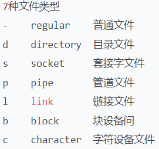
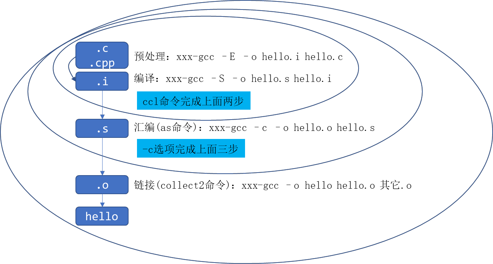
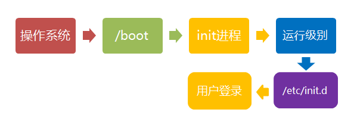

# Linux初识

Ubuntu中国官网：[***\*https://cn.ubuntu.com/download/desktop\****](https://cn.ubuntu.com/download/desktop)

gdb.exe  调试文件


## 0、名词

### 0.0 名词

##### NFS   Network File System

NFS 指的是 Network File System，是一种**分布式文件系统协议**，允许网络中的计算机之间共享文件和目录。通过 NFS，一台计算机（通常被称为服务器）可以将本地的文件系统资源共享给其他计算机（通常被称为客户端）使用，就好像这些文件和目录是本地的一样。

NFS 提供了一种非常灵活的方法，使得远程计算机可以访问和处理另一台计算机上的文件，从而实现了文件共享和协作。它通常用于以下一些场景：

1. **集中式存储：** 将文件存储在一个中心位置，让所有客户端共享使用。
2. **资源共享：** 允许多台计算机共享相同的文件和目录，方便团队合作和共享。
3. **数据备份：** 在网络中备份文件并创建多个副本，以提高数据的安全性和持久性。

在 Linux 系统中，NFS 的支持允许你在运行级别 2（多用户状态）中共享文件系统，从而使得多台计算机可以在网络上共享文件和资源。因此，NFS 对于多用户环境下的文件共享和协作具有重要的作用。

BIOS

"基本輸出輸入系統"（Basic Input/Output System），简称为[BIOS](https://en.wikipedia.org/wiki/BIOS)。

BIOS程序首先检查，计算机硬件能否满足运行的基本条件，这叫做"硬件自检"（Power-On Self-Test），缩写为[POST](https://en.wikipedia.org/wiki/Power-on_self-test)。
如果硬件出现问题，主板会发出不同含义的[蜂鸣](https://en.wikipedia.org/wiki/Power-on_self-test#Original_IBM_POST_beep_codes)，启动中止。如果没有问题，屏幕就会显示出CPU、内存、硬盘等信息。


### 由来

https://opensource.com/article/18/5/differences-between-linux-and-unix

https://opensource.com/resources/linux

#### Unix

Unix, BSD, GNU, Linux 等等概念都起源于最初由贝尔实验室（1960 年代，AT&T 拥有期间）编写的操作系统：Unix。

Unix 最初的设计目标是多任务多用户的 C 语言操作系统。在发行之后，Unix 的易移植性及其独特的[设计哲学](https://link.juejin.cn?target=https%3A%2F%2Fen.wikipedia.org%2Fwiki%2FUnix_philosophy)使它很快吸引了社会各界的关注，但 Unix 并不是开源的，AT&T 公司通过颁发许可证的方式授权其他人使用 Unix。

Unix 的**理念**建议将小型的、专门构建的程序组合在一起来完成复杂的整体任务。由于Unix是围绕文件和管道设计的，因此这种将程序的输入和输出“管道”组合成一组线性输入操作的模型今天仍然很流行。事实上，当前的云无服务器计算模型很大程度上归功于Unix哲学。

#### BSD

随着 Unix 在学术界的影响越来越大，伯克利逐渐成为围绕 Unix 展开的学术活动的中心。70 年代，随着 Unix 的不断发展，一个新版本的软件在伯克利诞生了：BSD (Berkeley Software Distribution)。

最初，BSD并不是AT&T的Unix的替代品，而是一个具有附加软件和功能的附加组件。

BSD 是加州大学伯克利分校对 Unix 系统进行的扩展与重新发行，一些额外的工具与特性被添加到其中，包括著名的编辑器 vi。如 `vi` C shell（/bin/csh）。

如上所述，Unix 是闭源软件，版权归属于 AT&T，因此在 1989 到 1994 年间，BSD 社区重写了代码当中版权归属 AT&T 的部分，并开始以 [BSD 许可证](https://link.juejin.cn?target=https%3A%2F%2Fen.wikipedia.org%2Fwiki%2FBSD_licenses)发行，从此 BSD 成为开源软件。

BSD 开源之后，BSD 的变体迅速发展，从 386BSD 开始，到 FreeBSD, NetBSD，再由 NetBSD 发展出 OpenBSD (1993)，FreeBSD 发展出 DragonFly BSD (2003)，Apple 公司的 [MacOS](https://link.juejin.cn?target=https%3A%2F%2Fen.wikipedia.org%2Fwiki%2FMacOS) / [Darwin](https://link.juejin.cn?target=https%3A%2F%2Fen.wikipedia.org%2Fwiki%2FDarwin_(operating_system)) 也是基于 BSD 发展而来。

#### Unix 战争与 POSIX

在 BSD 大行其道的同时，Unix 的商业订单也在爆炸增长，IBM 公司的 AIX，Sun 公司的 Solaris，微软的 Xenix 等等发行版层出不穷，它们都是基于 Unix 研发的操作系统。AT&T 自己也在 Unix 的基础上开发了 System V。

发行版越来越多，社区和市场越来越混乱，自然而然地，制订标准势在必行，虽然 Unix 是 AT&T 发明的，但当时社区中最流行的发行版却是 BSD，同时商业巨头们也不愿完全服从 AT&T，在经历了数年的 [Unix 战争](https://link.juejin.cn?target=https%3A%2F%2Fen.wikipedia.org%2Fwiki%2FUnix_wars) 后，[POSIX (Portable Operating System Interface)](https://link.juejin.cn?target=https%3A%2F%2Fen.wikipedia.org%2Fwiki%2FPOSIX) 被确立下来。

POSIX 一开始只规范了部分 C 库函数（在即将到来的 C 语言标准范畴之外），后来扩展到其他系统环境层面。基于 Unix 的操作系统都约定遵循这一操作系统的 "最小公分母"。

#### GNU/Linux

在 BSD 陷入法律泥潭的时候（大约 1992 - 1994 年），有两个项目获得了快速的发展：GNU 和 Linux。

Richard Stallman 希望创建一个真正免费和开源的替代品来替代专有的 Unix 系统。

[GNU (GNU is Not Unix)](https://link.juejin.cn?target=https%3A%2F%2Fen.wikipedia.org%2Fwiki%2FGNU) 是由 [Richard Stallman, RMS](https://link.juejin.cn?target=https%3A%2F%2Fen.wikipedia.org%2Fwiki%2FRichard_Stallman) 创建的开源软件项目，包含了一个完整的操作系统 Hurd，及一系列软件，全部采用 [GPL (General Public License)](https://link.juejin.cn?target=https%3A%2F%2Fen.wikipedia.org%2Fwiki%2FGNU_General_Public_License) 许可证发行。
GNU 的东西还是很不错的，特别是使用得深了以后，越来越觉得 GNU 的软件的强大，也越来越觉得 GNU 的在操作系统中（主要是 Unix，甚至 Windows）"杀伤力"。  

[Linux](https://link.juejin.cn?target=https%3A%2F%2Fen.wikipedia.org%2Fwiki%2FLinux_kernel) 是由 [Linux Torvalds](https://link.juejin.cn?target=https%3A%2F%2Fen.wikipedia.org%2Fwiki%2FLinus_Torvalds) 创建的操作系统内核项目，同样采用 GPL 许可证发行。Linux 在创建之初便迅速博取了社区的关注，一方面使用 BSD 存在法律风险，同时 Hurd（属于 GNU）又迟迟不能发布，因此大家将 GNU 中的软件与 Linux 内核结合使用，这种方式逐渐流行，最终成为主流，也就是今天常见的 GNU/Linux，或者直接叫 Linux。

Linux 发行版通过 GNU、Linux 内核、MIT 的 X-Windows GUI 和其他可以在开源 BSD 许可下使用的 BSD 组件而诞生。

> 叫 GNU/Linux 和 Linux 有区别吗：[GNU/Linux naming controversy - Wikipedia](https://link.juejin.cn?target=https%3A%2F%2Fen.wikipedia.org%2Fwiki%2FGNU%2FLinux_naming_controversy)

**Linux 属于类 Unix 操作系统，因为 Linux 兼容了 POSIX。**

得益于开源协议，和 BSD 一样，在 Linux 基础上也发展出很多的变体，包括免费的 Fedora, Ubuntu (商业公司 Canonical 开发，但是免费), Debian, Arch Linux, Gentoo，以及商业发行版，如 Red Had 公司的 SUSE。

由于 POSIX 标准和合规性，在 Unix 上编写的软件可以针对 Linux 操作系统进行编译，而移植工作通常有限。在许多情况下，Shell 脚本可以直接在 Linux 上使用。虽然有些工具在 Unix 和 Linux 之间的标志/命令行选项略有不同，但许多工具在两者上的操作都相同。

Linux 和 Unix 之间的其余差异主要与许可模式有关：开源软件与专有许可软件。此外，Unix 发行版中缺乏通用内核也会对软件和硬件供应商产生影响。对于 Linux，供应商可以为特定硬件设备创建设备驱动程序，并期望在合理范围内，它将在大多数发行版中运行。由于 Unix 树的商业和学术分支，供应商可能必须为 Unix 的变体编写不同的驱动程序，并且具有与访问 SDK 或软件分发模型相关的许可和其他问题，作为跨许多 Unix 变体的二进制设备驱动程序。

随着这两个社区在过去十年中逐渐成熟，Linux 中的许多进步已被 Unix 世界采用。许多 GNU 实用程序作为 Unix 系统的附加组件提供，开发人员希望从 GNU 程序中获得不属于 Unix 的功能。例如，IBM 的 AIX 提供了一个 AIX Toolbox for Linux Applications，其中包含数百个 GNU 软件包（如 Bash、GCC、OpenLDAP 等），这些软件包可以添加到 AIX 安装中，以简化 Linux 和基于 Unix 的 AIX 系统之间的转换。

专有的Unix仍然活得很好，而且许多主要供应商承诺在2020年代支持他们的当前版本，不言而喻，Unix将在可预见的未来出现。此外，Unix 树的 BSD 分支是开源的，NetBSD、OpenBSD 和 FreeBSD 都拥有强大的用户群和开源社区，这些社区可能不像 Linux 那样可见或活跃，但在最近的服务器共享报告中保持了自己的地位，在 Web 服务等领域远远高于专有的 Unix 数量。

与专有的 Unix 相比，Linux 显示出显着的优势在于它在大量硬件平台和设备上的可用性。Raspberry Pi 深受业余爱好者和爱好者的欢迎，它是 Linux 驱动的，为运行 Linux 的整个物联网设备打开了大门。我们已经提到了 Android 设备、汽车（带有汽车级 Linux）和智能电视，Linux 在这些领域拥有很大的市场份额。地球上的每个云提供商都提供运行 Linux 的虚拟服务器，当今许多最流行的云原生堆栈都是基于 Linux 的，无论您是在谈论容器运行时、Kubernetes 还是许多越来越受欢迎的无服务器平台。

Linux优势最能说明问题的一个例子是Microsoft近年来的转型。如果你在十年前告诉软件开发人员，Windows操作系统将在2016年“运行Linux”，他们中的大多数人会歇斯底里地笑。但是，适用于 Linux 的 Windows 子系统 （WSL） 的存在和普及，以及最近宣布的 Docker 的 Windows 端口等功能，包括 LCOW（Windows 上的 Linux 容器）支持，都证明了 Linux 已经——而且显然将继续——在整个软件世界中产生影响。

#### 参考资料

[Linux vs. Unix: What's the difference? - Opensource.com](https://link.juejin.cn?target=https%3A%2F%2Fopensource.com%2Farticle%2F18%2F5%2Fdifferences-between-linux-and-unix)

[Unix wars - Wikipedia](https://link.juejin.cn?target=https%3A%2F%2Fen.wikipedia.org%2Fwiki%2FUnix_wars)

[What is the difference between Unix, Linux, BSD and GNU? - Unix & Linux Stack Exchange](https://link.juejin.cn?target=https%3A%2F%2Funix.stackexchange.com%2Fquestions%2F104714%2Fwhat-is-the-difference-between-unix-linux-bsd-and-gnu)

[4. Comparing BSD and Linux](https://link.juejin.cn?target=https%3A%2F%2Fwww.freebsd.org%2Fdoc%2Fen%2Farticles%2Fexplaining-bsd%2Fcomparing-bsd-and-linux.html)

作者：wbsnail
链接：https://juejin.cn/post/6859372970679533575
来源：稀土掘金
著作权归作者所有。商业转载请联系作者获得授权，非商业转载请注明出处。


## 1、了解

### 1.1 基础

一般来说 Ubuntu 下很多软件是需要先自行提供源码，使用源码自行编译，编译完成以后使用命令”install”来安装到系统中  

```C
install [选项 ]... [-T] 源文件 目标文件
install [选项 ]... 源文件 ... 目录
install [选项 ]... -t 目录 源文件 ... 
install [选项 ]... -d 目录 ...
```

“install” 命令是将文件 (通常是编译后的文件 )复制到目的位置，在上面得三种形式中，将源文件复制到目标文件或将多个源文件复制到一个已存在的目录中同时设置其所有权和权限模式。在第四种形式会创建指定的目录。命令“ install”通常和命令 apt-get”组合在一起使用的

```shell
# 备份原列表
sudo cp /etc/apt/sources.list /etc/apt/sources.list_backup
# 编辑
sudo vim /etc/apt/sources.list

# 阿里源（在前面添加下面代码）
deb http://mirrors.aliyun.com/Ubuntu/ bionic main restricted universe multiverse
deb http://mirrors.aliyun.com/Ubuntu/ bionic-security main restricted universe multiverse
deb http://mirrors.aliyun.com/Ubuntu/ bionic-updates main restricted universe multiverse
deb http://mirrors.aliyun.com/Ubuntu/ bionic-proposed main restricted universe multiverse
deb http://mirrors.aliyun.com/Ubuntu/ bionic-backports main restricted universe multiverse
```

简单配置

软件安装

#### mobaxterm 删除文件找回

连接mobaxterm：https://mobaxterm.mobatek.net/  （注意安装程序版）

```shell
# 修改命令行路径显示长度
PS1='$(pwd | sed -E "s|^/.*/([^/]+/[^/]+)$|\\[\e[34m\\].../\\1\\[\e[0m\\]|")\$ '
黑色：30
红色：31
绿色：32
黄色：33
蓝色：34
洋红：35
青色：36
白色：37
```

#### ctags 代码索引

1,在ubuntu安装ctags工具
sudo apt install ctags
2. 在/usr/include目录下生成一个关联文件
sudo ctags -R    
3. 在vim配置文件中添加关联文件路径
sudo   vim   /etc/vim/vimrc   在最后面添加
set  tags += /usr/include/tags
4. 用vim打开文件比如  vim   stdio.h
把光标移动要跳转的变量函数上， 按下ctrl+] 跳转，   按ctrl+o返回

1. 安装CTag
      – 使用apt：sudo apt-get install ctags
      – 使用yum：sudo yum install ctags

2. 生成索引文件
     安装完CTags后，可以使用以下命令生成代码的索引文件：
      – ctags -R：该命令会递归地遍历当前目录及其子目录，并生成索引文件。
      – ctags -R /path/to/dir：指定目录生成索引文件。

3. 使用CTags导航代码
      生成索引文件后，可以使用以下命令在代码中进行导航：
      – ctags -x：列出所有标签及其位置。
      – ctags -x pattern：根据模式匹配标签，列出匹配的标签及其位置。
      – ctags -t pattern：在当前文件中查找模式匹配的标签，并跳转到位置。

4. 使用CTags编辑器插件

   除了命令行工具外，CTags还提供了一些编辑器插件，可以方便地在编辑器中使用CTags。以下是一些常用的CTags插件：
   – Vim：使用Vim插件Tagbar可以在Vim编辑器中显示代码的标签列表，并提供跳转功能。
   – Emacs：Emacs有内置的Tags插件，可以在编辑器中进行代码导航。
   – Sublime Text：Sublime Text中有一个CTags插件，可以在编辑器中生成并使用CTags索引。

5. 其他CTags功能

   CTags还具有其他一些有用的功能：
   – 支持不同语言的代码索引，包括C、C++、Java、Python等。
   – 支持标签索引文件的自定义配置，在.ctags文件中可以指定不同语言的索引规则。
   – 支持与其他工具的集成，如GNU Global（一个代码浏览工具）。

综上所述，CTags是一个在Linux下用于生成代码索引文件的实用工具，可以帮助程序员更方便地进行代码导航和分析。通过安装和使用CTags，可以提高代码开发的效率。


### 1.2 配置

```shell
PS C:\Users\Libubai> wsl -l -v
  NAME            STATE           VERSION
* Ubuntu-22.04    Running         2
PS C:\Users\Libubai> wsl --set-version Ubuntu-22.04 1
正在进行转换，这可能需要几分钟时间。
操作成功完成。
PS C:\Users\Libubai> wsl -l -v
  NAME            STATE           VERSION
* Ubuntu-22.04    Stopped         1
PS C:\Users\Libubai> wsl --set-version Ubuntu-22.04 2
```


#### 1. 安装

```shell
sudo apt updata
sudo apt install net-tools #ifconfig 命令源
sudo apt install  open-vm-tools  open-vm-tools-desktop 
sudo apt install vim #不用安装的，直接使用个gedit即可

# 安装man手册
sudo apt-get install manpages
sudo apt-get install manpages-dev
sudo apt-get install manpages-posix
sudo apt-get install manpages-posix-dev

# 安装中文语言包
sudo apt update
sudo apt install language-pack-zh-hans
locale -a  # 查看系统支持的语言环境，确认中文语言环境是否已安装。

export LANG=zh_CN.UTF-8 # 修改用户语言环境设置，可以在用户的配置文件（如 .bashrc 或 .bash_profile）中添加
# 设置系统界面使用中文

# 修改命令行路径显示长度
PS1='$(pwd | sed -E "s|^/.*/([^/]+/[^/]+)$|\\[\e[34m\\].../\\1\\[\e[0m\\]|")\$ '
echo "export PS1='$(pwd | sed -E "s|^/.*/([^/]+/[^/]+)$|\\[\e[34m\\].../\\1\\[\e[0m\\]|")\$ '" >> ~/.bashrc 
source ~/.bashrc
黑色：30
红色：31
绿色：32
黄色：33
蓝色：34
洋红：35
青色：36
白色：37
```

1. open-vm-tools 是 VMware Tools 的开源实现，用于增强虚拟机在 VMware 虚拟化环境中的性能和功能。
   - 安装 open-vm-tools 可以提供诸如时间同步、内存回收、文件系统一致性等功能，以提高虚拟机在 VMware 环境中的性能和稳定性。
2. open-vm-tools-desktop 包含了用于支持桌面环境的额外工具和服务。这些工具可以提供更好的虚拟机桌面体验，包括拖放文件、剪贴板共享等功能。
   - 在安装了 open-vm-tools-desktop 的情况下，虚拟机可以更好地与宿主机进行集成，从而提供更流畅的虚拟化体验。这对于需要在 VMware 虚拟化环境中运行桌面应用程序的用户来说尤为重要。
3. 总之，open-vm-tools 和 open-vm-tools-desktop 是为虚拟机提供在 VMware 虚拟化环境中更好性能和更好桌面体验的工具和服务。


##### 


#### 2. 网络配置 （未验证）

1. 桥接模式
2. 获取ubuntu的ip地址 `ifconfig`

##### 软件源

在Linux系统中，中文软件源社区提供了许多常用的软件包和工具，可以方便用户下载和安装常用软件。下面介绍一些常见的中文软件源社区。

阿里云开源镜像站： （阿里巴巴开源镜像站-OPSX镜像站-阿里云开发者社区）阿里云开源镜像站是一个提供各种常用软件包和工具的开源镜像站，包括CentOS、Ubuntu、Debian、openSUSE、Fedora等多个发行版的软件包。

清华大学开源软件镜像站： （清华大学开源软件镜像站 | Tsinghua Open Source Mirror）清华大学开源软件镜像站是一个提供各种常用软件包和工具的开源镜像站，包括CentOS、Ubuntu、Debian、openSUSE、Fedora等多个发行版的软件包。

中科大开源镜像站：（USTC Open Source Software Mirror）中科大开源镜像站是中国科学技术大学提供的一个开源镜像站，提供各种常用软件包和工具，包括CentOS、Ubuntu、Debian、openSUSE、Fedora等多个发行版的软件包。

网易开源镜像站：（欢迎访问网易开源镜像站）网易开源镜像站是一个提供各种开源软件包和工具的镜像站，包括CentOS、Ubuntu、Debian、openSUSE、Fedora等多个发行版的软件包。

原文链接：https://blog.csdn.net/weixin_40741460/article/details/130536251

```shell

sudo apt install  valgrind

sudo apt update   更新软件列表

sudo vim /etc/apt/sources.list 修改软件源配置列表


```


##### 静态ip


##### 域名解析


##### IP配置


网关与子网ip不同，最后的2


网络配置已验证

```shell
ifconfig eth0 192.168.2.3     # 设置eth0的IP地址
route add default gw 192.168.3.254 dev eth0   # 设置ETH0的网关
echo "nameserver 202.96.128.86" > /etc/resolv.conf  # 添加两个域名解析器 DNS服务器地址
echo "nameserver 202.96.128.166" > /etc/resolv.conf
```


#### c语言环境

C语言环境文件路径：`C:\Program_My\C\x86_64-6.4.0-release-posix-seh-rt_v5-rev0\mingw64`

#### C++ 编译库

```shell
sudo apt-get install gcc g++
sudo apt install make
# 在使用交叉编译器之前还需要安装一下其它的库
sudo apt-get install lsb-core lib32stdc++6 // 安装其他库
# 查看一下交叉编译工具的版本
arm-linux-gnueabihf-gcc -v

sudo apt updata
sudo apt install gcc
```

gdp调试

```less
1.安装gdb工具
sudo apt install  gdb
2.在编译程序的时候添加-g参数
gcc  -o  main   main.c   -g
3.调试  gdb  ./main
list --- l    显示当前10行代码，
breakPoint---b    设置断点  b   行号
run---r 启动，运行到断点位置就暂停
next -- n下一行
step---s下一行（如果是函数会进入函数内部）
continu----c继续运行
```


#### SSH连接

ssh官网：https://www.openssh.com/

阮一峰：https://www.ruanyifeng.com/blog/2011/12/ssh_remote_login.html

安装

```shell
sudo apt-get install openssh-server
```

openCV安装`Remote -SSH`插件

**SSH 服务器的安装：`sudo apt-get install openssh-server`**
**SSH 客户端的安装：`sudo apt-get install openssh-client`**

```shell
# linux下载ssh服务端
# sudo apt install ssh-contant-service
sudo apt-get install openssh-server #安装ssh二选一即可
# 上述命令安装 ssh 服务， ssh 的配置文件为/etc/ssh/sshd_config，使用默认配置即可
# 服务SSH开启
sudo service ssh start
```

```shell
#@ window连接主机
# 1、vscode安转插件Remote SSH
# 2、Vscode左下角，配置Linux的IP
# 3、终端命令 连接
ssh 主机名@主机ipv4
logout
exit #退出

who -a
w -h
last
lastb
```

或者下载SSH tool 插件。


##### ssh 与 sshd

在Linux系统中，SSH（Secure Shell）和SSHD（SSH Daemon）分别对应着不同的文件和功能。

**SSH配置文件**

SSH客户端的配置文件通常称为`ssh_config`或者`~/.ssh/config`（用户级别的配置文件）。该文件包含了SSH客户端的配置选项，用于控制SSH连接的行为，例如指定主机、端口、身份验证方式等。

**SSHD配置文件**

SSHD是SSH协议的守护进程或服务端程序，它的配置文件通常称为`sshd_config`。该文件包含了SSHD服务端的配置选项，**用于控制SSH服务器的行为，包括端口号、身份验证方式、密钥相关设置**等。这个文件通常位于`/etc/ssh/sshd_config`。

总结来说，`ssh_config`文件是用于配置SSH客户端的，而`sshd_config`文件是用于配置SSH服务端（SSHD）的。


##### window与linux目录

SSH（Secure Shell）是一种加密的网络协议，用于在远程主机之间建立安全的连接。Windows系统需要使用第三方软件才能连接Linux，比如PuTTY、Git Bash等。

A通过ssh首次连接到B，B会将公钥1（host key）传递给A，A将公钥1存入known_hosts文件中，以后A再连接B时，B依然会传递给A一个公钥2，OpenSSH会核对公钥，通过对比公钥1与公钥2 是否相同来进行简单的验证，如果公钥不同，OpenSSH会发出警告， 避免你受到DNS Hijack之类的攻击。。

```
.ssh #目录
	config #存放服务端信息
    id_rsa #本地私有密钥
    id_rsa.pub #本地公有密钥
    known_hosts #存放服务端ip地址和公有密钥
下Linux
	authorized_keys #客户端的公有密钥；用于客户端免密-密钥连接服务端
```

```bat
# config配置
Host 192.168.32.132
  HostName 192.168.32.132

Host even131 #别名
  HostName 192.168.32.131
  User even
  Port 22
  IDentityFile C:/Users/Libubai/.ssh/id_rsa
```

```bat
# known_host 配置
ssh-keyscan 192.168.32.131 >> ~/.ssh/known_host
```

```shell
ssh user@host	
ssh host # 如果本地用户名与远程用户名一致，登录时可以省略用户名。
ssh -p 2222 user@host # p参数，可以修改连接端口（默认22）。
# window 连接命令
ssh even@192.168.32.132
ssh even131
```

```shell
# authorized_keys 配置
cat id_rsa.pub >> authorized_keys
```


##### 密钥连接

```shell
# -C 后边为注释
# 生成密钥对
ssh-keygen -t rsa -b 4096 -C "wineven@jkwsl"

ssh -i %private_key_path% %USERNAME_Lunux%@%HOSTIP%
```

- 生成的私钥文件默认为 `id_rsa`。
- 生成的公钥文件默认为 `id_rsa.pub`。

1. **公钥 (Public Key)**：
   - 公钥是可以公开的，不需要保密。
   - 公钥用于加密数据，只有与之对应的私钥可以解密这些数据。
   - 在SSH身份验证中，公钥用于在服务器端验证客户端的身份。
2. **私钥 (Private Key)**：
   - 私钥必须严格保密，不得泄露给任何人。
   - 私钥用于解密由公钥加密的数据，并签名数据来证明身份。
   - 在SSH身份验证中，私钥用于客户端解密服务器发送的挑战数据，以证明客户端拥有对应的私钥。

##### 连接到远程服务器

假设你要使用SSH密钥对连接到一台远程Linux服务器。

**步骤**：

1. **生成密钥对**： `ssh-keygen -t rsa` 在本地生成密钥对，得到 `id_rsa` 和 `id_rsa.pub`。
2. **配置公钥**：将 `id_rsa.pub` 的内容添加到远程服务器用户的 `~/.ssh/authorized_keys` 文件中。（确保复制过去后，内容没有变换）
3. **配置私钥**：在本地客户端使用私钥 `id_rsa` 进行连接。


##### 批处理 代码

```bat
@echo off
ssh -V
echo.
ssh -V >nul 2>&1
chcp 936 >nul

REM 设置私有密钥地址
set private_key=C:\Users\Libubai\.ssh\id_rsa
echo 私有密钥地址%private_key%

set HOST131=192.168.32.131
set HOST132=192.168.32.132
set HOSTBrd=192.168.172.166
set USERNAME_Lunux=even
set USERNAME_Board=root
set PASSWORD=123

:begin
chcp 936
echo.****************************************************
echo.*                                                  *
echo.*       0、%USERNAME_Lunux%@%HOST131%                     *
echo.*       1、%USERNAME_Lunux%@%HOST132%                     *
echo.*       2、%USERNAME_Board%@%HOSTBrd%                    *
echo.*                                                  *
echo.*       默认 0                                     *
echo.****************************************************

echo 公有密钥 0 已配置！ 密钥连接暂时只支持 %USERNAME_Lunux%@%HOST131% 
set sel=0
set /p sel=请输入主机序号(默认 0):

if %sel% == 0 (
	REM ssh %USERNAME_Lunux%@%HOST131%
	ssh -i %private_key% %USERNAME_Lunux%@%HOST131%
)
REM REM 下密码连接
if %sel% == 1 (
	ssh %USERNAME_Lunux%@%HOST132%
)
if %sel% == 2 (
	ssh %USERNAME_Board%@%HOSTBrd%
)

chcp 936 > nul
echo 连接失败！
set /p sel=输入q 退出:
if %sel% == q (
	exit 0 REM 退出并设置返回码为0（0，表示正确退出）
)
goto begin

pause
@echo on

```


##### 加密

目前，通用的单钥加密算法为DES（Data Encryption Standard），通用的双钥加密算法为RSA（ Rivest-Shamir-Adleman），都产生于上个世纪70年代。

5.

在双钥体系中，**公钥用来加密信息，私钥用来数字签名**。


#### 文件传输

##### 共享挂载

```shell
# 文件说明
sudo  vi  /etc/fstab
```

- "et cetera" 的缩写，这是拉丁文，意思是 "其他" 或 "以及其他类似的事情"，用来表示这个目录包含了系统中的各种配置文件和其他各种杂项内容。

- 代表 "file system table"，也就是文件系统表。这个文件包含了系统在引导时需要自动挂载的文件系统的信息，以及挂载选项和挂载顺序。`fstab` 文件的典型条目包括：

  - 设备名或UUID：需要挂载的设备的名称或UUID。
  - 挂载点：设备将被挂载到文件系统中的目录。
  - 文件系统类型：设备的文件系统类型，如ext4、ntfs等。
  - 挂载选项：有关挂载的特定选项，如读写权限、自动挂载等。
  - 挂载顺序：决定在系统引导时挂载的顺序。

  通过编辑 `fstab` 文件，管理员可以配置系统在引导时自动挂载各种设备和分区，包括硬盘驱动器、网络文件系统（NFS）、CD-ROM等。

```shell
# 挂载
.host:/  /mnt/hgfs/  fuse.vmhgfs-fuse allow_other  0  0 #之后重启虚拟机即可
```

1. `.host:/`：这是共享文件夹在宿主机上的路径。这个情境下的 ".host" 是特指宿主机。共享文件被视为位于宿主机的根目录下。
2. `/mnt/hgfs/`：这是虚拟机上的挂载点，共享文件将被挂载到该目录下。
3. `fuse.vmhgfs-fuse`：这是文件系统类型，用于指定挂载的文件系统类型。在这种情况下，它是 vmhgfs-fuse 文件系统类型，这是用于 VMware 共享文件夹的 FUSE 模块。 表示使用 FUSE（Filesystem in Userspace）来挂载 VMware 共享文件系统。
4. `allow_other`：这是挂载选项，它允许其他用户访问挂载点中的文件。如果不包含这个选项，只有创建挂载点的用户才能访问文件。
5. `0`：这是用于文件系统检查的选项。通常情况下，对于不需要进行文件系统检查的网络文件系统，可以将此选项设置为0。
6. `0`：这也是用于文件系统的选项。同样的，通常情况下，此值用于指示在备份时是否需要排除文件系统。

- 这个条目的作用是，在系统引导时自动挂载位于宿主机上的共享文件夹到虚拟机中的指定挂载点，以便虚拟机中的用户可以方便地访问共享文件。


##### NFS 共享

后面进行 Linux 驱动开发的时候需要 NFS 启动，因此要先安装并开启 Ubuntu 中的 NFS 服务，使用如下命令安装 NFS 服务：

```shell
sudo apt-get install nfs-kernel-server rpcbind
```

等待安装完成，安装完成以后在用户根目录下创建一个名为“linux”的文件夹，以后所有的东西都放到这个“linux”文件夹里面，在“linux”文件夹里面新建一个名为“nfs”的文件夹，如图 4.2.1 所示


图 4.2.1 中创建的 nfs 文件夹供 nfs 服务器使用，以后我们可以在开发板上通过网络文件系统来访问 nfs 文件夹，要先配置 nfs，使用如下命令打开 nfs 配置文件/etc/exports：

```shell
sudo vi /etc/exports
```

打开/etc/exports 以后在后面添加如下所示内容：

```shell
/home/zuozhongkai/linux/nfs *(rw,sync,no_root_squash)
```

添加完成以后的/etc/exports 如图 4.2.2 所示：


启 NFS 服务，使用命令如下：

```shell
sudo /etc/init.d/nfs-kernel-server restart
```


##### FTP 与 SFTP

1. SFTP (Secure File Transfer Protocol): SFTP 是通过 SSH 安全地传输文件的协议。是一种用于在远程主机之间传输文件的协议。

```bash
sftp username@ip_address
# 从本地计算机上传文件到远程服务器：
put /path/to/local/file /path/on/remote/server
# 从远程服务器下载文件到本地计算机：
get /path/on/remote/server /path/to/local/directory
```

SFTP（Secure File Transfer Protocol）和 FTP（File Transfer Protocol）是用于在计算机之间传输文件的两种不同的协议。它们之间有几个重要的区别：

1. 安全性：
   - SFTP 是基于 SSH（Secure Shell）的，所有数据在传输过程中都是加密的，包括用户名、密码和传输的文件内容。这使得 SFTP 是一种安全的文件传输方式。
   - FTP 在传输过程中不加密数据，包括用户名、密码和传输的文件内容，因此存在安全风险。
2. TCP 端口：
   - FTP 使用两个 TCP 端口进行通信：一个用于命令（如请求文件、更改目录等），另一个用于数据传输。这种模式可能需要打开额外的防火墙规则。
   - SFTP 单独使用一个端口（默认是 22），所有数据和命令都通过这个端口传输，不需要额外的端口。
3. 配置和使用：
   - 配置 FTP 服务器可能需要较多的设置和管理，包括处理防火墙和网络地址转换（NAT）等问题。
   - SFTP 依赖于 SSH 服务器，因此在已经配置好 SSH 服务的系统上，可以更容易地启用 SFTP。
4. 命令支持：
   - SFTP 使用类似于 FTP 的命令（如 ls、get、put 等），但是它们在语法上可能有所不同。SFTP 还提供更多的功能，如支持文件和目录的权限、文件属性等。

考虑到安全性和便利性，通常建议选择 SFTP 而不是传统的 FTP，特别是在需要通过因特网传输敏感数据时。


#### 连接开发板

网诺配置

```shell
# 打开下面文件，网络信息
vi  /etc/profile
vi  /etc/init.d/rcS
reboot
```


==串口连接==

**从Server下载文件到Client:**
tftp –g –l 目标文件名 –r 源文件名 服务器地址
如命令
tftp –g –l B.txt –r A.txt 192.168.1.2

的作用是从server中的tftp根目录下，下载文件A.txt到Client并更名为B.txt；
若不更名，B.txt就改为A.txt.

**2)从Clinet上传文件到Server**
使用下面的命令:
tftp –p –r 目标文件名 -l 源文件名 服务器地址
eg: tftp –p –r D.txt –l C.txt 192.168.1.2

的作用是从Client上传文件C.txt到Server的tftp根目标下，并更名为D.txt；若不更名，D.txt就改为C.txt.

这个命令一般是用于下载或上传后进行更改文件名，如若不更改文件名，可使用以下简单命令

三、不更名下载或上传
不更名下载命令：
tftp –g –l/-r 源文件名 服务器地址
此时参数-l与-r等效，使用时只使用其中一个）;
如tftp –g –l A.txt 192.168.1.2或 tftp –g –r A.txt 192.168.1.2
作用相同，都表示Client从Server下载文件A.txt，且不更名。

不更名上传命令：
tftp –p –l/-r 源文件名 服务器地址
(此时参数-l与-r等效，使用时只使用其中一个);

如tftp –p –l B.txt 192.168.1.2或 tftp -p –r B.txt 192.168.1.2

作用相同，都表示从Client上传文件B.txt到Server，且不更名。
————————————————

原文链接：https://blog.csdn.net/u012408797/article/details/109474522

```shell
#在window中打开tftpd32服务器软
#选择要下载文件的所在的目录，修改终端乱码

# 在家目录下载 openssh ，需要连接网线
tftp -l openssh.zip -g 192.168.172.164 # -l 选项本地文件名；-g允许文件获取，即进行文件下载操作；服务器IP
• - l   是 local 的缩写，表示本地文件名，也可用来重命名下载到本地端的文件名  
• -r    表示远程主机的文件名 (remote file)，表示PC端中的源文件名，也可用来重命名上传后的文件名  
• - g   是 get 的缩写，下载文件时用
• - p   是 put 的缩写，上传文件时用  
 tftp 默认占用的是69端口。

#unzip openssh.zip # 解压
chomd 777 main # 改权限
tar -xjvf openssh.tar.bz2 -C ./ #以 bzip2 方式解压


#打开sshd 远程登录服务器
/sur/local/sbin/sshd 
#打开开机启动（在文件最后添加上面程序） # 注释cd /IOT; 注释./iot
vi  /etc/profile
```


串口查看？

```shell
ls /dev/ttyS*
sudo dmesg | grep tty 
```

> [    0.475540] printk: console [tty0] enabled


#### **如何挂在开发板中隐藏的6G空间到用户空间：**

```shell
# 格式化隐藏的空间
mkfs.vfat /dev/mmcblk0p7
# 在根目录中创建一个新的文件夹，用于挂载该隐藏空间
mkdir Even 

# 把隐藏空间挂载出来
# 每一次重启时都需要执行一次，因此可以把命令写入到 /etc/init.d/rcS 中去
mount -t  vfat /dev/mmcblk0p7   /Even

# 解除挂载
umount /Even
```


#### arm编译配置

```shell
sudo apt-get update
sudo apt-get install bzip2 lbzip2

# 1、下载arm编译器
cd /usr/local
sudo mkdir arm
sudo cp 
# 2、解压到 `/usr/local/arm` 目录下，编译器版本与板卡arm芯片版本有关
sudo tar -xjvf arm-linux5.4.0.tar.bz2
# 3、配置环境变量(必须要有echo；注意追加环境变量；重定向)；以保证每一个shell都会启动arm编译器
echo "export PATH=$PATH:/usr/local/arm/5.4.0/usr/bin" >> ~/.bashrc

# 4、关闭终端，编译程序
wsl --shutdown
arm-linux-gcc  -o   main   main.c
#  出现问题
/usr/local/arm/5.4.0/usr/bin/../libexec/gcc/arm-none-linux-gnueabi/5.4.0/cc1: error while loading shared libraries: libmpfr.so.4: cannot open shared object file: No such file or directory

#  解决办法
#  进入/usr/local/arm/5.4.0/usr/lib 目录里面
cd /usr/local/arm/5.4.0/usr/lib
sudo  cp   libmpfr.*    /lib     -radf
sudo ln -s /usr/lib/x86_64-linux-gnu/libmpfr.so.6   /usr/lib/x86_64-linux-gnu/libmpfr.so.4
# 重新编译。用file命令查看文件格式
file main
main: ELF 32-bit LSB executable, ARM, EABI5 version 1 (SYSV), dynamically linked, interpreter /lib/ld-linux.so.3, for GNU/Linux 3.2.0, not stripped

# 5、linux下载到开发板
scp main root@192.168.172.166:/root/
# 6、开发板chmod修改权限，执行
chmod 777 main
./main
```

`-radf` 这样的组合在 `cp` 命令中并不是标准用法。如果你想要复制所有 `libmpfr.*` 匹配的文件到 `/lib` 并覆盖现有文件，你只需使用 `-f`（如果需要的话），或者使用 `-a`（为了归档复制）：

```shell
sudo cp -af libmpfr.* /lib
```

- **-r** 或 **-R**：递归复制目录及其内容。但在这里，我们似乎只复制文件，所以这个选项可能不是必需的。
- **-a**：归档模式，它尝试保留文件的原始属性（如时间戳、权限等）。这是一个常用的选项，但在这里与 `-d` 一起使用可能会产生冲突。
- **-d**：如果源是符号链接，则复制符号链接本身而不是它所指向的文件或目录。通常，与 `-a` 一起使用时，这会导致 `cp` 尝试复制符号链接而不是它们指向的内容。
- **-f**：如果目标文件已经存在并且无法打开以进行写入，则将其删除并重试。这通常用于强制覆盖现有文件。


#### scp

```shell
scp main root@192.168.172.166:/root/
scp username@remote_host:/remote/directory/file_path /local/directory
```


- -1： 强制scp命令使用协议ssh1
- -2： 强制scp命令使用协议ssh2
- -4： 强制scp命令只使用IPv4寻址
- -6： 强制scp命令只使用IPv6寻址
- -B： 使用批处理模式（传输过程中不询问传输口令或短语）
- -C： 允许压缩。（将-C标志传递给ssh，从而打开压缩功能）
- -r： 递归复制整个目录。
- -v：详细方式显示输出。scp和ssh(1)会显示出整个过程的调试信息。这些信息用于调试连接，验证和配置问题。
- -l limit： 限定用户所能使用的带宽，以Kbit/s为单位。


### 1.3 目录

Ubuntu 中的目录遵循 FHS 标准(Filesystem Hierarchy Standard， 文件系统层次标准)。它定义了文件系统中目录、文件分类存放的原则、定义了系统运行所需的最小文件、目录的集合，并列举了不遵循这些原则的例外情况及其原因。 FHS 并不是一个强制的标准，但是大多的 Linux、 Unix 发行版本遵循 FHS。   	

|             |                                                              |
| ----------- | ------------------------------------------------------------ |
| /bin        | 存储一些二进制可执行命令文件， /usr/bin 也存放了一些基于用户的命令文件。 |
| /sbin       | 存储了很多系统命令， /usr/sbin 也存储了许多系统命令。        |
| /root       | 超级用户 root 的根目录文件。                                 |
| /home       | 普通用户默认目录，在该目录下，每个用户都有一个以本用户名命名的文件夹。 |
| /boot       | 存放 Ubuntu 系统内核和系统启动文件。                         |
| /mnt        | 通常包括系统引导后被挂载的文件系统的挂载点。mount            |
| /dev        | 存放设备文件，我们后面学习 Linux 驱动主要是跟这个文件夹打交道的。 |
| /etc        | 保存系统管理所需的配置文件和目录。网络配置、用户设置、软件包管理工具的配置、服务启动脚本 |
| /lib        | 保存系统程序运行所需的库文件， /usr/lib 下存放了一些用于普通用户的库文件。 |
| /lost+found | 一般为空，当系统非正常关机以后，此文件夹会保存一些零散文件。 |
| /var        | 存储一些不断变化的文件，比如日志文件                         |
| /usr        | 包括与系统用户直接有关的文件和目录，比如应用程序和所需的库文件。用户安装的软件 |
| /media      | 存放 Ubuntu 系统自动挂载的设备文件。                         |
| /proc       | ====                                                         |
| /tmp        | 存储系统和用户的临时文件，该文件夹对所有的用户都提供读写权限。 |
| /opt        | 可选文件和程序的存放目录。                                   |
| /sys        | 系统设备和文件层次结构，并向用户程序提供详细的内核数据信息。 |


```shell
sudo -s
```

| d    | 目录                                     |
| ---- | ---------------------------------------- |
| -    | 文件                                     |
| l    | 链接文件                                 |
| b    | 设备文件里的可供存储的接口设备           |
| c    | 设备文件里的串行端口设备，如鼠标、键盘等 |

## 2、Linux基础命令

https://i.linuxtoy.org/docs/guide/ch17.html

软件finalshell


### 2.0 基础


#### 基本

```shell
man -f kill

sudo -s  #进入管理员模式 #  su - 是干嘛的
sudo su #管理员模式（好看）
su - root #switch user ；- 切换时是否加载环境变量
exit	 #普通用户 ~

lsmod #查看已经安装的外部驱动
insmod led.ko # 安装驱动
rmmod led # 卸载驱动

wc -cwl #统计文件bytes、words、linse
feh image #显示图片

ls -lih  # 可查看文件的逻辑大小 -inode
du -sch test	# 查看的是文件的实际大小 

cd - #进入上次目录
cd ~ #进入家目录

mkdir -p dir/test/test1 #创建子目录
touch	a.txt   #创建文件
rmdir dir_emptp #只能删除空目录
rm -rf dir1     #删除 递归 + 强制 recursive + force

cp -rfd dir1 dir2 #d：如果如果源文件为链接文件，也只是把它作为链接文件复制过去，而不是复制实际文件
cp 	file1 file2 dir2 # 复制文件
mv source_file target_file #移动

more #翻页查看
cat -n # 显示行号的打印
cat -b # 和-n 类似，但是不对空白行编号
cat -s # 当遇到连续两个行以上空白行的话就合并为一个行空白行。
cat /proc/cpuinfo  # 查看机器指令与汇编命令
objdump -d test    # 
sudo od -x /dev/input/event3

grep -n "关键字" 文件路劲 #-n 显示行号

gedit file #用文本编辑器编辑
getconf LONG_BIT #版本號

#重定向符
echo "aaa" >> test.txt #追加
echo "aaa" > test.txt
echo 'pwd'

tail [-f num] datapath #num 默认10  -f持续跟踪


!
ctrl+r
history

ctrl+l
ctrl+a ctrl+e


lsblk #磁盘分区

tree -ha
tree -L 2 
tree [OPTIONS] [DIRECTORY]
-L：指定显示的深度级别。
-a：显示所有文件和目录，包括以.开头的隐藏文件/目录。
-f：打印完整路径名称。
-d：只显示目录，而不显示文件。
-h：使用人类可读的格式显示文件大小。

whereis cmd
which cmd
```

#### 环境变量


#### pstree

```shell
even@even-virtual-machine:~/test$ pstree -i
pstree: 无效的选项 -- i
用法：pstree [-acglpsStTuZ] [ -h | -H 进程号 ] [ -n | -N 类型 ]
              [ -A | -G | -U ] [ 进程号 | 用户 ]
  或：pstree -V

显示进程树。

  -a, --arguments     显示命令行参数
  -A, --ascii         使用 ASCII 行绘制字符
  -c, --compact-not   不要对完全相同的子树进行压缩
  -C, --color=类型    按照指定属性对进程上色
                      (age)
  -g, --show-pgids    显示进程组 ID；隐含启用 -c 选项
  -G, --vt100         使用 VT100 行绘制字符
  -h, --highlight-all 高亮显示当前进程和其所有祖先
  -H PID, --highlight-pid=PID
                      高亮显示指定 PID 对应的进程和其所有祖先
  -l, --long          不要截断长行
  -n, --numeric-sort  按照 PID 对输出进行排序
  -N 类型, --ns-sort=类型
                      按照指定命名空间类型对输出进行排序
                              (cgroup, ipc, mnt, net, pid, time, user, uts)
  -p, --show-pids     显示 PID；隐含启用 -c 选项
  -s, --show-parents  显示所选进程的父进程
  -S, --ns-changes    显示命名空间的变化
  -t, --thread-names  显示完整线程名称
  -T, --hide-threads  隐藏线程，只显示进程
  -u, --uid-changes   显示用户 ID（UID）的变化
  -U, --unicode       使用 UTF-8（Unicode）的行绘制字符
  -V, --version       显示版本信息
  -Z, --security-context
                      显示安全属性

  进程号 从指定进程号开始；默认为 1（init）
  用户   仅显示从指定用户的进程开始的进程树

even@even-virtual-machine:~/test$ pstree -Asphn
```


#### df

```shell
df -Th  # 查看磁盘分区
df -i #查看节点使用情况
df -k #KB单位
df -l # 本地
df -T # 显示系统类型
lsblk
```

> 文件系统       类型             Inodes 已用I 可用I 已用I% 挂载点
> tmpfs          tmpfs              484K  1.1K  483K     1% /run
> /dev/sda3      ext4               1.9M  237K  1.7M    13% /
> tmpfs          tmpfs              484K     1  484K     1% /dev/shm
> tmpfs          tmpfs              484K     4  484K     1% /run/lock
> vmhgfs-fuse    fuse.vmhgfs-fuse      0     0     0      - /mnt/hgfs
> /dev/sda2      vfat                  0     0     0      - /boot/efi
> tmpfs          tmpfs               97K   154   97K     1% /run/user/1000
> /dev/sr0       iso9660               0     0     0      - /media/even/Ubuntu 22.04.4 LTS amd64

#### top 

`ps: process state`，获取进程当前状态

```shell
# 进程
ps -aux # 可以查看到系统下所有进程信息
ps -axu
ps -ef | grep even # 查看特定用户
ps -ef | grep "1234"
kill [-9] PID # 杀死 PID 为 xxx 的进程。

ps -o pid,ppid,pgid,cmd #ps命令和进程组标识符来查看这些标识符
```

```shell
kill -l            ==> 查看系统所支持的所有的信号列表
kill -s SIGXXX PID ==> 向进程PID发送信号SIGXXX
kill -n PID        ==> 向进程PID发送第n号信号
```


```shell
# 持续跟踪进程状态	
top #查看 CPU 时间在 User space 与 Kernel Space 之间的分配情况，第三行输出就是 CPU 时间分配统计。

sudo tune2fs -l /dev/sda1 | grep "Block size" #确定磁盘分区大小	
```


```

cat /etc/hosts
```


1. （user 的缩写）就是 CPU 消耗在 User space 的时间百分比，
2. 0.5 sy（system 的缩写）是消耗在 Kernel space 的时间百分比。
3. `ni`：niceness 的缩写，CPU 消耗在 nice 进程（低优先级）的时间百分比
4. `id`：idle 的缩写，CPU 消耗在闲置进程的时间百分比，这个值越低，表示 CPU 越忙
5. `wa`：wait 的缩写，CPU 等待外部 I/O 的时间百分比，这段时间 CPU 不能干其他事，但是也没有执行运算，这个值太高就说明外部设备有问题
6. `hi`：hardware interrupt 的缩写，CPU 响应硬件中断请求的时间百分比
7. `si`：software interrupt 的缩写，CPU 响应软件中断请求的时间百分比
8. `st`：stole time 的缩写，该项指标只对虚拟机有效，表示分配给当前虚拟机的 CPU 时间之中，被同一台物理机上的其他虚拟机偷走的时间百分比

```shell
time ./test 
#user和sys之和，一般情况下，应该小于real。但如果是多核 CPU，这两个指标反映的是所有 CPU 的总耗时，所以它们之和可能大于real。
```

- `real`：程序从开始运行到结束的全部时间，这是用户能感知到的时间，包括 CPU 切换去执行其他任务的时间。
- `user`：程序在 User space 执行的时间
- `sys`：程序在 Kernel space 执行的时间

#### iostat 查看cpu信息


#### wc

```shell
wc [-c-m-l-w] txt #-c 字节数；-m字符数；-l行；-w单词数
行数 单词数 字节数 文件名
ls -l /usr/bin |wc -l #统计行数
```


#### sar 网络转态监控


#### which 程序本体


- #### apt

- `/usr/bin/apt`是Apt软件包管理工具的可执行文件，用于执行软件包管理任务；

- `/usr/lib/apt`包含了Apt工具所需的支持文件；

- `/etc/apt`则包含了Apt的配置文件，用于配置Apt工具的行为。

apt（Advanced Packaging Tool）是一个在 Debian 和 Ubuntu 中的 Shell 前端软件包管理器。

apt 命令提供了查找、安装、升级、删除某一个、一组甚至全部软件包的命令，而且命令简洁而又好记。

apt 命令执行需要超级管理员权限(root)。

```
  apt [options] [command] [package ...]
```

- **options：**可选，选项包括 -h（帮助）==，-y（当安装过程提示选择全部为"yes"）==，-q（不显示安装的过程）等等。

  - `–no-upgrade`，如果软件包已存在，则不要升级它，可以使用 **–no-upgrade** 选项:
  - ```shell
    sudo apt install <package_name>=<version_number> # 指定版本号
    sudo apt remove mplayer # 移除包
    apt search libimobile # 查找名为 libimobile 的相关包：
    apt show pinta # 查看包信息
    apt list --upgradeable # 列出可更新的软件包
    sudo apt autoremove # 清理不再使用的依赖和库文件：
    ```

    

- **command：**要进行的操作。
- **package**：安装的包名。

| 可升级 | sudo apt update                                      | 列出所有可更新的软件清单命令：                            |
| ------ | ---------------------------------------------------- | --------------------------------------------------------- |
|        | sudo apt list --upgradeable                          | 列出可更新的软件包及版本信息：                            |
| 升级   | sudo apt upgrade                                     | **升级**软件包：                                          |
|        | sudo apt full-upgrade                                | 升级软件包，升级前先删除需要更新软件包：                  |
|        | sudo apt install <package_name>                      | **安装**指定的软件命令：                                  |
|        | sudo apt install <package_1> <package_2> <package_3> | 安装多个软件包：                                          |
|        | sudo apt update <package_name>                       | **更新**指定的软件命令：                                  |
|        | sudo apt show <package_name>                         | 显示软件包具体信息,例如：版本号，安装大小，依赖关系等等： |
|        | sudo apt remove <package_name>                       | 删除软件包命令：                                          |
|        | sudo apt autoremove                                  | 清理不再使用的依赖和库文件:                               |
|        | sudo apt purge <package_name>                        | 移除软件包及配置文件:                                     |
|        | sudo apt search <keyword>                            | 查找软件包命令：                                          |
|        | apt list --installed                                 | 列出所有已安装的包：                                      |
|        | apt list --all-versions                              | 列出所有已安装的包的版本信息：                            |

#### yum命令

https://www.runoob.com/linux/linux-yum.html

yum（ Yellow dog Updater, Modified）是一个在 Fedora 和 RedHat 以及 SUSE 中的 Shell 前端软件包管理器。

基于 RPM 包管理，能够从指定的服务器自动下载 RPM 包并且安装，==可以自动处理依赖性关系==，并且一次安装所有依赖的软件包，无须繁琐地一次次下载、安装。

```shell
yum [options] [command] [package ...]
```

- **options：**可选，选项包括-h（帮助），-y（当安装过程提示选择全部为 "yes"），-q（不显示安装的过程）等等。
- **command：**要进行的操作。
- **package：**安装的包名。

**yum常用命令**

- 1. 列出所有可更新的软件清单命令：**yum check-update**

- 2. 更新所有软件命令：**yum update**

- 3. 仅安装指定的软件命令：**yum install <package_name>**

- 4. 仅更新指定的软件命令：**yum update <package_name>**

- 5. 列出所有可安裝的软件清单命令：**yum list**

- 6. 删除软件包命令：**yum remove <package_name>**

- 7. 查找软件包命令：**yum search <keyword>**

- 8. 清除缓存命令:

  - **yum clean packages**: 清除缓存目录下的软件包
  - **yum clean headers**: 清除缓存目录下的 headers
  - **yum clean oldheaders**: 清除缓存目录下旧的 headers
  - **yum clean, yum clean all (= yum clean packages; yum clean oldheaders)** :清除缓存目录下的软件包及旧的 headers


对于 Linux 软件安装时提示缺失库的，可以使用 yum 的 provides 参数查看 libstdc++.so.6 的库文件包含在那个安装包中只需要执行：

```shell
yum provides libstdc++.so.6
```


#### alias  别名

只要按下一个字符’c’， 就可以清屏了。 另外， 利用马上将要提到的 ln 命令可以给一个命令建立一个链接文件， 看似也可以达到简化命令的功能， 但是如果命令需要携带参数的话， ln 就无能为力了， 此时只能使用这个 alias 命令  

执行 alias 得到的绰号是暂时的， 也就是当你关闭掉当前的 Shell 之后就失效了， 要永久有效， 就必须将这条命令写入~/.**bashrc** 的末尾中去  

```shell
# 下 ~/.basjrc 文件部分内容
# enable color support of ls and also add handy aliases
if [ -x /usr/bin/dircolors ]; then
    test -r ~/.dircolors && eval "$(dircolors -b ~/.dircolors)" || eval "$(dircolors -b)"
    alias ls='ls --color=auto'
    #alias dir='dir --color=auto'
    #alias vdir='vdir --color=auto'

    alias grep='grep --color=auto'
    alias fgrep='fgrep --color=auto'
    alias egrep='egrep --color=auto'
fi

# some more ls aliases
alias ll='ls -alF'
alias la='ls -A'
alias l='ls -CF'
```


#### readelf

`readelf`是一个用于查看ELF（Executable and Linkable Format）文件信息的命令行工具。ELF文件格式是用于Executable和共享库对象文件的标准文件格式，通常在Unix和类Unix系统中使用。

使用`readelf`命令可以查看ELF文件的各种信息，包括目标文件中的符号、节（section）、程序头表（program header table）、段（segment）、动态节（dynamic section）等相关信息。

```plaintext
readelf [options] file
```

以下是一些常用的`readelf`选项：

- `-h`：显示文件的文件头信息
- `-s`：显示符号表
- `-S`：显示节头表的细节信息
- `-l`：显示程序头表的细节信息
- `-d`：显示动态节的内容

下面是一个示例，演示如何使用`readelf`命令查看一个ELF目标文件的文件头信息：

```shell
# 查看文件格式头部信息
gec@ubuntu:~$ readelf -h a.out
# 查看各个section信息
gec@ubuntu:~$ readelf -S a.out
# 查看符号表
gec@ubuntu:~$ readelf -s a.out

# ldd 可以用来查看 ELF 格式文件的动态库依赖关系
gec@ubuntu:~$ ldd a.out
```

这将显示指定ELF文件的文件头信息，包括ELF文件类型、体系结构、入口地址、节头表偏移等等。

使用`readelf`命令可以帮助开发人员、系统管理员等更好地了解和分析ELF格式的执行文件和共享库对象文件。


### 2.1 文件

#### 改变权限和属性

- chgrp：改变文件所属用户组（Linux中用户是按组分类的，一个用户属于一个或多个组）
- chown：改变文件所有者
- chmod：改变文件的权限

#### 用户

##### 用户创建

```shell
cat /etc/passwd #：显示所有用户的信息，包括用户名、密码、UID、GID、注释、家目录和shell。
getent passwd   #：显示所有用户的信息，包括用户名、密码（认证？）、UID、GID、注释、HOME目录和shell(执行终端默认bash)。
myuser:x:1001:1001:myuser,123,123,123,123:/home/myuser:/bin/bash
even:x:1000:1000:even,,,:/home/even:/bin/bash
#  /etc/shadow
awk -F: '{print $1}' /etc/passwd#：显示所有用户名。


cat /etc/group  #：显示所有用户组的信息，包括组名、密码、GID、成员。
#查看用户所属的用户组：
getent group <groupname>#：显示指定用户组的成员。
groups <username>#：显示指定用户所属的所有用户组。
id <username>#：显示指定用户的UID、GID和所属的用户组。


sudo adduser username # 创建一个用户
sudo passwd testuser ## 修改密码
sudo adduser username sudo # 用户可以使用sudo
sudo groupadd testgroup ## 创建一个组
sudo useradd -g testgroup -d path testuser #-g指定一个组，不然创建同名组；-d指定用户home路径，默认home/路径名
id [用户名] ：查看信息
usermod -d <home_directory> -s <shell> <username>#：修改用户的主目录和 shell。
usermod -aG 用户组 用户名 #将用户添加到用户组中

sudo userdel -r testuser## 删除用户；-r 同时删除用户的home目录，
sudo groupdel testgroup #删除用户组
```

**staff ：文件的拥有者-文件所属于小组**




- 当为 **d** 则是目录
- 当为 **-** 则是文件；
- 若是 **l** 则表示为链接文档(link file)；
- 若是 **b** 则表示为装置文件里面的可供储存的接口设备(可随机存取装置)；（即驱动产生的文件用于操作硬件）
- 若是 **c** 则表示为装置文件里面的串行端口设备，例如键盘、鼠标(一次性读取装置)。


##### **1.chgrp：改变文件所属用户组**

> chgrp [-R] 属组名 文件名

-R:进行递归的持续更改，也连同子目录下的所有文件、目录都更新成为这个用户组之意。

##### **2.chown：改变文件所有者**

> chown [-R]  账号名  文件或目录
>
> chown [-R]  账号名:组名  文件或目录

改变文件所有者和用户组的这两个命令的**应用场景**：复制文件，由于复制行为会复制执行者的属性和权限，因此复制后需要改变文件所属用户、用户组等。  


##### **3.chmod：改变文件的权限**

改变的问价所属者的权限

​	**数字类型改变权限**

> chmod [-R] xyz 文件或目录  

**owner** = rwx = 4+2+1 = 7

**group** = rwx = 4+2+1 = 7

**others** =  ---  = 0+0 +0 = 0

所以在设置权限时，该文件的权限数字就是 **770**  

```c

```

​	**符号改变权限**  

使用 u、 g、 o 三个字母代表 user、 group、 others 3 中身份  
a代表all，即所有身份  

```shell
chmod u=rwx,go=rx .bashrc  
chmod a+w .bashrc 
chmod a-x .bashrc  
```


#### 文件查找

##### find 

查找	文件或目录

> find 目录名 选项 查找条件  

```C
find [起始路径] -name " *.txt "
find [startpath] -size +|-[kMG]
find / -size +1000M

find . -name "*.txt " //其中.代表当前路径。
find -name "*.txt " //没加路径，默认是当前路径下查找

find /home/book -mtime -2 //查找/home 目录下两天内有变动的文件。
```

##### grep 

grep 命令的作用是查找文件中符合条件的字符串

```shell
grep -n "str" file
```


#### which 和 whereis  

```makefile
which 命令和 whereis 命令作用是查找命令或应用程序的所在位置
$ which pwd //定位到/bin/pwd
$ which gcc //定位到/usr/bin/gcc
$ whereis pwd //可得到可执行程序的位置和手册页的位置
```


#### 压缩

##### gzip 小文件

gzip 的常用选项：
⚫ -l(list) 列出压缩文件的内容。
⚫ -k(keep) 在压缩或解压时，保留输入文件。
⚫ -d(decompress) 将压缩文件进行解压缩。

```shell
# 只能压缩单文件，不能压缩目录
gzip -k  mypwd.1 #得到了一个.gz 结尾的压缩文件
gzip -kd mypwd.1.gz	#解压并保留原文件
```

##### bzip2  大文件

```shell
# 小文件使用 gzip 来压缩，大文件使用 bzip2 来压缩。
bzip2 -kd mypwd.1.bz2
```

##### tar

tar 常用选项：
⚫ -c(create)：创建，用来生成文件包 。
⚫ -x：解压提取，从文件包中提取文件。
⚫ -t：可以查看压缩的文件。

⚫ -z：使用 gzip 方式进行处理，它与” c“结合就表示压缩，与” x“结合就表示解压缩。
⚫ -j：使用 bzip2 方式进行处理，它与” c“结合就表示压缩，与” x“结合就表示解压缩。

⚫ -v(verbose)：详细报告 tar 处理的信息。
⚫ -f(file)：表示文件，后面接着一个文件名。
⚫-C <指定目录> 解压到指定目录。

```shell
tar czvf dira.gar.gz dira	#压缩文件
tar tvf dira.tar.gz			#查看文件
tar xzvf dira.gar.gz -C /home/book	#解压文件

tar xjvf dira.gar.bz2 #解压 bzip2

tar -xzf data.tar.gz -C /target_directory --transform 's/data/newdata/'

```

##### **xz**

- 释义：压缩与解压
- 常见用法：

```
gec@ubuntu:~$ xz a.tar                 ==> 将文件a.tar压缩成a.tar.xz
gec@ubuntu:~$ xz --decompress a.tar.xz ==> 解压a.tar.xz
```

- 注意：
  xz只能压缩单个文件，因此xz一般与tar配合使用，即：先用tar将要压缩的若干文件或目录归档成一个tar包，然后用xz将tar包压缩成xz格式压缩包。

##### **zip**

zip不是系统自带的命令，一般需要自己手工安装：

```
gec@ubuntu:~$ sudo apt install zip
```


- 释义：压缩与解压
- 常见用法：

```
gec@ubuntu:~$ zip a.zip file dir/  ==> 将指定的文件和目录压缩成a.zip
gec@ubuntu:~$ unzip a.zip          ==> 解压a.zip
```


##### unzip


#### 其他

##### file

使用 gcc 编译得到的程序是运行于 PC 的，但是很多初学者经常把这些程序放到ARM 板子上去运行  这时一般都会提示：

> xxx not found

它并非“找不到”，而是格式不正确。这时你可以执行“ file xxx”查看它的类型，确定它是给 PC 还是给 ARM 编译的。  


### 2.3 export 环境变量

#### export 

```shell
// 写到 profile 文件中
export 环境变量名 = val
unset var #取消环境变量
```


#### 自定义环境变量PATH

`~bashrc` : 当前用户，每次启动一个控制台加载此文件

`~profile`：登录当前用户是加载；

```shell
env # 查看所用环境变量  
# 必须要有echo，PATH不空格
echo "export PATH=$PATH:/path/newenv" >> ~/bashrc #添加到文件里

```

#### `.bashrc`文件

- **用途**：`.bashrc`文件是用于配置交互式非登录shell的环境。
- **加载时机**：每次启动一个新的交互式shell时（例如通过终端程序打开一个新的终端窗口或使用`bash`命令启动一个新的shell），都会加载`.bashrc`文件。
- **常见配置**：在`.bashrc`文件中，通常配置别名（aliases）、shell提示符（prompt）、环境变量、命令历史设置、shell函数等。

#### `/etc/.profile`文件

- **用途**：`.profile`文件是用于配置登录shell的环境。
- **加载时机**：当用户登录系统时（例如通过SSH登录或控制台登录），会加载`.profile`文件。这个文件也可以由其他shell配置文件（例如`.bash_profile`或`.bash_login`）调用。
- **常见配置**：在`.profile`文件中，通常配置环境变量（例如`PATH`）、执行启动程序、设置用户环境等。

**登录shell**：

- 当用户登录时，Bash首先会查找并加载`.bash_profile`文件。如果找不到`.bash_profile`，则会查找并加载`.bash_login`文件；如果还找不到`.bash_login`文件，则会查找并加载`.profile`文件。
- 由于`.bash_profile`优先于`.profile`，通常在`.bash_profile`中会包含加载`.profile`的命令，以确保两个文件中的配置都能生效。例如：

```shell
if [ -f ~/.profile ]; then
    . ~/.profile
fi
```


==命令的搜索路径== 


在 /etc/profile 文件中添加下面的话


### 2.4 进程


#### **kill**

- 释义：向指定进程发送信号
- 常见用法：

```
gec@ubuntu:~$ kill -l            ==> 查看系统所支持的所有的信号列表
gec@ubuntu:~$ kill -s SIGXXX PID ==> 向进程PID发送信号SIGXXX
gec@ubuntu:~$ kill -n PID        ==> 向进程PID发送第n号信号
gec@ubuntu:~$ killall    -n    进程名字
```


## 3 、GCC编译文件执行

### ELF格式

对于上述编译过程，重点关注最后一步库文件的链接（`gcc hello.o -o hello -lc`）：链接实际上是将多个.o文件合并在一起的过程。这些 *.o 文件合并前是 ELF 格式，合并后也是 ELF 格式。

ELF全称是 `Executable and Linkable Format`，即可执行可链接格式。ELF文件由多个不同的段（section）组成


==ELF格式的合并，实际上就是将多个文件中各自对应的段合并在一起==，形成一个统一的ELF文件。
在此过程中，必然需要对各个 *.o 文件中的静态数据（包括常量）、函数入口的地址做统一分配和管理，这个过程就叫做 ==**重定位**==，因此未经链接的单独的 *.o 文件又被称为可重定位文件，经过链接处理合并了相同的段的文件称为可执行文件。

库的本意是 library 图书馆，库文件就是一个由很多 *.o 文件堆积起来的集合。


### 3.1 GCC编译过程

GCC（[GNU](https://baike.baidu.com/item/GNU/671972) Compiler Collection，[GNU编译器](https://baike.baidu.com/item/GNU编译器/10444865)套件）是由[GNU](https://so.csdn.net/so/search?q=GNU&spm=1001.2101.3001.7020)开发的编程语言译器。GNU编译器套件包括C、[C++](https://baike.baidu.com/item/C%2B%2B/99272)、 [Objective-C](https://baike.baidu.com/item/Objective-C/8374012)、 [Fortran](https://baike.baidu.com/item/Fortran/674319)、[Java](https://baike.baidu.com/item/Java/85979)、[Ada](https://baike.baidu.com/item/Ada/5606819)和[Go](https://baike.baidu.com/item/Go/953521)语言前端，也包括了这些语言的库（如libstdc++，libgcj等。） 

一个 C/C++文件要经过预处理(preprocessing)、编译(compilation)、汇编(assembly)和链接(linking)等 4 步才能变成可执行文件。  


| 常用选项 | 描述                                                |
| -------- | --------------------------------------------------- |
| -E       | 预处理，开发过程中想快速确定某个宏可以使用“ -E -dM” |
| -S       | 生成汇编文件                                        |
| -c       | 把预处理、编译、汇编都做了，但是不链接              |
| -L       | 指定链接时库文件目录                                |
| -l       | 指定链接哪一个库文件                                |
| -I       | 指定头文件目录                                      |
| -o       | 指定输出文件                                        |




```makefile
gcc -o hello hello.c -static // 静态链接
```


#### 1. 预处理 -E c-i

| 预处理 | 调用预处理器 cpp 对源代码文件中的文件包含(include)、预编译语句(如宏定义 define 等) 进行分析 |
| ------ | ------------------------------------------------------------ |
| 编译   | 调用编译器 cc 将源代码转换为中间代码                         |
| 链接   | 调用链接器 ld 将中间代码与其它代码结合起来生成可执行文件     |

**什么是预处理**
C/C++源文件中，以“ #”开头的命令被称为预处理命令，如包含命令“ #include”、宏定义命令“ #define”、条件编译命令“ #if”、“ #ifdef”等。

**预处理的过程**

1. 将要包含(include)的文件插入原文件中、
2. 将宏定义展开、
3. 根据条件编译命令选择要使用的代码，
4. 最后将这些东西输出到一个“ .i”文件中等待进一步处理。  

#### 2. 编译 -S i-S   cc1

1. ==将.i 文件翻译” 成汇编代码，==

所用到的==工具为 cc1==(它的名字就是 cc1， x86 有自己的 cc1 命令， ARM 板也有自己的cc1 命令)。  

`example.s`，里面就是汇编语言

```assembly
_add_a_and_b:
   push   %ebx
   mov    %eax, [%esp+8] 
   mov    %ebx, [%esp+12]
   add    %eax, %ebx 
   pop    %ebx 
   ret  

_main:
   push   3
   push   2
   call   _add_a_and_b 
   add    %esp, 8
   ret

//push是 CPU 指令，%ebx是该指令要用到的运算子。一个 CPU 指令可以有零个到多个运算子。
```


#### 3. 汇编 -C S-o   as

1. ==将汇编代码翻译成**机器代码**，==
2. 在Linux 系统上一般表现为 ELF 目标文件(OBJ 文件)，用到的==工具为 as==。 x86 有自己的 ==as 命令==， ARM 版也有自己的 as 命令，也可能是 xxxx-as（比如 armlinux-as）。

“反汇编”（elf-dis）是指将机器代码转换为汇编代码，这在调试程序时常常用到。

#### 4. 链接 -L o-elf   ld

==**链接器的作用是将这3个元素(目标代码、系统的标准启动代码和库代码[[29](https://i.linuxtoy.org/docs/guide/ch18s03.html#ftn.id3084420)])结合在一起，并将它们存放在可执行文件中。**==

链接就是将上步生成的 OBJ 文件和系统库的 OBJ 文件、 库文件链接起来，最终生成了可以在特定平台运行的可执行文件，用到的工具==为 ld== 或 collect2。编译程序时，加上-v 选项就可以看到这几个步骤。

链接实际上是将多个.o文件合并在一起的过程。这些 ==*.o 文件合并前是 ELF 格式，合并后也是 ELF 格式。== 

ELF全称是 Executable and Linkable Format，即可执行可链接格式。ELF文件由多个不同的段（section）组成


==ELF格式的合并，实际上就是将多个文件中各自对应的段合并在一起==，形成一个统一的ELF文件。
在此过程中，必然需要对各个 *.o 文件中的静态数据（包括常量）、函数入口的地址做统一分配和管理，这个过程就叫做 **重定位**，因此未经链接的单独的 *.o 文件又被称为可重定位文件，经过链接处理合并了相同的段的文件称为可执行文件。

库的本意是 library 图书馆，库文件就是一个由很多 *.o 文件堆积起来的集合。


#### 5. 很有用的选项  

P133

```makefile
gcc -E main.c # 查看预处理结果，比如头文件是哪个
gcc -E -dM main.c > 1.txt # 把所有的宏展开，存在 1.txt 里
gcc -Wp,-MD,abc.dep -c -o main.o main.c # 生成依赖文件 abc.dep，后面 Makefile 会用
echo 'main(){}'| gcc -E -v - # 它会列出头文件目录、库目录(LIBRARY_PATH)
```

警告选项(Warning Option)-Wall  

```makefile
#这个选项基本打开了所有需要注意的警告信息，比如没有指定类型的声明、在声明之前就使用的函数、局部变量除了声明就没再使用等。

gcc -Wall -c main.c

# main.c: In function `main':
# main.c:6: warning: unused variable `i'
```

**调试选项(Debugging Option)-g**

以操作系统的本地格式(stabs， COFF， XCOFF，或 DWARF)产生调试信息， GDB 能够使用这些调试信息。在大多数使用 stabs 格式的系统上， `-g'选项加入只有 GDB 才使用的额外调试信息。可以使用下面的选项来生成额外的信息： `- gstabs+'， `-gstabs'， `-gxcoff+'， `-gxcoff'， `-gdwarf+'或`-gdwarf'，具体用法请读者参考 GCC 手册。


-c： **只编译不链接为可执行文件**，编译器将输入的.c 文件编译为.o 的目标文件。

-o： <输出文件名>用来指定编译结束以后的输出文件名，如果不使用这个选项的话 GCC 默认编译出来的可执行文件名字为 a.out。

-g： 添加调试信息，如果要使用调试工具(如 GDB)的话就必须加入此选项，此选项指示编译的时候生成调试所需的符号信息。

-O： 对程序进行优化编译，如果使用此选项的话整个源代码在编译、链接的的时候都会进行优化，这样产生的可执行文件执行效率就高。

-O2： 比-O 更幅度更大的优化，生成的可执行效率更高，但是整个编译过程会很慢。

文件执行

```shell
./test
```


gcc 通过后缀来区分输入文件的类型：

| 后缀 | 类型                       |
| :--- | :------------------------- |
| .c   | C语言源代码文件            |
| .a   | 由目标文件构成的档案库文件 |
|      |                            |
| .h   | 程序所包含的头文件         |
| .i   | 预处理过的C源代码文件      |
| .ii  | 预处理过的C++源代码文件    |
| .m   | Objective-C源代码文件      |
| .o   | 编译后的目标文件           |
| .s   | 汇编语言源代码文件         |
| .S   | 预编译的汇编语言源代码文件 |


### 3.2 ARM汇编

我们在学习 STM32 的时候几乎没有用到过汇编，可能在学习 UCOS、 FreeRTOS 等 RTOS类操作系统移植的时候可能会接触到一点汇编。但是我们在进行嵌入式 Linux 开发的时候是绝对要掌握基本的 ARM 汇编，因为 Cortex-A 芯片一上电 SP 指针还没初始化， C 环境还没准备好，所以肯定不能运行 C 代码，必须先用汇编语言设置好 C 环境，比如初始化 DDR、设置 SP指针等等，当汇编把 C 环境设置好了以后才可以运行 C 代码。  

C 语言中的函数调用涉及到出栈入栈，出栈入栈就要对堆栈进行操作，所谓的堆栈其实就是一段内存，这段内存比较特殊，由 SP 指针访问， SP 指针指向栈顶。芯片一上电 SP 指针还没有初始化，所以 C 语言没法运行，对于有些芯片还需要初始化 DDR，因为芯片本身没有 RAM，或者内部 RAM 不开放给用户使用，用户代码需要在DDR 中运行，因此一开始要用汇编来初始化 DDR 控制器。后面学习 Uboot 和 Linux 内核的时候汇编是必须要会的，是不是觉得好难啊？还要会汇编！前面都说了只是在芯片上电以后用汇编来初始化一些外设，不会涉及到复杂的代码，而且使用到的指令都是很简单的，用到的就那么十几个指令。  

#### 1. 第一个汇编

`example.s`，里面就是汇编语言

```assembly
_add_a_and_b:
   push   %ebx
   mov    %eax, [%esp+8] 
   mov    %ebx, [%esp+12]
   add    %eax, %ebx 
   pop    %ebx 
   ret  

_main:
   push   3
   push   2
   call   _add_a_and_b 
   add    %esp, 8
   ret

//push是 CPU 指令，%ebx是该指令要用到的运算子。一个 CPU 指令可以有零个到多个运算子。
```

程序从`_main`标签开始执行，这时会在 Stack 上为`main`建立一个帧，并将 Stack 所指向的地址，写入 ESP 寄存器。后面如果有数据要写入`main`这个帧，就会写在 ESP 寄存器所保存的地址。

---

1、然后，开始执行第一行代码。

```assembly
push   3  # `push`指令用于将运算子放入 Stack，这里就是将`3`写入`main`这个帧。
```

- 虽然看上去很简单，`push`指令其实有一个前置操作。它会先取出 ESP 寄存器里面的地址，将其减去4个字节，然后将新地址写入 ESP 寄存器。使用减法是因为 Stack 从高位向低位发展，4个字节则是因为`3`的类型是`int`，占用4个字节。得到新地址以后， 3 就会写入这个地址开始的四个字节。

```assembly
push   2
```

第二行也是一样，`push`指令将`2`写入`main`这个帧，位置紧贴着前面写入的`3`。这时，ESP 寄存器会再减去 4个字节（累计减去8）。

```assembly
call   _add_a_and_b
```

- 表示调用`add_a_and_b`函数。这时，程序就会去找`_add_a_and_b`标签，并为该函数建立一个新的帧。

---

2、下面就开始执行`_add_a_and_b`的代码。

```assembly
push   %ebx
```

- 表示将 EBX 寄存器里面的值，写入`_add_a_and_b`这个帧。这是因为后面要用到这个寄存器，就先把里面的值取出来，用完后再写回去。
- 这时，`push`指令会再将 ESP 寄存器里面的地址减去4个字节（累计减去12）。

```assembly
mov    %eax, [%esp+8]  # `mov`指令用于将一个值写入某个寄存器。
```

- 这一行代码表示，先将 ESP 寄存器里面的地址加上8个字节，得到一个新的地址，然后按照这个地址在 Stack 取出数据。根据前面的步骤，可以推算出这里取出的是`2`，再将`2`写入 EAX 寄存器。

```assembly
mov    %ebx, [%esp+12] 
```

- 上面的代码将 ESP 寄存器的值加12个字节，再按照这个地址在 Stack 取出数据，这次取出的是`3`，将其写入 EBX 寄存器。

```assembly
add    %eax, %ebx  # `add`指令用于将两个运算子相加，并将结果写入第一个运算子。
```

- 上面的代码将 EAX 寄存器的值（即2）加上 EBX 寄存器的值（即3），得到结果5，再将这个结果写入第一个运算子 EAX 寄存器。

```assembly
pop    %ebx  # pop指令用于取出 Stack 最近一个写入的值（即最低位地址的值），并将这个值写入运算子指定的位置。
```

- 上面的代码表示，取出 Stack 最近写入的值（即 EBX 寄存器的原始值），再将这个值写回 EBX 寄存器（因为加法已经做完了，EBX 寄存器用不到了）。
- 注意，`pop`指令还会将 ESP 寄存器里面的地址加4，即回收4个字节。

```assembly
ret    # ret指令用于终止当前函数的执行，将运行权交还给上层函数。也就是，当前函数的帧将被回收。
```

- 可以看到，该指令没有运算子。

---

3、随着`add_a_and_b`函数终止执行，系统就回到刚才`main`函数中断的地方，继续往下执行。

```assembly
add    %esp, 8 
```

- 上面的代码表示，将 ESP 寄存器里面的地址，手动加上8个字节，再写回 ESP 寄存器。这是因为 ESP 寄存器的是 Stack 的写入开始地址，前面的`pop`操作已经回收了4个字节，这里再回收8个字节，等于全部回收。

```clike
ret
```

- 最后，`main`函数运行结束，`ret`指令退出程序执行。

### 3.3 多文件编程

`main.c  calc.h  calc.c`

```c
/// calc.h 文件：结构体枚举联合体，函数声明，变量声明（定义）
#ifndef __CALC_H__
#define __CALC_H__
struct Data{}; //设计结构体
int add(int a, int b); //函数声明
int sub(int a, int b); 
int mul(int a, int b);
int devl(int a, int b);

#endif//__CALC_H__
```

```c
/// calc.c 文件：实现头文件中的函数
#include "calc.h"
int add(int a, int b){return a+b;}
int sub(int a, int b){return a-b;}
int mul(int a, int b){return a*b;}
int devl(int a, int b){return a/b;}
```

```c
#include <stdio.h>   //从系统头文件路径找stdio.h
#include "calc.h"   //从当前目录下找calc.h文件如果没有找到去系统路径找

int main(void){
    int a=10,b=20;
    int c = add(a,b);
    prinf("%d\n", c);
}
```


## 4、库


1. 预处理：解释并展开源程序当中的所有的预处理指令，此时生成 *.i 文件。
2. 编译：词法分析，生成对应硬件平台的汇编语言文件，此时生成 *.s 文件。
3. 汇编：将汇编语言文件翻译为对应处理器的二进制机器码，此时生成 *.o 文件。
4. 链接：将多个 *.o 文件合并成一个不带后缀的可执行文件。

```shell
gec@ubuntu:~$ gcc hello.c -o hello.i -E
gec@ubuntu:~$ gcc hello.i -o hello.s -S
gec@ubuntu:~$ gcc hello.s -o hello.o -c
# 将目标文件hello.c 与 C标准库连接起来
gec@ubuntu:~$ gcc hello.o -o hello -lc #lc 指定要连接的库 libc标准库
```


```
## 不管是静态库，还是动态库，都是可重定位文件 *.o 的集合。
静态库：libx.a  # .a （archive，意即档案）
动态库：liby.so # .so （share object，意即共享对象）
```

```
lib是任何库文件都必须有的前缀，库名就是库文件真正的名称，比如上述例子中两个库文件分别叫x和y，在链接它们的时候写成 -lx 和 -ly ，后缀根据静态库和动态库，可以是 .a 或者 .so：

库文件的名称遵循这样的规范：
lib库名.后缀
```

### 4.1 静态库

#### 1. .o文件制作静态库 ar crs 

c：creat 

库的名字必须以 lib 开头、.a结尾

```shell
# 1、制作 *.o 原材料
gcc a.c -o a.o -c
gcc b.c -o b.o -c
# 2、将 *.o 合并成一个静态库  、、 并不是所有的ar实现都支持这样的s选项
ar crs libx.a a.o b.o
```

```shell
# 查看静态库库中所有包含*.o 的文件
ar -t libx.a	 # t：table
# 删除静态库中的 .o 文件
ar d libx.a b.o #（d意即delte，删除掉指定的*.o文件）
# 添加向静态库 .o 文件
ar r libx.a b.o #（r意即replace，添加或替换(重名时)指定的*.o文件）
# 提取静态库中的 .o 文件
ar x libx.a #（x意即extract，将库中所有的*.o文件释放出来）
ar x libx.a a.o #（指定释放库中的a.o文件）
```

#### 2. 静态库使用

符号指的是函数名、变量名，当库中不同的 *.o 文件有重名的符号时，被调用的版本则以它们在库中的==排列在前面的为准==。（`ar t libx.a`）

库文件最大的价值，在于代码复用。假设在上述库文件所包含的 `*.o` 文件中，已经包含了若干函数接口，那么只要能链接这个库，就无需再重复编写这些接口，直接链接即可。

```shell
gcc main.c -L /path/to/libx.a -lx -o main
./main
实现某个功能模块...
```

-  `-L/path/to/libx.a` 指明==库文件 libx.a 的具体位置==，否则系统找不到该库文件。
-  `-lx` 指明要链接的库文件的具体名称，注意不包含前缀后缀==即（ l + (lib)x ）==。 
- 对于静态库而言，由于编译链接时会==将 main.c 所需要的库代码复制一份到最终的执行文件中==，这直接导出静态库的如下特性：
  - 执行程序在编译之后与静态库脱离关系，==其执行也不依赖于静态库==。（为什么？）
  - 执行程序执行时由于不依赖静态库，因此==也省去了运行时动态==。（为什么？）


#### 3. 编译次序

```shell
gec@ubuntu:~$ gcc main.c -o main -L. -lb -la
gec@ubuntu:~$ gcc main.c -o main -L. -la -lb
./libb.a(b.o): In function `fb':
b.c:(.text+0xa): undefined reference to `fa'
collect2: error: ld returned 1 exit status
```

- 当编译链接多个库，且这些库之间有依赖关系时，被依赖的基础库要放在编译语句的后面。
- 在以上示例中，库 `libb.a` 依赖于 `liba.a`，即 `liba.a` 是被依赖的基础库，因此 `-la` 要放在 `-lb` 的后面才能通过编译。


### 4.2、动态库

表面上看，静态库和动态库各有千秋，彼此的优缺点是相对的，但在实际应用中，动态库应用场合要远多于静态库，因为虽然动态库的运行时装载特性会使得程序性能有略微的下降，但换来的是不仅仅节省了大量的存储空间，更重要的是使得==主程序和库松耦合==，不互相捆绑，当库升级的时候，==应用程序无需任何改动即可获得新版库文件的功能==，这极大地提高了程序的灵活性。

- 静态库（相当于书店，只卖不借）
  - 原理：编译时，库中的代码将会被复制到每一个程序中
  - 优点：程序不依赖于库、执行效率稍高
  - 缺点：浪费存储空间、无法对用户升级迭代
- 动态库（相当于图书馆，只借不卖）
  - 原理：编译时，程序仅确认库中功能模块的匹配关系，并未复制
  - 缺点：程序依赖于库、执行效率稍低
  - 优点：节省存储空间、方便对用户升级迭代

#### 1. 动态库命名

```shell
lib库名.后缀   
lib库名.后缀.版本号  

# 符号链接的作用不是“快捷方式”，而是为了可以让动态库在升级版本的时候更加方便地向前兼容。一般而言，完整的动态库文件名称是：

lib库名.so.主版本号.次版本号.修订版本号
比如： libx.so.1.3.1  
```

下图：系统标准库


为了避免每次版本号的修改而重新编译，动态库一般会用一个只带主版本号的符号链接来链接程序，如：

```makefile
gec@ubuntu:~$ ls -l
lrwxrwxrwx 1 root root    15 Jan 16 2020 libbsd.so.0 -> libbsd.so.0.8.7
-rw-r--r-- 1 root root 80104 Jan 16 2020 libbsd.so.0.8.7
```

这样一来，未来不管版本号如何变迁，==只要主版本号不变，那么用户链接的库名永远都是 libbsd.so.0==，而无需关心具体某个版本。
而如果连主版本号都发生了改变，这一般是因为库==不再向前兼容==，比如删除了某些原有的接口，这种情况下，用户就需要重新编译程序。

#### 2. 动态库制作 -fPIC

1. 制作 .o 文件
2. -share -fPIC 将 .o 文件制作成

```makefile
ls
a.c b.c

# 第一步：将源码编译为 *.o 
# gcc b.c -o b.o -c -fPIC
gcc a.c -o a.o -c
gcc b.c -o b.o -c
ls
a.c b.c a.o b.o

# 第二步：将 *.o 编译为动态库
gcc -shared -fPIC -o libx.so a.o b.o
ls
a.c b.c a.o b.o libx.so
```

- `-fPIC`：此选项告诉编译器生成==位置独立的目标代码==，这是为了生成与位置无关代码（==position-independent code==），==通常用于创建共享库文件。== 
- `-shared`：这个选项告诉编译器==生成一个共享库文件==，而不是可执行文件。

#### 3. 动态库使用

查看动态图链接情况

```c
# ldd 查看 ELF 格式文件的动态库依赖关系
# 编译库，c语言库
ldd --version #glibC 版本号  ldd (Ubuntu GLIBC 2.35-0ubuntu3.7) 2.35
ldd -v [文件] #打印文件 链接、编译、存储、等所有信息
```

```shell
pwd
/home/gec
ls lib/
libx.so
gcc main.c -o main_so -L ./lib -lx

# 1. 设置 LD_LIBRARY_PATH 环境变量以确保运行时能找到动态库。
export LD_LIBRARY_PATH=./libs:$LD_LIBRARY_PATH

# 2. 在编译时使用 -Wl,-rpath 选项指定运行时库路径：
gcc -o myprogram main.c -L. -lmylib -Wl,-rpath,.
```

- -L ：指定动态库路径
- -l ：生成的动态库的名称
- 最后生成了一个名为 ： ==libx.so 的动态库==


#### 4. 运行时链接

动态库的最大特征，就是编译链接后程序并不包含动态库的代码，这些程序会在每次运行时，动态地去寻找并定位其所依赖的库文件中的模块，这是他们为什么被称为动态库的原因。

也就是说，如果程序运行时找不到动态库，运行就会失败。
无法找到其所依赖的动态库 libx.so，解决这个问题，有三种办法：

```shell
# 1、编译时预告：
gec@ubuntu:~$ gcc main.c -o main -L. -lx -Wl,-rpath=/home/gec/lib
# 1.编译器生成.o文件
# 2.链接器将目标文件与所需的库文件（包括libx）链接，根据-L指定的路径查找库文件
# 3.生成最终的可执行文件main。
# 4.运行时，动态链接器会使用-rpath指定的路径来查找共享库文件，从而确保可执行文件能够找到并加载所需的共享库。

# 2、设置环境变量：
gec@ubuntu:~$ export LD_LIBRARY_PATH=$LD_LIBRARY_PATH:/home/gec/lib

# 4、修改系统默认库路径：（不推荐）
gec@ubuntu:~$ sudo vi /etc/ld.so.conf.d/libc.conf
gec@ubuntu:~$ sudo ldconfig
#在以上文件中，添加动态库所在路径即可。 注意： 此处要小心编辑，一旦写错可能会导致系统无法启动，这是一种 污染 系统的做法，不推荐。
```

- `-Wl,-rpath=/home/gec/lib`： 在运行时，在`/home/gec/lib`目录中查找共享库文件。
  - `-Wl`选项告诉gcc传递特定选项给链接器（ld）。这里，`-Wl,`后面的选项是传递给链接器的实际选项。
  - `-rpath=/home/gec/lib`指定==运行时库的搜索路径==。这意味着在运行可执行文件时，动态链接器会在`/home/gec/lib`目录中查找共享库文件。

#### 5.解析动态库

```shell
# 查看文件格式头部信息
gec@ubuntu:~$ readelf -h a.out
# 查看各个section信息
gec@ubuntu:~$ readelf -S a.out
# 查看符号表
gec@ubuntu:~$ readelf -s a.out

readelf -Ws libyourlibrary.so
-W：使输出更宽，便于阅读。
-s：显示符号表。
-d：显示动态段信息。
-l：显示程序头信息。

# ldd 可以用来查看 ELF 格式文件的动态库依赖关系
gec@ubuntu:~$ ldd a.out

nm -D libyourlibrary.s  #-D：显示动态符号。 -C：对 C++ 代码进行 demangle（解码）符号名称

objdump -T libyourlibrary.so
objdump -x
objdump -d 
-T：显示动态符号表。
-d：反汇编代码。
-h：显示段头信息。

# 可以提取并显示文件中的可打印字符串，这在分析动态库时有时也很有用。
strings libyourlibrary.so


file libyourlibrary.so
```


### 4.3 动态库参数化

需求：简单地讲就是需要A公司开发的检测系统，能自动链接目前尚未出现的、未来的接口，这就需要A公司不是开发出检测外观、涂层颜色等具体功能的软件，而是要给B公司提供一个具备可拓展的软件“框架”，使得B公司后续可以按照自己的实际需求来拓展检测装置的功能。

#### 1. 动态库的动态加载

动态库最大的优点，是将链接推迟到运行时，由于运行时才链接动态库，这就给链接的目标留下了选择的空间。结合以上工程需求，可以==让程序在运行的时候，为其指定要链接的动态库==，以达到可以按需链接动态库的目的，这种做法称为==**动态库的动态加载**==。

具体做法如下：

- 约定好函数接口，比如 void detection()
- 将各个不同需求的实现代码封装到不同的库中，比如libcolor.so、libshape.so
- 编写相应配置文件，指定程序在启动后要链接的具体的库

#### 2. 具体实现

##### 2.1 接口实现

```c
// a.c
void detection()
{
    printf("正在检测颜色是否均匀...\n");
}

// b.c
void detection()
{
    printf("正在检测外观是否破损...\n");
}
```

##### 2.2 制作动态库

将不同的功能模块制作成动态库

```shell
gec@ubuntu:~$ gcc a.c -o a.o -c -fPIC
gec@ubuntu:~$ gcc -shared -fPIC -o libcolor.so a.o
gec@ubuntu:~$ 
gec@ubuntu:~$ gcc b.c -o b.o -c -fPIC
gec@ubuntu:~$ gcc -shared -fPIC -o libshape.so b.o
gec@ubuntu:~$ 
gec@ubuntu:~$ ls
libcolor.so  libshape.so
```

##### 2.3 动态库加载配置文件

编写一个配置文件，指定程序需要加载的动态库：

```shell
gec@ubuntu:~$ cat config
libcolor.so
```

##### 3.4 程序读取配置文件

读取配置文件，并根据指示加载指定的动态库：

```c
#include <stdio.h>
#include <dlfcn.h>
#include <stdlib.h>
#include <string.h>
#include <unistd.h>
#include <stdbool.h>

#include <sys/stat.h>
#include <sys/wait.h>
#include <sys/types.h>

int main(int argc, char **argv)
{
	// 读取配置文件
	FILE *fp = fopen("config", "r");
	char *lib = calloc(1, 30);
	fgets(lib, 30, fp);
	fclose(fp);

	// 根据配置文件打开指定的库
	void *handle = dlopen(strtok(lib, "\n"), RTLD_NOW);
	if(handle == NULL)
	{
		printf("加载动态库[%s]失败:%s\n", lib, strerror(errno));
		exit(0);
	}

	// 在库中查找事先约定好的接口
	void (*detect)(void);
	detect = dlsym(handle, "detect");
	if(detect == NULL)
	{
		printf("查找符号[%s]失败:%s\n", "detect", strerror(errno));
		exit(0);
	}

	// 潇洒地调用该接口
	detect();
}
```

##### 3.5 函数说明

```c
//  open and close a shared object
#include <dlfcn.h>
void *dlopen(const char *filename, int flags);
int dlclose(void *handle);

#define _GNU_SOURCE
#include <dlfcn.h>
void *dlmopen(Lmid_t lmid, const char *filename, int flags);
Link with -ldl.
```

- RTLD_LAZY意味着打开动态库时，并不立即解析库中的函数符号的内存位置，而是等待程序实际调用时才临时去解析。
- RTLD_NOW与上述含义相反，它意味着打开动态库时就立即解析库中的函数符号的内存位置。
- 不管是LAZY还是NOW，库中的静态数据符号都将被立即解析。


## 5、启动流程

#### 谁启动了init

在现代的Linux发行版中，init 进程通常由 systemd 或者 System V init 程序来管理。在此情况下，init 进程不是一个独立的、可执行的进程，而是由 init 系统（如 systemd）本身来管理和启动。在 System V init 系统中（较早的 Linux 发行版可能在使用），init 进程通过 `/sbin/init` 路径指定。

对于 systemd，在大多数现代的 Linux 发行版中，它的可执行文件通常位于 `/lib/systemd/systemd`。这是 systemd 的主程序，它负责管理整个系统的初始化、服务启动和监控等任务。

当然，具体情况会根据 Linux 发行版的不同而有所差异。但是，可以确认的是 init 进程在现代 Linux 发行版中通常由 systemd 或者 System V init 程序来管理，并不是一个独立的、可执行的进程。


### linux

https://www.ruanyifeng.com/blog/2013/08/linux_boot_process.html

#### 1. 内核引导(内核文件加载)

当计算机打开电源后，首先是BIOS开机自检，按照BIOS中设置的启动设备（通常是硬盘）来启动。

操作系统接管硬件以后，首先读入 /boot 目录下的内核文件。


#### 2,. 运行init

内核文件加载以后，就开始运行第一个程序 /sbin/init，它的作用是初始化系统环境。
由于init是第一个运行的程序，它的进程编号（pid）就是1。其他所有进程都从它衍生，都是它的子进程。

init 程序首先是需要**==读取配置文件 /etc/inittab==** (启动daemon)。


#### 3.运行级别 runlevel

许多程序需要开机启动。它们在Windows叫做"服务"（service），在Linux就叫做"守护进程"（**==daemon==**）。

init进程的一大任务，就是去运行这些开机启动的程序。但是，不同的场合需要启动不同的程序，比如用作服务器时，需要启动Apache（web服务器软件），用作桌面就不需要。

Linux允许为不同的场合，分配不同的开机启动程序，这就叫做"运行级别"（runlevel）。
也就是说，==启动时根据"运行级别"==，确定要运行哪些程序。

Linux系统有7个运行级别(runlevel)：

1. 运行级别0：系统停机状态，系统默认运行级别不能设为0，否则不能正常启动
2. 运行级别1：单用户工作状态，root权限，维护系统模式，禁止远程登录
3. 运行级别2：多用户状态(没有NFS)
4. 运行级别3：完全的多用户状态(有NFS)，登录后进入控制台命令行模式
5. 运行级别4：系统未使用，保留
6. 运行级别5：X11控制台，登录后进入图形GUI模式
7. 运行级别6：**系统正常关闭并重启**，默认运行级别不能设为6，否则不能正常启动

init进程首先读取文件 /etc/inittab，它是运行级别的设置文件。如果你打开它，可以看到第一行是这样的：

```bash
　id:2:initdefault:
```

initdefault的值是2，表明系统启动时的运行级别为2。如果需要指定其他级别，可以手动修改这个值。

那么，运行级别2有些什么程序呢，系统怎么知道每个级别应该加载哪些程序呢？......回答是每个运行级别在/etc目录下面，都有一个对应的子目录，指定要加载的程序。

> ```bash
> 　　/etc/rc0.d
> 　　/etc/rc1.d
> 　　/etc/rc2.d
> 　　/etc/rc3.d
> 　　/etc/rc4.d
> 　　/etc/rc5.d
> 　　/etc/rc6.d
> ```

上面目录名中的"rc"，表示==run command（运行程序）==，最后的d表示directory（目录）。下面让我们看看 /etc/rc2.d 目录中到底指定了哪些程序。

> ```bash
> 　　$ ls  /etc/rc2.d
> 　　
> 　　README
> 　　S01motd
> 　　S13rpcbind
> 　　S14nfs-common
> 　　S16binfmt-support
> 　　S16rsyslog
> 　　S16sudo
> 　　S17apache2
> 　　S18acpid
> 　　...
> ```

可以看到，除了第一个文件README以外，其他文件名都是"字母S+两位数字+程序名"的形式。
字母S表示Start，也就是启动的意思（启动脚本的运行参数为start），如果这个位置是字母K，就代表Kill（关闭），即如果从其他运行级别切换过来，需要关闭的程序（启动脚本的运行参数为stop）。
后面的两位数字表示处理顺序，数字越小越早处理，所以第一个启动的程序是motd，然后是rpcbing、nfs......数字相同时，则按照程序名的字母顺序启动，所以rsyslog会先于sudo启动。

这个目录里的所有文件（除了README），就是启动时要加载的程序。如果想增加或删除某些程序，不建议手动修改 /etc/rcN.d 目录，最好是用一些专门命令进行管理（参考[这里](http://www.debianadmin.com/manage-linux-init-or-startup-scripts.html)和[这里](http://www.debianadmin.com/remove-unwanted-startup-files-or-services-in-debian.html)）。


#### 4. 系统初始化 rc系列文件

在init的配置文件中有这么一行： `si::sysinit:/etc/rc.d/rc.sysinit`　它调用执行了`/etc/rc.d/rc.sysinit`，
而rc.sysinit是一个bash shell的脚本，它主要是完成一些**系统初始化的工作**，==rc.sysinit是每一个运行级别都要首先运行的重要脚本。==

它主要完成的工作有：==**激活交换分区，检查磁盘，加载硬件模块以及其它一些需要优先执行任务**==。

```
l5:5:wait:/etc/rc.d/rc 5
```

这一行表示以5为参数运行/etc/rc.d/rc，
/etc/rc.d/rc是一个Shell脚本，它接受5作为参数，==**去执行/etc/rc.d/rc5.d/目录下的所有的rc启动脚本，**==
/etc/rc.d/rc5.d/目录中的这些启动脚本实际上都是一些连接文件，而不是真正的rc启动脚本，真正的rc启动脚本实际上都是放在/etc/rc.d/init.d/目录下。

而==这些rc启动脚本有着类似的用法，它们一般能接受start、stop、restart、status等参数。==
/etc/rc.d/rc5.d/中的rc启动脚本通常是K或S开头的连接文件，对于以 S 开头的启动脚本，将以start参数来运行。

而如果发现存在相应的脚本也存在K打头的连接，而且已经处于运行态了(以/var/lock/subsys/下的文件作为标志)，则将首先以stop为参数停止这些已经启动了的守护进程，然后再重新运行。
**这样做是为了保证是当init改变运行级别时，所有相关的守护进程都将重启。**

至于在==每个运行级中将运行哪些守护进程==，用户可以==通过chkconfig或setup中的"System Services"来自行设定。==

#### 5.建立终端

==**rc执行完毕后，返回init。这时基本系统环境已经设置好了，各种守护进程也已经启动了。**==

init接下来会==打开6个终端==，以便用户登录系统。在inittab中的以下6行就是定义了6个终端：

```
1:2345:respawn:/sbin/mingetty tty1
2:2345:respawn:/sbin/mingetty tty2
3:2345:respawn:/sbin/mingetty tty3
4:2345:respawn:/sbin/mingetty tty4
5:2345:respawn:/sbin/mingetty tty5
6:2345:respawn:/sbin/mingetty tty6
```

从上面可以看出在2、3、4、5的运行级别中都将==以respawn方式==运行mingetty程序，==mingetty程序能打开终端、设置模式。==

同时它会显示一个**文本登录界面**，这个界面就是我们经常看到的登录界面，在这个登录界面中会提示用户输入用户名，而==**用户输入的用户将作为参数传给login程序来验证用户的身份。**==


#### 6. 图形模式与文字模式的切换方式（不对）

Linux预设提供了六个命令窗口终端机让我们来登录。
默认我们登录的就是第一个窗口，也就是tty1，这个六个窗口分别为tty1,tty2 … tty6，你可以按下Ctrl + Alt + F1 ~ F6 来切换它们。

如果你安装了图形界面，默认情况下是进入图形界面的，此时你就可以按Ctrl + Alt + F1 ~ F6来进入其中一个命令窗口界面。

当你进入命令窗口界面后再返回图形界面只要按下Ctrl + Alt + F7 就回来了。

如果你用的vmware 虚拟机，命令窗口切换的快捷键为 Alt + Space + F1~F6. 
如果你在图形界面下请按Alt + Shift + Ctrl + F1~F6 切换至命令窗口。




#### Linux 关机

在linux领域内大多用在服务器上，很少遇到关机的操作。毕竟服务器上跑一个服务是永无止境的，除非特殊情况下，不得已才会关机。

正确的关机流程为：sync > shutdown > reboot > halt

关机指令为：shutdown ，你可以man shutdown 来看一下帮助文档。

例如你可以运行如下命令关机：

```shell
sync 将数据由内存同步到硬盘中。

shutdown 关机指令，你可以man shutdown 来看一下帮助文档。例如你可以运行如下命令关机：

shutdown –h 10 ‘This server will shutdown after 10 mins’ 这个命令告诉大家，计算机将在10分钟后关机，并且会显示在登陆用户的当前屏幕中。

shutdown –h now 立马关机
shutdown –h 20:25 系统会在今天20:25关机
shutdown –h +10 十分钟后关机
shutdown –r now 系统立马重启
shutdown –r +10 系统十分钟后重启
reboot 就是重启，等同于 shutdown –r now
halt 关闭系统，等同于shutdown –h now 和 poweroff
```

最后总结一下，不管是重启系统还是关闭系统，首先要运行 **sync** 命令，把内存中的数据写到磁盘中。

关机的命令有 **shutdown –h now halt poweroff** 和 **init 0** , 重启系统的命令有 **shutdown –r now reboot init 6**。


### window

回答是boot。可是，boot原来的意思是靴子，"启动"与靴子有什么关系呢？ 原来，这里的boot是bootstrap（鞋带）的缩写，它来自一句谚语：

> 　　"pull oneself up by one's bootstraps"

字面意思是"拽着鞋带把自己拉起来"，这当然是不可能的事情。最早的时候，工程师们用它来比喻，计算机启动是一个很矛盾的过程：必须先运行程序，然后计算机才能启动，但是计算机不启动就无法运行程序！

早期真的是这样，必须想尽各种办法，把一小段程序装进内存，然后计算机才能正常运行。所以，工程师们把这个过程叫做"拉鞋带"，久而久之就简称为boot了。

计算机的整个启动过程分成四个阶段。

#### 1. 第一阶段：BIOS

上个世纪70年代初，"只读内存"（read-only memory，缩写为ROM）发明，开机程序被刷入ROM芯片，计算机通电后，第一件事就是读取它。

这块芯片里的程序叫做"基本輸出輸入系統"（Basic Input/Output System），简称为[BIOS](https://en.wikipedia.org/wiki/BIOS)。

#### 1.1 硬件自检 POST

BIOS程序首先检查，计算机硬件能否满足运行的基本条件，这叫做"硬件自检"（Power-On Self-Test），缩写为[POST](https://en.wikipedia.org/wiki/Power-on_self-test)。

如果硬件出现问题，主板会发出不同含义的[蜂鸣](https://en.wikipedia.org/wiki/Power-on_self-test#Original_IBM_POST_beep_codes)，启动中止。如果没有问题，屏幕就会显示出CPU、内存、硬盘等信息。

#### 1.2 启动顺序 Boot Sequence

硬件自检完成后，BIOS把控制权转交给下一阶段的启动程序。

这时，BIOS需要知道，"下一阶段的启动程序"具体存放在哪一个设备。也就是说，**BIOS需要有一个外部储存设备的排序，排在前面的设备就是优先转交控制权的设备**。这种排序叫做"启动顺序"（Boot Sequence）。

打开BIOS的操作界面，里面有一项就是"设定启动顺序"。


## 6、系统输入


假设用户程序直接访问/dev/input/event0 设备节点，或者使用 tslib 访问设备节点，数据的流程如下：
① APP 发起读操作，若无数据则休眠；
② 用户操作设备，硬件上产生中断；
③ 输入系统驱动层对应的驱动程序处理中断：
读取到数据，转换为标准的输入事件，向核心层汇报。
**所谓输入事件就是一个“ struct input_event”结构体。**
④ 核心层可以决定把输入事件转发给上面哪个 handler 来处理：
从 handler 的名字来看，它就是用来处输入操作的。有多种 handler，比如： evdev_handler、 kbd_handler、 joydev_handler 等等。
最常用的是 evdev_handler：它只是把 input_event 结构体保存在内核buffer 等， APP 来读取时就原原本本地返回。它支持多个 APP 同时访问输入设备，每个 APP 都可以获得同一份输入事件。
当 APP 正在等待数据时， evdev_handler 会把它唤醒，这样 APP 就可以返回数据。
⑤ APP 对输入事件的处理：
APP 获 得 数 据 的 方 法 有 2 种 ： 直 接 访 问 设 备 节 点 ( 比 如/dev/input/event0,1,2,...)，或者通过 tslib、 libinput 这类库来间接访问设备节点。这些库简化了对数据的处理。
要想深入理解整个输入系统，就必须研究内核的输入系统，这在后续的“驱动大全”中会讲解。


## 查询可执行文件的信息

在嵌入式C语言编程中，查看生成的可执行文件链接了哪些库以及其他信息，可以使用以下几种工具和方法。这些工具大多在Unix-like系统（如Linux）上可用，Windows系统上也有相应的工具。

### 查看可执行文件链接了哪些库

1. **使用 `ldd` 命令** `ldd` 命令可以列出一个可执行文件或共享库依赖的所有共享库。

   ```
   ldd your_executable
   ```
   
   例子：

   ```
   ldd extsfontset
   ```
   
   输出示例：
   
   ```bash
   linux-vdso.so.1 (0x00007ffd1e5d0000)
   liblcd.so => /usr/lib/liblcd.so (0x00007f7bded9c000)
   libc.so.6 => /lib/x86_64-linux-gnu/libc.so.6 (0x00007f7bdedbb000)
   /lib64/ld-linux-x86-64.so.2 (0x00007f7bdece0000)
   ```
   
2. **使用 `readelf` 命令** `readelf` 命令可以查看ELF格式的文件信息。通过 `-d` 选项可以查看动态段信息，包括依赖的共享库。

   ```
   readelf -d your_executable
   ```
   
   例子：

   ```
   readelf -d extsfontset
   ```
   
   输出示例：
   
   ```less
   Dynamic section at offset 0x1d18 contains 25 entries:
     Tag        Type                         Name/Value
    0x0000000000000001 (NEEDED)             Shared library: [liblcd.so]
    0x0000000000000001 (NEEDED)             Shared library: [libc.so.6]
    0x000000000000000c (INIT)               0x401020
    0x000000000000000d (FINI)               0x402030
    ...
   ```

### 查看可执行文件的其他信息

1. **使用 `file` 命令** `file` 命令可以查看文件类型和一些基本信息。

   ```
   file your_executable
   ```
   
   例子：

   ```
   
   file extsfontset
   ```
   
   输出示例：
   
   ```
   
   extsfontset: ELF 64-bit LSB executable, x86-64, version 1 (SYSV), dynamically linked, interpreter /lib64/ld-linux-x86-64.so.2, for GNU/Linux 3.2.0, BuildID[sha1]=abcd1234efgh5678ijkl9012mnop3456qrst7890, not stripped
   ```
   
2. **使用 `objdump` 命令** `objdump` 命令可以提供更多关于可执行文件的详细信息。常用选项包括 `-x`（所有头信息）、`-p`（程序头信息）和 `-t`（符号表）。

   ```
   
   objdump -x your_executable
   ```
   
   例子：
   
   ```
   
   objdump -x extsfontset
   ```
   
   输出示例（部分）：

   ```
   yaml复制代码extsfontset:     file format elf64-x86-64
   extsfontset
   architecture: i386:x86-64, flags 0x00000112:
   EXEC_P, HAS_SYMS, D_PAGED
   start address 0x0000000000401130
   
   Program Header:
     PHDR off    0x0000000000000040 vaddr 0x0000000000400040 paddr 0x0000000000400040 align 2**3
          filesz 0x0000000000000200 memsz 0x0000000000000200 flags r--
   ...
   ```
   
3. **使用 `nm` 命令** `nm` 命令可以列出可执行文件中的符号，包括定义的函数和变量。

   ```
   
   nm your_executable
   ```
   
   例子：
   
   ```
   
   nm extsfontset
   ```
   
   输出示例（部分）：

   ```css
   0000000000401130 T _start
   0000000000401160 T main
   0000000000401180 t _GLOBAL__sub_I_main
   00000000004011a0 b completed.7585
   ...
   ```

### Windows 上的工具

在Windows上，类似的功能可以通过以下工具实现：

1. Dependency Walker

   - Dependency Walker 是一个图形工具，用于查看可执行文件依赖的DLL库。

   1. **dumpbin**

   - Visual Studio 提供的 `dumpbin` 工具可以查看可执行文件的详细信息。

   ```
   
   dumpbin /DEPENDENTS your_executable.exe
   ```

通过这些工具和命令，你可以详细查看生成的可执行文件链接了哪些库以及其他相关信息。希望这些方法对你有帮助！如果有更多具体的问题，请告诉我。


# shell


Shell 是一个用 C 语言编写的程序，它是用户使用 Linux 的桥梁。Shell 既是一种命令语言，又是一种程序设计语言。

Shell 是指一种应用程序，这个应用程序提供了一个界面，用户通过这个界面访问操作系统内核的服务。

Ken Thompson 的 sh 是第一种 Unix Shell，Windows Explorer 是一个典型的图形界面 Shell。

shell在线工具：https://www.runoob.com/try/runcode.php?filename=helloworld&type=bash


# Makefile

## 实例

```makefile
# 指定o文件路径失败
# objects := test.c test1.c test2.c test3.c test4.c test11.c testt.c
objects := $(wildcard ./*.c)
# objects := $(wildcard ./*.cpp)
# $(info 源: $(objects))

objects := $(notdir $(objects))
# $(info 名: $(objects))

# 过滤出 c 和 cpp 文件
COBJS   = $(filter %.c  , $(objects))
CPPOBJS = $(filter %.cpp, $(objects))
# $(info COBJS  : $(COBJS))
# $(info CPPOBJS: $(CPPOBJS))


OBJEXT ?= .o
ASSEXT ?= .s
OBJNAME := $(basename $(objects))        		# 去掉后缀名
OOBJS 	:= $(addsuffix $(OBJEXT), $(OBJNAME))   # 加上后缀名
ASSOBJS	:= $(addsuffix $(ASSEXT), $(OBJNAME))   # 加上后缀名
# $(info OBJNAME: $(OBJNAME))
# $(info OOBJS  : $(OOBJS))


# -I 头文件路径; -Wall 开启所有警告; -g 生成调试信息; -L 链接库路径; -l 链接库
# override CFLAGS := -I./inc -Wall -g -L./lib -lmylib
## 编译选项
CFLAGS = -Wall -g0
# -Wl,-rpath,./lib 指定运行时库路径
override LDFLAGS :=  -Wl,-rpath,./lib
OBJ_DIR := obj
SSS_DIR := ass
$(shell mkdir -p $(OBJ_DIR))
$(shell mkdir -p $(SSS_DIR))

# 编译器转换
CC := g++
# ifneq ($(CC),gcc)
# CC := gcc
# $(info $(CC))
# endif
# ifneq ($(GXX),g++)
# CC := gcc
# $(info $(GXX))
# endif


# 检测到的第一个目标为终极目标
.PHONY : all
all : $(OBJNAME)

# OBJ_FILES := $(patsubst $(OBJNAME).c, $(OBJ_DIR)/%.o, $(objects))
OBJ_FILES := $(addprefix obj/, $(OOBJS))
$(info OBJ_FILES: $(OBJ_FILES))


# $(foreach n,$(bname),$(n) : $(bname_o))
$(OBJNAME) : %: $(OBJ_FILES)
	$(CC) -o $@ $<

# # # 输出汇编文件不可以直接连接
$(COBJS:%.c=%$(OBJEXT)) : $(OBJ_DIR)/%.o : %.c
	@$(CC) -o $@ -c $^
$(CPPOBJS:%.cpp=$(OBJEXT)) : $(OBJ_DIR)/%.o : %.cpp
	@$(CXX) -o $@ -c $^ 


# # 输出可链接文件
# $(COBJS:%.c=%$(OBJEXT)) : %.o : %.s
# 	$(CC) -o $@ -c $^
# $(CPPOBJS:%.cpp=$(OBJEXT)) : $(OBJ)%.o : %.s
# 	$(CXX) -o $@ -c $^ 

# # # 输出汇编文件
# $(COBJS:%.c=%$(ASSEXT)) : %.s : %.c
# 	$(CC) -o $@ -S $^
# $(CPPOBJS:%.cpp=$(ASSEXT)) : %.s : %.cpp
# 	$(CXX) -o $@ -S $^


.PHONY : cle

cle :
	rm -rf *.i
	rm -rf *.s
	$(RM) -rf $(OBJ_DIR)/*.o
	rm -rf $(OBJNAME)
	clear


##执行shell命令
# aaa := $(shell ls -l);
# $(info $(aaa))
# lll:
# 	ls -l
# 	@echo $(aaa)


# 设置保存.o文件的路径
# OBJ_DIR := obj/

# # 编译命令，将.c文件编译为.o文件，并保存到OBJ_DIR指定的路径
# $(shell mkdir -p $(OBJ_DIR))
# $(OBJ_DIR)/%.o: %.c
#     $(CC) -c -o $@ $<

# # 默认目标，编译所有.c文件
# all: $(wildcard *.c)
#     $(CC) $(CFLAGS) $(filter-out $^,$(wildcard *.c)) -o $@

# # 清理目标，删除所有.o文件
# clean:
#     rm -rf $(OBJ_DIR)

```


http://vm.yueqian.com.cn:8886/group1/M00/00/09/rBJlJmKeBnaAFF4cABSX3jQpiOc925.pdf?token=null&ts=null&filename=GNU%20make%E4%B8%AD%E6%96%87%E6%89%8B%E5%86%8C.pdf

```makefile

objects := test.c test1.c cpptest.cpp
bname := $(basename $(objects))
# objects = test1.o
# objects = test.o test1.o


.PHONY : all
all : $(bnave)

pre_c   = $(filter %.c  , $(objects))

test : test.o
	gcc -o test test.o
test1 : test1.o
	gcc -o test1 test1.o

pre_cpp = $(filter %.cpp, $(objects))
cpptest : cpptest.o
	g++ -o cpptest cpptest.o

# %.o : %.c
# 	gcc -o $@ -c $< 

# %.o : %.cpp
# 	g++ -c $< -o $@

.PHONY : cle

cle :
	rm -rf *.i
	rm -rf *.s
	rm -rf *.o
	rm -rf $(bname)

# rm -rf $(pre_cpp:.cpp=.i)
# rm -rf $(pre_cpp:.cpp=.s)
# rm -rf $(pre_cpp:.cpp=.o)
# rm -rf $(pre_c:%.c=%.i)
# rm -rf $(pre_c:%.c=%.s)
# rm -rf $(pre_c:%.c=%.o)

	clear

```


```makefile
main: main.o input.o calcu.o
	gcc -o main main.o input.o calcu.o
main.o: main.c
	gcc -c main.c
input.o: input.c
	gcc -c input.c
calcu.o: calcu.c
	gcc -c calcu.c
clean:
	rm *.o
	rm main
```

```Makefile
objects = main.o input.o calcu.o

main: $(objects)
	gcc -o main $(objects)

##	# 通过模式规则我们就可以使用一条规则来将所有的.c 文件编译为对应的.o 文件。
	# 模式规则中，至少在规则的目标定定义中要包涵“%”，否则就是一般规则，
	#目标中的“%”表示对文件名的匹配，“%”表示长度任意的非空字符串 。
	# 当“%”出现在目标中的时候，目标中“%”所代表的值决定了依赖中的“%”值，  
##
%.o : %.c
	gcc -c $<	# "$<" 依赖文件中的第一个文件

## 	# 通过指定这个伪目标来执行其所在规则的定义的命令。  
	# 使用伪目标主要是为了避免 Makefile 中定义的执行命令的目标和工作目录下的实际文件出现名字冲突，
##
.PHONY : clean

clean:
	rm *.o
	rm main
```


### .o和.c 在同一文件夹

```makefile

# -I 头文件路径; -Wall 开启所有警告; -g 生成调试信息; -L 链接库路径; -l 链接库
# override CFLAGS := -I./inc -Wall -g -L./lib -lmylib

## 编译选项
CC := arm-linux-g++
# SRC_DIR ?= ${shell pwd}
SRC_DIR ?= src
INC_DIR ?= inc
LIB_DIR ?= lib
OBJ_DIR = obj
BIN_DIR = 
$(shell mkdir -p $(INC_DIR))
$(shell mkdir -p $(LIB_DIR))
$(shell mkdir -p $(OBJ_DIR))
$(shell mkdir -p $(BIN_DIR))

CFLAGS = -Wall -g0 -I$(INC_DIR)/ -L./$(LIB_DIR)
LDFLAGS :=  -Wl,-rpath,./lib # -Wl,-rpath,./lib 指定运行时库路径

TARGET = main
SRCS = $(shell find $(SRC_DIR) -name "*.cpp")
# OBJS = $(SRCS:$(SRC_DIR)/%.cpp=$(OBJ_DIR)/%.o)
OBJS = $(SRCS:.cpp=.o)
$(info 源文件: $(SRCS) )
$(info O文件 : $(OBJS) )
# $(info $(USRCODEOBJ))

all: $(TARGET)

# $(OBJ_DIR)/%.o: $(SRC_DIR)/%.cpp
# 	$(CC) $(CFLAGS) -c $< -o $@
# $(OBJS): $(SRCS)
# 	$(CC) $(CFLAGS) -c $< -o $@
%.o : %.cpp
	$(CC) $(CFLAGS) -c $< -o $@

$(TARGET):$(OBJS)
# $(CC) $(CFLAGS) $(LDFLAGS) -o $@ $(OBJS)
	$(CC) $(CFLAGS) $(LDFLAGS) -o $(TARGET) $^
	

.PHONY:cle
cle:
	rm -rf $(OBJS)
	rm -rf $(TARGET)
	rm -rf *.s
	rm -rf *.i
	clear
```


### 另外指定 .o 文件的路径

```makefile

# -I 头文件路径; -Wall 开启所有警告; -g 生成调试信息; -L 链接库路径; -l 链接库
# override CFLAGS := -I./inc -Wall -g -L./lib -lmylib

## 编译选项
CC := arm-linux-g++
# SRC_DIR ?= ${shell pwd}
SRC_DIR ?= src
INC_DIR ?= inc
LIB_DIR ?= lib
OBJ_DIR = obj
BIN_DIR = ./
$(shell mkdir -p $(INC_DIR))
$(shell mkdir -p $(LIB_DIR))
$(shell mkdir -p $(OBJ_DIR))
$(shell mkdir -p $(BIN_DIR))

CFLAGS = -Wall -g0 -I$(INC_DIR)/ -L./$(LIB_DIR)
LDFLAGS :=  -Wl,-rpath,./lib # -Wl,-rpath,./lib 指定运行时库路径

TARGET = $(BIN_DIR)/main
SRCS = $(shell find $(SRC_DIR) -name "*.cpp")
OBJS = $(SRCS:$(SRC_DIR)/%.cpp=$(OBJ_DIR)/%.o)
# OBJS = $(SRCS:.cpp=.o)
$(info 源文件: $(SRCS) )
$(info O文件 : $(OBJS) )
# $(info $(USRCODEOBJ))

all: $(TARGET)

$(OBJ_DIR)/%.o: $(SRC_DIR)/%.cpp
	$(CC) $(CFLAGS) -c $< -o $@
# $(OBJS): $(SRCS)
# 	$(CC) $(CFLAGS) -c $< -o $@
# %.o : %.cpp
# 	$(CC) $(CFLAGS) -c $< -o $@

$(TARGET):$(OBJS)
# $(CC) $(CFLAGS) $(LDFLAGS) -o $@ $(OBJS)
	$(CC) $(CFLAGS) $(LDFLAGS) -o $(TARGET) $^
	

.PHONY:cle
cle:
	rm -rf $(OBJS)
	rm -rf $(TARGET)
	rm -rf *.s
	rm -rf *.i
	clear

```


## 1、基本语法

### 基本理解

make 是一个命令工具，是一个解释 makefile 中指令的命令工具，一般来说，大多数的 IDE 都有这个命令，比如：Delphi 的 make，Visual C++的 nmake， Linux 下 GNU 的 make。  

make 会一层又一层地去找文件的依赖关系，直到最终编译出第一个目标文件。在找寻的过程中，如果出现错误，比如最后被依赖的文件找不到，那么make 就会直接退出，并报错，而对于所定义的命令的错误，或是编译不成功，make 根本不理。make 只管文件的依赖性，即，如果在我找了依赖关系之后，冒号后面的文件还是不在，那么对不起，我就不工作啦。  


### 基本命令

```makefile
make -h --help

# 在缺省的情况下不指定任何Makefile文件，则make会在当前目录下依次查找命名为GNUmakefile和Makefile以及makefile的文件。
make -f Makefile.build  # “ -f”选项指定文件，不再使用名为“ Makefile”的文件
make --file Makefile.build
make --makefile Makefile.build
make -C dir/ -f Makefile.build  # 我们可以使用“ -C”选项指定目录，切换到其他目录里去
make --directory dir/ -f Makefile.build other_target  # 我们可以指定目标，不再默认生成第一个目标

# 强制重建所有规则中目标	
make -B
make --always-make

distclean:clean  # 先执行clean，然后清除所有交换文件、核心转储文件
    rm .*.sw? core

# 正确输出
out :
	$(info warning error 这是一个输出)
```

### 书写命令

#### make 显示命名 

make 会把其要执行的命令行在命令执行前输出到屏幕上。当我们用“@”字符在命令行前，那么，这个命令将不被 make 显示出来， 

```makefile
@echo 正在编译 XXX 模块......  # 正在编译 XXX 模块......
echo 正在编译 XXX 模块......   # echo 正在编译 XXX 模块......

# make参数
make -n # 只是显示命令，但不会执行命令，这个功能很有利于我们调试我们的 Makefile，
make --just-print #看看我们书写的命令是执行起来是什么样子的或是什么顺序的。
make -s # 全面禁止命令的显示
make --slient
```

#### 命令执行

我们在UNIX下可能会使用不同的Shell，但是make的命令默认是被“/bin/sh”——UNIX 的标准 Shell 解释执行的。除非你特别指定一个其它的 Shell。  但在 MS-DOS 下有点特殊，因为 MS-DOS 下没有 SHELL环境变量，当然你也可以指定。如果你指定了 UNIX 风格的目录形式，首先，make 会在 SHELL所指定的路径中找寻命令解释器，如果找不到，其会在当前盘符中的当前目录中寻找，如果再找不到，其会在 PATH 环境变量中所定义的所有路径中寻找。MS-DOS 中，如果你定义的命令解释器没有找到，其会给你的命令解释器加上诸如“.exe”、 “.com”、 “.bat”、 “.sh”等后缀 。

```makefile
# 如果你要让上一条命令的结果应用在下一条命令时，你应该使用分号分隔这两条命令。
exec:
    cd /home/hchen
    pwd

exec:
    cd /home/hchen; pwd	

```

#### 命令出错

每当命令运行完后，make 会检测每个命令的返回码，如果命令返回成功，那么 make 会执行下一条命令，当规则中所有的命令成功返回后，这个规则就算是成功完成了。如果一个规则中的某个命令出错了（命令退出码非零），那么 make 就会终止执行当前规则，这将有可能终止所有规则的执行。  

```makefile
clean:
# 忽略命令的出错，我们可以在 Makefile 的命令行前加一个减号“-”（在 Tab 键之后），标记为不管命令出不出错都认为是成功的
	-rm -f *.o

# make参数
 make 加上“-i”或是“ --ignore-errors”参数 # 全局的办法， Makefile 中所有命令都会忽略错误
 									# 全局的办法， Makefile 中所有命令都会忽略错误
 make 的参数的是“-k”或是“--keep-going” # 如果某规则中的命令出错了，那么就终目该规则的执行，但继续执行其它规则。
```


### 伪目标

伪目标同样可以作为**“默认目标**”，只要将其放在第一个。一个示例就是，如果你的 Makefile 需要一口气生成若干个可执行文件，但你只想简单地敲一个 make 完事，并且，所有的目标文件都写在一个 Makefile 中  

```makefile
#伪目标的特性是，总是被执行的，所以其依赖的那三个目标就总是不如“all”这个目标新。所以，其它三个目标的规则总是会被决议。
# 也就达到了我们一口气生成多个目标的目的。
all : prog1 prog2 prog3
.PHONY : all
prog1 : prog1.o utils.o
	cc -o prog1 prog1.o utils.o
prog2 : prog2.o
	cc -o prog2 prog2.o
prog3 : prog3.o sort.o utils.o
	cc -o prog3 prog3.o sort.o utils.o
```

**依赖目标**

```makefile
# “make clean”将清除所有要被清除的文件。“ cleanobj”和“cleandiff”这两个伪目标有点像“子程序”的意思。
.PHONY: cleanall cleanobj cleandiff
cleanall : cleanobj cleandiff
	rm program
cleanobj :
	rm *.o
cleandiff :
	rm *.diff
```


### 静态模式

```makefile
objects = foo.o bar.o
all: $(objects)  # 这句话意义何在

# 注意与字符替换的区别
$(objects): %.o: %.c # objects 都是以o结尾的，换成以c结尾的
	$(CC) -c $(CFLAGS) $< -o $@
# 上俩句等价于下四句
foo.o : foo.c
	$(CC) -c $(CFLAGS) foo.c -o foo.o
bar.o : bar.c
	$(CC) -c $(CFLAGS) bar.c -o bar.o
```


```makefile
files = foo.elc bar.o lose.o
$(filter %.o,$(files)): %.o: %.c # 过滤“$filter”集，只要其中模式为“%.o”的内容。
	$(CC) -c $(CFLAGS) $< -o $@
$(filter %.elc,$(files)): %.elc: %.el
	emacs -f batch-byte-compile $<
```


### 自动依赖关系

大多数的C/C++编译器都支持一个“-M”的选项，即自动找寻源文件中包含的头文件，并生成一个依赖关系。  

```makefile
cc -M main.c
其输出是：
main.o : main.c defs.h

# 如果你使用 GNU 的 C/C++编译器，你得用“-MM”参数，不然，“-M”参数会把一些标准库的头文件也包含进来。  
gcc -MM main.c 
的输出则是：
main.o: main.c defs.h
```

GNU 组织建议把编译器为每一个源文件的自动生成的依赖关系放到一个文件中，为每一个“name.c”的文件都生成一个“name.d”的 Makefile 文件，[.d]文件中就存放对应[.c]文件的依赖关系。于是，我们可以写出[.c]文件和[.d]文件的依赖关系，并让 make 自动更新或自成[.d]文件，并把其包含在我们的主 Makefile 中，这样，我们就可以自动化地生成每个文件的依赖关系了。  

```makefile
%.d: %.c
	@set -e; \
	rm -f $@; \
	# 为每个依赖文件“$<”，也就是[.c]文件生成依赖文件，“$@”表示模式“ %.d” 文件，
	# 如果有一个 C 文件是 name.c，那么“%”就是“name”，“$$$$”意为一个随机编号，第二行生成的文件有可能是“name.d.12345”
	$(CC) -M $(CPPFLAGS) $< > $@.$$$$; \
	sed 's,\($*\)\.o[ :]*,\1.o $@ : ,g' < $@.$$$$ > $@; \ # 使用 sed 命令做了一个替换
	rm -f $@.$$$$ # 删除临时文件。

## 总而言之，这个模式要做的事就是在编译器生成的依赖关系中加入[.d]文件的依赖，即把依赖关系：
main.o : main.c defs.h
# 转成：
main.o main.d : main.c defs.h
# 于是，我们的[.d]文件也会自动更新了，并会自动生成了
# 接下来，我们就要把这些自动生成的规则放进我们的主 Makefile 中。
sources = foo.c bar.c
include $(sources:.c=.d)  # .c=.d 的意思是做一个替换
##
```


### 文件搜索

当 make 需要去找寻文件的依赖关系时，你可以在文件前加上路径，但最好的方法是把一个路径告诉 make，让 make 在自动去找。 
特殊变量“VPATH”就是完成这个功能的，
如果没有指明这个变量， make 只会在当前的目录中去找寻依赖文件和目标文件。
如果定义了这个变量，那么，make就会在当当前目录找不到的情况下，到所指定的目录中去找寻文件了。  

```makefile
# “src”和“../headers”，make 会按照这个顺序进行搜索。目录由“冒号”分隔。 （当然，当前目录永远是最高优先搜索的地方）
VPATH = src:../headers


# vpath 关键字 可以指定不同的文件在不同的搜索目录中。（当然，当前目录永远是最高优先搜索的地方）
vpath <pattern> <directories>  # vapth 使用方法中的<pattern>需要包含“%”字符。
#为符合模式<pattern>的文件指定搜索目录<directories>。
vpath <pattern>
#清除符合模式<pattern>的文件的搜索目录。
vpath
#清除所有已被设置好了的文件搜索目录。
```


### 变量与赋值号

Makefile 中的**变量都是字符串**！类似 C 语言中的宏。

Makefile 中变量的引用方法是“$(变量名)”  

```makefile
## 使用“=”在给变量的赋值的时候，不一定要用已经定义好的值，也可以使用后面定义的值  
name = zzk
curname = $(name)  # curname: zuozhongkai   # 变量的真实值取决于它所引用的变量的最后一次有效值。
curname := $(name) # curname: zzk
name = zuozhongkai
print:

@echo curname: $(curname)  # Make 在执行的过程中会自动输出命令执行过程，在命令前面加上“@”的话就不会输出命令执行过程

## 如果变量 curname 前面没有被赋值，那么此变量就是“zuozhongkai”，如果前面已经赋过值了，那么就使用前面赋的值。
curname ?= zuozhongkai

## 给前面已经定义好的变量添加一些字符串
objects = main.o inpiut.o
objects += calcu.o  # 如果变量之前没有定义过，那么， “+=”会自动变成“=”， 如果前面有变量定义， 那么“+=”会继承于前次操作的赋值符。
```

#### 模式变量

变量可以定义在某个目标上。模式变量的好处就是，我们可以给定一种“模式”，可以把变量定义在符合这种模式的所有目标上。  


#### 自动变量

自动化变量就是这种变量会把模式中所定义的一系列的文件自动的挨个取出，直至所有的符合模式的文件都取完，自动化变量只应该出现在规则的命令中，  


| 自动化<br />变量 | 描述                                                         |                                                              |
| ---------------- | ------------------------------------------------------------ | ------------------------------------------------------------ |
| $@               | ==所在规则中的目标集==，在模式规则中，如果有多个目标的话，“$@”表示匹配模式中定义的目标集合。 | 代表其所在规则的目标的完整名称                               |
| $%               | 当目标是函数库的时候表示规则中的目标成员名，<br />如果一个目标是"foo.a (bar.o)"，那么，"$%"就是"bar.o"，"$@"就是"foo.a"。  <br />如果目标不是函数库文件（Unix下是[.a]，Windows 下是[.lib]）  ，那么其值为空。 | 代表其所在规则的静态库文件的一个成员名                       |
| $*               | 这个变量表示目标模式中"%"及其之前的部分，<br />如果目标是 test/a.test.c，目标模式为 a.%.c，那么“$*”就是 test/a.test |                                                              |
| $<               | 依赖目标中的第一个目标名字。  <br />如果依赖文件是以模式(即“%” )定义的，那么“$<”就是符合模式的一系列的文件集。<br />注意，其是一个一个取出来的 。 | 代表其所在规则的依赖列表的第一个文件的完整名称               |
| $?               | 所有比目标 新的依赖目标集合，以空格分开。                    | 代表所有时间戳比目标文件新的依赖文件列表<br/>用空格隔开      |
| $^               | ==所在规则的所有依赖文件==的集合，使用空格分开，<br />如果在依赖文件中有多个重复的文件， “$^”会去除重复的依赖文件，值保留一份。 | 代表其所在规则的依赖列表                                     |
| $+               | 和“$^”类似，但是当依赖文件存在重复的话不会去除重复的依赖文件。 | 代表其所在规则的依赖列表<br />主要用在程序链接时，库的交叉引用场合。 |

$*
`这个变量表示目标模式中"%"及其之前的部分。如果目标是"dir/a.foo.b"，并且目标的模式是"a.%.b"，那么，"$*"的值就是"dir/a.foo"。这个变量对于构造有关联的文件名是比较有较。如果目标中没有模式的定义，那么"$*"也就不能被推导出，但是，如果目标文件的后缀是 make 所识别的，那么"$*"就是除了后缀的那一部分。例如：如果目标是"foo.c"，因为".c"是 make 所能识别的后缀名，所以，"$*"的值就是"foo"。这个特性是 GNU make 的，很有可能不兼容于其它版本的 make，所以，你应该尽量避免使用"$*"，除非是在隐含规则或是静态模式中。如果目标中的后缀是 make 所不能识别的，那么"$*"就是空值。`


```makefile
objs := start.o main.o  # 变量objs 包含着要生成 ledc.bin 所需的材料
					  # 这里要注意 start.o 一定要放到最前面！因为 start.o 是要最先要执行的文件！

##	# 自动变量“$^”的意思是 所有依赖文件的集合,以空格分开
	# 自动变量“$@”的意思是 规则中的目标集合
	# 自动变量“$<”的意思是 依赖目标集合的第一个文件
##	

# 目的是生成最终的可执行文件 ledc.bin， ledc.bin 依赖 start.o 和 main.o
ledc.bin: $(objs)
# 链接命令，链接起始地址是 0X87800000，start.o 要在前面
arm-linux-gnueabihf-ld 		-Ttext 0X87800000 -o ledc.elf $^ #自动变量“$^”在这里就是:start.o和main.o
# 将 ledc.elf 文件转为 ledc.bin
arm-linux-gnueabihf-objcopy -O binary -S ledc.elf $@ #自动变量“$@”在这里就是:ledc.bin
# 反汇编，生成 ledc.dis 文件。
arm-linux-gnueabihf-objdump -D -m arm ledc.elf > ledc.dis

# 汇编转OBJ文件后，等待链接
%.o:%.s
arm-linux-gnueabihf-gcc 	-Wall -nostdlib -c -o $@ $<
%.o:%.S
arm-linux-gnueabihf-gcc 	-Wall -nostdlib -c -o $@ $<
# C转OBJ文件后，等待链接
%.o:%.c
arm-linux-gnueabihf-gcc 	-Wall -nostdlib -c -o $@ $<

.PHONY : cln  #phone
cln:
	rm -rf *.o ledc.bin ledc.elf ledc.dis
```


### 判断

ifeq、 ifneq、 ifdef 和 ifndef  

特别注意的是，make 是==在读取 Makefile 时就计算条件表达式的值==，并根据条件表达式的值来选择语句，所以，你最好不要把自动化变量（如“$@”等）放入条件表达式中，因为自动化变量是在运行时才有的。  

```makefile

ifeq (<参数 1>, <参数 2>)
ifeq ‘<参数 1 >’ ,‘ <参数 2>’
ifeq “<参数 1>” , “<参数 2>”
ifeq “<参数 1>” , ‘<参数 2>’
ifeq ‘<参数 1>’ , “<参数 2>”

ifdef <变量名> # 如果“变量名”的值非空，那么表示表达式为真，否则表达式为假。“变量名”同样可以是一个函数的返回值。
```

```makefile
libs_for_gcc = -lgnu
normal_libs =
foo: $(objects)
ifeq ($(CC),gcc)
	$(CC) -o foo $(objects) $(libs_for_gcc)
else
	$(CC) -o foo $(objects) $(normal_libs)
endif # 任何一个条件表达式都应该以 endif 结束。
```


## 2、函数

Makefile 中的函数是已经定义好的，我们直接使用，不支持我们自定义函数。  

```makefile
# 参数之间以逗号“,”隔开，函数名和参数之间以“空格”分隔开，函数的调用以“$”开头。
$(函数名 参数集合)
${函数名 参数集合}
```

### 字符串函数

#### subset 字符串替换

```makefile
# 函数返回被替换以后的字符串
$(subst <from>,<to>,<text>) #将字符串<text>中的<from>内容替换为<to>
$(subst zzk,ZZK,my name is zzk)
```

#### patsubst 模式字符串替换

```makefile
# 函数返回值就是替换后的字符串。
$(patsubst <pattern>,<replacement>,<text>) #查找字符串<text>中的单词是否符合模式<pattern>，如果匹配就用<replacement>来替换掉，
# 参数PATTERN可以使用模式通配符%来代表一个单词中的若干字符，如果此时REPLACEMENT中也出现%，那么REPLACEMENT中的%跟PATTERN中的%是一样的。
$(patsubst %.c,%.o,a.c b.c c.c) #如果<replacement>中也包涵“%”，那么<replacement>中的“%”将是<pattern>中的那个“%”所代表的字符串
```

#### strip  去空格

```makefile
$(strip <string>)
# 功能：去掉<string>字串中开头和结尾的空字符。
# 返回：返回被去掉空格的字符串值。
```

#### findstring

```makefile
$(findstring <find>,<in>)
# 功能：在字串<in>中查找<find>字串。
# 返回：如果找到，那么返回<find>，否则返回空字符串。

$ $(findstring a,a b c)
```

#### filter 过滤

```makefile
$(filter <pattern...>,<text>)
# 功能：以<pattern>模式过滤<text>字符串中的单词，保留符合模式<pattern>的单词。可以有多个模式。
# 返回：返回符合模式<pattern>的字串。

files = foo.elc bar.o lose.o
$(filter %.o,$(files)): %.o=%.c # 过滤“$filter”集，只要其中模式为“%.o”的内容。
	$(CC) -c $(CFLAGS) $< -o $@
$(filter %.elc,$(files)): %.elc: %.el
	emacs -f batch-byte-compile $<
```

#### filter-out 反过滤

```makefile
$(filter-out <pattern...>,<text>)
功能：以<pattern>模式过滤<text>字符串中的单词，去除符合模式<pattern>的单词。可以有多个模式。
返回：返回不符合模式<pattern>的字串。
```

#### sort 排序

```makefile
$(sort <list>)
# 功能：给字符串<list>中的单词排序（升序）。
# 返回：返回排序后的字符串。

$(sort foo bar lose) #返回“bar foo lose” 。
备注：sort 函数会去掉<list>中相同的单词。
```

#### word  取单词

```makefile
$(word <n>,<text>)
# 功能：取字符串<text>中第<n>个单词。 （从一开始）
# 返回：返回字符串<text>中第<n>个单词。如果<n>比<text>中的单词数要大，那么返回空字符串。
```

#### wordlist 取单词串

```makefile
$(wordlist <s>,<e>,<text>)
# 功能：从字符串<text>中取从<s>开始到<e>的单词串。<s>和<e>是一个数字。
# 返回：返回字符串<text>中从<s>到<e>的单词字串。如果<s>比<text>中的单词数要大，那么返回空字符串。
#如果<e>大于<text>的单词数，那么返回从<s>开始，到<text>结束的单词串。
$(wordlist 2, 3, foo bar baz)返回值是“bar baz”。
```

#### words 单词个数统计

```makefile
$(words <text>)
# 功能：统计<text>中字符串中的单词个数。
# 返回：返回<text>中的单词数。

$(words, foo bar baz)返回值是“3”。
备注：如果我们要取<text>中最后的一个单词，我们可以这样：$(word $(words <text>),<text>)
```

#### firstword 首单词

```makefile
$(firstword <text>)
# 功能：取字符串<text>中的第一个单词。
# 返回：返回字符串<text>的第一个单词。

$(firstword foo bar)返回值是“foo”。
备注：这个函数可以用 word 函数来实现：$(word 1,<text>)。
```

#### 字符串函数实例

以上，是所有的字符串操作函数，如果搭配混合使用，可以完成比较复杂的功能。这里，举一个现实中应用的例子。我们知道，make 使用“VPATH”变量来指定“依赖文件”的搜索路径。于是，我们可以利用这个搜索路径来指定编译器对头文件的搜索路径参数 CFLAGS，如：

```makefile
override CFLAGS += $(patsubst %,-I%,$(subst :, ,$(VPATH)))

# 如果我们的“$(VPATH)”值是“src:../headers”，那么“$(patsubst%,-I%,$(subst:, ,$(VPATH)))”将返回“-Isrc -I../headers”，
# 这正是 cc 或 gcc 搜索头文件路径的参数。
```

### 文件名操作函数

每个函数的参数字符串都会被当做一个或是一系列的文件名来对待。


#### dir 取目录  

```makefile
# 从文件名序列<names>中提取出目录部分
$(dir <names…>)
# 功能：从文件名序列<names>中取出目录部分。目录部分是指最后一个反斜杠（“/”）之前的部分。如果没有反斜杠，那么返回“./”。
# 返回：返回文件名序列<names>的目录部分。

$(dir src/foo.c hacks)返回值是“src/ ./”。
```

#### notdir 取文件

```makefile
$(notdir <names…>)
# 功能：从文件名序列<names>中取出非目录部分。非目录部分是指最后一个反斜杠（“ /”）之后的部分。
# 返回：返回文件名序列<names>的非目录部分。

$(notdir src/foo.c hacks)返回值是“foo.c hacks”
```

#### suffix 取后缀

```makefile
$(suffix <names...>)
# 功能：从文件名序列<names>中取出各个文件名的后缀。
# 返回：返回文件名序列<names>的后缀序列，如果文件没有后缀，则返回空字串。

$(suffix src/foo.c src-1.0/bar.c hacks)返回值是“.c .c”。
```

#### basename 取前缀

```makefile
$(basename <names...>)
# 功能：从文件名序列<names>中取出各个文件名的前缀部分。
# 返回：返回文件名序列<names>的前缀序列，如果文件没有前缀，则返回空字串。

$(basename src/foo.c src-1.0/bar.c hacks)返回值是“src/foo src-1.0/bar hacks”
```

#### addsuffix 加后缀

```makefile
$(addsuffix <suffix>,<names...>)
# 功能：把后缀<suffix>加到<names>中的每个单词后面。
# 返回：返回加过后缀的文件名序列。

$(addsuffix .c,foo bar)返回值是“foo.c bar.c”。
```

#### addprefix 加前缀

```makefile
$(addprefix <prefix>,<names...>)
# 功能：把前缀<prefix>加到<names>中的每个单词后面。
# 返回：返回加过前缀的文件名序列。

$(addprefix src/,foo bar)返回值是“src/foo src/bar”。
```

#### join 连接

```makefile
$(join <list1>,<list2>)
# 功能：把<list2>中的单词对应地加到<list1>的单词后面。
#如果<list1>的单词个数要比<list2>的多，那么，<list1>中的多出来的单词将保持原样。
#如果<list2>的单词个数要比<list1>多，那么，<list2>多出来的单词将被复制到<list2>中。
# 返回：返回连接过后的字符串。

$(join aaa bbb , 111 222 333)返回值是“aaa111 bbb222 333”。
```

### foreach 循环

Makefile中的 foreach 函数几乎是仿照于 Unix 标准 Shell（ /bin/sh）中的 for 语句，或是 C-Shell （/bin/csh）中的 foreach 语句而构建的  

```makefile
$(foreach <var>, <list>,<text>)
# 功能：把参数<list>中的单词逐一取出来放到参数<var>中，然后再执行<text>所包含的表达式。
# 返回：每次<text>都会返回一个字符串，循环的过程中，<text>中所包含的每个字符串会以空格隔开，
#最后当整个循环结束时，<text>所返回的每个字符串所组成的整个字符串将会是函数 foreach 函数的返回值。

names := a b c d
files := $(foreach n,$(names),$(n).o)
# 注意，foreach 中的<var>参数是一个临时的局部变量，foreach 函数执行完后，参数<var>的变量将不在作用
```

### if

```makefile
$(if <condition>,<then-part>)
$(if <condition>,<then-part>,<else-part>)
# <condition>参数是 if 的表达式，如果其返回的为非空字符串，那么这个表达式就相当于返回真
```

### call

call 函数是唯一一个可以用来创建新的参数化的函数。你可以写一个非常复杂的表达式，这个表达式中，你可以定义许多参数，然后你可以用 call 函数来向这个表达式传递参数。  

```makefile
$(call <expression>,<parm1>,<parm2>,<parm3>...)
# 功能：当 make 执行这个函数时，<expression>参数中的变量，如$(1)，$(2)，$(3)等，会被参数<parm1>，<parm2>，<parm3>依次取代。
# 返回：而<expression>的返回值就是 call 函数的返回值。

reverse = $(2) $(1)
foo = $(call reverse,a,b) # 此时的 foo 的值就是“b a”。
```

### origin 变量地址

函数不像其它的函数，他并不操作变量的值，他只是告诉你你的这个变量是哪里来的

```makefile
$(origin <variable>) # 注意，<variable>是变量的名字，不应该是引用。所以你最好不要在<variable>中使用“$”字符。
# origin 函数不像其它的函数，他并不操作变量的值，他只是告诉你你的这个变量是哪里来的？
# 返回：变量的“出生情况”
```

| 返回值       | 说明                                                         |
| ------------ | ------------------------------------------------------------ |
| undefined    | 从来没有定义过，                                             |
| default      | 是一个默认的定义，比如“CC”这个变量，这种变量我们将在后面讲述。 |
| environment  | 是一个环境变量， 并且当 Makefile 被执行时， “-e”参数没有被打开。 |
| file         | 这个变量被定义在 Makefile 中。                               |
| command line | 这个变量是被命令行定义的。                                   |
| override     | 被 override 指示符重新定义的。                               |
| automatic    | 一个命令运行中的自动化变量。关于自动化变量将在后面讲述。     |

“default”
如果<variable>是一个默认的定义，比如“CC”这个变量，这种变量我们将在后面讲述。 environment” 如果<variable>是一个环境变量， 并且当 Makefile 被执行时， “-e”参数没有被打开

```makefile
# 假设我们有一个 Makefile 其包了一个定义文件 Make.def，在 Make.def 中定义了一个变量“bletch”，
#而我们的环境中也有一个环境变量“bletch”，此时，我们想判断一下，
#如果变量来源于环境，那么我们就把之重定义了，如果来源于 Make.def 或是命令行等非环境的，那么我们就不重新定义它。
ifdef bletch
ifeq "$(origin bletch)" "environment"
bletch = barf, gag, etc.
endif
endif
```

- 你也许会说，使用 override 关键字不就可以重新定义环境中的变量了吗？为什么需要使用这样的步骤？
- 是的，我们用 override 是可以达到这样的效果，可是 override 过于粗暴，它同时会把从命令行定义的变量也覆盖了，而我们只想重新定义环境传来的，而不想重新定义命令行传来的。  

### 执行shell命令

它的参数应该就是操作系统 Shell 的命令。它和反引号“`”是相同的功能。这就是说， shell 函数把执行操作系统命令后的输出作为函数返回。于是，我们可以用操作系统命令以及字符串处理命令 awk，sed 等等命令来生成一个变量，如：  

```makefile
contents := $(shell cat foo) 
files := $(shell echo *.c)
```

注意，这个函数会新生成一个 Shell 程序来执行命令，所以你要注意其运行性能，如果你的Makefile 中有一些比较复杂的规则，并大量使用了这个函数，那么对于你的系统性能是有害的。特别是 Makefile 的隐晦的规则可能会让你的 shell 函数执行的次数比你想像的多得多。

```makefile
aaa := $(shell ls -l);
$(info $(aaa))
lll:
	ls -l
	@echo $(aaa)
```


### 控制 make 的函数

make 提供了一些函数来控制 make 的运行。通常，你需要检测一些运行 Makefile 时的运行时信息，并且根据这些信息来决定，你是让 make 继续执行，还是停止。


### wildcard 通配符

```makefile
# 通配符“%”只能用在规则中，只有在规则中它才会展开，
# 如果在变量定义和函数使用时，通配符不会自动展开，这个时候就要用到函数 wildcard
$(wildcard PATTERN…)
$(wildcard *.c) # 获取当前目录下所有的.c 文件，类似“%”。
```

## 3、make 的运行  


```makefile
# 识别命令 可以使用单引号
today=“today is `date`”  
```

只想让 make 重编译某些文件  

### 3.1 make后

在默认的方式下，也就是我们只输入 make 命令。那么，
1、make 会在当前目录下找名字叫“Makefile”或“makefile”的文件。
2、如果找到，它会找文件中的第一个目标文件（target），在上面的例子中，他会找到“edit”这个文件，并把这个文件作为最终的目标文件。
3、 如果 edit 文件不存在， 或是 edit 所依赖的后面的 .o 文件的文件修改时间要比 edit这个文件新，那么，他就会执行后面所定义的命令来生成 edit 这个文件。
4、如果 edit 所依赖的.o 文件也存在，那么 make 会在当前文件中找目标为.o 文件的依赖性，如果找到则再根据那一个规则生成.o 文件。 （这有点像一个堆栈的过程）
5、 当然，你的 C 文件和 H 文件是存在的啦， 于是 make 会生成 .o 文件， 然后再用 .o 文件生命 make 的终极任务，也就是执行文件 edit 了。

这就是整个 make 的依赖性，make 会一层又一层地去找文件的依赖关系，直到最终编译出第一个目标文件。在找寻的过程中，如果出现错误，比如最后被依赖的文件找不到，那么make 就会直接退出，并报错，而对于所定义的命令的错误，或是编译不成功，make 根本不理。make 只管文件的依赖性，即，如果在我找了依赖关系之后，冒号后面的文件还是不在，那么对不起，我就不工作啦。  

“make clean”，以此来清除所有的目标文件，以便重编译。    

==如果变量出现在依赖关系的规则中，那么仅当这条依赖被决定要使用了，变量才会在其内部展开。==  

### **退出码**

make 命令执行后有三个退出码：

- 0 - 表示成功执行。
- 1 - 如果 make 运行时出现任何错误，其返回 1。
- 2 - 如果你使用了 make 的“-q”选项，并且 make 使得一些目标不需要更新，那么返回 2。

### **指定文件** -f

GNU make 找寻默认的 Makefile 的规则是在当前目录下依次找三个文件——“GNUmakefile”、“makefile”和“Makefile”。其按顺序找这三个文件，一旦找到，就开始读取这个文件并执行。  

```makefile
make –f hchen.mk  # “-f”或是“--file”参数（“--makefile”参数也行）
# 如果在 make 的命令行是， 你不只一次地使用了“-f”参数，那么， 所有指定的 makefile将会被连在一起传递给 make 执行。
```

### 指定目标  

**执行终极目标**

一般来说，make 的最终目标是 makefile 中的==第一个目标==，而其它目标一般是由这个目标连带出来的。 
makefile 中的第一个目标是由许多个目标组成，你可以指示 make，让其完成你所指定的目标。 （如：make clean  ）

**终极目标**

任何在 makefile 中的目标都可以被指定成终极目标，但是除了以“-”打头，或是包含了“=”的目标，因为有这些字符的目标，会被解析成命令行参数或是变量。甚至没有被我们明确写出来的目标也可以成为 make 的终极目标，也就是说，只要 make 可以找到其隐含规则推导规则，那么这个隐含目标同样可以被指定成终极目标。  

**环境变量：MAKECMDGOALS**

有一个 make 的环境变量叫“MAKECMDGOALS”，这个变量中会存放你所指定的终极目标的列表，如果在命令行上，你没有指定目标，那么，这个变量是空值。  

```makefile
# 只要我们输入的命令不是“make clean”，那么 makefile 会自动包含“foo.d”和“bar.d”这两个 makefile。
sources = foo.c bar.c
ifneq ( $(MAKECMDGOALS),clean)
include $(sources:.c=.d)
endif
```


```makefile
.PHONY: all
all: prog1 prog2 prog3 prog4
# 这个 makefile 中有四个需要编译的程序——“prog1”，“prog2”， “prog3”和 “prog4”，
# 我们可以使用“make all”命令来编译所有的目标（如果把 all 置成第一个目标，那么只需执行“make”），
# 我们也可以使用“make prog2”来单独编译目标“prog2”。
```

**书写目标**

在 Unix 世界中，软件发布时，特别是 GNU 这种开源软件的发布时，其 makefile 都包含了编译、安装、打包等功能。我们可以参照这种规则来书写我们的 makefile 中的伪目标。  

| 伪目标      | 说明                                                         |
| ----------- | ------------------------------------------------------------ |
| all         | 是所有目标的目标，其功能一般是编译所有的目标。               |
| clean       | 功能是删除所有被 make 创建的文件。                           |
| install     | 功能是安装已编译好的程序，其实就是把目标执行文件拷贝到指定的目标中去。 |
| print       | 功能是例出改变过的源文件。                                   |
| tar         | 功能是把源程序打包备份。也就是一个 tar 文件。                |
| dist        | 功能是创建一个压缩文件，一般是把 tar 文件压成 Z 文件。或是 gz 文件。 |
| TAGS        | 功能是更新所有的目标，以备完整地重编译使用。                 |
| check和test | 一般用来测试 makefile 的流程。                               |

当然一个项目的 makefile 中也不一定要书写这样的目标，这些东西都是 GNU 的东西，但是我想，GNU 搞出这些东西一定有其可取之处（等你的 UNIX 下的程序文件一多时你就会发现这些功能很有用了），这里只不过是说明了，==如果你要书写这种功能，最好使用这种名字命名你的目标，这样规范一些，规范的好处就是——不用解释==，大家都明白。而且如果你的 makefile 中有这些功能，一是很实用，二是可以显得你的 makefile 很专业  

### 检查规则


### 嵌套Makefile

```
gec@ubuntu:~$ tree
.                   
├── dir/
│   └── Makefile   # 子Makefile
└── Makefile       # 顶层Makefile
```

```makefile
# 要在顶层 Makefile 中调用子 Makefile
all:
    $(MAKE) -C dir/  # 调用指定目录下的子Makefile
```

#### 变量导出

```makefile
# 顶层Makefile
export A = apple    # 在顶层Makefile中，将变量A导出
B = banana          # 在顶层Makefile中，变量B未导出

all:
	@echo "rank 1: $(A)"
	@echo "rank 1: $(B)"
	@$(MAKE) -C dir/ # 调用位于dir/中的子Makefile
```

```makefile
# 子Makefile
all:
	@echo "rank 2: $(A)" # 从顶层Makefile获得变量的值
	@echo "rank 2: $(B)" # 空值
```

```makefile
# 执行结果
gec@ubuntu:~$ make
rank 1: apple
rank 1: banana
make[1]: Entering directory '/home/gec/dir'
rank 2: apple
rank 2:
make[1]: Leaving directory '/home/gec/dir'
```


## 4、隐含规则

在我们使用 Makefile 时，有一些我们会经常使用，而且使用频率非常高的东西，比如，我们编译 C/C++的源程序为中间目标文件（Unix 下是[.o]文件，Windows 下是[.obj]文件）。本章讲述的就是一些在 Makefile 中的“隐含的”，早先约定了的，不需要我们再写出来的规则。

“隐含规则”也就是一种惯例，make 会按照这种“惯例”心照不喧地来运行，那怕我们的 Makefile 中没有书写这样的规则。例如，把[.c]文件编译成[.o]文件这一规则，你根本就不用写出来，make 会自动推导出这种规则，并生成我们需要的[.o]文件。

“隐含规则”会使用一些我们系统变量，我们可以改变这些系统变量的值来定制隐含规则的运行时的参数。如系统变量“CFLAGS”可以控制编译时的编译器参数。

我们还可以通过“模式规则”的方式写下自己的隐含规则。用“后缀规则”来定义隐含规则会有许多的限制。使用“模式规则”会更回得智能和清楚，但“后缀规则”可以用来保证我们 Makefile 的兼容性。

### 使用隐含规则  

如果要使用隐含规则生成你需要的目标，你所需要做的就是不要写出这个目标的规则。那么，make 会试图去自动推导产生这个目标的规则和命令，如果 make 可以自动推导生成这个目标的规则和命令，那么这个行为就是隐含规则的自动推导。  

```makefile
foo : foo.o bar.o
cc –o foo foo.o bar.o $(CFLAGS) $(LDFLAGS)
# 这个 Makefile 中并没有写下如何生成 foo.o 和 bar.o 这两目标的规则和命令。
# 因为 make 的“隐含规则”功能会自动为我们自动去推导这两个目标的依赖目标和生成命令

# make 调用的隐含规则是，把[.o]的目标的依赖文件置成[.c]，
# 并使用 C 的编译命令“cc –c $(CFLAGS) [.c]”来生成[.o]的目标。
foo.o : foo.c
	cc –c foo.c $(CFLAGS)
bar.o : bar.c
	cc –c bar.c $(CFLAGS)
```


在 make 的“隐含规则库”中，每一条隐含规则都在库中有其顺序，越靠前的则是越被经常使用的，所以，这会导致我们有些时候即使我们显示地指定了目标依赖，make也不会管。  

```makefile
foo.o : foo.p # 如果你确实不希望任何隐含规则推导，那么，你就不要只写出“依赖规则”，而不写命令。
```

依赖文件“foo.p”（Pascal 程序的源文件）有可能变得没有意义。如果目录下存在了“foo.c”文件，那么我们的隐含规则一样会生效，并会通过“foo.c”调用 C 的编译器生成foo.o 文件。因为，在隐含规则中，Pascal 的规则出现在 C 的规则之后，所以，make 找到可以生成 foo.o 的 C 的规则就不再寻找下一条规则了。 

### 隐含规则使用的变量


### 内置隐含规则

这里我们将讲述所有预先设置（也就是 make 内建）的隐含规则，如果我们不明确地写下规则，那么，make 就会在这些规则中寻找所需要规则和命令。当然，我们也可以使用 make的参数“-r”或“--no-builtin-rules”选项来取消所有的预设置的隐含规则。  

当然，即使是我们指定了“-r”参数，某些隐含规则还是会生效，因为有许多的隐含规则都是使用了“后缀规则”来定义的，所以，只要隐含规则中有“后缀列表”（也就一系统定 义 在 目 标 .SUFFIXES 的 依 赖 目 标 ）， 那 么 隐 含 规 则 就 会 生 效 。 默 认 的 后 缀 列 表是：.out,.a, .ln, .o, .c, .cc, .C, .p, .f, .F, .r, .y, .l, .s, .S, .mod, .sym, .def, .h, .info, .dvi, .tex, .texinfo, .texi, .txinfo, .w, .ch .web, .sh, .elc, .el。  

```makefile
# 1、编译 C 程序的隐含规则
“<n>.o”的目标的依赖目标会自动推导为“<n>.c”，并且其生成命令是“
$(CC) –c$(CPPFLAGS) $(CFLAGS)
# 2、编译 C++程序的隐含规则
“<n>.o”的目标的依赖目标会自动推导为“<n>.cc”或是“<n>.C”， 并且其生成命令是“”。建议使用“.cc”作为 C++源文件的后缀
$(CXX) –c $(CPPFLAGS) $(CFLAGS)
# 3、编译 Pascal 程序的隐含规则
“<n>.o”的目标的依赖目标会自动推导为“<n>.p”， 并且其生成命令是“
$(PC) –c $(PFLAGS)
# 4、编译 Fortran/Ratfor 程序的隐含规则
“<n>.o”的目标的依赖目标会自动推导为“<n>.r”或“<n>.F”或“<n>.f”， 并且其生成命令是:
“.f” “$(FC) –c $(FFLAGS)”
“.F” “$(FC) –c $(FFLAGS) $(CPPFLAGS)”
“.f” “$(FC) –c $(FFLAGS) $(RFLAGS)”
# 5、预处理 Fortran/Ratfor 程序的隐含规则
“<n>.f”的目标的依赖目标会自动推导为“<n>.r”或“<n>.F”。
这个规则只是转换Ratfor 或有预处理的 Fortran 程序到一个标准的 Fortran 程序。其使用的命令是：
“.F” “$(FC) –F $(CPPFLAGS) $(FFLAGS)”
“.r” “$(FC) –F $(FFLAGS) $(RFLAGS)”
#6、编译 Modula-2 程序的隐含规则
“<n>.sym”的目标的依赖目标会自动推导为“<n>.def”，并且其生成命令是：“
$(M2C)$(M2FLAGS) $(DEFFLAGS)
“<n.o>” 的目标的依赖目标会自动推导为“<n>.mod”，并且其生成命令是：“
$(M2C) $(M2FLAGS) $(MODFLAGS)
```

```makefile
# 7、汇编和汇编预处理的隐含规则
“<n>.o” 的目标的依赖目标会自动推导为“<n>.s”，默认使用编译品“as”，并且其生成命令是：“
$(AS) $(ASFLAGS)
“<n>.s” 的目标的依赖目标会自动推导为“<n>.S”，默认使用 C 预编译器“cpp”，并且其生成命令是：“
$(AS) $(ASFLAGS)

# 8、链接 Object 文件的隐含规则
“<n>”目标依赖于“ <n>.o”，通过运行 C 的编译器来运行链接程序生成（一般是“ld”），其生成命令是：“
$(CC) $(LDFLAGS) <n>.o $(LOADLIBES) $(LDLIBS)
这个规则对于只有一个源文件的工程有效，同时也对多个 Object 文件（由不同的源文件生成）的也有效。例如如下规则：
x : y.o z.o
并且“x.c”、“y.c”和“z.c”都存在时，隐含规则将执行如下命令：
	cc -c x.c -o x.o
	cc -c y.c -o y.o
	cc -c z.c -o z.o
	cc x.o y.o z.o -o x
	rm -f x.o
	rm -f y.o
	rm -f z.o
如果没有一个源文件（如上例中的 x.c）和你的目标名字（如上例中的 x）相关联，
那么，你最好写出自己的生成规则，不然，隐含规则会报错的。
```

```makefile
# 9、 Yacc C 程序时的隐含规则
“<n>.c”的依赖文件被自动推导为“n.y”（Yacc 生成的文件），其生成命令是：“
$(YACC) $(YFALGS)
（“Yacc”是一个语法分析器，关于其细节请查看相关资料）
# 10、 Lex C 程序时的隐含规则“<n>.c”的依赖文件被自动推导为“n.l”（Lex 生成的文件），其生成命令是： “
$(LEX) $(LFALGS)
（关于“Lex”的细节请查看相关资料）
# 11、 Lex Ratfor 程序时的隐含规则“<n>.r”的依赖文件被自动推导为“n.l”（Lex 生成的文件），其生成命令是： “
$(LEX) $(LFALGS)
# 12、从C程序、Yacc文件或Lex文件创建Lint库的隐含规则“<n>.ln”（lint 生成的文件）的依赖文件被自动推导为“n.c”，其生成命令是
$(LINT) $(LINTFALGS) $(CPPFLAGS) -i
对于“<n>.y”和“<n>.l”也是同样的规则。
```

### 隐含规则链

- 有些时候，一个目标可能被一系列的隐含规则所作用。例如，一个[.o]的文件生成，可能会是先被 Yacc 的[.y]文件先成[.c]，然后再被 C 的编译器生成。我们把这一系列的隐含规则叫做“隐含规则链”。  
- 在上面的例子中，==如果文件[.c]存在，那么就直接调用 C 的编译器的隐含规则，如果没有[.c]文件，但有一个[.y]文件，那么 Yacc 的隐含规则会被调用，生成[.c]文件，然后，再调用 C 编译的隐含规则最终由[.c]生成[.o]文件，达到目标。==  
- 我们把这种[.c]的文件（或是目标），叫做中间目标。不管怎么样，make 会努力自动推导生成目标的一切方法，不管中间目标有多少，其都会执着地把所有的隐含规则和你书写的规则全部合起来分析，努力达到目标，  


### 定义模式规则

你可以使用模式规则来定义一个隐含规则。一个模式规则就好像一个一般的规则，只是在规则中，目标的定义需要有"%"字符。"%"的意思是表示一个或多个任意字符。
在依赖目标中同样可以使用"%"，只是==依赖目标中的"%"的取值，取决于其目标。==

有一点需要注意的是，

- "%"的展开发生在变量和函数的展开之后，
- 变量和函数的展开发生在 make 载入 Makefile 时，
- 而模式规则中的"%"则发生在运行时。


模式规则中，至少在规则的目标定义中要包含"%"，否则，就是一般的规则。  

- 目标中的"%"定义表示对文件名的匹配，"%"表示长度任意的非空字符串。  
- 依赖目标中的"%"的取值，取决于其目标。
- 一旦依赖目标中的"%"模式被确定，那么，make 会被要求去匹配当前目录下所有的文件名，
- 一旦找到，make 就会规则下的命令，所以，在模式规则中，目标可能会是多个的，如果有模式匹配出多个目标，make 就会产生所有的模式目标，此时，make 关心的是依赖的文件名和生成目标的命令这两件事。


## 5、ar 归档文件（函数库？）

归档文件（archive file）是一种存档文件，通常用于存储多个目标文件（object files）以及相关的元数据，如符号表等。在软件开发中，归档文件经常用于创建静态库，以便在链接过程中将多个目标文件捆绑在一起。

在Unix和类Unix系统中，归档文件通常使用`ar`命令来创建和操作，常见的扩展名是`.a`。归档文件内部包含了一个目录，记录了存档文件中包含的各个文件名以及它们的属性。

例如，在一个典型的编译过程中，多个目标文件经过归档创建成一个静态库文件。这个静态库文件可以在链接过程中被引用，以便生成最终的可执行文件。

总的来说，归档文件是一个包含了多个目标文件的存档文件，用于简化软件开发中的编译和链接过程。


```makefile
# 以如下格式指定函数库文件及其组成：
archive(member)

foolib(hack.o) : hack.o
ar cr foolib hack.o
```

这个不是一个命令，而一个目标和依赖的定义。一般来说，这种用法基本上就是为了"ar"命令来服务的。

### 再解

ar 命令是用于创建、修改和提取归档文件（archive file）的工具。在Linux系统中，归档文件通常用于将多个目标文件或目标文件集合在一起，以便于链接、库管理和分发。

作用
ar 命令的主要作用包括：

创建归档文件：将单个目标文件或多个目标文件打包成一个归档文件。
添加文件到归档：将新的目标文件添加到现有的归档文件中。
替换归档文件中的成员：用新的目标文件替换归档文件中的现有成员。
列出归档文件中的成员：显示归档文件中包含的成员列表。
提取归档文件中的成员：从归档文件中提取特定的成员。
使用方法
下面是一些常用的 ar 命令的使用方法：

```shell
# 创建归档文件：
ar r libexample.a file1.o file2.o file3.o
# 添加文件到归档：
ar r libexample.a newfile.o
# 替换归档文件中的成员：
ar r libexample.a newfile.o
# 列出归档文件中的成员：
ar t libexample.a
# 提取归档文件中的成员：
ar x libexample.a
```

在这些示例中，libexample.a 是归档文件的名称，file1.o、file2.o、file3.o、newfile.o 等是成员（目标文件）的名称。


ar 命令在日常的库管理和构建过程中经常使用，它是GNU Binutils工具集的一部分，一般来说在大多数的Linux发行版中都会自带。

```cmake
# q 表示将文件追加到归档中，c 表示创建归档文件（如果不存在则创建，如果存在则忽略）
/usr/bin/ar qc libcalc.a CMakeFiles/calc.dir/calc.c.o 

##  用于创建或更新一个索引（或者说是目标文件表）以加块链接器对静态库 `libcalc.a` 的使用速度。
/usr/bin/ranlib libcalc.a  # `libcalc.a`：这是要为其创建或更新索引的静态库文件。
# 索引包含了静态库中各个目标文件的位置和大小等信息，这样可以方便链接器快速定位和访问库中的目标文件。
# 虽然在较新的系统中，`ar` 命令在创建静态库时会自动创建索引，但是在一些旧的系统中，或者为了兼容性，仍然可能需要手动运行 `ranlib` 命令来更新静态库的索引信息。
```


---

# CMake

大多：https://zhuanlan.zhihu.com/p/534439206

cmake官网：https://cmake-doc.readthedocs.io/zh-cn/latest/guide/tutorial/index.html

## 0、初识创建

### 主目录0

```cmake
# project_directory/
# ├── CMakeLists.txt
# ├── src/
# │   ├── main.c
# │   ├── CMakeLists.txt
# │   ├── calc/
# │   │   ├── calc.c
# │   │   ├── calc.h
# │   │   └── CMakeLists.txt
# │   └── utils/
# │       ├── utils.c
# │       ├── utils.h
# │       └── CMakeLists.txt
cmake_minimum_required(VERSION 3.22.1) # 最低要求的 CMake 版本
project(MultiDirProject) # 项目名称
add_subdirectory(src)  # 添加 src 子目录
```

### 主目录00

```cmake
# project_directory/
# ├── CMakeLists.txt
# ├── src/
# │   ├── main.c
# │   ├── CMakeLists.txt
# │   ├── calc/
# │   │   ├── calc.c
# │   │   ├── calc.h
# │   │   └── CMakeLists.txt
# │   └── utils/
# │       ├── utils.c
# │       ├── utils.h
# │       └── CMakeLists.txt
# 注意${PROJECT_SOURCE_DIR}的值是第一个CMakeLists.txt 
include_directories(${PROJECT_SOURCE_DIR}/src) # 包含头文件目录
include_directories(${PROJECT_SOURCE_DIR}/src/utils) # 包含头文件目录
include_directories(${PROJECT_SOURCE_DIR}/src/calc) # 包含头文件目录

add_subdirectory(calc) # 添加子目录
add_subdirectory(utils)

add_executable(MainApp main.c) # 将 main.c 添加到可执行文件中
target_link_libraries(MainApp calc utils) # 链接 calc 和 utils 子目录中的库
```

### 子目录000/1

```cmake
# project_directory/
# ├── CMakeLists.txt
# ├── src/
# │   ├── main.c
# │   ├── CMakeLists.txt
# │   ├── calc/
# │   │   ├── calc.c
# │   │   ├── calc.h
# │   │   └── CMakeLists.txt
# │   └── utils/
# │       ├── utils.c
# │       ├── utils.h
# │       └── CMakeLists.txt
# 查找当前目录下的所有源文件
# 并将名称保存到 DIR_LIB_SRCS 变量
# include_directories(${PROJECT_SOURCE_DIR}/src/utils) # 包含头文件目录
# aux_source_directory(. DIR_LIB_SRCS)

# add_library 将 当前目录下的所有源文件编译为静态链接库
add_library (utils utils.c) # 生成链接库
```


### 主目录0 主要

```cmake
# ./src
#   ├── main.c
#   ├── CMakeLists.txt
#   ├── calc/
#   │   ├── calc.c
#   │   ├── calc.h
#   │   └── CMakeLists.txt
#   └── utils/
#       ├── utils.c
#       ├── utils.h
#       └── CMakeLists.txt
cmake_minimum_required (VERSION 3.22.1) # CMake 最低版本号要求 #版本检查机制至少在 2.8 之后才被支持
project(cmake_demo VERSION 1.0.0 LANGUAGES C CXX) #一般而言，项目需要设置一个版本号，方便进行版本的发布
project (Demo3) # 项目信息
# aux_source_directory(. DIR_SRCS) # 查找当前目录下的所有源文件 # 并将名称保存到 DIR_SRCS 变量

# 添加子目录
# 告诉 CMake 在当前 CMakeLists.txt 文件所在的目录下查找另一个 CMakeLists.txt 文件，并将其内容包含到当前项目中。
add_subdirectory(calc) # 告诉 cmake 去指定的目录中寻找下一个源码并执行它
add_subdirectory(utils) 

# 导入头文件目录
# ${PROJECT_SOURCE_DIR}，它表示项目的根目录
# 导入头文件目录后，会在这些目录下查找.h头文件，这样就不需要在代码中指定头文件
include_directories(${PROJECT_SOURCE_DIR}/utils) # 指明头文件路径
include_directories(${PROJECT_SOURCE_DIR}/calc) # 指明头文件路径

# 下边生成最终目标文件 可执行文件
# 该命令会查找指定目录下的所有源文件，然后将结果存进指定变量名。
# 查找当前目录下的所有源文件 # 并将名称保存到 DIR_SRCS 变量
# aux_source_directory(. DIR_SRCS) #下面二选一
# add_executable(MainApp ${DIR_SRCS}) # 指定生成目标 
add_executable(MainApp main.c) # 指定生成目标 

# target_link_libraries指明可执行文件 main 需要连接名为 calc utils 的链接库 。
# 链接库的后缀名为 .a 或 .so ，如果是 .a 文件，则需要使用 target_link_libraries 
target_link_libraries(MainApp calc utils) # 指明目标文件依赖的库，并链接 calc utils 库。默认在上边include_dir下寻找？
# 链接库（子目录生成的静态或动态库）
target_link_libraries(LcdPro PRIVATE m lcd graph)
## 下其他语法
# 如果主程序所依赖的库文件在别处，比如依赖于 /tmp/libx.so
link_directories(/tmp) # 注意：语句 link_directories() 要写在 add_executable() 之前。
target_link_libraries(main x)  # 指明可执行文件main依赖于库x及其所在路径
```

###  子目录00/1

```cmake
# ./src
#   ├── main.c
#   ├── CMakeLists.txt
#   ├── calc/
#   │   ├── calc.c
#   │   ├── calc.h
#   │   └── CMakeLists.txt
#   └── utils/
#       ├── utils.c
#       ├── utils.h
#       └── CMakeLists.txt
# 查找当前目录下的所有源文件
# 并将名称保存到 DIR_LIB_SRCS 变量
# include_directories(${PROJECT_SOURCE_DIR}/src/utils) # 包含头文件目录
# aux_source_directory(. DIR_LIB_SRCS)

# add_library 将 当前目录下的所有源文件编译为静态链接库
add_library (utils utils.c) # 生成链接库 libutils.a?

# 导入头文件目录  # 设置头文件目录，使其可在其他目标中使用。（必须写在add—library下边）
target_include_directories([当前目录名] PUBLIC ${CMAKE_CURRENT_SOURCE_DIR})
# [INTERFACE|PUBLIC|PRIVATE]
- `INTERFACE`: 仅用于依赖该目标的其他目标。
- `PUBLIC`: 用于该目标及其依赖目标。
- `PRIVATE`: 仅用于该目标。
```


## 1、cmake基础

```
gec@ubuntu:~$ sudo apt install cmake
```

#### else if

```cmake
find_library(SHARED_LIB libshared.so)
find_library(STATIC_LIB libstatic.a)

if(SHARED_LIB AND STATIC_LIB)
    target_link_libraries(MyExecutable ${SHARED_LIB} ${STATIC_LIB})
else()
    message(FATAL_ERROR "One or more libraries not found")
endif()
```


### 常用命令

| command                    | 说明                                                         |                                              |
| -------------------------- | ------------------------------------------------------------ | -------------------------------------------- |
| cmake_minimum_required     | 设置 cmake 的最低版本号要求                                  | (VERSION 3.22.1)                             |
| add_executable             | 可执行程序目标                                               |                                              |
| add_library                | 库文件目标                                                   |                                              |
| add_subdirectory           | ==去指定目录中寻找新的 CMakeLists.txt 文件==<br />当调用 add_subdirectory 命令加载子源码时， 会将 include_directories 命令包含的目录列表向下传递给子源码（子源码从父源码中继承过来）  ==即不需要在子目录下指定头文件相对位置。== | (source_dir [binary_dir] [EXCLUDE_FROM_ALL]) |
| aux_source_directory       | 查找==目录中的所有源文件==  并赋值给变量                     | `<dir> <variable>`                           |
| get_target_property        | 获取目标的属性                                               |                                              |
| set_target_properties      | 设置目标属性                                                 |                                              |
| include_directories        | 设置==所有头文件的搜索路径==，相当于 gcc 的-I 选项           | (source_dir [binary_dir] [EXCLUDE_FROM_ALL]) |
| link_directories           | 设置所有==目标库文件的搜索路径==，相当于 gcc 的-L 选项       | （directory1 directory2 ...  ）              |
| link_libraries             | 设置所有==目标需要链接的库==                                 | `([item1 [item2 [...]]] [[debug`             |
|                            |                                                              |                                              |
|                            |                                                              |                                              |
| list                       | 列表相关的操作                                               |                                              |
| message                    | 用于打印、输出信息                                           | message("${SRC_LIST}")                       |
| project                    | 设置工程名字                                                 |                                              |
| set                        | 设置变量                                                     |                                              |
| target_include_directories | 设置指定目标头文件的搜索路径                                 |                                              |
| target_link_libraries      | 设置指定目标库文件的搜索路径                                 |                                              |
| target_sources             | 设置指定目标所需的源文件                                     |                                              |
|                            |                                                              |                                              |
|                            |                                                              |                                              |
|                            |                                                              |                                              |


[1. 多文件编译](http://vm.yueqian.com.cn:8886/learncenters.html?courseId=1682734043444334594&courseName=嵌入式常用开发工具#1)
[2. 指定头文件路径](http://vm.yueqian.com.cn:8886/learncenters.html?courseId=1682734043444334594&courseName=嵌入式常用开发工具#2)
[3. 设定变量和调用shell命令](http://vm.yueqian.com.cn:8886/learncenters.html?courseId=1682734043444334594&courseName=嵌入式常用开发工具#3)
[4. 添加工程子目录和编译库文件](http://vm.yueqian.com.cn:8886/learncenters.html?courseId=1682734043444334594&courseName=嵌入式常用开发工具#4)
[5. 指明库路径和链接指定的库文件](http://vm.yueqian.com.cn:8886/learncenters.html?courseId=1682734043444334594&courseName=嵌入式常用开发工具#5)
[6. 指定工具链](http://vm.yueqian.com.cn:8886/learncenters.html?courseId=1682734043444334594&courseName=嵌入式常用开发工具#6)
[7. 指定编译选项](http://vm.yueqian.com.cn:8886/learncenters.html?courseId=1682734043444334594&courseName=嵌入式常用开发工具#7)
[8. 设定cmake的最低版本](http://vm.yueqian.com.cn:8886/learncenters.html?courseId=1682734043444334594&courseName=嵌入式常用开发工具#8)

#### set 设定变量

在指定头文件路径的例子中，当使用绝对路径时，若采用上述方式则在不同电脑间执行会很容易出现错误，更好的方式是让 `CMakeLists.txt` 在被解析的时候自动获取其所在路径，这可以在 `CMakeLists.txt` 中嵌套 `shell` 命令来达到：

```cmake
set(变量名称 变量值)

# 定义一个变量 SRCDIR，使其值等于当前路径
set(SRCDIR $(pwd))

# 引用变量 SRCDIR 的值来设定头文件所在路径 
include_directories($(SRCDIR)/inc)
```


#### include_directories 相当于 gcc -I

`include_directories` 作用于当前 CMakeLists.txt 文件及其子目录中定义的所有目标；是==全局设置==。它是 CMake 的旧用法，不推荐在新项目中使用，因为它缺乏灵活性和可维护性。

```cmake
## 通过 AFTER 或 BEFORE 选项可显式指定添加到列表后面或前面：

# 添加到列表后面(默认)
include_directories(AFTER include)
# 添加到列表前面
include_directories(BEFORE include)
```


#### add_subdirectory 添加子目录


#### add_executable 生成一个可执行文件

```cmake
add_executable(hello main.c calc.c)
```

-  add_executable 用于生成一个可执行文件， 
- 第一个参数表示生成的可执行文件对应的文件名，
- 第二个参数表示对应的源文件；   

#### add_library 

生成库文件

**==自动为库名加上 `前缀lib` 和 `后缀.a`==**

```cmake
add_library(库名 [库类型] 源文件1 源文件2 ... ...)

add_library(a SHARED a.c)
add_library(libcalc STATIC calc.h calc.c)     # 静态库是默认的，此处 STATIC 可以不写

# 设置输出名称 ，不然会生成liblibcalc
set_target_properties(libcalc PROPERTIES OUTPUT_NAME "calc")
```

- 第一个参数：库名；生成之后系统会为库名自动加上，库文件的前缀是 lib，动态库文件的后缀是.so，而静态库文件的后缀是.a； 所以，意味着最终生成的库文件对应的名字会==自动添加上前缀和后缀==。  
- 第二个参数：库类型：`SHARED`、`STATIC`（默认）


#### link_directories   gcc -L 

#### link_libraries

link_libraries 命令用于设置需要链接的库文件，相当于 gcc 编译器的-l 选项；  

link_directories 会将指定目录添加到库文件搜索列表（可以认为每一个 CMakeLists.txt 源码都有自己的库文件搜索列表） 中  

```cmake
include_directories(include)
link_directories(lib)	# 链接库的路径
link_libraries(hello)  #具体的链接库
add_executable(main main.c)
```

库文件名既可以使用简写，也可以库文件名的全称

```cmake
# 简写
link_libraries(hello)
link_libraries(${PROJECT_SOURCE_DIR}/lib/libhello.so) //如果指明绝对路径，就不能简写
# 全称
link_libraries(libhello.so)
```


```cmake
target_include_directories(<target> [SYSTEM] [BEFORE]
    <INTERFACE|PUBLIC|PRIVATE> [items1...]
    [<INTERFACE|PUBLIC|PRIVATE> [items2...] ...])
target_link_libraries(<target>
    <PRIVATE|PUBLIC|INTERFACE> <item>...
    [<PRIVATE|PUBLIC|INTERFACE> <item>...]...)
```


#### target_link_libraries 

为可执行文件指定依赖库

```cmake
# (不能放在生成静态库的上边)
target_link_libraries(hello libhello) 
```

- 第一个参数：目标名（add_executable）
- 第二个参数：生成的库名（add_library）


```cmake
set_target_properties(libhello PROPERTIES OUTPUT_NAME "hello")
```

set_target_properties 用于设置目标的属性，这里通过 set_target_properties 命令对 libhello 目标的OUTPUT_NAME 属性进行了设置，将其设置为 hello。

#### target_include_directories

==是针对特定目标（target）设置包含目录。==它是现代 CMake 的推荐用法，因为它支持更细粒度的控制，并且更容易管理复杂的项目依赖关系。可以避免全局设置带来的潜在冲突和混淆。

```cmake
target_include_directories(target_name [INTERFACE|PUBLIC|PRIVATE] dirs...)

# 必须要在add的下边
add_library(lcd lcd.c)
target_include_directories(lcd PUBLIC ${CMAKE_CURRENT_SOURCE_DIR})
```

参数说明

- `target_name`: 目标的名称（如可执行文件或库）。
- `[INTERFACE | PUBLIC | PRIVATE]`: 访问范围，指定包含目录的可见性。
  - `INTERFACE`: 仅用于依赖该目标的其他目标。
  - `PUBLIC`: 用于该目标及其依赖目标。
  - `PRIVATE`: 仅用于该目标。


#### aux_source_directory 查找 src 目录下的所有源文件

```cmake
# 查找 src 目录下的所有源文件
aux_source_directory(src SRC_LIST)
message("${SRC_LIST}") # 打印 SRC_LIST 变量
```


#### 编译库文件指定编译器

```cmake
set(CMAKE_C_COMPILER "aarch64-linux-gnu-gcc")   # 指定C编译器
set(CMAKE_CXX_COMPILER "aarch64-linux-gnu-g++") # 指定C++编译器
```

#### 指定编译选项

```cmake
set(CMAKE_C_FLAGS "具体编译选项")
set(CMAKE_C_FLAGS "-O2 -Wl,-rpath=./lib")  # 设定优化等级和运行库所在路径
```

####  指定工具链文件

[案例初识](D:\Typora\Linux\Linux基础\mdfile\Linux初识\cmake_example)

> **语法：**
>   **`cmake -DCMAKE_TOOLCHAIN_FILE=xxx`**

我们可以直接在 `CMakeLists.txt` 中设置跟工具链相关的所有细节，但有时候工具的设置项比较多，而且同一项目可能要部署到不同的平台中去，不同平台可能对工具链的配置信息不尽相同且都需要保留，那么如果能将跟平台相关的工具链的配置信息单独放在一个文件中，然后在执行 `cmake` 指令的时候临时指定，将会很大地提升工作效率。

例如，在A平台中，需要设定如下编译配置信息：

```cmake
# A.cmake
set(CMAKE_SYSTEM_NAME Linux)
set(TOOLCHAIN_DIR /usr/local/arm/)
set(CMAKE_C_COMPILER ${TOOLCHAIN_DIR}/bin/arm-linux-gcc)
set(CMAKE_CXX_COMPILER ${TOOLCHAIN_DIR}/bin/arm-linux-g++)

set(CMAKE_SYSTEM_PROCESSOR arm)
set(CMAKE_FIND_ROOT_PATH ${TOOLCHAIN_DIR}
	${TOOLCHAIN_DIR}/arm-none-linux-gnueabi/include
	${TOOLCHAIN_DIR}/arm-none-linux-gnueabi/lib)
```

在B平台中，需要设定如下编译配置信息：

```cmake
# B.cmake
set(CMAKE_SYSTEM_NAME Linux)
set(TOOLCHAIN_DIR /home/gec/RockX/3568)
set(CMAKE_C_COMPILER ${TOOLCHAIN_DIR}/bin/aarch64-linux-gcc)
set(CMAKE_CXX_COMPILER ${TOOLCHAIN_DIR}/bin/aaarch64-linux-g++)
```

那么，可以将这些信息从 CMakeLists.txt 抽离出来，单独形成两个文件：`A.cmake` 和 `B.cmake` ，然后在源码编译时通过上述内置命令来灵活指定：

```shell
# 选择A
gec@ubuntu:~/cmake/build$ cmake .. -DCMAKE_TOOLCHAIN_FILE=A.make

# 选择B
gec@ubuntu:~/cmake/build$ cmake .. -DCMAKE_TOOLCHAIN_FILE=B.make
```


#### 常见内置变量

```less
PROJECT_SOURCE_DIR：工程的根目录
PROJECT_BINARY_DIR：运行cmake命令的目录，通常为${PROJECT_SOURCE_DIR}/build
PROJECT_NAME：返回通过 project 命令定义的项目名称
CMAKE_CURRENT_SOURCE_DIR：当前处理的 CMakeLists.txt 所在的路径
CMAKE_CURRENT_BINARY_DIR：target 编译目录
CMAKE_CURRENT_LIST_DIR：CMakeLists.txt 的完整路径
EXECUTABLE_OUTPUT_PATH：重新定义目标二进制可执行文件的存放位置
```


### 执行shell命令

在CMake中，执行Shell命令可以使用以下几种命令：

- `execute_process()`
- `add_custom_command()`
- `add_custom_target()`

#### 使用 `execute_process()`

==这是最常用的方法来执行一个命令，并获取其输出。==

```cmake
execute_process(
    COMMAND ls -l
    WORKING_DIRECTORY ${CMAKE_SOURCE_DIR}
    # 第二个为变量名，可随意定义
    RESULT_VARIABLE result
    OUTPUT_VARIABLE output
    ERROR_VARIABLE error
)

message("Result: ${result}")
message("Output: ${output}")
message("Error: ${error}")
```

#### 使用 `add_custom_command()`

通常用于生成文件或作为构建过程的一部分。

```cmake
add_custom_command(
    OUTPUT <output>  # 指定生成的可执行文件
    COMMAND <command> [ARGS <args>...]  # ARGS关键字指定编译参数，-Wall表示启用所有警告，
    								 # -I/path/to/include表示添加头文件路径
    DEPENDS <files>  # DEPENDS关键字指定命令依赖于的文件。
    WORKING_DIRECTORY <directory>  # 指定命令的工作目录
    COMMENT <comment>  # COMMENT关键字指定命令的注释
)
```

示例：


```cmake
add_custom_command(
    OUTPUT ${CMAKE_BINARY_DIR}/generated_file.txt
    COMMAND ${CMAKE_COMMAND} -E echo "Hello, World!" > ${CMAKE_BINARY_DIR}/generated_file.txt
    COMMENT "Generating a text file"
)

add_custom_command(
    TARGET ${Obj}
    POST_BUILD
    COMMAND scp -O ${CMAKE_CURRENT_BINARY_DIR}/${Obj} root@192.168.172.115:/root
    COMMENT "copying to arm device"
)
```

#### 使用 `add_custom_target()`

创建一个自定义目标，通常与 `add_custom_command()` 一起使用。 自定义目标是指由CMake代码定义的目标，而不是从外部导入的目标。

`add_custom_target`函数的作用是添加一个自定义目标，这个目标可以在CMake的构建过程中执行，用于生成文件、编译源代码等。

```cmake
add_custom_target(
    <target>
    COMMAND <command> [ARGS <args>...]
    DEPENDS <depends>
    WORKING_DIRECTORY <directory>
    COMMENT <comment>
)

add_custom_target(<target_name>
    COMMAND <command>
    ARGS <arg1> <arg2> ...
    WORKING_DIRECTORY <directory>
    COMMENT <comment>
    DEPENDS <depend1> <depend2> ...
)

```

示例：

```cmake
add_custom_target(
    RunShellCommand
    COMMAND ${CMAKE_COMMAND} -E echo "Running a shell command"
    COMMENT "This target runs a shell command"
)
```


#### 使用`find_program()` 和 `file(READ)`

如果你想捕获一个外部程序的输出，可以结合使用 `find_program()` 和 `file(READ)`。

```cmake
find_program(LS_PROGRAM ls)

if(LS_PROGRAM)
    execute_process(
        COMMAND ${LS_PROGRAM} -l
        OUTPUT_VARIABLE ls_output
        OUTPUT_STRIP_TRAILING_WHITESPACE
    )
    message("ls output: ${ls_output}")
else()
    message(FATAL_ERROR "ls program not found")
fi()
```


### 循环 foreach

```cmake
set(DIRS mylib lcd graph readpicture event0)

foreach(DIR ${DIRS})
    add_subdirectory(${DIR})
endforeach()
```

```cmake
foreach(loop_var RANGE stop) # 从0开始
foreach(loop_var RANGE start stop [step]) # step 步长，默认1

# 
foreach(loop_var RANGE 4)
	message("${loop_var}")
endforeach()
```


```cmake
foreach(loop_var IN [LISTS [list1 [...]]]
	[ITEMS [item1 [...]]])
	
set(my_list A B C D)
foreach(loop_var IN LISTS my_list)
    message("${loop_var}")
endforeach()
```


### while

```cmake
while(condition)
    command1(args ...)
    command1(args ...)
    ...
endwhile(condition)
```


### 内置函数

```cmake
message(STATUS "SRCDIR: ${SRCDIR}")
message(STATUS "CMAKE_SOURCE_DIR: ${CMAKE_SOURCE_DIR}")
message(STATUS "CMAKE_CURRENT_SOURCE_DIR: ${CMAKE_CURRENT_SOURCE_DIR}")
message(STATUS "CMAKE_CURRENT_BINARY_DIR: ${CMAKE_CURRENT_BINARY_DIR}")
# 无法为未生成的目标“fontset”指定包含目录通过这个项目。
# target_include_directories(fontset PUBLIC ${CMAKE_CURRENT_SOURCE_DIR})

```


### 函数

```cmake
cmake_minimum_required (VERSION 3.22.1) # CMake 最低版本号要求
project (Demo3) # 项目信息

# 告诉 CMake 在当前 CMakeLists.txt 文件所在的目录下查找另一个 CMakeLists.txt 文件，并将其内容包含到当前项目中。
add_subdirectory(calc) # 添加子目录
```


### 自定义编译选项

CMake 允许为项目增加编译选项，从而可以根据用户的环境和需求选择最合适的编译方案。例如，可以将 MathFunctions 库设为一个可选的库，如果该选项为 `ON` ，就使用该库定义的数学函数来进行运算。否则就调用标准库中的数学函数库。

### **修改 CMakeLists 文件**

我们要做的第一步是在顶层的 CMakeLists.txt 文件中添加该选项：

```cmake
## 其中`##` 为新加命令的说明
cmake_minimum_required (VERSION 2.8) # CMake 最低版本号要求
project (Demo4) # 项目信息
##  `configure_file` 命令用于加入一个配置头文件 config.h ，这个文件由 CMake 从 config.h.in 生成，通过这样的机制，将可以通过预定义一些参数和变量来控制代码的生成。
configure_file ( # 加入一个配置头文件，用于处理 CMake 对源码的设置
  "${PROJECT_SOURCE_DIR}/config.h.in"
  "${PROJECT_BINARY_DIR}/config.h"
  )

## `option` 命令添加了一个 `USE_MYMATH` 选项，并且默认值为 `ON` 。
option (USE_MYMATH "Use provided math implementation" ON) # 是否使用自己的 MathFunctions 库

## 根据 `USE_MYMATH` 变量的值来决定是否使用我们自己编写的 MathFunctions 库。
if (USE_MYMATH) # 是否加入 MathFunctions 库
  include_directories ("${PROJECT_SOURCE_DIR}/math")
  add_subdirectory (math)  
  set (EXTRA_LIBS ${EXTRA_LIBS} MathFunctions)
endif (USE_MYMATH)

aux_source_directory(. DIR_SRCS) # 查找当前目录下的所有源文件 # 并将名称保存到 DIR_SRCS 变量
 
add_executable(Demo ${DIR_SRCS}) # 指定生成目
target_link_libraries (Demo  ${EXTRA_LIBS})
```


## 2、cmake文件目录解析


### 链接文件


```cmake
# 下 link.txt 文件
/usr/bin/ar qc libcalc.a CMakeFiles/calc.dir/calc.c.o
# .a 静态库归档文件
/usr/bin/ranlib libcalc.a 

/usr/bin/ar qc libutils.a CMakeFiles/utils.dir/utils.c.o
/usr/bin/ranlib libutils.a

# 顶层链接
/usr/bin/cc CMakeFiles/MainApp.dir/main.c.o -o MainApp  calc/libcalc.a utils/libutils.a 
```


### cmake生成的Makefile

过程

1. ==链接原文件下各 `CMakeCache.txt` 文件，并给出目标==
2. ==执行makefile2中的目标（目标指定各级目录的终极目标）==
3. ==build.make中的目标（指定原文件的目录 - 指定构建文件的目录 - 指定依赖文件 )==


`-f`选项用来指定要使用的Makefile文件。

`-E`调用CMake的命令行工具的特定命令

`"Unix Makefiles"` ：指定了生成器类型，即使用“Unix Makefiles”生成器。CMake支持多种生成器，这里指定了使用Makefiles。

#### 1. 禁用隐似规则

```makefile
# Disable implicit rules so canonical targets will work.
.SUFFIXES:
# Disable VCS-based implicit rules.
% : %,v

.SUFFIXES: .hpux_make_needs_suffix_list
```

- 在 Makefile 中，`.SUFFIXES` 目标用于==定义文件的隐式后缀列表==，通常用来告诉 make 哪些文件后缀在隐式规则中应该被考虑。
- `.SUFFIXES:` 禁用隐式规则！
- `.SUFFIXES: .hpux_make_needs_suffix_list` 告诉 make 工具考虑`.hpux_make_needs_suffix_list`作为隐式规则的后缀列表的一部分，这样在构建过程中，`.hpux_make_needs_suffix_list` 所代表的文件类型就会被加入到隐式规则的匹配列表中。

```makefile

# Command-line flag to silence nested $(MAKE).
# $(VERBOSE)MAKESILENT = -s # -s：表示静默模式，减少输出信息
$(VERBOSE)MAKESILENT =  # 设置为空，以便输出更多详细信息

	cd /mnt/hgfs/code/project/test11/build && $(MAKE) $(MAKESILENT) -f CMakeFiles/Makefile2 src/all
```

- `$(VERBOSE)`：这是一个变量，用于==控制 make 命令的输出级别==。通常在 Makefile 中，可以使用这个变量来判断是否需要输出详细的构建信息。
- `cd /mnt/hgfs/code/project/test11/build`： 这部分命令使用`cd`命令切换当前工作目录到`/mnt/hgfs/code/project/test11/build`。这意味着接下来的命令将在这个目录下执行。
- `$(MAKE)`： `$(MAKE)`是一个Makefile中使用的特殊变量，它包含了make工具的名称。在这个命令中，它被用来调用make工具来执行构建操作。
- `$(MAKESILENT)`： `$(MAKESILENT)`看起来是另一个Makefile中使用的变量，它可能用来控制make工具的输出是否为静默模式。这个变量的具体含义取决于项目的Makefile配置。
- `-f CMakeFiles/Makefile2`： ==`-f`选项用来指定要使用的Makefile文件。==在这个命令中，它指定了Makefile的路径为`CMakeFiles/Makefile2`。
- `src/all`： 最后一个部分指定了要执行的Makefile目标。目标`all`通常表示构建所有默认目标，即构建整个项目。它是Makefile中的一个常见目标，用于编译和链接所有需要的文件，生成最终的可执行文件或库。

#### 2. 设置系统环境变量

```makefile
# Set environment variables for the build.

SHELL = /bin/sh # The shell in which to execute make rules.
CMAKE_COMMAND = /usr/bin/cmake # The command to remove a file.
RM = /usr/bin/cmake -E rm -f # The command to remove a file.

# 通过将=赋给EQUALS变量，可以实现对等号进行转义，使其在后续的使用中不被当做特殊含义的操作符，而是作为普通的字符来处理。
EQUALS = = # Escaping for special characters.
# ==-S 指定了源代码的目录==
CMAKE_SOURCE_DIR = /mnt/hgfs/code/project/test11 # Escaping for special characters.
# ==-B 指定了构建文件的目录==
CMAKE_BINARY_DIR = /mnt/hgfs/code/project/test11/build # Escaping for special characters.
```


#### 3.  all

```makefile
# The main all target
all: cmake_check_build_system
	# 启动CMake的构建进度报告功能。在指定的目录 `CMakeFiles` 中，CMake会创建或使用已有的进度标记文件 `progress.marks`，以跟踪构建过程的进度。
	$(CMAKE_COMMAND) -E cmake_progress_start /mnt/hgfs/code/project/test11/build/CMakeFiles 					
												/mnt/hgfs/code/project/test11/build//CMakeFiles/progress.marks
	# 使用指定的 CMakeFiles/Makefile2，以安静模式（如果$(MAKESILENT)定义了这样的选项）来构建项目中的所有默认目标。
	$(MAKE) $(MAKESILENT) -f CMakeFiles/Makefile2 all
	# 启动CMake的构建进度报告功能，并将进度信息存储在指定的目录中，初始化进度为零。
	$(CMAKE_COMMAND) -E cmake_progress_start /mnt/hgfs/code/project/test11/build/CMakeFiles 0
.PHONY : all
```

1. `$(CMAKE_COMMAND) -E cmake_progress_start /mnt/hgfs/code/project/test11/build/CMakeFiles 					
   												/mnt/hgfs/code/project/test11/build//CMakeFiles/progress.`

- `$(CMAKE_COMMAND)`：这部分代表CMake的可执行文件路径。CMake是一个用于管理项目构建的跨平台工具，`$(CMAKE_COMMAND)`通常会被替换为实际的CMake可执行文件路径（例如，`cmake`）。
- `-E`：这是一个CMake的选项，用于==-E 调用CMake的命令行工具的特定命令==。`-E`后面跟着的命令是CMake工具支持的各种实用命令之一。
- `cmake_progress_start`：这是一个特定的CMake命令，==用于启动一个进度报告==。这个命令通常在构建过程开始时调用，用来初始化构建进度跟踪。
- `/mnt/hgfs/code/project/test11/build/CMakeFiles`：这是第一个参数，CMake==存储进度信息的目录==，CMake会在这个目录中管理构建过程中的各种辅助文件。
- `/mnt/hgfs/code/project/test11/build/CMakeFiles/progress.marks`：这是第二个参数，表示==一个标记文件的位置==。CMake在构建过程中使用这个文件来==记录进度信息==。(一个进度标记文件，用于记录和报告构建进度。)

2. `$(MAKE) $(MAKESILENT) -f CMakeFiles/Makefile2 all`

- `$(MAKE)`：这个部分表示调用Make工具。`$(MAKE)`通常被替换为实际的Make可执行文件（例如，`make`）。在Makefile中使用`$(MAKE)`而不是直接写`make`，可以确保在递归调用时正确使用相同的Make命令。
- `-f`：指定makefile 文件
- `all` ：生产的最终文件

3. `$(CMAKE_COMMAND) -E cmake_progress_start /mnt/hgfs/code/project/test11/build/CMakeFiles 0`

- `0`：这是一个参数，通常表示初始化进度为零或进度报告的初始状态。在这个情况下，它被用来指示CMake在启动进度报告时不需要指定特定的步骤数。


```makefile
# The main clean target
clean:
	$(MAKE) $(MAKESILENT) -f CMakeFiles/Makefile2 clean
.PHONY : clean

# Prepare targets for installation.
preinstall: all
	$(MAKE) $(MAKESILENT) -f CMakeFiles/Makefile2 preinstall
.PHONY : preinstall

# clear depends
depend:
	$(CMAKE_COMMAND) -S$(CMAKE_SOURCE_DIR) -B$(CMAKE_BINARY_DIR) --check-build-system CMakeFiles/Makefile.cmake 1
.PHONY : depend
```

#### 4. 终极目标

```makefile
# Target rules for targets named MainApp

# Build rule for target.
MainApp: cmake_check_build_system
	$(MAKE) $(MAKESILENT) -f CMakeFiles/Makefile2 MainApp
.PHONY : MainApp

# fast build rule for target.
MainApp/fast:
	$(MAKE) $(MAKESILENT) -f src/CMakeFiles/MainApp.dir/build.make src/CMakeFiles/MainApp.dir/build
.PHONY : MainApp/fast
```

#### 5. 字目录目标

```makefile
# Target rules for targets named calc

# Build rule for target.
calc: cmake_check_build_system
	$(MAKE) $(MAKESILENT) -f CMakeFiles/Makefile2 calc
.PHONY : calc

# fast build rule for target.
calc/fast:
	$(MAKE) $(MAKESILENT) -f src/calc/CMakeFiles/calc.dir/build.make src/calc/CMakeFiles/calc.dir/build
.PHONY : calc/fast
```


#### 最后

```makefile
cmake_check_build_system:
	$(CMAKE_COMMAND) -S$(CMAKE_SOURCE_DIR) -B$(CMAKE_BINARY_DIR) --check-build-system CMakeFiles/Makefile.cmake 0
.PHONY : cmake_check_build_system

```

- $(CMAKE_COMMAND)：这个部分指的是==CMake的可执行文件路径==。CMake是一个跨平台的构建系统，用于管理项目的构建过程。$(CMAKE_COMMAND)通常会被替换为实际的CMake执行文件（例如，cmake）。

- -S$(CMAKE_SOURCE_DIR)：这个部分==-S 指定了源代码的目录==。-S选项后面的路径是源代码的根目录，$(CMAKE_SOURCE_DIR)是一个变量，代表源代码所在的目录。
- -B$(CMAKE_BINARY_DIR)：这个部分==-B **指定了构建文件的目录**==。-B选项后面的路径是生成构建文件的目录，$(CMAKE_BINARY_DIR)是一个变量，代表构建文件将被生成的位置。
- --check-build-system CMakeFiles/Makefile.cmake 0：`--check-build-system`： 这是CMake工具的一个选项；这个部分用于检查构建系统的状态。具体来说，它会==检查CMakeFiles/Makefile.cmake文件，看是**否需要重新生成构建文件**==。==参数0通常表示不强制重新生成==。==**任务 ID 为 0 的任务通常会触发整个项目的构建，可能会涉及编译、链接、生成目标文件等操作。**== 
  任务ID用于标识并跟踪执行的任务。任务ID还可以用于与CMake的构建系统交互，并在执行过程中对任务进行控制。

简而言之，这条命令是用来运行CMake以配置项目，并在必要时生成构建文件。它会根据指定的源代码目录和构建目录进行操作，并检查是否需要更新构建系统。


### build.make 文件

```makefile
# build.make 文件
src/CMakeFiles/MainApp.dir/depend:
    cd /mnt/hgfs/code/project/test11/build && $(CMAKE_COMMAND) -E cmake_depends "Unix Makefiles" 
    /mnt/hgfs/code/project/test11 /mnt/hgfs/code/project/test11/src 
    /mnt/hgfs/code/project/test11/build /mnt/hgfs/code/project/test11/build/src
    /mnt/hgfs/code/project/test11/build/src/CMakeFiles/MainApp.dir/DependInfo.cmake --color=$(COLOR)
.PHONY : src/CMakeFiles/MainApp.dir/depend
```

1. `cd /mnt/hgfs/code/project/test11/build`：
   - 将当前工作目录切换到指定的构建目录。
2. `$(CMAKE_COMMAND) -E cmake_depends`：
   - 使用CMake的依赖检查命令。
3. `"Unix Makefiles"`：
   - 指定使用Unix Makefiles生成器。
4. `/mnt/hgfs/code/project/test11` 和 `/mnt/hgfs/code/project/test11/src`：
   - 指定项目的源代码目录和源文件子目录。
5. `/mnt/hgfs/code/project/test11/build` 和 `/mnt/hgfs/code/project/test11/build/src`：
   - 指定构建目录和构建目录中的源文件子目录。
6. `/mnt/hgfs/code/project/test11/build/src/CMakeFiles/MainApp.dir/DependInfo.cmake`：
   - 指定依赖信息文件路径。
7. `--color=$(COLOR)`：
   - 控制输出颜色的选项。

总结来说，这条命令用于在指定的构建目录中使用CMake来处理依赖关系，根据指定的生成器类型和依赖信息文件来管理项目的依赖性，并控制输出是否带有颜色。


### 依赖关系文件

```cmake
#下 DependInfo.cmake文件；依赖关系文件
set(CMAKE_DEPENDS_DEPENDENCY_FILES
  "/mnt/hgfs/code/project/test1/src/calc/calc.c" "src/calc/CMakeFiles/calc.dir/calc.c.o" "gcc" "src/calc/CMakeFiles/calc.dir/calc.c.o.d"
  )

CMakeFiles/SimpleCalc.dir/calc.c.o.d
#下 calc.c.o 文件
src/calc/CMakeFiles/calc.dir/calc.c.o: \
 /mnt/hgfs/code/project/test1/src/calc/calc.c /usr/include/stdc-predef.h \
 /mnt/hgfs/code/project/test1/src/calc/calc.h
 
 ## 下顶层 DependInfo.cmake文件；依赖关系文件
 # The set of dependency files which are needed:
set(CMAKE_DEPENDS_DEPENDENCY_FILES
  "/mnt/hgfs/code/project/test1/src/main.c" "src/CMakeFiles/MainApp.dir/main.c.o" "gcc" "src/CMakeFiles/MainApp.dir/main.c.o.d"
  )

# Targets to which this target links.
set(CMAKE_TARGET_LINKED_INFO_FILES
  "/mnt/hgfs/code/project/test1/build/src/calc/CMakeFiles/calc.dir/DependInfo.cmake"
  "/mnt/hgfs/code/project/test1/build/src/utils/CMakeFiles/utils.dir/DependInfo.cmake"
  )
```

在CMake的构建系统中，.d 文件通常是包含了编译源文件时生成的依赖关系的文件。在构建过程中，CMake会分析源文件的依赖关系，并将这些依赖关系保存在.d文件中，以便在后续的构建中使用。

例如，CMakeFiles/SimpleCalc.dir/calc.c.o.d 文件很可能是与 calc.c 源文件相关的依赖文件。这个.d文件可能包含了 calc.c 源文件所依赖的其他文件的列表，这些信息可以用于确保在这些依赖发生改变时，相关的文件会被重新编译。

通常情况下，这种.d文件是由编译器在编译源文件时自动生成的，并且通常会被Makefile包含，以确保在相关依赖发生改变时能够正确地重新构建项目。

具体的.d文件的格式可能取决于使用的编译器和构建系统，但通常会包含一系列的依赖文件路径，以表示编译该源文件所需的其他文件。


## 3. cmake 分解

#### 启动

```cmake
cmake_minimum_required(VERSION 3.22.1)

project(exmain)

### 设置编译参数
set(CMAKE_C_FLAGS "${CMAKE_C_FLAGES} -g")
# 如是交叉编译要设置编译器
set(CMAKE_SYSEM_NAME linux)
# set(CMAKE_C_COMPILER arm-linux-gcc)
# set(CMAKE_CXX_COMILER arm-linux-g++)


### 指定库和可执行文件的输出目录(静态库和动态库必须同时指定)
# set(CMAKE_RUNTIME_OUTPUT_DIRECTORY ${CMAKE_BINARY_DIR}/bin)
set(EXECUTABLE_OUTPUT_PATH         ${CMAKE_BINARY_DIR}) 
set(CMAKE_LIBRARY_OUTPUT_DIRECTORY ${CMAKE_BINARY_DIR}/lib)
set(CMAKE_ARCHIVE_OUTPUT_DIRECTORY ${CMAKE_BINARY_DIR}/lib

# 导入头文件
include_directories(${PROJECT_SOURCE_DIR}/inc)

# 启动其他cmakefile
add_subdirectory(${CMAKE_SOURCE_DIR}/src)
```

```cmake
### 设置编译参数
set(CMAKE_C_FLAGS "${CMAKE_C_FLAGES} -g -Wall")
set(CMAKE_CXX_FLAGS "${CMAKE_CXX_FLAGS} -g -Wall")
# #把警告设置为错误
# set(CMAKE_C_FLAGS "${CMAKE_C_FLAGS} -Werror")
# set(CMAKE_CXX_FLAGS "${CMAKE_CXX_FLAGS} -Werror")
```


#### 获取某一路径下所有文件

```cmake
#### 获取目录下所有.c文件的文件名
# 绝对路径
file(GLOB mysrc_path "${CMAKE_CURRENT_SOURCE_DIR}/*.c")
# message(STATUS "mysrc_path: ${mysrc_path}")

# 创建一个空列表用于存储文件名
set(ALL_C_FILENAMES)
# 提取每个文件的文件名并添加到 ALL_C_FILENAMES 列表中
foreach(FILE_PATH ${mysrc_path})
    get_filename_component(FILE_NAME ${FILE_PATH} NAME)
    list(APPEND ALL_C_FILENAMES ${FILE_NAME})
endforeach()
# message(STATUS "ALL_C_FILENAMES: ${ALL_C_FILENAMES}")

### 去除 main.c 文件
list(REMOVE_ITEM ALL_C_FILENAMES "main.c")
# 去除.c后缀：字符串替换
string(REPLACE ".c" "" mylib "${ALL_C_FILENAMES}")  

# 打印所有的 .c 文件的文件名
message(STATUS "mylib: ${mylib}")
```

#### 去除某一文件

```
### 去除 main.c 文件
list(REMOVE_ITEM ALL_C_FILENAMES "main.c")
# 去除.c后缀：字符串替换
string(REPLACE ".c" "" mylib "${ALL_C_FILENAMES}")  
```


#### 生成静态库

```cmake
foreach(src ${mylib})
    add_library(${src} STATIC ${CMAKE_CURRENT_SOURCE_DIR}/${src}.c) 
endforeach(src $(mylib))
```

#### 设置动态库路径

```cmake
# 使用 CMAKE_LD_LIBRARY_PATH 变量来指定编译时链接的动态库路径。
# CMake 会将其添加到链接器的 LD_LIBRARY_PATH 环境变量中。
set(CMAKE_LD_LIBRARY_PATH "/path/to/lib")

# 使用 CMAKE_PREFIX_PATH 变量来指定运行时连接的动态库路径。
# CMake 会将其添加到动态链接器的 LD_LIBRARY_PATH 环境变量中。这样，动态链接器在运行时就能找到这些动态库。
set(CMAKE_PREFIX_PATH "/path/to/lib")
```

#### 可执行文件

```cmake
#添加要生成的文件
add_executable(exjkCJsonDemo        setjson.c)

## 指定其他要链接的库的路径
set(LIBRARY_PATH ${CMAKE_SOURCE_DIR}/lib)
# 添加链接库路径
link_directories(${LIBRARY_PATH})

# 将库连接到目标文件
target_link_libraries(exmain 
    ${mylib} #去掉前缀lib后后缀.so的静态库
    ${LIBRARY_PATH}/libfont.a #其他静态库
    # ${LIBRARY_PATH_MY}/queue.a
    m
)
```


#### 执行shell命令

```c
execute_process(
    COMMAND alscp ../lib/libcjson.so
    COMMAND alscp exjkCJsonDemo
    COMMAND scp ex* root@47.97.252.45
    
    WORKING_DIRECTORY ${CMAKE_BINARY_DIR}
    RESULT_VARIABLE result
    OUTPUT_VARIABLE output
    ERROR_VARIABLE error
)
message("Result: ${result}")
message("Output: ${output}")
message("Error: ${error}")
```


#### 获取某一路径下所有文件

```cmake

```


#### 列表

list 命令是一个关于列表操作的命令，譬如获取列表的长度、从列表中返回由索引值指定的元素、将元素追加到列表中等等。  

```cmake
list(LENGTH <list> <output variable>)
list(GET <list> <element index> [<element index> ...]
<output variable>)
list(APPEND <list> [<element> ...])
list(FIND <list> <value> <output variable>)
list(INSERT <list> <element_index> <element> [<element> ...])
list(REMOVE_ITEM <list> <value> [<value> ...])
list(REMOVE_AT <list> <index> [<index> ...])
list(REMOVE_DUPLICATES <list>)
list(REVERSE <list>)
list(SORT <list>)
```

列表其实就是==字符串数组==（或者叫字符串列表、字符串数组）， 稍后再向大家说明。

- LENGTH 选项用于返回列表长度；
- GET 选项从列表中返回由索引值指定的元素；
- APPEND 选项将元素追加到列表后面；
- FIND 选项将返回列表中**指定元素的索引值**，如果未找到，则返回-1。
- INSERT 选项将向列表中的**指定位置插入**元素。
- REMOVE_AT 和 REMOVE_ITEM 选项将从列表中删除元素， 
  - 不同之处在于 REMOVE_ITEM 将删除给定的元素，
  - 而 REMOVE_AT 将删除给定索引值的元素。
- REMOVE_DUPLICATES 选项将删除列表中的重复元素。REVERSE 选项就地反转列表的内容。
- SORT 选项按字母顺序对列表进行排序。

```cmake
# 顶层 CMakeLists.txt
cmake_minimum_required("VERSION" "3.5")
project("HELLO")
# 列表
set(SRC_LIST main.c world.c hello.c)
message("SRC_LIST: ${SRC_LIST}")
#列表操作
list(LENGTH SRC_LIST L_LEN)
message("列表长度: ${L_LEN}")
list(GET SRC_LIST 1 VAR1)
message("获取列表中 index=1 的元素: ${VAR1}")
list(APPEND SRC_LIST hello_world.c) #追加元素
message("SRC_LIST: ${SRC_LIST}")
list(SORT SRC_LIST) #排序
message("SRC_LIST: ${SRC_LIST}")
```


#### message

```cmake
message([<mode>] "message to display" ...)
```

| mode           | 说明                                                         |
| -------------- | ------------------------------------------------------------ |
| none（无）     | 重要信息、普通信息                                           |
| STATUS         | 附带信息                                                     |
| WARNING        | CMake 警告，继续处理                                         |
| AUTHOR_WARNING | CMake 警告（开发），继续处理                                 |
| SEND_ERROR     | CMake 错误，继续处理，但跳过生成                             |
| FATAL_ERROR    | CMake 错误，停止处理和生成                                   |
| DEPRECATION    | 如 果 变 量 CMAKE_ERROR_DEPRECATED 或CMAKE_WARN_DEPRECATED 分别启用， 则 CMake 弃用错误或警告，否则没有消息。 |


```cmake
# 顶层 CMakeLists.txt
cmake_minimum_required("VERSION" "3.5")
project("HELLO")
message(${HELLO_SOURCE_DIR})
message(${HELLO_BINARY_DIR})
```

#### set

```cmake
set(<variable> <value>... [PARENT_SCOPE])
设置变量的值， 可选参数 PARENT_SCOPE 影响变量的作用域
```


#### 列表输出区别

```cmake
# set 命令
set(SRC_LIST 1.c 2.c 3.c 4.c 5.c)
# 打印变量
message(${SRC_LIST})
1.c 2.c 3.c 4.c 5.c

# 打印变量 #列表
message("${SRC_LIST}")
1.c;2.c;3.c;4.c;5.c  # 列表元素以；分开
```

```cmake
# 注意区别
message(Hello World)
message("Hello World")

# HelloWorld
# Hello World
```


---

# 内存管理

- 大端序（Big-Endian）将数据的低位字节存放在内存的高位地址，高位字节存放在低位地址。这种==排列方式与数据用字节表示时的书写顺序一致==，==符合人类的阅读习惯==。
- 小端序（Little-Endian），将一个多位数的低位放在较小的地址处，高位放在较大的地址处，则称**小端序**。小端序与人类的阅读习惯相反，但更符合计算机读取内存的方式，因为CPU读取内存中的数据时，是从低地址向高地址方向进行读取的。


#### **为何要有字节序**

很多人会问，为什么会有字节序，统一用大端序不行吗？答案是，计算机电路先处理低位字节，效率比较高，因为计算都是从低位开始的。所以，**计算机的内部处理都是小端字节序。在计算机内部，小端序被广泛应用于现代 CPU 内部存储数据；而在其他场景，比如网络传输和**[**文件存储**](https://cloud.tencent.com/product/cfs?from_column=20065&from=20065)**则使用大端序**。


## Linux 结构了解


**Linux内核地址映射模型**

**x86 CPU**采用了段页式地址映射模型。**进程代码**中的地址为逻辑地址，经过段页式地址映射后，才真正访问物理内存。


任何一个程序，正常运行都需要内存资源，用来存放诸如变量、常量、函数代码等等。这些不同的内容，所存储的内存区域是不同的，且不同的区域有不同的特性。因此我们需要研究其内存布局，逐个了解不同内存区域的特性

每个C语言进程都拥有一片结构相同的虚拟内存，所置的虚拟内存，就是从实际物理内存映射出来的地址规范范围，最重要的特是所有的虑拟内存布局都是相同的，极大地方便内核管理不同的进程。例如三个完全不相干的进程p1、p2、p3，它们很显然会占据不同区段的物理内存，但经过系统的变换和映射，它们的虚拟内存的布局是完全一样的。


针对 Linux 操作系统而言，最高的 1G 字节(从虚拟地址 0xC0000000 到 0xFFFFFFFF)由内核使用，称为**内核空间**。**最高 1G 的内核空间是被所有进程共享的！**
而较低的 3G 字节(从虚拟地址 0x00000000 到 0xBFFFFFFF)由各个进程使用，称为**用户空间**。
==**当进程运行在内核空间时就处于内核态，而进程运行在用户空间时则处于用户态。**==\

在内核态下，进程运行在内核地址空间中，此时 CPU 可以执行任何指令。运行的代码也不受任何的限制，可以自由地访问任何有效地址，也可以直接进行端口的访问。
在用户态下，进程运行在用户地址空间中，被执行的代码要受到 CPU 的诸多检查，它们只能访问映射其地址空间的页表项中规定的在用户态下可访问页面的虚拟地址，且只能对任务状态段(TSS)中 I/O 许可位图(I/O Permission Bitmap)中规定的可访问端口进行直接访问。


### 为什么需要区分内核空间与用户空间

**区分内核空间和用户空间本质上是要提高操作系统的稳定性及可用性。**

在 CPU 的所有指令中，有些指令是非常危险的，如果错用，将导致系统崩溃，比如清内存、设置时钟等。如果允许所有的程序都可以使用这些指令，那么系统崩溃的概率将大大增加。
所以，CPU 将指令分为特权指令和非特权指令，对于那些危险的指令，只允许操作系统及其相关模块使用，普通应用程序只能使用那些不会造成灾难的指令。比如 Intel 的 CPU 将特权等级分为 4 个级别：Ring0~Ring3。
其实 Linux 系统只使用了 Ring0 和 Ring3 两个运行级别(Windows 系统也是一样的)。当进程运行在 Ring3 级别时被称为运行在用户态，而运行在 Ring0 级别时被称为运行在内核态。

### 如何从用户空间进入内核空间


==其实所有的系统资源管理都是在内核空间中完成的。==比如读写磁盘文件，分配回收内存，从网络接口读写数据等等。我们的应用程序是无法直接进行这样的操作的。但是我们可以通过内核提供的接口来完成这样的任务。

==一个调佣过程：== （用户空间）程序 --> （内核空间）系统调用 --> CPU指令从磁盘读取数据到内核空间 --> 数据拷贝到用户空间。
比如应用程序要读取磁盘上的一个文件，它可以向内核发起一个 "系统调用" 告诉内核："我要读取磁盘上的某某文件"。其实就是通过一个特殊的指令让进程从用户态进入到内核态(到了内核空间)，在内核空间中，CPU 可以执行任何的指令，当然也包括从磁盘上读取数据。具体过程是先把数据读取到内核空间中，然后再把数据拷贝到用户空间并从内核态切换到用户态。此时应用程序已经从系统调用中返回并且拿到了想要的数据，可以开开心心的往下执行了。
简单说就是应用程序把高科技的事情(从磁盘读取文件)外包给了系统内核，系统内核做这些事情既专业又高效。

```c
str = "my string" // 用户空间
x = x + 2
file.write(str) // 切换到内核空间

y = x + 4 // 切换回用户空间
```

我们经常接触的概念 "堆栈"，其实==进程在内核态和用户态各有一个堆栈==。运行在用户空间时进程使用的是用户空间中的堆栈，而运行在内核空间时，进程使用的是内核空间中的堆栈。所以说，Linux 中每个进程有两个栈，分别用于==用户态和内核态==。

既然用户态的进程必须切换成内核态才能使用系统的资源，那么我们接下来就看看进程一共有多少种方式可以从用户态进入到内核态。概括的说，有三种方式：**==系统调用、软中断和硬件中断==**。这三种方式每一种都涉及到大量的操作系统知识，所以这里不做展开。


### Linux 整体结构

从下往上依次为：硬件 -> 内核空间 -> 用户空间。


==在硬件之上，内核空间中的代码控制了硬件资源的使用权，用户空间中的代码只有通过内核暴露的系统调用接口(System Call Interface)才能使用到系统中的硬件资源==。其实，不光是 Linux，Windows 操作系统的设计也是大同小异。

实际上我们可以将每个处理器在任何指定时间点上的活动概括为下列三者之一：

- **运行于用户空间，执行用户进程。**
- **运行于内核空间，处于进程上下文，代表某个特定的进程执行。**
- **运行于内核空间，处于中断上下文，与任何进程无关，处理某个特定的中断。**

以上三点几乎包括所有的情况，比如当 CPU 空闲时，内核就运行一个空进程，处于进程上下文，但运行在内核空间。
说明：Linux 系统的中断服务程序不在进程的上下文中执行，它们在一个与所有进程都无关的、专门的中断上下文中执行。之所以存在一个专门的执行环境，就是为了保证中断服务程序能够在第一时间响应和处理中断请求，然后快速地退出。


虚拟内存中，内核区段对于应用程序而言是禁闭的，它们用于存放操作系统的关键性代码，另外由于Linux 系统的历史性原因，在
虚拟内存的最底端0x0~ 0x08048000之间也有一段禁闭的区段，该区段也是不可访问的。

0x08048000 = 134,512,640 = 131360 = 128

### 声明空间顺序

1. 数组的首地址在低位（即先把数组的高位压入栈中）；
2. 先分数组，再分配普通变量（即使普通变量在数组前面声明）


## 堆栈

### 栈

#### 指针指向指针

```c
// 

#include <stdio.h>
#include <string.h>
 
int main()
{
    int a[2][3] = {{1,2,3},{4,5,6}};
    int (*p[6]) = {NULL};
    float **q = (float **)p;
    int *p2=a[0];		// 指针指向了一个数据，*获取指向的数据
    int **q2 = &p2;		// 指针指向了地址，*p 获取指向的地址
    int **q3 = (int**)p2;  //
    int **q4 = q3;

    printf ("a = %p \n", a);
    printf ("p = %p \n", &p);
    printf ("q = %p \n", q);

    printf ("*p2               *p2 = %d \n", *p2);
    printf ("&p2 地址          &p2 = %p \n", &p2);
    printf ("p2                 p2 = %p \n", p2);
    printf ("**q2 = &p2         q2 = %p 指向了p2的地址\n", q2);
    printf ("**q3 = (int**)p2   q3 = %p 指向了p2指向的地址\n", q3);
    printf ("&p3               &p3 = %p\n", &q3);
    printf ("**q4 = q3          q4 = %p \n", q4);

    return 0;
}
//打印結果
a = 0x7ffe420f4be0
p = 0x7ffe420f4c00
q = 0x7ffe420f4c00
*p2               *p2 = 1
&p2 地址          &p2 = 0x7ffe420f4ba8
p2                 p2 = 0x7ffe420f4be0
**q2 = &p2         q2 = 0x7ffe420f4ba8 指向了p2的地址
**q3 = (int**)p2   q3 = 0x7ffe420f4be0 指向了p2指向的地址
&p3               &p3 = 0x7ffe420f4bb0
**q4 = q3          q4 = 0x7ffe420f4be0
```


### 堆

- memset（）；设置为指定值
- realloc（）；分配空间起始地址可能发生改变
- bzero（）；清零

堆内存只能由指针来访问


注意:

- malloc()申请的堆内存，默认情况下是随机值，一般需要用 bzero()来清零
-  calloc()申请的堆内存，默认情况下是已经清零了的，不需要再清零。。
- free()只能释放堆内存，并且只能释放整块堆内存，不能释放别的区段的内存或者释放一部分堆内存

释放堆内存的含义:

- ==释放堆内存意味着将堆内存的使用权归还给系统==
- ==释放堆内存并不会改变指针的指向。==
- ==释放堆内存并不会对堆内存做任何修改，更不会将内存清零==

#### 其他

前面介绍的 malloc()、 calloc()分配内存返回的地址其实也是对齐的，但是它俩的对齐都是固定的，并且对其的字节边界比较小，譬如在 32 位系统中，通常是以 8 字节为边界进行对其，在 64 位系统中是以 16 字节进行对其。如果想实现更大字节的对齐，则需要使用本小节介绍的函数  

C 函数库中还提供了一系列在堆上分配对齐内存的函数，对齐内存在某些应用场合非常有必要，常用于分配对其内存的库函数有： posix_memalign()、 aligned_alloc()、 memalign()、 valloc()、 pvalloc()  

```c
#include <stdlib.h>
int posix_memalign(void **memptr, size_t alignment, size_t size);
void *aligned_alloc(size_t alignment, size_t size);
void *valloc(size_t size);

#include <malloc.h>
// 对于参数 size 必须是参数 alignment的整数倍这个限制条件， memalign()并没有这个限制条件。
void *memalign(size_t alignment, size_t size); //memalign()函数已经过时了
// valloc()与 memalign()类似，只不过 valloc()函数内部实现中，使用了页大小作为对齐的长度，在程序当中，可以通过系统调用 getpagesize()来获取内存的页大小。

void *pvalloc(size_t size); //Tips： valloc()函数已经过时了，并不提倡使用！
```

- memptr： void \*\*类型的指针，内存申请成功后会将分配的内存地址存放在\*memptr 中。
- alignment： 设置内存对其的字节数， alignment 必须是 2 的幂次方（譬如 2^4、 2^5、 2^8 等），同时也要是 sizeof(void *)的整数倍.对于 32 位系统来说， sizeof(void *)等于4，如果是 64 位系统 sizeof(void *)等于 8。  
- \*size： 设置分配的内存大小，以字节为单位，如果参数 size 等于 0，那么\*memptr 中的值是 NULL 。
- 返回值： 成功将返回 0；失败返回非 0 值。  

```c
#include <stdio.h>
#include <stdlib.h>
int main(int argc, char *argv[])
{
    int *base = NULL;
    int ret;
    /* 申请内存: 256 字节对齐 */
    ret = posix_memalign((void **)&base, 256, 1024);
    if (0 != ret) {
        printf("posix_memalign error\n");
        exit(-1);
    }
    /* 使用内存 */
    // base[0] = 0;
    // base[1] = 1;
    // base[2] = 2;
    // base[3] = 3;
    /* 释放内存 */
    free(base);
    exit(0);
}
```


### 类型与分布


## 内存实验

```c
gcc -v 5.4.0

/* 总结
	//data区
		/全局变量 	   存放地址：0x60----
		/函数			存放地址：0x40----
	//堆区
		/malloc	      申请地址：0x24a7420 //0x--_----(六位)
	//栈区
		/局部变量      存放地址：0x7ff-(共12*4位)
		/形参也是局部变量
*/
    
全局初始化变量  global_var1的地址是: 0x601048     
全局未初始化变量global_var2的地址是: 0x601054     
静态全局初始化变量  stGlobalVar1的地址是: 0x60104c
静态全局未初始化变量stGlobalVar2的地址是: 0x601058
    
静态函数stFunc 的地址是: 0x4005d6
函数    max   的地址是: 0x400645
函数    max1  的地址是: 0x4006c5
函数    main  的地址是: 0x4006db

main函数的指针p的地址是: 0x7fffadbbd920
main函数的变量a的地址是: 0x7fffadbbd910
main函数的变量b的地址是: 0x7fffadbbd914
main函数的变量c的地址是: 0x7fffadbbd918
main函数的变量d的地址是: 0x7fffadbbd91c
函数指针 p 指向的函数地址是: 0x400830

形式参数x地址是: 0x7fffadbbd8ec
形式参数y地址是: 0x7fffadbbd8e8
局部变量z地址是: 0x7fffadbbd8f4
```

```c
#include <stdio.h>
 
int global_var1 = 10;
int global_var2;

int stGlobalVar1 = 20;
int stGlobalVar2;

static int stFunc()
{
    printf("全局初始化变量  global_var1的地址是: %p\n", &global_var1);
    printf("全局未初始化变量global_var2的地址是: %p\n", &global_var2);
    printf("静态全局初始化变量  stGlobalVar1的地址是: %p\n", &stGlobalVar1);
    printf("静态全局未初始化变量stGlobalVar2的地址是: %p\n", &stGlobalVar2);
    printf("静态函数stFunc的地址是: %p\n", &stFunc);
    return 0;
}

int max(int x, int y)
{
    int z;
    printf("形式参数x地址是: %p\n", &x);
    printf("形式参数y地址是: %p\n", &y);    
    printf("局部变量z地址是: %p\n", &z);
    return x > y ? x : y;
}
int max1(int x, int y)
{
    return x > y ? x : y;
}

int main(void)
{
    /* p 是函数指针 */
    int (* p)(int, int); // &可以省略
    int a=0, b=1, c=2, d;

    stFunc();

    printf("函数max的地址是: %p\n", &max);
    printf("函数max1的地址是: %p\n", &max1);
    printf("函数main的地址是: %p\n", &main);
    printf("函数指针 p 的地址是: %p\n", &p);
    printf("函数指针 p 指向的函数地址是: %p\n", *p);
    printf("a的地址是: %p\n", &a);
    printf("b的地址是: %p\n", &b);
    printf("c的地址是: %p\n", &c);
    printf("d的地址是: %p\n", &d);
    
    printf("请输入三个数字:\n");
    // scanf("%d %d %d", & a, & b, & c);
 
    /* 与直接调用函数等价，d = max(max(a, b), c) */
    // d = p(p(a, b), c); 
    d = max(max(a, b), c);
 
    printf("最大的数字是: %d\n", d);
 
    return 0;
}
```


