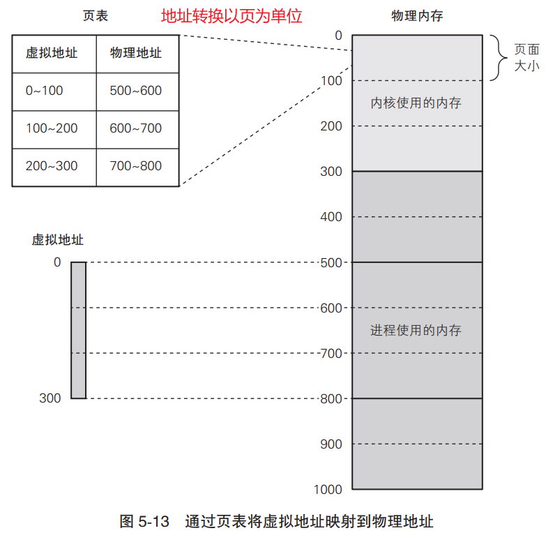
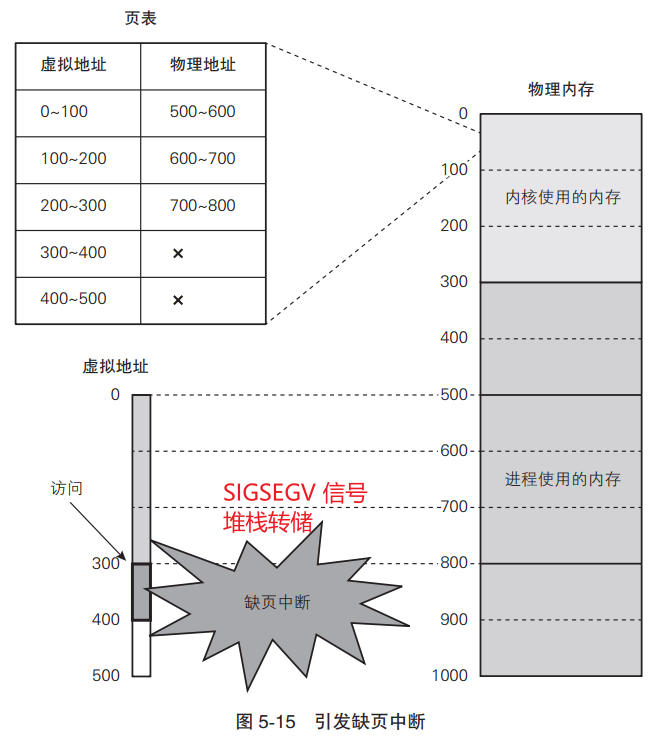

什么是系统库文件？
系统库文件：一个应用程序要运行在系统上，就需要系统标准启动文件，提供给系统用的；注意裸机bootloader、linux内核等程序是不能使用启动文件以及标准库文件（因为启动文件和库文件的使用是需要系统支持）。

一般gcc自动加入的系统标准启动文件有：crt1.o、crti.o、crtbegin.o、crtend.o、crtn.o
对于一般应用程序，这些启动是必需的。
问：什么是标准库文件？
很好理解，即库文件，如果代码用到标准库函数，而gcc集成了常用的库，链接时自动检索加入；

问：什么是动态链接？
动态链接使用动态链接库进行链接，生成的程序在执行的时候需要加载所需的动态库才能运行。
动态链接生成的程序体积较小，但是必须依赖所需的动态库，否则无法执行。

gcc默认使用动态库链接

问：什么是静态链接?
静态链接使用静态库进行链接，生成的程序包含程序运行所需要的全部库，可以直接运行，
不过静态链接生成的程序体积较大。

## 4、内存管理

### 页表

通过保存在内核使用的内存中的==**页表**==，可以<u>完成从虚拟地址到物理地址的转换</u>。

在虚拟内存中，所有内存以页为单位划分并进行管理，==地址转换也以页为单位进行==。

在页表中，一个页面对应的数据条目称为页表项。页表项记录着虚拟地址与物理地址的对应关系。

页面大小取决于 CPU 架构。在 x86_64 架构中，页面大小为 4 KB。

但为了便于说明，本书假设一个页面的大小为 100 字节。

### 为进程分配内存

首先读取程序的可执行文件，以及第 3 章中说明过的辅助信息。假设可执行文件的结构如下表所示。  

| 名称                       | 值   |
| -------------------------- | ---- |
| 代码段在文件中的偏移量     | 100  |
| 代码段的大小               | 100  |
| 代码段的内存映射的起始地址 | 0    |
| 数据段在文件中的偏移量     | 200  |
| 数据段的大小               | 200  |
| 数据段的内存映射的起始地址 | 100  |
| 入口点                     | 0    |

1. 根据代码段和数据段划分出物理内存大小，并把数据复制过去

