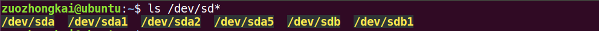

## wsl 子系统

C:\Users\Libubai\AppData\Local\Packages\CanonicalGroupLimited.Ubuntu22.04LTS_79rhkp1fndgsc\LocalState


sudo sh -c 'apt update ; apt install -y build-essential'


## 挂载点

在 Windows 下经常会遇到“分区”这个概念，在 Linux 中一般不叫“分区”而叫“挂载点”。
 “挂载点”就是将一个硬盘的一部分做成文件夹的形式，这个文件夹的名字就是“挂载点”，不管在哪个发行版的 Linux 中，用户是绝对看到不到 C 盘、 D 盘这样的概念的，只能看到以文件夹形式存在的“挂载点” .  


### 文件

`/etc/fstab` 用于在系统启动时挂载文件系统，
 `/etc/mtab` 则显示了当前已挂载的文件系统。

```
df -h
文件系统        大小  已用  可用 已用% 挂载点
tmpfs           388M  2.2M  385M    1% /run
/dev/sda3        20G   14G  4.4G   76% /
tmpfs           1.9G     0  1.9G    0% /dev/shm
tmpfs           5.0M  4.0K  5.0M    1% /run/lock
vmhgfs-fuse      79G   52G   27G   67% /mnt/hgfs
/dev/sda2       512M  6.1M  506M    2% /boot/efi
tmpfs           388M  120K  387M    1% /run/user/1000
/dev/sr0        152M  152M     0  100% /media/even/CDROM
```


```shell
# 1.确认文件系统
df -hi
# 2.卸载挂载点
umount /dev/sdb1，这将卸载/dev/sdb1分区。
# 3.创建新的挂载点
mkdir /mnt/new
# 4.更改挂载点
mount /dev/sdb1 /mnt，这将把/dev/sdb1分区挂载到/mnt目录下
# 5.永久更改
如果需要永久更改文件系统的挂载点，可以编辑/etc/fstab文件，将原来的挂载点替换为新的挂载点。
```


#### /etc/mtab 当前以挂载

```shell
cat /etc/mtab
```

```shell
# 开发板
rootfs 			/ 			rootfs 		rw 0 0
/dev/root 		/ 			ext4 		rw,sync,relatime,data=ordered 0 0
devtmpfs 		/dev 		devtmpfs 	rw,relatime,size=405364k,nr_inodes=101341,mode=755 0 0
proc 			/proc 		proc 		rw,relatime 0 0
devpts 			/dev/pts 	devpts 		rw,relatime,gid=5,mode=620 0 0
tmpfs 			/dev/shm 	tmpfs 		rw,relatime,mode=777 0 0
tmpfs 			/tmp 		tmpfs 		rw,relatime 0 0
tmpfs 			/run 		tmpfs 		rw,nosuid,nodev,relatime,mode=755 0 0
sysfs 			/sys 		sysfs 		rw,relatime 0 0
/dev/mmcblk0p7 	/mdata vfat rw,relatime,fmask=0022,dmask=0022,codepage=cp437,iocharset=iso88591,shortname=mixed,errors=remount-ro 0 0
```

```shell
# linxu虚拟机
sysfs /sys sysfs rw,nosuid,nodev,noexec,relatime 0 0
proc /proc proc rw,nosuid,nodev,noexec,relatime 0 0
udev /dev devtmpfs rw,nosuid,relatime,size=1943136k,nr_inodes=485784,mode=755,inode64 0 0
devpts /dev/pts devpts rw,nosuid,noexec,relatime,gid=5,mode=620,ptmxmode=000 0 0
tmpfs /run tmpfs rw,nosuid,nodev,noexec,relatime,size=396360k,mode=755,inode64 0 0
/dev/sda3 / ext4 rw,relatime,errors=remount-ro 0 0
securityfs /sys/kernel/security securityfs rw,nosuid,nodev,noexec,relatime 0 0
tmpfs /dev/shm tmpfs rw,nosuid,nodev,inode64 0 0
tmpfs /run/lock tmpfs rw,nosuid,nodev,noexec,relatime,size=5120k,inode64 0 0
cgroup2 /sys/fs/cgroup cgroup2 rw,nosuid,nodev,noexec,relatime,nsdelegate,memory_recursiveprot 0 0
pstore /sys/fs/pstore pstore rw,nosuid,nodev,noexec,relatime 0 0
bpf /sys/fs/bpf bpf rw,nosuid,nodev,noexec,relatime,mode=700 0 0
systemd-1 /proc/sys/fs/binfmt_misc autofs rw,relatime,fd=29,pgrp=1,timeout=0,minproto=5,maxproto=5,direct,pipe_ino=25652 0 0
hugetlbfs /dev/hugepages hugetlbfs rw,relatime,pagesize=2M 0 0
mqueue /dev/mqueue mqueue rw,nosuid,nodev,noexec,relatime 0 0
debugfs /sys/kernel/debug debugfs rw,nosuid,nodev,noexec,relatime 0 0
tracefs /sys/kernel/tracing tracefs rw,nosuid,nodev,noexec,relatime 0 0
fusectl /sys/fs/fuse/connections fusectl rw,nosuid,nodev,noexec,relatime 0 0
configfs /sys/kernel/config configfs rw,nosuid,nodev,noexec,relatime 0 0
ramfs /run/credentials/systemd-sysusers.service ramfs ro,nosuid,nodev,noexec,relatime,mode=700 0 0
vmware-vmblock /run/vmblock-fuse fuse.vmware-vmblock rw,relatime,user_id=0,group_id=0,default_permissions,allow_other 0 0
/dev/loop0 /snap/bare/5 squashfs ro,nodev,relatime,errors=continue,threads=single 0 0
/dev/loop1 /snap/core22/1122 squashfs ro,nodev,relatime,errors=continue,threads=single 0 0
/dev/loop2 /snap/firefox/3836 squashfs ro,nodev,relatime,errors=continue,threads=single 0 0
/dev/loop3 /snap/gnome-42-2204/141 squashfs ro,nodev,relatime,errors=continue,threads=single 0 0
/dev/loop5 /snap/snap-store/959 squashfs ro,nodev,relatime,errors=continue,threads=single 0 0
/dev/loop4 /snap/gtk-common-themes/1535 squashfs ro,nodev,relatime,errors=continue,threads=single 0 0
/dev/loop6 /snap/snapd/20671 squashfs ro,nodev,relatime,errors=continue,threads=single 0 0
/dev/sda3 /var/snap/firefox/common/host-hunspell ext4 ro,noexec,noatime,errors=remount-ro 0 0
/dev/loop7 /snap/snapd-desktop-integration/83 squashfs ro,nodev,relatime,errors=continue,threads=single 0 0
vmhgfs-fuse /mnt/hgfs fuse.vmhgfs-fuse rw,relatime,user_id=0,group_id=0,allow_other 0 0
/dev/sda2 /boot/efi vfat rw,relatime,fmask=0077,dmask=0077,codepage=437,iocharset=iso8859-1,shortname=mixed,errors=remount-ro 0 0
binfmt_misc /proc/sys/fs/binfmt_misc binfmt_misc rw,nosuid,nodev,noexec,relatime 0 0
tmpfs /run/snapd/ns tmpfs rw,nosuid,nodev,noexec,relatime,size=396360k,mode=755,inode64 0 0
nsfs /run/snapd/ns/snapd-desktop-integration.mnt nsfs rw 0 0
tmpfs /run/user/1000 tmpfs rw,nosuid,nodev,relatime,size=396356k,nr_inodes=99089,mode=700,uid=1000,gid=1000,inode64 0 0
portal /run/user/1000/doc fuse.portal rw,nosuid,nodev,relatime,user_id=1000,group_id=1000 0 0
gvfsd-fuse /run/user/1000/gvfs fuse.gvfsd-fuse rw,nosuid,nodev,relatime,user_id=1000,group_id=1000 0 0
/dev/sr0 /media/even/CDROM iso9660 ro,nosuid,nodev,relatime,nojoliet,check=s,map=n,blocksize=2048,uid=1000,gid=1000,dmode=500,fmode=400,iocharset=utf8 0 0
nsfs /run/snapd/ns/snap-store.mnt nsfs rw 0 0
/dev/loop8 /snap/core20/2318 squashfs ro,nodev,relatime,errors=continue,threads=single 0 0
/dev/loop9 /snap/code/159 squashfs ro,nodev,relatime,errors=continue,threads=single 0 0
/dev/loop10 /snap/snapd/21759 squashfs ro,nodev,relatime,errors=continue,threads=single 0 0
/dev/loop11 /snap/core22/1380 squashfs ro,nodev,relatime,errors=continue,threads=single 0 0
/dev/loop12 /snap/gnome-42-2204/176 squashfs ro,nodev,relatime,errors=continue,threads=single 0 0
/dev/loop13 /snap/firefox/4336 squashfs ro,nodev,relatime,errors=continue,threads=single 0 0
```


#### /etc/fstab 系统启动时挂载

文件/etc/fstab 详细的记录了 **==Ubuntu 中硬盘分区的情况==**

```shell
# 开发板
# <file system> <mount pt>      <type>  <options>       		<dump>    <pass>
/dev/root       /               ext2    rw,noauto       		0       1
proc            /proc           proc    defaults        		0       0
devpts          /dev/pts        devpts  defaults,gid=5,mode=620  0       0
tmpfs           /dev/shm        tmpfs   mode=0777       		0       0
tmpfs           /tmp            tmpfs   mode=1777       		0       0
tmpfs           /run            tmpfs   mode=0755,nosuid,nodev   0       0
sysfs           /sys            sysfs   defaults        		0       0
```

```shell
# 虚拟机
# /etc/fstab: static file system information.
#
# Use 'blkid' to print the universally unique identifier for a
# device; this may be used with UUID= as a more robust way to name devices
# that works even if disks are added and removed. See fstab(5).
#
# <file system> <mount point>   <type>  <options>       <dump>  <pass>
# / was on /dev/sda3 during installation
UUID=d650a977-c1be-4b8c-a043-66c1a7e64de2 / ext4    errors=remount-ro 0       1
# /boot/efi was on /dev/sda2 during installation
UUID=43A3-1C15  /boot/efi       vfat    umask=0077      			0       1
/swapfile       none            swap    sw             				0       0
/dev/fd0        /media/floppy0  auto    rw,user,noauto,exec,utf8 	 0       0
.host:/         /mnt/hgfs/      fuse.vmhgfs-fuse allow_other  		 0  	0
```

- 有一行“`/ was on /dev/sda3 during installation`”，意思是根目录“/”是在/dev/sda3上的，其中“/”是挂载点，“/dev/sda1”就是我们装 Ubuntu 系统的硬盘。
  由于我们的系统是安装在虚拟机中的，因此上面并没有出现实际的硬盘。可以通过如下命令查看当前系统中的磁盘： 
- 这是要挂载的文件系统的位置或源。在这种情况下，它指的是虚拟机宿主机的共享文件夹（通常是VMware虚拟机设置中的一个共享文件夹）。`.host:` 是VMware特定的标识符，表示宿主机上的文件系统。


#### 文件系统类型

**`-t vfat`**：这是指定文件系统类型的选项

##### 下AI

在Linux中，文件系统类型决定了如何存储和检索文件。不同的文件系统类型具有不同的特性和优势，适用于不同的场景。以下是一些常见的Linux文件系统类型：

1. ext2：
   - 第二代扩展文件系统，是Linux早期常用的文件系统类型。
   - 具有极快的速度和极小的CPU占用率，可用于硬盘和移动存储设备
   - 它不支持文件系统的日志功能（journaling），这可能导致在某些情况下恢复数据更加困难。
2. ext3：
   - 第三代扩展文件系统，基于ext2并添加了日志功能。
   - 增加日志功能，可回溯追踪，日志功能提高了数据完整性和系统恢复能力。
   - 它是许多Linux发行版的默认文件系统类型之一。
3. ext4： 日志式文件系统
   - 第四代扩展文件系统，是ext3的后续版本。
   - 支持1EB（1024*1024TB），最大单文件16TB，支持连续写入可减少文件碎片。rhel6默认文件系统
   - **ext4的扩展日志功能**：与ext3相比，ext4不仅提供了日志功能，还扩展了日志的用途，包括支持元数据的延迟分配和在线碎片整理等特性。
   - **ext4的inode大小**：ext4支持更大的inode（索引节点）大小，允许存储更多的元数据，这对于存储大量小文件或者具有大量扩展属性的文件特别有用。
   - **ext4的多块分配**：ext4引入了多块分配（multi-block allocation）机制，可以一次性分配多个块，从而提高了写入性能。
   - 它是许多**现代Linux发行版**的默认文件系统类型。
4. XFS： 
   - 最初由SGI为IRIX操作系统开发，后来被引入Linux。
   - xfs可以管理500T的硬盘。rhel7默认文件系统
   - **XFS的分配组**：XFS使用分配组（allocation groups）来管理存储空间，每个分配组都是独立的，这有助于在大型文件系统中实现并行读写操作，提高性能。 在某些**高性能**和**大规模**存储环境中，XFS可能是更好的选择。
   - **XFS的延迟日志**：XFS的日志机制是延迟的（delayed logging），这意味着它不会立即将所有更改写入日志，而是等待一段时间或者达到某个条件后再进行写入，这可以提高性能但可能会增加数据丢失的风险（在极端情况下）。
5. Btrfs： 支持快照、透明压缩、在线文件系统检查和修复、以及多设备卷等功能
   - B-tree文件系统（Btrfs）是一个现代的、基于B-tree的Copy-on-Write（COW）文件系统。
   - **Btrfs的RAID支持**：Btrfs文件系统本身支持RAID（Redundant Array of Independent Disks 独立磁盘冗余阵列）功能，如RAID 0、RAID 1、RAID 10等，这提供了数据冗余和性能优化。
   - **Btrfs的透明压缩**：Btrfs支持透明压缩，即数据在写入磁盘前会自动进行压缩，读取时会自动解压缩，这可以节省存储空间并提高性能。
   - **Btrfs的在线扩展**：Btrfs支持在线扩展，即可以在文件系统正在运行时添加新的存储设备，而无需卸载文件系统。
   - Btrfs是许多现代Linux发行版（如Fedora、openSUSE和Ubuntu）的可选文件系统类型。
6. FAT (FAT12, FAT16, FAT32)：  **==Window==**
   - 常用于Windows系统，但也可以在Linux上挂载和使用。
   - **（即Vfat）**采用32位的文件分配表，支持最大分区128GB，**最大文件==4GB==**
   - **FAT32的分区大小**：FAT32支持的最大分区大小远大于FAT16，理论上可以支持高达**2TB的分区**（但在实践中可能受到操作系统和其他因素的限制）。
   - **FAT32的簇大小**：FAT32使用簇（cluster）作为文件存储的**基本单位**，簇的大小会影响存储效率和文件碎片问题。较小的簇大小可以减少文件碎片但会降低存储效率，而较大的簇大小则相反。
   - ==FAT文件系统不支持Linux特有的文件和目录权限。==
7. NTFS： **==Window==**
   - Windows NT文件系统，主要用于Windows系统。
   - 支持最大分区2TB，最大文件==2TB==，安全性和稳定性非常好，不易出现文件碎片。
   - **NTFS的权限和所有权**：NTFS支持文件和目录的权限和所有权设置，这与Linux的文件系统权限模型类似。这使得在Linux上挂载NTFS分区时，可以保留和访问Windows设置的文件和目录权限。
   - **NTFS的压缩和加密**：NTFS支持文件和目录的压缩和加密功能，这可以提高存储效率或保护数据安全。
   - Linux可以通过安装第三方驱动程序（如ntfs-3g）来读写NTFS分区。
8. ReiserFS：
   - 曾经是Linux的一个流行选择，但现在由于其开发者**不再维护**，其使用已经减少。
   - **ReiserFS的尾递归日志**：ReiserFS使用尾递归日志（tail-recursive journaling）机制来确保数据的完整性和恢复能力。这种日志机制与传统的循环日志相比具有更高的效率。
   - **ReiserFS的目录索引**：ReiserFS使用目录索引（directory indexing）来加速目录查找操作，这对于包含大量文件和子目录的目录特别有用。
   - 它提供了高性能和独特的日志功能。
9. JFS (Journaled File System)：
   - IBM开发的日志文件系统，旨在提供高性能和可靠性。
   - 在某些IBM产品和一些Linux发行版中可用。
10. ZFS (Zettabyte File System)：
    - 是一个为大型、分布式文件系统设计的文件系统，支持高可扩展性和容错性。
    - 主要在Sun Microsystems的Solaris系统中使用，但在Linux上也有可用的实现。

在选择文件系统类型时，需要考虑存储需求、性能要求、可靠性需求以及与其他系统的兼容性等因素。

其他

- RAMFS：内存文件系统
- ISO 9660：光盘
- NFS：网络文件系统
- SMBAFS/CIFS：支持Samba协议的网络文件系统
- Linux swap：交换分区，用以提供虚拟内存。


### 磁盘管理命令


```shell
ls -l /dev/sd*
```



```less
brw-rw---- 1 root disk 8, 0  6月  3 16:38 /dev/sda
brw-rw---- 1 root disk 8, 1  6月  3 16:38 /dev/sda1
brw-rw---- 1 root disk 8, 2  6月  3 16:38 /dev/sda2
brw-rw---- 1 root disk 8, 3  6月  3 16:38 /dev/sda3
// 插上u盘之后 多了一个b盘
brw-rw---- 1 root disk 8,  0  6月  3 16:38 /dev/sda
brw-rw---- 1 root disk 8,  1  6月  3 16:38 /dev/sda1
brw-rw---- 1 root disk 8,  2  6月  3 16:38 /dev/sda2
brw-rw---- 1 root disk 8,  3  6月  3 16:38 /dev/sda3
brw-rw---- 1 root disk 8, 16  6月  4 22:21 /dev/sdb
brw-rw---- 1 root disk 8, 17  6月  4 22:21 /dev/sdb1
brw-rw---- 1 root disk 8, 18  6月  4 22:21 /dev/sdb2
```

- sd 表示是 SATA ==硬盘或者其它外部设==备，最后面的数字表示该硬盘上的第 n 个分区 
- 如果再插上 U 盘、 SD 卡啥的就可能会出现/dev/sdb， /dev/sdc 等等。如果你的 U 盘有两个分区那么可能就会出现/dev/sdb1、 dev/sdb2 这样的设备文件。   

```
df -h
文件系统        大小  已用  可用 已用% 挂载点
tmpfs           388M  2.2M  385M    1% /run
/dev/sda3        20G   14G  4.4G   76% /
tmpfs           1.9G     0  1.9G    0% /dev/shm
tmpfs           5.0M  4.0K  5.0M    1% /run/lock
vmhgfs-fuse      79G   52G   27G   67% /mnt/hgfs
/dev/sda2       512M  6.1M  506M    2% /boot/efi
tmpfs           388M  120K  387M    1% /run/user/1000
/dev/sr0        152M  152M     0  100% /media/even/CDROM
```

#### 1. 磁盘分区命令 fdisk

如果要对某个磁盘进行分区，可以使用命令 fdisk，命令格如下：

```
fdisk [参数]
```

- -b<分区大小> 指定每个分区的大小。
- -l 列出指定设备的分区表。
- -s<分区编号> 将指定的分区大小输出到标准的输出上， 单位为块。
- -u 搭配“-l”参数，会用分区数目取代柱面数目，来表示每个分区的起始地址。

比如我要对 U 盘进行分区， ==**千万不要对自己装 Ubuntu 系统进行分区**==！！！ 可以使用如下命令：

```shell
sudo fdisk /dev/sdb # **千万不要对自己装 Ubuntu 系统进行分区**
```

| p    | 显示现有的分区                       |
| ---- | ------------------------------------ |
| n    | 建立新分区                           |
| t    | 更改分区类型                         |
| e    | 删除现有的分区                       |
| q    | 更改分区启动标志                     |
| w    | 对分区的更改写入到硬盘或者存储器中。 |
| q    | 不保存退出。                         |

具体sd卡介绍


#### 2. 格式化分区 mkfs

使用命令 fdisk 创建好一个分区以后，我们==需要对其格式化==，也就是在这个分区上创建一个文件系统，

```shell
mkfs [参数] [-t 文件系统类型] [分区名称]
# 比如我们要格式化 U 盘的分区/dev/sdb1 为 FAT 格式，如下
mkfs – t vfat /dev/sdb1 

# 1.格式化隐藏的空间
mkfs.vfat /dev/mmcblk0p7
```

主要参数如下：

- -V 显示版本信息和简要的使用方法。
- -v 显示版本信息和详细的使用方法。


#### 3. 挂载分区到文件 mount

我们创建好分区并且格式化以后肯定是要使用硬盘或者 U 盘的，那么如何访问磁盘呢？
比如我的 U 盘就一个分区，为/dev/sdb1，如果直接打开文件/dev/sdb1 会发现根本就不是我们要的结果。
我们==**需要将/dev/sdb1 这个分区挂载到一个文件夹中**==，然后通过这个文件访问 U 盘，磁盘挂载命令为 mount，命令格式如下：

```
mount [参数] -t [类型] [设备名称] [目的文件夹]
```

- -V 显示程序版本。
- -h 显示辅助信息。
- -v 显示执行过程详细信息。
- -o ro 只读模式挂载。
- -o rw 读写模式挂载。
- -s-r 等于-o ro。-w 等于-o rw。

挂载点是一个文件夹，因此在挂载之前先要创建一个文件夹，一般我们把挂载点放到“/mnt”目录下，在“/mnt”下创建一个 tmp 文件夹，然后将 U 盘的/dev/sdb1 分区挂载到/mnt/tmp 文件夹里面，操作如图 2.8.2.3 所示：

```shell
# 2.创建挂载点
mkdir mdata
# 3.把隐藏空间挂载出来
mount -t  vfat /dev/mmcblk0p7   /Even
# 以上命令在每一次重启时都需要执行一次，因此可以把命令写入到 /etc/init.d/rcS 中去
# 解除挂载
umount /Even

# 其他 1.格式化隐藏的空间 
mkfs.vfat /dev/mmcblk0p7
```

- **`mount`**：这是命令本身，用于挂载文件系统
- **`-t vfat`**：这是指定文件系统类型的选项。`vfat` 是一个支持长文件名（Long File Names, LFN）的 FAT 文件系统类型，常用于存储卡和其他移动存储设备上。
- **`/dev/mmcblk0p7`**：这是要挂载的设备或分区。从名称上看，这很可能是一个 SD 卡或类似的存储设备的第7个分区（通常是物理设备之后的第7个逻辑分区）。
- **`/Even`**：这是挂载点，即文件系统在文件系统中的可见位置。挂载后，您可以通过访问 `/Even` 目录来访问该设备上的文件和目录。
- ==如果 `/Even` 目录已经存在并且包含其他文件或目录，挂载操作可能会失败或覆盖现有内容（取决于挂载选项，但默认情况下可能会这样）。==


在图 2.8.2.3 中我们将 U 盘以 fat 格式挂载到目录/mnt/tmp 中，然后我们就可以通过访问/mnt/tmp 来访问 U 盘了。  

#### 4. 卸载分区 umount

当我们不再需要访问已经挂载的 U 盘，可以通过 umount 将其从卸载点卸除，命令格式如下：

```
umount [参数] -t [文件系统类型] [设备名称]
```

- -a 卸载/etc/mtab 中的所有文件系统。
- -h 显示帮助。
- -n 卸载时不要将信息存入到/etc/mtab 文件中
- -r 如果无法成功卸载，则尝试以只读的方式重新挂载。
- -t<文件系统类型> 仅卸载选项中指定的文件系统。
- -v 显示执行过程。

上面我们将 U 盘挂载到了文件夹/mnt/tmp 里面，这里我们使用命令 umount 将其卸载掉，操作如图 2.8.2.4 所示：


```shell
df -h /path/to/file
df -h 

mount | grep /path/to/directory
```

```
Filesystem      Size  Used Avail Use% Mounted on  
/dev/sda1       238G   35G  191G  16% /
```


### 使用`cat /etc/mtab`或`cat /etc/fstab`

这两个文件包含了系统上的所有挂载点信息。`/etc/mtab`文件包含了当前已挂载的文件系统的信息，而`/etc/fstab`文件包含了系统启动时应该挂载的文件系统的信息。

**步骤**：

1. 打开终端。
2. 输入命令 `cat /etc/mtab | grep /path/to/directory` 或 `cat /etc/fstab | grep /path/to/directory`，其中`/path/to/directory`是包含目标文件的目录的路径。
3. 按下回车键，查看输出结果中与目标目录相关的行，找到对应的挂载点信息。

**注意**：上述方法中的`/path/to/file`或`/path/to/directory`应替换为你实际要查询的文件或目录的路径。


### 文件恢复

次要：https://cloud.tencent.com/developer/article/2122885

主要：https://cloud.tencent.com/developer/techpedia/1993

#### 1、安装extundelete

```shell
# 1.安装依赖
apt-get install build-essential  e2fslibs-dev  e2fslibs-dev

# 2.安装编译
wget http://downloads.sourceforge.net/project/extundelete/extundelete/0.2.4/extundelete-0.2.4.tar.bz2
tar -xf  extundelete-0.2.4.tar.bz2
cd  extundelete-0.2.4
# 下边可能会报错，根据报错修改报错的文件
./configure --prefix=/usr/local/extundelete
make install
ln -s /usr/local/extundelete/bin/extundelete /usr/bin/

# 3.查看版本
extundelete -v
extundelete version 0.2.4
libext2fs version 1.42.9
Processor is little endian.
```

2、

```shell
df  -Th
Filesystem     Type      Size  Used Avail Use% Mounted on
devtmpfs       devtmpfs  909M     0  909M   0% /dev
tmpfs          tmpfs     920M   24K  920M   1% /dev/shm
tmpfs          tmpfs     920M  468K  919M   1% /run
tmpfs          tmpfs     920M     0  920M   0% /sys/fs/cgroup
/dev/vda1      ext4       50G   11G   37G  23% /
tmpfs          tmpfs     184M     0  184M   0% /run/user/0
```

```shell
# 2.对要恢复文件的分区解除挂载
umount /xxx

# 3.查看可以恢复的数据
#指定误删文件的分区进行查找 最后一列标记为Deleted的文件，即为删除了的文件
extundelete /dev/vdb1 --inode 2 （根分区的inode值是2）
```


**恢复单个目录**

指定要恢复的目录名 如果是空目录，则不会恢复

代码语言：javascript

复制

```javascript
extundelete /dev/vdb1 --restore-directory  ferris
```

当执行恢复文件的命令后，会在执行命令的当前的目录下生成RECOVERED_FILES目录，恢复的文件都会放入此目录中。如未生成目录，即为失败。

**5、恢复单个文件**

指定要恢复的文件名 如果几k大小的小文件，有很大几率恢复失败

代码语言：javascript

复制

```javascript
extundelete /dev/vdb1 --restore-file openssh-7.7p1.tar.g
```

**6、恢复全部删除的文件**

无需指定文件名或目录名，恢复全部删除的数据

代码语言：javascript

复制

```javascript
extundelete /dev/vdb1 --restore-all
```


# Ubuntu22.04.4

文件系统了解：https://cloud.tencent.com/developer/techpedia/1993

## 文件路径

### 头文件路径

/usr/include/x86_64-linux-gnu/asm/signal.h

优先级

```c
，通过Linux系统内核源码中的头文件sched.h可以知道，线程的优先级范围是0~99，优先级数值越大则优先级越高。
```


### 其他文件路径

1. /proc/locks -- 系统死锁路径（死锁文件）
2. /dev/shm -- 存放具名信号量
3. /proc/filesystems -- Linux支持的文件系统


## etc / 


| 全局配置文件     | 用户配置文件                                             |
| :--------------- | :------------------------------------------------------- |
| /etc/inputrc     | /home/user/.inputrc                                      |
| /etc/vim/vimrc   | /home/user/.vim/vimrc                                    |
| /etc/bash.bashrc | /home/user/.bashrc  |


### / rcN.d/(1-6)  /

七个 /etc/rcN.d 目录里列出的程序，都设为链接文件，指向另外一个目录 /etc/init.d ，真正的启动脚本都统一放在这个目录中。init进程逐一加载开机启动程序，其实就是运行这个目录里的启动脚本。

```c
// rcD.d
S01alsa-utils -> ../init.d/alsa-utils*
S01apparmor -> ../init.d/apparmor*
S01keyboard-setup.sh -> ../init.d/keyboard-setup.sh*
S01kmod -> ../init.d/kmod*
S01plymouth-log -> ../init.d/plymouth-log*
S01procps -> ../init.d/procps*
S01udev -> ../init.d/udev*
S01ufw -> ../init.d/ufw*
S01x11-common -> ../init.d/x11-common*
```


### environment

```shell
PATH="/usr/local/sbin:/usr/local/bin:/usr/sbin:/usr/bin:/sbin:/bin:/usr/games:/usr/local/games:/snap/bin"
MY_HOME=""
```

系统环境变量所在的位置

在其中添加需要设置的环境变量，语法为 key=value。

```shell
JAVA_HOME=/usr/lib/jvm/java-11
```

### / init /

#### whoopsie.conf

```shell
/etc/profile     // 除了开机会自动执行以外如果有新的终端连接也会执行该文件
/etc/init.d/rcS  // 只有在开机的时候被执行一次
```

```shell
$ more whoopsie.conf
# whoopsie - crash report submission daemon

description     "crash report submission daemon"

start on runlevel [2345]
stop on runlevel [!2345]

env CRASH_DB_URL=https://daisy.ubuntu.com
respawn
respawn limit 10 5

pre-start script
    # Wait for network-manager if and only if it's installed.
    status network-manager >/dev/null 2>&1 && start wait-for-state WAITER=whoopsie WAIT_FOR=network-manager WAIT_STATE=running || :
end script

exec whoopsie -f
```

"pre-start" 是 Upstart 事件系统配置文件中的一个关键字，用于定义一个在指定服务启动之前执行的脚本段落。这个脚本段落中的命令会在指定服务启动之前执行，可以用于设置前置条件、执行必要的初始化工作或者等待其他依赖服务就绪。

```bash
pre-start script
    # Your pre-start commands go here
    # For example:
    echo "Preparing to start myservice..."
    sleep 5  # Simulate some initialization work
end script
```

在这个示例中，"pre-start" 段落内的命令会在指定的服务启动之前执行。

类似的命令包括：

- =="post-start"：定义一个在指定服务启动之后执行的脚本段落。==
- =="pre-stop"：定义一个在指定服务停止之前执行的脚本段落。==
- =="post-stop"：定义一个在指定服务停止之后执行的脚本段落。==

这些命令可以帮助==管理者在服务生命周期的不同阶段执行自定义的操作==，例如在启动前进行一些准备工作，或者在停止后执行一些清理工作。

需要注意的是，以上命令都是特定于 Upstart 事件系统的，而其他类似系统（比如 Systemd）可能有不同的命令和机制来实现类似的功能。

### / init.d /

`/etc/init.d/rcS # 只有在开机的时候被执行`


### / profile

- 所有用户，检测用户是否被设置
- 启动 bash.bashrc
- 启动 profile.d 文件夹下的所有 .sh文件

```
export 环境变量名 = val
unset var #取消环境变量
```

```shell
# /etc/profile: system-wide .profile file for the Bourne shell (sh(1))
# and Bourne compatible shells (bash(1), ksh(1), ash(1), ...).
if [ "${PS1-}" ]; then #判断 PS1 是否被设置
  if [ "${BASH-}" ] && [ "$BASH" != "/bin/sh" ]; then #用于判断当前 shell 是否为 Bash，并且不是 /bin/sh
    # The file bash.bashrc already sets the default PS1.
    # PS1='\h:\w\$ '
    if [ -f /etc/bash.bashrc ]; then
      . /etc/bash.bashrc
    fi
  else
    if [ "$(id -u)" -eq 0 ]; then
      PS1='# ' #根据当前用户的权限设置命令提示符：如果用户的 ID 是 0，即用户是 root 用户
    else
      PS1='$ '
    fi
  fi
fi

if [ -d /etc/profile.d ]; then
  for i in /etc/profile.d/*.sh; do
    if [ -r $i ]; then
      . $i
    fi
  done
  unset i
fi
```


### / profile.d /

里面是sh脚本，由 `/etc/profile` 启动


## dev/ 设备文件

它包含了所有Linux系统中使用的外部设备的设备文件。这些设备文件允许用户空间程序与内核中的驱动程序进行交互，从而实现对硬件设备的访问和操作。

1. 块设备文件（Block Devices）：
   - 块设备文件通常以字母**“b”**开头，表示可以==容纳文件系统的设备==，如硬盘、软盘等。
   - 例如，`/dev/sda`通常表示第一个SCSI硬盘，`/dev/hda`可能表示第一个IDE硬盘（在较新的系统中较少见）。
   - 块设备文件允许用户以块为单位（通常是512字节或更大）进行读写操作。
2. 字符设备文件（Character Devices）：
   - 字符设备文件通常以字母**“c”**开头，表示那些==不需要缓冲直接进行I/O操作的设备==，如串口、控制台等。
   - 例如，`/dev/tty`通常表示当前终端，`/dev/ttyS0`可能表示第一个串口。
   - 字符设备文件允许用户以字符为单位进行读写操作。


### / tty

==在Linux开发板上==，`/dev/tty`通常指的是与当前进程相关联的控制终端。
`/dev/tty`设备文件都代表了Linux系统中的终端设备。但在不同的环境中，这些设备文件的实现和行为可能有所不同。
开发板和虚拟机之间的主要差异在于硬件接口和虚拟化技术的使用。

1. 串口终端（Serial Port Terminals）：
   - 设备文件通常以`/dev/ttySn`（n为数字）命名，如`/dev/ttyS0`、`/dev/ttyS1`等。
   - 这些设备文件对应于计算机上的串行端口，用于与外部设备进行串行通信。
   - 在开发板上，它们可能被用于与串口设备（如调制解调器、其他计算机或传感器）进行通信。
2. 虚拟终端（Virtual Terminals）：
   - 设备文件通常以`/dev/ttyX`（X为数字）命名，如`/dev/tty1`、`/dev/tty2`等。
   - 这些设备文件对应于Linux系统中的虚拟控制台，用户可以通过`Ctrl+Alt+F[1-6]`等快捷键在不同的虚拟控制台之间切换。
   - 在开发板上，虚拟终端通常用于多用户登录和调试目的。
3. 控制台终端（Console Terminal）：
   - 设备文件通常命名为`/dev/console`。
   - 它代表了系统控制台，是内核启动过程中和init进程（PID为1的进程）所使用的终端设备。
   - 在开发板上，`/dev/console`通常与物理串口或LCD显示屏等硬件设备相关联。

==Linux虚拟机==上的`/dev/tty`值

在Linux虚拟机上，`/dev/tty`设备文件的行为与开发板类似，但也有一些特定的差异：

1. 虚拟环境：
   - 虚拟机提供了一个隔离的操作系统环境，其中的`/dev/tty`设备文件由虚拟机管理器（如VMware、VirtualBox等）模拟。
   - 这意味着虚拟机中的`/dev/tty`设备文件可能与物理硬件没有直接关联，而是由虚拟机管理器提供的虚拟硬件接口。
2. 串口终端：
   - 在虚拟机中，`/dev/ttyS*`设备文件可能不存在或不可用，因为虚拟机通常不直接提供物理串行端口。
   - 但是，虚拟机管理器可能提供了其他方式来实现串行通信，如使用命名管道（named pipes）或套接字（sockets）来模拟串行端口。
3. 虚拟终端：
   - 虚拟机中的`/dev/ttyX`设备文件与物理机上的行为类似，允许用户在不同的虚拟控制台之间切换。
   - 但是，由于虚拟机环境的限制，可用的虚拟控制台数量可能有限。
4. 控制台终端：
   - `/dev/console`在虚拟机中通常与虚拟机的控制台相关联，用于显示启动信息和系统消息。
   - 与物理机类似，`/dev/console`也是内核和init进程所使用的终端设备。


### / input /


在 Linux 系统中，可以通过一些命令行工具来查看与鼠标和键盘相关的输入设备文件。最常用的工具有 `lsinput`、`cat`、`evtest` 和 `udevadm`。

```shell
sudo od -x /dev/input/event3
sudo cat /dev/input/event3
```

- event1 键盘
- event2 鼠标


#### 相关命令

##### 使用 `lsinput`

`lsinput` 是一个专门用于列出输入设备的工具。如果没有安装，可以使用 `evtest` 代替。

##### 使用 `cat`

查看 `/proc/bus/input/devices` 文件。这个文件包含了所有输入设备的信息，包括鼠标和键盘。

```
sh
复制代码
cat /proc/bus/input/devices
```

这个文件包含了所有输入设备的信息，包括鼠标和键盘。每个设备条目看起来类似于下面的内容：

```
vbnet复制代码I: Bus=0011 Vendor=0001 Product=0001 Version=ab41
N: Name="AT Translated Set 2 keyboard"
P: Phys=isa0060/serio0/input0
S: Sysfs=/devices/platform/i8042/serio0/input/input3
U: Uniq=
H: Handlers=sysrq kbd event3 leds 
B: PROP=0
B: EV=120013
B: KEY=402000000 3803078f800d001 feffffdfffefffff fffffffffffffffe
B: MSC=10
B: LED=7
```

- `Name` 表示设备名称。
- `Handlers` 列出了设备相关的事件文件，如 `event3`。

##### 使用 `evtest`

`evtest` 是一个用于测试输入设备的工具，通常需要超级用户权限。可以用来确定哪个事件文件与鼠标或键盘相关。

```
sh
复制代码
sudo evtest
```

运行 `evtest` 后，它会列出所有可用的输入设备。选择设备后，`evtest` 会输出设备生成的事件信息。

##### 使用 `udevadm`

`udevadm` 是管理设备节点的工具，可以用来列出详细的设备信息。

列出所有输入设备：

```
sh
复制代码
sudo udevadm info --export-db | grep -A 20 input
```

这个命令会输出系统中的所有输入设备的信息。可以通过查找 `ID_INPUT_KEYBOARD` 或 `ID_INPUT_MOUSE` 属性来确定键盘和鼠标设备。

##### 示例步骤

1. 查看 `/proc/bus/input/devices` 文件：

```
cat /proc/bus/input/devices
```

查找带有 `Handlers=kbd`（键盘）和 `Handlers=mouse`（鼠标）相关的设备。

1. 使用 `evtest` 测试具体的设备：

```
sudo evtest
```

选择合适的设备编号，然后观察生成的事件信息。

1. 使用 `udevadm` 获取设备详细信息：

```
sudo udevadm info --export-db | grep -A 20 input
```

通过查找 `ID_INPUT_KEYBOARD` 或 `ID_INPUT_MOUSE` 属性来确定键盘和鼠标设备。

##### 总结

以上方法可以帮助你确定哪个文件是鼠标和键盘的输入文件。通常，输入设备的文件位于 `/dev/input/` 目录下，如 `/dev/input/event0`、`/dev/input/event1` 等。通过上述步骤，可以找到具体的设备文件并进一步进行测试和验证。


## usr/

### / include/

`/usr/include` 目录通常存放着==系统级别的标准头文件==以及一些常用的 ==C/C++ 库的头文件==。

标准头文件包括了一系列的标准 C 库和 POSIX 库的头文件，包括 `stdio.h`、`stdlib.h`、`string.h` 等等。这些头文件包含了许多 C 语言标准库函数的声明和宏定义，以及一些系统调用的声明和常量定义。

此外，该目录也可能包含一些常用库的头文件，比如 `math.h`、`pthread.h`、`fcntl.h` 等等，这些头文件定义了一些针对特定功能的函数、常量和数据类型。

总之，`/usr/include` 目录存放了系统级别的标准头文件以及一些常用的 C/C++ 库的头文件，它们是开发者在编写 C/C++ 程序时经常会使用到的头文件。


#### // linux/

`/usr/include/linux` 目录通常存放着与 Linux 内核相关的头文件。这些头文件包含了许多与内核通信和操作有关的定义和声明。

主要的内容包括==与设备驱动开发相关的头文件==，例如 `fb.h`（帧缓冲设备）、`soundcard.h`（声卡设备）、`gpio.h`（GPIO 控制器）等。
这些头文件==定义了数据结构、宏定义和函数声明==，可以**用于编写设备驱动程序和访问设备的接口**。

此外，`/usr/include/linux` 目录下还有一些特定于 Linux 内核的定义和声明，比如==与系统调用相关==的头文件、==**网络协议族**==相关的头文件等等。

总之，`/usr/include/linux` 目录存放了与 Linux 内核相关的头文件，这些文件对于进行 Linux 内核级编程、设备驱动开发等非常有用。

##### /// x86_64-linux-gnu/

errno.h     mman.h  unistd.h  types.h  wait.h


##### fb.h

`fb.h` 是 Linux ==内核中与帧缓冲设备相关的头文件之一==。该文件定义了与 Linux 中帧缓冲设备操作相关的数据结构、宏定义和函数声明。

一般情况下，`fb.h` 头文件中可能包含以下内容：

1. ==结构体定义==：定义了表示帧缓冲设备信息的数据结构，如 `struct fb_var_screeninfo` 用于**描述变量屏幕参数**，`struct fb_fix_screeninfo` 用于**描述固定屏幕参数**等。
2. 常量定义：包括了一些用于控制和操作帧缓冲设备的常量，比如像素格式、操作命令等。
3. 函数声明：包括了用于操作和管理帧缓冲设备的函数声明，比如用于设置显示参数、操控显示内容等的函数声明。

具体的内容可能因版本和发行版而异，你可以在 `/usr/include/linux/fb.h` 文件中查看到实际的定义内容。

总之，`fb.h` 文件存放了与 Linux 内核中帧缓冲设备相关的数据结构定义、常量定义和函数声明，这些内容对于涉及到图形显示和帧缓冲设备的编程和驱动开发非常有用。

##### input.h

```shell
vim /usr/include/linux/input.h
```


### / lib/

第三方软件和工具运行所需要的库：/usr/lib/ *.a *.so

#### // local


### / local

```
/usr/local/
```


#### // arm 开发板 arm 库

```c
/usr/local/arm
    5.4.0  arm-linux5.4.0.tar.bz2
```


#### // gcc/x86_64-linux-gnu/


```shell
gcc -v
# COLLECT_LTO_WRAPPER=/usr/lib/gcc/x86_64-linux-gnu/11/lto-wrapper
# target=x86_64-linux-gnu
# gcc version 11.4.0 (Ubuntu 11.4.0-1ubuntu1~22.04)

gcc version 11.4.0 (Ubuntu 11.4.0-1ubuntu1~22.04)
cd /usr/lib/gcc/x86_64-linux-gnu/11
```

gcc编译器套件所在位置，里面有歌各种静态、动态库

### / src  存放linux内核

 索引结构体


再输入1 


## lib/

系统运行所需要的库文件：/lib


## proc / 文件系统

proc 文件系统是一个==虚拟文件系统==， 它以文件系统的方式==为应用层访问系统内核数据提供了接口==， 用户和应用程序可以通过 proc 文件系统得到系统信息和进程相关信息，对 proc 文件系统的读写作为与内核进行通信的一种手段。 

但是与普通文件不同的是， ==**proc 文件系统是动态创建**==的，文件本身并不存在于磁盘当中、 只存在于内存当中,与 devfs 一样，都被称为虚拟文件系统。

最初构建 proc 文件系统是为了提供有关系统中进程相关的信息， 但是由于这个文件系统非常有用，因此内核中的很多信息也开始使用它来报告，或启用动态运行时配置。 内核构建 proc 虚拟文件系统，它会将内核运行时的一些关键数据信息以文件的方式呈现在 proc 文件系统下的一些特定文件中，这样相当于将一些不可见的内核中的数据结构以可视化的方式呈现给应用层。  

proc 文件系统挂载在系统的/proc 目录下， 对于内核开发者（譬如驱动开发工程师）来说， proc 文件系统给了开发者一种调试内核的方法：通过查看/proc/xxx 文件来获取到内核特定数据结构的值，在添加了新功能前后进行对比，就可以判断此功能所产生的影响是否合理。

/proc 目录下中包含了一些目录和虚拟文件，如下所示：


可以看到/proc 目录下有很多以数字命名的文件夹，譬如 100038、 2299、 98560，这些数字对应的其实就是一个一个的进程 PID 号，每一个进程在内核中都会存在一个编号，通过此编号来区分不同的进程，这个编号就是 PID 号  

/proc 目录下除了文件夹之外，还有很多的虚拟文件，譬如 buddyinfo、 cgroups、 cmdline、 version 等等，不同的文件记录了不同信息， 关于这些文件记录的信息和意思如下：
⚫ cmdline： 内核启动参数；
⚫ cpuinfo： CPU 相关信息；
⚫ iomem： IO 设备的内存使用情况；
⚫ interrupts：显示被占用的中断号和占用者相关的信息；
⚫ ioports： IO 端口的使用情况；
⚫ kcore：系统物理内存映像，不可读取；
⚫ loadavg：系统平均负载；
⚫ meminfo：物理内存和交换分区使用情况；
⚫ modules：加载的模块列表；
⚫ mounts：挂载的文件系统列表；
⚫ partitions：系统识别的分区表；
⚫ swaps：交换分区的利用情况；
⚫ version：内核版本信息；
⚫ uptime：系统运行时间；

### proc文件系统使用

proc 文件系统的使用就是去读取/proc 目录下的这些文件，获取文件中记录的信息，可以直接使用 cat 命令读取，也可以在应用程序中调用 open()打开、然后再使用 read()函数读取。
使用 cat 命令读取
在 Linux 系统下直接使用 cat 命令查看/proc 目录下的虚拟文件，譬如"cat /proc/version"查看内核版本相关信息：


### /proc/sys/net/ipv4/conf/ens33


