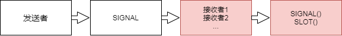

# Qt


### 快捷键

|              |          |      |
| ------------ | -------- | ---- |
| c + r        | 运行     |      |
| c + n        | 创建     |      |
| c + i        | 对齐     |      |
| c + a + 上下 | 上下移动 |      |
|              |          |      |


## 2、信号与槽 （Signal & Slot）  

### 2.1  Signal  And Slot 

信号与槽（Signal & Slot）是 Qt 编程的基础，也是 Qt 的一大创新。因为有了信号与槽的编程机制，在 Qt 中处理界面各个组件的交互操作时变得更加直观和简单。  

信号（Signal）就是在特定情况下被发射的事件，例如 PushButton 最常见的信号就是鼠标单击时发射的 clicked() 信号，一个 ComboBox 最常见的信号是选择的列表项变化时发射的CurrentIndexChanged() 信号  

GUI 程序设计的主要内容就是对界面上各组件的信号的响应，只需要知道什么情况下发射哪些信号，合理地去响应和处理这些信号就可以了。  

槽（Slot）就是对信号响应的函数。槽就是一个函数，与一般的 C++函数是一样的。
槽函数与一般的函数不同的是：槽函数可以与一个信号关联，当信号被发射时，关联的槽函数被自动执行  。

信号与槽关联是用 QObject::connect() 函数实现的，其基本格式是：

```
QObject::connect(sender, SIGNAL(signal()), receiver, SLOT(slot()));
```

connect() 是 QObject 类的一个静态函数，而 QObject 是所有 Qt 类的基类，在实际调用时可以忽略前面的限定符，所以可以直接写为：

```c++
connect(sender, SIGNAL(signal()), receiver, SLOT(slot()));
```

- sender 是发射信号的对象的名称， signal() 是信号名称。信号可以看做是特殊的函数，需要带括号，有参数时还需要指明参数。 
- receiver 是接收信号的对象名称， slot() 是槽函数的名称，需要带括号，有参数时还需要指明参数。
- SIGNAL 和 SLOT 是 Qt 的宏，用于==指明信号和槽==，并将它们的参数转换为相应的字符串。
  例如，在 4.1 小节的项目 02_designer_example 的 ui_mainwindow.h 文件（ui_mainwindow.h文件是编译后产生的， 位于 build-02_designer_example-Desktop_Qt_5_12_9_GCC_64bit-Debug文件夹目录下） 中，在 setupUi() 函数中有如下的语句：

```
QObject::connect(pushButton, SIGNAL(clicked()), MainWindow, SLOT(close()));
```

- 其作用就是将 pushButton 按钮的 clicked() 信号与窗体（MainWindow）的槽函数 close() 相关联，这样，当单击 pushButton 按钮（就是界面上的“X”按钮）时，就会执行 MainWindow的 close() 槽函数。   

```
connect(pushButton, SIGNAL(clicked()), this, SLOT(hide());
connect(pushButton, SIGNAL(clicked()), this, SLOT(close());
```

- 当一个对象 pushButton 的被单击时，所在窗体有两个槽进行响应。
- 当一个信号与多个槽函数关联时，槽函数按照建立连接时的顺序依次执行。  




断开连接的方法，初学者基本用不到断开连接的操作。使用 disconnect()。 disconnect()，这个方法重载了好几个函数，解开格式如下  

```
bool QObject::disconnect(const QObject *sender, const char *signal, const QObject *receiver, const char *method)
```

 断开一切与 myObject 连接的信号或槽。

```
disconnect(myObject, 0, 0, 0);
相当于非静态重载函数：
myObject->disconnect();
```

 断开所有连接到特定信号的东西。

```
disconnect(myObject, SIGNAL(mySignal()), 0, 0);
相当于非静态重载函数：
myObject->disconnect(SIGNAL(mySignal()));
```

 与指定的接收者断开连接。

```
disconnect(myObject, 0, myReceiver, 0);
相当于非静态重载函数：
myObject->disconnect(myReceiver);
```

信号与槽机制是 Qt GUI 编程的基础，使用信号与槽机制可以比较容易地将信号与响应代码关联起来。


