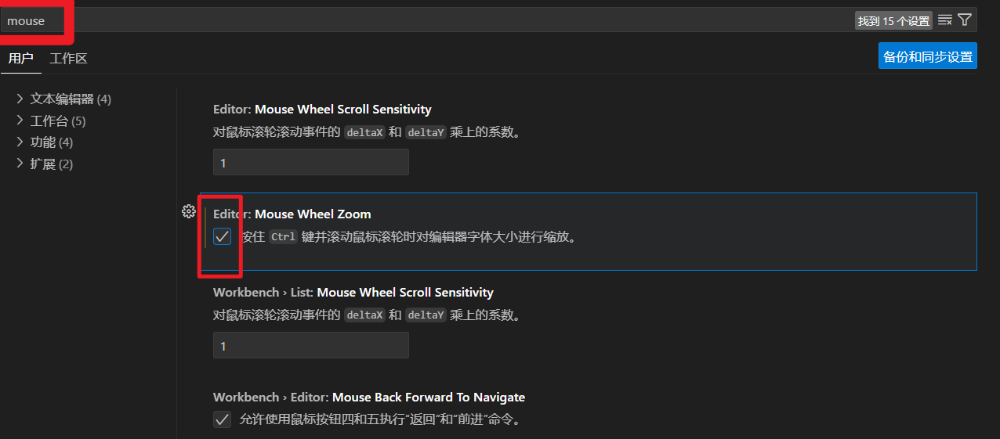
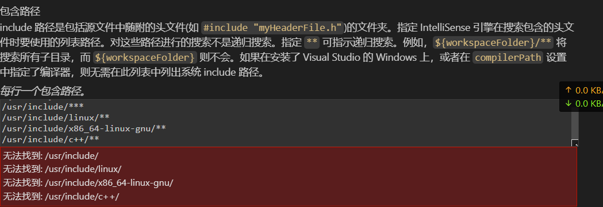

# VS code

中文官网:http://vscode.bianjiqi.net/

### 快捷键

|                                                              |          |      |
| ------------------------------------------------------------ | -------- | ---- |
| alt + shift up、down                                         | 上下赋值 |      |
| ctrl + g                                                     | 跳行     |      |
| alt + F12   \|\|\|\| ctrl + 点击                             | 跳到定义 |      |
| 您可以使用 Ctrl+Click 跳转到定义，或使用 Ctrl+Alt+单击将定义打开到一侧。 |          |      |


### 插件

我们需要按照的插件有下面几个：

1. C/C++，这个肯定是必须的。
2. C/C++ Snippets，即 C/C++重用代码块。
3. C/C++ Advanced Lint,即 C/C++静态检测 。
4. `Code Runner`，即代码运行。
5. `Include AutoComplete`，即自动头文件包含。
6. Rainbow Brackets，彩虹花括号，有助于阅读代码。
7. One Dark Pro， VSCode 的主题。
8. GBKtoUTF8，将 GBK 转换为 UTF8。
9. `ARM`，即支持 ARM 汇编语法高亮显示。  Arm Assembly
10. `Chinese(Simplified)`，即中文环境。
11. `vscode-icons`， VSCode 图标插件，主要是资源管理器下各个文件夹的图标。
12. compareit，比较插件，可以用于比较两个文件的差异。
13. DeviceTree，设备树语法插件。
14. TabNine，一款 AI 自动补全插件，强烈推荐，谁用谁知道！


### 命令行


### 在wsl中启动vscode

官网：https://code.visualstudio.com/docs/cpp/config-wsl#_set-up-your-linux-environment

1. 安装环境：window安装wsl和vscode
2. vscode连接上wsl ：vscode 命令行输入 wsl，
3. wsl 中启动 vscode：命令行输入 code .


1. 打开 `helloworld.cpp` ，使其成为活动文件。
2. 从系统上检测到的编译器列表中选择 g++ 构建和调试活动文件。
3. 系统只会在首次运行 `helloworld.cpp` 时要求您选择编译器。此编译器将在 `tasks.json` 文件中设置为“默认”编译器。
   - tasks.json 配置https://code.visualstudio.com/docs/editor/variables-reference
4. 选择g++ 编译器，即可生成可执行文件。


debug

1. 打开 `helloworld.cpp` ，使其成为活动文件。
2. 从播放按钮旁边的下拉列表中，选择调试 C/C++ 文件。
3. 选择 C/C++：g++ 从系统上检测到的编译器列表中构建和调试活动文件（仅在首次运行 ordebug 时要求您选择编译器 `helloworld.cpp` ）。
4. [使用 launch.json 自定义调试](https://code.visualstudio.com/docs/cpp/config-wsl#_customize-debugging-with-launchjson)： 点击运行右边的设置按钮生成调试活动文件。


### 设置




## 配置

launch

```
sudo apt-get purge code
sudo apt-get install code
```


```json
{
    "version": "0.2.0",
    "configurations": [
        {
            // "name": "C/C++: g++ 生成和调试活动文件",
            "name": "(gdb) 启动",
            "type": "cppdbg",
            "request": "launch",
            // "program": "${workspaceFolder}/out/test"
            "program": "${fileDirname}/a.exe", // program指定要调试的程序。这里将其设置为活动文件文件夹${fileDirname}
            // "program": "${fileDirname}/${fileBasenameNoExtension}.exe", // program指定要调试的程序。这里将其设置为活动文件文件夹${fileDirname}
            // "program": "${workspaceFolder}/${fileDirname}/${fileBasenameNoExtension}"
                            //和活动文件名（不带扩展名）${fileBasenameNoExtension}，如果是helloworld.cpp，则活动文件将为helloworld。
            "args": [],  // args属性是运行时传递给程序的参数数组。
            "stopAtEntry": false,
            "cwd": "${fileDirname}",
            // "cwd": "$${workspaceFolder}/${fileDirname}",
            "environment": [],
            "externalConsole": false,
            "MIMode": "gdb",
            "preLaunchTask": "C/C++: g++ 生成活动文件",
            // "internalConsoleOptions": "openOnSessionStart",
            "miDebuggerPath": "/usr/bin/gdb",
            "setupCommands": [
                {
                    "description": "为 gdb 启用整齐打印",
                    "text": "-enable-pretty-printing",
                    "ignoreFailures": true
                },
                {
                    "description": "将反汇编风格设置为 Intel",
                    "text": "-gdb-set disassembly-flavor intel",
                    "ignoreFailures": true
                }
            ]
        }
    ]
}
```


```shell
{
    "tasks": [
        {
            "type": "cppbuild",
            "label": "C/C++: g++ 生成活动文件",
            "command": "/usr/bin/g++",
            "args": [
                "-fdiagnostics-color=always",
                "-g",
                "hello.c",
                "-o",
                "${fileDirname}/a.exe"
            ],
            "options": {
                "cwd": "${fileDirname}"
            },
            "problemMatcher": [
                "$gcc"
            ],
            "group": {
                "kind": "build",
                "isDefault": true
            },
            "detail": "编译器：/usr/bin/g++"
        },
        {
            "type": "cppbuild",
            "label": "C/C++: gcc 生成活动文件",
            "command": "/usr/bin/gcc",
            "args": [
                "-fdiagnostics-color=always",
                "-g",
                "${file}",
                "-o",
                "${fileDirname}/${fileBasenameNoExtension}"
            ],
            "options": {
                "cwd": "${fileDirname}"
            },
            "problemMatcher": [
                "$gcc"
            ],
            "group": "build",
            "detail": "调试器生成的任务。"
        },
        {
            "type": "cppbuild",
            "label": "C/C++: gcc-11 生成活动文件",
            "command": "/usr/bin/gcc-11",
            "args": [
                "-fdiagnostics-color=always",
                "-g",
                "${file}",
                "-o",
                "${fileDirname}/${fileBasenameNoExtension}"
            ],
            "options": {
                "cwd": "${fileDirname}"
            },
            "problemMatcher": [
                "$gcc"
            ],
            "group": "build",
            "detail": "调试器生成的任务。"
        }
    ],
    "version": "2.0.0"
}
```


#### C/C++配置

```
${default}
C:\Program_My\C\cygwin\include\**
C:\Program_My\C\cygwin\x86_64-w64-mingw32\**
/usr/include/**
/usr/include/linux/**
/usr/include/x86_64-linux-gnu/**
/usr/include/c++/**
```




# VIM

### 

## 基本

https://i.linuxtoy.org/docs/guide/ch24s20.html

### 复制粘贴：yy             p 

底线命令模式，esc后输入：

### 寄存器操作 “

Vim 可以将不同字段剪切或复制到不同寄存器中，您可以从不同寄存器中取出内容后粘贴

```
"寄存器名称
```

- 按下**`"`**键和另一个字符键，便可以定义一个寄存器。例如：**`"a`** **`"1`**

定义寄存器后直接进行操作

```
"ayy    将当前行复制到寄存器 a 中
"ap     将寄存器 a 中的内容粘贴到光标之后
```

- **:registers** 查看所有寄存器的内容
- 通常情况下，寄存器 **+** (先按"，再按 Shift+= )对应 X 下的剪贴板。您在其它程序中复制的内容，可以使用 **`"+p`** 粘贴到 Vim中；您在 Vim 中，可以使用 **`"+y`** 将内容复制到剪贴板，再粘贴到其它程序中
- 没有指定寄存器时，Vim 使用“无名寄存器”存储内容

安装vim-gnome

　　执行sudo apt-get install vim-gnome命令，不行的话先执行sudo apt-get -f install命令，再执行sudo apt-get install vim-gnome命令

   “+y或“*y表示从vim复制到系统剪切版，

   “+p或”*p表示从外部文件(系统剪切版)粘帖到vim,

   “+d或“*d表示剪切.

```
 "0y  （这里面的0可以修改成0、1、2、...、9、a、“、＋、；等）
 既可把选中的内容从vim中复制到系统剪贴板中，按ctrl+v就可以粘贴。
```


### 显示行数 :set nu

- :set nu
- :set number
- :set nonu
- :set nonumber

**在 Vim 启动时显示行号**：
如果你希望在每次启动 Vim 时都显示行号，你可以在你的 `~/.vimrc`（Vim 的配置文件）文件中添加 `set number` 或 `set nu`。

**使用状态行显示行号**：
Vim 的状态行（在屏幕底部）也可以显示当前行号和列号。你可以通过修改 `statusline` 或 `ruler` 选项来实现这一点。例如，在 `~/.vimrc` 文件中添加以下行：

```shell
set ruler
```


### 跳转太某一行  10G

1. esc后直接输入 100G ，然后回车
2. :100 ，然后回车

### 可视模式 V

在 Vim 的可视模式下，你可以使用 `v`（字符可视模式）、`V`（行可视模式）或 `Ctrl+v`（块可视模式）来选择多行，并进行复制、剪切、粘贴等操作。


### 撤销 u

Vim编辑器是一个强大的文本编辑器，支持多种撤销和恢复操作，以帮助用户在编辑过程中进行错误修正或回退到先前的状态。在 Vim 中，撤销操作通常是通过以下键组合来实现的：

==ctrl +r  撤销撤销==

1. `u` 或 `Ctrl + R`：这是最基本的撤销操作，用于撤销上一个命令或字符。如果你需要撤销多个步骤，可以连续按下这个键。
2. `U`：这个命令会撤销从当前光标位置到行首的所有更改。
3. `Ctrl + U` 或 `ggVG`：这将撤销整个文件中的所有更改，从开头到当前位置。
4. 如果你误删了较大的内容，使用 `Ctrl + R` 可以查看最近被删除的内容，然后再次输入 `p`（paste）来恢复。
5. 为了在历史记录中浏览更早的撤销步骤，可以使用 `Ctrl + R` 进入反向搜索模式，并输入你想要恢复的命令的前几个字母。
6. 对于更复杂的撤销或重做操作，Vim 提供了一个命令模式下的 `:undo` 和 `:redo` 命令，分别用于撤销和恢复。

记住，Vim 的撤销是基于命令的，而不是基于每一步操作的，所以在复杂操作序列之后可能会丢失一些中间状态。如果你需要在长时间内保存更精细的撤销点，可以考虑使用插件如 `vim-unimpaired` 或者 `undotree` 来增强撤销功能。

### ctrl FB 翻页	

### 替换 ：s

按下 **`/`** 键，编辑器底部会出现 **`/`** 符号，接着输入字符串，便可以进行搜索

| /    | 向下搜索   | ?    | 向上搜索   |
| ---- | ---------- | ---- | ---------- |
| n    | 搜索下一个 | N    | 搜索上一个 |

 

| :s/源字符串/目标字符串              | 将源字符串替换为目标字符串       |
| ----------------------------------- | -------------------------------- |
| :s/源字符串/目标字符串/g            | 替换当前行中所有符合条件的字符串 |
| :行号1,行号2s/源字符串/目标字符串/g | 在指定行中进行替换               |
| :%s/源字符串/目标字符串/g           | 全文替换                         |

### 标记 ‘

```
m标记名称    定义标记。标记名称为一个字符
`标记名称    返回标记

mx           将当前光标处定义为标记 x
`x           返回标记 x

:marks       查看标记列表  
```

Vim 在7以后的版本，开始支持标签页的功能

```
:tabnew    新建一个标签
:tabnext   转到下一个标签
:tabprevious  转到上一个标签
```


### 宏 q

您可以将一系列的操作录制为一个宏，然后执行它

```
q宏名称    开始录制宏。宏名称为一个字符
q         录制中按下“q”键，结束录制

@宏名称    执行宏
```

- 可以使用 **:registers**（寄存器列表） 命令查看已记录的宏


### 插入模式下的快捷键

| Ctrl+r寄存器名称 | 插入指定寄存器内容   |
| ---------------- | -------------------- |
| Ctrl+k(2个字符)  | 输入二合字符         |
| Ctrl+v数字       | 通过数字编码输入字符 |
| Ctrl+v键位       | 输入键位的名称       |


### 折叠 zf

| zf数字             | 创建折叠，数字参数为折叠行数 |
| ------------------ | ---------------------------- |
| zo                 | 打开折叠                     |
| zc                 | 关闭折叠                     |
| zd                 | 删除折叠                     |
| :set foldcolumn=4  | 显示折叠树                   |
| :mkview            | 保存折叠                     |
| :loadview          | 读取折叠                     |
| zr                 | 打开同一层级所有折叠         |
| zm                 | 关闭同一层级所有折叠         |
| zO                 | 打开某一行的所有层级折叠     |
| zC                 | 关闭某一行的所有层级折叠     |
| zR                 | 打开所有折叠                 |
| zM                 | 关闭所有折叠                 |
| :set foldclose=all | 光标离开折叠自动关闭         |
| :set foldopen=all  | 光标遇到折叠自动打开         |

您可以在配置文件中定义折叠的方式

```
"设定折叠方式
set foldmethod=manual

" manual 手动折叠
" indent 按缩进折叠
" marker 按标记折叠
" syntax 按语法折叠
" expr   按表达式折叠
```

按标记折叠的例子：

```
#起始标记 {{{ 将标记放到注释里，不会影响文件的功能 

起始标记和结束标记之间的内容折叠
显示为起始标记所在行
#结束标记 }}}
###### 将折叠方式写到模式行里 #####
# vim: foldmethod=marker 
```


### 多栏窗口


### 换行符检测 LF

问题描述：

这个警告信息通常出现在使用Git进行版本控制时，提示在工作副本中的某个文件或目录中，存在行尾结束符(EOL)的不一致问题。
LF指的是Linux系统中的行尾结束符（LF），
而CRLF常见于Windows系统，表示回车加换行（Carriage Return Line Feed）。

这个警告通常发生在跨平台协作开发时，比如在Windows系统上的用户检出在Linux系统上的Git仓库中的文件。
Git可以自动将EOL从LF转换为CRLF或者从CRLF转换为LF，这个转换是由core.autocrlf配置项控制的。

解决方法：

如果你想保留仓库中的LF行尾结束符，并让Git在检出时自动转换CRLF到LF，你可以设置Git配置：

```shell
git config --global core.autocrlf input
```

如果你想保留在Windows系统上的CRLF，并让Git在检出时不自动转换，你可以设置Git配置：

```shell
git config --global core.autocrlf true
```

如果你想完全避免这个警告，并保持文件原有的EOL，可以设置Git配置：

```shell
git config --global core.autocrlf false
```

选择哪种配置取决于你的工作环境和偏好。
通常情况下，推荐使用input模式，这样可以在提交时将CRLF转换为LF，但在检出时不做转换。
————————————————

                            版权声明：本文为博主原创文章，遵循 CC 4.0 BY-SA 版权协议，转载请附上原文出处链接和本声明。

原文链接：https://blog.csdn.net/weixin_44141284/article/details/139328894


### Ctrl+Z

Ctrl+Z：暂停当前命令的执行，将该进程放入后台，回到SHELL
jobs：查看当前在后台执行的任务，可查看任务编号（查看进程号pid需搭配选项 -l）:
[2]+   210 Stopped                 vi db.json
1
&：运行命令时，在命令末尾加上&可让命令在后台执行
fg n：将命令进程号码为N的命令进程放到前台执行
bg n：将命令进程号码为N的命令进程放到后台执行（不论它之前的状态时运行中还是暂停）
[nohup + 命令]：(https://man.linuxde.net/nohup)：不挂断地运行命令，该命令的输出信息将不会显示到终端。该命令可以在你退出帐户/关闭终端之后继续运行相应的作业。
注：

这几个命令都是与系统任务有关
注意区分进程号和作业号
使用nohup时，在缺省情况下该进程的所有输出都被重定向到当前目录的nohup.out文件中，若当前目录的 nohup.out 文件不可写，输出重定向到 $HOME/nohup.out 文件中。
作业与进程的区别与联系：
联系：
一个作业通常包括几个进程，几个进程共同完成一个任务，即作业。
用户提交作业以后，当作业被调度，系统会为作业创建进程，一个进程无法完成时，系统会为这个进程创建子进程。
区别：
进程是一个程序在一个数据集上的一次执行，而作业是用户提交给系统的一个任务。
[ ]中的数字是作业号（或称任务编号），在用kill杀死作业的时候用kill %[ num]
pid 是进程号，在用kill杀死进程的时候可以直接用kill -pid。
nohup 和 & 的区别和联系
用nohup运行命令可以使命令永久的执行下去，和用户终端没有关系，例如断开SSH连接都不会影响运行；

&是指在后台运行，但当用户退出(挂起)的时候，命令自动也跟着退出

经常连用：

nohup COMMAND &
1
后台运行的程序即守护进程

拓展阅读：

【linux】bg和fg命令的学习
————————————————

                            版权声明：本文为博主原创文章，遵循 CC 4.0 BY-SA 版权协议，转载请附上原文出处链接和本声明。

原文链接：https://blog.csdn.net/qq_32682301/article/details/112755540


# Linux 命令行窗口

使用 **`Ctrl+a`** 组合键，我们就不需要使用方向键来移动光标，方向键每次只能移动一个字符，没有效率

您还可以使用 **`Ctrl+f`** 向前移动光标， **`Ctrl+b`** 向后移动光标， **`Ctrl+e`** 将光标移动到行末……（[键绑定](https://i.linuxtoy.org/docs/guide/ch14s05.html#keybind)）


### Ctrl+s

有时您会不小心按下 **`Ctrl+s`** 这个组合键，Shell 便被冻结。尝试使用 **`Ctrl+q`** 组合键，看能否恢复正常。


### 通配符

使用 ***?\*** 代表任意单个字符。例如 ???lo ，表示 lo 前有三个字符，它可以匹配 Hello

使用 ***\**** 代表随意几个任意字符。例如 *.iso ，代表所有 iso 格式的文件。

您可以将遍历补全和通配符结合使用，以提高效率。例如：

```
cd */   则遍历补全只补全文件夹
chmview *.chm 则遍历补全只补全 chm 文件    
```

### 任务管理

- &

  在命令的末尾加上一个 & 符号，表示背景任务，例如：`wget http://www.download.net/xxx/mp3 &`

- ;

  使用 ; 将多个命令连结起来，则表示任务按顺序执行

- &&

  使用 && 将多个命令连结起来，则表示只有前面的命令执行成功，后面的命令才能得以执行

- ``

  `(命令)` ，如果一个命令中包含以 `` （Esc键 下方的按键）括起来的子命令，那么子命令将被优先执行，执行结果被代入上一级命令继续执行，例如创建一个以当前时间命名的文件：`touch `date +%m.%d_%H:%M:%S``touch 命令能够创建一个文件，它的操作对象，为 date +%m%d%H%M%S 命令的输出 06.06_06:06:60这样，我们创建了一个名为 06.06_06:06:60 的文件（六月六日六时六分刚过六十秒-_-!）

- Ctrl+z

  将当前 Shell 中的任务挂起,这个时候任务的状态为`[1]+  Stopped   xxx	  `

- bg

  将挂起的任务背景运行。这时它的状态为`[1]+ xxx &`

- fg

  将背景任务调到前台执行

- jobs

  查看背景任务，方括号中的数字为命令的任务编号如果后台运行多个任务，您可以在 bg 或者 fg 后跟任务编号，作为操作对象，例如：`bg 2`

