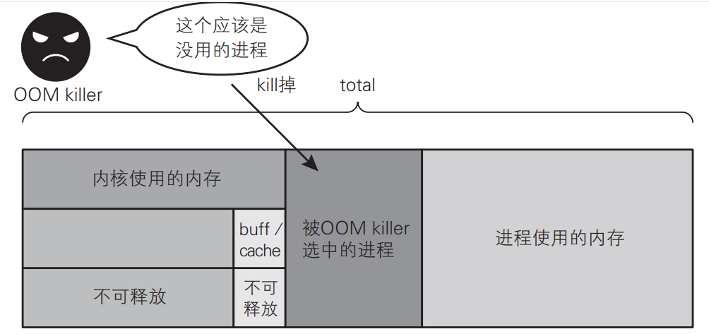
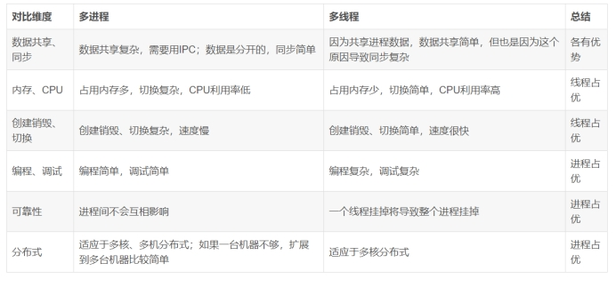

## shell命令

```
free -h

               total        used        free      shared  buff/cache   available
Mem:            15Gi        12Gi       2.5Gi        17Mi       223Mi       2.6Gi
Swap:           48Gi       1.6Gi        46Gi
```

所有数值的单位都为千字节（ KB）。
●  total 字段：系统搭载的物理内存总量。在上面的例子中约为 32 GB
●  free 字段：表面上的可用内存量（详情请参考下面的 available字段的说明）
●  buff/cache 字段：缓冲区缓存与页面缓存（详见第 6 章）占用的内存。当系统的可用内存量（ free 字段的值）减少时，可通过内核将它们释放出来
●  available 字段：实际的可用内存量。本字段的值为 free 字段的值加上当内存不足时内核中可释放的内存量。
“可释放的内存”指缓冲区缓存与页面缓存中的大部分内存，以及内核中除此以外的用于其他地方的部分内存


### cat /proc/ pid /maps

根据进程id查看一个进程的内存映射（动态链接库）

```
 readelf 命令或者 cat /proc/ pid /maps 输出的地址也是虚拟地址
```


## 6、信号基础


### 6.1 基本概念

信号是事件发生时对进程的通知机制，也可以把它==称为软件中断==。
信号与硬件中断的相似之处在于能够打断程序当前执行的正常流程， 其实是在软件层次上对中断机制的一种模拟。 
大多数情况下，是无法预测信号达到的准确时间，所以，信号提供了一种处理==**异步事件**==的方法。

#### 1. 信号的目的是用来通信的

一个具有合适权限的进程能够向另一个进程发送信号，信号的这一用法可作为一种同步技术，甚至是进程间通信（IPC）的原始形式。
**==进程 -> 进程、进程 -> 内核、内核 -> 进程==**

⚫ **硬件发生异常，即硬件检测到错误条件并通知内核，随即再由内核发送相应的信号给相关进程。**硬件检测到异常的例子包括执行一条异常的机器语言指令，诸如，除数为 0、数组访问越界导致引用了无法访问的内存区域等，这些异常情况都会被硬件检测到，并通知内核、然后内核为该异常情况发生时正在运行的进程发送适当的信号以通知进程。
⚫ **用于在终端下输入了能够产生信号的特殊字符**。 譬如在终端上按下 CTRL + C 组合按键可以产生中断信号（SIGINT），通过这个方法可以终止在前台运行的进程；按下 CTRL + Z 组合按键可以产生暂停信号（SIGCONT），通过这个方法可以暂停当前前台运行的进程。
⚫ **进程调用 kill()系统调用可将任意信号发送给另一个进程或进程组**。 当然对此是有所限制的，接收信号的进程和发送信号的进程的所有者必须相同，亦或者发送信号的进程的所有者是 root 超级用户。
⚫ **用户可以通过 kill 命令将信号发送给其它进程**。 kill 命令想必大家都会使用，通常我们会通过 kill命令来“杀死”（终止）一个进程，譬如在终端下执行"kill -9 xxx"来杀死 PID 为 xxx 的进程。 kill命令其内部的实现原理便是通过 kill()系统调用来完成的。
⚫ **发生了软件事件，即当检测到某种软件条件已经发生**。 这里指的不是硬件产生的条件（如除数为 0、引用无法访问的内存区域等），而是软件的触发条件、触发了某种软件条件（进程所设置的定时器已经超时、进程执行的 CPU 时间超限、进程的某个子进程退出等等情况）。

进程同样也可以向自身发送信号，然而发送给进程的诸多信号中，大多数都是来自于内核。
以上便是可以产生信号的多种不同的条件，总的来看，信号的目的都是用于通信的，当发生某种情况下，通过信号将情况“告知”相应的进程，从而达到同步、通信的目的。

#### 2. 信号由谁处理、怎么处理

==信号通常是发送给对应的进程==，当信号到达后， 该进程需要做出相应的处理措施，通常进程会视具体信号执行以下操作之一：
⚫ **忽略信号**。也就是说，当信号到达进程后，该进程并不会去理会它、直接忽略，就好像是没有出该信号，信号对该进程不会产生任何影响。事实上，大多数信号都可以使用这种方式进行处理，但有两种信号却决不能被忽略，它们是 SIGKILL 和 SIGSTOP，这两种信号不能被忽略的原因是：它们向内核和超级用户提供了使进程终止或停止的可靠方法。另外，如果忽略某些由硬件异常产生的信号，则进程的运行行为是未定义的。
⚫ **捕获信号**。 当信号到达进程后，执行预先绑定好的信号处理函数。为了做到这一点，要通知内核在某种信号发生时，执行用户自定义的处理函数，该处理函数中将会对该信号事件作出相应的处理，Linux 系统提供了 signal()系统调用可用于注册信号的处理函数，
⚫ **执行系统默认操作**。 

#### 3. 信号是异步的

信号是异步事件的经典实例，程序是无法得知中断事件产生的具体时间，只有当产生中断事件时，才会告知程序、然后打断当前程序的正常执行流程、跳转去执行中断服务函数，这就是异步处理方式。

#### 4. 信号本质上是 int 类型数字编号


信号本质上是 int 类型的数字编号，这就好比硬件中断所对应的中断号。
==内核针对每个信号==，都给其定义了一个唯一的整数编号，从数字 1 开始顺序展开。
并且每一个信号都有其对应的名字（其实就是一个宏），信号名字与信号编号乃是一一对应关系，但是由于每个信号的实际编号随着系统的不同可能会不一样，所以在程序当中一般都使用信号的符号名（也就是宏定义）。

信号编号是==从 1 开始==的，事实上 kill()函数对信号==编号 0== 有着特殊的应用，关于这个文件将会在后面的内容向大家介绍。  

```c
// 下为不可靠信号 小于34
/* Signals. */
#define SIGHUP 1 /* Hangup (POSIX). */
#define SIGINT 2 /* Interrupt (ANSI). */
#define SIGQUIT 3 /* Quit (POSIX). */
#define SIGILL 4 /* Illegal instruction (ANSI). */
#define SIGTRAP 5 /* Trace trap (POSIX). */
#define SIGABRT 6 /* Abort (ANSI). */
#define SIGIOT 6 /* IOT trap (4.2 BSD). */
#define SIGBUS 7 /* BUS error (4.2 BSD). */
#define SIGFPE 8 /* Floating-point exception (ANSI). */
#define SIGKILL 9 /* Kill, unblockable (POSIX). */
#define SIGUSR1 10 /* User-defined signal 1 (POSIX). */
#define SIGSEGV 11 /* Segmentation violation (ANSI). */
#define SIGUSR2 12 /* User-defined signal 2 (POSIX). */
#define SIGPIPE 13 /* Broken pipe (POSIX). */
#define SIGALRM 14 /* Alarm clock (POSIX). */
#define SIGTERM 15 /* Termination (ANSI). */
#define SIGSTKFLT 16 /* Stack fault. */
#define SIGCLD SIGCHLD /* Same as SIGCHLD (System V). */
#define SIGCHLD 17 /* Child status has changed (POSIX). */
#define SIGCONT 18 /* Continue (POSIX). */
#define SIGSTOP 19 /* Stop, unblockable (POSIX). */
#define SIGTSTP 20 /* Keyboard stop (POSIX). */
#define SIGTTIN 21 /* Background read from tty (POSIX). */
#define SIGTTOU 22 /* Background write to tty (POSIX). */
#define SIGURG 23 /* Urgent condition on socket (4.2 BSD). */
#define SIGXCPU 24 /* CPU limit exceeded (4.2 BSD). */
#define SIGXFSZ 25 /* File size limit exceeded (4.2 BSD). */
#define SIGVTALRM 26 /* Virtual alarm clock (4.2 BSD). */
#define SIGPROF 27 /* Profiling alarm clock (4.2 BSD). */
#define SIGWINCH 28 /* Window size change (4.3 BSD, Sun). */
#define SIGPOLL SIGIO /* Pollable event occurred (System V). */
#define SIGIO 29 /* I/O now possible (4.2 BSD). */
#define SIGPWR 30 /* Power failure restart (System V). */
#define SIGSYS 31 /* Bad system call. */
#define SIGUNUSED 31
```

#### 5. 信号接收与处理

##### **信号递达 (Signal Delivery)**

**信号递达**是指信号已经到达进程，并且即将或者正在被处理的状态。

- 当信号递达时，系统会决定如何**处理这个信号**。可能的处理方式包括：
  1. 执行信号的默认操作（如终止进程、忽略信号、核心转储等）。
  2. 忽略
  3. 调用进程为该信号设置的信号处理函数（Signal Handler）。
  4. 将信号放入未决信号集，等待解除阻塞后再处理（如果该信号当前被阻塞）。
- **信号递达的过程**：
  1. 当信号发送到进程时，内核会在进程上下文中检测到这个信号。
  2. 如果信号没有被阻塞且处理函数已设置，内核会将当前进程的上下文切换到信号处理函数中执行。
  3. 信号处理完毕后，进程会恢复之前的执行状态。

##### **信号未决 (Pending Signal)**

**信号未决**是指信号已经发送给了进程，但由于该信号当前被阻塞或者进程正在处理其他信号，尚未被处理的状态。换句话说，信号已经存在于进程的信号队列中，但还没有被递达和处理。

- 未决信号会在以下情况下处理：
  1. **解除阻塞**：如果进程通过 `sigprocmask` 或 `pthread_sigmask` 系统调用解除对该信号的阻塞，未决信号将立即递达并处理。
  2. **信号处理器空闲**：当进程完成了当前信号处理器中的工作，且未决信号解除阻塞时，信号将被递达。

1. **信号未决的过程**：

   - 当一个信号发送到进程，但被阻塞时，内核会将该信号添加到未决信号集。

   - 内核为每个进程维护一个未决信号集（`pending signals`），表示当前尚未处理的信号。

   - 解除信号阻塞或进程准备好处理信号时，内核会从未决信号集中取出信号并递达。

**信号递达与信号未决的关系**

- **递达与处理**：信号递达是信号处理过程的一部分，而信号未决是信号递达之前的状态。
- **阻塞与解除阻塞**：如果信号在发送时被阻塞，它将进入未决状态，直到被解除阻塞为止。解除阻塞后，信号会递达并执行对应的操作。


##### 一、信号的基本概念

Linux信号是进程间通信的一种方式，用于在不同进程之间传递信息。信号本身是一个简短的消息，用来通知进程发生了某个事件，但信号并不具备传递用户数据的功能。信号可以被视为一种异步的中断机制，用于触发进程执行相应的处理操作。

##### 二、信号的发送

当一个进程需要向另一个进程发送信号时，它会通过**系统调用**来完成。内核会将信号**添加到目标进程的信号队列中**，并更新进程的状态信息。

信号的发送可以是由硬件中断、软件异常或用户自定义事件触发的。

##### 三、信号的接收与处理

1. 信号接收：
   - 信号的接收是由内核代理的。当内核接收到信号后，会将其放到对应进程的信号队列中，并向进程发送一个中断，使其陷入内核态。
   - 此时，信号==**处于未决（Pending）（在内核的信号队列中，等待被处理）状态**==，对进程来说暂时是不知道有信号到来的。
2. 信号检测：
   - 进程在两种场景下会对信号进行检测：从内核态返回到用户态前，以及在内核态中被唤醒时。
   - 当检测到有新信号时，进程会准备进入信号处理阶段。
3. 信号处理：
   - 信号处理函数是运行在用户态的，以防止内核态程序拥有过高的权限对系统造成潜在危险。
   - 在处理信号之前，内核会将当前内核栈的内容备份拷贝到用户栈上。
   - 随后，进程返回到用户态，执行相应的信号处理函数。
4. 处理完成：
   - 信号处理函数执行完毕后，进程会主动调用系统调用（如sigreturn）再次回到内核态。
   - 内核会检查是否还有其他信号未处理，如果没有，则将之前保存的栈内容恢复，并将指令寄存器指向中断前的运行位置，最后回到用户态继续执行程序。

##### 四、信号的状态管理

- **信号挂起（Pending）**：信号发送接口调用后，pending状态在进程的task_struct结构中更新，并将信号信息挂入队列。当信号处理时，从队列中取出信号信息，并删除对应信号的pending状态位。
- **信号阻塞（Blocked）**：进程可以选择阻塞某个信号，被阻塞的信号产生时将保持在未决状态，直到进程解除对此信号的阻塞。此外，用户程序可以通过sigprocmask等系统调用来修改阻塞状态。
- **信号递达（Delivered）**：当信号成功发送且未被阻塞时，信号处理过程会在合适的时机被执行。
- **信号忽略（Ignore）**：当信号被判断为ignored状态时，信号发送流程会跳过设置pending状态，信号被丢弃。

##### 五、信号的分类与特性

Linux中的信号分为常规信号（1-31）和实时信号（32-64）。常规信号通常用于系统定义的特定事件，而实时信号则允许用户自定义功能，并具有信号缓存特性。

综上所述，Linux中信号的实现原理涉及信号的发送、接收、处理和状态管理等多个方面。通过内核对信号的精细管理，Linux系统能够高效地处理并发事件，保证进程间的正确通信和系统的稳定运行。


#### 6.信号存储方式

**信号注册指的是在目标进程中注册**，该目标进程中有==未决信号==的信息。
啥叫未决信号呢，实际执行信号的处理动作称为==信号递达==，信号从产生到递达之间的状态，称为==信号未决==。

==**信号注册的过程就是将信号值加入到未决信号集siginfo_t中。**==

```c
struct sigpending{
  //未决信号链的头部与尾部
    struct sigqueue *head, *tail;
  //未决信号集
    sigset_t signal;
};
 
 
struct sigqueue{
    struct sigqueue *next;
  //信号所携带的信息
    siginfo_t info;
}
```


在 Linux 中，信号分为可靠信号和不可靠信号。理解它们在内存中的存储位置以及存储方式的区别，有助于理解它们的行为差异。

##### 不可靠信号

不可靠信号是早期 Unix 系统中的传统信号机制，也称为 "原始信号"。它们有以下特点：

1. **信号丢失**：如果同==一个信号在信号处理程序执行之前多次发送给进程，可能会导致信号丢失。==即信号**==未被排队处理==**。
2. **存储位置**：不可靠信号使用的是==一个简单的信号位掩码==来表示。每个信号在内存中都有一个对应的位，当信号发生时，相应的位被置为 1。内核使用 `sigpending` 结构体来管理进程的挂起信号。

##### 可靠信号

可靠信号引入了信号排队机制，避免了信号丢失问题。它们有以下特点：

1. **信号排队**：同一信号在信号处理程序执行之前多次发送时，信号不会丢失，所有的信号都会被排队处理。
2. **存储位置**：可靠信号使用了一个更复杂的数据结构，包含了信号队列。每个信号在内存中不仅有一个对应的位，还使用了一个链表或队列来存储额外的信息。内核使用 `sigqueue` 结构体来管理排队的信号。

##### 内存存储结构的区别

##### 不可靠信号的存储方式：

- **信号位掩码**：一个简单的位掩码表示信号的状态。每个信号占用一个位，0 表示信号未发生，1 表示信号已发生。

- 示意图

  ：

  ```
  lua复制代码|-------------------|
  | SIGINT | 0 | 0 | 1 | 0 | ... |
  |-------------------|
  ```

  例如，如果 

  ```
  SIGINT
  ```

   发生了，那么 

  ```
  SIGINT
  ```

   的对应位将被置为 1。

##### 可靠信号的存储方式：

- **信号位掩码**：类似于不可靠信号，使用位掩码来表示信号的状态。

- **信号队列**：一个链表或队列存储排队的信号信息，包括信号的发生顺序、附加数据等。

- 示意图

  ：

  ```
  rust复制代码|-------------------|    Queue:  SIGUSR1 -> SIGUSR1 -> SIGTERM
  | SIGINT | 0 | 1 | 0 | 1 | ...  |  ->  [SIGUSR1, data] -> [SIGUSR1, data] -> [SIGTERM, data]
  |-------------------|
  ```

  例如，如果 

  ```
  SIGUSR1
  ```

   发生了两次，且 

  ```
  SIGTERM
  ```

   发生了一次，那么会有一个队列记录这些信号及其附加数据。

##### 具体的实现

##### 不可靠信号的实现：

1. **位掩码**：`sigpending` 结构体中保存的信号位掩码用于表示当前挂起的信号。
2. **信号处理**：当信号处理程序执行时，相应的位被清除。如果在处理信号之前同一个信号再次发生，信号会被覆盖。

##### 可靠信号的实现：

1. **位掩码**：`sigpending` 结构体仍然存在，用于表示挂起信号的状态。
2. **信号队列**：使用 `sigqueue` 结构体存储排队信号，确保信号不会丢失。
3. **信号处理**：当信号处理程序执行时，处理队列中的所有信号，每个信号都有其完整的信息。

##### 代码示例

##### 不可靠信号处理：

```c
c复制代码#include <signal.h>
#include <stdio.h>
#include <unistd.h>

void handler(int signum) {
    printf("Caught signal %d\n", signum);
}

int main() {
    signal(SIGINT, handler);
    while (1) {
        sleep(1);
    }
    return 0;
}
```

##### 可靠信号处理：

```c
c复制代码#include <signal.h>
#include <stdio.h>
#include <unistd.h>
#include <stdlib.h>

void handler(int signum, siginfo_t *info, void *context) {
    printf("Caught signal %d, value: %d\n", signum, info->si_value.sival_int);
}

int main() {
    struct sigaction sa;
    sa.sa_flags = SA_SIGINFO;
    sa.sa_sigaction = handler;
    sigemptyset(&sa.sa_mask);
    sigaction(SIGINT, &sa, NULL);

    union sigval value;
    value.sival_int = 123;
    sigqueue(getpid(), SIGINT, value);

    while (1) {
        sleep(1);
    }
    return 0;
}
```

### 总结

- **不可靠信号** 使用简单的信号位掩码在内存中表示，可能会丢失同类型的多个信号。
- **可靠信号** 使用信号队列来存储信号信息，确保同类型的多个信号不会丢失。其在内存中除了使用信号位掩码外，还使用链表或队列来管理信号及其附加数据。

理解这些信号机制及其内存存储方式，有助于选择和设计适当的信号处理方案，确保信号在复杂系统中被正确处理和响应。

### 6.2 信号的分类

Linux 系统下可对信号从两个不同的角度进行分类.

#### 1.  可靠信号大于34与不可靠信号小于34

Linux 信号机制基本上是从 UNIX 系统中继承过来的， 早期 UNIX 系统中的信号机制比较简单和原始，后来在实践中暴露出一些问题，它的主要问题是：
⚫ 进程每次处理信号后，就将对信号的响应设置为系统默认操作。在某些情况下，将导致对信号的错误处理；因此，用户如果不希望这样的操作，那么就要在==信号处理函数结尾再一次调用 signal()，重新为该信号绑定相应的处理函数==。
⚫ 因此导致， 早期 UNIX 下的不可靠信号主要指的是==**进程可能对信号做出错误的反应以及信号可能丢失**==（**处理信号时又来了新的信号，则导致信号丢失）。**

Linux 支持不可靠信号， 在调用完信号处理函数后，不必重新调用signal()。因此， **Linux 下的==不可靠信号问题主要指的是信号可能丢失==**。在 Linux 系统下，信号值**小于 SIGRTMIN（34）** 的信号都是不可靠信号， 这就是"不可靠信号"的来源。

随着时间的发展， 实践证明，有必要对信号的原始机制加以改进和扩充， 所以，后来出现的各种 UNIX版本分别在这方面进行了研究，<u>力图实现"可靠信号</u>"。由于原来定义的信号已有许多应用，不好再做改动，最终只好又新增加了一些信号(SIGRTMIN~SIGRTMAX)，并在一开始就把它们定义为可靠信号， 在 Linux 系统下使用`"kill -l"`命令可查看到所有信号，如下所示

**可靠信号**：并没有一个具体对应的名字，而是使用了 ==SIGRTMIN+N 或 SIGRTMAXN== 的方式来表示。  

```
kill -l
```


可靠信号支持排队，不会丢失， 同时，信号的发送和绑定也==出现了新版本==， 信号发送函数 sigqueue()及信号绑定函数 sigaction()。  

早期 UNIX 系统只定义了 31 种信号，而 Linux 3.x 支持 64 种信号，编号 1-64(SIGRTMIN=34， SIGRTMAX=64)，将来可能进一步增加，这需要得到内核的支持。前 31 种信号已经有了预定义值，每个信号有了确定的用途、 含义以及对应的名字，并且每种信号都有各自的系统默认操作。如按键盘的 CTRL+C时，会产生 SIGINT 信号，对该信号的系统默认操作就是终止进程  


#### 2. 实时信号与非实时信号

实时信号与非实时信号其实是从时间关系上进行的分类，与可靠信号与不可靠信号是相互对应的， 
**==非实时信号都不支持排队，都是不可靠信号；==**
==实时信号都支持排队，都是可靠信号。== 
实时信号保证了发送的多个信号都能被接收， 实时信号是 POSIX 标准的一部分，可用于应用进程。
一般我们也把非实时信号（不可靠信号）称为标准信号，如果文档中用到了这个词，那么大家要知道，这里指的就是非实时信号（不可靠信号）。 关于更多实时信号相关内容将会在 8.10 小节中介绍。

- 标准信号（非实时信号、不可靠信号）：**前31个信号**，它们是从Unix系统**继承**下来的经典系统元素，他们有如下的特点：

- 1. 不排队，信号的响应会**相互嵌套**。
  2. 如果目标进程没有及时响应，那么随后到达的相同信号将会被丢弃。
  3. 每个信号都对应一个系统事件（除了SIGUSR1和SIGUSR2），当这个事件发生时，将产生这个信号。
  4. 在进程的挂起信号中，进程会优先响应实时信号。

- 实时信号：**后31个信号**，它们是Linux系统新增的实时信号，也被称为“可靠信号”，这些信号的特征是：

  1. 实时信号的响应次序按接收顺序排队（队列），相互嵌套。
  2. 即使相同的实时信号被同时发送多次，也不会被丢弃，而会依次挨个响应。
  3. 实时信号没有特殊的系统事件与之对应（通过代码手动触发）。
  4. ==**在挂起的信号集中，实时信号会按优先级进行相应 （值越大优先级越高）**==

|                            | 标准信号，非实时信号                                         | 实时信号                                                     |
| -------------------------- | ------------------------------------------------------------ | ------------------------------------------------------------ |
| 信号的响应会**相互嵌套**。 | 不排队                                                       | 排队（按接收顺序排序）                                       |
| 响应要求                   | 如果目标进程没有及时响应，那么随后到达的相同信号将会被丢弃。 | 即使相同的实时信号被同时发送多次，也不会被丢弃，会排队响应。 |
| 触发条件                   | 每个信号都对应一个系统事件（除了SIGUSR1和SIGUSR2），当这个事件发生时，将产生这个信号。 | 实时信号没有特殊的系统事件与之对应（通过代码手动触发）       |
| 响应顺序                   | 在进程的挂起信号中，进程会优先响应实时信号                   | 在挂起的信号集中，实时信号会按优先级进行相应 （值越大优先级越高） |


**信号的生命周期**

所谓信号的生命周期，指的是信号从产生到被响应完毕的整个过程，这个过程可被描述为：


#### 3. 常见信号与默认行为

signal(SIGINT, SIG_IGN)

raise(sig) 向自己发送信号

没有32、33


| 函数产生信号 |                | 信号名称           | 编号    | 描述 IGN  DEF                                                | 系统默认操作    |
| ------------ | -------------- | ------------------ | ------- | ------------------------------------------------------------ | --------------- |
| Ctrl + C     | 终止           | SIGINT             | 2       | **终端中断符**   signal(SIGINT, SIG_IGN)设置忽略信号         | term            |
| Ctrl + \     | 终止           | SIGQUIT            | 3       | 终端退出符                                                   | term+core       |
|              | 指令           | SIGILL             | 4       | 非法硬件指令（机器指令错误）                                 | term+core       |
| abort()      | 终止           | SIGABRT            | 6       | 即使加入阻塞集，进程也会终止，切会刷新缓冲区，关闭文件描述符。（核心以转储） | term+core       |
|              | 总线           | SIGBUS             | 7       | 内存访问错误（总线错误）                                     | term+core       |
|              | 计算           | SIGFPE             | 8       | 算术异常（譬如除以 0）                                       | term+core       |
| 只能默认     | 强杀           | SIGKILL            | 9  默认 | 终极终止信号(这个信号不能捕获，只能默认处理（也就是说不能SIG_IGN） | term            |
|              | ——             | SIGUSR1            | 10      | 用户自定义信号 1                                             | term            |
| 访问无效内存地址 | 堆栈           | SIGSEGV            | 11      | 无效的内存引用（堆栈错误？）Segmentation fault (core dumped) | term+core       |
|              | ——             | SIGUSR2            | 12      | 用户自定义信号 2                                             | term            |
| 管道读端关闭 | 终止           | SIGPIPE            | 13      | 管道读关闭，一但执行写操作，就发出此信号，退出程序。         | term            |
| alarm(time)  | 闹钟<br />终止 | SIGALRM            | 14      | 定时器超时（alarm(time)） **闹钟**                           | term            |
|              |                | SIGTERM            | 15      | 终止进程                                                     | term            |
|              | 孩子<br />——   | ==SIGCHLD==/SIGCLD | 17      | 子进程终止或停止时就会发送这个信号给父进程                   | ignore          |
|              | 继续           | SIGCONT            | 18      | 使停止状态的进程**继续运行**                                 | cont            |
| ——只能默认   | 暂停<br />挂起 | SIGSTOP            | 19      |||
| Ctrl + Z     | 暂停<br />挂起 | SIGTSTP            | 20      | 终端停止符                                                   | **stop**        |
|  |  | SIGURG | 23 | 网络套接字，紧急数据 |  |
|              |                | SIGXCPU            | 24      | 超过 CPU 限制                                                | term+core       |
|              |                | SIGVTALRM          | 26      | 虚拟定时器超时                                               | term            |
|              |                | SIGWINCH           | 28      | 终端窗口尺寸发生变化                                         | **ignore**      |
|              |                | SIGPOLL/SIGIO      | 29      | 异步 I/O （内核向事件的接受进程发送信号）                    | **term/ignore** |
|              |                | SIGSYS             | 31      | 无效系统调用                                                 | term+core       |

- erm 表示终止进程； 
- core 表示生成核心转储文件， 核心转储文件可用于调试，这个便不再给介绍了； 
- ignore 表示忽略信号； 
- cont 表示继续运行进程； 
- stop 表示停止进程（注意停止不等于终止，而是暂停）。


前面说到， Linux 下对标准信号（不可靠信号、 非实时信号） 的编号为 1~31，如示例代码 8.1.1 所示，接下来将介绍这些信号以及这些信号所对应的系统默认操作。
⚫ SIGINT
当用户在终端按下中断字符（通常是 CTRL + C）时，内核将发送 SIGINT 信号给前台进程组中的每一个进程。该信号的系统默认操作是终止进程的运行。 所以通常我们都会使用 CTRL + C 来终止一个占用前台的进程，原因在于大部分的进程会将该信号交给系统去处理，从而执行该信号的系统默认操作。
⚫ SIGQUIT
当用户在终端按下退出字符（通常是 CTRL + \）时，内核将发送 SIGQUIT 信号给前台进程组中的每一个进程。该信号的系统默认操作是终止进程的运行、并生成可用于调试的核心转储文件。 进程如果陷入无限循环、或不再响应时，使用 SIGQUIT 信号就很合适。所以对于一个前台进程，既可以在终端按下中断字符CTRL + C、也可以按下退出字符 CTRL + \来终止，当然前提条件是，此进程会将 SIGINT 信号或 SIGQUIT信号交给系统处理（也就是没有将信号忽略或捕获） ，进入执行该信号所对应的系统默认操作。
⚫ SIGILL
如果进程试图执行非法（即格式不正确）的机器语言指令，系统将向进程发送该信号。该信号的系统默认操作是终止进程的运行。
⚫ SIGABRT
当进程调用 abort()系统调用时（进程异常终止） ，系统会向该进程发送 SIGABRT 信号。该信号的系统默认操作是终止进程、并生成核心转储文件。
⚫ SIGBUS
产生该信号（总线错误， bus error）表示发生了某种内存访问错误。该信号的系统默认操作是终止进程。
⚫ SIGFPE
该信号因特定类型的算术错误而产生，譬如除以 0。该信号的系统默认操作是终止进程。
⚫ SIGKILL
此信号为“必杀（sure kill）”信号，用于杀死进程的终极办法，此信号无法被进程阻塞、忽略或者捕获，故而“一击必杀”，总能终止进程。 使用 SIGINT 信号和 SIGQUIT 信号虽然能终止进程，但是前提条件是该进程并没有忽略或捕获这些信号，如果使用 SIGINT 或 SIGQUIT 无法终止进程，那就使用“必杀信号” SIGKILL 吧。 Linux 下有一个 kill 命令， kill 命令可用于向进程发送信号，我们会使用"kill -9 xxx"命令来终止一个进程（xxx 表示进程的 pid），这里的-9 其实指的就是发送编号为 9 的信号，也就是 SIGKILL 信号。
⚫ SIGUSR1

该信号和 SIGUSR2 信号供程序员自定义使用，内核绝不会为进程产生这些信号，在我们的程序中，可以使用这些信号来互通通知事件的发生，或是进程彼此同步操作。 该信号的系统默认操作是终止进程。
⚫ SIGSEGV
这一信号非常常见，当应用程序对内存的引用无效时，操作系统就会向该应用程序发送该信号。引起对内存无效引用的原因很多， C 语言中引发这些事件往往是解引用的指针里包含了错误地址（譬如，未初始化的指针），或者传递了一个无效参数供函数调用等。该信号的系统默认操作是终止进程。
⚫ SIGUSR2
与 SIGUSR1 信号相同。
⚫ SIGPIPE
涉及到管道和 socket，当进程向已经关闭的管道、 FIFO 或套接字写入信息时，那么系统将发送该信号给进程。该信号的系统默认操作是终止进程。
⚫ SIGALRM
与系统调用 alarm()或 setitimer()有关，应用程序中可以调用 alarm()或 setitimer()函数来设置一个定时器，当定时器定时时间到，那么内核将会发送 SIGALRM 信号给该应用程序，关于 alarm()或 setitimer()函数的使用，后面将会进行讲解。该信号的系统默认操作是终止进程。
⚫ SIGTERM
这是用于终止进程的标准信号，也是 kill 命令所发送的默认信号（kill xxx， xxx 表示进程 pid） ，有时我们会直接使用"kill -9 xxx"显式向进程发送 SIGKILL 信号来终止进程，然而这一做法通常是错误的，精心设计的应用程序应该会捕获 SIGTERM 信号、并为其绑定一个处理函数，当该进程收到 SIGTERM 信号时，会在处理函数中清除临时文件以及释放其它资源，再而退出程序。如果直接使用 SIGKILL 信号终止进程，从而跳过了 SIGTERM 信号的处理函数，通常 SIGKILL 终止进程是不友好的方式、是暴力的方式，这种方式应该作为最后手段，应首先尝试使用 SIGTERM，实在不行再使用最后手段 SIGKILL。
⚫ SIGCHLD
当父进程的某一个子进程终止时，内核会向父进程发送该信号。当父进程的某一个子进程因收到信号而停止或恢复时，内核也可能向父进程发送该信号。 注意这里说的停止并不是终止，你可以理解为暂停。 该信号的系统默认操作是忽略此信号，如果父进程希望被告知其子进程的这种状态改变，则应捕获此信号。
⚫ SIGCLD
与 SIGCHLD 信号同义。
⚫ SIGCONT
将该信号发送给已停止的进程，进程将会恢复运行。当进程接收到此信号时并不处于停止状态， 系统默认操作是忽略该信号，但如果进程处于停止状态，则系统默认操作是使该进程继续运行。
⚫ SIGSTOP
这是一个“必停”信号，用于停止进程（注意停止不是终止，停止只是暂停运行、进程并没有终止），应用程序无法将该信号忽略或者捕获，故而总能停止进程。
⚫ SIGTSTP
这也是一个停止信号，当用户在终端按下停止字符（通常是 CTRL + Z），那么系统会将 SIGTSTP 信号发送给前台进程组中的每一个进程，使其停止运行。
⚫ SIGXCPU
当进程的 CPU 时间超出对应的资源限制时，内核将发送此信号给该进程。
⚫ SIGVTALRM
应用程序调用 setitimer()函数设置一个虚拟定时器，当定时器定时时间到时，内核将会发送该信号给进程。
⚫ SIGWINCH
在窗口环境中，当终端窗口尺寸发生变化时（譬如用户手动调整了大小，应用程序调用 ioctl()设置了大小等），系统会向前台进程组中的每一个进程发送该信号。
⚫ SIGPOLL/SIGIO
这两个信号同义。这两个信号将会在高级 IO 章节内容中使用到，用于提示一个异步 IO 事件的发生，譬如应用程序打开的文件描述符发生了 I/O 事件时，内核会向应用程序发送 SIGIO 信号。
⚫ SIGSYS
如果进程发起的系统调用有误，那么内核将发送该信号给对应的进程


### 6.3 管道 PIPE

#### **1. 进程间通信（IPC）概览**

在Linux/Unix系统中，进程间通信方式（Inter-Process Comunication）通常有如下若干中方式：

- 管道

- - **匿名管道** pipe：适用于亲缘关系进程间的、一对一的通信
  - **具名管道** fifo ：适用于**任何进程**间的一对一、多对一的通信

- 套接字 socket：适用于==跨网络==（设备）的进程间通信

- 信号：**异步**通信方式

- system-V IPC通信对象

- - 共享内存：效率最高的通信方式
  - 消息队列：相当于带标签的增强版管道
  - 信号量组：也称为信号灯，用来协调进程间或线程间的执行进度

- POSIX信号量

- - POSIX匿名信号量：适用于多线程，参数简单，接口明晰，童叟无欺
  - POSIX具名信号量：适用于多进程，参数简单，接口明晰，老少咸宜

这些通信机制统称IPC，它们各有特色，各有适用的场合。

#### 2. 匿名管道PIPE 

##### 2.1 基本逻辑

不管是匿名管道还是具名管道，在Linux系统下都**属于文件（Linux 一切节文件）**的范畴，
区别是匿名管道没有名称，因此无法使用open创建或打开，事实上匿名管道==有自己独特的创建接口pipe()== ，但其读写方式与普通的文件一样，支持read()/write()操作。

管道文件事实上还包括网络编程中的核心概念套接字，所谓的管道指的是这些文件==不能进行“定位==”（**不能指定偏移量**），只能顺序对其读写数据，就像一根水管，拧开水龙头不断读取，就可以源源不断读到水管中的数据，但如果没有水出来那只能继续等待，==不能试图“跳过”部分文件去读写水管的中间地带==，这是管道的最基本的特性。


##### 2.2 匿名管道函数接口

==**同一个管道文件一般只允许有一个接收者进程**==

```c
#include <unistd.h> 
int pipe( int fd[2] ); // fd 实际上退化为一个指针，该指针的类型 
int (*)[2]  int arr[2];
pipe(arr) ; // arr 表示首元素的首地址，俩个文件描述符
```

- 注意1: 由于匿名管道拥有==两个文件描述符==，一个专用于读fd[0]，一个专用于写fd[1]，因此上述接口需要传递一个至少包含两个整型元素的数组地址过去，用来存放这两个特定的描述符。
- 注意2: 匿名管道描述符，==只能==通过**==继承==**的方式传递给后代进程，因此只能用于亲缘进程间的通信，由于没有文件名，其他非亲缘进程==**无法获取匿名管道的描述符**==。
- 注意3: ==不能有多个进程同时对匿名管道进行写操作==，否则数据有**可能**被覆盖。

总结一句话，匿名管道适用于一对一的、具有亲缘关系的进程间的通信。

**2.3 代码示例**

下面以父子进程使用匿名管道通信的例子对PIPE的使用加以说明，假设父进程先创建一条匿名管道，然后产生一个子进程，此时子进程自然继承了这条管道的读写端描述符，进而它们就可以通信了。


```c
#include <stdio.h>
#include <unistd.h>
#include <stdlib.h>
#include <string.h>
#include <sys/types.h>

void ChildProcess( int fd_read )
{
    char msg [32]= {0} ;
    int ret_val = -1 ;

    while (1) {
        bzero( msg , 32 );

        if( (ret_val = read( fd_read , msg , 32 )) > 0 ) {
            printf("[%d]成功读取%d字节:%s\n" , getpid() , ret_val , msg );
        }
        else if (ret_val == 0) {
            printf("读取到末尾..\n");
            break; 
        }
        else {
            perror("read error");
            break ;
        }
        
    }
    
    return ;
}


void ParentProcess( int fd_write )
{
    char msg [32] = {0};
    while (1) {
        memset( msg , 0 , 32 );

        // 获取键盘输入并发送
        printf("请输入需要发送的消息:\n");
        fgets( msg , 32 , stdin );

        // 发送
        if(write ( fd_write , msg , strlen(msg) ) < 0) {
            perror("写入失败。。。\n");
        }
        else {
            printf("[%d]成功发送消息..\n" , getpid());
        }
    }
    
    return ;    
}


int main(int argc, char const *argv[]) {
    int pipefd[2]  = { 0 };

    // 创建匿名管道
    if( pipe( pipefd) ) {
        perror("pipe error");
        exit(0);
    }
    printf("[%d]匿名管道创建成功：[读端]%d  [写端]%d\n" ,getpid() , pipefd[0] , pipefd[1]);

    // 创建子进程
    pid_t pid = fork();
    if ( pid == 0 ) {
        close(pipefd[1]);  // 关闭对于子进程无用的写入端口描述符（纯读者模式）
        ChildProcess(pipefd[0]);
    }
    
    else if (pid > 0) {
        close(pipefd[0]);// 关闭对于父进程无用的读取端口描述符（纯写者模式）
        ParentProcess(pipefd[1]);
    }
    
    return 0;
}
```


#### 3. 具名管道FIFO mkfifo

具名管道通常又被称为FIFO（First In First Out 队列逻辑），这其实所所有管道的基本特性，那就是放入的数据都是按顺序被读出，即所谓先进先出的逻辑。

具名管道是跟匿名管道相对而言的，从外在形态上来看，具名管道更接近普通文件，

1. 有文件名、
2. 可以open打开、
3. 支持read()/write()等读写操作。

当然，管道并不是普通文件，具名管道特性：

- 与PIPE一样**不支持定位操作lseek()**
- 与PIPE一样秉持相同的**管道读写特性**
- 使用专门的接口来创建：**mkfifo**()（匿名管道是pipe()）
- 在文件系统中有对应节点（具体的文件），支持使用 open() 打开管道（匿名管道不具备）
- 支持多路同时写入（支持多对一）（匿名管道不具备）

##### 3.2. 创建管道文件 mkfifo

```c
#include <sys/types.h>
#include <sys/stat.h>

int mkfifo(const char *pathname, mode_t mode);
```

- 注意1：pathname即具名管道的名称，若是新建的管道文件，则需保证创建路径位于Linux系统内，尤其是虚拟机中操作的时候，不可将管道文件创建在共享文件夹中，因为共享文件夹是windows系统，不支持管道文件。
- 注意2：mode是文件权限模式，例如0666，注意权限须为八进制，且实际管道的权限还受系统 umask 的影响。
- 注意3： 管道文件不建议在Windows的共享路径下创建，有可能导致创建失败 Operation not permitted

##### 3.3 access (判断是否具有存取文件的权限) 

```c
	 #include <unistd.h> 
    int access(const char * pathname, int mode); // 读、写、执行、存在
参数分析：
    pathname --> 需要检测的目标文件的路径+名字
    mode --> 具体需要检测的内容
         R_OK  是否可读
         W_OK  是否可写
         X_OK  是否可执行
         F_OK  是否存在
 返回值：
     成功 所有权限通过返回 0 
     失败 有一项不通过返回 -1 
```

##### 3.4 示例代码

```c
#include <stdio.h>
#include <stdlib.h>
#include <unistd.h>
#include <string.h>
#include <sys/types.h>
#include <sys/stat.h>
#include <fcntl.h>
#include <sys/stat.h>

#define FIFO_PATH "/home/even/myfifo" 

int main(int argc, char const *argv[])
{
    // 判断管道文件是否存在以及是否具有可读可写权限
    if(access( FIFO_PATH , F_OK | R_OK | W_OK )) {
        // 判断是否由于文件不存在导致外层判断成立；为什么
        if (access( FIFO_PATH , F_OK)) {
            // 创建管道文件
            if(mkfifo( FIFO_PATH  , 0666 )) {
                perror("mkfifo error");
                exit(-1);
            }
        }
        // 如果不是因为不存在而进入该表达式则修改权限为可读可写
        else {
            chmod(FIFO_PATH , 0666 );
            printf("修改文件的权限为可读可写...\n");
        }
    }

    // 打开管道文件
    int fd_fifo = open( FIFO_PATH  , O_RDWR );
    if (fd_fifo < 0) {
        perror( "open fifo Errro " );
        exit(0) ;
    }
    printf("管道文件打开成功：%d\n" , fd_fifo );

    char msg [32] = {0};
    // 读取管道内容
    while (1) {
        bzero(msg , 32 );
        if(read( fd_fifo , msg , 32 ) > 0 ) {
            printf("读取到的数据：%s\n" , msg );
        }
    }
    return 0;
}

```


#### 4. 管道的读写特性

当我们对一个管道文件（包括匿名管道、具名管道和网络socket）进行读写操作时，我们需要知道将会发生什么，比如读一个空管道会怎么样？对一个缓冲区已满的管道执行写入操作会怎么样等等，可以对这些读写操作做一个统一的整理。

- 术语约定：

- - 读者: 对管道**拥有读权限**的**进程**
  - 写者: 对管道**拥有写权限**的**进程**

注意，所谓的读者、写者不是只正在读或者正在写的进程，而是**==只要拥有读写权限==**就称为==**管道的读者写者**==，
**比如如下进程关闭了匿名管道的读端，因此它只能称为匿名管道的写者：**  啊为什么。

```c
// 创建匿名管道
int fd[2];
pipe(fd);

// 关闭(不使用)读端，剩下写端
close(fd[0]);
```


总结：

- 如果只有读者或写者试图打开管道文件会导致阻塞。
- 如果只有读者而没有写者则读者的程序中读取函数会返回0 
  - 读者的read返回0表示写者进程已经退出
  - 如果有写者但是没有读者，则写者进程中会收到管道的信号 SIGPIPE 的信号

#### 5. 管道的阻塞特性 fcntl

当试图读取一个空管道，或者试图写入一个缓冲区已满的管道时，读写操作默认会进入所谓“阻塞（se）”的状态。所谓的阻塞实际上就是系统将该**进程挂起**，等待资源就绪再继续调度的一种状态，==这种阻塞的状态有利于系统中别的进程可高效地使用闲置CPU资源，提高系统的吞吐量。==

对于阻塞而言，有如下特性需要记忆：

- 普通文件，默认是非阻塞的，且不可修改。
- 管道文件，默认是阻塞的，可修改。

##### 5.1 如何设置阻塞和非阻塞属性

```c
// 获取文件属性
int stat( const char *pathname, struct stat *statbuf);
int fstat(int fd,               struct stat *statbuf);
int lstat(const char *pathname, struct stat *statbuf);
int fcntl(int fd, int cmd, ... /* arg */ );
```

设置阻塞模式的思路： ==fcntl获取文件属性信息 -> 给结构体添加非阻塞选项 -> 将结构体写回到文件元数据中== 

1. 通过fcntl 来通过文件描述符获取文件的属性信息
2. 给属性信息添加非阻塞的选项
3. 把添加了非阻塞选项的信息设置回文件描述符中

示例代码：

```c
// 1.通过fcntl 来通过文件描述符获取文件的属性信息
int Stat = fcntl(STDIN_FILENO , F_GETFL);  //stdin-fileno
// 2.给属性信息添加非阻塞的选项
Stat |= O_NONBLOCK ; // 把Stat中的第11位设置为1 , 其他的位保持不变
printf("%#x\n" , Stat);
// 3.把添加了非阻塞选项的信息设置回文件描述符中
fcntl(STDIN_FILENO , F_SETFL , Stat );

// 把管道文件fd 设置为非阻塞属性
int Stat = fcntl(fd , F_GETFL);
Stat |= O_NONBLOCK ;
fcntl(fd ,F_SETFL , Stat );

```

##### 5.2 如何设置文件的缓冲区

```c
setbuffer (设置文件流的缓冲区) 
    void setbuffer(FILE * stream, char * buf, size_t size);
参数分析：
    stream --> 文件流指针
    buf --> 自定义的缓冲区地址
    size --> 自定义缓冲区大小

setvbuf (设置文件流的缓冲区)
    int setvbuf(FILE * stream, char * buf, int mode, size_t size); 
参数分析：
    stream --> 文件流指针
    buf --> 自定义的缓冲区地址
    mode --> 缓冲区模式
         _IONBF 无缓冲 IO 
         _IOLBF 以换行为依据的无缓冲 IO 
         _IOFBF 全缓冲 IO. 如果参数 buf 为 NULL 指针, 则为无缓冲 IO. 
    size --> 自定义缓冲区大小
返回值：
    成功 返回 0 
    失败 返回非零
```

以下是设置管道文件阻塞特性的代码：

// 把管道文件fd 设置为非阻塞属性 int Stat = fcntl(fd , F_GETFL); Stat |= O_NONBLOCK ; fcntl(fd ,F_SETFL , Stat );

作业练习：

预习：

信号

SYSTEMV ipc 通信对象


### 6.4 进程对信号的处理

当进程接收到内核或用户发送过来的信号之后，根据具体信号可以采取不同的处理方式：忽略信号、捕获信号或者执行系统默认操作。 Linux 系统提供了系统调用 signal()和 sigaction()两个函数用于设置信号的处理方式，本小节将向大家介绍这两个系统调用的使用方法。

信号的响应总共有如下四种方式：

- ==屏蔽==：也称为阻塞，即延缓对信号的响应，直到解除对该信号的屏蔽为止。
- ==捕捉==：执行一个预先设置的与信号相关联的响应函数。
- ==默认==：按信号默认的情况处理。
- ==忽略==：直接丢弃该信号。

```less
The  entries  in the "Action" column of the table below specify the de‐
       fault disposition for each signal, as follows   默认响应:  
       Term   Default action is to terminate the process.  结束进程
       Ign    Default action is to ignore the signal.   忽略信号
       Core   Default action is to terminate the process and  dump  core  (see
              core(5)).   进程结束并产生核心转储文件
       Stop   Default action is to stop the process.  暂停运行
       Cont   Default  action  is  to  continue the process if it is currently
              stopped.   继续运行
```

```less
       Signal      Standard   Action   Comment
       ────────────────────────────────────────────────────────────────────────
       SIGABRT      P1990      Core    Abort signal from abort(3)
       SIGALRM      P1990      Term    Timer signal from alarm(2)
       SIGBUS       P2001      Core    Bus error (bad memory access)
       SIGCHLD      P1990      Ign     Child stopped or terminated
       SIGCLD         -        Ign     A synonym for SIGCHLD
       SIGCONT      P1990      Cont    Continue if stopped
       SIGEMT         -        Term    Emulator trap
       SIGFPE       P1990      Core    Floating-point exception
       SIGHUP       P1990      Term    Hangup detected on controlling terminal
                                       or death of controlling process
       SIGILL       P1990      Core    Illegal Instruction
       SIGINFO        -                A synonym for SIGPWR
       SIGINT       P1990      Term    Interrupt from keyboard
       SIGIO          -        Term    I/O now possible (4.2BSD)
       SIGIOT         -        Core    IOT trap. A synonym for SIGABRT
       SIGKILL      P1990      Term    Kill signal
       SIGLOST        -        Term    File lock lost (unused)
       SIGPIPE      P1990      Term    Broken pipe: write to pipe with no
                                       readers; see pipe(7)
       SIGPOLL      P2001      Term    Pollable event (Sys V);
                                       synonym for SIGIO

       SIGPROF      P2001      Term    Profiling timer expired
       SIGPWR         -        Term    Power failure (System V)
       SIGQUIT      P1990      Core    Quit from keyboard
       SIGSEGV      P1990      Core    Invalid memory reference
       SIGSTKFLT      -        Term    Stack fault on coprocessor (unused)
       SIGSTOP      P1990      Stop    Stop process
       SIGTSTP      P1990      Stop    Stop typed at terminal
       SIGSYS       P2001      Core    Bad system call (SVr4);
                                       see also seccomp(2)
       SIGTERM      P1990      Term    Termination signal
       SIGTRAP      P2001      Core    Trace/breakpoint trap
       SIGTTIN      P1990      Stop    Terminal input for background process
       SIGTTOU      P1990      Stop    Terminal output for background process
       SIGUNUSED      -        Core    Synonymous with SIGSYS
       SIGURG       P2001      Ign     Urgent condition on socket (4.2BSD)
       SIGUSR1      P1990      Term    User-defined signal 1
       SIGUSR2      P1990      Term    User-defined signal 2
       SIGVTALRM    P2001      Term    Virtual alarm clock (4.2BSD)
       SIGXCPU      P2001      Core    CPU time limit exceeded (4.2BSD);
                                       see setrlimit(2)
       SIGXFSZ      P2001      Core    File size limit exceeded (4.2BSD);
                                       see setrlimit(2)
       SIGWINCH       -        Ign     Window resize signal (4.3BSD, Sun)
```

系统调用 signal()， signal()函数是 Linux 系统下设置信号处理方式最简单的接口， 可将信号的处理方式设置为==捕获信号==、 ==忽略信号==以及==系统默认操作==  

==信号的产生: 发送信号即产生信号  向进程发送信号==

与 kill 命令相类似， Linux 系统提供了 kill()系统调用，一个进程可通过 kill()向另一个进程发送信号；
除了 kill()系统调用之外， Linux 系统还提供了系统调用 killpg()以及库函数 raise()，也可用于实现发送信号的功能，  

#### 1. kill() 产生发送

kill()系统调用可将信号发送给指定的进程或进程组中的每一个进程，.

```c
#include <sys/types.h>
#include <signal.h>
int kill(pid_t pid, int sig);

命令触发信号：
kill     -SIGNUM   123  // 把信号发送给指定的进程123
killall  -SIGNUM   xxx  // 把信号发送给所有名字为xxx的进程
    
系统事件自动触发信号：
比如关闭一管道文件，则管道的对端（读者）会收到信号。
比如关闭命令行终端，则该终端上所有的进程会收到挂断的信号SIGHUP
```

- pid： 参数 pid 为正数的情况下，用于指定接收此信号的进程 pid；除此之外，参数 pid 也可设置为 0 或-1 以及小于-1 等不同值，稍后给说明。
  - ⚫ 如果 pid 为正 ==指定==，目标进程，信号的接收者。
  - ⚫ 如果 pid 等于 0 ==广播自身进程组==，则将 sig 发送到当前进程的进程组中的**每个进程**。 。
  - ⚫ 如果 pid 等于-1，则将 sig 发送到当前进程有权发送信号的每个进程，但进程 1（init）除外。
  - ⚫ 如果 pid 小于-1 ==广播其他进程组==，则将 sig 发送到 ID 为-pid 的进程组中的每个进程。
- sig： 参数 sig 指定需要发送的信号，即**==信号的编号==**，
  也可设置为 0，如果参数 sig 设置为 0 则表示不发送信号，但任执行错误检查，这通常可用于**检查参数 pid 指定的进程是否存在**。
  即如果向一个不存在的进程发送信号， kill()将会返回-1， errno 将被设置为 ESRCH，表示进程不存在。
- 返回值： 成功返回 0；失败将返回-1，并设置 errno。

进程中将信号发送给另一个进程是需要权限的，超级用户root 进程可以将信号发送给任何进程，
但对于非超级用户（普通用户）进程来说，其基本规则是**发送者进程的**实际用户 ID 或有效用户 ID **必须等于接收者**进程的实际用户 ID 或有效用户 ID。

```c
#include <stdio.h>
#include <stdlib.h>
#include <sys/types.h>
#include <signal.h>
#include <stdlib.h>
int main(int argc, char *argv[])
{
    int pid;
    /* 判断传参个数 */
    if (2 > argc)
    exit(-1);
    /* 将传入的字符串转为整形数字 */
    pid = atoi(argv[1]);
    printf("pid: %d\n", pid);
    /* 向 pid 指定的进程发送信号 */
    if (-1 == kill(pid, SIGINT)) {
        perror("kill error");
        exit(-1);
    }
    exit(0);
}
```

#### 可重入函数

```c
#include <stdio.h>
#include <stdlib.h>
#include <unistd.h>
#include <sys/types.h>
#include <sys/stat.h>
#include <fcntl.h>
#include <signal.h>

void handler(int sig)
{
    printf("SIGINT\n");
}

int main(int argc, char *argv[])
{
    signal(SIGINT, handler);

    //案例1：
#if 0
    //sleep是一个可重入函数，但是当执行信号处理函数之后，不会回到原本的位置继续睡眠
    //sleep(10);

    //alarm函数是一个可重入函数，当他执行时，如果有信号产生并执行信号处理函数，执行完毕后，会继续运行
    alarm(10);

    while(1)
    {
        printf("hello world\n");
        sleep(1);
    }
#endif

    //案例2：
#if 1
    char buf[32] = "";
    
    //read也是一个可重入函数，在等待终端输入时，如果产生信号并执行信号处理函数，信号处理
    //函数执行完毕后，可以继续输入数据，read可以读取到信号处理函数之后的数据
    if(read(0, buf, 20) == -1)
    {
        perror("fail to read");
        exit(1);
    }

    printf("buf = [%s]\n", buf);
#endif  
	return 0;
}
```


#### 2. signal 处理

不可处理 kill，stop

```c
#include <signal.h>
 #include <signal.h>

typedef void (*sighandler_t)(int);
sig_t signal(int signum, sighandler_t handler); // 1.需要设置的信号；2.信号处理函数
// signal()函数可以根据第二个参数 handler 的不同设置情况，可对信号进行不同的处理。
```

- sig_t 函数指针的 int 类型参数指的是，当前触发该函数的信号，可将多个信号绑定到同一个信号处理函数上，此时就可通过此参数来判断当前触发的是哪个信号。

- signum： 指定==需要进行设置的信号==，可使用信号名（宏）或信号的数字编号。

- handler： sighandler_t类型的函数指针，指向==**响应函数的地址**==，当进程接收到信号后会自动执行该处理函数；
  参数 handler 既可以设置为用户**自定义**的函数，也就是**==捕获信号==**时需要执行的**处理函数**
  - SIG_IGN 表示此进程**需要忽略该信号**， 
  
  - SIG_DFL 则表示**设置为系统默认操作**。
    - Tips： SIG_IGN、 SIG_DFL 分别取值如下：/* Fake signal functions. `*/
    - `#define SIG_ERR ((sig_t) -1) /* Error return. */`
  
    - `#define SIG_DFL ((sig_t) 0) /* Default action. */`
  
    - `#define SIG_IGN ((sig_t) 1) /* Ignore signal. */`
  
- 返回值：一个 sig_t 类型的函数指针，即void (*) (int)

  - 成功情况下的返回值则是==指向在此之前的信号处理函数==；
  - 如果出==错则返回 **SIG_ERR==**，并会设置 errno。

###### 忽略捕捉 signal

```c
// 1.忽略信号SIGINT
signal(SIGINT, SIG_IGN);
// 2.捕捉信号
typedef void (*sighandler_t)(int);
sighandler_t signal(int signum, sighandler_t handler);
```

###### 信号屏蔽 sigprocmask

```c
// 3. 信号的屏蔽
int sigprocmask(int how, const sigset_t *set, sigset_t *oldset);
```

- how  ——>  如何阻塞或解除阻塞

  - SIG_BLOCK   **追加需要阻塞的信号** （原有阻塞信号+set中的信号）

  The  set  of  blocked signals is the union of the current set and the set argument.

  - SIG_UNBLOCK  **解除set中正在阻塞的信号**
    The signals in set are removed from the current set of  blocked  signals.
    It is permissible to attempt to unblock a signal which is not blocked.
  - SIG_SETMASK **把原有的阻塞集合替换为set**
    The set of blocked signals is set to the argument set. 

- oldset --> 老的集合，用于暂时存储该函数操作前的阻塞信号集合，方便操作结束后还原原有的阻塞状态

- 返回值：   成功 返回 0 ; 失败 返回 -1 


#### 3. 填满、清空、检测

```c
int sigfillset(sigset_t *set); // 填满信号集 （把所有信号添加到信号集中）
int sigemptyset(sigset_t *set);  // 清空信号集 
int sigaddset(sigset_t *set, int signum); // 往信号集set中添加一个信号signum
int sigdelset(sigset_t *set, int signum); // 把信号集set中的signum剔除
int sigismember(const sigset_t *set, int signum); // 检查信号signum是否存在集合 set中
```

注意：

在挂起的信号集中进程无法对9号、18号、19号新号进行屏蔽和捕获的操作只能按照系统的默认处理进行

9)SIGKILL    18) SIGCONT     19) SIGSTOP 


```c
#include <stdio.h>
#include <stdlib.h>
#include <signal.h>
static void sig_handler(int sig) {
    printf("Received signal: %d\n", sig);
}
int main(int argc, char *argv[])
{
    sig_t ret = NULL;
    ret = signal(SIGINT, (sig_t)sig_handler);
    if (SIG_ERR == ret) {
        perror("signal error");
    	exit(-1);
    }
    /* 死循环 */
    for ( ; ; ) { }
    exit(0);
}
```

```c
#include <stdio.h>
#include <signal.h>
#include <unistd.h>

// 回调函数 、 钩子函数
void func(int SingNum) {
    // test.c-func-8-2
    printf("%s-%s-%d-%d\n" , __FILE__ , __func__ , __LINE__ , SingNum );
}
int main(int argc, char const *argv[]) {
    // 捕获一个默认退退出的信号SIGALRM // 当该信号到达的时候直接执行 func 函数作为响应
    signal( 2 , func );
    signal( 3 , func );
    signal( 14 , func );
    while (1) {
        sleep(3);
        printf("[%d]我是渣渣辉，是兄弟就来砍我..\n" , getpid() );
    }
    return 0;
}
```


### 信号集

一个用户进程常常需要对多个信号做出处理。 为了方便对多个信号进行处理， 在 Linux 系统中引入了信号集。信号集是用来表示多个信号的数据类型。  

信号集数据类型 sigset_t

/usr/include/i386-linux-gnu/bits/sigset.h  	

> /usr/include/x86_64-linux-gnu/bits/types （ 本质上是一个数组 ）


### 6.5. sigaction()具灵活性以及移植性  

仔细观察标准信号的处理过程容易发现，其信号的发送和接收是无法传递额外信息的，即发送者除了可以将信号发送给接收者之外，无法传递其他信息，对于接收者而言，收到某个信号的时候也无法很方便地得知发送进程是哪个，更无法得知控制发送者用户的信息。

**标准信号处理与扩展信号处理**

上一节中的信号发送接口和信号响应函数接口是kill和signal，实际上除了这一对函数对应关系之外，还有扩展的配套函数：


#### 1. sigqueue函数接口

该函数的功能与kill一样，都是向指定进程发送信号，但sigqueue在发送信号的同时会携带很多额外信息

```c
#include <signal.h>
int sigqueue(pid_t pid, int sig, const union sigval value);
int kill    (pid_t pid, int sig);
```

==触发信号时可以携带的数据：==

```c
union sigval {
   int   sival_int;  // 整形数据 
   void *sival_ptr; // 地址数据
};
```

#### 2. sigaction函数接口

该函数的功能与**signal一样**，都可以为==指定信号**关联其响应函数==**，

1. 但sigaction除了可以**指定标准响应函数外**，
2. 还可以==指定扩展响应函数==，以便接收从sigqueue发来的携带额外参数的信号：

```c
#include <signal.h>
sighandler_t signal(int signum, sighandler_t handler);
int sigaction      (int signum, const struct sigaction *act, struct sigaction *oldact);
struct sigaction act ={
    .sa_sigaction = func ,  // void (*sa_sigaction)(int, siginfo_t *, void *);
    .sa_flags = SA_SIGINFO
};

void func (int sigNum , siginfo_t * sigInfo , void * ptr )
{
    printf("ptr:%p\n" , sigInfo->si_ptr);
    printf("发送者ID:%d SigNum:%d  info:%s \n" , 
        sigInfo->si_pid  , sigNum , (char *)sigInfo->si_ptr );
}
 

参数分析：
    signum --> 需要捕获的信号值
    act --> 响应动作的结构体
    oldact --> 原有的响应动作结构体 （用于暂存当前状态便于恢复）
返回值：
    成功 返回0 
    失败 返回 -1 


    sigaction( 2 , &act,NULL);
```

sigaction()允许单独获取信号的处理函数而不是设置，并且还可以设置各种属性对调用信号处理函数时的行为施以更加精准的控制  

- signum： 需要设置的信号，除了 SIGKILL 信号和 SIGSTOP 信号之外的任何信号。（**如何阻塞或解除阻塞**）
  
- act： act 参数是一个 struct sigaction 类型指针，指向一个 struct sigaction 数据结构，该数据结构**描述了信号的处理方式**，稍后介绍该数据结构；
  如果参数 act 不为 NULL，则表示需要==为信号设置新的处理方式==；
  如果参数 act 为 NULL，则表示无需改变信号当前的处理方式。
- oldact： oldact 参数也是一个 struct sigaction 类型指针，指向一个 struct sigaction 数据结构。
  如果参数oldact 不为 NULL， 则会将信号之前的处理方式等信息通过参数 oldact 返回出来；
  如果无意获取此类信息，那么可将该参数设置为 NULL。
- 返回值： 成功返回 0；失败将返回-1，并设置 errno。

```c
The sigaction structure is defined as something like:

struct sigaction {
   void     (*sa_handler)(int);  // 标准信号的响应函数
   void     (*sa_sigaction)(int, siginfo_t *, void *); // 特殊信号的响应函数
   sigset_t   sa_mask;
   int        sa_flags;
   void     (*sa_restorer)(void);
};
```

- ⚫ sa_handler：指定信号处理函数，与 signal()函数的 handler 参数相同。
- ⚫ sa_sigaction：也用于指定信号处理函数，这是一个替代的信号处理函数，他提供了更多的参数，可以通过该函数获取到更多信息，这些信号通过 siginfo_t 参数获取，稍后介绍该数据结构； sa_handler 和sa_sigaction 是互斥的，不能同时设置， 对于标准信号来说， 使用 sa_handler 就可以了，可通过SA_SIGINFO 标志进行选择。
- ⚫ sa_mask： 参数 sa_mask 定义了一组信号， 当进程在执行由 sa_handler 所定义的信号处理函数之前，会先将这组信号添加到进程的信号掩码字段中，当进程执行完处理函数之后再恢复信号掩码，将这组信号从信号掩码字段中删除。 当进程在执行信号处理函数期间， 可能又收到了同样的信号或其它信号，从而打断当前信号处理函数的执行，这就好点像中断嵌套；
  - 通常我们在执行信号处理函数期间不希望被另一个信号所打断，那么怎么做呢？那么就是通过信号掩码来实现， 如果进程接收到了信号掩码中的这些信号，那么这个信号将会被阻塞暂时不能得到处理，直到这些信号从进程的信号掩码中移除。 在信号处理函数调用时，进程会自动将当前处理的信号添加到信号掩码字段中，这样保证了在处理一个给定的信号时，如果此信号再次发生，那么它将会被阻塞。
  - 如果用户还需要在阻塞其它的信号，则可以通过设置参数 sa_mask 来完成（此参数是 sigset_t 类型变量，关于该类型的介绍信息请看 8.6.1 小节内容，关于信号掩码还会在 8.7.1 小节中进一步介绍） ，==信号掩码可以避免一些信号之间的竞争状态==（也称为竞态）。

- ⚫ sa_restorer：该成员已过时，不要再使用了。
- ⚫ sa_flags： 参数 sa_flags 指定了一组标志，这些标志用于控制信号的处理过程，可设置为如下这些标志
  （多个标志使用位或" | "组合）：
  SA_NOCLDSTOP
  如果signum为SIGCHLD， 则子进程停止时（即当它们接收到SIGSTOP、SIGTSTP、SIGTTIN 或SIGTTOU中的一种时）或恢复（即它们接收到 SIGCONT）时不会收到 SIGCHLD 信号。
  SA_NOCLDWAIT
  如果 signum 是 SIGCHLD，则在子进程终止时不要将其转变为僵尸进程。
  SA_NODEFER
  不要阻塞从某个信号自身的信号处理函数中接收此信号。 也就是说当进程此时正在执行某个信号的处理函数，默认情况下，进程会自动将该信号添加到进程的信号掩码字段中，从而在执行信号处理函数期间阻塞该信号， 默认情况下，我们期望进程在处理一个信号时阻塞同种信号，否则引起一些竞态条件；如果设置了 SA_NODEFER 标志，则表示不对它进行阻塞。
  SA_RESETHAND
  执行完信号处理函数之后，将信号的处理方式设置为系统默认操作。
  SA_RESTART
  被信号中断的系统调用，在信号处理完成之后将自动重新发起。
  SA_SIGINFO
  如果设置了该标志，则表示使用 sa_sigaction 作为信号处理函数、而不是 sa_handler，关于 sa_sigaction信号处理函数的参数信息。
  以上就是关于 struct sigaction 结构体相关的内容介绍了，接下编写程序进行实战测试。

287页还有

```c
The siginfo_t data type is a structure with the following fields:

       siginfo_t {
           int      si_signo;     /* Signal number */
           int      si_errno;     /* An errno value */
           int      si_code;      /* Signal code */
           int      si_trapno;    /* Trap number that caused
                                     hardware-generated signal
                                     (unused on most architectures) */
           pid_t    si_pid;       /* Sending process ID */
           uid_t    si_uid;       /* Real user ID of sending process */
           int      si_status;    /* Exit value or signal */
           clock_t  si_utime;     /* User time consumed */
           clock_t  si_stime;     /* System time consumed */
           union sigval si_value; /* Signal value */
           int      si_int;       /* POSIX.1b signal */
           void    *si_ptr;       /* POSIX.1b signal */
           int      si_overrun;   /* Timer overrun count; POSIX.1b timers */
           int      si_timerid;   /* Timer ID; POSIX.1b timers */
           void    *si_addr;      /* Memory location which caused fault */
           long     si_band;      /* Band event (was int in glibc 2.3.2 and earlier) */
           int      si_fd;        /* File descriptor */
           short    si_addr_lsb;  /* Least significant bit of address (since Linux 2.6.32) */
           void    *si_lower;     /* Lower bound when address violation occurred (since Linux 3.19) */
           void    *si_upper;     /* Upper bound when address violation occurred (since Linux 3.19) */
           int      si_pkey;      /* Protection key on PTE that caused fault (since Linux 4.6) */
           void    *si_call_addr; /* Address of system call instruction (since Linux 3.5) */
           int      si_syscall;   /* Number of attempted system call(since Linux 3.5) */
           unsigned int si_arch;  /* Architecture of attempted system call (since Linux 3.5) */
       }
```

#### 3. 举例

```c
char * ptr = calloc(1 , 32);
// 定义好需要携带的数据
union sigval value = {
    // .sival_int = 234 ,
    .sival_ptr = ptr 
};

printf("ptr:%p\n" , ptr );
// 产生信号并携带数据发送
sigqueue( atoi(argv[1]) , 2 , value);
int sigqueue(pid_t pid, int sig, const union sigval value);

```


### 6.6 信号捕获响应内存

#### 信号捕获的机制

1. **信号的生成**：
   - 信号可以由操作系统、硬件或其他进程生成。当特定事件（如按下 Ctrl+C 产生 `SIGINT` 信号）发生时，操作系统会将信号发送给目标进程。
2. **信号的传递**：
   - 操作系统维护一个信号表，每个进程都有自己的信号表。当信号到达时，操作系统会在信号表中记录该信号。
3. **信号的捕获**：
   - `signal` 函数设置了信号处理程序（signal handler），指示在特定信号发生时执行哪个函数。通过调用 `signal(SIGINT, func);`，进程告诉操作系统在接收到 `SIGINT` 信号时执行 `func` 函数。

#### 响应函数的加载和执行

1. **安装信号处理程序**：
   - 当调用 `signal(SIGINT, func);` 时，进程的内存中会设置一个条目，关联信号 `SIGINT` 和函数指针 `func`。
   - 操作系统会更新进程的信号表，记录在接收到 `SIGINT` 信号时需要调用的处理程序地址。
2. **信号处理的触发**：
   - 当 `SIGINT` 信号到达时，操作系统会中断进程的正常执行流，保存当前的 CPU 状态（寄存器、程序计数器等），并跳转到信号处理程序 `func` 的地址。
   - 这个过程涉及修改进程的程序计数器，使其指向信号处理函数 `func` 的起始地址。
3. **执行信号处理程序**：
   - 处理程序 `func` 在被调用时，会使用当前进程的堆栈空间执行。在内存中，处理程序的代码已经加载到进程的地址空间中，并且在处理程序执行期间，操作系统将其上下文切换到处理程序中。

#### 信号处理完成后的返回

1. **处理程序执行完毕**：
   - 当信号处理程序 `func` 执行完毕后，它会执行一个特定的系统调用（通常是 `sigreturn` 或者内联汇编中的 `iret` 指令）来通知操作系统信号处理已经完成。
2. **恢复进程上下文**：
   - 操作系统从保存的上下文中恢复原来的进程状态，包括程序计数器、寄存器等。
   - 这样，进程可以继续从中断信号处理之前的地方继续执行。
3. **继续执行主程序**：
   - 恢复后的进程继续执行未完成的指令，就像信号处理从未发生过一样。
   - 如果有其他待处理的信号，操作系统会按顺序处理这些信号。

### 总结

- **信号生成**：信号由操作系统、硬件或其他进程生成并传递到目标进程。
- **信号捕获**：`signal(SIGINT, func)` 设置信号处理程序，指示操作系统在信号发生时调用 `func` 函数。
- **信号处理**：当信号发生时，操作系统保存当前进程的状态，并将控制权交给 `func` 函数。处理完成后，通过系统调用恢复进程的原始状态。
- **继续执行**：进程恢复后，继续执行中断之前的代码。


## 7、进程


### 7.0

#### 1、进程状态

| 状态名                         | 含义                                                         |
| ------------------------------ | ------------------------------------------------------------ |
| 运行态                         | 正在逻辑 CPU 上运行                                          |
| 就绪态                         | 进程已分配到除CPU以外的所有必要资源，只要获得处理机便可立即执行<br />进程具备运行条件，等待分配 CPU 时间（时间片 time slice，上下文切换） |
| 睡眠态<br />也称阻塞态或等待态 | 正在执行的进程由于等待某个事件发生（如等待I/O完成、等待信号等）而无法继续执行时，便放弃处理机而处于暂停状态，称为阻塞态或等待态。<br />在此期间不消耗 CPU 时间（==pause，sleep，等待用户输入==） |
| 僵死状态                       | 进程运行结束，正在等待父进程将其回收                         |


```shell
#  etime 字段和 time 字段分别表示进程从开始到执行命令为止的运行时间和执行时间
ps -eo pid,comm,etime,time  
```

==处于睡眠态的进程所等待的事件有以下几种==  

●  等待指定的时间（比如等待 3 分钟）
●  等待用户通过键盘或鼠标等设备进行输入
●  等待 HDD 或 SDD 等外部存储器的读写结束
●  等待网络的数据收发结束

```shell
# 单位时间内逻辑 CPU 处于空闲状态的时间占比，以及有多少空余的计算资源。
sar -P ALL 1

nice：优先级
idle：1 秒内空闲状态的时间占比
19:51:49        CPU     %user     %nice   %system   %iowait    %steal     %idle
19:51:50        all      7.25      0.00     12.42      0.00      0.00     80.33
19:51:50          0      6.00      0.00     19.00      0.00      0.00     75.00
```

==程处于的状态==  

| STAT 字段的首字母 | 状态                                                         |
| ----------------- | ------------------------------------------------------------ |
| R                 | 运行态或者就绪态                                             |
| S 或 D            | 睡眠态。 S 指可通过接收信号回到运行态， D 指 S 以外的情况（ D 主要出现于等待外部存储器的访问时） |
| Z   （Zombie）    | 僵死状态                                                     |

需要注意的是，处于 D 状态的进程通常会在几毫秒之内迁移到别的状态。当出现长时间处于 D 状态的进程时，需要考虑是否发生了以下状况。
●  存储器的 I/O 处理尚未结束
●  内核中发生了某种问题


#### 2、多个逻辑CPU


为了能够利用各个逻辑CPU，调度器会运行一个被称为负载均衡或全局调度的功能。

- ==负载均衡==负责公平地把进程分配给多个逻辑 CPU。
- 与只有单个逻辑 CPU时的情况相同，在各个逻辑 CPU 内，==调度器==为在逻辑 CPU 上运行的各个进程分配均等的 CPU 时间。  


#### 3、优先级

nice() 能通过 -19 和 20 之间的数来设定进程的运行优先级（默认值为 0），其中， -19 的优先级最高， 20 的优先级最低。优先级高的进程可以比普通进程获得更多的 CPU 时间。与此相反，优先级低的进程会获得更少的 CPU 时间。需要注意的是，虽然谁都可以降低进程优先级，但是只有拥有 root 权限的用户才能进行提高优先级的操作。  

```shell
# 命令修改优先级
$ nice -n 5 echo hello
Hello
$
```


当内存不足时 out of Memory 

因此，也有将服务器上的sysctl 的 vm.panic_on_oom 参数从默认的 0（在发生 OOM 时运行OOM killer）变更为 1（在发生 OOM 时强制关闭系统）这样的做法  




### 7.1 进程与程序

#### 0. 进程的诞生

Linux系统下的所有进程都是由其父进程创建而来，譬如在 shell 终端通过命令的方式执行一个程序./app，那么 app进程就是由 shell 终端进程创建出来的， shell 终端就是该进程的父进程。  

==`ps -aux"命令可以查看到系统下所有进程信息`==  

进程号为 1 的进程便是所有进程的父进程，通常称为 init 进程，它是 Linux 系统启动之后运行的第一个进程，它管理着系统上所有其它进程， init 进程是由内核启动，因此理论上说它没有父进程。  

#### 1. main函数由谁调用

操作系统下的应用程序在运行 main()函数之前需要先执行一段引导代码，最终由这段引导代码去调用应用程序的 main()函数，我们在编写应用程序的时候，不用考虑引导代码的问题， 在编译链接时，由链接器将引导代码链接到我们的应用程序当中，一起构成最终的可执行文件。  

==程序运行需要通过操作系统的加载器来实现==，加载器是操作系统中的程序，当执行程序时，加载器负责将此应用程序加载内存中去执行。  

再来看看 argc 和 argv 传参是如何实现的呢？譬如./app arg1 arg2，这两个参数 arg1 和 arg2 是如何传递给应用程序的 main 函数的呢？ 当在终端执行程序时，命令行参数（command-line argument）由 ==shell 进程逐一进行解析==， ==shell 进程会将这些参数传递给加载器==，==加载器加载应用程序时会将其传递给应用程序引导代码==，当引导程序调用 main()函数时，在由它最终传递给 main()函数，如此一来，在我们的应用程序当中便可以获取到命令行参数了。  

#### 2. 程序如何结束 exit

程序结束其实就是进程终止，进程终止的方式通常有多种，大体上分为正常终止和异常终止， 

**==正常终止包括：==**

```
⚫ main()函数中通过 return 语句返回来终止进程；
⚫ 应用程序中调用 exit()函数终止进程；
⚫ 应用程序中调用\_exit()或_Exit()终止进程；
如果程序当中使用了\_exit()或_Exit()终止进程而并非是 exit()函数，那么将不会执行注册的终止处理函数  
```

**==异常终止包括：==**
⚫ 应用程序中调用 abort()函数终止进程；
⚫ 进程接收到一个信号，譬如 SIGKILL 信号。

`==需要说明的是，如果程序当中使用了_exit()或_Exit()终止进程而并非是 exit()函数，那么将不会执行注册的终止处理函数==`  


**==区别==**

```
在我们的程序当中，一般使用 exit()库函数而非_exit()系统调用，原因在于 exit()最终也会通过_exit()终止进程，但在此之前，它将会完成一些其它的工作， exit()函数会执行的动作如下：
⚫ 如果程序中注册了进程终止处理函数，那么会调用终止处理函数。在 9.1.2 小节给大家介绍如何注册进程的终止处理函数；
⚫ 刷新 stdio 流缓冲区。关于 stdio 流缓冲区的问题，稍后编写一个简单地测试程序进行说明；
⚫ 执行_exit()系统调用。
所以，由此可知， exit()函数会比_exit()会多做一些事情，包括执行终止处理函数、刷新 stdio 流缓冲以及调用_exit()，在前面曾提到过，在我们的程序当中，父、子进程不应都使用 exit()终止，只能有一个进程使用 exit()、而另一个则使用_exit()退出，当然一般推荐的是子进程使用_exit()退出、而父进程则使用 exit()退出。其原因就在于调用 exit()函数终止进程时会刷新进程的 stdio 缓冲区。
```


#### **注册进程终止处理函数 atexit()**

atexit()库函数用于注册一个进程在正常终止时要调用的函数，其函数原型如下所示：

```c
#include <stdlib.h>
int atexit(void (*function)(void));
```

- function： 函数指针，指向注册的函数，此函数无需传入参数、无返回值。
- 返回值： 成功返回 0；失败返回非 0。

测试

```c
#include <stdio.h>
#include <stdlib.h>
#include <sys/file.h>
#include <sys/types.h>
#include <sys/stat.h>
#include <unistd.h>
#define LOCK_FILE "./testApp.lock"
static void delete_file(void)
{
	printf("主函数退出后后再执行这个函数\n");
	remove(LOCK_FILE);
}

int main(void)
{
	/* 打开文件 */
	int fd = open(LOCK_FILE, O_RDONLY | O_CREAT | O_EXCL, 0666);
	if (-1 == fd) {
		fputs("不能重复执行该程序!\n", stderr);
		exit(-1);
	}
	/* 注册进程终止处理函数 */
	
	if (atexit(delete_file)) {
		printf("函数执行失败\n");
		exit(-1);
	} else {
		printf("推出函数执行成功\n");
		exit(0);
	}

	puts("程序运行中...");
	sleep(2);
	puts("程序结束");
	close(fd); //关闭文件
	exit(0);
}
```

#### 3. 进程号

==进程其实就是一个可执行程序的实例，  可执行程序的实例就是可执行文件被运行。==  

在应用程序中，可通过系统调用 getpid()来获取本进程的进程号

```c
// ps
/// 系统调用
#include <sys/types.h>
#include <unistd.h>
pid_t getpid(void); // 获取当前进程的进程号
pid_t getppid(void); // 获取父进程的进程号
```


### 7.2 进程环境变量

==每一个进程都有一组与其相关的环境变量==， 这些环境变量以字符串形式存储在一个==字符串数组列表中==，把这个数组称为环境列表。 其中每个字符串都是以“名称=值（name=value）” 形式定义，所以环境变量是“名称-值”的成对集合， 譬如在 shell 终端下可以使用 env 命令查看到 shell 进程的所有环境变量，如下所示：

```shell
export LINUX_APP=123456 # 添加 LINUX_APP 环境变量
export -n LINUX_APP # 删除 LINUX_APP 环境变量
```

#### **1. 程序获取进程的环境变量**

在我们的应用程序当中也可以获取当前进程的环境变量，事实上，进程的环境变量是从其父进程中继承过来的，新的进程在创建之前，会继承其父进程的环境变量副本。  

环境变量存放在一个字符串数组中，在应用程序中，通过 environ 变量指向它， environ 是一个全局变量，在我们的应用程序中只需申明它即可使用  

```c
extern char **environ; // 申明外部全局变量 environ

#include <stdlib.h>
char *getenv(const char *name); // 只想要获取某个指定的环境变量
```


#### 2. 添加删除改变环境变量

#### 3. 清空环境变量

#### 4. 环境变量的作用

环境变量常见的用途之一是在 shell 中， 每一个环境变量都有它所表示的含义，譬如 HOME 环境变量表示用户的家目录， USER 环境变量表示当前用户名， SHELL 环境变量表示 shell 解析器名称， PWD 环境变量表示当前所在目录等， 在我们自己的应用程序当中，也可以使用进程的环境变量。  


### 7.3 进程的内存布局

#### 1. 进程的内存布局


历史沿袭至今， C 语言程序一直都是由以下几部分组成的：
⚫ 正文段。也可称为代码段，这是 CPU 执行的机器语言指令部分，文本段具有只读属性，以防止程序由于意外而修改其指令；正文段是可以共享的，即使在多个进程间也可同时运行同一段程序。
⚫ 初始化数据段。通常将此段称为数据段，包含了显式初始化的全局变量和静态变量，当程序加载到内存中时，从可执行文件中读取这些变量的值。
⚫ 未初始化数据段。包含了未进行显式初始化的全局变量和静态变量，通常将此段称为 bss 段，这一名词来源于早期汇编程序中的一个操作符，意思是“由符号开始的块”（block started by symbol），在程序开始执行之前，系统会将本段内所有内存初始化为 0， ==可执行文件并没有为 bss 段变量分配存储空间，在可执行文件中只需记录 bss 段的位置及其所需大小，直到程序运行时，由加载器来分配这一段内存空间。==
⚫ 栈。 函数内的局部变量以及每次函数调用时所需保存的信息都放在此段中，每次调用函数时，函数传递的实参以及函数返回值等也都存放在栈中。栈是一个动态增长和收缩的段，由栈帧组成，系统会为每个当前调用的函数分配一个栈帧，栈帧中存储了函数的局部变量（所谓自动变量）、实参和返回值。
⚫ 堆。 可在运行时动态进行内存分配的一块区域，譬如使用 malloc()分配的内存空间，就是从系统堆内存中申请分配的。

Linux 下的 size 命令可以查看二进制可执行文件的文本段、数据段、 bss 段的段大小：

```shell
size test #看二进制可执行文件的文本段、数据段、 bss 段的段大小
```


#### 2. 进程的虚拟地址空间

在 Linux 系统中，采用了虚拟内存管理技术，事实上大多数现在操作系统都是如此！ 在 Linux 系统中，每一个进程都在自己独立的地址空间中运行，在 32 位系统中，每个进程的逻辑地址空间均为 4GB， 这 4GB 的内存空间按照 3:1 的比例进行分配，其中用户进程享有 3G 的空间，而内核独自享有剩下的 1G 空间，如下所示：


学习过驱动开发的读者对“虚拟地址” 这个概念应该并不陌生，虚拟地址会通过硬件 MMU（内存管理单元）映射到实际的物理地址空间中， 建立虚拟地址到物理地址的映射关系后，对虚拟地址的读写操作实际上就是对物理地址的读写操作， MMU 会将虚拟地址“翻译”为对应的物理地址，其关系如下所示：  	


Linux 系统下，应用程序运行在一个虚拟地址空间中，所以程序中读写的内存地址对应也是虚拟地址，并不是真正的物理地址，譬如应用程序中读写 0x80800000 这个地址，实际上并不对应于硬件的 0x80800000这个物理地址。

**为什么需要引入虚拟地址呢？**
计算机物理内存的大小是固定的，就是计算机的实际物理内存， 试想一下，如果操作系统没有虚拟地址机制，所有的应用程序访问的内存地址就是实际的物理地址， 所以要将所有应用程序加载到内存中，但是我们实际的物理内存只有 4G，所以就会出现一些问题：
⚫ 当多个程序需要运行时，必须保证这些程序用到的内存总量要小于计算机实际的物理内存的大小。
⚫ ==内存使用效率低。==内存空间不足时，就需要将其它程序暂时拷贝到硬盘中，然后将新的程序装入内存。然而由于大量的数据装入装出，内存的使用效率就会非常低。
⚫ ==进程地址空间不隔离。==由于程序是直接访问物理内存的，所以每一个进程都可以修改其它进程的内存数据， 甚至修改内核地址空间中的数据，所以有些恶意程序可以随意修改别的进程，就会造成一些破坏，系统不安全、不稳定。
⚫ ==无法确定程序的链接地址。== 程序运行时，链接地址和运行地址必须一致，否则程序无法运行！因为程序代码加载到内存的地址是由系统随机分配的， 是无法预知的， 所以程序的运行地址在编译程序时是无法确认的。

针对以上的一些问题，就引入了虚拟地址机制， 程序访问存储器所使用的逻辑地址就是虚拟地址，通过逻辑地址映射到真正的物理内存上。 所有应用程序运行在自己的虚拟地址空间中， 使得进程的虚拟地址空间和物理地址空间隔离开来，这样做带来了很多的优点：
⚫ ==进程与进程、进程与内核相互隔离。== 一个进程不能读取或修改另一个进程或内核的内存数据，这是因为每一个进程的虚拟地址空间映射到了不同的物理地址空间。 提高了系统的安全性与稳定性。
⚫ ==在某些应用场合下，两个或者更多进程能够共享内存。== 因为每个进程都有自己的映射表，可以让不同进程的虚拟地址空间映射到相同的物理地址空间中。通常，共享内存可用于实现进程间通信。
⚫ ==便于实现内存保护机制。== 譬如在多个进程共享内存时， 允许每个进程对内存采取不同的保护措施，
例如，一个进程可能以只读方式访问内存，而另一进程则能够以可读可写的方式访问。
⚫ ==编译应用程序时，无需关心链接地址==。前面提到了，当程序运行时，要求链接地址与运行地址一致，在引入了虚拟地址机制后，便无需关心这个问题。


### 7.4 子进程


#### 1. fork()创建子进程

在诸多的应用中，创建多个进程是任务分解时行之有效的方法，譬如，某一网络服务器进程可<u>在监听客户端请求的同时</u>，<u>为处理每一个请求事件而创建一个新的子进程</u>，<u>与此同时，服务器进程会继续监听更多的客户端连接请求</u>。==在一个大型的应用程序任务中，创建子进程通常会简化应用程序的设计==，同时提高了系统的并发性（即同时能够处理更多的任务或请求，多个进程在宏观上实现同时运行）。

调用 fork()函数的进程称为父进程，由 fork()函数创建出来的进程被称为子进程（child process） 

```c
// 系统调用
#include <unistd.h>
pid_t fork(void); //每个进程都会从 fork()函数的返回处继续执行，会导致调用 fork()返回两次值，子进程返回一个值、父进程返回一个值。在程序代码中，可通过返回值来区分是子进程还是父进程。
```

- fork()调用成功后，
- 将会在父进程中返回子进程的 PID，而在子进程中返回值是 0；
- 如果调用失败，父进程返回值-1，不创建子进程，并设置 errno。

子进程、父进程各自在自己的进程空间中运行。事实上，子进程是父进程的一个副本， 譬如子进程拷贝了父进程的数据段、堆、栈以及==继承了父进程打开的文件描述符==，父进程与子进程并不共享这些存储空间，这是子进程对父进程相应部分存储空间的完全复制，执行 fork()之后，每个进程均可修改各自的栈数据以及堆段中的变量，而并不影响另一个进程。
父子进程共享代码段，在内存中只存在一份代码段数据。

==fork()函数使用场景==
fork()函数有以下两种用法：
⚫ ==**父进程希望子进程复制自己，使父进程和子进程同时执行不同的代码段。**==这在网络服务进程中是常见的，父进程等待客户端的服务请求，当接收到客户端发送的请求事件后，调用 fork()创建一个子进程，使子进程去处理此请求、而父进程可以继续等待下一个服务请求。
⚫ **==一个进程要执行不同的程==**序。 譬如在程序 app1 中调用 fork()函数创建了子进程，此时子进程是要**去执行另一个程序 app2**，也就是子进程需要执行的代码是 app2 程序对应的代码，子进程将从 app2程序的 main 函数开始运行。
这种情况，通常在子进程从 fork()函数返回之后立即==调用 exec 族函数==来实现，关于 exec 函数将在后面内容向大家介绍

```c
#include <stdio.h>
#include <stdlib.h>
#include <unistd.h>
int main(void)
{
    pid_t pid;
    pid = fork();
    switch (pid) {
        case -1: // 调用失败
            perror("fork error");
            exit(-1);
        case 0: // 调用成功：子进程返回值
            printf("这是子进程打印信息<pid: %d, 父进程 pid: %d>\n", getpid(), getppid());
            _exit(0); //子进程使用系统调用_exit()退出
        default: // 调用成功：父进程返回值
            printf("这是父进程打印信息<pid: %d, 子进程 pid: %d>\n", getpid(), pid);
        exit(0);
    }
}
```

> 这是父进程打印信息<pid: 4428, 子进程 pid: 4429>
> 这是子进程打印信息<pid: 4429, 父进程 pid: 4428>

#### 2. vfork() 弃用

==**只有当子进程执行完毕后才会执行父进程，在子进程执行 exit 或 exec 之前，父子进程公用一片内存空间**==

**==vfork()是为子进程立即执行 exec()新的程序而专门设计的==**， 也就是 fork()函数的第二个使用场景。

可以将 fork()认作对父进程的数据段、堆段、栈段以及其它一些数据结构创建拷贝，由此可以看出，使用 fork()系统调用的代价是很大的，它复制了父进程中的数据段和堆栈段中的绝大部分内容.
==fork()函数之后子进程通常会调用 exec 函数==， 也就是 fork()第二种使用场景下， 这使得子进程不再执行父程序中的代码段，而是执行新程序的代码段， 从新程序的 main 函数开始执行、 并为新程序重新初始化其数据段、堆段、栈段等； 那么在这种情况下，==子进程并不需要用到父进程的数据段、堆段、栈段（譬如父程序中定义的局部变量、全局变量等）中的数据==， 此时就会导致浪费时间、 效率降低。

事实上，现代 Linux 系统采用了一些技术来避免这种浪费，其中很重要的一点就是内核采用了==写时复制（copy-on-write）技术==，关于这种技术的实现细节就不给大家介绍了，有兴趣读者可以自己搜索相应的文档了解。

vfork()与 fork()函数主要有以下两个区别：
⚫ vfork()函数并==不会将父进程的地址空间完全复制到子进程中==，因为子进程会立即调用 exec（或\_exit） ，于是也就不会引用该地址空间的数据。
不过在子进程调用 exec 或 \_exit 之前，它**在父进程的空间中运行、 子进程共享父进程的内存**。这种优化工作方式的实现提高的效率； 
但如果子进程修改了父进程的数据（除了 vfork 返回值的变量）、进行了函数调用、或者没有调用 exec 或_exit 就返回将可能带来未知的结果。
⚫ 另一个区别在于， vfork()保证子进程先运行， ==子进程调用 exec 之后父进程才可能被调度运行==。
虽然 vfork()系统调用在效率上要优于 fork()，但是 vfork()可能会导致一些难以察觉的程序 bug，所以**尽量避免使用 vfork()来创建子进程**，虽然 fork()在效率上并没有 vfork()高，但是现代的 Linux 系统内核已经采用了写时复制技术来实现 fork()，其效率较之于早期的 fork()实现要高出许多，除非速度绝对重要的场合，我们的程序当中应舍弃 vfork()而使用 fork()。

==在正式的使用场合下，一般应在子进程中立即调用 exec，如果 exec 调用失败，子进程则应调用_exit()退出（vfork 产生的子进程不应调用 exit 退出，因为这会导致对父进程 stdio 缓冲区的刷新和关闭==） 。 上述示例代码只是一个简单地演示，并不是 vfork()的真正用法，后面学习到 exec 的时候还会再给大家进行介绍。  

```c
#include <stdio.h>
#include <stdlib.h>
#include <unistd.h>
#include <sys/types.h>
int main(void)
{
    pid_t pid;
    int num = 100;
    pid = vfork();
    switch (pid) {
        case -1:
            perror("vfork error");
            exit(-1);
        case 0:
            /* 子进程 */
            printf("子进程打印信息\n");
            printf("子进程打印 num: %d\n", num);
            _exit(0);
        default:
        	/* 父进程 */
            printf("父进程打印信息\n");
            printf("父进程打印 num: %d\n", num);
            exit(0);
    }
}
```


#### 3. 父子进程间文件共享

两个文件描述符都指向了一 个相同的文件表，意味着它们的文件偏移量是同一个、绑定在了一起，相互影响，子进程改变了文件的位置偏移量就会作用到父进程，同理，父进程改变了文件的位置偏移量就会作用到子进程  


```c
// 无法确认"子进程打印信息"和"父进程打印信息"谁先会被打印出来
#include <stdio.h>
#include <stdlib.h>
#include <unistd.h>
#include <sys/types.h>
#include <sys/stat.h>
#include <fcntl.h>
int main(void)
{
    pid_t pid;
    int fd;
    int i;
    fd = open("./testfile/test.txt", O_RDWR | O_TRUNC | O_CREAT, 0666);//读写|截断|创建文件
    if (0 > fd) {
        perror("open error");
        exit(-1);
    }
    pid = fork();
    switch (pid) {
        case -1:
            perror("fork error");
            close(fd);
            exit(-1);
        case 0:
            /* 子进程 */
            for (i = 0; i < 4; i++) //循环写入 4 次
                write(fd, "1122", 4);
            close(fd);
            _exit(0);
        default:
            /* 父进程 */
            for (i = 0; i < 4; i++) //循环写入 4 次
                write(fd, "AABB", 4);
            close(fd);
            exit(0);
    }    
    return 0;
}
```

#### 4. fork() 之后的竞争条件

调用 fork()之后，子进程成为了一个独立的进程，可被系统调度运行，而父进程也继续被系统调度运行，这里出现了一个问题，调用 fork 之后，无法确定父、子两个进程谁将率先访问 CPU，也就是说无法确认谁先被系统调用运行（在多核处理器中，它们可能会同时各自访问一个 CPU）， 这将导致谁先运行、谁后运行这个顺序是不确定的，  譬如有如下示例代码：  

==无法确认"子进程打印信息"和"父进程打印信息"谁先会被打印出来==  ,虽然绝大部分情况下，父进程会先于子进程被执行，但是并不排除子进程先于父进程被执行的可能性。   

那如何明确保证某一特性执行顺序呢？这个时候可以通过采用采用某种同步技术来实现，譬如前面给大家介绍的信号，如果要让子进程先运行，则可使父进程被阻塞，等到子进程来唤醒它，示例代码如下所示：

```c
#include <stdio.h>
#include <stdlib.h>
#include <unistd.h>
#include <signal.h>
#include <sys/types.h>
static void sig_handler(int sig)
{
    printf("接收到信号\n");
}
int main(void)
{
    struct sigaction sig = {0};
    sigset_t wait_mask;
    /* 初始化信号集 */
    sigemptyset(&wait_mask);
    /* 设置信号处理方式 */
    sig.sa_handler = sig_handler;
    sig.sa_flags = 0;
    if (-1 == sigaction(SIGUSR1, &sig, NULL)) {
        perror("sigaction error");
        exit(-1);
    }
    
    switch (fork()) {
        case -1:
            perror("fork error");
            exit(-1);
        case 0:
            /* 子进程 */
            printf("子进程开始执行\n");
            printf("子进程打印信息\n");
            printf("~~~~~~~~~~~~~~~\n");
            sleep(2);
            kill(getppid(), SIGUSR1); //发送信号给父进程、唤醒它
            _exit(0);
        default:
            /* 父进程 */
            if (-1 != sigsuspend(&wait_mask))//挂起、阻塞
                exit(-1);
            printf("父进程开始执行\n");
            printf("父进程打印信息\n");
            exit(0);
    }
}
```

> 子进程开始执行 
> 子进程打印信息 
> 接收到信号 
> 父进程开始执行
> 父进程打印信息


### 7.5 监视子进程

在很多应用程序的设计中，父进程需要知道子进程于何时被终止，并且需要知道子进程的终止状态信息，是正常终止、还是异常终止亦或者被信号终止等，意味着父进程会对子进程进行监视


#### 1. wait()函数 等待并回收

==系统调用 wait()可以等待进程的任一子进程终止，同时获取子进程的终止状态信息.==

```c
#include <sys/types.h>
#include <sys/wait.h>
pid_t wait(int *status); // 返回进程id，或-1；status存放进程终止时的状态信息

/*  // status 退出状态
	0 ：正常退出
	 ：一般性错误，也可能是其他状态码
	1 ：未找到文件
	2 ：没有权限
	127：命令无效
*/
```

- status：  ==存放子进程终止时的状态信==息，参数 status 可以**为 NULL，表示不接收子进程终止时的状态信息**。
- 返回值： 若成功则返回终止的子进程对应的**进程号**；失败则返回-1。

系统调用 wait()将执行如下动作：

1. ⚫ 调用 wait()函数，如果其==所有子进程都还在运行，则 wait()会一直阻塞等待，直到某一个子进程终止；==

2. ⚫ ==如果该进程并没有子进程==， 那么 wait()将返回错误，也就是==返回-1==、并且会将 errno 设置为 ECHILD(echild)。
3. ⚫ 如果进程调用 wait()之前， 它的子进程当中已经有一个或多个子进程已经终止了，那么调用 wait()也不会阻塞。
4. ⚫ ==回收子进程的一些资源==，俗称为子进程“收尸” ，所以在调用 wait()函数之前，已经有子进程终止了， 意味着正等待着父进程为其“收尸”，所以调用 wait()将不会阻塞，而是会立即替该子进程“收尸” 、处理它的“后事” ，然后返回到正常的程序流程中， ==一次 wait()调用只能处理一次==。
5. ==总结：只回收一个僵尸态进程（子进程终止后变为僵尸态），没有子进程立马返回-1。==

参数 status 不为 NULL 的情况下，可以通过以下宏来检查 status 参数：还有一些其它的宏定义

| Macro(status) | 正常退出         | 子进程通过调用`exit()`、`_exit()`或返回`main()`函数来正常终止 | 子进程通过调用`exit()`、`_exit()`或返回`main()`函数来正常终止 |
| ------------- | ---------------- | ------------------------------------------------------------ | ------------------------------------------------------------ |
| WIFEXITED     | w-if-exited      | 检查子进程是否正常退出 0-7位                                 |                                                              |
| WEXITSTATUS   | w-exit-status    | 获取正常退出的子进程的退出值<br />8-16位                     | 退出码：return?<br />是一个数值，其实就是子进程调用\_exit()或 exit()时指定的退出状态（即exit里面的参数）； |
|               | ==因信号而终止== |                                                              | 子进程因为接收到SIGSEGV  一个未捕获的信号而终止（例如，`SIGKILL`、`SIGSEGV`（内存非法访问））。 |
| WIFSIGNALED   | w-if-signaled    | 判断子进程是否被信号终止                                     |                                                              |
| WTERMSIG      | w-term-sig       | 获取导致子进程终止的信号编号                                 | 如果子进程是被信号所终止，则可以通过此宏==获取终止子进程的信号==； |
|               | ==暂停==         |                                                              | 子进程因为接收到一个未捕获的信号而终止（例如，`SIGKILL`、`SIGSEGV`）。 |
| WIFSTOPPED    | wif-stopped      | 检查子进程是否被停止                                         |                                                              |
| WSTOPSIG      | w-stop-sig       | 获取导致子进程停止的信号编号                                 |                                                              |
|               | ==继续==         |                                                              | 子进程在被暂停后继续执行（例如，接收到`SIGCONT`信号）。      |
| WIFCONTINUED  | wif-continued    | 检查子进程是否继续执行                                       |                                                              |
|               |                  |                                                              |                                                              |
| WCOREDUMP     | w-core-dump      | ==核心转储文件==                                             | 如果子进程终止时产生了核心转储文件，则返回 true              |

```c
#include <stdio.h>
#include <stdlib.h>
#include <unistd.h>
#include <sys/types.h>
#include <sys/wait.h>
#include <errno.h>
int main(void)
{
    int status;
    int ret;
    int i;
    /* 循环创建 3 个子进程 */
    for (i = 1; i <= 3; i++) {
        switch (fork()) {
            case -1:
                perror("fork error");
                exit(-1);
            case 0:
                /* 子进程 */
                printf("子进程<%d>被创建\n", getpid());
                sleep(i);
                _exit(i);
            default:
                /* 父进程 */
                // printf("父进程<%d>等待子进程<%d>结束\n", getpid(), i);
                break;
        }
    }
    /*为什么，看不懂*/
    sleep(1);
    printf("~~~~~~~~~~~~~~\n");
    for (i = 1; i <= 3; i++) {
        ret = wait(&status);
        if (-1 == ret) { //失败
            if (ECHILD == errno) {
                printf("没有需要等待回收的子进程\n");
                exit(0);
            }
            else {
                perror("wait error");
                exit(-1);
            }
        }
        printf("回收子进程<%d>, 终止状态<%d>\n", ret, WEXITSTATUS(status));
    }
    exit(0);
}
```


#### 2.waitpid()函数

使用 wait()系统调用存在着一些限制，这些限制包括如下：
⚫ ==无法指定子进程==：如果父进程创建了多个子进程，使用 wait()将无法等待某个特定的子进程的完成，只能按照顺序等待下一个子进程的终止，一个一个来、谁先终止就先处理谁；
⚫ ==父程序阻塞==：如果子进程没有终止，正在运行，那么 wait()总是保持阻塞，有时我们希望执行非阻塞等待，是否有子进程终止，通过判断即可得知；
⚫ 使用 wait()只能发现那些被终止的子进程，==对于子进程因某个信号==（譬如 SIGSTOP 信号）而停止（注意，这里停止指的暂停运行），或是已停止的子进程收到 SIGCONT 信号后恢复执行的情况就无能为力了。

而设计 waitpid()则可以突破这些限制，：==指定子进程，设置非阻塞==

```c
#include <sys/types.h>
#include <sys/wait.h>
pid_t waitpid(pid_t pid, int *status, int options

waitpid(-1, &status, 0) //等价与 wait(&status)	
waitpid(-1, &status, WNOHANG);
```

- pid： 参数 pid 用于表示需要等待的某个具体子进程，关于参数 pid 的取值范围如下：
  - ⚫ 如果 pid 大于 0，表示==指定等待==进程号为 pid 的子进程；
  - ⚫ 如果 pid 等于 0，则等待与父进程==同一个进程组==的所有子进程；、
  - ⚫ 如果 pid 等于-1，则==等待任意==子进程。 wait(&status)与 waitpid(-1, &status, 0)等价。
  - ⚫ 如果 pid 小于-1，则会等待==进程组标识符与 pid 绝对值相等==的所有子进程；
- status：   ==存放子进程终止时的状态信==息，可以为NULL。与 wait()函数的 status 参数意义相同。
- options：参数 options 是一个位掩码，可以包括 0 个或多个如下标志：
  - ⚫ WNOHANG (w-nohang)： 如果子进程没有发生状态改变（终止、暂停），则立即返回，也就是执行==非阻塞等待==，可以实现==轮训 poll==，通过返回值可以判断是否有子进程发生状态改变，若返回值等于 0 表示没有发生改变。
  - ⚫ WUNTRACED (w-untraced)：（当子进程暂停时函数返回） 除了==返回终止的子进程的状态信息外==，还返回==因信号而停止（暂停运行）的子进程状态信息==；
  - ⚫ WCONTINUED ( w-continued )： 返回那些因收到 SIGCONT 信号而恢复运行的子进程的状态信息
- 返回值： 返回值与 wait()函数的返回值意义基本相同，在参数 options 包含了 WNOHANG 标志的情况下，返回值会出现 0，稍后介绍。

##### 进程组 setpgid

```c
#include <sys/types.h>
#include <unistd.h>

setpgid( 0 , 0 ); // 创建了一个新的进程组并把自己加入其中 ，自立门户
setpgid( 123 , 456 ); // 把进程123添加到进程组 456中，456进程组必须是已经存在的

int setpgid(pid_t pid, pid_t pgid);   【常用】
pid_t getpgid(pid_t pid);

pid_t getpgrp(void);                 /* POSIX.1 version */
pid_t getpgrp(pid_t pid);            /* BSD version */

int setpgrp(void);                   /* System V version */
int setpgrp(pid_t pid, pid_t pgid);  /* BSD version */setp
```

> **==同一进程组解释==**
>
> 在Linux中，同一进程组是具有相同进程组ID（PGID）的一组进程的集合。进程组允许将多个进程作为单个实体来处理，这对于作业控制和信号处理非常有用。
>
> 每个进程都会被分配一个==进程组ID（PGID）==，并且进程可以将自己放入一个已经存在的进程组中。通常，当一个进程启动时，它会成为一个新的进程组的组长（组长是该组的第一个成员且其PGID等于其进程ID）。
>
> 进程组的一些用途包括：
>
> - **作业控制**：Shell通过将进程分配到不同的进程组来管理作业（例如将作业放到前台或后台）。
> - **信号处理**：信号可以发送给整个进程组，这对于向多个相关进程发送相同的信号非常有用。
>
> 要查看进程属于哪个进程组，可以使用`ps`命令，并通过`-o`选项显示进程组ID（PGID）。
>
> ```bash
> ps -o pid,ppid,pgid,cmd
> ```
>
> 通常，同一进程组中的进程共享同一个控制终端，这使得用户可以方便地控制该进程组中的所有进程。
>
> 希望以上信息能够帮助您理解同一进程组的概念。如果您有其他问题，欢迎随时提出。

> 当涉及到非阻塞等待子进程状态时，可以使用轮询机制，例如`poll`系统调用，以便实时地检查子进程的状态变化。`poll`系统调用是一种在Linux系统中用于I/O事件轮询的方法，但也可以用于监视子进程状态的变化。
>
> 基本上，你可以用`poll`系统调用来查询一个文件描述符（包括子进程），以确定它是否准备好读、准备好写或者发生了错误。你可以周期性地调用`poll`来检查子进程的状态，一旦状态发生变化（如进程退出或状态发生改变），`poll`系统调用就会返回，给你机会处理这种变化。
>
> 在实践中，这种轮询机制可以让你对子进程状态的改变做出及时响应，而无需阻塞等待，从而提高了程序的效率和实时性。

```c
#include <stdio.h>
#include <stdlib.h>
#include <unistd.h>
#include <sys/types.h>
#include <sys/wait.h>
#include <errno.h>
int main(void)
{
    int status;
    int ret;
    int i;
    /* 循环创建 3 个子进程 */
    for (i = 1; i <= 3; i++) {
        switch (fork()) {
            case -1:
                perror("fork error");
                exit(-1);
            case 0:
                /* 子进程 */
                printf("子进程<%d>被创建\n", getpid());
                sleep(i);
                _exit(i);
            default:
                /* 父进程 */
                // printf("父进程<%d>等待子进程<%d>结束\n", getpid(), i);
                break;
        }
    }
    sleep(1);
    printf("~~~~~~~~~~~~~~\n");
    for ( ; ; ) {
        ret = waitpid(-1, &status, WNOHANG);
        if (0 > ret) {
            if (ECHILD == errno)
                exit(0);
            else {
                perror("wait error");
                exit(-1);
            }
        } else if (0 == ret) {
            continue;
        } else {
            printf("回收子进程<%d>, 终止状态<%d>\n", ret, WEXITSTATUS(status));
        }
    }
    exit(0);
}
```

> 子进程<10942>被创建
> 子进程<10943>被创建
> 子进程<10944>被创建
>
> 回收子进程<10942>, 终止状态<1>
> 回收子进程<10943>, 终止状态<2>
> 回收子进程<10944>, 终止状态<3>


#### 3. waitid()函数

除了以上给大家介绍的 wait()和 waitpid()系统调用之外，还有一个 waitid()系统调用， waitid()与 waitpid()类似，不过 waitid()提供了更多的扩展功能，具体的使用方法笔者便不再介绍，大家有兴趣可以自己通过 man进行学习。


#### 4. 孤儿进程

==父进程先于子进程结束==，也就是意味着，此时子进程变成了一个“孤儿”，我们把这种进程就称为孤儿进程。 在 Linux 系统当中，所有的孤儿进程都自动成为 init 进程（进程号为 1）的子进程， 换言之，某一子进程的父进程结束后，该子进程调用 getppid()将返回 1， init 进程变成了孤儿进程的“养父”； 这是判定某一子进程的“生父”是否还“在世”的方法之一，通过下面的代码进行测试：

```c
#include <stdio.h>
#include <stdlib.h>
#include <unistd.h>
int main(void)
{
/* 创建子进程 */
    switch (fork()) {
        case -1:
            perror("fork error");
            exit(-1);
        case 0:
            /* 子进程 */
            printf("子进程<%d>被创建, 父进程<%d>\n", getpid(), getppid());
            sleep(3); //休眠 3 秒钟等父进程结束
            printf("父进程<%d>\n", getppid());//再次获取父进程 pid
            _exit(0);
        default:
            /* 父进程 */
        break;
    }
    sleep(1);//休眠 1 秒
    printf("父进程结束!\n");
    exit(0);
}
```

> 

可以发现，打印结果并不是 1，意味着并不是 init 进程，而是 1911，这是怎么回事呢？ 通过"ps -axu"查询可知，进程号 1911 对应的是 upstart 进程  

事实上， /sbin/upstart 进程与 Ubuntu 系统图形化界面有关系，是图形化界面下的一个后台守护进程，可负责“收养”孤儿进程，所以图形化界面下， upstart 进程就自动成为了孤儿进程的父进程，这里笔者是在Ubuntu 16.04 版本下进行的测试，可能不同的版本这里看到的结果会有不同。
既然在图形化界面下孤儿进程的父进程不是 init 进程，那么我们进入 Ubuntu 字符界面，按 Ctrl + Alt +F1 进入；按 Ctrl + Alt + F7 回到 Ubuntu 图形化界面。  

#### 5. 僵尸进程

当父进程调用 wait()（或其变体，下文不再强调）为子进程“收尸”后，僵尸进程就会被内核彻底删除。另外一种情况，如果父进程并没有调用 wait()函数然后就退出了，那么此时 init 进程将会接管它的子进程并自动调用 wait()， 故而从系统中移除僵尸进程。  

如果父进程创建了某一子进程，子进程已经结束，而父进程还在正常运行，但父进程并未调用 wait()回收子进程，此时子进程变成一个僵尸进程。 首先来说，这样的程序设计是有问题的，如果系统中存在大量的僵尸进程，它们势必会填满内核进程表，从而阻碍新进程的创建。需要注意的是，僵尸进程是无法通过信号将其杀死的，即使是“一击必杀”信号 SIGKILL 也无法将其杀死，那么这种情况下，只能杀死僵尸进程的父进程（或等待其父进程终止），这样 init 进程将会接管这些僵尸进程，从而将它们从系统中清理掉！所以，在我们的一个程序设计中，一定要监视子进程的状态变化，如果子进程终止了，要调用 wait()将其回收，避免僵尸进程。

```c
#include <stdio.h>
#include <stdlib.h>
#include <unistd.h>
int main(void)
{
    /* 创建子进程 */
    switch (fork()) {
        case -1:
            perror("fork error");
            exit(-1);
        case 0:
            /* 子进程 */
            printf("子进程<%d>被创建\n", getpid());
            sleep(1);
            printf("子进程结束\n");
            _exit(0); //并没有完全杀死子进程
        default:
            /* 父进程 */
        break;
    }
    for ( ; ; )
        sleep(1);
    exit(0);
}
```

> 
>
> 可以看到它的状态栏显示的是“Z”（zombie，僵尸），表示它是一个僵尸进程。 僵尸进程无法被信号杀死  


#### 6. SIGCHLD 信号

SIGCHLD 信号在第八章中给大家介绍过， 当发生以下两种情况时，父进程会收到该信号：
⚫ 当父进程的某个子进程终止时，父进程会收到 SIGCHLD 信号；
⚫ 当父进程的某个子进程因收到信号而停止（暂停运行）或恢复时，内核也可能向父进程发送该信号。

子进程的终止属于异步事件，父进程事先是无法预知的，如果父进程有自己需要做的事情，它不能一直wait()阻塞等待子进程终止（或轮训），这样父进程将啥事也做不了，那么有什么办法来解决这样的尴尬情况，当然有办法，那就是通过 SIGCHLD 信号。

那既然子进程状态改变时（终止、暂停或恢复），父进程会收到 SIGCHLD 信号， ==SIGCHLD 信号的系统默认处理方式是将其忽略==，所以我们要捕获它、绑定信号处理函数，在信号处理函数中调用 wait()收回子进程，回收完毕之后再回到父进程自己的工作流程中。

不过，使用这一方式时需要掌握一些窍门！
由 8.4.1 和 8.4.2 小节的介绍可知，<u>当调用信号处理函数时，会暂时将引发调用的信号添加到进程的信号掩码中</u>（除非 sigaction()指定了 SA_NODEFER 标志）， 这样一来，当 SIGCHLD 信号处理函数正在为一个终止的子进程“收尸”时，如果相继有两个子进程终止，即使产生了两次 SIGCHLD 信号，父进程也只能捕获到一次 SIGCHLD 信号，结果是，父进程的 SIGCHLD 信号处理函数每次只调用一次 wait()，那么就会导致有些僵尸进程成为“漏网之鱼”。

解决方案就是：在 SIGCHLD 信号处理函数中循环以非阻塞方式来调用 waitpid()，直至再无其它终止的子进程需要处理为止，所以，通常 SIGCHLD 信号处理函数内部代码如下所示：

```c
while (waitpid(-1, NULL, WNOHANG) > 0)
	continue;
```

上述代码一直循环下去，直至 waitpid()返回 0，表明再无僵尸进程存在；或者返回-1，表明有错误发生。应在创建任何子进程之前，为 SIGCHLD 信号绑定处理函数。

```c
#include <stdio.h>
#include <stdlib.h>
#include <signal.h>
#include <unistd.h>
#include <sys/types.h>
#include <sys/wait.h>

/* 信号处理函数 */
static void wait_child(int sig)
{
    /* 替子进程收尸 */
    printf("父进程回收子进程\n");
    while (waitpid(-1, NULL, WNOHANG) > 0)
    continue;
}

int main(void)
{
    struct sigaction sig = {0};
    /* 为 SIGCHLD 信号绑定处理函数 */
    sigemptyset(&sig.sa_mask);
    sig.sa_handler = wait_child;
    sig.sa_flags = 0;
    if (-1 == sigaction(SIGCHLD, &sig, NULL)) {
        perror("sigaction error");
        exit(-1);
    }
    /* 创建子进程 */
    switch (fork()) {
        case -1:
            perror("fork error");
            exit(-1);
        case 0:
            /* 子进程 */
            printf("子进程<%d>被创建\n", getpid());
            sleep(1);
            printf("子进程结束\n");
            _exit(0);
        default:
            /* 父进程 */
        break;
    }
    sleep(3);
    exit(0);
}
```

#### 7. 进程退出

- exit 会刷新缓冲区
- _exit 不会刷新缓冲区


### 7.6 执行新进程


 **exec 函数，当子进程的工作不再是运行父进程的代码段，而是运行另一个新程序的代码.** ==**即覆盖原本进程的数据段、代码段、堆栈**==

基于系统调用 execve()，还提供了一系列以 exec 为前缀命名的库函数，虽然函数参数各异，当其功能相同，通常将这些函数（包括系统调用 execve()）称为 ==exec 族函数==，所以 exec 函数并不是指某一个函数、而是 exec 族函数，  

```c
#include <unistd.h>

extern char **environ;

int execl(const char *path, const char *arg, ...);  // path 必须是能找到指定文件的路径+名字
int execlp(const char *file, const char *arg, ...); // 只需要说明可执行文件名字即可（会自动从系统的PATH中寻找）
int execle(const char *path, const char *arg, ...);

int execv(const char *path, char *const argv[]);
int execvp(const char *file, char *const argv[]);
int execvpe(const char *file, char *const argv[], char *const envp[]);
```

- 主要功能：

- - 给进程加载指定的程序，如果成功，进程的整个内存空间都被覆盖。

- 接口解析：

- - 执行指定程序之后，会自动获取原来的进程的环境变量。

  - 各个后缀字母的含义：

  - - l : list 以列表的方式来组织指定程序的参数
    - v: vector 矢量、数组，以数组的方式来组织指定程序的参数
    - p: 专指PATH环境变量，这意味着执行程序时可自动搜索环境变量PATH的路径
    - e: environment 环境变量，执行指定程序**前**顺便设置环境变量

  - 这组函数只是改变了进程的内存空间里面的代码和数据，但并未改变本进程的其他属性。

#### 1. execve()函数

execve()函数将一个外部的可执行文件加载到进程的内存空间运行，使用新的程序替换旧的程序，而进程的栈、数据、以及堆数据会被新程序的相应部件所替换，然后从新程序的 main()函数开始执行。

```c
#include <unistd.h>
int execve(const char *filename, char *const argv[], char *const envp[]);
```

- filename： 指向需要载入当前进程空间的新程序的路径名，既可以是绝对路径、也可以是相对路径。
- argv： 指定了传递给新程序的命令行参数。是一个字符串数组， 该数组对应于 main(int argc,char *argv[])函数的第二个参数 argv，且格式也与之相同，是由字符串指针所组成的数组，==以 NULL 结束==。argv[0]对应的便是新程序自身路径名。
- envp： 是一个字符串指针数组， 指定了新程序的环境变量列表， 参数 ==envp 其实对应于新程序的 environ 数组==，同样也是==以 NULL 结束==，所指向的字符串格式为 name=value。
- 返回值： execve 调用成功将不会返回；失败将返回-1，并设置 errno。

#### 2. 库函数

这些库函数都是基于系统调用 execve()而实现的，虽然参数各异、但功能相同， 包括： execl()、 execlp()、 execle()、 execv()、execvp()、 execvpe()，  

- ⚫ execl()和 execv()都是基本的 exec 函数， execl()和 execv()不同的在于第二个参数， execv()的argv 参数与 execve()的 argv 参数相同，也是==字符串指针数组==； 而 execl()把参数列表依次排列，使用可变参数形式传递，本质上也是==多个字符串==，以 NULL 结尾
- ⚫ execlp()和 execvp()在 execl()和 execv()基础上加了一个 p，这个 p 其实表示的是 PATH； 
  execl()和execv()要求提供新程序的==路径名==，而 execlp()和 execvp()则允许==只提供新程序文件名==，系统会在由环境变量 PATH 所指定的目录列表中寻找相应的可执行文件，如果执行的新程序是一个 Linux 命令，这将很有用； 当然， execlp()和 execvp()函数==也兼容相对路径和绝对路径的方式==。
- ⚫ execle()和 execvpe()这两个函数在命名上加了一个 e，这个 e 其实表示的是 environment 环境变量，意味着这两个函数==可以指定自定义的环境变量列表给新程序==， 参数envp与系统调用execve()的envp参数相同，也是字符串指针数组，使用方式如下所示：

```c
#include <unistd.h>
extern char **environ;
int execv(const char *path, char *const argv[]); //与execve相同
int execv p(const char *file, char *const argv[]);
int execv pe(const char *file, char *const argv[], char *const envp[]);
int execl(const char *path, const char *arg, ... /* (char *) NULL */);
int execl p(const char *file, const char *arg, ... /* (char *) NULL */);
int execl e(const char *path, const char *arg, ... /*, (char *) NULL, char * const envp[] */);

```

```c
// 第二个参数：execv字符串指针数组；execl把参数列表依次排列，使用可变参数形式传递，本质上也是多个字符串，以 NULL 结尾
int execv(const char *path, char *const argv[]); //与execve相同
int execl(const char *path, const char *arg, ... /* (char *) NULL */);

//理解
char *arg_arr[5];
arg_arr[0] = "./newApp"; //越界了吧，会出现什么问题
arg_arr[1] = "Hello";
arg_arr[2] = "World";
arg_arr[3] = NULL;
execv("./newApp", arg_arr); // execv 传参
execl("./newApp", "./newApp", "Hello", "World", NULL); // execl 传参

//实例1：运行 ls 命令
char *arg_arr[5];
arg_arr[0] = "ls";
arg_arr[1] = "-a";
arg_arr[2] = "-l";
arg_arr[3] = NULL;
execv("/bin/ls", arg_arr);
execl("/bin/ls", "ls", "-a", "-l", NULL);
//实例2：运行 ls 命令
execvp("ls", arg_arr)
execlp("ls", "ls", "-a", "-l", NULL);
//实例3：运行 ls 命令
extern char **environ; //主函数外
execvpe("ls", arg_arr, environ);
execle("/bin/ls", "ls", "-a", "-l", NULL, environ);
```

```c
int execvpe(const char *file, char *const argv[], char *const envp[]);
int execle(const char *path, const char *arg, ... /*, (char *) NULL, char * const envp[] */);

char *env_arr[5] = {"NAME=app", "AGE=25","SEX=man", NULL};
char *arg_arr[5];
arg_arr[0] = "./newApp";
arg_arr[1] = "Hello";
arg_arr[2] = "World";
arg_arr[3] = NULL;

execvpe("./newApp", arg_arr, env_arr);
execlpe("./newApp", "./newApp", "Hello", "World", NULL, env_arr);

```

#### 例子

```c
#include <stdio.h>
#include <stdlib.h>
#include <unistd.h>
extern char **environ;
int main(void)
{
    char *arg_arr[5];
    arg_arr[0] = "ls";
    arg_arr[1] = "-a";
    arg_arr[2] = "-l";
    arg_arr[3] = NULL;
    execvpe("ls", arg_arr, environ);
    perror("execvpe error");
    exit(-1);
}
```


#### 3.  system() 执行shell

使用 system()函数可以很方便地在我们的==程序当中执行任意 shell 命令==	

```c
#include <stdlib.h>
int system(const char *command);
```

system()函数其内部的是通过调用 ==fork()、execl()以及 waitpid()==这三个函数来实现它的功能， 

首先 system()会调用 fork()创建一个子进程来运行 shell（可以把这个子进程成为 shell 进程） ，并通过 shell 执行参数command 所指定的命令。譬如：

```c
system("ls -la") //注意：必需使用“”号
system("echo HelloWorld")
```

system()的返回值如下：

- 当参数 command 为 NULL， 如果 shell 可用则返回一个非 0 值，若不可用则返回 0；针对一些非UNIX 系统，该系统上可能是没有 shell 的，这样就会导致 shell 不可能；
- 如果 command 参数不为NULL，则返回值从以下的各种情况所决定。
  - ⚫ 如果无法创建子进程或无法获取子进程的终止状态，==返回-1==；
  - ⚫ 如果子进程不能执行 shell，返回值就好像是子进程通过==调用_exit(127)终止了==；
  - ⚫ 如果所有的系统调用都成功， 返回执行 command 的 shell 进程的==终止状态status==。

system()的主要优点在于使用上方便简单，编程时无需自己处理对 fork()、 exec 函数、 waitpid()以及 exit()等调用细节， system()内部会代为处理； 当然这些优点通常是以牺牲效率为代价的，使用 system()运行 shell命令需要至少创建两个进程，一个进程用于运行 shell、另外一个或多个进程则用于运行参数 command 中解析出来的命令，每一个命令都会调用一次 exec 函数来执行。

使用示例将需要执行的命令通过参数传递给 main()函数，在 main 函数中调用 system()来执行该条命令。

```c
#include <stdio.h>
#include <stdlib.h>
int main(int argc, char *argv[])
{
    int ret;
    
    for (int i=0; i<argc; i++) {
        printf("argv[%d] = %s\n", i, argv[i]);
    }

    if (2 > argc)
        exit(-1);
        
    // ./test4 "ls -la"    
    ret = system(argv[1]);
    if (-1 == ret)
        fputs("system error.\n", stderr);
    else {
        if (WIFEXITED(ret) && (127 == WEXITSTATUS(ret))) // 为什么，w exit status待解释
        	fputs("could not invoke shell.\n", stderr);
    }
    exit(0);
}
```


### 7.7. 守护进程编写步骤

#### **2.1 忽略SIGHUP**

由于终端的关闭会触发SIGHUP并发送给终端所关联的会话的所有进程，而一开始进程尚未脱离原会话，因此应尽早忽略该信号，避免被挂断信号误杀。

实现代码如下：

```
// 1，忽略挂断信号SIGHUP，防止被终端误杀
signal(SIGHUP, SIG_IGN);
```

#### **2.2 产生子进程**

从终端（不管是远程登录窗口还是本地伪终端)启动的进程所在的会话==都关联了控制终端==，而控制终端会有各种数据或信号的输入干扰，为了避开这些干扰，需要脱离控制终端，而脱离控制终端的简单做法就是新建一个新的、没有控制终端的会话，但创建一个新会话的进程必须是非进程组组长，但Linux系统中，从终端启动的进程默认就是其所在进程组的组长，因此摆脱这一困境的简单做法就是让其产生一个子进程，退出原进程（即父进程）并让子进程继续下面的步骤即可。

实现代码如下：

```
// 2，退出父进程（原进程组组长），为能成功创建新会话做准备
if(fork() > 0)
    exit(0);
```

#### **2.3 创建新会话**

创建新会话，脱离原会话，==脱离控制终端。==

实现代码如下：

```
// 3，创建新会话，脱离原会话，脱离控制终端。
setsid();
```


#### **2.4 产生孙子进程**

此时的进程是其所在的会话的创始进程，而创始进程拥有可以再次关联的控制终端的权限，为避免此种情况的发生，最简单的做法就是退出当前==创始进程==，改由其子进程（非创始进程）继续完成成为守护进程的使命。

实现代码如下：

```
// 4，断绝重新关联控制终端的可能性
if(fork() > 0)
    exit(0);
```


**2.5 进入新进程组**

虽然此时进程的父进程、祖父进程已经退出，但进程组是一直都在的，且处于新会话中的孙子进程一直都在其祖父进程的进程组之中，而进程组是可以传递信号的，因此为了与任何方面脱离关系，应“自立门户”创建新进程组，并将自身置入其中。

实现代码如下：

```
// 5，脱离原进程组，创建并进入只包含自身的进程组
setgpid(0, 0);
```

#### **2.6 关闭文件资源**

==文件资源是可以在父子进程之间代际相传==的，这其中也包括了标准输入输出文件，而作为守护进程，是一种在后台运行的程序，运行过程中一般无需交互，若有消息需要输出一般会以系统日志的方式输出到指定日志文件中。因此，为了节约系统资源，也为了避免不必要的逻辑谬误，守护进程一般都需要将所有从父辈进程继承下来的文件全部关闭。

实现代码如下：

```
// 6，关闭父辈继承下来的所有文件
for(int i=0; i<sysconf(_SC_OPEN_MAX); i++)
		close(i);
```

#### **2.7 关闭文件权限掩码**

在Linux系统中创建一个新文件时，可以通过相关的函数参数指定文件的权限，比如：

```
// 试图在file.txt不存在的情况下，创建一个权限为0777的文件
int fd = open("file.txt", O_CREAT|O_RDWR, 0777);
```

但其实被创建出来的文件的权限并非代码中指定的权限，该权限与系统当前的**文件权限掩码**做位与操作之后的值才是文件真正的权限，我们可以通过命令 umask 来查看当前系统默认的文件权限掩码的值：

```
gec@ubuntu:~$ umask
0022
gec@ubuntu:~$ 
```

因此，上述创建的文件的权限最后不是0777，而是0755：

```
gec@ubuntu:~$ ls -l
-rwxr-xr-x  1 gec gec     0 6月  17 00:18  file.txt
gec@ubuntu:~$ 
```

为了让守护进程在后续工作过程创建文件时指定的权限不受系统文件权限掩码干扰，可以将umask设置为0。

实现代码如下：

```
// 7，避开系统文件权限掩码的干扰
umask(0);
```


#### **2.8 切换进程工作路径**

任何一个进程都有一个当前工作路径，从终端启动的进程的工作路径就是启动时终端所在的系统路径。以下代码可以输出进程当前所在路径：

```
int main(void)
{
	printf("%s\n", getcwd(NULL, 0));
}
```


**注意：**
当一个进程的工作路径被卸载时，进程也会随时消亡。守护进程为了避免此种情况发生，最简单的做法就是将自身的工作路径切换到一个无法被卸载的路径下，比如根目录。

实现代码如下：

```
// 8，避免所在路径被卸载
chdir("/");
```


# systemV的IPC对象

## 消息列队MSG

### **1. IPC对象概述**

各种不同的IPC其实是在不同时期逐步引入的，在UNIX伯克利版本system-V（念作系统五，V是罗马数字，是Unix伯克利分支的版本号）中引入的三种通信方式（==消息队列、共享内存和信号量组==）被称为IPC对象，它们有较多共同的特性：

- 在系统中使用所谓键值（KEY）来唯一确定，类似于文件系统中的文件路径。
- 当某个进程创建（或打开）一个IPC对象时，将会获得一个整型ID，类似于文件描述符。
- ==**IPC对象属于系统，而不是进程**==，因此在没有明确删除操作的情况下，<u>==**IPC对象不会因为进程的退出而消失**==</u>。


系统IPC对象

### **2. IPC对象相关命令**

以下命令可以帮助更好了解系统IPC。

#### **2.1 查看IPC对象**

```less
# 查看系统当前所有IPC对象
gec@ubuntu:~$ ipcs -a
------ Message Queues --------
key        msqid      owner      perms 权限      used-bytes 消息类型     messages 消息数量  

------ Shared Memory Segments --------
key        shmid      owner      perms      bytes      nattch     status      
0x00000000 393216     gec        600        67108864   2          dest         
0x00000000 557057     gec        600        524288     2          dest         
0x00000000 655362     gec        600        524288     2          dest         
0x00000000 688131     gec        600        524288     2          dest         
0x51010451 8978436    gec        600        1024       1                       

------ Semaphore Arrays --------
key        semid      owner      perms      nsems     
```


```
# 查看系统当前所有的消息队列MSG对象
gec@ubuntu:~$ ipcs -q
------ Message Queues --------
key        msqid      owner      perms      used-bytes   messages    
```

```
# 查看系统当前所有共享内存SHM对象
gec@ubuntu:~$ ipcs -m
------ Shared Memory Segments --------
key        shmid      owner      perms      bytes      nattch     status      
0x00000000 393216     gec        600        67108864   2          dest         
0x00000000 557057     gec        600        524288     2          dest         
0x00000000 655362     gec        600        524288     2          dest         
0x00000000 688131     gec        600        524288     2          dest         
0x51010451 8978436    gec        600        1024       1                       
```

```
# 查看系统当前所有信号量组SEM对象
gec@ubuntu:~$ ipcs -s
------ Semaphore Arrays --------
key        semid      owner      perms      nsems   
```


#### 2.2 删除IPC对象 ipcrm

```
ipcrm -Q key : 删除指定的消息队列
ipcrm -q id : 删除指定的消息队列

ipcrm -M key : 删除指定的共享内存
ipcrm -m id： 删除指定的共享内存

ipcrm -S key : 删除指定的信号量
ipcrm -s id： 删除指定的信号量
```


### 3. 消息队列

#### 3.1 基本逻辑

消息队列是system-V三种IPC对象之一，其最主要的特征是==允许发送的数据携带类型==，具有相同类型的数据在消息队列内部排队，==读取的时候也要指定类型==，然后依次读出数据。这使得消息队列用起来就像一个多管道集合，如下图所示：


消息队列基本逻辑

由于每个消息都携带有类型，相同的类型自成一队，因此读取方可以根据类型来“挑选”不同的队列，也因此MSG适用于所谓“多对一”的场景，经典案例是系统日志：**多个不同的、不相关的进程向同一管道输入数据。**

#### 3.2 应用场景

消息队列最常见的应用场合是作为==读写不同步的两个进程间的缓冲区==，比如一个进程从文件读取数据，另一个进程将数据发送到网络，那么如果网络带宽环境较差，数据发送进程可能没办法及时将数据发出，这时数据读取进程就可以通过消息队列将未来得及发出去的数据缓冲区来，不耽误数据的读取，发送者那边根据实际情况从消息队列读取出去再发出去。

像这样通信双方读写速度不一致，需要的中间缓冲来协调的场合，在涉及硬件读写或网络读写时尤为明显，消息队列都可以作为非常好的中间过渡机制。**==消息队列实现了对消息发送方和消息接收方的解耦，使得双方可以异步处理消息数据==**，这是消息队列最重要的应用。

#### 3.3 函数接口

##### 创建或打开MSG对象 msgget

对消息队列的使用非常简单，由如下接口提供：

```
// 创建（或打开）消息队列
#include <sys/types.h>
#include <sys/ipc.h>
#include <sys/msg.h>

int msgget(key_t key, int msgflg);
```

- 接口说明
  - 返回值：消息队列MSG对象ID，
  - 参数key：键值，全局唯一标识，可由ftok()产生
  - 参数msgflg：操作模式与读写权限，与文件操作函数open类似。

示例代码：

```
int main()
{
    // 以当前目录和序号1为系数产生一个对应的键值
    key_t key = ftok(".", 1);

    // 创建（若存在则报错）key对应的MSG对象
    int msgid = msgget(key, IPC_CREAT|IPC_EXCL|0666);
}
```

**注意：**
key实质上就是一个整数，但该整数一般应由 **ftok() 产生**而不应手写，因为key作为键值是 IPC 对象在系统中的==唯一标识==，万一误撞就会导致错乱。

ftok()的接口有时也容易使人糊涂：

```
#include <sys/types.h>
#include <sys/ipc.h>
key_t ftok(const char *pathname/*路径*/, int proj_id/*序号*/);
```

- 对于ftok()函数参数，首先需要说明的一点是，路径和序号一样的情况下，产生的键值key也是一样的。那么，由于项目开发中，需要互联互通的进程一般会放在同一目录下，而其他无关的进程则不会放在一起，一起使用路径来产生键值是有效避免键值误撞的手段，序号是为了以防在某路径下需要产生多个IPC对象的情况。
- 最后需要再重申一点的是，ftok()函数参数中的路径仅仅是产生键值key的参数，与实际文件系统并无关系。
- 若 msgget() 中的key写成 IPC_PRIVATE，那意味着新建一个私有的IPC对象，该对象只在本进程内部可见，与外部的系统MSG对象不会冲突。

##### 向MSG对象发送消息 msgsnd

```
#include <sys/types.h>
#include <sys/ipc.h>
#include <sys/msg.h>

int msgsnd(int msqid, const void *msgp, size_t msgsz, int msgflg);
```

接口说明：

- msgqid：MSG对象的ID，由msgget()获取。
- msgp：**一个指向等待被发送的消息的指针**，由于MSG中的消息最大的特点是必须有一个整数标识，用以区分MSG中的不同的消息，因此MSG的消息会使用一个特别的结构体来表达，具体如下所示：
- msgsz：消息正文的长度（单位字节），注意不含类型长度。
- msgflg：发送选项，一般有：
  - 0：默认发送模式，在MSG缓冲区已满的情形下阻塞，直到缓冲区变为可用状态。
  - ==IPC_NOWAIT==：非阻塞发送模式，在MSG缓冲区已满的情形下直接退出函数并设置==错误码为EAGAIN.==

```
struct msgbuf
{
    // 消息类型（固定）
    long mtype;

    // 消息正文（可变）
    // ...
};
```

因此一般而言，msgp就是一个指向上述结构体的指针。

示例代码：

```
struct message
{
	long mtype;
	char mtext[80];
};

int main(void)
{
	int msgid;
	msgid = msgget(ftok(".", 1), IPC_CREAT | 0666);

	struct message msg;
	bzero(&msg, sizeof(msg));

	// 消息类型
	msg.mtype = 1;
	// 消息内容
	fgets(msg.text, 80, stdin);

    // 发送消息
	msgsnd(msgid, &msg, strlen(msg.mtext), 0);
}
```


##### 从MSG对象接收消息 msgrcv

```
#include <sys/types.h>
#include <sys/ipc.h>
#include <sys/msg.h>

ssize_t msgrcv(int msqid, void *msgp, size_t msgsz, long msgtyp, int msgflg);
```

接口说明：receive

- msgqid：MSG对象的ID，由msgget()获取。
- msgp：存放消息的内存入口。
- msgsz：存放消息的内存大小。
- msgtyp：欲接收消息的类型：
  - 0：不区分类型，直接读取MSG中的第一个消息。
  - 大于0：读取类型为指定msgtyp的第一个消息（若msgflg被配置了MSG_EXCEPT则读取除了类型为msgtyp的第一个消息）。
  - 小于0：读取==类型小于等于==msgtyp绝对值的第一个具有最小类型的消息。例如当MSG对象中有类型为3、1、5类型消息若干条，当msgtyp为-3时，类型为1的第一个消息将被读取。
- msgflg：接收选项：
  - 0：默认接收模式，在MSG中无指定类型消息时阻塞。
  - IPC_NOWAIT：非阻塞接收模式，在MSG中无指定的类型消息时直接退出函数并设置错误码为ENOMSG.
  - MSG_EXCEPT：读取除 msgtyp之外的第一个消息。
  - MSG_NOERROR：如果待读取的消息尺寸比msgsz大，直接切割消息并返回msgsz部分，读不下的部分直接丢弃。若没有设置该项，则函数将出错返回并设置错误码为E2BIG。
- 返回：成功，返回接收信息的大小，失败 -1

示例代码：

```
struct message
{
	long mtype;
	char mtext[80];
};

int main(void)
{
	int msgid;
	msgid = msgget(ftok(".", 1), IPC_CREAT | 0666);

	struct message msgbuf;
	bzero(&msgbuf, sizeof(msgbuf));

	printf("等待消息...\n");
    int m = msgrcv(msgid, &msgbuf, sizeof(msgbuf)-sizeof(long), 1, 0);

	if(m < 0)
		perror("msgrcv()");
    else
	    printf("%s\n", msgbuf.text);

	msgctl(msgid, IPC_RMID, NULL);
	return 0;
}
```


##### 对MSG对象其余msgctl操作 msgctl

IPC对象是一种持久性资源，如果没有明确的删除掉他们，他们是不会自动从内存中消失的，除了可以使用命令的方式删除，可以使用函数来删除。比如，要想显式地删除掉MSG对象，可以使用如下接口：

```
#include <sys/types.h>
#include <sys/ipc.h>
#include <sys/msg.h>

int msgctl(int msqid, int cmd, struct msqid_ds *buf);
```

接口说明：

- msqid：MSG对象ID
- cmd：控制命令字
  - IPC_STAT：获取该MSG的信息，储存在结构体msqid_ds中
  - IPC_SET：设置该MSG的信息，储存在结构体msqid_ds
  - IPC_RMID：立即删除该MSG，并且唤醒所有阻塞在该MSG上的进程（即读取等待），同时忽略第三个参数

在程序中如果不再使用MSG对象，为了节省系统资源，应用如下代码删除：

```
msgctl(id, IPC_RMID, NULL);
```

```c
struct msqid_ds {
    struct ipc_perm msg_perm;   /* Ownership and permissions */
    time_t          msg_stime;  /* Time of last msgsnd(2) */
    time_t          msg_rtime;  /* Time of last msgrcv(2) */
    time_t          msg_ctime;  /* Time of creation or last
    modification by msgctl() */
    unsigned long   msg_cbytes; /* # of bytes in queue */
    msgqnum_t       msg_qnum;   /* # number of messages in queue */
    msglen_t        msg_qbytes; /* Maximum # of bytes in queue */
    pid_t           msg_lspid;  /* PID of last msgsnd(2) */
    pid_t           msg_lrpid;  /* PID of last msgrcv(2) */
};
```


## 内存共享SHM

### **1. 基本概念**

共享内存，顾名思义，就是通过不同进程共享一段相同的内存来达到通信的目的，由于SHM对象==不再交由内核托管==，因此共享内存SHM对象是众多IPC方式最高效的一种方式，但也因为这个原因，SHM一般==不能单独==使用，而需要配合诸如==互斥锁、信号量==等协同机制使用。


共享内存实现逻辑

### 2. 函数接口  shm

使用共享内存的一般步骤是：

1. 获取共享内存对象的ID
2. 将共享内存映射至本进程虚拟内存空间的某个区域
3. 当不再使用时，解除映射关系
4. 当没有进程再需要这块共享内存时，删除它。

下面来详细介绍这些函数接口的用法。

#### 2.1 创建或打开SHM对象 shmget

与消息队列类似，SHM对象的创建或打开也需要一个唯一的键值标识，并且需要指定内存的大小尺寸，具体接口如下：

```
#include <sys/ipc.h>
#include <sys/shm.h>

int shmget(key_t key, size_t size, int shmflg);
```

接口说明：

- 返回值：SHM对象ID
- 参数key：SHM对象键值
- 参数size：共享内存大小
- 参数shmflg：创建模式和权限
  - IPC_CREAT：如果key对应的共享内存不存在，则创建SHM对象
  - IPC_EXCL：如果该key对应的共享内存已存在，则报错
  - 权限与文件创建open类似，用八进制表示

示例代码：

```c
int main(void)
{
	key_t key = ftok(".", 1);
	int shmid;

	// 创建或打开一个大小为1024自己的SHM对象，获取其ID
	shmid = shmget(key, 1024, IPC_CREAT|0666);
	if(shmid < 0)
	{
		perror("创建SHM对象失败");
	}

	// ...

	return 0;
}	
```

#### 2.2 映射 / 解除映射SHM对象 shmat

有了SHM对象的ID之后，必须先将其映射到用户进程的内存空间之后方可使用，映射接口如下：

```c
#include <sys/types.h>
#include <sys/shm.h>

void *shmat(int shmid, const void *shmaddr/*一般为NULL*/, int shmflg);
```

接口说明：

- 功能：
  - 将指定的共享内存，映射到本进程内存空间
- 参数：
  - shmid：指定的共享内存的ID
  - shmaddr：指定映射后的地址，==因为是虚拟地址，分配的原则要兼顾诸如段对齐、权限分配等问题==，因此用户进程是无法指定的，只能由系统自动分配，因此此参数一般为NULL，表示交由系统来自动分配。
  - shmflg：可选项
    - 0：默认，代表共享内存可读可写。
    - **SHM_RDONLY**：代表共享内存只读。
- 返回值：
  - 共享内存映射后的虚拟地址入口。

正确映射之后，命令ipcs -m查看SHM对象时，可从nattch列中看到已映射进程个数：

```
aidevelop@aidevelop-vm:~$ ipcs -m

------ Shared Memory Segments --------
key        shmid      owner      perms      bytes      nattch     status      
0x00000000 688132     aidevelop  600        67108864   2          dest         
0x00000000 688137     aidevelop  600        524288     2          dest         
0x00000000 688138     aidevelop  600        524288     2          dest         
0x00000000 688139     aidevelop  600        4389528    2          dest         
0x00000000 688142     aidevelop  600        524288     2          dest         
0x5101374a 20         aidevelop  600        1024       1                    
```

使用完SHM对象后，需要将其跟进程解除关联关系，即解除映射，函数接口如下：

```c
#include <sys/types.h>
#include <sys/shm.h>

int shmdt(const void *shmaddr);
```

该函数接口非常简单，参数就是从 shmat() 返回的SHM对象的入口指针。

#### 2.3 其余操作 shmctl

与其他IPC对象一样，共享内存也有一个control函数，
可用于设置SHM对象属性信息、
获取SHM属性信息、
删除SHM对象等其余操作，接口如下：

```
#include <sys/ipc.h>
#include <sys/shm.h>

int shmctl(int shmid, int cmd, struct shmid_ds *buf);
```

接口说明：

- shmid：指定的共享内存的ID
- cmd：一些命令字
  - IPC_STAT：获取共享内存 的一些信息，放入shmid_ds{ }中
  - IPC_SET：将 buf 中指定的信息，设置到本共享内存中
  - IPC_RMID：删除指定的共享内存，此时第三个参数 buf 将被忽略；标记为删除，知道没有进程访问这段内存
- buf：用来存放共享内存信息的结构体

用的较多的就是删除SHM对象，示例代码如下：

```
shmctl(shmid, IPC_RMID, NULL);
```


## 信号量组 SEM

### 1. 基本概念

信号量SEM全称Semaphore，中文也翻译为信号灯。信号量跟MSG和SHM有极大的不同，SEM不是用来传输数据的，而是作为“旗语”，用来==协调各进程或者线程工作==的。

信号量本质上是一个数字，用来表征一种资源的数量，当多个进程或者线程争夺这些稀缺资源的时候，信号量用来保证他们合理地、秩序地使用这些资源，而不会陷入逻辑谬误之中。

#### 1.1 **红绿灯**

在一个繁忙的十字路口中，路口的通过权就是稀缺资源，并且是排他的，南北向的车辆用了，东西向的车辆就不能使用，就是通过十字路口的权限，为了避免撞车，一个方向通行时另外方向的车必须停下来等待，直到红绿灯变换为止。这就是最基本的资源协同。


信号灯

#### 1.2 信号量的分类

在Unix/Linux系统中常用的信号量有三种：

- **IPC信号量组**
- POSIX具名信号量
- POSIX匿名信号量

本节课讲解的是第一种IPC信号量组，既然说到它是一个“组”，说明这种机制可以一次性在其内部设置多个信号量，实际上在其内部实现中，IPC信号量组是一个数组，里面包含N个信号量元素，每个元素相当于一个POSIX信号量。

#### 1.3 基本概念

- 临界资源（critical resources）

  - 临界资源是指在==同一时间只能被一个线程或进程访问==的共享资源。如果多个线程或进程同时访问这些资源，可能会导致资源状态的不一致或者不可预知的错误。因此，==临界资源被保护==以确保其一致性和正确性。

  - 多个进程或线程有可能同时访问的资源（变量、链表、文件等等）

- 临界区（critical zone）

  - 在临界区内，必须保证==只有一个线程或进程能够执行==，以避免竞态条件（race conditions）。
  - 访问这些资源的代码称为**临界代码**，这些代码区域称为临界区

- ### 信号量

  信号量（Semaphore）是一种用于控制==多个线程对共享资源的访问的同步机制==。它可以用来==解决临界区问题==，确保同一时间只有一个线程可以进入临界区。信号量可以分为两种：

  1. **二值信号量（Binary Semaphore）**：也称为互斥锁（Mutex），其值只有0和1，主要用于实现互斥。
  2. **计数信号量（Counting Semaphore）**：其值可以是任意非负整数，允许多个线程同时访问同一个资源，直到资源数量达到上限。

- P操作，减操作
  - 程序**进入**临界区之前必须要**对资源进行申请**，这个动作被称为P操作，这就像你要把车开进停车场之前，先要向保安申请一张停车卡一样，P操作就是申请资源，如果申请成功，资源数将会减少。如果申请失败，要不在门口等，要不走人。

- V操作，加操作
  - 程序**离开**临界区之后必须要**释放相应的资源**，这个动作被称为V操作，这就像你把车开出停车场之后，要将停车卡归还给保安一样，V操作就是释放资源，释放资源就是让资源数增加。

```
Each  semaphore  in  a System V semaphore set has the following associated values:

    unsigned short  semval;   /* semaphore value */
    unsigned short  semzcnt;  /* # waiting for zero */
    unsigned short  semncnt;  /* # waiting for increase */
    pid_t           sempid;   /* PID of process that last
```


信号量组非常类似于停车场的卡牌，想象一个有N个车位的停车场，每个车位是立体的可升降的，能停n辆车，那么我们可以用一个拥有N个信号量元素，每个信号量元素的初始值等于n的信号量来代表这个停车场的车位资源——某位车主要把他的m辆车开进停车场，如果需要1个车位，那么必须对代表这个车位的信号量元素申请资源，如果n大于等于m，则申请成功，否则不能把车开进去。


停车场和信号量组

### 3. 函数接口 SEM

#### 3.1 创建（或打开） semget

与其他IPC对象类似，首先需要创建（或打开）SEM对象，接口如下：

```c
#include <sys/types.h>
#include <sys/ipc.h>
#include <sys/sem.h>

int semget(key_t key, int nsems, int semflg);
```

接口说明：

- key：SEM对象键值  返回==信号量==
- nsems：信号量组内的信号量**==元素个数==** （又称 ==信号量集==） 对象中元素的个数
- semflg：创建选项
  - IPC_CREAT：如果key对应的信号量不存在，则创建之
  - IPC_EXCL：如果该key对应的信号量已存在，则报错
  - mode：信号量的访问权限（八进制，如0644）

创建信号量时，还受到以下系统信息的影响：

1. SEMMNI：系统中信号量的总数最大值。（最大数组数量 = 32000）
2. SEMMSL：每个信号量中信号量元素的个数最大值。（每个数组的最大信号量数目 = 32000）
3. SEMMNS：系统中所有信号量中的信号量元素的总数最大值。（系统最大信号量数 = 1024000000）

Linux中，以上信息在 `/proc/sys/kernel/sem` 中可查看。
或者使用命令：ipcs -l

示例代码：

```
int main()
{
     key_t key = ftok(".", 1);

     // 创建（若已有则打开）一个包含2个元素的信号量组
     int id = semget(key, 2, IPC_CREAT|0666);
}
```

#### 3.2 设置 semctl

```c
int semctl(int sem_id, int sem_num, int command, ...);


如果有第四个参数，它通常是一个union semum结构，定义如下：
union semun {
    int val;
    struct semid_ds *buf;
    unsigned short *arry;
};
```

- SETVAL：用来把信号量初始化为一个已知的值。p 这个值通过union semun中的val成员设置，其作用是在信号量第一次使用前对它进行设置。
- IPC_RMID：用于删除一个已经无需继续使用的信号量标识符。
- / 接口说明
      semid：信号量组的ID
      semnum：信号量组内的元素序号（从0开始）
      cmd；操作命令字
          IPC_STAT：获取信号量组的一些信息，放入结构体semid_ds中
          IPC_SET：将结构体semid_ds中指定的信息，设置到信号量组中
          IPC_RMID：删除指定的信号量组
          GETALL：获取所有信号量元素的值
          SETALL：设置所有信号量元素的值
          GETVAL：获取第semnum个信号量元素的值
          SETVAL：设置第semnum个信号量的值

#### 3.2 PV操作 semop

对于信号量而言，最重要的作用就是用来表征对应资源的数量，所谓的P/V操作就是对资源数量进行 +n/-n 操作，既然只是个加减法，那么为什么不使用普通的整型数据呢？原因是：

- 整型数据的加减操作不具有原子性，即操作可能被中断
- 普通加减法无法提供阻塞特性，而申请资源不可得时应进入阻塞

对于原子性再做个简单的解释，即这种资源数量的加减法不能有中间过程，不管是成功还是失败都必须一次性完成。加减法看似简单，但在硬件层面上并非一个原子性操作，而是==包含了多个寄存器操作步骤==，因此不能作为P/V操作的手段。

在SEM对象中，P/V操作的函数接口如下：

```c
#include <sys/types.h>
#include <sys/ipc.h>
#include <sys/sem.h>

int semop(int semid, struct sembuf *sops, size_t nsops);
```

接口说明：

- 参数
  - semid：SEM对象ID
  - sops：P/V操作 结构体sembuf数组
  - nsops：P/V操作结构体数组元素个数
- 返回值
  - 成功：0
  - 失败：-1

其中，所谓P/V操作结构体定义如下：

```
struct sembuf
{
    unsigned short sem_num;  /* 信号量元素序号（数组下标） */
    short		   sem_op;   /* 操作参数 */
    short		   sem_flg;  /* 操作选项 */
};
```

举例说明，假设有一个信号量组SEM对象，包含两个元素，现在要对第0个元素进程==P操作（即减操作==），对第1个元素进程==V操作（即加操作）==，则代码如下：

```c
int main()
{
     key_t key = ftok(".", 1);

     // 创建（若已有则打开）一个包含2个元素的信号量组
     int id = semget(key, 2, IPC_CREAT|0666);

     // 定义包含两个P/V操作的结构体数组
     struct sembuf op[2];
     op[0].sem_num = 0;  // 信号量元素序号
     op[0].sem_op  = -2; // P操作
     op[0].sem_num = 0;  // 选项默认0

     op[1].sem_num = 1;  // 信号量元素序号
     op[1].sem_op  = +3; // V操作
     op[1].sem_num = 0;  // 选项默认0

     // 同时对第0、1号信号量元素分别进行P、V操作
     semop(id, op, 2);
}
```


**注意：**

1. P操作是申请资源，因此如果资源数不够的话会导致进程阻塞，这正是我们想要的效果，因为资源数不可为负数。
2. V操作是释放资源，永远不会阻塞。
3. SEM对象的一大特色就是可以对多个信号量元素同时进行P/V操作，这也是跟POSIX单个信号量的区别。

#### **等零操作**

当操作结构体sembuf中的sem_op为0时，称为等零操作，即==阻塞等待直到对应的信号量元素的值为零==，示例代码如下：

```
struct sembuf op[1];
op[0].sem_num = 0;
op[0].sem_op  = 0; // 等零操作
op[0].sem_flg = 0;

// 若此时信号量组中的第0个元素的值不为零，则阻塞直到恢复零为止
semop(id, op, 1);
```

## 「课堂练习」

进程P1、P2、P3、P4和P5的前趋图如下图所示：


若用PV操作控制进程P1、P2、P3、P4和P5的并发执行过程，则需要设置5个信号量S1、S2、S3、S4和S5，且信号量S1～S5的初值都等于零。。

填空：
a和b处应分别填入：_________
c和d处应分别填入：_________
e和f处应分别填入：_________


### 3.3 **其余操作**

system-V的IPC对象都有类似的操作接口，SEM对象也有control函数，接口如下：

```
#include <sys/types.h>
#include <sys/ipc.h>
#include <sys/sem.h>

int semctl(int semid, int semnum, int cmd, ...);
```


接口说明：

- semid：信号量组的ID
- semnum：信号量组内的元素序号（从0开始）
- cmd：操作命令字：
  - IPC_STAT：获取信号量组的一些信息，放入semid_ds{ }中
  - IPC_SET：将 semid_ds{ } 中指定的信息，设置到信号量组中
  - **IPC_RMID**：删除指定的信号量组。
  - GETALL：获取所有的信号量元素的值。
  - SETALL：设置所有的信号量元素的值。
  - GETVAL：获取第semnum个信号量元素的值。
  - **SETVAL**：设置第semnum个信号量元素的值。

在上述常见控制命令中，以 **IPC_RMID** 和 **SETVAL** 用的最多。

**1. IPC_RMID**
其中，当命令字为IPC_RMID时，意为删除SEM对象，这操作与其他两种IPC对象一样，示例代码如下：

```
// 删除SEM对象
semctl(id, 0/*该参数将被忽略*/, IPC_RMID);
```


**2. SETVAL**
一般而言，SEM对象在刚被创建出来的时候需要进行初始化，该命令字可以执行初始化的操作，示例代码如下：

```
// 操作联合体
union semun
{
     int              val;    /* Value for SETVAL */
     struct semid_ds *buf;    /* Buffer for IPC_STAT, IPC_SET */
     unsigned short  *array;  /* Array for GETALL, SETALL */
     struct seminfo  *__buf;  /* Buffer for IPC_INFO */
};

int main()
{
    // 创建（或打开）SEM对象
    // 注意需要指定 IPC_EXCL 模式，因为要区分是否是新建的SEM对象
    int semid = semget(key, 1, IPC_EXCL|IPC_CREAT|0666);

    // 1，若SEM对象已存在，则重新打开即可
	  if(semid == -1 && errno == EEXIST)
		    semid = semget(key, 1, 0);

    // 2，若SEM对象为当前新建，则需进行初始化
	  else if(semid > 0)
    {
        union semun a;
        a.val = 1; // 假设将信号量元素初始值定为1

        semctl(semid, 0, SETVAL, a);
    }
}
```

**注意：**

1. semun是一个联合体，各成员对应不同的命令字。
2. 该联合体须由调用者自己定义。

**2. IPC_SET / IPC_STAT**
这两个命令字用来设置、获取SEM对象的相关属性信息，这些信息用如下结构体表达：

```
struct semid_ds
{
     struct ipc_perm sem_perm;  /* 所有者、权限*/
     time_t          sem_otime; /* 最后一次PV操作的时间 */
     time_t          sem_ctime; /* 最后一次IPC_SET的时间 */
     unsigned long   sem_nsems; /* 信号量元素个数 */
};
```


# 线程

每个进程都拥有自己的数据段、 代码段和堆栈段， 这就造成进程在进行创建、 切换、 撤销操作时， 需要较大的系统开销。
为了减少系统开销， 从进程中演化出了线程。
线程存在于进程中， 共享进程的资源。
线程是进程中的独立控制流， 由环境（==**包括寄存器组和程序计数器**==） 和一系列的执行指令组成。


### 特性

信号模型在一些方面是属于进程层面（由进程中的所有线程线程共享）  

- ==信号的系统默认行为==是属于**进程**层面 ，当进程中的任一线程收到任何一个未经处理（忽略或捕获）的信号时，会执行该信号的默认操作，  
- ==信号处理函数==属于**进程**层面。 进程中的所有线程共享程序中所注册的信号处理函数；  
- ==信号掩码==其实是属于**线程**层面的，也就是说信号掩码是针对每个线程而言  


**使用多线程的目的主要有以下几点：**

- 多任务程序的设计
  - 一个程序可能要处理不同应用，要处理多种任务，如果开发不同的进程来处理，系统开销很大，数据共享，程序结构都不方便，这时可使用多线程编程方法。
- 并发程序设计
  - 一个任务可能分成不同的步骤去完成，这些不同的步骤之间可能是松散耦合，可能通过线程的互斥，同步并发完成。这样可以为不同的任务步骤建立线程。
- 网络程序设计
  - 为提高网络的利用效率，我们可能使用多线程，对每个连接用一个线程去处理。
- 数据共享
  - 同一个进程中的不同线程共享进程的数据空间，方便不同线程间的数据共享。


### 对比进程

- 调度：
  - 线程是CPU调度和分派的基本单位。
- 拥有资源：
  - 进程是系统中程序执行和资源分配的基本单位。
  - 线程自己一般不拥有资源（除了必不可少的程序计数器，一组寄存器和栈），但它可以去访问其所属进程的资源，如进程代码段，数据段以及系统资源（已打开的文件，I/O设备等）。
- 系统开销：
  - 同一个进程中的多个线程可共享同一地址空间，因此它们之间的同步和通信的实现也变得比较容易。
  - 在进程切换时候，涉及到整个当前进程CPU环境的保存以及新被调度运行的进程的CPU环境的设置；而线程切换只需要保存和设置少量寄存器的内容，并不涉及存储器管理方面的操作，从而能更有效地使用系统资源和提高系统的吞吐量。
- 并发性：
  - 不仅进程间可以并发执行，而且在==**一个进程中的多个线程之间也可以并发执行**==。


**总结：**

- 一般把线程称之为轻量级的进程
- 一个进程可以创建多个线程，多个线程共享一个进程的资源
- 每一个进程创建的时候系统会给其4G虚拟内存，3G用户空间是私有的，所以进程切换时，用户空间也会切换，所以会增加系统开销，而一个进程中的多个线程共享一个进程的资源，所以线程切换时不用切换这些资源，效率会更高
- 线程的调度机制跟进程是一样的，多个线程来回切换运行




## 线程操作

### 线程创建

```c
// 创建线程
int pthread_create(pthread_t *thread,
                   const pthread_attr_t *attr,
                   void *(*start_routine) (void *),
                   void *arg);
    thread：新线程的TID ,该内存必须可读可写

        一个进程中的多个线程是共享该进程的数据段， 因此， 通常线程退出后所占用的资源并不会释放。
        
///. 主动退出线程（如果使用了 pthread_cancel, 则 pthread_exit 不执行）
// 主函数使用 pthread_exit 退出，子线程还可以继续执行，直到最后一个线程退出，系统才会回收进程资源
void pthread_exit(void *retval); // 需要由 pthread_join 回收


///. 线程结合与分离
//如果线程是 joinable 状态， 当线程函数自己返回退出时或 pthread_exit 时都不会
//释放线程所占用堆栈和线程描述符（总计 8K 多） 。 只有当你调用了 pthread_join之后这些资源才会被释放。
int pthread_join(pthread_t tid , (void **)&val);//阻塞等待指定线程退出，如果线程已经分离,则返回负一,但是打印结果是成功。
int pthread_detach( pthread_self() ); // 根据线程号分离线程，分离后由系统回收

#define _GNU_SOURCE             /* See feature_test_macros(7) */ 
int pthread_tryjoin_np(pthread_t thread, void **retval);  // 非阻塞接合指定线程 
int pthread_timedjoin_np(pthread_t thread, void **retval,   // 在指定时间到达前阻塞，当到达后返回失败 
                        const struct timespec *abstime);
```


### 线程结束

在进程中我们可以调用 exit 函数或_exit 函数来结束进程， 在一个线程中我们可以通过以下三种在不终止整个进程的情况下停止它的控制流。
==1、 线程从执行函数中返回。==
==2、 线程调用 pthread_exit 退出线程。==
==3、 线程可以被同一进程中的其它线程取消。==


### 取消线程 由join回收

pthread_cancel 函数的实质是发信号给目标线程 thread， 使目标线程退出。此函数只是发送终止信号给目标线程， 不会等待取消目标线程执行完才返回。
然而发送成功并不意味着目标线程一定就会终止， 线程被取消时， 线程的取消属性会决定线程能否被取消以及何时被取消。

线程的取消状态
		即线程能不能被取消
线程取消点
		即线程被取消的地方
线程的取消类型
		在线程能被取消的状态下， 是立马被取消结束还是执行到取消点的时候被取消结束

```c
///. 可以正常出栈，不执行 pthread_exit 
//线程被取消时，线程的取消属性会决定线程能否被取消以及何时被取消。当设置为可取消时，立即取消这个线程
int pthread_cancel(pthread_t thread); // 实质发送一个停止信号给线程，故此函数不阻塞
void pthread_testcancel(void) //产生一个临时的取消点
    
///. 设置取消状态和取消类型(线程内部)
int pthread_setcancelstate(int state, int *oldstate); 
	PTHREAD_CANCEL_ENABLE //可取消(默认)  当设置为可取消时，（立即取消这个线程、或到达取消点取消）
	PTHREAD_CANCEL_DISABLE //不可取消（自己退出、或者线程任务完成）
	oldstate：保存调用线程原来的可取消状态的内存地址
        
int pthread_setcanceltype(int type, int *oldtype); 
    PTHREAD_CANCEL_DEFERRED //下一次取消点函数取消 (默认)
    PTHREAD_CANCEL_ASYNCHRONOUS //异步取消(立刻取消)
    oldtype：保存调用线程原来的可取消类型的内存地址。
```


```c
void *pthread_fun(void *arg)
{
    printf("子线程正在运行\n");
    // sleep(1);
    if( pthread_cancel(pthread_self()) != 0) /* 可以在任意地方取消线程 */ { 
        perror("线程取消错误"); 
    } else {
        // sleep(1); // sleep 也是一个取消点
        // perror("线程取消成功\n"); // 不加 \n 只有在进程退出后才会显示这句话
    }
}
```

```c
#include <stdio.h>
#include <stdlib.h>
#include <pthread.h>
#include <unistd.h>

void *pthread_fun(void *arg)
{
    pthread_setcancelstate(PTHREAD_CANCEL_ENABLE, NULL);

    //设置线程取消的类型
    //设置为立即取消
    //pthread_setcanceltype(PTHREAD_CANCEL_ASYNCHRONOUS, NULL);
    //设置为不立即取消
    pthread_setcanceltype(PTHREAD_CANCEL_DEFERRED, NULL);
    while(1)
    {
        printf("子线程正在运行\n");

        sleep(1);
    }
}

int main(int argc, char const *argv[])
{
    pthread_t thread;

    if(pthread_create(&thread, NULL, pthread_fun, NULL) != 0)
    {
        perror("fail to pthread_create");
    }

    sleep(3);
    pthread_cancel(thread);

    pthread_join(thread, NULL);

    return 0;
}
```


### 线程退出清理

线程可以建立多个清理处理程序。
 ==**处理程序在栈中，故它们的执行顺序与它们注册时的顺序相反**==。

```c
///. /*注意push与pop必须配对使用，即使pop执行不到*/
void pthread_cleanup_push(void (*routine)(void *), void *arg);  // 退出处理函数、参数
void pthread_cleanup_pop(int execute); // 0 弹出清理函数并不执行，非0 弹出清理函数并执行
```

1. 调用 pthread_exit 退出线程。
2. 响应自己或其它线程的取消请求。（当可取消，且同步取消时，只有到达取消点才会取消线程）。
3. 用非零 execute 调用 pthread_cleanup_pop。


### 线程属性设置 attr

#### 分离属性

==线程执行完后，由操作系统回收、即主函数可以退出（从状态上分离，并不具有独立内存空间）==

```c
// 初始化和销毁是一对的，0.定义线程属性、1.初始化、2.set、3.cret、4.销毁
int pthread_attr_init(pthread_attr_t *attr);
int pthread_attr_destroy(pthread_attr_t *attr);

int pthread_attr_setdetachstate(pthread_attr_t *attr, int detachstate); 
	// PTHREAD_CREATE_DETACHED 
	// PTHREAD_CREATE_JOINABLE 默认 可捕捉线程退出数据
int pthread_attr_getdetachstate(const pthread_attr_t *attr, int *detachstate);
```

```c
///. 在线程内部自主分离（由操作系统回收、即主函数可以退出）（从状态上分离，并不具有独立内存空间）
errno = pthread_detach( pthread_self() );

///. 启动时添加分离属性
// 定义线程的属性变量
pthread_attr_t attr ;
// 初始化属性变量
pthread_attr_init(&attr);

// 添加分离属性到变量中
pthread_attr_setdetachstate(&attr , PTHREAD_CREATE_DETACHED );
// 创建线程
pthread_create(&tid ,  &attr  , func , &m_tid ) ;
// 销毁属性变量
pthread_attr_destroy( &attr );
```


#### 栈属性

```c
int pthread_attr_setstack(pthread_attr_t *attr, void *stackaddr, size_t stacksize);
	// 栈 起始地址信息保存在*stackadd，栈大小
int pthread_attr_getstack(const pthread_attr_t *attr, void **stackaddr, size_t *stacksize);

// 单独设置和获得 栈地址和大小
int pthread_attr_setstacksize(pthread_attr_t *attr, size_t stacksize);
int pthread_attr_getstacksize(const pthread_attr_t *attr, size_t *stacksize);
int pthread_attr_setstackaddr(pthread_attr_t *attr, void *stackaddr);
int pthread_attr_getstackaddr(const pthread_attr_t *attr, void **stackaddr);
```


### 阻塞

```c
sigset_t set ; // 定义集合
sigemptyset(&set); // 清空集合
sigaddset(&set, SIGINT ); // 把Cntl + C 的信号添加到集合中
 
// 阻塞信号
sigprocmask(SIG_SETMASK, &set, NULL );
```

- SIG_BLOCK   **追加需要阻塞的信号** （原有阻塞信号+set中的信号）
- SIG_UNBLOCK  **解除set中正在阻塞的信号**
- SIG_SETMASK **把原有的阻塞集合替换为set**


## 多任务同步与互斥

- 互斥和同步概述
  - 在多任务操作系统中， 同时运行的多个任务可能都需要访问/使用同一种资源
  - 多个任务之间有依赖关系， 某个任务的运行依赖于另一个任务同步和互斥就是用于解决这两个问题的。
- 互斥:
  - 一个公共资源同一时刻只能被一个进程或线程使用， 多个进程或线程不能同时使用公共资源。 POSIX 标准中进程和线程同步和互斥的方法,主要有信号量和互斥锁两种方式。
- 同步:
  - 两个或两个以上的进程或线程在运行过程中协同步调， 按预定的先后次序运行。
  - 同步就是在互斥的基础上有顺序  


### 互斥锁 mutex ONCE()

**==互斥锁、自旋锁、读写锁主要用在多线程环境下，对共享资源的访问进行保护， 做到线程同步==**  

```c
// 静态初始化
pthread_once_t foo_once = PTHREAD_ONCE_INIT;

// 子初始化一次，第一次调用 once_control = PTHREAD_ONCE_INIT ，第二次调用时 once_control 的值已经改变
int pthread_once(pthread_once_t *once_control, 
                 void (*init_routine)(void));   // 初始化互斥锁函数函数
pthread_once_t once_control = PTHREAD_ONCE_INIT;


// 初始化互斥锁、销毁
pthread_mutex_t mutex;
int pthread_mutex_init(pthread_mutex_t *restrict mutex,
                       const pthread_mutexattr_t *restrict attr); // 一般为NULL
// 在所有使用过此互斥锁的线程都不再需要使用时候
int pthread_mutex_destroy(pthread_mutex_t *mutex);

pthread_mutex_t mutex = PTHREAD_MUTEX_INITIALIZER;

// 上锁
int pthread_mutex_lock(pthread_mutex_t *mutex);  /*如果已经上锁，则调用者阻塞到解锁为止*/
int pthread_mutex_trylock(pthread_mutex_t *mutex); /*上锁失败，理解返回*/
// 解锁
int pthread_mutex_unlock(pthread_mutex_t *mutex);


///.例子
static pthread_once_t foo_once = PTHREAD_ONCE_INIT;
static pthread_mutex_t foo_mutex;

pthread_mutex_t pthread_mutex;
// 在线程创建之前初始化互斥锁
pthread_mutex_init(&pthread_mutex, NULL);

// 打开关闭互斥锁
pthread_mutex_lock(&pthread_mutex);
pthread_mutex_unlock(&pthread_mutex);

```

#### 互斥锁的属性

```c
///当定义 pthread_mutexattr_t 对象之后，需要使用 pthread_mutexattr_init()函数对该
//对象进行初始化操作， 当对象不再使用时，需要使用 pthread_mutexattr_destroy()将其销毁，
int pthread_mutexattr_destroy(pthread_mutexattr_t *attr);
int pthread_mutexattr_init(pthread_mutexattr_t *attr);
```

- PTHREAD_MUTEX_NORMAL： 一种标准的互斥锁类型，不做任何的错误检查或死锁检测。如果线程试图对已经由自己锁定的互斥锁再次进行加锁，则==发生死锁==；互斥锁处于未锁定状态，或者已由其它线程锁定，对其解锁会导致不确定结果。
- PTHREAD_MUTEX_ERRORCHECK： 此类互斥锁会提供==错误检查==。譬如这三种情况都会导致返回错误：
  - 线程试图对已经由自己锁定的互斥锁再次进行加锁（同一线程对同一互斥锁加锁两次），返回错误；
  - 线程对由其它线程锁定的互斥锁进行解锁，返回错误；
  - 线程对处于未锁定状态的互斥锁进行解锁，返回错误。
  - 这类互斥锁运行起来==比较慢==，因为它需要做错误检查，不过可将其作为==调试工具==，以发现程序哪里违反了互斥锁使用的基本原则。

- PTHREAD_MUTEX_RECURSIVE： 此类互斥锁允许同一线程在互斥锁解锁之前对该互斥锁进行多次加锁，然后维护互斥锁加锁的次数，把这种互斥锁称为递归互斥锁，但是如果解锁次数不等于


#### 设置互斥锁

```c
int pthread_mutexattr_gettype(const pthread_mutexattr_t *attr, int *type);
int pthread_mutexattr_settype(pthread_mutexattr_t *attr, int type);
```

#### 总

```c
pthread_mutex_t mutex;
pthread_mutexattr_t attr;
/* 初始化互斥锁属性对象 */
pthread_mutexattr_init(&attr);
/* 将类型属性设置为 PTHREAD_MUTEX_NORMAL */
pthread_mutexattr_settype(&attr, PTHREAD_MUTEX_NORMAL);
/* 初始化互斥锁 */
pthread_mutex_init(&mutex, &attr);
......
/* 使用完之后 */
pthread_mutexattr_destroy(&attr);
pthread_mutex_destroy(&mutex);
```


### 自旋锁 spin

互斥锁是基于自旋锁来实现的，所以自旋锁相较于互斥锁更加底层(效率更高)

==**互斥锁在无法获取到锁时会让线程陷入阻塞等待状态；**== 互斥锁是一种避免进程阻塞的锁。当一个线程尝试获取互斥锁时，如果锁已经被其他线程持有，那么该线程会被阻塞，直到锁被释放为止。这种锁适用于锁的持有时间较长或者竞争激烈的场景。

而自旋锁在无法获取到锁时， 将会在原地“自旋”等待。 “自旋” 其实就是调用者一直在循环查看该自旋锁的持有者是否已经释放了锁 ，所以占着 CPU ；
自旋锁是一种==**避免进程阻塞的锁**==。当一个线程尝试获取自旋锁时，如果锁已经被其他线程持有，那么该线程会不断尝试获取锁，直到成功为止。==**这种锁适用于锁的持有时间较短的场景，因为它避免了进程的切换**==，提高了性能。 ==(自旋锁不会释放CPU)==
自旋锁的实现通常使用循环和CAS（Compare and Swap）操作。

**使用范围**

在用户态应用程序中使用的比较少， 通常在内核代码中使用比较多；
因为自旋锁可以在中断服务函数中使用，而互斥锁则不行，在执行中断服务函数时要求不能休眠、不能被抢占（内核中使用自旋锁会自动禁止抢占） ， 一旦休眠意味着执行中断服务函数时主动交出了CPU 使用权，休眠结束时无法返回到中断服务函数中，这样就会导致死锁！

```c
int pthread_spin_destroy(pthread_spinlock_t *lock);
int pthread_spin_init(pthread_spinlock_t *lock, int pshared);

⚫ PTHREAD_PROCESS_SHARED： 共享自旋锁。该自旋锁可以在多个进程中的线程之间共享；
⚫ PTHREAD_PROCESS_PRIVATE： 私有自旋锁。只有本进程内的线程才能够使用该自旋锁。
    
int pthread_spin_lock(pthread_spinlock_t *lock);
int pthread_spin_trylock(pthread_spinlock_t *lock);
int pthread_spin_unlock(pthread_spinlock_t *lock);
```


### 读写锁 rwlock

```c
// 静态初始化读写锁
pthread_rwlock_t rw = PTHREAD_RWLOCK_INITIALIZER;
 
// 动态初始化与销毁：
int pthread_rwlock_init(pthread_rwlock_t *restrict rwlock,
                        const pthread_rwlockattr_t *restrict attr); //NULLL
 
int pthread_rwlock_destroy(pthread_rwlock_t *rwlock);
```

```c
// 读操作可以共享，因此多条线程可以对同一个读写锁加多重读锁
// 写操作天然互斥，因此多条线程只能有一个拥有写锁。（注意写锁与读锁也是互斥的）

// 读锁
int pthread_rwlock_rdlock(pthread_rwlock_t *rwlock);
int pthread_rwlock_tryrdlock(pthread_rwlock_t *rwlock);
// 写锁
int pthread_rwlock_wrlock(pthread_rwlock_t *rwlock);
int pthread_rwlock_trywrlock(pthread_rwlock_t *rwlock);
// 解锁
int pthread_rwlock_unlock(pthread_rwlock_t *rwlock);
```

属性设置

```c

// 初始化与销毁读写锁的属性
int pthread_rwlockattr_destroy(pthread_rwlockattr_t *attr); 
int pthread_rwlockattr_init(pthread_rwlockattr_t *attr);

// 设置以及获取读写锁的类型：
int pthread_rwlockattr_setkind_np(pthread_rwlockattr_t *attr, 
                                  int pref); 
int pthread_rwlockattr_getkind_np(const pthread_rwlockattr_t *attr, 
                                  int *pref);

// PTHREAD_RWLOCK_PREFER_READER_NP   读锁优先【默认】，允许递归上读锁
// PTHREAD_RWLOCK_PREFER_WRITER_NP  写锁优先但是可能会出现BUG 目前被起用
// PTHREAD_RWLOCK_PREFER_WRITER_NONRECURSIVE_NP  写锁优先 并不允许递归上锁，更安全

// 它与互斥锁以及自旋锁的进程共享属性相同
int pthread_rwlockattr_getpshared(const pthread_rwlockattr_t *attr, int *pshared);
int pthread_rwlockattr_setpshared(pthread_rwlockattr_t *attr, int pshared);
⚫ PTHREAD_PROCESS_SHARED： 共享读写锁。该读写锁可以在多个进程中的线程之间共享；
⚫ PTHREAD_PROCESS_PRIVATE： 私有读写锁。只有本进程内的线程才能够使用该读写锁，默认。

///. 例子
pthread_rwlock_t rwlock; //定义读写锁
pthread_rwlockattr_t attr; //定义读写锁属性
/* 初始化读写锁属性对象 */
pthread_rwlockattr_init(&attr);
/* 将进程共享属性设置为 PTHREAD_PROCESS_PRIVATE */
pthread_rwlockattr_setpshared(&attr, PTHREAD_PROCESS_PRIVATE);
/* 初始化读写锁 */
pthread_rwlock_init(&rwlock, &attr);
......
/* 使用完之后 */
pthread_rwlock_destroy(&rwlock); //销毁读写锁
pthread_rwlockattr_destroy(&attr); //销毁读写锁属性对象
```

> 总结：
>
> **当读写锁的属性设置为PTHREAD_RWLOCK_PREFER_WRITER_NONRECURSIVE_NP 的时候，表示****优先效考虑上写锁****，也就是说如果有某一个线程****提出了申请上写锁****，那么随后到达的****读锁申请会被阻塞****，直到已经获得写锁的所有线程****释放读锁后****则会****立即分配给写锁****，当写锁释放后才再次分配给读锁线程。*


### 信号量 POSIX sem

POSIX 具名信号量主要用在多进程间同步互斥，其 P/V 操作与匿名版本无异，其最大的特点是==**存在于文件系统 /dev/shm**== 中，可以被系统中**任意有权限的进程打开**。

信号量广泛用于进程或线程间的同步和互斥， 信号量==**本质上是一个非负的整数计数器**==， 它被用来控制对公共资源的访问。

编程时可根据操作信号量值的结果判断是否对公共资源具有访问的权限， 当信号量值大于０ 时， 则可以访问，否则将阻塞。
Ｐ Ｖ 原语是对信号量的操作， 一次Ｐ 操作使信号量 sem 减１ ， 一次Ｖ 操作使信号量 sem 加１ 。

信号量主要用于进程或线程间的同步和互斥这两种典型情况。

1. 1、 若用于互斥， 几个进程（ 或线程） 往往只设置一个信号量。
2. 2、 若用于同步操作， 往往会设置多个信号量， 并且安排不同的初始值， 来实现它们之间的执行顺序


```c
// 1定义全局变量
sem_t s;
// 2初始化 （待初始化信号量指针， ）
int sem_init(sem_t *sem, int pshared, unsigned int value); 
	pshared: 
		0：信号量在线程间共享
        非0：信号量在进程间共享
	// value：初始值
// 3 p操作
int sem_wait(sem_t *sem); // 【阻塞】P操作
int sem_trywait(sem_t *sem);
int sem_timedwait(sem_t *sem,  // 在一定时间内阻塞
            const struct timespec *abs_timeout); 

// V操作(永远不会阻塞) // 将信号量的值加 1 并发出信号唤醒等待线程。
int sem_post(sem_t *sem); 

// 获取 sem 标识的信号量的值，保存在 sval 中。
int sem_getvalue(sem_t *sem, int *sval);

// 删除 sem 标识的信号量。
int sem_destroy(sem_t *sem);
```

- pshared：指定信号量的作用范围
  - 0：作用于进程内的线程间
  - 非0：作用于进程间
- value：信号量的初始值

```c
// 1定义全局变量
sem_t s;
// 2初始化 （待初始化信号量指针， ）
int sem_init(sem_t *sem, int pshared, unsigned int value); 
	// pshared: 0本进程内的线程使用；非0：作用域进程间
	// value：初始值
// 3创建具名信号量
sem_t *sem_open(const char *name, int oflag);
sem_t *sem_open(const char *name, int oflag, mode_t mode, unsigned int value);
// 4 pv操作
int sem_wait(sem_t *sem); // 【阻塞】P操作
int sem_post(sem_t *sem); // V操作(永远不会阻塞)
```


#### 信号量互斥

```c
#include <stdio.h>
#include <pthread.h>
#include <unistd.h>
#include <semaphore.h>

//通过信号量实现互斥操作

//第一步：创建一个信号量
sem_t sem;

void printer(char *str)
{
    //第三步：执行P操作
    //由于使用信号量实现互斥，信号量的初始值设置为1，则两个线程执行P操作，
    //先执行P操作的线程继续执行，后执行P操作的先阻塞等待
    sem_wait(&sem);
	while(*str)
	{
		putchar(*str);	
		fflush(stdout);
		str++;
		sleep(1);
	}
    //第四步：执行V操作
    sem_post(&sem);
}

void *thread_fun1(void *arg)
{
	char *str1 = "hello";
	printer(str1);
}

void *thread_fun2(void *arg)
{
	char *str2 = "world";
	printer(str2);
}

int main(void)
{
    //第二步：初始化信号量
    sem_init(&sem, 0, 1);

	pthread_t tid1, tid2;
	
	pthread_create(&tid1, NULL, thread_fun1, NULL);
	pthread_create(&tid2, NULL, thread_fun2, NULL);
	
	pthread_join(tid1, NULL);
	pthread_join(tid2, NULL); 

    printf("\n");
    
    //第五步：使用完毕后销毁信号量
    sem_destroy(&sem);

	return 0;
}
```

#### 信号量同步

```c
#include <stdio.h>
#include <unistd.h>
#include <pthread.h>
#include <semaphore.h>

//使用信号量实现同步功能，如果两个线程实现同步，需要通过两个信号量

char ch = 'a';

//第一步：创建两个信号量
sem_t sem_g, sem_p;

void * pthread_g(void *arg) 
{
	while(1)
	{
        //第四步：后执行的线程中，信号量的初始值设置为0的信号量执行P操作
        sem_wait(&sem_g);

		ch++;
		sleep(1);

        //第六步：后执行的线程执行完毕后，信号量初始值为1的信号量执行V操作
        sem_post(&sem_p);
	}
}
void * pthread_p(void *arg)  //此线程打印ch的值
{
	while(1)
	{
        //第三步：先执行的线程中，信号量初始值设置为1的信号量执行P操作
        sem_wait(&sem_p);

		printf("%c",ch);
		fflush(stdout);

        //第五步：当先执行的线程执行完毕后，信号量初始值为0的信号量执行V操作
        sem_post(&sem_g);
	}
}

int main(int argc, char *argv[])
{
    //初始化信号量
    sem_init(&sem_g, 0, 0);
    sem_init(&sem_p, 0, 1);

	pthread_t tid1,tid2;
	
	pthread_create(&tid1,NULL,pthread_g,NULL);
	pthread_create(&tid2,NULL,pthread_p,NULL);
	
	pthread_join(tid1,NULL);
	pthread_join(tid2,NULL);

    printf("\n");

    //第七步：使用完毕后销毁信号量
    sem_destroy(&sem_g);
    sem_destroy(&sem_p);

	return 0;
}
```


### 条件量 cond


```c
///. 销毁、动态初始化
int pthread_cond_destroy(pthread_cond_t *cond);
int pthread_cond_init(pthread_cond_t *restrict cond,
                      const pthread_condattr_t *restrict attr); //设置为NULL
///. 静态初始化条件量
pthread_cond_t cond = PTHREAD_COND_INITIALIZER;
```

⚫ 在使用条件变量之前必须对条件变量进行初始化操作，使用 PTHREAD_COND_INITIALIZER 宏或者函数 pthread_cond_init()都行；
⚫ 对已经初始化的条件变量再次进行初始化，将可能会导致未定义行为；
⚫ 对没有进行初始化的条件变量进行销毁，也将可能会导致未定义行为；
⚫ 对某个条件变量而言，仅当没有任何线程等待它时，将其销毁才是最安全的；
⚫ 经 pthread_cond_destroy()销毁的条件变量， 可以再次调用 pthread_cond_init()对其进行重新初始化。

```c
///. 等待被唤醒（进入条件变量等待列队）
// 在等待之前 互斥锁已经锁定
int pthread_cond_timedwait(pthread_cond_t *restrict cond,
                           pthread_mutex_t *restrict mutex,
                           const struct timespec *restrict abstime);
int pthread_cond_wait(pthread_cond_t *restrict cond,  // 条件量 
                      pthread_mutex_t *restrict mutex); // 锁
```

```c
///. 唤醒条件量中等待的线程
// 在其他线程解锁后，需要手动唤醒等待线程队列
int pthread_cond_broadcast(pthread_cond_t *cond); // 唤醒所有在条件变量中等待的线程
int pthread_cond_signal(pthread_cond_t *cond); // 唤醒条件变量中等待的一个线程
```


### 线程池

考虑这么一个情况：为应对某场景的实际需求，要在程序中创建大量线程，并且这些线程的数量和生命周期均不确定，可能方生方死，也可能常驻内存，如何在满足其要求的同时，尽可能降低系统负载？

一个基本事实是，线程的创建和销毁都是需要额外的系统资源的，如果线程的生命周期很短，那么相对于实际干活的时间，来回重复创建和销毁就显得很不划算，但也不能让线程执行完任务之后耗着不走，因此就需要一个比较科学合理的布局，来管控线程，一个比较成熟的方案是：

在上述情况下，将线程放入一个类似缓冲区的**池子**中，对于==生命周期很短==的任务，那么==**什么时候需要线程就从池子中捞出来干活，干完活就放回池子且让线程保持整装待命**==，并通过精巧的设计使得**池子**中的线程数量可以动态地发生变化，让线程既可以应对并发性需求，又不会浪费系统资源，这种设计思路就是线程池。

线程池的基本想法，是将许多线程，放置一个池子中（实际就一个结构体），只要有任务，就将任务投入池中，这些线程们通过某些机制，及时处理这些任务。为了便于管理，线程池还应当提供诸如初始化线程池、增删线程数量、检测未完成任务的数量、检测正在执行任务的线程的数量、销毁线程池等等基本操作。


### 特有数据


线程特有数据的核心思想其实非常简单，就是为每一个调用线程（调用某函数的线程，该函数就是我们要通过线程特有数据将其实现为线程安全的函数） 分配属于该线程的私有数据区，为每个调用线程分别维护一份变量的副本  

```c
int pthread_key_create(pthread_key_t *key, void (*destructor)(void*));
	// 调用 pthread_key_create()之前，需要定义一个 pthread_key_t 类型变量

int pthread_setspecific(pthread_key_t key, const void *value);
	// 指向由调用者分配的一块内存，作为线程的私有数据缓冲区， 当线程终止时，会自动调用参数 key 指定的特有数据键对应的解构函数来释放这一块动态申请的内存空间

void *pthread_getspecific(pthread_key_t key); // 返回缓冲区的地址

// 删除数据键（不检查当前线程是否正在使用该键）
int pthread_key_delete(pthread_key_t key);


// sigpending()会返回针对整个进程所挂起的信号
sigpending()
```

```c
// 向线程发送信号
int pthread_kill(pthread_t thread, int sig);
int pthread_sigqueue(pthread_t thread, int sig, const union sigval value);
```


## 银行家算法


```c
// YYDS

#include <stdio.h>

#define MAX_PROCESSES 5
#define MAX_RESOURCES 3

int Available[MAX_RESOURCES];           // 系统可用资源数量
int Max[MAX_PROCESSES][MAX_RESOURCES];  // 每个进程的最大需求量
int Allocation[MAX_PROCESSES][MAX_RESOURCES]; // 已分配给每个进程的资源
int Need[MAX_PROCESSES][MAX_RESOURCES]; // 每个进程还需要的资源

// 安全性检查函数
int isSafeState(int processes, int resources) {
    int Work[MAX_RESOURCES];    // 临时存储 Available 
    int Finish[MAX_PROCESSES] = {0}; // 标记所有进程是否完成
    int safeSequence[MAX_PROCESSES];
    int count = 0;

    // 初始化 Work 向量
    for (int i = 0; i < resources; i++) {
        Work[i] = Available[i];
    }

    while (count < processes) // 遍历每一个任务 processes * processes 次
    {
        int found = 0;
        for (int p = 0; p < processes; p++) // 每次遍历从第一个任务开始，所以要标记每一个任务是否已经完成
        {
            // 如果该进程还没有完成
            if (Finish[p] == 0) {
                int canAllocate = 1;
                for (int r = 0; r < resources; r++) 
                {
                    if (Need[p][r] > Work[r]) {
                        canAllocate = 0;
                        break;
                    }
                }

                // 如果可以给该进程分配资源
                if (canAllocate) {
                    for (int r = 0; r < resources; r++) 
                    {
                        Work[r] += Allocation[p][r]; // 当前总剩余+当前进程以分配的
                    }
                    safeSequence[count++] = p;
                    Finish[p] = 1;
                    found = 1;
                }
            }
        }

        if (!found) {
            printf("系统处于不安全状态！\n");
            return 0;
        }
    }

    printf("系统处于安全状态。\n安全序列为: ");
    for (int i = 0; i < processes; i++) {
        printf("%d ", safeSequence[i]);
    }
    printf("\n");
    return 1;
}

// 请求资源的函数
int requestResources(int processNum, int request[], int processes, int resources) {
    for (int r = 0; r < resources; r++) {
        if (request[r] > Need[processNum][r]) {
            printf("进程 %d 请求的资源超过最大需求量！\n", processNum);
            return 0;
        }
        if (request[r] > Available[r]) {
            printf("系统没有足够的资源满足进程 %d 的请求！\n", processNum);
            return 0;
        }
    }

    // 假定分配资源
    for (int r = 0; r < resources; r++) {
        Available[r] -= request[r];
        Allocation[processNum][r] += request[r];
        Need[processNum][r] -= request[r];
    }

    // 检查系统是否处于安全状态
    if (isSafeState(processes, resources)) {
        printf("请求资源成功，系统仍处于安全状态。\n");
        return 1;
    } else {
        // 回滚分配
        for (int r = 0; r < resources; r++) {
            Available[r] += request[r];
            Allocation[processNum][r] -= request[r];
            Need[processNum][r] += request[r];
        }
        printf("请求资源失败，系统处于不安全状态，已回滚。\n");
        return 0;
    }
}

int main() {
    int processes = MAX_PROCESSES;    // 进程数量
    int resources = MAX_RESOURCES;    // 资源数量

    // 系统可用资源
    printf("输入系统可用资源数量: ");
    for (int i = 0; i < resources; i++) {
        scanf("%d", &Available[i]);
    }

    // 输入每个进程的最大资源需求和已经分配的资源
    for (int i = 0; i < processes; i++) {
        printf("输入进程 %d 的最大需求: ", i);
        for (int j = 0; j < resources; j++) {
            scanf("%d", &Max[i][j]);
        }
        printf("输入进程 %d 的已分配资源: ", i);
        for (int j = 0; j < resources; j++) {
            scanf("%d", &Allocation[i][j]);
            // 计算剩余需求
            Need[i][j] = Max[i][j] - Allocation[i][j];
        }
    }

    // 检查初始状态是否安全
    isSafeState(processes, resources);

    // 处理进程请求资源
    int processNum;
    printf("输入请求资源的进程编号: ");
    scanf("%d", &processNum);
    int request[MAX_RESOURCES];
    printf("输入进程 %d 请求的资源: ", processNum);
    for (int i = 0; i < resources; i++) {
        scanf("%d", &request[i]);
    }

    requestResources(processNum, request, processes, resources);

    return 0;
}

```


```c
/* 
	1、此算法安全检测已经被优化，可以检测出其中一条安全序列，但无法检测出所有安全序列（bank和main待修改）
	2、此算法安全性检测算法的时间复杂度为O(n^2)
 */

#include <stdio.h>
#include <stdlib.h>
#define MAXN 100  /* 实际进程数 processNum */
#define MAXM 100 /* 系统资源数 */
#define False 0
#define True 1

int processNum; /* 当前进程数 */
int availableCurrentNum; /* 当前资源数 */ 
int Avaliable[MAXM]; /* 系统空闲资源 */
int Max[MAXN][MAXM]; /* 每个进程对 m 类资源的最大需求 */
int Allocation[MAXN][MAXM]; /* 每一个进程的每一个资源分配的数量 */
int Need[MAXN][MAXM]; /* 每个进程尚需的各类资源数 */


void Initialize() 
{ 

    int i,j;

    printf("input process number: "); 
    scanf("%d",&processNum);

    printf("input system resource categories: ");
    scanf("%d",&availableCurrentNum);
    for(i=0;i<availableCurrentNum;i++)
    { 
        printf("input system resource %d number: ", i); 
        scanf("%d",&Avaliable[i]);
    }

    printf("input MAX matrix (%d * %d):\n",processNum,availableCurrentNum); 
    for(i=0;i<processNum;i++)
    {
        for(j=0;j<availableCurrentNum;j++)
        {
            scanf("%d",&Max[i][j]);
        }
    }

    int total[MAXM]={0};

    printf("input Allocation matrix (%d * %d):\n",processNum,availableCurrentNum); 
    for(i=0;i<processNum;i++) 
    {
        for(j=0;j<availableCurrentNum;j++)
        { 
            scanf("%d",&Allocation[i][j]);
            if(Allocation[i][j]>Max[i][j])
            {
                printf("bad allocation value!\n");
                exit(0);
            }
        }
    }

    for(i=0;i<processNum;i++)
    {
        for(j=0;j<availableCurrentNum;j++)
        { 
            Need[i][j]=Max[i][j]-Allocation[i][j]; 
            Avaliable[j]-=Allocation[i][j];
        }
    }
    printf("\n");
}


void ShowData() 
{ 
    int i,j;
    printf("Describe:\n"); 

    printf("Avaliable: ");
    for (j=0;j<availableCurrentNum;j++)
    {
        printf("%d ", Avaliable[j]);
    }
    printf("\n");

    printf("|Proc\t|Max\t|Alloc\t|Need\n"); 
    for(i=0;i<processNum;i++)
    { 
        printf("|%d\t|",i);

        for(j=0;j<availableCurrentNum;j++)
        {
            printf("%d ",Max[i][j]);
        }

        printf("\t|"); 

        for(j=0;j<availableCurrentNum;j++)
        {
            printf("%d ",Allocation[i][j]);
        }

        printf("\t|");
         
        for(j=0;j<availableCurrentNum;j++)
        {
            printf("%d ",Need[i][j]);
        }

        printf("\n");
    } 
}

/*  */
/*   */

/// @brief 用于检查工作向量 Work ，是否满足某个进程 i 的 Need 需求。
/// 即判断系统空闲资源是否满足进程 i 的需求。
/// @param Work 系统空闲资源
/// @param i 进程号
/// @return bool
int Condition(int Work[MAXM],int i)
{
    int j;
    for(j=0; j<availableCurrentNum; j++)
    {
		/* 判断系统空闲资源是否满足进程 i 的需求。 */
        if(Work[j]<Need[i][j]) return False;
    }
    return True;
}


/// @brief 用于模拟进程执行完成后释放资源的情形。
/// 即模拟执行完任务后，将进程所分配的资源归还给系统。
/// @param Work 系统空闲资源
/// @param i 进程号
void Release(int Work[MAXM],int i)
{
    int j;
    for(j=0; j<availableCurrentNum; j++)
    {
		// 模拟执行完任务后，将进程所分配的资源归还给系统。
        Work[j]+=Allocation[i][j]; //
    }
}


int Safe() 
{ 
    int i,j,k;
    int Security[MAXN]; /* 安全序列 */
    int Work[MAXM]; /* 临时系统空闲资源*/
    int Finish[MAXN]; /* 表示这个进程是否能申请剩余所需资源 */

    printf("check system status...\n");
    for (i=0;i<processNum;i++)
    {
        Finish[i]=False;
    }
    for (j=0;j<availableCurrentNum;j++)
    {
        Work[j]=Avaliable[j];
    }

	/* 判断是否能给每一个进程分配资源，即寻找一个安全序列 */
	int safeCnt = 0;
	int n = 0; /* 循化次数 */
	while(1)
    {  
		for(i=0; i<processNum; i++) 
		{
			if(Finish[safeCnt]==False)
			{   
				if(Condition(Work,i)==True)
				{
					Release(Work,i); /* 模拟释放资源 */
					Finish[i]=True;
					Security[safeCnt++]=i;
					if(safeCnt==processNum) break;
					i=-1;
				}
			}
		}
		// 如果循环了 processNum 次，则退出循环, 
		// 其实可以直接 return，因为如果循环了 processNum 次，则说明无法找到安全序列
		if (++n == processNum) 
		{
			printf("system is not safe!\n");
			return False;
		} 
    }


/*     // for(i=0,k=0;i<processNum;i++)
    // {  
    //     if(Finish[i]==False)
    //     {   
    //         if(Condition(Work,i)==True)
    //         {
    //             Release(Work,i); /* 模拟释放资源 */
    //             Finish[i]=True;
    //             Security[k++]=i;
    //             if(k==processNum) break;
    //             i=-1;
    //         }
    //     }
    // }
    // for(i=0;i<processNum;i++)
    // {
    //     if(Finish[i]==False)
    //     {
    //         printf("system is not safe!\n");
    //         return False; 
    //     }
    // }
    // printf("system is safe!\n"); */

    printf("safe sequence: "); 
    for(i=0;i<processNum;i++)
    {
        printf("%d",Security[i]); 
        if(i<processNum-1) printf("->"); 
    } 
    printf("\n"); 
    return True; 
} 


void Bank() 
{ 
    int i,j,k; 
    int Request[MAXM];

	/* 申请资源的进程id */
    printf("input process id to request resource (0-%d): ",processNum-1); 
    scanf("%d",&i);
	/* 申请每种资源的数量 */
    printf("input Request number (vector): ");
    for(j=0;j<availableCurrentNum;j++)
    { 
        scanf("%d",&Request[j]);
    }

    for (j=0;j<availableCurrentNum;j++)
    { 
		/* 它所申请的资源数已超过它所需要的最大值 */
        if(Request[j]>Need[i][j])
        {
            printf("bad request number (request number beyond Need)\n");
            ShowData();
            return;
        }
		/* 尚无足够资源，进程 i 必须等待 */
        if(Request[j]>Avaliable[j])
        { 
            printf("bad request number (request number beyond Avaliable), process waiting\n");
            ShowData();
            return;
        }
    }

	/* 假设获取资源 */
    printf("try to allocate resources...\n");
    for(j=0; j<availableCurrentNum; j++)
    {
        Avaliable[j]-=Request[j];
        Allocation[i][j]+=Request[j];
        Need[i][j]-=Request[j];
    }
    
	/* 当前系统申请资源后，无法找到安全序列 */
    if(Safe()==False)
    { 
        for(j=0; j<availableCurrentNum; j++) 
        {
            Avaliable[j]+=Request[j]; 
            Allocation[i][j]-=Request[j]; 
            Need[i][j]+=Request[j];
        }
        printf("request refused!\n");
    }

    ShowData();
}


int main()
{
    char ch='y';
    Initialize();
    ShowData();
    Safe();
    while(1)
    {
        if(ch=='y') Bank();
        else if(ch=='n') break;
        else printf("bad choice!\n");
        printf("continue to request resources (y/n)? ");
        getchar();
        ch = getchar();
    }
}

```


# 回忆总结

## 进程

进程间通信方式


系统只要创建一个进程，就会给当前进程分配4G的虚拟内存（32位操作系统），虚拟内存不是常说的内存条的空间，内存条的空间称之为物理内存，虚拟内存和物理内存之间存在映射关系
4G的虚拟内存分为3G的用户空间（0~3G）和1G（3~4G）的内核空间，

用户空间是进程所私有的，每一个进程的用户空间只能自己访问和使用，我们之前说的栈区、堆区、数据区、代码区等都是用户空间的区域  

用户空间是进程所私有的，每一个进程的用户空间只能自己访问和使用，我们之前说的栈区、堆区、数据区、代码区等都是用户空间的区域  

特殊的进程间通信方式：
socket通信可以实现不同主机的进程间通信，其他六个只能在一台主机的多个进程间通信信号通信是唯一的一种异步通信机制
共享内存是所有进程间通信方式中效率最高的，他是直接对物理内存进行操作

### 信号 软中断

信号是==**软件中断**==，它是==**在软件层次上对中断机制的一种模拟**==。
信号可以导致一个正在运行的进程被另一个正在运行的异步进程中断，转而处理某一个突发事件

信号是一种异步通信方式。
进程不必等待信号的到达，进程也不知道信号什么时候到达。
信号可以直接==**进行用户空间进程和内核空间进程的交互**==，内核进程可以利用它来通知用户空间进程发生了哪些系统事件。


进程调度：时间片轮转，上下文切换

- exit：库函数 ，退出刷新缓冲区
- _exit：系统调用，退出不刷新缓冲区


#### vfork 父子进程拥有同一片地址空间

子进程结束后，父进程才会执行，


### 无名管道读

无名管道是一种特殊类型的文件，在应用层体现为两个打开的文件描述符。
任何一个进程在创建的时候，系统都会 给他分配4G的虚拟内存，分为3G的用户空间和1G的内核空间，内核空间是所有进程公有的，==**无名管道就是创建在内核空间的**==，多个进程知道同一个无名管道的空间，就可以利用他来进行通信


无名管道虽然是在内核空间创建的，但是会给当前用户进程两个文件描述符，一个负责执行读操作，一个负责执行写操作 。


管道是最古老的 UNIX IPC 方式， 其特点是:
1、 半双工， 数据在同一时刻只能在一个方向上流动。
2、 数据只能从管道的一端写入， 从另一端读出。
3、 写入管道中的数据遵循先入先出的规则。
4、 管道所传送的数据是无格式的， 这要求管道的读出方与写入方必须事先约定好数据的格式， 如多少字节算一个消息等。
5、 管道不是普通的文件， 不属于某个文件系统， 其只存在于内存中（**内核空间中**）。
6、 管道在内存中对应一个**缓冲区**。 **不同的系统其大小不一定相同**。
7、 从管道读数据是一次性操作， 数据一旦被读走， 它就从管道中被抛弃， 释放空间以便写更多的数据。
8、 管道没有名字， 只能在具有公共祖先的进程之间使用          


```c
//读写端都存在，只读不写
//如果管道中有数据，会正常读取数据
//如果管道中没有数据，则读操作会阻塞等待，直到有数据为止

//读写端都存在，只写不读
//如果一直执行写操作，则无名管道对应的缓冲区会被写满，写满之后，write函数也会阻塞等待
//默认无名管道的缓冲区64K字节

//关闭写文件描述符，只有读端
//如果原本管道中有数据，则读操作正常读取数据
//如果管道中没有数据，则read函数会返回0

//关闭读操作文件描述符，只有写端
//如果关闭读端，一旦执行写操作，就会产生一个信号 SIGPIPE（管道破裂），
//这个信号的默认处理方式是退出进程


有名管道：打开文件时以读写方式
    //读写端都存在，只读不写
    //如果原本管道中有数据，则正常读取
    //如果管道中没有数据，则read函数会阻塞等待
    
    //读写端都存在，只写不读
    //当有名管道的缓冲区写满后，write函数会发生阻塞
    //默认有名管道的缓冲区为64K字节


    //在一个进程中，只有读端，没有写端
    //会在open函数的位置阻塞


    //在一个进程中，只有写端，没有读端
    //会在open函数的位置阻塞
```


#### 文件阻塞特性

```c
设置为阻塞：
fcntl(fd, F_SETFL, 0);
设置为非阻塞：
fcntl(fd, F_SETFL, O_NONBLOCK);

	//如果open标志位设置为非阻塞，并且以只读的方式打开管道文件
	//open函数和read函数都不会阻塞
    fd = open("myfifo", O_RDONLY | O_NONBLOCK);

	//如果open标志位设置为非阻塞，并且以只写的方式打开管道文件
	//open函数会直接报错
	//如果open设置为可读可写，那么跟阻塞是一样的效果
```

```c
#include <stdio.h>
#include <string.h>
#include <unistd.h>
#include <stdlib.h>
#include <sys/types.h>
#include <sys/wait.h>
#include <fcntl.h>

int main(int argc, char *argv[])
{
	int fd_pipe[2];
	char buf[] = "hello world";
	pid_t pid;
	
	if (pipe(fd_pipe) < 0)
	{
		perror("fail to pipe");
		exit(1);
	}

	pid = fork();
	if (pid < 0)
	{
		perror("fail to fork");
		exit(0);
	}
	if (pid == 0)
	{
		while(1)
		{
			sleep(5);
			write(fd_pipe[1], buf, strlen(buf));
		}
	}
	else
	{
		//将fd_pipe[0]设置为阻塞
		//fcntl(fd_pipe[0], F_SETFL, 0);
		//将fd_pipe[0]设置为非阻塞
		fcntl(fd_pipe[0], F_SETFL, O_NONBLOCK);

		while(1)
		{
			memset(buf, 0, sizeof(buf));
			read(fd_pipe[0], buf, sizeof(buf));
			printf("buf=[%s]\n", buf);
			sleep(1);
		}
	}
	return 0;
}
```


### 文件描述符

最多1024个文件描述符。

==**存放在 PCB 进程控制块中**==，每个进程都有一张文件描述符的表，进程刚被创建时，标准输入、标准输出、标准错误输出设备文件被打开 。

在进程中打开其他文件时，系统会返回文件描述符表中==**最小可用的文件描述符**==，并将此文件描述符记录在表中。  

#### 理解dup2

```c
#include <stdio.h>
#include <unistd.h>
#include <stdlib.h>
#include <sys/types.h>
#include <sys/stat.h>
#include <fcntl.h>

int main(int argc, char *argv[])
{
	int fd1;
    //如果使用dup2，则需要实现给第二个参数对应的变量赋一个初始值
	int fd2 = 3;
	
    //将1复制一份为fd2，所以fd2标识的是标准输出
	dup2(1, fd2);
	printf("fd2 = %d\n", fd2);
	
	fd1 = open("test.txt", O_CREAT | O_RDWR, 0664);

    //输出重定向：关闭文件描述符1，将fd1复制一份为1，所以1此时标识的是test.txt文件
	dup2(fd1, 1);
	printf("hello world\n");

    //再次实现标准输出：关闭文件描述符1，将fd2复制一份为1，所以1此时标识的是标准输出
	dup2(fd2, 1);
	printf("你好北京\n");
	return 0;
}
```


### 有名管道

错误码所在文件


#### 解决问题，当多个进程创建有名管道时，什么解决多次创建问题。

```c
#include <stdio.h>
#include <stdlib.h>
#include <sys/types.h>
#include <sys/stat.h>
#include <fcntl.h>
#include <unistd.h>
#include <errno.h>

int main(int argc, char const *argv[])
{
    //通过mkfifo函数创建有名管道
    if(mkfifo("fifo_file", 0664) == -1)
    {
        //printf("errno = %d\n", errno);
        //如果管道文件已经存在，不需要报错退出，直接使用即可，所以需要在错误输出之前把
        //因为文件存在的错误排除
        if(errno != EEXIST)
        {
            perror("fail to mkfifo");
            exit(1);
        }
    }

    return 0;
}
```


### IPC 对象

属于系统而不是进程，进程退出，其也不会消失

```shell
ipcs -q
ipcs -m
```


#### 消息队列

消息队列实现了对消息发送方和消息接收方的解耦，使得双方可以异步处理消息数据

一但消息被读出就不存在。

```c
key_t ftok(const char *pathname, int proj_id); // tok 第一个为路径，第二个为==**低八位有效的值**（0-127）==。
int msgget(key_t key, int msgflg);  // IPC_CREAT | IPC_EXCL | 0777 或者 IPC_CREAT | 0777
int msgsnd(int msqid, const void *msgp, size_t msgsz, int msgflg); // msgse 为不包括类型的数据长度
    struct msgbuf {
        long mtype;       /* message type, must be > 0 ， 必须为 long 型*/
        char mtext[1];    /* message data 可以为任意自定义大小*/
    };
	msgflg：设置阻塞0，非阻塞 IPC_NOWAIT。

// 会发生阻塞
ssize_t msgrcv(int msqid, void *msgp, size_t msgsz, long msgtyp, int msgflg); 
	msgtyp：设置要接收哪个消息
        0 按照写入消息队列的顺序依次读取
        >0 只读取消息队列中消息编号为当前参数的 ==第一个== 消息
        <0 只读取消息队列中小于等于当前参数的绝对中内最小的第一个消息
    msgflg： 函数的控制属性
        0： msgrcv 调用阻塞直到接收消息成功为止。
        MSG_NOERROR:若返回的消息字节数比 nbytes 字节数多,则消息就会截短到 nbytes 字节,且不通知消息发送进程。
        IPC_NOWAIT:调用进程会立即返回。 若没有收到消息则立即返回-1。
            
            
int msgctl(int msqid, int cmd, struct msqid_ds *buf);
	cmd：具体操作的指令
        IPC_SET 设置属性。将 msqid 相关的数据结构中的元素设置为由 buf 指向的结构中的对应值。
        IPC_STAT 获取属性，将 msqid 相关的数据结构中各个元素的当前值存入到由 buf 指向的结构中。
        IPC_RMID 删除消息队列，删除由 msqid 指示的消息队列， 将它从系统中删除并破坏相关数据结构。
    msqid_ds：设置或者获取消息队列的属性（一般为NULL）
```

#### 共享内存

总结：共享内存是进程间通信方式中效率最高的，原因在于进程是直接在物理内存上进行操作，将物理地址映射到用户进程这，所以只要对其地址进行操作，就是直接对物理地址操作。


在ubuntu 12.04中共享内存限制值如下
1、共享存储区的最小字节数：1
2、共享存储区的最大字节数：32M
3、共享存储区的最大个数：4096
4、每个进程最多能映射的共享存储区的个数：4096

```c
// 创建或打开一块共享内存区
int shmget(key_t key, size_t size, int shmflg);
shmget(mykey, 500, IPC_CREAT | 0666);
    
// 将一个共享内存段映射到调用进程的数据段中。
void *shmat(int shmid, const void *shmaddr, int shmflg);
shmat(shmid, NULL, 0);
    shmaddr： 共享内存映射地址(若为 NULL 则由系统自动指定)， 推荐使用 NULL。
	shmflg： 共享内存段的访问权限和映射条件.
        0： 共享内存具有可读可写权限。
        SHM_RDONLY： 只读。
        SHM_RND： （ shmaddr 非空时才有效）
            没有指定 SHM_RND 则此段连接到 shmaddr 所指定的地址上(shmaddr 必需页对齐)。
            指定了 SHM_RND 则此段连接到 shmaddr- shmaddr%SHMLBA 所表示的地址上。

// 将共享内存和当前进程分离(仅仅是断开联系并不删除共享内存)。
int shmdt(const void *shmaddr); // detach

int shmctl(int shmid, int cmd, struct shmid_ds *buf);

	cmd： 函数功能的控制
        IPC_RMID： 删除。
        IPC_SET： 设置 shmid_ds 参数。
        IPC_STAT： 保存 shmid_ds 参数。
        SHM_LOCK： 锁定共享内存段(超级用户)。
        SHM_UNLOCK： 解锁共享内存段。
    buf： shmid_ds 数据类型的地址， 用来存放或修改共享内存的属性。
```


## 线程


### 线程调度 静态


线程就是系统调度的最小单位。

而Linux系统的==**内核是抢占式**==的，也就是说线程得到CPU使用权并且开始执行之后不一定会顺利的执行完任务，而执行任务期间可能会被其他的任务抢夺CPU使用权。

如果任务之间的优先级是相同的情况下，系统调度器也可以根据任务的先后顺序来分配CPU，每个任务执行一定的时间就切换到下一个任务，任务之间进行轮转，达到任务并发的目的。


1. 普通任务默认优先级为0,  （默认属性创建的线程）
2. 普通任务无法与系统争夺优先级
3. 普通任务彼此之间的用动态优先级去竞争系统资源。


#### SCHED_OTHER 分时调度策略(默认)

SCHED_OTHER 调度策略指的是==分时调度策略==，是Linux系统中默认的调度策略，一般采用CFS（Completely Fair Scheduler）算法，该算法为运行队列中的每一个进程都设置一个虚拟时钟vruntime（Virtual Runtime）。

如果一个进程得到执行，随着执行时间的不断增长，其vruntime也将不断增大，没有得到执行的进程vruntime将保持不变。而调度器将会选择最小的vruntime那个进程来执行。这就是所谓的“完全公平”。不同优先级的进程其vruntime增长速度不同，优先级高的进程vruntime增长得慢，所以可能会得到更多的运行机会。


1. ==**注意：**==
2. 如果线程的调度策略是SCHED_OTHER，则线程的优先级必须设置为0，用于表示普通任务。
3. 如果是线程的优先级是1~99，则运行程序时必须获取超级用户(root)权限，比如 sudo  ./xxx。


#### 实时调度策略

##### SCHED_FIFO 先到先服务

SCHED_FIFO 调度策略指的是实时调度策略，采用“***\*先到先服务\****”的调度方式，当一条线程采用该调度策略则会一直运行，直到它被更高优先级的线程抢占或者主动放弃CPU，才会交出控制权。==在线程运行的时间内其他相同优先级线程无法进行资源抢占。==

##### SCHED_RR 时间片轮转

SCHED_RR（Round Robin，中文意为轮询）指的是实时调度策略，是一种基于时间片轮转的调度策略，它会给每个线程设置一个固定的优先级，并按照优先级顺序对线程进行轮流调度。

当一条线程采用该调度策略则会一直运行，直到它被更高优先级的线程抢占、主动放弃CPU以及消耗完自己的时间片，才会交出控制权。

时间片是线程运行的最小时间单元，由操作系统预先设定。当时间片用完时，该线程自动交出控制权，之后内核会按照和FIFO相同的方式搜索下一个工作线程。

轮转调度可以防止某一个任务连续占用太多的资源，而导致其他线程信息得不到及时处理。缺点是轮转调度会增大由于任务切换（任务上下文）而导致的开销。


```c
/* 线程调度策略， 测试时，处理器数量改为1 个 
	sched 调度
*/
#include <stdio.h>
#include <pthread.h>

pthread_attr_t attr;

//子线程1  调度策略：FIFO
void *task1(void *arg)
{
	
	while(1)
	{
		printf("I am task1,is Running\n");
		sleep(1);
	}
}

//子线程2  调度策略：FIFO
void *task2(void *arg)
{
	
	while(1)
	{	
		printf("I am task2,is Running\n");
		sleep(5);
	}
}

//主线程  也算是普通任务
int main(int argc, char const *argv[])
{
	struct sched_param param; 

	//1.对线程属性对象进行初始化
	pthread_attr_init(&attr);

	//2.初始化之后才可以获取线程属性对象中的继承调度属性
	int inheritsched;
	pthread_attr_getinheritsched(&attr, &inheritsched);

	//表达式成立，说明默认的线程属性对象中的继承调度属性的值：继承
	if (inheritsched == PTHREAD_INHERIT_SCHED)
	{
		printf("INHERIT\n");
	}
	else
	{
		printf("EXPLICIT\n");
	}
	//3.修改线程属性对象中的 继承调度 属性： 不继承
	pthread_attr_setinheritsched(&attr,PTHREAD_EXPLICIT_SCHED);

	//4.修改线程属性对象的调度策略为： 先到先服务  SCHED_FIFO
	pthread_attr_setschedpolicy(&attr,SCHED_FIFO);

	//5.修改创建的子线程的静态优先级
	param.sched_priority = 1;
	pthread_attr_setschedparam(&attr,&param);

	//6.创建子线程 子线程1的优先级是1
	pthread_t thread1;
	pthread_create(&thread1,&attr,task1,NULL);

	//7.再次修改创建的子线程的静态优先级
	param.sched_priority = 2;
	pthread_attr_setschedparam(&attr,&param);

	//8.创建子线程 子线程1的优先级是2
	pthread_t thread2;
	pthread_create(&thread2,&attr,task2,NULL);


	pthread_exit(NULL);
	return 0;
}
```

练习：创建一条指定属性的线程，要求线程的调度策略为先到先服务策略，提示：创建属性对象 --> 初始化属性对象 --> 设置属性对象的继承调度属性（不继承） --> 设置调度策略！


### 动态优先级

(2)动态优先级

动态优先级指的是当多个普通任务==**并发**==运行时，系统会根据其实际运行的表现来动态地调整他们的nice值，任务的表示如下：

- A.睡眠时间越多，放着系统资源不用，系统就倾向于判定其为==IO消耗性的任务==，会逐步提高其优先级

- B.睡眠时间越少，拼命抢占系统资源，系统就倾向于判定其为==CPU消耗性任务==，会逐步降低其优先级
- 注意：Linux系统中线程的nice值越高，则优先级越低，而nice值越低，反而优先级越高!!!

> 思考：nice函数的参数需要填写一个int型数值，但是在函数描述中并没有该值的范围，请问是否用户可以随意填写？
>
> 回答：不可以，nice值是有范围的，用户可以通过shell命令：nice 进行了解


```c

#include <stdio.h>
#include <pthread.h>
#include <unistd.h>

//子线程1  调度策略：OTHER
void *task1(void *arg)
{
	nice(19);
	while(1)
	{
		printf("I am task1,is Running\n");

	}
}

//子线程2  调度策略：OTHER
void *task2(void *arg)
{
	nice(-20);
	while(1)
	{	
		printf("I am task2,is Running\n");
	
	}
}

//主线程  也算是普通任务
int main(int argc, char const *argv[])
{

	//1.创建子线程  普通任务
	pthread_t thread1;
	pthread_create(&thread1,NULL,task1,NULL);

	//2.创建子线程 
	pthread_t thread2;
	pthread_create(&thread2,NULL,task2,NULL);


	pthread_exit(NULL);
	return 0;
}
```


### 线程信号响应

> 思考：进程间通信中有种方案是通过信号通信，也就是一个进程可以向其他进程发送信号，如果接收到信号的进程中如果存在多条线程，请问是由哪条线程进行响应？
>
> 回答：由于多线程程序中的线程的执行状态是并发的，因此当一个进程收到一个信号时，那么由进程中的哪条线程响应这个信号就是不确定的，取决于哪条线程刚好在信号达到的瞬间被调度，这种不确定性在程序逻辑中一般是不能接收的。


所以可以在接收到信号的进程中指定一条线程对信号进行响应，让进程中的其他线程对该信号进行屏蔽即可。

```c
/* 指定线程处理信号 */

#include <stdio.h>
#include <pthread.h>
#include <unistd.h>
#include <signal.h>

sigset_t set;
pthread_t thread;

//信号响应接口
void signal_handler(int signum)
{
	printf("I am taskA,My TID  = %d\n",thread);
}

//子线程A  调度策略：OTHER
void *task1(void *arg)
{
	thread = pthread_self();
	
	while(1)
	{
	}
}

//子线程B  调度策略：OTHER
void *task2(void *arg)
{
	sigaddset(&set,SIGINT);
	sigprocmask(SIG_BLOCK,&set,NULL);

	while(1)
	{	
	}
}

//子线程C  调度策略：OTHER
void *task3(void *arg)
{
	sigaddset(&set,SIGINT);
	sigprocmask(SIG_BLOCK,&set,NULL);

	while(1)
	{	
	}
}

int main(int argc, char const *argv[])
{
	signal(SIGINT,signal_handler);

	//1.创建子线程 
	pthread_t thread1;
	pthread_create(&thread1,NULL,task1,NULL);

	//2.创建子线程 
	pthread_t thread2;
	pthread_create(&thread2,NULL,task2,NULL);

	//2.创建子线程 
	pthread_t thread3;
	pthread_create(&thread3,NULL,task3,NULL);

	pthread_exit(NULL);

	return 0;
}
```


