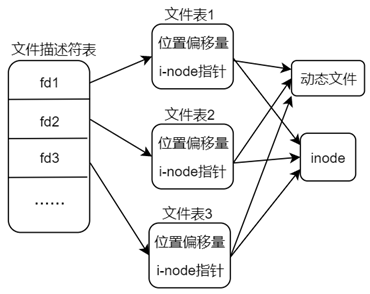
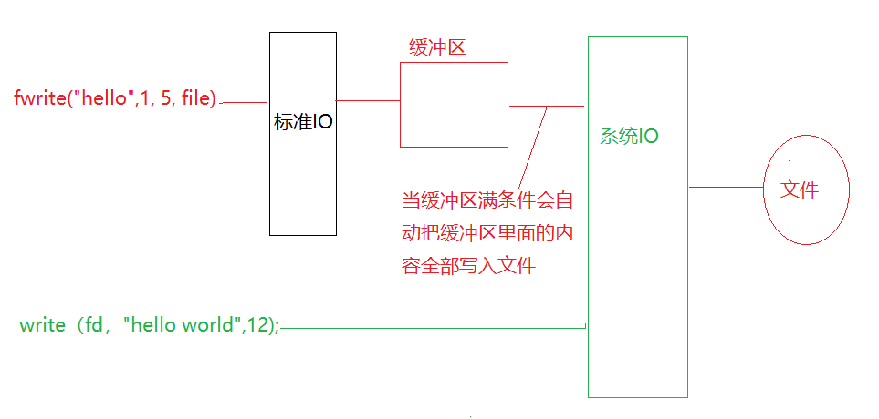
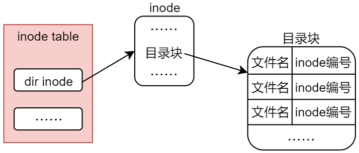

Tips： man 命令后面跟着两个参数，数字 2 表示系统调用， man 命令除了可以查看系统调用的帮助信息外，还可以查看 Linux 命令（对应数字 1）以及标准 C 库函数（对应数字 3）所对应的帮助信息；最后一个参数 open 表示需要查看的系统调用函数名  文件IO


宏定义

`STDERR_FILENO` 是一个宏，定义在 `<unistd.h>` 头文件中，用于表示标准错误流（stderr）的文件描述符。

`unistd.h` 头文件中定义了几个特殊的宏，用于表示标准输入、标准输出和标准错误的文件描述符。这些宏定义如下：

- `STDIN_FILENO` 通常被定义为 0，代表标准输入。
- `STDOUT_FILENO` 通常被定义为 1，代表标准输出。
- `STDERR_FILENO` 通常被定义为 2，代表标准错误。

# 

https://www.cnblogs.com/sparkdev/p/8410350.html


# shell

### 基础

```shell
cat /etc/shells
echo $SHELL
echo $PATH
echo $0
/bin/sh
```


```shell
# 在 Linux 系统下，我们可以通过 ulimit 命令来查看进程可打开的最大文件数 ，也可以修改
ulimit -n

df -f  # 查看磁盘分区
sudo tune2fs -l /dev/sda1 | grep "Block size" #确定磁盘分区大小	

# "ls -i"命令查看文件的 inode 编号

ls -li  #每一行前面的一个数字就表示了对应文件的 inode 编号
stat file #查看指定文件的。

ln -s file link

size test #看二进制可执行文件的文本段、数据段、 bss 段的段大小

ps -ef # snapshot of the current processes.
df # disk file 列出系统中所有文件系统的磁盘使用情况，

```


### 打印二进制文件

在Linux系统中，有多个命令可以用于显示二进制文件的内容，每个命令的功能和用途都有所不同。以下是一些常用的命令及其区别：

#### hexdump

- **用途**：显示文件的十六进制表示。

- 常用选项

  ：

  - `-C`：显示十六进制和ASCII字符。
  - `-v`：不省略重复的行。

- 示例

  ：

  ```
  sh
  复制代码
  hexdump -C filename
  ```

#### od (octal dump)

- **用途**：显示文件内容的八进制或其他格式的表示。

- 常用选项

  ：

  - `-x`：显示十六进制。
  - `-t`：指定输出格式，如`-tx1`（每字节一个十六进制数），`-tc`（字符），`-td`（十进制）。

- 示例

  ：

  ```
  sh
  复制代码
  od -tx1 filename
  ```

#### xxd

- **用途**：创建文件的十六进制转储并可以进行反转（从十六进制回到二进制）。

- 常用选项

  ：

  - `-r`：反转十六进制表示回二进制文件。
  - `-p`：纯十六进制模式（不带地址）。

- 示例

  ：

  ```
  sh复制代码xxd filename
  xxd -r -p hexfile > binaryfile
  ```

#### strings

- **用途**：从二进制文件中提取可打印的字符串。

- 常用选项

  ：

  - `-n`：设置最小字符串长度（默认是4）。
  - `-t`：指定输出格式（如`-tx`表示十六进制）。

- 示例

  ：

  ```
  sh
  复制代码
  strings filename
  ```

#### readelf

- **用途**：显示ELF格式（Executable and Linkable Format）文件的详细信息。

- 常用选项

  ：

  - `-h`：显示文件头信息。
  - `-S`：显示节头信息。
  - `-l`：显示程序头信息。

- 示例

  ：

  ```
  sh
  复制代码
  readelf -h filename
  ```

#### objdump

- **用途**：显示二进制文件的各种信息，包括反汇编代码。

- 常用选项

  ：

  - `-d`：反汇编代码段。
  - `-s`：显示文件内容。
  - `-h`：显示文件头。

- 示例

  ：

  ```
  sh
  复制代码
  objdump -d filename
  ```

区别总结

- **hexdump** 和 **xxd**：主要用于显示文件的十六进制内容。`xxd`还支持反向转换。
- **od**：支持多种格式（如八进制、十六进制、字符等），更加灵活。
- **strings**：提取==可打印字符串，适合查找文本内容==。
- **readelf** 和 **objdump**：用于==处理ELF格式文件==，提供详细的结构信息，`objdump`还能反汇编代码。

这些命令提供了不同层次和形式的二进制文件信息展示，可以根据具体需求选择合适的工具。


### systemctl


# IO


## 0、应用编程概念

就拿嵌入式 Linux 硬件平台下的软件开发来说，我们大可将编程分为三种，分别为裸机编程、 Linux 驱动编程以及 Linux 应用编程。

- 裸机编程这个概念来说很好理解，一般把==没有操作系统支持的编程环境==称为裸机编程环境，譬如单片机上的编程开发，编写直接在硬件上运行的程序，没有操作系统支持；
-  狭义上 Linux 驱动编程指的是==基于内核驱动框架开发驱动程序==， 驱动开发工程师通过调用 Linux 内核提供的接口完成设备驱动的注册， 驱动程序负责底层硬件操作相关逻辑， 如果学习过 Linux 驱动开发的读者，想必对此并不陌生； 
- 而 Linux 应用编程（系统编程）则指的是==基于 Linux 操作系统==的应用编程，在应用程序中通过调用系统调用 API 完成应用程序的功能和逻辑， 应用程序运行于操作系统之上。
- 通常在操作系统下有两种不同的状态：内核态和用户态，应用程序运行在用户态、而内核则运行在内核态。  

LED 应用程序与 LED 驱动程序是分隔、分离的，它们单独编译， 它们并不是整合在一起的， 应用程序运行在操作系统之上，有操作系统支持，应**用程序处于用户态**，
而驱动程序处于内核态，与纯粹的裸机程序存在着质的区别。 Linux 应用开发与驱动开发是两个不同的方向，将来在工作当中也会负责不同的任务、解决不同的问题。  


### 1、库函数

系统调用是内核直接向应用层提供的应用编程接口， 譬如 open、 write、read、 close 等， 编写应用程序除了使用系统调用之外，我们还可以使用库函数，  

有些系统调用使用起来并不是很方便， 于是就出现了 C 语言库，这些 C 语言库函数的设计是为了提供比底层系统调用更为方便、更为好用、 且更具有可移植性的调用接口。  

库函数也就是 C 语言库函数， C 语言库是应用层使用的一套函数库， 在 Linux 下，通常以动态（.so）库文件的形式提供，存放在根文件系统/lib 目录下，
 C 语言库函数==构建于系统调用之上==，也就是说库函数其实是由系统调用封装而来的，当然也不能完全这么说， 原因在于有些==库函数并不调用任何系统调用==，譬如一些字符串处理函数 strlen()、 strcat()、 memcpy()、 memset()、 strchr()等等； 
而有些库函数则会使用系统调用来帮它完成实际的操作，譬如库函数 fopen 内部调用了系统调用 open()来帮它打开文件、库函数 fread()就利用了系统调用 read()来完成读文件操作、 fwrite()就利用了系统调用 write()来完成写文件操作。  

**库函数与系统调用**

- 库函数是属于应用层，而系统调用是内核提供给应用层的编程接口，属于系统内核的一部分；
- 库函数运行在用户空间，调用系统调用会由用户空间（用户态）陷入到内核空间（内核态）；
- 库函数通常是有缓存的，而系统调用是无缓存的，所以在性能、效率上，库函数通常要优于系统调用；
- 可移植性：库函数相比于系统调用具有更好的可移植性，通常对于不同的操作系统，其内核向应用层提供的系统调用往往都是不同，譬如系统调用的定义、功能、参数列表、返回值等往往都是不一样的；而对于 C 语言库函数来说，由于很多操作系统都实现了 C 语言库， <u>C 语言库在不同的操作系统之间其接口定义几乎是一样的</u>，所以库函数在不同操作系统之间相比于系统调用具有更好的可移植性。  


### 2、标准 C 语言函数库

在 Linux 系 统 下 ， 使 用 的 C 语 言 库 为 GNU C 语 言 函 数 库 （ 也 叫 作 glibc ， 其 网 址 为http://www.gnu.org/software/libc/），作为 Linux 下的标准 C 语言函数库。http://www.gnu.org/software/libc/  


点击上面的 Sources 选项可以查看它的源码实现  


glibc 源码的获取方式很简单，直接直接从 git 仓库下载，也可以通过 ftp 下载  

C 语言库是以动态库文件的形式提供的，通常存放在/lib 目录，它的命名方式通常是libc.so.6，不过这个是一个软链接文件，它会链接到真正的库文件。  其实是在/lib/x86_64-linux-gnu 目录下  


​	


## 1、系统IO

本章主要介绍文件 IO 操作相关系统调用， 一个通用的 IO 模型通常包括打开文件、读写文件、关闭文件这些基本操作， 主要涉及到 4 个函数： open()、 read()、 write()以及 close()，  

### 1.1 文件描述符

**什么是文件描述符**
当调用 open 函数打开一个现有文件或创建一个新文件时，==内核会向进程返回一个文件描述符==， 用于指代被打开的文件，所有执行 IO 操作的系统调用都是通过文件描述符来索引到对应的文件，  

```shell
# 在 Linux 系统下，我们可以通过 ulimit 命令来查看进程可打开的最大文件数 ，也可以修改
ulimit -n
```

> ​	1024 

**文件描述符的释放**
每一个被打开的文件在同一个进程中都有一个唯一的文件描述符，不会重复，如果文件被关闭后，它对应的文件描述符将会被释放，那么这个文件描述符将可以再次分配给其它打开的文件、与对应的文件绑定起来。  

**起始文件描述符号**3
当我们在程序中，调用 open 函数打开文件的时候，分配的文件描述符一般都是从 3 开始，这里大家可能要问了，上面不是说从 0 开始的吗，确实是如此，但是 ==0、 1、 2 这三个文件描述符==已经默认被系统占用了，分别分配给了系统标准输入（0）（stdio）（一般指键盘）、 标准输出（1）（stdout）（一般值LCD显示屏）以及标准错误（2）（errno）（一般指LCD显示屏）  。

其实这个问题跟vscode 有关，说明 3、 4、 5 这 3 个文件描述符已经被 vscode 软件对应的进程所占用了，而当前这里执行testApp 文件是在 vscode 软件提供的终端下进行的，所以 vscode 可以认为是 testApp 进程的父进程，相反， testApp 进程便是 vscode 进程的子进程，子进程会继承父进程的文件描述符。  

**硬件文件**
Tips： Linux 系统下，一切皆文件，也包括各种硬件设备，使用 open 函数打开任何文件成功情况下便会返回对应的文件描述符 fd。每一个硬件设备都会对应于 Linux 系统下的某一个文件，把这类文件称为设备文件。所以设备文件对应的其实是某一硬件设备，应用程序通过对设备文件进行读写等操作、来使用、操控硬件设备，譬如 LCD 显示器、串口、音频、键盘等。  

### 1.2 open打开文件

- 调用 open 函数打开文件使用的是什么权限，则返回的文件描述符就拥有什么权限。
- 一个进程和多个不同的进程  多次打开同一个文件，内存中也只有一份动态文件。 
- 不同文件描述符所对应的读写位置偏移量是相互独立的。   


```C
// 打开、创建文件
#include <sys/types.h>
#include <sys/stat.h>
#include <fcntl.h>
// 原型
int open(const char *pathname, int flags);
int open(const char *pathname, int flags, mode_t mode); //第三个参数 mode 需要在第二个参数 flags 满足条件时才会有效
//实例
int fd = open("./src_file", O_RDONLY); //单独使用某一个标志
int fd = open("./src_file", O_RDONLY | O_NOFOLLOW); //多个标志组合
if (-1 == fd)
    return fd;
```

- **pathname**： 字符串类型，用于标识需要打开或创建的文件，可以包含路径（绝对路径或相对路径） 信息，譬如： "./src_file"（当前目录下的 src_file 文件）、 "/home/dengtao/hello.c"等；如果 pathname 是一个符号链接，会对其进行解引用。

- **flags**： 调用 open 函数时需要提供的标志， 包括文件访问模式标志以及其它文件相关标志，这些标志使用宏定义进行描述，都是常量， open 函数提供了非常多的标志，我们传入 flags 参数时既可以单独使用某一个标志，也可以通过位或运算（|） 将多个标志进行组合。 

- **mode**： 此参数用于指定新建文件的访问权限，只有当 flags 参数中包含 **O_CREAT** 或 **O_TMPFILE** 标志时才有效（O_TMPFILE 标志用于创建一个临时文件）。 权限对于文件来说是一个很重要的属性，那么在 Linux系统中，我们可以通过 touch 命令新建一个文件，此时文件会有一个默认的权限  

- 返回值： 成功将返回文件描述符，文件描述符是一个非负整数；失败将返回-1。  


| 标志 FL                               | 用途                                                         | 说明                                                         |
| ------------------------------------- | ------------------------------------------------------------ | ------------------------------------------------------------ |
| O_RDONLY                              | 只读方式                                                     | 这三个是文件访问权限标志，传入的flags 参数中必须要包含其中一种标志，而且只能包含一种，打开的文件只能按照这种权限来操作，譬如使用了 O_RDONLY 标志，就只能对文件进行读取操作，不能写操作。 |
| O_WRONLY                              | 只写方式                                                     | 1                                                            |
| O_RDWR                                | 可读可写                                                     | 1                                                            |
| ==O_EXCL<br />==excluding<br />不包括 | 一般结合 **O_CREAT** 标志一起使用，用于专门创建文件。在 flags 参数同时使用到了 O_CREAT 和O_EXCL 标志的情况下，<br />如果文件已经存在，返回错误。 | 可以用于测试一个文件是否存在，如果不存在则创建此文件，如果存在则返回错误，这使得==测试和创建两者成为一个原子操作；== |
| ==O_CREAT==<br />creat                | 文件不存在则创建此文件                                       | 使用此标志时，open 函数==需要传入第 3 个参数 mode==，参数 mode 用于指定新建文件的访问权限。<br />open 函数的第 3 个参数只有在使用了 **O_CREAT** 或 **O_TMPFILE** 标志时才有效。 |
| O_DIRECTORY                           | 如果指向的**不是一个目录**，则调用 open 失败                 |                                                              |
| O_NOFOLLOW                            | 如果指向的是**一个符号链接**，将不对其进行解引用，直接返回错误。 | 不加此标志情况下，如果 pathname参数是一个符号链接，会对其进行**解引用**。 |
| O_TRUNC<br />trunc                    | 将文件原本的内容全部丢弃                                     | ，文件大小变为 0；                                           |
| O_APPEND                              | 始终从文件末尾开始写入数据.<br />不影响读位置偏移量。        | 当每次使用 write()函数对文件进行写操作时，都会自动把文件当前位置偏移量移动到文件末尾。lseek函数也不会改变偏移量 <br />O_APPEND 标志并不会影响读位置偏移量， 即使使用了 O_APPEND标志，读文件位置偏移量默认情况下依然是文件头 |
|                                       | 下对性能影响极大，基本不适用                                 |                                                              |
| O_DSYNC                               | 其效果类似于在每个 write()调用之后调用 fdatasync()函数进行**内容数据**同步 | 使得每个 write()调用都会自动将文件 内容数据 刷新到磁盘设备中， |
| O_SYNC                                | 其效果类似于在每个 write()调用之后调用 fsync()函数进行**内容数据和元数据**同步 | 使得每个 write()调用都会自动将文件内容数据和元数据刷新到磁盘设备中， |
|                                       |                                                              | 还有 O_APPEND、 O_ASYNC、 O_DSYNC、 O_NOATIME、 O_NONBLOCK、 O_SYNC 以及 O_TRUNC 等 |
|                                       |                                                              |                                                              |
| O_ASYNC                               | 异步IO                                                       | 调用 open()时无法通过指定 O_ASYNC 标志来使能异步 I/O，  <br />可以使用 fcntl()函数添加 O_ASYNC 标志使能异步 I/O |
| O_DIRECT                              |                                                              | 我们可针对某一文件或块设备执行直接 I/O，要做到这一点，需要在调用 open()函数打开文件时，指定O_DIRECT 标志， 该标志至 Linux 内核 2.4.10 版本开始生效， |


#### 1. mode_t

mode 参数的类型是 mode_t，这是一个 u32 无符号整形数据 .


1. O---这 3 个 bit 位用于表示**其他用户**的权限；
2. G---这 3 个 bit 位用于表示**同组用户**（group）的权限，即与文件所有者有相同组 ID 的所有用户；
3. U---这 3 个 bit 位用于表示文件**所属用户**的权限，即文件或目录的所属者；
4. S---这 3 个 bit 位用于表示文件的**特殊权限**，文件特殊权限一般用的比较少，

**open 函数文件权限宏**  

| 宏定义（后面三位不同）      | 说明                                                         |
| --------------------------- | ------------------------------------------------------------ |
| ==S_IRWXU==                 | **允许文件所属者读、写、执行文件**                           |
| S_IRUSR                     | 允许文件所属者读文件                                         |
| S_IWUSR                     | 允许文件所属者写文件                                         |
| S_IXUSR                     | 允许文件所属者执行文件                                       |
| ==S_IRWXG==                 | **允许同组用户读、写、执行文件**                             |
| S_IRGRP                     | 允许同组用户读文件                                           |
| S_IWGRP                     | 允许同组用户写文件                                           |
| S_IXGRP                     | 允许同组用户执行文件                                         |
| ==S_IRWXO==                 | **允许其他用户读、写、执行文件**                             |
| S_IROTH                     | 允许其他用户读文件                                           |
| S_IWOTH                     | 允许其他用户写文件                                           |
| S_IXOTH                     | 允许其他用户执行文件                                         |
| ==S_ISUID S_ISGID S_ISVTX== | set-user-ID（特殊权限） set-group-ID（特殊权限） sticky（特殊权限） |

```C
int fd = open("/home/dengtao/hello", O_RDWR | O_CREAT, S_IRWXU | S_IRGRP | S_IROTH);
if (-1 == fd)
	return fd;
```


### 1.3 write 写文件

```C
#include <unistd.h>
// 原型
ssize_t write(int fd, const void *buf, size_t count);
```

// 调用 write 函数可向打开的文件写入数据

- **fd**： 文件描述符。 我们需要将进行写操作的文件所对应的文件描述符传递给 write 函数。
- **buf**： 指定写入数据对应的缓冲区。
- **count**： 指定写入的字节数。
- **返回值**： 如果成功将**返回写入的字节数**（0 表示未写入任何字节），如果此数字小于 count 参数，这不是错误，譬如磁盘空间已满，可能会发生这种情况；如果写入出错，则返回-1。

**位置偏移量**
读写操作都是从文件的当前位置偏移量处开始，当然当前位置偏移量可以通过 lseek 系统调用进行设置；
默认情况下当前位置偏移量一般是 0，也就是指向了文件起始位置，当调用 read、 write 函数读写操作完成之后， 当前位置偏移量也会向后移动对应字节数，譬如当前位置偏移量为 1000 个字节处，调用 write()写入或 read()读取 500 个字节之后，当前位置偏移量将会移动到 1500 个字节处。  

### 1.4 read 读文件

```C
#include <unistd.h>
// 原型	
ssize_t read(int fd, void *buf, size_t count);
```

- fd： 文件描述符。与 write 函数的 fd 参数意义相同。
- buf： 指定用于存储读取数据的缓冲区。  
- count： 指定需要读取的字节数。
- 返回值： 如果读取成功**将返回读取到的字节数**，实际读取到的字节数可能会小于 count 参数指定的字节数，也有可能会为 0，譬如进行读操作时，当前文件位置偏移量已经到了文件末尾。 实际读取到的字节数少于要求读取的字节数，譬如在到达文件末尾之前有 30 个字节数据，而要求读取 100 个字节，则 read 读取成功只能返回 30；<u>而下一次再调用 read 读，它将返回 0（文件末尾） 。</u>  

### 1.5 close 关闭文件

```C
#include <unistd.h>
int close(int fd); // 当一个进程终止时，内核也会自动关闭它打开的所有文件
```

- fd： 文件描述符，需要关闭的文件所对应的文件描述符。
- 返回值： 如果成功返回 0，如果失败则返回-1。

除了使用 close 函数显式关闭文件之外，在 Linux 系统中，**==当一个进程终止时，内核会自动关闭它打开的所有文件==**，也就是说在我们的程序中打开了文件， 如果程序终止退出时没有关闭打开的文件，那么内核会自动将程序中打开的文件关闭。 ==很多程序都利用了这一功能而不显式地用 close 关闭打开的文件。==

### 1.6 lseek 偏移量

**系统调用lseek**

对于每个打开的文件， 系统都会记录它的读写位置偏移量（==以相对于文件头部的位置偏移量来表示==），我们也把这个读写位置偏移量称为读写偏移量，记录了文件当前的读写位置。
当调用 read()或 write()函数对文件进行读写操作时，就会从当前读写位置偏移量开始进行数据读写==（新打开的文件默认偏移量为0）==，==在关闭文件标识符前，偏移量指针位置只会根据读写量移位、或被 lseek 之类的函数配置==。

当打开文件时，会将读写偏移量设置为指向文件开始位置处，以后每次调用 read()、 write()将自动对其进行调整，以指向已读或已写数据后的下一字节。

```C
#include <sys/types.h>
#include <unistd.h>
off_t lseek(int fd, off_t offset, int whence);

// 例子
off_t off = lseek(fd, 0, SEEK_CUR);
if (-1 == off)
	return -1;
```

- fd： 文件描述符。
- offset： 偏移量，以字节为单位。
- whence： 用于定义参数 offset 偏移量对应的参考值， 该参数为下列其中一种（宏定义） ：
  - ==SEEK_SET==：读写偏移量将指向 <u>offset 字节位置处</u>（从文件头部开始算） ；
  - ==SEEK_CUR==：读写偏移量将指向<u>当前位置偏移量 + offset</u> 字节位置处， offset 可以为正、也可以为负，如果是正数表示往后偏移，如果是负数则表示往前偏移；
  - ==SEEK_END==：读写偏移量将指向<u>文件末尾 + offset 字节</u>位置处，同样 offset 可以为正、也可以为负。
- 返回值： 成功将返回==从文件头部开始算起的<u>位置偏移量</u>==（字节为单位）， 也就是当前的读写位置； 发生错误将返回-1。


### 1.7 dup 复制 fd

The  dup()  system  call creates a copy of the file descriptor oldfd, using the lowest-numbered unused descriptor for the
       new descriptor.

After a successful return, the old and new file descriptors may be used interchangeably.  They refer  to  the  same  open
   file description (see open(2)) and thus share file offset and file status flags; for example, if the file offset is modi‐
   fied by using lseek(2) on one of the descriptors, the offset is also changed for the other.

The two descriptors do not share file descriptor flags (the close-on-exec flag).  The close-on-exec flag (FD_CLOEXEC; see
   fcntl(2)) for the duplicate descriptor is off.

使用系统编码最低的未使用的描述符号
共享文件偏移和文件状态标记
不共享文件描述符号关闭不共享

#### 1. dup

```c
#include <unistd.h>
int dup(int oldfd); // 共用一个文件偏移量
```

- oldfd： 需要被复制的文件描述符。
- 返回值： 成功时将返回一个新的文件描述符，由操作系统分配，分配置原则遵循文件描述符分配原则；如果复制失败将返回-1，并且会设置 errno 值。


#### 2. dup2

dup 系统调用分配的文件描述符是由系统分配的，遵循文件描述符分配原则，并不能自己指定一个文件描述符，这是 dup 系统调用的一个缺陷；而 dup2 系统调用修复了这个缺陷，==可以手动指定文件描述符==，而不需要遵循文件描述符分配原则，当然在实际的编程工作中，需要根据自己的情况来进行选择。  

```c
// 可手动指定文件描述符
#include <unistd.h>

int dup2(int oldfd, int newfd);
```

- oldfd： 需要被复制的文件描述符。
- newfd： 指定一个文件描述符（需要指定一个当前进程没有使用到的文件描述符）。
- 返回值： 成功时将返回一个新的文件描述符，也就是手动指定的文件描述符 newfd；如果复制失败将返回-1，并且会设置 errno 值。


### 1.8 fcntl 和 ioctl  设置文件描述符

#### 1. fcntl 文件描述符

 file control

fcntl()函数==对一个已经打开的文件描述符执行一系列控制操作==，譬如复制一个文件描述符（与 dup、dup2 作用相同）、获取/设置文件描述符标志、获取/设置文件状态标志等，类似于一个多功能**文件描述符管理工具箱**。   

```c
// 系统调用
#include <unistd.h>
#include <fcntl.h>
//原型
int fcntl(int fd, int cmd, ... /* arg */ )

//例子:复制PD
// 传入的第三个参数是 0，也就时指定复制得到的新文件描述符必须要大于或等于 0
// 如果传入的第三个参数是 100，那么 fd2 就会等于 100
fd2 = fcntl(fd1, F_DUPFD, 0);
```

- fd： 文件描述符。

- cmd： 操作命令。

  - ==复制==文件描述符（F_DUPFD 或 F_DUPFD_CLOEXEC）；

  - 获取/设置==文件描述符标志==（F_GETFD 或 F_SETFD）；

  - 获取/设置==文件状态标志==（F_GETFL 或 F_SETFL）；  （阻塞非阻塞）

  - 获取/设置==异步 IO 所有权==（F_GETOWN 或 F_SETOWN）；

  - 获取/设置==记录锁==（F_GETLK 或 F_SETLK）；

  - 这里列举出来，并不需要全部学会每一个 cmd 的作用，因为有些内容并没有给大家提及到， 譬如什么异步 IO、锁之类的概念， 在后面的学习过程中， 当学习到相关知识内容的时候再给大家介绍。  

- …： fcntl 函数是一个可变参函数，第三个参数需要根据不同的 cmd 来传入对应的实参，配合 cmd 来使用。
  - F_dupfd：第三个参数用于指出新复制出的文件描述符是一个大于（文件描述符已被使用）或等于该参数的可用文件描述符。
  - F_setfl：这些==标志指的是==我们在调用 open 函数时传入的 flags 标志 。
    - 但是文件权限标志（O_RDONLY、 O_WRONLY、 O_RDWR）以及文件创建标志（O_CREAT、O_EXCL、 O_NOCTTY、 O_TRUNC）不能被设置、会被忽略；  
    - 在 Linux 系统中，只有 ==O_APPEND==、==O_ASYNC==、==O_DIRECT==、==O_NOATIME== 以及 ==O_NONBLOCK== 这些标志可以被修改。
    - 所以==对于一个已经打开的文件描述符，可以通过这种方式添加或移除标志。==  （flag | O_APPEND  ）
- 返回值： 执行失败情况下，返回-1，并且会设置 errno；执行成功的情况下，其返回值与 cmd（操作命令）有关，譬如 cmd=F_DUPFD（复制文件描述符）将返回一个新的文件描述符、 
  cmd=F_GETFD（获取文件描述符标志）将返回文件描述符标志、 
  cmd=F_GETFL（获取文件状态标志）将返回文件状态标志等。
- 
| 宏命令                                                       | 功能                                                         | 说明                                                         |
| ------------------------------------------------------------ | ------------------------------------------------------------ | ------------------------------------------------------------ |
| （F_DUPFD 或 F_DUPFD_CLOEXEC）；<br />f_dupfd、f_dupfd_cloexec | 复制   文件描述符                                            |                                                              |
|                                                              |                                                              |                                                              |
| （F_GETFD 或 F_SETFD）；                                     | 获取/设置  文件描述符标志                                    | int flag = fcntl(fd, F_GETFL);                               |
|                                                              |                                                              |                                                              |
| （F_GETFL 或 F_SETFL）；<br />f_getfl、f_setfl               | 获取/设置   文件状态标志<br />经常拿来设置文件的阻塞特性。<br />cmd = F_GETFL 时不需要传入第三个参数，返回值成功表示获取到的文件状态标志； <br/>cmd=F_SETFL 时，需要传入第三个参数，此参数表示需要设置的文件状态标志。 | //。增添非阻塞属性 <br />flag \|= O_NONBLOCK;<br />fcntl(fd, F_SETFL, flag); |
|                                                              |                                                              |                                                              |
| （F_GETOWN 或 F_SETOWN）；<br />f_getown、f_setown           | 获取/设置  异步 IO 所有权<br />获取和设置套接字触发的信号的属主，<br />网络编程中常见。 | // 将套接字sockfd的信号属主设置为本进程 <br />fcntl(sockfd, F_SETOWN, getpid()); |
|                                                              |                                                              |                                                              |
| （F_GETLK 或 F_SETLK）；<br />f_getlk、f_setlk               | 获取/设置     记录锁                                         |                                                              |

在网络编程中，当一个套接字处于异步通信状态并收到一个远端的数据时，就会使得内核产生一个信号SIGIO，此时我们可以通过上述fcntl()技巧告诉内核这个信号的接收者。一般而言，接收者收到该信号后，就知道套接字上有数据等待处理了。


##### **例子：获取/设置文件状态标志** FL

```c
fd = open("./test_file", O_RDWR);
flag = fcntl(fd, F_GETFL);
printf("flags: 0x%x\n", flag);
ret = fcntl(fd, F_SETFL, flag | O_APPEND);

/* 将键盘设置为非阻塞方式 */
flag = fcntl(0, F_GETFL); //先获取原来的 flag
flag |= O_NONBLOCK; //将 O_NONBLOCK 标准添加到 flag
fcntl(0, F_SETFL, flag); //重新设置 flag
```

下边为什么是：0x8002

> 

#### 2. ioctl()  控制装置 device

```shell
grep "struct fb_var_screeninfo" /usr/include/linux/fb.h
```

该函数是==沟通应用层和驱动层==的有力武器，底层开发人员在为硬件设备编写驱动的时候，常常==**将某些操作封装为一个函数，并为这些接口提供一个所谓的命令字**==，应用层开发者可以通过 ioctl() 函数配合命令字，非常迅捷地==绕过操作系统中间层层机构直达驱动层==，调用对应的功能。

一般用==于操作特殊文件或硬件外设==，一般用于操作特殊文件或设备文件  ，此函数将会在进阶篇中使用到， 譬如可以通过 ioctl 获取 LCD 相关信息等。

```c
#include <sys/ioctl.h>
int ioctl(int fd, unsigned long request, ...);
```

- fd： 文件描述符。

- request： 命令字，没有统一值， 表示向文件描述符==请求相应的操作== ，可以取一些宏；

- ...： 此函数是一个可变参函数， 第三个参数需要根据 request 参数来决定，配合 request 来使用。

- 返回值： 成功返回 0，失败返回-1。

  

##### 1.FBIOGET_VSCREENINFO

屏幕信息结构体

```shell
vim /usr/include/linux/fb.h
```

fb io get - v screan info

```c
#define FBIOGET_VSCREENINFO	0x4600
struct fb_var_screeninfo {
	__u32 xres;			/* visible resolution		*/
	__u32 yres;
	__u32 xres_virtual;		/* virtual resolution		*/
	__u32 yres_virtual;
	__u32 xoffset;			/* offset from virtual to visible */
	__u32 yoffset;			/* resolution			*/

	__u32 bits_per_pixel;		/* guess what			*/
	__u32 grayscale;		/* 0 = color, 1 = grayscale,	*/
					/* >1 = FOURCC			*/
	struct fb_bitfield red;		/* bitfield in fb mem if true color, */
	struct fb_bitfield green;	/* else only length is significant */
	struct fb_bitfield blue;
	struct fb_bitfield transp;	/* transparency			*/	

	__u32 nonstd;			/* != 0 Non standard pixel format */

	__u32 activate;			/* see FB_ACTIVATE_*		*/

	__u32 height;			/* height of picture in mm    */
	__u32 width;			/* width of picture in mm     */

	__u32 accel_flags;		/* (OBSOLETE) see fb_info.flags */

	/* Timing: All values in pixclocks, except pixclock (of course) */
	__u32 pixclock;			/* pixel clock in ps (pico seconds) */
	__u32 left_margin;		/* time from sync to picture	*/
	__u32 right_margin;		/* time from picture to sync	*/
	__u32 upper_margin;		/* time from sync to picture	*/
	__u32 lower_margin;
	__u32 hsync_len;		/* length of horizontal sync	*/
	__u32 vsync_len;		/* length of vertical sync	*/
	__u32 sync;			/* see FB_SYNC_*		*/
	__u32 vmode;			/* see FB_VMODE_*		*/
	__u32 rotate;			/* angle we rotate counter clockwise */
	__u32 colorspace;		/* colorspace for FOURCC-based modes */
	__u32 reserved[4];		/* Reserved for future compatibility */
};

```


##### 2. linux/linpt.h

输入设备信息：触摸屏

```shell
vim /usr/include/linux/input.h
```

```c
#ifndef _INPUT_H
#define _INPUT_H


#include <sys/time.h>
#include <sys/ioctl.h>
#include <sys/types.h>
#include <linux/types.h>

#include "input-event-codes.h"

/*
 * The event structure itself
 * Note that __USE_TIME_BITS64 is defined by libc based on
 * application's request to use 64 bit time_t.
 */

struct input_event {
#if (__BITS_PER_LONG != 32 || !defined(__USE_TIME_BITS64)) && !defined(__KERNEL__)
        struct timeval time;
#define input_event_sec time.tv_sec
#define input_event_usec time.tv_usec
#else
        __kernel_ulong_t __sec;
#if defined(__sparc__) && defined(__arch64__)
        unsigned int __usec;
        unsigned int __pad;
#else
        __kernel_ulong_t __usec;
#endif
#define input_event_sec  __sec
#define input_event_usec __usec
#endif
        __u16 type;
        __u16 code;
        __s32 value;
};
```

**type**
输入事件的类型。比如：

| 事件类型（type） | 说明                                                         |
| ---------------- | ------------------------------------------------------------ |
| EV_SYN           | 事件间的分割标志，有些事件可能会在时间和空间上产生延续，比如持续按住一个按键 为了更好地管理这些持续的事件，EV_SYN用以将他们分割成一个个的小的数据包。 |
| EV_KEY           | 用以描述键盘，按键或者类似键盘的设备的状态变化。             |
| EV_REL           | 相对位移，比如鼠标的移动，滚轮的转动等。                     |
| EV_ABS           | 绝对位移，比如触摸屏上的坐标值。                             |
| EV_MSC           | 不能匹配现有的类型，这相当于当前暂不识别的事件 比如在Linux系统中按下键盘中针对Windows系统的“一键杀毒”按键，将会产生该事件。 |
| EV_LED           | 用于控制设备上的LED灯的开关，比如按下键盘的大写锁定键 会同时产生 ”EV_KEY” 和 ”EV_LED” 两个事件。 |
| … …              | … …                                                          |

**type**
输入事件的类型。比如：

| 事件类型（type） | 说明                                                         |
| ---------------- | ------------------------------------------------------------ |
| EV_SYN           | 事件间的分割标志，有些事件可能会在时间和空间上产生延续，比如持续按住一个按键 为了更好地管理这些持续的事件，EV_SYN用以将他们分割成一个个的小的数据包。 |
| EV_KEY           | 用以描述键盘，按键或者类似键盘的设备的状态变化。             |
| EV_REL           | 相对位移，比如鼠标的移动，滚轮的转动等。                     |
| EV_ABS           | 绝对位移，比如触摸屏上的坐标值。                             |
| EV_MSC           | 不能匹配现有的类型，这相当于当前暂不识别的事件 比如在Linux系统中按下键盘中针对Windows系统的“一键杀毒”按键，将会产生该事件。 |
| EV_LED           | 用于控制设备上的LED灯的开关，比如按下键盘的大写锁定键 会同时产生 ”EV_KEY” 和 ”EV_LED” 两个事件。 |
| … …              | … …                                                          |

**value**
当code都不足以区分事件的性质的时候，可以用value来确认。比如由EV_REL和REL_WHEEL确认发生了鼠标滚轮的动作，但是究竟是向上滚还是向下滚呢？再比如由由EV_KEY和KEY_F确认了发生键盘上F键的动作，但究竟是按下呢还是弹起呢？这时都可以用value值来进一步判断。

| 事件类型（type） | 事件代码（code） | 发生值（value） | 说明                           |
| ---------------- | ---------------- | --------------- | ------------------------------ |
| EV_KEY           | BTN_TOUCH        | 大于0           | 手指按压了触摸屏               |
| EV_KEY           | BTN_TOUCH        | 0               | 手指松开了触摸屏               |
| EV_KEY           | KEY_LEFT         | 大于0           | 左箭头被按下                   |
| EV_KEY           | KEY_LEFT         | 0               | 左箭头被松开                   |
| EV_ABS           | ABS_X            | 213             | 触摸屏产生了一个233的 x 轴坐标 |
| EV_ABS           | ABS_Y            | 448             | 触摸屏产生了一个448的 y 轴坐标 |
| … …              | … …              | … …             | … …                            |

###### **触摸屏操作**

### **3.1 基本情况**

对于触摸屏而言，该设备会产生三种数据：

- X轴坐标值
- Y轴坐标值
- P压力值

理论上来说，从手指放上屏幕开始，到滑动一段距离，离开屏幕结束，会产生如下所示的一系列数据：

```
(X Y P1) SYN (X Y) SYN (X Y) SYN (X Y) ... ... (X Y) SYN (X Y P2)
```

有如下地方需要注意：

- 在刚开始的第一个坐标值和最后一个坐标值中，都连带会读到压力值P
- P1是手指刚落下时，产生压力值大于0的数据
- P2是手指离开时，产生压力值等于0的数据
- 应用层并不能保证能严格交替读取 `(X,Y)` 坐标值，它们会由于异步等原因出现断续，比如 `(X X X X Y)`
- 若手指滑动的方向刚好垂直与坐标轴，会导致其中一个维度的坐标值不变，那么也可能会导致只出现一个维度坐标值的情形，例如：

```
... (X) SYN (X) SYN (X Y) SYN (Y) ... ... (X Y) SYN ...
```


这种情况下需要借助系统自动产生的 SYN 事件来整理出成对的坐标值。


```c
/**
 * struct input_absinfo - used by EVIOCGABS/EVIOCSABS ioctls
 * @value: latest reported value for the axis.
 * @minimum: specifies minimum value for the axis.
 * @maximum: specifies maximum value for the axis.
 * @fuzz: specifies fuzz value that is used to filter noise from
 *      the event stream.
 * @flat: values that are within this value will be discarded by
 *      joydev interface and reported as 0 instead.
 * @resolution: specifies resolution for the values reported for
 *      the axis.
 *
 * Note that input core does not clamp reported values to the
 * [minimum, maximum] limits, such task is left to userspace.
 *
 * The default resolution for main axes (ABS_X, ABS_Y, ABS_Z)
 * is reported in units per millimeter (units/mm), resolution
 * for rotational axes (ABS_RX, ABS_RY, ABS_RZ) is reported
 * in units per radian.
 * When INPUT_PROP_ACCELEROMETER is set the resolution changes.
 * The main axes (ABS_X, ABS_Y, ABS_Z) are then reported in
 * units per g (units/g) and in units per degree per second
 * (units/deg/s) for rotational axes (ABS_RX, ABS_RY, ABS_RZ).
 */
struct input_absinfo {
        __s32 value;
        __s32 minimum;
        __s32 maximum;
        __s32 fuzz;
        __s32 flat;
        __s32 resolution;
};
```


### 1.9 截断文件 truncate


```c
// 使用系统调用 truncate()或 ftruncate()可将普通文件截断为指定字节长度 。
#include <unistd.h>
#include <sys/types.h>

// length 指定文件大小字节数，扩展的补充'\0',多余的数据丢失；最好需要重新指定文件偏移量
int truncate(const char *path, off_t length);  //直接使用文件路径 path 来指定目标文件
int ftruncate(int fd, off_t length);  //使用文件描述符 fd 来指定目标文件
```

使用 ftruncate()函数，并且必须要具有可写权限，也就是调用 open()打开文件时需要指定 O_WRONLY 或 O_RDWR。  

调用这两个函数==并不会导致文件读写位置偏移量发生改变==，所以截断之后一般需要重新设置文件当前的读写位置偏移量，以免由于之前所指向的位置已经不存在而发生错误（譬如文件长度变短了，文件当前所指向的读写位置已不存在）  

```c
// 例子
if (0 > (fd = open("./file1", O_RDWR))) {  
if (0 > ftruncate(fd, 0)) {
if (0 > truncate("./file2", 1024)) {
```


## 2、深入IO了解

### 2.1 inode  

#### 1. 静态文件与 inode  

Linux系统如何管理文件

**静态文件**：文件在没有被打开的情况下一般都是存放在磁盘中的， 文件存放在磁盘文件系统中，并且以一种固定的形式进行存放，我们把他们称为静态文件。 
**读取**：硬盘的最小存储单位叫做“扇区” （Sector）， 每，个扇区储存 512 字节（相当于 0.5KB），操作系统读取硬盘的时候，不会一个个扇区地读取 ，一次性读取一个“块” （block）4KB，即连续八个 sector 组成一个 block  。  

**数据区**：==磁盘在进行分区、格式化的时候会将其分为两个区域，一个是数据区，用于存储文件中的数据，另一个是 inode 区；==
 **inode** 区：用于==存放 inode table（inode 表）==， inode table 中存放的是一个一个的 inode（也成为 inode**节点**），每一个文件都必须对应一个 inode，==inode 实质上是一个结构体==，这个结构体中有很多的元素，不同的元素记录了文件了不同信息，譬如文件字节大小、文件所有者、文件对应的读/写/执行权限、文件时间戳（创建时间、更新时间等）、 文件类型、 文件数据存储的 block（块）位置等等信息。
这里需要注意的是，==文件名并不是记录在 inode 中==。

> 在 Windows 下进行 U 盘格式化的时候会有一个“快速格式化”选项  ，快速格式化只是删除了 U 盘 中的 inode table 表，真正存储文件数据的区域并没有动，所以使用快速格式化的 U 盘，其中的数据是可以被找回来的。  	


inode table 表本身也需要占用磁盘的存储空间。 每一个文件都有唯一的一个 inode， 每一个 inode 都有一个与之相对应的数字编号 。

```shell
# "ls -i"命令查看文件的 inode 编号

ls -li  #每一行前面的一个数字就表示了对应文件的 inode 编号
stat file #查看指定文件的。。
```

==打开一个文件，系统内部会将这个过程分为三步：==

1) 系统找到这个文件名所对应的 inode 编号；
2) 通过 inode 编号从 inode table 中找到对应的 inode 结构体；
3) 根据 inode 结构体中记录的信息，确定文件数据所在的 block，并读出数据。


#### 2. 文件打开时的状态

==每个进程都有它自己的进程控制块 PCB==

当我们调用 open 函数去打开文件的时候，内核会申请一段内存（一段缓冲区） ，并且将静态文件的数据内容从磁盘这些存储设备中读取到内存中进行管理、 缓存（也把内存中的这份文件数据叫做动态文件、内核缓冲区）。  

磁盘、硬盘、 U 盘等存储设备基本都是 Flash 块设备 。内存的读写速率远比磁盘读写快得多 。

**进程控制块PCB**
在 Linux 系统中， 内==核会为每个进程设置一个专门的数据结构用于管理该进程==，譬如用于记录进程的状态信息、运行特征等，我们把这个称为**进程控制块**（Process control block，缩写PCB） 。  

==PCB 数据结构体==中有一个指针==指向==了文件描述符表 FD（File descriptors）， 文件描述符表中的每一个元素==索引==到对应的文件表FT（File table），
==文件表FT也是一个数据结构体==，其中记录了很多文件相关的信息，譬如文件状态标志、 引用计数、 当前文件的读写偏移量以及 i-node 指针（指向该文件对应的 inode）等， ==进程打开的所有文件对应的文件描述符都记录在文件描述符表中==，~~每一个文件描述符都会指向一个对应的文件表。~~

==进程控制块中的指针，指向文件描述符表FD，文件描述符表FD索引对文件表.==

**文件描述符表、文件表以及 inode 之间的关系**  

**不同文件表（意味着有自己独立的读写位置偏移量） ，同一个 inode 节点（也就是对应同一个文件）**  


### 2.2 返回错误处理errno

**errno**

当函数执行发生错误的时候， 操作系统会将这个错误所对应的编号赋值给 errno 变量 。该变量用于存储就近发生的函数执行错误编号，也就意味着下一次的错误码会覆盖上一次的错误码。  
==每一个进程（程序）都维护了自己的 errno 变量==， 它是程序中的全局变量， 该变量==用于存储就近发生的函数执行错误编号==  。
errno 本质上是一个 int 类型的变量，用于存储错误编号， 但是需要注意的是，并不是执行所有的系统调用或 C 库函数出错时，操作系统都会设置 errno.

```C
#include <stdio.h>
#include <errno.h>
int main(void)
{
   printf("%d\n", errno);
   return 0;
}
```

#### 1. strerror 

errno 仅仅只是一个错误编号，对于开发者来说，即使拿到了 errno也不知道错误为何？还需要对比源码中对此编号的错误定义  。

```C
#include <string.h>
char *strerror(int errnum);

printf("Error: %s\n", strerror(errno)); // 直接将文件描述符errno 给函数strerror
```

- errnum： 错误编号 errno。
- 返回值： 对应错误编号的字符串描述信息。

```C
#include <sys/types.h>
#include <sys/stat.h>
#include <fcntl.h>
#include <unistd.h>
#include <stdio.h>
#include <errno.h>
#include <string.h>
int main(void)
{
    int fd;
/* 打开文件 */
	fd = open("./test_file", O_RDONLY);
		if (-1 == fd) {
			printf("Error: %s\n", strerror(errno));
			return -1;
		}
	close(fd);
	return 0;
}
```

> 

#### 2. perror

1. 此函数不需要传入 errno，函数内部会自己去获取 errno 变量的值， 调用此函数会**直接将错误提示字符串打印出来**，而不是返回字符
2. 串除此之外还可以在输出的错误提示字符串之前**加入自己的打印信息**  

```c
#include <stdio.h>
void perror(const char *s);
//例子
perror("open error");
```

- s： 在错误提示字符串信息之前，可加入自己的打印信息，也可不加，不加则传入空字符串即可。
- 返回值： void 无返回值。

```c
#include <sys/types.h>
#include <sys/stat.h>
#include <fcntl.h>
#include <unistd.h>
#include <stdio.h>
int main(void)
{
	int fd;
	/* 打开文件 */
	fd = open("./test_file", O_RDONLY);
	if (-1 == fd) {
		perror("open error");
		return -1;
	}
	close(fd);
	return 0;
}
```

> 


### 2.3 exit、 _exit、 _Exit  

#### 1. _exit

进程正常退出除了可以使用 return 之外， 还可以使用 exit()、 \_exit()以及\_Exit()  

main 函数中使用 return 后返回， return 执行后把控制权交给调用函数， 结束该进程。
调用_exit()函数会清除其使用的内存空间，并销毁其在内核中的各种数据结构， 关闭进程的所有文件描述符， 并结束进程、将控制权交给操作系统。   

==调用\_exit()在退出时不会刷新 stdio 缓冲区.==

```c
// 原型
#include <unistd.h>
void _exit(int status);
```

#### 2. exit

exit()是一个标准 C 库函数， 而 \_exit() 和 \_Exit() 是系统调用。执行 exit()会执行一些清理工作，最后 exit() 函数会调用_exit()函数。   

```c
#include <stdlib.h>
void exit(int status);
```

\_exit()函数和 exit()函数的 status 参数定义了进程的终止状态（termination status），父进程可以调用 wait()函数以获取该状态。虽然参数 status 定义为 int 类型，但仅有低 8 位表示它的终止状态，一般来说，终止状态为 0 表示进程成功终止，而非 0 值则表示进程在执行过程中出现了一些错误而终止。

在我们的程序当中，一般使用 exit()库函数而非\_exit()系统调用，原因在于 exit()最终也会通过\_exit()终止进程，但在此之前，它将会完成一些其它的工作， exit()函数会执行的动作如下：
⚫ 如果程序中注册了进程终止处理函数，那么会调用终止处理函数。在 9.1.2 小节给大家介绍如何注册进程的终止处理函数；
⚫ 刷新 stdio 流缓冲区。关于 stdio 流缓冲区的问题，稍后编写一个简单地测试程序进行说明；
⚫ 执行\_exit()系统调用。
所以，由此可知， exit()函数会比\_exit()会多做一些事情，包括执行终止处理函数、刷新 stdio 流缓冲以及调用\_exit()，在前面曾提到过，在我们的程序当中，父、子进程不应都使用 exit()终止，只能有一个进程使用 exit()、而另一个则使用\_exit()退出，当然==一般推荐的是子进程使用 _exit()退出、而父进程则使用 exit()退出==。==其原因就在于调用 exit()函数终止进程时会刷新进程的 stdio 缓冲区==。接下来我们便通过一个示例代码进行说明：

```c
#include <stdio.h>
#include <stdlib.h>
#include <unistd.h>
int main(void)
{
    printf("Hello World!\n"); // 为什么去掉\n，会输出俩次？
    switch (fork()) {
        case -1:
            perror("fork error");
            exit(-1);
        case 0:
            /* 子进程 */
            exit(0);
        default:
            /* 父进程 */
            exit(0);
    }
}

```

> Hello World!Hello World!

要解释这个问题，首先要知道，
进程的用户空间内存中维护了 stdio 缓冲区， ==fork()创建子进程时会复制这些缓冲区==。
==标准输出设备默认使用的是行缓冲==，当检测到换行符\n 时会立即显示函数 printf()输出的字符串，printf 输出的字符串中包含了换行符，所以会立即读走缓冲区中的数据并显示，读走之后此时缓冲区就空了，子进程虽然拷贝了父进程的缓冲区，但是空的，虽然父、子进程使用 exit()退出时会刷新各自的缓冲区，但对于空缓冲区自然无数据可读。
后者printf()并没有添加换行符\n，当调用 printf()时并不会立即读取缓冲区中的数据进行显示，由此 fork()之后创建的子进程也自然拷贝了缓冲区的数据，当它们调用 exit()函数时，都会刷新各自的缓冲区、显示字符串，所以就会看到打印出了两次相同的字符串。

可以采用以下任一方法来避免重复的输出结果：
⚫ 对于行缓冲设备，可以加上对应换行符，譬如 printf 打印输出字符串时在字符串后面添加\n 换行符，==对于 puts()函数来说，本身会自动添加换行符；==
⚫ 在调用 fork()之前，使用函数 fflush()来刷新 stdio 缓冲区，当然，作为另一种选择，也可以使用setvbuf()和 setbuf()来关闭 stdio 流的缓冲功能，这些内容在1.9节（截断文件）中已经给大家介绍过；
⚫ 子进程调用\_exit()退出进程、而非使用 exit()，==调用\_exit()在退出时便不会刷新 stdio 缓冲区==，这也解释前面为什么我们要在子进程中使用_exit()退出这样做的一个原因。 ==将示例代码（不带 \n 的）子进程的退出操作 exit()替换成\_exit()进行测试， 打印的结果便只会显示一次字符串==。


### 2.4 空洞文件

空洞文件（hole file）  ：lseek 可以修改文件的当前读写位置偏移量，并且还==允许文件偏移量超出文件长度==。
4k大小的文件，如果4096~6000 字节之间出现了一个空洞， 因为这部分空间并没有写入任何数据，所以形成了空洞，这部分区域就被称为==文件空洞==，那么相应的该文件也被称为==空洞文件==。

文件空洞部分实际上并==**不会占用任何物理空间**，<u>直到在某个时刻对空洞部分进行写入数据时才会为它分配对应的空间</u>==，但是空洞文件形成时，==逻辑上该文件的大小是包含了空洞部分的大小的==，这点需要注意。

空洞文件有什么用呢？空洞文件对**多线程共同操作文件是及其有用**的，有时候我们创建一个很大的文件，如果单个线程从头开始依次构建该文件需要很长的时间，有一种思路就是将文件分为多段，然后使用多线程来操作，每个线程负责其中一段数据的写入；

```c
#include <sys/types.h>
#include <sys/stat.h>
#include <fcntl.h>
#include <unistd.h>
#include <stdio.h>
#include <string.h>
#include <stdlib.h>
int main(void)
{
    int fd;
    int ret;
    char buffer[1024];
    int i;

    /* 打开文件 */
    fd = open("./hole_file", O_WRONLY | O_CREAT | O_EXCL,
             S_IRUSR | S_IWUSR | S_IRGRP | S_IROTH);
    if (-1 == fd) {
        perror("open error");
        exit(-1);
    }

    /* 将文件读写位置移动到偏移文件头 4096 个字节(4K)处 */
    ret = lseek(fd, 4096, SEEK_SET);
    if (-1 == ret) {
        perror("lseek error");
        goto err;
    }

    /* 初始化 buffer 为 0xFF */
    memset(buffer, 0xFF, sizeof(buffer));

    /* 循环写入 4 次，每次写入 1K */
    for (i = 0; i < 4; i++) {
        ret = write(fd, buffer, sizeof(buffer));
        if (-1 == ret) {
            perror("write error");
            goto err;
        }
    ret = 0;
    }

err:
    /* 关闭文件 */
    close(fd);
    exit(ret);
    
}
```

- 使用 ls 命令查看到空洞文件的大小是 8K，使用 ls 命令查看到的大小是文件的逻辑大小，包括了空洞部分大小和真实数据部分大小；
- 当使用 du 命令查看空洞文件时，其大小显示为 4K， du 命令查看到的大小是文件实际占用存储块的大小。  

```shell
ls
du -sch test
```


### 2.5 多次打开同一文件



一个进程内多次 open 打开同一个文件，那么会得到多个不同的文件描述符 fd，同理在关闭文件的时候也需要调用 close 依次关闭各个文件描述符。

调用 open 函数打开文件使用的是什么权限，则返回的文件描述符就拥有什么权限，  

```c
#include <sys/types.h>
#include <sys/stat.h>
#include <fcntl.h>
#include <unistd.h>
#include <stdio.h>
#include <stdlib.h>
#include <string.h>
int main(void)
{
    unsigned char buffer1[5], buffer2[5];
    int fd1, fd2;
    int ret;
    int i;

    /* 创建新文件 test_file 并打开 */
    fd1 = open("./file_test", O_RDWR | O_CREAT | O_TRUNC | O_APPEND,//ma| O_EXCL,
    // fd1 = open("./file_test", O_RDWR | O_CREAT | O_TRUNC, //文件1覆盖文件2，但是文件长度增加
    // fd1 = open("./file_test", O_RDWR | O_CREAT , // 初了第一次文件1覆盖文件2；（再次执行文件1任然从头开始写）
             S_IRUSR | S_IWUSR | S_IRGRP | S_IROTH);//0644
    if (-1 == fd1) {
        perror("open error");
        exit(-1);
    }
    printf("fd1 = %d\n", fd1);
    // sleep(1);

    /* 再次打开 test_file 文件 */
    fd2 = open("./file_test", O_RDWR | O_APPEND); //为什么循环时，一直在问价尾添加
    // fd2 = open("./test_file", O_RDWR );
    if (-1 == fd2) {
        perror("open error");
        ret = -1;
        goto err1;
    }
    printf("fd2 = %d\n", fd2);
    // sleep(1);

    /* buffer 数据初始化 */
    // buffer1[0] = 0x11;
    // buffer1[1] = 0x22;
    // buffer1[2] = 0x33;
    // buffer1[3] = 0x44;
    // buffer1[4] = 0x55;
    // buffer2[0] = 0xAA;
    // buffer2[1] = 0xBB;
    // buffer2[2] = 0xCC;
    // buffer2[3] = 0xDD;
    // buffer2[4] = 0xEE;
    buffer1[0] = '2';
    buffer1[1] = '2';
    buffer1[2] = '3';
    buffer1[3] = '4';
    buffer1[4] = '5';
    buffer2[0] = 'A';
    buffer2[1] = 'B';
    buffer2[2] = 'C';
    buffer2[3] = 'D';
    // buffer2[4] = 'E';
    buffer2[4] = '\n';

    /* 循环写入数据 */
    printf("%ld\n",sizeof(buffer1));
    for (i = 0; i < sizeof(buffer1); i++) {
        ret = write(fd1, buffer1, sizeof(buffer1));
        if (-1 == ret) {
            perror("write error");
            goto err2;
        }
        // sleep(1);
        ret = write(fd2, buffer2, sizeof(buffer2));
        if (-1 == ret) {
            perror("write error");
            goto err2;
        }
        // sleep(1);
    }
    /* 将读写位置偏移量移动到文件头 */
    ret = lseek(fd1, 0, SEEK_SET);
    if (-1 == ret) {
        perror("lseek error");
        goto err2;
    }

    /* 读取数据 */
    for (i = 0; i < sizeof(buffer1); i++) {
        ret = read(fd1, buffer1, sizeof(buffer1));
        if (-1 == ret) {
            perror("read error");
            goto err2;
        }
        // printf("%s", buffer1);
        printf("%x%x%x%x", buffer1[0], buffer1[1],
                 buffer1[2], buffer1[3]);
        printf("\n");
    }
    printf("\n");
    ret = 0;
    
err2:
    close(fd2);
err1:
    /* 关闭文件 */
    close(fd1);
    exit(ret);
}
```


多次打开同一个文件


### 2.6 原子操作 pread\pwrite

竞争冒险不但存在于 Linux 应用层、也存在于 Linux 内核驱动层。  

每个进程都有它自己的进程控制块 PCB，有自己的文件表（意味着有自己独立的读写位置偏移量） ，但是共享同一个 inode 节点（也就是对应同一个文件）。

==sb逻辑== ：下面的问题出在逻辑操作“先定位到文件末尾，然后再写”，它使用了两个分开的函数调用，首先使用 lseek 函数将文件当前位置偏移量移动到文件末尾、然后在使用 write函数将数据写入到文件。 既然知道了问题所在，那么解决办法就是将这两个操作步骤合并成一个原子操作，所谓原子操作， 是有多步操作组成的一个操作，原子操作要么一步也不执行，一旦执行，必须要执行完所有步骤，不可能只执行所有步骤中的一个子集。  


#### 原子操作

#### **1、O_APPEND 标志**  

移动当前写位置偏移量到文件末尾、写入数据”这两个操作步骤就组成了一个原子操作， 加入 O_APPEND 标志后，不管怎么写入数据都会是从文件末尾写，这样就不会导致出现“进程 A 写入的数据覆盖了进程 B 写入的数据” 这种情况了。  


#### **2、pread()和 pwrite()**  

pread 函数或 pwrite 函数可传入一个位置偏移量 offset 参数，用于指定文件当前读或写的位置偏移量，所以调用 pread ==相当于调用 lseek 后再调用 read==；  

pread（或 pwrite）函数相当于 lseek 与 pread（或 pwrite）函数的集合，但还是有下列区别：  

- 调用 pread 函数时，无法中断其定位和读操作（也就是原子操作）；
- 不更新文件表中的当前位置偏移量。

```C
#include <unistd.h>
ssize_t pread(int fd, void *buf, size_t count, off_t offset);
ssize_t pwrite(int fd, const void *buf, size_t count, off_t offset);
```

- fd、 buf、 count 参数与 read 或 write 函数意义相同。
- offset： 表示当前需要进行读或写的位置偏移量。从头开始。
- 返回值： 读取或写入的字节数。返回值与 read、 write 函数返回值意义一样。  


```c
#include <sys/types.h>
#include <sys/stat.h>
#include <fcntl.h>
#include <unistd.h>
#include <stdio.h>
#include <stdlib.h>
int main(void)
{
    unsigned char buffer[100];
    int fd;
    int ret;
    /* 打开文件 test_file */
    fd = open("./test_file", O_RDWR);
    if (-1 == fd) {
        perror("open error");
            exit(-1);
    }
    
    /* 使用 pread 函数读取数据(从偏移文件头 1024 字节处开始读取) */
    ret = pread(fd, buffer, sizeof(buffer), 1024);
    if (-1 == ret) {
    	perror("pread error");
    	goto err;
    }
    
    /* 获取当前位置偏移量 */
    ret = lseek(fd, 0, SEEK_CUR);
    if (-1 == ret) {
        perror("lseek error");
        goto err;
    }
    
    printf("Current Offset: %d\n", ret); // 打印的偏移量是0；pread相当例外弄了一个指针
    ret = 0;
    err:
    /* 关闭文件 */
    close(fd);
    exit(ret);
}

```


**3、创建文件**

进程 A 和进程 B 都会创建出同一个文件，同一个文件被创建两次这是不允许的，那如何规避这样的问题呢？ 那就是通过使用 O_EXCL 标志， 当 open 函数中同时指定了 O_EXCL 和O_CREAT 标志，如果要打开的文件已经存在，则 open 返回错误；如果指定的文件不存在，则创建这个文件，这里就提供了一种机制，保证进程是打开文件的创建者，将“判断文件是否存在、创建文件”这两个步骤合成为一个原子操作。


## 3、标准IO库

标准 I/O 库， 不仅是 Linux，很多其它的操作系统都实现了标准 I/O 库。   

**标准 I/O** 虽然是对**文件 I/O** 进行了**封装**，但事实上并不仅仅只是如此，标准 I/O 会处理很多细节，譬如分配 stdio 缓冲区、以优化的块长度执行 I/O 等，这些处理使用户不必担心如何选择使用正确的块长度。  

---

- **标准 I/O 库函数**：是构建于文件 I/O（open()、 read()、 write()、 lseek()、 close()等）这些系统调用之上的，譬如标准 I/O 库函数
  - fopen()就利用系统调用 open()来执行打开文件的操作、 
  - fread()利用系统调用 read()来执行读文件操作、
  - fwrite()则利用系统调用 write()来执行写文件操作等等。  	

### 3.1 标准 I/O 与文件 I/O  

1. 虽然标准 I/O 和标准 I/O  都是 C 语言函数，但是标准 I/O 是标准 C 库函数，而文件 I/O 则是 Linux系统调用；
2. 标准 I/O 是由文件 I/O 封装而来，标准 I/O 内部实际上是调用文件 I/O 来完成实际操作的；
3. 可移植性：标准 I/O 相比于文件 I/O 具有更好的可移植性，通常对于不同的操作系统，其内核向应用层提供的系统调用往往都是不同，譬如系统调用的定义、功能、参数列表、返回值等往往都是不一样的；
   而对于标准 I/O 来说，由于很多操作系统都实现了标准 I/O 库，标准 I/O 库在不同的操作系统之间其接口定义几乎是一样的，所以标准 I/O 在不同操作系统之间相比于文件 I/O 具有更好的可移植性。
4. 性能、效率： 标准 I/O 库在用户空间维护了自己的 stdio 缓冲区， 所以标准 I/O 是带有缓存的，而文件 I/O 在用户空间是不带有缓存的，所以在性能、效率上，标准 I/O 要优于文件 I/O。

|            | 标准 I/O                                                     | 标准 I/O                                                 |
| ---------- | ------------------------------------------------------------ | -------------------------------------------------------- |
| 函数       | 标准 C 库函数                                                | Linux系统调用                                            |
| 实现       | 由文件 I/O 封装而来，实际上是调用文件 I/O 来完成实际操作的   |                                                          |
| 可移植性   | 标准 I/O 库在不同的操作系统之间其接口定义几乎是一样的        | 不同的操作系统，其内核向应用层提供的系统调用往往都是不同 |
| 性能、效率 | 在用户空间维护了自己的 stdio 缓冲区<br />在处理大文件时有更高的效率。（为什么映射不行呢） | 在用户空间是不带有缓存                                   |


#### 1. FILE 指针

FILE数据结构定义在标准 I/O 库函数头文件 stdio.h 中。

==FILE 指针的作用相当于文件描述符==，只不过 FILE 指针用于标准 I/O 库函数中、而文件描述符则用于文件I/O 系统调用中。

==对于标准 I/O 库函数来说，它们的操作是围绕 FILE 指针进行的，==当使用标准 I/O 库函数打开或创建一个文件时，会返回一个指向 FILE 类型对象的指针（FILE *） ，然后该 FILE 指针就用于后续的标准 I/O 操作（使用标准 I/O 库函数进行 I/O 操作）。

==FILE 是一个**结构体数据类型**，==它包含了标准 I/O 库函数为管理文件所需要的所有信息，包括用于实际I/O 的文件描述符、指向文件缓冲区的指针、缓冲区的长度、当前缓冲区中的字节数以及出错标志等。 


#### 2. 标准输入、输出、错误  

1.1 文件描述符有讲

- 用户通过标准输入设备与系统进行交互， ==进程将从标准输入（stdin）文件中得到输入数据==，
- 将正常输出数据（譬如程序中 printf 打印输出的字符串） ==输出到标准输出（stdout） 文件==，
- 而将错误信息（譬如函数调用报错打印的信息）==输出到标准错误（stderr） 文件==。  

每个进程启动之后都会默认打开标准输入、标准输出以及标准错误， 得到三个文件描述符， 即 0、 1、2， 其中 0 代表标准输入、 1 代表标准输出、 2 代表标准错误； 
在应用编程中可以使用宏 ==STDIN_FILENO、STDOUT_FILENO 和 STDERR_FILENO 分别代表 0、 1、 2。==

```c
// 这些文件描述符的宏定义在 unistd.h 头文件中
/* Standard file descriptors. */
#define STDIN_FILENO 0 /* Standard input. */
#define STDOUT_FILENO 1 /* Standard output. */
#define STDERR_FILENO 2 /* Standard error output. */
```

0、 1、 2 这三个是文件描述符，只能用于文件 I/O（read()、 write()等），
那么在标准 I/O 中，==无法使用文件描述符来对文件进行 I/O 操作的，它们需要围绕 FILE 类型指针来进行，如下==：  

```c
// 在 stdio.h 头文件中有相应的定义
// struct _IO_FILE 结构体就是 FILE 结构体，使用了 typedef 进行了重命名。
/* Standard streams. */
extern struct _IO_FILE *stdin; /* Standard input stream. */
extern struct _IO_FILE *stdout; /* Standard output stream. */
extern struct _IO_FILE *stderr; /* Standard error output stream. */
/* C89/C99 say they're macros. Make them happy. */
#define stdin stdin
#define stdout stdout
#define stderr stderr
```


### 3.3 fopen 打开关闭

**没有任何一个参数来指定新建文件的权限**

文件 I/O 中，使用 open()系统调用打开或创建文件，而在标准 I/O 中，我们将使用库函数fopen()打开或创建文件  

```c
//原型
#include <stdio.h>
FILE *fopen(const char *path, const char *mode);
fopen(path, "w");  //只写方式打开文件，并将文件长度截断为 0，如果文件不存在则创建该文件
/*  // fopen()不同于 open()系统调用，它并没有任何一个参数来指定新建文件的权限 却有一个默认值，如下
*/
S_IRUSR | S_IWUSR | S_IRGRP | S_IWGRP | S_IROTH | S_IWOTH (0666)

// 关闭文件指针，并释放文件所关联的缓冲区内存
int fclose(FILE *stream);
/*  // 参数 stream 为 FILE 类型指针，调用成功返回 0；
	// 失败将返回 EOF（也就是-1），并且会设置 errno 来指示错误原因。
*/
```

- `path`： 参数 path 指向==文件路径==。
- `mode`： 参数 mode 指定了对该文件的读写权限，是==一个字符串==。
- `返回值`： 调用成功返回一个指向 ==FILE 类型对象（结构体）的指针（FILE *）==，后续的标准 I/O 操作将围绕 FILE 指针进行。 
  如果失败则返回 NULL，并设置 errno 以指示错误原因。

|                          | mode参数 | 说明                                                         | 对应于 open()函数的 flags 参数取值 |
| ------------------------ | -------- | ------------------------------------------------------------ | ---------------------------------- |
| 读写                     | r        | 只读                                                         | O_RDONLY                           |
|                          | r+       | 读写                                                         | O_RDWR                             |
| 读写<br />创建<br />截断 | w        | 只写<br />如果参数 path 指定的文件存在，将文件长度==截断为 0==；<br />如果指定文件不存在则==创建该文件==。 | O_WRONLY \| O_CREAT \| O_TRUNC     |
|                          | w+       | 读写<br />如果参数 path 指定的文件存在，将文件长度==截断为 0==（？）；<br />如果指定文件不存在则==创建该文件==。 | O_RDWR \| O_CREAT \| O_TRUNC       |
| 读写<br />创建<br />追加 | a        | 只写<br />打开以进行==追加内容==（在文件末尾写入），<br />如果文件不存在则==创建该文件==。 | O_WRONLY \| O_CREAT \| O_APPEND    |
|                          | a+       | 读写<br />从文件头开始读（==指针指向头还是尾，由第一次读写函数决定==）<br />在文件末尾写入（以追加方式写入），<br />如果文件不存在则创建该文件。 | O_RDWR \| O_CREAT \| O_APPEND      |


#### FILE 文件结构团体

```c
FILE文件 x86_64-linux-gnu/bits/libio.h  (struct _IO_FILE)

// FILE文件结构体
typedef struct _iobuf { 
    char* _ptr;      // 下一个字符的位置 
    int _cnt;        // 缓冲区中剩余的字符数 
    char* _base;     // 缓冲区的起始地址 
    int _flag;       // 文件状态标志 
    int _file;       // 文件描述符 
    int _charbuf;    // 单字符缓冲 
    int _bufsiz;     // 缓冲区大小 
    char* _tmpfname; // 临时文件名 
} FILE; 

typedef struct {
  unsigned short level; // 缓冲区填充程度
  unsigned flags; // 文件状态标志
  char fd; // 文件描述符
  unsigned char hold; // 回收用字符
  unsigned char bsize; // 缓冲区大小
  unsigned char *buffer; // 数据缓冲区指针
  unsigned char *curp; // 指向当前位置的指针
  unsigned istemp; // 临时文件标志
  short token; // 用户的 token
} FILE;

```

文件状态标识符 flags

- `IOBASE`：文件的IO基数
- `_IONBF`：无缓冲I/O
- `_IOLBF`：行缓冲I/O
- `IOREAD`：读文件
- `IOWRT`：写文件
- `IOAPPEND`：在文件尾部追加
- `IOEOF`：已到达文件尾
- `IOERR`：发生错误
- `IODIRTY`：缓冲区已更改
- `IOUSRBUF`：用户自定义缓冲区


### 3.4 读写文件

#### 1. 按字节读写 getc ，fgetc，getchar


|        | 下边来个宏和函数的功能一模一样                               | 获取                       | 写入                      |
| ------ | ------------------------------------------------------------ | -------------------------- | ------------------------- |
|        | **==函数==** （标准库函数，所以有更高的可移植性）            | int fgetc（FILE *stream）  | int fputc（FILE *stream） |
|        | **==宏==**（它可能扩展为 `fgetc` 或者一个内联函数（inline function）<br />可能会减少函数的调用开销！） | int getc （FILE *stream)   | int putc （FILE *stream)  |
|        | 不能指定文件（即只能fd 1 2 3）                               | int gerchar (FILE *stream) | int putchar(FILE *stream) |
| 返回值 | 成功                                                         | 获取到的字符               | 写入的字符                |
|        | 失败                                                         | 返回EOF                    | 返回EOF                   |


#### 2. 按行读取 gets，fgets


| 理解：f 代表文件<br />即不改变任何文件内容 | char *fgets(char *s, int size, FILE *stream); | char *gets(char *s);              |
| ------------------------------------------ | --------------------------------------------- | --------------------------------- |
| 文件限制                                   | 可以读取指定的任意文件                        | 只能从键盘读取（缺省，默认stdin） |
| 长度限制                                   | 有内存边界判断                                | 不安全的，==不建议使用==          |
| 格式转换                                   | 任何情形下都按原样读取数据                    | 自动==去除数据末尾的 ‘\n==        |
| **返回值**                                 | 成功：自定义的缓冲区指针                      |                                   |
|                                            | 失败：NULL（原因：可能到达尾，或遇到错误）    |                                   |

|            | int fputs(const char *s, FILE *stream); | int puts(const char *s);                           |
| ---------- | --------------------------------------- | -------------------------------------------------- |
| 文件限制   | 指定的任意文件                          | 只能将数据输出到屏幕（==默认输出流==，即实参缺省） |
| 格式转换   | 按原样写入数据                          | ==末尾加上 ‘\n’==                                  |
| **返回值** | 成功非负数                              |                                                    |
|            | 失败 EOF                                |                                                    |


#### 3. 按指定格式读写文本文件


1. fprintf( )不仅可以像printf( )一样向标准输出设备输出信息，也可以向由stream指定的任何有相应权限的文件写入数据。
2. sprintf()和snprintf()都是向一块自定义缓冲区写入数据，不同的是后者第二个参数提供了这块缓冲区的大小，避免缓冲区溢出，因此应尽量使用后者，放弃使用前者。
3. fscanf( )不仅可以像scanf( )一样从标准输入设备读入信息，也可以从由stream指定的任何有相应权限的文件读入数据。
4. sscanf( )从一块由s指定的自定义缓冲区中读入数据。
5. 这些函数的读写都是带格式的，格式由下表规定：


```c
// 按格式控制符输出数据，示例代码：
int main(void)
{
    // 将数据按格式输出到文件指针 fp 所指定的文件中去
    fprintf(fp, "%d%f%s", 100, 3.14, "abc");

    // 将数据按格式输出到屏幕（即文件指针stdout所指向的文件）
    // 以下两条语句是等价的
     printf(        "%d%f%s", 100, 3.14, "abc");
    fprintf(stdout, "%d%f%s", 100, 3.14, "abc");

    // 将数据按格式输出到指定的内存 buf 中
    // 由于内存的容量是有限的，因此一般使用 snprintf() 来保证不发生内存越界
    char buf[5];
     sprintf(buf,    "%d%f%s", 100, 3.14, "abc"); // 不安全版本
    snprintf(buf, 5, "%d%f%s", 100, 3.14, "abc"); // 安全版本
}
```


```c
// 按格式控制符读入数据，示例代码：
int main(void)
{
    // 从文件 fp 按格式读入到指定变量 i 中
    // 以下两条语句是等价的
    int i;
     scanf(    "%d", &i);
    fscanf(fp, "%d", &i);

    // 从内存buf中按格式读入到指定变量 i 中
    char buf[] = "100";
    sscanf(buf, "%d", &i);
}
```


- 关键点：
  - 对于读操作而言，返回 EOF 意味着读操作失败，这有两种情况：
    1. 如果 feof(fp) 为真，此时意味着读到了文件末尾，没有数据可读了。
    2. 如果 ferror(fp) 为真，此时意味着遇到了错误。
  - 读操作函数接口的返回值是 int ，而不是 char ，原因是当读操作失败是返回的 EOF 的数值是 -1，而 char 型数据可能无法表达 -1。

```c
if((ch=fgetc(fp)) == EOF)
{
    if(feof(fp))
        printf("文件内容已读完.\n");

    if(ferror(fp))
        printf("读操作遇到错误.\n");
}
```


#### 4. 按数据块读取 fread

- 以下两个函数既能处理文本，也能处理二进制文件。
- 返回值均是成功读写的“块”数，而非字节数


```c
// 原型
#include <stdio.h>
size_t fwrite(const void *ptr, size_t size, size_t nmemb, FILE *stream);
size_t fread (void *ptr, size_t size, size_t nmemb, FILE *stream); //注意没有const，与fwrite 对比

//区别：
//标准IO读写：通过 nmemb（数据项个数） *size（每个数据项的大小）的方式来指定数据大小，
//文件IO读写：直接通过一个 size 参数指定数据大小
  
// 例子：将一个 struct mystr 结构体数据写入到文件中
fwrite(buf, sizeof(struct mystr), 1, file);
// fwrite(buf, 1, sizeof(struct mystr), file); // 可以这样写吗？
```

**fread**

- ptr： 将读取到的数据存放在参数 ptr 指向的缓冲区中；
- size：每一个数据项的==大小为 size 个字节==，所以总共读取的数据大小为 nmemb * size 个字节。
- nmemb：从文件读取 nmemb 个的数据项。
- stream： FILE 指针。
- 返回值： 调用成功时返回读取到的数据项的数目 nmemb（数据项数目并不等于实际读取的字节数，除非参数size 等于 1）；
  ==如果发生错误或到达文件末尾==，则 fread()返回的值将小于参数 nmemb，那么到底发生了错误还是到达了文件末尾， fread()不能区分文件结尾和错误， 究竟是哪一种情况，==此时可以使用 ferror()或 feof()函数来判断==。
  所以他的判断必==**须是判断是否小于-1**==

**fwrite**

- ptr： 将参数 ptr 指向的缓冲区中的数据写入到文件中。
- size： 参数 size 指定了每个数据项的字节大小，与 fread()函数的 size 参数意义相同。
- nmemb： 参数 nmemb 指定了写入的数据项个数，与 fread()函数的 nmemb 参数意义相同。
- stream： FILE 指针。
- 返回值： 调用成功时返回写入的数据项的数目nmemb（数据项数目并不等于实际写入的字节数，除非参数 size等于 1）；
  如果发生错误，则 fwrite()返回的值将小于参数 nmemb（或者等于 0）。

```c

// 例子：写
char buf[] = "Hello World!\n";
FILE *fp = NULL;
if (NULL == (fp = fopen("./test_file", "w"))) {
if (sizeof(buf) > 
    fwrite(buf, 1, sizeof(buf), fp)) {
fclose(fp); exit(0);

// 例子：读（读取到文件尾时需要注意）
char buf[50] = {0};
FILE *fp = NULL;
int size;
if (NULL == (fp = fopen("./test_file", "r"))) {
if (12 > (size = fread(buf, 1, 12, fp))) {
	if (ferror(fp)) { // 当读取到的字节数小于指定字节数时，表示发生了错误或者已经到达了文件末尾，
        			 // 程序中调用了库函数 ferror()来判断是不是发生了错误，
```


### 3.5 fseek 指定   ftell 定位


- 设置和获取的文件位置都是long类型。
- 可以将文件位置设置到已有数据范围之外，形成“空洞”。

库函数 fseek()的作用类似于系统调用 lseek()， 用于设置文件读写位置偏移量， lseek()用于文件 I/O，而库函数 fseek()则用于标准 I/O，  

```c
#include <stdio.h>
int fseek(FILE *stream, long offset, int whence);
```

- stream： FILE 指针。
- offset：字节偏移量，与 lseek()函数的 offset 参数意义相同。
- whence：宏参考， 与 lseek()函数的 whence 参数意义相同。
- 返回值： 成功返回 0；发生错误将返回-1，并且会设置 errno 以指示错误原因； 与 lseek()函数的返回值意义不同，这里要注意！

```c
FILE *fp = NULL;
char rd_buf[100] = {0};
char wr_buf[] = "正点原子 http://www.openedv.com/forum.php\n";
int ret;
if (NULL == (fp = fopen("./test_file", "w+"))) {
if (sizeof(wr_buf) >
	fwrite(wr_buf, 1, sizeof(wr_buf), fp)) {
if (0 > fseek(fp, 0, SEEK_SET)) {
if (sizeof(wr_buf) >
	(ret = fread(rd_buf, 1, sizeof(wr_buf), fp))) {
```

### 3.6 feof 、ferror、clearerr 尾、错误、清除

检查或复位调用 fread()读取数据时，如果返回值小于参数 nmemb 所指定的值，表示发生了错误或者已经到了文件末尾（文件结束 end-of-file），但 fread()无法具体确定是哪一种情况； 在这种情况下，可以通过**判断错误标志**或 **end-of-file 标志**来确定具体的情况。

**1. 检查错误标识符**

1. 库函数 feof()用于测试参数 stream 所指文件的 ==**end-of-file 标志**。==
2. 库函数 ferror()用于测试参数 stream 所指文件的==**错误标志**  。==
3. 库函数 clearerr()用于==清除 end-of-file **标志和错误标志**==，当调用 feof()或 ferror()校验这些标志后，通常需要清除这些标志，**避免下次校验时使用到的是上一次设置的值**，此时可以手动调用 clearerr()函数清除标志。  
   - 对于 end-of-file 标志，除了使用 clearerr()显式清除之外，当调用 fseek()成功时也会清除文件的 end-of-file 标志。  

```c
// 返回一个非零值: 当文件的读写位置移动到了文件末尾（即 end-of-file 标志被设置了）
// 返回 0： 没有到达文件尾部（end-of-file 标志没有被设置）
int feof(FILE *stream);

// 返回一个非零值：错误标志被设置了（即出错了）
// 返回0：错误标志没有被设置。
int ferror(FILE *stream);

// 清除 end-of-file 标志和错误标志
// 此函数没有返回值，调用将总是会成功！
void clearerr(FILE *stream);
```

```c
FILE *fp = NULL;
char buf[20] = {0};

if (NULL == (fp = fopen("./testApp.c", "r"))) {
if (0 > fseek(fp, 0, SEEK_END)) {
if (10 > fread(buf, 1, 10, fp)) {
	if (feof(fp))
		printf("end-of-file 标志被设置,已到文件末尾!\n");
	clearerr(fp); //清除标志
}
fclose(fp); exit(0);
```


### 3.7 格式化IO fprintf

printf()函数可将格式化数据写入到标准输出，所以通常称为格式化输出。除了 printf()之外，格式化输出还包括： fprintf()、dprintf()、 sprintf()、 snprintf()这 4 个库函数。

格式化输入，从标准输入中获取格式化数据，格式化输入包括： scanf()、fscanf()、 sscanf()这三个库函数。

#### 1. 格式化输出 printf

- printf()函数用于将格式化数据写入到标准输出； 
- ==dprintf()和 fprintf()==函数用于将格式化数据**写入到指定文件**中，两者不同之处在于， 
  - fprintf()使用 FILE 指针指定对应的文件、
  -  dprintf()则使用文件描述符 fd 指定对应的文件； 
- ==sprintf()、 snprintf()==函数可将==格式化的数据存储在用户指定的缓冲区== buf 中。  
  - sprintf() 函数进行格式化转换，并将转换后的字符串存放在缓冲区中 ,可能会发生缓冲区溢出的问题 。
  - snprintf()函数  size 显式的指定缓冲区的大小 ，超出的部分将会被丢弃  。

| 写入到                                        |                                                              |                                                              |
| --------------------------------------------- | ------------------------------------------------------------ | ------------------------------------------------------------ |
| stdout                                        | int **printf**  (const char *format, ...);                   |                                                              |
| FILE（stdout）                                | int **fprintf**  (FILE *stream, const char *format, ...);    | fprintf(stderr, "%d\n", 5);                                  |
| fd （可以也是stdout）<br />但是需要使用宏定义 | int **dprintf**  (int fd, const char *format, ...);          | dprintf(STDERR_FILENO, "%d\n", 5);<br />==标准输入输出流的宏定义== |
| buffer                                        | int **sprintf**  (char *buf, const char *format, ...);       | 自动加上一个字符串终止字符'\0'。                             |
| buffer + length                               | int **snprintf**  (char *buf, size_t size, const char *format, ...); |                                                              |
|                                               |                                                              |                                                              |
| 返回值                                        | 成功：返回写入的字节数                                       |                                                              |
|                                               | 失败：返回一个负值                                           |                                                              |

- ==`STDIN_FILENO` 通常被定义为 0，代表标准输入。==
- ==`STDOUT_FILENO` 通常被定义为 1，代表标准输出。==
- ==`STDERR_FILENO` 通常被定义为 2，代表标准错误。==

```c
// 原型
#include <stdio.h>
int printf(const char *format, ...);
int fprintf(FILE *stream, const char *format, ...);  // 函数调用成功返回写入到文件中的字符数；失败将返回一个负值！
int dprintf(int fd, const char *format, ...);		// 函数调用成功返回写入到文件中的字符数；失败将返回一个负值！
int sprintf(char *buf, const char *format, ...);	// 函数调用成功返回写入到 buf 中的字节数；失败将返回一个负值！
int snprintf(char *buf, size_t size, const char *format, ...);
// foemat 共同参数:称为格式控制字符串,用于指定后续的参数如何进行格式转换

/* 例子 */
//2
fprintf(stderr, "%d\n", 5);  //向标准错误写入数字 5
//3
dprintf(STDERR_FILENO, "%d\n", 5); // STDERR_FILENO 在unistd.h 中宏定义stderr 的文件描述符
//4
char buf[20] = {0};
sprintf(buf, "%d", 100); //sprintf()函数会在字符串尾端自动加上一个字符串终止字符'\0'。
```

##### format

```c
//format 例子
char buf[50] = {0};
printf(					"%d (%s) %d (%s)\n", 520, "我爱你", 1314, "一生一世");
fprintf(stdout,  		 "%d (%s) %d (%s)\n", 520, "我爱你", 1314, "一生一世");
dprintf(STDOUT_FILENO,    "%d (%s) %d (%s)\n", 520, "我爱你", 1314, "一生一世");
sprintf(buf,              "%d (%s) %d (%s)\n", 520, "我爱你", 1314, "一生一世");
printf("%s", buf);
memset(buf, 0x00, sizeof(buf));
snprintf(buf, sizeof(buf), "%d (%s) %d (%s)\n", 520, "我爱你", 1314, "一生一世");
printf("%s", buf);
```

```c
%[flags] [width] [.precision] [length] type  //只有%和 type 字段是必须的，其余都是可选的
```

- flags： 标志，可包含 0 个或多个标志；
- width： 输出最小宽度，表示转换后输出字符串的最小宽度；
- precision： 精度，前面有一个点号" . "；
- length： 长度修饰符；
- type： 转换类型，指定待转换数据的类型。

##### type 类型  

| 字符 | 对应的数据类型 | 含义                                                         | 示例说明                                                     |
| ---- | -------------- | ------------------------------------------------------------ | ------------------------------------------------------------ |
| d/i  | int            | 输出有符号十进制表示的整数， i 是老式写法                    | printf("%d\n", 123); 输出:123                                |
| o    | unsigned int   | 输出无符号八进制表示的整数                                   | printf("%o\n", 123); 输出:173                                |
| u    | unsigned int   | 输出无符号十进制表示的整数                                   | printf("%u\n", 123); 输出:123                                |
| x/X  | unsigned int   | 输出无符号十六进制表示的整数，                               | printf("%x\n", 123); 输出:7b                                 |
| f/F  | double         | 单精度浮点数类型和双精度浮点数类型都可以使用，<br />默认保留小数点后 6 位数字。 | printf("%f\n", 520.1314);输出:520.131400 <br />printf("%F\n", 520.1314);输出:520.131400 |
| e/E  | double         | 输出以科学计数法表示的浮点数， <br />使用指数(Exponent)表示浮点数， | printf("%e\n", 520.1314);<br />出:5.201314e+02 <br />printf("%E\n", 520.1314);<br />输出:5.201314E+02 |
| g    | double         | 根据数值的长度，<br />选择以最短的方式输出， %f/%e           | printf("%g %g\n", 0.000000123, 0.123);<br />输出:1.23e-07 0.123 |
| G    | double         | 根据数值的长度，<br />选择以最短的方式输出， %F/%E           | printf("%G %G\n", 0.000000123, 0.123);<br />输出:1.23E-07 0.123 |
| s    | char *         | 字符串，输出字符串中的字符直至终止字符'\0'                   | printf("%s\n", "Hello World");<br />输出:Hello World         |
| p    | void *         | 输出十六进制表示的指针                                       | printf("%p\n", "Hello World");<br />输出:0x400624            |
| c    | char           | 字符型，<br />可以把输入的数字按照 ASCII 码相应转换为对应的字符输出 | printf("%c\n", 64); <br />输出:A                             |

##### flags 输出样式

flags 规定输出样式， %后面可以跟 0 个或多个以下标志

| 字符 | 名称   | 作用                                                         |
| ---- | ------ | ------------------------------------------------------------ |
| #    | 井号   | type 等于 o 时， 输出字符串增加前缀 0。type 等于 x 或 X 时，输出字符串增加前缀 0x 或 0X。<br />type 等于 a、 A、 e、 E、 f、 F、 g 和 G 其中之一时， 在默认情况下，只有输出小数部分时才会输出小数点，如果使用.0 控制不输出小数部分，那么小数点是不会输出的，然而在使用了标志#的情况下，输出结果始终包含小数点； <br />type 等于 g 和 G 时，保留尾部的 0。 |
| 0    | 数字 0 | 当 type 不等于 c 或 s 时（也就是输出数字时，包括浮点数和整数） ， 在输出字符串前面补 0，直到占满指定的最小输出宽度（位数） 。 <br />譬如输出正数 100，指定的最小输出宽度是 5，那么最终就会输出 00100。 如果没有指定标志 0，则默认使用空格占满指定的最小输出宽度。 |
| -    | 减号   | 输出字符串默认情况下是右对齐的， 不足最小输出宽度时在左边填空格或 0；<br />使用了- 标志，则会变成左对齐， 然后在右边填空格，<br />如果同时指定了标志 0 和标志 -，则标志 - 会覆盖标志 0。 |
| ' '  | 空格   | 输出正数时在前面加一个空格，输出负数时，前面加一个负号-。    |
| +    | 加号   | 默认情况下，只有输出负数时，才会输出负号 - ； 正数前面是没有正号 + 的；<br />而使用了标志+后，输出的数字前面都带有符号（正数为+、负数为-）；<br />如果同时指定了标志+和标志' '（空格），则标志 + 会覆盖标志空格。 |


##### width 最小的输出宽度

最小的输出宽度，用十进制数来表示输出的最小位数，若实际的输出位数大于指定的输出的最小位数，则以实际的位数进行输出，若实际的位数小于指定输出的最小位数，则可按照指定的 flags 标志补 0 或补空格。

| width | 描述                                                         | 示例                                       |
| ----- | ------------------------------------------------------------ | ------------------------------------------ |
| 数字  | 十进制正数                                                   | printf("%06d", 1000); <br />输出: 001000   |
| *     | 星号，不显示指出最小输出宽度，而是以星号代替，会在参数列表中指定 | printf("%0*d", 6, 1000);<br />输出: 001000 |

##### precision 精度  

| precision | 描述                                                         |      |
| --------- | ------------------------------------------------------------ | ---- |
| 数字      | 十进制正数<br />①对于整形(type 等于 d、 i、 o、 u、 x 和 X)， precision 表示输出的最小的数字个数，不足补前导零，超过不截断。 <br />这里要注意：是数字的个数、与 width 字段是有区别的， width 指的是整个输出字符串的最小位数（最小宽度），并不是数字的最小宽度，譬如：printf("%8.5d\n", 100); 输出: 00100（前面有 3 个空格）；在这个例子中， <br />width 字段为 8，表示需要整个字符串的输出长度为 8 个字符， <br />.5则表示数字部分位数最少为 5 个，不足 5 个则在前面补 0，所以 100 需要在前面补两个 0 才能满足这个要求；<br />满足这个要求之后，接着需要使整个字符串长度为8 个字符，那么只需要在前面补 3 个空格即可（这里是左对齐的情况） ！会忽略 flags 字段的标志 0，意味着在这种情况下，指定标志 0 和不指定标志 0 都是一样的效果。<br /><br />②对于浮点型(type 等于 a、 A、 e、 E、 f、 F)， precision 表示小数点后数字的个数， 也就是浮点数精度； 默认为六位，不足补后置 0，超过则截断。 譬如：printf("%.8f\n", 520.1314); 输出:520.13140000<br />③type 等于 g、 G 时，表示最大有效位数；<br />④对于字符串(type 等于 s)， precision 表示输出字符串中最大可输出的字符数，不足正常输出，超过则截断。 譬如：printf("%.5s\n", "hello world"); 输出:hello；超过 5 个字符的部分被丢弃！ |      |
| *         | 以星号代替十进制数字， 类似于 width 字段中的*， 表示在参数列表中指定；譬如：printf("%.*s\n", 5, "hello world"); 输出:hello |      |


##### length 长度修饰符

长度修饰符指明待转换数据的长度， 因为 type 字段指定的的类型只有 int、 unsigned int 以及 double 等几种数据类型， 但是 C 语言内置的数据类型不止这几种， 譬如有 16bit 的 short、 unsigned short， 8bit 的 char、unsigned char， 也有 64bit 的 long long 等， 为了能够区别不同长度的数据类型，于是乎， 长度修饰符（length）应运而生，成为转换说明的一部分。

length 长度修饰符也是使用字符（字母字符）来表示， 结合 type 字段以确定不同长度的数据类型.

| length | d、 i         | u、 o、 x、 X          | f、 F、 e、 E、 g、 G | c       | s      | p      |
| ------ | ------------- | ---------------------- | --------------------- | ------- | ------ | ------ |
| (none) | int           | unsigned int           | double                | char    | char * | void * |
| hh     | signed char   | unsigned char          |                       |         |        |        |
| h      | short int     | unsigned short int     |                       |         |        |        |
| l      | long int      | unsigned long int      | wint_t                | wchar_t |        |        |
| ll     | long long int | unsigned long long int |                       |         |        |        |
| L      | long double   |                        |                       |         |        |        |
| j      | intmax_t      | uintmax_t              |                       |         |        |        |
| z      | size_t        | ssize_t                |                       |         |        |        |
| t      | ptrdiff_t     | ptrdiff_t              |                       |         |        |        |

```c
printf("%hd\n", 12345); //将数据以 short int 类型进行转换
printf("%ld\n", 12345); //将数据以 long int 类型进行转换
printf("%lld\n", 12345); //将数据以 long long int 类型进行转换
```


#### 2. 格式化输入 scanf

- scanf()函数可将用户输入（标准输入）的数据进行格式化转换； 将转换得到的数据存储于与其对应的输入地址中。
- fscanf()函数从 FILE 指针指定文件中读取数据，并将数据进行格式化转换；
- sscanf()函数从参数 str 所指向的字符串中读取数据，并将数据进行格式化转换。  
- **没有dscanf**

 scanf()函数还可以有若干个输入地址（指针） ， 这些指针指向对应的缓冲区，用于存储格式化转换后的数据； 且对于每一个输入地址，在格式控制字符串 format 参数中都必须有一个转换说明与之一一对应。即从 format 字符串的左端第 1 个转换说明对应第 1 个输入地址，第 2 个格式说明符对应第 2 个输入地址，第 3 个格式说明符对应第 3 个输入地址，以此类推。 

```c
#include <stdio.h>
int scanf(const char *format, ...);	//从用户输入（标准输入）读取数据
int fscanf(FILE *stream, const char *format, ...);  //从指定文件中读取数据
int sscanf(const char *str, const char *format, ...); //从参数 str 所指向的字符串缓冲区中读取数据

//例子
//成功后，将返回成功匹配和分配的输入项的数量
// 如果较早匹配失败，则该数目可能小于所提供的数目，甚至为零。 发生错误则返回负值。
int a, b, c;
char *str = "5454 hello";
char buf[10];
scanf("%d %d %d", &a, &b, &c); 
fscanf(stdin, "%d %d %d", &a, &b, &c);
sscanf(str, "%d %s", &a, buf); 
```

==**解析用户名和密码**==


##### format 格式控制

```c
%[*][width][length]type
%[m][width][length]type
```

- width： 最大字符宽度；
- length： 长度修饰符，与格式化输出函数的 format 参数中的 length 字段意义相同。
- type： 指定输入数据的类型。

如果添加了星号*，格式化输入函数会按照转换说明的指示读取输入，但是丢弃输入，意味着不需要对转换后的结果进行存储，所以也就不需要提供相应的指针参数。

如果添加了 m，它只能与%s、 %c 以及%[ 一起使用，调用者无需分配相应的缓冲区来保存格式转换后的数据，原因在于添加了 m，这些格式化输入函数内部会自动分配足够大小的缓冲区，并将缓冲区的地址值通过与该格式转换相对应的指针参数返回出来，该指针参数应该是指向 char *变量的指针。随后，当不再需要此缓冲区时，**调用者应调用 free()函数来释放此缓冲区。**

```c
char *buf;
scanf("%ms", &buf);
......
free(buf);
```

##### type 类型

| 字符           | 对应的数据类型 | 含义                                                         | 示例                                                         |
| -------------- | -------------- | ------------------------------------------------------------ | ------------------------------------------------------------ |
| d              | int            | 匹配一个有符号十进制整数                                     | int a; scanf("%d", &a);用户输入: 100                         |
| i              | int            | 匹配一个有符号整数，既可以是十进制表示、也可以是八进制或十六进制方式表示，譬如整数以 0x 或 0X 开头，则认为是 16 进制，以 0 开头则认为是八进制，否则认为是十进制。 | int a; scanf("%i", &a);用户输入: 0x100                       |
| o              | unsigned int   | 匹配一个无符号八进制整数                                     | unsigned int a; scanf("%o", &a);用户输入: 0100               |
| u              | unsigned int   | 匹配一个无符号十进制整数                                     | unsigned int a;scanf("%u", &a);用户输入: 100                 |
| x              | unsigned int   | 匹配一个无符号十六进制整数，数字以 0x 开头                   | unsigned int a; scanf("%x", &a);用户输入: 0x100              |
| X              | unsigned int   | 匹配一个无符号十六进制整数，数字以 0X 开头                   | unsigned int a; scanf("%x", &a);用户输入: 0X100              |
| f 、e、E、g、a | float          | 匹配一个带符号的浮点数                                       | float a; scanf("%f", &a);用户输入: 10.123                    |
| s              | char *         | 匹配字符串，不匹配空白字符（包括空格、制表符、换行符） ， 空白字符作为字符串的分隔符，所以就是匹配一系列非空白字符。所以存放字符串的缓冲区必须足够大，会自动添加终止字符"\0" | char buf[100]; scanf("%s", buf);用户输入: HelloWorld         |
| c              | char           | 匹配一个字符                                                 | char c; scanf("%c", &c);用户输入: A                          |
| p              | void *         | 匹配一个指针值                                               | void *a; scanf("%p", &a);用户输入: 123456                    |
| [              | char *         | 匹配一组字符序列集合， 以字符串形式存储。譬如%[a-z]匹配 a 到 z 之间的所有字符（包括起始字符 a 和结束字符 z），譬如%[0-9]则表示匹配数字 0 到 9 之间所有数字字符；减号-是一个连字符，放在两个字符（一个起始字符和一个结束字符）之间，本身并不参与匹配，如果需要匹配减号-，则可将其放在中括号[ ]旁边，譬如%[-a-z]，表示匹配减号、以及数字 0 到 9 这些字符；如果要排除匹配这些字符，可以使用排除符^，将其放在最前面，譬如%[^a-z-]， 表示匹配除 a 到 z 这些字符以及-之外的字符。 | char buf[100]; scanf("%[a-z0-9]", buf);匹配字母 a 到 z 以及数字 0 到 9 这些字符。用户输入: 123abc |


### 3.8 IO缓冲

出于速度和效率的考虑，==系统 I/O 调用==（即文件 I/O， open、 read、 write 等）和==标准 C 语言库 I/O 函数==（即标准 I/O 函数）==在操作磁盘文件时会对数据进行缓冲==，本小节将讨论文件 I/O 和标准 I/O 这两种 I/O 方式的数据缓冲问题，并讨论其对应用程序性能的影响。  

#### 1.文件IO的内核缓冲区

**read()和 write()系统调用在进行文件读写操作的时候并不会直接访问磁盘设备，而是仅仅在用户空间缓冲区和内核缓冲区（kernel buffer cache）之间复制数据。** 



数据拷贝到了内核空间的缓冲区中，拷贝完成之后函数就返回了，在后面的某个时刻，内核会将其缓冲区中的数据写入（刷新）到磁盘设备中，所以由此可知，系统调用 write()与磁盘操作并不是同步的， write()函数并不会等待数据真正写入到磁盘之后再返回。 
如果在此期间， 其它进程调用 read()函数读取该文件的这几个字节数据，那么内核将自动从缓冲区中读取这几个字节数据返回给应用程序。 
当调用 write()之后，内核稍后会将数据写入到磁盘设备中，具体是什么时间点写入到磁盘，这个其实是不确定的， 由内核根据相应的存储算法自动判断。  

==Linux 内核本身对内核缓冲区的大小没有固定上限==。内核会分配尽可能多的内核来作为文件 I/O 的内核缓冲区。 

#### 2. 刷新文件 I/O 的内核缓冲区（**基本不会使用到**）

==强制将文件 I/O 内核缓冲区中缓存的数据写入（刷新）到磁盘设备中==，所以==阻塞==，只有当数据全部写入到磁盘后才能会返回。
对于某些应用程序来说，可能是很有必要的， 例如，应用程序在进行某操作之前， 必须要确保前面步骤调用 write()写入到文件的数据已经真正写入到了磁盘中， 诸如一些数据库的日志进程。

**对性能的影响**
在程序中频繁调用 fsync()、 fdatasync()、 sync()（或者调用 open 时指定 O_DSYNC 或 O_SYNC 标志）对性能的影响极大，大部分的应用程序是没有这种需求的，所以在大部分应用程序当中**==基本不会使用到==**。

**例子说明**：当我们在 Ubuntu 系统下拷贝文件到 U 盘时，文件拷贝完成之后，通常在拔掉 U 盘之前，需要执行 ==sync 命令进行同步操作==，这个同步操作其实就是将文件 I/O 内核缓冲区中的数据更新到 U 盘硬件设备。

sync()、 syncfs()、 fsync()以及 fdatasync()  

##### fsync()函数 内容数据和元数据

```c
#include <unistd.h>
int fsync(int fd);
```

- 作用：系统调用 fsync()将参数 fd 所指==文件的内容数据==和==元数据==写入磁盘
- 返回：==只有在对磁盘设备的写入操作完成之后， fsync()函数才会返回==
  函数调用成功将返回 0，失败返回-1 并设置 errno 以指示错误原因。

==元数据==并不是文件内容本身的数据，而是一些用于记录文件属性相关的数据信息，譬如文件大小、时间戳、权限等等信息，这里统称为文件的元数据，这些信息也是存储在磁盘设备中的，在 3.1 小节中介绍过。  

##### fdatasync() 不包括元数据

```c
#include <unistd.h>
int fdatasync(int fd);
```

- 作用： fdatasync()与 fsync()类似，不同之处在于 fdatasync()仅将参数 fd 所指文件的内容数据写入磁盘，并==不包括文件的元数据==；
- 返回：同样，只有在对磁盘设备的写入操作完成之后， fdatasync()函数才会返回，


##### sync() 同步所有IO内核缓冲区

```c
#include <unistd.h>
void sync(void);
```

- 作用：==刷新所有文件 I/O 内核缓冲区==。将所有文件 I/O 内核缓冲区中的文件内容数据和元数据全部更新到磁盘设备中。

在 Linux实现中，调用 sync()函数仅在所有数据已经写入到磁盘设备之后才会返回；
然后在其它系统中， sync()实现只是简单调度一下 I/O 传递，在动作未完成之后即可返回。  ?

#####  O_DSYNC \O_SYNC

==这些标志在 2.3 小节并未向大家介绍过==  

```c
// O_DSYNC 标志
// 其效果类似于在每个 write()调用之后调用 fdatasync()函数进行数据同步
fd = open(filepath, O_WRONLY | O_DSYNC);

// O_SYNC 标志
// 其效果类似于在每个 write()调用之后调用 fsync()函数进行数据同步
// 使得每个 write()调用都会自动将文件内容数据和元数据刷新到磁盘设备中，
fd = open(filepath, O_WRONLY | O_SYNC);
```


#### 3. 直接 I/O：

**绕过内核缓冲**

从 Linux 内核 2.4 版本开始， Linux 允许应用程序在执行文件 I/O 操作时绕过内核缓冲区，从用户空间直接将数据传递到文件或磁盘设备，把这种操作也称为==直接 I/O（direct I/O）== 或 ==裸 I/O（raw I/O）==。

**例子：** 某应用程序的作用是测试磁盘设备的读写速率， 那么在这种应用需要下，我们就需要保证 read/write 操作是直接访问磁盘设备，而不经过内核缓冲  

**内核针对文件 I/O 内核缓冲区做了不少的优化**，譬如包括按顺序预读取、在成簇磁盘块上执行 I/O、允许访问同一文件的多个进程共享高速缓存的缓冲区。  

##### **O_DIRECT 标志**  

```
fd = open(filepath, O_WRONLY | O_DIRECT);
```

必须要遵守以下三个对齐限制要求：
⚫ 应用程序中用于存放数据的缓冲区，其内存起始地址必须==以块大小的整数倍进行对齐==；
⚫ 写文件时，文件的位置偏移量必须是块大小的整数倍；
⚫ 写入到文件的数据大小必须是块大小的整数倍。

```shell
df  # 查看磁盘分区
sudo tune2fs -l /dev/sda1 | grep "Block size" #确定磁盘分区大小	
# tune2fs: 超级块中的幻数有错 尝试打开 /dev/sda2 时
```

```c
/** 定义一个用于存放数据的 buf，起始地址以 4096 字节进行对其 **/
static char buf[8192] __attribute((aligned (4096)));
```

首先我们需要在程序开头处定义一个宏定义`_GNU_SOURCE`，原因在于后面 open()函数需要指定 O_DIRECT 标志，这个宏需要我们在程序中定义了O_DIRECT 宏之后才能使用，否则编译程序就会报错提示： O_DIRECT 未定义。
Tips： `_GNU_SOURCE` 宏可用于开启/禁用 Linux 系统调用和 glibc 库函数的一些功能、特性，要打开这些特性，需要在应用程序中定义该宏，定义该宏之后意味着用户应用程序打开了所有的特性；默认情况下，`_GNU_SOURCE` 宏并没有被定义，所以当使用到它控制的一些特性时，应用程序编译将会报错！定义该宏的方式有两种：

```
直接在源文件中定义： #define _GNU_SOURCE
gcc 编译时使用-D 选项定义_GNU_SOURCE 宏：
gcc -D _GNU_SOURCE -o testApp testApp.c
gcc 的-D 选项可用于定义一个宏，并且该宏定义在整个源码工程中都是生效的，是一个全局宏定义。
```

##### 代码测试

```c
/** 使用宏定义 O_DIRECT 需要在程序中定义宏_GNU_SOURCE
** 不然提示 O_DIRECT 找不到 **/
#define _GNU_SOURCE
#include <stdio.h>
#include <stdlib.h>
#include <sys/types.h>
#include <sys/stat.h>
#include <fcntl.h>
#include <unistd.h>
/** 定义一个用于存放数据的 buf，起始地址以 4096 字节进行对其 **/
//__attribute 是 gcc 支持的一种机制（也可以写成__attribute__），可用于设置函数属性、变量属性以及类型属性等
static char buf[8192] __attribute((aligned (4096)));
int main(void)
{
    int fd;
    int count;
    /* 打开文件 */
    fd = open("./test_file",O_WRONLY | O_CREAT | O_TRUNC | O_DIRECT,0664);
    if (0 > fd) {
        perror("open error");
        exit(-1);
	}
    /* //普通IO
    fd = open("./test_file", O_WRONLY | O_CREAT | O_TRUNC, 0664);
        if (0 > fd) {
        perror("open error");
        exit(-1);
    }
    */

	/* 写文件 */
    count = 10000;
    while(count--) {
        if (4096 != write(fd, buf, 4096)) {
            perror("write error");
            exit(-1);
        }
    }
    /* 关闭文件退出程序 */
    close(fd);
    exit(0);
}
```

#### 4. stdio 缓冲区 标准IO

标准 I/O（fopen、 fread、 fwrite、 fclose、 fseek 等）是 C 语言标准库函数， 而文件 I/O（open、 read、 write、close、 lseek 等）是系统调用，虽然标准 I/O 是在文件 I/O 基础上进行封装而实现（譬如 fopen 内部实际上调用了 open、 fread 内部调用了 read 等）， 但在效率、性能上==标准 I/O 要优于文件 I/O==，其原因在于==标准 I/O 实现维护了自己的缓冲区==， 我们把这个缓冲区称为 stdio 缓冲区  

文件 I/O 内核缓冲，这是由内核维护的缓冲区，而标准 I/O 所维护的 stdio 缓冲是用户空间的缓冲区，当应用程序中通过标准 I/O 操作磁盘文件时，为了减少调用系统调用的次数，==标准 I/O 函数会将用户写入或读取文件的数据缓存在 stdio 缓冲区，然后再一次性将 stdio 缓冲区中缓存的数据通过调用系统调用 I/O（文件 I/O）写入到文件 I/O 内核缓冲区或者拷贝到应用程序的 buf 中。==
通过这样的优化操作，当操作磁盘文件时，在用户空间缓存大块数据以减少调用系统调用的次数，使得效率、性能得到优化.

对 stdio 缓冲进行设置
C 语言提供了一些库函数可用于对标准 I/O 的 stdio 缓冲区进行相关的一些设置， 包括 setbuf()、setbuffer()以及 setvbuf()

##### 粤嵌

标准IO实际上是系统IO的封装，这种封装体现如下图所示，fopen()函数将调用open()得到的文件描述符填入结构体 FILE 中，并为文件分配缓冲区、设置缓冲区类型，最后给用户返回指向 FILE 的指针 fp，称为文件指针：


如上图所示，每当使用标准IO的写操作函数，试图将数据写入文件 a.txt 时，数据都会流过缓冲区，然后再在适当的时刻冲洗（或称刷新，flush）到内核，最后才真正写入设备文件。

按照缓冲区按照什么时候==冲洗数据到内核==，可以将缓冲区分成以下三类：

- 不缓冲类型：
  - 一旦有数据，立刻将数据冲洗到文件
- 全缓冲类型：
  - 一旦填满缓冲区，立刻将数据冲洗到文件
  - 程序正常退出时，立刻将数据冲洗到文件
  - 遇到 fflush() 强制冲洗时，立刻将数据冲洗到文件
  - 关闭文件时，立刻将数据冲洗到文件
  - 读取文件内容时，立刻将数据冲洗到文件
  - 改变缓冲区类型时，立刻将数据冲洗到文件
- 行缓冲类型：
  - 同全缓冲类型
  - 一旦遇到’\n’时，立刻将数据冲洗到文件

关键点：

1. 缓冲(buffer)都是针对写操作而言的，缓冲的存在是为了提高写效率。

2. 对于标准输出而言，默认是行缓冲的；

   对于标准出错而言，默认是不缓冲的；

   对于普通文件而言，默认都是全缓冲类型。

3. 滞留在缓冲区中的数据有时被称为脏数据（dirty data），脏数据的存在代表程序操作的结果与文件真实状态不一致，若未正常冲洗这些脏数据就退出程序则有可能会造成数据丢失。

4. 这三种缓冲类型，可以通过函数 ==**setbuf()/setbuf()**== 来修改。 
   `setvbuf(fp, _IONBF, 1024);` // 设置文件为全缓冲类型，缓冲区大小为 1024 字节*


##### BUFSIZ 默认缓冲区大小


##### setvbuf() 设置缓冲区

==数据一单被读出，缓冲区就没了== ， 就好像 ==**stdio 和 stdout**==

调用 setvbuf()库函数可以对文件的 stdio 缓冲区进行设置，譬如缓冲区的缓冲模式、 缓冲区的大小、起始地址等。

```c
#include <stdio.h>
int setvbuf(FILE *stream, char *buf, int mode, size_t size);
```

1. stream： FILE 指针，用于指定对应的文件， 每一个文件都可以设置它对应的 stdio 缓冲区。
2. buf： 如果参数 buf 不为 NULL，那么 buf 指向 size 大小的内存区域将作为该文件的 stdio 缓冲区，因为stdio 库会使用 buf 指向的缓冲区，所以应该以==动态==（分配在堆内存）或==静态==的方式在堆中为该缓冲区分配一块空间，而不是分配在栈上的函数内的自动变量（局部变量）。
   如果 buf 等于 NULL，那么 stdio 库会==自动==分配一块空间作为该文件的 stdio 缓冲区（**除非参数 mode 配置为非缓冲模式**） 。
3. mode： 参数 mode 用于指定缓冲区的==缓冲类型==：
   - ⚫ `_IONBF`： 不对 I/O 进行缓冲（**==无缓冲==**） 。意味着每个标准 I/O 函数将**立即调用** write()或者 read()，并且**忽略 buf 和 size 参**数，可以分别指定两个参数为 NULL 和 0。
     ==标准错误 stderr 默认属于这一种类型，从而保证错误信息能够立即输出。==
   - ⚫ `_IOLBF`： 采用**==行缓冲==** I/O。 在这种情况下，当在输入或输出中遇到换行符"\n"时，标准 I/O 才会执行文件 I/O 操作。
     对于输出流，在输出一个换行符前将数据缓存（除非缓冲区已经被填满）， 当输出换行符时，再将这一行数据**通过文件 I/O write()函数刷入到内核缓冲区中**；
     对于输入流， 每次读取一行数据。 对于终端设备默认采用的就是行缓冲模式，==譬如标准输入和标准输出==。
   - ⚫ `_IOFBF`： 采用**==全缓冲==** I/O。 在填满 stdio 缓冲区后才进行文件 I/O 操作（read、 write）。
     对于输出流，当 fwrite 写入文件的数据填满缓冲区时，才调用 write()将 stdio 缓冲区中的数据刷入内核缓冲区；
     对于输入流， 每次读取 stdio 缓冲区大小个字节数据。 ==默认普通磁盘上的常规文件默认常用这种缓冲模式==。
4. size： 指定缓冲区的大小。
5. 返回值： 成功返回 0，失败将返回一个非 0 值，并且会设置 errno 来指示错误原因。
6. 需要注意的是，==当 stdio 缓冲区中的数据被刷入到内核缓冲区或被读取之后，这些数据就不会存在于缓冲区中了，数据被刷入了内核缓冲区或被读走了。==

##### setbuf() 全缓冲 无返回值，不指定大小

setbuf()函数构建与 setvbuf()之上，执行类似的任务：

==**缓冲区只有写满或关闭文件是才会将数据写进去**== ， 在此期间可以随意改变缓冲器数据，
即使不调用写函数，关闭文件时也会将数据写到文件中

```c
#include <stdio.h>
void setbuf(FILE *stream, char *buf);
// setbuf()调用除了不返回函数结果（void）外，就相当于：
setvbuf(stream, buf, buf ? _IOFBF : _IONBF, BUFSIZ);
```

要么将 buf 设置为 NULL 以表示无缓冲，要么指向由调用者分配的 BUFSIZ 个字节大小的缓冲区
（==BUFSIZ== 定义于头文件<stdio.h>中，该值通常为 ==8192==）。

##### setbuffer() 全缓冲 无返回值，指定大小

类似于 setbuf()，允许调用者指定 buf 缓冲区的大小

```c
#include <stdio.h>
// setbuffer()函数类似于 setbuf()，但允许调用者指定 buf 缓冲区的大小
void setbuffer(FILE *stream, char *buf, size_t size);
// setbuffer()调用除了不返回函数结果（void）外，就相当于：
void(int) setvbuf(FILE *stream, char *buf, _IOFBF, size_t size);
```

##### 代码测试

```c
#include <stdio.h>
#include <stdlib.h>
#include <unistd.h>
int main(void)
{
    printf("Hello World!\n");
    printf("Hello World!");

    // 1. 无缓冲模式
    if (setvbuf(stdout, NULL, _IONBF, 0)) {
        perror("setvbuf error");
        exit(0);
    }

    /*  // 2. 标准输出默认为行缓冲模式
        // 在没有输出换行符之前，会将数据缓存在 stdio缓冲区中，直到遇到换行符，才会输出到屏幕上（刷入到内核缓冲区））。 
    */
    for ( ; ; ) {
        sleep(1);
        printf("aa\n");
    }

    /*  //  //刷新标准输出 stdio 缓冲区
    	// 当文件关闭时、程序退出时也会强制刷新stdio缓冲区
    */
    fflush(stdout);
    return 0;
}
```


##### fflush() 刷新 stdio 缓冲区

无论我们采取何种缓冲模式，在任何时候都可以使用库函数 来强制刷新（将输出到 stdio 缓冲区中的数据==写入到内核缓冲区==，通过 write()函数） stdio 缓冲区， 该函数会==刷新指定文件的 stdio 输出缓冲区==

```c
#include <stdio.h>
int fflush(FILE *stream);
```

- 参数 stream 指定需要进行强制刷新的文件，如果该参数设置为 NULL，则表示==刷新所有==的 stdio 缓冲区。
- 函数调用成功返回 0，否则将返回-1，并设置 errno 以指示错误原因。
- ==当文件关闭时、程序退出时也会强制刷新stdio缓冲区，但是，与程序退出方式有关，如果使用 exit()、return 或像上述示例代码一样不显式调用相关函数或执行 return 语句来结束程序，这些情况下程序终止时会自动刷新 stdio 缓冲区； 如果使用`_exit` 或`_Exit()`终止程序则不会刷新。==

##### **强制刷新缓冲区的情况**

1. 调用 fflush()库函数可强制刷新指定文件的 stdio 缓冲区；
2. 调用 fclose()关闭文件时会自动刷新文件的 stdio 缓冲区；
3. 程序退出时会自动刷新 stdio 缓冲区（注意区分不同的情况） 。


#### 5.  io缓冲小结


从图中自上而下，首先应用程序调用标准 I/O 库函数将用户数据写入到 stdio 缓冲区中， stdio 缓冲区是由 stdio 库所维护的用户空间缓冲区。 针对不同的缓冲模式，当满足条件时， stdio 库会调用文件 I/O（系统调用 I/O）将 stdio 缓冲区中缓存的数据写入到内核缓冲区中，内核缓冲区位于内核空间。最终由内核向磁盘设备发起读写操作，将内核缓冲区中的数据写入到磁盘（或者从磁盘设备读取数据到内核缓冲区）。

==应用程序调用库函数可以对 stdio 缓冲区进行相应的设置，设置缓冲区缓冲模式、缓冲区大小以及由调用者指定一块空间作为 stdio 缓冲区，并且可以强制调用 fflush()函数刷新缓冲区；== 
而对于内核缓冲区来说，应用程序可以调用相关系统调用对内核缓冲区进行控制，譬如调用 fsync()、 fdatasync()或 sync()来刷新内核缓冲区（或通过 open 指定 O_SYNC 或 O_DSYNC 标志），或者使用直接 I/O 绕过内核缓冲区（open 函数指定 O_DIRECT 标志）。

### 3.9 文件描述符与 FILE 指针互转

在应用程序中，在同一个文件上执行 I/O 操作时，还可以将文件 I/O（系统调用 I/O）与标准 I/O 混合使用，这个时候我们就需要将文件描述符和 FILE 指针对象之间进行转换，此时可以借助于库函数 fdopen()、fileno()来完成。

```c
#include <stdio.h>
// 库函数 fileno()可以将标准 I/O 中使用的 FILE 指针转换为文件 I/O 中所使用的文件描述符
int fileno(FILE *stream);
// 而 fdopen()则进行着相反的操作
FILE *fdopen(int fd, const char *mode);
```

#### int fileno(FILE *stream);

#### FILE *fdopen(int fd, const char *mode);

对于 fileno()函数来说， 根据传入的 FILE 指针得到整数文件描述符，通过返回值得到文件描述符，如果转换错误将返回-1，并且会设置 errno 来指示错误原因。 得到文件描述符之后，便可以使用诸如 read()、 write()、lseek()、 fcntl()等文件 I/O 方式操作文件。

fdopen()函数与 fileno()功能相反，给定一个文件描述符，得到该文件对应的 FILE 指针，之后便可以使用诸如 fread()、 fwrite()等标准 I/O 方式操作文件了。参数 mode 与 fopen()函数中的 mode 参数含义相同， 具体参考表 4.4.1 中所述， 若该参数与文件描述符 fd 的访问模式不一致，则会导致调用 fdopen()失败。

当混合使用文件 I/O 和标准 I/O 时，需要特别注意缓冲的问题，
==文件 I/O 会直接将数据写入到内核缓冲区进行高速缓存，==
而标准 I/O 则会将数据写入到 stdio 缓冲区，之后再调用 write()将 stdio 缓冲区中的数据写入到内核缓冲区。 

```c
#include <stdio.h>
#include <stdlib.h>
#include <unistd.h>

int main(void) {
    // printf 则是标准库函数，在底层会调用一系列系统调用来实现输出功能。
    // printf 会进行缓冲输出
    printf("print");
    // write 函数是一个系统调用，可以直接与内核交互
    // write 会直接向文件描述符写入数据。
    write(STDOUT_FILENO, "write\n", 6);
    exit(0);
}

```


## A、高级IO


### A.1 非阻塞 I/O

阻塞其实就是进入了休眠状态，交出了 CPU 控制权。前面所学习过的函数，譬如 wait()、 pause()、 sleep()等函数都会进入阻塞， 

阻塞式 I/O 顾名思义就是对文件的 I/O 操作（读写操作）是阻塞式的 。
阻塞式 I/O 常见的一种表现：譬如对于某些文件类型（读管道文件、网络设备文件和字符设备文件）， 当对文件进行读操作时，如果数据未准备好、 文件当前无数据可读，那么读操作可能会==使调用者阻塞，直到有数据可读时才会被唤醒==；
==如果是非阻塞式 I/O，即使没有数据可读，也不会被阻塞、而是会立马返回错误！==

但是对于某些文件类型，譬如上面所介绍的管道文件、设备文件等， 它们<u>既可以使用阻塞式 I/O 操作，也可以使用非阻塞式 I/O进行操</u>作。

#### 1. 阻塞 I/O 与非阻塞 I/O 读文件

==非阻塞 I/O 的打开方式==：在调用 open()函数打开文件时，**为参数 flags 指定 O_NONBLOCK 标志**， open()调用成功后，后续的 I/O 操作将以非阻塞式方式进行；如果==未指定== O_NONBLOCK 标志，则==默认使用阻塞式== I/O 进行操作。
==普通文件（非阻塞io）的读写操作是不会阻塞的==，指定与未指定 O_NONBLOCK 标志对其是没有影响，read()或 write()一定会在有限的时间内返回，这是普通文件本质上决定的。

```shell
# 监控输入设备，并打开文本显示
sudo od -x /dev/input/event1
sudo cat /dev/input/event2
```

非阻塞打开鼠标设备文件，资源暂不可用


```c
#include <stdio.h>
#include <stdlib.h>
#include <sys/types.h>
#include <sys/stat.h>
#include <fcntl.h>
#include <unistd.h>
#include <string.h>

int main()
{
    char buf[100];
    int fd, ret;
    /* 打开文件 */
    // fd = open("/dev/input/event1", O_RDONLY); //阻塞
    fd = open("/dev/input/event3", O_RDONLY | O_NONBLOCK); //非阻塞
    if (-1 == fd) {
        perror("open error");
        exit(-1);
    }

    /* 读文件 */
    memset(buf, 0, sizeof(buf));
    ret = read(fd, buf, sizeof(buf));
    if (0 > ret) {
        perror("read error");
        close(fd);
        exit(-1);
    }
    printf("成功读取<%d>个字节数据\n", ret);

    /* 关闭文件 */
    close(fd);
    exit(0);
}
```


#### 2. 阻塞 I/O 的优点与缺点

当对文件进行读取操作时，如果文件当前无数据可读，那么阻塞式 I/O 会将调用者应用程序挂起、进入休眠阻塞状态，直到有数据可读时才会解除阻塞；
而对于非阻塞 I/O，应用程序不会被挂起，而是会立即返回，它要么一直轮训等待，直到数据可读，要么直接放弃！

所以阻塞式 I/O 的优点在于能够提升 CPU 的处理效率，当自身条件不满足时，进入==**阻塞状态，交出 CPU资源**==，将 CPU 资源让给别人使用；而==非阻塞式==则是抓紧利用 CPU 资源，譬如==不断地去轮训==， 这样就会导致该程序占用了非常高的 CPU 使用率！

- 阻塞式I/O 绝地要优于非阻塞式 I/O ；
- 阻塞式 I/O 的困境！  无法实现并发读取（同时读取） ：当然大家可能会想到使用多线程，一个线程读取鼠标、另一个线程读取键盘，亦或者创建一个子进程，父进程读取鼠标、子进程读取键盘等方法，当然这些方法自然可以解决，但不是我们要学习的重点

#### 3. 使用非阻塞 I/O 实现并发读取（非阻塞是阻塞多久）

将分别演示使用阻塞式 I/O 和非阻塞式 I/O 同时读取鼠标和键盘；同理键盘也是一种输入类设备， 但是键盘是标准输入设备 stdin，==进程会自动从父进程中继承==标准输入、标准输出以及标准错误，标准输入设备对应的文件描述符为 0，所以在程序当中直接使用即可，不需要再调用 open 打开。

谁先读取，后面一个就算输入了也无法读取，因为代码暂停。

**使用阻塞式方式同时读取鼠标和键盘**  

标准输入文件描述符（键盘）是从其父进程进程而来，并不是在我们的程序中调用 open()打开得到的，那如何将标准输入设置为非阻塞 I/O。

```c
int flag;
flag = fcntl(0, F_GETFL); //先获取原来的 flag
flag |= O_NONBLOCK; //将 O_NONBLOCK 标志添加到 flag
fcntl(0, F_SETFL, flag); //重新设置 flag
```


虽然使用非阻塞 I/O 方式解决了示例代码 13.1.4 出现的问题，但由于程序当中使用轮训方式，故而会使得该程序的 CPU 占用率特别高，终归还是不太安全，会对整个系统产生很大的副作用，如何解决这样的问题呢？  下面知识可行。

### A.2、IO多路复用

I/O 多路复用（IO multiplexing） 它通过一种机制，可以监视多个文件描述符，一旦某个文件描述符（也就是某个文件） 可以执行 I/O 操作时， 能够通知应用程序进行相应的读写操作。

**I/O 多路复用技术是为了解决**：在并发式 I/O 场景中进程或线程阻塞到某个 I/O 系统调用而出现的技术，==使进程不阻塞于某个特定的I/O 系统调用。==

由此可知， I/O 多路复用一般用于==并发式的非阻塞 I/O==，也就是多路非阻塞 I/O，譬如程序中既要读取鼠标、又要读取键盘，多路读取。

I/O 多路复用存在一个非常明显的特征：==外部阻塞式， 内部监视多路 I/O。==

#### 1. select()

系统调用 select()会一直阻塞，直到某一个或多个文件描述符成为就绪态（可以读或写） 。  

```c
#include <sys/select.h>
int select(int nfds, fd_set *readfds, fd_set *writefds, fd_set *exceptfds, struct timeval *timeout);
```

`nfds` ：通常表示==最大文件描述符编号值加 1==，在 readfds、writefds 以及 exceptfds这三个文件描述符集合中找出最大描述符编号值，然后加 1。

`timeout` 可用于设定 select() 阻塞的时间上限，控制 select 的阻塞行为，
可将 timeout 参数==设置为 NULL，表示 select() 将会一直阻塞==、直到某一个或多个文件描述符成为就绪态；
也可将其指向一个 struct timeval 结构体对象， 该结构体在示例代码 -5.6.3 ！

- 如果参数 timeout 指向的 struct timeval 结构体对象中的两个成员变量都为 0， 那么此时 select()函数不会阻塞，它只是简单地轮训指定的文件描述符集合，看看其中是否有就绪的文件描述符并立刻返回。否则，参数 timeout 将为 select()指定一个等待（阻塞） 时间的上限值，如果在阻塞期间内，文件描述符集合中的某一个或多个文件描述符成为就绪态，将会结束阻塞并返回；如果超过了阻塞时间的上限值， select()函数将会返回！

参数 readfds、 writefds 以及 exceptfds 都是 fd_set 类型指针，指向一个 fd_set 类型对象， ==fd_set 数据类型是一个文件描述符的集合==

1. ⚫ readfds 是用来检测读是否就绪（是否可读）的文件描述符集合；
2. ⚫ writefds 是用来检测写是否就绪（是否可写）的文件描述符集合；
3. ⚫ exceptfds 是用来检测==异常情况是否发生==的文件描述符集合。==异常情况并不是在文件描述符上出现了一些错误==。
4. 如果对 readfds、 writefds 以及 exceptfds 中的某些事件不感兴趣，可将其设置为 NULL，这表示对相应条件不关心。
   如果这三个参数都设置为 NULL，则可以将 select()当做为一个类似于 **sleep()休眠的函数**来使用，通过 select()函数的最后一个参数 **timeout 来设置休眠时间**。

- select()函数会返回如下三种情况中的一种：

  - ⚫ 返回-1 表示有错误发生，并且会设置 errno。可能的错误码包括 EBADF、 EINTR、 EINVAL、 EINVAL以及 ENOMEM。
    - EBADF 表示 readfds、 writefds 或 exceptfds 中有一个文件描述符是非法的； 
    - EINTR表示该函数被信号处理函数中断了，其它错误大家可以自己去看，在 man 手册都有相信的记录。

  - ⚫ 返回 0 表示在任何文件描述符成为就绪态之前 select()调用==已经超时==， 在这种情况下， readfds，writefds 以及 exceptfds 所指向的文件描述符集合**都会被清空**。
  - ⚫ 返回一个正整数表示==有一个或多个文件描述符已达到就绪态==。返回值表示处于就绪态的文件描述符的个数，在这种情况下，**每个返回的文件描述符集合都需要检查**，通过 ==FD_ISSET==()宏进行检查，以此找出发生的 I/O 事件是什么。如果同一个文件描述符在 readfds， writefds 以及 exceptfds 中同时被指定，且它多于多个 I/O 事件都处于就绪态的话，那么就会被统计多次，换句话说， ==select()返回三个集合中被标记为就绪态的文件描述符的总数==。

##### 文件描述符集合的操作

fd_set 数据类型是以位掩码的形式来实现的，但是，我们并不需要关心这些细节、无需关心该结构体成员信息，因为 Linux 提供了四个宏用于对 fd_set 类型对象进行操作，==所有关于文件描述符集合的操作==都是通过这四个宏来完成的： ==FD_CLR()、 FD_ISSET()、 FD_SET()、 FD_ZERO()== 

```c
#include <sys/select.h>
void FD_ZERO(fd_set *set);  // 在定义一个文件描述符集合之后，必须用 FD_ZERO()宏将其进行初始化操作
void FD_SET(int fd, fd_set *set); // 然后再向集合中添加我们关心的各个文件描述符
void FD_CLR(int fd, fd_set *set); // 移除
int FD_ISSET(int fd, fd_set *set); // 检查哪一个文件描述符触发了
```

- ⚫ FD_SET()将文件描述符 fd ==添加==到参数 set 所指向的集合中；
- ⚫ FD_CLR()将文件描述符 fd 从参数 set 所指向的集合中==移除==；
- ⚫ FD_ZERO()将参数 set 所指向的集合==初始化为空==；
- ⚫ 如果文件描述符 fd 是参数 set 所指向的集合中的成员，则 FD_ISSET()返回 true，否则返回 false。

文件描述符集合有一个最大容量限制，有常量 FD_SETSIZE 来决定，在 Linux 系统下，该常量的值为1024。

```c
fd_set fset; //定义文件描述符集合
FD_ZERO(&fset); //将集合初始化为空
FD_SET(3, &fset); //向集合中添加文件描述符 3
FD_SET(4, &fset); //向集合中添加文件描述符 4
FD_SET(5, &fset); //向集合中添加文件描述符 5
```

在调用 select()函数之后， select()函数内部会修改 readfds、 writefds、 exceptfds 这些集合，当 select()函数返回时，它们包含的就是已处于就绪态的文件描述符集合了。
譬如在调用 select()函数之前， readfds 所指向的集合中包含了 3、 4、 5 这三个文件描述符，当调用 select()函数之后，假设 select()返回时，只有文件描述符 4 已经处于就绪态了，那么此时 readfds 指向的集合中就只包含了文件描述符 4。所以由此可知，**如果要在循环中重复调用 select()，我们必须保证每次都要重新初始化并设置 readfds、 writefds、 exceptfds 这些集合**。

##### 使用示例

 

```c
#include <stdio.h>
#include <stdlib.h>
#include <sys/types.h>
#include <sys/stat.h>
#include <fcntl.h>
#include <unistd.h>
#include <sys/select.h>
#define MOUSE "/dev/input/event2"

int main(void)
{
    char buf[100];
    int fd, ret = 0, flag;
    fd_set rdfds;
    int loops = 5;

    /* 打开鼠标设备文件 */
    fd = open(MOUSE, O_RDONLY | O_NONBLOCK);
        if (-1 == fd) {
        perror("open error");
        exit(-1);
    }
    
    /* 将键盘设置为非阻塞方式 */
    flag = fcntl(0, F_GETFL); //先获取原来的 flag
    flag |= O_NONBLOCK; //将 O_NONBLOCK 标准添加到 flag
    fcntl(0, F_SETFL, flag); //重新设置 flag
    
    /* 同时读取键盘和鼠标 */
    // while (loops--) {
    while (1) {

        FD_ZERO(&rdfds);
        FD_SET(0, &rdfds); //添加键盘
        FD_SET(fd, &rdfds); //添加鼠标

        ret = select(fd + 1, &rdfds, NULL, NULL, NULL);
        if (0 > ret) {
            perror("select error");
            goto out;
    	}
        else if (0 == ret) {
            fprintf(stderr, "select timeout.\n");
            continue;
        }

        /* 检查键盘是否为就绪态 */
        if(FD_ISSET(0, &rdfds)) {
            ret = read(0, buf, sizeof(buf));
            if (0 < ret)
            printf("键盘: 成功读取<%d>个字节数据\n", ret);
        }

        /* 检查鼠标是否为就绪态 */
        if(FD_ISSET(fd, &rdfds)) {
            ret = read(fd, buf, sizeof(buf));
            if (0 < ret)
            printf("鼠标: 成功读取<%d>个字节数据\n", ret);
        }
    }
out:
    /* 关闭文件 */
    close(fd);
    exit(ret);
}
```


#### 2. poll()

在 select()函数中，我们提供三个 fd_set 集合，在每个集合中添加我们关心的文件描述符；
而在 poll()函数中，则需要构造一个 struct pollfd 类型的数组，每个数组元素指定一个文件描述符以及我们对该文件描述符所关心的条件（数据可读、可写或异常情况）  

```c
#include <poll.h>
int poll(struct pollfd *fds, nfds_t nfds, int timeout);

//  struct pollfd 结构体中的 events 和 revents 都是==位掩码==
struct pollfd {
    int fd; /* file descriptor */ // 如果为负值，则忽略
    short events; /* requested events */ // 设置值见表
    short revents; /* returned events */ // 对 revents 进行检查，判断文件描述符 fd 发生了什么事件
};

// 判断文件是否就绪（与select的 FD_ISSET 函数对应 ）
if ( fds[0].revents & POLLIN )
```

- fds： 指向一个 struct pollfd 类型的数组，数组中的每个元素都会指定一个文件描述符以及我们对该文件描述符所关心的条件。
- nfds： 参数 nfds 指定了 ==fds 数组中的元素个数==，数据类型 nfds_t 实际为无符号整形。
- timeout： 该参数与 select()函数的 timeout 参数相似，用于决定 poll()函数的阻塞行为，具体用法如下：
  - ⚫ 如果 timeout 等于-1，则 poll()会==一直阻塞==（与 select()函数的 timeout 等于 NULL 相同），直到 fds数组中列出的文件描述符有一个达到就绪态或者捕获到一个信号时返回。
  - ⚫ 如果 timeout 等于 0， poll()==不会阻塞==，只是执行一次检查看看哪个文件描述符处于就绪态。
  - ⚫ 如果 timeout 大于 0，则表示设置 poll()函数==阻塞时间==的上限值，意味着 poll()函数最多阻塞 timeout毫秒，直到 fds 数组中列出的文件描述符有一个达到就绪态或者捕获到一个信号为止。

- fd 是一个文件描述符， struct pollfd 结构体中的 events 和 revents 都是==位掩码==，调用者初始化 events 来指定需要为文件描述符 fd 做检查的事件。
- 当 poll()函数返回时， revents 变量由 poll()函数内部进行设置，用于说明文件描述符 fd 发生了哪些事件（注意， poll()没有更改 events 变量） ，我们可以对 revents 进行检查，判断文件描述符 fd 发生了什么事件。
- 应将每个数组元素的 events 成员设置为表 13.2.1 中所示的一个或几个标志，多个标志通过位或运算符( | )组合起来，通过这些值告诉内核我们关心的是该文件描述符的哪些事件。同样，返回时， revents 变量由内核设置为表 13.2.1 中所示的一个或几个标志。

| 标志名                                                       | 输入至 events                | 从 revents 得到结果 | 说明                                                         |
| ------------------------------------------------------------ | ---------------------------- | ------------------- | ------------------------------------------------------------ |
| 与可读数据有关<br />POLLIN<br />POLLRDNORM<br />POLLRDBAND<br />POLLPRI<br />POLLRDHUP | ● ● ● ● ●                    | ● ● ● ● ●           | 有数据可以读取<br />相等于 POLLIN<br />可以读取优先级数据（Linux 上通常不使用）<br />可读取高优先级数据<br />对端套接字关闭 |
| 与可写数据有关<br />POLLOUT<br />POLLWRNORM<br />POLLWRBAND  | ● ● ●                        | ● ● ●               | 可写入数据<br />相等于 POLLOUT<br />优先级数据可写入         |
| POLLERR<br />POLLHUP<br />POLLNVAL                           | 指定了这三个标志，则会被忽略 | ● ● ●               | 有错误发生<br />出现挂断<br />文件描述符未打开               |
| POLLMSG                                                      |                              |                     | Linux 中不使用                                               |

⚫ 返回-1 表示有错误发生，并且会设置 errno。
⚫ 返回 0 表示该调用在任意一个文件描述符成为就绪态之前就超时了。
⚫ 返回一个正整数表示有一个或多个文件描述符处于就绪态了， 返回值表示 fds 数组中返回的 revents
变量不为 0 的 struct pollfd 对象的数量

##### 例子

```c
#include <stdio.h>
#include <stdlib.h>
#include <sys/types.h>
#include <sys/stat.h>
#include <fcntl.h>
#include <unistd.h>
#include <errno.h>
#include <poll.h>
#define MOUSE "/dev/input/event3"
int main(void)
{
    char buf[100];
    int fd, ret = 0, flag;
    int loops = 5;
    struct pollfd fds[2];
    
    /* 打开鼠标设备文件 */
    fd = open(MOUSE, O_RDONLY | O_NONBLOCK);
        if (-1 == fd) {
        perror("open error");
        exit(-1);
    }
    stderr()
    perror()
    /* 将键盘设置为非阻塞方式 */
    flag = fcntl(0, F_GETFL); //先获取原来的 flag
    flag |= O_NONBLOCK; //将 O_NONBLOCK 标准添加到 flag
    fcntl(0, F_SETFL, flag); //重新设置 flag

    /* 同时读取键盘和鼠标 */
    fds[0].fd = 0;
    fds[0].events = POLLIN; //只关心数据可读
    fds[0].revents = 0;
    fds[1].fd = fd;
    fds[1].events = POLLIN; //只关心数据可读
    fds[1].revents = 0;

    while (loops--) {
        ret = poll(fds, 2, -1);
        if (0 > ret) {
            perror("poll error");
            goto out;
        }
        else if (0 == ret) {
            fprintf(stderr, "poll timeout.\n");
            continue;
        }
        /* 检查键盘是否为就绪态 */
        if(fds[0].revents & POLLIN) {
            ret = read(0, buf, sizeof(buf));
            if (0 < ret)
                printf("键盘: 成功读取<%d>个字节数据\n", ret);
        }
        /* 检查鼠标是否为就绪态 */
            if(fds[1].revents & POLLIN) {
            ret = read(fd, buf, sizeof(buf));
            if (0 < ret)
            printf("鼠标: 成功读取<%d>个字节数据\n", ret);
        }
    }
out:
    /* 关闭文件 */
    close(fd);
    exit(ret);
}
```


#### 3. 总

在使用 select()或 poll()时需要注意一个问题，当监测到某一个或多个文件描述符成为就绪态（可以读或写）时，需要执行相应的 I/O 操作，以清除该状态，否则该状态将会一直存在；譬如示例代码 13.2.1 中，调用 select()函数监测鼠标和键盘这两个文件描述符， 当 select()返回时，通过 FD_ISSET()宏判断文件描述符上是否可执行 I/O 操作；如果可以执行 I/O 操作时， 应在应用程序中对该文件描述符执行 I/O 操作，以清除文件描述符的就绪态，==如果不清除就绪态，那么该状态将会一直存在，那么下一次调用 select()时，文件描述符已经处于就绪态了，将直接返回。==

例如某种类型的网络服务端程序，与 select()和 poll()相比，异步 I/O 能够提供显著的性能优势。之所以如此，原因在于：对于异步 I/O，内核可以“记住”要检查的文件描述符，且仅当这些文件描述符上可执行 I/O 操作时，内核才会向应用程序发送信号。  


### A.3、异步IO

在 I/O 多路复用中，进程通过系统调用 select()或 poll()来主动查询文件描述符上是否可以执行 I/O 操作。而在异步 I/O 中，当文件描述符上可以执行 I/O 操作时，==进程可以请求内核为自己发送一个信号。 之后进程就可以执行任何其它的任务直到文件描述符可以执行 I/O 操作为止，此时内核会发送信号给进程。==  

所以要使用异步 I/O，还得结合前面所学习的信号相关的内容，所以异步 I/O 通常也称为信号驱动 I/O 。

要使用异步 I/O，**程序需要按照如下步骤来执行**：
⚫ 通过指定 O_NONBLOCK 标志使能非阻塞 I/O。
⚫ 通过指定 O_ASYNC 标志使能异步 I/O。
⚫ 设置异步 I/O 事件的接收进程。也就是当文件描述符上可执行 I/O 操作时会发送信号通知该进程，通常将调用进程设置为异步 I/O 事件的接收进程。
⚫ 为内核发送的通知信号注册一个信号处理函数。默认情况下， 异步 I/O 的通知信号是 SIGIO，所以内核会给进程发送信号 SIGIO。在 8.2 小节中简单地提到过该信号。
⚫ 以上步骤完成之后，进程就可以执行其它任务了，当 I/O 操作就绪时，内核会向进程发送一个 SIGIO信号，当进程接收到信号时，会执行预先注册好的信号处理函数，我们就可以在信号处理函数中进行 I/O 操作。

#### O_ASYNC 标志

```c
int flag;
flag = fcntl(0, F_GETFL); //先获取原来的 flag
flag |= O_ASYNC; //将 O_ASYNC 标志添加到 flag
fcntl(fd, F_SETFL, flag); //重新设置 flag

///. 设置异步 I/O 事件的接收进程
fcntl(fd, F_SETOWN, getpid());

///. 注册 SIGIO 信号的处理函数通过 signal()或 sigaction()函数为 SIGIO 信号注册一个信号处理函数
```


### 储存映射

#### mmap()和 munmap()函数

为了实现存储映射 I/O 这一功能，我们需要==告诉内核将一个给定的文件映射到进程地址空间中的一块内存区域中==，这由系统调用 mmap()来实现。 

```c
#include <sys/mman.h>
// mmap在用户空间省情的地址里的信息，只有另外给地址里赋值，才会将值传送给内核空间。
void *mmap(void *addr, size_t length, int prot, int flags, int fd, off_t offset);
// 释放
int munmap(void *addr, size_t length);
```

- `addr`： 参数 addr 用于指定映射到内存区域的**起始地址**。
  - 通常将其设置为 NULL，这表示由系统选择该映射区的起始地址，这是最常见的设置方式；
  - 如果参数 addr 不为 NULL，则表示由自己指定映射区的起始地址，此函数的返回值是该映射区的起始地址。
  
- `length`： 参数 length 指定映射长度， 表示将文件中的多大部分映射到内存区域中，以字节为单位。

- `offset`： 文件映射的偏移量，通常将其设置为 0，表示从文件头部开始映射；所以参数 offset 和参数 length就确定了文件的起始位置和长度， 将文件的这部分映射到内存区域中，如图 13.5.1 所示。

- fd： 文件描述符，指定要映射到内存区域中的文件。

- `prot`： 参数 prot 指定了映射区的保护要求，可取值如下：==文件描述符的权限必须大于prot的权限否则失败或报错。==
  - ⚫ PROT_READ： 映射区可读；

  - ⚫ PROT_WRITE： 映射区可写；
  - ⚫ PROT_EXEC： 映射区可执行；
  - ⚫ PROT_NONE： 映射区不可访问。


可将 prot 指定为为 PROT_NONE，也可将其设置为 PROT_EXEC、 PROT_READ、 PROT_WRITE 中一个或多个（通过按位或运算符任意组合）。对指定映射区的保护要求不能超过文件 open()时的访问权限，譬如，文件是以只读权限方式打开的，那么对映射区的不能指定为 PROT_WRITE。

- ==flags：== 参数 flags 可影响映射区的多种属性， 参数 flags 必须要指定以下两种标志之一：

  - ⚫ ==**MAP_SHARED**==： 此标志指定==当对映射区写入数据时，数据会写入到文件中==，也就是会将写入到映射区中的数据更新到文件中，并且==允许其它进程共享==。

  - ⚫ ==**MAP_PRIVATE**==： 此标志指定当对映射区写入数据时，会创建映射文件的一个私人副本（copy-onwrite），对映射区的任何操作都不会更新到文件中，仅仅只是对文件副本进行读写。

  - 除此之外，还可将以下标志中的 0 个或多个组合到参数 flags 中，通过按位或运算符进行组合：

  - ⚫ MAP_FIXED： 在未指定该标志的情况下，如果参数 addr 不等于 NULL，表示由调用者自己指定映射区的起始地址，但这只是一种建议、而并非强制，所以内核并不会保证使用参数 addr 指定的值作为映射区的起始地址；如果指定了 MAP_FIXED 标志，则表示要求必须使用参数 addr 指定的值作为起始地址，如果使用指定值无法成功建立映射时，则放弃！通常，不建议使用此标志，因为这不利于移植。

  - ⚫ MAP_ANONYMOUS： 建立匿名映射， 此时会忽略参数 fd 和 offset，不涉及文件，而且映射区域无法和其它进程共享。

  - ⚫ MAP_ANON： 与 MAP_ANONYMOUS 标志同义，不建议使用。

  - ⚫ MAP_DENYWRITE： 该标志被忽略。

  - ⚫ MAP_EXECUTABLE： 该标志被忽略。

  - ⚫ MAP_FILE： 兼容性标志，已被忽略。

  - ⚫ MAP_LOCKED： 对映射区域进行上锁。

除了以上标志之外，还有其它一些标志，这里便不再介绍，可通过 man 手册进行查看。 在众多标志当中，通常情况下，参数 flags 中只指定了 MAP_SHARED。

- 返回值： 成功情况下，函数的返回值便是映射区的起始地址；
  发生错误时，==返回(void *)-1， 通常使用MAP_FAILED== （failed）来表示， 并且会设置 errno 来指示错误原因。


#### munmap 解除映射

munmap()系统调用解除指定地址范围内的映射， 

```c
#include <sys/mman.h>
int munmap(void *addr, size_t length);
```

- 参数 addr 指定待解除映射地址范围的起始地址，它必须是系统页大小的整数倍；
- 参数 length 是一个非负整数，指定了待解除映射区域的大小（字节数） ， 被解除映射的区域对应的大小也必须是系统页大小的整数倍，即使参数 length 并不等于系统页大小的整数倍，与mmap()函数相似。

需要注意的是，当进程终止时也会自动解除映射（如果程序中没有显式调用 munmap()），但调用 close()关闭文件时并不会解除映射。

通常将参数 addr 设置为 mmap()函数的返回值，将参数 length 设置为 mmap()函数的参数 length，表示解除整个由 mmap()函数所创建的映射。


#### 总


## 4、文件属性与目录

我们将从系统调用 stat 开始，可利用其返回一个包含多种文件属性（包括文件时间戳、文件所有权以及文件权限等）的结构体，逐个说明 stat 结构中的每一个成员以了解文件的所有属性，然后将向大家介绍用以改变文件属性的各种系统调用；除此之外，还会向大家介绍 Linux 系统中的符号链接以及目录相关的操作。  

### 4.1 Linux系统中的文件类型

在 Windows 操作系统下打开文件，首先会识别文件名后缀得到该文件的类型，然后再使用相应的调用相应的程序去打开它；  
虽然 Linux 系统并不会通过后缀来识别文件， 但是文件后缀也要规范、需要根据文件本身的功能属性来添加，譬如 C 源文件就以.c 为后缀、 C 头文件就以.h 为后缀、 shell 脚本文件就以.sh 为后缀、==这是为了我们自己方便查看、浏览==  。

Linux 系统下一共分为 7 种文件类型，  

#### 1. 普通文件

普通文件（regular file）在 Linux 系统下是最常见的，譬如文本文件、二进制文件，我们编写的源代码文件这些都是普通文件，也就是一般意义上的文件。 普通文件中的数据存在系统磁盘中，可以访问文件中的内容，文件中的内容以字节为单位进行存储于访问。
普通文件可以分为两大类：文本文件和二进制文件。

1. ⚫ 文本文件： 文件中的内容是==由文本构成==的，所谓==文本指的是 ASCII 码字符==。文件中的内容其本质上都是数字（因为计算机本身只有 0 和 1，存储在磁盘上的文件内容也都是由 0 和 1 所构成），而文本文件中的数字应该被理解为这个数字所对应的 ASCII 字符码；譬如常见的.c、 .h、 .sh、 .txt 等这些都是文本文件，文本文件的好处就是方便人阅读、浏览以及编写。
2. ⚫ 二进制文件： 二进制文件中存储的本质上也是数字，只不过对于二进制文件来说， 这些数字并==不是文本字符编码==，而是真正的数字。譬如 Linux 系统下的可执行文件、 C 代码编译之后得到的.o 文件、 .bin 文件等都是二进制文件。在 Linux 系统下，可以通过 stat 命令或者 ls 命令来查看文件类型。

1. ' - '：普通文件
2. ' d '：目录文件
3. ' c '：字符设备文件
4. ' b '：块设备文件
5. ' l '：符号链接文件
6. ' s '：套接字文件
7. ' p '：管道文件


#### 2. 目录文件

目录（directory） 就是文件夹，文件夹在 Linux 系统中也是一种文件，是一种特殊文件，同样我们也可以使用 vi 编辑器来打开文件夹


可以看到，文件夹中记录了该文件夹本省的路径以及该文件夹下所存放的文件。==文件夹作为一种特殊文件，本身并不适合使用前面给大家介绍的文件 I/O 的方式来读写==，在 Linux 系统下，会有一些专门的系统调用用于读写文件夹，这部分内容后面再给大家介绍。

#### 3. 字符设备文件 character

#### 4. 块设备文件 block /dev/

学过 Linux 驱动编程开发的读者，对字符设备文件（character） 、块设备文件（block） 这些文件类型应该并不陌生， Linux 系统下，一切皆文件，也包括各种硬件设备。 
设备文件（字符设备文件、块设备文件）对应的是硬件设备，在 Linux 系统中，硬件设备会对应到一个设备文件，应用程序通过对设备文件的读写来操控、使用硬件设备，譬如 LCD 显示屏、串口、音频、按键等，在本教程的进阶篇内容中，将会向大家介绍如何通过设备文件操控、使用硬件设备。

Linux 系统中，可将硬件设备分为字符设备和块设备，所以就有了字符设备文件和块设备文件两种文件类型。
虽然有设备文件，但是==设备文件并不对应磁盘上的一个文件==，也就是说==设备文件并不存在于磁盘中，而是由文件系统虚拟出来的，一般是由内存来维护， 当系统关机时，设备文件都会消失==；
==字符设备文件一般存放在 Linux 系统/dev/目录下==，所以==/dev 也称为虚拟文件系统 devfs==。


上图中 agpgart、 autofs、 btrfs-control、 console 等这些都是字符设备文件，而 loop0、 loop1 这些便是块设备文件。  

input、

- even触摸屏
- 

fb0：触摸屏


#### 5. 符号链接文件

符号链接文件（link） 类似于 Windows 系统中的快捷方式文件，是一种特殊文件，==它的内容指向的是另一个文件路径==，==当对符号链接文件进行操作时，系统根据情况会对这个操作转移到它指向的文件上去，而不是对它本身进行操作，==譬如，读取一个符号链接文件内容时，实际上读到的是它指向的文件的内容。
如果大家理解了 Windows 下的快捷方式，那么就会很容易理解 Linux 下的符号链接文件。 图 5.1.4 中的 cdrom、 cdrw、 fd、 initctl 等这些文件都是符号链接文件，<u>箭头所指向的文件路径便是符号链接文件所指向的文件。</u>
关于链接文件，在后面的内容中还会给大家进行介绍，这里暂时给大家介绍这么多！

#### 6. 管道文件 pipe

管道文件（pipe） ==主要用于进程间通信==，当学习到相关知识内容的时候再给大家详解。

#### 7. 套接字文件 socket

套接字文件（socket）也是一种==进程间通信的方式==，与管道文件不同的是，它们可以==在不同主机上的进程间通信，实际上就是网络通信==，当学习到网络编程相关知识内容再给大家介绍。

#### 总结

本小节给大家简单地介绍了 Linux 系统中的 7 种文件类型，包括：普通文件、目录、字符设备文件、块设备文件、符号链接文件、管道文件以及套接字文件，下面对它们进行一个简单地概括：

普通文件是最常见的文件类型；
目录也是一种文件类型；
设备文件对应于硬件设备；
符号链接文件类似于 Windows 的快捷方式；
管道文件用于进程间通信；
套接字文件用于网络通信。

### 4.2 stat 获取函数属性

==系统调用 stat()函数来获取文件属性的==。

#### 1. stat 结构体 直接从文件

```c
// man 2 stat

#include <sys/types.h>
#include <sys/stat.h>
#include <unistd.h>

int stat(const char *pathname, struct stat *buf); //获取文件属性
ret = stat("./test_file", &file_stat);

struct stat {
    dev_t     st_dev;         /* ID of device containing file */	 /* 文件所在设备的 ID */
    ino_t     st_ino;         /* Inode number */                     /* 文件对应 inode 节点编号 */
    mode_t    st_mode;        /* File type and mode */               /* 文件对应的模式 */
    nlink_t   st_nlink;       /* Number of hard links */             /* 文件的链接数 */
    uid_t     st_uid;         /* User ID of owner */                 /* 文件所有者的用户 ID */
    gid_t     st_gid;         /* Group ID of owner */                /* 文件所有者的组 ID */
    dev_t     st_rdev;        /* Device ID (if special file) */      /* 设备号（指针对设备文件） */
    off_t     st_size;        /* Total size, in bytes */             /* 文件大小（以字节为单位） */
    blksize_t st_blksize;     /* Block size for filesystem I/O */    /* 文件内容存储的块大小 */
    blkcnt_t  st_blocks;      /* Number of 512B blocks allocated */  /* 文件内容所占块数 */
                                                                     
    /* Since Linux 2.6, the kernel supports nanosecond               
    precision for the following timestamp fields.
    For the details before Linux 2.6, see NOTES. */

    struct timespec st_atim;  /* Time of last access */				/* 文件最后被访问的时间 */
    struct timespec st_mtim;  /* Time of last modification */       /* 文件内容最后被修改的时间 */
    struct timespec st_ctim;  /* Time of last status change */		/* 文件状态最后被改变的时间 */
    // 状态更改指的是该文件的 inode 节点最后一次被修改的时间，譬如更改文件的访问权限、更改文件的用户 ID、用户组 ID、
    //更改链接数等，但它们并没有更改文件的实际内容，也没有访问（读取）文件内容。 

    #define st_atime st_atim.tv_sec      /* Backward compatibility */
    #define st_mtime st_mtim.tv_sec
    #define st_ctime st_ctim.tv_sec
};

// 其中，时间戳结构体的细节是：
struct timespec
{
     long    tv_sec;   /* 秒 */
     long    tv_nsec;  /* 纳秒 */
};
```

- pathname： 用于指定一个需要查看属性的文件路径。
- buf： struct stat 类型指针，用于指向一个 struct stat 结构体变量。调用 stat 函数的时候需要传入一个 structstat 变量的指针， 获取到的文件属性信息就记录在 struct stat 结构体中，稍后给大家介绍 struct stat 结构体中有记录了哪些信息。
- 返回值： 成功返回 0；失败返回-1，并设置 error。


- st_dev：该字段用于描述此文件所在的设备。不常用，可以不用理会。
- st_ino：==文件的 inode 编号==。
- st_mode：该字段用于==描述文件的模式==，譬如==文件类型、文件权限都记录在该变量==中， 关于该变量的介绍请看 5.2.2 小节。
- st_nlink：该字段用于记录文件的硬链接数，也就是为该文件创建了多少个硬链接文件。链接文件可以分为软链接（符号链接） 文件和硬链接文件，关于这些内容后面再给大家介绍。
- st_uid、 st_gid：此两个字段分别用于描述文件所有者的用户 ID 以及文件所有者的组 ID，后面再给大家介绍。
- st_rdev：该字段记录了设备号，设备号只针对于设备文件，包括字符设备文件和块设备文件，不用理会。
- st_size：该字段记录了文件的大小（逻辑大小） ，以字节为单位。
- st_atim、 st_mtim、 st_ctim：此三个字段分别用于记录文件最后被访问的时间、 文件内容最后被修改的时间以及文件状态最后被改变的时间，都是 struct timespec 类型变量， 具体介绍请看 5.2.3 小节。


##### 1.1 文件的设备号

```c
struct stat
{
     dev_t     st_dev;    // 本文件所在的设备的设备号，适用于非设备文件
     ...
     dev_t     st_rdev;   // 本文件的设备号，适用于特殊设备文件
     ...
 };
```

Linux系统为了方便管理，为每一种设备分配了主次设备号，
主设备号用来规范设备的类型；
次设备号用来规范该种设备在本系统中的序号。
设备号是系统资源，在设备被加载的时候分配完毕。

- 以下两个函数，常用来获取主次设备号：

```
 unsigned int major(dev_t dev);  // 从 dev 中获取主设备号
 unsigned int minor(dev_t dev);  // 从 dev 中获取次设备号
```

- 注意，在结构体stat中有两个类型为 dev_t 的成员。他们分别代表：

  - ==本文件所在设备的设备号，适用于非设备文件。==
  - 本文件的设备号，适用于特殊设备文件。
  - ==特殊设备文件只有设备号的属性，没有文件大小的属性，即st_size是无效的。==

  

**非设备文件**

- 非设备文件是没有设备号的，此时该文件的 ==st_rdev 成员是无效==的。
- 非设备文件一定是存储某个存储器上的，此时该文件的 st_dev 代表的是其所在存储器的设备号，比如某个硬盘。

**特殊设备文件**

- 特殊设备文件指的是类型为字符设备或块设备的文件，比如键盘、鼠标、硬盘、显示器等。
- 特殊设备文件的 ==st_dev 成员是无效==的，==只有 st_rdev 有效==。

下例子

```c
int main(int argc, char **argv)
{
     // 获取指定文件的属性信息
     struct stat info;
     stat(argv[1], &info); 

     // 是特定的设备文件，那么 st_rdev 有效且 st_size 无效
     if(S_ISCHR(info.st_mode) || S_ISBLK(info.st_mode))
     {
          printf("该文件的主次设备号分别是：%d,%d\n",
                  major(info.st_rdev),
                  minor(info.st_rdev));
     }

     // 不是设备文件，那么 st_dev 有效且 st_size 也有效
     else
     {
          printf("文件大小是：%d", info.st_size);
          printf("文件所在设备的主次设备号分别是：%d,%d\n",
                  major(info.st_dev),
                  minor(info.st_dev));
     }
}
```


ls 命令查看 test_file 文件的 inode 节点和大小  


此文件的大小为 8864 个字节， inode 编号为 3701841  


#### 2. st_mode 变量  

唯一不同的在于 open 函数的 mode 参数只涉及到 S、U、 G、 O 这 12 个 bit 位， 并不包括用于描述文件类型的 4 个 bit 位。  


O 对应的 3 个 bit 位用于描述其它用户的权限；G 对应的 3 个 bit 位用于描述同组用户的权限；U 对应的 3 个 bit 位用于描述文件所有者的权限；S 对应的 3 个 bit 位用于描述文件的特殊权限。

**在 mode 参数中表示权限的宏定义**  

```c
S_IRWXU 00700 owner has read, write, and execute permission
S_IRUSR 00400 owner has read permission
S_IWUSR 00200 owner has write permission
S_IXUSR 00100 owner has execute permission
    
S_IRWXG 00070 group has read, write, and execute permission
S_IRGRP 00040 group has read permission
S_IWGRP 00020 group has write permission
S_IXGRP 00010 group has execute permission
    
S_IRWXO 00007 others (not in group) have read, write, and execute permission
S_IROTH 00004 others have read permission
S_IWOTH 00002 others have write permission
S_IXOTH 00001 others have execute permission
    
// 判断文件所有者对该文件是否具有可执行权限
if (st.st_mode & S_IXUSR) {
	//有权限
} else {
	//无权限
}
```

```c
//重点来看看“文件类型”这 4 个 bit 位， 这 4 个 bit 位用于描述该文件的类型
// 譬如该文件是普通文件、还是链接文件、亦或者是一个目录等
S_IFSOCK 0140000 socket（套接字文件）
S_IFLNK  0120000 symbolic link（链接文件）
S_IFREG  0100000 regular file（普通文件）
S_IFBLK  0060000 block device（块设备文件）
S_IFDIR  0040000 directory（目录）
S_IFCHR  0020000 character device（字符设备文件）
S_IFIFO  0010000 FIFO（管道文件）
```

**S_IFMT 宏是文件类型字段位掩码**

```c
/* 判断是不是普通文件 */
if ((st.st_mode & S_IFMT) == S_IFREG) {
	/* 是 */
}
/* 判断是不是链接文件 */
if ((st.st_mode & S_IFMT) == S_IFLNK) {
	/* 是 */
}

// S_IFMT 宏是文件类型字段位掩码：
S_IFMT 0170000
```

**使用 Linux 系统封装好的宏**

```c
// 还可以使用 Linux 系统封装好的宏来进行判断，如下所示（m 是 st_mode 变量） ：
S_ISREG(m) #判断是不是普通文件，如果是返回 true，否则返回 false
S_ISDIR(m) #判断是不是目录，如果是返回 true，否则返回 false
S_ISCHR(m) #判断是不是字符设备文件，如果是返回 true，否则返回 false
S_ISBLK(m) #判断是不是块设备文件，如果是返回 true，否则返回 false
S_ISFIFO(m) #判断是不是管道文件，如果是返回 true，否则返回 false
S_ISLNK(m) #判断是不是链接文件，如果是返回 true，否则返回 false
S_ISSOCK(m) #判断是不是套接字文件，如果是返回 true，否则返回 false

// 有了这些宏之后，就可以通过如下方式来判断文件类型了：
/* 判断是不是普通文件 */
if (S_ISREG(st.st_mode)) {
	/* 是 */
}
/* 判断是不是目录 */
if (S_ISDIR(st.st_mode)) {
	/* 是 */
}
```


#### 3. fstat 从文件描述符获取文件属性

fstat 函数则是==从文件描述符出发得到文件属性信息==，所以使用 fstat 函数之前需要先打开文件得到文件描述符。  

```c
#include <sys/types.h>
#include <sys/stat.h>
#include <fcntl.h>
#include <unistd.h>
#include <stdio.h>
#include <stdlib.h>
int main(void)
{
    struct stat file_stat;
    int fd;
    int ret;
    /* 打开文件 */
    fd = open("./test_file", O_RDONLY);
    if (-1 == fd) {
        perror("open error");
        exit(-1);
    }
    /* 获取文件属性 */
    // int fstat(int fd, struct stat *buf);
    ret = fstat(fd, &file_stat);
    if (-1 == ret)
        perror("fstat error");
    close(fd);
    exit(ret);
}

```

#### 5. lstat 链接文件本身信息  

stat、 fstat 查阅的是符号链接文件所指向的文件对应的文件属性信息，而 lstat 查阅的是符号链接文件本身的属性信息。  

```c
int lstat(const char *pathname, struct stat *buf);
```


### 4.3 文件属主

Linux 系统中的每一个文件都有一个与之相关联的用户和用户组， 通过这个信息可以判断文件的所有者和所属组。  

系统并不是通过用户名或用户组名来识别不同的用户和用户组，而是通过 ID。 ID 就是一个编号， Linux 系统会为每一个用户或用户组分配一个 ID， 将用户名或用户组名与对应的 ID 关联起来， 所以系统通过用户 ID（UID） 或组 ID（GID） 就可以识别出不同的用户和用户组。  用户 ID 简称 UID、用户组 ID 简称 GID。   


- 实际用户 ID 和实际组 ID 标识我们究竟是谁，也就是执行该进程的用户是谁、以及该用户对应的所属组； 实际用户 ID 和实际组 ID 确定了进程所属的用户和组。
- 进程的有效用户 ID、有效组 ID 以及附属组 ID 用于文件访问权限检查，详情请查看 4.3.1 小节容。

#### 1. 有效用户 ID 和有效组 ID

首先对于有效用户 ID 和有效组 ID 来说，这==是进程所持有的概念，对于文件来说，并无此属性==！ 有效用户 ID 和有效组 ID 是站在操作系统的角度，==用于给操作系统判断<u>当前执行该进程的用户</u>在当前环境下对某个文件是否拥有相应的权限==。

在 Linux 系统中，当进程对文件进行读写操作时，系统首先会判断该进程是否具有对该文件的读写权限，那如何判断呢？自然是通过该文件的权限位来判断， struct stat 结构体中的 st_mode 字段中就记录了该文件的权限位以及文件类型。关于文件权限检查相关内容将会在 4.4 小节中说明。

==当进行权限检查时，是通过进程的有效用户和有效组来参与文件权限检查。== 通常， 绝大部分情况下，进程的有效用户等于实际用户（有效用户 ID 等于实际用户 ID） ，有效组等于实际组（有效组 ID 等于实际组 ID） 。
那么大家可能就要问了，什么情况下有效用户 ID 不等于实际用户 ID、有效组 ID 不等于实际组 ID？那么关于这个问题，后面将给大家揭晓！
Tips：文中所指的=="进程对文件是否拥有 xx 权限"其实质是当前执行该进程的用户是否拥有对文件的 xx权限。== 若无特别指出， 文中的描述均为此意！

#### 2. chown 函数

chown 是一个系统调用，该系统调用可用于改变文件的所有者（用户 ID）和所属组（组 ID） 。其实在Linux 系统下也有一个 chown 命令，该命令的作用也是用于改变文件的所有者和所属组，譬如将 testApp.c文件的所有者和所属组修改为 root：

```shell
sudo chown root:root testApp.c
```

```c
#include <unistd.h>
int chown(const char *pathname, uid_t owner, gid_t group);
// （以用户 ID 的形式描述） ；（以用户组 ID 的形式描述）；
```

- 只有超级用户进程能更改文件的用户 ID；
- 普通用户进程可以将文件的组 ID 修改为其所从属的任意附属组 ID，前提条件是该进程的有效用户 ID 等于文件的用户 ID；而超级用户进程可以将文件的组 ID 修改为任意值。

```c
#include <unistd.h>
#include <sys/types.h>
uid_t getuid(void);
gid_t getgid(void)
```


### 4.4  文件访问权限

#### 1. 普通权限

下图：文件权限位


当进程每次对文件进行读、写、执行等操作时，内核就会对文件进行访问权限检查，以确定该进程对文件是否拥有相应的权限。而文件的权限检查就涉及到了文件的所有者（st_uid）、文件所属组（st_gid）以及其它用户，当然这里指的是从文件的角度来看；而对于进程来说，参与文件权限检查的是进程的有效用户、有效用户组以及进程的附属组用户。

如何判断权限，首先要搞清楚该进程对于需要进行操作的文件来说是属于哪一类“角色”：
⚫ 如果进程的有效用户 ID 等于文件所有者 ID（st_uid） ，意味着该进程以文件所有者的角色存在；
⚫ 如果进程的有效用户 ID 并不等于文件所有者 ID，意味着该进程并不是文件所有者身份；但是进程的有效用户组 ID 或进程的附属组 ID 之一等于文件的组 ID（st_gid），那么意味着该进程以文件所属组成员的角色存在，也就是文件所属组的同组用户成员。
⚫ 如果进程的有效用户 ID 不等于文件所有者 ID、并且进程的有效用户组 ID 或进程的所有附属组 ID
均不等于文件的组 ID（st_gid） ，那么意味着该进程以其它用户的角色存在。
⚫ 如果进程的有效用户 ID 等于 0（root 用户），则无需进行权限检查，直接对该文件拥有最高权限。

确定了进程对于文件来说是属于哪一类“角色”之后，相应的权限就直接“对号入座”即可。接下来聊一聊文件的附加的特殊权限

#### 2. 特殊权限

st_mode 字段中除了记录文件的 9 个普通权限之外，还记录了文件的 3 个特殊权限，也就是图 5.2.1 中所表示的 S 字段权限位， S 字段三个 bit 位中，从高位到低位依次表示文件的 set-user-ID 位权限、 set-groupID 位权限以及 sticky 位权限

| 特殊权限 宏 | 含义                |
| ----------- | ------------------- |
| S_ISUID     | set-user-ID 位权限  |
| S_ISGID     | set-group-ID 位权限 |
| S_ISVTX     | Sticky 位权限       |


```c
S_ISUID 04000 set-user-ID bit
S_ISGID 02000 set-group-ID bit (see below)
S_ISVTX 01000 sticky bit (see below)
    
if (st.st_mode & S_ISUID) {
	//设置了 set-user-ID 位权限
} else {
	//没有设置 set-user-ID 位权限
}
```

- 当进程对文件进行操作的时候、将进行权限检查，如果文件的 set-user-ID 位权限被设置，内核会将进程的有效 ID 设置为该文件的用户 ID（文件所有者 ID） ，意味着该进程直接获取了文件所有者的权限、以文件所有者的身份操作该文件。
- 当进程对文件进行操作的时候、将进行权限检查，如果文件的 set-group-ID 位权限被设置，内核会将进程的有效用户组 ID 设置为该文件的用户组 ID（文件所属组 ID） ，意味着该进程直接获取了文件所属组成员的权限、以文件所属组成员的身份操作该文件。

看到这里，大家可能就要问了，如果两个权限位同时被设置呢？关于这个问题，我们后面可以进行相应的测试，答案自然会揭晓！
当然， set-user-ID 位和 set-group-ID 位权限的作用并不如此简单，关于其它的功能本文档便不再叙述了，因为这些特殊权限位实际中用到的机会确实不多。除此之外， Sticky 位权限也不再给大家介绍了，笔者对此也不是很了解，有兴趣的读者可以自行查阅相关的书籍。
Linux 系统下绝大部分的文件都没有设置 set-user-ID 位权限和 set-group-ID 位权限，所以通常情况下，进程的有效用户等于实际用户（有效用户 ID 等于实际用户 ID），有效组等于实际组（有效组 ID 等于实际组 ID）。


#### 3. 目录权限

前面我们一直谈论的都是文件的读、写、执行权限，那对于创建文件、删除文件等这些操作难道就不需要相应的权限了吗？

那说明删除文件、创建文件这些操作也是需要相应权限的，那这些权限又是从哪里获取的呢？答案就是目录。 ==目录（文件夹）在 Linux 系统下也是一种文件，拥有与普通文件相同的权限方案（S/U/G/O） ，只是这些权限的含义另有所指。==

⚫ 目录的读权限： 可列出（譬如：通过 ls 命令） 目录之下的内容（即目录下有哪些文件）。
⚫ 目录的写权限： 可以在目录下创建文件、删除文件。
⚫ 目录的执行权限： 可访问目录下的文件，譬如对目录下的文件进行读、写、执行等操作。

为了确保使用的是 ls 命令本身，执行时需要给出路径的完整路径/bin/ls  


所以由此可知，如果需要对文件进行读、写或执行等操作，不光是需要拥有该文件本身的读、写或执行权限，还需要拥有文件所在目录的执行权限  

#### 4. access 文件权限检查

文件的权限检查不单单只讨论文件本身的权限，还需要涉及到文件所在目录的权限， 只有同时都满足了，才能通过操作系统的权限检查，进而才可以对文件进行相关操作；所以，程序当中对文件进行相关操作之前，需要先检查执行进程的用户是否对该文件拥有相应的权限。  

```c
#include <unistd.h>
int access(const char *pathname, int mode);
```

- mode： 该参数可以取以下值： 还可以通过按位或运算符" | "组合在一起。  
  - F_OK：检查文件是否存在
  - R_OK：检查是否拥有读权限
  - W_OK：检查是否拥有写权限
  - X_OK：检查是否拥有执行权限
- 返回值： 检查项通过则==返回 0，表示拥有相应的权限并且文件存在==；
  ==否则返回-1==，如果多个检查项组合在一起，只要其中任何一项不通过都会返回-1。  


#### 5. chmod 修改文件权限

```c
#include <sys/stat.h>
int chmod(const char *pathname, mode_t mode);
int fchmod(int fd, mode_t mode);
```

mode：与open函数一样

返回值： 成功返回 0；失败返回-1，并设置 errno。

文件权限对于文件来说是非常重要的属性，是不能随随便便被任何用户所修改的， 要想更改文件权限，要么是超级用户（root） 进程、==要么进程有效用户 ID 与文件的用户 ID（文件所有者）相匹配。==

#### 6. umask 权限掩码

==umask 值的作用范围是在特定进程内部，影响的是由该进程创建的任何文件和目录的权限。==

umask 权限掩码==是进程的一种属性== ，进程的umask 通常继承至其父进程（关于父、 子进程相关的内容将会在后面章节给大家介绍） ，譬如在 Ubuntu shell终端下执行的应用程序，==它的 umask 继承至该 shell 进程==  

umask命令用于查看/设置权限掩码， 权限掩码==主要用于对新建文件的权限进行屏蔽。==权限掩码的表示方式与文件权限的表示方式相同， 但是需要去除特殊权限位， ==umask 不能对特殊权限位进行屏蔽==。

当新建文件时，文件实际的权限并不等于我们所设置的权限，譬如：调用 open 函数新建文件时，文件实际的权限并不等于 mode 参数所描述的权限，而是通过如下关系得到实际权限：

```shell
mode & ~umask
# umask哪一位位1，就屏蔽那一个权限。
# 譬如调用 open 函数新建文件时， mode 参数指定为 0777， 假设 umask 为 0002，那么实际权限为：
0777 & (~0002) = 0775
```

```c
// umask函数
#include <sys/types.h>
#include <sys/stat.h>
mode_t umask(mode_t mask); //返回旧的umask值
```

- mask： 需要设置的权限掩码值，可以发现 make 参数的类型与 open 函数、 chmod 函数中的 mode 参数对应的类型一样，所以其表示方式也是一样的，前面也给大家介绍了，==既可以使用数字表示（譬如八进制数）也可以直接使用宏（S_IRUSR、 S_IWUSR 等）。==
- 返回值： ==返回设置之前的 umask 值，也就是旧的 umask==。

### 4.5 文件时间属性

```c
// stat结构体
struct timespec st_atim;  /* Time of last access */				/* 文件最后被访问的时间 */
struct timespec st_mtim;  /* Time of last modification */       /* 文件内容最后被修改的时间 */
struct timespec st_ctim;  /* Time of last status change */		/* 文件状态最后被改变的时间 */
// 状态更改指的是该文件的 inode 节点最后一次被修改的时间，譬如更改文件的访问权限、更改文件的用户 ID、用户组 ID、
//更改链接数等，但它们并没有更改文件的实际内容，也没有访问（读取）文件内容。 
```

表 5.6.2 列出了一些系统调用或 C 库函数对文件时间属性的影响，有些操作并不仅仅只会影响文件本身的时间属性，还会影响到其父目录的相关时间属性。  


#### 1. utime()、 utimes()修改时间属性  

显式的修改文件的时间属性  

只能显式修改文件的最后一次访问时间和文件内容最后被修改的时间，不能显式修改文件状态最后被改变的时间，  

```c
#include <sys/types.h>
#include <utime.h>
int utime(const char *filename, const struct utimbuf *times);

// 系统定义结构体
struct utimbuf {
    time_t actime; /* 访问时间 */
    time_t modtime; /* 内容修改时间 */
};
```

- times： 将时间属性修改为该参数所指定的时间值，
  如果将 times 参数设置为 NULL，则会将文件的访问时间和修改时间设置为系统当前时间。
- 返回值： 成功返回值 0；失败将返回-1，并会设置 errno。

只有以下两种进程可对其进行修改：
⚫ 超级用户进程（以 root 身份运行的进程） 。
⚫ 有效用户 ID 与该文件用户 ID（文件所有者）相匹配的进程。
⚫ 在参数 times 等于 NULL 的情况下，对文件拥有写权限的进程。
除以上三种情况之外的用户进程将无法对文件时间戳进行修改。

```c
#include <sys/time.h>
// 第一个元素用于指定访问时间，第二个元素用于指定内容修改时间
int utimes(const char *filename, const struct timeval times[2]);

struct timeval {
	long tv_sec;
    long tv_usec; /* 微秒 */
};
```

times： 将时间属性修改为该参数所指定的时间值， times 是一个 struct timeval 结构体类型的数组， 如果times 参数为 NULL，则会将文件的访问时间和修改时间设置为当前时间。

例子

```c
#include <stdio.h>
#include <stdlib.h>
#include <time.h>
#include <sys/types.h>
#include <sys/stat.h>
#include <unistd.h>
#include <utime.h>

#define MY_FILE "./test3.c"
int main(void)
{
    struct utimbuf utm_buf;
    time_t cur_sec;
    int ret;
    /* 检查文件是否存在 */
    ret = access(MY_FILE, F_OK);
    if (-1 == ret) {
        printf("Error: %s file does not exist!\n", MY_FILE);
        exit(-1);
	}
    /* 获取当前时间 */
    time(&cur_sec);
    utm_buf.actime = cur_sec;
    utm_buf.modtime = cur_sec;
    /* 修改文件时间戳 */
    ret = utime(MY_FILE, &utm_buf);
    if (-1 == ret) {
        perror("utime error");
        exit(-1);
    }
    exit(0);
}
```


```c
// 为什么微米修改失败
#include <unistd.h>
#include <time.h>
#include <stdio.h>
#include <stdlib.h>
#include <sys/time.h>
#include <sys/types.h>
#include <sys/stat.h>
#include <utime.h>
#define MY_FILE "./test4.c"

int main(void)
{
    struct timeval tm_tv;
    struct timezone tm_tz;
    struct timeval tmval_arr[2];
    time_t cur_sec;
    int ret;
    int i;
    /* 检查文件是否存在 */
    ret = access(MY_FILE, F_OK);
    if (-1 == ret) {
        printf("Error: %s file does not exist!\n", MY_FILE);
        exit(-1);
    }
    /* 获取当前时间 */
    time(&cur_sec);
    // for (i = 0; i < 2; i++) {
    //     tmval_arr[i].tv_sec = cur_sec;
    //     tmval_arr[i].tv_usec = 0;
    // }
    /* 获取当前时间微米 */
    gettimeofday(&tm_tv, &tm_tz);
    for (i = 0; i < 2; i++) {
        tmval_arr[i].tv_sec = tm_tv.tv_sec;
        tmval_arr[i].tv_usec = tm_tv.tv_usec;
    }

    /* 修改文件时间戳 */
    ret = utimes(MY_FILE, tmval_arr);
    if (-1 == ret) {
        perror("utimes error");
        exit(-1);
    }
    exit(0);
}

```

#### 2.

- 可按纳秒级精度设置时间戳。 相对于提供微秒级精度的 utimes()，这是重大改进！
- 可单独设置某一时间戳。譬如，只设置访问时间、而修改时间保持不变，如果要使用 utime()或 utimes()来实现此功能，则需要首先使用 stat()获取另一个时间戳的值，然后再将获取值与打算变更的时间戳一同指定。
- 可独立将任一时间戳设置为当前时间。使用 utime()或 utimes()函数虽然也可以通过将 times 参数设置为 NULL 来达到将时间戳设置为当前时间的效果，但是不能单独指定某一个时间戳，必须全部设置为当前时间（不考虑使用额外函数获取当前时间的方式，譬如 time()）。

```c
#include <fcntl.h>
#include <sys/stat.h>
// 数组：第一个元素用于指定访问时间，第二个元素用于指定内容修改时间，
int futimens(int fd, const struct timespec times[2]);
int utimensat(int dirfd, const char *pathname, const struct timespec times[2], int flags);
```

- dirfd： 该参数可以是一个目录的文件描述符，也可以是特殊值 AT_FDCWD（表示当前工作目录）；如果 pathname 参数指定的是文件的绝对路径，则此参数会被忽略。  
- pathname： 指定文件路径。
  **如果 pathname 参数指定的是一个相对路径、并且 dirfd 参数不等于特殊值AT_FDCWD，则实际操作的文件路径是相对于文件描述符 dirfd 指向的目录进行解析。**
  **如果 pathname 参数指定的是一个相对路径、并且 dirfd 参数等于特殊值 AT_FDCWD， 则实际操作的文件路径是相对于调用进程的当前工作目录进行解析，关于进程的工作目录在 4.6 小节中有介绍**  
- flags ： 此 参 数 可 以 为 0 ， 也 可 以 设 置 为 AT_SYMLINK_NOFOLLOW ， 如 果 设 置 为AT_SYMLINK_NOFOLLOW，当 pathname 参数指定的文件是符号链接， 则修改的是该符号链接的时间戳，而不是它所指向的文件==（即则不解引用）==。  


该函数的时间戳可以按下列 4 种方式之一进行指定：  

⚫ 如果 times 参数是一个空指针，也就是 NULL，则表示将访问时间和修改时间都设置为当前时间。
⚫ 如果 times 参数指向两个 struct timespec 结构体类型变量的数组，任一数组元素的 tv_nsec 字段的值设置为 UTIME_NOW，则表示相应的时间戳设置为当前时间，此时忽略相应的 tv_sec 字段。
⚫ 如果 times 参数指向两个 struct timespec 结构体类型变量的数组，任一数组元素的 tv_nsec 字段的值设置为 UTIME_OMIT，则表示相应的时间戳保持不变，此时忽略 tv_sec 字段。
⚫ 如果 times 参数指向两个 struct timespec 结构体类型变量的数组，且 tv_nsec 字段的值既不是UTIME_NOW 也不是 UTIME_OMIT，在这种情况下，相应的时间戳设置为相应的 tv_sec 和 tv_nsec字段指定的值。
Tips： UTIME_NOW 和 UTIME_OMIT 是两个宏定义。  

使用 futimens()函数只有以下进程，可对文件时间戳进行修改：
⚫ 超级用户进程。
⚫ 在参数 times 等于 NULL 的情况下，对文件拥有写权限的进程。
⚫ 有效用户 ID 与该文件用户 ID（文件所有者）相匹配的进程。


### 4.6 符号链接（软链接）与硬链接  

#### 1. 硬连接

```shell
# inode 数据结结构中会记录文件的链接数，这个链接数（st_nlink）指的就是硬链接数。
# 为一个文件创建软链接文件或硬链接文件
硬链接： ln 源文件绝对路径 链接文件绝对路劲 #文件inode节点相同，即指向相同物理硬盘
软链接： ln -s 源文件绝对路径 链接文件绝对路径
ls -li
```

当为文件每创建一个硬链接， inode 节点上的链接数就会加一，每删除一个硬链接， inode 节点上的链接数就会减一，直到为 0， inode 节点和对应的数据块才会被文件系统所回收，也就意味着文件已经从文件系统中被删除了。

使用"ls -li"命令查看到， 此时链接数为 3（dt 用户名前面的那个数字），我们明明创建了 2 个链接文件，为什么链接数会是 3？其实源文件 ==test_file 本身就是一个硬链接文件==，所以这里才是 3 。  


对于硬链接来说， 存在一些限制情况，如下：
⚫ ==**不能对目录创建硬链接**==（超级用户可以创建，但必须在底层文件系统支持的情况下）。
⚫ 硬链接通常要求链接文件和源文件位于==**同一文件系统**==中。
==而软链接文件的使用并没有上述限制条件，优点如下所示：==
⚫ 可以对目录创建软链接；
⚫ 可以跨越不同文件系统；
⚫ 可以对不存在的文件创建软链接。


#### 2. 软链接

==软链接文件与源文件有着不同的 inode 号==，  也就是意味着它们之间==有着不同的数据块==，
但是软链接文件==的数据块中存储的是源文件的路径名==，链接文件可以通过这个路径找到被链接的源文件，它们之间类似于一种“主从”关系，
当源文件被删除之后，软链接文件依然存在，但此时它指向的是一个无效的文件路径， 这种链接文件被称为悬空链接。  


#### 3. link() 创建硬连接

```c
#include <unistd.h>
int link(const char *oldpath, const char *newpath);

ret = link("./test_file", "./hard");
    if (-1 == ret) {
    perror("link error");
    exit(-1);
}
```

- oldpath： 用于指定被链接的源文件路径，应避免 oldpath 参数指定为软链接文件，为软链接文件创建硬链接没有意义，虽然并不会报错。
- newpath： 用于指定硬链接文件路径，如果 newpath 指定的文件路径已存在，则会产生错误。
- 返回值： 成功返回 0；失败将返回-1，并且会设置 errno。

#### 4. symlink() 创建软链接

```c
#include <unistd.h>
int symlink(const char *target, const char *linkpath);

ret = symlink("./test_file", "./soft");
    if (-1 == ret) {
    perror("symlink error");
    exit(-1);
}
```

- target： 用于指定被链接的源文件路径， target 参数指定的也可以是一个软链接文件。
- linkpath： 用于指定硬链接文件路径，如果 newpath 指定的文件路径已存在，则会产生错误。
- 返回值： 成功返回 0；失败将返回-1，并会设置 errno。
- 创建软链接时，并不要求 target 参数指定的文件路径已经存在，如果文件不存在，那么创建的软链接将成为“悬空链接

#### 5. readlink() 读取软链接 

软链接文件数据块中存储的是被链接文件的路径信息， 那如何读取出软链接文件中存储的路径信息呢？大家认为使用 read 函数可以吗？答案是不可以，因为使用 read 函数之前，需要先 open打开该文件得到文件描述符，但是调用 open 打开一个链接文件本身是不会成功的，因为打开的并不是链接文件本身、而是其指向的文件，所以不能使用 read 来读取 。

```c
// 系统调用 
#include <unistd.h>
ssize_t readlink(const char *pathname, char *buf, size_t bufsiz);

char buf[50];
int ret;
memset(buf, 0x0, sizeof(buf));
ret = readlink("./soft", buf, sizeof(buf));
if (-1 == ret) {
    perror("readlink error");
    exit(-1);
}
```

- pathname： 需要读取的软链接文件路径。 只能是软链接文件路径，不能是其它类型文件，否则调用函数将报错。
- buf： 用于存放路径信息的缓冲区。
- bufsiz： 读取大小，一般读取的大小需要大于链接文件数据块中存储的文件路径信息字节大小。
- 返回值： 失败将返回-1，并会设置 errno；==成功将返回读取到的字节数==。


### 4.7 目录（文件夹）

目录（文件夹） 在 Linux 系统也是一种文件， 是一种特殊文件，同样可以使用前面给大家介绍 open、read 等这些系统调用以及 C 库函数对其进行操作，但是目录作为一种特殊文件，并不适合使用前面介绍的文件 I/O 方式进行读写等操作。
在 Linux 系统下，会有一些==专门的系统调用或 C 库函数用于对文件夹进行操作==，譬如：打开、创建文件夹、删除文件夹、读取文件夹以及遍历文件夹中的文件等，那么本小节将向大家介绍目录相关的知识内容。

#### 1. 目录存储形式

3.1 小节中给大家介绍了普通文件的管理形式或存储形式，本小节聊一聊目录这种特殊文件在文件系统中的存储形式，其实目录在文件系统中的存储方式与常规文件类似，常规文件包括了 inode 节点以及文件内容数据存储块（block），
但对于目录来说， ==其存储形式则是由 inode 节点和目录块所构成==，目录块当中记录了有哪些文件组织在这个目录下，记录它们的文件名以及对应的 inode 编号



目录块当中有多个目录项（或叫目录条目） ，每一个目录项（或目录条目） 都会对应到该目录下的某一个文件，所以通过目录的目录块便可以遍历找到该目录下的所有文件以及所对应的 inode 节点。
所以对此总结如下：
⚫ ==普通文件由 inode 节点和数据块构成==
⚫ ==目录由 inode 节点和目录块（目录条目）构成==


#### 2. mkdir \ rmdir函数目录

==注意头文件不一样== 为什么

使用 open 函数可以创建一个普通文件，但不能用于创建目录文件，在 Linux 系统下，提供了专门用于创建目录 mkdir()以及删除目录 rmdir 相关的系统调用。

```c
// 系统调用
#include <sys/stat.h>
#include <sys/types.h>
int mkdir(const char *pathname, mode_t mode);

ret = mkdir("./new_dir", S_IRWXU |S_IRGRP | S_IXGRP |S_IROTH | S_IXOTH);// 并将其权限设置为 0755
if (-1 == ret) {
    perror("mkdir error");
    exit(-1);
}
```

- pathname： 需要创建的目录路径。若指定的路径名已经存在，则调用 mkdir()将会失败。
- mode： 新建目录的权限设置，设置方式与 open 函数的 mode 参数一样，最终权限为（mode & ~umask）。、
- 返回值： 成功返回 0；失败将返回-1，并会设置 errno。
- mode 参数指定了新目录的权限，目录拥有与普通文件相同的权限位，但是其表示的含义与普通文件却有不同， 5.5.2 小计对此作了说明。


```c
// 系统调用删除
#include <unistd.h>
int rmdir(const char *pathname);
```

- pathname： 需要删除的目录对应的路径名，并且该目录必须是一个空目录，也就是该目录下只有.和..这两个目录项；
  pathname 指定的路径名不能是软链接文件，即使该链接文件指向了一个空目录。  

#### 3. read、write目录（库函数）

打开、读取、关闭一个普通文件可以使用 open()、 read()、 close()，而对于目录来说，可以使用 opendir()、readdir()和 closedir()来打开、读取以及关闭目录.

##### opendir 打开目录

```c
// 注意：它们都是 标准库函数
#include <sys/types.h>
#include <dirent.h>
DIR *opendir(const char *name);
DIR *fdopendir(int fd);
```

- name： 指定需要打开的目录路径名，可以是绝对路径，也可以是相对路径。
- 返回值： 成功将返回指向该目录的句柄，==**一个 DIR 指针（其实质是一个结构体指针）**==，其作用类似于open函数返回的文件描述符fd，后续对该目录的操作需要使用该DIR指针变量；若调用失败，则返回NULL。

##### readdir 读取目录

readdir()用于读取目录，==**获取目录下所有文件的名称以及对应 inode 号**==。
这里给大家介绍的 readdir()是一个 C 库函数（事实上 Linux 系统还提供了一个 readdir 系统调用）

```c
// 库函数
#include <sys/types.h>
#include <dirent.h>
int closedir(DIR *dirp);
struct dirent *readdir(DIR *dirp); //类似于变参函数内部，也有一个指针

// 可将目录流重置为目录起点.以便对 readdir()的下一次调用将从目录列表中的第一个文件开始。
void rewinddir(DIR *dirp);
// 关闭处于打开状态的目录，同时释放它所使用的资源
int closedir(DIR *dirp);

// 结构体
//当使用 opendir()打开目录时，目录流将指向了目录列表的头部（0） ，使用 readdir()读取一条目录条目之后，目录流将会向后移动、指向下一个目录条目。
// 只需要关注 d_ino 和 d_name 两个字段;其余字段并不是所有系统都支持
struct dirent {
    ino_t d_ino; 		/* inode 编号 */
    off_t d_off;		/* not an offset; see NOTES */
    unsigned short d_reclen; /* length of this record */
    unsigned char d_type; /* type of file; not supported by all filesystem types */
    char d_name[256]; 	/* 文件名 */
};
d_type:
	DT_BLK      This is a block device.
    DT_CHR      This is a character device.
    DT_DIR      This is a directory.
    DT_FIFO     This is a named pipe (FIFO).
    DT_LNK      This is a symbolic link.
    DT_REG      This is a regular file.
    DT_SOCK     This is a UNIX domain socket.
    DT_UNKNOWN  The file type could not be determined.
```

- dirp： 目录句柄 DIR 指针。
- 返回值： 返回一个指向 struct dirent 结构体的指针， 该结构体表示 dirp 指向的目录流中的下一个目录条目。==在到达目录流的末尾或发生错误时，它返回 NULL。==

`Tips： “流”是从自然界中抽象出来的一种概念， 有点类似于自然界当中的水流， 在文件操作中，文件内容数据类似池塘中存储的水， N 个字节数据被读取出来或将 N 个字节数据写入到文件中，这些数据就构成了字节流。`
`“流”这个概念是动态的，而不是静态的。编程当中提到这个概念，一般都是与 I/O 相关，所以也经常叫做 I/O 流；但对于目录这种特殊文件来说， 这里将目录块中存储的数据称为目录流，存储了一个一个的目录项（目录条目） 。`

每调用一次 readdir()，就会从 drip 所指向的目录流中读取下一条目录项（目录条目），并返回 struct dirent结构体指针，指向经静态分配而得的 struct dirent 类型结构，==每次调用 readdir()都会覆盖该结构==。 一旦遇到目录结尾或是出错， readdir()将返回 NULL，针对后一种情况，还会设置 errno 以示具体错误。那如何区别究竟是到了目录末尾还是出错了呢，可通过如下代码进行判断：

```C
error = 0;
direntp = readdir(dirp);
if (NULL == direntp) {
    if (0 != error) {
            /* 出现了错误 */
    } else {
        /* 已经到了目录末尾 */
    }
}
```

##### 例子

```c
// 打开一个目录、并将目录下的所有文件的名称	以及其对应 inode 编号打印出来
#include <stdio.h>
#include <stdlib.h>
#include <sys/types.h>
#include <dirent.h>
#include <errno.h>

int main(void)
{
    struct dirent *dir;
    DIR *dirp;
    int ret = 0;
    
    /* 打开目录 */
    dirp = opendir("./my_dir");
    if (NULL == dirp) {
        perror("opendir error");
        exit(-1);
    }
    /* 循环读取目录流中的所有目录条目 */
    errno = 0;
    while (NULL != (dir = readdir(dirp)))
    	printf("%s %ld\n", dir->d_name, dir->d_ino);
    if (0 != errno) {
        perror("readdir error");
        ret = -1;
        goto err;
    } else
    	printf("End of directory!\n");
err:
    closedir(dirp);
    exit(ret);
}
```

#### 4. 进程的工作目录  

##### getcwd 进程的当前工作目录 

```c
#include <unistd.h>
char *getcwd(char *buf, size_t size); //pwd	
```

- buf： getcwd()将内含当前工作目录绝对路径的字符串存放在 buf 缓冲区中。
- size： 缓冲区的大小，分配的缓冲区大小必须要大于字符串长度，否则调用将会失败。
- 返回值： 如果调用成功将返回指向 buf 的指针，失败将返回 NULL，并设置 errno。

`Tips：若传入的 buf 为 NULL，且 size 为 0，则 getcwd()内部会按需分配一个缓冲区，并将指向该缓冲区的指针作为函数的返回值，为了避免内存泄漏，调用者使用完之后必须调用 free()来释放这一缓冲区所占内存空间。`

```c
#include <stdio.h>
#include <stdlib.h>
#include <unistd.h>
#include <string.h>
int main(void)
{
    char buf[100];
    char *ptr;
    memset(buf, 0x0, sizeof(buf));
    ptr = getcwd(buf, sizeof(buf));
    if (NULL == ptr) {
        perror("getcwd error");
        exit(-1);
    }
    printf("Current working directory: %s\n", buf);
    exit(0);
}
```

##### chdir 改变进程的工作目录

```c
#include <unistd.h>
int chdir(const char *path);
int fchdir(int fd);
```

- path： 将进程的当前工作目录更改为 path 参数指定的目录，可以是绝对路径、也可以是相对路径，指定的目录必须要存在，否则会报错。
- fd： 将进程的当前工作目录更改为 fd 文件描述符所指定的目录（譬如使用 open 函数打开一个目录）。
- 返回值： 成功均返回 0；失败均返回-1，并设置 errno。
- 此两函数的区别在于，指定目录的方式不同， chdir()是以路径的方式进行指定，而 fchdir()则是通过文件描述符，文件描述符可调用 open()打开相应的目录时获得。

##### unlink 删除普通文件

```c
// 系统调用
// 删除一个文件（不包括目录）,删除软链接文件本身和 移除/删除一个硬链接（目录项？）（从其父级目录下删除该目录条目）。
#include <unistd.h>
int unlink(const char *pathname);
```

- 如果 pathname 参数指定的文==件不存在，则调用 unlink()失败。==
- 返回值： 成功返回 0；失败将返回-1，并设置 errno。
- ==unlink()系统调用并不会对软链接进行解引用操作，若 pathname 指定的文件为软链接文件，则删除软链接文件本身，而非软链接所指定的文件。==  

==如果一个文件存在多个硬链接，删除其中任何一个硬链接，其inode 和数据块并没有被回收，还可通过其它硬链接访问文件的数据）。==  

#### 5. remove 删除文件空目录（库函数）

```c
// 库函数
#include <stdio.h>
int remove(const char *pathname);
```

如果 pathname 参数指定的是一个非目录文件，那么 remove()去调用 unlink()，
如果 pathname 参数指定的是一个目录，那么 remove()去调用 rmdir()。  


#### 6. 文件重命名

```c
#include <stdio.h>
int rename(const char *oldpath, const char *newpath);
```

rename()调用仅操作目录项（目录条目），而不移动文件数据（不改变文件 inode 编号、不移动文件数据块中存储的内容），重命名既不影响指向该文件的其它硬链接，也不影响已经打开该文件的进程（譬如，在重命名之前该文件已被其它进程打开了，而且还未被关闭） 。

根据 oldpath、 newpath 的不同，有以下不同的情况需要进行说明：
⚫ 若 newpath 参数指定的文件或目录已经存在，则将其覆盖；
⚫ 若 newpath 和 oldpath 指向同一个文件，则不发生变化（且调用成功）。
⚫ rename()系统调用对其两个参数中的软链接均不进行解引用。如果 oldpath 是一个软链接，那么将重命名该软链接；如果 newpath 是一个软链接，则会将其移除、被覆盖。
⚫ 如果 oldpath 指代文件，而非目录，那么就不能将 newpath 指定为一个目录的路径名。要想重命名一个文件到某一个目录下， newpath 必须包含新的文件名。
⚫ 如果 oldpath 指代为一个目录，在这种情况下， newpath 要么不存在，要么必须指定为一个空目录。
⚫ oldpath 和 newpath 所指代的文件必须位于同一文件系统。由前面的介绍，可以得出此结论！
⚫ 不能对.（当前目录）和..（上一级目录）进行重命名。


## 5、系统信息与系统资源

### 5.1 系统信息

#### 1. utsname 系统标识

```c
// 系统调用
#include <sys/utsname.h>
int uname(struct utsname *buf);

struct utsname {
    char sysname[]; /* 当前操作系统的名称 */
    char nodename[]; /* 网络上的名称（主机名） */
    char release[]; /* 操作系统内核版本 */
    char version[]; /* 操作系统发行版本 */
    char machine[]; /* 硬件架构类型 */
    #ifdef _GNU_SOURCE
    	char domainname[];/* 当前域名 */
    #endif
};
```

#### 2. sysinfo  系统统计信息

```c
// sysinfo 系统调用可用于获取一些系统统计信息
#include <sys/sysinfo.h>
int sysinfo(struct sysinfo *info);

struct sysinfo {
    long uptime; /* 自系统启动之后所经过的时间（以秒为单位） */
    unsigned long loads[3]; /* 1, 5, and 15 minute load averages */
    unsigned long totalram; /* 总的可用内存大小 */
    unsigned long freeram; /* 还未被使用的内存大小 */
    unsigned long sharedram; /* Amount of shared memory */
    unsigned long bufferram; /* Memory used by buffers */
    unsigned long totalswap; /* Total swap space size */
    unsigned long freeswap; /* swap space still available */
    unsigned short procs; /* 系统当前进程数量 */
    unsigned long totalhigh; /* Total high memory size */
    unsigned long freehigh; /* Available high memory size */
    unsigned int mem_unit; /* 内存单元大小（以字节为单位） */
    char _f[20-2*sizeof(long)-sizeof(int)]; /* Padding to 64 bytes */
};
```

#### 3. gethostname 主机名	

```c
// 单独获取 Linux 系统主机名
#include <unistd.h>
int gethostname(char *name, size_t len);
```

- name： 指向用于存放主机名字符串的缓冲区。
- len： 缓冲区长度。

#### 4. sysconf 系统配置信息

是一个库函数，可在运行时获取系统的一些配置信息，譬如页大小（page size）、主机名的最大长度、进程可以打开的最大文件数、 每个用户 ID 的最大并发进程数等。  

```c
// 注意不是一个系统调用
#include <unistd.h>
long sysconf(int name);
```

调用 sysconf()函数获取系统的配置信息， 参数 name 指定了要获取哪个配置信息，参数 name 可取以下任何一个值（都是宏定义， 可通`过 man 手册查询） ：`
⚫ _SC_ARG_MAX： exec 族函数的参数的最大长度， exec 族函数后面会介绍，这里先不管！
⚫ _SC_CHILD_MAX： 每个用户的最大并发进程数，也就是同一个用户可以同时运行的最大进程数。
⚫ _SC_HOST_NAME_MAX： 主机名的最大长度。
⚫ _SC_LOGIN_NAME_MAX： 登录名的最大长度。
⚫ _SC_CLK_TCK： ==每秒时钟滴答数，也就是系统节拍率==。
⚫ _SC_OPEN_MAX： 一个进程可以打开的最大文件数。
⚫ _SC_PAGESIZE：==系统页大小==（page size）。
⚫ _SC_TTY_NAME_MAX： 终端设备名称的最大长度。
⚫ ……
除以上之外，还有很多，这里就不再一一列举了，可以通过 man 手册进行查看，用的比较多的是`_SC_PAGESIZE 和_SC_CLK_TCK`，在后面章节示例代码中有使用到。
若指定的参数 name 为无效值，则 sysconf()函数返回-1，并会将 errno 设置为 EINVAL。否则返回的值便是对应的配置值。注意，返回值是一个 long 类型的数据。

```c
#include <stdio.h>
#include <stdlib.h>
#include <unistd.h>
int main(void)
{
    printf("每个用户的最大并发进程数: %ld\n", sysconf(_SC_CHILD_MAX));
    printf("一个进程可以打开的最大文件数: %ld\n", sysconf(_SC_OPEN_MAX));
    printf("系统节拍率: %ld\n", sysconf(_SC_CLK_TCK));
    printf("系统页大小: %ld\n", sysconf(_SC_PAGESIZE));
    exit(0);
}
// 每个用户的最大并发进程数: 15183
// 一个进程可以打开的最大文件数: 1024
// 系统节拍率: 100
// 系统页大小: 4096
```


### 5.2 休眠


### 5.3 proc 文件系统

proc 文件系统是一个虚拟文件系统， 它以文件系统的方式为应用层访问系统内核数据提供了接口， 用户和应用程序可以通过 proc 文件系统得到系统信息和进程相关信息，对 proc 文件系统的读写作为与内核进行通信的一种手段。 但是与普通文件不同的是， proc 文件系统是动态创建的，文件本身并不存在于磁盘当中、 只存在于内存当中,与 devfs 一样，都被称为虚拟文件系统。

最初构建 proc 文件系统是为了提供有关系统中进程相关的信息， 但是由于这个文件系统非常有用，因此内核中的很多信息也开始使用它来报告，或启用动态运行时配置。 ==内核构建 proc 虚拟文件系统，它会将内核运行时的一些关键数据信息以文件的方式呈现在 proc 文件系统下的一些特定文件中，这样相当于将一些不可见的内核中的数据结构以可视化的方式呈现给应用层。== 

proc 文件系统挂载在系统的/proc 目录下， 对于内核开发者（譬如驱动开发工程师）来说， proc 文件系统给了开发者一种调试内核的方法：通过查看/proc/xxx 文件来获取到内核特定数据结构的值，在添加了新功能前后进行对比，就可以判断此功能所产生的影响是否合理。
/proc 目录下中包含了一些目录和虚拟文件，如下所示：


这些数字对应的其实就是一个一个的进程 PID 号，每一个进程在内核中都会存在一个编号，通过此编号来区分不同的进程，这个编号就是 PID   

/proc 目录下除了文件夹之外，还有很多的虚拟文件，譬如 buddyinfo、 cgroups、 cmdline、 version 等等，不同的文件记录了不同信息， 关于这些文件记录的信息和意思如下：  

⚫ cmdline： 内核启动参数；
⚫ cpuinfo： CPU 相关信息；
⚫ iomem： IO 设备的内存使用情况；
⚫ interrupts：显示被占用的中断号和占用者相关的信息；
⚫ ioports： IO 端口的使用情况；
⚫ kcore：系统物理内存映像，不可读取；
⚫ loadavg：系统平均负载；
⚫ meminfo：物理内存和交换分区使用情况；
⚫ modules：加载的模块列表；
⚫ mounts：挂载的文件系统列表；
⚫ partitions：系统识别的分区表；
⚫ swaps：交换分区的利用情况；
⚫ version：内核版本信息；
⚫ uptime：系统运行时间；

==proc 文件系统的使用就是去读取/proc 目录下的这些文件，获取文件中记录的信息，可以直接使用 cat 命令读取，也可以在应用程序中调用 open()打开、然后再使用 read()函数读取==   


## 6、信号基础


### 6.1 基本概念

信号是事件发生时对进程的通知机制，也可以把它称为软件中断。信号与硬件中断的相似之处在于能够打断程序当前执行的正常流程， 其实是在软件层次上对中断机制的一种模拟。 大多数情况下，是无法预测信号达到的准确时间，所以，信号提供了一种处理异步事件的方法。

#### 1. 信号的目的是用来通信的

==一个具有合适权限的进程能够向另一个进程发送信号==，信号的这一用法可作为一种同步技术，甚至是进程间通信（IPC）的原始形式。
**==进程 -> 进程、进程 -> 内核、内核 -> 进程==**

⚫ **硬件发生异常，即硬件检测到错误条件并通知内核，随即再由内核发送相应的信号给相关进程。**硬件检测到异常的例子包括执行一条异常的机器语言指令，诸如，除数为 0、数组访问越界导致引用了无法访问的内存区域等，这些异常情况都会被硬件检测到，并通知内核、然后内核为该异常情况发生时正在运行的进程发送适当的信号以通知进程。
⚫ **用于在终端下输入了能够产生信号的特殊字符**。 譬如在终端上按下 CTRL + C 组合按键可以产生中断信号（SIGINT），通过这个方法可以终止在前台运行的进程；按下 CTRL + Z 组合按键可以产生暂停信号（SIGCONT），通过这个方法可以暂停当前前台运行的进程。
⚫ **进程调用 kill()系统调用可将任意信号发送给另一个进程或进程组**。 当然对此是有所限制的，接收信号的进程和发送信号的进程的所有者必须相同，亦或者发送信号的进程的所有者是 root 超级用户。
⚫ **用户可以通过 kill 命令将信号发送给其它进程**。 kill 命令想必大家都会使用，通常我们会通过 kill命令来“杀死”（终止）一个进程，譬如在终端下执行"kill -9 xxx"来杀死 PID 为 xxx 的进程。 kill命令其内部的实现原理便是通过 kill()系统调用来完成的。
⚫ **发生了软件事件，即当检测到某种软件条件已经发生**。 这里指的不是硬件产生的条件（如除数为 0、引用无法访问的内存区域等），而是软件的触发条件、触发了某种软件条件（进程所设置的定时器已经超时、进程执行的 CPU 时间超限、进程的某个子进程退出等等情况）。

进程同样也可以向自身发送信号，然而发送给进程的诸多信号中，大多数都是来自于内核。
以上便是可以产生信号的多种不同的条件，总的来看，信号的目的都是用于通信的，当发生某种情况下，通过信号将情况“告知”相应的进程，从而达到同步、通信的目的。

#### 2. 信号由谁处理、怎么处理

==信号通常是发送给对应的进程==，当信号到达后， 该进程需要做出相应的处理措施，通常进程会视具体信号执行以下操作之一：
⚫ **忽略信号**。也就是说，当信号到达进程后，该进程并不会去理会它、直接忽略，就好像是没有出该信号，信号对该进程不会产生任何影响。事实上，大多数信号都可以使用这种方式进行处理，但有两种信号却决不能被忽略，它们是 SIGKILL 和 SIGSTOP，这两种信号不能被忽略的原因是：它们向内核和超级用户提供了使进程终止或停止的可靠方法。另外，如果忽略某些由硬件异常产生的信号，则进程的运行行为是未定义的。
⚫ **捕获信号**。 当信号到达进程后，执行预先绑定好的信号处理函数。为了做到这一点，要通知内核在某种信号发生时，执行用户自定义的处理函数，该处理函数中将会对该信号事件作出相应的处理，Linux 系统提供了 signal()系统调用可用于注册信号的处理函数，将会在后面向大家介绍。
⚫ **执行系统默认操作**。 进程不对该信号事件作出处理，而是交由系统进行处理，每一种信号都会有其对应的系统默认的处理方式， 8.3 小节中对此有进行介绍。需要注意的是，对大多数信号来说，系统默认的处理方式就是终止该进程。

#### 3. 信号是异步的

信号是异步事件的经典实例，产生信号的事件对进程而言是随机出现的，进程无法预测该事件产生的准确时间，进程不能够通过简单地测试一个变量或使用系统调用来判断是否产生了一个信号，这就如同硬件中断事件，程序是无法得知中断事件产生的具体时间，只有当产生中断事件时，才会告知程序、然后打断当前程序的正常执行流程、跳转去执行中断服务函数，这就是异步处理方式。

#### 4. 信号本质上是 int 类型数字编号

信号本质上是 int 类型的数字编号，这就好比硬件中断所对应的中断号。内核针对每个信号，都给其定义了一个唯一的整数编号，从数字 1 开始顺序展开。并且每一个信号都有其对应的名字（其实就是一个宏），信号名字与信号编号乃是一一对应关系，但是由于每个信号的实际编号随着系统的不同可能会不一样，所以在程序当中一般都使用信号的符号名（也就是宏定义）。

```c
// 不存在编号为 0 的信号，从示例代码 8.1.1 中也可以看到，信号编号是从 1 开始的，
// 事实上 kill()函数对信号编号 0 有着特殊的应用，关于这个文件将会在后面的内容向大家介绍。
/* Signals. */
#define SIGHUP 1 /* Hangup (POSIX). */
#define SIGINT 2 /* Interrupt (ANSI). */
#define SIGQUIT 3 /* Quit (POSIX). */
#define SIGILL 4 /* Illegal instruction (ANSI). */
#define SIGTRAP 5 /* Trace trap (POSIX). */
#define SIGABRT 6 /* Abort (ANSI). */
#define SIGIOT 6 /* IOT trap (4.2 BSD). */
#define SIGBUS 7 /* BUS error (4.2 BSD). */
#define SIGFPE 8 /* Floating-point exception (ANSI). */
#define SIGKILL 9 /* Kill, unblockable (POSIX). */
#define SIGUSR1 10 /* User-defined signal 1 (POSIX). */
#define SIGSEGV 11 /* Segmentation violation (ANSI). */
#define SIGUSR2 12 /* User-defined signal 2 (POSIX). */
#define SIGPIPE 13 /* Broken pipe (POSIX). */
#define SIGALRM 14 /* Alarm clock (POSIX). */
#define SIGTERM 15 /* Termination (ANSI). */
#define SIGSTKFLT 16 /* Stack fault. */
#define SIGCLD SIGCHLD /* Same as SIGCHLD (System V). */
#define SIGCHLD 17 /* Child status has changed (POSIX). */
#define SIGCONT 18 /* Continue (POSIX). */
#define SIGSTOP 19 /* Stop, unblockable (POSIX). */
#define SIGTSTP 20 /* Keyboard stop (POSIX). */
#define SIGTTIN 21 /* Background read from tty (POSIX). */
#define SIGTTOU 22 /* Background write to tty (POSIX). */
#define SIGURG 23 /* Urgent condition on socket (4.2 BSD). */
#define SIGXCPU 24 /* CPU limit exceeded (4.2 BSD). */
#define SIGXFSZ 25 /* File size limit exceeded (4.2 BSD). */
#define SIGVTALRM 26 /* Virtual alarm clock (4.2 BSD). */
#define SIGPROF 27 /* Profiling alarm clock (4.2 BSD). */
#define SIGWINCH 28 /* Window size change (4.3 BSD, Sun). */
#define SIGPOLL SIGIO /* Pollable event occurred (System V). */
#define SIGIO 29 /* I/O now possible (4.2 BSD). */
#define SIGPWR 30 /* Power failure restart (System V). */
#define SIGSYS 31 /* Bad system call. */
#define SIGUNUSED 31
```


### 6.2 信号的分类

Linux 系统下可对信号从两个不同的角度进行分类.

#### 1.  可靠信号与不可靠信号

Linux 信号机制基本上是从 UNIX 系统中继承过来的， 早期 UNIX 系统中的信号机制比较简单和原始，后来在实践中暴露出一些问题，它的主要问题是：
⚫ 进程每次处理信号后，就将对信号的响应设置为系统默认操作。在某些情况下，将导致对信号的错误处理；因此，用户如果不希望这样的操作，那么就要在==信号处理函数结尾再一次调用 signal()，重新为该信号绑定相应的处理函数==。
⚫ 因此导致， 早期 UNIX 下的不可靠信号主要指的是进程可能对信号做出错误的反应以及信号可能丢失（处理信号时又来了新的信号，则导致信号丢失）。

Linux 支持不可靠信号，但是对不可靠信号机制做了改进： 在调用完信号处理函数后，不必重新调用signal()。因此， Linux 下的不可靠信号问题主要指的是信号可能丢失。在 Linux 系统下，信号值小于 SIGRTMIN（34） 的信号都是不可靠信号， 这就是"不可靠信号"的来源，所以示例代码 8.1.1 中所列举的信号都是不可靠信号。
随着时间的发展， 实践证明，有必要对信号的原始机制加以改进和扩充， 所以，后来出现的各种 UNIX版本分别在这方面进行了研究，力图实现"可靠信号"。由于原来定义的信号已有许多应用，不好再做改动，最终只好又新增加了一些信号(SIGRTMIN~SIGRTMAX)，并在一开始就把它们定义为可靠信号， 在 Linux 系统下使用"kill -l"命令可查看到所有信号，如下所示


## 7、进程

### 7.1 进程与程序

#### 0. 进程的诞生

Linux系统下的所有进程都是由其父进程创建而来，譬如在 shell 终端通过命令的方式执行一个程序./app，那么 app进程就是由 shell 终端进程创建出来的， shell 终端就是该进程的父进程。  

==`ps -aux"命令可以查看到系统下所有进程信息`==  

进程号为 1 的进程便是所有进程的父进程，通常称为 init 进程，它是 Linux 系统启动之后运行的第一个进程，它管理着系统上所有其它进程， init 进程是由内核启动，因此理论上说它没有父进程。  

#### 1. main函数由谁调用

操作系统下的应用程序在运行 main()函数之前需要先执行一段引导代码，最终由这段引导代码去调用应用程序的 main()函数，我们在编写应用程序的时候，不用考虑引导代码的问题， 在编译链接时，由链接器将引导代码链接到我们的应用程序当中，一起构成最终的可执行文件。  

==程序运行需要通过操作系统的加载器来实现==，加载器是操作系统中的程序，当执行程序时，加载器负责将此应用程序加载内存中去执行。  

再来看看 argc 和 argv 传参是如何实现的呢？譬如./app arg1 arg2，这两个参数 arg1 和 arg2 是如何传递给应用程序的 main 函数的呢？ 当在终端执行程序时，命令行参数（command-line argument）由 ==shell 进程逐一进行解析==， ==shell 进程会将这些参数传递给加载器==，==加载器加载应用程序时会将其传递给应用程序引导代码==，当引导程序调用 main()函数时，在由它最终传递给 main()函数，如此一来，在我们的应用程序当中便可以获取到命令行参数了。  

#### 2. 程序如何结束？

程序结束其实就是进程终止，进程终止的方式通常有多种，大体上分为正常终止和异常终止， 

**==正常终止包括：==**
⚫ main()函数中通过 return 语句返回来终止进程；
⚫ 应用程序中调用 exit()函数终止进程；
⚫ 应用程序中调用\_exit()或_Exit()终止进程；
如果程序当中使用了\_exit()或_Exit()终止进程而并非是 exit()函数，那么将不会执行注册的终止处理函数  

**==异常终止包括：==**
⚫ 应用程序中调用 abort()函数终止进程；
⚫ 进程接收到一个信号，譬如 SIGKILL 信号。

`==需要说明的是，如果程序当中使用了_exit()或_Exit()终止进程而并非是 exit()函数，那么将不会执行注册的终止处理函数==`  

**注册进程终止处理函数 atexit()**
atexit()库函数用于注册一个进程在正常终止时要调用的函数，其函数原型如下所示：

```c
#include <stdlib.h>
int atexit(void (*function)(void));
```

- function： 函数指针，指向注册的函数，此函数无需传入参数、无返回值。
- 返回值： 成功返回 0；失败返回非 0。

测试

```c
#include <stdio.h>
#include <stdlib.h>
#include <unistd.h>

static void bye(void)
{
    puts("Goodbye!");
}
int main(int argc, char *argv[])
{
    if (1) {
        fprintf(stderr, "cannot set exit function\n");
        sleep(1);
        exit(-1);
    }
    // if (atexit(bye)) {
    //     fprintf(stderr, "cannot set exit function\n");
    //     exit(-1);
    // }
    exit(0);
}
```

#### 3. 进程号

==进程其实就是一个可执行程序的实例，  可执行程序的实例就是可执行文件被运行。==  

在应用程序中，可通过系统调用 getpid()来获取本进程的进程号

```c
// ps
/// 系统调用
#include <sys/types.h>
#include <unistd.h>
pid_t getpid(void); // 获取当前进程的进程号
pid_t getppid(void); // 获取父进程的进程号
```


### 7.2 进程环境变量

==每一个进程都有一组与其相关的环境变量==， 这些环境变量以字符串形式存储在一个==字符串数组列表中==，把这个数组称为环境列表。 其中每个字符串都是以“名称=值（name=value）” 形式定义，所以环境变量是“名称-值”的成对集合， 譬如在 shell 终端下可以使用 env 命令查看到 shell 进程的所有环境变量，如下所示：

```shell
export LINUX_APP=123456 # 添加 LINUX_APP 环境变量
export -n LINUX_APP # 删除 LINUX_APP 环境变量
```

#### **1. 程序获取进程的环境变量**

在我们的应用程序当中也可以获取当前进程的环境变量，事实上，进程的环境变量是从其父进程中继承过来的，新的进程在创建之前，会继承其父进程的环境变量副本。  

环境变量存放在一个字符串数组中，在应用程序中，通过 environ 变量指向它， environ 是一个全局变量，在我们的应用程序中只需申明它即可使用  

```c
extern char **environ; // 申明外部全局变量 environ

#include <stdlib.h>
char *getenv(const char *name); // 只想要获取某个指定的环境变量
```


#### 2. 添加删除改变环境变量

#### 3. 清空环境变量

#### 4. 环境变量的作用

环境变量常见的用途之一是在 shell 中， 每一个环境变量都有它所表示的含义，譬如 HOME 环境变量表示用户的家目录， USER 环境变量表示当前用户名， SHELL 环境变量表示 shell 解析器名称， PWD 环境变量表示当前所在目录等， 在我们自己的应用程序当中，也可以使用进程的环境变量。  


### 7.3 进程的内存布局

#### 1. 进程的内存布局


历史沿袭至今， C 语言程序一直都是由以下几部分组成的：
⚫ 正文段。也可称为代码段，这是 CPU 执行的机器语言指令部分，文本段具有只读属性，以防止程序由于意外而修改其指令；正文段是可以共享的，即使在多个进程间也可同时运行同一段程序。
⚫ 初始化数据段。通常将此段称为数据段，包含了显式初始化的全局变量和静态变量，当程序加载到内存中时，从可执行文件中读取这些变量的值。
⚫ 未初始化数据段。包含了未进行显式初始化的全局变量和静态变量，通常将此段称为 bss 段，这一名词来源于早期汇编程序中的一个操作符，意思是“由符号开始的块”（block started by symbol），在程序开始执行之前，系统会将本段内所有内存初始化为 0， ==可执行文件并没有为 bss 段变量分配存储空间，在可执行文件中只需记录 bss 段的位置及其所需大小，直到程序运行时，由加载器来分配这一段内存空间。==
⚫ 栈。 函数内的局部变量以及每次函数调用时所需保存的信息都放在此段中，每次调用函数时，函数传递的实参以及函数返回值等也都存放在栈中。栈是一个动态增长和收缩的段，由栈帧组成，系统会为每个当前调用的函数分配一个栈帧，栈帧中存储了函数的局部变量（所谓自动变量）、实参和返回值。
⚫ 堆。 可在运行时动态进行内存分配的一块区域，譬如使用 malloc()分配的内存空间，就是从系统堆内存中申请分配的。

Linux 下的 size 命令可以查看二进制可执行文件的文本段、数据段、 bss 段的段大小：

```shell
size test #看二进制可执行文件的文本段、数据段、 bss 段的段大小
```


#### 2. 进程的虚拟地址空间

在 Linux 系统中，采用了虚拟内存管理技术，事实上大多数现在操作系统都是如此！ 在 Linux 系统中，每一个进程都在自己独立的地址空间中运行，在 32 位系统中，每个进程的逻辑地址空间均为 4GB， 这 4GB 的内存空间按照 3:1 的比例进行分配，其中用户进程享有 3G 的空间，而内核独自享有剩下的 1G 空间，如下所示：


学习过驱动开发的读者对“虚拟地址” 这个概念应该并不陌生，虚拟地址会通过硬件 MMU（内存管理单元）映射到实际的物理地址空间中， 建立虚拟地址到物理地址的映射关系后，对虚拟地址的读写操作实际上就是对物理地址的读写操作， MMU 会将虚拟地址“翻译”为对应的物理地址，其关系如下所示：  	


Linux 系统下，应用程序运行在一个虚拟地址空间中，所以程序中读写的内存地址对应也是虚拟地址，并不是真正的物理地址，譬如应用程序中读写 0x80800000 这个地址，实际上并不对应于硬件的 0x80800000这个物理地址。

**为什么需要引入虚拟地址呢？**
计算机物理内存的大小是固定的，就是计算机的实际物理内存， 试想一下，如果操作系统没有虚拟地址机制，所有的应用程序访问的内存地址就是实际的物理地址， 所以要将所有应用程序加载到内存中，但是我们实际的物理内存只有 4G，所以就会出现一些问题：
⚫ 当多个程序需要运行时，必须保证这些程序用到的内存总量要小于计算机实际的物理内存的大小。
⚫ ==内存使用效率低。==内存空间不足时，就需要将其它程序暂时拷贝到硬盘中，然后将新的程序装入内存。然而由于大量的数据装入装出，内存的使用效率就会非常低。
⚫ ==进程地址空间不隔离。==由于程序是直接访问物理内存的，所以每一个进程都可以修改其它进程的内存数据， 甚至修改内核地址空间中的数据，所以有些恶意程序可以随意修改别的进程，就会造成一些破坏，系统不安全、不稳定。
⚫ ==无法确定程序的链接地址。== 程序运行时，链接地址和运行地址必须一致，否则程序无法运行！因为程序代码加载到内存的地址是由系统随机分配的， 是无法预知的， 所以程序的运行地址在编译程序时是无法确认的。

针对以上的一些问题，就引入了虚拟地址机制， 程序访问存储器所使用的逻辑地址就是虚拟地址，通过逻辑地址映射到真正的物理内存上。 所有应用程序运行在自己的虚拟地址空间中， 使得进程的虚拟地址空间和物理地址空间隔离开来，这样做带来了很多的优点：
⚫ ==进程与进程、进程与内核相互隔离。== 一个进程不能读取或修改另一个进程或内核的内存数据，这是因为每一个进程的虚拟地址空间映射到了不同的物理地址空间。 提高了系统的安全性与稳定性。
⚫ ==在某些应用场合下，两个或者更多进程能够共享内存。== 因为每个进程都有自己的映射表，可以让不同进程的虚拟地址空间映射到相同的物理地址空间中。通常，共享内存可用于实现进程间通信。
⚫ ==便于实现内存保护机制。== 譬如在多个进程共享内存时， 允许每个进程对内存采取不同的保护措施，
例如，一个进程可能以只读方式访问内存，而另一进程则能够以可读可写的方式访问。
⚫ ==编译应用程序时，无需关心链接地址==。前面提到了，当程序运行时，要求链接地址与运行地址一致，在引入了虚拟地址机制后，便无需关心这个问题。

### 7.4 子进程

#### 1. fork()创建子进程

在诸多的应用中，创建多个进程是任务分解时行之有效的方法，譬如，某一网络服务器进程可<u>在监听客户端请求的同时</u>，<u>为处理每一个请求事件而创建一个新的子进程</u>，<u>与此同时，服务器进程会继续监听更多的客户端连接请求</u>。==在一个大型的应用程序任务中，创建子进程通常会简化应用程序的设计==，同时提高了系统的并发性（即同时能够处理更多的任务或请求，多个进程在宏观上实现同时运行）。

调用 fork()函数的进程称为父进程，由 fork()函数创建出来的进程被称为子进程（child process） 

```c
// 系统调用
#include <unistd.h>
pid_t fork(void); //每个进程都会从 fork()函数的返回处继续执行，会导致调用 fork()返回两次值，子进程返回一个值、父进程返回一个值。在程序代码中，可通过返回值来区分是子进程还是父进程。
```

- fork()调用成功后，
- 将会在父进程中返回子进程的 PID，而在子进程中返回值是 0；
- 如果调用失败，父进程返回值-1，不创建子进程，并设置 errno。

子进程、父进程各自在自己的进程空间中运行。事实上，子进程是父进程的一个副本， 譬如子进程拷贝了父进程的数据段、堆、栈以及==继承了父进程打开的文件描述符==，父进程与子进程并不共享这些存储空间，这是子进程对父进程相应部分存储空间的完全复制，执行 fork()之后，每个进程均可修改各自的栈数据以及堆段中的变量，而并不影响另一个进程。
父子进程共享代码段，在内存中只存在一份代码段数据。

==fork()函数使用场景==
fork()函数有以下两种用法：
⚫ ==**父进程希望子进程复制自己，使父进程和子进程同时执行不同的代码段。**==这在网络服务进程中是常见的，父进程等待客户端的服务请求，当接收到客户端发送的请求事件后，调用 fork()创建一个子进程，使子进程去处理此请求、而父进程可以继续等待下一个服务请求。
⚫ **==一个进程要执行不同的程==**序。 譬如在程序 app1 中调用 fork()函数创建了子进程，此时子进程是要**去执行另一个程序 app2**，也就是子进程需要执行的代码是 app2 程序对应的代码，子进程将从 app2程序的 main 函数开始运行。
这种情况，通常在子进程从 fork()函数返回之后立即==调用 exec 族函数==来实现，关于 exec 函数将在后面内容向大家介绍

```c
#include <stdio.h>
#include <stdlib.h>
#include <unistd.h>
int main(void)
{
    pid_t pid;
    pid = fork();
    switch (pid) {
        case -1: // 调用失败
            perror("fork error");
            exit(-1);
        case 0: // 调用成功：子进程返回值
            printf("这是子进程打印信息<pid: %d, 父进程 pid: %d>\n", getpid(), getppid());
            _exit(0); //子进程使用系统调用_exit()退出
        default: // 调用成功：父进程返回值
            printf("这是父进程打印信息<pid: %d, 子进程 pid: %d>\n", getpid(), pid);
        exit(0);
    }
}
```

> 这是父进程打印信息<pid: 4428, 子进程 pid: 4429>
> 这是子进程打印信息<pid: 4429, 父进程 pid: 4428>

#### 2. vfork() 弃用

**==vfork()是为子进程立即执行 exec()新的程序而专门设计的==**， 也就是 fork()函数的第二个使用场景。

可以将 fork()认作对父进程的数据段、堆段、栈段以及其它一些数据结构创建拷贝，由此可以看出，使用 fork()系统调用的代价是很大的，它复制了父进程中的数据段和堆栈段中的绝大部分内容.
==fork()函数之后子进程通常会调用 exec 函数==， 也就是 fork()第二种使用场景下， 这使得子进程不再执行父程序中的代码段，而是执行新程序的代码段， 从新程序的 main 函数开始执行、 并为新程序重新初始化其数据段、堆段、栈段等； 那么在这种情况下，==子进程并不需要用到父进程的数据段、堆段、栈段（譬如父程序中定义的局部变量、全局变量等）中的数据==， 此时就会导致浪费时间、 效率降低。

事实上，现代 Linux 系统采用了一些技术来避免这种浪费，其中很重要的一点就是内核采用了==写时复制（copy-on-write）技术==，关于这种技术的实现细节就不给大家介绍了，有兴趣读者可以自己搜索相应的文档了解。

vfork()与 fork()函数主要有以下两个区别：
⚫ vfork()函数并==不会将父进程的地址空间完全复制到子进程中==，因为子进程会立即调用 exec（或\_exit） ，于是也就不会引用该地址空间的数据。
不过在子进程调用 exec 或 \_exit 之前，它**在父进程的空间中运行、 子进程共享父进程的内存**。这种优化工作方式的实现提高的效率； 
但如果子进程修改了父进程的数据（除了 vfork 返回值的变量）、进行了函数调用、或者没有调用 exec 或_exit 就返回将可能带来未知的结果。
⚫ 另一个区别在于， vfork()保证子进程先运行， ==子进程调用 exec 之后父进程才可能被调度运行==。
虽然 vfork()系统调用在效率上要优于 fork()，但是 vfork()可能会导致一些难以察觉的程序 bug，所以**尽量避免使用 vfork()来创建子进程**，虽然 fork()在效率上并没有 vfork()高，但是现代的 Linux 系统内核已经采用了写时复制技术来实现 fork()，其效率较之于早期的 fork()实现要高出许多，除非速度绝对重要的场合，我们的程序当中应舍弃 vfork()而使用 fork()。

==在正式的使用场合下，一般应在子进程中立即调用 exec，如果 exec 调用失败，子进程则应调用_exit()退出（vfork 产生的子进程不应调用 exit 退出，因为这会导致对父进程 stdio 缓冲区的刷新和关闭==） 。 上述示例代码只是一个简单地演示，并不是 vfork()的真正用法，后面学习到 exec 的时候还会再给大家进行介绍。  

```c
#include <stdio.h>
#include <stdlib.h>
#include <unistd.h>
#include <sys/types.h>
int main(void)
{
    pid_t pid;
    int num = 100;
    pid = vfork();
    switch (pid) {
        case -1:
            perror("vfork error");
            exit(-1);
        case 0:
            /* 子进程 */
            printf("子进程打印信息\n");
            printf("子进程打印 num: %d\n", num);
            _exit(0);
        default:
        	/* 父进程 */
            printf("父进程打印信息\n");
            printf("父进程打印 num: %d\n", num);
            exit(0);
    }
}
```


#### 3. 父子进程间文件共享

两个文件描述符都指向了一 个相同的文件表，意味着它们的文件偏移量是同一个、绑定在了一起，相互影响，子进程改变了文件的位置偏移量就会作用到父进程，同理，父进程改变了文件的位置偏移量就会作用到子进程  


```c
// 无法确认"子进程打印信息"和"父进程打印信息"谁先会被打印出来
#include <stdio.h>
#include <stdlib.h>
#include <unistd.h>
#include <sys/types.h>
#include <sys/stat.h>
#include <fcntl.h>
int main(void)
{
    pid_t pid;
    int fd;
    int i;
    fd = open("./testfile/test.txt", O_RDWR | O_TRUNC | O_CREAT, 0666);//读写|截断|创建文件
    if (0 > fd) {
        perror("open error");
        exit(-1);
    }
    pid = fork();
    switch (pid) {
        case -1:
            perror("fork error");
            close(fd);
            exit(-1);
        case 0:
            /* 子进程 */
            for (i = 0; i < 4; i++) //循环写入 4 次
                write(fd, "1122", 4);
            close(fd);
            _exit(0);
        default:
            /* 父进程 */
            for (i = 0; i < 4; i++) //循环写入 4 次
                write(fd, "AABB", 4);
            close(fd);
            exit(0);
    }    
    return 0;
}
```

#### 4. fork() 之后的竞争条件

调用 fork()之后，子进程成为了一个独立的进程，可被系统调度运行，而父进程也继续被系统调度运行，这里出现了一个问题，调用 fork 之后，无法确定父、子两个进程谁将率先访问 CPU，也就是说无法确认谁先被系统调用运行（在多核处理器中，它们可能会同时各自访问一个 CPU）， 这将导致谁先运行、谁后运行这个顺序是不确定的，  譬如有如下示例代码：  

==无法确认"子进程打印信息"和"父进程打印信息"谁先会被打印出来==  ,虽然绝大部分情况下，父进程会先于子进程被执行，但是并不排除子进程先于父进程被执行的可能性。   

那如何明确保证某一特性执行顺序呢？这个时候可以通过采用采用某种同步技术来实现，譬如前面给大家介绍的信号，如果要让子进程先运行，则可使父进程被阻塞，等到子进程来唤醒它，示例代码如下所示：

```c
#include <stdio.h>
#include <stdlib.h>
#include <unistd.h>
#include <signal.h>
#include <sys/types.h>
static void sig_handler(int sig)
{
    printf("接收到信号\n");
}
int main(void)
{
    struct sigaction sig = {0};
    sigset_t wait_mask;
    /* 初始化信号集 */
    sigemptyset(&wait_mask);
    /* 设置信号处理方式 */
    sig.sa_handler = sig_handler;
    sig.sa_flags = 0;
    if (-1 == sigaction(SIGUSR1, &sig, NULL)) {
        perror("sigaction error");
        exit(-1);
    }
    
    switch (fork()) {
        case -1:
            perror("fork error");
            exit(-1);
        case 0:
            /* 子进程 */
            printf("子进程开始执行\n");
            printf("子进程打印信息\n");
            printf("~~~~~~~~~~~~~~~\n");
            sleep(2);
            kill(getppid(), SIGUSR1); //发送信号给父进程、唤醒它
            _exit(0);
        default:
            /* 父进程 */
            if (-1 != sigsuspend(&wait_mask))//挂起、阻塞
                exit(-1);
            printf("父进程开始执行\n");
            printf("父进程打印信息\n");
            exit(0);
    }
}
```

> 子进程开始执行 
> 子进程打印信息 
> 接收到信号 
> 父进程开始执行
> 父进程打印信息


### 7.5 监视子进程

在很多应用程序的设计中，父进程需要知道子进程于何时被终止，并且需要知道子进程的终止状态信息，是正常终止、还是异常终止亦或者被信号终止等，意味着父进程会对子进程进行监视

#### 1. wait()函数 等待并回收

==系统调用 wait()可以等待进程的任一子进程终止，同时获取子进程的终止状态信息.==

```c
#include <sys/types.h>
#include <sys/wait.h>
pid_t wait(int *status); // 返回进程id，或-1；status存放进程终止时的状态信息

/*  // status 退出状态
	0 ：正常退出
	 ：一般性错误，也可能是其他状态码
	1 ：未找到文件
	2 ：没有权限
	127：命令无效
*/
```

- status：  ==存放子进程终止时的状态信==息，参数 status 可以**为 NULL，表示不接收子进程终止时的状态信息**。
- 返回值： 若成功则返回终止的子进程对应的**进程号**；失败则返回-1。

系统调用 wait()将执行如下动作：

1. ⚫ 调用 wait()函数，如果其==所有子进程都还在运行，则 wait()会一直阻塞等待，直到某一个子进程终止；==

2. ⚫ ==如果该进程并没有子进程==， 那么 wait()将返回错误，也就是==返回-1==、并且会将 errno 设置为 ECHILD(echild)。
3. ⚫ 如果进程调用 wait()之前， 它的子进程当中已经有一个或多个子进程已经终止了，那么调用 wait()也不会阻塞。
4. ⚫ ==回收子进程的一些资源==，俗称为子进程“收尸” ，所以在调用 wait()函数之前，已经有子进程终止了， 意味着正等待着父进程为其“收尸”，所以调用 wait()将不会阻塞，而是会立即替该子进程“收尸” 、处理它的“后事” ，然后返回到正常的程序流程中， ==一次 wait()调用只能处理一次==。
5. ==总结：只回收一个僵尸态进程（子进程终止后变为僵尸态），没有子进程立马返回-1。==

参数 status 不为 NULL 的情况下，可以通过以下宏来检查 status 参数：还有一些其它的宏定义

| Macro(status) | 正常退出         | 子进程通过调用`exit()`、`_exit()`或返回`main()`函数来正常终止 | 子进程通过调用`exit()`、`_exit()`或返回`main()`函数来正常终止 |
| ------------- | ---------------- | ------------------------------------------------------------ | ------------------------------------------------------------ |
| WIFEXITED     | w-if-exited      | 检查子进程是否正常退出                                       |                                                              |
| WEXITSTATUS   | w-exit-status    | 获取正常退出的子进程的退出码                                 | 退出码：是一个数值，其实就是子进程调用\_exit()或 exit()时指定的退出状态（即exit里面的参数）； |
|               | ==因信号而终止== |                                                              | 子进程因为接收到一个未捕获的信号而终止（例如，`SIGKILL`、`SIGSEGV`）。 |
| WIFSIGNALED   | w-if-signaled    | 判断子进程是否被信号终止                                     |                                                              |
| WTERMSIG      | w-term-sig       | 获取导致子进程终止的信号编号                                 | 如果子进程是被信号所终止，则可以通过此宏==获取终止子进程的信号==； |
|               | ==暂停==         |                                                              | 子进程因为接收到一个未捕获的信号而终止（例如，`SIGKILL`、`SIGSEGV`）。 |
| WIFSTOPPED    | wif-stopped      | 检查子进程是否被停止                                         |                                                              |
| WSTOPSIG      | w-stop-sig       | 获取导致子进程停止的信号编号                                 |                                                              |
|               | ==继续==         |                                                              | 子进程在被暂停后继续执行（例如，接收到`SIGCONT`信号）。      |
| WIFCONTINUED  | wif-continued    | 检查子进程是否继续执行                                       |                                                              |
|               |                  |                                                              |                                                              |
| WCOREDUMP     | w-core-dump      | ==核心转储文件==                                             | 如果子进程终止时产生了核心转储文件，则返回 true              |

```c
#include <stdio.h>
#include <stdlib.h>
#include <unistd.h>
#include <sys/types.h>
#include <sys/wait.h>
#include <errno.h>
int main(void)
{
    int status;
    int ret;
    int i;
    /* 循环创建 3 个子进程 */
    for (i = 1; i <= 3; i++) {
        switch (fork()) {
            case -1:
                perror("fork error");
                exit(-1);
            case 0:
                /* 子进程 */
                printf("子进程<%d>被创建\n", getpid());
                sleep(i);
                _exit(i);
            default:
                /* 父进程 */
                // printf("父进程<%d>等待子进程<%d>结束\n", getpid(), i);
                break;
        }
    }
    /*为什么，看不懂*/
    sleep(1);
    printf("~~~~~~~~~~~~~~\n");
    for (i = 1; i <= 3; i++) {
        ret = wait(&status);
        if (-1 == ret) { //失败
            if (ECHILD == errno) {
                printf("没有需要等待回收的子进程\n");
                exit(0);
            }
            else {
                perror("wait error");
                exit(-1);
            }
        }
        printf("回收子进程<%d>, 终止状态<%d>\n", ret, WEXITSTATUS(status));
    }
    exit(0);
}
```


#### 2.waitpid()函数

使用 wait()系统调用存在着一些限制，这些限制包括如下：
⚫ ==无法指定子进程==：如果父进程创建了多个子进程，使用 wait()将无法等待某个特定的子进程的完成，只能按照顺序等待下一个子进程的终止，一个一个来、谁先终止就先处理谁；
⚫ ==父程序阻塞==：如果子进程没有终止，正在运行，那么 wait()总是保持阻塞，有时我们希望执行非阻塞等待，是否有子进程终止，通过判断即可得知；
⚫ 使用 wait()只能发现那些被终止的子进程，==对于子进程因某个信号==（譬如 SIGSTOP 信号）而停止（注意，这里停止指的暂停运行），或是已停止的子进程收到 SIGCONT 信号后恢复执行的情况就无能为力了。

而设计 waitpid()则可以突破这些限制，：==指定子进程，设置非阻塞==

```c
#include <sys/types.h>
#include <sys/wait.h>
pid_t waitpid(pid_t pid, int *status, int options

waitpid(-1, &status, 0) //等价与 wait(&status)	
waitpid(-1, &status, WNOHANG);
```

- pid： 参数 pid 用于表示需要等待的某个具体子进程，关于参数 pid 的取值范围如下：
  - ⚫ 如果 pid 大于 0，表示==指定等待==进程号为 pid 的子进程；
  - ⚫ 如果 pid 等于 0，则等待与父进程==同一个进程组==的所有子进程；、
  - ⚫ 如果 pid 等于-1，则==等待任意==子进程。 wait(&status)与 waitpid(-1, &status, 0)等价。
  - ⚫ 如果 pid 小于-1，则会等待==进程组标识符与 pid 绝对值相等==的所有子进程；
- status：   ==存放子进程终止时的状态信==息，可以为NULL。与 wait()函数的 status 参数意义相同。
- options：参数 options 是一个位掩码，可以包括 0 个或多个如下标志：
  - ⚫ WNOHANG (w-nohang)： 如果子进程没有发生状态改变（终止、暂停），则立即返回，也==就是执行非阻塞等待==，可以实现==轮训 poll==，通过返回值可以判断是否有子进程发生状态改变，若返回值等于 0 表示没有发生改变。
  - ⚫ WUNTRACED (w-untraced)： 除了==返回终止的子进程的状态信息外==，还返回==因信号而停止（暂停运行）的子进程状态信息==；
  - ⚫ WCONTINUED ( w-continued )： 返回那些因收到 SIGCONT 信号而恢复运行的子进程的状态信息
- 返回值： 返回值与 wait()函数的返回值意义基本相同，在参数 options 包含了 WNOHANG 标志的情况下，返回值会出现 0，稍后介绍。

##### 进程组

```c
#include <sys/types.h>
#include <unistd.h>

int setpgid(pid_t pid, pid_t pgid);   【常用】
pid_t getpgid(pid_t pid);

pid_t getpgrp(void);                 /* POSIX.1 version */
pid_t getpgrp(pid_t pid);            /* BSD version */

int setpgrp(void);                   /* System V version */
int setpgrp(pid_t pid, pid_t pgid);  /* BSD version */setp
```

> **==同一进程组解释==**
>
> 在Linux中，同一进程组是具有相同进程组ID（PGID）的一组进程的集合。进程组允许将多个进程作为单个实体来处理，这对于作业控制和信号处理非常有用。
>
> 每个进程都会被分配一个==进程组ID（PGID）==，并且进程可以将自己放入一个已经存在的进程组中。通常，当一个进程启动时，它会成为一个新的进程组的组长（组长是该组的第一个成员且其PGID等于其进程ID）。
>
> 进程组的一些用途包括：
>
> - **作业控制**：Shell通过将进程分配到不同的进程组来管理作业（例如将作业放到前台或后台）。
> - **信号处理**：信号可以发送给整个进程组，这对于向多个相关进程发送相同的信号非常有用。
>
> 要查看进程属于哪个进程组，可以使用`ps`命令，并通过`-o`选项显示进程组ID（PGID）。
>
> ```bash
> ps -o pid,ppid,pgid,cmd
> ```
>
> 通常，同一进程组中的进程共享同一个控制终端，这使得用户可以方便地控制该进程组中的所有进程。
>
> 希望以上信息能够帮助您理解同一进程组的概念。如果您有其他问题，欢迎随时提出。

> 当涉及到非阻塞等待子进程状态时，可以使用轮询机制，例如`poll`系统调用，以便实时地检查子进程的状态变化。`poll`系统调用是一种在Linux系统中用于I/O事件轮询的方法，但也可以用于监视子进程状态的变化。
>
> 基本上，你可以用`poll`系统调用来查询一个文件描述符（包括子进程），以确定它是否准备好读、准备好写或者发生了错误。你可以周期性地调用`poll`来检查子进程的状态，一旦状态发生变化（如进程退出或状态发生改变），`poll`系统调用就会返回，给你机会处理这种变化。
>
> 在实践中，这种轮询机制可以让你对子进程状态的改变做出及时响应，而无需阻塞等待，从而提高了程序的效率和实时性。

```c
#include <stdio.h>
#include <stdlib.h>
#include <unistd.h>
#include <sys/types.h>
#include <sys/wait.h>
#include <errno.h>
int main(void)
{
    int status;
    int ret;
    int i;
    /* 循环创建 3 个子进程 */
    for (i = 1; i <= 3; i++) {
        switch (fork()) {
            case -1:
                perror("fork error");
                exit(-1);
            case 0:
                /* 子进程 */
                printf("子进程<%d>被创建\n", getpid());
                sleep(i);
                _exit(i);
            default:
                /* 父进程 */
                // printf("父进程<%d>等待子进程<%d>结束\n", getpid(), i);
                break;
        }
    }
    sleep(1);
    printf("~~~~~~~~~~~~~~\n");
    for ( ; ; ) {
        ret = waitpid(-1, &status, WNOHANG);
        if (0 > ret) {
            if (ECHILD == errno)
                exit(0);
            else {
                perror("wait error");
                exit(-1);
            }
        } else if (0 == ret) {
            continue;
        } else {
            printf("回收子进程<%d>, 终止状态<%d>\n", ret, WEXITSTATUS(status));
        }
    }
    exit(0);
}
```

> 子进程<10942>被创建
> 子进程<10943>被创建
> 子进程<10944>被创建
>
> 回收子进程<10942>, 终止状态<1>
> 回收子进程<10943>, 终止状态<2>
> 回收子进程<10944>, 终止状态<3>


#### 3. waitid()函数

除了以上给大家介绍的 wait()和 waitpid()系统调用之外，还有一个 waitid()系统调用， waitid()与 waitpid()类似，不过 waitid()提供了更多的扩展功能，具体的使用方法笔者便不再介绍，大家有兴趣可以自己通过 man进行学习。


#### 4. 孤儿进程

==父进程先于子进程结束==，也就是意味着，此时子进程变成了一个“孤儿”，我们把这种进程就称为孤儿进程。 在 Linux 系统当中，所有的孤儿进程都自动成为 init 进程（进程号为 1）的子进程， 换言之，某一子进程的父进程结束后，该子进程调用 getppid()将返回 1， init 进程变成了孤儿进程的“养父”； 这是判定某一子进程的“生父”是否还“在世”的方法之一，通过下面的代码进行测试：

```c
#include <stdio.h>
#include <stdlib.h>
#include <unistd.h>
int main(void)
{
/* 创建子进程 */
    switch (fork()) {
        case -1:
            perror("fork error");
            exit(-1);
        case 0:
            /* 子进程 */
            printf("子进程<%d>被创建, 父进程<%d>\n", getpid(), getppid());
            sleep(3); //休眠 3 秒钟等父进程结束
            printf("父进程<%d>\n", getppid());//再次获取父进程 pid
            _exit(0);
        default:
            /* 父进程 */
        break;
    }
    sleep(1);//休眠 1 秒
    printf("父进程结束!\n");
    exit(0);
}
```

> 
>

可以发现，打印结果并不是 1，意味着并不是 init 进程，而是 1911，这是怎么回事呢？ 通过"ps -axu"查询可知，进程号 1911 对应的是 upstart 进程  

事实上， /sbin/upstart 进程与 Ubuntu 系统图形化界面有关系，是图形化界面下的一个后台守护进程，可负责“收养”孤儿进程，所以图形化界面下， upstart 进程就自动成为了孤儿进程的父进程，这里笔者是在Ubuntu 16.04 版本下进行的测试，可能不同的版本这里看到的结果会有不同。
既然在图形化界面下孤儿进程的父进程不是 init 进程，那么我们进入 Ubuntu 字符界面，按 Ctrl + Alt +F1 进入；按 Ctrl + Alt + F7 回到 Ubuntu 图形化界面。  

#### 5. 僵尸进程

当父进程调用 wait()（或其变体，下文不再强调）为子进程“收尸”后，僵尸进程就会被内核彻底删除。另外一种情况，如果父进程并没有调用 wait()函数然后就退出了，那么此时 init 进程将会接管它的子进程并自动调用 wait()， 故而从系统中移除僵尸进程。  

如果父进程创建了某一子进程，子进程已经结束，而父进程还在正常运行，但父进程并未调用 wait()回收子进程，此时子进程变成一个僵尸进程。 首先来说，这样的程序设计是有问题的，如果系统中存在大量的僵尸进程，它们势必会填满内核进程表，从而阻碍新进程的创建。需要注意的是，僵尸进程是无法通过信号将其杀死的，即使是“一击必杀”信号 SIGKILL 也无法将其杀死，那么这种情况下，只能杀死僵尸进程的父进程（或等待其父进程终止），这样 init 进程将会接管这些僵尸进程，从而将它们从系统中清理掉！所以，在我们的一个程序设计中，一定要监视子进程的状态变化，如果子进程终止了，要调用 wait()将其回收，避免僵尸进程。

```c
#include <stdio.h>
#include <stdlib.h>
#include <unistd.h>
int main(void)
{
    /* 创建子进程 */
    switch (fork()) {
        case -1:
            perror("fork error");
            exit(-1);
        case 0:
            /* 子进程 */
            printf("子进程<%d>被创建\n", getpid());
            sleep(1);
            printf("子进程结束\n");
            _exit(0); //并没有完全杀死子进程
        default:
            /* 父进程 */
        break;
    }
    for ( ; ; )
        sleep(1);
    exit(0);
}
```

> 
>
> 可以看到它的状态栏显示的是“Z”（zombie，僵尸），表示它是一个僵尸进程。 僵尸进程无法被信号杀死  


#### 6. SIGCHLD 信号

SIGCHLD 信号在第八章中给大家介绍过， 当发生以下两种情况时，父进程会收到该信号：
⚫ 当父进程的某个子进程终止时，父进程会收到 SIGCHLD 信号；
⚫ 当父进程的某个子进程因收到信号而停止（暂停运行）或恢复时，内核也可能向父进程发送该信号。

子进程的终止属于异步事件，父进程事先是无法预知的，如果父进程有自己需要做的事情，它不能一直wait()阻塞等待子进程终止（或轮训），这样父进程将啥事也做不了，那么有什么办法来解决这样的尴尬情况，当然有办法，那就是通过 SIGCHLD 信号。

那既然子进程状态改变时（终止、暂停或恢复），父进程会收到 SIGCHLD 信号， ==SIGCHLD 信号的系统默认处理方式是将其忽略==，所以我们要捕获它、绑定信号处理函数，在信号处理函数中调用 wait()收回子进程，回收完毕之后再回到父进程自己的工作流程中。

不过，使用这一方式时需要掌握一些窍门！
由 8.4.1 和 8.4.2 小节的介绍可知，<u>当调用信号处理函数时，会暂时将引发调用的信号添加到进程的信号掩码中</u>（除非 sigaction()指定了 SA_NODEFER 标志）， 这样一来，当 SIGCHLD 信号处理函数正在为一个终止的子进程“收尸”时，如果相继有两个子进程终止，即使产生了两次 SIGCHLD 信号，父进程也只能捕获到一次 SIGCHLD 信号，结果是，父进程的 SIGCHLD 信号处理函数每次只调用一次 wait()，那么就会导致有些僵尸进程成为“漏网之鱼”。

解决方案就是：在 SIGCHLD 信号处理函数中循环以非阻塞方式来调用 waitpid()，直至再无其它终止的子进程需要处理为止，所以，通常 SIGCHLD 信号处理函数内部代码如下所示：

```c
while (waitpid(-1, NULL, WNOHANG) > 0)
	continue;
```

上述代码一直循环下去，直至 waitpid()返回 0，表明再无僵尸进程存在；或者返回-1，表明有错误发生。应在创建任何子进程之前，为 SIGCHLD 信号绑定处理函数。

```c
#include <stdio.h>
#include <stdlib.h>
#include <signal.h>
#include <unistd.h>
#include <sys/types.h>
#include <sys/wait.h>

/* 信号处理函数 */
static void wait_child(int sig)
{
    /* 替子进程收尸 */
    printf("父进程回收子进程\n");
    while (waitpid(-1, NULL, WNOHANG) > 0)
    continue;
}

int main(void)
{
    struct sigaction sig = {0};
    /* 为 SIGCHLD 信号绑定处理函数 */
    sigemptyset(&sig.sa_mask);
    sig.sa_handler = wait_child;
    sig.sa_flags = 0;
    if (-1 == sigaction(SIGCHLD, &sig, NULL)) {
        perror("sigaction error");
        exit(-1);
    }
    /* 创建子进程 */
    switch (fork()) {
        case -1:
            perror("fork error");
            exit(-1);
        case 0:
            /* 子进程 */
            printf("子进程<%d>被创建\n", getpid());
            sleep(1);
            printf("子进程结束\n");
            _exit(0);
        default:
            /* 父进程 */
        break;
    }
    sleep(3);
    exit(0);
}
```


### 7.6 执行新进程

 exec 函数，当子进程的工作不再是运行父进程的代码段，而是运行另一个新程序的代码.

基于系统调用 execve()，还提供了一系列以 exec 为前缀命名的库函数，虽然函数参数各异，当其功能相同，通常将这些函数（包括系统调用 execve()）称为 ==exec 族函数==，所以 exec 函数并不是指某一个函数、而是 exec 族函数，  

```c
#include <unistd.h>

extern char **environ;

int execl(const char *path, const char *arg, ...);  // path 必须是能找到指定文件的路径+名字
int execlp(const char *file, const char *arg, ...); // 只需要说明可执行文件名字即可（会自动从系统的PATH中寻找）
int execle(const char *path, const char *arg, ...);

int execv(const char *path, char *const argv[]);
int execvp(const char *file, char *const argv[]);
int execvpe(const char *file, char *const argv[], char *const envp[]);
```

- 主要功能：

- - 给进程加载指定的程序，如果成功，进程的整个内存空间都被覆盖。

- 接口解析：

- - 执行指定程序之后，会自动获取原来的进程的环境变量。

  - 各个后缀字母的含义：

  - - l : list 以列表的方式来组织指定程序的参数
    - v: vector 矢量、数组，以数组的方式来组织指定程序的参数
    - p: 专指PATH环境变量，这意味着执行程序时可自动搜索环境变量PATH的路径
    - e: environment 环境变量，执行指定程序**前**顺便设置环境变量

  - 这组函数只是改变了进程的内存空间里面的代码和数据，但并未改变本进程的其他属性。

#### 1. execve()函数

execve()函数将一个外部的可执行文件加载到进程的内存空间运行，使用新的程序替换旧的程序，而进程的栈、数据、以及堆数据会被新程序的相应部件所替换，然后从新程序的 main()函数开始执行。

```c
#include <unistd.h>
int execve(const char *filename, char *const argv[], char *const envp[]);
```

- filename： 指向需要载入当前进程空间的新程序的路径名，既可以是绝对路径、也可以是相对路径。
- argv： 指定了传递给新程序的命令行参数。是一个字符串数组， 该数组对应于 main(int argc,char *argv[])函数的第二个参数 argv，且格式也与之相同，是由字符串指针所组成的数组，==以 NULL 结束==。argv[0]对应的便是新程序自身路径名。
- envp： 是一个字符串指针数组， 指定了新程序的环境变量列表， 参数 ==envp 其实对应于新程序的 environ 数组==，同样也是==以 NULL 结束==，所指向的字符串格式为 name=value。
- 返回值： execve 调用成功将不会返回；失败将返回-1，并设置 errno。

#### 2. 库函数

这些库函数都是基于系统调用 execve()而实现的，虽然参数各异、但功能相同， 包括： execl()、 execlp()、 execle()、 execv()、execvp()、 execvpe()，  

- ⚫ execl()和 execv()都是基本的 exec 函数， execl()和 execv()不同的在于第二个参数， execv()的argv 参数与 execve()的 argv 参数相同，也是字符串指针数组； 而 execl()把参数列表依次排列，使用可变参数形式传递，本质上也是多个字符串，以 NULL 结尾
- ⚫ execlp()和 execvp()在 execl()和 execv()基础上加了一个 p，这个 p 其实表示的是 PATH； execl()和execv()要求提供新程序的路径名，而 execlp()和 execvp()则允许==只提供新程序文件名==，系统会在由环境变量 PATH 所指定的目录列表中寻找相应的可执行文件，如果执行的新程序是一个 Linux 命令，这将很有用； 当然， execlp()和 execvp()函数==也兼容相对路径和绝对路径的方式==。
- ⚫ execle()和 execvpe()这两个函数在命名上加了一个 e，这个 e 其实表示的是 environment 环境变量，意味着这两个函数==可以指定自定义的环境变量列表给新程序==， 参数envp与系统调用execve()的envp参数相同，也是字符串指针数组，使用方式如下所示：

```c
#include <unistd.h>
extern char **environ;
int execv(const char *path, char *const argv[]); //与execve相同
int execvp(const char *file, char *const argv[]);
int execvpe(const char *file, char *const argv[], char *const envp[]);
int execl(const char *path, const char *arg, ... /* (char *) NULL */);
int execlp(const char *file, const char *arg, ... /* (char *) NULL */);
int execle(const char *path, const char *arg, ... /*, (char *) NULL, char * const envp[] */);

```

```c
// 第二个参数：execv字符串指针数组；execl把参数列表依次排列，使用可变参数形式传递，本质上也是多个字符串，以 NULL 结尾
int execv(const char *path, char *const argv[]); //与execve相同
int execl(const char *path, const char *arg, ... /* (char *) NULL */);

//理解
char *arg_arr[5];
arg_arr[0] = "./newApp"; //越界了吧，会出现什么问题
arg_arr[1] = "Hello";
arg_arr[2] = "World";
arg_arr[3] = NULL;
execv("./newApp", arg_arr); // execv 传参
execl("./newApp", "./newApp", "Hello", "World", NULL); // execl 传参

//实例1：运行 ls 命令
char *arg_arr[5];
arg_arr[0] = "ls";
arg_arr[1] = "-a";
arg_arr[2] = "-l";
arg_arr[3] = NULL;
execv("/bin/ls", arg_arr);
execl("/bin/ls", "ls", "-a", "-l", NULL);
//实例2：运行 ls 命令
execvp("ls", arg_arr)
execlp("ls", "ls", "-a", "-l", NULL);
//实例3：运行 ls 命令
extern char **environ; //主函数外
execvpe("ls", arg_arr, environ);
execle("/bin/ls", "ls", "-a", "-l", NULL, environ);
```

```c
int execvpe(const char *file, char *const argv[], char *const envp[]);
int execle(const char *path, const char *arg, ... /*, (char *) NULL, char * const envp[] */);

char *env_arr[5] = {"NAME=app", "AGE=25","SEX=man", NULL};
char *arg_arr[5];
arg_arr[0] = "./newApp";
arg_arr[1] = "Hello";
arg_arr[2] = "World";
arg_arr[3] = NULL;

execvpe("./newApp", arg_arr, env_arr);
execle("./newApp", "./newApp", "Hello", "World", NULL, env_arr);

```

#### 例子

```c
#include <stdio.h>
#include <stdlib.h>
#include <unistd.h>
extern char **environ;
int main(void)
{
    char *arg_arr[5];
    arg_arr[0] = "ls";
    arg_arr[1] = "-a";
    arg_arr[2] = "-l";
    arg_arr[3] = NULL;
    execvpe("ls", arg_arr, environ);
    perror("execvpe error");
    exit(-1);
}
```


#### 3.  system()函数

使用 system()函数可以很方便地在我们的==程序当中执行任意 shell 命令==	

```c
#include <stdlib.h>
int system(const char *command);
```

system()函数其内部的是通过调用 ==fork()、execl()以及 waitpid()==这三个函数来实现它的功能， 

首先 system()会调用 fork()创建一个子进程来运行 shell（可以把这个子进程成为 shell 进程） ，并通过 shell 执行参数command 所指定的命令。譬如：

```c
system("ls -la") //注意：必需使用“”号
system("echo HelloWorld")
```

system()的返回值如下：

- 当参数 command 为 NULL， 如果 shell 可用则返回一个非 0 值，若不可用则返回 0；针对一些非UNIX 系统，该系统上可能是没有 shell 的，这样就会导致 shell 不可能；
- 如果 command 参数不为NULL，则返回值从以下的各种情况所决定。
  - ⚫ 如果无法创建子进程或无法获取子进程的终止状态，==返回-1==；
  - ⚫ 如果子进程不能执行 shell，返回值就好像是子进程通过==调用_exit(127)终止了==；
  - ⚫ 如果所有的系统调用都成功， 返回执行 command 的 shell 进程的==终止状态status==。

system()的主要优点在于使用上方便简单，编程时无需自己处理对 fork()、 exec 函数、 waitpid()以及 exit()等调用细节， system()内部会代为处理； 当然这些优点通常是以牺牲效率为代价的，使用 system()运行 shell命令需要至少创建两个进程，一个进程用于运行 shell、另外一个或多个进程则用于运行参数 command 中解析出来的命令，每一个命令都会调用一次 exec 函数来执行。

使用示例将需要执行的命令通过参数传递给 main()函数，在 main 函数中调用 system()来执行该条命令。

```c
#include <stdio.h>
#include <stdlib.h>
int main(int argc, char *argv[])
{
    int ret;
    
    for (int i=0; i<argc; i++) {
        printf("argv[%d] = %s\n", i, argv[i]);
    }

    if (2 > argc)
        exit(-1);
        
    // ./test4 "ls -la"    
    ret = system(argv[1]);
    if (-1 == ret)
        fputs("system error.\n", stderr);
    else {
        if (WIFEXITED(ret) && (127 == WEXITSTATUS(ret))) // 为什么，w exit status待解释
        	fputs("could not invoke shell.\n", stderr);
    }
    exit(0);
}
```


# 项目

## lcd

### 获取lcd信息

```shell
vim /usr/include/linux/fb.h
```

FBIOGET_VSCREENINFO

fb io get - v screan info

```c
struct fb_var_screeninfo vinfo;
// 使用ioctl函数向帧缓冲设备发送了一个命令FBIOGET_VSCREENINFO，并将获取到的屏幕信息存储在vinfo结构体中。
int ret = ioctl(lcd->fd, FBIOGET_VSCREENINFO, &vinfo);//宏：获得可变属性


//结构体说明
#define FBIOGET_VSCREENINFO	0x4600
struct fb_var_screeninfo {
	__u32 xres;			/* visible resolution		*/
	__u32 yres;			// 可见分辨率的水平像素数量。 
	__u32 xres_virtual; /* virtual resolution		*/
	__u32 yres_virtual;   虚拟分辨率的水平像素数量。虚拟分辨率通常大于可见分辨率，可以用来支持双缓冲等技术。
	__u32 xoffset;      /* offset from virtual to visible */
	__u32 yoffset;        从虚拟分辨率到可见分辨率的水平偏移量。表示了虚拟屏幕左上角相对于可见屏幕左上角的水平偏移。

	__u32 bits_per_pixel; /* guess what */  每个像素的位数，即颜色深度。它表示了屏幕上每个像素所占用的位数，用于确定可以在屏幕上显示的颜色数量。
	__u32 grayscale;  /* 0 = color, 1 = grayscale,*/ /* >1 = FOURCC */  表示颜色模式，大于 1 表示使用特定的 FOURCC（全称为"Four Character Code"）编码。FOURCC 是一种对图像格式和像素数据进行编码的方法。
	
    //  如果是真彩色，表示红色分量的位域信息，包括偏移量、长度和位域的位置。
	struct fb_bitfield red;		/* bitfield in fb mem if true color, */
	struct fb_bitfield green;	/* else only length is significant */
	struct fb_bitfield blue;
	struct fb_bitfield transp;	/* transparency */	用于表示透明度的位域信息，包括偏移量、长度和位域的位置。这个成员用于支持图形的透明效果。

	__u32 nonstd;			/* != 0 Non standard pixel format */

	__u32 activate;			/* see FB_ACTIVATE_*          */  表示激活操作的标志，可以是 FB_ACTIVATE_NOW, FB_ACTIVATE_NXTOPEN, FB_ACTIVATE_TEST 等之一，用于指示何时激活新设置。

	__u32 height;			/* height of picture in mm    */
	__u32 width;			/* width of picture in mm     */

	__u32 accel_flags;		/* (OBSOLETE) see fb_info.flags */ 加速标志，已废弃，通常应该使用 fb_info.flags

	/* Timing: All values in pixclocks, except pixclock (of course) */
	__u32 pixclock;			/* pixel clock in ps (pico seconds) */
	__u32 left_margin;		/* time from sync to picture	*/
	__u32 right_margin;		/* time from picture to sync	*/
	__u32 upper_margin;		/* time from sync to picture	*/
	__u32 lower_margin;
	__u32 hsync_len;		/* length of horizontal sync	*/
	__u32 vsync_len;		/* length of vertical sync	*/
	__u32 sync;			/* see FB_SYNC_*		*/
	__u32 vmode;			/* see FB_VMODE_*		*/
	__u32 rotate;			/* angle we rotate counter clockwise */
	__u32 colorspace;		/* colorspace for FOURCC-based modes */
	__u32 reserved[4];		/* Reserved for future compatibility */
};

```


### 双倍缓冲

要点：

1. ==映射缓冲区二倍==
2. ==跳过一个缓冲区的偏移量（ 会出现一散而过的 ）==
3. ==使用 `ioctl(lcd, FBIOPAN_DISPLAY,&vinfo)` 设置虚拟区现存的偏移量== 


```c
ioctl(lcd, FBIOPAN_DISPLAY,&vinfo)
ioctl(lcd->fd, FBIOPUT_VSCREENINFO, &vinfo)
```

- 第一个调用使用了FBIOPAN_DISPLAY命令，它的作用是==改变帧缓冲设备的可见区域==，即"panning"。这可以用于实现屏幕滚动或者局部刷新的功能。这个命令通常用于调整屏幕上显示内容的位置和范围，让用户能够灵活地控制屏幕显示的内容。
- 第二个调用使用了FBIOPUT_VSCREENINFO命令，它的作用是更新帧缓冲设备的屏幕信息，例如分辨率、刷新率、像素格式等。这个命令通常用于动态地改变屏幕的显示属性，以适应不同的显示需求。
- 总的来说，第一个调用用于控制可见区域，而第二个调用用于更新屏幕信息。它们的作用不同，对帧缓冲设备的操作也有所区别。


### bmp图片

```c
// bmp 图片图
typedef unsigned char uint8;
typedef unsigned short uint16;
typedef unsigned int  uint32;
 
#pragma pack(1) //设置1字节对齐
typedef struct BitFileHeader{
    uint16 bfType;//位图类别，根据不同的操作系统而不同，在Windows中，此字段的值总为‘BM’BMP
    uint32 bfSize;//BMP图像文件的大小
    uint16 bfReserved1; 
    uint16 bfReserved2;
    uint32 bfOffBits;//BMP图像数据的地址
    
    uint32 biSize; //表示本结构的大小
    uint32 biWidth; //位图的宽度
    uint32 biHeight; //位图的高度
    uint16 biPlanes; 
    uint16 biBitCount;//BMP图像的色深，即一个像素用多少位表示，常见有1、4、8、16、24和32，分别对应单色、16色、256色、16位高彩色、24位真彩色和32位增强型真彩色
    
    uint32 biCompression; //压缩方式，0表示不压缩，1表示RLE8压缩，2表示RLE4压缩，3表示每个像素值由指定的掩码决定
    uint32 biSizeImage; //BMP图像数据大小，必须是4的倍数，图像数据大小不是4的倍数时用0填充补足
    uint32 biXPelsPerMeter; //水平分辨率，单位像素/m
    uint32 biYPelsPerMeter; //垂直分辨率，单位像素/m
    uint32 biClrUsed; //BMP图像使用的颜色，0表示使用全部颜色，对于256色位图来说，此值为100h=256
    uint32 biClrImportant;//重要的颜色数，此值为0时所有颜色都重要，对于使用调色板的BMP图像来说，当显卡不能够显示所有颜色时，此值将辅助驱动程序显示颜色
} BitHeader;
#pragma pack(0)//设置为默认字节对齐
```

#### 读bmp图片 rgb

```c
int picfd = open("my.bmp",  O_RDONLY);

BitHeader  bmpheader;
read(picfd, &bmpheader,  54);

int  num = (bmpheader.biWidth%4) ;//文件存储时候要补充的字节数
int  pixnum = bmpheader.biWidth*bmpheader.biBitCount/8; //一行像素的字节数
unsigned char filelinebuffer[num+ pixnum];  //从文件读取一行数据的空间
unsigned char rgbdata[pixnum  *  bmpheader.biHeight]; //存储整个bmp图片的rgb数据

for(int i=0; i<bmpheader.biHeight; ++i){
    //读取一行数据
    read(fd, filelinebuffer, num+ pixnum);
    memcpy(rgbdata+pixnum*i, filelinebuffer, pixnum); //把一行行像素拷贝到rgbdata中
}
```

#### 写argb 数据到lcd

```c
unsigned char rgb[3] = {205, 215, 255}; // RGB值
unsigned int argbdata = 0; // ARGB值
// 将RGB值转换为ARGB值
argbdata = (0xFF << 24) | (rgb[0] << 16) | (rgb[1] << 8) | rgb[2];
```


### 触摸屏

linux/input


当手指在屏幕上滑动的时候，数据流大致是这样的：驱动层中的触摸屏驱动会源源不断地产生触摸屏相关数据，并向上递送给内核输入子系统，输入子系统进一步将这些信息规整为统一的结构体，并借助事件触发层发往对应的设备节点，至此，应用程序即可从这些设备节点读取相关信息。

值得注意的是，底层驱动产生的设备数据与上层应用读取设备数据是两个完全异步的过程，彼此之间是没有耦合和约束的，例如：当底层驱动产生的触摸屏坐标信息比应用层读取的速度要快时，应用程序将会丢失一部分坐标信息。


#### 输入信息结构体

在最靠近应用程序的事件触发层上，内核所获知的各类输入事件，比如键盘被按了一下，触摸屏被滑了一下等，都将被统一封装在一个叫做 `input_even` 的输入信息结构体当中，这个结构体定义如下：

```c
	/usr/include/linux/$ cat input.h -n
     1    #ifndef _INPUT_H
     2    #define _INPUT_H
     3    
     ...
     ...
    20    
    21    struct input_event {
    22        struct timeval time;
    23        __u16 type;
    24        __u16 code;
    25        __s32 value;
    26    };
    27    
    ...
        
   //
struct timeval
{
    __time_t tv_sec; // 秒
    long int tv_usec; // 微秒（1微秒 = 10-3毫秒 = 10-6秒）
};
```


#####  **type**

输入事件的类型。比如：

| 事件类型（type） | 说明                                                         |
| ---------------- | ------------------------------------------------------------ |
| EV_SYN           | 事件间的分割标志，有些事件可能会在时间和空间上产生延续，比如持续按住一个按键 为了更好地管理这些持续的事件，EV_SYN用以将他们分割成一个个的小的数据包。 |
| EV_KEY           | 用以描述键盘，按键或者类似键盘的设备的状态变化。             |
| EV_REL           | 相对位移，比如鼠标的移动，滚轮的转动等。                     |
| EV_ABS           | 绝对位移，比如触摸屏上的坐标值。                             |
| EV_MSC           | 不能匹配现有的类型，这相当于当前暂不识别的事件 比如在Linux系统中按下键盘中针对Windows系统的“一键杀毒”按键，将会产生该事件。 |
| EV_LED           | 用于控制设备上的LED灯的开关，比如按下键盘的大写锁定键 会同时产生 ”EV_KEY” 和 ”EV_LED” 两个事件。 |
| … …              | … …                                                          |

#####  **code**

这个 **事件代码** 用于对事件的类型作进一步的描述。比如：当发生EV_KEY事件时，则可能是键盘被按下了，那么究竟是哪个按键被按下了呢？此时查看code就知道了。当发生EV_REL事件时，也许是鼠标动了，也许是滚轮动了。这时可以用code的值来加以区分。

| 事件类型（type） | 事件代码（code） | 说明                             |
| ---------------- | ---------------- | -------------------------------- |
| EV_KEY           | BTN_TOUCH        | 触摸屏发生了按压、松开事件       |
| EV_KEY           | KEY_LEFT         | 键盘的左箭头发生了按压、松开事件 |
| EV_KEY           | KEY_RIGHT        | 键盘的右箭头发生了按压、松开事件 |
| EV_ABS           | ABS_X            | 触摸屏发生了x轴坐标事件          |
| EV_ABS           | ABS_Y            | 触摸屏发生了y轴坐标事件          |
| EV_REL           | ABS_Y            | 触摸屏发生了y轴坐标事件          |
| EV_ABS           | ABS_Y            | 触摸屏发生了y轴坐标事件          |
| … …              | … …              | … …                              |


##### **value**

当code都不足以区分事件的性质的时候，可以用value来确认。比如由EV_REL和REL_WHEEL确认发生了鼠标滚轮的动作，但是究竟是向上滚还是向下滚呢？再比如由由EV_KEY和KEY_F确认了发生键盘上F键的动作，但究竟是按下呢还是弹起呢？这时都可以用value值来进一步判断。

| 事件类型（type） | 事件代码（code） | 发生值（value） | 说明                           |
| ---------------- | ---------------- | --------------- | ------------------------------ |
| EV_KEY           | BTN_TOUCH        | 大于0           | 手指按压了触摸屏               |
| EV_KEY           | BTN_TOUCH        | 0               | 手指松开了触摸屏               |
| EV_KEY           | KEY_LEFT         | 大于0           | 左箭头被按下                   |
| EV_KEY           | KEY_LEFT         | 0               | 左箭头被松开                   |
| EV_ABS           | ABS_X            | 213             | 触摸屏产生了一个233的 x 轴坐标 |
| EV_ABS           | ABS_Y            | 448             | 触摸屏产生了一个448的 y 轴坐标 |
| … …              | … …              | … …             | … …                            |


### 字体

```c
#include <stdio.h>
#include <string.h>
#include <lcddevice.h>
#include <tsevent.h>
#include <led.h>
#include <font.h>
#include <unistd.h>

int main(){
    struct LcdDevice* lcd = createLcd();
    struct Image* jet = createBmp("./jet.bmp");
    struct Image* su27 = createBmp("./su27.bmp");
    struct Image* ledon = createBmp("./on.bmp");
    struct Image* ledoff = createBmp("./off.bmp");
    struct TsDev* ts = createTs("/dev/input/event0");
    struct LedDev* led = createLed("/dev/Led");

    font *font = fontLoad("./simfang.ttf");
    bitmap *fontmap = createBitmapWithInit(800, 100, 4, 0x00FFFFFF);

    int ledflag[2] = {0};

    while(1){
        Point touchPoint = getXY(ts); // 更具描述性的变量名    
          
        drawColor(lcd, 0xFFFFFF);  
        drawBmp(lcd, jet, 0, 120);
        drawBmp(lcd, ledoff, 250, 120);  

        fontSetSize(font, 32);  
        memcpy(lcd->mptr, fontmap->map, 800*100*4);
        fontPrint(font, fontmap, 300, 2, "上山打老虎", 0xFF000000, 0);

        if((touchPoint.x>0 && touchPoint.x<200) && (touchPoint.y>120 && touchPoint.y<320)){  
            drawBmp(lcd, su27, 0, 0);
            if((touchPoint.x>0 && touchPoint.x<100) && (touchPoint.y>0 && touchPoint.y<100)){
                continue;
            }
        }else if((touchPoint.x > 200 && touchPoint.x<400) && (touchPoint.y>120 && touchPoint.y<320)){  
            if(ledflag[0] == 0){  
                ledflag[0] = 1;  
                drawBmp(lcd, ledon, 250,120);  
                openLed1(led);  
            } else {  
                ledflag[0] = 0;  
                drawBmp(lcd, ledoff, 250,120);  
                closeLed1(led);  
            }  
        }
    }

    destroyBmp(jet);
    destroyBmp(su27);
    destroyBmp(ledon);
    destroyBmp(ledoff);
    fontUnload(font);
    destroyBitmap(fontmap);
    destroyLed(led);
    destroyLcd(lcd);
    destroyTs(ts);
    
    return 0;
}
```


​	
