​			


# 网络编程

官网地址：https://www.rfc-editor.org/ 


(5)会话层

会话层是在发送方和接收方之间进行通信时创建、维持、之后终止或断开连接的地方，与电话通话有点相似。会话层定义了一种机制，允许发送方和接收方启动或停止请求会话，以及当双方发生拥塞时仍然能保持对话。


(6)表示层

表示层从应用层接受数据，这些数据是以字符和数字的形式出现，表示层将这些字符和数据转换成机器能够理解的二进制数据，表示层的这个功能称为“翻译”功能，即把人类的语言翻译成机器能理解的语言。

在传输数据之前，表示层减少了用来表示原始数据的比特数，也就是将原始数据进行了压缩，数据压缩减少了数据原始数据所需的空间，随着文件大小的减少，它就可以在很短的时间内到达目的地，数据压缩对实时视频和音频传输有很大的帮助，以保持完整性的数据传输前的数据加密。

(7)应用层

应用层直接和应用程序接口并提供常见的网络应用服务。应用层是直接为应用进程提供服务的。
应用程序是指人们用于网络通信的软件程序。有些终端用户应用程序是网络感知程序，即这些程序实现应用层协议，并可直接与协议栈的较低层通信。电子邮件客户程序和 Web 浏览器就属于这种类型的应用程序。


## 网络基础

### IP地址（Internet Protocol Address）


### 子网掩码

区分网络地址和主机地址

子网掩码（subnet mask） 又叫网络掩码、 地址掩码是一个 32bit 由 1 和 0 组成的数值， 并且 1 和 0 分别连续

- 作用
  - 判断 IP 地址 是否和自己是同一网段，即去除主机地址，获取网络地址
- 特点
  - 必须结合 IP 地址一起使用， 不能单独存在
  - IP 地址中由子网掩码中 1 覆盖的连续位为子网 ID,其余为主机 ID
- 子网掩码的表现形式
  - 192.168.220.0/255.255.255.0
  - 192.168.220.0/24

手动进行配置如下(linux)


**UDP协议的通信流程：**

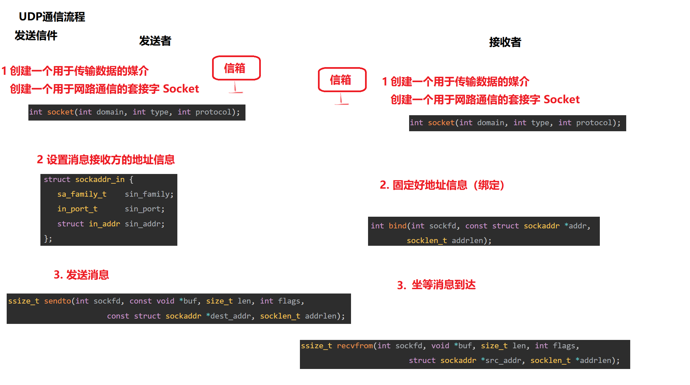

 

 

 

**3. API接口：**

1. 

2. **创建套接字，申请一个应用于网络通信的接口**


```c
#include <sys/types.h>          /* See NOTES */ 
#include <sys/socket.h> 
 
int socket(int domain, int type, int protocol);
 
参数分析：
    domain --> 选择所需的协议簇 （网络协议）
        AF_UNIX, AF_LOCAL   Local communication              unix(7)  本地通信协议
        AF_INET             IPv4 Internet protocols          ip(7)  IPV4地址协议
        AF_INET6            IPv6 Internet protocols          ipv6(7)IPV6地址协议
    type --> 协议类型
                        流式套接字
        SOCK_STREAM    【TCP】 Provides sequenced, reliable, two-way, connection-based byte streams.  An out-of-band
                       data transmission mechanism may be supported. 
                        数据报套接字
        SOCK_DGRAM      【UDP】Supports datagrams (connectionless, unreliable messages of a fixed maximum length).
    protocol --> 协议的支持
        一般情况下某一个type 会有一个特定的协议来支持他，因此一般情况只要确保type是正确的该参数可以默认为0 即可
返回值：
    成功 返回大于零的文件描述符
    失败 返回 -1 
```

 

**地址信息结构体：**

```c
struct sockaddr_in { 
   sa_family_t    sin_family; /* 选定地址协议 比如 AF_INET 表示IPV4地址协议 address family: AF_INET */ 
   in_port_t      sin_port;   /* 端口号 用于明确由哪一个进程处理该数据 port in network byte order */ 
   struct in_addr sin_addr;   /* 地址结构体 internet address */ 
}; 
 
/* Internet address. */ 
struct in_addr { 
   uint32_t       s_addr;     /* 32位整型的地址信息 address in network byte order */ 
};
 
```

 

#### 地址转换的接口：

如何把点分十进制的字符串转换位32位的无符号整型

"192.168.123.123"   -->      uint32_t   

```c
int inet_pton(int family,const char *strptr, void *addrptr); // 将点分十进制数串转换成 32 位无符号整数
const char *inet_ntop(int family, const void *addrptr, char *strptr, size_t len); // 将 32 位无符号整数转换成点分十进制数串
len 的宏定义
#define INET_ADDRSTRLEN 16 //for ipv4
#define INET6_ADDRSTRLEN 46 //for ipv6

// 这两个函数只能用在ipv4地址的转换
    in_addr_t inet_addr(const char *cp); // 将点分十进制ip地址转化为整形数据
char *inet_ntoa(struct in_addr in); // 	将整形数据转化为点分十进制的ip地址
```

```c
#include <stdio.h>
#include <arpa/inet.h>
int main()
{
    unsigned char ip_int[]={192, 168, 3, 103};
    char ip_str[16] = "";
    inet_ntop(AF_INET, &ip_int, ip_str, 16);
    printf("ip_s = %s\n", ip_str);  //"192.168.3.103"
    return 0;
}
```


```c
#include <sys/socket.h> 
#include <netinet/in.h> 
#include <arpa/inet.h> 
 
int inet_aton(const char *cp, struct in_addr *inp); 
in_addr_t inet_addr(const char *cp);  // 把 字符串 转换为网络字节序
in_addr_t inet_network(const char *cp); // 131.32.168.192 (与上大小端相反)
char *inet_ntoa(struct in_addr in);  // 网络字段 转换为 字符串（点分十进制）
struct in_addr inet_makeaddr(in_addr_t net, in_addr_t host); 
in_addr_t inet_lnaof(struct in_addr in); 
in_addr_t inet_netof(struct in_addr in);
 
#include <arpa/inet.h> hto
 
uint32_t htonl(uint32_t hostint32); // 将32位主机字节序数据转换成网络字节序数据
uint16_t htons(uint16_t hostint16); // 将16位主机字节序数据转换成网络字节序数据
uint32_t ntohl(uint32_t netlong);  // 网络字节序转换为主机字节序
uint16_t ntohs(uint16_t netshort);
htonl(0x12345678) // 0x78563412
    htons(atoi("60000")) // 
```


```c
#include <stdio.h>
#include <stdlib.h>
#include <arpa/inet.h>
#define IPV4_ADDR "192.168.1.222"
int main(void)
{
    struct in_addr addr;
    inet_pton(AF_INET, IPV4_ADDR, &addr);
    printf("ip addr: %#x\n", addr.s_addr);

    u_int32_t netaddr = inet_addr(IPV4_ADDR);
    printf("ip addr: %#x\n", netaddr);

    netaddr = inet_network(IPV4_ADDR);
    printf("ip addr: %#x\n", netaddr);

    exit(0);
}
```


```c
// 点分十进制转换为二进制 Ipv4 或 Ipv6 地址
int inet_pton(int af, const char *src, void *dst);
```

- 参数 af 必须是 AF_INET 或 AF_INET6  
  - 参数 af 被指定为 AF_INET，则参数 dst 所指对象应该是一个 struct in_addr 结构体的对象；
  - 如果参数 af 被指定为 AF_INET6，则参数 dst 所指对象应该是一个 struct in6_addr 结构体的对象。  
- 返回
  - 1：成功
  - 0：src 不包含表示指定地址族中有效网络地址的字符串，则返回 0 
  - -1：失败

```c
#include <stdio.h>
#include <stdlib.h>
#include <arpa/inet.h>
#define IPV4_ADDR "192.168.1.222"
int main(void)
{
    struct in_addr addr;
    inet_pton(AF_INET, IPV4_ADDR, &addr);
    printf("ip addr: 0x%x\n", addr.s_addr);
    exit(0);
}
```


```c
const char *inet_ntop(int af, const void *src, char *dst, socklen_t size);
// 如果 size 的值太小了，那么将会返回 NULL 并将 errno 设置为 ENOSPC。
```

```c
#include <stdio.h>
#include <stdlib.h>
#include <arpa/inet.h>
int main(void)
{
    struct in_addr addr;
    char buf[20] = {0};
    addr.s_addr = 0xde01a8c0;
    inet_ntop(AF_INET, &addr, buf, sizeof(buf));
    printf("ip addr: %s\n", buf);
    exit(0);
}
```


```
#include <sys/types.h> 
#include <sys/socket.h>
 
 
ssize_t sendto(int sockfd, const void *buf, size_t len, int flags, 
                      const struct sockaddr *dest_addr, socklen_t addrlen);
参数分析：
    sockfd --> 通信套接字
    buf --> 需要发送的消息的内存地址
    len --> 具体消息的长度
    flags --> 发送时的特殊标记，一般设置为 0 即可
    dest_addr --> 目标地址
    addrlen --> 地址长度
返回值：
    成功 返回字节数
    失败 返回 -1 
```


1. 5.**如何绑定地址：**

```

#include <sys/types.h>          /* See NOTES */ 
#include <sys/socket.h> 
 
int bind(int sockfd, const struct sockaddr *addr, 
        socklen_t addrlen);
参数分析：
    sockfd --> 套接字
    addr --> 具体的地址信息
    addrlen --> 地址信息的长度
返回值：
    成功  返回0
    失败 返回-1
```

 

1. 6.**接收消息：**

```
ssize_t recvfrom(int sockfd, void *buf, size_t len, int flags, 
                        struct sockaddr *src_addr, socklen_t *addrlen);
参数分析：
     sockfd --> 套接字
     buf   --> 接收到的消息的用户缓冲区  
     buf --> 缓冲区的最大长度，避免越界   
     flags --> 特殊选项，一般设置为 0 
     src_addr --> 消息来自哪里（用于存储对方的地址结构体） 
     addrlen --> 明确上一个参数中的地址尺寸以及用于记录实际收到的对方地址尺寸
 返回值：
     成功 返回实际收到的字节数
     失败 返回 -1         
    
```

 

### 获取网络信息

```c
// 本机所有活跃网卡列表信息
struct ifconf
{
  int     ifc_len;     /* size of buffer */
  union
  {
    caddr_t ifcu_buf;
    struct  ifreq *ifcu_req;
  } ifc_ifcu;
};
```

```c
// 某一个网卡信息
struct ifreq
{
    union
    {
        char ifrn_name[IFNAMSIZ];    /* 某个网口的名称，比如 "ens33" */
    } ifr_ifrn;

    union
    {
        struct sockaddr ifru_addr;     // IP地址
        struct sockaddr ifru_dstaddr;  // 目标IP地址
        struct sockaddr ifru_broadaddr;// 广播地址
        struct sockaddr ifru_netmask;  // 子网掩码
        struct sockaddr ifru_hwaddr;   // 硬件MAC地址
        short int ifru_flags;
        int ifru_ivalue;
        int ifru_mtu;
        struct ifmap ifru_map;
        char ifru_slave[IFNAMSIZ];    /* Just fits the size */
        char ifru_newname[IFNAMSIZ];
        __caddr_t ifru_data;
    }ifr_ifru;
};
```


注意到，某网卡的相关信息被放在一个联合体中，换句话说不能一次性获取这些信息，而是要用如下宏来分别获取这些信息：

| 序号 | 宏             | ioctl参数     | 描述                          |
| :--: | -------------- | ------------- | ----------------------------- |
|  1   | SIOCGIFCONF    | struct ifconf | 获取所有活跃网卡的信息        |
|  2   | SIOCGIFADDR    | struct ifreq  | 获取指定网卡的IP地址信息      |
|  3   | SIOCGIFBRDADDR | struct ifreq  | 获取指定网卡的广播地址信息    |
|  4   | SIOCGIFHWADDR  | struct ifreq  | 获取指定网卡的硬件MAC地址信息 |

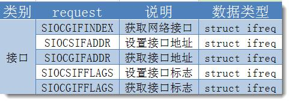


#### 1. 获取网络接口网卡信息 ioctl SIOCGIFADDR

#### （绑定网络端口前）

```c
#include <sys/ioctl.h>
#include <net/if.h> // ifreq 在这个头文件中
// 指定网口名称 ens33
struct ifreq ifr;
strcpy(ifr.ifr_ifrn.ifrn_name, "ens33");

// 1，获取指定网口IP地址
int ioctl(int fd, SIOCGIFADDR, &ifr);
// 2，获取指定网口广播地址
int ioctl(int fd, SIOCGIFBRDADDR, &ifr);
// 3，获取指定网口子网掩码
int ioctl(int fd, SIOCGIFNETMASK, &ifr);
```

```c
#include <sys/ioctl.h>
#include <net/if.h>
#include <string.h>
#include <stdio.h>
#include <sys/socket.h>
#include <netinet/in.h>
#include <arpa/inet.h>

int main(int argc, char *argv[])
{
    // 获取指定网卡的各种基本信息
    int sockfd = socket(AF_INET, SOCK_DGRAM, 0);
    struct ifreq ifr;
    strcpy(ifr.ifr_ifrn.ifrn_name, "ens33");
  	
    ioctl(sockfd, SIOCGIFADDR, &ifr);
    printf("IP: %s\n", inet_ntoa(((struct sockaddr_in *)&(ifr.ifr_ifru.ifru_addr))->sin_addr));

    ioctl(sockfd, SIOCGIFBRDADDR, &ifr);
    printf("广播地址: %s\n", inet_ntoa(((struct sockaddr_in *)&(ifr.ifr_ifru.ifru_broadaddr))->sin_addr));

    ioctl(sockfd, SIOCGIFNETMASK, &ifr);
    printf("子网掩码: %s\n", inet_ntoa(((struct sockaddr_in *)&(ifr.ifr_ifru.ifru_netmask))->sin_addr));

    return 0;
}
```


#### 2. 获得本进程的网络地址和端口地址  getsockname

```c
#include <sys/socket.h>
// 下面的函数只能在通信成功后才能获取相关信息
// 而使用ioctl
int getsockname(int sockfd, struct sockaddr *addr, socklen_t *addrlen);
int getpeername(int sockfd, struct sockaddr *addr, socklen_t *addrlen);
```


```c
    // 通过套接字获取本地地址 
    struct sockaddr_in localAddr;
    socklen_t len = sizeof(localAddr);
    getsockname(tcp_socket, (struct sockaddr *)&localAddr, &len);
    printf("local [ipv4]%s [port]%d\n", inet_ntoa(localAddr.sin_addr), ntohs(localAddr.sin_port));
```

#### 3.  获取对端套接字的地址信息 getpeername

```c
    // 获取对端套接字的地址信息
    struct sockaddr_in a = {0};
    socklen_t len1 = sizeof(a);
    getpeername(tcp_socket, (struct sockaddr *)&a, &len1);
    printf("对端TCP套接字的IP: %s\n", inet_ntoa(a.sin_addr));
    printf("对端TCP套接字的端口: %hu\n", ntohs(a.sin_port));

    printf("获取域名的地址..\n");    
    struct hostent *p;
    p = gethostbyname(argv[1]);

```


#### 4. 获取域名的ip地址 gethostbyname

```c
#include <netdb.h>
extern int h_errno;

struct hostent *gethostbyname(const char *name);  // 指定主机名或域名

// 结构体struct hostent信息
struct hostent
{
    char  *h_name;            /* official name of host */
    char **h_aliases;         /* alias list */
    int    h_addrtype;        /* host address type */
    int    h_length;          /* length of address */
    char **h_addr_list;       /* list of addresses */
};
```


```c
    printf("获取域名的地址..\n");    
    struct hostent *p;
    p = gethostbyname(argv[1]);

    // 列出指定域名的IP地址（列表）
    for ( int i=0; p->h_addr_list[i] != NULL; i++ )
        printf("%s\n", inet_ntoa(*(struct in_addr*)((p->h_addr_list)[i])));

    printf("Hostname: %s\n", p->h_name);
    for ( char **addr = p->h_addr_list; *addr != NULL; addr++ ) {
        printf("IP address: %s\n", inet_ntoa(*(struct in_addr *)*addr));
    }
    for ( char **addr = p->h_aliases; *addr != NULL; addr++ ) {
        printf("aliases name: %s\n", inet_ntoa(*(struct in_addr *)*addr));
    }
```


#### **网络信息检索**

在网络编程中，如下API都是比较常见且有用的：

| 序号 | API                  | 描述                         |
| :--: | -------------------- | ---------------------------- |
|  1   | gethostname( )       | 获取主机名                   |
|  2   | **getsockname( )**   | **获得本端套接字的地址信息** |
|  3   | **getpeername( )**   | **获得对端套接字的地址信息** |
|  4   | **gethostbyname( )** | **根据主机名取得主机信息**   |
|  5   | gethostbyaddr( )     | 根据主机地址取得主机信息     |
|  6   | getprotobyname( )    | 根据协议名取得主机协议信息   |
|  7   | getprotobynumber( )  | 根据协议号取得主机协议信息   |
|  8   | getservbyname( )     | 根据服务名取得相关服务信息   |
|  9   | getservbyport( )     | 根据端口号取得相关服务信息   |


#### 总

```c
#include <sys/types.h>          /* See NOTES */
#include <sys/socket.h>
#include <netinet/in.h>
#include <arpa/inet.h>
#include <stdio.h>
#include <string.h>
#include <stdlib.h>
#include <errno.h>
#include <unistd.h>

#include <pthread.h>
#include <sys/ioctl.h>
#include <net/if.h>

#include <netdb.h>
extern int h_errno;

int main(int argc, char argv[])
	printf("pid:%d", getpid() );

    // 1. 套接字
    tcp_socket = socket(AF_INET, SOCK_STREAM, 0);
    if (tcp_socket == -1) {
        perror("socket error");
        return -1;
    }
    printf("[socket]%d\n", tcp_socket);

    // 2. 明确连接地址
    struct sockaddr_in  remoteAddr;
    memset( &remoteAddr, 0, sizeof(remoteAddr) );
    remoteAddr.sin_family = (AF_INET); /* address family: AF_INET */
    remoteAddr.sin_port = (htons(LOCAL_PORT));   /* port in network byte order */
    remoteAddr.sin_addr.s_addr = inet_addr(SVC_IPV4);   /* internet address */

    // 3. 向服务器建立链接
    if ( connect(tcp_socket, (struct sockaddr *)&remoteAddr, sizeof(remoteAddr)) == -1) {
        perror("connect error");
        return -1;
    }

    // 创建接收线程
    pthread_t tid;
    if ( pthread_create( &tid, NULL, recv_fun, (void *)&remoteAddr ) == -1 ) {
        perror("pthread_create error");
        return -1;
    }

    // 获取指定网卡的各种基本信息
    int sockfd = socket(AF_INET, SOCK_DGRAM, 0);
    struct ifreq ifr;
    strcpy(ifr.ifr_ifrn.ifrn_name, "eth3");

    ioctl(sockfd, SIOCGIFADDR, &ifr);
    printf("IP: %s\n", inet_ntoa(((struct sockaddr_in *)&(ifr.ifr_ifru.ifru_addr))->sin_addr));

    ioctl(sockfd, SIOCGIFBRDADDR, &ifr);
    printf("广播地址: %s\n", inet_ntoa(((struct sockaddr_in *)&(ifr.ifr_ifru.ifru_broadaddr))->sin_addr));

    ioctl(sockfd, SIOCGIFNETMASK, &ifr);
    printf("子网掩码: %s\n", inet_ntoa(((struct sockaddr_in *)&(ifr.ifr_ifru.ifru_netmask))->sin_addr));

    // 获取本地地址
    struct sockaddr_in localAddr;
    socklen_t len = sizeof(localAddr);
    getsockname(tcp_socket, (struct sockaddr *)&localAddr, &len);
    printf("local [ipv4]%s [port]%d\n", inet_ntoa(localAddr.sin_addr), ntohs(localAddr.sin_port));

    // 获取对端套接字的地址信息
    struct sockaddr_in a = {0};
    socklen_t len1 = sizeof(a);
    getpeername(tcp_socket, (struct sockaddr *)&a, &len1);
    printf("对端TCP套接字的IP: %s\n", inet_ntoa(a.sin_addr));
    printf("对端TCP套接字的端口: %hu\n", ntohs(a.sin_port));

    printf("获取域名的地址..\n");
    struct hostent *p;
    p = gethostbyname(argv[1]);

    // 列出指定域名的IP地址（列表）
    for ( int i=0; p->h_addr_list[i] != NULL; i++ )
        printf("%s\n", inet_ntoa(*(struct in_addr*)((p->h_addr_list)[i])));

    printf("Hostname: %s\n", p->h_name);
    for ( char **addr = p->h_addr_list; *addr != NULL; addr++ ) {
        printf("IP address: %s\n", inet_ntoa(*(struct in_addr *)*addr));
    }
    for ( char **addr = p->h_aliases; *addr != NULL; addr++ ) {
        printf("aliases name: %s\n", inet_ntoa(*(struct in_addr *)*addr));
    }
}

```


### 属性设置


套接字可以设定很多属性，比如数据缓冲区长度、广播、心跳测试、超时控制等等，下表展示了比较常见的套接字的属性：

```c
int setsockopt(int sockfd, int level, int optname,
               const void *optval, socklen_t optlen);

// 把他设置接收超时属性
if(setsockopt(tcp_socket , SOL_SOCKET , SO_RCVTIMEO ,&MyTime, sizeof(MyTime))
   
   
 
   //将套接字设置为允许重复使用本机地址或者为设置为端口复用
   int on = 1;
   if(setsockopt(sockfd, SOL_SOCKET, SO_REUSEADDR, &on, sizeof(on)) < 0)
   {
       ERR_LOG("fail to setsockopt");
   }
```


| **optname 值** | **功能说明**              | **optval 说明**  （SOL_SOCKET）                              |
| -------------- | ------------------------- | ------------------------------------------------------------ |
| SO_BROADCAST   | 启用广播功能。            | const int *：指向布尔值的指针，用于控制是否启用广播功能。非零表示启用，零表示禁用。 |
| SO_DEBUG       | 启用调试模式。            | const int *：指向布尔值的指针，用于控制是否启用调试模式。非零表示启用，零表示禁用。 |
| SO_KEEPALIVE   | 启用 TCP Keepalive 机制。 | const int *：指向布尔值的指针，用于控制是否启用 TCP Keepalive 机制。非零表示启用，零表示禁用。 |
| SO_LINGER      | 设置连接关闭时的行为。    | const struct linger *：指向 linger 结构体的指针，用于设置连接关闭时的行为。 |
| SO_RCVBUF      | 设置接收缓冲区大小。      | const int *：指向整数值的指针，用于设置接收缓冲区大小。      |
| SO_REUSEADDR   | 允许地址重用。            | const int *：指向布尔值的指针，用于控制是否允许地址重用。非零表示允许，零表示禁止。 |
| SO_SNDBUF      | 设置发送缓冲区大小。      | const int *：指向整数值的指针，用于设置发送缓冲区大小。      |
| SO_ERROR       | 获取套接字错误状态。      | int *：指向整数值的指针，用于获取套接字错误状态。            |
| SO_RCVTIMEO    | 数据接收超时              | struct timeval * ， **用于设置超时的时间，数据接收超时**     |
| SO_SNDTIMEO    | 数据发送超时              | struct timeval * ， **用于设置超时的时间，数据发送超时**     |


| TCP_NODELAY         | 禁用 Nagle 算法，提高数据传输效率。  | const int *：指向布尔值的指针，用于控制是否禁用 Nagle 算法。非零表示禁用，零表示启用。 |
| ------------------- | ------------------------------------ | ------------------------------------------------------------ |
| TCP_MAXSEG          | 设置最大突发报文段长度（MSS）。      | const int *：指向整数值的指针，用于设置最大突发报文段长度（MSS）。 |
| TCP_KEEPALIVE       | 设置 TCP Keepalive 机制参数。        | const int *：指向整数值的指针，用于设置 TCP Keepalive 机制参数。 |
| TCP_QUICKACK        | 启用快速应答模式。                   | const int *：指向布尔值的指针，用于控制是否启用快速应答模式。非零表示启用，零表示禁用。 |
| TCP_DEFER_ACCEPT    | 启用延迟 ACK 策略。                  | const int *：指向整数值的指针，用于控制是否启用延迟 ACK 策略。 |
|                     |                                      |                                                              |
|                     |                                      |                                                              |
| IP_MULTICAST_LOOP   | 控制本地回环。                       | const int *：指向布尔值的指针，用于控制本地回环。            |
| IP_MULTICAST_TTL    | 设置多播 TTL 值。                    | const int *：指向整数值的指针，用于设置多播 TTL 值。         |
| IP_TOS              | 设置服务类型（Type of Service）。    | const int *：指向整数值的指针，用于设置服务类型（Type of Service）。 |
| IP_ADD_MEMBERSHIP   | 加入组播                             | struct ip_mreq*  结构体指针，用于设置IP地址与组播地址        |
|                     |                                      |                                                              |
|                     |                                      |                                                              |
| IPV6_MULTICAST_LOOP | 控制本地回环。                       | const int *：指向布尔值的指针，用于控制本地回环。            |
| IPV6_MULTICAST_HOPS | 设置多播跳数值。                     | const int *：指向整数值的指针，用于设置多播跳数值。          |
| IPV6_UNICAST_HOPS   | 设置单播跳数值。                     | const int *：指向整数值的指针，用于设置单播跳数值。          |
| IPV6_V6ONLY         | 限制 IPv6 套接字只能处理 IPv6 数据。 | const int *：指向布尔值的指针，用于限制 IPv6 套接字只能处理 IPv6 数据。 |


**超时控制实现办法**

在套接字操作中，超时控制有三种方式：

1. 直接设置套接字的超时属性，简单易用，童叟无欺。
2. 利用 select 函数自带的超时属性，群体控制，也挺好用。
3. 利用 SIGALRM 和它的搭档 alarm() 函数，自定闹钟，也能达到目的。


## UDP

### TFTP 简单文件传送协议(应用层协议)

TFTP： 简单文件传送协议
		**==最初用于引导无盘系统， 被设计用来传输小文件==**
特点：基于 UDP 协议实现、不进行用户有效性认证
数据传输模式：octet： 二进制模式netascii： 文本模式mail： 已经不再支持

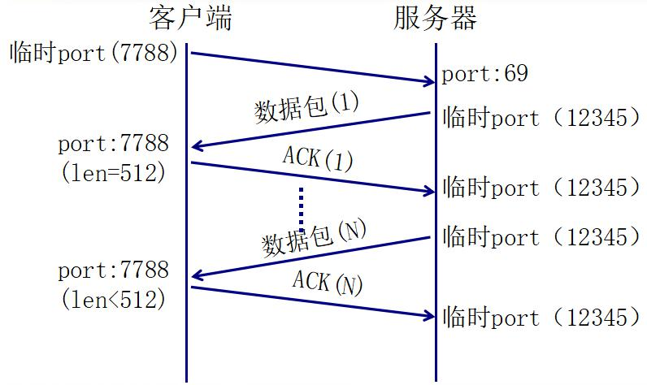

- 服务器在 69 号端口等待客户端的请求
- 服务器若批准此请求,则使用临时端口与客户端进行通信
- 每个数据包的编号都有变化（从 1 开始）
- 每个数据包都要得到 ACK 的确认，如果出现超时,则需要重新发送最后的包（数据或 ACK）
- 数据的长度以 512Byte 传输
- 小于 512Byte 的数据意味着传输结束


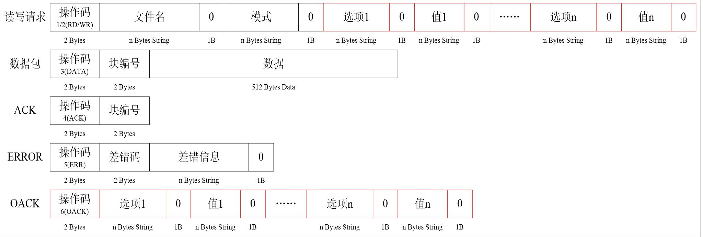

- 以上的 0 代表的是’ \0 '
- 读写请求：
  - 操作码：1 下载、2 上传； 
  - 数据传输模式：文本、二进制；
  - 选项一般不填

- 数据包：3； 
  - 块编号：随着数据包变化； 
  - 数据： ；
- ACK：4
  - 块编号

- OACK：一般不用
- ERROR：5
  - 0 未定义,参见错误信息
    1 File not found.
    2 Access violation.
    3 Disk full or allocation exceeded.
    4 illegal TFTP operation.
    5 Unknown transfer ID.
    6 File already exists.
    7 No such user.
    8 Unsupported option(s) requested


#### 练习

练习要求
使用 TFTP 协议， 下载 server 上的文件到本地
实现思路
1、 构造请求报文， 送至服务器(69 号端口)
2、 等待服务器回应
3、 分析服务器回应
4、 接收数据,直到接收到的数据包小于规定数据长度

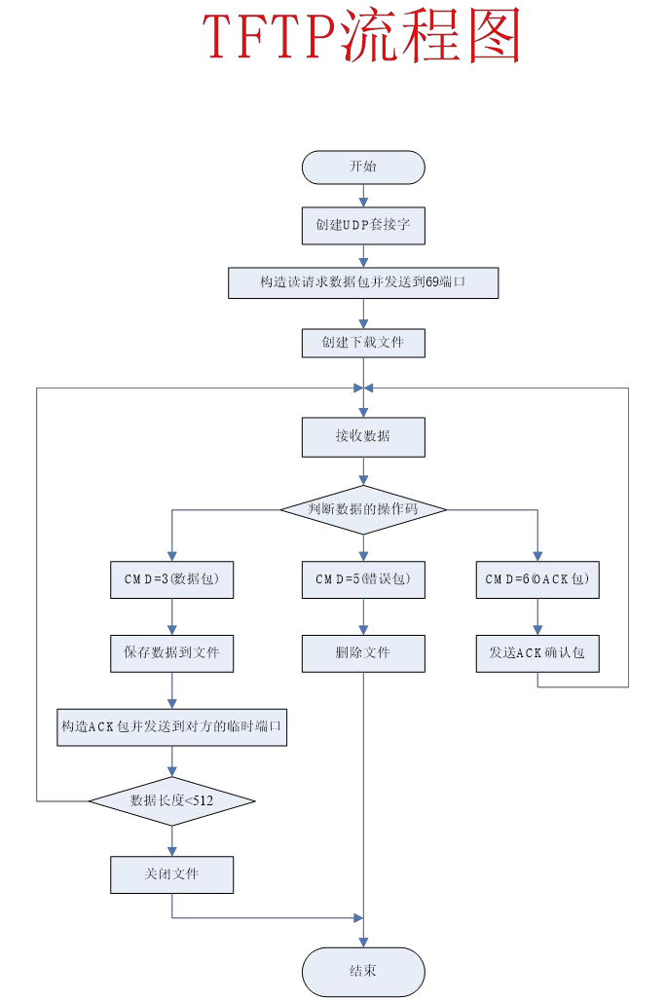

#### 代码下载

```c
#include <stdio.h> //printf
#include <stdlib.h> //exit
#include <sys/types.h>
#include <sys/socket.h> //socket
#include <netinet/in.h> //sockaddr_in
#include <arpa/inet.h> //htons inet_addr
#include <unistd.h> //close
#include <string.h>
#include <sys/stat.h>
#include <fcntl.h>

void do_download(int sockfd, struct sockaddr_in serveraddr)
{
    char filename[128] = "";
    printf("请输入要下载的文件名: ");
    scanf("%s", filename);

    //给服务器发送消息，告知服务器执行下载操作
    unsigned char text[1024] = "";
    int text_len;
    socklen_t addrlen = sizeof(struct sockaddr_in);
    int fd;
    int flags = 0;
    int num = 0;
    ssize_t bytes;

    //构建给服务器发送的tftp指令并发送给服务器，例如：01test.txt0octet0
    text_len = sprintf(text, "%c%c%s%c%s%c", 0, 1, filename, 0, "octet", 0);
    if(sendto(sockfd, text, text_len, 0, (struct sockaddr *)&serveraddr, addrlen) < 0)
    {
        perror("fail to sendto");
        exit(1);
    }

    while(1)
    {
        //接收服务器发送过来的数据并处理
        if((bytes = recvfrom(sockfd, text, sizeof(text), 0, (struct sockaddr *)&serveraddr, &addrlen)) < 0)
        {
            perror("fail to recvfrom");
            exit(1);
        }

        //printf("操作码：%d, 块编号：%u\n", text[1], ntohs(*(unsigned short *)(text+2)));
        //printf("数据：%s\n", text+4);

        //判断操作码执行相应的处理
        if(text[1] == 5)
        {
            printf("error: %s\n", text+4);
            return ;
        }
        else if(text[1] == 3)
        {
            if(flags == 0)
            {
                //创建文件
                if((fd = open(filename, O_WRONLY | O_CREAT | O_TRUNC, 0664)) < 0)
                {
                    perror("fail to open");
                    exit(1);
                }
                flags = 1;
            }

            //对比编号和接收的数据大小并将文件内容写入文件
            if((num+1 == ntohs(*(unsigned short *)(text+2))) && (bytes == 516))
            {
                num = ntohs(*(unsigned short *)(text+2));
                if(write(fd, text + 4, bytes - 4) < 0)
                {
                    perror("fail to write");
                    exit(1);
                }

                //当文件写入完毕后，给服务器发送ACK
                text[1] = 4;
                if(sendto(sockfd, text, 4, 0, (struct sockaddr *)&serveraddr, addrlen) < 0)
                {
                    perror("fail to sendto");
                    exit(1);
                }
            }
            //当最后一个数据接收完毕后，写入文件后退出函数
            else if((num+1 == ntohs(*(unsigned short *)(text+2))) && (bytes < 516))
            {
                if(write(fd, text + 4, bytes - 4) < 0)
                {
                    perror("fail to write");
                    exit(1);
                }

                text[1] = 4;
                if(sendto(sockfd, text, 4, 0, (struct sockaddr *)&serveraddr, addrlen) < 0)
                {
                    perror("fail to sendto");
                    exit(1);
                }

                printf("文件下载完毕\n");
                return ;
            }
        }
    }
}

int main(int argc, char const *argv[])
{
    if(argc < 2)
    {
        fprintf(stderr, "Usage: %s <server_ip>\n", argv[0]);
        exit(1);
    }

    int sockfd;
    struct sockaddr_in serveraddr;

    //创建套接字
    if((sockfd = socket(AF_INET, SOCK_DGRAM, 0)) < 0)
    {
        perror("fail to socket");
        exit(1);
    }

    //填充服务器网络信息结构体
    serveraddr.sin_family = AF_INET;
    serveraddr.sin_addr.s_addr = inet_addr(argv[1]); //tftp服务器端的ip地址，192.168.3.78
    serveraddr.sin_port = htons(69); //tftp服务器的端口号默认是69

    do_download(sockfd, serveraddr); //下载操作

    return 0;
}
```

#### 通用

```c
#include <stdio.h>
#include <stdlib.h>
#include <unistd.h>
#include <sys/types.h>
#include <sys/socket.h>
#include <arpa/inet.h>
#include <netinet/in.h>
#include <string.h>
#include <sys/stat.h>
#include <fcntl.h>
#include <errno.h>

#define ERRLOG(errmsg) do{\
                            perror(errmsg);\
                            exit(1);\
                        }while(0)

#define N 128

void do_help()
{
    system("clear");
    printf("---------------------\n");
    printf("------ 1. 下载 ------\n");
    printf("------ 2. 上传 ------\n");
    printf("------ 3. 退出 ------\n");
    printf("---------------------\n");
}

void do_download(int sockfd, struct sockaddr_in serveraddr)
{
    char filename[N] = {};
    printf("请输入要下载的文件名：");
    scanf("%s", filename);

    char data[1024] = "";
    int data_len;
    int fd;
    int flags = 0;
    int num = 0;
    int recv_len;

    //组数据并发送
    data_len = sprintf(data, "%c%c%s%c%s%c", 0, 1, filename, 0, "octet", 0);
    if(sendto(sockfd, data, data_len, 0, (struct sockaddr *)&serveraddr, sizeof(serveraddr)) < 0)
    {
        ERRLOG("fail to sendto");
    }

    //接收数据并分析处理
    socklen_t addrlen = sizeof(serveraddr);
    while(1)
    {
        if((recv_len = recvfrom(sockfd, data, sizeof(data), 0, (struct sockaddr *)&serveraddr, &addrlen)) < 0)
        {
            ERRLOG("fail to recvfrom");
        }

        //printf("%d - %u\n", data[1], ntohs(*(unsigned short *)(data + 2)));
        //printf("%s\n", data + 4);

        if(data[1] == 5)
        {
            printf("error: %s\n", data + 4);
            return ;
        }
        else if(data[1] == 3)
        {
            //防止文件内容清空
            if(flags == 0)
            {
                if((fd = open(filename, O_WRONLY | O_CREAT | O_TRUNC, 0664)) < 0)
                {
                    ERRLOG("fail to open");
                }
                flags = 1;
            }

            //判断数据包的编号是否是上一次的编号加1
            if(num + 1 == ntohs(*(unsigned short *)(data + 2)) && recv_len == 516)
            {
                //向文件写入数据
                write(fd, data + 4, recv_len - 4);
            
                //组数据发送给服务器
                data[1] = 4; 
                if(sendto(sockfd, data, 4, 0, (struct sockaddr *)&serveraddr, addrlen) < 0)
                {
                    ERRLOG("fail to sendto");
                }

                num = ntohs(*(unsigned short *)(data + 2));
            }
            //接收到的最后一次的数据
            else if(num + 1 == ntohs(*(unsigned short *)(data + 2)) && recv_len < 516)
            {
                write(fd, data + 4, recv_len - 4);
                break;
            }
        }
    }

    printf("文件下载成功\n");
}

void do_upload(int sockfd, struct sockaddr_in serveraddr)
{
    char filename[N] = {};
    printf("请输入要上传的文件名：");
    scanf("%s", filename);

    //打开文件并判断文件是否存在
    int fd;
    if((fd = open(filename, O_RDONLY)) < 0)
    {
        if(errno == ENOENT)
        {
            printf("文件%s不存在，请重新输入\n", filename);
            return ;
        }
        else
        {
            ERRLOG("fail to open");
        }
    }

    //组数据并发送给服务器执行上传功能
    char data[1024] = {};
    int data_len;
    socklen_t addrlen = sizeof(serveraddr);

    data_len = sprintf(data, "%c%c%s%c%s%c", 0, 2, filename, 0, "octet", 0);

    if(sendto(sockfd, data, data_len, 0, (struct sockaddr *)&serveraddr, addrlen) < 0)
    {
        ERRLOG("fail to sendto");
    }

    //接收服务器发送的数据并分析处理
    int recv_len;
    int num = 0;
    ssize_t bytes;
    while(1)
    {
        if((recv_len = recvfrom(sockfd, data, sizeof(data), 0, (struct sockaddr *)&serveraddr, &addrlen)) < 0)
        {
            ERRLOG("fail to recvfrom");
        }

        //printf("%d - %d\n", data[1], ntohs(*(unsigned short *)(data + 2)));
        //printf("%s\n", data + 4);

        if(data[1] == 4 && num == ntohs(*(unsigned short *)(data + 2)))
        {
            num++;
            bytes = read(fd, data + 4, 512);
            data[1] = 3;
            *(unsigned short *)(data + 2) = htons(num);

            if(bytes == 512)
            {
                if(sendto(sockfd, data, bytes + 4, 0, (struct sockaddr *)&serveraddr, addrlen) < 0)
                {
                    ERRLOG("fail to sendto");
                }
            }
            else
            {
                if(sendto(sockfd, data, bytes + 4, 0, (struct sockaddr *)&serveraddr, addrlen) < 0)
                {
                    ERRLOG("fail to sendto");
                }
                break;
            } 
        }
    }

    printf("文件上传完毕\n");
}

int main(int argc, char const *argv[])
{
    int sockfd;
    struct sockaddr_in serveraddr;
    //创建套接字
    if((sockfd = socket(AF_INET, SOCK_DGRAM, 0)) < 0)
    {
        ERRLOG("fail to socket");
    }

    //填充服务器网络信息结构体
    serveraddr.sin_family = AF_INET;
    serveraddr.sin_addr.s_addr = inet_addr(argv[1]);
    serveraddr.sin_port = htons(69);

    system("clear");
    printf("------------------------------\n");
    printf("----请输入help查看帮助信息----\n");
    printf("------------------------------\n");
    printf(">>> ");

    char buf[N] = {};
NEXT:
    fgets(buf, N, stdin);
    buf[strlen(buf) - 1] = '\0';
    if(strncmp(buf, "help", 4) == 0)
    {
        do_help();
    }
    else 
    {
        printf("您输入的有误，请重新输入\n");
        goto NEXT;
    }

    int num;
    while(1)
    {
        printf("input>>> ");
        scanf("%d", &num);
        switch (num)
        {
        case 1:
            do_download(sockfd, serveraddr);
            break;
        case 2:
            do_upload(sockfd, serveraddr);
            break;
        case 3:
            close(sockfd);
            exit(0);
            break;
        default:
            printf("您输入的有误，请重新输入\n");
            break;
        }
    }

    return 0;
}
```


### 广播

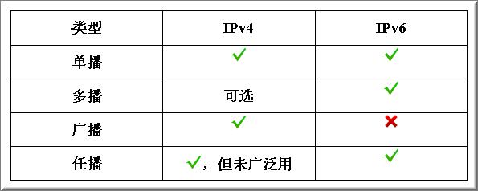

广播的概念  

广播：由一台主机向该主机所在==**子网内的所有主机发送数据**==的方式，
例如192.168.3.103主机发送广播信息，则192.168.3.1~192.168.3.254所有主机都可以接收到数据
广播只能用UDP或原始IP实现，不能用TCP

#### 广播的用途  

单个服务器与多个客户主机通信时==**减少分组流通**==
以下几个协议都用到广播

1. 地址解析协议（ARP）
2. 动态主机配置协议（DHCP）
3. 网络时间协议（NTP）

#### UDP 广播的特点

- 处于同一子网的所有主机都必须处理数据
- UDP 数据包会沿协议栈向上一直到 UDP 层
- 运行音视频等较高速率工作的应用， ==**会带来大负**==
- 局限于局域网内使用

#### UDP 广播地址  

{网络 ID， 主机 ID}
		网络 ID 表示由子网掩码中 1 覆盖的连续位
		主机 ID 表示由子网掩码中 0 覆盖的连续位
定向广播地址： 主机 ID 全 1
		1、 例： 对于 192.168.220.0/24， 其定向广播地址为 192.168.220.255
		2、 通常路由器不转发该广播
受限广播地址： 255.255.255.255
		路由器从不转发该广播


#### 单播与广播

单播

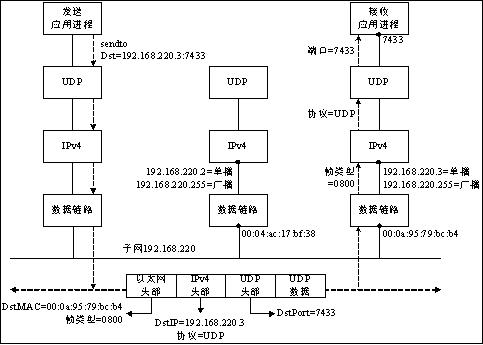

- 应用层
- UDP：传输层
- IP：    网络层
- MAC：数据链路层（交换机会打开以太网头部，当前网络下(局域网内)有对应MAC地址，就会把数据发送给目的主机，目的主机会对比MAC，然后去掉以太网头部，然后把数据包发送给网络层）


广播

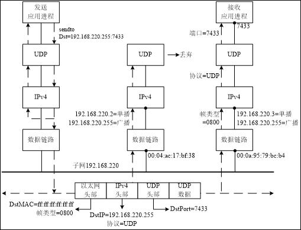

注意：**在传输层接受者才会确定接不收数据**

- IP地址：最后四位255，端口号可以任意设置
- MAC地址：全ff（交换机发现全是ff，会给当前网段下的所有主机发送数据报）
- UDP 传输层：当到达传输层后才会根据端口号确定 接不接受数据报


#### 代码

##### 套接口选项

```c
int setsockopt(int sockfd, int level,int optname, const void *optval,socklen_t optlen);
功能：设置一个套接字的选项（属性）
参数：
    socket：文件描述符
    level：协议层次
    	SOL_SOCKET 套接字层次
        IPPROTO_TCP tcp层次
        IPPROTO_IP IP层次
    option_name：选项的名称
        IP_ADD_MEMBERSHIP 加入多播组
    option_value：设置的选项的值  1
    	1：可以
    	0：不可以
        struct ip_mreq
        {
            struct in_addr imr_multiaddr; //组播ip地址
            struct in_addr imr_interface; //主机地址
            	INADDR_ANY 任意主机地址（自动获取你的主机地址）
        };
	option_len：option_value的长度
返回值：
    成功：0
    失败：‐1
```

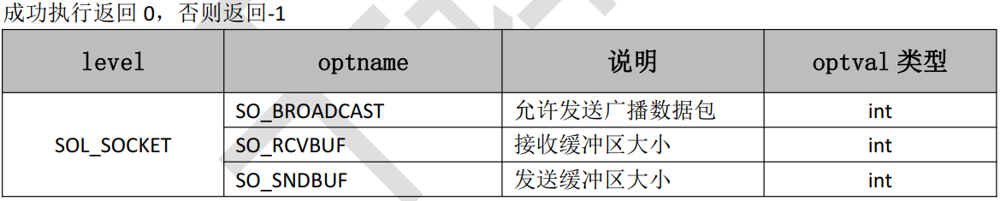


##### 流程

Linux 桥接模式，切在同一个网段，都可以通信

发送者：
第一步：创建套接字 socket()
第二步：设置为允许发送广播权限 setsockopt()
第三步：向广播地址发送数据 sendto()

接收者：
第一步：创建套接字 socket()
第二步：将套接字与广播的信息结构体绑定 bind()
第三步：接收数据 recvfrom()

##### 接收方

```c
#include <stdio.h> //printf
#include <stdlib.h> //exit
#include <sys/types.h>
#include <sys/socket.h> //socket
#include <netinet/in.h> //sockaddr_in
#include <arpa/inet.h> //htons inet_addr
#include <unistd.h> //close
#include <string.h>

int main(int argc, char const *argv[])
{
    if(argc < 3)
    {
        fprintf(stderr, "Usage: %s <ip> <port>\n", argv[0]);
        exit(1);
    }

    int sockfd; //文件描述符
    struct sockaddr_in broadcataddr; 
    socklen_t addrlen = sizeof(broadcataddr);

    //第一步：创建套接字
    if((sockfd = socket(AF_INET, SOCK_DGRAM, 0)) < 0)
    {
        perror("fail to socket");
        exit(1);
    }

    //第二步：填充广播信息结构体（设置广播分组）
    broadcataddr.sin_family = AF_INET;
    broadcataddr.sin_addr.s_addr = inet_addr(argv[1]); //192.168.3.255 255.255.255.255
    broadcataddr.sin_port = htons(atoi(argv[2]));

    //第三步：将套接字与广播信息结构体绑定
    if(bind(sockfd, (struct sockaddr *)&broadcataddr, addrlen) < 0)
    {
        perror("fail to bind");
        exit(1);
    }

    //第四步：进行通信
    char text[32] = "";
    struct sockaddr_in sendaddr;

    while(1)
    {
        if(recvfrom(sockfd, text, sizeof(text), 0, (struct sockaddr *)&sendaddr, &addrlen) < 0)
        {
            perror("fail to recvfrom");
            exit(1);
        }
        
        printf("[%s - %d]: %s\n", inet_ntoa(sendaddr.sin_addr), ntohs(sendaddr.sin_port), text);
    }

    return 0;
}
```

##### 发送方

```c
//广播发送者代码实现
#include <stdio.h> //printf
#include <stdlib.h> //exit
#include <sys/types.h>
#include <sys/socket.h> //socket
#include <netinet/in.h> //sockaddr_in
#include <arpa/inet.h> //htons inet_addr
#include <unistd.h> //close
#include <string.h>

int main(int argc, char const *argv[])
{
    if(argc < 3)
    {
        fprintf(stderr, "Usage: %s <ip> <port>\n", argv[0]);
        exit(1);
    }

    int sockfd; //文件描述符
    struct sockaddr_in broadcataddr; //服务器网络信息结构体
    socklen_t addrlen = sizeof(broadcataddr);

    //第一步：创建套接字
    if((sockfd = socket(AF_INET, SOCK_DGRAM, 0)) < 0)
    {
        perror("fail to socket");
        exit(1);
    }

    //第二步：设置为允许发送广播权限
    int on = 1;
    if(setsockopt(sockfd, SOL_SOCKET, SO_BROADCAST, &on, sizeof(on)) < 0)
    {
        perror("fail to setsockopt");
        exit(1);
    }

    //第三步：填充广播信息结构体
    broadcataddr.sin_family = AF_INET;
    broadcataddr.sin_addr.s_addr = inet_addr(argv[1]); //192.168.3.255 255.255.255.255
    broadcataddr.sin_port = htons(atoi(argv[2]));

    //第四步：进行通信
    char buf[128] = "";
    while(1)
    {
        fgets(buf, sizeof(buf), stdin);
        buf[strlen(buf) - 1] = '\0';
 
        if(sendto(sockfd, buf, sizeof(buf), 0, (struct sockaddr *)&broadcataddr, addrlen) < 0)
        {
            perror("fail to sendto");
            exit(1);
        }
    }

    return 0;
}
```


### 多播

#### 多播概念

数据的收发仅仅在同一分组中进行，所以多播又称之为组播
多播的特点：
1、多播地址标示一组接口
2、多播可以用于广域网使用
3、在IPv4中，多播是可选的


#### 多播地址

Pv4 的 D 类地址是多播地址
十进制：     224.0.0.1        239.255.255.254
十六进制： E0.00.00.01    EF.FF.FF.FE
多播地址向以太网 MAC 地址的映射

只有加入到多播组的接收者才能接受数据

- 发送者
  1. 224.0.1.1：多播地址
  2. 7433：端口号
  3. MAC地址：当前系统所在地址的前三个字节+当前多播地址的后三个字节（倒数第24位要补0，也就是说只识别第23位）
- 接收者：在网络层查看是否加入到多播组，然后确定是否接收数据
  1. 不完备过滤：不管第24位是0还是1，都会被识别为0

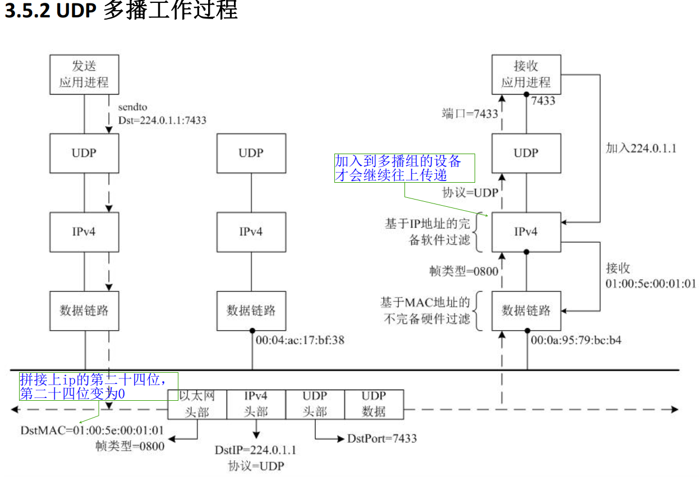


#### 代码

##### 套接口选项

```c
int setsockopt(int sockfd, int level,int optname, const void *optval,socklen_t optlen);
功能：设置一个套接字的选项（属性）
参数：
    socket：文件描述符
    level：协议层次
    	SOL_SOCKET 套接字层次
        IPPROTO_TCP tcp层次
        IPPROTO_IP IP层次
    option_name：选项的名称
        IP_ADD_MEMBERSHIP 加入多播组
    option_value：设置的选项的值  1
    	1：可以
    	0：不可以
        struct ip_mreq
        {
            struct in_addr imr_multiaddr; //组播ip地址
            struct in_addr imr_interface; //主机地址
            	INADDR_ANY 任意主机地址（自动获取你的主机地址）
        };
	option_len：option_value的长度
返回值：
    成功：0
    失败：‐1
```

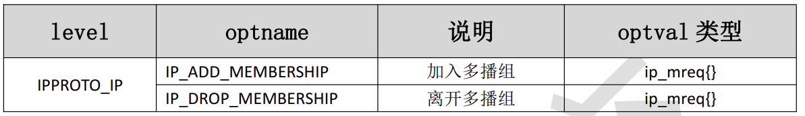

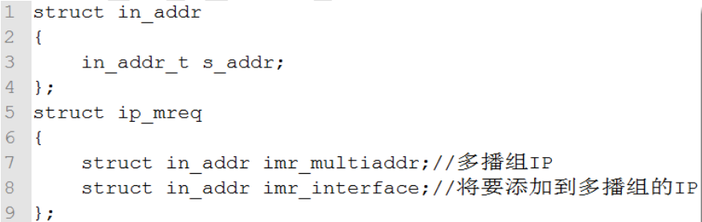

加入多播实例

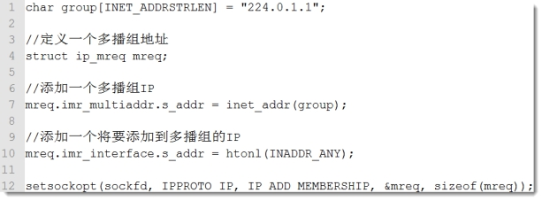

##### 多播流程

发送者：
第一步：创建套接字 socket()
第二步：向多播地址发送数据 sendto()

接收者：
第一步：创建套接字 socket()
第二步：设置为加入多播组 setsockopt()
第三步：将套接字与多播信息结构体绑定 bind()
第五步：接收数据


##### 发送

```c
#include <stdio.h> //printf
#include <stdlib.h> //exit
#include <sys/types.h>
#include <sys/socket.h> //socket
#include <netinet/in.h> //sockaddr_in
#include <arpa/inet.h> //htons inet_addr
#include <unistd.h> //close
#include <string.h>

int main(int argc, char const *argv[])
{
    if(argc < 3)
    {
        fprintf(stderr, "Usage: %s <ip> <port>\n", argv[0]);
        exit(1);
    }

    int sockfd; //文件描述符
    struct sockaddr_in groupcastaddr; //服务器网络信息结构体
    socklen_t addrlen = sizeof(groupcastaddr);

    //第一步：创建套接字
    if((sockfd = socket(AF_INET, SOCK_DGRAM, 0)) < 0)
    {
        perror("fail to socket");
        exit(1);
    }

    //第二步：填充组播信息结构体
    groupcastaddr.sin_family = AF_INET;
    groupcastaddr.sin_addr.s_addr = inet_addr(argv[1]); //224.x.x.x - 239.x.x.x
    groupcastaddr.sin_port = htons(atoi(argv[2]));

    //第三步：进行通信
    char buf[128] = "";
    while(1)
    {
        fgets(buf, sizeof(buf), stdin);
        buf[strlen(buf) - 1] = '\0';   //"hello\n"-->"hello\0"
 
        if(sendto(sockfd, buf, sizeof(buf), 0, (struct sockaddr *)&groupcastaddr, addrlen) < 0)
        {
            perror("fail to sendto");
            exit(1);
        }
    }

    return 0;
}
```


##### 接收

```c
#include <stdio.h> //printf
#include <stdlib.h> //exit
#include <sys/types.h>
#include <sys/socket.h> //socket
#include <netinet/in.h> //sockaddr_in
#include <arpa/inet.h> //htons inet_addr
#include <unistd.h> //close
#include <string.h>

int main(int argc, char const *argv[])
{
    if(argc < 3)
    {
        fprintf(stderr, "Usage: %s <ip> <port>\n", argv[0]);
        exit(1);
    }

    int sockfd; //文件描述符
    struct sockaddr_in groupcastaddr; 
    socklen_t addrlen = sizeof(groupcastaddr);

    //第一步：创建套接字
    if((sockfd = socket(AF_INET, SOCK_DGRAM, 0)) < 0)
    {
        perror("fail to socket");
        exit(1);
    }

    //第二步：设置为加入多播组
    struct ip_mreq mreq;
    mreq.imr_multiaddr.s_addr = inet_addr(argv[1]); //224.0.1.1
    mreq.imr_interface.s_addr = INADDR_ANY;
    if(setsockopt(sockfd, IPPROTO_IP, IP_ADD_MEMBERSHIP, &mreq, sizeof(mreq)) < 0)
    {
        perror("fail to setsockopt");
        exit(1);
    }

    //第三步：填充组播信息结构体
    groupcastaddr.sin_family = AF_INET;
    groupcastaddr.sin_addr.s_addr = inet_addr(argv[1]);  //224.x.x.x - 239.x.x.x
    groupcastaddr.sin_port = htons(atoi(argv[2]));

    //第四步：将套接字与广播信息结构体绑定
    if(bind(sockfd, (struct sockaddr *)&groupcastaddr, addrlen) < 0)
    {
        perror("fail to bind");
        exit(1);
    }

    //第五步：进行通信
    char text[32] = "";
    struct sockaddr_in sendaddr;

    while(1)
    {
        if(recvfrom(sockfd, text, sizeof(text), 0, (struct sockaddr *)&sendaddr, &addrlen) < 0)
        {
            perror("fail to recvfrom");
            exit(1);
        }
        
        printf("[%s - %d]: %s\n", inet_ntoa(sendaddr.sin_addr), ntohs(sendaddr.sin_port), text);
    }

    return 0;
}
```


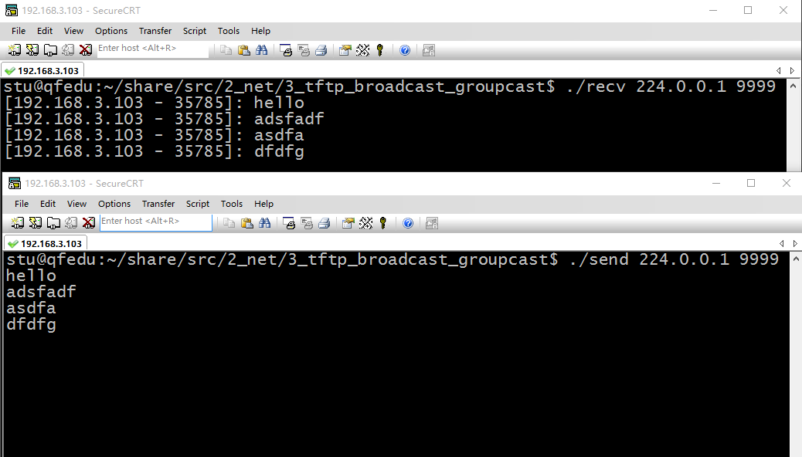


### 对比


---

## TCP

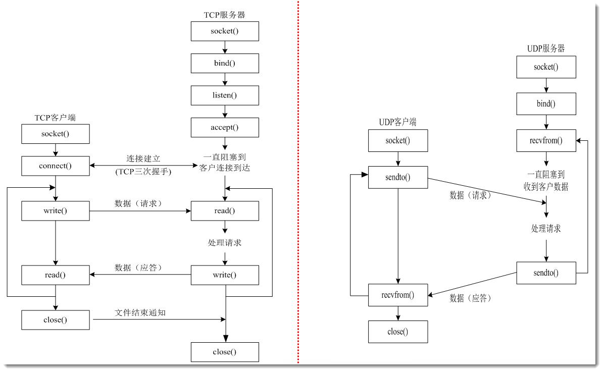


```c
ssize_t send(int sockfd, const void *buf, size_t len, int flags); // TCP不能发送0长度（UDP可以发送0长度信息）
ssize_t recv(int sockfd, void *buf, size_t len, int flags); // 注意：返回0是，对端套接字关闭。

flags：标志位
0 阻塞
MSG_DONTWAIT 非阻塞
```


### 接收缓冲区

***\*注意：如果打算设置TCP接收缓冲区大小，应该在调用listen()函数之前进行设置才会生效！！！\****

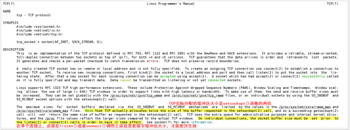

提示：修改TCP的接收缓冲区的目的是可以让通信双方收发固定大小的有效的结构化数据块

接收缓冲区的最初概念指的是套接字从网络接收到的数据对应的暂存区，尤其当传输的数据是结构化数据时，设定特定大小的缓冲区就特别有用。

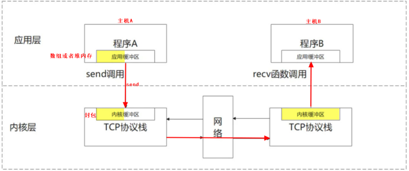

#### 文哥

```c
int setsockopt(int sockfd, int level, int optname, const void *optval, socklen_t optlen);

```


#### 其他

接收缓冲区的大小属于Linux系统套接字文件的属性选项之一，所以想要设置接收缓冲区的大小，则需要通过设置套接字的属性选项实现，Linux系统中提供了两个函数接口来获取和设置套接字的属性选项，分别是getsockopt()和setsockopt()，使用规则如下所示：

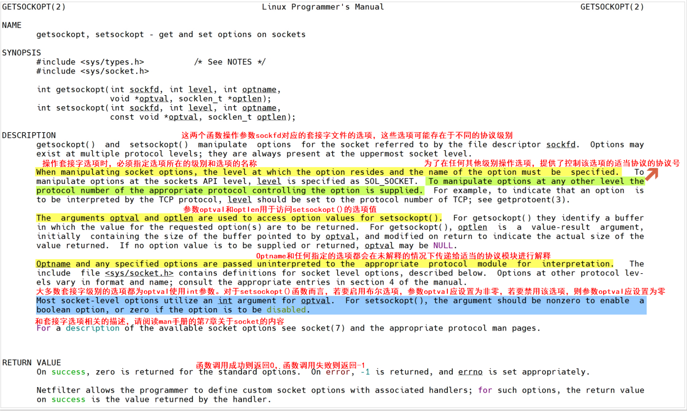

可以看到，setsockopt()函数和getsockopt()函数有5个参数，另外，关于套接字选项的描述，需要通过man手册的第7章了解，输入 man 7 socket即可

第一个参数：sockfd指的是创建的套接字对应的文件描述符，其实是socket()函数的返回值。

第二个参数：level指的是选项对应的协议级别，一般建议把该参数设置为SOL_SOCKET即可。

第三个参数：optname指的是选项的名称，比如设置接收缓冲区的宏是SO_RCVBUF，如下：

第四个参数：optval指的是要设置的选项值，比如要设置接收缓冲区，则设置为某个有效值。

第五个参数：optlen指的是选项值的长度，一般可以通过sizeof计算对应选项值的长度大小。

 

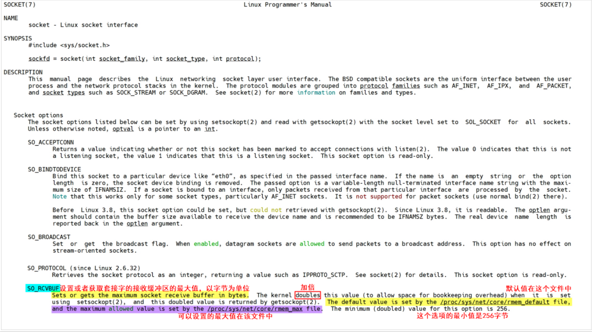

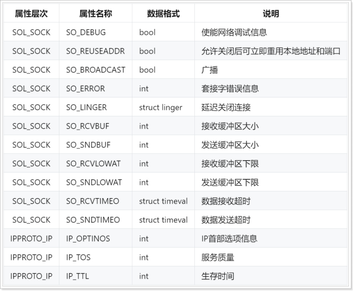


### 接收缓冲区水位线

> 思考：把TCP的接收缓冲区设置为某个固定值，正常情况下发送端应该发送这么多数据时接收端才能接收到，但是实际上发送端发送1个字节，接收端也可以正常接收，请问是为什么?
>
> 回答：可以把TCP接收缓冲区理解为一个水池，原则上只有等水池的水满了（接收的数据填满了缓冲区），应用层才能读取到数据，但是为了更灵活，TCP增加了一个叫水位线的概念。
>

并且规定：当接收数据量超过水位线时，就触发套接字的读就绪状态，这样应用层调用 recv()/read() 函数可以正常读取数据。

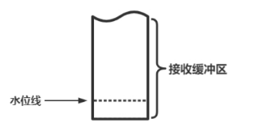

同样，水位线可以通过setsockopt()函数进行设置，只不过选项名称发生变化，可以通过man手册的第7章阅读socket进行了解，如下：

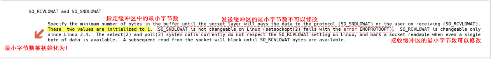

可以看到，Linux系统中接收缓冲区和发送缓冲区的最小字节数都被初始化为1，并且Linux系统的发送缓冲区的最小字节数不可以被修改，只有接收缓冲区在内核2.4版本允许被修改。


练习：调用getsockopt()函数获取TCP接收缓冲区的最小字节数并输出到终端。然后修改TCP接收缓冲区的最小字节数为某个固定值，并检查是否修改成功。提示：检查是否修改成功只需要再次获取最小字节数的值即可。


### IO 模型

服务器的调度策略


### web 服务器

使用 HTTP 超文本协议

- Web 服务器又称 WWW 服务器、 网站服务器等特点
- 使用 HTTP 协议与客户机浏览器进行信息交流
- 不仅能存储信息， 还能在用户通过 web 浏览器提供的信息的基础上运行脚本和程序该服务器需可安装在 UNIX、 Linux 或 Windows 等操作系统上
- 著名的服务器有 Apache、 Tomcat、 IIS 等


Webserver— HTTP 协议概念
一种详细规定了浏览器和万维网服务器之间互相通信的规则， 通过因特网传送万维网文档的数据传送协议
特点

1、 支持 C/S 架构
2、 简单快速： 客户向服务器请求服务时， 只需传送请求方法和路径 ， 常用方法:GET（明文）、 POST（密文）
3、 无连接： 限制每次连接只处理一个请求
4、 无状态： 即如果后续处理需要前面的信息， 它必须重传， 这样可能导致每次连接传送的数据量会增大


Webserver

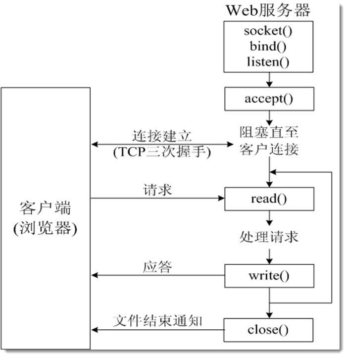

#### 过程

##### 客户端浏览器请求：  


web服务器的ip地址是192.168.3.103，端口号是9999，要访问的网页是about.html浏览器输入的格式为：  


##### 服务器收到的数据：  

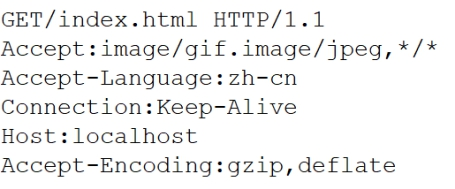

服务器应答的格式：  

服务器接收到浏览器发送的数据之后，需要判断GET/后面跟的网页是否存在，如果存在则请求成功，发送指定的指令，并发送文件内容给浏览器，如果不存在，则发送请求失败的指令  

##### 请求成功  

```c
"HTTP/1.1 200 OK\r\n" \
"Content‐Type: text/html\r\n" \
"\r\n";
```

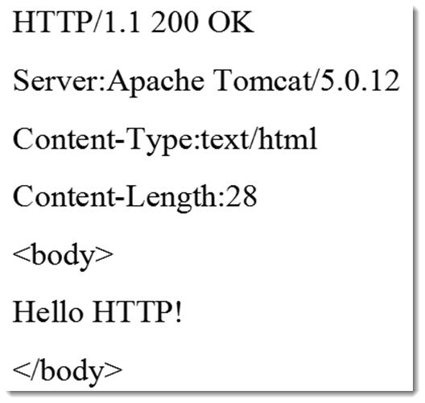

##### 请求失败  

```c
HTTP/1.1 404 Not Found\r\n" \
"Content‐Type: text/html\r\n" \
"\r\n" \
"<HTML><BODY>File not found</BODY></HTML>"
```


#### 代码

```c
#include <stdio.h>
#include <stdlib.h>
#include <unistd.h>
#include <sys/types.h>
#include <sys/socket.h>
#include <arpa/inet.h>
#include <netinet/in.h>
#include <string.h>
#include <pthread.h>
#include <sys/stat.h>
#include <fcntl.h>
#include <errno.h>

#define N 1024
#define ERR_LOG(errmsg) do{\
                            perror(errmsg);\
                            printf("%s - %s - %d\n", __FILE__, __func__, __LINE__);\
                            exit(1);\
                        }while(0)

void *pthread_fun(void *arg)
{
    int acceptfd = *(int *)arg;
    char buf[N] = "";
    char head[]="HTTP/1.1 200 OK\r\n"                   \
            "Content-Type: text/html\r\n"       \
            "\r\n";     
    char err[]= "HTTP/1.1 404 Not Found\r\n"        \
        "Content-Type: text/html\r\n"       \
        "\r\n"                              \
        "<HTML><BODY>File not found</BODY></HTML>";

    //接收浏览器通过http协议发送的数据包
    if(recv(acceptfd, buf, N, 0) < 0)
    {
        ERR_LOG("fail to recv");
    }

    printf("*****************************\n\n");
    printf("%s\n", buf);
    // int i;
    // for(i = 0; i < 200; i++)
    // {
    //     printf("[%c] - %d\n", buf[i], buf[i]);
    // }
    printf("\n*****************************\n");

    //通过获取的数据包中得到浏览器要访问的网页文件名
    //GET /about.html http/1.1
    char filename[128] = "";
    sscanf(buf, "GET /%s", filename);   //sscanf函数与空格结束，所以直接可以获取文件名
    
    if(strncmp(filename, "HTTP/1.1", strlen("http/1.1")) == 0)
    {
        strcpy(filename, "about.html");
    }
    printf("filename = %s\n", filename);

    char path[128] = "./sqlite/";
    strcat(path, filename);

    //通过解析出来的网页文件名，查找本地中有没有这个文件
    int fd;
    if((fd = open(path, O_RDONLY)) < 0)
    {
        //如果文件不存在，则发送不存在对应的指令
        if(errno == ENOENT)
        {
            if(send(acceptfd, err, strlen(err), 0) < 0)
            {
                ERR_LOG("fail to send");
            }

            close(acceptfd);
            pthread_exit(NULL);
        }
        else 
        {
            ERR_LOG("fail to open");
        }
    }

    //如果文件存在，先发送指令告知浏览器
    if(send(acceptfd, head, strlen(head), 0) < 0)
    {
        ERR_LOG("fail to send");
    }

    //读取网页文件中的内容并发送给浏览器
    ssize_t bytes;
    char text[1024] = "";
    while((bytes = read(fd, text, 1024)) > 0)
    {
        if(send(acceptfd, text, bytes, 0) < 0)
        {
            ERR_LOG("fail to send");
        }
    }

    pthread_exit(NULL);
}

int main(int argc, char const *argv[])
{
    if(argc < 3)
    {
        fprintf(stderr, "Usage: %s <server_ip> <server_port>\n", argv[0]);
        exit(1);
    }    

    int sockfd, acceptfd;
    struct sockaddr_in serveraddr, clientaddr;
    socklen_t addrlen = sizeof(serveraddr);

    //第一步：创建套接字
    if((sockfd = socket(AF_INET, SOCK_STREAM, 0)) < 0)
    {
        ERR_LOG("fail to socket");
    }

    //将套接字设置为允许重复使用本机地址或者为设置为端口复用
    int on = 1;
    if(setsockopt(sockfd, SOL_SOCKET, SO_REUSEADDR, &on, sizeof(on)) < 0)
    {
        ERR_LOG("fail to setsockopt");
    }

    //第二步：填充服务器网络信息结构体
    serveraddr.sin_family = AF_INET;
    serveraddr.sin_addr.s_addr = inet_addr(argv[1]);
    serveraddr.sin_port = htons(atoi(argv[2]));

    //第三步：将套接字与服务器网络信息结构体绑定
    if(bind(sockfd, (struct sockaddr *)&serveraddr, addrlen) < 0)
    {
        ERR_LOG("fail to bind");
    }

    //第四步：将套接字设置为被动监听状态
    if(listen(sockfd, 5) < 0)
    {
        ERR_LOG("fail to listen");
    }

    while(1)
    {
        //第五步：阻塞等待客户端的连接请求
        if((acceptfd = accept(sockfd, (struct sockaddr *)&clientaddr, &addrlen)) < 0)
        {
            ERR_LOG("fail to accept");
        }

        //打印客户端的信息
        printf("%s -- %d\n", inet_ntoa(clientaddr.sin_addr), ntohs(clientaddr.sin_port));

        //创建线程接收数据并处理数据
        pthread_t thread;
        if(pthread_create(&thread, NULL, pthread_fun, &acceptfd) != 0)
        {
            ERR_LOG("fail to pthread_create");
        }
        pthread_detach(thread);

    }

    return 0;
}
```

#### 执行结果

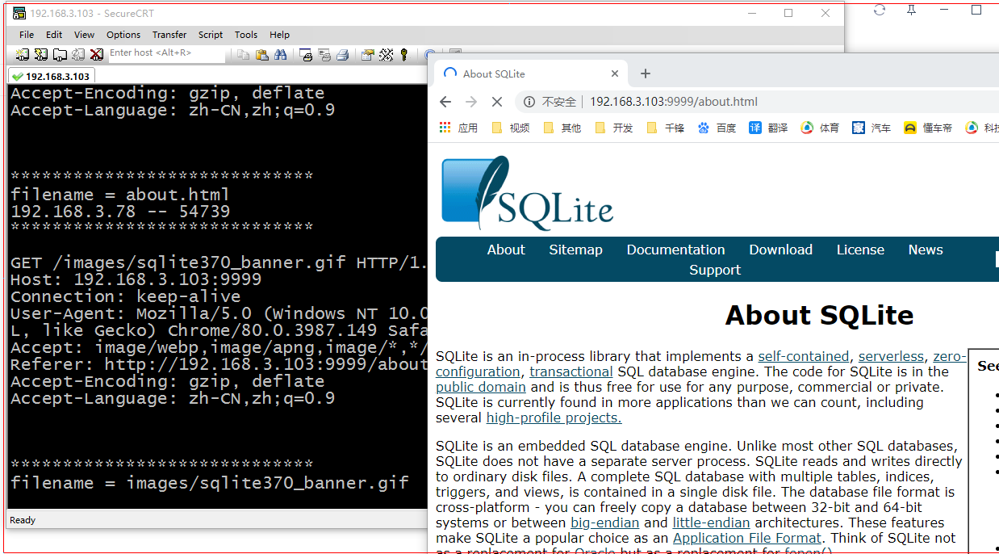


### 通过浏览器访问web服务器

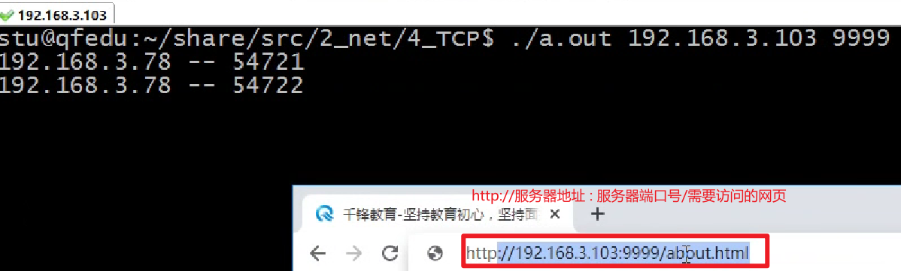


### 网络通信过程  Packet Tracer 5.0


#### 交换机 与arp 表

##### 简介

网络交换机（又称“网络交换器” ） ， 是一个扩大网络的器材， 可以把更多的计算机等网络设备连接到当前的网络中。
具有性价比高、 高度灵活、 相对简单、 易于实现等特点
以太网技术已成为当今最重要的一种==局域网组网技术==， 网络交换机也就成为了最普及的交换机。

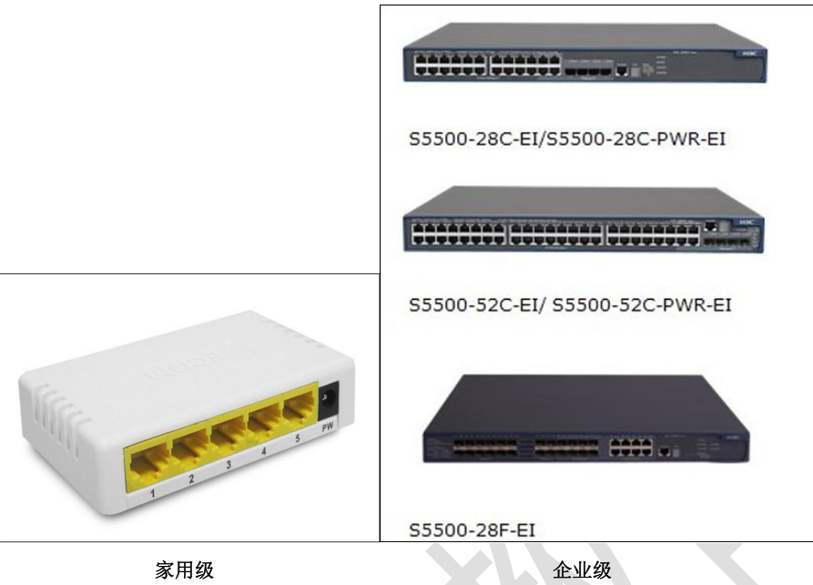

##### 交换机功能  

1.  **转发过滤**： 当一个数据帧的目的地址在 MAC 地址表中有映射时， 它被转发到连接目的节点的端口而不是所有端口（如该数据帧为广播/组播帧则转发至所有端口）
2. **学习功能**： 以太网交换机了解每一端口相连设备的 MAC 地址， 并将地址同相应的端口映射起来存放在交换机缓存中的 MAC 地址表中.（存储MAC对应的端口号，ARP表在每一个主机中）
3. 目前交换机还具备了一些新的功能， 如对 VLAN（虚拟局域网） 的支持、 对链路汇聚的支持， 甚至有的还具有防火墙的功能

##### 工作机制

```
art -a
```

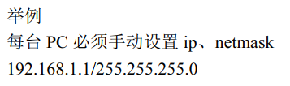

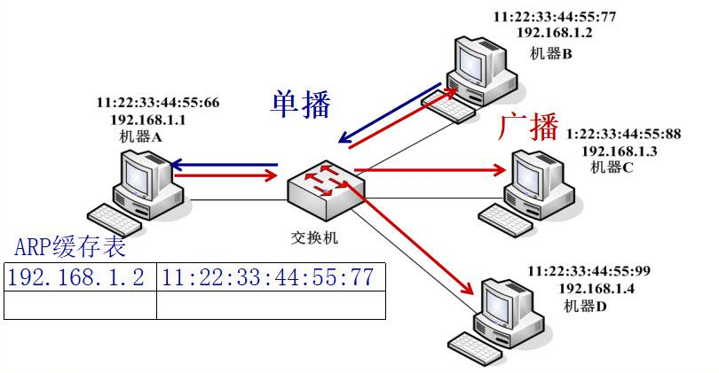


ARP表：存放 ip 地址所对应的 MAC 地址（ARP表是临时的，过一段时间会把没有通信的主机的IP地址及其MAC地址从表中移除）

- 如果主机的路由表中没有目的 MAC 地址，则广播发送 ARP 数据包，目的 MAC 全为F。

- 其他主机接收到 ARP 数据包后，对比目的地址是否与自己相同，如果不同丢弃数据包，如果相同单播回复一个 rARP 数据包，并将自己的 MAC 地址放入其中。
- ping：主机发送ICMP数据包（会进行上面俩步）给交换机，交换机转发给目的主机，目的主机接收到数据包后会回复一个ICMP数据包，再由目的交换机直接发送给原主机（交换机不会转发给主机）

> ==工作在链路层： 只会通知同一网段内的主机== 
>
> 如果 PC 不知目标 IP 所对应的 MAC， 那么PC 会先发送 ARP 广播， 得到对方的 MAC 然后， 再进行数据的传送
> 当 switch 第一次收到 ARP 广播数据， 会把 ARP 广播数据包转发给所有端口（除来源端口）； 如果以后还有PC 询问此 IP 的 MAC， 那么只是向目标的端口进行转发数据
> ==每台 PC 都会有一个 ARP 缓存表， 用来记录 IP 所对应的的 MAC 地址==


#### 路由器 Roater 与路由表

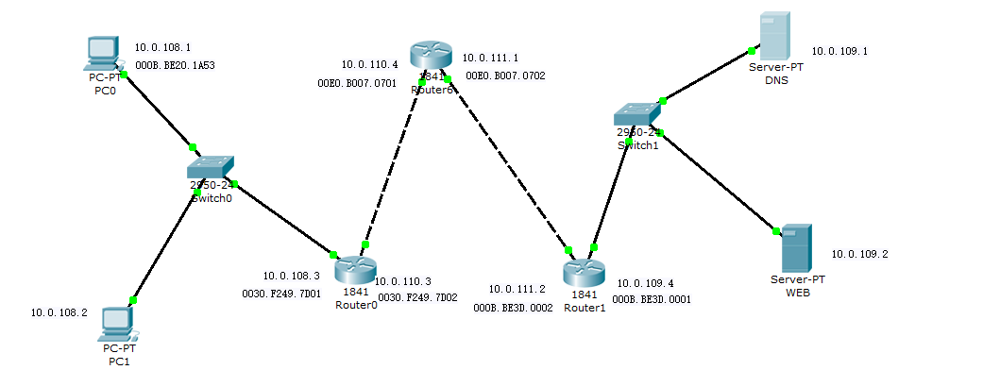


==工作在网络层：所以可以选择网络地址和ip路径== 实现不同网段的主机之间的通信。

**路由器（Router） 又称网关设备（Gateway）** 是用于连接多个逻辑上分开的网络

- 所谓逻辑网络是代表一个单独的网络或者一个子网。 当数据从一个子网传输到另一个子网时， 可通过路由器的路由功能来完成具有判断网络地址和选择 IP 路径的功能。

拥有多个功能，可以实现交换机的功能。

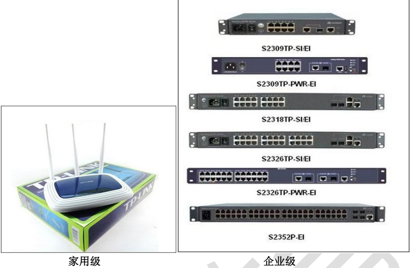


```shell
route print   # 查看路由表
```

##### 客

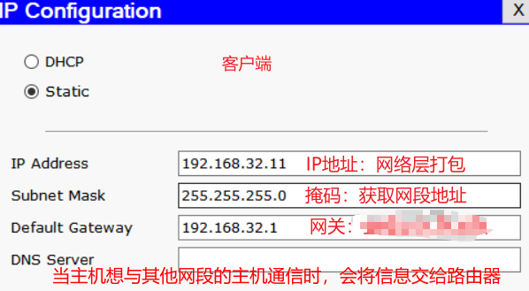


##### 路由器设置

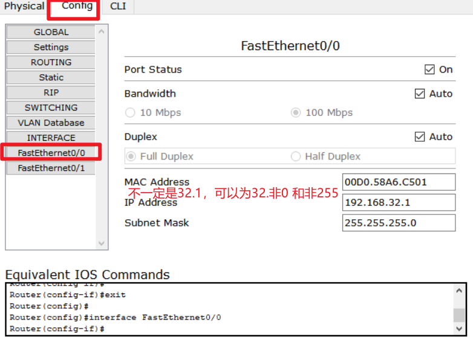

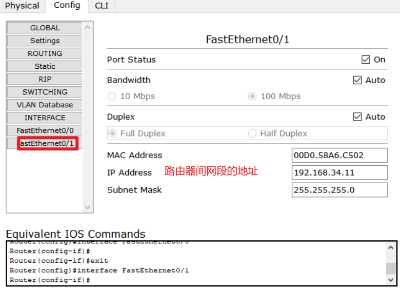


##### 路由器转发设置

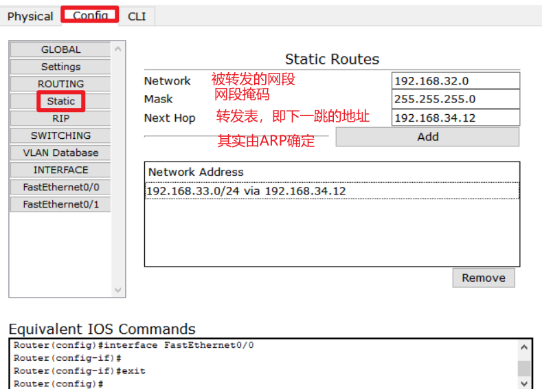


# BS

samba 服务器


# cJSON


**Json 的概念：**

Json (JavaScript Object Notation) 是一种轻量级的数据交换格式，它是一种基于**文本**的格式，易于阅读和编写，同时也易于机器解析和生成。Json 数据交换格式通常用于简单的数据传输，例如 Web 应用程序向浏览器发送数据。

 

 

Json 的特点包括：

1. 轻量级数据交换格式：Json 是一种轻量级的数据交换格式，与 XML 相比更小，更快，更容易阅读和编写。
2. 可读性佳：Json 数据交换格式是一种基于文本的格式，易于阅读和编写。与 XML 相比，Json 更易于理解，更易于阅读。
3. 易于机器解析和生成：由于Json 是基于文本的格式，它易于被各种编程语言和解析工具解析和生成。
4. 数据结构清晰：Json 数据交换格式是一种**扁平化的数据结构**，数据之间使用逗号分隔，没有嵌套，这有助于解析和生成。
5. **跨平台**：Json 数据交换格式是跨平台的，可以在不同的编程语言之间进行互操作。
6. 开源：Json 数据交换格式是基于互联网的，它是**开源**的，并且有广泛的支持。
7. 扩展性：Json 数据交换格式可以轻松地添加新属性和扩展数据结构，这使得它成为现代互联网应用程序的一部分。

总之，Json 数据交换格式是一种轻量级、可读性好、易于机器解析和生成的数据交换格式，被广泛应用于 Web 应用程序和现代互联网应用程序中。

 

 

**如何移植获得CJSON的解码库**

- 获得Json 的原码并把它进行解压：

```
tar -zxvf v1.7.15.tar.gz  -C ~/CJson/
```

- 解压后会获得：

```
CHANGELOG.md     LICENSE    appveyor.yml  cJSON_Utils.c  library_config  valgrind.supp
CMakeLists.txt   Makefile   cJSON.c       cJSON_Utils.h  test.c
CONTRIBUTORS.md  README.md  cJSON.h       fuzzing        tests
```

- 解压后可以看到得到两个关键文件 cJSON.c   cJSON.h  如果不需要制作成库文件已经完全可以直接食用 。

```
把cJSON.h   cJSON.c 拷贝到你的代码所在的路径一并编译即可
gcc test.c  cJSON.c
```

- 如果需要继续做成库文件则可以继续进行编译
- 如果该库文件只需在X86平台使用则可以直接进行 make 

```
make 
gcc -std=c89 -c -fPIC -pedantic -Wall -Werror -Wstrict-prototypes -Wwrite-strings -Wshadow -Winit-self -Wcast-align -Wformat=2 -Wmissing-prototypes -Wstrict-overflow=2 -Wcast-qual -Wc++-compat -Wundef -Wswitch-default -Wconversion -fstack-protector-strong cJSON.c
gcc -std=c89 -shared -o libcjson.so.1.7.15 cJSON.o -Wl,-soname=libcjson.so.1 
ln -s libcjson.so.1.7.15 libcjson.so.1
ln -s libcjson.so.1 libcjson.so
gcc -std=c89 -c -fPIC -pedantic -Wall -Werror -Wstrict-prototypes -Wwrite-strings -Wshadow -Winit-self -Wcast-align -Wformat=2 -Wmissing-prototypes -Wstrict-overflow=2 -Wcast-qual -Wc++-compat -Wundef -Wswitch-default -Wconversion -fstack-protector-strong cJSON_Utils.c
gcc -std=c89 -shared -o libcjson_utils.so.1.7.15 cJSON_Utils.o cJSON.o -Wl,-soname=libcjson_utils.so.1 
ln -s libcjson_utils.so.1.7.15 libcjson_utils.so.1
ln -s libcjson_utils.so.1 libcjson_utils.so
ar rcs libcjson.a cJSON.o
ar rcs libcjson_utils.a cJSON_Utils.o
gcc -std=c89 -fPIC -pedantic -Wall -Werror -Wstrict-prototypes -Wwrite-strings -Wshadow -Winit-self -Wcast-align -Wformat=2 -Wmissing-prototypes -Wstrict-overflow=2 -Wcast-qual -Wc++-compat -Wundef -Wswitch-default -Wconversion -fstack-protector-strong cJSON.c test.c  -o cJSON_test -lm -I.
```

- make后得到：

```
libcjson.a       // .a 为后缀则表示一个静态链接库 （编译时把所有函数代码拷贝到可执行文件中）
libcjson.so      // .so 为动态库 （编译时只检查接口是否正确并不会拷贝源码）  该文件为连接文件他指向.so.1
libcjson.so.1    //          
libcjson.so.1.7.15 
       
 
libcjson_utils.a      
libcjson_utils.so 
libcjson_utils.so.1 
libcjson_utils.so.1.7.15 
 
```

- 把编译后得到的所有库文件拷贝到/usr/lib中

```
sudo cp  libcjson* /usr/lib/ 
```

- 使用动态连接库进行编译程序

- 需要把 libcjson.so.1.7.15 拷贝到程序所在的路径

- 把该文件的名字进行修改，改为无任何版本信息的名字 libcjson.so 

```
gcc 02\ Analysis.c -L./ -lcjson  // 编译程序并产生可执行文件-L./ 指明库文件的路径 -lcjson 需要链接的库文件的名字
 
 
gec:06 CJson$ ./a.out   // 运行程序  [ 库文件没有找到 ] 
./a.out: error while loading shared libraries: libcjson.so.1: 
cannot open shared object file: No such file or directory
```

-  如果需要把CJson做成开发板中能使用的库文件则需要修改一下MakeFile

- 在第27行修改编译器命令即可

```
CC = gcc -std=c89   //  line = 27
CC = arm-linux-gcc -std=c89 // line = 27 
```

 

 

 

Json 的数据类似一对数据，具体就是有个键以及值组成

 

如何解析：

C

自动换行


```
#include <stdio.h>
#include "cJSON.h"
 
char *message = 
"{                              \
    \"name\":\"mculover666\",   \
    \"age\": 22,                \
    \"weight\": 55.5,           \
    \"address\":                \
        {                       \
            \"country\": \"China\",\
            \"zip-code\": 111111\
        },                      \
    \"skill\": [\"c\", \"Java\", \"Python\"],\
    \"student\": false          \
}";
 
int main(void)
{
    cJSON* cjson_test = NULL;
    cJSON* cjson_name = NULL;
    cJSON* cjson_age = NULL;
    cJSON* cjson_weight = NULL;
    cJSON* cjson_address = NULL;
    cJSON* cjson_address_country = NULL;
    cJSON* cjson_address_zipcode = NULL;
    cJSON* cjson_skill = NULL;
    cJSON* cjson_student = NULL;
    int    skill_array_size = 0, i = 0;
    cJSON* cjson_skill_item = NULL;
 
    /* Analysis整段JSO数据 */
    cjson_test = cJSON_Parse(message);
    if(cjson_test == NULL)
    {
        printf("parse fail.\n");
        return -1;
    }
 
    /* 依次根据名称提取JSON数据（键值对） */
    cjson_name = cJSON_GetObjectItem(cjson_test, "name");
    cjson_age = cJSON_GetObjectItem(cjson_test, "age");
    cjson_weight = cJSON_GetObjectItem(cjson_test, "weight");
 
    printf("name: %s\n", cjson_name->valuestring);
    printf("age:%d\n", cjson_age->valueint);
    printf("weight:%.1f\n", cjson_weight->valuedouble);
 
    /* 解析嵌套json数据 */
    cjson_address = cJSON_GetObjectItem(cjson_test, "address");
    cjson_address_country = cJSON_GetObjectItem(cjson_address, "country");
    cjson_address_zipcode = cJSON_GetObjectItem(cjson_address, "zip-code");
    printf("address-country:%s\naddress-zipcode:%d\n", cjson_address_country->valuestring, cjson_address_zipcode->valueint);
 
    /* 解析数组 */
    cjson_skill = cJSON_GetObjectItem(cjson_test, "skill");
    skill_array_size = cJSON_GetArraySize(cjson_skill);// 获得数组中元素的数量
    printf("skill:[");
    for(i = 0; i < skill_array_size; i++)
    {
        cjson_skill_item = cJSON_GetArrayItem(cjson_skill, i); // 获取数组cjson_skill 中的第i个下标的数据
        printf("%s,", cjson_skill_item->valuestring);
    }
    printf("\b]\n");
 
    /* 解析布尔型数据 */
    cjson_student = cJSON_GetObjectItem(cjson_test, "student");
    if(cjson_student->valueint == 0)
    {
        printf("student: false\n");
    }
    else
    {
        printf("student:error\n");
    }
    
    return 0;
}
 
 
```

 

 

如何生成：

C

自动换行


```
#include <stdio.h>
#include "cJSON.h"
 
int main(void)
{
    cJSON* cjson_test = NULL;
    cJSON* cjson_address = NULL;
    cJSON* cjson_skill = NULL;
    char* str = NULL;
 
    /* 创建一个JSON数据对象(链表头结点) */
    cjson_test = cJSON_CreateObject();
 
    /* 添加一条【字符串类型】的JSON数据(添加一个链表节点) */
    cJSON_AddStringToObject(cjson_test, "name", "mculover666");
 
    /* 添加一条【整数类型】的JSON数据(添加一个链表节点) */
    cJSON_AddNumberToObject(cjson_test, "age", 22);
 
    /* 添加一条【浮点类型】的JSON数据(添加一个链表节点) */
    cJSON_AddNumberToObject(cjson_test, "weight", 55.5);
 
 
    /* 添加一个【嵌套】的JSON数据（添加一个链表节点） */
    cjson_address = cJSON_CreateObject();
    cJSON_AddStringToObject(cjson_address, "country", "China");
    cJSON_AddNumberToObject(cjson_address, "zip-code", 111111);
 
    // 添加一个对象到另一个对象内部 （嵌套）
    cJSON_AddItemToObject(cjson_test, "address", cjson_address);
 
 
    /* 添加一个【数组】类型的JSON数据(添加一个链表节点) */
    cjson_skill = cJSON_CreateArray();  // 创建一个数组
    // 对数组中的元素进行赋值
    cJSON_AddItemToArray(cjson_skill, cJSON_CreateString( "C" ));
    cJSON_AddItemToArray(cjson_skill, cJSON_CreateString( "Java" ));
    cJSON_AddItemToArray(cjson_skill, cJSON_CreateString( "Python" ));
 
    // 把数组添加到json对象中去
    cJSON_AddItemToObject(cjson_test, "skill", cjson_skill);
 
    /* 添加一个值为 False 的布尔类型的JSON数据(添加一个链表节点) */
    cJSON_AddFalseToObject(cjson_test, "student");
    cJSON_AddTrueToObject(cjson_test , "Even");
 
    /* 打印JSON对象(整条链表)的所有数据 */
    str = cJSON_Print(cjson_test);
    printf("%s\n", str);
    
    return 0;
}
 
 
```

 

 

作业练习：

- 1.

- 尝试把以下JSon数据分析出来并输出今天以及明天的天气数据

- 1.

- 【拓展】 把数据显示到开发板屏幕中

JSON

自动换行


```
{ 
 "reason": "查询成功!", 
 "result": { 
		"city": "广州", 
		"realtime": { 
			"temperature": "34", 
			"humidity": "58", 
			"info": "多云", 
			"wid": "01", 
			"direct": "东北风", 
			"power": "1级", 
			"aqi": "30" 
		}, 
		"future": [{ 
			"date": "2024-07-10", 
			"temperature": "28/36℃", 
			"weather": "多云转雷阵雨", 
			"wid": { 
				"day": "01", 
				"night": "04" 
			}, 
			"direct": "持续无风向" 
		}, { 
			"date": "2024-07-11", 
			"temperature": "28/35℃", 
			"weather": "雷阵雨", 
			"wid": { 
				"day": "04", 
				"night": "04" 
			}, 
			"direct": "持续无风向" 
		}, { 
			"date": "2024-07-12", 
			"temperature": "28/34℃", 
			"weather": "雷阵雨转阵雨", 
			"wid": { 
				"day": "04", 
				"night": "03" 
			}, 
			"direct": "持续无风向" 
		}, { 
			"date": "2024-07-13", 
			"temperature": "28/34℃", 
			"weather": "阵雨转多云", 
			"wid": { 
				"day": "03", 
				"night": "01" 
			}, 
			"direct": "东南风转持续无风向" 
		}, { 
			"date": "2024-07-14", 
			"temperature": "27/35℃", 
			"weather": "多云", 
			"wid": { 
				"day": "01", 
				"night": "01" 
			}, 
			"direct": "持续无风向" 
		}] 
 }, 
 "error_code": 0 
}
```

