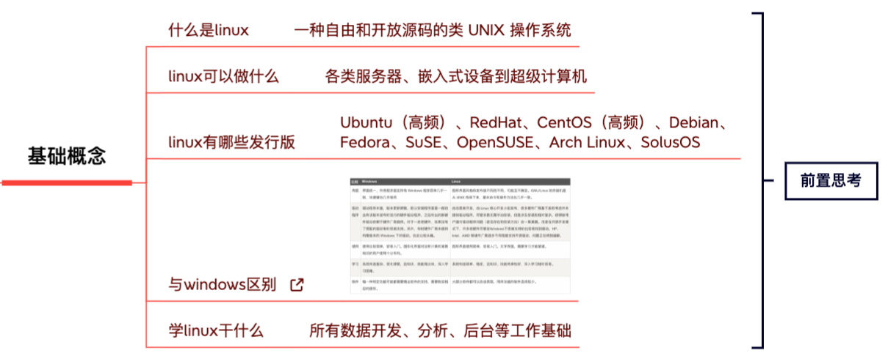

电子书

鸟哥的linux私房菜基础学习篇

## 路线

### 1. 基础知识

#### 1.1 计算机科学基础

- **数据结构与算法**：学习基本的数据结构（如数组、链表、栈、队列、树、图）和算法（排序、搜索、动态规划等）。
- **计算机体系结构**：了解计算机的基本组成（如CPU、内存、输入/输出设备），掌握基本的计算机工作原理。

#### 1.2 编程语言

- **C语言**：嵌入式系统中广泛使用的语言。学习C语言的语法、标准库以及内存管理。
- **C++**：在某些嵌入式系统中也很流行，特别是在需要面向对象编程的地方。
- **汇编语言**：了解汇编语言的基本语法和指令集，可以帮助你更好地理解硬件。

### 2. 嵌入式系统基础

#### 2.1 嵌入式硬件基础

- **微控制器（MCU）**：了解常用的微控制器（如ARM Cortex-M、AVR、PIC等）的架构和指令集。
- **开发板**：使用如Arduino、Raspberry Pi、STM32等开发板进行实践，学习其外围设备和接口（如GPIO、ADC、DAC、UART、I2C、SPI等）。

#### 2.2 嵌入式软件基础

- **嵌入式操作系统**：了解常用的嵌入式操作系统（如FreeRTOS、Zephyr、μC/OS等）和裸机编程。
- **固件开发**：学习固件编写、调试、烧录以及固件升级的方法。

### 3. 进阶学习

#### 3.1 高级编程与优化

- **嵌入式C编程**：深入学习嵌入式系统中的C编程，掌握代码优化技巧（如减少内存占用、提高执行效率）。
- **实时系统**：学习实时操作系统（RTOS）的基本概念和调度算法，理解实时任务的管理和调度。

#### 3.2 硬件设计

- **电路设计**：学习模拟和数字电路设计，掌握电路图绘制和PCB设计工具（如Eagle、Altium Designer）。
- **嵌入式硬件调试**：了解使用示波器、逻辑分析仪、万用表等工具进行硬件调试的方法。

### 4. 项目实践

#### 4.1 实战项目

- **简单项目**：如LED灯控制、温度传感器读取等小项目。
- **复杂项目**：如智能家居控制系统、无人机控制系统、机器人等复杂项目。

#### 4.2 开源项目参与

- **贡献开源项目**：通过参与开源项目来实践所学知识，积累实际开发经验。

### 5. 深入学习与研究

#### 5.1 专题研究

- **物联网（IoT）**：研究物联网架构、通信协议（如MQTT、CoAP）和安全问题。
- **人工智能与嵌入式系统**：学习如何在嵌入式系统中实现人工智能算法（如机器学习、神经网络）。

#### 5.2 持续学习

- **阅读文献和技术博客**：通过阅读最新的技术文献和博客保持对行业动态的了解。
- **参加技术会议和研讨会**：通过参加技术会议和研讨会，了解最新的技术趋势和应用案例。

### 6. 实验与实习

#### 6.1 实验室实验

- **学术实验**：在学校或研究机构的实验室中进行实验，获取实际动手经验。
- **企业实习**：在嵌入式公司实习，了解行业标准和工作流程，积累实际项目经验。

### 7. 驱动编程

驱动程序是操作系统与硬件设备之间的桥梁，是嵌入式系统开发的重要组成部分。

#### 7.1 基本概念

- **什么是驱动程序**：了解驱动程序的基本概念和作用。
- **设备文件**：学习Linux设备文件的概念及其与驱动程序的关系。

#### 7.2 Linux内核编程

- **Linux内核基础**：了解Linux内核的基本结构和工作原理。
- **内核模块**：学习编写、编译和加载内核模块。
- **字符设备驱动**：学习字符设备驱动的开发，包括open、read、write等系统调用的实现。
- **块设备驱动**：学习块设备驱动的开发，包括分区管理和文件系统接口。
- **网络设备驱动**：学习网络设备驱动的开发，包括数据包的发送和接收。

#### 7.3 外设驱动开发

- **GPIO驱动**：学习如何控制通用输入/输出端口（GPIO）。
- **I2C驱动**：学习I2C设备的驱动开发，包括数据传输协议和接口实现。
- **SPI驱动**：学习SPI设备的驱动开发，包括数据传输协议和接口实现。
- **UART驱动**：学习UART串口通信的驱动开发。

### 8. 应用程序编程

应用程序是用户与嵌入式设备交互的主要方式，开发高效、稳定的应用程序是嵌入式系统的重要目标。

#### 8.1 跨平台开发

- **交叉编译**：学习如何设置交叉编译环境，以便在开发主机上编译适用于嵌入式设备的程序。
- **嵌入式Linux**：了解嵌入式Linux系统的基本概念和构建方法。

#### 8.2 实时操作系统（RTOS）编程

- **RTOS基本概念**：了解实时操作系统的基本概念和特点。
- **任务管理**：学习如何创建和管理任务，包括任务的优先级和调度。
- **同步与通信**：学习信号量、消息队列、事件标志等同步与通信机制。
- **定时器**：学习如何使用定时器进行时间管理。

#### 8.3 高级编程技巧

- **多线程编程**：学习多线程编程，了解线程同步和互斥锁。
- **内存管理**：学习嵌入式系统中的内存管理技巧，避免内存泄漏和碎片化。
- **调试与优化**：掌握调试工具（如GDB）和性能优化技巧。

### 9. 项目实践

#### 9.1 驱动开发项目

- **GPIO控制LED**：编写GPIO驱动程序，通过驱动控制LED的点亮和熄灭。
- **I2C温度传感器**：编写I2C驱动程序，读取温度传感器的数据并在应用程序中显示。

#### 9.2 应用程序开发项目

- **简单的嵌入式应用**：编写一个嵌入式应用程序，实现基本的输入输出操作。
- **复杂的嵌入式系统**：开发一个完整的嵌入式系统，如智能家居控制系统，包括多个驱动程序和应用程序的协作。

## 大数据之眸	

https://mp.weixin.qq.com/s/h5jotGNZCqHwZ0X4QQoldg

### 1、常用命令

#### 1. 系统信息

#### 2. 文件命令

#### 3. 快捷键

#### 4. 进程管理

#### 5. 压缩

#### 6. 安装与网络

### 2、文件目录操作

#### 2.1  目录配置

#### 2.2 用户与用户组

#### 2.3 磁盘与文件系统管理

#### 2.4 文件权限操作

## 3、shell

#### 3.1 基础概念

#### 变量

#### 数组

#### 字符串

#### 参数传递

#### 变量类型

#### 关系运算符

文件测试运算符

