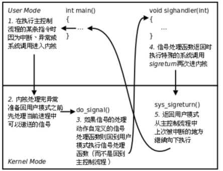
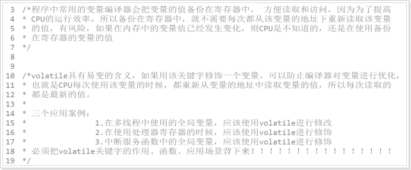
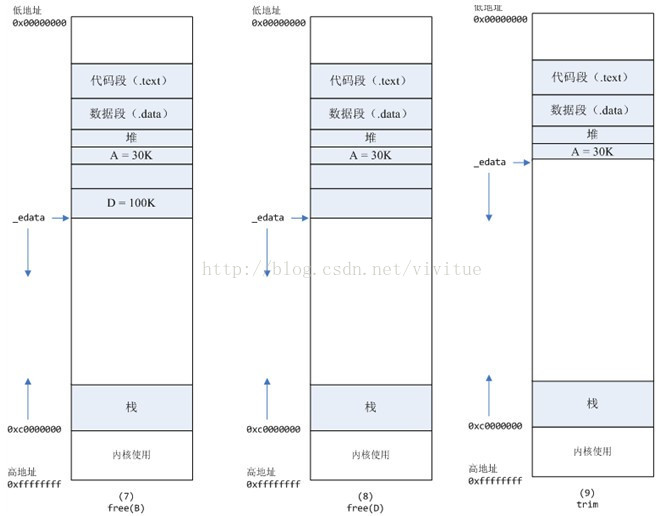

# 小点

```c
int raise(int sig); // 向本进程发送信号
```

>  The  raise()  function  sends  a signal to the calling process or thread.  In a single-threaded program it is equivalent to ` kill(getpid(), sig);`      

#### 信号处理方式



#### volatile




# 错误

1. 使用*make*构建可执行文件时可能遇到的*“检测到时钟偏差”*警告。
2. 问题的原因是可执行文件的修改时间比源文件的修改时间更新。
3. 进行干净的构建可以解决这个问题。也可以通过删除具有将来修改时间的可执行文件来进行增量构建。
4. 真正的解决方案是使用 NTP 等协议来同步机器的系统时间。

> make: Warning: File 'test' has modification time 306 s in the future
> make: 'test' is up to date.
> make: warning:  Clock skew detected.  Your build may be incomplete. 

解决地址：https://www.baeldung.com/linux/make-clock-skew-warning

具有数百个源文件的大型项目的干净构建可能需要很长时间。**因此，仅手动删除导致警告的可执行文件可能对于增量构建很有用**。

**然而，收到警告的主要原因是机器之间的时间差**。例如，我们可能在[NFS](https://www.baeldung.com/cs/nfs)（网络文件系统）挂载目录中工作，并且NFS服务器和客户端上的时钟可能不同步。我们尝试通过更改构建的可执行文件的修改时间来模拟这种情况。因此，真正解决问题的方法是使用像**[NTP](https://www.baeldung.com/linux/sync-time-with-network)****（网络时间协议）****这样的协议来实现机器的时间同步**。


### Segmentation fault (core dumped)

Segmentation fault (core dumped),它通常表示你的程序试图访问未分配的内存区域或者非法的内存区域。这通常是由于指针操作错误或者数组越界等问题引起的。

当你的程序尝试访问无法访问的内存时，操作系统会向程序发送一个 segmentation fault 错误信号，终止程序的运行，并通常会生成一个核心转储文件（core dumped），用来帮助进行调试。

通过以下步骤，你可以尝试定位和解决这个错误：

1. 检查指针操作：确保你的程序中没有对未初始化的指针进行操作，以及避免使用已经释放的指针。
2. 检查数组越界访问：确保你的程序中没有越界访问数组的情况，例如使用超出数组边界的索引。
3. 使用调试工具：例如 GDB，你可以在程序崩溃时启动 GDB 并加载核心转储文件，以便查看程序崩溃时的堆栈信息并定位可能的错误。
4. 代码审查：检查代码中可能导致此问题的部分，比如涉及内存操作、指针操作或者数组访问的部分。

```c
#include <stdio.h>

int main() {
    int *ptr = NULL;
    *ptr = 10;  // 错误：试图在空指针上进行赋值操作

    return 0;
}
```


```cpp
friend ostream& operator<<( ostream& output, const Distance& D )

cpptest.cpp: In function ‘std::ostream operator<<(std::ostream&, const Distance&)’:
cpptest.cpp:24:20: error: use of deleted function ‘std::basic_ostream<_CharT, _Traits>::basic_ostream(const std::basic_ostream<_CharT, _Traits>&) [with _CharT = char; _Traits = std::char_traits<char>]’
   24 |             return output;  //必须和 参数中输出流 ostream 同类型，切必须是其的对象的引用
      |                    ^~~~~~
In file included from /usr/include/c++/11/iostream:39,
                 from cpptest.cpp:1:
/usr/include/c++/11/ostream:404:7: note: declared here
  404 |       basic_ostream(const basic_ostream&) = delete;
      |       ^~~~~~~~~~~~~
          
// 错误原因：俩个必须ostream必须为引用，详情见
// 404 |       basic_ostream(const basic_ostream&) = delete;
```


### 核心转储文件

核心转储（core dump）文件是在程序崩溃时，由操作系统生成的一种文件，它包含了程序在崩溃时的内存内容、寄存器状态和执行环境等信息。核心转储文件可以帮助开发人员诊断和调试程序崩溃的原因，因为它提供了程序在崩溃瞬间的详细状态。

#### 核心转储文件的作用

1. **诊断崩溃原因**：核心转储文件保存了程序在崩溃时的内存状态，开发人员可以利用这些信息找到导致程序崩溃的代码位置和原因。
2. **调试工具的输入**：核心转储文件可以被调试工具（如 `gdb`）读取，帮助开发人员查看崩溃时的堆栈跟踪、变量值和程序执行状态。

#### 生成核心转储文件的条件

- **操作系统配置**：操作系统需要配置为允许生成核心转储文件。许多现代操作系统默认情况下会限制核心转储文件的生成。
- **用户权限**：生成核心转储文件的进程需要有适当的权限。
- **资源限制**：系统的资源限制（例如通过 `ulimit` 命令设置的核心文件大小限制）可能会影响核心转储文件的生成。

#### 核心转储文件的生成配置

#### 配置生成核心转储文件

在大多数Linux系统中，可以使用 `ulimit` 命令来配置是否允许生成核心转储文件，以及设置核心转储文件的大小限制。例如：

```shell
ulimit -c unlimited   # 允许生成核心转储文件，并且没有大小限制
ulimit -c 0           # 禁止生成核心转储文件
```

这个设置只对当前会话有效，如果需要永久设置，可以将上述命令添加到用户的shell配置文件中（如 `~/.bashrc` 或 `~/.bash_profile`）。

#### 查看当前设置

```shell

ulimit -c
```

#### 使用 `gdb` 分析核心转储文件

生成核心转储文件后，可以使用GNU调试器（`gdb`）来分析它。例如，假设生成的核心转储文件名为 `core`，而可执行文件为 `myprogram`，可以使用以下命令：

```shell

gdb myprogram core
```

进入 `gdb` 后，可以使用以下命令来查看崩溃信息：

```shell
bt   # backtrace，显示堆栈跟踪
info registers  # 显示寄存器状态
```

#### 相关宏：WCOREDUMP(status)

在C语言的 `wait` 系列函数中，例如 `waitpid`，用于检查子进程状态的宏 `WCOREDUMP(status)`，可以判断子进程是否生成了核心转储文件。使用示例：

```c
c复制代码#include <sys/wait.h>
#include <stdio.h>

int main() {
    int status;
    pid_t pid = fork();
    
    if (pid == 0) {
        // 子进程，故意崩溃
        int *p = NULL;
        *p = 42;  // 这将导致段错误（segmentation fault）
    } else {
        // 父进程，等待子进程结束
        waitpid(pid, &status, 0);
        
        if (WIFSIGNALED(status) && WCOREDUMP(status)) {
            printf("子进程生成了核心转储文件\n");
        } else {
            printf("子进程未生成核心转储文件\n");
        }
    }
    
    return 0;
}
```

在这个示例中，子进程故意引发段错误，从而导致核心转储文件的生成。父进程使用 `WCOREDUMP(status)` 来检查子进程是否生成了核心转储文件。

#### 总结

核心转储文件是程序崩溃时生成的内存映像文件，包含了程序崩溃时的详细状态信息，主要用于诊断和调试程序崩溃。配置生成核心转储文件的方法包括使用 `ulimit` 命令设置核心转储文件大小限制，并使用调试工具（如 `gdb`）分析生成的核心转储文件。通过 `WCOREDUMP(status)` 宏，可以判断子进程是否生成了核心转储文件。

### Segmentation fault（段错误）

Segmentation fault（段错误）是一个常见的程序错误，通常在程序试图访问未分配或禁止访问的内存区域时发生。在嵌入式开发和交叉编译中，导致段错误的原因可能包括但不限于以下几个方面：

#### 1. 空指针引用（Null Pointer Dereference）

程序试图通过一个空指针（即指向 `NULL` 或 `0` 的指针）进行内存访问。常见情况包括：

- 未初始化的指针。
- 动态内存分配失败后未检查返回值。

#### 2. 越界访问（Buffer Overflow）

程序访问了数组或缓冲区的非法位置。例如：

- 超过数组边界进行读写操作。
- 在字符串处理时未正确计算长度。

#### 3. 堆栈溢出（Stack Overflow）

嵌入式系统通常具有有限的堆栈空间，递归调用或分配过多的局部变量可能导致堆栈溢出，从而引发段错误。

#### 4. 误用动态内存（Misuse of Dynamic Memory）

动态分配的内存在使用后未正确释放，或者释放后继续使用。常见情况包括：

- 重复释放同一块内存。
- 使用已经释放的内存（悬空指针）。

#### 5. 函数指针错误（Function Pointer Errors）

调用了一个未正确初始化或被错误修改的函数指针。

#### 6. 非法访问硬件寄存器

嵌入式开发中，直接访问硬件寄存器是常见操作，如果地址不正确或权限不足，可能导致段错误。

#### 7. 链接和编译问题

在交叉编译环境下，可能由于配置错误导致库文件不兼容，链接错误或编译器生成的代码不正确，这些都可能引发段错误。例如：

- 使用了不兼容的库或函数。
- 目标系统的内存布局与编译时假设的不符。

#### 8. 调试和测试不足

嵌入式系统的调试较为困难，有时调试工具和环境的局限性导致一些错误在开发阶段未被发现。

#### 调试方法

- **使用调试器（如GDB）：** 可以设置断点，单步执行程序，检查变量和内存地址。
- **内存检测工具（如Valgrind）：** 帮助检测内存泄漏和非法内存访问（在适用于非嵌入式系统的开发环境中）。
- **启用编译器选项（如`-g`和`-Wall`）：** 生成调试信息并启用所有警告。
- **代码审查和单元测试：** 通过审查代码和编写单元测试发现潜在问题。

通过以上方法，通常可以找到导致段错误的具体原因并进行修复。针对嵌入式系统的特殊情况，还需考虑硬件和操作系统的限制，并可能需要使用仿真器或硬件调试工具进行进一步分析。


### MMU 异常

MMU（Memory Management Unit，内存管理单元）异常通常指的是在操作系统的内存管理过程中，由于某种原因导致的错误或异常情况。这些异常可能由多种因素引起，包括但不限于错误的地址映射、硬件故障、软件错误等。以下是对MMU异常的一些详细分析和解释：

一、MMU异常的定义
MMU异常是由内/外部源引起的需要处理器干预的一个事件。**==当MMU无法正确地将虚拟地址转换为物理地址，或者访问的内存区域不受当前进程权限控制时，就会发生MMU异常==**。

二、MMU异常的原因
错误的地址映射：
	页表配置错误或地址映射设置不当，导致虚拟地址无法正确转换为物理地址。
	在启用MMU后，如果某些代码或数据的虚拟地址没有建立相应的页表项，或者页表项指向的物理地址无效，就会发生访问错误。
硬件故障：
	MMU硬件本身出现故障，如电路损坏、存储单元失效等。
	存储器设备（如DRAM）中的软失效也可能导致MMU异常，这些软失效可能由宇宙射线、电磁干扰等因素引起。
软件错误：
	编程错误，如越界访问、非法内存操作等。
	操作系统或驱动程序的缺陷也可能导致MMU异常。
保护机制触发：
	当尝试访问受保护的内存区域（如内核空间地址被用户进程访问）时，会触发保护机制并产生MMU异常。
三、MMU异常的处理
硬件层面：
对于硬件故障引起的MMU异常，通常需要更换故障部件或进行硬件维修。
在一些高级系统中，可能通过ECC（Error Correction Code，错误纠正码）或Parity（奇偶校验）等技术来检测和纠正内存错误。
软件层面：
操作系统和驱动程序会提供异常处理机制来捕获和处理MMU异常。
当发生MMU异常时，系统会记录详细的错误信息和堆栈跟踪，以便开发人员进行分析和调试。
对于编程错误引起的MMU异常，开发人员需要仔细检查代码并修复潜在的错误。
调试和测试：
使用内存访问测试程序来验证地址映射的准确性。
在开发过程中启用详细的日志记录功能以捕获和分析异常信息。
进行充分的测试和验证以确保系统的稳定性和可靠性。
四、总结
MMU异常是操作系统内存管理中的一个重要问题，它可能由多种因素引起。为了确保系统的稳定性和可靠性，需要采取一系列措施来预防和处理MMU异常。这些措施包括验证页表配置和地址映射设置、使用硬件保护机制、编写健壮的代码以及进行充分的测试和验证等。


### malloc / free

https://blog.csdn.net/vivitue/article/details/78266839

#### 内存分配原理

从操作系统角度来看，进程分配内存有2种方式，分别由2个系统调用完成：brk和mmap（不考虑共享内存）。

1.        brk是将数据段(.data)的最高地址指针_edata往高地址推

2.        mmap是在进程的虚拟地址空间中（堆和栈中间，称为文件映射区域的地方）找一块空闲的虚拟内存。

这两种方式分配的都是==虚拟内存==，没有分配物理内存。在第一次访问已分配的虚拟地址空间的时候，发生==缺页中断==，操作系统负责分配物理内存，然后建立虚拟内存和物理内存之间的映射关系。


```shell
用ps -o majflt,minflt -C program命令查看缺页中断的次数。
majflt代表majorfault，中文名叫大错误，minflt代表minor fault，中文名叫小错误。

这2个数值表示一个进程自启动以来所发生的缺页中断的次数。
```

#### 发生缺页中断后，执行了哪些操作？

当一个进程发生缺页中断的时候，进程会陷入内核态，执行以下操作： 

1.        检查要访问的虚拟地址是否合法 

2.        查找/分配一个物理页 

3.        填充物理页内容（读取磁盘，或者直接置0，或者啥也不干） 

4.        建立映射关系（虚拟地址到物理地址） 

5.        重新执行发生缺页中断的那条指令 

如果第3步，需要读取磁盘，那么这次缺页中断就是majflt，否则就是minflt。 


#### malloc与free底层C实现

在标准C库中，提供了malloc/free函数分配释放内存，这两个函数底层是由brk、mmap、，munmap这些系统调用实现的。

1. malloc小于128k的内存，使用brk分配内存，将_edata往高地址推(只分配虚拟空间，不对应物理内存(因此没有初始化)，第一次读/写数据时，引起内核缺页中断，内核才分配对应的物理内存，然后虚拟地址空间建立映射关系)
   1. ==_edata指针（glibc里面定义）指向数据段的最高地址==。 	
2. malloc大于128k的内存，使用mmap分配内存，在堆和栈之间找一块空闲内存分配(对应独立内存，而且初始化为0)


1. 释放内存
2. ***\*内存紧缩操作（\**\**trim\**\**）\**** 
   默认情况下：当最高地址空间的空闲内存超过128K（可由M_TRIM_THRESHOLD选项调节）时，执行内存紧缩操作（trim）。在上一个步骤free的时候，发现最高地址空闲内存超过128K，于是内存紧缩，变成图9所示（跳过图8 直接到达图9）。




