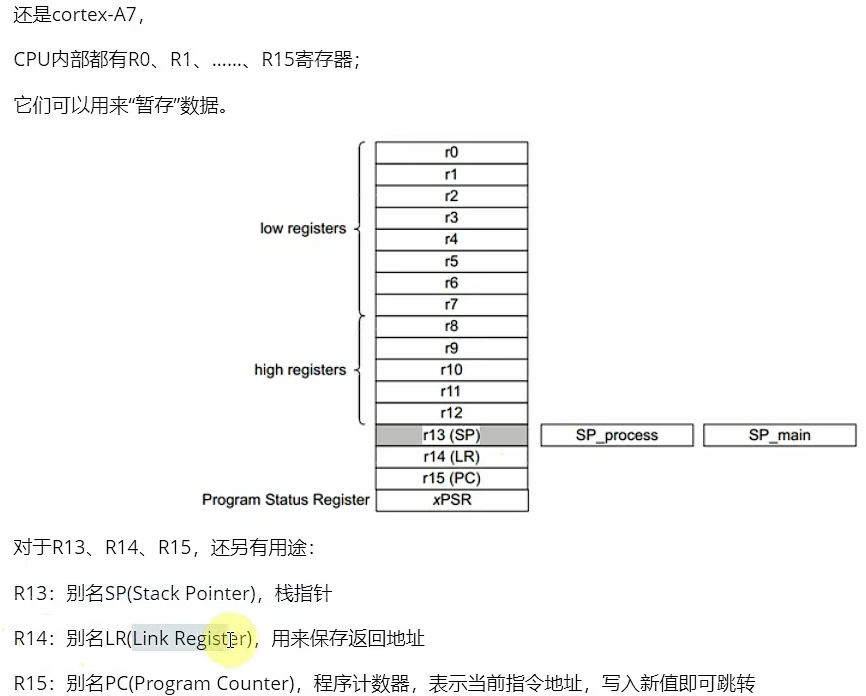
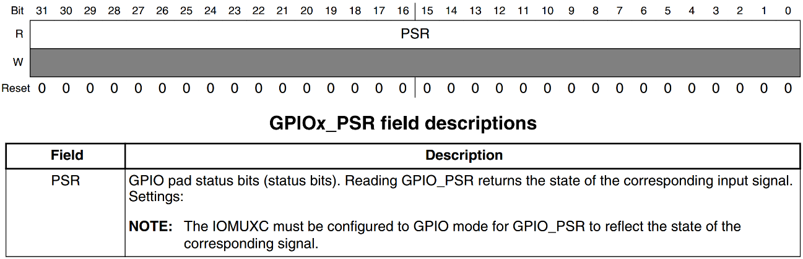
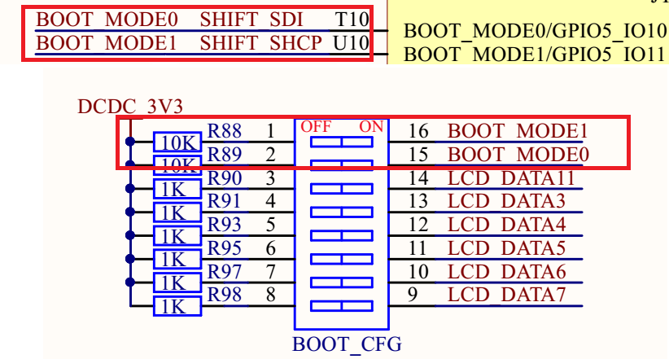
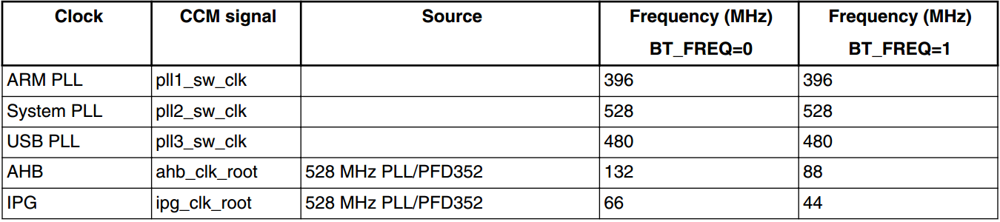

# 驱动开发


## 1、GNU 汇编语法  





### 1.1 汇编语言

https://blog.csdn.net/albertsh/article/details/106041560

#### 什么是汇编语言

汇编语言（assembly language）是一种用于电子计算机、微处理器、微控制器或其他可编程器件的低级语言，亦称为符号语言。在汇编语言中，用助记符代替机器指令的操作码，用地址符号或标号代替指令或操作数的地址。汇编语言又被称为第二代计算机语言。

**汇编语言产生的原因**

对于绝大多数人来说，二进制程序是不可读的，当然有能人可以读，比如第一代程序员，但这类人快灭绝了，直接看二进制不容易看出来究竟做了什么事情，比如最简单的加法指令二进制表示为 00000011，如果它混在一大串01字符串中就很难把它找出来，所以汇编语言主要就是==为了解决二进制编码的可读性问题==。

换句话来说，汇编语言就是把给机器看的二进制编码翻译成人话，汇编指令是机器指令的助记符，与机器指令是一一对应的关系，是一种便于阅读和记忆的书写格式。有效地解决了机器指令编写程序难度大的问题，并且使用编译器，可以很方便的把汇编程序转译成机器指令程序，比如之前提到的 00000011 加法指令，对应的汇编指令是 ADD，在调用汇编器时就会把 ADD 翻译成 00000011。

#### 寄存器

说到汇编指令不得不提到寄存器，寄存器本身是用来存数据的，因为 `CPU` 本身只负责逻辑运算，数据需要单独储存在其他的地方，

其实硬盘、内存都是用来存储数据的，但是 CPU 的运算速度远高于内存的读写速度，更不用说从硬盘上取数据了，所以为了避免被拖慢速度影响效率，CPU 都自带一级缓存和二级缓存，一些 CPU 甚至增加了三级缓存，从这些缓存中读写数据要比内存快很多，但是还是无法使用飞速运转的 CPU，所以才会有寄存器的存在。

寄存器不是后来增加的，在最初的计算中就已经设计出来，相比而言，多级缓存出现的更晚一些，通常那些最频繁读写的数据都会被放在寄存器里面，CPU 优先读写寄存器，再通过寄存器、缓存跟内存来交换数据，达到缓冲的目的，因为可以通过名称访问寄存器，这样访问速度是最快的，因此也被称为零级缓存。


**存取速度比较**

通过上面的叙述我们可以知道存取速度从高到低分别是: 寄存器 > 1级缓存 > 2级缓存 > 3级缓存 > 内存 > 硬盘，关于它们的存取速度，举个例子很容易就能明白了

**寄存器分类**

寄存器不依靠地址区分数据，而依靠名称。每一个寄存器都有自己的名称，我们告诉 CPU 去具体的哪一个寄存器拿数据，这样的速度是最快的。有人比喻寄存器是 CPU 的零级缓存。

常用的 x86 CPU 寄存器有8个：EAX 、EBX、ECX、EDX、EDI、ESI、EBP、ESP，据说现在寄存器总数已经超过100个了，等我找到相关资料再来补充，上面这几个寄存器是最常用的，这些名字也常常出现在汇编的代码中。

我们常说的32位、64位 CPU 是指数据总线的宽度或根数，而寄存器是暂存数据和中间结果的单元，因此寄存器的位数也就是处理数据的长度与数据总线的根数是相同的，所以32位 CPU 对应的寄存器也应该是32位的。

### 1.2 常用寄存器用途

上面提到大8个寄存器都有其特定的用途，我们以32位 CPU 为例简单说明下这些寄存器的作用，整理如下表：
rsp、rbp是64位系统的寄存器。


- TR寄存器:用来指向当前任务的TSS段
- IDTR寄存器:用来指向当前IDT（中断表述符表或者说是中断向量表），因为在保护模式下，IDT的起始地址可以在任何位置，而不仅限于地址0。
- GDT和LDT : 前者是全局描述符表，位置由GDTR寄存器确定，后者是局部描述符表，位置由LDTR寄存器确定，具体使用哪一个，取决于段选择码中的TI位。

#### 数据寄存器

| 编号 | 包含寄存器      | 数据<br />寄存器 | 含义（）寄存器          | 用途                                                         |
| ---- | --------------- | ---------------- | ----------------------- | ------------------------------------------------------------ |
| 1    | AX<br />AH、AL  | eax              | Accumulator<br />累加() | 在乘法和除法指令中被自动使用；<br />在Win32中，一般用在函数的返回值中。 |
| 2    | CX<br />CH、CL  | ecx              | Counter<br />计数器()   | 常做字符串和loop循环操作中的计数器。<br />每执行一次循环，ECX都会被CPU自动减一 |
| 3    | DX<br />DH、DL  | edx              | Data<br />数据()        | 常用于乘、除法和 I/O 指针                                    |
| 4    | BX<br />(BH、BL | ebx              | Base<br />基址()        | 常做内存数据的指针, 或者说常以它为基址来访问内存.<br />用来存储数据段的选择子，该选择子定义了数据段的基地址和段限制。<br />Data Segment 数据段<br />数据段寄存器主要用于访问程序中的数据，例如变量、数组等。 |

#### 指针及变址寄存器

|      |      | 指针变址     |                                                          |                                                              |
| ---- | ---- | ------------ | -------------------------------------------------------- | ------------------------------------------------------------ |
| 5    | SP   | esp<br />rsp | Stack Point<br />堆栈指针()<br />栈帧地址                | 只做堆栈的栈顶指针; 不能用于算术运算与数据传送               |
| 6    | BP   | ebp<br />rbp | Base Point<br />Fram Point<br />基址指针()<br />帧指针？ | 只做堆栈指针, 可以访问堆栈内任意地址, 经常用于中转 ESP 中的数据,<br />也常以它为基址来访问堆栈; 不能用于算术运算与数据传送 |
| 7    | SI   | esi          | Source Index<br />来源索引()                             | 与数据段寄存器DS联用, 指示数据段中==某操作==的偏移量. <br />在做串处理时, SI指示源操作数地址, 并有自动增量或自动减量的功能. <br />变址寻址时, SI与某一位移量共同构成操作数的偏移量 |
| 8    | DI   | edi          | Destination Index<br />目的索引()                        | EDI与ES联用, 指示附加数据段中==某操作==的偏移量, 或与某一位移量共同构成操作数的偏移量. <br />串处理操作时, DI指示附加段中目的地址, 并有自动增量或减量的功能 |


#### 段寄存器

==当CPU 要访问内存时由CS这个段寄存器提供内存单元的段地址。==再由IP寄存器读取指令

| 段寄存器 | 寄存器                        | 备注                                                         |
| -------- | ----------------------------- | ------------------------------------------------------------ |
| CS       | 代码段<br />Code Segment      | 存储了当前正在执行的指令所在的代码段的选择子，这个选择子定义了代码段的基地址和段限制。<br />在实模式下，CS寄存器与IP寄存器结合使用来确定即将执行的指令的物理内存地址。<br />在保护模式下，CS寄存器与EIP寄存器结合使用，用于指示代码段的起始地址，也就是当前执行程序指令所在的内存区域的起始地址。 |
| DS       | 数据段<br />Data Segment      | 存放程序所涉及的源数据或结果                                 |
| SS       | 堆栈段<br />Stack Segment     |                                                              |
| ES       | 附加数据段<br />Extra Segment | 辅助数据区, 存放串或其他数据                                 |
| FS       | 附加数据段                    |                                                              |
| GS       | 附加数据段                    |                                                              |

|      |      | 寄存器                                           |                                                              |      |
| ---- | ---- | ------------------------------------------------ | ------------------------------------------------------------ | ---- |
|      |      |                                                  |                                                              |      |
|      |      |                                                  |                                                              |      |
|      | IP   | 指令寄存器                                       | 它与段寄存器CS联用确定下一条指令的物理地址。（偏移地址）<br />程序运行时，CPU会读取EIP中的一条指令的地址，传送指令到指令缓冲区后，EIP寄存器的值自动增加，增加的大小即是读取指令的字节大小，即下一条指令的地址为当前指令的地址加上当前指令的长度。 <br />即`rip` 寄存器指向当前正在执行的指令的地址。这使得处理器能够顺利执行程序中的各种跳转指令。 |      |
|      | eip  | Extended Instruction Pointer<br />扩展指令寄存器 |                                                              |      |


#### 标志寄存器（控制）

| 标志寄存器    | 解释                                         | 备注                                         |
| ------------- | -------------------------------------------- | -------------------------------------------- |
| FLAGS（flags) | 又称程序状态字寄存器PSW(program status word) | 存放条件标志码、控制标志和系统标志的寄存器。 |

| 条件标志寄存器            | 解释           | 备注                                                         |
| ------------------------- | -------------- | ------------------------------------------------------------ |
| OF(OverFlow Flag)         | 溢出标志位     | 用来反应有符号数加减法运算所得结果是否溢出。<br />运算超出当前运算位数所能表示的范围，则称为溢出，标志位被置为1，否则为0。 |
| SF(Sign Flag)             | 符号标志位     | 用来反应运算结果是否为0。运算结果为负时置为1，否则为0。      |
| ZF(Zero Flag)             | 零标志位       | 用来反应运算结果是否为0。为零时置为1，否则为0。              |
| AF(Auxilliary carry Flag) | 辅助进位标志位 | 在字操作址，发生低字节向高字节进位或借位时该标志位被置为1，否则为0。 |
| PF(Parity Flag)           | 奇偶标志位     | 用于反应结果中“1”的个数的奇偶性。如果“1”为偶数置为1，否则为0。 |
| CF(Carry Flag)            | 进位标志位     | 运算结果的最高位产生了一个进位或错位，则该标志位置为1，否则为0。 |

| 控制标志寄存器     | 解释       | 备注                                                         |
| ------------------ | ---------- | ------------------------------------------------------------ |
| DF(Direction Flag) | 方向标志位 | 用于串操作指令中，控制地址的变化方向。<br />当DF为0时，存储器地址自动增加;当 DF为1时，存储器地址自动减少。 |
| IF(Interupt Flag)  | 中断标志位 | 用于控制外部可屏蔽中断是否可以被处理器响应。                 |
| TF(Trap Flag)      | 陷阱标志位 | 用于控制处理器是否进入单步操作方式。<br />当TF为0时，处理器在正常模式下运行；<br />当为1时，处理器单步执行指令，调试器可以逐步指令进行执行就是使用了该标志位。 |

#### 寄存器高低位


寄存器EAX、AX、AH、AL的关系

在上面的图标中每个常用寄存器后面还有其他的名字，它们是同一个寄存器不同用法下的不同名字，比如在32位 CPU 上，EAX是32位的寄存器，而AX是EAX的低16位，AH是AX的高8位，而AL是AX的低8位，它们的对照关系如下:

```
00000000 00000000 00000000 00000000 00000000 00000000 00000000 00000000
|==================================RAX================================|---4个字节
                                    |===============EAX===============|---4个字节
                                                      |======AX=======|---2个字节
                                                      |==AH===|-----------1个字节
                                                              |===AL==|---1个字节
```

```assembly
main:
.LFB3:
	.cfi_startproc
	pushq	%rbp # 保存调用者的栈帧基址指针，同时也为后续的函数调用做好准备。
				#将当前栈帧的基址指针%rbp 的值压入当前的栈中。当函数执行完毕后，通过 popq 指令可以将该值弹出并恢复先前的栈帧基址指针。
				## 表示将%rbp的值压入栈中：即先使栈顶指针寄存器%rsp的值减少8，再将%rbp的值赋值给%rsp所指的内存单元。
	.cfi_def_cfa_offset 16 # 定义了规范的初始CFA（Canonical Frame Address）位置，用于指示当前函数栈帧的基址位置。
						 #它指示栈指针在当前函数的栈帧中向下偏移了16字节。
	.cfi_offset 6, -16 # 表示指定了寄存器的偏移量。
					 #将寄存器 6（通常情况下是栈帧基址寄存器RBP）的当前值相对于CFA偏移 -16 字节。
	movq	%rsp, %rbp # 用帧指针来指向当前栈帧的基址。
					  #这通常在函数的开头用来建立一个帧指针，以便能够在调试时更容易地引用局部变量和函数参数。
	.cfi_def_cfa_register 6 # 这是一条调试信息，它指示在当前函数的栈帧中使用注册器6 (%rbp) 作为 CFA 寄存器。
	pushq	%rbx  # 将寄存器%rbx(内存基地址指针)中的值压入栈中
	subq	$40, %rsp  # 在当前栈帧上分配40个字节的空间，通常用于存储局部变量等数据。
	.cfi_offset 3, -24  # 是调试信息，用于指示当前栈帧的基址寄存器和其相对于栈指针的偏移量。
	movq	%fs:40, %rax  # 将FS段寄存器中偏移量为40的值赋给了寄存器%rax。 （乘、除、函数返回值）
						# 这个操作通常用于获取当前线程的 TEB（Thread Environment Block）指针，以便访问线程相关的数据。
	movq	%rax, -24(%rbp)
	xorl	%eax, %eax
	# 程序
	movl	$0, -48(%rbp)
	movl	$1, -44(%rbp)
	movl	$2, -40(%rbp)
	#调用函数
	movl	$0, %eax
	call	stFunc
	movl	$max, %esi
	movl	$.LC8, %edi
	movl	$0, %eax
	call	printf

movl	%edi, -4(%rbp) 
movl	%esi, -8(%rbp)
movl	-4(%rbp), %eax
cmpl	%eax, -8(%rbp)
```

### 1.3 第一个完整汇编代码

```
;反汇编
fromelf  --text  -a -c  --output=MyDis.dis  ../OBJ/MyExec.axf
```


```c
int main() {
    int a = 22;
    int &b = a;
    int * c = &a;
    printf("a = %d\n", a);
    return 0;
}
```

```assembly
	.file	"test.c"
	.text
	.section	.rodata
.LC0:
	.string	"a = %d\n"
	.text
	.globl	main
	.type	main, @function
	.LC0 标签相对于指令指针的偏移地址，并将结果存储到 %rax 寄存器中。
main:
.LFB0:
	.cfi_startproc
	endbr64
	pushq	%rbp
	.cfi_def_cfa_offset 16
	.cfi_offset 6, -16
	movq	%rsp, %rbp
	.cfi_def_cfa_register 6
	subq	$32, %rsp
	movq	%fs:40, %rax
	movq	%rax, -8(%rbp)
	xorl	%eax, %eax #为什么是32位
	# 赋值
	movl	$22, -28(%rbp)  # 将值22写到位置rbp->-28
	leaq	-28(%rbp), %rax # 位置rbp->-28 的值写到 rax寄存器
	movq	%rax, -24(%rbp) # 将 rax寄存器的值 写到位置 rbp->-24
	leaq	-28(%rbp), %rax
	movq	%rax, -16(%rbp)
	# 打印
	movl	-28(%rbp), %eax
	movl	%eax, %esi
	leaq	.LC0(%rip), %rax # 计算 .LC0 标签相对于指令指针的偏移地址，并将结果存储到 %rax 寄存器中。
							#leaq 指令将地址计算后存储到寄存器中，而不是加载内存中的值。
	movq	%rax, %rdi
	movl	$0, %eax
	call	printf@PLT
	# return?
	movl	$0, %eax # 为什么是32位
	movq	-8(%rbp), %rdx
	subq	%fs:40, %rdx
	je	.L3
	call	__stack_chk_fail@PLT # PLT 是指过程链接表（Procedure Linkage Table）的缩写。
		#在动态链接库中，函数调用通常不直接调用目标函数，而是通过过程链接表中的中间过程进行调用，以实现动态链接。
		#这个机制提供了懒惰绑定（lazy binding）的特性，在程序运行时需要引用的函数才会被解析和加载。
.L3:
	leave  # leave: 这条指令的作用是撤销当前堆栈帧，它等价于 movq %rbp, %rsp 之后的 popq %rbp。
	.cfi_def_cfa 7, 8  # 用于定义新的规范帧地址 (CFA)。
				#7 表示栈指针 (rsp) 是规范帧地址的基地址，8 表示规范帧地址的偏移。
	ret
	.cfi_endproc
.LFE0:
	.size	main, .-main
	.ident	"GCC: (Ubuntu 11.4.0-1ubuntu1~22.04) 11.4.0"
	.section	.note.GNU-stack,"",@progbits
	.section	.note.gnu.property,"a"
	.align 8
	.long	1f - 0f
	.long	4f - 1f
	.long	5
0:
	.string	"GNU"
1:
	.align 8
	.long	0xc0000002
	.long	3f - 2f
2:
	.long	0x3
3:
	.align 8
4:
```


**汇编语言指令**

```shell
cat /proc/cpuinfo  # 查看机器指令与汇编命令
objdump -d test    # 
```

终于说到汇编常用指令了，因为 linux 和 windows 下的汇编语法是有些不同的，所以下面我们先通过 windows 下的汇编指令来简单学习一下，后续再来比较两者的不同。

- b-字节(byte，8比特)、
- h-半字
- w-字(word，16比特)、
- l-双字(doubleword，32比特)
- q-四字(quadword, 64比特)

#### 数据传送指令

| 通用数据传送指令 | 名称     | 示例          | 备注                   |
| ---------------- | -------- | ------------- | ---------------------- |
| MOV              | 传送指令 | MOV dest, src | 将数据从src移动到dest  |
| PUSH             | 进栈指令 | PUSH src      | 把源操作数src压入堆栈  |
| POP              | 出栈指令 | POP desc      | 从栈顶弹出字数据到dest |
| XCHG             | 交换指令 | OPR1, OPR2    | 将这两个操作数交换     |

1. MOV注意:
   - 立即数做源操作数时, 立即数的长度必须小于等于目的操作数的长度
   - 操作数DST, SRC分别为reg, reg或reg, Sreg或Sreg, reg时, 两者的长度必须保持一致
   - CS和IP寄存器不能做DST操作数, 不允许用立即数直接为段寄存器赋值。
   - 立即数不能作为目的操作数
   - 不能将一个段寄存器的内容直接送到另一个段寄存器中, 可借助通用寄存器或PUSH, POP指令实现这一要求

2. push
   - 将一个字数据压入当前栈顶, 位移量disp=-2的地址单元. 数据进栈时, 栈指针SP首先向低地址方向移动两个字节位置, 接着数据进栈, 形成新的栈顶.	

3. pop
   - 弹出栈顶元素, 后将栈顶指针向栈底方向移动一个字.


#### **地址传送指令:** 

| 地址传送指令 | destination<br />source | 装载           |                                                              |
| ------------ | ----------------------- | -------------- | ------------------------------------------------------------ |
| lea          | lea dest,src            | 装载有效地址   | 将源操作数的偏移量OA装载到目的操作数中                       |
| lds          | lds dest,src            | 装载数据段指针 | 将当前数据段中的一个双字数据<br />装入到一个通用寄存器SI(双字数据的低字)和数据段寄存器DS(双字数据的高字)中 |
| les          | les dest,src            | 装载附加段指针 | 将附加数据段中的一个32位地址数据指针(附加段指针)送到DI(低字)和ES(高字)寄存器中 |

| 标志传送指令 | 直接使用 |                    | 专用于标志寄存器保护和更新的指令, 共四条 |
| ------------ | -------- | ------------------ | ---------------------------------------- |
| lahf         |          | 标志寄存器送AH指令 | 将标志寄存器的低字节送入AH中             |
| sahf         |          | AH送标志寄存器指令 | 将AH寄存器内容送标志寄存器FR的低字节     |
| pushf        |          | 标志进栈指令       | 标志寄存器进栈                           |
| popf         |          | 标志出栈指令       | 标志寄存器出栈                           |

| **累加器专用传送指令:** |                |                                    |      |
| ----------------------- | -------------- | ---------------------------------- | ---- |
| in                      | al ，port      | 从端口读入数据, 存放在AL中         |      |
| out                     | port ，al      | 传送AL中的数据到端口               |      |
| xlat                    | xlat opt或xlat | 用于将AL中当前的内容转换为一种代码 |      |


#### 算数运算指令

| 算术运算指令 | 名称           | 示例            | 备注                       |
| ------------ | -------------- | --------------- | -------------------------- |
| ADD          | 加法指令       | ADD dest, src   | DST+SRC的和存放到DST中去   |
| ADC          | 带进位加法指令 | ADC    DST, SRC | 带进位加法指令, DST+SRC+CF |
| INC          | 增1指令        | INC DST         |                            |
|              | **减法指令:**  |                 |                            |
| SUB          | 减法指令       | SUB dest, src   | DST-SRC, 存放到DST中       |
| sbb          | 带借位减法指令 | sbb DST, SRC    | DST-SRC-CF                 |
| DEC          | 减1指令        | DEC dest        | 在dest基础上减1            |
| eng          | 求补指令       | eng edst        | 求补码                     |
| cmp          | 比较指令       | cmp OPR1, OPR2  |                            |

| 乘法指令:      |                   |                                        |
| -------------- | ----------------- | -------------------------------------- |
| MUL      SRC   | 无符号数乘指令,   | AL*SRC, 结果放入AX中                   |
| IMUL     SRC   | 有符号数乘指令,   | AL*SRC, 结果放入AX中                   |
|                | **除法指令**      |                                        |
| DIV        SRC | 无符号数除指令,   | AX/SRC, 商放入AL中, 余数放在AH中       |
| IDIV       SRC | 符号数除指令,     | AX/SRC, 上放入AL中, 余数放在AH中       |
| CBW, CWD       | 都是符号扩展指令. | 将AL的符号扩到AX中; 将AX的符号扩到DX中 |


#### 逻辑运算指令

| 逻辑运算指令:     |                  |
| ----------------- | ---------------- |
| NOT OPR           | 逻辑非指令       |
| AND OPR           | 逻辑与指令       |
| OR  OPR           | 逻辑或指令       |
| XOR OPR           | 逻辑异或指令     |
| **移位指令:**     | **存入到dest中** |
| SHL DST, CNT      | 逻辑左移         |
| SHR DST, CNT      | 逻辑右移         |
| SAL DST, CNT      | 算术左移         |
| SAR DST, CNT      | 算术右移         |
| **循环移位指令:** |                  |
| ROL DST, CNT      | 循环左移         |
| ROR DST, CNT      | 循环右移         |
| RCL DST, CNT      | 带进位循环左移   |
| RCR DST, CNT      | 带进位循环右移   |

#### 串操作指令

- MOVS:串传送指令
- CMPS:串比较指令
- SCAS:串扫描指令
- LODS:装入串指令
- STOS:存储串指令


### 控制转移指令

#### 转移指令:

- JMP:无条件转移指令
- JX:条件转移指令(JC/JNC, JZ/JNZ, JE/JNE, JS/JNS, JO/JNO, JP/JNP…)

#### 循环指令

- LOOP 标号:该指令执行时, 技术寄存器CXX首先减1, 然后判断CX, 若为0, 跳出循环

#### 条件循环指令

- LOOPZ/LOOPE, LOOPNZ/LOOPNE:前者用于找到第一个不为0的事件, 后者用于找到第一个为0的事件

#### 子程序调用指令

- CALL 子程序名:段内直接调用
- RET

#### 中断指令

- INT N(中断类型号):软中断指令
- IRET:中断返回指令

### 处理器控制指令

#### 标志处理指令:

- CLC:进位标志CF置0
- CMC:进位标志CF求反
- STC:进位标志值1
- CLD:方向标志置0
- STD:方向标志置1
- CLI:中断允许标志置0
- STI:中断允许标志置1

#### 其他处理器控制指令:

- NOP:空操作
- HLT:停机
- WAIT:等待
- ESC:换码
- LOCK:封锁
- PRESERVE8 : 8 字节对齐 

#### 转移指令

| 循环控制指令 | 名称         | 示例       | 备注                                                         |
| ------------ | ------------ | ---------- | ------------------------------------------------------------ |
| LOOP         | 计数循环指令 | LOOP label | 使ECX的值减1，当ECX的值不为0的时候跳转至label，否则执行LOOP之后的语句 |

| 转移指令 | 名称           | 示例       | 备注                                       |
| -------- | -------------- | ---------- | ------------------------------------------ |
| jmp      | 无条件转移指令 | JMP ax     | 用寄存器的值修改IP(指令地址偏移)，mov IP， |
| call     | 过程调用指令   | CALL labal | 直接调用label                              |
| je       | 条件转移指令   | JE lable   | zf =1 时跳转到标号为label的位置            |
| jne      | 条件转移指令   | JNE lable  | zf=0 时跳转到标号为label的位置             |

| 比较指令                    |                                                         |      |      |
| --------------------------- | ------------------------------------------------------- | ---- | ---- |
| cmpl                        |                                                         |      |      |
| leaq		-28(%rbp), %rax | 将 `-28(%rbp)` 的内存地址计算后存储到 `%rax` 寄存器中。 |      |      |
|                             |                                                         |      |      |


**linux 和 windows 下汇编的区别**

前面说到 linux 和 windows 下的汇编语法是不同的，其实两种语法的不同和系统不同没有绝对的关系，一般在 linux 上会使用 gcc/g++ 编译器，而在 windows 上会使用微软的 cl 也就是 MSBUILD，所以产生不同的代码是因为编译器不同，gcc 下采用的是AT&T的汇编语法格式，MSBUILD 采用的是Intel汇编语法格式。

| 差异                   | Intel                                                        | AT&T                                                         |
| ---------------------- | ------------------------------------------------------------ | ------------------------------------------------------------ |
| 引用寄存器名字         | eax                                                          | %eax                                                         |
| 赋值操作数顺序         | mov dest, src                                                | movl src, dest                                               |
| 寄存器、立即数指令前缀 | mov ebx, 0xd00d                                              | movl $0xd00d, %ebx                                           |
| 寄存器间接寻址         | [eax]                                                        | (%eax)                                                       |
| 数据类型大小           | 操作码后加后缀字母，<br />“l” 32位，“w” 16位，“b” 8位<br />（mov dx, word ptr [eax]） | 操作数前面加<br />dword ptr， word ptr，byte ptr的格式 <br />（movb %bl %al） |

#### 总结

- 汇编指令是机器指令的助记符，与机器指令是一一对应的
- AT&T的汇编语法格式和Intel汇编语法格式的是不同的
- 常用寄存器：EAX 、EBX、ECX、EDX、EDI、ESI、EBP、ESP
- 存取速度从高到低分别是: 寄存器 > 1级缓存 > 2级缓存 > 3级缓存 > 内存 > 硬盘
- 常用的汇编指令：mov、je、jmp、call、add、sub、inc、dec、and、or

------------------------------------------------

### 1.3 GNU汇编语法

我们要编写的是 ARM汇编，编译使用的 GCC 交叉编译器，所以我们的汇编代码要符合 GNU 语法。  

GNU 汇编语法适用于所有的架构，并不是 ARM 独享的， GNU 汇编由一系列的语句组成，每行一条语句，每条语句有三个可选部分  

```c
label： instruction @ comment

// ARM 中的指令、伪指令、伪操作、寄存器名等可以全部使用大写，也可以全部使用小写，但是不能大小写混用。
add:
	MOVS R0, #0X12 @设置 R0=0X12
```

- label 即标号，表示地址位置，有些指令前面可能会有标号，这样就可以通过这个标号得到指令的地址，标号也可以用来表示数据地址。注意 label 后面的“：”，任何以“：”结尾的标识符都会被识别为一个标号。
- instruction 即指令，也就是汇编指令或伪指令。
- @符号，表示后面的是注释，就跟 C 语言里面的“/*”和“*/”一样，其实在 GNU 汇编文件中我们也可以使用“/*”和“*/”来注释。
- comment 就是注释内容。

#### 定义一个段

用户可以使用.section **伪操作来定义一个段**，汇编系统预定义了一些段  

- .text 表示代码段。  
- .data 初始化的数据段。
- .bss 未初始化的数据段。
- .rodata 只读数据段。

```assembly
# 可以自己使用.section 来定义一个段，每个段以段名开始，以下一段名或者文件结尾结束
.section .testsection @定义一个 testsetcion 段
```

#### 入口编号

```assembly
# 汇编程序的默认入口标号是 _start，不过我们也可以在链接脚本中使用 ENTRY 来指明其它的入口点
.global _start
_start:
	ldr r0, =0x12 @r0=0x12
```

####  伪操作

上面代码中.global 是伪操作，表示 _start 是一个全局标号，类似 C 语言里面的全局变量一样，常见的伪操作有：

- .byte 定义单字节数据，比如.byte 0x12。
- .short 定义双字节数据，比如.short 0x1234。
- .long 定义一个 4 字节数据，比如.long 0x12345678。
- .equ 赋值语句，格式为： .equ 变量名，表达式，比如.equ num, 0x12，表示 num=0x12。
- .align 数据字节对齐，比如： .align 4 表示 4 字节对齐。
- .type 类型
- .size 空间大小
- .end 表示源文件结束。
- .global 定义一个全局符号，格式为： .global symbol，比如： .global _start。

GNU 汇编还有其它的伪操作，但是最常见的就是上面这些，如果想详细的了解全部的伪操作，可以参考《ARM Cortex-A(armV7)编程手册 V4.0.pdf》的 57 页。


#### 函数

GNU 汇编同样也**支持函数**，函数格式如下：

```
函数名:
	函数体
	返回语句
```

```assembly
# GNU 汇编函数返回语句不是必须的，如下代码就是用汇编写的 Cortex-A7 中断服务函数

/* 未定义中断 */
Undefined_Handler:
	ldr r0, =Undefined_Handler 
	bx r0
/* SVC 中断 */
SVC_Handler:
	ldr r0, =SVC_Handler
	bx r0
/* 预取终止中断 */
PrefAbort_Handler:
	ldr r0, =PrefAbort_Handler
	bx r0
```

- 上述代码中定义了三个汇编函数： Undefined_Handler、 SVC_Handler 和PrefAbort_Handler。
- 以函数 Undefined_Handler 为例我们来看一下汇编函数组成，
  -  “Undefined_Handler”就是函数名，
  - “ldr r0, =Undefined_Handler”是函数体，
  - “bx r0”是函数返回语句，
  - “bx”指令是返回指令，函数返回语句不是必须的。  


### 1.4 Cortex-A7 常用汇编指令

> 本节我们将介绍一些常用的 Cortex-A7 汇编指令，如果想系统的了解 Cortex-A7 的所有汇编指令请参考《ARM ArchitectureReference Manual ARMv7-A and ARMv7-R edition.pdf》的 A4章节。
>
> 要想 详细 的学 习 ARM 的 所有 指令 请参 考《 ARM ArchitectureReference Manual ARMv7-A and ARMv7-R edition.pdf》和《ARM Cortex-A(armV7)编程手册 V4.0.pdf》这两份文档。  

#### 0、汇编基础语法

来源：https://www.cnblogs.com/technology/archive/2010/05/16/1736782.html

```assembly
 [标号:] 指令助记符 [ [目的操作数][, 源操作数] ] [; 注释]
```

- 指令助记符
  - 如MOV, SUB这些词分别表示传送, 减法. 汇编源程序时, 系统使用内部对照表将每条指令的助记符翻译成对应的机器码
- 目的操作数
  - 目的操作数一共有两个作用
    1. 参与指令操作
    2. 暂时储存操作结果
- 源操作数
  - 源操作数主要提供原始数据或操作对象, 面向所有寻址方式. 例如, 在指令SUB AX, BX 中 的值作为减数提供给指令SUB
- 注释
  -  在汇编中用 ; 号, 后面的内容将被注释


介绍指令前, 先熟悉下这些在指令中的符号(必须要记得)

1.  imme: 立即数

2.  DST: 目的操作数

3.  SRC: 源操作数

4.  mem: 存储器操作数

5.  OPR: 操作数

6.  reg: 通用寄存器

7.  EA: 偏移地址(偏移量)

8.  Sreg: 段寄存器

9.  Port: 端口地址

10.  Label: 标号


汇编指令一共可以分为6组:

1. 数据传送指令
2. 算术运算指令
3. 逻辑运算与移位指令
4. 串操作指令
5. 程序控制指令
6. 处理器控制指令


#### 1. 处理器内部数据传输指令 MOV\MRS\MSR 

使用处理器做的最多事情就是在处理器内部来回的传递数据，常见的操作有：
①、将数据从一个寄存器传递到另外一个寄存器。
②、将数据从一个寄存器传递到特殊寄存器，如 CPSR 和 SPSR 寄存器。
③、将立即数传递到寄存器。
数据传输常用的指令有三个： MOV、 MRS 和 MSR，这三个指令的用法如表 7.2.1.1 所示：

| 指令 | 目的 | 源   | 描述                                         |
| ---- | ---- | ---- | -------------------------------------------- |
| MOV  | R0   | R1   | 将 R1 里面的数据复制到 R0 中。               |
| MRS  | R0   | CPSR | 将特殊寄存器 CPSR 里面的数据复制到 R0 中。   |
| MSR  | CPSR | R1   | 将 R1 里面的数据复制到特殊寄存器 CPSR 里中。 |

1、MOV 指令

```assembly
@ MOV 指令用于将数据从一个寄存器拷贝到另外一个寄存器，或者将一个立即数传递到寄存器里面，使用示例如下：
MOV R0， R1 @将寄存器 R1 中的数据传递给 R0，即 R0=R1
MOV R0, #0X12 @将立即数 0X12 传递给 R0 寄存器，即 R0=0X12
```

2、 MRS 指令

```assembly
@ MRS 指令用于将特殊寄存器(如 CPSR 和 SPSR)中的数据传递给通用寄存器，要读取特殊寄存器的数据只能使用 MRS 指令！
MRS R0, CPSR @将特殊寄存器 CPSR 里面的数据传递给 R0，即 R0=CPSR
```

3、 MSR 指令

```assembly
@ MSR 指令和 MRS 刚好相反， MSR 指令用来将普通寄存器的数据传递给特殊寄存器，
@ 也就是写特殊寄存器，写特殊寄存器只能使用 MSR，
MSR CPSR, R0 @将 R0 中的数据复制到 CPSR 中，即 CPSR=R0
```


#### 2. 存储器访问指令 LDR\STR 

- 读 Loading reg / set reg：
- 写 Store  

ARM 不能直接访问存储器，比如 RAM 中的数据， I.MX6UL 中的寄存器就是 RAM 类型的，我们用汇编来配置 I.MX6UL 寄存器的时候需要借助存储器访问指令，一般先将要配置的值写入到 Rx(x=0~12)寄存器中，然后借助存储器访问指令将 Rx 中的数据写入到 I.MX6UL 寄存器中。读取 I.MX6UL 寄存器也是一样的，只是过程相反。常用的存储器访问指令有两种： LDR 和STR  

| 指令                   |                             | 描述: 一次只能读写存储器中的一个数据                    |
| ---------------------- | --------------------------- | ------------------------------------------------------- |
| LDR Rd, [Rn , #offset] | LDRB 一字节<br />LDRH 2字节 | 从存储器 Rn+offset 的位置读取数据存放到 Rd 中。         |
| STR Rd, [Rn, #offset]  |                             | 将 Rd 中的数据写入到存储器（内存）中的 Rn+offset 位置。 |

- LDR 主要用于从存储加载数据到寄存器 Rx 中， LDR 也可以将一个立即数加载到寄存器 Rx中， LDR 加载立即数的时候要使用“=”，而不是“#”。在嵌入式开发中， LDR 最常用的就是读取 CPU 的寄存器值，

  - ```assembly
    @ 比如 I.MX6UL 有个寄存器 GPIO1_GDIR，其地址为0X0209C004，我们现在要读取这个寄存器中的数据，  示例代码如下  
    LDR R0, =0X0209C004 @将寄存器GPIO1_GDIR 的地址 0X0209C004 加载到 R0 中，即 R0=0X0209C004
    LDR R1, [R0] @读取地址 0X0209C004 中的数据到 R1 寄存器中
    @ 上面代码中 offset 是 0，也就是没有用到 offset。
    ```

- STR 就是将数据写入到存储器中

  - ```assembly
    @ 要配置寄存器 GPIO1_GDIR 的值为 0X20000002，示例代码如下：
    LDR R0, =0X0209C004 @将寄存器地址 0X0209C004 加载到 R0 中，即 R0=0X0209C004
    LDR R1, =0X20000002 @R1 保存要写入到寄存器的值，即 R1=0X20000002
    STR R1, [R0] @将 R1 中的值写入到 R0 中所保存的地址中
    ```

- LDR 和 STR 都是按照字进行读取和写入的，也就是操作的 32 位数据，如果要按照字节、半字进行操作的话可以在指令“LDR”后面加上 B 或 H，
  比如按字节操作的指令就是 LDRB 和STRB，按半字操作的指令就是 LDRH 和 STRH。

#### 3. 压栈和出栈指令 PUSH\POP 

我们通常会在 A 函数中调用 B 函数，当 B 函数执行完以后再回到 A 函数继续执行。要想再跳回 A 函数以后代码能够接着正常运行，那就必须在跳到 B 函数之前将当前处理器状态保存起来(就是保存 R0~R15 这些寄存器值)，当 B 函数执行完成以后再用前面保存的寄存器值恢复R0~R15 即可。

保存 R0~R15 寄存器的操作就叫做现场保护，恢复 R0~R15 寄存器的操作就叫做恢复现场。在进行现场保护的时候需要进行压栈(入栈)操作，恢复现场就要进行出栈操作。压栈的指令为 PUSH，出栈的指令为 POP， PUSH 和 POP 是一种多存储和多加载指令，即可以一次操作多个寄存器数据，他们利用当前的栈指针 SP 来生成地址， PUSH 和 POP 的用法如表 7.2.3.1所示：

| 指令             | 描述                   |
| ---------------- | ---------------------- |
| PUSH \<reg list> | 将寄存器列表存入栈中。 |
| POP \<reg list>  | 从栈中恢复寄存器列表。 |

```assembly
@ 假如我们现在要将 R0~R3 和 R12 这 5 个寄存器压栈，当前的 SP 指针指向 0X80000000，
PUSH {R0~R3, R12} @将 R0~R3 和 R12 压栈 （最右边的最先入栈）
PUSH {LR} @将 LR 进行压栈
```


```assembly
POP {LR} @先恢复 LR
POP {R0~R3,R12} @在恢复 R0~R3,R12
```

出栈的就是从栈顶，也就是 SP 当前执行的位置开始，地址依次减小来提取堆栈中的数据到要恢复的寄存器列表中。 PUSH 和 POP 的另外一种写法是“STMFD SP！”和“LDMFD SP!”，  

```assembly
STMFD SP!,{R0~R3, R12} @R0~R3,R12 入栈
STMFD SP!,{LR} @LR 入栈
LDMFD SP!, {LR} @先恢复 LR
LDMFD SP!, {R0~R3, R12} @再恢复 R0~R3, R12
```

- STMFD 可以分为两部分： STM 和 FD，同理， LDMFD 也可以分为 LDM 和 FD。觉得似曾相识(不是 STM32 啊啊啊啊)，前面我们讲了 LDR 和 STR，这两个是数据加载和存储指令，但是每次只能读写存储器中的一个数据。
- STM 和 LDM 就是多存储和多加载，可以连续的读写存储器中的多个连续数据。
- FD 是 Full Descending 的缩写，即满递减的意思。根据 ATPCS 规则, ARM 使用的 FD 类型的堆栈， SP 指向最后一个入栈的数值，堆栈是由高地址向下增长的，因此最常用的指令就是 STMFD 和 LDMFD。 STM 和 LDM 的指令寄存器列表中编号小的对应低地址，编号高的对应高地址。


#### 4. 跳转指令 B\BL ret

- Branch ：跳转
- Branch and Link ：


有多种跳转操作，但是一般常用的还是 B、 BL 或 BX；比如：
①、直接使用跳转指令 B、 BL、 BX 等。
②、直接向 PC 寄存器里面写入数据。

| 指令        | 描述                                                         |
| ----------- | ------------------------------------------------------------ |
| B \<label>  | 跳转到 label，如果跳转范围超过了+/-2KB，<br />可以指定 B.W \<label>使用 32 位版本的跳转指令， 这样可以得到较大范围的跳转 |
| BL \<label> | ==**将返回地址保存在 LR 中( LR/R14 = 返回地址 )，再跳转到标号地址（PC/R15 ）。**== |
| BX \<Rm>    | 间接跳转，跳转到存放于 Rm 中的地址处，并且切换指令集         |
| BLX \<Rm>   | 结合 BX 和 BL 的特点，跳转到 Rm 指定的地址，并将返回地址保存在 LR 中，切换指令集。 |
| ret         | 函数返回                                                     |

- B 指令会将 PC 寄存器的值设置为跳转目标地址， 一旦执行 B 指令， ARM 处理器就会立即跳转到指定的目标地址。

  - ```assembly
    @ 如果要调用的函数不会再返回到原来的执行处，那就可以用 B 指令  
    _start:
    	ldr sp,=0X80200000 @设置栈指针
    	b main @跳转到 main 函数
    @ 上述代码就是典型的在汇编中初始化 C 运行环境，然后跳转到 C 文件的 main 函数中运行
    ```

- BL 指令相比 B 指令，在跳转之前会在寄存器 LR(R14)中保存当前 PC 寄存器值，所以可以通过将 LR 寄存器中的值重新加载到 PC 中来继续从跳转之前的代码处运行，这是子程序调用一个基本但常用的手段。比如 Cortex-A 处理器的 irq 中断服务函数都是汇编写的，主要用汇编来实现现场的保护和恢复、获取中断号等。但是具体的中断处理过程都是 C 函数，所以就会存在汇编中调用 C 函数的问题。而且当 C 语言版本的中断处理函数执行完成以后是需要返回到irq 汇编中断服务函数，因为还要处理其他的工作，一般是恢复现场。这个时候就不能直接使用B 指令了，因为 B 指令一旦跳转就再也不会回来了，这个时候要使用 BL 指令

  - ```assembly
    push {r0, r1} @保存 r0,
    cps #0x13 @进入 SVC 模式，允许其他中断再次进去
    
    bl system_irqhandler @加载 C 语言中断处理函数到 r2 寄存器中
    
    cps #0x12 @进入 IRQ 模式
    pop {r0, r1}
    str r0, [r1, #0X10] @中断执行完成，写 EOIR
    @ 上述代码中第 4 行就是执行 C 语言版的中断处理函数，当处理完成以后是需要返回来继续执行下面的程序，所以使用了 BL 指令。
    ```

#### 5. 算术运算指令  

在嵌入式开发中最常会用的就是加减指令，乘除基本用不到。  

| 指令                   | 计算公式                | 备注                         |
| ---------------------- | ----------------------- | ---------------------------- |
| **ADD Rd, Rn, Rm**     | **Rd = Rn + Rm**        | **加法运算，指令为 ADD**     |
| **ADD Rd, Rn, #immed** | **Rd = Rn + #immed**    |                              |
| ADC Rd, Rn, Rm         | Rd = Rn + Rm + 进位     | 带进位的加法运算，指令为 ADC |
| ADC Rd, Rn, #immed     | Rd = Rn + #immed +进位  |                              |
| **SUB Rd, Rn, Rm**     | **Rd = Rn – Rm**        | **减法**                     |
| **SUB Rd, #immed**     | **Rd = Rd - #immed**    |                              |
| **SUB Rd, Rn, #immed** | **Rd = Rn - #immed**    |                              |
| SBC Rd, Rn, #immed     | Rd = Rn - #immed – 借位 | 带借位的减法                 |
| SBC Rd, Rn ,Rm         | Rd = Rn – Rm – 借位     |                              |
| MUL Rd, Rn, Rm         | Rd = Rn * Rm            | 乘法(32 位)                  |
| UDIV Rd, Rn, Rm        | Rd = Rn / Rm            | 无符号除法                   |
| SDIV Rd, Rn, Rm        | Rd = Rn / Rm            | 有符号除法                   |

#### 6. 逻辑运算指令  

用 C 语言进行 CPU 寄存器配置的时候常常需要用到逻辑运算符号，比如“&”、“|”等  

| 备注     | 指令               | 计算公式            |
| -------- | ------------------ | ------------------- |
| 按位与   | AND Rd, Rn         | Rd = Rd &Rn         |
|          | AND Rd, Rn, #immed | Rd = Rn &#immed     |
|          | AND Rd, Rn, Rm     | Rd = Rn & Rm        |
| 按位或   | ORR Rd, Rn         | Rd = Rd \| Rn       |
|          | ORR Rd, Rn, #immed | Rd = Rn \| #immed   |
|          | ORR Rd, Rn, Rm     | Rd = Rn \| Rm       |
| 位清除   | BIC Rd, Rn         | Rd = Rd & (~Rn)     |
|          | BIC Rd, Rn, #immed | Rd = Rn & (~#immed) |
|          | BIC Rd, Rn , Rm    | Rd = Rn & (~Rm)     |
| 按位或非 | ORN Rd, Rn, #immed | Rd = Rn \| (#immed) |
|          | ORN Rd, Rn, Rm     | Rd = Rn \| (Rm)     |
| 按位异或 | EOR Rd, Rn         | Rd = Rd ^ Rn        |
|          | EOR Rd, Rn, #immed | Rd = Rn ^ #immed    |
|          | EOR Rd, Rn, Rm     | Rd = Rn ^ Rm        |

CMP


## 2、驱动程序框架

孟

### 2.1 LED驱动程序框架


1. 确定主设备号，也可以让内核分配；

2. 定义自己的 file_operations 结构体， 这是核心；

3.  实现对应的 drv_open/drv_read/drv_write 等函数，填入 file_operations 结构体；

4. 把 file_operations 结构体告诉内核：通过 register_chrdev 函数；

5. 谁来注册驱动程序？需要一个入口函数：安装驱动程序时，就会去调用这个入口函数；

6. 有入口函数就应该有出口函数：卸载驱动程序是，出口函数调用unregister_chrdev;

7. 其它完善：提供设备信息，自动创建设备节点：class_create,device_create;

   - 驱动怎么操作硬件？
     - 通过 ioremap 映射寄存器的物理地址得到虚拟地址，读写虚拟地址。

   - 驱动怎么和 APP 传输数据？
     - 通过 copy_to_user、 copy_from_user 这 2 个函数。


### 2.2 接口定义

LED 驱动程序接口定义构思  


LED 驱动能支持多个板子的基础： 分层思想

① 把驱动拆分为通用的框架(leddrv.c)、具体的硬件操作(board_X.c)：

我们需要在.bin 文件前面添加一些头信息构成满足 I.MX6U 需求的最终可烧写文件， I.MX6U 的最终可烧写文件组成如下：  

- Image vector table，简称 IVT， IVT 里面包含了一系列的地址信息，这些地址信息在ROM 中按照固定的地址存放着。  
- Boot data，启动数据，包含了镜像要拷贝到哪个地址，拷贝的大小是多少等等。
- Device configuration data，简称 DCD，设备配置信息，重点是 DDR3 的初始化配置。
- 用户代码可执行文件，比如 led.bin。

### 2.9  烧写

第八章中我们使用 imxdownload 这个软件将 led.bin 烧写到了 SD 卡中。
imxdownload 会在 led.bin前面添加一些头信息，重新生成一个叫做 load.imx 的文件，最终实际烧写的是 laod.imx。  

内部 Boot ROM 会将 load.imx 拷贝到 DDR 中，用户代码是要一定要从 0X87800000 这个地方开始的，因为链接地址为 0X87800000， load.imx 在用户代码前面又有 3KByte 的 IVT+Boot Data+DCD 数据，下面会讲为什么是 3KByte，因此 load.imx 在 DDR 中的起始地址就是 0X87800000- 3072=0X877FF400。  


## 3、I.MX6U GPIO详解

P307：正点原子

命名方式

命名形式就是“IOMUXC_SW_MUC_CTL_PAD_XX_XX”，后面的“XX_XX”就是 GPIO 命名，  

I.MX6ULL 参考手册的第 32 章“Chapter 32: IOMUX Controller(IOMUXC)”，第 32 章的书签 


### 3.1 I.MX6U IO 复用

如果只想看每个 IO 能复用什么外设的话可以直接查阅《IMX6ULL 参考手册》的第 4 章“Chapter 4 External Signals and Pin Multiplexing”。
如果我们要编写代码，设置某个 IO 的复用功能的话就需要查阅第 **32 章“Chapter 32: IOMUXController(IOMUXC)”** ,第 32 章详细的列出了所有 IO 对应的复用配置寄存器。

寄存器 IOMUXC_SW_MUX_CTL_PAD_GPIO1_IO00 我们前面已经说了，是用来配置GPIO1_IO00 复用功能的。

I.MX6U 的 GPIO 一共有 5 组： GPIO1、 GPIO2、 GPIO3、 GPIO4 和 GPIO5，其中 GPIO1 有 32 个 IO， GPIO2 有 22 个 IO， GPIO3 有 29 个 IO、 GPIO4 有 29 个 IO， GPIO5最少，只有 12 个 IO，这样一共有 124 个 GPIO。共五组 GPIO，每组 GPIO 都有这 8 个寄存器  

| GPIO  | IO数量：共124个 | 每组 GPIO 都有这 8 个寄存器 : 即3.3 GPIO配置 |
| ----- | --------------- | -------------------------------------------- |
| GPIO1 | 32              | GPIO1_IO00-31                                |
| GPIO2 | 22              | GPIO2_IO00-21                                |
| GPIO3 | 29              | GPIO3_IO00-28                                |
| GPIO4 | 29              | GPIO4_IO00-28                                |
| GPIO5 | 12              | GPIO5_IO00-11                                |


有个名为： IOMUXC_SW_MUX_CTL_PAD_GPIO1_IO00 的寄存器，寄存器地址为 0X020E005C，这个寄存器是 32 位的，但是只用到了最低 5 位，
其中bit0~bit3(MUX_MODE)就是设置 GPIO1_IO00 的复用功能的。 
GPIO1_IO00 一共可以复用为 9种功能 IO， 分别对应 ALT0~ALT8，其中 ALT5 就是作为 GPIO1_IO00。 

GPIO1_IO00 还可以作为 I2C2_SCL、 GPT1_CAPTURE1、 ANATOP_OTG1_ID 等。这个就是 I.MX6U 的 IO 复用，我们学习 STM32 的时候 STM32 的 GPIO 也是可以复用的。  


### 3.2 I.MX6U IO 配置

寄存器 IOMUXC_SW_PAD_CTL_PAD_GPIO1_IO00 是用来配置 GPIO1_IO00 的，包括速度设置、驱动能力设置、压摆率设置等等。  


寄存器地址为 0X020E02E8。这也是个 32 位寄存器，但是只用到了其中的低 17 位 ；

**GPIO 结构：**  


- HYS(bit16)：对应图 8.1.4.2 中 HYS，用来使能迟滞比较器，当 IO 作为输入功能的时候有效，用于设置输入接收器的施密特触发器是否使能。如果需要对输入波形进行整形的话可以使能此位。此位为 0 的时候禁止迟滞比较器，为 1 的时候使能迟滞比较器。


- PUS(bit15:14)： 对应图 8.1.4.2 中的 PUS，用来设置上下拉电阻的，一共有四种选项可以选择


- PUE(bit13)： 图 8.1.4.2 没有给出来，当 IO 作为输入的时候，这个位用来设置 IO 使用上下拉还是状态保持器。
  当为 0 的时候使用状态保持器，当为 1 的时候使用上下拉。
  状态保持器在IO 作为输入的时候才有用，顾名思义，就是当外部电路断电以后此 IO 口可以保持住以前的状态。


- PKE(bit12)： 此位用来使能或者禁止上下拉/状态保持器功能，
  为0 时禁止上下拉/状态保持器，为 1 时使能上下拉和状态保持器。


- ODE(bit11)：当 IO 作为输出的时候，此位用来禁止或者使能开路输出，
  此位为 0 的时候禁止开路输出， 当此位为 1 的时候就使能开路输出功能。
- SPEED(bit7:6)： 对应图 8.1.4.2 中的 SPEED，当 IO 用作输出的时候，此位用来设置 IO 速度，  


- DSE(bit5:3)：当 IO 用作输出的时候用来设置 IO 的驱动能力，总共有 8 个可选选项  


- SRE(bit0)： 设置压摆率，
  当此位为 0 的时候是低压摆率，当为 1的时候是高压摆率。
  这里的压摆率就是 IO 电平跳变所需要的时间，比如从 0 到 1 需要多少时间，时间越小波形就越陡，说明压摆率越高；反之，时间越多波形就越缓，压摆率就越低。如果你的产品要过 EMC 的话那就可以使用小的压摆率，因为波形缓和，如果你当前所使用的 IO做高速通信的话就可以使用高压摆率。


### 3.3 I.MX6U GPIO 配置  

GPIO 是一个 IO 众多复用功能中的一种。  

I.MX6U 的 IO 是需要配置和输出的、是可以设置输出高低电平，也可以读取 GPIO 对应的电平  

如果我们要用 GPIO1_IO00 来点个灯、作为按键输入啥的就是使用其 GPIO(通用输入输出)的功能。将其复用为 GPIO 以后还需要对其 GPIO 的功能进行配置，关于 I.MX6U 的 GPIO 请参考《IMX6UL 参考手册》的第 28章“Chapter 28 General Purpose  Input/Ouput(GPIO)”， GPIO 结构如图 8.1.5.1 所示：

当 IO 用作 GPIO 的时候需要设置的寄存器，一共有八个： DR、 GDIR、 PSR、 ICR1、 ICR2、 EDGE_SEL、 IMR 和 ISR。前面我们说了 I.MX6U 一共有GPIO1~GPIO5 共五组 GPIO，每组 GPIO 都有这 8 个寄存器。    


#### 1. DR Data


此寄存器是 32 位的，一个 GPIO 组最大只有 32 个 IO，因此 DR 寄存器中的每个位都对应一个 GPIO。

当 GPIO 被配置为输出功能以后，向指定的位写入数据那么相应的 IO 就会输出相应的高低电平，比如要设置 GPIO1_IO00 输出高电平，那么就应该设置 GPIO1.DR=1。
当 GPIO  被配置为输入模式以后， 此寄存器就保存着对应 IO 的电平值，每个位对对应一个 GPIO，例如，当 GPIO1_IO00 这个引脚接地的话，那么 GPIO1.DR 的 bit0 就是 0。  

#### 2. GDIR Direction

GDIR 的方向寄存器，用来设置某个 GPIO 的工作方向的，即输入/输出  


#### 3. PSR Pad Status

GPIO 状态寄存器 。功能和输入状态下的 DR 寄存器一样。  



#### 4. ICR1\2 Interrupt Configuration

ICR1和ICR2都是中断控制寄存器， ICR1用于配置低16个GPIO， ICR2 用于配置高 16 个 GPIO。

以GPIO1_IO15为例，如果要设置GPIO1_IO15为上升沿触发中断，那么GPIO1.ICR1=2<<30，如果要设置 GPIO1 的 IO16~31 的话就需要设置 ICR2 寄存器了。  


| 位设置 | 速度       |
| ------ | ---------- |
| 00     | 低电平触发 |
| 01     | 高电平触发 |
| 10     | 上升沿触发 |
| 11     | 下降沿触发 |

#### 6. IMR Interrupt Mask

IMR 寄存器用来控制 GPIO 的中断禁止和使能，如果使能某个 GPIO 的中断，那么设置相应的位为 1 即可，反之，如果要禁止中断，那么就设置相应的位为 0 即可。例如，要使能 GPIO1_IO00 的中断，那么就可以设置 GPIO1.MIR=1 即可  


#### 7. ISR Interupt Status

ISR 是中断状态寄存器

只要某个 GPIO 的中断发生，那么ISR 中相应的位就会被置 1。所以，我们可以通过读取 ISR 寄存器来判断 GPIO 中断是否发生，相当于 ISR 中的这些位就是中断标志位。

当我们处理完中断以后，必须清除中断标志位，清除方法就是向 ISR 中相应的位写 1，也就是写 1 清零。  


#### 8. EDGE_SEL  

边沿选择寄存器 ，用来设置边沿中断，这个寄存器会覆盖 ICR1 和 ICR2 的设置，同样是一个 GPIO 对应一个位。如果相应的位被置 1，那么就相当与设置了对应的 GPIO 是上升沿和下降沿(双边沿)触发。
例如，我们设置 GPIO1.EDGE_SEL=1，那么就表示 GPIO1_IO01 是双边沿触发中断，无论 GFPIO1_CR1 的设置为多少，都是双边沿触发。  


### 3.4 I.MX6U GPIO 时钟使能  

I.MX6U 的系统时钟参考《I.MX6UL 参考手册》的第 18 章“Chapter 18: Clock Controller Module(CCM)”，这一章主要讲解 I.MX6U 的时钟系统，很复杂。我们先不研究 I.MX6U的 时 钟 系 统 ， 我 们 只 看 一 下 CCM 里 面 的 外 设 时 钟 使 能 寄 存 器 。  

每个外设的时钟都可以独立的使能或禁止，这样可以关闭掉不使用的外设时钟，起到省电的目的。   


#### 1. CCGR CCM Clock Gating Register   

CMM 有**CCM_CCGR0~CCM_CCGR6** 这 7 个寄存器，这 7 个寄存器控制着 I.MX6U 的所有外设时钟开关 。
以 CCM_CCGR0 为例来看一下如何禁止或使能一个外设的时钟， CCM_CCGR0 结构体如图 8.1.6.1 所示：  


CCM_CCGR0 是个 32 位寄存器，其中每 2 位控制一个外设的时钟，比如 bit31:30 控制着GPIO2 的外设时钟（每一个时钟缓冲寄存器所控制的GPIO时钟不一样），两个位就有 4 种操作方式  

| 位设置 | 时钟控制                                                     |
| ------ | ------------------------------------------------------------ |
| 00     | 所有模式下都关闭外设时钟。                                   |
| 01     | 只有在运行模式下打开外设时钟，等待模式和停止模式下均关闭外设时钟。 |
| 10     | 未使用(保留)。                                               |
| 11     | 除了停止模式以外，其他所有模式下时钟都打开。                 |

如果我们要打开 GPIO2 的外设时钟，那么只需要设置CCM_CCGR0 的 bit31 和 bit30 都为 1 即可，也就是 CCM_CCGR0=3 << 30。反之，如果要关闭GPIO2 的 外 设 时 钟 ， 那 就 设 置 CCM_CCGR0 的 bit31 和 bit30 都 为 0 即 可 。

### 3.5 总结

总结一下，要将 I.MX6U 的 IO 作为 GPIO 使用，我们需要一下几步：

1.  CCDR 使能 GPIO 对应的时钟。
2. 设置寄存器 IOMUXC_SW_MUX_CTL_PAD_XX_XX，设置 IO 的复用功能，使其复用为 GPIO 功能。第32章
3. 设置寄存器 IOMUXC_SW_PAD_CTL_PAD_XX_XX，设置 IO 的上下拉、速度等等。
4. 第②步已经将 IO 复用为了 GPIO 功能，所以需要配置 GPIO，设置输入/输出、是否使用中断、默认输出电平等。第28章


## 4、C语言版LED实验 

### 4.1 I.MX6U  启动方式详解

可以从 SD/EMMC、 NAND Flash、 QSPI Flash等启动。  

从 SD 卡启动就需要在 bin 文件前面添加一个数据头，其它的启动设备也是需要这个数据头的。  

#### 1. 启动模式选择

BOOT 的处理过程是发生在 I.MX6U 芯片上电以后，芯片会根据 BOOT_MODE[1:0]的设置来选择 BOOT 方式  

**俩种启动方式**

第一种修改 eFUSE 的方式只能修改一次，后面就不能再修改了，所以我们不使用。
我们使用的是通过修改 BOOT_MODE[1:0]对应的 GPIO 高低电平来选择启动方式  。



其中 BOOT_MODE1 和 BOOT_MODE0 在芯片内部是有 100KΩ下拉电阻的 。
BOOT_CFG 的中的 8 个开关拨到“ON”就是高电平，拨到“OFF”就是低电平。  

| BOOT_MODE[1:0] | BOOT 类型      |
| -------------- | -------------- |
| 00             | 从 FUSE 启动   |
| 01             | 串行下载       |
| 10             | 内部 BOOT 模式 |
| 11             | 保留           |

- **串行下载**：的意思就是可以通过 USB 或者 UART 将代码下载到板子上的外置存储设备中，我们可以使用 OTG1 这个 USB口向开发板上的 SD/EMMC、 NAND 等存储设备下载代码。 
  这个下载是需要用到 NXP 提供的一个软件，一般用 来最终量产的时候将代码烧写到外置存储设备中的，我们后面讲解如何使用。  
- **内部 BOOT 模式**：在此模式下，芯片会执行内部的 boot ROM 代码，这段 boot ROM 代码会进行硬件初始化(一部分外设)，然后从 boot 设备(就是存放代码的设备、比如 SD/EMMC、 NAND)中将代码拷贝出来复制到指定的 RAM 中，一般是 DDR。  

#### 2. BOOR ROM 初始化内容

当我们设置 BOOT 模式为“内部 BOOT 模式”以后， I.MX6U 内部的 boot ROM 代码就会执行，首先肯定是初始化时钟



内部 boot ROM 为了加快执行速度会打开 MMU 和 Cache，**下载镜像**的时候 L1 ICache 会打开，**验证镜像**的时候 L1 DCache、 L2 Cache 和 MMU 都会打开。一旦镜像验证完成， boot ROM就会关闭 L1 DCache、 L2 Cache 和 MMU。

中断向量偏移会被设置到 boot ROM 的起始位置，当 boot ROM 启动了用户代码以后就可以重新设置中断向量偏移了。一般是重新设置到我们用户代码的开始地方，关于中断的内容后面会详细讲解。

#### 3. 启动设备选择

当 BOOT_MODE 设置为内部 BOOT 模式以后，可以从以下设备中启动：

1. ①、接到 EIM 接口的 CS0 上的 16 位 NOR Flash。
2. ②、接到 EIM 接口的 CS0 上的 OneNAND Flash。
3. ③、接到 GPMI 接口上的 MLC/SLC NAND Flash， NAND Flash 页大小支持 2KByte、 4KByte和 8KByte， 8 位宽。
4. ④、 Quad SPI Flash。
5. ⑤、接到 USDHC 接口上的 SD/MMC/eSD/SDXC/eMMC 等设备。
6. ⑥、 SPI 接口的 EEPROM。

I.MX6U 同样提供了 eFUSE 和 GPIO 配置两种 ，所有的 I.MX6U 开发板都是通过 GPIO来配置启动设备的。  

BOOT_CFG1[7:0]、 BOOT_CFG2[7:0]和 BOOT_CFG4[7:0]这 24 个配置 IO，这 24 个配置 IO 刚好对应着 LCD 的 24 根数据线 LCD_DATA0~LCDDATA23，当启动完成以后这 24 个 IO 就可以作为 LCD 的数据线使用。这 24 根线和 BOOT_MODE1、 BOOT_MODE0 共同组成了 I.MX6U的启动选择引脚。

下图：启动引脚  


配置启动设备时 实际需要调整的只有那几个 IO，其它的 IO 全部下拉接地即可  。

下图：BOOT_CFG 默认设置  


下图：BOOT_CFG 引脚含义  	


LCD_DATA11 						就是 BOOT_CFG2[3]， 
LCD_DATA3~LCD_DATA7    就是 BOOT_CFG1[3]~BOOT_CFG1[7] 

下图：BOOT 选择拨码开关 （I.MX6U-ALPHA 开发板的底板原理图  ）


| BOOT_CFG 引脚 | 对应 LCD 引脚 | 含义                                                         |
| ------------- | ------------- | ------------------------------------------------------------ |
| BOOT_CFG2[3]  | LCD_DATA11    | 为 0 时从 SDHC1 上的 SD/EMMC 启动，为 1 时从SDHC2 上的 SD/EMMC 启动。 |
| BOOT_CFG1[3]  | LCD_DATA3     | 当从 SD/EMMC 启动的时候设置启动速度，当从NAND 启动的话设置 NAND 数量。 |
| BOOT_CFG1[4]  | LCD_DATA4     | BOOT_CFG1[7:4]：<br />0000 NOR/OneNAND(EIM)启动。<br />0001 QSPI 启动。0011 SPI 启动。 |
| BOOT_CFG1[5]  | LCD_DATA5     | 010x SD/eSD/SDXC 启动。<br />011x MMC/eMMC 启动。            |
| BOOT_CFG1[6]  | LCD_DATA6     |                                                              |
| BOOT_CFG1[7]  | LCD_DATA7     | 1xxx NAND Flash 启动。                                       |

**拨码开关的最终设置**

| 1    | 2    | 3    | 4    | 5    | 6    | 7    | 8    | 启动设备                              |
| ---- | ---- | ---- | ---- | ---- | ---- | ---- | ---- | ------------------------------------- |
| 0    | 1    | x    | x    | x    | x    | x    | x    | 串行下载，可以通过 USB 烧写镜像文件。 |
| 1    | 0    | 0    | 0    | 0    | 0    | 1    | 0    | SD 卡启动。                           |
| 1    | 0    | 1    | 0    | 0    | 1    | 1    | 0    | EMMC 启动。                           |
| 1    | 0    | 0    | 0    | 1    | 0    | 0    | 1    | NAND FLASH 启动。                     |

#### 4. 镜像烧写

本小节会分析 bin 文件添加的头部信息，但是在笔者写本教程的时候关于 I.MX 系列SOC 头部信息的资料很少，基本只能参考 NXP 官方资料，而官方资料有些地方讲解的又不是很详细。所以本节有部分内容是笔者根据 NXP 官方 u-boo.imx 文件的头部信息反推出来的  

使用 imxdownload 这个软件将 led.bin 烧写到了 SD 卡中。imxdownload 会在 led.bin前面添加一些头信息，重新生成一个叫做 load.imx 的文件，最终实际烧写的是 laod.imx。  

I.MX6U 的最终可烧写文件组成如下：==IVT+Boot data+DCD+.bin==。 
①、 Image vector table，简称 IVT， IVT 里面包含了一系列的地址信息，这些地址信息在ROM 中按照固定的地址存放着。
②、 Boot data，启动数据，包含了镜像要拷贝到哪个地址，拷贝的大小是多少等等。
③、 Device configuration data，简称 DCD，设备配置信息，重点是 DDR3 的初始化配置。
④、用户代码可执行文件，比如 led.bin。

内部 Boot ROM 会将 load.imx 拷贝到 DDR 中，用户代码是要一定要从 0X87800000 这个地方开始的，因为链接地址为 0X87800000， load.imx 在用户代码前面又有 3KByte 的 IVT+Boot Data+DCD 数据，下面会讲为什么是 3KByte，因此 load.imx 在 DDR 中的起始地址就是 0X87800000- 3072=0X877FF400。  

##### IVT 数据

IVT 包含了镜像程序的入口点、指向 DCD 的指针和一些用作其它用途的指针。内部 Boot ROM 要求 IVT 应该放到指定的位置，不同的启动设备位置不同，而 IVT 在整个 load.imx 的最前面，其实就相当于要求 load.imx 在烧写的时候应该烧写到存储设备的指定位置去。整个位置都是相对于存储设备的起始地址的偏移  

下图：IVT 偏移  


以 SD/EMMC 为例， IVT 偏移为 1Kbyte， IVT+Boot data+DCD 的总大小为 4KByte- 1KByte=3KByte。假如 SD/EMMC 每个扇区为 512 字节，那么 load.imx 应该从第三个扇区开始烧写，前两个扇区要留出来。 load.imx 从第 3KByte 开始才是真正的.bin 文件。  


**下图：ITV 里面存放的数据**


| ITV的header  Tag    | Length                                                | Version            |
| ------------------- | ----------------------------------------------------- | ------------------ |
| 一字节：固定为 0XD1 | IVT 长度2字节，为大端格式，也就是高字节保存在低内存中 | 一字节：0X40或0X41 |

| IVT 结构  | 数据       | 描述                                                         |
| --------- | ---------- | ------------------------------------------------------------ |
| header    | 0X402000D1 | 第一个字节 Tag 为0XD1，第二三这两个字节为 IVT 大小，为大端模式，所以 IVT 大小为 0X20=32 字节。第四个字节为 0X40。 |
| entry     | 0X87800000 | 入口地址，<br />也就是镜像第一行指令所在的位置。0X87800000 就是我们的链接地址。 |
| reserved1 | 0X00000000 | 未使用，保留。                                               |
| dcd       | 0X877FF42C | 指定DCD 的起始地址，<br />镜像地址为 0X87800000， IVT+Boot Data+DCD 整个大小为 3KByte。因此 load.imx 的起始地址就是 0X87800000-0XC00=0X877FF400。<br />因此 DCD 起始地址相对于 load.imx 起始地址的偏移就是0X877FF42C-0X877FF400=0X2C，也就是说从图“**用 winhex 打开以后的 load.imxd** ”中的 0X2C 这个地址开始就是 DCD 数据了。 |
| boot data | 0X877FF420 | boot 地址， header 里面已经设置了 IVT 大小是 32个 字 节 ，<br /> 所以 boot data 的地址就是 0X877FF400+32=0X877FF420。 |
| self      | 0X877FF400 | IVT 复制到 DDR 中以后的首地址。                              |
| csf       | 0X00000000 | CSF 地址。                                                   |
| reserved2 | 0X00000000 | 保留，未使用                                                 |

##### Boot Data 数据

| Boot Data 结构 | 数据       | 描述                                                   |
| -------------- | ---------- | ------------------------------------------------------ |
| start          | 0X877FF000 | 整个 load.imx 的起始地址，包括前面 1KByte 的地址偏移。 |
| length         | 0X00200000 | 镜像大小，这里设置 2MByte。镜像大小不能超过2MByte。    |
| plugin         | 0X00000000 | 插件。                                                 |

**下图：Boot Data 数据格式**  


下图：**用 winhex 打开以后的 load.imxd**  


##### DCD 数据

(Device Config Data)  

DCD 其实就是 I.MX6U 寄存器地址和对应的配置信息集合， Boot ROM 会使用这些寄存器地址和配置集合来初始化相应的寄存器，
比如开启某些外设的时钟、初始化 DDR 等等。 DCD 区域不能超过 1768Byte，  

| DCD的header  Tag    | Length                                                | Version            |
| ------------------- | ----------------------------------------------------- | ------------------ |
| 一字节：固定为 0XD2 | IVT 长度2字节，为大端格式，也就是高字节保存在低内存中 | 一字节：0X40或0X41 |

下图：DCD结构


下图：DCD CMD命令格式


- | CMD  Tag：一字节 | Length：俩字节，大端格式                    | Parameter： | 3-7 flags        | 0-2 bytes                                    |
  | ---------------- | ------------------------------------------- | ----------- | ---------------- | -------------------------------------------- |
  | 固定为 0XCC      | 包含写入的命令数据长度，<br />包含 header。 | 一字节      | 是命令控制标志位 | 表示是目标位置宽度  <br />可选124， 单位字节 |

- Address 和 Vlalue/Mask 就是要初始化的寄存器地址和相应的寄存器值，注意采用的是大端模式 。

DCD 里面的初始化配置主要包括三方面：
①、设置 CCGR0~CCGR6 这 7 个外设时钟使能寄存器，默认打开所有的外设时钟。
②、配置 DDR3 所用的所有 IO。
③、配置 MMDC 控制器，初始化 DDR3。

| DCD 结构           | 数据       | 描述                                                         |
| ------------------ | ---------- | ------------------------------------------------------------ |
| header             | 0X40E801D2 | 第一个字节 Tag 为 0XD2，<br />第二和三这两个字节为 DCD 大小，为大端模式，所以 DCD 大小为 0X01E8=488 字节。<br />第四个字节为 0X40。 |
| Write Data Command | 0X04E401CC | 第一个为 Tag，固定为 0XCC，<br />第二和三这两个字节是大端模式的命令总长度，为 0X01E4=484 个字节。<br />第四个字节是 Parameter，为 0X04，表示目标位置宽度为 4 个字节。 |
| ==Address==        | 0X020C4068 | 寄存器 CCGR0 地址                                            |
| Value              | 0XFFFFFFFF | 要写入寄存器 CCGR0 的值，表示打开 CCGR0 控制的所有外设时钟。 |
| ……                 | ……         | CCGR1~CCGR5 这些寄存器的地址和值。                           |
| Address            | 0X020C4080 | 寄存器 CCGR6 地址                                            |
| Value              | 0XFFFFFFFF | 要写入寄存器 CCGR6 的值，表示打开 CCGR6 控制的所有外设时钟。 |
| ==Address==        | 0X020E04B4 | 寄存器 IOMUXC_SW_PAD_CTL_GRP_DDR_TYPE 寄存器地址。           |
| Value              | 0X000C0000 | 设置 DDR 的所有 IO 为 DDR3 模式。                            |
| Address            | 0X020E04AC | 寄存器 IOMUXC_SW_PAD_CTL_GRP_DDRPKE 地址。                   |
| Value              | 0X00000000 | 所有 DDR 引脚关闭 Pull/Keeper 功能。                         |
| Address            | 0X020E027C | 寄存器 IOMUXC_SW_PAD_CTL_PAD_DRAM_SDCLK0_P                   |
| Value              | 0X00000030 | DRAM_SDCLK0_P 引脚为 R0/6。                                  |
| ……                 | ……         | 全部是 DDR 引脚设置                                          |
| Address            | 0X020E0248 | 寄存器 IOMUXC_SW_PAD_CTL_PAD_DRAM_DQM1                       |
| Value              | 0X00000030 | DRAM_DQM1 引脚驱动能力为 R0/6                                |
| ==Address==        | 0X021B001C | MMDC_MDSCR 寄存器                                            |
| Value              | 0X00008000 | MMDC_MDSCR 寄存器值                                          |
| ……                 | ……         | MMDC 相关寄存器地址及其寄存器值。                            |
| Address            | 0X021B0404 | MMDC_MAPSR 寄存器                                            |
| Value              | 0X00011006 | MMDC_MAPSR 寄存器配置值                                      |
| Address            | 0X021B001C | MMDC_MDSCR 寄存器                                            |
| Value              | 0X00000000 | MMDC_MDSCR 寄存器清零                                        |


### 4.2  LED 实验

汇编文件只是用来完成 C 语言环境搭建。  

新建三个文件： start.S、 main.c 和 main.h。其中 start.S是汇编文件， main.c 和 main.h 是 C 语言相关文件。  

#### 1. 初始化C环境 汇编

DDR3的初始化不在这个文件中DCD 数据包含了 DDR配置参数， 
I.MX6U内部的Boot ROM会读取 DCD数据中的DDR配置参数然后完成DDR初始化的 。

```assembly
@ start.s 文件初始化C环境，
/*	@ 用来设置处理器运行到 SVC 模式下、
	@ 然后初始化 SP 指针、
	@ 最终跳转到 C 文件的 main 函数中。
*/

.global _start /* 全局标号 */
/*
* 描述： _start 函数，程序从此函数开始执行，此函数主要功能是设置 C
* 运行环境。
*/
_start:

/* 进入 SVC 模式 */
mrs r0, cpsr      	/* 将 CPSR寄存器的值读取到 R0 中*/
bic r0, r0, #0x1f 	/* 将 r0 的低 5 位清零，也就是 cpsr 的 M0~M4 */
orr r0, r0, #0x13 	/* r0 或上 0x13,表示使用 SVC 模式 */
msr cpsr, r0 	 	/* 将 r0 的数据重新写入到 cpsr_c 中 */
ldr sp, =0X80200000	/* SP 栈指针设置为 0X80200000 */
/* @ 因为 I.MX6U-ALPHA 开发板上的DDR3地址范围是 0X80000000~0XA0000000(512MB) 或者 0X80000000~0X90000000(256MB) 
   @ 因此 SVC 模式的栈大小 0X80200000-0X80000000=0X200000=2MB,2MB的栈空间已经很大了，如果做裸机开发的话绰绰有余。
*/

b main /* 跳转到 main 函数 */
```

Cortex-A 有九个运行模型，这里我们设置处理器运行在 SVC 模式下。处理器模式的设置是通过修改 CPSR(程序状态)寄存器来完成的 ；
在 6.3.2 小节中我们详细的讲解了 CPSR 寄存器，其中 M[4:0](CPSR 的 bit[4:0])就是设置处理器运行模式的，  

#### 2. 宏设置

```c#
// main.h 中我们以宏定义的形式定义了要使用到的所有寄存器，后面的数字就是其地址

/*
* CCM 相关寄存器地址
*/
#define CCM_CCGR0 *((volatile unsigned int *)0X020C4068)
#define CCM_CCGR1 *((volatile unsigned int *)0X020C406C)
#define CCM_CCGR2 *((volatile unsigned int *)0X020C4070)
#define CCM_CCGR3 *((volatile unsigned int *)0X020C4074)
#define CCM_CCGR4 *((volatile unsigned int *)0X020C4078)
#define CCM_CCGR5 *((volatile unsigned int *)0X020C407C)
#define CCM_CCGR6 *((volatile unsigned int *)0X020C4080)
/*
* IOMUX 相关寄存器地址
*/
#define SW_MUX_GPIO1_IO03 *((volatile unsigned int *)0X020E0068)
#define SW_PAD_GPIO1_IO03 *((volatile unsigned int *)0X020E02F4)
/*
* GPIO1 相关寄存器地址
*/
#define GPIO1_DR 		*((volatile unsigned int *)0X0209C000)
#define GPIO1_GDIR 		*((volatile unsigned int *)0X0209C004)
#define GPIO1_PSR 		*((volatile unsigned int *)0X0209C008)
#define GPIO1_ICR1 		*((volatile unsigned int *)0X0209C00C)
#define GPIO1_ICR2 		*((volatile unsigned int *)0X0209C010)
#define GPIO1_IMR 		*((volatile unsigned int *)0X0209C014)
#define GPIO1_ISR 		*((volatile unsigned int *)0X0209C018)
#define GPIO1_EDGE_SEL	*((volatile unsigned int *)0X0209C01C)
#endif
```

#### 3. C语言


#### 4. 编译

makefile

```makefile
objs := start.o main.o  # 变量objs 包含着要生成 ledc.bin 所需的材料
					  # 这里要注意 start.o 一定要放到最前面！因为 start.o 是要最先要执行的文件！

##	# 自动变量“$^”的意思是 所有依赖文件的集合,以空格分开
	# 自动变量“$@”的意思是 规则中的目标集合
	# 自动变量“$<”的意思是 依赖目标集合的第一个文件
##	

# 目的是生成最终的可执行文件 ledc.bin， ledc.bin 依赖 start.o 和 main.o
ledc.bin: $(objs)
# 链接命令，链接起始地址是 0X87800000，start.o 要在前面
arm-linux-gnueabihf-ld 		-Ttext 0X87800000 -o ledc.elf $^ #自动变量“$^”在这里就是:start.o和main.o
# 将 ledc.elf 文件转为 ledc.bin
arm-linux-gnueabihf-objcopy -O binary -S ledc.elf $@ #自动变量“$@”在这里就是:ledc.bin
# 反汇编，生成 ledc.dis 文件。
arm-linux-gnueabihf-objdump -D -m arm ledc.elf > ledc.dis

# 汇编转OBJ文件后，等待链接
%.o:%.s
arm-linux-gnueabihf-gcc 	-Wall -nostdlib -c -o $@ $<
%.o:%.S
arm-linux-gnueabihf-gcc 	-Wall -nostdlib -c -o $@ $<
# C转OBJ文件后，等待链接
%.o:%.c
arm-linux-gnueabihf-gcc 	-Wall -nostdlib -c -o $@ $<

.PHONY : cln  #phone
cln:
	rm -rf *.o ledc.bin ledc.elf ledc.dis
```


编译完成以后可以使用软件 imxdownload 将其下载到 SD 卡中，命令如下：  

```shell
chmod 777 imxdownload 			#给予 imxdownoad 可执行权限，一次即可
./imxdownload ledc.bin /dev/sdd  #下载到 SD 卡中, 不能烧写到/dev/sda 或 sda1 设备里面！
```

#### 5. 链接脚本 .lds

linker script

```makefile
arm-linux-gnueabihf-ld -Ttext 0X87800000 -o ledc.elf $^
# “-Ttext”来指定链接地址是 0X87800000 的，这样的话所有的文件都会链接到以 0X87800000 为起始地址的区域。
# 但是有时候我们很多文件需要链接到指定的区域，或者叫做段里面，比如在 Linux 里面初始化函数就会放到 init 段里面。 

# 因此我们需要能够自定义一些段，这些段的起始地址我们可以自由指定，
# 同样的我们也可以指定一个文件或者函数应该存放到哪个段里面去。要完成这个功能我们就需要使用到链接脚本，。
```

**链接脚本**：其主要目的是描述输入文件中的段如何被映射到输出文件中，并且控制输出文件中的内存排布。比如我们编译生成的文件一般都包含 text 段、 data 段等等。  

我们一般编译出来的代码都包含在 text、 data、 bss 和 rodata 这四个段内，假设现在的代码要被链接到 0X10000000 这个地址，数据要被链接到 0X30000000 这个地方，下面就是完成此功能的最简单的链接脚本

```makefile
## 链接语法简介
	# 每个命令是一个带有参数的关键字或者一个对符号的赋值，可以使用分号分隔命令。
	# 像文件名之类的字符串可以直接键入，也可以使用通配符“*”。
## 
SECTIONS { # 最简单的链接脚本可以只包含一个命令“SECTIONS”,我们可以在这一个“SECTIONS”里面来描述输出文件的内存布局。
	. = 0X10000000;  	# 对一个特殊符号“.”进行赋值，“.”在叫做定位计数器，默认的定位计数器为 0。
				       # 给“.”赋值0X10000000，后面的文件或者段都会以 0X10000000 为起始地址开始链接。
				       
	.text : {*(.text)}  # “.text”是段名，冒号是语法要求，大括号里面可以填上要链接到“.text”这个段里面的所有文件，
					  # “*”是通配符，表示所有输入文件的.text段都放到“.text”中。
					  
	. = 0X30000000;     # 重新设置定位计数器“.”，将其改为 0X30000000。如果不重新设置的话会怎么样？
					  # 假设“.text”段大小为 0X10000，那么接下来的.data 段开始地址就是 0X10000000+0X10000=0X10010000，
	.data ALIGN(4) : { *(.data) }   # ALIGN(4)”用来对“.data”这个段的起始地址做字节对齐的，一般都是 ALIGN(4)、ALIGN(8)
						# ALIGN(4)表示 4 字节对齐，也就是说段“.data”的起始地址要能被 4 整除。
	.bss ALIGN(4) : { *(.bss) }
}
```

**实例**：优化第4布的编译？

```shell
# imx6ul.lds
SECTIONS{
	. = 0X87800000;
	.text :
	{
		start.o	# start.o 里面包含着第一个要执行的指令，所以一定要链接到最开始的地方。
		main.o  # 其实可以不用写出来，因为 main.o 的位置就无所谓了，可以由编译器自行决定链接位置。
		*(.text)
	}
	
	.rodata ALIGN(4) : {*(.rodata*)} #.rodata 常量区
	.data ALIGN(4) : { *(.data) }
	__bss_start = .;  # 用来保存.bss 段的起始地址。
					# __bss_start”和“__bss_end”是符号对这两个符号进行赋值，其值为定位符“.”
					# 需要知道.bss 段的起始和结束地址，这样我们直接对这段内存赋 0 即可完成清零。
					# 这样我们就可以直接在汇编或者 C 文件里面使用这两个符号。
	.bss ALIGN(4) : { *(.bss) *(COMMON) }
	__bss_end = .;	 # 用来保存.bss 段的结束地址。
}
```

#### 6. 使用链接脚本文件

```makefile
arm-linux-gnueabihf-ld -Ttext 0X87800000 -o ledc.elf $^
# 将-T 后面的 0X87800000 改为 imx6ul.lds，表示使用 imx6ul.lds 这个链接脚本文件。  
arm-linux-gnueabihf-ld -Timx6ul.lds -o ledc.elf $^
```

#### 7. 下载验证

```shell
chmod 777 imxdownload 			#给予 imxdownoad 可执行权限，一次即可
./imxdownload ledc.bin /dev/sdd  #下载到 SD 卡中, 不能烧写到/dev/sda 或 sda1 设备里面！
```


#### 8. 通用makefile

```makefile
##	# Makefile 文件内容重点工作是找到要编译哪些文件？编译的.o文件存放到哪里？使用到的编译命令和前面实验使用的一样，
	# 其实 Makefile 的重点工作就是解决“从哪里来到哪里去的”问题，也就是找到要编译的源文件、编译结果存放到哪里？
	# 真正的编译命令很简洁。
##

# 行定义了一些变量，除了第 2 行以外其它的都是跟编译器有关的，如果使用其它编译器的话只需要修改第 1 行即可。
CROSS_COMPILE 	?= arm-linux-gnueabihf-
TARGET		    ?= bsp  # 目标名字，不同的例程肯定名字不一样。
CC 				:= $(CROSS_COMPILE)gcc
LD				:= $(CROSS_COMPILE)ld
OBJCOPY 		:= $(CROSS_COMPILE)objcopy
OBJDUMP 		:= $(CROSS_COMPILE)objdump
# 变量 INCDIRS 包含整个工程的.h 头文件目录  INCDIRS := imx6ul bsp/clk bsp/led bsp/delay
INCDIRS 		:= imx6ul  bsp/clk  bsp/led  bsp/delay 
# 变量 SRCDIRS 包含的是整个工程的所有.c 和.S 文件目录。 source dir
SRCDIRS			:= project  bsp/clk  bsp/led \
				   bsp/delay 

# 加“-I”的目的是因为 Makefile 语法要求指明头文件目录的时候需要加上“-I”。
INCLUDE			:= $(patsubst %, -I %, $(INCDIRS)) # 通过函数 patsubst 给变量 INCDIRS 添加一个“-I”

# 变量 SFILES 保存工程中所有的.s 汇编文件(包含绝对路径)，
# 变量 SRCDIRS 已经存放了工程中所有的.c 和.S 文件，所以我们只需要从里面挑出所有的.S 汇编文件即可
SFILES			:= $(foreach dir, $(SRCDIRS), $(wildcard $(dir)/*.S)) 
CFILES			:= $(foreach dir, $(SRCDIRS), $(wildcard $(dir)/*.c))
# SFILES := project/start.S
# CFILES = project/main.c bsp/clk/bsp_clk.c bsp/led/bsp_led.c bsp/delay/bsp_delay.c

# SFILENDIR 和 CFILNDIR 只是文件名，不包含文件的绝对路径。
SFILENDIR		:= $(notdir  $(SFILES))
CFILENDIR		:= $(notdir  $(CFILES))

## 默认所有的文件编译出来的.o 文件和源文件在同一个目录中，这里我们将所有的.o 文件都放到 obj 文件夹下
SOBJS			:= $(patsubst %, obj/%, $(SFILENDIR:.S=.o))
COBJS			:= $(patsubst %, obj/%, $(CFILENDIR:.c=.o))
# SOBJS = obj/start.o
# COBJS = obj/main.o obj/bsp_clk.o obj/bsp_led.o obj/bsp_delay.o
OBJS			:= $(SOBJS) $(COBJS) # 变量 OBJS 是变量 SOBJS 和 COBJS 的集合
# OBJS = obj/start.o obj/main.o obj/bsp_clk.o obj/bsp_led.o obj/bsp_delay.o

##	# VPATH 是指定搜索目录的，这里指定的搜素目录就是变量 SRCDIRS 所保存的目录，
	#这样当编译的时候所需的.S 和.c 文件就会在 SRCDIRS 中指定的目录中查找
##
VPATH			:= $(SRCDIRS)

.PHONY: clean
	
$(TARGET).bin : $(OBJS)
	$(LD) -Timx6ul.lds -o $(TARGET).elf $^
	$(OBJCOPY) -O binary -S $(TARGET).elf $@
	$(OBJDUMP) -D -m arm $(TARGET).elf > $(TARGET).dis

$(SOBJS) : obj/%.o : %.S
	$(CC) -Wall -nostdlib -c -O2  $(INCLUDE) -o $@ $<

$(COBJS) : obj/%.o : %.c
	$(CC) -Wall -nostdlib -c -O2  $(INCLUDE) -o $@ $<
	
clean:
	rm -rf $(TARGET).elf $(TARGET).dis $(TARGET).bin $(COBJS) $(SOBJS)
```


