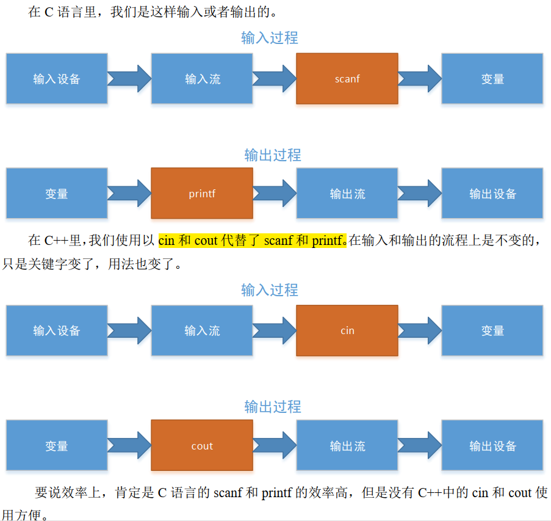
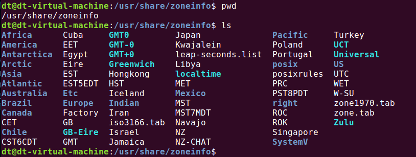
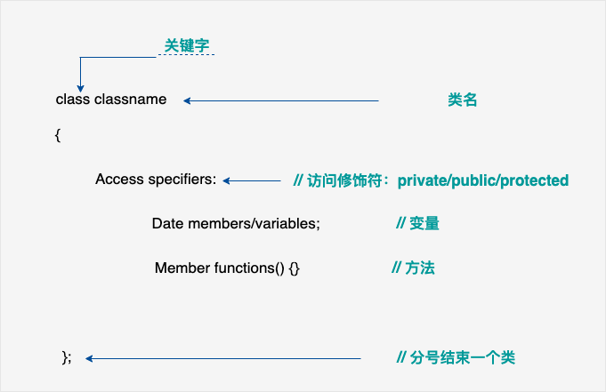
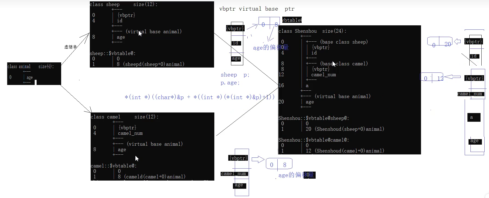
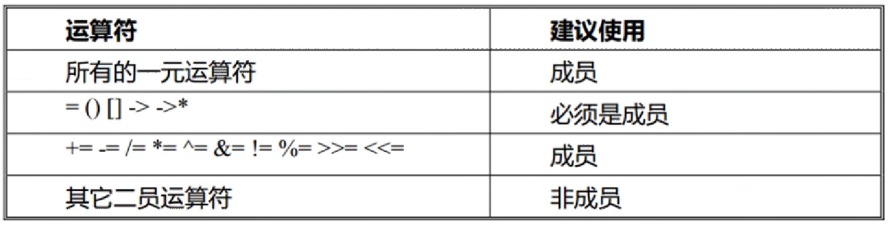
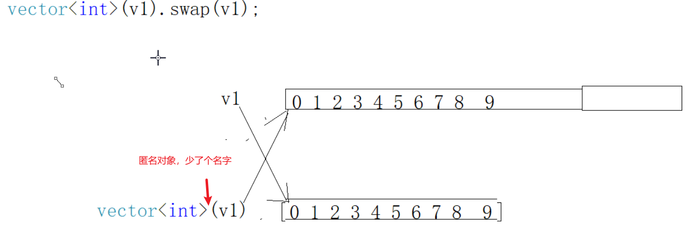

库函数地址：  https://cppreference.com/

# C++


C++ （c plus plus） 是一种静态类型的、编译式的、通用的、大小写敏感的、不规则的编程语言，支持过程化编程、面向对象编程和泛型编程。 C++ 被认为是一种中级语言，它综合了高级语言和低级语言的特点。  

## 与c

#### __cplusplus


#### const

1. c++中的const 修饰的局部变量赋值为**常量时**， ==**存放在符号表中**==，每次读取数据时直接从符号表中读取。故不能修改其值。
   当对其取地址时，编译器会产生一个临时的变量来保存 a 的值。所以 `*p = &a; *p = 100` 修改的临时变量的值。
2. c++中的const 修饰的局部变量赋值为**变量时**，==**存放在栈区**== ，故可以通过指针修改 a 的值。
3. c++中 const修饰的变量为==**自定义类型时**== ，存放在栈区。
4. c++中的const 修饰的全局变量 ==**常量区**==，不能修改其值。
   所以当对其取地址时， `*p = &a; *p = 100` 会发生错误。
5. c++中的const 修饰的全局变量，==**默认是内部链接属性**== ，在声明时加上 extern 后变为外部链接属性。

c中 const 修饰的遍历存放在栈中


#### 内联与宏

预处理器不能访问类的成员。

这里注意：宏输出的是 3；内联输出的是1 ；


delete


## 初识


### 环境配置

指令安装编译 C 语言和 C++的环境  

```shell
sudo apt-get install gcc g++
sudo apt-get install lsb-core lib32stdc++6 // 安装其他库

g++ -v
```

创建cpp文件

```shell
vi 01_hello_world.cpp // 编辑 cpp 文件，拷贝下文的内容
```


```cpp
#include <iostream>  // C++ 语言定义了一些头文件，这些头文件包含了程序中必需的或有用的信息。
// using 是编译指令   //不能写成 iostream.h， 有.h 的是非标准的输入输出流， c 的标准库。
using namespace std;  // using namespace std; 告诉编译器使用 std 命名空间。命名空间是 C++ 中一个相对新的概念。
					// 其中 std 就是 C++里的标准命名空间，也就是标准库里写好的了，我们可以直接调用。
					// 无.h 的是标准输入输出流就要用命名空间。
int main()
{
	cout << "Hello, World!" << endl; //“<<”是运算符， endl 是换行语句。
    cout << "Hello, world!\n" << "Hello, world!" << endl;
	return 0;					//加用“<<” 插入运算符（重载运算符） 再插入一句“Hello, world!
}
```

cin 和 cout 可以写 std::cin 和 std::cout，“::”表示作用域， cin 和 cout 是属于 std 命名空间下的东西，这里可以理解成 std 的 cin 和 std 的 cout。  


### C++新特性

C++比 C 语言新增的数据类型是布尔类型（bool）。 但是在新的 C 语言标准里已经有布尔类型了，但是在旧的 C 语言标准里是没有布尔类型的，编译器也无法解释布尔类型。

在传统的 C 语言里，变量初始化时必须在程序的前面定义在前面， 而 C++则是可以随用随定义。 C++也可以直接初始化，比如 int x(100);这样就直接赋值 x=100，这些都是 C++特性的好处。 



```C++
cout<<x<<endl;
//x 可以是任意数据类型,甚至可以写成一个表达式，这比 C 语言需要指定数据类型方便多了，endl 指的是换行符，与 的“\n” 效果一样。
cout<<x,y<<endl; // 在变量间不能用“，”。//错误示例：
cout<<x<<y; // endl 可流省略，只是一个换行的效果。//正确写法：

// cin 语法形式：
cin>>x; //x 可以是任意数据类型。
cin>>x>>y;
```


### C++ 关键字

下表列出了 C++ 中的保留字。这些保留字不能作为常量名、变量名或其他标识符名称。

| asm          | else      | new              | this     |
| ------------ | --------- | ---------------- | -------- |
| auto         | enum      | operator         | throw    |
| bool         | explicit  | private          | true     |
| break        | export    | protected        | try      |
| case         | extern    | public           | typedef  |
| catch        | false     | register         | typeid   |
| char         | float     | reinterpret_cast | typename |
| class        | for       | return           | union    |
| const        | friend    | short            | unsigned |
| const_cast   | goto      | signed           | using    |
| continue     | if        | sizeof           | virtual  |
| default      | inline    | static           | void     |
| delete       | int       | static_cast      | volatile |
| do           | long      | struct           | wchar_t  |
| double       | mutable   | switch           | while    |
| dynamic_cast | namespace | template         |          |


### const_cast 去掉 const 属性


#### auto

C++11中，auto并不代表一种实际的数据类型，只是一个类型声明的"[占位符](https://so.csdn.net/so/search?q=占位符&spm=1001.2101.3001.7020)"，auto并不是万能的在任意场景下都能够推导出变量的实际类型，使用auto声明的变量必须要进行初始化，以让编译器推导出它的实际类型，在编译时将auto占位符替换成真正的类型。

- 1.当变量不是指针或者引用类型时，推导的结果中不会保留const，volatile关键字。
- 2.当变量是指针或者引用类型时，推导的结果中会保留const，volatile关键字。


### C++命名空间

作用：限制作用范围

编译器无法区分全局名和同名的未命名名称空间成员。

- 可扩展
- 可嵌套
- 可别名

```cpp
#include <iostream>

using namespace std;

namespace INTERNATIONAL_BUSINESS_MACHINES {
  void f();
}

namespace IBM = INTERNATIONAL_BUSINESS_MACHINES;

namespace A {
    int a = 100;
    namespace B            //嵌套一个命名空间B
    {
        int a = 20;
    }
}

int a = 200;//定义一个全局变量


int main(int argc, char *argv[]) {
    cout << "A::a =" << A::a << endl;        //A::a =100
    cout << "A::B::a =" << A::B::a << endl;  //A::B::a =20
    cout << "a =" << a << endl;              //a =200
    cout << "::a =" << ::a << endl;          //::a =200

    using namespace A;
    // cout << "a =" << a << endl;     // Reference to 'a' is ambiguous // 命名空间冲突，编译期错误
    cout << "::a =" << ::a << endl; //::a =200

    int a = 30;
    cout << "a =" << a << endl;     //a =30
    cout << "::a =" << ::a << endl; //::a =200

    //即：全局变量 a 表达为 ::a，用于当有同名的局部变量时来区别两者。

    using namespace A;
    cout << "a =" << a << endl;     // a =30  // 当有本地同名变量后，优先使用本地，冲突解除
    cout << "::a =" << ::a << endl; //::a =200

    return 0;
}
```

```c
#include <iostream>
using namespace std;

namespace INTERNATIONAL_BUSINESS_MACHINES {
  void f();
}
namespace IBM = INTERNATIONAL_BUSINESS_MACHINES;

namespace A {
  class X {
    friend void f(X);  // A::f is a friend
  };
  // A::f is not visible here
  X x;
  void f(X) { cout << "A::f()" << endl; }  // f() is defined and known to be a friend
}

namespace A {
    int a = 100;
    namespace B            //嵌套一个命名空间B
    {
        int a = 20;
    }
}

void z()
{
    A::f(A::x);    // OK
    // A::X::f(x); // error: f is not a member of A::X
}

// using namespace A;
int a = 200;//定义一个全局变量

int main(int argc, char *argv[]) {
    cout << "A::a =" << A::a << endl;        //A::a =100
    cout << "A::B::a =" << A::B::a << endl;  //A::B::a =20
    cout << "a =" << a << endl;              //a =200 //如果前面using指定了A命名空间，则A中的a和全局a会冲突，编译期错误
    cout << "::a =" << ::a << endl;          //::a =200

    using namespace A;
    // cout << "a =" << a << endl;     // Reference to 'a' is ambiguous // 命名空间冲突，编译期错误
    cout << "::a =" << ::a << endl; //::a =200

    int a = 30;
    cout << "a =" << a << endl;     //a =30
    cout << "::a =" << ::a << endl; //::a =200

    //即：全局变量 a 表达为 ::a，用于当有同名的局部变量时来区别两者。

    using namespace A;
    cout << "a =" << a << endl;     // a =30  // 当有本地同名变量后，优先使用本地，冲突解除
    cout << "::a =" << ::a << endl; //::a =200

    z();

    // f has not yet been defined
    // using A::x;

    return 0;
}
```


### C++模版

*模板* 描述了一组相关类或一组相关函数，其中声明中的参数列表描述了该集合的成员如何变化。 当您为这些参数提供参数时，编译器将生成新的类或函数; 此过程称为 *模板实例化*，并在 [模板实例化 (仅限 C + +)](https://www.ibm.com/docs/zh/ssw_ibm_i_75/rzarg/template_instantiation.htm#template_instantiation)中进行详细描述。 根据模板和一组模板参数生成的此类或函数定义称为 *特殊化*，如 [模板特殊化 (仅限 C + +)](https://www.ibm.com/docs/zh/ssw_ibm_i_75/rzarg/template_specialization.htm#template_specialization)中所述。

模板是泛型编程的基础，泛型编程即以一种==独立于任何特定类型==的方式编写代码。

模板是创建泛型类或函数的蓝图或公式。库容器，比如迭代器和算法，都是泛型编程的例子，它们都使用了模板的概念。

每个容器都有一个单一的定义，比如 **向量**，我们可以定义许多不同类型的向量，比如 **vector <int>** 或 **vector <string>**。

**为什么要有泛型编程**
C++是一门强类型语言，所以无法做到像动态语言（python javascript）那样子，编写一段通用的逻辑，可以把任意类型的变量传进去处理。泛型编程弥补了这个缺点，**通过把通用逻辑设计为模板，摆脱了类型的限制，提供了继承机制以外的另一种抽象机制，极大地提升了代码的可重用性。**

**注意：**模板定义本身不参与编译，而是编译器根据模板的用户使用模板时提供的类型参数生成代码，再进行编译，这一过程被称为模板实例化。用户提供不同的类型参数，就会实例化出不同的代码。

可以在模板参数声明中交换关键字 `class` 和 `typename` 。 
不能在模板参数声明中使用存储类说明符 (`static` 和 `auto`)。


```cpp
#include <iostream>
#include <string>
using namespace std;

template <typename T>
inline T const& Max (T const& a, T const& b) 
{ 
    return a < b ? b:a; 
} 
int main ()
{
 
    int i = 39;
    int j = 20;
    cout << "Max(i, j): " << Max(i, j) << endl; 
 
    double f1 = 13.5; 
    double f2 = 20.7; 
    cout << "Max(f1, f2): " << Max(f1, f2) << endl; 
 
    string s1 = "Hello"; 
    string s2 = "World"; 
    cout << "Max(s1, s2): " << Max(s1, s2) << endl; 
 
    return 0;
}
```


在 C++ 中，空格用于描述空白符、制表符、换行符和注释。空格分隔语句的各个部分

## 函数

在 C++ 中，除了可以创建各种函数，还包含了各种有用的函数供您使用。这些函数写在标准 C 和 C++ 库中，叫做**内置**函数。您可以在程序中引用这些函数。

关于随机数生成器，有两个相关的函数。一个是 **rand()**，该函数只返回一个伪随机数。生成随机数之前必须先调用 **srand()** 函数。

```c++
// 实例中使用了 **time()** 函数来获取系统时间的秒数，通过调用 rand() 函数来生成随机数：
#include <iostream>
#include <ctime>
#include <cstdlib>
using namespace std;
 
int main ()
{
   int i,j;
    
   srand( (unsigned)time( NULL ) );  // 设置种子
   for( i = 0; i < 10; i++ )
   {
      j= rand();  // 生成实际的随机数
      cout <<"随机数： " << j << endl;
   }
 
   return 0;
}
```


#### setw 指定输出空间

setw() 函数只对紧接着的输出产生作用。

**当后面紧跟着的输出字段长度小于 n 的时候，在该字段前面用空格补齐，当输出字段长度大于 n 时，全部整体输出。**


```c++
#include <iostream>
#include <iomanip>
using namespace std;

int main()
{
    cout << setfill('*')  << setw(14) << "runoob" << endl;
    return 0;
}

// ********runoob
```


#### max_element 返回范围内最大值


## 线程

```c++
#include <iostream>  
#include <thread>  
  
class MyClass {  
public:  
    MyClass(int id) : id_(id) {}  
  
    // 友元函数声明  
    friend void myFriendFunction(MyClass& obj);  
  
private:  
    int id_;  
};  
  
// 友元函数实现  
void myFriendFunction(MyClass& obj) {  
    std::cout << "Hello from friend function! ID: " << obj.id_ << std::endl;  
}  
  
int main() {  
    MyClass obj(123);  
  
    // 创建一个线程，执行友元函数  
    std::thread t(myFriendFunction, std::ref(obj));  
  
    // 等待线程完成  
    t.join();  
  
    return 0;  
}
```


## C++ 引用 vs 指针

引用很容易与指针混淆，它们之间有三个主要的不同：

- 不存在空引用。引用必须连接到一块合法的内存。
- 一旦引用被初始化为一个对象，就不能被指向到另一个对象。指针可以在任何时候指向到另一个对象。
- 引用必须在创建时被初始化。指针可以在任何时间被初始化。

试想变量名称是变量附属在内存位置中的标签，您可以把引用当成是变量附属在内存位置中的第二个标签。因此，您可以通过原始变量名称或引用来访问变量的内容。

### 引用作为参数

```c
// 指针
void change(int *a,int *b) //传入的是变量的地址
{
    int *set = 0;
	set = a;
	a = b;
	b=set;
}

int main()
{
	int a = 5;
	int b = 6;
        
    change(&a, &b);
    printf("%d %d \n", a, b);
    
    return 0;
}
```

> 俩普通变量的地址互换，其变量名和值同步互换
>
> a = 5 
> b = 6

```c++
#include <iostream>
using namespace std;
 
void swap(int& x, int& y) //传入的是变量名里面的值，直接对值进行操作。是不是不用为形参申请空间？
{
   int temp;
   temp = x; /* 保存地址 x 的值 */
   x = y;    /* 把 y 赋值给 x */
   y = temp; /* 把 x 赋值给 y  */
    
   return;
}
int main ()
{
   int a = 100;
   int b = 200;
 
   cout << "交换前，a 的值：" << a << endl;
   cout << "交换前，b 的值：" << b << endl;
 
   swap(a, b); // 和普通函数的引用一样
 
   cout << "交换后，a 的值：" << a << endl;
   cout << "交换后，b 的值：" << b << endl;
   return 0;
}
```

> 引用地址里的值，操作的是地址里的值
>
> 交换前，a 的值： 100
> 交换前，b 的值： 200
> 交换后，a 的值： 200
> 交换后，b 的值： 100

### 引用作为返回值

==当函数返回一个引用时，则返回一个指向返回值的隐式指针==。这样，函数就可以放在赋值语句的左边。

```cpp
#include <iostream>
using namespace std;
 
double vals[] = {10.1, 12.6, 33.1, 24.1, 50.0};
 
double& setValues(int i) {  
   double& ref = vals[i];    
   return ref;   // 返回第 i 个元素的引用，ref 是一个引用变量，ref 引用 vals[i]
}
 
int main ()
{
   cout << "改变前的值" << endl;
   for ( int i = 0; i < 5; i++ )
   {
       cout << "vals[" << i << "] = ";
       cout << vals[i] << endl;
   }
 
   setValues(1) = 20.23; // 改变第 2 个元素
   setValues(3) = 70.8;  // 改变第 4 个元素
 
   cout << "改变后的值" << endl;
   for ( int i = 0; i < 5; i++ )
   {
       cout << "vals[" << i << "] = ";
       cout << vals[i] << endl;
   }
   return 0;
}
```

> 改变前的值
> vals[0] = 10.1
> vals[1] = 12.6
> vals[2] = 33.1
> vals[3] = 24.1
> vals[4] = 50
> 改变后的值
> vals[0] = 10.1
> vals[1] = 20.23
> vals[2] = 33.1
> vals[3] = 70.8
> vals[4] = 50

当返回一个引用时，要注意被引用的对象不能超出作用域。所以返回一个对局部变量的引用是不合法的，但是，可以返回一个对静态变量的引用。

```cpp
#include <iostream>
using namespace std;

int& getStaticRef() {
    static int num = 5;
    return num; // 返回对静态变量的引用
}

int main() 
{
    int& ref = getStaticRef(); // 获取对静态变量的引用
    cout << "初始值：" << ref << endl;

    ref = 10; // 修改静态变量的值

    cout << "修改后的值：" << ref << endl;
    cout << "再次调用函数后的值：" << getStaticRef() << endl;

    return 0;
}
```

> 初始值：5
> 修改后的值：10
> 再次调用函数后的值：10


## 日期时间

详解：https://www.runoob.com/cplusplus/cpp-date-time.html

C++ 标准库没有提供所谓的日期类型。C++ 继承了 C 语言用于日期和时间操作的结构和函数。为了使用日期和时间相关的函数和结构，需要在 C++ 程序中引用 <ctime> 头文件。

### 时间基础

#### GMT 格林威治标准时间

GMT（Greenwich Mean Time） 中文全称是格林威治标准时间， 这个时间系统的概念在 1884 年被确立，由英国伦敦的格林威治皇家天文台计算并维护，并在之后的几十年向欧陆其它国家扩散。

1884 年，各国代表在美国华盛顿召开国际大会，通过协议选出英国伦敦的格林威治作为全球时间的中心点， 决定以通过格林威治的子午线作为划分东西两半球的经线零度线（本初子午线、零度经线） ，由此格林威治标准时间因而诞生！  

所以 GMT 时间就是英国格林威治当地时间， 也就是零时区（中时区） 所在时间， 譬如 GMT 12:00 就是指英国伦敦的格林威治皇家天文台当地的中午 12:00，与我国的标准时间北京时间（东八区）相差 8 个小时，即早八个小时，所以 GMT 12:00 对应的北京时间是 20:00。  

#### UTC 时间

UTC（Coordinated Universal Time）指的是世界协调时间（又称世界标准时间、世界统一时间）， 是经过平均太阳时(以格林威治时间 GMT 为准)、地轴运动修正后的新时标以及以「秒」为单位的国际原子时所综合精算而成的时间，计算过程相当严谨精密，因此若以「世界标准时间」的角度来说， UTC 比 GMT 来得更加精准。

GMT 与 UTC 这两者几乎是同一概念，它们都是指格林威治标准时间，也就是国际标准时间，只不过UTC 时间比 GMT 时间更加精准，所以在我们的编程当中不用刻意去区分它们之间的区别。

在 Ubuntu 系统下， 可以使用"date -u"命令查看到当前的 UTC 时间

#### 时区

全球被划分为 24 个时区，每一个时区横跨经度 15 度，以英国格林威治的本初子午线作为零度经线，将全球划分为东西两半球， 分为东一区、东二区、东三区……东十二区以及西一区、西二区、西三区……西十二区，而本初子午线所在时区被称为中时区（或者叫零时区）


东十二区和西十二区其实是一个时区，就是十二区，东十二区与西十二区==各横跨经度 7.5 度，以 180 度经线作为分界线。==   
每个时区的中央经线上的时间就是这个时区内统一采用的时间，称为区时。相邻两个时区的时间相差 1 小时。  

==CST== 在这里其实指的是 China Standard Time（中国标准时间）的缩写，  


在 Ubuntu 系统下， 时区信息通常以标准格式保存在一些文件当中， 这些文件通常位于/==usr/share/zoneinfo==目录下，该目录下的每一个文件（包括子目录下的文件）都包含了一个特定国家或地区内时区制度的相关信息， 且往往根据其所描述的城市或地区缩写来加以命名，譬如 EST（美国东部标准时间）、 CET（欧洲中部时间）、 UTC（世界标准时间）、 Hongkong、 Iran、 Japan（日本标准时间）等，也把这些文件称为时区配置文件，如下图所示  



系统的本地时间由时区配置文件/etc/localtime 定义，通常链接到/usr/share/zoneinfo 目录下的某一个文件（或其子目录下的某一个文件） ： 


如果我们要修改 Ubuntu 系统本地时间的时区信息，可以直接将/etc/localtime 链接到/usr/share/zoneinfo目录下的任意一个时区配置文件，譬如 EST（美国东部标准时间），首先进入到/etc 目录下，执行下面的命令：

```shell
sudo rm -rf localtime #删除原有链接文件
sudo ln -s /usr/share/zoneinfo/EST localtime #重新建立链接文件
```


#### 实时时钟 RTC

操作系统中一般会有两个时钟，一个系统时钟（system clock），一个实时时钟（Real time clock），也叫 RTC；系统时钟由系统启动之后由内核来维护， 譬如使用 date 命令查看到的就是系统时钟， 所以在系统关机情况下是不存在的；而实时时钟一般由 RTC 时钟芯片提供， RTC 芯片有相应的电池为其供电，以保证系统在关机情况下 RTC 能够继续工作、继续计时。

#### Linux 系统如何记录时间 

Linux 系统在开机启动之后首先会读取 RTC 硬件获取实时时钟作为系统时钟的初始值，之后内核便开始维护自己的系统时钟。所以由此可知， RTC 硬件只有在系统开机启动时会读取一次，目的是用于对系统时钟进行初始化操作，之后的运行过程中便不会再对其进行读取操作了。
而==在系统关机时， 内核会将系统时钟写入到 RTC 硬件、已进行同步操作。==

#### jiffies 的引入

jiffies 是内核中定义的一个全局变量，内核使用 jiffies 来记录系统==从启动以来的系统节拍数==， 所以这个变量用来记录以系统节拍时间为单位的时间长度， Linux 内核在编译配置时定义了一个节拍时间，使用节拍率（一秒钟多少个节拍数）来表示，譬如常用的节拍率为 100Hz（一秒钟 100 个节拍数，节拍时间为 1s /100）、 200Hz（一秒钟 200 个节拍，节拍时间为 1s / 200）、 250Hz（一秒钟 250 个节拍，节拍时间为 1s /250）、 300Hz（一秒钟 300 个节拍，节拍时间为 1s / 300）、 500Hz（一秒钟 500 个节拍，节拍时间为 1s /500）等。 由此可以发现配置的节拍率越低，每一个系统节拍的时间就越短，也就意味着 jiffies 记录的时间精度越高，当然， 高节拍率会导致系统中断的产生更加频繁，频繁的中断会加剧系统的负担，==一般默认情况下都是采用 100Hz 作为系统节拍率。==

内核其实==通过 jiffies 来维护系统时钟==， 全局变量 jiffies 在系统开机启动时会设置一个初始值，上面也给大家提到过， RTC 实时时钟会在系统开机启动时读取一次，目的是用于对系统时钟进行初始化，这里说的==初始化其实指的就是对内核的 jiffies 变量进行初始化操作==，具体如何将读取到的实时时钟换算成 jiffies 数值，这里便不再给大家介绍了。

所以由此可知， 操作系统使用 jiffies 这个全局变量来记录当前时间，当我们需要获取到系统当前时间点时，就可以使用 jiffies 变量去计算，当然并不需要我们手动去计算， Linux 系统提供了相应的系统调用或 C库函数用于获取当前时间，譬如==**系统调用 time()、 gettimeofday()，其实质上就是通过 jiffies 变量换算得到。**==


### 时间函数

有四个与时间相关的类型：**clock_t、time_t、size_t** 和 **tm**。
类型 clock_t、size_t 和 time_t 能够把系统时间和日期表示为某种整数。


```cpp
//系统调用
#include <time.h>
time_t time(time_t *tloc); // 自 1970-01-01 00:00:00 +0000 (UTC)以来的秒数；并存储在tloc中

//时间戳转换为字符串日历时间（）
char *ctime(const time_t *timep);  //不可重用函数；将日历时间转换为可打印输出的字符串形式
char *ctime_r(const time_t *timep, char *buf); //可重用函数（有后缀_r）；buf缓冲区存储数据（一般忽略返回值）；

//时间戳转换成时间结构体
// gmtime 函数将时间戳转换为格林威治标准时间（GMT，又称UTC，世界协调时间）的日期和时间信息。
struct tm *gmtime(const time_t *timep);
struct tm *gmtime_r(const time_t *timep, struct tm *result); //线程安全：将返回的结构保存在result结构体中
//将时间戳转换为本地时区（当前系统设置的时区）的日期和时间信息。
struct tm *localtime(const time_t *timep);
struct tm *localtime_r(const time_t *timep, struct tm *result);

//时间结构体转换成日历时间
char *asctime(const struct tm *tm);
char *asctime_r(const struct tm *tm, char *buf);

// 将结构体转换为时间戳 
time_t mktime(struct tm *tm);
/// 时间戳在计算机系统中被广泛用于记录文件修改时间、事件触发时间、程序性能分析等场景。
/// 通过比较时间戳，可以确定事件的发生顺序，计算事件之间的时间间隔，或者对事件进行时间排序

//将结构体tm中的数据存到s中；s缓冲区；max缓冲区字节数；格式；时间结构体
size_t strftime(char *s, size_t max, const char *format, const struct tm *tm);
strftime(time_str, sizeof(time_str),"%Y-%m-%d %H:%M:%S", &file_tm)
%Y-%m-%d %H:%M:%S<%p> %B %A    // 2021-01-14 16:30:25<PM> January Thursday
/// 如果超过了最大字节数，则返回 0

// 结构类型 **tm** 把日期和时间以 C 结构的形式保存，tm 结构的定义如下：
struct tm {
  int tm_sec;   // 秒，正常范围从 0 到 59，但允许至 61
  int tm_min;   // 分，范围从 0 到 59
  int tm_hour;  // 小时，范围从 0 到 23
  int tm_mday;  // 一月中的第几天，范围从 1 到 31
  int tm_mon;   // 月，范围从 0 到 11
  int tm_year;  // 自 1900 年起的年数
  int tm_wday;  // 一周中的第几天，范围从 0 到 6，从星期日算起
  int tm_yday;  // 一年中的第几天，范围从 0 到 365，从 1 月 1 日算起
  int tm_isdst; // 夏令时
};

#include <sys/time.h>
int gettimeofday(struct timeval *tv, struct timezone *tz);  //tz历史产物，直接NULL即可
// 是一个POSIX标准定义的系统调用，用于设置系统的当前时间和时区信息。该函数可以改变系统的全局时间，需要root权限才能执行。
int settimeofday(const struct timeval *tv, const struct timezone *tz);

struct timeval {
    time_t      tv_sec;     /* seconds */
    suseconds_t tv_usec;    /* microseconds */
    //即真正的时间是 tv_sec.tv_usec
};
```


| 说明符 | 表示含义                                                     | 实例        |
| ------ | ------------------------------------------------------------ | ----------- |
| %a     | 星期的缩写                                                   | Sun         |
| %A     | 星期的完整名称                                               | Sunday      |
| %b     | 月份的缩写                                                   | Mar         |
| %B     | 月份的完整名称                                               | March       |
| %c     | 系统当前语言环境对应的首选日期和时间表示形式                 |             |
| %C     | 世纪（年/100）                                               | 20          |
| %d     | 十进制数表示一个月中的第几天（01-31）                        | 15、 05     |
| %D     | 相当于％m/％d/％y                                            | 01/14/21    |
| %e     | 与%d 相同，但是单个数字时，前导 0 会被去掉                   | 15、 5      |
| %F     | 相当于%Y-%m-%d                                               | 2021-01-14  |
| %h     | 相当于%b                                                     | Jan         |
| %H     | 十进制数表示的 24 小时制的小时（范围 00-23）                 | 01、 22     |
| %I     | 十进制数表示的 12 小时制的小时（范围 01-12）                 | 01、 11     |
| %j     | 十进制数表示的一年中的某天（范围 001-366）                   | 050、 285   |
| %k     | 与%H 相同，但是单个数字时，前导 0 会被去掉（范围 0-23）      | 1、 22      |
| %l     | 与%I 相同，但是单个数字时，前导 0 会被去掉（范围 1-12）      | 1、 11      |
| %m     | 十进制数表示的月份（范围 01-12）                             | 01、 10     |
| %M     | 十进制数表示的分钟（范围 00-59）                             | 01、 55     |
| %n     | 换行符                                                       |             |
| %p     | 根据给定的时间值，添加“AM”或“PM”                             | PM          |
| %P     | 与%p 相同，但会使用小写字母表示                              | pm          |
| %r     | 相当于%I:%M:%S %p                                            | 12:15:31 PM |
| %R     | 相当于%H:%M                                                  | 12:16       |
| %S     | 十进制数表示的秒数（范围 00-60）                             | 05、 30     |
| %T     | 相当于%H:%M:%S                                               | 12:20:03    |
| %u     | 十进制数表示的星期（范围 1-7，星期一为 1）                   | 1、 5       |
| %U     | 十进制数表示，当前年份的第几个星期（范围 00-53），从第一个星期日作为 01 周的第一天开始 |             |
| %W     | 十进制数表示，当前年份的第几个星期（范围 00-53）， 从第一个星期一作为第 01 周的第一天开始 |             |
| %w     | 十进制数表示的星期，范围为 0-6，星期日为 0                   |             |
| %x     | 系统当前语言环境的首选日期表示形式，没有时间                 | 01/14/21    |
| %X     | 系统当前语言环境的首选时间表示形式，没有日期                 | 12:30:16    |
| %y     | 十进制数表示的年份（后两字数字）                             | 21          |
| %Y     | 十进制数表示的年份（4 个数字）                               | 2021        |
| %%     | 输出%符号                                                    | %           |


```cpp
#include <stdio.h>
#include <time.h>
#include <sys/time.h>


int main() {

    time_t now;
    now = time(NULL);  /* 1721452508 */

    printf("time(NULL)\t%ld\n",now); 
    struct tm tm = *localtime(&now);  /* 2024-7-20 5:15:8 */
    struct tm* tm2 = gmtime(&now);    /* 2024-7-20 13:15:8 */
    printf("%d-%d-%d %d:%d:%d\n",tm.tm_year+1900,tm.tm_mon+1,tm.tm_mday,
             tm.tm_hour, tm.tm_min, tm.tm_sec);
    printf("%d-%d-%d %d:%d:%d\n", tm2->tm_year+1900, tm2->tm_mon+1, tm2->tm_mday,
             tm2->tm_hour,tm2->tm_min,tm2->tm_sec);

    struct timeval tv;
    gettimeofday(&tv, NULL);
    printf("%ld==%ld\n",tv.tv_usec,tv.tv_sec);
    
    time_t current_time;
    struct tm result_tm;
    struct tm *local_time;

    int aa = time(&current_time);  /* 1721452508--1721452508 */
    local_time = localtime_r(&current_time, &result_tm);  // 将时间戳转换为本地时间，线程安全

    printf("time(&current_time)\t%d--%ld\n", aa, current_time);
    printf("Current local time: %d-%d-%d %d:%d:%d\n",
           local_time->tm_year + 1900, local_time->tm_mon + 1, local_time->tm_mday,
           local_time->tm_hour, local_time->tm_min, local_time->tm_sec);
    printf("Current local time: %d-%d-%d %d:%d:%d\n",
            result_tm.tm_year + 1900, result_tm.tm_mon + 1, result_tm.tm_mday,
            result_tm.tm_hour, result_tm.tm_min, result_tm.tm_sec);
    /*  Current local time: 2024-7-20 13:15:8
        Current local time: 2024-7-20 13:15:8 */
    return 0;
}
```


| 序号 | 函数 & 描述                                                  |
| :--- | :----------------------------------------------------------- |
| 1    | [**time_t time(time_t \*time);**](https://www.runoob.com/cplusplus/c-function-time.html) 该函数返回系统的当前日历时间，自 1970 年 1 月 1 日以来经过的秒数。如果系统没有时间，则返回 -1。 |
| 2    | [**char \*ctime(const time_t \*time);**](https://www.runoob.com/cplusplus/c-function-ctime.html) 该返回一个表示当地时间的字符串指针，字符串形式 *day month year hours:minutes:seconds year\n\0*。 |
| 3    | [**struct tm \*localtime(const time_t \*time);**](https://www.runoob.com/cplusplus/c-function-localtime.html) 该函数返回一个指向表示本地时间的 **tm** 结构的指针。 |
| 4    | [**clock_t clock(void);**](https://www.runoob.com/cplusplus/c-function-clock.html) 该函数返回程序执行起（一般为程序的开头），处理器时钟所使用的时间。如果时间不可用，则返回 -1。 |
| 5    | [**char \* asctime ( const struct tm \* time );**](https://www.runoob.com/cplusplus/c-function-asctime.html) 该函数返回一个指向字符串的指针，字符串包含了 time 所指向结构中存储的信息，返回形式为：day month date hours:minutes:seconds year\n\0。 |
| 6    | [**struct tm \*gmtime(const time_t \*time);**](https://www.runoob.com/cplusplus/c-function-gmtime.html) 该函数返回一个指向 time 的指针，time 为 tm 结构，用协调世界时（UTC）也被称为格林尼治标准时间（GMT）表示。 |
| 7    | [**time_t mktime(struct tm \*time);**](https://www.runoob.com/cplusplus/c-function-mktime.html) 该函数返回日历时间，相当于 time 所指向结构中存储的时间。 |
| 8    | [**double difftime ( time_t time2, time_t time1 );**](https://www.runoob.com/cplusplus/c-function-difftime.html) 该函数返回 time1 和 time2 之间相差的秒数。 |
| 9    | [**size_t strftime();**](https://www.runoob.com/cplusplus/c-function-strftime.html) 该函数可用于格式化日期和时间为指定的格式。 |


### 进程时间

进程时间指的是进程从创建后（也就是程序运行后）到目前为止这段时间内使用 CPU 资源的时间总数，出于记录的目的，内核把 CPU 时间（进程时间） 分为以下两个部分：
⚫ ==用户 CPU 时间==：进程在用户空间（用户态）下运行所花费的 CPU 时间。有时也成为虚拟时间（virtualtime）。
⚫ ==系统 CPU 时间==：进程在内核空间（内核态）下运行所花费的 CPU 时间。这是内核执行系统调用或代表进程执行的其它任务（譬如，服务页错误）所花费的时间。

一般来说，==进程时间指的是用户 CPU 时间和系统 CPU 时间的总和，也就是总的 CPU 时间。==
Tips：进程时间不等于程序的整个生命周期所消耗的时间， 如果进程一直处于休眠状态（进程被挂起、不会得到系统调度），那么它并不会使用 CPU 资源，所以==休眠的这段时间并不计算在进程时间中==。

#### times 

```c
#include <sys/times.h>
// 用于获取当前进程时间
clock_t times(struct tms *buf);

struct tms {
    clock_t tms_utime; /* user time, 进程的用户 CPU 时间, tms_utime 个系统节拍数 */
    clock_t tms_stime; /* system time, 进程的系统 CPU 时间, tms_stime 个系统节拍数 */
    clock_t tms_cutime; /* user time of children, 已死掉子进程的 tms_utime + tms_cutime 时间总和 */
    clock_t tms_cstime; /* system time of children, 已死掉子进程的 tms_stime + tms_cstime 时间总和 */
};
```

- 返回值： 返回值类型为 clock_t（实质是 long 类型）， 调用成功情况下，将返回从过去任意的一个时间点（譬如系统启动时间） 所经过的时钟滴答数（其实就是系统节拍数）， 将(节拍数 / 节拍率)便可得到秒数，返回值可能会超过 clock_t 所能表示的范围（溢出）； 调用失败返回-1，并设置 errno。
- 如果我们想查看程序运行到某一个位置时的进程时间，或者计算出程序中的某一段代码执行过程所花费的进程时间，都可以使用 times()函数来实现

例子

```c
// 通过 times()来计算程序中某一段代码执行所耗费的进程时间和总的时间
#include <stdio.h>
#include <stdlib.h>
#include <sys/times.h>
#include <unistd.h>
int main(int argc, char *argv[])
{
    struct tms t_buf_start;
    struct tms t_buf_end;
    clock_t t_start;
    clock_t t_end;
    long tck;
    int i, j;
    
    /* 获取系统的节拍率 */
    tck = sysconf(_SC_CLK_TCK);
    /* 开始时间 */
    t_start = times(&t_buf_start);
    if (-1 == t_start) {
        perror("times error");
        exit(-1);
    }
    /* *****需要进行测试的代码段***** */
    for (i = 0; i < 20000; i++)
        for (j = 0; j < 20000; j++)
            ;
    sleep(1); //休眠挂起

    /* *************end************** */
    /* 结束时间 */
    t_end = times(&t_buf_end);
    if (-1 == t_end) {
        perror("times error");
        exit(-1);
    }

    /* 打印时间 */
    // 时间总和并不是总的进程时间，这个时间总和指的是从起点到终点锁经过的时间，并不是进程时间。
    // 时间总和包括了进程处于休眠状态时消耗的时间（sleep 等会让进程挂起、 进入休眠状态），
    // 时间总和比进程时间多 1 秒，其实这一秒就是进程处于休眠状态的时间
    printf("时间总和: %f 秒\n", (t_end - t_start) / (double)tck);
    printf("用户 CPU 时间: %f 秒\n", (t_buf_end.tms_utime - t_buf_start.tms_utime) / (double)tck);
    printf("系统 CPU 时间: %f 秒\n", (t_buf_end.tms_stime - t_buf_start.tms_stime) / (double)tck);
    exit(0);
}
// 时间总和: 1.760000 秒
// 用户 CPU 时间: 0.750000 秒
// 系统 CPU 时间: 0.000000 秒
```

#### clock

```c
#include <time.h>
// 返回值描述了进程使用的总的 CPU 时间（也就是进程时间，包括用户 CPU 时间和系统 CPU 时间）
clock_t clock(void);
```

- 返回值： 返回值是到目前为止程序的进程时间，为 clock_t 类型，注意 clock()的返回值并不是系统节拍数，如果想要获得秒数，请除以 CLOCKS_PER_SEC（这是一个宏）。 如果返回的进程时间不可用或其值无法表示，则该返回值是-1。

```c
#include <stdio.h>
#include <stdlib.h>
#include <time.h>
#include <sys/time.h>
#include <unistd.h>

int main(int argc, char *argv[])
{
    clock_t t_start;
    clock_t t_end;
    int i, j;

    
    long tck;
    tck = sysconf(_SC_CLK_TCK);
    

    /* 开始时间 */
    t_start = clock();
    if (-1 == t_start)
        exit(-1);

    /* *****需要进行测试的代码段***** */
    for (i = 0; i < 20000; i++)
    for (j = 0; j < 20000; j++)
    ;
    /* *************end************** */
    /* 结束时间 */
    t_end = clock();
    if (-1 == t_end)
        exit(-1);

    /* 打印时间 */
    printf("总的 CPU 时间: %ld\n", (t_end - t_start));
    // 注意 clock()的返回值并不是系统节拍数，如果想要获得秒数，请除以 CLOCKS_PER_SEC（这是一个宏）
    printf("总的 CPU 时间: %f\n", (t_end - t_start) / (double)CLOCKS_PER_SEC);
    printf("总的 CPU 时间: %f\n", (t_end - t_start) / (double)tck);
    exit(0);
}
// 总的 CPU 时间: 2150930
// 总的 CPU 时间: 2.150930
// 总的 CPU 时间: 21509.300000
```


## 0、字符串对象操作

```c#
string str;
// 设置缓冲区大小
str.resize(FileSize , 0 );
// 获得缓冲区大小
str.size();
// 获得缓冲区内容
str.c_str();
// 输出缓冲器内如
cout << "文件内容： " << str << endl ;
```


## 1、C++ vector 容器

C++ 中的 vector 是一种序列容器，它允许你在运行时动态地插入和删除元素。

vector 是==**基于数组的数据结构**==，但它可以==自动管理内存==，这意味着你不需要手动分配和释放内存。

vector 是 C++ 标准模板库（STL）的一部分，提供了灵活的接口和高效的操作。

**基本特性:**

- **动态大小**：`vector` 的大小可以根据需要自动增长和缩小。
- **连续存储**：`vector` 中的元素在内存中是连续存储的，这使得访问元素非常快速。
- **可迭代**：`vector` 可以被迭代，你可以使用循环（如 `for` 循环）来访问它的元素。
- **元素类型**：`vector` 可以存储任何类型的元素，包括内置类型、对象、指针等。

**使用场景：**

- 当你需要一个可以动态增长和缩小的数组时。
- 当你需要频繁地在序列的末尾添加或移除元素时。
- 当你需要一个可以高效随机访问元素的容器时。

要使用 vector，首先需要包含 **<vector>** 头文件：

```cpp
#include <vector>
// 创建
std::vector<int> myVector; // 创建一个存储整数的空 vector
std::vector<int> myVector(5); // 创建一个包含 5 个整数的 vector，每个值都为默认值（0）
std::vector<int> myVector(5, 10); // 创建一个包含 5 个整数的 vector，每个值都为 10
std::vector<int> vec; // 默认初始化一个空的 vector
std::vector<int> vec2 = {1, 2, 3, 4}; // 初始化一个包含元素的 vector
```

```cpp
// 添加元素
myVector.push_back(7); // 将整数 7 添加到 vector 的末尾
// 删除元素
myVector.erase(myVector.begin() + 2); // 删除第三个元素
// 清空 Vector
myVector.clear(); // 清空 vector

// 访问元素
int x = myVector[0]; // 获取第一个元素
int y = myVector.at(1); // 获取第二个元素

// 获取大小
int size = myVector.size(); // 获取 vector 中的元素数量
// 迭代访问
for (auto it = myVector.begin(); it != myVector.end(); ++it) {
    std::cout << *it << " ";
}
// 范围循环访问
for (int element : myVector) {
    std::cout << element << " ";
}
```


### 列子

```c++
#include <iostream>
#include <vector>

int main() {
    // 创建一个空的整数向量
    std::vector<int> myVector;

    // 添加元素到向量中
    myVector.push_back(3);
    myVector.push_back(7);
    myVector.push_back(11);
    myVector.push_back(5);

    // 访问向量中的元素并输出
    std::cout << "Elements in the vector: ";
    for (int element : myVector) {
        std::cout << element << " ";
    }
    std::cout << std::endl;

    // 访问向量中的第一个元素并输出
    std::cout << "First element: " << myVector[0] << std::endl;

    // 访问向量中的第二个元素并输出
    std::cout << "Second element: " << myVector.at(1) << std::endl;

    // 获取向量的大小并输出
    std::cout << "Size of the vector: " << myVector.size() << std::endl;

    // 删除向量中的第三个元素
    myVector.erase(myVector.begin() + 2);

    // 输出删除元素后的向量
    std::cout << "Elements in the vector after erasing: ";
    for (int element : myVector) {
        std::cout << element << " ";
    }
    std::cout << std::endl;

    // 清空向量并输出
    myVector.clear();
    std::cout << "Size of the vector after clearing: " << myVector.size() << std::endl;

    return 0;
}
```


## 2、C++ 类 & 对象

> ==方法（Method）：==
>
> - 在C++中，方法是指类或对象的成员函数。它们和函数的功能类似，但是它们与特定的类或对象相关联。
> - 方法必须通过一个类或对象来调用。

C++ 在 C 语言的基础上增加了面向对象编程，C++ 支持面向对象程序设计。类是 C++ 的核心特性，通常被称为用户定义的类型。

类用于指定对象的形式，是一种用户自定义的数据类型，它是一种==封装了数据和函数的组合==。类中的数据称为成员变量，函数称为成员函数。类可以被看作是一种模板，可以用来创建具有相同属性和行为的多个对象（多个成员？）。

（注意：属性不是数据类型，思考其和结构体区别）



类成员函数是类的一个成员，它==可以操作类的任意对象==，可以访问对象中的所有成员。

```cpp
class Box  // 关键字 --类名
{
   public:  // 访问修饰符 public、private 或 protected 确定了类成员的访问属性 
      double length;   // 盒子的长度
      double breadth;  // 盒子的宽度
      double height;   // 盒子的高度
      // 成员函数声明
      double get(void);
      void set( double len, double bre, double hei );
};

// 成员函数定义   范围解析运算符 ::   inline 标识符?
// 类成员函数是类的一个成员，它可以操作类的任意对象，可以访问对象中的所有成员。
double Box::get(void)
{
    return length * breadth * height;
}

// 声明了类 Box 的两个对象
Box Box1;          // 声明 Box1，类型为 Box
Box Box2;          // 声明 Box2，类型为 Box
// 调用
Box1.get();

私有的成员和受保护的成员不能使用直接成员访问运算符 (.) 来直接访问
```


### 2.1 类与结构体联系

在C++中，类中申请的动态内存和结构体中申请的动态内存在使用上没有本质上的区别。无论是类还是结构体，它们都可以包含指向动态内存的指针，并且需要负责管理动态内存的分配和释放。

然而，在实际编程中，类和结构体在动态内存管理上可能表现出一些不同的行为：

1. **默认访问控制**：在类中，默认成员访问控制是私有的，而在结构体中，默认成员访问控制是公共的。这可能意味着对于相同的数据成员，类可能会更多地使用私有指针来管理动态内存，而结构体可能更容易直接暴露动态内存指针。
2. **封装性**：类通常用来表示抽象数据类型，因此会更倾向于将动态内存管理封装在成员函数内部，而结构体可能更多地暴露其成员。

在实际应用中，类和结构体的设计哲学和用途可能会影响动态内存管理的具体实现。但就动态内存本身而言，类和结构体并没有本质上的区别，它们都需要根据具体情况负责正确地分配和释放动态内存，避免内存泄漏和悬挂指针问题。


在C++中，类（class）和结构体（struct）之间的主要区别在于它们的默认访问权限。在语义上，类和结构体在许多方面是相似的，它们都可以包含成员变量、成员函数、继承关系等；但在一些细节上有所不同。

以下是类和结构体的一些主要区别：

1. **默认访问权限**：类中的成员默认是私有的（private），而结构体中的成员默认是公共的（public）。这意味着当您不指定访问权限时，类中的成员只能在类的成员函数内部访问，而结构体中的成员可以在外部直接访问。
2. **派生类的默认继承权限**：如果一个类是由另一个类派生而来的，那么在类的继承中，默认的继承权限也有所不同。对于类，默认的继承权限是 private，而对于结构体，默认的继承权限是 public。
3. **语义**：习惯上，类更多地用于创建面向对象的抽象数据类型，结构体则更常用于较为简单的数据结构，尽管在C++中两者的语义是可以互换的。

请注意，除了上述的差异外，从语言上来说，类和结构体在C++中非常相似，很多操作和语法可以互相使用。在实践中，选择使用类还是结构体，更多取决于程序员的习惯、代码组织和设计需求。

#### 1、作用域解析运算符

在C++中，双冒号 `::` 是作用域解析运算符，它有多种用途，包括：

1. 访问命名空间中的成员：当使用命名空间时，可以使用双冒号来访问命名空间中的成员。例如：`std::cout` 中的 `std` 是命名空间，`cout` 是其中的成员。
2. 访问类的静态成员：通过双冒号可以访问类的静态成员，例如 `ClassName::staticMember`。
3. 编译期的作用域解析：在模板和元编程中，双冒号允许进行编译期的作用域解析。
4. 指定类的成员函数：当定义类的成员函数时，双冒号用于指定该函数属于的特定类，如 `void ClassName::memberFunction()`。

总的来说，双冒号 `::` 是用于在C++中指定作用域或者限定特定成员的符号，能够在编译时指明具体的作用域，使得代码更加清晰和具有可维护性。


### 2.2 访问修饰符

| 访问     | public | protected                                                    | private (默认)                                       |
| :------- | :----- | :----------------------------------------------------------- | :--------------------------------------------------- |
| 同一个类 | yes    | yes                                                          | yes <br />只有此类中的函数和友元函数可以访问私有成员 |
| 派生类   | yes    | yes  （线程进程？）<br />（受保护）成员在派生类（即子类）中是可访问 | no                                                   |
| 外部的类 | yes    | no                                                           | no                                                   |

#### 公有（public）成员

**公有**成员在程序中类的外部是可访问的。您可以不使用任何成员函数来设置和获取公有变量的值。

#### protected（受保护）成员

**protected（受保护）**成员变量或函数与私有成员十分相似，但有一点不同，protected==（受保护）成员在派生类（即子类）中是可访问==的。

```cpp
#include <iostream>
using namespace std;
 
class Box
{
   protected:
      double width;
};

// SmallBox 是派生类
class SmallBox:Box 
{
   public:
      void setSmallWidth( double wid );
      double getSmallWidth( void );
};
 
// 子类的成员函数
double SmallBox::getSmallWidth(void)
{
    return width ;
}
void SmallBox::setSmallWidth( double wid )
{
    width = wid;
}

int main( )
{
   SmallBox box;
   // 使用成员函数设置宽度
   box.setSmallWidth(5.0);
   cout << "Width of box : "<< box.getSmallWidth() << endl;
 
   return 0;
}
```

> Width of box : 5

#### 私有（private）成员 默认

私有成员变量或函数在类的外部是不可访问的，甚至是不可查看的。==只有此类中的函数和友元函数可以访问私有成员==。

==默认情况下，类的所有成员都是私有的==。

实际操作中，我们一般会在==<u>私有区域定义数据，在公有区域定义相关的函数</u>==，以便在类的外部也可以调用这些函数，，如下所示：

```cpp
#include <iostream>
using namespace std;
 
class Box
{
   public:
      double length;
      void setWidth( double wid );
      double getWidth( void );
 
   private:
      double width;
};

double Box::getWidth(void)
{
    return width ;
}
void Box::setWidth( double wid )
{
    width = wid;
}
 
int main( )
{
   Box box;
 
   // 不使用成员函数设置长度
   box.length = 10.0; // OK: 因为 length 是公有的
   cout << "Length of box : " << box.length <<endl;
 
   // 不使用成员函数设置宽度
   // box.width = 10.0; // Error: 不能通过类名访问，因为 width 是私有的
   box.setWidth(10.0);  // 使用成员函数设置宽度
   cout << "Width of box : " << box.getWidth() <<endl;
 
   return 0;
}
```

> Length of box : 10
> Width of box : 10

#### 继承中的特点

有public, protected, private三种继承方式，它们相应地改变了基类成员的访问属性。

- 1.**public 继承：**基类 public 成员，protected 成员，private 成员的访问属性在派生类中分别变成：public, protected, private
- 2.**protected 继承：**基类 public 成员，protected 成员，private 成员的访问属性在派生类中分别变成：protected, protected, private
- 3.**private 继承：**基类 public 成员，protected 成员，private 成员的访问属性在派生类中分别变成：private, private, private

但无论哪种继承方式，下面两点都没有改变：

- 1.private 成员只能被本类成员（类内）和友元访问，不能被派生类访问；
- 2.protected 成员可以被派生类访问。


### 2.3 类的构造函数


类的**构造函数**是类的一种特殊的成员函数，它会在==每次创建类的新对象时执行==。

==**构造函数的名称与类的名称是完全相同的**==，并且不会返回任何类型，也不会返回 void。==构造函数可用于为某些成员变量设置初始值==。


隐式调用 explicit


```cpp
#include <iostream>
using namespace std;

class Line
{
   public:
      void setLength( double len );
      double getLength( void );
      Line(double len);  // 这是构造函数（可以带参或者不带参）
   private:
      double length;
};
// 成员函数定义
Line::Line( double len)
{
    cout << "Object is being created, length = " << len << endl;
    length = len;
}
C::C( double a, double b, double c): X(a), Y(b), Z(c) // 使用初始化列表来初始化字段
{
  ....
}
void Line::setLength( double len )
{
    length = len;
}
double Line::getLength( void )
{
    return length;
}
// 程序的主函数
int main( )
{
   Line line(10.0);  // 每次创建类的新对象时执行
 
   // 获取默认设置的长度
   cout << "Length of line : " << line.getLength() <<endl;
   // 再次设置长度
   line.setLength(6.0); 
   cout << "Length of line : " << line.getLength() <<endl;
 
   return 0;
}
```

> Object is being created, length = 10
> Length of line : 10
> Length of line : 6

#### 拷贝构造函数


只调用了一次拷贝构造函数 ： ==**返回局部对象是调用拷贝构造函数**== （旧对象覆盖新对象时）


**拷贝构造函数**是一种特殊的构造函数，它在创建对象时，是==使用同一类中之前创建的对象来初始化新创建的对象==。

拷贝构造函数通常用于：

- 通过使用另一个同类型的对象来初始化新创建的对象。
- 复制对象把它作为参数传递给函数。
- 复制对象，并从函数返回这个对象。

如果在类中没有定义拷贝构造函数，编译器会自行定义一个。
如果类带有指针变量，并有动态内存分配，则它必须有一个拷贝构造函数。拷贝构造函数的最常见形式如下

```cpp
classname (const classname &obj) { // 在这里，obj 是一个对象引用，该对象是用于初始化另一个对象的。
   // 构造函数的主体
}
```

// 在这里，obj 是一个对象引用，该对象是用于初始化另一个对象的。

```cpp
#include <iostream>
using namespace std;
 
class Line
{
   public:
        int getLength( void );
        Line( int len );             // 简单的构造函数
        // 自定义拷贝构造函数，实现深拷贝
         Line( const Line &obj);      // 拷贝构造函数
        ~Line();                     // 析构函数
   private:
        int *ptr;
};

// 成员函数定义，包括构造函数
Line::Line(int len)
{
    cout << "调用构造函数" << endl;
    // 为指针分配内存
    ptr = new int;  //new 用于新建一个对象，总是返回一个指针
    *ptr = len;
}

Line::Line(const Line &obj) // 在这里，obj 是一个对象引用，该对象是用于初始化另一个对象的。
{
    cout << "调用拷贝构造函数并为指针 ptr 分配内存" << endl;
    ptr = new int;
    *ptr = *obj.ptr; // 创建新的动态内存，并复制数据
}

Line::~Line(void)
{
    cout << "释放内存" << endl;
    delete ptr;  // delete（删除）释放程序动态申请的内存空间(删除指针指向的动态内存)。
    			//delete 后面通常是一个指针或者数组 []，并且只能 delete 通过 new 关键字申请的指针，否则会发生段错误。
}

int Line::getLength( void )
{
    return *ptr;
}

void display(Line obj) //为什么只需要传入类的对象名
{
   cout << "line 大小 : " << sizeof(obj.getLength()) <<endl;
}

// 程序的主函数
int main( )
{
   Line line(10);
   cout << "1" << endl;
 	
   display(line);
   cout << "2" << endl;
 
   return 0;
}
```

> 调用构造函数
> 1
> 调用拷贝构造函数并为指针 ptr 分配内存
> line 大小 : 4
> 释放内存
> 2
> 释放内存


下面的实例对上面的实例稍作修改，通过使用已有的同类型的对象来初始化新创建的对象

```cpp
#include <iostream>
using namespace std;
 
class Line
{
   public:
        int getLength( void );
        Line( int len );             // 简单的构造函数
        Line( const Line &obj);      // 拷贝构造函数
        ~Line();                     // 析构函数
   private:
        int *ptr;
};

// 成员函数定义，包括构造函数
Line::Line(int len)
{
    cout << "调用构造函数" << endl;
    ptr = new int;  // 为指针分配内存
    *ptr = len;
}
Line::Line(const Line &obj)
{
    cout << "调用拷贝构造函数并为指针 ptr 分配内存" << endl;
    ptr = new int;
    *ptr = *obj.ptr; // 拷贝值
}
Line::~Line(void)
{
    cout << "释放内存" << endl;
    delete ptr;
}

int Line::getLength( void )
{
    return *ptr;
}
void display(Line obj)                                      
{
    cout << "display 1" << endl;
    cout << "line 大小 : " << obj.getLength() <<endl;
    cout << "display 2" << endl;
}
// 程序的主函数
int main( )
{
    Line line1(10);
    cout << "1" << endl;

    Line line2 = line1; // 这里也调用了拷贝构造函数
    cout << "2" << endl;

    display(line1);     // 先调用拷贝函数，再调用 display 函数，最后释放内存
    cout << "3" << endl;   

    display(line2);     // 先调用拷贝函数，再调用 display 函数，最后释放内存
    cout << "4" << endl;
 
   return 0; 
   // 程序结束，释放俩次内存
}
```

> 调用构造函数
> 1
> 调用拷贝构造函数并为指针 ptr 分配内存
> 2
> 调用拷贝构造函数并为指针 ptr 分配内存
> display 1
> line 大小 : 10
> display 2
> 释放内存
> 3
> 调用拷贝构造函数并为指针 ptr 分配内存
> display 1
> line 大小 : 10
> display 2
> 释放内存
> 4
> 释放内存
> 释放内存


### 2.4 类的析构函数?

类的**析构函数**是类的一种特殊的成员函数，==它在每次删除所创建的对象时执行==（即对象作用域过时？）。

析构函数的名称与类的名称是完全相同的，只是在前面加了个波浪号（~）作为前缀，它不会返回任何值，也不能带有任何参数。==析构函数有助于在跳出程序（比如关闭文件、释放内存等）前释放资源==。

```cpp
#include <iostream>
using namespace std;
 
class Line
{
   public:
      void setLength( double len );
      double getLength( void );
      Line();   // 这是构造函数声明
      ~Line();  // 这是析构函数声明
   private:
      double length;
};
 
// 成员函数定义
Line::Line(void)
{
    cout << "Object is being created" << endl;
}
Line::~Line(void)  // 在每次删除所创建的对象时执行,即对象作用域过时？
{
    cout << "Object is being deleted" << endl;
}
void Line::setLength( double len )
{
    length = len;
}
double Line::getLength( void )
{
    return length;
}
// 程序的主函数
int main( )
{
   Line line;
   // 设置长度
   line.setLength(6.0); 
   cout << "Length of line : " << line.getLength() <<endl;
  
   return 0;
}
```

> Object is being created
> Length of line : 6
> Object is being deleted

### 2.5 类的友元函数 friend

把一个类定义为另一个类的友元类，会==**暴露实现细节，从而降低了封装性**==。理想的做法是尽可能地对外隐藏每个类的实现细节。

类的友元函数是定义在类外部，但有权访问类的所有私有（private）成员和保护（protected）成员即==它可以直接访问该类的任何成员。==
尽管友元函数的原型有在类的定义中出现过，但是友元函数==并不是成员函数==。（==可以在类中声明，但不能再类中定义==）

友元可以是==**一个函数**==，该函数被称为友元函数；
友元也可以==**是一个类**==，该类被称为友元类，在这种情况下，整个类及其所有成员都是友元。

```cpp
// 如果要声明函数为一个类的友元，需要在类定义中该函数原型前使用关键字 **friend**
class Box
{
   double width;
public:
   double length;
   friend void printWidth( Box box );  //类的友元定义(并不是Box的成员函数)
   void setWidth( double wid );
};

// 声明类 ClassTwo 的所有成员函数作为类 ClassOne 的友元，需要在类 ClassOne 的定义中放置如下声明：
friend class ClassTwo;
```

因为==友元函数没有this指针==，则参数要有三种情况： 

1. 要访问非static成员时，需要对象做参数；
2. 要访问static成员或全局变量时，则不需要对象做参数；
3. 如果做参数的对象是全局对象，则不需要对象做参数.

可以直接调用友元函数，不需要通过对象或指针

```cpp
/*
	友元函数的声明、定义、调用
*/
#include <iostream>
using namespace std;
 
#include <iostream>
using namespace std;

class Box
{
    double width;
    public:
        friend void printWidth(Box box);
        friend class BigBox;
        void setWidth(double wid);
};

// 友元类定义
class BigBox
{
    public :
        void Print(int width, Box &box)
        {
            // BigBox是Box的友元类，它可以直接访问Box类的任何成员
            box.setWidth(width);
            cout << "Width of box : " << box.width << endl;
        }
};

void Box::setWidth(double wid)
{
    width = wid;
}

// 请注意：printWidth() 不是任何类的成员函数
void printWidth(Box box)
{
    /* 因为 printWidth() 是 Box 的友元，它可以直接访问该类的任何成员 */
    cout << "Width of box : " << box.width << endl;
}

int main()
{
    Box box;
    BigBox big;

    box.setWidth(10.0); // 使用成员函数设置宽度
    printWidth(box);   // 使用友元函数输出宽度
    big.Print(20, box); // 使用友元类中的方法设置宽度

    getchar();
    return 0;
}
```


### 2.6 内联函数 inline

C++ **内联函数**是通常与类一起使用。
如果一个函数是内联的，那么在编译时，编译器会==**把该函数的代码副本放置在每个调用该函数的地方**==。

对内联函数进行任何修改，都需要重新编译==函数的所有客户端==，因为编译器需要重新更换一次所有的代码，否则将会继续使用旧的函数。

如果想把一个函数定义为内联函数，则需要在函数名前面放置关键字 **inline**，在调用函数之前需要对函数进行定义。如果已定义的函数多于一行，编译器会忽略 inline 限定符。

==在类定义中的定义的函数都是内联函数，即使没有使用 **inline** 说明符。==

**内联函数inline：**==引入内联函数的目的是为了解决程序中函数调用的效率问题==，这么说吧，程序在编译器编译的时候，编译器将程序中出现的内联函数的调用表达式用内联函数的函数体进行替换，而对于其他的函数，都是在运行时候才被替代。这其实就是个空间代价换时间的i节省。所以内联函数一般都是1-5行的小函数。在使用内联函数时要留神：

- 1.在内联函数内不允许使用循环语句和开关语句；（因为内联那些包含循环或 switch 语句的函数常常是得不偿失 (除非在大多数情况下, 这些循环或 switch 语句从不被执行).）
- 2.内联函数的定义必须出现在内联函数第一次调用之前；
- 3.类结构中所在的类说明内部定义的函数是内联函数。
- 有些函数即使声明为内联的也不一定会被编译器内联, 这点很重要; 
  - 比如虚函数和递归函数就不会被正常内联. 通常, 递归函数不应该声明成内联函数.(递归调用堆栈的展开并不像循环那么简单, 比如递归层数在编译时可能是未知的, 大多数编译器都不支持内联递归函数).
  - 虚函数内联的主要原因则是想把它的函数体放在类定义内, 为了图个方便, 抑或是当作文档描述其行为, 比如精短的存取函数.

```cpp
#include <iostream>
using namespace std;

inline int Max(int x, int y) {
   return (x > y)? x : y;
}

// 程序的主函数
int main( ) {
   cout << "Max (20,10): " << Max(20,10) << endl;
   cout << "Max (0,200): " << Max(0,200) << endl;
   cout << "Max (100,1010): " << Max(100,1010) << endl;
   return 0;
}
```

### 2.7 this 指针 当.指向对象的地址


在 C++ 中，**this** 指针是一个特殊的指针，它==指向当前对象的实例==（对象的实例，就是对象）。
在 C++ 中，每一个对象都能==**通过 this 指针来访问自己的地址**==。
**this**是一个隐藏的指针，可以在类的成员函数中使用，它可以用来==指向调用对象==。
==**当一个对象的成员函数被调用时，编译器会隐式地传递该对象的地址作为 this 指针。**==
友元函数没有 **this** 指针，因为友元不是类的成员，只有成员函数才有 **this** 指针。

通过使用 this 指针，我们==可以在成员函数中访问当前对象的成员变量==，即==使它们与函数参数或局部变量同名==，这样可以避免命名冲突，并确保我们访问的是正确的变量。

下面的实例有助于更好地理解 this 指针的概念：

```cpp
#include <iostream>
 
class MyClass {
    private:
        int value;
    public:
        void setValue(int value) {  
            this->value = value;  // 使用 this 指针来引用当前对象的成员变量 value，并将传入的值赋给它，
        }						// 这样可以明确地告诉编译器我们想要访问当前对象的成员变量，而不是函数参数或局部变量。
        void printValue() {
            std::cout << "Value: " << this->value << std::endl;
        }
};
 
int main() {
    MyClass obj;
    obj.setValue(42);
    obj.printValue();
 
    return 0;
}
```


```cpp
#include <iostream>
using namespace std;
 
class Box
{
    private:
        double length;     // 宽度
        double breadth;    // 长度
        double height;     // 高度
    public:
        Box(double l, double b, double h); // 构造函数定义
        double Volume();
        int compare(Box box);
};

int main(void)
{
    Box Box1(3.3, 1.2, 1.5);    // 声明 box1
    Box Box2(8.5, 6.0, 2.0);    // 声明 box2
    
    if(Box1.compare(Box2)) {
        cout << "Box2 的体积比 Box1 小" <<endl;
    } else {
        cout << "Box2 的体积大于或等于 Box1" <<endl;
    }
    return 0;
}

Box::Box(double l=2.0, double b=2.0, double h=2.0)
{
    cout <<"调用构造函数。" << endl;
    length = l;
    breadth = b;
    height = h;
}

double Box::Volume()
{
    return length * breadth * height;
}

int Box::compare(Box box)
{
    return this->Volume() > box.Volume();
}
```


### 2.8 指向类的指针

一个指向 C++ 类的指针与指向结构的指针类似，访问指向类的指针的成员，需要使用成员==访问运算符 **->**==，就像访问指向结构的指针一样。与所有的指针一样，您必须在使用指针之前，对指针进行初始化。

在 C++ 中，==指向类的指针指向一个类的对象==，与普通的指针相似，指向类的指针可以用于访问对象的成员变量和成员函数。

```cPP
#include <iostream>

class MyClass {
    public:
        int data;

        void display() {
            std::cout << "Data: " << data << std::endl;
        }
};

// 函数接受指向类的指针作为参数
void processObject(MyClass *ptr) {
    ptr->display();
}

int main() {

    // 指向类的指针
    MyClass obj;
    obj.data = 42;

    MyClass *ptr = &obj; // 声明和初始化指向类的指针
    std::cout << "Data via pointer: " << ptr->data << std::endl;  // 通过指针访问成员变量
    ptr->display();   	// 通过指针调用成员函数

    // 动态内存分配
    MyClass *ptr1 = new MyClass; // 动态分配内存创建类对象
    ptr1->data = 43;
    ptr1->display();     // 通过指针调用成员函数
    delete ptr1;         // 释放动态分配的内存

    // 指向类的指针作为函数的参数
    processObject(&obj); // 将指向类的指针传递给函数

    return 0;
}
```

#### 动态内存分配

```cpp
#include <iostream>

class MyClass {
    public:
        int data;

        void display() {
            std::cout << "Data: " << data << std::endl;
        }
};

int main() {
    
    MyClass *ptr = new MyClass; // 动态分配内存创建类对象
    ptr->data = 42;

    ptr->display(); // 通过指针调用成员函数

    delete ptr; // 释放动态分配的内存

    return 0;
}
```


#### 指向类的指针作为函数的参数

```cpp
#include <iostream>

class MyClass {
    public:
        int data;

        void display() {
            std::cout << "Data: " << data << std::endl;
        }
};

// 函数接受指向类的指针作为参数
void processObject(MyClass *ptr) {
    ptr->display();
}

int main() {
    MyClass obj;
    obj.data = 42;

    processObject(&obj); // 将指向类的指针传递给函数

    return 0;
}
```


### 2.9 类的静态成员

当我们声明类的成员为静态时，这意味着无论创建多少个类的对象，静态成员都只有一个副本。它们的副本保存在类的作用域内，而不是保存在每个对象的作用域内。（即==静态成员属于类，而不属于类的对象==）

静态成员在类的所有对象中是共享的。如果不存在其他的初始化语句，在创建第一个对象时，所有的静态数据都会被初始化为零。
我们不能把静态成员的初始化放置在类的定义中，但是可以在类的外部通过使用==范围解析运算符 **::**== 来重新声明静态变量从而对它进行初始。

静态成员变量能通过类名、类的成员函数访问。（通过对象访问：虽然不推荐这么做，但在某些情况下也可以通过类的对象来访问静态成员变量。例如：`obj.staticVar`，其中`obj`是类的对象。）

#### 类的静态成员变量

```cpp
#include <iostream>
using namespace std;
 
class Box
{
   public:
      static int objectCount;
      // 构造函数定义
      Box(double l=2.0, double b=2.0, double h=2.0)
      {
         cout <<"Constructor called." << endl;
         length = l;
         breadth = b;
         height = h;
         // 每次创建对象时增加 1
         objectCount++;  //这个是对静态成员的访问
      }
      double Volume()
      {
         return length * breadth * height;
      }
   private:
      double length;     // 长度
      double breadth;    // 宽度
      double height;     // 高度
};
 
// 初始化类 Box 的静态成员
int Box::objectCount = 0;

int main(void)
{
   Box Box1(3.3, 1.2, 1.5);    // 声明 box1
   Box Box2(8.5, 6.0, 2.0);    // 声明 box2
 
   // 输出对象的总数
   cout << "Total objects: " << Box::objectCount << endl;
 
   return 0;
}
```

#### 类的静态成员函数

**特点**

把函数成员声明为静态的，就可以==把函数与类的任何特定对象独立开来==。因为**静态函数**只要使用类名加范围解析运算符 **::** 就可以访问。

**访问**
静态成员函数只能访问静态成员数据、其他静态成员函数和类外部的其他函数。

静态成员函数有一个类范围，他们==不能访问类的 this 指针==。您可以使用静态成员函数来判断类的某些对象是否已被创建（？）。

**静态成员函数与普通成员函数的区别：**

- 静态成员函数没有 this 指针，只能访问静态成员（包括静态成员变量和静态成员函数）。
- 普通成员函数有 this 指针，可以访问类中的任意成员；

```cpp
#include <iostream>
using namespace std;
 
class Box
{
   public:
      static int objectCount;
      // 构造函数定义
      Box(double l=2.0, double b=2.0, double h=2.0)
      {
         cout <<"Constructor called." << endl;
         length = l;
         breadth = b;
         height = h;
         // 每次创建对象时增加 1
         objectCount++;
      }
      double Volume()
      {
         return length * breadth * height;
      }
      static int getCount()
      {
         return objectCount;
      }
   private:
      double length;     // 长度
      double breadth;    // 宽度
      double height;     // 高度
};
 
// 初始化类 Box 的静态成员
int Box::objectCount = 0;
 
int main(void)
{
  
   // 在创建对象之前输出对象的总数
   cout << "Inital Stage Count: " << Box::getCount() << endl;
 
   Box Box1(3.3, 1.2, 1.5);    // 声明 box1
   Box Box2(8.5, 6.0, 2.0);    // 声明 box2
 
   // 在创建对象之后输出对象的总数
   cout << "Final Stage Count: " << Box::getCount() << endl;
 
   return 0;
}
```

> Inital Stage Count: 0
> Constructor called.
> Constructor called.
> Final Stage Count: 2


## 3、C++ 继承

面向对象程序设计中最重要的一个概念是继承。继承允许我们依据另一个类来定义一个类，这使得创建和维护一个应用程序变得更容易。这样做，也达到了重用代码功能和提高执行效率的效果。

当创建一个类时，您不需要重新编写新的数据成员和成员函数，只需指定新建的类继承了一个已有的类的成员即可。这个已有的类称为**基类**，新建的类称为**==派生类==**。

```cpp
class derived-class: access-specifier base-class
```

**访问控制和继承**

#### 继承中的特点

有public, protected, private三种继承方式，它们相应地改变了基类成员的访问属性。

- ==1.**public 继承：**基类 public 成员，protected 成员，private 成员的访问属性在派生类中分别变成：public, protected, private==
- ==2.**protected 继承：**基类 public 成员，protected 成员，private 成员的访问属性在派生类中分别变成：protected, protected, private==
- ==3.**private 继承：**基类 public 成员，protected 成员，private 成员的访问属性在派生类中分别变成：private, private, private==

但无论哪种继承方式，下面两点都没有改变：

- 1.private 成员只能被本类成员（类内）和友元访问，不能被派生类访问；
- 2.protected 成员可以被派生类访问。

派生类可以访问基类中所有的非私有成员。因此基类成员如果不想被派生类的成员函数访问，则应在基类中声明为 private。

我们可以根据访问权限总结出不同的访问类型，如下所示：

| 访问     | public | protected | private |
| :------- | :----- | :-------- | :------ |
| 同一个类 | yes    | yes       | yes     |
| 派生类   | yes    | yes       | no      |
| 外部的类 | yes    | no        | no      |

一个派生类继承了所有的基类方法，但下列情况除外：

- 基类的构造函数、析构函数和拷贝构造函数。
- 基类的重载运算符。
- ==**基类的友元函数。**==

**继承类型**

我们几乎不使用 **protected** 或 **private** 继承，通常使用 **public** 继承。当使用不同类型的继承时，遵循以下几个规则：

- **公有继承（public）：**当一个类派生自**公有**基类时，基类的**公有**成员也是派生类的**公有**成员，基类的**保护**成员也是派生类的**保护**成员，==基类的**私有**成员不能直接被派生类访问==，但是可以通过调用基类的**公有**和**保护**成员来访问。
- **保护继承（protected）：** 当一个类派生自**保护**基类时，基类的**公有**和**保护**成员将成为派生类的**保护**成员。
- **私有继承（private）：**当一个类派生自**私有**基类时，基类的**公有**和**保护**成员将成为派生类的**私有**成员。


#### 多继承

多继承即一个子类可以有多个父类，它继承了多个父类的特性。

C++ 类可以从多个类继承成员，语法如下：

```
class <派生类名>:<继承方式1><基类名1>,<继承方式2><基类名2>,…
{
	<派生类类体>
};
```

```cpp
#include <iostream>
using namespace std;
 
// 基类 Shape
class Shape 
{
   public:
      void setWidth(int w)
      {
         width = w;
      }
      void setHeight(int h)
      {
         height = h;
      }
   protected:
      int width;
      int height;
};
 
// 基类 PaintCost
class PaintCost 
{
   public:
      int getCost(int area)
      {
         return area * 70;
      }
};
 
// 派生类
class Rectangle: public Shape, public PaintCost
{
   public:
      int getArea()
      { 
         return (width * height); 
      }
};
 
int main(void)
{
   Rectangle Rect;
   int area;
 
   Rect.setWidth(5);
   Rect.setHeight(7);
 
   area = Rect.getArea();
   
   // 输出对象的面积
   cout << "Total area: " << Rect.getArea() << endl;
 
   // 输出总花费
   cout << "Total paint cost: $" << Rect.getCost(area) << endl;
 
   return 0;
}
```


#### 虚继承




#### 多态

虚函数 ，子类覆盖父类，==**动态绑定**==


#### 纯虚函数

抽象类不能实例化为一个对象（==**接口类**==）

基类有纯虚函数则是抽象类，派生类也是抽象类，如果重写纯虚函数则变为不是抽象类


## 4、重载运算符和重载函数

> 方法（Method）：
> 在C++中，方法是指类或对象的成员函数。它们和函数的功能类似，但是它们与特定的类或对象相关联。
> 方法必须通过一个类或对象来调用。

C++ 允许在同一作用域中的某个**函数**和**运算符**指定多个定义，分别称为**函数重载**和**运算符重载**。

重载声明是指一个与之前已经在该作用域内声明过的函数或方法具有==相同名称的声明==，但是它们的参数列表和定义（实现）不相同。

当您调用一个**重载函数**或**重载运算符**时，编译器通过把您所使用的参数类型与定义中的参数类型进行比较，决定选用最合适的定义。选择最合适的重载函数或重载运算符的过程，称为**重载决策**。

### 4.1 C++ 函数重载

在同一个作用域内，可以声明几个功能类似的同名函数，但是这些==同名函数的形式参数（指参数的个数、类型或者顺序）必须不同==。您==不能仅通过返回类型的不同来重载函数==。

```cpp
// 同名函数 **print()** 被用于输出不同的数据类型

#include <iostream>
using namespace std;
 
class printData
{
    public:
        void print(int i) {
            cout << "整数为: " << i << endl;
        }
    
        void print(double  f) {
            cout << "浮点数为: " << f << endl;
        }
    
        void print(char c[]) {
            cout << "字符串为: " << c << endl;
        }
};
    
int main(void)
{
    printData pd;
    
    pd.print(5);  // 输出整数
    pd.print(500.263);  // 输出整数
    char c[] = "Hello C++";  // 输出整数
    pd.print(c);
    
    return 0;
}
```

### 4.2 C++ 运算符重载  operator

您可以重定义或重载大部分 C++ 内置的运算符。这样，您就能使用自定义类型的运算符。

重载的运算符是带有特殊名称的函数，函数名是由关键字 operator 和其后要重载的运算符符号构成的。与其他函数一样，重载运算符有一个返回类型和一个参数列表。

```cpp
// 函数名:关键字 operator 和其后要重载的运算符符号构成的
Box operator+(const Box&);
```

声明加法运算符用于把两个 Box 对象相加，返回最终的 Box 对象。大多数的重载运算符可被定义为普通的非成员函数或者被定义为类成员函数。如果我们定义上面的函数为类的非成员函数，那么我们需要为每次操作传递两个参数，如下所示：

```cpp
Box operator+(const Box&, const Box&);
```

下面的实例使用成员函数演示了运算符重载的概念。在这里，对象作为参数进行传递，对象的属性使用 **this** 运算符进行访问，如下所示：

```cpp
#include <iostream>
using namespace std;
 
class Box
{
    public:
        double getVolume(void)
        {
            return length * breadth * height;
        }

        void setLength( double len )
        {
            length = len;
        }
        void setBreadth( double bre )
        {
            breadth = bre;
        }
        void setHeight( double hei )
        {
            height = hei;
        }

        // 重载 + 运算符，用于把两个 Box 对象相加
        Box operator+(const Box& b)
        {
            Box box;
            box.length = this->length + b.length;
            box.breadth = this->breadth + b.breadth;
            box.height = this->height + b.height;
            return box;
        }
    private:
        double length;      // 长度
        double breadth;     // 宽度
        double height;      // 高度
};
// 程序的主函数
int main( )
{
    Box Box1;                // 声明 Box1，类型为 Box
    Box Box2;                // 声明 Box2，类型为 Box
    Box Box3;                // 声明 Box3，类型为 Box
    double volume = 0.0;     // 把体积存储在该变量中
    
    // Box1 详述
    Box1.setLength(1.0); 
    Box1.setBreadth(2.0); 
    Box1.setHeight(3.0);
    
    // Box2 详述
    Box2.setLength(1.0); 
    Box2.setBreadth(2.0); 
    Box2.setHeight(4.0);
    
    // Box1 的体积
    volume = Box1.getVolume();
    cout << "Volume of Box1 : " << volume <<endl;
    
    // Box2 的体积
    volume = Box2.getVolume();
    cout << "Volume of Box2 : " << volume <<endl;
    
    // 把两个对象相加，得到 Box3
    Box3 = Box1 + Box2;
    
    // Box3 的体积
    volume = Box3.getVolume();
    cout << "Volume of Box3 : " << volume <<endl;
    
    return 0;
}
```

> Volume of Box1 : 210
> Volume of Box2 : 1560
> Volume of Box3 : 5400

#### 可重载运算符


下面是可重载的运算符列表：




| 双目算术运算符 | + (加)，-(减)，*(乘)，/(除)，% (取模)                        |
| -------------- | ------------------------------------------------------------ |
| 关系运算符     | ==(等于)，!= (不等于)，< (小于)，> (大于)，<=(小于等于)，>=(大于等于) |
| 逻辑运算符     | \|\|(逻辑或)，&&(逻辑与)，!(逻辑非)x                         |
| 单目运算符     | + (正)，-(负)，*(指针)，&(取地址)                            |
| 自增自减运算符 | ++(自增)，--(自减)                                           |
| 位运算符       | \| (按位或)，& (按位与)，~(按位取反)，^(按位异或),，<< (左移)，>>(右移) |
| 赋值运算符     | =, +=, -=, *=, /= , % = , &=, \|=, ^=, <<=, >>=              |
| 空间申请与释放 | new, delete, new[ ] , delete[]                               |
| 其他运算符     | **()**(函数调用)，**->**(成员访问)，**,**(逗号)，**[]**(下标) |

下面是不可重载的运算符列表：

- **.**：成员访问运算符
- **.\***, **->\***：成员指针访问运算符
- **::**：域运算符
- **sizeof**：长度运算符
- **?:**：条件运算符
- **#**： 预处理符号


#### const 也可重载

```c
#include <iostream>

class A {
public:
    void foo() const { std::cout << "A::foo() const\n"; }
    void foo() { std::cout << "A::foo()\n"; }
};

A bar() { return A(); }
const A cbar() { return A(); }


int main()
{
    bar().foo();  // calls foo
    cbar().foo(); // calls foo const
}
```


#### 1. 一元运算符重载

一元运算符只对一个操作数进行操作，下面是一元运算符的实例：

- [递增运算符（ ++ ）和递减运算符（ -- ）](https://www.runoob.com/cplusplus/increment-decrement-operators-overloading.html)
- 一元减运算符，即负号（ - ）
- 逻辑非运算符（ ! ）

一元运算符通常出现在它们所操作的对象的左边，比如 !obj、-obj 和 ++obj，但有时它们也可以作为后缀，比如 obj++ 或 obj--。

下面的实例演示了如何重载一元减运算符（ - ）。

```cpp
#include <iostream>
using namespace std;
 
class Distance
{
private:
    int feet;             // 0 到无穷
    int inches;           // 0 到 12
public:
    // 所需的构造函数
    Distance(){
        cout << "0" << endl;
        feet = 0;
        inches = 0;
    }
    Distance(int f, int i){
        cout << "1" << endl;
        feet = f;
        inches = i;
    }
    // 显示距离的方法
    void displayDistance() {
        // cout << "2" <endl;
        cout << "F: " << feet << " I:" << inches <<endl;
    }
    // 重载负运算符（ - ）
    Distance operator- ()   {
        cout << "3" << endl;
        feet = -feet;
        inches = -inches;
        return Distance(feet, inches); // 返回一个新的对象
    }
};

int main()
    {
    Distance D1(11, 10), D2(-5, 11);
 
    cout << "m1" << endl;   
    -D1;                     // 取相反数

    cout << "m2" << endl;
    D1.displayDistance();    // 距离 D1
    
    cout << "m3" << endl;
    -D2;                     // 取相反数

    cout << "m4" << endl;
    D2.displayDistance();    // 距离 D2
    
    cout << "m5" << endl;
    return 0;
}
```

> 1
> 1
> m1
> 3
> 1
> m2
> F: -11 I:-10
> m3
> 3
> 1
> m4
> F: 5 I:-11
> m5


#### 3. 关系运算符

C++ 语言支持各种关系运算符（ < 、 > 、 <= 、 >= 、 == 等等），它们可用于比较 C++ 内置的数据类型。

您可以重载任何一个关系运算符，重载后的关系运算符可用于比较类的对象。

下面的实例演示了如何重载 < 运算符，类似地，您也可以尝试重载其他的关系运算符。

```cpp
#include <iostream>
using namespace std;
 
class Distance
{
private:
    int feet;             // 0 到无穷
    int inches;           // 0 到 12
public:
    // 所需的构造函数
    Distance(){
        feet = 0;
        inches = 0;
    }
    Distance(int f, int i){
        feet = f;
        inches = i;
    }
    // 显示距离的方法
    void displayDistance()
    {
        cout << "F: " << feet << " I:" << inches <<endl;
    }
    // 重载负运算符（ - ）
    Distance operator- ()  
    {
        feet = -feet;
        inches = -inches;
        return Distance(feet, inches);
    }
    // 重载小于运算符（ < ）
    bool operator <(const Distance& d)
    {
        if(feet < d.feet)
        {
            return true;
        }
        if(feet == d.feet && inches < d.inches)
        {
            return true;
        }
        return false;
    }
};

int main()
{
    Distance D1(11, 10), D2(5, 11);
    
    if( -D1 < -D2 ) {
        cout << "D1 is less than D2 " << endl;
    } else {
        cout << "D2 is less than D1 " << endl;
    }
    return 0;
}
```

#### 4. 输入输出运算符重载函数

C++ 能够使用流提取运算符 >> 和流插入运算符 << 来输入和输出内置的数据类型。
我们需要把运算符重载函数声明为类的友元函数，这样我们就能不用创建对象而直接调用函数。

- 重载输入运算符函数不能是类的成员函数，必须是类的非成员函数
- 作为非成员函数，重载输入运算符不能访问类的私有成员
- 故：输入输出运算符的重载必须用友元函数

```cPP
#include <iostream>
using namespace std;
 
class Distance
{
    private:
        int feet;             // 0 到无穷
        int inches;           // 0 到 12
    public:
        // 所需的构造函数
        Distance(){
            feet = 0;
            inches = 0;
        }
        Distance(int f, int i){
            feet = f;
            inches = i;
        }
        // ostream 是 C++ 标准库中用于进行输出的类,通过重载流插入运算符 << 来实现对象的输出，以便将对象的内容插入到输出流中。
        // 将 ostream 作为参数类型，使得重载的流插入运算符 << 可以被用于不同的输出流对象，从而实现同一种输出操作可以适用于多种输出设备的可扩展性和通用性。
        friend ostream& operator<<( ostream& output, const Distance& D )
        { 
            output << "F : " << D.feet << " I : " << D.inches;
            return output;  //必须和 参数中输出流 ostream 同类型，切必须是其的对象的引用
        }
        friend istream& operator>>( istream& input, Distance &D )
        { 
            input >> D.feet >> D.inches;
            return input;
        }
};
// std::basic_istream<_CharT, _Traits>::basic_istream(const std::basic_istream<_CharT, _Traits>&)
int main()
{
    Distance D1(11, 10), D2(5, 11), D3;
    
    cout << "Enter the value of object : " << endl;
    cin >> D3;
    cout << "First Distance : " << D1 << endl;
    cout << "Second Distance :" << D2 << endl;
    cout << "Third Distance :" << D3 << endl;

    return 0;
}
```


#### 5. 赋值运算符重载

重载赋值运算符（ = ），用于创建一个对象，比如拷贝构造函数。

```cpp
#include <iostream>
using namespace std;
 
class Distance
{
    private:
        int feet;             // 0 到无穷
        int inches;           // 0 到 12
    public:
        // 所需的构造函数
        Distance(){
            feet = 0;
            inches = 0;
        }
        Distance(int f, int i){
            feet = f;
            inches = i;
        }
        void operator=(const Distance &D )
        { 
            feet = D.feet;
            inches = D.inches;
        }
        // 显示距离的方法
        void displayDistance()
        {
            cout << "F: " << feet <<  " I:" <<  inches << endl;
        }
      
};
int main()
{
    Distance D1(11, 10), D2(5, 11);
    
    cout << "First Distance : "; 
    D1.displayDistance();
    cout << "Second Distance :"; 
    D2.displayDistance();
    
    // 使用赋值运算符
    D1 = D2;
    cout << "First Distance :"; 
    D1.displayDistance();
    
    return 0;
}
```


#### 6. 函数调用运算符()重载

函数调用运算符 () 可以被重载用于类的对象。当重载 () 时，您不是创造了一种新的调用函数的方式，相反地，这是==创建一个可以传递任意数目参数==的运算符函数。

- 函数调用运算符重载（Function Call Operator Overloading）是指重载类中的 `operator()` 运算符，它==使得该类的对象可以像函数一样被调用。==
- 而普通函数的定义则是指定义独立的、独立命名的函数。在C++中，可以通过函数声明和函数定义来定义一个独立的函数

下面的实例演示了如载函数调用运算符 ()。

```cpp
#include <iostream>
using namespace std;
 
class Distance
{
   private:
      int feet;             // 0 到无穷
      int inches;           // 0 到 12
   public:
      // 所需的构造函数
      Distance(){
         feet = 0;
         inches = 0;
      }
      Distance(int f, int i){
         feet = f;
         inches = i;
      }
      // 重载函数调用运算符
      Distance operator()(int a, int b, int c)
      {
         Distance D;
         // 进行随机计算
         D.feet = a + c + 10;
         D.inches = b + c + 100 ;
         return D;
      }
      // 显示距离的方法
      void displayDistance()
      {
         cout << "F: " << feet <<  " I:" <<  inches << endl;
      }
      
};
int main()
{
   Distance D1(11, 10), D2;

   cout << "First Distance : "; 
   D1.displayDistance();

   D2 = D1(10, 10, 10); // invoke operator()
   cout << "Second Distance :"; 
   D2.displayDistance();

   return 0;
}
```


#### 7. 下标运算符 [] 重载

下标操作符 [] 通常用于访问数组元素。重载该运算符用于增强操作 C++ 数组的功能。

```cpp
#include <iostream>
using namespace std;
const int SIZE = 10;
 
class safearay
{
    private:
        int arr[SIZE];
    public:
        safearay() 
        {
            register int i;
            for(i = 0; i < SIZE; i++)
            {
                arr[i] = i;
            }
        }
        int& operator[](int i)
        {
            if( i >= SIZE )
            {
                cout << "索引超过最大值" <<endl; 
                // 返回第一个元素
                return arr[0];
            }
            return arr[i];
        }
};
int main()
{
    safearay A;

    cout << "A[2] 的值为 : " << A[2] <<endl;
    cout << "A[5] 的值为 : " << A[5]<<endl;
    cout << "A[12] 的值为 : " << A[12]<<endl;

    return 0;
}
```


#### 8. 类成员访问运算符 -> 重载  ++ 

类成员访问运算符（ -> ）可以被重载，但它较为麻烦。它被定义用于为一个类赋予"指针"行为。
运算符 -> 必须是一个成员函数。如果使用了 -> 运算符，返回类型必须是指针或者是类的对象。

运算符 -> 通常与指针引用运算符 * 结合使用，用于实现"智能指针"的功能。这些指针是行为与正常指针相似的对象，唯一不同的是，当您通过指针访问对象时，它们会执行其他的任务。比如，当指针销毁时，或者当指针指向另一个对象时，会自动删除对象。

间接引用运算符 -> 可被定义为一个一元后缀运算符。也就是说，给出一个类：

```cpp
#include <iostream>
#include <vector>
using namespace std;
 
// 假设一个实际的类
class Obj {
   static int i, j;
public:
   void f() const { cout << i++ << endl; }
   void g() const { cout << j++ << endl; }
};
 
// 静态成员定义
int Obj::i = 10;
int Obj::j = 12;
 
// 为上面的类实现一个容器
class ObjContainer {
   vector<Obj*> a;
public:
   void add(Obj* obj)
   { 
      a.push_back(obj);  // 调用向量的标准方法
   }
   friend class SmartPointer;
};
 
// 实现智能指针，用于访问类 Obj 的成员
class SmartPointer {
   ObjContainer oc;
   int index;
public:
   SmartPointer(ObjContainer& objc)
   { 
       oc = objc;
       index = 0;
   }
   // 返回值表示列表结束
   bool operator++() // 前缀版本
   { 
     if(index >= oc.a.size() - 1) return false;
     if(oc.a[++index] == 0) return false;
     return true;
   }
   bool operator++(int) // 后缀版本
   { 
      return operator++();
   }
   // 重载运算符 ->
   Obj* operator->() const 
   {
     if(!oc.a[index])
     {
        cout << "Zero value";
        return (Obj*)0;
     }
     return oc.a[index];
   }
};
 
int main() {
   const int sz = 10;
   Obj o[sz];
   ObjContainer oc;
   for(int i = 0; i < sz; i++)
   {
       oc.add(&o[i]);
   }
   SmartPointer sp(oc); // 创建一个迭代器
   do {
      sp->f(); // 智能指针调用
      sp->g();
   } while(sp++);
   return 0;
}
```


### 4.3 多态

**多态**按字面的意思就是多种形态。

当类之间存在层次结构，并且类之间是通过继承关联时，就会用到多态。
C++ 多态意味着调用成员函数时，会根据调用函数的对象的类型来执行不同的函数。

下面的实例中，基类 Shape 被派生为两个类，如下所示：

导致错误输出的原因是，调用函数 area() 被编译器设置为基类中的版本，这就是所谓的**静态多态**，或**静态链接** - 函数调用在程序执行前就准备好了。有时候这也被称为**早绑定**，因为 area() 函数在程序编译期间就已经设置好了。

此时，编译器看的是指针的内容，而不是它的类型。因此，由于 tri 和 rec 类的对象的地址存储在 *shape 中，所以会调用各自的 area() 函数。

正如您所看到的，每个子类都有一个函数 area() 的独立实现。这就是**多态**的一般使用方式。有了多态，您可以有多个不同的类，都带有同一个名称但具有不同实现的函数，函数的参数甚至可以是相同的。

```cpp
#include <iostream> 
using namespace std;
 
class Shape {
   protected:
      int width, height;
   public:
        Shape(int a=0, int b=0)
        {
            width = a;
            height = b;
        }
        // 导致错误输出的原因是，调用函数 area() 被编译器设置为基类中的版本，这就是所谓的静态多态，或静态链接 - 函数调用在程序执行前就准备好了。
        // 有时候这也被称为早绑定，因为 area() 函数在程序编译期间就已经设置好了。
        int area()
        {
            cout << "Parent class area :" <<endl;
            return 0;
        }
};

class Rectangle: public Shape{
    public:
        // :Shape(a, b) 是初始化列表，用来初始化基类Shape的参数。
        // 这表示在构造Rectangle对象时，会调用基类Shape的构造函数，并传递参数a和b。
        Rectangle(int a=0, int b=0):Shape(a, b) { }
        int area ()
        {
            cout << "Rectangle class area :" <<endl;
            return (width * height); 
        }
};
class Triangle: public Shape{
    public:
        Triangle( int a=0, int b=0):Shape(a, b) { }
        int area ()
        { 
            cout << "Triangle class area :" <<endl;
            return (width * height / 2); 
        }
};
// 程序的主函数
int main( )
{
    Shape *shape;
    Rectangle rec(10,7);
    Triangle  tri(10,5);
    
    shape = &rec; // 存储矩形的地址
    shape->area();  // 调用矩形的求面积函数 area

    shape = &tri;  // 存储三角形的地址
    shape->area();  // 调用三角形的求面积函数 area
    
    return 0;
}
```

### 虚函数

**虚函数** 是在基类中使用关键字 **virtual** 声明的函数。在派生类中重新定义基类中定义的虚函数时，会告诉编译器==**不要静态链接到该函数**==。

我们想要的是在程序中==**任意点**==可以==**根据所调用的对象类型**==来选择调用的函数，这种操作被称为**==动态链接==**，或**==后期绑定==**。

**存储方式**主要涉及==**虚函数表**==（v-table）和**==虚函数指针==**（v-pointer）两个概念。

1. 虚函数表（v-table）：
   - 对于包含虚函数的类，编译器会在该类的内存布局中添加一个指向虚函数表的指针。
      ==**虚函数表**==是一个包含了该类的<u>**虚函数地址的表格**</u>。
   - 每个包含虚函数的类都有自己的虚函数表，表中的元素是指向每个虚函数的指针，按照虚函数在类定义中的顺序排列。
   - 当一个包含虚函数的类被实例化时，对象内存中会包含一个指向其对应虚函数表的指针，用来支持动态绑定，以根据实际对象类型调用正确的虚函数。
2. 虚函数指针（v-pointer）：
   - 虚函数指针是在包含虚函数的类的对象中用来指向其虚函数表的指针。指向该类对应的虚函数表。
   - 当派生类覆盖了基类的某个虚函数，派生类的虚函数表中对应项的指针会指向派生类自己的虚函数实现。
   - 通过虚函数指针和虚函数表，程序可以在运行时实现动态多态性，确保在调用虚函数时根据对象的实际类型进行动态绑定。

总的来说，==虚函数通过虚函数表和虚函数指针的方式实现了多态性，使得在运行时可以根据对象的实际类型动态地调用正确的虚函数==。


1. `final`关键字用于修饰虚函数，其目的是限制该函数不能被派生类重写（覆盖）
2. `override`关键字用于修饰虚函数，其目的是显式地告诉编译器，该函数是重写（覆盖）父类中的虚函数，而不是意外地重名。
3. `reinterpret_cast` 用于低级别的、可能不安全的类型转换不进行类型检查，直接进行位模式转换。主要用于底层编程、需要直接操作内存的场景。

```c++
class Base
{
protected:

    // 稳定的方法
    virtual void Step1() final {
        //...
        std::cout << "Step1" << std::endl;
    }

    // 有可能发生变化的方法
    virtual bool Step2() { // 虚函数 子类可以根据实际情况选择复写或直接使用
        //...
        std::cout << "Step2 Base" << std::endl;
        return true ;
    };

    // 无法确定的方法（一定会发生变化）
    virtual void Step3() = 0 ; // 纯虚函数 子类必须根据实际情况进行复写该函数方法
    
public:
    Base(/* args */){};
    virtual ~Base(){}

    // 基类中设计好具体操作的流程以及步骤【框架是稳定的】
    virtual  void run() final {
        Step1 () ;
        if( Step2() )
        {
            Step3();
        }
    }
};
```


### 类型转换

`explicit` 关键字用于修饰类的构造函数，限制隐式类型转换。当一个构造函数被声明为`explicit`时，它就不能再参与隐式类型转换（声明一个对象时不能用等号传参？），只能用于显式类型转换。例如`static_cast`、`dynamic_cast`、`reinterpret_cast`等。

```c++
class MyClass {
public:
    explicit MyClass(int value) : m_value(value) {}

private:
    int m_value;
};

int main() {
    MyClass obj1(10); // 正确，参与隐式类型转换
    MyClass obj2 = 20; // 错误，不参与隐式类型转换
    return 0;
}

```


1. static_cast
static_cast用于在编译时进行类型转换，主要用于基本数据类型之间的转换、有继承关系的类之间的转换（向上转换是安全的，向下转换需要确保类型安全）、以及将void指针转换为具体类型的指针（需要知道转换的目标类型）。static_cast在转换过程中不会进行运行时类型检查，因此如果转换不安全，可能会导致未定义行为。

示例：

```c++
double d = 3.14;  
int i = static_cast<int>(d); // 基本数据类型转换  

class Base {};  
class Derived : public Base {};  
Base* basePtr = new Derived();  
Derived* derivedPtr = static_cast<Derived*>(basePtr); // 向上转换是安全的，但向下转换需要确保basePtr确实指向Derived类型
```


2. dynamic_cast
dynamic_cast主要用于处理类的层次结构中的向上转换（安全但通常不需要）和向下转换（不安全，但会进行运行时类型检查）。如果向下转换失败（即基类指针或引用不指向派生类对象），则转换结果为nullptr（对于指针）或抛出std::bad_cast异常（对于引用）。dynamic_cast只能用于含有虚函数的类之间的转换。

示例：

```c++
class Base { virtual void dummy() {} };  
class Derived : public Base {};  

Base* basePtr = new Derived();  
Derived* derivedPtr = dynamic_cast<Derived*>(basePtr); // 安全转换，因为basePtr确实指向Derived对象  

Base* anotherBasePtr = new Base();  
Derived* anotherDerivedPtr = dynamic_cast<Derived*>(anotherBasePtr); // 转换失败，返回nullptr
```


3. reinterpret_cast
reinterpret_cast用于进行低层次的重新解释类型转换，它几乎可以转换任何类型的指针（或引用）到任何其他类型的指针（或引用），也可以转换指针到足够大的整数类型，反之亦然。但是，reinterpret_cast不会进行任何类型的检查，因此它是不安全的。它主要用于底层编程，如与硬件直接交互或与C语言代码交互时。

示例：

```c++
int* intPtr = new int(10);  
char* charPtr = reinterpret_cast<char*>(intPtr); // 将int指针转换为char指针  

// 注意：这种转换可能不会按预期工作，因为char和int的大小和表示方式可能不同
总之，static_cast、dynamic_cast和reinterpret_cast各有其用途和限制。选择哪种转换操作符取决于你的具体需求以及你对类型安全性的考虑。
```


**纯虚函数**

您可能想要在基类中定义**==虚函数==**，**<u>以便在派生类中重新定义该函数更好地适用于对象</u>**，但是您在基类中又不能对虚函数给出有意义的实现，这个时候就会用到纯虚函数。

我们可以把基类中的虚函数 area() 改写如下：

```cpp
class Shape {
   protected:
      int width, height;
   public:
      Shape( int a=0, int b=0)
      {
         width = a;
         height = b;
      }
      // 纯虚函数是在基类中声明的虚函数，但它没有实际的实现代码，因此必须在派生类中重新实现。
      virtual int area() = 0;  // = 0 告诉编译器，函数没有主体，上面的虚函数是纯虚函数。
};
```


## 5、C++ 数据抽象

**数据抽象**是指，只向外界提供关键信息，并隐藏其后台的实现细节，即只表现必要的信息而不呈现细节。

数据抽象是一种依赖于接口和实现分离的编程（设计）技术。

C++ 的类为**数据抽象**提供了可能。它们向外界提供了大量用于操作对象数据的公共方法，也就是说，外界实际上并不清楚类的内部实现。

例如，您的程序可以调用 **sort()** 函数，而不需要知道函数中排序数据所用到的算法。实际上，函数排序的底层实现会因库的版本不同而有所差异，只要接口不变，函数调用就可以照常工作。

在 C++ 中，我们使用**类**来定义我们自己的**抽象数据类型（ADT）**。您可以使用类 **iostream** 的 **cout** 对象来输出数据到标准输出，如下所示：在这里，您不需要理解 **cout** 是如何在用户的屏幕上显示文本。您只需要知道公共接口即可，cout 的底层实现可以自由改变。


访问标签强制抽象

在 C++ 中，我们使用访问标签来定义类的抽象接口。一个类可以包含零个或多个访问标签：

- 使用公共标签定义的成员都可以访问该程序的所有部分。一个类型的数据抽象视图是由它的公共成员来定义的。
- 使用私有标签定义的成员无法访问到使用类的代码。私有部分对使用类型的代码隐藏了实现细节。

访问标签出现的频率没有限制。每个访问标签指定了紧随其后的成员定义的访问级别。
指定的访问级别会一直有效，直到遇到下一个访问标签或者遇到类主体的关闭右括号为止。

**数据抽象的好处**

- 类的内部受到保护，不会因无意的用户级错误导致对象状态受损。
- 类实现可能随着时间的推移而发生变化，以便应对不断变化的需求，或者应对那些要求不改变用户级代码的错误报告。

如果只在类的私有部分定义数据成员，编写该类的作者就可以随意更改数据。如果实现发生改变，则只需要检查类的代码，看看这个改变会导致哪些影响。如果数据是公有的，则任何直接访问旧表示形式的数据成员的函数都可能受到影响。

```cpp
// 任何带有公有和私有成员的类都可以作为数据抽象的实例。
#include <iostream>
using namespace std;
 
class Adder{
    public:
        // 构造函数
        Adder(int i = 0)
        {
            total = i;
        }
        // 对外的接口
        void addNum(int number)
        {
            total += number;
        }
        // 对外的接口
        int getTotal()
        {
            return total;
        };
    private:
        // 对外隐藏的数据
        int total;
};
int main( )
{
    Adder a;
    
    a.addNum(10);
    a.addNum(20);
    a.addNum(30);
    
    cout << "Total " << a.getTotal() <<endl;
    return 0;
}
```


### C++ 数据封装

所有的 C++ 程序都有以下两个基本要素：

- **程序语句（代码）：**这是程序中执行动作的部分，它们被称为函数。
- **程序数据：**数据是程序的信息，会受到程序函数的影响。

封装是面向对象编程中的把数据和操作数据的函数绑定在一起的一个概念，这样能避免受到外界的干扰和误用，从而确保了安全。数据封装引申出了另一个重要的 OOP 概念，即**数据隐藏**。

**数据封装**是一种把数据和操作数据的函数捆绑在一起的机制;
**数据抽象**是一种仅向用户暴露接口而把具体的实现细节隐藏起来的机制。

**设计策略**

通常情况下，我们都会设置类成员状态为私有（private），除非我们真的需要将其暴露，这样才能保证良好的**封装性**。
这通常应用于数据成员，但它同样适用于所有成员，包括虚函数。


### 接口（抽象类）

接口描述了类的行为和功能，而不需要完成类的特定实现。

C++ 接口是使用**抽象类**来实现的，抽象类与数据抽象互不混淆，数据抽象是一个==把实现细节与相关的数据分离开的概念==。

如果类中至少有一个函数被声明为纯虚函数，则这个类就是抽象类。纯虚函数是通过在声明中使用 "= 0" 来指定的，如下所示：

设计**抽象类**（通常称为 ABC）的目的，是为了给其他类提供一个可以继承的适当的基类。抽象类不能被用于实例化对象，它只能作为**接口**使用。如果试图实例化一个抽象类的对象，会导致编译错误。

因此，如果一个 ABC 的子类需要被实例化，则必须实现每个纯虚函数，这也意味着 C++ 支持使用 ABC 声明接口。如果没有在派生类中重写纯虚函数，就尝试实例化该类的对象，会导致编译错误。

可用于实例化对象的类被称为**具体类**。

**抽象类的实例**

下面的实例，基类 Shape 提供了一个接口 **getArea()**，在两个派生类 Rectangle 和 Triangle 中分别实现了 **getArea()**：

```cpp
// 从上面的实例中，我们可以看到一个抽象类是如何定义一个接口 getArea()，
// 两个派生类是如何通过不同的计算面积的算法来实现这个相同的函数。
#include <iostream>
using namespace std;
 
// 基类
class Shape 
{
public:
   // 提供接口框架的纯虚函数
   virtual int getArea() = 0;
   void setWidth(int w)
    {
        width = w;
    }
    void setHeight(int h)
    {
        height = h;
    }
protected:
    int width;
    int height;
};
 
// 派生类
class Rectangle: public Shape
{
public:
    int getArea()
    {
        return (width * height); 
    }
};
class Triangle: public Shape
{
public:
    int getArea()
    { 
        return (width * height)/2; 
    }
};
 
int main(void)
{
    Rectangle Rect;
    Triangle  Tri;
    
    Rect.setWidth(5);
    Rect.setHeight(7);
    // 输出对象的面积
    cout << "Total Rectangle area: " << Rect.getArea() << endl;
    
    Tri.setWidth(5);
    Tri.setHeight(7);
    // 输出对象的面积
    cout << "Total Triangle area: " << Tri.getArea() << endl; 
    
    return 0;
}
```


**设计策略**

面向对象的系统可能会使用一个抽象基类为所有的外部应用程序提供一个适当的、通用的、标准化的接口。然后，派生类通过继承抽象基类，就把所有类似的操作都继承下来。

外部应用程序提供的功能（即公有函数）在抽象基类中是以纯虚函数的形式存在的。这些纯虚函数在相应的派生类中被实现。

这个架构也使得新的应用程序可以很容易地被添加到系统中，即使是在系统被定义之后依然可以如此。


以下这段是转载的，非常经典：

- 定义一个函数为虚函数，不代表函数为不被实现的函数。
- 定义他为虚函数是为了允许用基类的指针来调用子类的这个函数。
- 定义一个函数为纯虚函数，才代表函数没有被实现。
- 定义纯虚函数是为了实现一个接口，起到一个规范的作用，规范继承这个类的程序员必须实现这个函数。


## 6、STL


### 动态数组 vector **矢量数组**

vector的数据安排以及操作方式，与array非常相似，两者的唯一差别在于空间的运用的灵活性。Array是静态空间，一旦配置了就不能改变，要换大一点或者小一点的空间，可以，一切琐碎得由自己来，首先配置一块新的空间，然后将旧空间的数据搬往新空间，再释放原来的空间。Vector是动态空间，随着元素的加入，它的内部机制会自动扩充空间以容纳新元素。  


#### API

```c

2 vector<T> v; //采用模板实现类实现，默认构造函数
3 vector(v.begin(), v.end());//将v[begin(), end())区间中的元素拷贝给本身。
4 vector(n, elem);//构造函数将n个elem拷贝给本身。
5 vector(const vector &vec);//拷贝构造函数。

```

```c
2 assign(beg, end);//将[beg, end)区间中的数据拷贝赋值给本身。
3 assign(n, elem);//将n个elem拷贝赋值给本身。
4 vector& operator=(const vector &vec);//重载等号操作符
5 swap(vec);// 将vec与本身的元素互换
```

```c
size();//返回容器中元素的个数
3 empty();//判断容器是否为空
4 resize(int num);//重新指定容器的长度为num，若容器变长，则以默认值填充新位置。如果容器变短，则末尾超出容器长度的元素被删除。
5 resize(int num, elem);//重新指定容器的长度为num，若容器变长，则以elem值填充新位置。如果容器变短，则末尾超出容器长>度的元素被删除。
6 capacity();//容器的容量
7 reserve(int len);//容器预留len个元素长度，预留位置不初始化，元素不可访问。
```

```c
vector数据存取操作
at(int idx); //返回索引idx所指的数据，如果idx越界，抛出out_of_range异常。
operator[];//返回索引idx所指的数据，越界时，运行直接报错
front();//返回容器中第一个数据元素
back();//返回容器中最后一个数据元素
```

```c
2 //vector插入和删除操作
3 insert(const_iterator pos, int count,ele);//迭代器指向位置pos插入count个元
素ele.
4 push_back(ele); //尾部插入元素ele
5 pop_back();//删除最后一个元素
6 erase(const_iterator start, const_iterator end);//删除迭代器从start到end之
间的元素
7 erase(const_iterator pos);//删除迭代器指向的元素
8 clear();//删除容器中所有元素
```


==匿名对象，少了个名字==





C++ STL 之 vector 的 capacity 和 size 属性区别

**size** 是当前 vector 容器真实占用的大小，也就是容器当前拥有多少个容器。

**capacity** 是指在发生 realloc 前能允许的最大元素数，即预分配的内存空间。

当然，这两个属性分别对应两个方法：**resize()** 和 **reserve()**。

- 使用 **resize()** 容器内的对象内存空间是真正存在的。（ clear 后只是将 size 变为0，空间中的数据是任然是存在的，即 capacity 值不变）
- 使用 **reserve()** 仅仅只是修改了 capacity 的值，容器内的对象**并没有真实的内存空间**(空间是"野"的)。

此时切记使用 **[ ]** 操作符访问容器内的对象，很可能出现数组越界的问题。

```c++
#include <iostream>
#include <vector>

using std::vector;
using namespace std;

int main(void)
{
    vector<int> v = {1, 2, 3, 4, 5};
    std::cout<<"v.size() == " << v.size() << " v.capacity() = " << v.capacity() << std::endl;
    v.reserve(10);
    std::cout<<"v.size() == " << v.size() << " v.capacity() = " << v.capacity() << std::endl;
    // v.resize(10);
    std::cout<<"v.size() == " << v.size() << " v.capacity() = " << v.capacity() << std::endl;
    v.push_back(0);
    std::cout<<"v.size() == " << v.size() << " v.capacity() = " << v.capacity() << std::endl;

    for (auto it = v.begin(); it != v.end(); ++it)
    {
        std::cout << *it << " ";
    }

    return 0;
}
```


#### swap

```c++
#include <iostream>
#include <algorithm>
#include <vector>
using namespace std;

int main () {

  int x=10, y=20;                         // x:10 y:20
  swap(x,y);                              // x:20 y:10

  vector<int> first (4,x), second (6,y);  // first:4x20 second:6x10
  swap(first,second);                     // first:6x10 second:4x20

  cout << "first contains:";
  for (vector<int>::iterator it=first.begin(); it!=first.end(); ++it)
    cout << " " << *it;

  cout << endl;

  return 0;
}
```


### deque容器的基本概念


Vector容器是单向开口的连续内存空间，deque则是一种双向开口的连续线性空间。所谓的双向开口，意思是可以在头尾两端分别做元素的插入和删除操作，当然，vector容器也可以在头尾两端插入元素，但是在其头部操作效率奇差，无法被接受


Deque 是由一段一段的定量的连续空间构成。 一旦有必要在 deque 前端或者尾端增加新的空间， 便配置一段连续定量的空间， 串接在 deque 的头端或者尾端。 Deque 最大的工作就是维护这些分段连续的内存空间的整体性的假象， 并提供随机存取的接口， 避开了重新配置空间， 复制， 释放的轮回， 代价就是复杂的迭代器架构。

既然 deque 是分段连续内存空间， 那么就必须有中央控制， 维持整体连续的假象， 数据结构的设计及迭代器的前进后退操作颇为繁琐。 Deque 代码的实现远比 vector 或 list 都多得多。

Deque 采取一块所谓的 map(注意， 不是 STL 的 map 容器)作为主控， 这里所谓的 map 是一小块连续的内存空间，其中每一个元素(此处成为一个结点)都是一个指针， 指向另一段连续性内存空间， 称作缓冲区。 缓冲区才是 deque的存储空间的主体。


### stack


### queue


## 模版

1. 函数模板不可进行自动内存转换、普通函数可以进行自动类型转换	
2. 就是进行二次编译：第一次对函数模板进行编译,第二次在调用处对函数模板展开,进行二次编译（本质）


### 模版比较

类内重载


函数模版


## 智能指针

unique_ptr 顾名思义，就是一种只允许唯一访问入口的智能指针，
具体特征是：同一个资源对象，只能由一个 uniqe_ptr 管理，该智能指针屏蔽了拷贝构造和赋值操作。
他的对于auto_ptr来说优势在于出现错误是在编译阶段而不是运行阶段。

|                |                                                              |                                      | 使用场景                                         |
| -------------- | ------------------------------------------------------------ | ------------------------------------ | ------------------------------------------------ |
| **auto_ptr**   | 在拷贝构造时和   在赋值运算时，原智能指针将失去对对象的控制权，即不能再访问对象 | 运行阶段出错                         | c++11 已被摒弃<br />c++17 已移除                 |
| **unique_ptr** | 只允许唯一访问入口的智能指针<br />同一个资源对象，只能由一个 uniqe_ptr 管理，<br />该智能指针屏蔽了**普通拷贝构造和赋值操作** shared_ptr 都支持 | 是==在编译阶段==                     | 替代原始指针，为动态申请的资源提供异常安全保证。 |
| **shared_ptr** | ==本质是一个对象==。它的原理是使用**静态引用计数**实现对同一块内存的多个引用。在最后一个引用被释放时，指向的内存才释放，这也是和 unique_ptr 最大的区别。当对象的所有权需要共享(share)时，share_ptr可以进行赋值拷贝。 | 多次拷贝同一原始指针，运行时会双释放 | 多个指针指向同一个对象                           |


```c
void someFunction(void)
{
    auto_ptr<A> sp1(new A(20));
 
    auto_ptr<A> sp2(sp1); // 拷贝构造后，sp1失去对象的控制权
    sp1->info();          // 这里会触发异常甚至程序中断
 
    auto_ptr<A> sp3;
    sp3 = sp2;   // 赋值操作后，sp2失去对象的控制权
    sp2->info(); // 这里会触发异常甚至程序中断
 
    sp3->resize(666); // 正常执行
    sp3->info();      // 正常执行
}

void f1() {
    unique_ptr<int> p(new int(5));
    unique_ptr<int> p2 = std::move(p);
    //error，此时p指针为空: cout<<*p<<endl; 
    cout<<*p2<<endl;
}

void someFunction(void)
{
    unique_ptr<A> up(new A(20));
 
    // 错误！unique_ptr不允许拷贝构造
    // unique_ptr<A> up2(up);
 
    // 错误！unique_ptr不允许赋值操作
    // unique_ptr<A> up3;
    // up3 = up;
 
    up->info();
    up->resize(200);
    up->info();
}
```


### shared_ptr 


shared_ptr包含了**一个指向对象的指针和一个指向控制块的指针**。每一个由shared_ptr管理的对象都有一个控制块，它除了**包含强引用计数、弱引用计数之外，还包含了自定义删除器的副本和分配器的副本以及其他附加数据**。

```c
void {  
    std::shared_ptr<Frame> f(new Frame());              // 裸指针直接初始化
//   std::shared_ptr<Frame> f1 = new Frame();            // Error，explicit禁止隐式初始化
  std::shared_ptr<Frame> f2(f);                       // 拷贝构造函数
  std::shared_ptr<Frame> f3 = f;                      // 拷贝构造函数
  f2 = f;                                             // copy赋值运算符重载
  std::cout << f.use_count() << " " << f.unique() << std::endl;
  f3.reset(); //释放与f3指向同一地方的指针，只保留f3
  std::cout << f3.use_count() << " " << f3.unique() << std::endl;

  std::shared_ptr<Frame> f4(std::move(new Frame()));        // 移动构造函数 （）
//   std::shared_ptr<Frame> f5 = std::move(new Frame());       // Error，explicit禁止隐式初始化
  std::shared_ptr<Frame> f6(std::move(f4));                 // 移动构造函数
  std::shared_ptr<Frame> f7 = std::move(f6);                // 移动构造函数
  std::cout << f6.use_count() << " " << f6.unique() << std::endl; /* 0 0 */
  std::cout << f7.use_count() << " " << f7.unique() << std::endl;
	
    //由于删除器不是shared_ptr类型的组成部分，在管理动态数组的时候，shared_ptr 需要指定删除器。?
  std::shared_ptr<Frame[]> f8(new Frame[10]());             // Error，管理动态数组时，需要指定删除器
  std::shared_ptr<Frame> f9(new Frame[10](), std::default_delete<Frame[]>());
  std::cout << f9.use_count() << " " << f9.unique() << std::endl;

  auto f10 = std::make_shared<Frame>();               // std::make_shared来创建
  std::cout << f10.use_count() << " " << f10.unique() << std::endl;
}
```


```c

void f2() {
    // 右边得到的是一个原始指针，前面我们讲过shared_ptr本质是一个对象，将一个指针赋值给一个对象是不行的。
    // std::shared_ptr<int> p4 = new int(1); 
    shared_ptr<int> p = make_shared<int>(1);
    shared_ptr<int> p2(p);
    shared_ptr<int> p3 = p;
}

// 写法，可以获取shared_ptr的原始指针。
void f2() {
    shared_ptr<int> p = make_shared<int>(1);
    int *p2 = p.get();
    cout<<*p2<<endl;
}
```

```c
// 1. 右边得到的是一个原始指针，前面我们讲过shared_ptr本质是一个对象，将一个指针赋值给一个对象是不行的。
std::shared_ptr<int> p4 = new int(1); 

// 2. 不能将一个原始指针初始化多个shared_ptr, 运行时会造成原始指针p0被删除两次（运行时报错）
void f2() {
    int *p0 = new int(1);
    shared_ptr<int> p1(p0);
    shared_ptr<int> p2(p0);
    cout<<*p1<<endl;
}
```


### 与new相比，make系列函数的优势:

1. 避免代码冗余：创建智能指针时，被创建对象的类型只需写1次。如make_shared()，而用new创建智能指针时，需要写2次；

2. 异常安全：make系列函数可编写异常安全代码，改进了new的异常安全性；
3. 提升性能：编译器有机会利用更简洁的数据结构产生更小更快的代码。使用make_shared时会一次性进行内存分配，该内存单块(single chunck)既保存了T对象又保存与其相关联的控制块。而直接使用new表达式，除了为T分配一次内存，还要为与其关联的控制块再进行一次内存分配。


make系列函数的局限：

所有的make系列函数都不允许自定义删除器；
make系列函数创建对象时，不能接受{}初始化列表(这是因为完美转发的转发函数是个模板函数，它利用模板类型进行推导。因此无法将{}推导为initializer_list)。换言之，make系列只能将圆括号内的形参完美转发；
自定义内存管理的类(如重载了operator new和operator delete)，不建议使用make_shared来创建。因为：重载operator new和operator delete时，往往用来分配和释放该类精确尺寸(sizeof(T))的内存块；而make_shared创建的shared_ptr，是一个自定义了分配器(std::allocate_shared)和删除器的智能指针，由allocate_shared分配的内存大小也不等于上述的尺寸，而是在此基础上加上控制块的大小；
对象的内存可能无法及时回收。因为：make_shared只分配一次内存，减少了内存分配的开销，使得控制块和托管对象在同一内存块上分配。而控制块是由shared_ptr和weak_ptr共享的，因此两者共同管理着这个内存块(托管对象+控制块)。当强引用计数为0时，托管对象被析构(即析构函数被调用)，但内存块并未被回收，只有等到最后一个weak_ptr离开作用域时，弱引用也减为0才会释放这块内存块。原本强引用减为0时就可以释放的内存, 现在变为了强引用和弱引用都减为0时才能释放, 意外的延迟了内存释放的时间。这对于内存要求高的场景来说, 是一个需要注意的问题。
————————————————

                            版权声明：本文为博主原创文章，遵循 CC 4.0 BY-SA 版权协议，转载请附上原文出处链接和本声明。

原文链接：https://blog.csdn.net/qq_38410730/article/details/105788724


### this返回shared_ptr

不要将this指针返回给shared_ptr。当希望将this指针托管给shared_ptr时，类需要继承自`std::enable_shared_from_this`，并且从`shared_from_this()`中获得shared_ptr指针。

```c++
#include <iostream>
#include <memory>

class Frame {
  public:
    std::shared_ptr<Frame> GetThis() {
      return std::shared_ptr<Frame>(this);
    }
};

class Frame : public std::enable_shared_from_this<Frame> {
  public:
    std::shared_ptr<Frame> GetThis() {
      return shared_from_this();
    }
};


int main()
{
  std::shared_ptr<Frame> f1(new Frame());
  std::shared_ptr<Frame> f2 = f1->GetThis();
  std::cout << f1.use_count() << " " << f2.use_count() << std::endl;

  std::shared_ptr<Frame> f3(new Frame());
  std::shared_ptr<Frame> f4 = f3;
  std::cout << f3.use_count() << " " << f4.use_count() << std::endl;
  
  return 0;
}

```


# 问题


- 如果自定义了一个构造函数,系统将不再提供默认的构造函数
- 如果自定义了一个拷贝构造,系统将不再提供默认的拷贝构造  

/explicit 关键字 修饰构造函数 作用是不能通过隐式法调用构造函数  

禁止通过构造函数进行的隐式转换。声明为explicit的构造函数不能在隐式转换中使用。

> 类对象成为另一个类的成员
>
> - 类中有多个对象时,构造的顺序是先构造里面的对象,在构造外面的对象
> - 类中有多个对象时,析构时顺序是先析构外面的对象,在析构里面的对象
>
> 成员变量和函数的存储
>
> - 类对象成员-普通成员变量占用对象空间大小
> - 类对象成员-静态成员变量不占用对象空间大小
> - 类对象成员-普通成员函数不占用对象空间大小
> - 类对象成员-静态成员函数不占用对象空间大小
>
> 友元函数
>
> - 如果想要让全局函数或一个类的成员函数访问另一个类私有成员,只需要声明友元即可


> 静态成员变量  
>
> - 静态成员变量在内存中只有一份,多个对象共享一个静态变量
> - 静态成员变量,必须类内声明,类外定义
> - 静态成员变量可以通过类的作用域访问
> - 静态成员变量可以通过类的对象访问
>
> 静态成员函数
>
> - 静态成员函数能访问静态成员变量不能访问普通的成员变量
> - 可以通过类的作用域访问静态成员函数
> - 可以通过对象访问静态成员函数
>
> const修饰的静态成员变量  
>
> - const修饰的静态成员变量保存在常量区,只读的,在内存中只有一份
> - const修饰的静态成员变量可以在类内定义且初始化
> - const修饰的静态成员变量可以通过类的作用域访问
> - const修饰的静态成员变量可以通过对象访问
> - 静态成员函数可以访问const修饰的静态成员变量
>
> const修饰的成员函数
>
> - 在函数后面加上const,这个是一个常函数
> - 这个const修饰的是指针 const type * const this,代表不能通过this指针去修改this指针指向对象的内容

单例模式: 一个类只能创建出一个对象

单例模式实现的步骤:

1. 将无参构造私有化
2. 将拷贝构造私有化
3. 定义一个静态的成员指针变量指向new出来的一个唯一对象
4. 将静态的成员指针变量私有化,提供获得唯一对象的地址的静态接

### 重载


#### 重载重定义重写

- 重载：静态多态
- 重写：动态多态
- 重定义：覆盖


- =, [], () 和 ‐> 操作符只能通过成员函数进行重载
- << 和 >>只能通过全局函数配合友元函数进行重载
- 不要重载 && 和 || 操作符，因为无法实现短路规则

常规建议


#### 加法

```c++
#define _CRT_SECURE_NO_WARNINGS
#include <iostream>
#include <string.h>
#include <stdlib.h>
#include <string>
using namespace std;
class person
{
public:
	person(int  age)
	{
		this->age = age;
	}
	
	person operator+( person &p2)
	{
		person p(this->age + p2.age);
		return p;
	}

	int age;

};

//person operator+(person &p1, person &p2)
//{
//	person p(p1.age+p2.age);
//	return p;
//}

void  test01()
{
	person p1(10);
	person p2(20);
	person p3 = p1 + p2;// operator+(p1,p2)  p1.operator+(p2)
	cout << p3.age << endl;
}
int main()
{
	test01();
	return 0;
}

```

#### 左移

```c++
#define _CRT_SECURE_NO_WARNINGS
#include <iostream>
#include <string.h>
#include <stdlib.h>
#include <string>
using namespace std;
class person
{
	friend ostream&  operator<<(ostream &cout, person &p);
public:
	person(int  age)
	{
		this->age = age;
	}
private:
	int age;

};

ostream&  operator<<(ostream &cout, person &p)
{
	cout << p.age;
	return cout;
}
void  test01()
{
	person p1(10);
	cout << p1 <<endl;
	// operator<<(cout,p1)  //cout.operator<<(p1)

}
int main()
{
	test01();

	return 0;
}
```

#### 自加

```c++
#define _CRT_SECURE_NO_WARNINGS
#include <iostream>
#include <string.h>
#include <stdlib.h>
#include <string>
using namespace std;
class Myint
{
public:
	Myint(int num)//this 
	{
		this->num = num;
	}
	Myint& operator++()
	{
		this->num = this->num + 1;
		return *this;
	}
	Myint operator++(int)
	{
		Myint tmp = *this;
		//¼Ó¼Ó
		this->num = this->num + 1;
		return tmp;

	}
	int num;
};
ostream & operator<<(ostream &cout, Myint &p)
{
	cout << p.num;
	return cout;
}
void  test01()
{
	Myint p1(10);
	cout << p1 << endl;
	++p1;//operator++(p1)  p1.operator++()
	cout << ++p1 << endl;
	cout << p1++ << endl;//p1.operator++(int)
}


int  main()
{
	test01();

	return 0;
}

```

=

```c++
#define _CRT_SECURE_NO_WARNINGS
#include <iostream>
#include <string.h>
#include <stdlib.h>
#include <string>
using namespace std;
class person
{
public:
	person() {}
	person(int age1,char *name1)
	{
		age = age1;
		name = new char[strlen(name1) + 1];
		strcpy(name,name1);
	}
	person& operator=(person &p1)//this- ..> p2
	{
		this->age = p1.age;
		this->name = new char[strlen(p1.name)+1];
		strcpy(this->name, p1.name);

		return *this;
	}
	~person()
	{
		delete []name;
	}
	int age;
	char *name;

};
void  test01()
{
	person p1(10,"bob");
	person p2 ;
	 p2 = p1;//p2.operator=(p1)
	cout << p2.age << " " << p2.name << endl;

}
int main()
{
	test01();
	return 0;
}
```

不等于

```c++
#define _CRT_SECURE_NO_WARNINGS
#include <iostream>
#include <string.h>
#include <stdlib.h>
#include <string>
using namespace std;
class person
{
public:
	person(int  age,string name)
	{
		this->age = age;
		this->name = name;
	}
	bool operator==(person &p2)//this->>>p1
	{
		return this->age == p2.age && this->name == p2.name;
	}
	bool operator!=(person &p2)//this->>>p1
	{
		return this->age != p2.age || this->name != p2.name;
	}
	int age;
	string name;
};
void  test01()
{
	person p1(10, "lucy");
	person p2(20, "lucy");
	if (p1 == p2)//p1.operator==(p2)
	{
		cout << "p1 ==  p2" << endl;
	}
	if (p1 != p2)//p1.operator!=(p2)
	{
		cout << "p1 !=  p2" << endl;
	}


}
int main()
{
	test01();
	return 0;
}
```


继承与组合的优缺点
继承的优缺点
优点：
支持扩展，通过继承父类实现，但会使系统结构较复杂
易于修改被复用的代码
缺点：
代码白盒复用，父类的实现细节暴露给子类，破坏了封装性
当父类的实现代码修改时，可能使得子类也不得不修改，增加维护难度。
子类缺乏独立性，依赖于父类，耦合度较高
不支持动态拓展，在编译期就决定了父类

组合的优缺点
优点：
代码黑盒复用，被包括的对象内部实现细节对外不可见，封装性好。
整体类与局部类之间松耦合，相互独立。
支持扩展
每个类只专注于一项任务
支持动态扩展，可在运行时根据具体对象选择不同类型的组合对象(扩展性比继承好)
缺点：
创建整体类对象时，需要创建所有局部类对象。导致系统对象很多。
