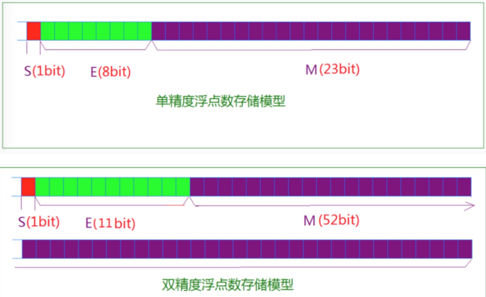

# C语言


https://tool.oschina.net/commons?type=4

| ASCII值 | 控制字符 | ASCII值 | 控制字符 | ASCII值 | 控制字符 | ASCII值 | 控制字符 |
| :------ | :------- | :------ | :------- | :------ | :------- | :------ | :------- |
| 0       | NUT      | 32      | (space)  | 64      | @        | 96      | 、       |
| 1       | SOH      | 33      | !        | 65      | A        | 97      | a        |
| 2       | STX      | 34      | "        | 66      | B        | 98      | b        |
| 3       | ETX      | 35      | #        | 67      | C        | 99      | c        |
| 4       | EOT      | 36      | $        | 68      | D        | 100     | d        |
| 5       | ENQ      | 37      | %        | 69      | E        | 101     | e        |
| 6       | ACK      | 38      | &        | 70      | F        | 102     | f        |
| 7       | BEL      | 39      | ,        | 71      | G        | 103     | g        |
| 8       | BS       | 40      | (        | 72      | H        | 104     | h        |
| 9       | HT       | 41      | )        | 73      | I        | 105     | i        |
| 10      | LF       | 42      | *        | 74      | J        | 106     | j        |
| 11      | VT       | 43      | +        | 75      | K        | 107     | k        |
| 12      | FF       | 44      | ,        | 76      | L        | 108     | l        |
| 13      | CR       | 45      | -        | 77      | M        | 109     | m        |
| 14      | SO       | 46      | .        | 78      | N        | 110     | n        |
| 15      | SI       | 47      | /        | 79      | O        | 111     | o        |
| 16      | DLE      | 48      | 0        | 80      | P        | 112     | p        |
| 17      | DCI      | 49      | 1        | 81      | Q        | 113     | q        |
| 18      | DC2      | 50      | 2        | 82      | R        | 114     | r        |
| 19      | DC3      | 51      | 3        | 83      | S        | 115     | s        |
| 20      | DC4      | 52      | 4        | 84      | T        | 116     | t        |
| 21      | NAK      | 53      | 5        | 85      | U        | 117     | u        |
| 22      | SYN      | 54      | 6        | 86      | V        | 118     | v        |
| 23      | TB       | 55      | 7        | 87      | W        | 119     | w        |
| 24      | CAN      | 56      | 8        | 88      | X        | 120     | x        |
| 25      | EM       | 57      | 9        | 89      | Y        | 121     | y        |
| 26      | SUB      | 58      | :        | 90      | Z        | 122     | z        |
| 27      | ESC      | 59      | ;        | 91      | [        | 123     | {        |
| 28      | FS       | 60      | <        | 92      | \        | 124     | \|       |
| 29      | GS       | 61      | =        | 93      | ]        | 125     | }        |
| 30      | RS       | 62      | >        | 94      | ^        | 126     | `        |
| 31      | US       | 63      | ?        | 95      | _        | 127     | DEL      |

| NUL空        | VT 垂直制表   | SYN 空转同步  |
| ------------ | ------------- | ------------- |
| STX 正文开始 | CR 回车       | CAN 作废      |
| ETX 正文结束 | SO 移位输出   | EM 纸尽       |
| EOY 传输结束 | SI 移位输入   | SUB 换置      |
| ENQ 询问字符 | DLE 空格      | ESC 换码      |
| ACK 承认     | DC1 设备控制1 | FS 文字分隔符 |
| BEL 报警     | DC2 设备控制2 | GS 组分隔符   |
| BS 退一格    | DC3 设备控制3 | RS 记录分隔符 |
| HT 横向列表  | DC4 设备控制4 | US 单元分隔符 |
| LF 换行      | NAK 否定      | DEL 删除      |


## 名词

#### EOF

它是end of file的缩写，表示"文字流"（stream）的结尾。这里的"文字流"，可以是文件（file），也可以是标准输入（stdin）。

EOF不是特殊字符，而是一个定义在头文件stdio.h的常量，一般等于-1。


## 类型转换


```c
// 整形转字符 
hexoutput[i] = input % 16 + '0';
char b = （char）i; //这种转换只能得到对应的ascII码；i=97,b=a
//小数默认double类型
3.14  //(double)
3.14f //(float)

// 字符串与字符
"a"  //字符串，俩字节
'a'  //字符，一字节
```


## 标准库

系统调用与库函数

- 系统调用由系统直接编译
- 库函数需要调用头文件

### 预定义的宏

1. `__FILE__`：当前源文件的文件名（包含路径，如果编译器支持）。

2. `__LINE__`：当前源代码行号。

3. `__DATE__`：编译时的日期，格式为 "Day Mon DD HH:MM:SS YYYY\n"，例如 "Mar 31 21:49:08 2023\n"。

4. `__TIME__`：编译时的时间，格式为 "HH:MM:SS"，例如 "21:49:08"。

5. `__STDC__`：如果编译器遵循C标准，则此宏定义为1。

6. `__STDC_VERSION__`：表示编译器遵循的C语言标准版本（如果编译器遵循C99或更新的标准）。

7. `__func__`（非`__FUNCTION__`）：ISO C99标准引入的宏，表示当前函数的名称。注意，不是所有的编译器都支持`__FUNCTION__`，但`__func__`是被广泛支持的。

8. `__cplusplus`：在C++程序中定义，但在C程序中未定义。这可以用于在C和C++的混合代码库中区分编译单元。

9. 编译器特定的预定义宏：某些编译器可能会定义一些特定的宏来标识它们自己、版本信息、目标平台等。例如，GCC编译器定义了`__GNUC__`、`__GNUC_MINOR__`、`__GNUC_PATCHLEVEL__`等宏来表示GCC的版本。

10. 架构和平台相关的宏：这些宏取决于编译的目标架构和平台。例如，`__x86_64__`、`__i386__`、`__arm__`、`__aarch64__`等宏用于标识不同的处理器架构。

11. ```c
    void func(int SingNum)
    {
        // test.c-func-8-2
        printf("%s-%s-%d-%d\n" , __FILE__ , __func__ , __LINE__ , SingNum );
    }
    ```

    


### stdio.h

#### 输出

 嵌入式全缓冲与行缓冲  https://blog.csdn.net/k346k346/article/details/63259524

https://blog.csdn.net/K346K346/article/details/52252626

| specifier    |                           | 输出                                                     |
| :----------- | ------------------------- | :------------------------------------------------------- |
| hd           |                           | (half)短                                                 |
| d 或 i       |                           | 有符号十进制整                                           |
| ld           | sizeof()                  |                                                          |
| lld          |                           |                                                          |
| f            | float                     | 十进制浮点数                                             |
| lf           | double                    |                                                          |
| Lf           | 长双精度                  |                                                          |
| 6.1f         |                           | 右边对其并占用宽度为6，保留一位的小数的浮点数            |
| o            |                           | 有符号八进制                                             |
| #o           |                           | 输出有0前缀的8进制数                                     |
| x（深度为8） |                           | 无符号十六进制整数                                       |
| X            |                           | 无符号十六进制整数（大写字母）                           |
| lx           |                           | 长无符号十六进制                                         |
| #x           |                           | 输出有0x前缀的十六进制数                                 |
| u            |                           | 无符号十进制整数                                         |
| lu           |                           | 长无符号                                                 |
| p            | *                         | 指针地址                                                 |
| zu           | size_t                    | `%zu` 是输出`size_t`类型的格式控制符，用于`printf`函数中 |
| %            |                           | 字符                                                     |
| e            |                           | 使用 e 字符的科学科学记数法（尾数和指数）                |
| E            |                           | 使用 E 字符的科学科学记数法（尾数和指数）                |
| g            |                           | 自动选择 %e 或 %f 中合适的表示法                         |
| G            |                           | 自动选择 %E 或 %f 中合适的表示法                         |
| n            |                           | 无输出                                                   |
| m            | 打印errno值对应的出错内容 | printf("%m\n");                                          |

| 字符 |        |        |                  |
| :--- | ------ | ------ | :--------------- |
| c    | char   | ’a‘    | 字符（单字符？） |
| s    | char * | “abcd” | 字符的字符串     |
| 10s  |        |        | 左对齐10个字符串 |
| -10s |        |        | 右对齐10个字符串 |


#### 在内存中存放

IEEE 754 规定：对于32位浮点数，最高的1位是符号位s，接着的8位时指数E，剩下的32位为有效数字M。




#### 输入

```C
scanf();         // 格式化输入函数
fgets();         // 字符串输入函数
getchar();       // 从 stdin 读取下一个字符
```

##### getchar 与putchar

```C
函数原型：
    int getchar(void);// 从 stdin 读取下一个字符    
返回值：
    成功，返回读到字符的ascii值
    失败，返回 EOF
工作原理：//从stdin流中读入一个字符，如果stdin有数据的话不用输入它就可以直接读取，
        //如果没有数据需要人工的输入，但是如果你输了多个字符，以后的getchar()再执行时就会直接从缓冲区中读取了
```

```C
函数原型
	int putchar(int c) ;
作用：
	函数把字符输出到屏幕上，并返回相同的字符。
工作原理：
	这个函数在同一个时间内只会输出一个单一的字符
```

```C
#include <stdio.h>
 
int main( )
{
   int c;
 
   printf( "Enter a value :");
   c = getchar( ); //为什么这个输入值也会打印出啦
 
   printf( "\nYou entered: ");
   putchar( c );
   printf( "\n");
   return 0;
}
```

> Enter a value :runoob
>
> You entered: r

##### scanf 与 printf

```c
i=0
printf("%d,%d,%d,%d\n",++i,i++,++i,i++); // 从右往左执行，跟栈的先进后出有关
4,2,4,0
    
scanf("%[^\n]",buffer); // 读取一行输入，直到遇到换行符
```


读写原则：

1. 检测缓冲区是否空，空则写如数据，Enter后读取数据，遇到空则此次读取完成；
2. scanf2：检测缓冲区不为空，直接跳过输入并读取缓冲区数据。


```C
// 键盘输入 > 输入缓冲区 > 
函数原型：
    int scanf(const char *format, ...);        // 格式化输入函数  空格 匹配结束
参数：
    format --- 有一定格式要求的字符串
    ...    --- 根据在format里格式控制符书写 指针
返回值：
    成功，返回成功匹配的项目数量
    失败，EOF

 // 输出到stdout
 函数原型：
    int printf(const char *format, ...) 函数把输出写入到标准输出流 stdout ，并根据提供的格式产生输出。
```

```C
#include <stdio.h>
int main( ) {
 
   char str[100];
   int i;
 
   printf( "Enter a value :");
   scanf("%s %d", str, &i); //为什么可以直接将输入输出
 
   printf( "\nYou entered: %s %d ", str, i);
   printf("\n");
   return 0;
}
```

> Enter a value :runoob 123
>
> You entered: runoob 123 

##### fgets 与fputs

gets会出现警告

```C
函数原型：
    char *fgets(char *s, int size, FILE *stream);  // 字符串输入函数  
参数：
    s      --- 存储读到的内容（字符类型的数组）
    size   ---  设置读取的长度（读取数据的字节大小）（会在末尾添加'\0',读取到'\n'会停止读取）
    stream --- 从哪个文件读取（如果是键盘输入的话，可以固定写成stdin）
返回值：
    成功，返回s的地址
    失败，返回 NULL
    
函数原形：
    int fputs(const char *str, FILE *stream);
参数：
    str -- 一个数组，包含了要写入的以空字符终止的字符序列。
	stream -- 这是指向 FILE 对象的指针，该 FILE 对象标识了要被写入字符串的流。（要是打印出来直接stdou）
功能：
    从*str指向的固定数据，写入到stream中，如果stream为stdou则直接打印出来。
```

```C
/*代码实现01_使用fputs函数打印输出*/
#include <stdio.h>

int main () {
    char nameA[] = "hel";

    // char nameA[] = "hello world";
    fgets(nameA, sizeof(nameA), stdin); //stdin 意思是键盘输入
    fputs(nameA, stdout); //stdout 意思是通过打印设备输出
    return 0;
}

/*代码实现02_使用printf函数打印输出*/
#include <stdio.h>

int main ( ) {
　　char name[20] = { 0 };
　　fgets(name, sizeof(name), stdin); //stdin 意思是键盘输入
　　printf("%s", name); //这边输出不需要 \n 了，实际操作时，fgets会认为用户输入的回车也是字符串的一部分内容。即输出的内容中间接地带了 \n 了。
　　return 0;
}
```


### stdlib.h

#### malloc 与 free


```C
(type*)malloc(size)  // (type*) 类型转换
free();

realloc(); //重新分配
```

**动态内存分配** ：**顺序表**实现思想

1. 定义结构体 - 结构体变量 —— 系统在系统在（栈区？）存放结构体成员名，（成员必须有一个指针，因为要动态分配内存，且是一个顺序表）。
2. 结构体成员初始化 - 方法：单独一个函数，开辟堆内存空间，初始化必要的成员值。
3. 访问结构体成员 - 方法：声明一个指针 指向 结构体成员指针 指向的地址 —— 每一个地址存放所有成员信息。
4. 动态改变数组长度 - 方法：结构体成员指针重新指向程序员开辟的一片堆内存。（这个过程中需要完成所有数据的复制）
5. 释放原来分配的结构体的堆内存。
6. 注意：结构体实现链表，其成员的特点。 


### limits.h 整型

```C
#include <stdio.h>
#include <limits.h>
 
int main()
{
   printf("int 存储大小 : %lu \n", sizeof(int));
   
   return 0;
}
```


### serno.h 

#### errno

```c
#include <stdio.h>
#include <errno.h>
int main(void)
{
   printf("%d\n", errno);
   return 0;
}
```


### string.h

```

strlen("aaa");返回字符串实际大小-\0
sizeof("aaa");返回字符串实际大小

```

### unistd.h

```c
#include <unistd.h>
void _exit(int status);
```


## 数据类型

#### 其他

|         | 类型         |                | 作用                                                         |      |
| ------- | ------------ | -------------- | ------------------------------------------------------------ | ---- |
| size_t  | 无符号整数   |                | 表示数组、字符串的长度和大小；进行内存分配和其它多种与大小相关的操作的场景 |      |
| ssize_t | 带符号的整数 |                | 返回实际读取或写入的字节数，错误发生则返回-1                 |      |
| off_t   | 带符号的整数 | offset         | 表示位置之前的偏移或者错误值                                 |      |
| FILE    | 结构体       | struct _IO_FIL | 封装了文件的所有必要信息，如文件描述符、缓冲区、错误状态和当前位置指标 |      |

`size_t`是一个在 C/C++ 语言中用来表示大小的**无符号整数**类型。通常用于表示数组、字符串的长度和大小，以及进行内存分配和其它多种与大小相关的操作的场景。因为它是无符号的，`size_t` 的值总是非负的。

`ssize_t` 是一个**带符号的整数**类型，因此它可以存储负数值，这通常用于表示错误或异常（对于 `read()` 和 `write()` 系统调用，`ssize_t` 用于返回实际读取或写入的字节数，如果有错误发生则返回-1。

`off_t` 是一个在 Unix 和类 Unix 系统中用于文件尺寸和位置的数据类型。它通常用来表示文件内容的偏移量或大小。`off_t` 是一个带符号的整数类型，允许它表示位置之前的偏移或者错误值

`FILE` 是一个用于处理文件操作的结构体数据类型。它提供了一个抽象来管理文件流的读取、写入、定位和其他操作。`FILE` 结构体封装了文件的所有必要信息，如文件描述符、缓冲区、错误状态和当前位置指标。


#### 整型

而正确答案是：C99标准并未指定 char 类型是有符号还是无符号，这取决实现（编译器和硬件平台）。具体可以通过查看`limits.h`头文件中 CHAR_MIN 的值来确认，如果 CHAR_MIN 为 0 则说明 char 类型被当作无符号整型。

| 整型：类型     | 存储大小    | 值范围                                   |
| :------------- | :---------- | :--------------------------------------- |
| char           | 1 字节      | -128 到 127 或 0 到 255                  |
| unsigned char  | 1 字节      | 0 到 255                                 |
| signed char    | 1 字节      | -128 到 127（-128==1000 0000）           |
| short          | 2 字节      | -32,768 到 32,767     - 2^15 - 1  ~ 2^15 |
| unsigned short | 2 字节      | 0 到 65,535               2^16           |
| int            | 2 或 4 字节 | - 2^31 -1 ~ 2 ^31                        |
| unsigned int   | 2 或 4 字节 | 0 到 65,535 或 0 到 4,294,967,295        |
| long           | 4 字节      | -2,147,483,648 到 2,147,483,647          |
| unsigned long  | 4 字节      | 0 到 4,294,967,295                       |
| size_t         | 跟随系统    | 无符号                                   |

| 浮点：类型  | 存储大小 | 值范围                             | 精度                 |
| :---------- | :------- | :--------------------------------- | :------------------- |
| float       | 4 字节   | 1.2E-38 到 3.4E+38<br />8位指数    | 6 位有效位<br />23位 |
| double      | 8 字节   | 2.3E-308 到 1.7E+308<br />11位指数 | 15 位有效位<br />53  |
| long double | 16 字节  | 3.4E-4932 到 1.1E+4932             | 19 位有效位          |

| 1bit（符号位） | 8bits（指数位）  | 23bits（尾数位） |
| -------------- | ---------------- | ---------------- |
| 1bit（符号位） | 11bits（指数位） | 52bits（尾数位） |

```C
#include <stdio.h>
#include <limits.h>
 
int main()
{
   printf("int 存储大小 : %lu \n", sizeof(int));
   
   return 0;
}
```

表达式 *sizeof(type)* 得到对象或类型的存储字节大小。

#### 浮点


```C
#include <stdio.h>
#include <float.h>
 
int main()
{
   printf("float 存储最大字节数 : %lu \n", sizeof(float));
   printf("float 最小值: %E\n", FLT_MIN );
   printf("float 最大值: %E\n", FLT_MAX );
   printf("精度值: %d\n", FLT_DIG );
   
   return 0;
}
```

> float 存储最大字节数 : 4 
> float 最小值: 1.175494E-38
> float 最大值: 3.402823E+38
> 精度值: 6

#### void 类型

void 类型指定没有可用的值。它通常用于以下三种情况下：

| 序号          | 类型与描述                                                   |
| :------------ | :----------------------------------------------------------- |
| 函数返回为空  | C 中有各种函数都不返回值，或者您可以说它们返回空。不返回值的函数的返回类型为空。例如 **void exit (int status);** |
| 函数参数为空  | C 中有各种函数不接受任何参数。不带参数的函数可以接受一个 void。例如 **int rand(void);** |
| 指针指向 void | 类型为 void * 的指针代表对象的地址，而不是类型。例如，内存分配函数 **void \*malloc( size_t size );** 返回指向 void 的指针，可以转换为任何数据类型。 |

#### 类型转换

类型转换是将一个数据类型的值转换为另一种数据类型的值。

C 语言中有两种类型转换：

- **隐式类型转换：**隐式类型转换是在表达式中自动发生的，无需进行任何明确的指令或函数调用。它通常是将一种较小的类型自动转换为较大的类型，例如，将int类型转换为long类型或float类型转换为double类型。隐式类型转换也可能会导致**数据精度丢失或数据截断**。
- **显式类型转换：**显式类型转换需要使用强制类型转换运算符（type casting operator），它可以将一个数据类型的值强制转换为另一种数据类型的值。强制类型转换可以使程序员在必要时对数据类型进行更精确的控制，但也可能会导致数据丢失或截断。

```C
int i = 10;
float f = 3.14;
double d = i + f; // 隐式将int类型转换为double类型
```

```C
double d = 3.14159;
int i = (int)d; // 显式将double类型转换为int类型
```

指针指向地址，将地址转换成整形地址

```c
float a = 3.5;
double b = 7.5;
// int c = int(a);

printf("a = %x\n", *(int*)&a);
3.5
0-1000 0000-110000000000000000
```


##### 字符与数字转换

```C
#include <ctype.h>
isalpha(char[i]) //判断字母
isdigit(char[i]) //判断数字
    
#include <stdlib.h>
atio(char)	//字符型数字转整形（遇到非数字停止转换）
```

//输入字符的决断

1. 字符串长短判断
2. 字符串数字与字母的判断
3. 字符串转数字（不是字符转字数字）

字符常量是括在单引号中，例如，'x' 可以存储在 **char** 类型的简单变量中。

字符常量可以是一个普通的字符（例如 'x'）、一个转义序列（例如 '\t'），或一个通用的字符（例如 '\u02C0'）。

在 C 中，有一些特定的字符，当它们前面有反斜杠时，它们就具有特殊的含义，被用来表示如换行符（\n）或制表符（\t）等。

```C
char myChar = 'a';
int myAsciiValue = (int) myChar; // 将 myChar 转换为 ASCII 值 97

// 数字、字母，all
isdigit();
isalpha();
isalnum();
```

#### 字符串常量

字符串字面值或常量是括在双引号 **" "** 中的。一个字符串包含类似于字符常量的字符：普通的字符、转义序列和通用的字符。

您可以使用空格做分隔符，把一个很长的字符串常量进行分行。

下面的实例显示了一些字符串常量。下面这三种形式所显示的字符串是相同的。

```C
"hello, dear"
    
"hello, \
dear"

"hello, " "d" "ear"
```

```C
// 字符串常量在内存中以 null 终止符 \0 结尾。
char myString[] = "Hello, world!"; //系统对字符串常量自动加一个 '\0'
```

#### 定义常量

```C
#define MAX = 3;
const int MAX = 3;
```

| 定义常量方式 | #define                                        | const                                              |
| ------------ | ---------------------------------------------- | -------------------------------------------------- |
| 数据类型     | 定义一个常量                                   | 定义的常量具有类型信息，声明一个**具有类型的常量** |
| 类型检查     | 不进行类型检查(只进行文本替换)                 | 进行类型检查                                       |
| 作用域       | 没有作用域限制（在定义之后的整个代码中都有效） | 只在其定义所在的作用域内有效                       |
| 调试和符号表 | 无                                             | 在符号表中有相应的条目，有助于调试和可读性         |
|              |                                                |                                                    |
| 意义？       |                                                |                                                    |


#### typedef

```C
typedef unsigned char BYTE;  //为类型取一个新的名字

BYTE  b1, b2; //在这个类型定义之后，标识符 BYTE 可作为类型 unsigned char 的缩写

typedef unsigned char byte; //按照惯例，定义时会大写字母，以便提醒用户类型名称是一个象征性的缩写，但您也可以使用小写字母
```


#### typeof

**前言：**
  typeof关键字是C语言中的一个新扩展，这个特性在linux内核中应用非常广泛。

**一，说明**
  typeof的参数可以是两种形式：**表达式**或**类型**。

  **1，****表达式的的例子：**
    typeof(x[0](1)
    这里假设x是一个函数指针数组，这样就可以得到这个函数返回值的类型了。
    如果将typeof用于表达式，则该表达式不会执行。只会得到该表达式的类型。
    以下示例声明了int类型的var变量，因为表达式foo()是int类型的。由于表达式不会被执行，所以不会调用foo函数。
      extern int foo();
      typeof(foo()) var;

  **2，****参数的例子：**
    typeof(int *) a,b;
      等价于：
      int *a,*b;


**二，实例**
  1，把y定义成x指向的数据类型：
      typeof(*x) y;
  2，把y定义成x指向数据类型的数组：
      typeof(*x) y[4];
  3，把y定义成一个字符指针数组：
      typeof(typeof(char *)[4] y;
  这与下面的定义等价：
      char *y[4];

  4，typeof(int *) p1,p2; /* Declares two int pointers p1, p2 */
      int *p1, *p2;

  5，typeof(int) *p3,p4;/* Declares int pointer p3 and int p4 */
      int *p3, p4;

  6，typeof(int [10]) a1, a2;/* Declares two arrays of integers */
      int a1[10], a2[10];


**三****，局限**
  typeof构造中的类型名**不能**包含存储类说明符，如**extern**或**static**。不过允许包含类型限定符，如**const**或**volatile**。
  例如，下列代码是无效的，因为它在typeof构造中声明了extern：
    typeof(extern int) a;


#### 转义

| 转义序列   | 含义                       |
| :--------- | :------------------------- |
| \\         | \ 字符                     |
| \'         | ' 字符                     |
| \"         | " 字符                     |
| \?         | ? 字符                     |
| \a         | 警报铃声                   |
| \b         | 退格键                     |
| \f         | 换页符                     |
| \n         | 换行符                     |
| \r         | 回车                       |
| \t         | 水平制表符                 |
| \v         | 垂直制表符                 |
| \ooo       | 一到三位的八进制数         |
| \xhh . . . | 一个或多个数字的十六进制数 |


## 变量

#### 局部变量和全局变量

https://blog.csdn.net/smstong/article/details/50517097

- **局部变量**指的是**定义在{}**中的变量，其作用域也在这个范围内。虽然常见的局部变量都是定义在函数体内的，也完全可以人为的增加一对大括号来限定变量作用域。
- **全局变量**的作用域是整个工程，也就是在**所有参与链接**的文件中都是可见的。
  C++看到了这种需要，所以索性把这些状态数据和算法函数绑定到了一起，形成了**类**的概念，从而简化了代码设计。

```C
void f() {
    float x = 0; {
        int a;
    }
}
```

注意：

==C++编译器对const常量会自动增加static关键字，使其作用域为文件级别。而C语言编译器则不会。==
使用C++编译器可以顺利编译链接成功，但是使用C编译器则在连接时报错。为了代码的可移植性，最好还是手动把 static const都写上。

**初始化局部变量和全局变量**

| 数据类型 | 由系统初始化后的默认值<br />局部非静态变量 不会 被系统初始化，必须自行对其初始化<br />局部静态变量和全局变量  会 被系统初始化 |
| :------- | :----------------------------------------------------------- |
| int      | 0                                                            |
| char     | '\0' \是转义字符，告诉编译器这个不是字符0，而是空字符NUL     |
| float    | 0.0 ？                                                       |
| double   | 0.0 ？                                                       |
| pointer  | NULL                                                         |

| 类型   | 描述                                                         |
| :----- | :----------------------------------------------------------- |
| char   | 通常是一个字节（八位）, 这是一个整数类型。                   |
| int    | 整型，4 个字节，取值范围 -2147483648 到 2147483647。         |
| float  | 单精度浮点值。单精度是这样的格式，1位符号，8位指数，23位小数。 |
| double | 双精度浮点值。双精度是1位符号，11位指数，52位小数。 |
| void   | 表示类型的缺失。                                             |

C 语言也允许定义各种其他类型的变量，比如枚举、指针、数组、结构、共用体等等

#### 变量定义

变量定义就是告诉编译器**在何处创建变量的存储**，以及如**何创建变量**的存储。变量定义指定一个数据类型，并包含了该类型的一个或多个变量的列表。

```C
type variable_list; //type 表示变量的数据类型，	可以是整型、浮点型、字符型、指针等，也可以是用户自定义的对象。
```

**变量的初始化**

变量的初始化是在定义变量的同时为其赋予一个初始值。
未初始化的变量的值是未定义的，可能包含任意的垃圾值。

**变量不初始化**

在 C 语言中，如果变量没有显式初始化，那么它的默认值将取决于该变量的类型和其所在的作用域。

对于全局变量和静态变量（在函数内部定义的静态变量和在函数外部定义的全局变量），它们的默认初始值为零。

以下是不同类型的变量在没有显式初始化时的默认值：

- 数组、结构体、联合等复合类型的变量：它们的元素或成员将按照相应的规则进行默认初始化，这可能包括对元素递归应用默认规则。

#### 变量声明

变量声明**向编译器保证变量以指定的类型和名称存在**，这样编译器在不需要知道变量完整细节的情况下也能继续进一步的编译。
变量声明只**在编译时有它的意义**，在程序连接时编译器需要实际的变量声明。

变量的声明有两种情况：

1. 一种是需要建立存储空间的。例如：int a 在声明的时候就已经建立了存储空间。
2. 另一种是不需要建立存储空间的，通过使用extern关键字声明变量名而不定义它。 例如：extern int a 其中变量 a 可以在别的文件中定义的。

```C
// 除非有extern关键字，否则都是变量的定义。
extern int i; //声明，不是定义
int i;        //声明，也是定义
```


```C
#include <stdio.h>
 
// 函数外定义变量 x 和 y
int x;
int y;
int addtwonum()
{
    // 函数内声明变量 x 和 y 为外部变量
    extern int x;
    extern int y;
    // 给外部变量（全局变量）x 和 y 赋值
    x = 1;
    y = 2;
    return x+y;
}
 
int main()
{
    int result;
    // 调用函数 addtwonum
    result = addtwonum();
    
    printf("result 为: %d",result);
    return 0;
}
```

#### C 中的左值（Lvalues）和右值（Rvalues）

C 中有两种类型的表达式：

1. **左值（lvalue）：**指向内存位置的表达式被称为左值（lvalue）表达式。左值可以出现在赋值号的左边或右边。
2. **右值（rvalue）：**术语右值（rvalue）指的是存储在内存中某些地址的数值。右值是不能对其进行赋值的表达式，也就是说，右值可以出现在赋值号的右边，但不能出现在赋值号的左边。

变量是左值，因此可以出现在赋值号的左边。数值型的字面值是右值，因此不能被赋值，不能出现在赋值号的左边。下面是一个有效的语句：

```
int g = 20;
```

但是下面这个就不是一个有效的语句，会生成编译时错误：

```
10 = 20;
```

#### 作用域

```C
// 局部变量和全局变量的名称可以相同，但是在函数内，如果两个名字相同，会使用局部变量值，全局变量不会被使用。
```

> value of g = 10

- 全局变量保存在内存的全局存储区中，占用静态的存储单元；
- 局部变量保存在栈中，只有在所在函数被调用时才动态地为变量分配存储单元。

## 数据存储

https://blog.csdn.net/jirryzhang/article/details/79518408

#### 1. 什么是static?

static 是 C/C++ 中很常用的修饰符，它被**用来控制变量的存储方式和可见性**。、

**作用域：为局部作用域，即当定义它的函数结束的时候，作用域随之结束（不能被访问）。但是静态局部变量在离开作用域之后，并没有被销毁，而是仍然保存在内存当中，直到程序结束。**

1.1 static 的引入

我们知道在函数内部定义的变量，当程序执行到它的定义处时，编译器为它在栈上分配空间，函数在栈上分配的空间在此函数执行结束时会释放掉，这样就产生了一个问题: 如果想将函数中此变量的值保存至下一次调用时，如何实现？ 最容易想到的方法是定义为全局的变量，但定义一个全局变量有许多缺点，最明显的缺点是破坏了此变量的访问范围（使得在此函数中定义的变量，不仅仅只受此函数控制）。static 关键字则可以很好的解决这个问题。

另外，在 C++ 中，需要一个数据对象为整个类而非某个对象服务,同时又力求不破坏类的封装性,即要求此成员隐藏在类的内部，对外不可见时，可将其定义为静态数据。

| ata                                | BSS                              | 全局（静态）存储区                                           |      |
| ---------------------------------- | -------------------------------- | ------------------------------------------------------------ | ---- |
| 存放**初始化的全局变量和静态变量** | 存放未初始化的全局变量和静态变量 | 存储在静态数据区的变量会在程序刚开始运行时就完成有且只有一次的初始化（跟新不受限制），因为任何函数都可调用，所以静态数据成员最好（不能？）在任何函数内分配空间和初始化 |      |
|                                    | 程序运行结束时自动释放           | 程序运行结束时自动释放<br />                                 |      |
|                                    | 在程序执行之前会被系统自动清0    | 静态数据成员只存储一处，供所有对象共用<br />只能在本文件中访问，不能在其它文件中访问，即便是 extern 外部声明也不可以 |      |

**全局（静态）存储区**：分为 DATA 段和 BSS 段。
DATA 段（全局初始化区）存放初始化的全局变量和静态变量；
BSS 段（全局未初始化区）存放未初始化的全局变量和静态变量，程序运行结束时自动释放。
其中BBS段在程序执行之前会被系统自动清0，所以未初始化的全局变量和静态变量在程序执行之前已经为0。
**存储在静态数据区的变量会在程序刚开始运行时就完成初始化，也是唯一的一次初始化。**

这样，它的空间分配有三个可能的地方，

1. 一是作为类的外部接口的头文件，那里有类声明；
2. 二是类定义的内部实现，那里有类的成员函数定义；
3. 三是应用程序的 main() 函数前的全局数据声明和定义处。


静态数据成员要实际地分配空间，故不能在类的声明中定义（只能声明数据成员）。类声明只声明一个类的"尺寸和规格"，并不进行实际的内存分配，所以在类声明中写成定义是错误的。
它也不能在头文件中类声明的外部定义，因为那会造成在多个使用该类的源文件中，对其重复定义。

注意静态成员嵌套时，要保证所嵌套的成员已经初始化了。消除时的顺序是初始化的反顺序。

**优势：**可以节省内存，因为它是所有对象所公有的，因此，对多个对象来说，静态数据成员只存储一处，供所有对象共用。静态数据成员的值对每个对象都是一样，但它的值是可以更新的。只要对静态数据成员的值更新一次，保证所有对象存取更新后的相同的值，这样可以提高时间效率。

#### 2.1 总的来说

- （1）在修饰变量的时候，static 修饰的静态局部变量只执行初始化一次，而且延长了局部变量的生命周期，直到程序运行结束以后才释放。
- （2）static 修饰全局变量的时候，这个全局变量只能在本文件中访问，不能在其它文件中访问，即便是 extern 外部声明也不可以。
- （3）static 修饰一个函数，则这个函数的只能在本文件中调用，不能被其他文件调用。
- （4）不想被释放的时候，可以使用static修饰。比如修饰函数中存放在栈空间的数组。如果不想让这个数组在函数调用结束释放可以使用 static 修饰。

一个由C/C++编译的程序占用的内存分为以下几个部分

####  正解

```c
// 代码很好
int a = 0; // 全局初始化区, 通过extern 可以作用与其他文件
static aa = 0; //只能作用域本文件，即使extern也不能作用与其他文件
 
char *p1; 全局未初始化区 
 
main() 
 
{ 
	int b;// 栈 
	char s[] = "abc"; //"abc"在常量区，s在栈上。 
	char *p2; //栈 
	char *p3 = "123456"; //123456\0";在常量区，p3在栈上。 
	static int c =0； //全局（静态）初始化区 
	p1 = (char *)malloc(10); 
	p2 = (char *)malloc(20); 
	//分配得来得10和20字节的区域就在堆区。 
	strcpy(p1, "123456"); //123456\0放在常量区，编译器可能会将它与p3所指向的"123456"优化成一个地方。 
}
```

1、栈区（stack）— 程序运行时由编译器自动分配，存放函数的参数值，局部变量的值等。

​    其操作方式类似于数据结构中的栈。

2、堆区（heap） — 在内存开辟另一块存储区域。

   一般由程序员分配释放， 若程序员不释放，程序结束时可能由OS回收 。

   注意它与数据结构中的堆是两回事，分配方式倒是类似于链表。

3、全局区（静态区）（static）—编译器编译时即分配内存。

​    全局变量和静态变量的存储是放在一块的，

​    初始化的全局变量和静态变量在一块区域，

​    未初始化的全局变量和未初始化的静态变量在相邻的另一块区域。 

​    \- 程序结束后由系统释放

4、文字常量区 —常量字符串就是放在这里的。 程序结束后由系统释放。

5、程序代码区—存放函数体的二进制代码。
注意：静态局部变量和静态全局变量

属于静态存储方式的量不一定就是静态变量。 

例如：全局变量虽属于静态存储方式，但不一定是静态变量，

​      必须由 static加以定义后才能成为静态外部变量，或称静态全局变量。

把局部变量改变为静态变量后是改变了它的存储方式，即改变了它的生存期。
把全局变量改变为静态变量后是改变了它的作用域，限制了它的使用范围。


- text、data(gvar)、bss 在内存中地址较低低的位置（low level address），而堆栈则在相对较搞的位置。
- 堆(Heap)往高地址方向生长，栈(Stack)往低地址方向生长

#### 再解

在C\C++中，通常可以把内存理解为4个分区：栈、堆、全局/静态存储区和常量存储区。

**栈**

通常是用于那些**在编译期间就能确定存储大小的变量的存储区**，用于在函数作用域内创建，在离开作用域后自动销毁的变量的存储区。通常是局部变量，函数参数等的存储区。他的存储空间是连续的，两个紧密挨着定义的局部变量，他们的存储空间也是紧挨着的。栈的大小是有限的，通常Visual C++编译器的默认栈的大小为1MB，所以不要定义int a[1000000]这样的超大数组。

**堆**

通常是用于那些**在编译期间不能确定存储大小的变量的存储区**，它的存储空间是不连续的，一般由malloc（或new）函数来分配内存块，并且需要用free（delete）函数释放内存。如果程序员没有释放掉，那么就会出现常说的内存泄漏问题。需要注意的是，两个紧挨着定义的指针变量，所指向的malloc出来的两块内存并不一定的是紧挨着的，所以会产生内存碎片。另外需要注意的一点是，堆的大小几乎不受限制，理论上每个程序最大可达4GB。

**全局\静态存储区**

和“栈”一样，通常是用于那些在**编译期间就能确定存储大小的变量的存储区**，但它用于的是在整个程序运行期间都可见的全局变量和静态变量。

**常量存储区**

和“全局/静态存储区”一样，通常是用于那些在编译期间就能确定存储大小的常量的存储区，并且在程序运行期间，存储区内的常量是全局可见的。这是一块比较特殊的存储去，他们里面存放的是常量，不允许被修改。

| 栈                   | 堆                       |                          |
| -------------------- | ------------------------ | ------------------------ |
| 存储内容             | 局部变量                 | 变量                     |
| 作用域               | 函数作用域、语句块作用域 | 函数作用域、语句块作用域 |
| 编译期间大小是否确定 | 是                       | 否                       |
| 大小                 | 1MB                      | 4GB                      |
| 内存分配方式         | 地址由高向低减少         | 地址由低向高增加         |
| 内容是否可以修改     | 是                       | 是                       |

| 全局/静态存储区      | 常量存储区         |      |
| -------------------- | ------------------ | ---- |
| 存储内容             | 全局变量、静态变量 | 常量 |
| 编译期间大小是否确定 | 是                 | 是   |
| 内容是否可以修改     | 是                 | 否   |


l     栈区：主要用来存放局部变量, 传递参数, 存放函数的返回地址。.esp 始终指向栈顶, 栈中的数据越多, esp的值越小。

l     堆区：用于存放动态分配的对象, 当你使用 malloc和new 等进行分配时,所得到的空间就在堆中。动态分配得到的内存区域附带有分配信息, 所以你能够 free和delete它们。

l     数据区：全局，静态和常量是分配在数据区中的，数据区包括bss（未初始化数据区）和初始化数据区。

注意：

1）   堆向高内存地址生长；

2）   栈向低内存地址生长；

3）   堆和栈相向而生，堆和栈之间有个临界点，称为stkbrk。


#### 一个内存在进程中的映射


注意：

l     随着函数调用层数的增加，函数栈帧是一块块地向内存低地址方向延伸的；

l     随着进程中函数调用层数的减少（即各函数调用的返回），栈帧会一块块地被遗弃而向内存的高址方向回缩；

l     各函数的栈帧大小随着函数的性质的不同而不等, 由函数的局部变量的数目决定。

l     未初始化数据区(BSS)：用于存放程序的静态变量，这部分内存都是被初始化为零的；而初始化数据区用于存放可执行文件里的初始化数据。这两个区统称为数据区。

l     Text(代码区)：是个只读区，存放了程序的代码。任何尝试对该区的写操作会导致段违法出错。代码区是被多个运行该可执行文件的进程所共享的。  

l     进程对内存的动态申请是发生在Heap(堆)里的。随着系统动态分配给进程的内存数量的增加，Heap(堆)有可能向高址或低址延伸, 这依赖于不同CPU的实现，但一般来说是向内存的高地址方向增长的。

l     在未初始化数据区（BSS）或者Stack(栈区)的增长耗尽了系统分配给进程的自由内存的情况下，进程将会被阻塞, 重新被操作系统用更大的内存模块来调度运行。

l     函数的栈帧：包含了函数的参数(至于被调用函数的参数是放在调用函数的栈帧还是被调用函数栈帧, 则依赖于不同系统的实现)。函数的栈帧中的局部变量以及恢复该函数的主调函数的栈帧(即前一个栈帧)所需要的数据, 包含了主调函数的下一条执行指令的地址。

注意：

l     BSS区（未初始化数据段）：并不给该段的数据分配空间，仅仅是记录了数据所需空间的大小。

l     DATA（初始化的数据段）：为数据分配空间，数据保存在目标文件中。


代码段、数据段等等概念，它们是各种数据存放的位置。通过objdump -h命令可以查看一个.o文件(已编译成二进制文件但未链接)的各个段：


1. **代码段(.txt)**  
   .txt段存放代码(如函数)与部分整数常量，.txt段的数据可以被执行
2. **数据段(.data)**  
   .data用于存放初始化过的全局变量。若全局变量值为0，为了优化编译器会将它放在.bss段中
3. **bss段(.bss).**
   bss段被用来存放那些没有初始化或者初始化为0的全局变量。**bss段只占运行时的内存空间而不占文件空间**。在程序运行的整个周期内，.bss段的数据一直存在。

  .data和.bss段的区别可以通过下面程序验证：

```
#include <stdio.h>
char global_arr[1024 * 1024]; //存放在.bss段
int main(void)
{
return 0;
}
```

  编译后查看大小： 


  显然，global_arr数组占据的1M空间并没有占据文件空间。将global_arr数组改放在.data段中：

```
char global_arr[1024 * 1024] = {4}; //存放在.data段
```

  编译后查看大小： 
 

   文件变成了1M多，显然.data段上的数据是占据文件空间的。

4. **常量数据段(.rodata)**
     ro表read only，用于存放不可变修改的常量数据，一旦程序中对其修改将会出现段错误： 
        (1) 程序中的常量不一定就放在rodata中，有的立即数和指令编码放在.text中 
        (2) 对于字符串常量，若程序中存在重复的字符串，编译器会保证只存在一个 
        (3) rodata是在多个进程间共享的 
        (4) 有的嵌入式系统，rodata放在ROM(或者NOR FLASH)中，运行时直接读取无需加载至RAM( 哈佛和冯诺依曼，从STM32的const全局变量说起有所记录 https://blog.csdn.net/qq_29344757/article/details/75730054) 
   **想要将数据放在.rodata只需要加上const属性修饰即可。**

5. **栈**
     栈是用于存放临时变量和函数调用的。栈也是一种先进后出的数据结构，函数的递归调用正得益于栈的存在。需注意存在栈的数据只在当前函数和子函数中有效，一旦函数返回数据将会被自动释放。

6. **堆**
     堆的使用周期有使用者控制，程序中的内存泄漏多因程序员对堆的管理不当引起，需谨慎。

7. comment段

在上图中还看到.comment段，它存放的是编译器版本等信息。除了.comment，还有.note、.hash等其他段，了解即可。


## 存储类别

#### auto 自动

auto 存储类是所有**局部变量默认**的存储类。

定义在函数中的变量默认为 auto 存储类，这意味着它们在函数开始时被创建，在函数结束时被销毁。

```c
//定义了两个带有相同存储类的变量，auto 只能用在函数内，即 auto 只能修饰局部变量。
{
   int mount;
   auto int month;
}
```

#### register 寄存器

**register** 存储类用于定义存储在CPU中而不是 RAM 中的局部变量。这意味着变量的最大尺寸等于寄存器的大小（通常是一个字），==且不能对它应用一元的 '&' 运算符（因为它没有内存位置）。==

一般情况下，变量（包括静态存储方式和动态存储方式）的值都是存放在内存中的，当程序用到哪个变量的值时，由控制器发出指令将内存中该变量的值送到计算器中，然后再将计算结果送到内存中存放；但是如果有一些变量使用频繁（如10000次循环，每次循环都要引用某局部变量），则为了减少存取变量所花费的事件，可以将局部变量的值存在CPU的寄存器当中，需要时直接从寄存器中取出参加计算，此时这种变量就叫做 寄存器变量，用关键字 register 声明，如下：

```C
register int f;
```

由于现在计算机的速度越来越快，优化的编译系统能够识别使用频繁的变量，从而将这些变量自动存放在寄存器中，因此实际上用 register 声明变量的必要性不大；

#### static 静态的	

**static** 存储类指示编译器在程序的生命周期内保持局部变量的存在，而不需要在每次它进入和离开作用域时进行创建和销毁。
因此，使用 static 修饰局部变量可以在函数调用之间保持局部变量的值。

static 修饰符也可以应用于全局变量。当 static 修饰全局变量时，会使变量的作用域**限制在声明它的文件内**。
全局声明的一个 static **变量或方法可以被任何函数或方法调用**，只要这些方法出现在跟 static 变量或方法同一个文件中。

**静态变量在程序中只被初始化一次，即使函数被调用多次，该变量的值也不会重置。**

#### extern 外部的

extern 存储类用于**定义在其他文件中声明的全局变量或函数**。当使用 extern 关键字时，不会为变量分配任何存储空间，而只是指示编译器该变量在其他文件中定义。

**extern** 存储类用于提供一个全局变量的引用，全局变量对所有的程序文件都是可见的。当您使用 extern 时，对于无法初始化的变量，会把变量名指向一个之前定义过的存储位置。

当您有多个文件且定义了一个可以在其他文件中使用的全局变量或函数时，可以在其他文件中使用 extern来得到已定义的变量或函数的引用。可以这么理解，*extern* 是用来在另一个文件中声明一个全局变量或函数。

```C
#include <stdio.h>
 
int count ;
extern void write_extern();
 
int main()
{
   count = 5;
   write_extern();
}
```

```c
#include <stdio.h>
 
extern int count;
 
void write_extern(void)
{
   printf("count is %d\n", count);
}
```

> count is 5

## 运算符

c语言中0为假，非0为真

| 位运算符  |            |                                                  |
| --------- | ---------- | ------------------------------------------------ |
| ~         | 按位位反   | 变量中每一个都取反，符号位也取反                 |
| ！        | 逻辑运算符 | ==一个非0 的数 逻辑取反 即为0==，**==!0 = 1==**; |
| & 、\| 、 |            |                                                  |
|           |            |                                                  |


| <<=  | 左移且赋值运算符     | C <<= 2 等同于 C = C << 2 |
| ---- | -------------------- | ------------------------- |
| >>=  | 右移且赋值运算符     | C >>= 2 等同于 C = C >> 2 |
| &=   | 按位与且赋值运算符   | C &= 2 等同于 C = C & 2   |
| ^=   | 按位异或且赋值运算符 | C ^= 2 等同于 C = C ^ 2   |
| \|=  | 按位或且赋值运算符   | C \|= 2 等同于 C = C \| 2 |

| 运算符   | 描述                 | 实例                                 |
| :------- | :------------------- | :----------------------------------- |
| sizeof() | 返回变量的字节大小。 | sizeof(a) 将返回 4，其中 a 是整数。  |
| &        | 返回变量的地址。     | &a; 将给出变量的实际地址。           |
| *        | 指向一个变量。       | *a; 将指向一个变量。                 |
| ? :      | 条件表达式           | 如果条件为真 ? 则值为 X : 否则值为 Y |

```C
#include <stdio.h>
 
int main()
{
   int a = 4;
   short b;
   double c;
   int* ptr;
 
   /* sizeof 运算符实例 */
   printf("Line 1 - 变量 a 的大小 = %lu\n", sizeof(a) );
   printf("Line 2 - 变量 b 的大小 = %lu\n", sizeof(b) );
   printf("Line 3 - 变量 c 的大小 = %lu\n", sizeof(c) );
 
   /* & 和 * 运算符实例 */
   ptr = &a;    /* 'ptr' 现在包含 'a' 的地址 */
   printf("a 的值是 %d\n", a);
   printf("*ptr 是 %d\n", *ptr);
 
   /* 三元运算符实例 */
   a = 10;
   b = (a == 1) ? 20: 30;
   printf( "b 的值是 %d\n", b );
 
   b = (a == 10) ? 20: 30;
   printf( "b 的值是 %d\n", b );
}
```

> Line 1 - 变量 a 的大小 = 4
> Line 2 - 变量 b 的大小 = 2
> Line 3 - 变量 c 的大小 = 8
> a 的值是 4
> *ptr 是 4
> b 的值是 30
> b 的值是 20

### 优先级

- i++ 和 ++i都是带返回值的函数；
- i++返回的是数值，在计算的时候会额外产生一个变量；
- ++i 返回的是指针；

### 异或


### 位运算符

```c
// 移位运算符与位运算符
#include <stdio.h>

void printBinary(char c) {
    for (int i = 7; i >= 0; i--) {
        putchar((c & (1 << i)) ? '1' : '0');
    }
    putchar('\n');
}

int main() {
    char inputa;

    printf("Enter a character: ");
    scanf("%c",&inputa);
    printf("You entered: %c,%d\n",inputa,inputa);

    printBinary(inputa);
    return 0;
}
```


| 类别       | 运算符                                               | 结合性       |
| :--------- | :--------------------------------------------------- | :----------- |
| 后缀       | () [] -> . ++ - - （取值运算符优先级好像仅次于括号） | 从左到右     |
| 一元       | + - ! ~ ++ - - (type)* & sizeof                      | **从右到左** |
| 乘除       | * / %                                                | 从左到右     |
| 加减       | + -                                                  | 从左到右     |
| 移位       | << >>                                                | 从左到右     |
| 关系       | < <= > >=                                            | 从左到右     |
| 相等       | == !=                                                | 从左到右     |
| 位与 AND   | &                                                    | 从左到右     |
| 位异或 XOR | ^                                                    | 从左到右     |
| 位或 OR    | \|                                                   | 从左到右     |
| 位非       | ~                                                    | 每位区反     |
| 逻辑与 AND | &&                                                   | 从左到右     |
| 逻辑或 OR  | \|\|                                                 | 从左到右     |
| 条件       | ?:                                                   | **从右到左** |
| 赋值       | = += -= *= /= %=>>= <<= &= ^= \|=                    | **从右到左** |
| 逗号       | ,                                                    | 从左到右     |

## 循环

Switch（【整形】）（整形（字符型、枚举））

case

每个 `case` 语句末尾都需要使用 `break` 关键字来避免执行其他 `case` 的代码块。如果忘记添加 `break`，程序会继续执行下一个 `case` 的代码块，直到遇到 `break` 或者 `switch` 语句结束为止。

```C
break;
continue;

if(0为假，非0为真)
    
    
```


## 函数

- 函数声明告诉编译器函数的名称、返回类型和参数。
- 函数定义提供了函数的实际主体。
- C语言函数不能返回俩个值，只能使用指针或结构体

| 调用类型                                                     | 描述                                                         |
| :----------------------------------------------------------- | :----------------------------------------------------------- |
| [传值调用](https://www.runoob.com/cprogramming/c-function-call-by-value.html) | 该方法把参数的实际值复制给函数的形式参数。在这种情况下，修改函数内的形式参数不会影响实际参数。 |
| [引用调用](https://www.runoob.com/cprogramming/c-function-call-by-pointer.html) | 通过指针传递方式，形参为指向实参地址的指针，当对形参的指向操作时，就相当于对实参本身进行的操作。 |

### 时间函数

```c
#include<stdio.h>
#include<time.h>

time_t time()
```


### 变参函数

```c
#include <stdio.h>
#include <stdarg.h>
 
double average(int num,...)
{
    // 边长参数列表
    va_list valist;         // 定义一个 va_list 类型的变量 
    double sum = 0.0;
    int i;
    // printf("%s\n",valist);
 
    va_start(valist, num);  // 为 num 个参数初始化 valist ,用于访问变参
    
   // va_arg 宏的主要功能是从 va_list 中提取下一个参数。
	//它依赖于 va_list 的内部指针，计算参数的大小和对齐。
    for (i = 0; i < num; i++) {
        printf("i= %d; data = %d\n", i,va_arg(valist, int));
    }

    va_start(valist, num); 
    for (i = 0; i < 4; i++) {
        sum += va_arg(valist, int); // va_arg 用于从 va_list 中获取下一个参数，并返回，如果没有可获取的值返回-1
    }
    
    va_end(valist);         // 清理 va_list保留的内存 
 
    return sum;
}
 
int main()
{
   printf("Average of 2, 3, 4, 5 = %f\n", average(4, 2,3,4,5));
   printf("Average of 5, 10, 15 = %f\n", average(3, 5,10,15));
}
```

#### 不同类型变参

```c
#include <stdarg.h>
#include <stdio.h>
#include <stdlib.h>

int sum(const char *format, ...) {
    va_list args;
    int total = 0;
    int current_int;
    double current_double;
    char *current_str;

    va_start(args, format); // 初始化 va_list 变量，用于访问变参
	
    // 里面有一个指针，va_arg每次根据 指针指向的地址 进行访问
    for (const char *p = format; *p != '\0'; p++) {
        if (*p == '%') {
            p++; // 跳过百分号
            switch (*p) {
                case 'i':  // 整数类型
                    current_int = va_arg(args, int);
                    total += current_int;
                    break;
                case 'd':  // 双精度浮点数类型
                    current_double = va_arg(args, double);
                    // 如果需要对double进行处理，可以在此处进行操作
                    break;
                case 's':  // 字符串类型
                    current_str = va_arg(args, char *);
                    // 如果需要对字符串进行处理，可以在此处进行操作
                    break;
                default:
                    fprintf(stderr, "Unknown format specifier: %c\n", *p);
                    va_end(args);
                    return -1;
            }
        }
    }

    va_end(args);
    return total;
}

int main() {
    int sum1 = sum("%i%i%d%s%i", 1, 2, 4.5, "Hello", 3); // 1 + 2 + 3 = 6
    printf("Sum: %d\n", sum1);

    int sum2 = sum("%i%i%s", 4, 5, "World"); // 4 + 5 = 9
    printf("Sum: %d\n", sum2);

    return 0;
}
```

#### 变参的简单宏实现

```c
// 一个典型的 va_arg 宏实现的简化版本

// 假设 va_list 是一个指向栈上参数的指针
typedef char* va_list;

// 获取参数大小并进行对齐（假设所有参数对齐到(int)4字节边界）
#define _INTSIZEOF(n) ((sizeof(n) + sizeof(int) - 1) & ~(sizeof(int) - 1))
/*	1._INTSIZEOF(n) 的目的是计算某类型 n 的大小，并向上对齐到 int 的边界。
	2.这种对齐确保了在可变参数列表中正确地处理每个参数，以避免对齐问题。
	3.通过将 sizeof(n) 加上 sizeof(int) - 1 并与掩码 ~(sizeof(int) - 1) 进行与操作，可以确保结果是 int 大小的倍数。
*/

// 初始化 va_list 变量 ap，使其指向参数 v 之后的第一个可变参数的地址。////（v传入的第一个值）
#define va_start(ap, v) (ap = (va_list)&v + _INTSIZEOF(v))
//v 是传递给宏的最后一个固定参数, &v 是最后一个已知的固定参数 v 的地址。
//(va_list) 是一个类型转换; _INTSIZEOF(v) 计算参数 v 的对齐后的大小。这个大小确保了参数之间的对齐是正确的。 

// 获取下一个参数，并将 ap 移动到下一个参数的位置////（t数据类型）
#define va_arg(ap, t) (* (t *) ( (ap += _INTSIZEOF(t)) - _INTSIZEOF(t)))
// 将计算出的地址(0x01)转换为类型 t 的指针。 再解引用这个指针，得到类型 t 的参数值。


// 清理 va_list（在一些平台上可能不需要执行任何操作）
#define va_end(ap) (ap = (va_list)0)
// 将 0 转换为 va_list 类型，并将 ap 设置为这个值。某些平台可能会有不同的实现，但大多数情况下，只是将 ap 设置为一个无效值。
```

```scss
// 假设 int 是 4 字节，并且函数参数在栈上从高地址到低地址排列。内存布局可能如下
+------+------------------+
| 地址 | 内容             |
+------+------------------+
| 0x10 | 返回地址         |
| 0x0C | 40 (可变参数3)   |
| 0x08 | 30 (可变参数2)   |
| 0x04 | 20 (可变参数1)   |
| 0x00 | 10 (固定参数 fixed)|
+------+------------------+
```


#### vfprintf

```c
#include <stdio.h>
#include <stdarg.h>

char buffer[80];
int vspfunc(char *format, ...)
{
   va_list aptr;
   int ret;

   va_start(aptr, format);
   ret = vsprintf(buffer, format, aptr);
   va_end(aptr);

   return(ret);
}

int main()
{
   int i = 5;
   float f = 27.0;
   char str[50] = "runoob.com";

   vspfunc("%d %f %s", i, f, str);
   printf("%s\n", buffer);
   
   return(0);
}
```


#### vprintf

```c
#include <stdio.h>
#include <stdarg.h>

void WriteFrmtd(char *format, ...)
{
   va_list args;
   
   va_start(args, format);
   vprintf(format, args);
   va_end(args);
}

int main ()
{
   WriteFrmtd("%d variable argument\n", 1);
   WriteFrmtd("%d variable %s\n", 2, "arguments");
   
   return(0);
}
```


### 钩子函数

回调函数

钩子函数（Hook Function）是一种编程技术，用于在软件执行过程中插入自定义的代码。通过钩子函数，开发者可以在特定的事件发生时触发特定的代码，从而实现对程序行为的动态修改或扩展。钩子函数在各种编程语言和框架中都有广泛的应用。

以下是钩子函数的一些关键特点和应用场景：

#### 关键特点

1. **插入点**：钩子函数通常是在某些关键点被调用，比如函数的开始、结束，或者某个事件触发时。
2. **动态性**：通过钩子函数，程序的行为可以在运行时动态地改变，而不需要修改原始代码。
3. **可扩展性**：钩子函数提供了一种机制，使得第三方开发者或插件能够扩展原有软件的功能。
4. **解耦**：使用钩子函数可以减少代码之间的耦合度，使代码更加模块化和易于维护。

#### 应用场景

1. **操作系统内核**：操作系统内核使用钩子函数来处理系统调用，设备驱动程序等。例如，Linux 内核中的 Netfilter 框架使用钩子来处理网络数据包。
2. **Web 开发**：在 Web 开发中，钩子函数常用于框架和库中。例如，Django 框架中的信号机制允许开发者在模型保存前后执行自定义代码。
3. **GUI 应用程序**：在 GUI 应用程序中，钩子函数常用于处理用户输入事件，如按键和鼠标点击。
4. **嵌入式系统**：在嵌入式系统中，钩子函数可以用来处理中断、定时器事件等，从而实现对硬件的控制和管理。


#### 在 C 语言中，

钩子函数可以通过函数指针实现。例如：

```c
#include <stdio.h>

void (*hook_function)(void);  // 声明一个函数指针

void default_function(void) {
    printf("This is the default function.\n");
}

void set_hook(void (*func)(void)) {
    hook_function = func;
}

void call_hook(void) {
    if (hook_function) {
        hook_function();
    } else {
        default_function();
    }
}

void custom_function(void) {
    printf("This is the custom function.\n");
}

int main() {
    call_hook();  // 调用默认函数
    set_hook(custom_function);  // 设置钩子函数
    call_hook();  // 调用钩子函数
    return 0;
}
```

在这个例子中，`set_hook` 函数用于设置自定义的钩子函数，`call_hook` 函数根据是否设置了钩子函数来调用不同的函数。

通过上述例子，可以看出钩子函数在程序设计中的重要性。它们不仅使程序更加灵活和可扩展，还能提高代码的可维护性和重用性。


## 字符串

字符串实际上是使用空字符 **\0** 结尾的一维字符数组。他是一个匿名数组。
**空字符（Null character**）又称结束符，缩写 **NUL**，是一个数值为 **0** 的控制字符，**\0** 是转义字符，意思是告诉编译器，这不是字符 **0**，而是空字符。

```C
char site[7] = {'R', 'U', 'N', 'O', 'O', 'B', '\0'};
 // 依据数组初始化规则，您可以把上面的语句写成以下语句：
char site[] = "RUNOOB";
```


#### 字符串函数

| 序号 | 函数 & 目的                           |                                                              |      |
| :--- | :------------------------------------ | ------------------------------------------------------------ | ---- |
| 复制 | strcpy(s1, s2);<br />strncpy(s1,s2,n) | 复制字符串 s2 到字符串 s1。                                  |      |
| 链接 | strcat(s1, s2);<br />strncat(s1,s2,n) | 连接字符串 s2 到字符串 s1 的末尾。                           |      |
| 3    | strlen(s1);<br />sizeof（s1）         | 返回字符串 s1 的长度。实际长度，以\0结束<br />所占空间大小。 |      |
| 比较 | strcmp(s1, s2);<br />strncmp(s1,2,n)  | 如果 s1 和 s2 是相同的，则返回 0；如果 s1<s2 则返回小于 0；<br /> |      |
| 5    | strchr(s1, ch);                       | 返回一个指针，指向字符串 s1 中字符 ch 的第一次出现的位置。   |      |
| 6    | strrchr(s1, s2);                      | 返回一个指针，指向字符串 s1 中字符串 s2 的第一次出现的位置。 |      |
| 分割 | strtok（s1,ch)                        | 会对原字符串进行修改，所以不能是指针指向常量。<br />每一次替换之后他会在自己函数内部保存 当前替换字符的位置 |      |

```c
//字符拼接
char *strcpy(char *dest, const char *src);
char *strncpy(char *dest, const char *src, size_t n);
//字符拼接
char *strcat(char *dest, const char *src);
char *strncat(char *dest, const char *src, size_t n);
//字符比较
//会根据 ASCII 编码依次比较 str1 和 str2 的每一个字符，直到出现了不同的字符，或者某一字符串已经到达末尾
int strcmp(const char *s1, const char *s2);
int strncmp(const char *s1, const char *s2, size_t n);
//字符查找
char *strchr(const char *s, int c); //c要查找字符串的assic码
char *strrchr(const char *s, int c);

// 每次调用strtok（）都会返回一个指针，指向一个以null结尾的字符串
char *strtok(char *str, const char *delim);
char *strtok_r(char *str, const char *delim, char **saveptr);
```


```c
#include<stdio.h>
#include<string.h>

// void Input(char inputChar[3][10])
void Input(char* inputChar[])
{
    for (int i=0; i<3; i++) {
        switch (i) {
            case 0: printf("Input username: ") ; scanf("%s",inputChar[i]); break;
            case 1: printf("Input password: ") ; scanf("%s",inputChar[i]); break;
            case 2: printf("Input type: ")     ; scanf("%s",inputChar[i]); break;
            default: break;
        }
    }
    for (int i=0; i<3; i++) {
        printf("%s\n",inputChar[i]);
    }
}

int main()
{
    char ch0[3][20] = {"{username:",",password:",",type:"};

    char inputChar[3][10];
    char* charp[3] = {inputChar[0], inputChar[1], inputChar[2]};

    char str[60];

    // Input(inputChar);
    Input(charp);

    for (int i=0; i<sizeof(ch0)/sizeof(ch0[0]); i++) {
        strcat(ch0[i], inputChar[i]);  // 链接字符串

        strncat(str, ch0[i], strlen(ch0[i]));  
        
        if (i==sizeof(ch0)/sizeof(ch0[0])-1)
            strcat(str, "}");
    }
    printf("%s\n", str);

    return 0;
}
```


#### 字符串转整形 atoi

```c
#include <stdlib.h>

int atoi(const char *nptr);
long atol(const char *nptr);
long long atoll(const char *nptr);

// strtol()、 strtoll()可以实现将多种不同进制数
long int strtol(const char *nptr, char **endptr, int base); //base 36以内的进制
long long int strtoll(const char *nptr, char **endptr, int base); // endptr 常为NULL

// 与 strtol()、strtoll()一样，区别在于返回值的类型不同
unsigned long int strtoul(const char *nptr, char **endptr, int base);
unsigned long long int strtoull(const char *nptr, char **endptr, int base);
```

- endptr： `char **类型的指针， 如果 endptr 不为 NULL，则 strtol()或 strtoll()会将字符串中第一个无效字符的地址存储在*endptr 中`。
  如果根本没有数字， strtol()或 strtoll()会将 nptr 的原始值存储在*endptr 中（并返回 0）。 
  也可将参数 endptr 设置为 NULL，表示不接收相应信息。
- base： 数字基数， 参数 base 必须介于 2 和 36（包含）之间，或者是特殊值 0。 参数 base 决定了字符串转换为整数时合法字符的取值范围，譬如，当 base=2 时，合法字符为' 0 '、 ' 1 '（表示是一个二进制表示的数字字符串） ；当 base=8 时，合法字符为' 0 '、 ' 1 '、 ' 2 '、 ' 3 '……' 7 '（表示是一个八进制表示的数字字符串） ；当 base=16 时，合法字符为' 0 ' 、 ' 1 '、 ' 2 '、 ' 3 '……' 9 '、 ' a '……' f '（表示是一个十六进制表示的数字字符串） ；当 base 大于 10 的时候， ' a '代表 10、 ' b '代表 11、 ' c '代表 12，依次类推， ' z '代表 35（不区分大小写） 。
  在 base=0 的情况下， 如果字符串包含一个了“0x”前缀， 表示该数字将以 16 为基数； 如果包含的是“0”前缀，表示该数字将以 8 为基数。
  当 base=16 时，字符串可以使用“0x”前缀。

- 返回值： 分别返回转换之后得到的 int 类型数据、 long int 类型数据以及 long long 类型数据。
- 目标字符串 nptr 中可以包含非数字字符， 转换时跳过前面的空格字符（如果目标字符串开头存在空格字符） ，直到遇上数字字符或正负符号才开始做转换，而再遇到非数字或字符串结束时(' /0 ')才结束转换，并将结果返回。

```c
#include <stdio.h>
#include <stdlib.h>
#include <string.h>
int main(void)
{
    printf("atoi: %d\n", atoi("-5-a0"));
    printf("atol: %ld\n", atol("50-1"));
    printf("atoll: %lld\n", atoll("+500"));

    printf("strtol: %ld\n", strtol("0xa00", NULL, 16));
    printf("strtol: %ld\n", strtol("0xa00", NULL, 0));
    printf("strtol: %ld\n", strtol("a00", NULL, 16));
    printf("strtol: %ld\n", strtol("777", NULL, 8));
    printf("strtol: %ld\n", strtol("0777", NULL, 8));
    printf("strtol: %ld\n", strtol("0777", NULL, 0));
    printf("strtol: %ld\n", strtol("1111", NULL, 2));
    printf("strtol: %ld\n", strtol("-1111", NULL, 2));
    printf("strtol: %ld\n", strtol("1", NULL, 36));
    printf("strtol: %ld\n", strtol("1z", NULL, 36));

    printf("strtoul: %lu\n", strtoul("0x500", NULL, 16));
    printf("strtoul: %lu\n", strtoul("0x500", NULL, 0));
    printf("strtoul: %lu\n", strtoul("500", NULL, 16));
    printf("strtoul: %lu\n", strtoul("0777", NULL, 8));
    printf("strtoul: %lu\n", strtoul("0777", NULL, 0));
    printf("strtoul: %lu\n", strtoul("1111", NULL, 2));

    exit(0);
}

// atoi: -5
// atol: 50
// atoll: 500
// strtol: 2560
// strtol: 2560
// strtol: 2560
// strtol: 511
// strtol: 511
// strtol: 511
// strtol: 15
// strtol: -15
// strtol: 1
// strtol: 35
// strtol: 10
// strtol: 360
// strtol: 11
// strtol: 361
```


#### 字符串转浮点

```c
#include <stdlib.h>

double atof(const char *nptr);

// 函数参数与 strtol()含义相同，但是少了 base 参数。
double strtod(const char *nptr, char **endptr);
float strtof(const char *nptr, char **endptr);
long double strtold(const char *nptr, char **endptr);
```

```c

printf("atof: %lf\n", atof("0.123"));
printf("atof: %lf\n", atof("-1.1185"));
printf("atof: %lf\n", atof("100.0123"));

printf("strtof: %f\n", strtof("0.123", NULL));
printf("strtod: %lf\n", strtod("-1.1185", NULL));
printf("strtold: %Lf\n", strtold("100.0123", NULL));
```


#### 数字转字符串 springf

数字转换为字符串推荐大家使用前面介绍的格式化 IO 相关库函数，譬如使用 printf()将数字转字符串、并将其输出到标准输出设备或者使用 sprintf()或 snprintf()将数字转换为字符串并存储在缓冲区中  

```c
#include <stdio.h>
#include <stdlib.h>
#include <string.h>
int main(void)
{
    char str[20] = {0};

    sprintf(str, "%d", 500);
    puts(str);

    memset(str, 0x0, sizeof(str));
    sprintf(str, "%f", 500.111);  //f小数点后六位
    puts(str);

    memset(str, 0x0, sizeof(str));
    sprintf(str, "%u", 500);
    puts(str);
    
    exit(0);
}
// 500
// 500.111000
// 500
```


```c
int main(int argc, char *argv[]){
/* 代码 */
}
```

传递进来的参数以字符串的形式存在，字符串的起始地址存储在 argv 数组中，参数 argc 表示传递进来的参数个数，包括应用程序自身路径名，多个不同的参数之间使用空格分隔开来，==如果参数本身带有空格、则可以使用双引号" "或者单引号' '的形式来表示。==


#### 字符串初始化问题

==如果参数本身带有空格、则可以使用双引号" "或者单引号' '的形式来表示。==

**// 如果不对字符串初始化，也不给他分配空间，那么系统分配字符串的起始位置会相邻，**

```c
 // 如果不对字符串初始化，也不给他分配空间，那么系统分配字符串的起始位置会相邻，
#include <stdio.h>
#include <string.h>
 
#define MAX_SIZE 20

int main()
{
    char str[21] = "";
    char strBackup[21] = "";
    int a = 0;
    printf("请输入字符串：" );
    scanf("%s", str);
    printf("您输入的字符串是：%s\n", str);  

    printf("strlen(str) = %ld\n", strlen(str));
    printf("strlen(strBackup) = %ld\n\n", strlen(strBackup));  

    // 如果不对字符串初始化，也不给他分配空间，那么系统分配字符串的起始位置会相邻，
    for (int i = 1; i < strlen(str) - 1; i++)
    {
        printf("i = %d,str      [%d] = %c\n", i, i, str[i+1]);
        printf("i = %d,strBackup[%d] = %c\n", i, i, strBackup[i]);
        printf("%p\n", &str[i+1]);
        printf("%p\n", &strBackup[i]);
        printf("\n");
    }

    // 字符串去重
    for (int i = 0; i < strlen(str) - 1; i++)
    {
        for (int j = i + 1; j < strlen(str); j++)
        {
            if (str[i] == str[j]) {
                break;
            } else if (j == strlen(str) - 1) {
                strBackup[a++] = str[i];
            }
            if (i == strlen(str) - 2) {
                strBackup[a] = str[j];
            }
        }
    }

    printf("strlen(str) = %ld\n", strlen(str));
    printf("strlen(strBackup) = %ld\n", strlen(strBackup)); 

    // 输出去重后的字符串
    printf("去重后的字符串是：");
    for (int i = 0; i < strlen(strBackup); i++)
    {
        printf("%c", strBackup[i]);
    }
    printf("\n");

    return 0;
}
```


### 正则表达式

?通配符匹配 0 个或 1 个字符，而*通配符匹配 0 个或多个字符  

正则表达式其实也是一个字符串，该字符串由普通字符（譬如，数字 0~9、大小写字母以及其它字符）和特殊字符（称为“元字符”）所组成，由这些字符组成一个“规则字符串”，这个“规则字符串”用来表达对给定字符串的一种查找、匹配逻辑。

许多程序设计语言都支持正则表达式。譬如，在 Perl 中就内建了一个功能强大的正则表达式引擎、Python提供了内置模块 re 用于处理正则表达式， 正则表达式这个概念最初是由 Unix 中的工具软件（例如 sed 和grep）普及开的，使用过 sed 命令的朋友想必对正则表达式并不陌生。同样，在 C 语言函数库中也提供了用于处理正则表达式的接口供程序员使用。

编译正则表达式
匹配正则表达式
释放正则表达式
匹配 URL 的正则表达式：
`^((ht|f)tps?)://[-A-Za-z0-9_]+(\.[-A-Za-z0-9_]+)+([-A-Za-z0-9_.,@?^=%&:/~+#]*[-A-Za-z0-9_@?^=%&/~+#])?$`

```c
#include <stdio.h>
#include <stdlib.h>
#include <sys/types.h>
#include <regex.h>
#include <string.h>
int main(int argc, char *argv[])
{
    regmatch_t pmatch = {0};
    regex_t reg;
    char errbuf[64];
    int ret;
    char *sptr;
    int length;
    int nmatch; //最多匹配出的结果
    if (4 != argc) {
    /**********************************
    * 执行程序时需要传入两个参数:
    * arg1: 正则表达式
    * arg2: 待测试的字符串
    * arg3: 最多匹配出多少个结果
    **********************************/
    fprintf(stderr, "usage: %s <regex> <string> <nmatch>\n", argv[0]);
    exit(0);
    }
    /* 编译正则表达式 */
    if(ret = regcomp(&reg, argv[1], REG_EXTENDED)) {
    regerror(ret, &reg, errbuf, sizeof(errbuf));
    fprintf(stderr, "regcomp error: %s\n", errbuf);
    exit(0);
    }
    /* 赋值操作 */
    sptr = argv[2]; //待测试的字符串
    length = strlen(argv[2]);//获取字符串长度
    nmatch = atoi(argv[3]); //获取最大匹配数
    /* 匹配正则表达式 */
    for (int j = 0; j < nmatch; j++) {
    char temp_str[100];
    /* 调用 regexec 匹配正则表达式 */
    if(ret = regexec(&reg, sptr, 1, &pmatch, 0)) {
    regerror(ret, &reg, errbuf, sizeof(errbuf));
    fprintf(stderr, "regexec error: %s\n", errbuf);
    goto out;
    }
    if(-1 != pmatch.rm_so) {
    if (pmatch.rm_so == pmatch.rm_eo) {//空字符串
    sptr += 1;
    length -= 1;
    printf("\n"); //打印出空字符串
    if (0 >= length)//如果已经移动到字符串末尾、则退出
    break;
    continue; //从 for 循环开始执行
    }
    memset(temp_str, 0x00, sizeof(temp_str));//清零缓冲区
    memcpy(temp_str, sptr + pmatch.rm_so,
    pmatch.rm_eo - pmatch.rm_so);//将匹配出来的子字符串拷贝到缓冲区
    printf("%s\n", temp_str); //打印字符串
    sptr += pmatch.rm_eo;
    length -= pmatch.rm_eo;
    if (0 >= length)
    break;
    }
    }
    /* 释放正则表达式 */
    out:
    regfree(&reg);
    exit(0);
}
```


## 数组

### 初始化与访问

- 对于数组来说, 只能在定义的同时初始化多个值, 不能先定义再初始化多个值


```c
// 先声明数组在声明指针，即使指针在数组前面定义
#include <stdio.h>
int main(void)
{
    long  a[5] = {1, 2, 3, 4, 5};
    long  b[5] = {6, 7, 8, 9,10};
    long  *p1=(long *)(&a+1); //跳过整个数组
    long  *p2=(long *)(a+2); //数组首地址加二
    printf("%lx\n\n", sizeof(long));

    printf("%p\n",a);
    printf("%p\n",(a+3));
    printf("%p\n",b);
    printf("%p\n",p1);
    printf("%p\n",&p1);
    printf("%p\n",&p2);

    printf("\n%lx\n", *(b-1)); //减去一个long的地址
    printf("%lx\n", *(b-2));
    printf("%lx\n", *(b-3));

    printf("\n%lx\n", *(p1-1));//随便变量的首地址不能确定，但是指针指向的地址可以确定
    printf("%lx\n", *(p1-2));
    printf("%lx\n", p1[-1]);
    printf("%lx\n\n", p1[-2]);
    return 0;
}
```


```C
type arrayName [ arraySize ];

double balance[10]; //声明
double balance[] = {1000.0, 2.0, 3.4, 7.0, 50.0}; //赋值
double salary = balance[9]; //访问,索引为0-9，与字符串是不一样的，字符串最后一个为\0
```


### 数组名

**数组名**表示数组的地址，即数组**首元素的地址**。当我们在**声明和定义**一个数组时，该数组名就代表着该数组的地址。

myArray 是数组名，它表示整数类型的数组，包含 5 个元素。myArray 也代表着数组的地址，即第一个元素的地址。

**数组名本身是一个常量指针**，**意味着它的值是不能被改变的**，一旦确定，就不能再指向其他地方。

我们可以使用&运算符来获取数组的地址

```C
// ptr 指针变量被初始化为 myArray 的地址，即数组的第一个元素的地址。
int myArray[5] = {10, 20, 30, 40, 50};
int *ptr = &myArray[0]; // 或者直接写作 int *ptr = myArray;

char s1[5] = ['a','b','c'}  // s1存放的是字符序列，非字符串
char s2[6] = {'a','b','c',"\0"}	// s2存放了一个字符串

```

但在大多数情况下，数组名会自动转换为指向数组首元素的指针。这意味着我们可以直接将数组名用于指针运算，例如在函数传递参数或遍历数组时：

```C
// 直接将数组名用于指针运算
void printArray(int arr[], int size) {
    for (int i = 0; i < size; i++) {
        printf("%d ", arr[i]); // 数组名arr被当作指针使用
    }
}

int main() {
    int myArray[5] = {10, 20, 30, 40, 50};
    printArray(myArray, 5); // 将数组名传递给函数
    return 0;
}
```

### 二维数组

```c
#include <stdio.h>
int main()
{
    int num[5][5] = {{1,2,3,4,5},{6,7,8,9,10},{11,12,13,14,15},{16,17,18,19,20},{21,22,23,24,25}};

    // 获取第2列数据
    printf("*(*(num+6)+1) = %d\n",*(*(num+1)+1));
    printf("*(*(num+6)+1) = %d\n",*(*(num+2)+1));
    printf("*(*(num+6)+1) = %d\n",*(*(num+3)+1));
    printf("*(*(num+6)+1) = %d\n",*(*(num+4)+1));

    // 获取每行首地址
    printf("*(num+1) = %p\n",*(num+1));
    printf("*(num+2) = %p\n",*(num+2));
    printf("*(num+3) = %p\n",*(num+3));
    printf("*(num+4) = %p\n",*(num+4));
    // 获取每行首地址
    printf("*(num+1) = %p\n",&**(num+1));
    printf("*(num+2) = %p\n",&**(num+2));
    printf("*(num+3) = %p\n",&**(num+3));
    printf("*(num+4) = %p\n",&**(num+4));

    printf("sizeof(num) = %ld\n",sizeof(num));
    printf("sizeof(*(num+1)) = %ld\n",sizeof(*(num+1)));
    printf("sizeof(*(*(num+1)+1)) = %ld\n",sizeof(*(*(num+1)+1)));
    return 0;
}	
```

```c
#include <stdio.h>

int main() 
{
    int a[3][4][5] = {
        {{1,2,3,4,5},{6,7,8,9,10},{11,12,13,14,15},{16,17,18,19,20}},
        {{21,22,23,24,25},{26,27,28,29,30},{31,32,33,34,35},{36,37,38,39,40}},
        {{41,42,43,44,45},{46,47,48,49,50},{51,52,53,54,55},{56,57,58,59,60}}
    };

    int *p = (int*)(&a+1);
    
    printf("%p\n",p);
    printf("%d\n",***(a+2));    //41
    printf("%d\n",**(*a+2));    //11
    printf("%d\n",*(**a+2));    //3
    printf("%d\n",(***(a)+111));//112
    printf("\n");

    printf("%d\n",****((&a+1)-1));  //1  [][][]
    printf("%d\n",***(*(&a+1)-2));  //21 [][]
    printf("%d\n",**(**(&a+1)-2));  //51 []
    printf("%d\n",*(***(&a+1)-2));  //59 {}
    printf("%d\n",(****(&a+1)));    //4096
    printf("\n");
    
    printf("%d\n",(***(&a[0]+1)));  //21  类型[][]
    printf("%d\n",(**(&a[0][0]+1)));  //6 类型[]
    printf("%d\n",(*(&a[0][0][0]+1)));  //2 类型{}
    printf("&a[1][1][1]\n");
    printf("%d\n",(***(&a[1]+1)));  //41  类型
    printf("%d\n",(**(&a[1][1]+1)));  //31
    printf("%d\n",(*(&a[1][1][1]+1)));  //28

    printf("\n%d\n",*(p-2));                    //59
    printf("%ld\n",sizeof(a)/sizeof(int));      //60 [][][]
    printf("%ld\n",sizeof(*(a))/sizeof(int));   //20 [][]
    printf("%ld\n",sizeof(**(a))/sizeof(int));  //5  []
    printf("%ld\n",sizeof(***(a))/sizeof(int)); //1  {}

    return 0;
}
```


```c
//二维数组地址获取
#include <stdio.h>
#include <string.h>

int main()
{
    int a[5][5] = { {1,2,3,4,5}, {6,7,8,9,10}, {11,12,13,14,15}, {16,17,18,19,20}, {21,22,23,24,25} };

    printf("&a[2][3]   : %p\n\n", &a[2][3]);

    // printf("&a(2)   : %p\n", &a(2));  // 错误，括号不能用在数组名上
    printf("&a[2][0]   : %p\n", &a[2][0]);
    printf("&a[2]      : %p\n", &a[2]);
    printf("a[2]       : %p\n", a[2]);
    printf("*(a+2)     : %p\n", *(a+2));
    // printf("&(a+2)     : %p\n", &(a+2)); // 错误
    printf("&**(a+2)   : %p\n\n", &**(a+2));

    printf("&a[0][0]   : %p\n", &a[0][0]);
    printf("a          : %p\n", a);
    printf("&a         : %p\n", &a);
    printf("*(a+0)     : %p\n", *(a+0));
    printf("&**(a+0)   : %p\n\n", &**(a+0));

    return 0;
}
```

### 数组指针

```C
#include<stdio.h>

int main()
{
    int a[6][5] = { {1,2,3,4,5},{6,7,8,9,10},{11,20,13,14,15},
                    {16,17,18,19,20},{21,22,23,24,25},{26,27,28,29,30}};

    int (*p)[5] = a;
    printf("%d\n",*(p+1)[0]); //6 // 最后算*
    printf("%d\n",*(p+1)[1]); //11
    printf("%d\n",*(p+1)[2]); //16
    printf("\n");
    printf("%d\n",*(*(p+1)+1)); //7
    printf("%d\n",*(*(p+1)+2)); //8
    printf("%d\n",*(*(p+1)+3)); //9
    printf("\n");
    printf("%d\n",*(p[0]+1)); //2
    printf("%d\n",*(p[1]+1)); //7
    printf("%d\n",*(p[2]+1)); //20
    printf("\n");
    printf("%d\n",*(p[2])+0); //11
    printf("%d\n",*(p[2])+1); //12
    printf("%d\n",*(p[2])+2); //13        
}
```


### 静动态数组

https://www.runoob.com/cprogramming/c-static-dynamic-array.html

- 内存分配：在程序编译时，静态数组的内存空间就被分配好了，**存储在栈上或者全局数据区**。
- 大小固定：静态数组的大小在声明时确定，并且无法在运行时改变。
- 生命周期：静态数组的生命周期与其作用域相关。如果在函数内部声明静态数组，其生命周期为整个函数执行期间；如果在函数外部声明静态数组，其生命周期为整个程序的执行期间。

```C
int staticArray[5]; // 静态数组声明
int staticArray[] = {1, 2, 3, 4, 5}; // 静态数组声明并初始化
```

### 动态数组

动态数组是在运行时通过动态内存分配函数（如 **malloc** 和 **calloc**）手动分配内存的数组。

- 内存分配：动态数组的内存空间在运行时通过动态内存分配函数手动分配，并**存储在堆上**。需要使用 `malloc`、`calloc` 等函数来申请内存，并使用 `free` 函数来释放内存。
- 大小可变：动态数组的大小在运行时可以根据需要进行调整。可以使用 `realloc` 函数来重新分配内存，并改变数组的大小。
- 生命周期：动态数组的生命周期由程序员控制。需要在使用完数组后**手动释放内存**，以避免内存泄漏。

```C
//使用 malloc 函数动态分配了一个整型数组，并将长度保存在变量 size 中。
//然后可以根据需要使用这个长度进行操作，在使用完数组后，使用 free 函数释放内存。
int size = 5; // 数组长度
int *dynamicArray = (int *)malloc(size * sizeof(int)); // 动态数组内存分配
int *array = malloc(size * sizeof(int));

// 使用数组

free(dynamicArray); // 释放内存
free(array); // 释放内存
```

### 传递数组给函数

```C
int main
{
    int ArrNum[] = {100,10,34}; //数组命指向数组首地址，字符串应该不是这样。
    double avg = 0;
    avg = getAverage(ArrNum , sizeof(ArrNum));
    printf("avg = %lf\n", avg);
}

double getAverage(int arr[], int size)	{}
```

```c
#include <stdio.h>
#include <string.h>

void printArray1(char* a[2]) {
	printf("函数内\n");
    // printf("strlen(a): %ld\n",strlen(a)); //警告：数据类型不对，为什么结果是6
    printf("strlen(a[0]): %ld\n",strlen(a[0]));
    printf("strlen(a[1]): %ld\n",strlen(a[1]));
    // printf("sizeof(a): %ld\n",sizeof(a)); //警告：a是一个二维地址;返回：8

    printf("sizeof(a[0]): %ld\n",sizeof(a[0]));
    printf("sizeof(a[1]): %ld\n",sizeof(a[1]));

    printf("\n");
}

void main() {

    char* a[2] = {"0123456789", "world!"};
    printArray1(a);

    printf("\n");
}
```

```c
#include <stdio.h>
#include <string.h>

void printArray(char (*a)[10]) {
    printf("函数内\n");
    // printf("strlen(a): %ld\n",strlen(a));
    printf("strlen(a[0]): %ld\n",strlen(a[0]));
    printf("strlen(a[1]): %ld\n",strlen(a[1]));
    // printf("sizeof(a): %ld\n",sizeof(a)); //a是一个地址
    printf("sizeof(a[0]): %ld\n",sizeof(a[0]));
    printf("sizeof(a[1]): %ld\n",sizeof(a[1]));
    printf("a[0]: %p\n",a[0]);
	printf("a[1]: %p\n",a[1]);
    
    printf("\n");
}

void main() 
{
    char a[2][10] = {"0123456789", "world!"};
    printArray(a);

    printf("\n");

}
```


### 从函数返回数组

从函数返回数组 实质 ：**从函数返回地址**

1. ==在函数内部申请的数组，如果不想在函数结束时，数组内存信息被释放，可以在堆中申请内存；==
2. ==传递一个指针给函数，从而可以修改指针所指向的地址里面的值；== 
3. 注意：==指针常量不可以修改指向的地址里的值== ； ==常量指针不可以改变指向的地址== （即不可以改变常量指针的值，但可以改变其指向的地址里的值） `char * const p = &a`

## 结构体 struct

==不能直接放函数、但是可以放函数指针== 。

函数指针 ：`char* (* fun)(char *)` 

C **数组**允许定义可存**储相同类型**数据项的变量，
**结构**是 C 编程中另一种用户自定义的可用的数据类型，它允许您**存储不同类型**的数据项。

结构体中的数据成员可以是基本数据类型（如 int、float、char 等），也可以是其他结构体类型、指针类型等。

```C
struct tag （标签）{ // 标签由称结构体的类型
    //成员
    member-list
    member-list 
    member-list  //不能直接放函数、但是可以放函数指针
    ...
} variable-list //（结构体变量、结构体名称）;
```

> **tag** 是**结构体标签用来区分各个不同的结构体**。
>
> **member-list** 是标准的变量定义（**成员**），比如 **int i;** 或者 **float f;**，或者其他有效的变量定义。是包含在结构体内部的数据，可以是任意的数据类型
>
> **variable-list** **结构体变量**，定义在结构的末尾，最后一个分号之前，您可以指定一个或多个结构变量。下面是声明 Book 结构的方式：


### 结构体的声明与定义

```C
// 1声明
struct Books
{
   char  title[50];
   int   book_id;
} book;
 
// 2.结构体的标签被命名为SIMPLE,没有定义变量
struct SIMPLE
{
    int a;
};

//用SIMPLE标签的结构体，另外定义了变量t1、t2、t3
struct SIMPLE t1, t2[20], *t3;

//3.也可以用 typedef 创建新类型
typedef struct
{
    double c;
} Simple2;
//现在可以用Simple2作为类型声明新的结构体变量
Simple2 u1, u2[20], *u3;
```

> 在上面的声明中，第一个和第二声明被编译器当作**两个完全不同的类型**，**即使他们的成员列表是一样的**，**如果令 t3=&s1**，则是非法的。
>
> **结构体的成员可以包含其他结构体，也可以包含指向自己结构体类型的指针，而通常这种指针的应用是为了实现一些更高级的数据结构如链表和树等。**如下。

### 结构体成员

```C
//此结构体的声明-包含了其他的结构体
struct COMPLEX
{
    char string[100];
    struct SIMPLE a;
};

//此结构体的声明-包含了指向自己类型的指针
struct NODE
{
    char string[100];
    struct NODE *next_node;
};
```

**如果两个结构体互相包含，则需要对其中一个结构体进行不完整声明**

```C
/* 如果两个结构体互相包含，则需要对其中一个结构体进行不完整声明 */

struct B;    //对结构体B进行不完整声明

//结构体A中包含指向结构体B的指针
struct A
{
    struct B *partner;
    //other members;
};

//结构体B中包含指向结构体A的指针，在A声明完后，B也随之进行声明
struct B
{
    struct A *partner;
    //other members;
};
```

### 结构体对齐

==找最大成员类型对齐==

```c
// 找最大成员类型对齐
#pragma pack(1)
struct example {
    char a;
    int b;
    char c;
};
#pragma pack()
```


### 结构体指针

```c
struct node  n = {100, 'x', 3.14};
struct node *p = &n;

// 以下语句都是等价的
printf("%d\n",   n.a);
printf("%d\n", (*p).a);
printf("%d\n",  p->a);  // 箭头 -> 是结构体指针的成员引用符
```


### 结构体访问


- **成员访问运算符（.）**

#### 结构体作为函数的参

暂时理解：结构体变量是一个常量指针，调用结构体变量时在-堆中开辟一片结构体成员空间。

```C
/* 结构体作为函数参数 -即函数的形参类型为结构体，函数的型参是结构体的变量名， */
#include <stdio.h>
#include <string.h>

struct Books
{
   char  title[50];
   char  author[50];
   char  subject[100];
   int   book_id;
};

void printBook( struct Books book )
{
   printf( "Book title : %s\n", book.title);
   printf( "Book author : %s\n", book.author);
   printf( "Book subject : %s\n", book.subject);
   printf( "Book book_id : %d\n", book.book_id);
   printf( "book_id :%d\n", book.book_id);
}
 
int main( )
{
   struct Books Book1;        /* 声明 Book1，类型为 Books */
   struct Books Book2;        /* 声明 Book2，类型为 Books */
 
   /* Book1 详述 */
   strcpy( Book1.title, "C Programming");
   strcpy( Book1.author, "Nuha Ali"); 
   strcpy( Book1.subject, "C Programming Tutorial");
   Book1.book_id = 6495407;

   /* Book2 详述 */
   strcpy( Book2.title, "Telecom Billing");
   strcpy( Book2.author, "Zara Ali");
   strcpy( Book2.subject, "Telecom Billing Tutorial");
   Book2.book_id = 6495700;
    
   /* 输出 Book1 信息 */
   printBook( Book1 );

   /* 输出 Book2 信息 */
   printBook( Book2 );

   return 0;
}
```

#### 指向结构体的指针

```C
// 定义指向结构的指针
struct Books *struct_pointer;
// 获取结构体位置
struct_pointer = &Book1;
// 指针访问结构的成员
struct_pointer->title;
```


```C
#include <stdio.h>
#include <string.h>
 
typedef struct
{
   char  title[50];
   char  author[50];
   char  subject[100];
   int   book_id;
} Books; //这个Books 相当于替代 typedef struct

/* 指针访问结构体 */
void printBook( Books *book )
{
   printf( "Book title : %s\n",book->title);
   printf( "Book author : %s\n", book->author);
   printf( "Book subject : %s\n", book->subject);
   printf( "Book book_id : %d\n", book->book_id);
}

int main( )
{
    Books Book1;        /* 声明 Book1，类型为 Books */
    Books Book2;        /* 声明 Book2，类型为 Books */
 
   /* Book1 详述 */
   strcpy( Book1.title, "C Programming");
   strcpy( Book1.author, "Nuha Ali"); 
   strcpy( Book1.subject, "C Programming Tutorial");
   Book1.book_id = 6495407;

   /* Book2 详述 */
   strcpy( Book2.title, "Telecom Billing");
   strcpy( Book2.author, "Zara Ali");
   strcpy( Book2.subject, "Telecom Billing Tutorial");
   Book2.book_id = 6495700;
 
   /* 通过传 Book1 的地址来输出 Book1 信息 */
   printBook( &Book1 );

   /* 通过传 Book2 的地址来输出 Book2 信息 */
   printBook( &Book2 );

   return 0;
}
```


### 结构体大小

C 语言中，我们可以使用 **sizeof** 运算符来计算结构体的大小，**sizeof** 返回的是给定类型或变量的字节大小。

对于结构体，**sizeof** 将返回结构体的总字节数，包括所有成员变量的大小以及可能的填充字节。

```C
#include <stdio.h>

struct Person {
    char name[20];
    int age;
    float height;
};

int main() {
    struct Person person;
    printf("结构体 Person 大小为: %zu 字节\n", sizeof(person));
    return 0;
}
```

> 结构体 Person 大小为: 28 字节

**注意**，结构体的大小可能会受到编译器的优化和**对齐规则**的影响，编译器可能会在结构体中插入一些额外的填充字节以对齐结构体的成员变量，以提高内存访问效率。因此，结构体的实际大小可能会大于成员变量大小的总和，如果你需要确切地了解结构体的内存布局和对齐方式，可以使用 **offsetof** 宏和 **__attribute__((packed))** 属性等进一步控制和查询结构体的大小和对齐方式。

### 位域 bit field

C 语言的位域（bit-field）是一种特殊的结构体成员，允许我们按位对成员进行定义，指定其占用的位数。

如果程序的结构中包含多个开关的变量，即变量值为 **TRUE/FALSE**。

位域的特点和使用方法如下：

- 定义位域时，可以指定成员的位域宽度，即成员所占用的位数。
- 位域的宽度不能超过其数据类型的大小，因为位域必须适应所使用的整数类型。
- 位域的数据类型可以是 `int`、`unsigned int`、`signed int` 等整数类型，也可以是枚举类型。
- 位域可以单独使用，也可以与其他成员一起组成结构体。
- 位域的访问是通过点运算符（`.`）来实现的，与普通的结构体成员访问方式相同。

```C
struct 位域结构名 
{
	type [member_name] : width ; //宽度必须小于或等于指定类型的位宽度
};
```

```C
struct bs{
    unsigned a:4;
    unsigned  :4;    //位域可以是无名位域，这时它只用来作填充或调整位置。无名的位域是不能使用的
    unsigned b:4;    //从下一单元开始存放
    unsigned c:4
}
```

#### 位域访问

```C
#include <stdio.h>
 
int main() {
    struct bs {
        unsigned a:1;
        unsigned b:3;
        unsigned c:4;
    } bit,*pbit;
    bit.a = 1;   
    bit.b = 7;   
    bit.c = 15; 
    printf("%d,%d,%d\n",bit.a,bit.b,bit.c);    /* 以整型量格式输出三个域的内容 */
    pbit = &bit;    /* 把位域变量 bit 的地址送给指针变量 pbit */
    pbit->a = 0;    /* 用指针方式给位域 a 重新赋值，赋为 0 */
    pbit->b &= 3;    
    pbit->c |= 1;    /* 使用了复合位运算符"|="，相当于：pbit->c=pbit->c|1，其结果为 15 */
    printf("%d,%d,%d\n",pbit->a,pbit->b,pbit->c);    /* 用指针方式输出了这三个域的值 */
}
/* 	使用了复合的位运算符 "&="，相当于：pbit->b=pbit->b&3，
	位域 b 中原有值为 7，与 3 作按位与运算的结果为 3（111&011=011，十进制值为 3） */
```


## 共用体 union

**联合体**

**共用体**是一种特殊的数据类型，**允许在相同的内存位置存储不同的数据类型**。您可以定义一个带有多成员的共用体，但是**任何时候只能有一个成员带有值**。共用体提供了一种使用相同的内存位置的有效方式。

```C
union [union tag]
{
   member definition;
   member definition;
   ...
   member definition;
} [one or more union variables];
```

**共用体占用的内存应足够存储共用体中最大的成员。**

```c
/* 共用体占用的内存应足够存储共用体中最大的成员。*/
#include <stdio.h>
#include <string.h>
 
union Data //这个联合体的空间为20字节
{
   int i;
   float f;
   char  str[20];
};
 
int main( )
{
   union Data data;        
 
   printf( "Memory size occupied by data : %d\n", sizeof(data));
 
   return 0;
}

// Memory size occupied by data : 20
```

### 共用体访问

- **成员访问运算符（.）**

```C
#include <stdio.h>
#include <string.h>
 
union Data
{
   int i;
   float f;
   char  str[20];
};
 
int main( )
{
   union Data data;        
 
   data.i = 10;
   data.f = 220.5;
   strcpy( data.str, "C Programming");
 
   printf( "data.i : %d\n", data.i);
   printf( "data.f : %f\n", data.f);
   printf( "data.str : %s\n", data.str);
 
   return 0;
}
```

> ==共用体的 **i** 和 **f** 成员的值有损坏，因为最后赋给变量的值占用了内存位置，这也是 **str** 成员能够完好输出的原因。==
>
> data.i : 1917853763
> data.f : 4122360580327794860452759994368.000000
> data.str : C Programming


## 枚举 enum

枚举是 C 语言中的==一种基本数据类型==，用于定义一组具有离散值的常量，它可以让数据更简洁，更易读。

枚举类型通常用于为程序中的一组相关的常量取名字，以便于程序的可读性和维护性。

定义一个枚举类型，需要使用 enum 关键字，后面跟着枚举类型的名称，以及用大括号 {} 括起来的一组枚举常量。每个枚举常量可以用一个标识符来表示，也可以为它们指定一个整数值，如果没有指定，那么默认==从 0 开始==递增。

```c
/// 声明
enum DAY
{
      MON=1, TUE, WED, THU, FRI, SAT, SUN
};

// 没有指定值的枚举元素，其值为前一元素加 1。也就说 spring 的值为 0，summer 的值为 3，autumn 的值为 4，winter 的值为 5
enum season {spring, summer=3, autumn, winter};
```

```c
/// 定义
// 先定义枚举类型，再定义枚举变量
enum DAY
{
      MON=1, TUE, WED, THU, FRI, SAT, SUN
};
enum DAY day;
// 定义枚举类型的同时定义枚举变量
enum DAY
{
      MON=1, TUE, WED, THU, FRI, SAT, SUN
} day;

// 省略枚举名称，直接定义枚举变量
enum
{
      MON=1, TUE, WED, THU, FRI, SAT, SUN
} day;
```

#### 例子

```c
#include <stdio.h>
#include <stdlib.h>
 
union test3
{
    float fa;
    int ia;
    short sa;
    char ca;
};

enum day
{
    saturday,
    sunday,
    monday,
    tuesday,
    wednesday,
    thursday,
    friday
} workday;

void unitTest();
void enumTest();

int main()
{
    unitTest();
    enumTest();

    // system("pause");
    return 0;
}

void unitTest()
{
    printf("unitTest\n");
    union test3 u;
    u.ia = 0x12345678;
    printf("u.fa = %f\n", u.fa);
    printf("u.ia = %d\n", u.ia);
    printf("u.sa = %d\n", u.sa);
    printf("u.ca = %d\n\n", u.ca);

}

void enumTest()
{
    printf("enumTest\n");
    float a = -8;
    enum day weekend = saturday;
    workday = 257;  
    // a = workday;
    // weekend = ( enum day ) a;  //类型转换，不需要类型转换也可以
    weekend = a; 
    printf("%ld\n",sizeof(float));
    printf("a = %f\n",a);
    printf("workday:%d\n",workday);
    printf("weekend:%d\n",weekend);
    printf("sizeof(a) = %ld\n", sizeof(a));
    printf("sizeof(workday) = %ld\n", sizeof(workday));
    // printf("saturday = %p\n", &saturday); //出错
    printf("workday = %p\n", &workday);
    printf("a = %p\n", &a);
    printf("b = %p\n\n", &b);
    printf("weekend = %p\n", &weekend);
    int b=3;

}
```


## 指针 \* \&

**当一个变量占多个字节的内存时，指针指向的是最低地址的那个字节。** （疑问地址指针存放位置，地址指针可以访问哪些数据区）

每一个变量都有一个内存位置，每一个内存位置（包括指针）都定义了可使用**&** 运算符访问的地址，它表示了在内存中的一个地址。

通常我们说的指针变量是指向一个**整型**、**字符型**或**数组**等变量。而函数指针是指向函数。

指针存储一个地址值（应该还会开辟一个空间存储指针指向的数据，或者有其他方法返回指针指向的数据），因为要获得地址上的数据，所有指针有数据类型。

不同数据类型的指针之间唯一的不同是，指针所指向的变量或常量的数据类型不同。

空 NULL

### 个人理解

- int \* point;
- 指针有自己的栈地址，&point 获取指针地址，point 表示指针指向的地址，
- 指针访问堆内存时，\*point 表示堆地址里面存储的具体数据 
  - 注意：(float \*)point 是强制指针类型转换，并不代表获取 point 指向的数据

```C
#include <stdio.h>
#include <stdlib.h>

int main() {
    int a[2][3] = {{1, 2, 3}, {4, 5, 6}};
    int b[6] = {1, 2, 3, 4, 5, 6}; 
    int *c = b;

    printf("a= %p\t\n", a);					// a= 0x7ffe8f25ac10
    printf("*a= %p\t\n", *a);               // *a= 0x7ffe8f25ac10
    printf("&a= %p\t\n", &a);               // &a= 0x7ffe8f25ac10
    printf("a[0]= %p\t\n", a[0]);           // a[0]= 0x7ffe8f25ac10
    printf("a[1]= %p\t\n", a[1]);           // a[1]= 0x7ffe8f25ac1c
    printf("*a[0]= %d\t\n", *a[0]);         // *a[0]= 1
    printf("*a[1]= %d\t\n", *a[1]);         // *a[1]= 4
    printf("**a= %d\t\n", **a);             // **a= 1
											 
    printf("\nb= %p\t\n", b);               // b= 0x7ffe8f25ac30
    printf("*b= %d\t\n", *b);               // *b= 1
    printf("&b= %p\t\n", &b);               // &b= 0x7ffe8f25ac30
    printf("b[0]= %d\t\n", b[0]);           // b[0]= 1
											
    printf("\n&c= %p\t\n", &c);             // &c= 0x7ffe8f25abf8
    printf("c= %p\t\n", c);                 // c= 0x7ffe8f25ac30
    printf("b= %p\t\n", b);                 // b= 0x7ffe8f25ac30
    printf("*b= %d\t\n", *b);               // *b= 1
    printf("*c= %d\t\n", *c);               // *c= 1
    printf("*(c+1)= %d\t\n", *(c+1));       // *(c+1)= 2
											 
    float *p = malloc(100);                  
    *(p+1) = 33;                             
    *(int*)p = 44;                           
    printf("\n&p= %p\t\n", &p);             // &p= 0x7ffe8f25ac00
    printf("p= %p\t\n", p);                 // p= 0x24a7420
    printf("*p= %f\t\n", *p);               // *p= 0.000000
    printf("*p= %d\t\n", *(int*)p);         // *p= 44
    printf("*(p+1)= %f\t\n", *(p+1))    ;   // *(p+1)= 33.000000
											 
    int *p2 = (int*)p;                      // 
    printf("\n&p2= %p\t\n", &p2);           // &p2= 0x7ffe8f25ac08
    printf("p2= %p\t\n", p2);               // p2= 0x24a7420
    printf("*p2= %d\t\n", *p2);             // *p2= 44

    const int *p3 = (const int*)p;		   // 现在读写权限
    printf("\n&p3= %p\t\n", &p3);           // &p3= 0x7ffff4996700
    printf("p3= %p\t\n", p3);               // 0x1c2a420
    printf("*p3= %d\t\n", *p3);             // *p3= 44

    int * const p4 = (int*)p;
    printf("\n&p4= %p\t\n", &p4);           // &p4= 0x7ffff4996708
    printf("p4= %p\t\n", p4);               // p4= p4= 0x1c2a420
    printf("*p4= %d\t\n", *p4);             // *p4= 44
    *p4 = 55;
    printf("*p4= %d\t\n", *p4);             // *p4= 55

    free(p);
    return 0;
}
```

#### **void型指针**

void类型没有固定大小，所以不能定义普通变量。

- 概念：无法明确指针所指向的数据类型时，可以将指针定义为 void 型指针
- 要点：

- 1. void 型指针无法直接索引目标，必须将其转换为一种具体类型的指针方可索引目标
  2. void 型指针无法进行加减法运算

- void关键字的三个作用：

- 1. 修饰指针，表示指针指向一个类型未知的数据。
  2. 修饰函数参数列表，表示函数不接收任何参数。（预习）int main(void)
  3. 修饰函数返回类型，表示函数不返回任何数据。（预习）void func(int)

```c
// 强制类型转换，每次使用都需要强制转换，注意这点和普通变量的不同
// 指针 p 指向一块 4 字节的内存，且这4字节数据类型未确定
void *p = malloc(4);

// 1，将这 4 字节内存用来存储 int 型数据
*(int *)p = 100;
printf("%d\n", *(int *)p);

// 2，将这 4 字节内存用来存储 float 型数据
*(float *)p = 3.14;
printf("%f\n", *(float *)p);
```


#### const 指针

C++ 为const自动加上 static，而C不会。

1. 常指针：const修饰指针本身，表示指针变量本身无法修改。


2. 常目标指针：const修饰指针的目标，表示无法通过该指针修改其目标。


#### 函数指针

函数指针跟普通指针本质上并无区别，只是在取址和索引时，**取址符和星号均可省略**


```c
#include <stdio.h>
#include <stdlib.h>
#include <string.h>

typedef int (*funcPtr)(int, int);
typedef int funcPtr1(int, int); // 目前，感觉这样声明更好理解

typedef unsigned char BYTE;

int max(int x, int y) {
    printf("px = %p\n", &x);
    printf("py = %p\n", &y);
    // 
}
int* max1(int* x, int* y) {
    // x = *x + *y;
    // return &x;
}

void swap(int* x, int* y) {
    int temp = *x;
    *x = *y;
    *y = temp;
}

void swapAddr(int* x, int* y) {
    printf("px = %p\n", &x);
    printf("py = %p\n", &y);
    printf("%d\n", *x);
    printf("%d\n", *y);
    int* temp = x;
    x = y;
    y = temp;
    printf("%d\n", *x);
    printf("%d\n", *y);
    printf("px = %p\n", &x);
    printf("py = %p\n", &y);
}

int main(void)
{
    int (* const p)(int, int) = &max; // 指针常量，该指针无法改变指向的地址
    int (* const pp)(int, int) = &max; // 指针常量，该指针无法改变指向的地址
    // p = &max1;  //会报错，指针常量只能初始化为指向常量的地址
    //warning: initialization from incompatible pointer type [-Wincompatible-pointer-types]
    // const int (*p0)(int, int) = &max;  

    int a=1, b=2, c=3, d;

    swap(&a, &b); // 调用 swap 函数，交换 a 和 b 的值
    printf("a = %d, b = %d\n", a, b);

    // int (*p1[2])(int, int) = {&max, &max1}; // 也可以直接赋值为函数名，省去 &  

    // funcPtr p2[2] = {&max, &max1};
    // funcPtr1 *p3[2] = {&max, &max1};

    printf("函数main的地址是: %p\n", &main);
    printf("函数max的地址是: %p\n", &max);
    printf("函数指针 p 指向的地址是: %p\n", p);
    printf("函数指针 p 的地址是: %p\n", &p);
    printf("函数指针 pp 的地址是: %p\n", &pp);
    printf("函数指针 *p=p 的值是: %p\n", *p);

    printf("a = %p\n", &a);
    printf("b = %p\n", &b);
    printf("c = %p\n", &c);
    swapAddr(&a, &b);
    printf("a = %p\n", &a);
    printf("b = %p\n", &b);

    /* 与直接调用函数等价，d = max(max(a, b), c) */
    // d = p(p(a, b), c); 
    // d = (*p)(a, b);
    // d = p1[0](a, b);
    // d = p2[0](a, b);
    // d = p3[0](a, b);
    // d = p4(a, b);
    // printf("最大的数字是: %d\n", d);
    
    return 0;
}
```

#### 命名规则（读法）

```c
 /* // 一个数组，长度为5，每个元素是一个指向函数的指针;函数参数为一个整型数和一个函数指针，返回值是int型；这个函数参数是int型，没有返回值
    int (*arr[5])(int , void(*pf)(int)); //wai:函数指针

    //一个指针指向一个数组，数组里有10个指针
    int* (*ptr)[10];

    //一个数组，长度10，每个元素是一个指向函数的指针；函数返回值为int*型，没有参数
    int* (*ptr[10])();

    //一个数组，长度10，每个元素是一个函数指针；
    //函数参数为（int，int），返回值是一个指针，指针类型为一个函数；
    //函数参数为int，返回值为int
    int (* (*ptr[10])(int,int))(int);
    int (* (*ptr[10])(int,int))[10]; */

```


### 指针与数组的加减

```c
#include <stdio.h>

int main()
{
    int a = 0;
    int b = 0;
    int c[5]  = {20,30,40,50,60};
    int c1[5] = {20,30,40,50,60};
    int c2[5] = {20,30,40,50,60};
    int c3[5] = {20,30,40,50,60};

    int* const p = c; //不能再指向其他地址
    int* p1 = c1;
    int* q = c2; 
    int* q1 = c3;
    
    *p++;  //地址先加1，再取值
    *++p1; //地址先加1，再取值
    (*q)++;//先取值，再加1
    ++*q1; //先取值，再加1

    printf("*p++ = %d\n",*p);
    printf("*++p1 = %d\n",*p1);
    printf("(*q)++ = %d\n",*q);
    printf("++*q1 = %d\n",*q1);
    
    return 0;
}	
```


### 指针地址比较 

```C
int main ()
{
   int  var[] = {10, 100, 200};
   int  i, *ptr;
 
   /* 指针中第一个元素的地址 */
   ptr = var;
   i = 0;
   while ( ptr <= &var[MAX - 1] );
    
   return 0;
}
```

### 指针指向指针

指向指针的指针是一种多级间接寻址的形式，或者说是一个指针链。

```C
int **var;
```

```C
int main()
{
	int val = 10;
	int p**;
	int p1*;
	
	p = &p1;
	p1 = &val;
	
    printf("var = %d\n", V );
    printf("Pt1 = %p\n", Pt1 );
    printf("*Pt1 = %d\n", *Pt1 );
    printf("Pt2 = %p\n", Pt2 );
    printf("**Pt2 = %d\n", **Pt2);
 
    return 0;
}
```

#### 个人理解


```c
// 注释的汉字不对，理解指针看图

#include <stdio.h>
#include <string.h>
 
int main()
{
    int a[2][3]  = {{11,2,3},{4,5,6}};
    int (*p[6]) = {NULL};
    int **q = (int **)p;
    int *p2 = a[0];           // 
    int **q2 = &p2;           // 定义一个指针,这个指针指向 - 指针p2的地址
    int **q3 = (int**)p2;     // 定义一个指针,这个指针指向 - 指针p2指向的地址
    float **q4 = (float**)q2; // 定义一个指针,这个指针指向 - 指针q3的地址，指针q3再指向-指针p2指向的地址
    int **q5 = q2;            // 定义一个指针,这个指针指向 - 指针q2的地址，指针q2再指向-指针p2的地址，指针p2再取得指向地址的值

    printf ("a  = %p \n", a);
    // printf ("&p = %p \n", &p);
    // printf ("q  = %p \n", q);

    printf ("*p2               = %d \n", *p2);
    printf ("&p2               = %p \n", &p2);
    printf ("p2                = %p 指针p2指向的地址\n\n", p2);

    printf ("**q3 = (int**)p2  = %p 指向 - 指针p3的地址\n", q3);
    printf ("*q3               = %p \n", *q3);
    printf ("&(*q3)            = %p \n", &(*q3));
    // printf ("**q3              = %d \n\n", **q3);
    // printf ("&(**q3)           = %d \n\n", &(**q3)); // 错误，，不能对指针解引用？
    
    printf ("**q4 = q4         = %p 指向 - 指针p4的地址\n", q4);
    printf ("*q4               = %p \n", *q4);
    printf ("&(*q4)            = %p \n", &(*q4));
    printf ("**q4              = %f \n\n", **q4);
    // printf ("&(**q4)           = %p \n\n", &(**q4)); // 错误，，不能对指针解引用？

/*     
    printf ("**q2 = &p2        = %p 指向 - 指针p2的地址\n", q2);
    printf ("*q2               = %p \n", *q2);
    printf ("&(*q2)            = %p \n", &(*q2));
    printf ("**q2              = %d \n\n", **q2);
    // printf ("&(**q2)           = %d \n\n", &(**q2)); // 错误，，不能对指针解引用？
    printf ("**q5 = q2         = %p 指向 - 指针q2指向的-指针p2的地址\n",q5);
    printf ("*q5               = %p \n", *q5);
    printf ("&(*q5)            = %p \n", &(*q5));
    printf ("**q5              = %d \n", **q5);
    // printf ("&(**q5)           = %d \n\n", &(**q5)); // 错误，，不能对指针解引用？
*/
    return 0;
}
```


### 传递指针给函数

传递指针给函数 **实质：传递地址给函数。**

```C
int main ()
{
   unsigned long sec;
   getSeconds( &sec ); // 实质：传递地址给函数,数组名也是一个地址
}

void getSeconds(unsigned long *par){}
```

### 函数指针

函数指针是**指向函数的指针变量**。

通常我们说的指针变量是指向一个整型、字符型或数组等变量，而==函数指针是指向函数==。

函数指针可以像一般函数一样，用于调用函数、传递参数。

函数指针类型的声明：

```c
typedef int (*fun_ptr)(int,int); // 声明一个指向同样参数、返回值的函数指针类型
函数指针 ：`char* (* fun)(char *)` 
```

```c
#include <stdio.h>

typedef int (*funcPtr)(int, int);
typedef int funcPtr1(int, int); // 目前，感觉这样声明更好理解！难受忘记怎么理解的了
// funcPtr p2[2] = {&max, &max1};  // &可以省略
// funcPtr1 *p3[2] = {&max, &max1};  // &可以省略
typedef unsigned char BYTE;
 
int max(int x, int y) {
    printf("px = %p\n", &x);
    printf("py = %p\n", &y);
    return x > y ? x : y;
}
int max1(int x, int y) {
    return x > y ? x : y;
}

int main(void)
{
    int aaa=110;

    int (* const p)(int, int) = &max; // 指针常量，该指针无法改变指向的地址
    const int (* pp)(int, int) = &max; 
    // p = &max1;  //会报错，指针常量只能初始化为指向常量的地址
    //warning: initialization from incompatible pointer type [-Wincompatible-pointer-types]
    // const int (*p0)(int, int) = &max;  

    int a, b, c, d;
    
    //指针数组，数组里有俩个指针，指向int返回类型的函数
    int (*p1[2])(int, int) = {&max, &max1}; // &可以省略

    funcPtr p2[2] = {&max, &max1};
    funcPtr1 *p3[2] = {&max, &max1};

    printf("函数main的地址是:        %p\n", &main);
    printf("函数max的地址是:         %p\n", &max);
    printf("函数指针 p 指向的地址是: %p\n", p);
    printf("函数指针 *p 的值是:      %p\n", *p);
    printf("函数指针 p 的地址是:     %p\n", &p);
    // printf("函数指针 pp 的地址是: %p\n", &pp);
 
    printf("请输入三个数字:");
    scanf("%d %d %d", &a, &b, &c);
    printf("a = %p\n", &a);
    printf("b = %p\n", &b);
    printf("c = %p\n", &c);
 
    /* 与直接调用函数等价，d = max(max(a, b), c) */
    d = p(p(a, b), c); 
    // d = (*p)(a, b);
    // d = p1[0](a, b);
    // d = p2[0](a, b);
    // d = p3[0](a, b);
    // d = p4(a, b);
    printf("最大的数字是: %d\n", d);
 
    return 0;
}
```


### 测试

```c
#include <stdio.h>
#include <string.h>
 
int main()
{
    int a[2][3] = {{1,2,3},{4,5,6}};
    int (*p[6]) = {NULL};
    int **q = (int **)p;
    int *p2=a[0];
    int **q2 = &p2;       // 定义一个指针,这个指针指向 - 指针p2的地址
    int **q3 = (int**)p2; // 定义一个指针,这个指针指向 - 指针p2指向的值
    int **q4 = q3;        // 定义一个指针,这个指针指向 - 指针p3指向的指针p2指向的值

    printf ("a  = %p \n", a);
    printf ("&p = %p \n", &p);
    printf ("q  = %p \n", q);

    printf ("*p2 = a[0]        = %d \n", *p2);
    printf ("&p2               = %p \n", &p2);
    printf ("p2                = %p 指针p2指向的值\n", p2);
    printf ("**q2 = &p2        = %p 指向了p2的地址\n", q2);
    printf ("**q3 = (int**)p2  = %p 指向 - 指针p2指向的值\n", q3);
    printf ("**q4 = q3         = %p 指向 - 指针p3指向的指针p2指向的值\n", q4);

    return 0;
}

// 结果
a  = 0x7ffc2f7bd7f0 
&p = 0x7ffc2f7bd810
q  = 0x7ffc2f7bd810
*p2 = a[0]        = 1
&p2               = 0x7ffc2f7bd7c8
p2                = 0x7ffc2f7bd7f0 指针p2指向的值
**q2 = &p2        = 0x7ffc2f7bd7c8 指向了p2的地址
**q3 = (int**)p2  = 0x7ffc2f7bd7f0 指向 - 指针p2指向的值
**q4 = q3         = 0x7ffc2f7bd7f0 指向 - 指针p3指向的指针p2指向的值
```


```c
a  = 0x7ffdb9444fe0 
*p2               = 1
&p2               = 0x7ffdb9444fb0
p2                = 0x7ffdb9444fe0 指针p2指向的地址

**q2 = &p2        = 0x7ffdb9444fb0 指向 - 指针p2的地址
*q2               = 0x7ffdb9444fe0
&(*q2)            = 0x7ffdb9444fb0
**q2              = 1

**q5 = q2         = 0x7ffdb9444fb0 指向 - 指针q2指向的-指针p2的地址
*q5               = 0x7ffdb9444fe0
&(*q5)            = 0x7ffdb9444fb0
**q5              = 1
```


## 宏

C 预处理器不是编译器的组成部分，但是它是编译过程中一个单独的步骤。简言之，C 预处理器只不过是一个文本替换工具而已，它们会指示编译器在实际编译之前完成所需的预处理。我们将把 C 预处理器（C Preprocessor）简写为 CPP。

所有的预处理器命==令都是以井号（#）开头==。它必须是第一个非空字符，为了增强可读性，预处理器指令应从第一列开始。

==宏不是一个语句不能加；号==

### 预处理器命令

| 指令      |                                                | 描述                                                        |      |
| :-------- | ---------------------------------------------- | :---------------------------------------------------------- | ---- |
| #define   | #define FILE_SIZE 20                           | 定义宏(编译时 -D...)                                        |      |
| #ifdef    | `#ifdef DEBUG`                                 | 如果宏已经定义，则返回真                                    |      |
| #ifndef   |                                                | ==避免头文件被重复加载==如果宏没有定义，则返回真            |      |
| #undef    | #undef  FILE_SIZE                              | ==取消已定义的宏==                                          |      |
| 宏defined | `#if defined(sign)`<br />`#else`<br />`#endif` |                                                             |      |
|           |                                                |                                                             |      |
| #if       | `#if SIGN==1`                                  | 如果给定条件为真，则编译下面代码                            |      |
| #elif     |                                                | 如果前面的 #if 给定条件不为真，当前条件为真，则编译下面代码 |      |
| #else     |                                                | #if 的替代方案                                              |      |
| #endif    |                                                | 结束一个 #if……#else 条件编译块                              |      |
|           |                                                |                                                             |      |
| #include  | #include "myheader.h"                          | 包含一个源代码文件                                          |      |
| #error    |                                                | 当遇到标准错误时，输出错误消息                              |      |
| #pragma   |                                                | 使用标准化方法，向编译器发布特殊的命令到编译器中            |      |


```c
#ifndef _TCP_H_
#define _TCP_H_

#include <stdio.h>


//// 注意下面这种报错
// #define LOCAL_PORT  60000

// // #define WSL_IPV4    "192.168.172.164"
// // #define LINUX_PORT  "192.168.32.133"
// #define AL_PUBLIC   "47.97.252.45"

// #ifdef WSL_IPV4
// #define SVC_IPV4    WSL_IPV4
// #elif AL_PUBLIC
// #define SVC_IPV4    AL_PUBLIC
// #elif LINUX_PORT
// #define SVC_IPV4    LINUX_PORT
// #endif // WSL_IPV4


#define LOCAL_PORT  60000  
  
// #define WSL_IPV4    "192.168.172.164"  
// #define LINUX_IPV4  "192.168.32.133"  
#define AL_PUBLIC   "47.97.252.45"  
  
#if defined(WSL_IPV4)  
#define SVC_IPV4    WSL_IPV4  
#elif defined(AL_PUBLIC)  
#define SVC_IPV4    AL_PUBLIC  
#elif defined(LINUX_IPV4)  // 修改此处以匹配正确的宏名  
#define SVC_IPV4    LINUX_IPV4  
#else  
#error "No valid SVC_IPV4 defined"  // 如果都没有定义，则报错  
#endif

#endif // !_TCP_H_

```


```c
/// 预处理器实例
#include <stdio.h> //告诉 CPP 从系统库中获取 stdio.h，并添加文本到当前的源文件中。
#include "myheader.h" //告诉 CPP 从本地目录中获取 myheader.h，并添加内容到当前的源文件中。

#undef  FILE_SIZE //告诉 CPP 取消已定义的 FILE_SIZE，
#define FILE_SIZE 42 //并定义它为 42。

// 告诉 CPP 只有当 MESSAGE 未定义时，才定义 MESSAGE。
#ifndef MESSAGE
   #define MESSAGE "You wish!"
#endif

// 告诉 CPP 如果定义了 DEBUG，则执行处理语句。在编译时，如果您向 gcc 编译器传递了 -DDEBUG 开关量，这个指令就非常有用。它定义了 DEBUG，您可以在编译期间随时开启或关闭调试。
#ifdef DEBUG
   /* Your debugging statements here */
#endif
```

### 预定义宏

ANSI C 定义了许多宏。在编程中您可以使用这些宏，但是不能直接修改这些预定义的宏。

| 宏           | 描述                                                |
| :----------- | :-------------------------------------------------- |
| \_\_DATE\_\_ | 当前日期，一个以 "MMM DD YYYY" 格式表示的字符常量。 |
| \_\_TIME__   | 当前时间，一个以 "HH:MM:SS" 格式表示的字符常量。    |
| \_\_FILE__   | 这会包含当前文件名，一个字符串常量。                |
| \_\_func__   | 函数名                                              |
| \_\_LINE__   | 这会包含当前行号，一个十进制常量。                  |
| \_\_STDC__   | 当编译器以 ANSI 标准编译时，则定义为 1。            |

```c
/// 预处理宏

#include <stdio.h>
 
main()
{
   printf("File :%s\n", __FILE__ );
   printf("Date :%s\n", __DATE__ );
   printf("Time :%s\n", __TIME__ );
   printf("Line :%d\n", __LINE__ );
   printf("ANSI :%d\n", __STDC__ );
 
}
```

> File :test.c
> Date :Jun 2 2012
> Time :03:36:24
> Line :8
> ANSI :1


### 字符串常量化运算符（#）

在宏定义中，==当需要把一个宏的参数转换为字符串常量时==，则使用字符串常量化运算符（#）。在宏中使用的该运算符有一个特定的参数或参数列表。

```c
/// 宏延续运算符（\）一个宏通常写在一个单行上。但是如果宏太长，一个单行容纳不下，则使用宏延续运算符（\）
#include <stdio.h>
#define  message_for(a, b)  \
    printf(#a " and " #b ": We love you!\n") // printf ("token34 = %d", token34);

int main(void)
{
   message_for(Carole, Debra);
   return 0;
}
```

> Carole and Debra: We love you!

### 标记粘贴运算符（##）

```c
/// 宏定义内的标记粘贴运算符（##）会合并两个参数。它允许在宏定义中两个独立的标记被合并为一个标记。
#include <stdio.h>
#define tokenpaster(n) printf ("token" #n " = %d", token##n) //token34 = 40
int main(void)
{
   int token34 = 40;
   
   tokenpaster(34); // printf ("token34 = %d", token34);
   return 0;
}
```

> token34 = 40

### defined() 运算符

```c
/// defined() 运算符预处理器 defined 运算符是用在常量表达式中的，用来确定一个标识符是否已经使用 #define 定义过。
//如果指定的标识符已定义，则值为真（非零）。如果指定的标识符未定义，则值为假（零）。
#include <stdio.h>
#if !defined (MESSAGE)
	#define MESSAGE "You wish!"
#endif
int main(void)
{
    printf("Here is the message: %s\n", MESSAGE);  //Here is the message: You wish!
    return 0;
}
```

> Here is the message: You wish!

### 参数化的宏

CPP 一个强大的功能是可以使用参数化的宏来模拟函数。例如，下面的代码是计算一个数的平方：

```
int square(int x) {
   return x * x;
}
```

我们可以使用宏重写上面的代码，如下：

```
#define square(x) ((x) * (x))
```

在使用带有参数的宏之前，必须使用 **#define** 指令定义。参数列表是括在圆括号内，且必须紧跟在宏名称的后边。宏名称和左圆括号之间不允许有空格。例如：

```c
#include <stdio.h>
 
#define MAX(x,y) ((x) > (y) ? (x) : (y))
 
int main(void)
{
   printf("Max between 20 and 10 is %d\n", MAX(10, 20));  
   return 0;
}
```

当上面的代码被编译和执行时，它会产生下列结果：

> Max between 20 and 10 is 20


```c
/**
* list_entry – get the struct for this entry
* @ptr:    the &struct list_head pointer.
* @type:    the type of the struct this is embedded in.
* @member:    the name of the list_struct within the struct.
*/
#define list_entry(ptr, type, member) \
((type *)((char *)(ptr)-(unsigned long)(&((type *)0)->member)))
```

这个宏的作用是根据结构体成员的指针 `ptr` 找到包含它的结构体的指针。该宏使用了结构体的偏移量来实现这一功能。

- `ptr`：指向结构体中某个成员的指针
- `type`：结构体的类型
- `member`：结构体中某个成员的名称

让我们逐步解释这个宏的工作原理：

1. `(type *)0` 创建一个类型为 `type` 的空指针，然后 `&((type *)0)->member` 计算出指向 `member` 的偏移量。
   0代表：如果以0地址为起始，那么小结构体member的地址值就是它在大结构体中相对于大结构体起始地址的偏移量。
2. `(unsigned long)(&((type *)0)->member)` 将这个偏移量转换为 `unsigned long` 类型。
3. `(char *)(ptr)-(unsigned long)(&((type *)0)->member)` 将 `ptr` 转换为 `char` 指针，并减去成员偏移量。这样就得到了结构体起始地址的指针。
4. 最后，`(type *)((char *)(ptr)-(unsigned long)(&((type *)0)->member))` 将结果转换为 `type*` 类型，这样就得到了包含 `ptr` 成员的结构体的指针。


## 读写文件

| 模式 | 描述                                                         |
| :--- | :----------------------------------------------------------- |
| r    | 打开一个已有的文本文件，允许读取文件。                       |
| w    | 打开一个文本文件，允许写入文件。如果文件不存在，则会创建一个新文件。在这里，您的程序会从文件的开头写入内容。如果文件存在，则该会被截断为零长度，重新写入。 |
| a    | 打开一个文本文件，以追加模式写入文件。如果文件不存在，则会创建一个新文件。在这里，您的程序会在已有的文件内容中追加内容。 |
| r+   | 打开一个文本文件，允许读写文件。                             |
| w+   | 打开一个文本文件，允许读写文件。如果文件已存在，则文件会被截断为零长度，如果文件不存在，则会创建一个新文件。 |
| a+   | 打开一个文本文件，允许读写文件。如果文件不存在，则会创建一个新文件。读取会从文件的开头开始，写入则只能是追加模式。 |

```c
// 这个调用会初始化类型 FILE 的一个对象，类型 FILE 包含了所有用来控制流的必要的信息。
FILE *fopen( const char *filename, const char *mode );


"rb", "wb", "ab", "rb+", "r+b", "wb+", "w+b", "ab+", "a+b"
    
int fclose( FILE *fp );
如果成功关闭文件，fclose( ) 函数返回零，如果关闭文件时发生错误，函数返回 EOF。这个函数实际上，会清空缓冲区中的数据，
关闭文件，并释放用于该文件的所有内存。EOF 是一个定义在头文件 stdio.h 中的常量。

```


### 写

```c
int fputc( int c, FILE *fp );
把参数 c 的字符值写入到 fp 所指向的输出流中。如果写入成功，它会返回写入的字符，如果发生错误，则会返回 EOF

int fputs( const char *s, FILE *fp );
把字符串 s 写入到 fp 所指向的输出流中。如果写入成功，它会返回一个非负值，如果发生错误，则会返回 EOF。

int fprintf(FILE *fp,const char *format, ...) 
函数把一个字符串写入到文件中。
```


```c
#include <stdio.h>
 
int main()
{
   FILE *fp = NULL;
 
   fp = fopen("/tmp/test.txt", "w+");
   fprintf(fp, "This is testing for fprintf...\n");
   fputs("This is testing for fputs...\n", fp);
   fclose(fp);
}
```


### 读取


```
int fgetc( FILE * fp );
char *fgets( char *buf, int n, FILE *fp );   //可以读取换行符
// 从 fp 所指向的输入流中读取 n - 1 个字符。它会把读取的字符串复制到缓冲区 buf，并在最后追加一个 null 字符来终止字符串。
```


## __attribute__

在C语言中，`__attribute__` 是一个GNU编译器（GCC）扩展，用于向编译器提供额外的信息。它可以用于各种实体，如函数、变量、类型和字段，以控制优化、警告和其他编译行为。虽然这是一个GNU扩展，但许多其他编译器（如Clang）也支持类似的语法。

### 语法

`__attribute__` 的基本语法如下：

```less
__attribute__((attribute-list))
```

其中 `attribute-list` 是一个或多个用逗号分隔的属性。这些属性可以控制编译器的各种行为。

### 

### 函数属性

#### 1. **`noreturn`** 声明函数不会返回。

```c
// 必须使用 'exit' 来满足属性要求
void fatal_error(const char *msg) __attribute__((noreturn));
```

```c
#include <stdio.h>
#include <stdlib.h>

void fatal(char *message) __attribute__((noreturn));
// void fatal(char *message) ;

void fatal(char *message) {
    fprintf(stderr, "FATAL ERROR: %s\n", message);
    exit(0); // 必须使用 'exit' 来满足属性要求
}

void foo() { 
    printf("aaaaaaaa\n");
}

int main() {
    fatal("出了点问题！"); // 此函数不会返回
    foo(); // 这行永远不会执行
    return 0;
}
```

 

#### 2. **`format`** 用于检查格式化字符串的参数类型是否匹配。

```c
void my_printf(const char *fmt, ...) __attribute__((format(printf, 1, 2)));
```

```c
void my_printf(const char *fmt, ...) {  
    va_list args;  
    va_start(args, fmt);  
    // 使用vprintf或类似函数进行实际的打印  
    vprintf(fmt, args);  
    va_end(args);  
}  
  
int main() {  
    my_printf("Hello, %s\n", 42); // 这里会触发警告或错误，因为整数42与%s格式说明符不匹配  
    return 0;  
}
```


#### 3. **`unused`** 声明函数可能未使用，以避免编译器警告。

```c
void unused_function() __attribute__((unused));
```

#### 4.  **`deprecated`** 标记函数为不推荐使用，会在编译时产生警告。

```c
void old_function() __attribute__((deprecated));
```

#### 5. **`always_inline`** 强制内联函数。

```c
static inline void my_function() __attribute__((always_inline));
```

#### 6. **`pure`** 声明函数无副作用，仅依赖输入参数。

```c
int pure_function(int x) __attribute__((pure));
```

```c
#include <stdio.h>  
  
// 声明一个纯函数  
int pure_function(int x) __attribute__((pure));  
  
// 实现纯函数  
int pure_function(int x) {  
    return x * 2; // 仅依赖于输入参数x，不修改任何外部状态  
}  
  
int main() {  
    printf("%d\n", pure_function(5)); // 输出: 10  
    return 0;  
}
```

在C或C++中，`__attribute__((pure))`是一个GNU C编译器（如GCC）特有的属性，用于告诉编译器该函数是一个纯函数（pure function）。==**纯函数是一个不修改任何外部状态（包括全局变量、静态变量、I/O操作等）的函数，其返回值仅依赖于其输入参数**==。换句话说，给定相同的输入参数，纯函数将总是返回相同的输出，并且不会对程序的其他部分产生任何副作用。

使用`__attribute__((pure))`的好处包括：

1. **优化机会**：编译器可以利用纯函数的属性来优化代码。例如，如果编译器知道一个纯函数的调用在多次执行中使用了相同的参数，并且结果没有通过其他方式被改变（例如，通过全局变量的变化），那么编译器可能会选择只调用该函数一次，并将结果存储在某个地方以便后续使用，而不是在每次需要时都重新计算。
2. **提高代码可读性**：通过在函数声明中使用`__attribute__((pure))`，开发者可以明确地向其他开发者（以及编译器）表明该函数的纯函数性质，这有助于理解代码的行为和潜在的优化机会。
3. **增强代码的可维护性**：如果将来需要修改函数，使其不再满足纯函数的条件（例如，开始修改全局变量），开发者会注意到`__attribute__((pure))`并考虑这是否是一个合理的更改，从而避免引入潜在的错误或性能问题。

然而，需要注意的是，`__attribute__((pure))`是GNU C的扩展，不是C或C++标准的一部分。因此，它可能不会被所有编译器支持（尽管许多现代编译器，包括Clang，都支持这个属性）。此外，开发者需要确保标记为纯函数的函数确实符合纯函数的定义，以避免编译器优化导致不正确的结果。

#### 7. **`const`** 声明函数无副作用，且不依赖全局变量或指针。

使用`__attribute__((const))`的潜在好处包括：

- 允许编译器进行更激进的优化，因为它知道函数不会以任何方式影响外部状态，并且其返回值仅依赖于其输入参数和全局常量。
- 提高代码的可读性和可维护性，通过明确标记函数的性质来帮助其他开发者理解其行为和潜在的优化机会。

```c
int const_function(int x) __attribute__((const));
```

```c
#include <stdio.h>  
  
// 声明一个常量函数  
int const_function(int x) __attribute__((const));  
  
// 实现常量函数  
int const_function(int x) {  
    // 假设没有全局变量或外部状态被读取或修改  
    // 这里仅返回一个基于输入参数x的常量表达式的结果  
    return x * 2; // 仅依赖于输入参数x  
}  
  
int main() {  
    printf("%d\n", const_function(5)); // 输出: 10  
    return 0;  
}
```


### 变量属性

#### 1. **`aligned`** 控制变量的对齐方式。

```c
int x __attribute__((aligned(16)));
```

#### 2. **`packed`** 指示编译器按最紧凑的方式分配变量。

```c
struct __attribute__((packed)) my_struct {
    char a;
    int b;
};
```

#### 3. **`section`** 指定变量所在的段。

```C
int x __attribute__((section(".my_section")));
```

#### 4. **`unused`** 声明变量可能未使用，以避免编译器警告。

```c
int unused_var __attribute__((unused));
```

5. ### 指定数组位置

```c
static lv_color_t buf_1[800 * 480] __attribute__((at(0XC0000000 + 1280*800*2 + 10*1024 + 160*4)));
```


### 类型属性

#### 1. **`aligned`** 控制类型的对齐方式。

```c
typedef int my_int __attribute__((aligned(8)));
```

#### 2. **`packed`** 指示编译器按最紧凑的方式分配类型。

```c
struct __attribute__((packed)) my_packed_struct {
    char a;
    int b;
};
```

### 示例

以下是一些使用 `__attribute__` 的具体示例：

#### 函数示例

```
c复制代码#include <stdio.h>
#include <stdarg.h>

// 函数不会返回
void fatal_error(const char *msg) __attribute__((noreturn));
void fatal_error(const char *msg) {
    printf("Fatal error: %s\n", msg);
    exit(1);
}

// 格式化字符串检查
void my_printf(const char *fmt, ...) __attribute__((format(printf, 1, 2)));
void my_printf(const char *fmt, ...) {
    va_list args;
    va_start(args, fmt);
    vprintf(fmt, args);
    va_end(args);
}

int main() {
    my_printf("Hello, %s!\n", "world"); // 正确
    // my_printf("Hello, %d!\n", "world"); // 错误，编译时会警告
    return 0;
}
```

#### 变量示例

```
c复制代码#include <stdio.h>

// 指定变量对齐
int x __attribute__((aligned(16)));

// 指定变量所在段
int y __attribute__((section(".my_section"))) = 10;

int main() {
    printf("x address: %p\n", (void*)&x);
    printf("y address: %p\n", (void*)&y);
    return 0;
}
```

#### 类型示例

```
c复制代码#include <stdio.h>

// 紧凑型结构体
struct __attribute__((packed)) my_packed_struct {
    char a;
    int b;
};

int main() {
    struct my_packed_struct s;
    printf("Size of packed struct: %zu\n", sizeof(s));
    return 0;
}
```

### 总结

`__attribute__` 是GNU C编译器中的一个强大工具，用于提供额外的编译器信息，以控制优化、警告和其他行为。它广泛用于函数、变量和类型，以提高代码的性能和可靠性。了解并正确使用这些属性，可以帮助开发者编写更高效、更安全的代码。

