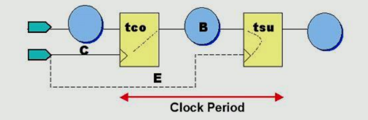
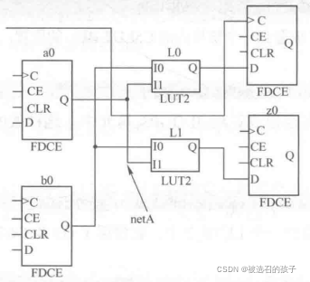
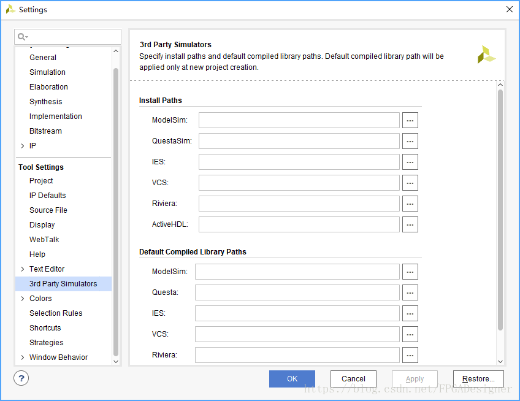

# FPGA约束

**用TCL语法，写.XDC文件**

**UCF 文件中的约束**  

## 名词

### 时钟

Virtex-5 中的 CMT 包括两个 PLL 和一个DCM  

Virtex-6 FPGA 中的 CMT 包括两个 MMCM  

Virtex-6FPGA 最多有 9 个 CMT

**CMT 时钟管理模块**

- DCM 基本的时钟管理单元
- PLL 锁相环
- MMCM 混合模式时钟管理器


强大的时钟管理模块，从 Virtex・4 的 DCM IP 核，演进到 Virtex-5 的 PLL IP 核，再到 Virtex-6 的 MMCM IP 核。

DCM 核是专门用于时钟综合、时钟偏斜消除和相位调整的固件资源，可以提供可靠的时钟倍频、分频和相移输出功能。

PLL 核是在 Virtex.5 系列 FPGA 中使用的**时钟管理模块**。
IBUF、BUFG、通用布线或同一个 CMT 的 DCM 输出  

MMCM 核是 Virtex-6 系列 FPGA 中支持的**高级时钟管理模块**，相比之前 FPGA系列的 DCM 和 PLL 核，MMCM 具有更强大的时钟管理功能，可以为 FPGA 设计提供更高性能的时钟管理功能。  
MMCM 通过输入多路复用器从 **IBUFG**，**BUFG，BUFR**, **GTX**（仅 CLKIN）或通用布线（不推荐）中选择参考时钟和反馈时钟  


### PAD

在数字电路和FPGA设计中，"PAD" 通常指代引脚（Pin and Pad）或者引脚接口。PAD 是指FPGA芯片上的物理引脚或端口，用于连接到电路板或外部设备。这些引脚通常与芯片的输入、输出、电源和地连接在一起，以实现数据传输和电源供应。

### IO 接口标准

为了满足日 新月异的通信发展，Xilinx 新型 FPGA/CPLD 可以通过 IO 引脚约束设置支持诸如 AGP、 BLVDS、CTT、GTL、GTLP、HSTL、LDT、LVCMOS、LVDCI、LVDS、LVPECL、LVDSEXT、 LVTTL、PCI、PCIX、SSTL、ULVDS 等丰富的 IO 接口标准。

### GT 高速串行通道

在FPGA（现场可编程门阵列）中，"GT" 通常指的是 "Gigabit Transceivers"，也称为高速串行收发器或高速串行通道。这是FPGA内部的特殊资源，专用于支持高速串行通信协议，如 PCIe（Peripheral Component Interconnect Express）、SATA（Serial Advanced Technology Attachment）、USB（Universal Serial Bus）等，**以及其他高速数据通信标准**。

GT资源通常包括：

- **高速串行通道**：GT资源允许FPGA与其他高速串行设备进行通信，支持高比特率的数据传输。
- **串行收发器**：GT资源包括串行收发器电路，用于将并行数据转换为串行数据和反向操作，以支持高速数据传输。
- **协议支持**：GT资源通常支持多种高速串行通信协议，FPGA设计师可以根据特定的应用需求选择并配置适当的协议。
- **时钟和时序控制**：GT资源通常包括时钟数据恢复和时序控制电路，以确保高速数据的稳定传输。

### get_ports/get_pins

对于get_ports和get_pins的区别，可以简单认为，**get_ports是FPGA顶层的接口**，该接口是要连到FPGA芯片管脚上的（即外部引脚？）；**get_pins是模块内的输出管脚（类似寄存器引脚）**。如果大家不清楚是用哪个，可以使用工具，工具会提醒您怎么找出这个信号来的。


## FPGA中的约束

1. **时钟约束**：
   - `create_clock`：定义时钟信号的频率和周期。
   - `set_clock_groups`：指定不同时钟域之间的关系，例如互斥或异步。
   - `set_clock_latency`：定义时钟之间的延迟关系，确保时序要求满足。
   - `set_multicycle_path`：允许某些信号在多个时钟周期内到达目标。
2. **时序约束**：
   - `set_input_delay`：指定输入信号的最大或最小延迟。
   - `set_output_delay`：指定输出信号的最大或最小延迟。
   - `set_false_path`：指定某些路径不需要满足时序要求。
   - `set_max_delay` 和 `set_min_delay`：限制某些路径的延迟范围。
3. **电气约束**：
   - `set_output_load`：指定输出负载的电气特性，以帮助信号传输线的建模。
   - `set_drive`：定义驱动信号的电气特性，包括驱动强度和输出阻抗。
4. **布局约束**：
   - `LOC`：指定特定逻辑元素或信号在FPGA芯片上的位置。
   - `REGION`：将设计限制在特定的FPGA区域。
5. **时钟分配约束**：
   - `create_generated_clock`：创建从某一时钟源派生的时钟。
   - `set_false_path`：指定某些派生时钟路径不需要满足时序要求。
6. **时钟域约束**：
   - `set_clock_groups`：指定时钟域之间的关系，包括互斥、异步和共享等。
7. **其他约束**：
   - `set_input_transition` 和 `set_output_transition`：指定输入和输出信号的过渡时间。
   - `set_max_skew`：限制时钟信号的时钟偏差。

这些约束用于确保FPGA设计满足性能、时序、电气和其他要求，以确保电路正常运行。不同的FPGA设计工具可能有不同的约束语法，但这些是一些常见的约束类型。

## 时序约束基础

————————————————
版权声明：本文为CSDN博主「FPGA技术江湖」的原创文章，遵循CC 4.0 BY-SA版权协议，转载请附上原文出处链接及本声明。
原文链接：https://blog.csdn.net/qq_40310273/article/details/112915276


### VIVADO

#### 1、周期（Period）的含义

周期的含义是时序中最简单也是最重要的含义，其它很多时序概念会因为软件商不同略有差异，而**周期的概念确是最通用**的，周期的概念是 FPGA/ASIC 时序定义的基础概念。后面要讲到的**其它时序约束都是建立在周期约束的基础上**的，很多其它时序公式，可以用周期公式推导。

周期约束是一个基本时序和综合约束，它附加在时钟网线上，时序分析工具根据PERIOD 约束检查时钟域内所有同步元件的时序是否满足要求。
PERIOD 约束会自动处理寄存器时钟端的反相问题，如果相邻同步元件时钟相位相反，那么它们之间的延迟将被默认限制为 PERIOD 约束值的一半。


时钟的最小周期为：

TCLK = TCKO + TLOGIC + TNET + TSETUP - TCLK_SKEW

TCLK_SKEW = TCD1 - TCD2（**稳定时为负的**）

- TCKO 为时钟输出时间，
- TLOGIC 为同步元件之间的组合逻辑延迟，
- TNET 为网线 延迟，
- TSETUP 为同步元件的**建立时间**，
- TCLK_SKEW 为时钟信号 TCD2 和 TCD1 延迟的差别。


#### 2、输入到达时间 Tarrival

定义的含义是输入数据在有效时钟沿之后的 Tarrival 时刻到达。


则

Tarrival = TCKO + TOUTPUT + TLOGIC（1）

根据上面介绍的周期（Period）公式，我们可以得到：

Tclk = Tcko + Toutput + Tlogic + Tinput + Tsetup - Tclk_skew （2）

由（1）（2）：**Tclk = Tarrival + Tinput + Tsetup - Tclk_skew** 

而 Tclk_skew 满足时序关系后为负，所以 Tarrival + Tinput + Tsetup < Tclk（3）

这就是 Tarrival 应该满足的时序关系。其中 **Tinput** 为输入端的组合逻辑、网线和 PAD的延迟之和，Tsetup 为输入同步元件的**建立时间**。

#### 3、数据延时和数据到达时间的关系


TDELAY 为要求的芯片内部输入延迟。

TDELAY_MAX + TARRIVAL = TPERIOD（4）

所以：

TDELAY < TDELAY_MAX = TPERIOD - TARRIVAL（5）

#### 4、输出的稳定时间（保持时间） Tstable

从下一级输入端的延迟可以计算出当前设计输出的数据必须在何时稳定下来，**根据这个数据对设计输出端的逻辑布线进行约束**，**以满足下一级的建立时间要求**，保证下一级采样的数据是稳定的。计算要求的输出稳定时间如图 5 所示


公式的推导如下：

定义：Tstable = TLOGIC + TINPUT + TSETUP （6）

从前面介绍的周期（Period）公式，可以得到（其中 TCLK_SKEW = TCLK1 - TCLK2）

TCLK = TCKO + TOUTPUT + TLOGIC + TINPUT + TSETUP **+ TCLK_SKEW**

将 （6）代入到周期公式：

TCLK = TCKO + TOUTPUT + TSTABLE + TCLK_SKEW

所以：TCKO + TOUTPUT + TSTABLE < TCLK

这个公式就是 TSTABLE 必须要满足的基本时序关系，即本级的输出应该保持怎么样的 稳定状态，才能保证下级芯片的采样稳定。有时我们也称这个约束关系是输出数据的**保持时间**的时序约束关系。只要满足上述关系，**当前芯片输出端的数据比时钟上升沿提早 TSTABLE 时间稳定下来**，下一级就可以正确地采样数据。
其中 **Toutput** 为设计中连接同步元件输出端的组合逻辑、网线和 PAD 的延迟之和，TCKO 为**同步元件时钟输出时间**。


### Altera-Quartus

下面阐述的是上面的时序概念对应于 Altera 中的几个重要的时序问题。

下面主要介绍 Altera 对应的这些时序概念和约束方法。前面首先介绍的第一个时序概念周期（Period），这个概念是 FPGA/ASIC 通用的一个概念，各方的定义相当统一，至多是描 述方式不同罢了，**所有的 FPGA 设计都首先要进行周期约束，这样做的好处除了在综合与 布局布线时给出规定目标外，还能让时序分析工具考察整个设计的 Fmax 等。**



Clock Period = Clk – to – out + Data Delay + Setup Time - Clk Skew，
时钟周期 = Clk – to – out + 数据延迟 + 建立时间 - Clk Skew，

即： Tclk = Tco + B + Tsu - (E-C) Fmax =1/Tclk

对比一下前面的介绍，只要理解了 B 包含了两级寄存器之间的所有 logic 和 net 的延时 就会发现与前面公式完全一致。


#### 1、建立时间 Clock Setup Time（tsu）

要想正确采样数据，就必须使数据和使能信号在有效时钟沿到达前就准备好，所谓时钟建立时间就是指**时钟到达前，数据和使能已经准备好的最小时间间隔**。


Setup时间是站在**同步时序整个路径上**的，需要区别的是另一个概念Micro tsu。
Micro tsu 指的是**一个触发器内部的建立时间**，它是触发器的**固有属性**，一般典型值小于1~2ns。
在 Xilinx 等的时序概念中，称 Altera 的 Micro tsu 为 setup 时间，用 Tsetup 表示，请大家区分一下。

回到 Altera 的时序概念，Altera 的 tsu 定义如下：

tsu = Data Delay – Clock Delay + Micro tsu

#### 2、保持时间 Clock Hold Time（tH）

时钟保持时间是只能保证**有效时钟沿**正确采用的数据和使能信号的**最小稳定时间**。


时钟保持时间是只能保证有效时钟沿正确采用的数据和使能信号的最小稳定时间。

公式：tH = Clock Delay – Data Delay + Micro tH 

Micro tH 是指**寄存器内部的固有保持时间**，同样是寄存器的一个固有参数， 典型值小于 1~2ns。

#### 3、时钟沿数据输出 Clock-to-Output Delay（tco）

这个时间指的是当时钟有效沿变化后，将数据推倒同步时序路径的输出端的最小时间间隔。


定义：tco = Clock Delay + Micro tco + Data Delay

Micor tco 指的是**寄存器相应时钟有效沿，将据送到输出端口的内部时间参数**，也是一个寄存器的固有属性。
它与 Xilinx 的时序定义中，有一个概念叫 Tcko 是同一个概念。

#### 4、逻辑延迟Pin to Pin Delay（tpd）

tpd 指输入管脚通过**纯组合逻辑**到达输出管脚这段路径的延时。

特别需要说明的是，要求输入到输出之间**只有组合逻辑**，才是 tpd 延时。

#### 5、时钟滞后 Slack Clock  Period

Slack 是表示设计是否满足时序的一个称谓，正的 Slack 表示满足时序（时序的余量），负的 Slack 表示不满足时序（时序的欠缺量）。


Slack = Required clock period – Actual clock period Slack = Slack clock period – ( Micro tCO + Data Delay + Micro tSU )
Slack = 所需时钟周期 – 实际时钟周期滞后 = 滞后时钟周期 – ( Micro tCO + 数据延迟 + Micro tSU )

#### 6、时钟偏斜 Clock Skew

Clock Skew 指一个同源时钟到达两个不同的寄存器时钟端的时间偏移。


---


## 时序约束相关概念

————————————————
版权声明：本文为CSDN博主「aixiaodecaomaowang」的原创文章，遵循CC 4.0 BY-SA版权协议，转载请附上原文出处链接及本声明。
原文链接：https://blog.csdn.net/u013709322/article/details/118439272


### 时钟分类

create_clock ：FPGA内部的同步元件之间的路径
set_input_delay ： 外部器件末级触发器发送数据通过FPGA端口到达FPGA内部第一级接收的触发器的路径
set_output_delay ：FPGA的末级触发器通过端口到达下游芯片的路径
set_max_delay ：从输入端口到输出端口纯粹的组合逻辑
clock group
multicycle path
false path

### 1、发起沿和捕获沿


### 2、时序路径


### 3、常规时钟路径


### 4、数据到达时间 D Arrival

设置分析的数据到达时间是指数据在源时钟启动后在路径端点稳定所需的时间

建立分析的**数据到达时间** 是指**数据被源时钟启动后** **在路径端点稳定**所需的时间


### 5、时钟到达时间 T Arrival


### 6、数据需求时间 Required（建立情况下）

目标寄存器捕获数据所需的最短时间


### 7、数据需求时间（保持情况下）


### 8、建立时间的裕量


建立时间裕量（Setup Time Margin）是指在时序要求中**允许信号到达其目标触发器之前的额外时间量。**
这个额外的时间量是**为了确保信号能够稳定地到达触发器并在正确的时刻被采样**。建立时间裕量的存在有助于处理信号传播延迟和时序不确定性，确保电路的可靠性。

建立时间裕量通常以纳秒（ns）或周期数来表示，它表示信号必须提前到达触发器以满足时序要求。

**建立时间裕量 = 时序要求 - 信号传播延迟**

1. **时序要求（Setup Time Requirement）：** 时序分析首先确定了触发器（如寄存器）的时钟边沿，然后确定了输入信号必须在触发器的时钟边沿之前到达的时间要求。
2. **信号传播延迟（Signal Propagation Delay）：** 为了计算建立时间裕量，需要考虑信号从源到达触发器的传播延迟，包括信号线、组合逻辑元件和线缆等的延迟。

如果建立时间裕量的计算结果为正值，表示信号在时序要求之前到达，因此电路能够满足时序要求。
如果建立时间裕量的计算结果为负值，表示信号没有足够的时间提前到达触发器，可能导致时序冲突，需要进一步优化电路或时钟设计以确保时序要求的满足。

适当的建立时间裕量确保了电路在不同情况下的稳定操作，包括温度变化、电源噪声等。

### 9、保持时间的裕量


保持时间裕量（Hold Time Margin）是指在时序要求中**允许信号在触发器上保持在稳定状态的额外时间量**。
这个额外的时间量是为了确保信号能够在触发器上保持足够的时间，以确保正确的数据采样和存储。

保持时间裕量通常以纳秒（ns）或周期数来表示，它表示在触发器上的输入信号必须在触发器的时钟边沿后保持在稳定状态的时间要求。如果信号在此时间内保持在不变状态，则电路能够正常操作。

**保持时间裕量 = 信号传播延迟 - 时序要求**

1. **时序要求（Hold Time Requirement）：** 时序分析首先确定了触发器（如寄存器）的时钟边沿，然后确定了输入信号必须在触发器的时钟边沿后保持在稳定状态的时间要求。
2. **信号传播延迟（Signal Propagation Delay）：** 为了计算保持时间裕量，需要考虑信号从触发器到达其源的传播延迟，包括信号线、组合逻辑元件和线缆等的延迟。

如果保持时间裕量的计算结果为正值，表示信号在触发器的时钟边沿后保持足够长时间，以满足时序要求。
如果保持时间裕量的计算结果为负值，表示信号没有足够的时间在触发器上保持稳定，可能导致时序冲突，需要进一步优化电路或时钟设计以确保时序要求的满足。


## 时序约束语法

————————————————
版权声明：本文为CSDN博主「aixiaodecaomaowang」的原创文章，遵循CC 4.0 BY-SA版权协议，转载请附上原文出处链接及本声明。
原文链接：https://blog.csdn.net/u013709322/article/details/118439272


### 1、创建时钟周期约束 create_clock/groups

- 时钟的定义

周期、占空比、相位

#### 1.1、创建时钟

- primary clock（主时钟）

晶振提供的时钟、吉比特transceiver（收发器）的输入引脚

```tcl
# create_clock 周期10ns 1/10 = 0.1GHz
# [get_ports sysclk]  指定时钟的源
create_clock -perilod 10 	[get_ports sysclk]

create_clock -name sysclk 	-period 10 	[get_ports clkin]
create_clock -name virclk 	-period 10
```

> 第一个命令没有指定时钟信号的名称，只指定了周期和来源；
> 第二个命令明确定义了时钟信号的名称和周期，并指定了来源；
> 第三个命令明确定义了时钟信号的名称和周期，但没有指定明确的来源。
> 通常情况下，最常见的是第二个命令，因为它明确定义了时钟信号的名称、周期和来源，使时钟约束更加明确和准确。


#### 1.2、从某时钟源派生时钟

MMCM、PLL、用户自己的分频逻辑，通过get_pins或get_ports来指定源时钟

```tcl
# create_generated_clock -name 要创建时钟的名字 -source [get_ports 参考时钟名字] -?? [get_pins reg驱动寄存器]

create_generated_clock 	-name 			clkdiv2\
						-source 		[get_ports clkin]\
						-divide_by 2 	[get_pins REGA/Q]
#在输入时钟信号 `clkin` 的基础上，生成一个名为 "clkdiv2" 的时钟，它的频率是输入时钟的一半，并用于驱动与 `[get_pins REGA/Q]` 中定义的寄存器相关的时序操作。
create_generated_clock 	-name 			clkdiv2\
						-source 		[get_pins REGA/C]\
						-divide_by 2 	[get_pins REGA/Q]

create_generated_clock 	-name 			clkdiv2
						-source 		[get_pins REGA/C] 
						-edges {1 3 5} 	[get_pins REGA/Q]
# 在输入时钟信号源 `REGA/C` 的基础上，生成一个名为 "clkdiv2" 的时钟，它与 `REGA/Q` 寄存器的 Q 时钟输入同步，并只在特定的时钟上升沿序列 {1 3 5} 上产生。

#杨明德PLL等衍生时钟
create_clcok 			–name 		clk_200 –period 5 	[get_ports Clk]			
create_generated_clock  -name 		my_clk 	[get_pins MMCM/CLKOUT0]\	#指定约束端端口以及命名
						-source 			[get_pins MMCM/CLKIN]\		#指出约束端的源	
						-master_clock 		clk_200						#指定约束端的周期频率				
```

> 它执行了一个名为 "create_generated_clock" 的约束命令，用于定义一个新的生成时钟（Generated Clock）。
>
> > `-name clkdiv2`：这部分指定了**生成的时钟的名称**，即 "clkdiv2"。在后续的设计约束和分析中，可以使用这个名称来引用这个生成的时钟。
> >
> > `-source [get_ports clkin]`：这部分**指定了生成时钟的源**。表示生成时钟的源是 `clkin`，<u>它是一个外部输入引脚（Port）</u>，通过 `[get_ports clkin]` 的方式来引用。也就是说，`clkin` 是**外部输入时钟信号**。
> >
> > `-divide_by 2`：这部分**指定了生成的时钟的分频因子**，即将输入时钟 `clkin` 除以2，以生成名为 "clkdiv2" 的生成时钟。这通常用于产生一个一半频率的时钟，通常用于数据传输和时序操作。
> >
> > `[get_pins REGA/Q]`：这部分**定义了时钟的触发器（Flip-Flop）或寄存器的位置**。这表示生成的时钟 **"clkdiv2" 会在这REGA/Q寄存器上产生，并会与这些寄存器的时钟输入相连接**，以确保时序正确性。
>
> 在输入时钟信号 `clkin` 的基础上，生成一个名为 "clkdiv2" 的时钟，它的频率是输入时钟的一半，**并用于驱动与 `[get_pins REGA/Q]` 中定义的寄存器相关的时序操作**。

> > `-source [get_pins REGA/C]`：这部分**指定了生成时钟的源**。表示生成时钟的源<u>是 **`REGA` 寄存器的 C 时钟输入引脚**。</u>这样的定义可以用于产生一个生成的时钟，以**确保它与 `REGA` 寄存器的 C 时钟输入同步**。
> >
> > `-edges {1 3 5}`：这部分**指定了时钟边沿**，即时钟上升沿的序列。在这个例子中，生成的时钟 "clkdiv2" 与源时钟同步，但**只在时钟上升沿的序列 {1 3 5} 上生成**。这意味着生成的时钟会在源时钟的特定上升沿时产生。
>
> 在输入时钟信号源 `REGA/C` 的基础上，生成一个名为 "clkdiv2" 的时钟，它与 `REGA/Q` 寄存器的 Q 时钟输入同步，并只在特定的时钟上升沿序列 {1 3 5} 上产生。

#### 1.3、report_clocks（报告时钟）

#### 1.4、时钟域约束

同步时钟（synchronous clocks）
异步时钟（asynchronous clocks）

```tcl
# set_clock_groups
set_clock_groups -name xxx -asynchronous 			-group [get xxx] -group [get xxx]
set_clock_groups -name xxx -physically_exclusive 	-group [get xxx] -group [get xxx]
```

```
 不可扩展时钟（unexpendable clocks）
```

> > `-name xxx`：这部分指定了时钟组之间的关系的名称，即 "xxx"。这个名称用于标识这个时钟组之间的关系，以便在后续的约束和分析中引用。
> >
> > `-asynchronous`：这部分**指定了这两个时钟组之间的关系是异步的**。这意味着两个时钟组中的时钟信号不需要满足任何特定的相对时序要求，它们被视为**独立的时钟域**。
> >
> > `-physically_exclusive`：这部分**指定了这两个时钟组之间的关系是物理上互斥的**。这意味着这两个时钟组的时钟信号在物理上不会同时出现在同一部分电路中。这通常**用于确保两个时钟域之间不会发生时序冲突或竞争条件**。
> >
> > `-group [get xxx] -group [get xxx]`：这部分**指定了参与时钟组关系的时钟组**。在这个例子中，两个不同的时钟组被列为 `-group` 选项的参数。这表示这两个时钟组之间的关系被定义为异步关系，它们不需要满足特定的相对时序要求。
>
> 总之，这个命令告诉FPGA设计工具，名为 "xxx" 的两个时钟组之间的关系是异步的，它们不需要满足特定的相对时序要求，因为它们被视为独立的时钟域。这种异步关系通常用于处理不同时钟域之间的数据传输或信号交互，其中时序关系不能轻易建立。

### 2、设置输入延时约束 set_input_delay

set_input_delay 设置的延时**表示数据到达时间相对于时钟的发起沿的延时**。这个发起沿来自外部设备的时钟。数据到达时间是数据到达FPGA数据端口的时间。

所以，这个约束就是告诉FPGA，外部设备的CLK与data之间的延迟关系。

```tcl
# set_input_delay -clock 时钟域 -min/max 延迟时间 [get_ports 要约束的时钟]
set_input_delay -clock 	sysclk \
				-max 4 	[get_ports clkin]
set_input_delay -clock 	sysclk \
				-min 2 	[get_ports clkin]
```

-max 用来分析setup	 ：max_delay 用于 FPGA 输入处的建立检查计算（确保数据被准确接收）

-min 用来分析hold		：min_delay 用于 FPGA 输入处的保持检查计算（确保数据被准确发送）

- `-clock sysclk`：**指定了输入延迟的参考时钟**。"sysclk" 被指定为参考时钟，表示**输入数据的时序要求**与名为 "sysclk" 的时钟信号有关。
- `-max 4`：**设置了输入端口 "clkin" 上的最大输入延迟为 4 个时间单位**。这意味着输入数据信号 "clkin" 必须**在 "sysclk" 时钟上升沿之前不晚于4个时间单位到达**，以确保时序要求得到满足。如果数据到达时已经超过这个延迟，可能会导致时序冲突，从而影响电路的正常操作。
- `-min 2`：输入数据信号 "clkin" 必须**在 "sysclk" 时钟上升沿之后不早于2个时间单位离开**。


**DDR input delay示例**

```tcl
# set_input_delay 延迟时间 -min/max -clock 参考时钟 [get_ports 要约束的数据]
set_input_delay -min 1 -clock clk [get_ports data_in]
set_input_delay -max 2 -clock clk [get_ports data_in]
# 在时钟信号 `clk` 的引导下，要求输入端口 `data_in` 上的最小输入延迟为一个时间单位。


set_input_delay -min 1 -clock clk [get_ports data_in] -clock_fall -add_delay 
set_input_delay -max 2 -clock clk [get_ports data_in] -clock_fall -add_delay
# 在时钟信号下降沿时应用额外的延迟。
# 还是不明白下面这段话
在 `set_input_delay` 命令中，**是将额外的延迟添加到输入信号，而不是从输入信号减少延迟。**
如果您使用 `-min`，那么 `-add_delay` 将添加到最小延迟，从而增加延迟。
如果您使用 `-max`，那么 `-add_delay` 将添加到最大延迟，从而减少延迟。
```

- `set_input_delay 1`：表示要**设置输入延迟，并且值为1**。这意味着指定了输入数据信号 `data_in` 相对于时钟信号 `clk` 的最小输入延迟。
- `-min`：表示**指定的是最小延迟**。最小延迟规定了输入数据信号必须在时钟上升沿之前至少延迟一个时间单位，这个时间单位可能是纳秒或其他时间单位，具体取决于设计工具的设置。
- `-clock clk`：这部分指定了参考时钟信号，即 `clk`，作为输入延迟的参考时钟。
- `[get_ports data_in]`：用于**指定要应用输入延迟的输入端口**，即 `data_in`。这是指定时序约束的输入端口。

指定输入数据信号相对于时钟信号的最小延迟，并且**在时钟信号下降沿时应用额外的延迟**。

- `-clock_fall`：**指定了应用额外延迟的时钟边沿类型**。在这种情况下，**额外的延迟将在时钟信号下降沿时应用**。
- `-add_delay`：指定了要在指定时钟边沿类型（这里是下降沿）上**应用额外延迟**。

**clock_fall 告诉分析工具，当前时序分析使用下降沿作为发起沿。**
**add_delay告诉分析工具，当前语句和前面的语句同时有效，不要进行覆盖。**


### 3、设置输出延时约束 set_output_delay

set_output_delay 设置延迟表示下游芯片接受的数据相对于捕获沿的时间间隔，延迟参数的大小等于数据到达的时间减去捕获沿时间。

和 input delay 一样，它们都是以外部芯片的时钟作为参考时钟的。区别是，
input delay 参考的是**发起沿**，所以**数据转换的时间在发起沿后面**；
output 参考的是**捕获沿**，**数据转变在前面**。

无论输入还是输出，delay的时间就是数据转变的时刻和参考时刻之间的时间间隔。

```tcl
set_output_delay 	-min -1 	-clock clk 	[get_ports data_out]
set_output_delay 	-max  3  	-clock clk 	[get_ports data_out]
set_output_delay 	-min -1 	-clock clk 	[get_ports data_out] 	-clock_fall -add_delay
set_output_delay 	-max  3  	-clock clk 	[get_ports data_out] 	-clock_fall -add_delay
```


#### 组合逻辑从输入端口到输出端口 get_ports -from to

```tcl
set_max_delay 15 -from [get_ports din] to [get_ports dout]
```


### 4、虚拟时钟 set_clock_latency

外部设备到FPGA只有数据端口，没有时钟端口，需要创建虚拟时钟。

这种情况下，一般来说，外部设备和FPGA使用相同的时钟源。下面的例子就是外部设备和FPGA使用同一个时钟源，外部设备在时钟的输入处添加了1ns的延迟的时钟buffer。

```TCL
create_clock 		-name 	sysclk 	-period 10	[get_ports clkin]
create_clock 		-name 	virclk 	-period 10
set_clock_latency 	-source 1 [get_clocks virclk] # 这个1写的对不对
set_input_delay 	-clock 	vitclk 	-max 	4	[get_ports ain]
set_input_delay 	-clock 	vitclk 	-min 	2	[get_ports ain]
```


对于 input delay，它的参考时钟可能是primary clock，也可能是使虚拟时钟。
使用primary clock的情况下，外部器件和FPGA使用同一个时钟，那么，这个时钟一般就是外部设备的data端口所使用的clock。
所以，这时的外部设备和FPGA同时连接data和clock。虚拟时钟的 clock对于FPGA和外部设备来说有一定的差异，比如上面的相位偏移。

简而言之，primary clock和虚拟时钟的区别就是是不是同一个时钟，是同一个时钟就用primary clock，不是同一个时钟就用虚拟时钟。
虚拟时钟、源时钟和目的时钟之间的关系是固定的，不然无法分析。

### 5、多周期约束 set_multicycle_path

start 和 end 用于选择参考时钟，start 表示参考时钟是源时钟，end 表示参考时钟是目的时钟。
当选择 -end 时，表示参考时钟选择目的时钟。

| aa   | 源时钟(-start)，发送沿移动 | 目的时钟(-end)，捕获沿移动 |
| :----: | :----: | :----: |
| setup 建立 | <----（向后）              | —>（向前）（默认）         |
| hold  保持 | —>（向前）（默认）         | <—（向后）                 |

-setup：表示该多周期路径所需要的时钟周期的个数
-hold：  表示相对于缺省捕获沿，实际捕获沿应回调的时钟周期的个数
-end：   表示参考时钟为捕获端所用时钟，对于-setup，缺省为-end
-start： 表示参考时钟为发送端所用的时钟，对于-hold，缺省为-start

#### 5.1、两倍时钟周期使能信号 get_cells

```tcl
set_multicycle_path 	-from [get_cells rega] 	-to [get_cells rega] 	-setup 	-end 2
set_multicycle_path 	-from [get_cells regb] 	-to [get_cells regb] 	-hold 	-end 1
```


#### 5.2、相同的时钟周期，目的时钟正向偏移 get_clocks

```tcl
set_multicycle_path 	-from [get_clocks clk1] 	-to [get_clocks clk2] 	-setup 	-end 2
```


#### 5.3、相同时钟周期，目的时钟负向偏移

不需要做多周期约束


#### 5.4、发端慢速，收端快速

```tcl
set_multicycle_path 	-from [get_clocks clk1] 	-to [get_clocks clk2] 	-setup 	-end 2
set_multicycle_path 	-from [get_clocks clk1] 	-to [get_clocks clk2] 	-hold 	-end 1
```


#### 5.5、发端快速，收端慢速

```tcl
set_multicycle_path 	-from [get_clocks clk1] 	-to [get_clocks clk2] 	-setup 	-start 2
set_multicycle_path 	-from [get_clocks clk1] 	-to [get_clocks clk2] 	-hold 	-start 1
```


### 6、设置伪路径约束 set_false_path

伪路径是指在设计存在的路径，但是并不存在作用。在综合的时候不起作用，在实现的时候起作用。

设置伪路径可以去除无效的伪路径，可以节约编译的时间。

```tcl
# set_false_path [from args] [to args] [through args]
set_false_path -from S1 -through {x1, x2}
```

这个例子表示来自S1的路径，它们通过x1或者x2。{}中表示的是或的关系。

#### 6.1、 组合逻辑中的伪路径

```tcl
set_false_path -through [get_pins MUX0/I0] -through [get_pins MUX1/I1]
```


#### 6.2、时序路径中的伪路径

```tcl
set_false_path -through [get_pins MUX0/I0] -through [get_pins MUX1/I0]
```


#### 6.3、跨时钟域中的伪路径

```tcl
set_false_path -from [get_clocks clka] -to [get_clocks clkb]
set_false_path -from [get_clocks clkb] -to [get_clocks clka]
```

等价于

```tcl
set_clock_groups -asynchronous -group [get_clocks clka] -groups [get_clocks clkb]
```

false path timing report

```tcl
set_flase_path -from [get_ports rst_pin]
set_flase_path -来自 [get_ports rst_pin]
```

```tcl
report timing -from [get_ports rst_pin]
```


## 物理约束 set_property

————————————————
版权声明：本文为CSDN博主「被选召的孩子」的原创文章，遵循CC 4.0 BY-SA版权协议，转载请附上原文出处链接及本声明。
原文链接：https://blog.csdn.net/Archar_Saber/article/details/123663051


对于大多数的物理约束，其语法格式表示为：

```tcl
 set_property  <property><value><object_list>
```

​        Note:当XDC中出现非法的约束条件时，Vivado提示“Critial Warning”信息，其中也包括对设计中没有的对象进行约束的情况。Xilinx推荐设计者仔细查看严重警告信息，以保证所有的约束条件都是正确的。

### 1、I/O约束

————————————————
版权声明：本文为CSDN博主「mrVillain」的原创文章，遵循CC 4.0 BY-SA版权协议，转载请附上原文出处链接及本声明。
原文链接：https://blog.csdn.net/qq_38812860/article/details/114598789

IOB（输入输出缓冲器）**的寄存器通常被禁用**（ 一般情况下IOB的**寄存器缺省为OFF**，如果需要设置接口的寄存器，则在约束文件中应该约束），因为它们不是所有IOB的标配功能，而是根据特定设计需求进行配置。

在某些情况下，设计师可能需要启用IOB上的寄存器以实现特定的功能，如信号同步、时序控制或电平适配。

IOB不会用于存储数据或进行寄存器级的操作。
IOB用于数据输入和输出的缓冲、电平适配以及连接到FPGA内部逻辑（通常情况下）。


 IOB的结构如上，PAD即与外界连接焊盘引脚，同时有一个IBUF和OBUF。当配置为output时，连接左边的OBUF，配置为input时，连接右边的IBUF。在FPGA中，每一个IOB都有与之对应的一个xIOI3模块（有LIOI3和RIOI3之分，由三个触发器Flip-Flop组成，TFF,OFF和IFF），且其布线资源比较固定，如下所示


使用xIOI3中的触发器有一个较大的好处，就是其**布线资源固定**，且最靠近各个引脚，可以实现较低的延迟，
**如果不使用IOB的触发器而连接普通的Slice内部寄存器，则信号进入第一级寄存器的布线会因为每次综合结果的不同而各有不同，且由于Slice距离接口较远**，有可能导致高速信号的采样不正确，不满足时序要求。


```TCL
// 约束输入输出引脚的
//位置、电气标准、IO缓冲器

set_property 	PACKAGE_PIN G13 		[get_ports reset]
set_property 	IOSTANDARD 	LVCMOS18 	[get_ports reset]
set_property 	IOB 		TRUE 		{get_ports xxx}
```

- `set_property` 是用于设置FPGA约束的命令。
- **`PACKAGE_PIN`** 是指定物理引脚的属性的关键字。
- `G13` 是**物理引脚的标识符**，它告诉FPGA工具将信号映射到FPGA芯片上的哪个引脚。
- **`IOSTANDARD`** 是指定信号电气特性的关键字。
- `LVCMOS18` 是**电气特性**的名称，表示这是一种标准的低电压差分CMOS（LVCMOS）信号，工作电压为1.8V。
- `IOB` 是一个属性，表示将端口配置为输入/输出缓冲器。
- `TRUE` 表示将 `reset` 端口标记为输入/输出缓冲器。
- `[get_ports reset]` 表示要映射到 "reset" 信号的端口。这个部分告诉FPGA工具将 "reset" 信号与指定的物理引脚相关联。


###  2、网表约束

​        网表约束用于设置网表对象，如端口，引脚，网络或者单元。这样，编译工具可以以特殊的方式处理它们。

（1）CLOCK_DEDICATED_ROUTE

​    该属性控制时钟信号的布线方式。当没有使用专用时钟资源时，该属性可以设置为FALSE。该值允许Vivado工具使用通用的布线资源，将来自输入端口的时钟连接到一个全局时钟资源，如BUFG和MMCM等。

（2）MARK_DEBUG

​    在RTL中的一个网络上设置该属性，使得在网表中可以看到该网络。这样，允许在编译流程中，在任意点将该网络连接到逻辑调试工具中。

（3）DONT_TOUCH

​    在叶子单元(Leaf Cell)，层次化单元或者网络对象上设置DONT_TOUCH，用于在网表优化的过程中保护这些网表对象。该属性用于：

1）禁止优化由DONT_TOUCH声明的网络。

2）禁止合并人工复制的逻辑。

​    这里书中提到一个注意点就是:由于Vivado集成设计环境不能实现平坦化(flatten)逻辑层次，因此在实现设计时避免在层次单元上使用DONT_TOUCH。在综合时，使用KEEP_HIERARCHY保持逻辑层次。但是，我发现Vivaod工具在实现时，其实是默认先将设计整个flatten进行整体优化，然后再重新生成原HIERARCHY结构的。很奇怪，也就是Vivado集成设计环境是能实现flatten逻辑层次优化的。

（4）LOCK_PINS

​    LOCK_PINS是一个单元的属性，用于在逻辑LUT的输入(I0,I1,I2,...)和LUT物理引脚（A6,A5和A4）之间指定映射关系。普遍的用法是，将时序上有严格要求的LUT输入强制映射到最快的A6和A5的物理输入。如下是将I1映射到A6,I0映射到A5.

```tcl
// 将I0映射到A5, I1映射到A6.	//此处用了TCL语法
set myLUT2 [get_cells u0/u1/i_365] 		
set_property LOCK_PINS {I0:A5 I1:A6} $myLUT2
get_property LOCK_PINS $myLUT2
```


### 3、布局约束

​        将布局约束应用到单元，用于控制这些单元在FPGA元器件内的位置。布局约束包括:

|       控制       |                             说明                             |
| ---- | ---- |
|    （1）LUTNM    | 唯一的字符串名字应用到两个LUT，用于控制它们在单个LUT位置上的布局。不像HLUTNM和LUTNM，可以用于组合属于不同层次单元的LUT。 |
|   （2）HLUTNM    | 唯一的字符串名字应用到相同层次上的两个LUT，用于控制它们在单个LUT位置上的布局。 |
|  （3）PROHIBIT   |                     禁止布局到某个位置。                     |
|   （4）PBLOCK    | 将一个逻辑块约束到FPGA元器件内的一个物理区域内。PBLOCK是一个只读单元属性，即其单元所分配到Pblock的名字。 |
| 5)PACKAGE_PIN |     在目标元器件封装的一个引脚上指定一个设计端口的位置。     |
|     （6）LOC     |   将来自网表的一个逻辑元素放置到FPGA元器件内的一个位置外。   |
|     （7）BEL     | 将来自网表的一个逻辑元素放置到FPGA元器件上一个切片内一个指定的BEL上。 |

在Vivado工具中，提供了两种类型的布局。

（1）Fixed Placement，由设计者通过指定的布局：手工布局，XDC约束，对加载到存储器中的设计的一个单元对象上使用IS_LOC_FIXED或者IS_BEL_FIXED约束。

（2）Unfixed Placement，由实现工具所执行的布局。

```TCL
set_property 	LOC 		RAMB18_X0Y10 	[get_cells u_ctrl0/ram0]
set_property 	BEL 		C5LUT 			[get_cells u_ctrl0/lut0]
set_property 	IOB 		TRUE 			[get_cells mData_reg*]
set_property 	LUTNM 		L0 				[get_cell  {u_ctrl0/dmux0 u_ctrl0/dmux1}]
set_property 	PROHIBIT 	TRUE 			[get_sites {RAMB18_X0Y* RAMB36_X0Y*}]
# 1）将一个BRAM放置在RAMB18_X0Y10的位置，并且将其位置固定。
# 2）将一个LUT放置到一个切片内的C5LUT BEL的位置，并且将BEL的分配固定。
# 3）将输入总线寄存器放置到ILOGIC单元中。这样做的目的是为了更短输入延迟。
# 4）将两个小的LUT组合到一个LUT6_2中，它使用了O5和O6输出。
# 5）用于阻止布线器使用第一列的BRAM
```


### 4、布线约束

​    布线约束应用于网络对象，用于控制它们的布线资源。

固定布线：固定布线是用于锁定布线的一种机制。锁定一个网络布线包含3个网络属性。

1）ROUTE: 只读网络属性

2）IS_ROUTE_FIXED: 用于将整个布线标记为固定。

3）FIXED_ROUTE: 一个网络的固定布线部分

注意：为了保证一个网络布线是固定的，则布线上的所有单元必须预先也是固定的。

如对下图1中电路中的netA的布线进行固定。

```TCL
set_property 	LOC 		SLICE_X0Y47 	[get_cells {a0 L0 L1}]
set_property 	BEL 		CFF   			[get_cells a0]
set_property 	BEL 		A6LUT 			[get_cells L0]
set_property 	BEL 		B6LUT 			[get_cells L1]
set_property 	LOCK_PINS 	{I1:A4 I0:A2} 	[get_cells L0]
set_property 	LOCK_PINS 	{I1:A3 I0:A2} 	[get_cells L1]
set_property 	FIXED_ROUTE {CLBLL_LL_CQ CLBLL_LOGIC_OUTS6 FAN_ALT5 FAN_BOUNCE5  {IMUX_L17 CLBLL_LL_B3} IMUX_L11 CLBLL_LL_A4} 						[get_nets netA]
```




### 5、布局约束实现

```TCl
# 使用Pblock的XDC约束如下所示，首先为Instance创建pblock，然后将具体的Instance与创建的pblock绑定，最后，为pblock添加相应的资源。
create_pblock 		              pblock_Instance_counter3b
add_cells_to_pblock  [get_pblocks pblock_Instance_counter3b] [get_cells -quiet [list Instance_counter3b]]
resize_pblock 		 [get_pblocks pblock_Instance_counter3b] -add 	{SLICE_X0Y8:SLICE_X1Y9}

create_pblock 		 			  pblock_Instance_div_clk
add_cells_to_pblock  [get_pblocks pblock_Instance_div_clk] 	[get_cells -quiet [list Instance_div_clk]]
resize_pblock 		 [get_pblocks pblock_Instance_div_clk] 	-add 	{SLICE_X2Y8:SLICE_X3Y8}
```


对其进行自动布局实现后的结果如下所示，白色高亮的器件是Instance_counter3b 实现，蓝色高亮的器件是Instance_div_clk实现。这时，我想让每个module实现靠近一些，因此对其进行布局约束。


在Netlist菜单栏中，选中相应的Instance,右键出Draw Pblock在Device中进行布局约束。


最后，经过布局约束后实现的资源分布图如下所示:


```TCL
# 使用Pblock的XDC约束如下所示，首先为Instance创建pblock，然后将具体的Instance与创建的pblock绑定，最后，为pblock添加相应的资源。
create_pblock 		              pblock_Instance_counter3b
add_cells_to_pblock  [get_pblocks pblock_Instance_counter3b] [get_cells -quiet [list Instance_counter3b]]
resize_pblock 		 [get_pblocks pblock_Instance_counter3b] -add 	{SLICE_X0Y8:SLICE_X1Y9}

create_pblock 		 			  pblock_Instance_div_clk
add_cells_to_pblock  [get_pblocks pblock_Instance_div_clk] 	[get_cells -quiet [list Instance_div_clk]]
resize_pblock 		 [get_pblocks pblock_Instance_div_clk] 	-add 	{SLICE_X2Y8:SLICE_X3Y8}
```

### 6、布线约束实现


###  7、配置约束原理

​        配置约束是全局约束，用于当前设计的比特流生成。其中包含对配置模式的约束。

```TCL
set_property 	CONFIG_MODE 			M_SELECTMAP [current_design]
set_property 	VREF 					{E11 F11} 	[current_design]
set_property 	BITSTREAM.GENERAL.CRC 	Disable 	[current_design]
#（1）将CONFIG_MODE设置为M_SELECTMAP
#（2）将元器件的E11和F11引脚设置为电压参考引脚
#（3）禁止CRC检查
```


## 时序约束实际工程操作

————————————————
版权声明：本文为CSDN博主「MDYFPGA」的原创文章，遵循CC 4.0 BY-SA版权协议，转载请附上原文出处链接及本声明。
原文链接：https://blog.csdn.net/MDYFPGA/article/details/125569398


时序约束是一个非常重要的内容，而且内容比较多，比较杂。因此，很多读者对于怎么进行约束，约束的步骤过程有哪些等，不是很清楚。明德扬根据以往项目的经验，把时序约束的步骤，概括分成四大步，分别是**时钟的约**束、**input delay**s的约束、**output delays**的约束和**时序例外**。

时序约束是有先后的，首先要做时钟约束、其次是input delays约束、再次是output delays约束，最后才是时序例外的约束。这是一个完整的大步骤，

1. 也就是说我们在项目开始阶段就可以约束我们的时钟，把我们时钟的频率、周期、来源等等定义好。
2. 这一步做完之后，先不要做二三四步。这时候我们要完成我们的设计，要把我们内部的时序都完成之后才做第二步设置“input delays”，比如说我们从外部进来的一个情况。
3. 第三步output delays，也就是说要往下游器件发送的一个时序情况。
4. 当这一二三步都做完之后，我们在最后项目的阶段才做一个时序例外的情况。时序例外也就是说哪些时序是不需要分析的，这种情况要设置好。最后我们才能把整个时序约束完成。

以上是大的步骤，但事实上每一个步骤又可以细分成很多种情况。例如时钟约束，时钟可以分很多种，一种是差分时钟，一种是管脚进来的时钟、还有我们PLL产生时钟等等。还有一种是有数据但没有时钟的情况。input delays、output delays 也有很多种，我们到底要怎么样去分析，怎么去看。明德扬就把这四个步骤再进行细化，就是根据情况来分别列出来。


### 1、时钟

————————————————
版权声明：本文为CSDN博主「MDYFPGA」的原创文章，遵循CC 4.0 BY-SA版权协议，转载请附上原文出处链接及本声明。
原文链接：https://blog.csdn.net/MDYFPGA/article/details/123368501


如上图，时钟约束概括地，可以分成三种情况，分别是输入时钟、PLL等衍生时钟以及自己分步的时钟。

#### 1.1 输入时钟

输入时钟是指时钟**从FPGA管脚进来**的情形，这也是最常见的情况。根据输入的管脚的不同，输入时钟情况又可以分成：输入管脚是单端的、输入管脚是差分的，以及GT或者恢复时钟**三种情况**。

- 第一种：输入管脚是**单端**的，即时钟直接从管脚进来、并且是单端信号。例如普通低速晶振，大部分是这种情况，明德扬的FPGA ALTERA学习板，如MP801、MP603，其时钟均是由晶振产生，送到FPGA，并且是单端的信号。

- 第二种：输入管脚是**差分**的，即时钟直接从管脚进来，并且是差分信号。大部分**高速晶振、LVDS**接口等，属于此情形。例如明德扬FPGA XILINX学习板，如MP802，其包含了PCIE管脚，其输入的时钟就是差分的；这个板子的DDR的驱动时钟，时钟频率在200M左右，也是属于此种以情形。

- 第三种：**GT或者恢复时钟**，即使用了高速收发器的情形。在高速收发器管脚中，是没有时钟的，时钟已经嵌入到数据里面，使用FPGA的GTX IP核接收数据，并且从数据恢复出时钟。这个恢复出来的时钟就是此种情形。最常见的就是光纤接口。

##### 1.1.1 输入管脚CLK


 

这种是**最常见**的一个情况，包括明德扬的MP603、MP801学习板，
其时钟都是由外部的晶振产生，然后直接输入管脚进来的，这种情况的生成时钟约束是最简单的，其格式如下：

```TCL
create_clock 	-name 		SysClk 
				-period 	10 
				-waveform 	{0 5} 	[get_ports Clk]
```

- create_clock是生成约束约束命令。

- -**name **后面表示给这个**时钟命名**，这里命名为SysClk，您可以命为其他您所想要的名字，即使跟代码中的时钟名不同，都是可以的。

- -**period **后面表示约定该**时钟的周期**，默认单位为**纳秒**。

- -**waveform** 后面表示该时钟在**一个周期内的上升沿和下降沿时间点**。{0 5}表示时钟在<u>第0时刻上升</u>，在<u>第5时钟下降</u>。从而，设置了占空比。

- get_ports 这里指定了**约束的对象**，即对应代码中的哪个信号，get_ports Clk，表示这个时钟就是代码或上图中的Clk。

  这个时钟约束是最常用的，只要参照这种格式生成晚就可以了。

##### 1.1.2 差分时钟

差分时钟是指通过管脚的P端和N端共同进来的，通常应该到**高频或者精度** 很高的场合，例如明德扬的MP802、MP5620，以及各种核心板，基本上外面都有差分晶振，有差分时钟的输入。

注意下，差分信号在芯片上，肯定是占用了两个管脚位置，但在代码中不一定。在**XILINX**的顶层接口代码中，差分时钟会<u>对应两个接口信号</u>，分别 P端和N端；而对于**ALTERA**，<u>顶层接口信号只有一个</u>，不用区分出P端和N端，<u>在管脚定义时，再来区分出</u>P和N。

对于ALTERA的差分时钟约束，其与单端输入约束方法完全一样。

对于XILINX的差分时钟约束，**只需要约束P端**就可以了，即：

```TCL
create_clock 	-name 		SysClk 
				-period 	10 
				-waveform 	{0 5} 	[get_ports Clk_p]
```

##### 1.1.3 GT（恢复的时钟）


第三种是GT或恢复的时钟，即使用了**高速收发器**的情形，最常见的就是<u>光纤接口</u>了。

在高速收发器管脚中，是没有时钟的，**时钟已经嵌入到数据**里面。接收的时候，我们使<u>用高速收发器如**GTX、GTY IP核**接收数据，并且从数据时提取出时钟</u>。这个恢复出来的时钟就是此种情形，例如上图中的GT模块，就是FPGA内部使用的一个IP核，其输出了时钟TXCLK。

在这种情况下，我们需要约束这个恢复出来的时钟。按前面方式，同样也是使用create_clock，定义时钟周期、占空比等，但约束对象需要注意一下，不是通过get_ports，而是通过get_pins找到对象，该对象是恢复出的时钟，如上图中的GT/TXOUTCLK，即：

```TCL
create_clock 	-name 		txClk 
				-period 	6.667 
				-waveform 	{0 5} 	[get_pins GT/TXOUTCLK]
```

- 上面产生了一个**名为txClk**的约束，其**对象**为**GT/TXOUTCLK**，周期为6.667，即133M。


对于get_ports和get_pins的区别，可以简单认为，**get_ports是FPGA顶层的接口**，该接口是要连到FPGA芯片管脚上的；**get_pins是模块内的输出管脚**。如果大家不清楚是用哪个，可以使用工具，工具会提醒您怎么找出这个信号来的。

<u>注意上面找到（先找到）的是GT/TXOUTCLK，而不是图中的TXCLK。这是因为**TXCLK是例化的信号，有时候是找不出来的**。这个时候，需要设计者找到GT模块，再仔细辨识出时钟信号是哪个，非常考验设计师的**经验**</u>。


#### 1.2 PLL等衍生时钟

那假如说我不是输入管脚，而是PLL产生的输出时钟，这个 就是PLL等衍生时钟。这种时钟，FPGA的工具，**会自行推导，一般无需约束**，**但实质应用中，强烈建议约束**，会有好处的，好处在下一篇文章中说明。

**下一篇章**


 

上图是时钟Clk经过内部的MMCM时钟管理单元，该时钟管理单元在此基础上倍频或者分频等，产生输出时钟CLKOUT0，该时钟用于驱动REGA和REGB。在前面的介绍里，我们知道需要对Clk进行约束，使用的是create_clock命令。那么上图中的CLKOUT0要不要约束呢？

对于PLL和MMCM，一般VIVIDAO、ISE和QUARTUS工具是可以推导出该时钟约束的，因为我们在生成IP核的时候，已经设置了该时钟的输入和输出 时钟频率、相位等信息，通过这些信息，工具就可以推导出时钟约束。

因此，对于**XILINX可以不用约束**PLL和MMCM产生的时钟；对于**ALTERA**，也<u>可以自动推导的，但**需要添加**如下命令</u>，才会自动推导：

**derive_pll_clocks**

虽然工具可以自动推导PLL和MMCM产生的时钟约束，但是其约束时钟名是不受设计师控制或预见的。这会带来什么问题呢？

我们产生时钟约束后，通常还会在基于此时钟产生其他约束，例如下面是input delay的约束：

```TCL
set_input_delay -clock my_clk -max 4 [get_ports ain]
```

- 上面是input delay的约束，**对象是ain**，但注意看，-clock后面的sysclk是时钟约束产生的时钟名（注意这里的my_clk<u>是约束名，不是代码中的时钟信号</u>），这说明***input delay约束时，是依赖时钟约束名的***。


如果由工具自动推导PLL和MMCM产生时钟约束，那么**名字就不知道**，或者虽然知道了，但可能<u>稍微改下代码名称又变了</u>。这样会**导致依赖于此名字的其他约束，会存在失效而不知道的风险**。

因此，明德扬建议对PLL和MMCM产生时钟添加约束，确定时钟名。


例如上面的电路，添加如下约束

```TCL
create_clcok 			–name 			clk_200 	–period 5 	[get_ports Clk]
create_generated_clock  -name 			my_clk 	[get_pins MMCM/CLKOUT0]\	#指要约束端以及命名
						-source 				[get_pins MMCM/CLKIN]\		#指出约束端的源
						-master_clock 	clk_200								#指定约束端的周期频率
```

- 首先通过create_clock命令**对输入管脚Clk约束**，周期为5，命名为Clk_200。
- 然后通过create_geneated_clock**对MMCM产生的CLKOUT0约束**，
  - 命名为my_clk；约束对象为MMCM/CLKOUT0；
  - 通过-source表明来<u>源于</u>MMCM/CLKIN，即<u>MMCM的输入管脚</u>；
  - 通过-master_clock表明**其主时钟是clk_200**。

通过上面方法，就可以确定MMCM的时钟名，已经固定为my_clk，不会再变了。前面提及的input delay约束，就会变为如下：

```TCL
set_input_delay -clock my_clk -max 4 [get_ports ain]
```


#### 1.3 自己分频的时钟

还有一种情况是自己分频的时钟，假如说我们自己写了一个计数器，把它二分频、四分频、八分频等，分频出来的信号当为时钟，这种情况就是自己分频的时钟。

首先说明，明德扬**不推荐使用**此方法来产生时钟。但确实要用到分频时钟时，那就要记得做时钟约束。这种情况下要怎么进行约束呢？

以上概括了说明了时钟的几种情况，每种情况下，其约束方法都有些不同以及注意点。具体约束方法，可以看后续文章的内容。

**下一篇**


第三种就是自己分频的时钟。如上图所示，CLK1经过一个D触发器，通过该触发器二分频产生了时钟CLK2。

首先说明，明德扬**不推荐使用**此方法来产生时钟，我们建议全部使用PLL等来产生时钟。如果确实要用到分频时钟时，那就要记得做时钟约束。这种情况下要怎么进行约束呢？下面是推荐的约束方法。


```TCL
create_clcok 			–name 	CLK1 –period 5 	[get_ports CKP1]
create_generated_clock  -name 	CLK2 			[get_pins REGA/Q]\	#约束REGA/Q 信号,命名为CLK2
						-source 				[get_ports CKP1]\	#REGA/Q的源（来自于）
						–divide_by 2								#指定约束信号的周期频率
```

- 首先通过create_clock产生对管脚CKP1的时钟约束，周期定为5，名字为CLK1。

- 然后通过create_generated_clock产生二分频后的时钟约束，对象是REGA/Q，即D触发器的输出信号；
  - 然后通过-source来指定REGA/Q的源，即来自CKP1，；
  - 最后还要说明频率，通过-divide_by来说明几分频，-divide_by 2是表示二分频，即CKP1时钟的一半频率。

注意的是，一定要**通过-divide_by来指定频率**，因为工具<u>无法从您的代码中推导出频率</u>的。

强烈建议，分频时钟一定要约束，经验之谈，没有约束的话，时钟是不稳定的，会产生莫名其妙的问题的，这方面我们已经吃过亏的。

#### 1.4 总结与建议

首先，本文将时钟约束分了好几种情况，制成了一个表。您可以根据实际情况，对照步骤表，从而制定自己需要在我约束。

其次，注意一下约束的优先级。

**自定义约束覆盖工具推导的约束**。前面讲过，有些约束工具是可以推导出来的。如果自己又定义了该对象的约束，那么这个约束将覆盖工具推导出来的约束，即定义的约束有效，推导出来的约束无效。

**后定义的约束覆盖先定义的约束**。例如，在开始的时候定义了一个对CLK的约束，定义为100M，后面又有一个对CLK的约束，定义为200M，那么以哪个为准呢？那就以后面的为准，约束为200M。

但有时候需要对多个约束同时有效，即多个约束共存，那么可以在约束后面加上-add，以此表明不要覆盖前面约束，而是共同有效。

下一篇文章，我们将具体探讨“input delays约束”的内容，讲解各种情况下的时序约束方法。需要**更多更详细的资料，可以找作者了解**。


### 2、 input delays

input delay约束，即输入延时约束，是时序约束的**重点**，input delay 又分几种呢？


如上图，input delay约束概括地，可以分成**三种**情况，分别是系统同步、源同步和有数据无时钟。

#### 2.1 系统同步

第一个是系统同步方式，也就是说整个电路板上FPGA以及上游器件都共用一个时钟，并且相位严格相同，这个就是系统同步的方式。

#### 2.2 源同步

上游器件，把数据和时钟信号一起送到FPGA上来的，那这种就是源同步。

源同步是**更常用**的一种方式，系统同步比较少用，为什么呢？**因为要做到上游器件跟FPGA的相位差为0，没有一点时钟差，这种要求非常高**。而源同步是数据跟时钟都是从上游器件一起输送过来给FPGA，这是一种更常用的方式。

这个源同步，又有很多种，具体SDR、DDR和有数据无时钟三种情况。

- 第一种：**SDR**。SDR是指时钟是单沿有效的方式，比如说我只用上升延或者下降延的一个方式，**SDR约束的参数**，其获取的方法有两种：<u>查看上游器件手册</u>（通过查看上游器的数据手册，获取参数）以及<u>通过示波器测量</u>（通过示波器测量信号的相位差，获取参数）。

- 第二种：**DDR**。DDR是另一种方式，它是一种时钟双沿有效的一个方式。也就说即用它的上升延，也用它的下降延。例如说我们的**DDR2**、**DDR3**的时钟，都是上下降沿一直采数据的；包括<u>千兆网</u>的**RGMII接口**，也是通过双沿的方式。
  DDR的这种情况，我们还可以**继续划分**成<u>中心对齐和边沿对齐</u>两种情况。
  - 中心对齐是指：时钟边沿始终在数据的中间，时钟上升沿的左右两边，**数据都是稳定的**。
  - 边沿对齐是指：时钟和数据边沿对齐的，在时钟变化沿两边，其**数据是不稳定**的。
- 第三种：**有数据无时钟**。第三种就是有数据无时钟的情况。例如说常见的**串口**。串口是直接数据过来的，它是没有随路时钟过来的。而我们用本地时钟去采样，就会出现有数据无时钟。那对于这种我们应该怎么去约束，又是另一种情况。


#### 2.3 约束语法

————————————————
版权声明：本文为CSDN博主「MDYFPGA」的原创文章，遵循CC 4.0 BY-SA版权协议，转载请附上原文出处链接及本声明。
原文链接：https://blog.csdn.net/MDYFPGA/article/details/124660184

设置输入延时的约束语句，其语法非常简单，如下

```TCL
set_input_delay -clock <clock_name> 
				<delay> <objects>
```

- <objects>是想要<u>**设定input约束的端口名，可以是一个或数个port**。</u>
-  -**clock**之后的clock_name，是**时钟域的名字**。这个clock_name是**设置约束约束时定义的时钟域的名字，而非“时钟”名**。
  可以是一个真实存在的时钟，也可以是预先定义好的虚拟时钟。

- delay分两种

  -  **-max** <maxdelay>，输入的最大延时，用于**建立时间setup**的分析，具体原因看后面部分。


  -  **-min** <maxdelay>，输入的最小延时，用于**保持时间hold**的分析，具体原因看后面部分。


下面是具体的两个例子

```TCl
# 约束了信号Din相对于时钟域clk0，有最小延时0.5和最大延时1.5ns
set_input_delay -clock 		[get_clocks clk0]\
				-min 0.5 	[get_ports Din[*]]

set_input_delay -clock 		[get_clocks clk0]\
				-max 1.5	[get_ports Din[*]]
```

#### 2.4 输入延时的目的


D触发器是有建立时间和保持时间要求的。这个**建立时间和保持时间**，是这个D触发器的物理特性，是一定会有的，但这个数值是多少，<u>工程师不知道，而综合工具如VIVADO、QUARTUS等会知道。</u>

当Din和clk的延时不满足D触发器的建立时间和保持时间时，综合工具自动调整内部延时，例如<u>增加一些BUF</u>，或者<u>增加线长等</u>方式，使得信号最终到达D触发器时，能够满足建立时间和保持时间的要求。

所以综合工具需要知道输入的延时是多少，进而调整内部延时，最终满足D触发器的建立时间和保持时间要求，这就是设置输入延时的目的。

有几点需要注意的。

- a. **设置输入延时，只是客观描述外部信号，即数据和时钟和相位关系**。只要知道综合工具这种相位关系，剩下的调整是<u>综合工具自动完成</u>的。

- b. 虽然综合工具可以调整内部延时，从而达到内部D触发器正确采样的目的，但**这个延时是有一定范围**的，存在无论怎么调都无法满足的情况。


#### 2.5、获取参数的两种方法

由本文的约束语句一节，可以知道为了设置输入延时约束，需要知道两个参数：最大延时值max和最小延时值min。

那我们一般如何获取这两个参数呢？有两种方法，一种是查阅数据手册，另一种是通过示波器测量。

1. **查阅数据手册**

数据和时钟的相位偏差，通常来自于上流器件的寄存器延时和走线延时。

一个正规的器件，其数据手册会清楚地标明输出数据和时钟的延时范围，通常是寄存器延时TCKO等，大家可以查找一下。

至于走线延时，通常可以通过线长度，计算得到延时值。

所以第一种方法，就是查阅数据手册，获取时序参数，具体如何使用，可以看后面内容。

2. **示波器测量**

第二种方法是示波器测量的方法。


方便的话，使用示波器接到FPGA的输入的时钟和数据管脚，调整示波器处于眼图模式，就可以得到眼图，其样式大致如下。


上图是按照时钟基准来获取到的眼图，从上图就可以得到数据相对于时钟的延时信号，从而得到max和min值。

知道了上面两种方法后，还要结合应用场景，才能正确地设置时序参数。

#### 2.6、应用场景概念

##### **2.6.1  系统同步和源同步**

数据接口的同步方式，分成系统同步和源同步。


**系统同步**是指板上有一个时钟源，该时钟源将时钟送给各个器件，并且保证送给各个器件 的相位是相同的。如上图中，时钟system_clock送给了source device和FPGA，并且两者时钟TsrcClk和TdstClk相位是一样的，上游器件只发数据给FPGA即可。

系统同步要求时钟信号在系统级上同源，板级走线的延时也要对齐，要求很高，也比较难做。


**源同步**如上图，FPGA的时钟来自于上游器件 ，即上游器件将数据送给FPGA的同时，送一个随路时钟给FPGA，FPGA利用这个随路时钟来采样数据。<u>源同步方式，没有时钟相位同步的要求</u>，所以相比系统同步简单很多，应用也更加广泛。

##### 2.6.2  **SDR和DDR**

SDR是指数据只在时钟上升沿有效，当前时钟上升沿产生数据，在下一个时钟上升沿对这个数据进行采样的方式


DDR是指数据在时钟上升沿和下降沿都有效的一种传输方式。<u>时钟上升沿产生的数据，在下一个时钟下降沿被采样</u>；时钟下降沿产生的数据，在下一个时钟上升沿被采样。


由引可见，同样时钟频率下，DDR的速率是SDR的两倍，速率更高，要求自然也更高。

系统同步由于要求时钟信号在系统级上同源，板级走线的延时也要对齐，无法达到更高速的设计要求，所以大部分情况也仅仅应用SDR方式，本文针对系统 同步，只讨论SDR的方式。

源同步接口最大的优点就是大大提升了总线的速度，可以是SDR方式，也可以是DDR方式，本文针对源同步，将讨论SDR和DDR两种方式。

##### 2.6.3  中心对齐和边沿对齐

在DDR的传输方式中，我们又可以分成中心对齐和边沿对齐两种方式。


上面是FPGA收到的一个理想的传输波形图。Din1的变化点与时钟clk的边沿点对齐，这种传输方式就是边沿对齐。Din2的变化点则是在clk的低电平或者高电平中间，这种传输方式就是中心对齐。

上图是一个理想的波形，是假设Din1和Din2 零延时的情况，但实质上这是不可能的。在实际中，必会有延时，而且必定会有抖动，这个抖动围绕着数据变化点可能向左偏，也可能向右偏。由此，边沿对齐的实质波形如下图（在时钟边沿左右抖动，中间稳定）


同理，中心对齐的实质波形将如下图所示（时钟边沿处稳定，中间抖动）。


#### 2.7、应用场景约束方法

##### 2.7.1 系统同步

系统同步的特点是时钟到各个器件的延时是一样的，这意味着设置输入延时时，不需要考虑时钟的延时，可以认为时钟延时是0，我们只需要考虑数据延时。

数据延时为两种，

- 一种是上游器件在时钟控制下将数据输出到上游器件管脚的延时；
- 另一种是数据从上游器件管脚，到FPGA管脚的延时。

**1.Ø 查阅数据手册**

- Tcko(**Tco of Clock**):	时钟信号在到达寄存器之前一定时间内保持稳定。

- **Tco (Clock-to-Output Delay)**：**这个延迟时间包括了从数据在寄存器中变为有效状态，到数据从输出引脚上变为有效状态的时间。**

- **"TRACE delay"** ：通常指的是时序约束中的 "Tsu" 和 "Th" 延迟
- **Tsu (Setup Time)**：Tsu 延迟表示在时钟沿边（例如上升沿或下降沿）到来之前，数据必须稳定保持在输入寄存器中的时间。如果数据在时钟沿边到来之前不稳定，可能导致数据捕获错误。
  
- **Th (Hold Time)**：Th 延迟表示在时钟沿边到来之后，数据必须维持在输入寄存器中的时间。如果数据在时钟沿边到来之后不维持，也可能导致数据捕获错误。


假设通过查阅数据手册，得到TCKO最小是1ns，最大是2ns；通过计算布线长度，得到线延时最小是0.3ns，最大是0.4ns。

由此可计算得到，输入最小延时：最小的TCKO+最小的线延时，即1.3ns；输入最大延时：最大的TCKO+最大的线延时，即2.4ns。

```TCL
#延时相对于 -clock sysclk 时钟域的上升沿
#数据最早在Tcok(min)后稳定
#数据最晚在Tcok(max)前稳定
#
#或者？
#源端时钟sysclk 上升沿到来后，数据端DIN数据在1.3ns到2.4纳秒内必须稳定
set_input_delay -clock sysclk -min 1.3  [get_ports Din]
set_input_delay -clock sysclk -max 2.4  [get_ports Din]
```

**2.Ø 示波器测量**

如果您找不到数据手册，或者电路板做得不标准，也可以使用示波器测量方法得到参数。假设眼图如下：


上图中，中间的A处是时钟上升沿时刻，B处是眼图闭合的左侧，C处是眼图闭合的右侧。从示波器中，可以得到B到A的距离，以及C到A的距离。而这两个距离，则正对应输入延时的最小值和最大值。如下图，图中的灰色区域，就是上图中的B到C的区域。


如前面所述，系统同步要求较高，大部分都是SDR情形，所以不在此讨论DDR的情节。

##### 2.7.2  源同步 -SDR


源同步SDR的约束方法，与系统同步非常相似。

**源同步是上游器件同时传输了时钟和数据，如果布线做得标准的话，即线等长的话，可以认为数据延时和时钟延时是一致的，也就是说我们可以不考虑线延时的情况。**

**1.数据手册**


**2.示波器**（**DV(befre)和DV(after)**）


上图中，A是时钟上升沿处，B是眼图的左侧，定义为DV(before)，C处是眼图的右侧，定义为DV(altera)，这两值都可以测量到。


上图是对应的波形图。

如何通过DV(befre)和DV(altera)，获取到最小延时和最大延时呢？

认真观察，可以知道，最小延时就是DV(after)；而最大延时则要计算一下，时钟周期-DV(before)。

下面就是一个配置的例子。


##### 2.7.3  源同步 -DDR


###### 2.7.3.1 DDR 中心对齐


上图是DDR中心对齐的波形图，其中有**4个参数可以通过示波器得到**，分别是上升沿前dv_bre、上升沿后dv_are、下降沿前dv_bfe和下降沿后dv_afe。

注意，上图中，**Fall_Data是由时钟上升沿产生，在时钟下降沿采样的；Rise_Data是由时钟下降沿产生，时钟上升沿采样的**。


根据输入延时的定义，上升沿的输入最小延时是上图中的B到A的时间；输入最大延时是上图中的C到A的时间。

因此，<u>可知上升沿输入最小延时等于：dv_are；上升沿输入最大延时等于：半个时钟周期-dv_bfe。</u>


下降沿的情况看上图。根据定义，下降沿的输入最小延时是B到A的时间；下降沿输入最大延时是C到A的时间。注意，根据周期性，上图中的C和D是相同的点。

可此可知，<u>下降沿的输入最小延时是dv_afe；下降沿输入最大延时是：半个时钟周期-dv_bre。</u>

现在举例说明，假设

- Ø 时钟的频率为：100M，即周期为10ns；

- Ø 数据data的 dv_bre:  0.4ns

- Ø 数据data的 dv_are:  0.6ns

- Ø 数据data的 dv_bfe:  0.7ns

- Ø 数据data的 dv_afe:  0.2ns


则有，上升沿的输入最大延时：半个时钟周期-dv_bfe=4.3ns；上升沿的输入最小延时：dv_are=0.6ns；下降沿的输入最大延时：半个时钟周期-dv_bre=4.6ns；下降沿的输入最小延时：dv_afe=0.2ns；

可以列出出如的约束语句：

```TCL
set_input_delay 	-clock clk 	-max 4.3 [get_ports data]
set_input_delay 	-clock clk 	-min 0.6 [get_ports data]
# 使用-clock_fall表示下降沿；使用-add_delay表示与前面的约束一起生效。
set_input_delay 	-clock clk 	-max 4.6 [get_ports data] -clock_fall -add_delay
set_input_delay 	-clock clk 	-min 0.2 [get_ports data] -clock_fall -add_delay
```


###### 2.7.3.2  DDR边沿对齐

上图是DDR中心对齐的波形图，其中**有4个参数可以通过示波器得到**，分别是上升沿前skew_bre、上升沿后skew_are、下降沿前skew_bfe和下降沿后skew_afe。

注意，上图中，Fall_Data是由时钟上升沿产生，在时钟下降沿采样的；Rise_Data是由时钟下降沿产生，时钟上升沿采样的。


根据输入延时的定义，上升沿的输入最小延时是上图中的B到A的时间；输入最大延时是上图中的C到A的时间。有读者会疑问，为什么不是D和E呢？注意一下输入延时的定义，是“**产生的数据**”到“**产生该数据的时钟沿**”的**距离**。Fall_data是由A产生的，**B到C区域，都是Fall_Data的变化区域**，所以应该看的是B和C到A的距离 。这个时候，B在A的左边，说明该值是负数。

理解了上面的定义，可知上升沿输入最小延时等于：-skew_bre；上升沿输入最大延时等于：skew_are

下降沿的情况看上图。根据定义，下降沿的输入最小延时是到D到F的时间；下降沿输入最大延时是E到F的时间。

可此可知，下降沿的输入最小延时是：-skew_bfe；下降沿输入最大延时是：skew_afe。

现在举例说明，假设

- Ø 时钟的频率为：100M，即周期为10ns；

- Ø 数据data的skew_bre:0.6ns

- Ø 数据data的skew_are:0.4ns

- Ø 数据data的skew_bfe:0.3ns

- Ø 数据data的skew_afe:0.7ns


则有，上升沿的输入最大延时：skew_are=0.4ns；上升沿的输入最小延时：-skew_bre=-0.6ns；下降沿的输入最大延时：skew_afe=0.7ns；下降沿的输入最小延时：-skew_bfe=-0.3ns；

可以列出出如的约束语句：

```TCL
# 时钟CLK 上升沿到来后，数据端data 最找提前0.6ns到来，最晚不能延迟0.4ns后才到来
set_input_delay -clock clk -max 0.4 [get_ports data]
set_input_delay -clock clk -min -0.6 [get_ports data]
# 时钟CLK 下降沿到来后，数据端data 最找提前0.3ns到来，最晚不能延迟0.7ns后才到来
set_input_delay -clock clk -max 0.7 [get_ports data] -clock_fall -add_delay
set_input_delay -clock clk -min -0.3 [get_ports data] -clock_fall -add_delay
```

上面的语法中，使用-clock_fall表示下降沿；使用-add_delay表示与前面的约束一起生效。

##### 2.7.4  有数据无时钟

有一种特殊的输入信号，该信号是没有对应的时钟，是一种**异步信号**。例如最常见的**UART**串口信号，上位机发给FPGA只有一根线，双方按照约定的波特率进行通信。

FPGA使用内部的时钟去采这个异步信号，由于时钟和信号是异步的，因此无论怎么调整，都不能保证一定能够满足D触发器的建立时间和保持时间要求，这个时候要做异步信号同步化处理后，才能采集，否则会出现亚稳态现象，严重的会导致芯片崩溃。关于这部分内容，可以看时序约束的其他章节。

本文要探讨的是，对于这种异步信号，需不需要做输入延时的约束呢？

答案是需要的。**对其进行时钟约束**，其**主要目的不是为了调整延时，而是为了告诉综合工具，这个信号是处于不同时钟域的，避免被系统认为属于某一时钟域，从而不产生警告，进而导致工程师遗漏了此问题的解决。**

由于异步信号没有时钟，因此我们需要构造一个虚拟时钟，如以下语句，就是产生了一个50M的虚拟时钟clk_50_virtual，**注意该语句并没有关联任何端口**，所以是虚拟的；还要注意的是，**定义为50M是随便的，您可以定义为其他任何频率。**

```TCL
# 虚拟时钟，没有关联任何端口，频率任意设置
create_clock 	-period 20 	-name clk_50_virtual

# 当构造了虚拟时钟后，就可以设置异步信号的输入延时。注意5.2也是任意的。
set_input_delay -max 5.2 -clock clk_50_virtual [get_ports i_data]
```


### 3、 output delays

输出延时约束和输入延时一样，也是约束的**重点**。output delay 我们主要分两种，系统同步和源同步。


#### 3.1 系统同步

整个电路板上FPGA以及下游器件都**共用一个时钟**，并且相位严格相同，这个就是系统同步的方式。此时FPGA往下游器件发送数据，这时候只传送数据线就可以了。而<u>（外围器件的）时钟跟FPGA共用一个的，不需要传时钟</u>。

#### 3.2 源同步

源同步是FPGA往这个器件发数据，在发数据过程中也发一个时钟过去，这是一个**随路时钟的一个方式**。（FPGA发数据发时钟）

源同步我们还分SDR和DDR。

- 第一种：**SDR**。SDR是指时钟是单沿有效的方式，比如说我只用上升延或者下降延的一个方式，SDR约束的参数，其获取的方法有两种：查看上游器件手册（通过查看上游器的数据手册，获取参数）以及通过示波器测量（通过示波器测量信号的相位差，获取参数）。**示波器测量比较少用**。

- 第二种：**DDR**。它是一种时钟双沿有效的一个方式。也就说即用它的上升延，也用它的下降延。例如说我们的DDR2、DDR3的时钟，都是上下降沿一直采数据的；包括千兆网的RGMII接口，也是通过双沿的方式。
  DDR的这种情况，我们还可以继续划分成中心对齐和边沿对齐两种情况。

  - 中心对齐是指：时钟边沿始终在数据的中间，时钟上升沿的左右两边，数据都是稳定的。

  - 边沿对齐是指：时钟和数据边沿对齐的，在时钟变化沿两边，其数据是不稳定的。

**下一篇**

————————————————
版权声明：本文为CSDN博主「MDYFPGA」的原创文章，遵循CC 4.0 BY-SA版权协议，转载请附上原文出处链接及本声明。
原文链接：https://blog.csdn.net/MDYFPGA/article/details/125975657


第三，我们就根据不同情况呢，我们要进行配置的第一种呢叫系统同步。系统同步呢上节课已经讲过，就是fpga和下游器件呢都是共用一个时钟的啊一个时钟。我们可以认为这个时钟的延时是等于零的啊等于零的。好，而他fpga把这数据送出来啊，它是有一定的延时啊，送上给这个下游器件。那下游器件这里面它有自己的一个建立时间保持性要求。我们从数据手册手册里面会得到它这样的参数不到它建时间是2万秒，它的这个TH就是1纳秒的，它的鉴定时间保持性要求。而这里呢就是可能我这个延时啊符合我的一个抖动的情况啊。延时这里我们通过一个呃测量啊，或者说计算方式可以得到。

- 比如说它的方式是哎不是它抖动最大是0.5，有时候是0.3，最小是0.3。
- 比如说它最大延时什么呀，就是我的最大的板级延时，加上我的**建立时间**要求就是2加上0.5，就是我的最大的一个延时。
- 而最小的是什么呢？这是我最小的0.3，这也是减去我的保持时间要求啊，就是这个1纳秒，那是0.3减去一，那就负的0.7，这个是这个要求啊。
- 这约束方式。第一个是生成时钟呢啊这个肯定是要有的，每个端口进来都有个时钟。然后呢，我们会告诉他这个时钟啊，这个时钟它的最大延时是多少呢？是2.5啊，它的对象是这个DOUT，就是这个DOUT。而它最小延时的是-0.7。好，这是系统同步的情况。系统同步就是时钟是共用一个的，是fpga跟下游器件共用一个的。


### 4、时序例外

时序例外一般用**在clock与IO都约束后**，还是不满足时序要求的情况下。主要包括多周期路径、不需要检查的路径和组合电路延时等三种情况，如下图。


#### 4.1 多周期路径

多周期路径是指**完成一个运算需要超过1个时钟周期**的情形，多周期路径在IC设计领域运用较多，但在**FPGA里应用较少**。

#### 4.2 不需要检查的路径

有一些路径是不需要分析的，具体可以分成三种：常量或伪常量信号、互斥路径和异步时钟。

- 第一种：**常量或伪常量信号**。某些信号虽然不满足时序要求，但实质上该信号在应用场景中，是不会改变的，例如某个**开关信号**，它在上电时打开后，就一直保持打开状态，不会变来变去。那么这个信号就可以认为是<u>伪常量信号</u>。<u>假设它不满足时序要求，也是无所谓的</u>，因为不会变，不会变就意味着建立时间和保持时间肯定满足，所以不存在问题。这种信号是不需要检查 的。

- 第二种：**互斥的路径**。可以简单认为是双向端口，即代码中，**使用inout定义的信号**。

- 第三种：**异步时钟**。即信号从一个时钟域，跨到另一个时钟域的情况。这也是不需要检查 的。注意，这里说不用检查，是**指完成异步信号同步化后**，不用检查的意思。


#### 4.3 组合电路延时

还有一种是组合电路的延时。组合电路延时就是说我从这个管脚到另一个管脚之间，另一个管脚进来，这个管脚出去中间没有任何一个时钟，这是组合电路给延时的一种情况。

### 5、总结与建议

前面我们讲了时钟约束、输入延时、输出延时还时序例外的情况。每一种情况又分了很多种，根据它的不同类型来区分，每次约束的时候都是其中的一种情况。比如说CLK差分，就去找时钟，然后根据差分管脚怎么约束，来找到对应情况，按照要求进行约束。这相当于我已经提供一个表给你，你**按照这个表去核对**。找到对应的情况，按要求进行约束就可以了。

<u>**记住**：开始的时候，只是配置时钟，不配置input delay 、 output delays和持续例外。因为我们开始的时候是专心于内部电路，我们时序的一个设计，满足内部要求之后，再去配置我们的接口。在时钟完全通过之后再配置input delay 和output delays 。</u>

时序例外是最后差不多要完工了再进行配置的。而且这个配置是要很小心。因为我们实际例外，比如说不用检查，我们set false path这种情况，设置好就是表示不用检查。如果在开始的时候，就设置好了，万一中间又要改变，你改变的话，那你忘了把这个约束给干掉了，这种情况就会出现有错误也提示不出来的情况。所以说**时序例外应该是最后情况下进行的**。

这个顺序是明德扬经验的一个顺序，我们的项目基本上是按照这个顺序做的。但是不同的公司也会有不同的做法。例如说我一开始全部都不约束，到最后再生约束，这也是可以的。这种做法没有统一标准，反正学明德扬的课程，你就按这个步骤做，去到其他公司，再根据公司要求去做就可以了。

本文章是基于赛灵思的一个时序约束，ALTERA也是相似的，甚至IC芯片设计领域，也是同样的思路。

有句话讲的很好，我们的时序是设计出来的，不是约束出来的。所以说时序重要还是不重要？当然重要。但是它不是非常重要，更重要的是假如说我时序出现例外，**不满足的时候，更重要是改变你的设计，而不是要求约束**。

明德扬(MDY)除了培训课程外，还可为客户提供承接项目、FPGA芯片、电源芯片、AD芯片等元器件，可找我们了解。18922344178（电话微信同步）


## 实操


- WNS：最差负时序裕量 (Worst Negative Slack)：最差建立时间裕量
- TNS ：总的负时序裕量 (Total Negative Slack)，也就是负时序裕量路径之和
- WHS ：最差保持时序裕量 (Worst Hold Slack)
- THS ：总的保持时序裕量 (Total Hold Slack)，也就是负保持时序裕量路径之和

WNS：这个工程中最差的那条时序路径的建立时间裕量是 8.370ns，所以该设计是时序收敛的。如果时序不收敛，那么肯定是有 WNS 为负。  

TNS： 为 0 代表不存在建立时间裕量为负的时序路径，这也表示设计是收敛的。如果设计不收敛，那么必然存在 1 条或多条建立时间裕量为负的时序路径，作为路径之和的 TNS 也就一定是一个负数。  


# Vivado设置

## VIvado设置

不管是综合（Synthesis）还是实现（Implementation）阶段，Vivado都支持多线程编译。默认情况下，Windows/Linux操作系统，综合阶段的线程数均为2。而在实现阶段，Windows系统的默认线程数为2，Linux操作系统的默认线程数为8。这就是很多时候，使用Linux系统比Windows系统的编译效率高的原因之一。

```TCL
# get_param命令进行目前使用线程数的确认
# set_param命令设定期望的线程数
get_param general.maxThreads
set_param general.maxThreads 4
# 恢复已近修改
reset_param
```

### 1、综合设置

当选择为none，综合器优化的最少，当选择为full时，综合器优化的最多，选择rebuilt时，工具自动选择一个折中的方案，对当前工程做优化。如果在rebuilt的选项不希望一些信号被优化，则可以调用原语进行约束。

```verilog
// 对于模块，想保留该模块的层次结构
// 对于信号，在实际使用中，最好作用于寄存器，有的wire即使约束，也会被优化。
(* keep_hierarchy=“yes” )
( keep=“true” )
// 对于单一信号的扇出约束，使用约束
( max_fanout= *)
```

**综合-资源共享**

当选择为on时，使能资源共享，当选择为off时，关闭资源共享，当选择为auto时，综合器会根据时序的余量自动选择是否启动资源共享。
注意，此此选项只对当前代码中加减乘有影响。

**综合-扇出限制**

默认是10000，这只是一个笼统的全局设置，对复位无效。

**状态机的编码方式**

当选择为auto时，综合器会根据当前的代码，自动选择最有的编码方式。


### 2、仿真设置

https://xilinx.eetrend.com/content/2018/100014656.html


#### 2.1 仿真功能


1. RTL级行为仿真：在综合和实现前便可验证设计，用来检查代码语法和验证代码像设计者想要的功能一样工作，早期的行为级仿真可以尽早发现问题；

2. 综合后功能仿真：综合后，通用的**逻辑转换为器件相关的原语**，综合后功能仿真可以确保综合优化不会影响到设计的功能性。运行时，会生成一个功能网表，并使用**UNISIM库**。

3. 实现后功能仿真：实现后，设计已经在硬件中完成布局和布线工作，实现后功能仿真可以确保物理优化不会影响到设计的功能性。运行时，会生成一个功能网表，并使用UNISIM库。

4. 综合后时序仿真：该仿真使用器件模型中估算的时间延迟，并且不包括内部连线延迟。通用的逻辑转换为器件相关的原语后，可以使用估算的布线和组件间延迟。使用此仿真可以在实现之前查看潜在的时序严苛路径。

5. 实现后时序仿真：该仿真使用真实的时间延迟。使用该仿真来检查设计功能是否能工作在设定的速度上，可以检测出设计中未约束的路径、异步路径时序错误（比如异步复位）。

   - 综合后仿真：使用综合网表仿真，该阶段仿真不太常用，可以用时序仿真（timing simulation）来估计时间；

   - 实现后仿真：与FPGA硬件上的工作情况最为接近，确保实现后设计满足功能和时序要求。

**时序仿真**相比功能仿真要耗费大量的时间，但是可以检测到功能仿真无法检测的问题，比如：

- 由于属性设置（综合属性、UNISIM库属性等），或不同仿真器对语法的不同解释，导致综合后或实现后功能发生改变；
- 双口RAM读写冲突；
- 错误的、不合适的时序约束；
- 异步路径操作问题；
- 由于优化技术引起的功能问题

Vivado Simulator支持VHDL（IEEE-STD-1076-1993）、Verilog（IEEE-STD-1364-2001）、SystemVerilog中的可综合子集（IEEE-STD-1800-2009）三种硬件描述语言，此外还支持IEEE P1735加密标准。

#### 2.2 使用TestBench和激励文件

TestBench也是由HDL语言代码编写，其实例化了需要仿真的设计，生成设计所需要的激励信号，监测设计输出结果并检查功能的正确性。一个简单的TestBench可以仅仅将激励顺序地加载到设计的输入管脚上；一个复杂的TestBench可能会包含子程序调用、从外部文件读取激励信号、条件化激励和其它更多复杂的结构。

下面是编写TestBench时极度推荐的一些**注意事项**：

- 在Verilog TestBench中总是使用timescale规定时间，如`timescale 1ns/1ps；
- 在仿真时间的0时刻，将所有的设计输入初始化位为一个确定的值；
- 在综合后和实现后的时序仿真中，会自动触发全局置位/复位脉冲（GSR），这会让所有的寄存器在仿真的前100ns内锁定其值。因此在100ns之后再赋值激励数据；
- 在全局置位、复位脉冲释放之前就确保时钟源已经开始工作。

#### 2.3 仿真前设置

##### **1.仿真路径**

Install Paths中定位仿真器的安装路径，Default Compiled Library Paths中指定与仿真器相关的编译库路径。只有第三方仿真器需要在此设置，Vivado Simulator不需要设置。

##### **2.编译仿真库**

使用Vivado Simulator时，不需要编译仿真库。但是使用第三方仿真工具时，必须先编译仿真库，才能在第三方仿真工具中正确运行。仿真库中包含了仿真模型，比如FPGA和IP的行为模型和时序模型。编译之后的库可以在多个设计工程中使用。

在编译过程中，Vivado会创建一个仿真器用来参考编译库文件的初始化文件，该文件包含了一些控制变量，包括规定参考库路径、优化、编译和仿真设置。如果没有正确的初始化文件，就不能运行包含Xilinx原语的仿真。不同仿真器的初始化文件名称如下：
Questa/ModelSim：modelsim.ini;
IES：cds.lib;
VCS：synopsys_sim.setup

如果使用的仿真器版本不变，只需要编译一次库文件即可；如果更换了Vivado或仿真器的版本，就必须重新编译一次库文件。编译库文件有Vivado IDE和Tcl命令两种方法



Simulator：选择第三方仿真器;
Language：编译库到规定的语言，如果为All，则会根据选择的仿真器自动选择语言，如果仿真器支持混合语言仿真，则Verilog库和VHDL库都会编译;
Library：选择需要编译的仿真库（Unisim或Simprim），默认会编译所有 的库；
Family：编译库到规定的FPGA系列，默认会生成所有的器件系列；
Compiled library location：设置保存编译库结果的目录路径。默认情况下会保存在当前工程目录的.cache/compile_simlib目录下；
Simulator executable path：设置仿真器可执行文件所在的路径；
Miscellaneous Options：使用Tcl命令设置一些其它选项；
Compile Xilinx IP：选择是否编译Xilinx IP的仿真库；
Overwrite current pre-compiled libraries：选择是否重写当前预编译库；
Compile 32-bit libraries：默认为64bit模式，选中此项，仿真器编译会在32bit模式下进行；
Verbose：Messages窗口默认有消息显示数量限制，选中此选项后，相关命令会忽视此限制，所有消息都会显示在Messages窗口中；
Command：展示了上述设置所等效的Tcl命令。

##### **3.Xilinx仿真库**

设计者可以将Xilinx仿真库用于任何支持VHDL-93和Verilog-2001语言标准的仿真器。库中包含延迟与模型信息，可以正确地仿真Xilinx硬件器件。

仿真时，如果数据和时钟同时发生变化，仿真器在判断当前时钟边缘时会采样上一个状态的输入，同时变换时刻的输入会安排在下一个始终边缘才有效。最好的做法当然是不要使数据信号和时钟信号同时变换，以避免出现意料之外的仿真结果。

当设计者在设计中实例化了一个组件后，仿真器必须在库中找到描述该组件功能的内容，以确保正确的仿真。下面列出Xilinx提供的仿真库：
UNISIM：Xilinx原语的功能仿真，Verilog库名为UNISIMS_VER。包含了器件原语和最低等级构建模块的描述。
UNIMACRO：Xilinx宏的功能仿真，Verilog库名为UNIMACRO_VER。当使用器件宏时，必须设置此库。
UNIFAST：快速仿真库，Verilog库名为UNIFAST_VER。推荐在RTL行为级仿真中使用此库，可以节省仿真运行时间。
SIMPRIMS_VER：Xilinx原语的时序仿真，仅支持Verilog，因此时序仿真仅支持Verilog语言。
SECUREIP：Xilinx复杂器件组件（如PCIE、高速收发器）的功能仿真和时序仿真库，在Vivado安装目录的data/secureip目录下可以查看完整IP列表。
XPM：Xilinx原语的功能仿真。

除了SECUREIP外，其它库都位于Vivado安装目录data/Verilog或VHDL/src目录内。设计者必须根据运行的仿真来设定不同的仿真库。下表中给出了与不同仿真阶段相关的仿真库文件：


##### **4.仿真设置**


其中Clean up simulation files表示重新运行仿真时会将现存的整个仿真目录全部移除，其余设置选项很熟悉了，不多作介绍。下面着重介绍Simulator language，理解**背后的处理机制**，其值可选择VHDL、Verilog或Mixed。

大多数的Xilinx IP只会生成单语言的行为仿真模型；某些第三方仿真工具也仅支持单语言仿真。通常应该将Simulator language设置为仿真工具支持的语言，以确保工具正常运行。如果IP核同时也可以生成该语言的行为模型再好不过，但是如果IP核不支持该设置，Vivado会自动从IP核的DCP文件中生成一个结构化仿真模型用于仿真，确保仿真可以正常运行。

仿真分辨率需要在TestBench中使用timescale设置，某些人认为设置一个粗略的仿真分辨率（如1s）可以提升仿真性能，这是错误的。在 Xilinx仿真模型中，大多数仿真时间是基于一个固定间隔，与仿真分辨率并无联系。设置仿真分辨率主要是为了观察更方便。但是某些Xilinx原语组件（如MMCM）需要1ps的分辨率才能在仿真中正常工作，最常用的分辨率设置是`timescale 1ns/1ps。

##### **5.仿真集功能**

Vivado提供了仿真集（Simulation Sets）功能，该机制可以让用户将不同设计阶段所用到的不同源文件添加到各自的仿真集中。比如一个仿真集可以添加用于RTL行为级仿真的源文件，另一个仿真集添加用于实现后时序仿真的源文件。或者不同的仿真集提供对一个设计的不同测试方法，等等。

在创建或添加仿真源文件时，可以选择将文件加入到哪个仿真集，或者创建新的仿真集：

当设计中存在多个仿真集时，当前运行使用的仿真集会显示为Active状态：


### 扇出约束

```tcl
# 罗列出扇出大于200的100条路径
report_high_fanout_nets -fanout_greater_than 200 -max_nets 100
# 打开综合网表，在网表中找到对应路径的LUT。输入命令
select_objects  [get_nets WinProcChn0/front.u_FrontProc/u_FrontScaler/rWinVideoMask_reg[0][0]]
```

```tcl
(* EQUIVALENT_REGISTER_REMOVAL="NO" *)
(* max_fanout = “N”*)
```

使用 (* EQUIVALENT_REGISTER_REMOVAL="NO" *)，表示等效寄存器不被优化，或者也可以使用DONT_TOUCH语句，也表示防止被工具优化。下图分别是修改的代码和修改后的扇出列表，可以看到扇出已经被分散了。


使用（* max_fanout = “N”*）来约束扇出高的寄存器，N表示最大的扇出值！


# 时序报告

这里只管分析时序报告，至于查看异步路径约束资源利用功耗管脚之类一律先不管，后面有时间再说。

**1）经过综合、布局、布线后，我们可以在软件下面看到粗略的时序报告。**

最显眼的几个名词包括WNS、TNS、WHS、THS、TPWS。打眼一看很蒙，如果你修过数集，你会知道set_up和hold time；如果你用过ISE，你会知道什么是slack；那其实完全是一个东西，

- WNS表示最差负时序裕量（worst Negative Slack），
- TNS表示总的负时序裕量 (Total Negative Slack)，
- WHS表示最差保持时序裕量 (Worst Hold Slack)，
- THS表示总的保持时序裕量 (Total Hold Slack)，
- TPWS则表示总体脉冲宽度时序裕量。
- slack（时序余量）是什么我在下面说。

通常假如有时序告警，上面说的几个指标的值就会为负，同时变成红色，你只需要打开implement design，然后查看时序报告就能看到爆红的违例路径，然后找到一个，双击，就看到详细的时序报告。


这个报告分为几部分，首先是summary和source clock path，summary中关注slack就行了。source clock path中Incr表示增加的延迟，Path...表示总延迟，比如下图中开始经过IBUF后增加的延迟是1.54ns，增加后总延迟就是1.54ns；然后经过net线延迟后增加了1.081ns，这个时候总延迟就是1.54+1.081，后面不多说了。


然后就是Data Path和Destination Clock Path。数据路径和源时钟路径分析一样不多说。对于目的端时钟路径，需要注意两个，一个是clock pessimism，表示工具进行的时钟悲观预算；另一个时候clock uncertainty，这个是所有时钟不确定性的总和，其中就包括jitter抖动，但是它不止是抖动。我们知道，目的端时钟到来的时候，如果数据还没来（或者说数据来晚了）就表示不满足setup建立时间，工具会将这种概率尽可能放大，所以看到uncertainty都是负值。

对于最后一项，表示会寄存器固有建立时间0.065ns，也就是器件本身规定时钟到来前至少0.065ns，数据必须到达，大家可以想一下为什么这个值在这里是正值。

最后，slack就是目的端寄存器时钟到达时间 - 目的端数据达到时间，也就是满足setup或者hold的规则前提下，还有多少余量，所以当slack为负则表示时序有违例，对于hold大家可以自行分析。

思考：下图Destination Clock Path项中，为什么时钟延迟从2.689ns开始？


### 2、（CPR）为负值和setup为负值

pessimism removal（CPR）为负值和setup为负值的问题

ug906-vivado-design-analysis


我把关键的地方都标了出来，关于Path Type，表示是建立时间的路径分析，同时注意括号中的小字——在slow工艺角下的最大延迟进行分析。这里需要说明OCV的概念（on chip variations），在芯片制作出来后不同批次延迟会有差异，同一个芯片上不同区域也会有差异，同一个区域不同温度也会有差异，总之就是电路每条路径的延迟是一个区间，有最大值和最小值。

因此厂家设计工具时偷了个懒，设定比如在分析setup路径时，设定Destination Clock Path的延迟最小，同时Source Clock Path的延迟最大，同时Data Path没啥说的，肯定设置为最慢没跑了。这个本身是一个简单而又高效的时序分析方法，但是往往会有万一嘛，对于Source Clock Path和Destination Clock Path来说总会有相同的路径，如下图


#### pessimism removal（CPR）

这明显就不对了，同样的路径同样的时刻同样的环境影响怎么可能延迟不一样？为了避免这种搞笑的错误，xilinx引入了**pessimism removal（CPR）**的概念，就是把这个过于悲观、而且不合情理的分析进行一定补偿（其实IC设计中也有这个概念的）。如果大家不深究，你完全可以相信vivado的计算结果，但是如果你要寻根刨地，那么咱们就来看看这个值怎么算：

咱先简单分析下，如果vivado计算时，把Source和Desination的共同时钟路径给了不同的延迟，那么最后补偿时应该给Desination路径增加延迟才对，可是这个时序报告中pessimism明显还给Desination路径减小了延迟，即**pessimism的值为负**，咋回事？

其实主要是由于MMCM，**其实如果没有MMCM，最后pessimism的值一定是个正值**，这个结论没错你可以自己验证，我们今天只针对上面的稍复杂例子进行计算。

首先需要确定source端和Destination端时钟共同的路径是哪一段，可以看到晶振的时钟通过FPGA引脚传递进来，经过IBUF后直接传递到当前clock region的MMCM，然后输出给芯片中间的BUFG（K7的BUFG位于芯片中央），最后由BUFG分出一路作为source端时钟，另一路作为Destination时钟，所以从BUFG以前都应该是共同路径，**另一方面BUFG输出后应该也会有一段走线属于共同的路径，这个一会再说。**


source端从IBUF到BUFG的延迟为**1.54+1.081-7.05+1.465+0.093=-2.871ns**

对Destination，从IBUF到BUFG延迟为**1.408+0.986-6.026+1.355+0.083=-2.194ns，**其实可以看到除了MMCM，无论是BUF延迟还是线延迟，都比source端的值要小， 但是这一段路径的延迟最终还是要和source端一致，所以粗略计算**pessimism=（-2.871）-（-2.194）=-0.677ns，**也就是在Destination端需要补偿这个pessimism才行，值为负是因为最先计算时MMCM的延迟就设置大了，所以导致最终补偿为负。


可是报告上pessimism=-0.587啊，为什么算出的结果和时序报告不一致？为了好理解，我把布局布线后的device图贴出来，关键节点我都标记了颜色，可以参考刚开始的时序报告图中的方框标记。下图是目的寄存器，深红色为时钟端口。


缩小到整个芯片，可以看到走线从MMCM开始到BUFG，然后到达source和destination前还有一段共同的net路径，这个公共路径的延迟差我们是不知道的，只有工具知道，但是绝对小于整条走线的延迟差（比如上面source端BUFG后走线延迟为1.555ns，destination端延迟为1.415ns，如果整条线都是共同路径，则需要补偿1.555-1.415=0.14ns），所以最终的pessimism不可能比理论计算的-0.677+0.14=-0.537ns更大了，我们看一下最终结果，pessimism=-0.587ns，没错吧在范围以内，而且这个BUFG后的走线补偿值是（-0.587）-（-0.677）=0.09ns，0.09/0.14=64%，说明BUFG后的走线有64%都是共同路径。


#### setup

至于uncertainty就不用说了，它主要是时钟抖动量的累加

而setup的值按理应该是正值，如下图所示，因为建立时间是next cycle时钟上升沿到来前，数据应该稳定的时间，而
`slack = required time - arrival time`，所以加上setup后，required time应该更小，对应slack应该比以前更差才对。
`required time = destination延迟 - setup`，注意是减，也就是setup是正值，这里的FDRE（Setup fdre C_D）才表现为负。


但是上一节介绍的例子，很不巧，setup时间居然是负值，对应的FDRE（Setup fdre C_D）是正值，我又粘贴一遍图，有点模糊了，这个其实xilinx也没有说明白，但是可以肯定的是，这里的寄存器的setup time确实是个负值。


这种例子在芯片设计时很常见，比如使用standard cell，我们分析的是CELL外部的时序，不过如果CELL内部clock的延迟大于data的延迟，假设这个延迟是delay，CELL内部寄存器固有的setup时间为tsu，则CELL的`setup_time = tsu - delay`，当clock延迟足够大，那么从CELL看建立时间就是负值。


大概的问题说的差不多了，Good night

