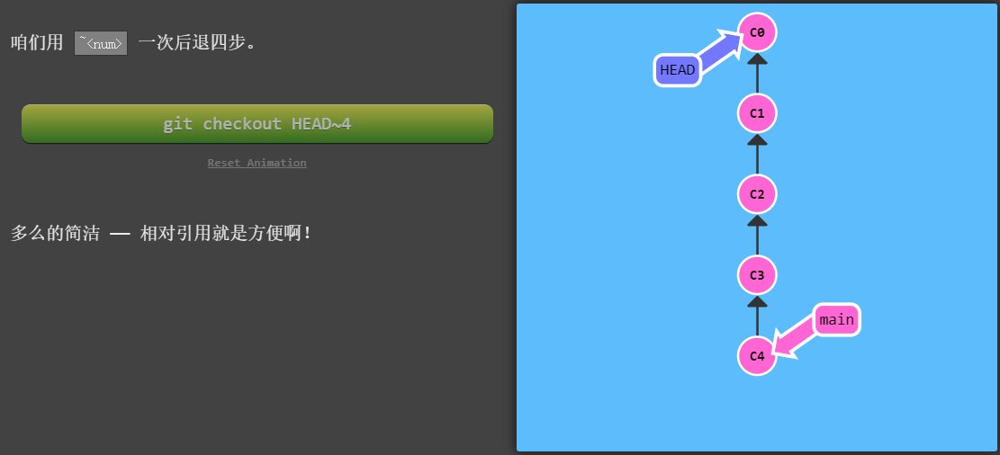
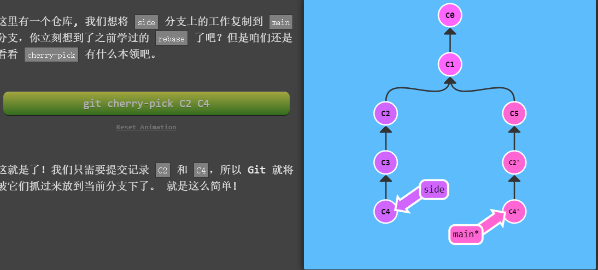
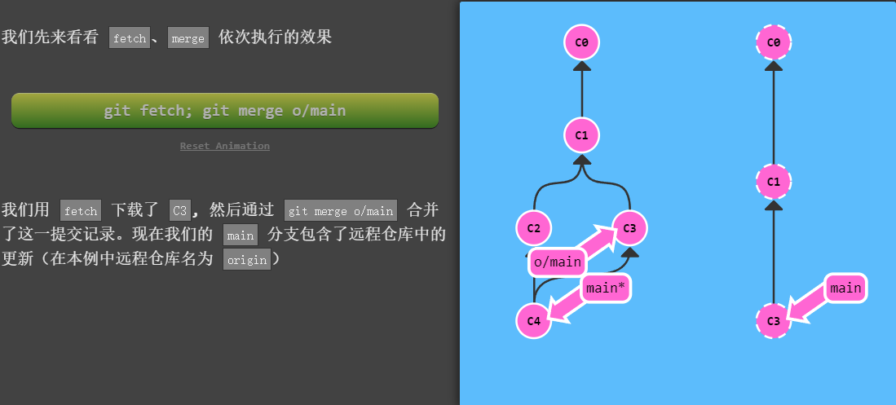
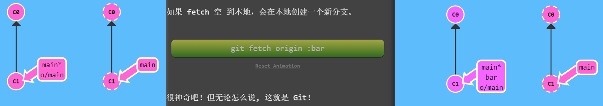

文件声明周期图


# Git版本控制系统中

## 总结

https://blog.csdn.net/bjbz_cxy/article/details/116703787?ops_request_misc=%257B%2522request%255Fid%2522%253A%2522171787556116800182753436%2522%252C%2522scm%2522%253A%252220140713.130102334..%2522%257D&request_id=171787556116800182753436&biz_id=0&utm_medium=distribute.pc_search_result.none-task-blog-2~blog~top_positive~default-1-116703787-null-null.nonecase&utm_term=git&spm=1018.2226.3001.4450

创造
克隆现有存储库

$ git clone ssh://user@domain.com/repo.git

创建一个新的本地存储库

$ git init

当地变化
Changed files in your working directory

$ git status

Changes to tracked files

$ git diff

将所有当前更改添加到下一个提交

$ git add .

在中添加一些更改到下一次提交

$ git add -p

提交跟踪文件中的所有本地更改

$ git commit -a

提交先前进行的更改

$ git commit

更改最后一次提交

不要修改已发布的提交！

$ git commit --amend

提交历史
显示所有提交，从最新开始

$ git log

显示特定文件随时间的变化e

$ git log -p

谁更改了中的内容和时间

$ git blame

分支机构和标签
列出所有现有分支

$ git branch -av

切换HEAD分支

$ git checkout

根据您当前的HEAD创建一个新分支

$ git branch

基于远程分支创建一个新的跟踪分支

$ git checkout --track

删除本地分支

$ git branch -d

用标签标记当前提交

$ git tag

更新和发布
列出所有当前配置的遥控器

$ git remote -v

显示有关遥控器的信息

$ git remote show

添加名为的新远程存储库

$ git remote add

从下载所有更改，但不要集成到HEAD中

$ git fetch

下载更改并直接合并/集成到HEAD中

$ git pull

在远程上发布本地更改

$ git push

删除遥控器上的分支

$ git branch -dr

发布标签

$ git push --tags

合并与基础
将合并到当前HEAD中

$ git merge

将当前的HEAD重新设置到

不要重新发布已发布的提交！

$ git rebase

中止基准

$ git rebase --abort

解决冲突后继续进行基准

$ git rebase --continue

使用您配置的合并工具解决冲突

$ git mergetool

使用编辑器手动解决冲突，并（在解决之后）将文件标记为已解决

$ git add

$ git rm

撤消
丢弃工作目录中的所有本地更改

$ git reset --hard HEAD

放弃特定文件中的本地更改

$ git checkout HEAD

还原提交（通过产生具有相反更改的新提交）

$ git revert

将HEAD指针重置为上一次提交

…并丢弃此后的所有更改

$ git reset --hard

…并将所有更改保留为未分阶段的更改

$ git reset

…并保留未提交的本地更改

$ git reset --keep

提交相关更改

提交应该是相关更改的包装。 例如，修复两个不同的错误应产生两个单独的提交。 小型提交使其他开发人员更容易理解更改，并在出现问题时将其回滚。 借助暂存区等工具以及仅暂存文件部分的功能，Git使得创建非常精细的提交变得容易。

————————————————

                            版权声明：本文为博主原创文章，遵循 CC 4.0 BY-SA 版权协议，转载请附上原文出处链接和本声明。

原文链接：https://blog.csdn.net/bjbz_cxy/article/details/116703787


## 初识


在学习 Git 时，请尽量理清你对其它版本管理系统已有的认识，如 CVS、Subversion 或 Perforce， 这样能帮助你使用工具时避免发生混淆。尽管 Git 用起来与其它的版本控制系统非常相似， 但它在对信息的存储和认知方式上却有很大差异，理解这些差异将有助于避免使用中的困惑。

#### 直接记录快照，而非差异比较

Git 和其它版本控制系统（包括 Subversion 和近似工具）的主要差别在于 Git 对待数据的方式。 从概念上来说，其它大部分系统以文件变更列表的方式存储信息，这类系统（CVS、Subversion、Perforce 等等） 将它们存储的信息看作是一组基本文件和每个文件随时间逐步累积的差异 （它们通常称作 **基于差异（delta-based）** 的版本控制）。

Git 不按照以上方式对待或保存数据。反之，Git 更像是把数据看作是==对小型文件系统的一系列快照==。 在 Git 中，每当你提交更新或保存项目状态时，它基本上就会对当时的全部文件创建一个快照并保存这个快照的索引。 为了效率，如果文件没有修改，Git 不再重新存储该文件，而是只保留一个链接指向之前存储的文件。 Git 对待数据更像是一个 **快照流**。

#### 近乎所有操作都是本地执行

在 Git 中的绝大多数操作都只需要访问本地文件和资源，一般不需要来自网络上其它计算机的信息。  因为你在本地磁盘上就有项目的完整历史，所以大部分操作看起来瞬间完成。

举个例子，要浏览项目的历史，Git 不需外连到服务器去获取历史，然后再显示出来——它只需直接从本地数据库中读取。 你能立即看到项目历史。

而用 Perforce 的话，没有连接服务器时几乎不能做什么事；而用 Subversion 和 CVS 的话， 你能修改文件，但不能向数据库提交修改（因为你的本地数据库离线了）。 这样似乎问题不大，但是你可能会惊喜地发现它带来的巨大的不同。

#### Git 保证完整性

Git 中所有的数据在存储前都计算校验和，然后以校验和来引用。 这意味着不可能在 Git 不知情时更改任何文件内容或目录内容。 这个功能建构在 Git 底层， 若你在传送过程中丢失信息或损坏文件，Git 就能发现。

Git 用以计算校验和的机制叫做 SHA-1 散列（hash，哈希）。 这是一个由 40 个十六进制字符（0-9 和 a-f）组成的字符串，基于 Git 中文件的内容或目录结构计算出来。 SHA-1 哈希看起来是这样：

```
24b9da6552252987aa493b52f8696cd6d3b00373
```

Git 中使用这种哈希值的情况很多，你将经常看到这种哈希值。 实际上，==Git 数据库中保存的信息都是以文件内容的哈希值来索引==，而不是文件名。

#### Git 一般只添加数据

你执行的 Git 操作，几乎只往 Git 数据库中 **添加** 数据。 你很难使用 Git 从数据库中删除数据，也就是说 Git 几乎不会执行任何可能导致文件不可恢复的操作。 同别的 VCS 一样，未提交更新时有可能丢失或弄乱修改的内容。但是一旦你提交快照到 Git 中， 就难以再丢失数据，特别是如果你定期的推送数据库到其它仓库的话。

这使得我们使用 Git 成为一个安心愉悦的过程，因为我们深知可以尽情做各种尝试，而没有把事情弄糟的危险。 更深度探讨 Git 如何保存数据及恢复丢失数据的话题，请参考[撤消操作](https://git-scm.com/book/zh/v2/ch00/_undoing)。

### 三种状态

现在请注意，如果你希望后面的学习更顺利，请记住下面这些关于 Git 的概念。 Git 有三种状态，你的文件可能处于其中之一： **已提交（committed）**、**已修改（modified）** 和 **已暂存（staged）**。

- 已修改表示修改了文件，但还没保存到数据库中。
- 已暂存表示对一个已修改文件的当前版本做了标记，使之包含在下次提交的快照中。
- 已提交表示数据已经安全地保存在本地数据库中。

这会让我们的 Git 项目拥有三个阶段：工作区、暂存区以及 Git 目录。


- 工作区是对项目的某个版本独立提取出来的内容。 这些从 Git 仓库的压缩数据库中提取出来的文件，放在磁盘上供你使用或修改。
- 暂存区是一个文件，保存了下次将要提交的文件列表信息，一般在 Git 仓库目录中。 按照 Git 的术语叫做“索引”，不过一般说法还是叫“暂存区”。
- Git 仓库目录是 Git 用来保存项目的元数据和对象数据库的地方。 这是 Git 中最重要的部分，==从其它计算机克隆仓库时，复制的就是这里的数据。==

基本的 Git 工作流程如下：

1. 在工作区中修改文件。
2. 将你想要下次提交的更改选择性地暂存，这样只会将更改的部分添加到暂存区。
3. 提交更新，找到暂存区的文件，将快照==**永久性存储**==到 Git 目录。

- 如果 Git 目录中保存着特定版本的文件，就属于 **已提交** 状态。 
- 如果文件已修改并放入暂存区，就属于 **已暂存** 状态。 
- 如果自上次检出后，作了修改但还没有放到暂存区域，就是 **已修改** 状态。


## 初次配置


下载

https://git-scm.com/book/zh/v2/%E8%B5%B7%E6%AD%A5-%E5%AE%89%E8%A3%85-Git


初次运行

https://git-scm.com/book/zh/v2/%E8%B5%B7%E6%AD%A5-%E5%88%9D%E6%AC%A1%E8%BF%90%E8%A1%8C-Git-%E5%89%8D%E7%9A%84%E9%85%8D%E7%BD%AE

```bash
# linux 下载
sudo apt install git-all
```

```cmd
git init # 创建一个名为 .git 的子目录，这个子目录含有你初始化的 Git 仓库中所有的必须文件，这些文件是 Git 仓库的骨干
git clone https://github.com/hyyed/Linux mylibgit # 从git仓库下载到本地，并重新命名为mylibgit
```

Git 支持多种数据传输协议。 上面的例子使用的是 `https://` 协议，不过你也可以使用 `git://` 协议或者使用 SSH 传输协议，比如 `user@server:path/to/repo.git` 。

```
$ git config --list
$ git config --global user.name "John Doe"
$ git config --global user.email johndoe@example.com
```

- 再次强调，如果使用了 `--global` 选项，那么该命令只需要运行一次，因为之后无论你在该系统上做任何事情， Git 都会使用那些信息。 当你想针对特定项目使用不同的用户名称与邮件地址时，可以在那个项目目录下运行没有 `--global` 选项的命令来配置。

```bash
# 配置git编辑器
$ git config --global core.editor 编辑器
```


```
Changes not staged for commit:
  (use "git add <file>..." to update what will be committed)
  (use "git restore <file>..." to discard changes in working directory)
```


## 基础

#### 暂存文件 git add

-i 交互

```bash
# 下创建新文件
touch jk1
$ git status
On branch main
Your branch is up to date with 'origin/main'.

Changes to be committed:
  (use "git restore --staged <file>..." to unstage)
        modified:   README.md

Untracked files: # 这里变化
  (use "git add <file>..." to include in what will be committed)
        jk1
```

```bash
# 跟踪新文件
$ git add jk1
$ git status
On branch main
Your branch is up to date with 'origin/main'.

Changes to be committed:
  (use "git restore --staged <file>..." to unstage)
        modified:   README.md
        new file:   jk1 #这里变化
```

```bash
# 下修改jk1 文件后
$ git status
On branch main
Your branch is up to date with 'origin/main'.

Changes to be committed:
  (use "git restore --staged <file>..." to unstage)
        modified:   README.md
        new file:   jk1
        
Changes not staged for commit: # 这里变化
  (use "git add <file>..." to update what will be committed)
  (use "git restore <file>..." to discard changes in working directory)
        modified:   jk1
```

只要在 `Changes to be committed` 这行下面的，就说明是已暂存状态。 如果此时提交，那么该文件在你运行 `git add` 时的版本将被留存在后续的历史记录中。 你可能会想起之前我们使用 `git init` 后就运行了 `git add <files>` 命令，开始跟踪当前目录下的文件。 `git add` 命令使用文件或目录的路径作为参数；如果参数是目录的路径，该命令将递归地跟踪该目录下的所有文件。

```bash
$ git status -s
?? LICENSE.txt # ?? 新添加
A  lib/git.rb # A ==新添加到暂存区==
AD testdele   # D ==已经删除==
 M README     # M ==修改过的文件==
MM Rakefile   # 

M  lib/simplegit.rb
```

- ==新添加的未跟踪文件==前面有 `??` 标记，
- ==新添加到暂存区==中的文件前面有 `A` 标记，
- ==修改过的文件==前面有 `M` 标记。 
- 输出中有两栏，左栏指明了暂存区的状态，右栏指明了工作区的状态。

#### 忽略文件 gitignore

配置地址：https://github.com/github/gitignore

git：：https://git-scm.com/book/zh/v2/Git-%E5%9F%BA%E7%A1%80-%E8%AE%B0%E5%BD%95%E6%AF%8F%E6%AC%A1%E6%9B%B4%E6%96%B0%E5%88%B0%E4%BB%93%E5%BA%93


在 `.gitignore` 文件中添加 `!include /path/to/other/.gitignore` 来导入其他 `.gitignore` 文件的规则。注意，`!include` 指令是 Git 2.18.0 及更高版本中引入的。在更早的版本中，你可能需要使用其他方法（如链接或复制）来共享 `.gitignore` 文件的规则。


```bash
# 创建一个名为 .gitignore 的文件，列出要忽略的文件的模式。 
$ cat .gitignore
*.[oa]  #忽略所有以 .o 或 .a 结尾的文件
*~
```

```shell
# 忽略所有的 .a 文件
*.a
# 但跟踪所有的 lib.a，即便你在前面忽略了 .a 文件
!lib.a
# 导入其他 `.gitignore` 文件的规则
!include /path/to/other/.gitignore
# 只忽略当前目录下的 TODO 文件，而不忽略 subdir/TODO
/TODO
# 忽略任何目录下名为 build 的文件夹
build/
# 忽略 doc/notes.txt，但不忽略 doc/server/arch.txt
doc/*.txt
# 忽略 doc/ 目录及其所有子目录下的 .pdf 文件
doc/**/*.pdf
```

-  星号（*）匹配零个或多个任意字符；
- [abc] 匹配任何一个列在方括号中的字符 （这个例子要么匹配一个 a，要么匹配一个 b，要么匹配一个 c）；
-  问号（?）只匹配一个任意字符；
- 如果在方括号中使用短划线分隔两个字符， 表示所有在这两个字符范围内的都可以匹配（比如 [0-9] 表示匹配所有 0 到 9 的数字）。 
- 使用两个星号（\*\*）表示匹配任意中间目录，比如 a/**/z 可以匹配 a/z 、 a/b/z 或 a/b/c/z 等。


#### git commit 提交暂存文件 

给 `git commit` 加上 `-a` 选项，Git 就会自动把所有已经跟踪（追踪即暂存）过的文件暂存起来一并提交，从而跳过 `git add` 步骤：

提交之前不再需要 `git add` 文件“CONTRIBUTING.md”了。 这是因为 `-a` 选项使本次提交包含了所有修改过的文件。 这很方便，但是要小心，有时这个选项会将不需要的文件添加到提交中。


#### 尚未暂存的文件的更新部分 git diff 

要查看尚未暂存的文件更新了哪些部分，不加参数直接输入 `git diff`：

Git Diff 的插件版本

在本书中，我们使用 `git diff` 来分析文件差异。 但是你也可以使用图形化的工具或外部 diff 工具来比较差异。 可以使用 `git difftool` 命令来调用 emerge 或 vimdiff 等软件（包括商业软件）输出 diff 的分析结果。 使用 `git difftool --tool-help` 命令来看你的系统支持哪些 Git Diff 插件。

```shell
# 取回更新后，会返回一个FETCH_HEAD ，指的是某个branch在服务器上的最新状态，我们可以在本地通过它查看刚取回的更新信息
# 双点 .. 语法表示一个范围，从 jkcode 的当前提交开始（不包括该提交），到 origin/jkcode 的当前提交结束（包括该提交）。
$ git log -p FETCH_HEAD
# 比较 jkcode与FETCH_HEAD之间的区别
$ git log jkcode..FETCH_HEAD
#### 直接比较俩个库的差异
$ git diff jkcode..origin/jkcode
$ git difftoll jkcode..origin/jkcode

# 查看工作区和版本库里面最新版本的区别：
git diff HEAD -- readme.txt 

# 直接比较工作区文件和远程仓库中的文件
git diff origin/main -- filename
git diff pb/iss53 -- jk1

# 从远程仓库获取最新的更新 # 再比较本地仓库和远程仓库之间的区别
git fetch origin
git diff origin/main
# 比较暂存区与最后一次提交之间的差异（下俩同义词）
git diff --staged 
git diff --cached 


# 本地分支与远程区别
$ git log jkcode..origin/jkcode

# 三个点 ... 表示全范围差异，它会列出两个分支上所有的提交，并使用 < 和 > 符号来指示提交属于哪个分支。
git log --left-right --graph --cherry-pick --oneline jkcode...origin/jkcode
> commit ec1d2c0dc5ee6a4ff53da1d31a876212feedc46e (origin/jkcode)
  Author: hyyed <146085251+hyyed@users.noreply.github.com>
  Date:   Mon Jun 10 00:23:24 2024 +0800

      Create nihao

< commit dff89d9e9018b2edd7aa47862792ea9bae66d9d9 (HEAD -> jkcode)
  Author: Libubai <jk530592371@gmail.com>
  Date:   Sun Jun 9 23:17:11 2024 +0800

      commit jk.bat

```


https://blog.csdn.net/qq_30901541/article/details/116933276

https://juejin.cn/post/6871231343319187470

```shell
#1、
修改 C:\Program Files\Beyond Compare 4\BCUnrar.dll ,这个文件重命名或者直接删除，则会新增30天试用期，再次打开提示还有28天试用期。
# 2、写一个脚本删除这个注册表
reg delete "HKEY_CURRENT_USER\SOFTWARE\Scooter Software\Beyond Compare 5" /v CacheID /f
```

```shell
# 查看有哪些对比工具可以设置命令 	
git difftool --tool-help
# 然后再设置对不工具 	
git config --global diff.tool bc3
git config --global difftool.bc3.path "C:/Program Files (x86)/Beyond Compare 3/BComp.exe"
# 设置默认的合并工具设置和对比工具类似
git config --global merge.tool bc3
git config --global mergetool.bc3.path "C:/Program Files (x86)/Beyond Compare 3/BComp.exe"

git config --global difftool.bc3.path C:/Program Files (x86)/Beyond Compare 3/BComp.exe" "$LOCAL" "$REMOTE"
```


##### 修改前

```
$ git config --list
http.sslcainfo=C:/Program Files/Git/mingw64/ssl/certs/ca-bundle.crt
http.sslbackend=openssl
diff.astextplain.textconv=astextplain
filter.lfs.clean=git-lfs clean -- %f
filter.lfs.smudge=git-lfs smudge -- %f
filter.lfs.process=git-lfs filter-process
filter.lfs.required=true
credential.helper=manager
core.editor=vim
core.autocrlf=input
user.email=jk530592371@gmail.com
user.name=Libubai
alias.last=log -1 HEAD
alias.jkbrach=log --oneline --decorate
alias.trstatus=log --name-status  --pretty=format:'%C(red)%h%Creset[%C(yellow)%p%Creset]--%C(bold green)[%s] %                                                                                                    C(cyan)<%an> %C(auto)%ad%Creset' --graph
alias.treestatus=log --name-status  --pretty=format:'%C(red)%h%Creset[%C(yellow)%p%Creset]--%C(bold green)[%s]                                                                                                     %C(cyan)<%an> %C(auto)%ad%Creset' --graph
alias.trstat=log --stat  --pretty=format:'%C(red)%h%Creset[%C(yellow)%p%Creset]--%C(bold green)[%s] %C(cyan)<%                                                                                                    an> %C(auto)%ad%Creset' --graph
remote.origin.proxy=
gui.encoding=utf-8
http.sslverify=false
color.diff.meta=blue black bold
diff.tool=bc
difftool.bc3.path=c:/Program Files/Beyond Compare 5/BComp.exe
merge.tool=bc
mergetool.bc.path=C:/Program Files/Beyond Compare 5/BComp.exe
difftool.bc.path=C:/Program Files/Beyond Compare 5/BComp.exe
core.repositoryformatversion=0
core.filemode=false
core.bare=false
core.logallrefupdates=true
core.symlinks=false
core.ignorecase=true
remote.origin.url=git@gitee.com:jiagnkun/jklinux.git
remote.origin.fetch=+refs/heads/*:refs/remotes/origin/*
branch.master.remote=origin
branch.master.merge=refs/heads/master

```


#### 删除文件 git rm

```shell
git add aaa.txt
git commit -m "add aaa.txt"

rm aaa.txt		# 删除工作文件
git rm aaa.txt   # 删除暂存区数据（之后下面的操作二选一）
git commit -m "rm aaa.txt" # 删除本地仓库
git checkout -- aaa.txt    # 从本地仓库恢复到工作区
```

git rm ：删除工作目录和git暂存区的文件

1. 要从 Git 中移除某个文件，就必须要从已跟踪文件清单中移除（确切地说，是从暂存区域移除），然后提交。 可以用 `git rm` 命令完成此项工作，并连带从工作目录中删除指定的文件，这样以后就不会出现在未跟踪文件清单中了。

2. 如果要删除之前修改过或已经放到暂存区的文件，则必须使用强制删除选项 `-f`（译注：即 force 的首字母）

3. 如果当你忘记添加 `.gitignore` 文件，不小心把一个很大的日志文件或一堆 `.a` 这样的编译生成文件添加到暂存区时，这一做法尤其有用。 为达到这一目的，使用 `--cached` 选项：

```shell
# 删除暂存区，但保留本地文件
$ git rm --cached README
# 参数 -n，此时只是预览涉及的文件，不会真正删除
$ git rm -r -n --cached .

# 将删除操作提交至远程仓库
git commit -m "提交信息"
git push	
```

4. `git rm` 命令后面可以列出文件或者目录的名字，也可以使用 `glob` 模式。

```shell
$ git rm log/\*.log
```

注意到星号 `*` 之前的反斜杠 `\`， 因为 Git 有它自己的文件模式扩展匹配方式，所以我们不用 shell 来帮忙展开。 此命令删除 `log/` 目录下扩展名为 `.log` 的所有文件。


#### 恢复 checkout HEAD -- file

假设你不小心删除了一个名为 `example.txt` 的文件，你可以使用以下命令来恢复它：

1. **恢复单个文件**：

   ```shell
   # 恢复这个文件后 加入到暂存区的文件也会取消加入
   git checkout HEAD -- example.txt
   ```

2. **恢复所有文件**：

   ```
   git checkout HEAD -- . 
   ```

3. **使用 `git restore` 恢复单个文件**：

   ```
   git restore example.txt
   ```

4. **使用 `git restore` 恢复所有文件**：

   ```
   git restore .
   ```

   

   

#### 移动文件 git mv

```shell
$ git mv file_from file_to
```

其实，运行 `git mv` 就相当于运行了下面三条命令：

 所以 ==在使用其他工具重命名文件时，记得在提交前 `git rm` 删除旧文件名，再 `git add` 添加新文件名。==

```bash
$ mv README.md README
$ git rm README.md
$ git add README
```


#### git log 查看提交的历史日志

```shell
$ git log --pretty=format:"%h - %an, %ar : %s"
$ git log --pretty=oneline
$ git log --oneline
 git log --graph --pretty=oneline --abbrev-commit


# 查看具体操作的内容
$ git log  --name-status
$ git reflog # 建议  查看命令历史

# 取回更新后，会返回一个FETCH_HEAD ，指的是某个branch在服务器上的最新状态，我们可以在本地通过它查看刚取回的更新信息
# 双点 .. 语法表示一个范围，从 jkcode 的当前提交开始（不包括该提交），到 origin/jkcode 的当前提交结束（包括该提交）。
$ git log -p FETCH_HEAD
# 比较 jkcode与FETCH_HEAD之间的区别
$ git log jkcode..FETCH_HEAD
#### 直接比较俩个库的差异
$ git diff jkcode..origin/jkcode
$ git difftoll jkcode..origin/jkcode

# 本地分支与远程区别
$ git log jkcode..origin/jkcode

# 三个点 ... 表示全范围差异，它会列出两个分支上所有的提交，并使用 < 和 > 符号来指示提交属于哪个分支。
$ git log --left-right --graph --cherry-pick --oneline jkcode...origin/jkcode
$ git log --name-status --oneline  --left-right --graph  main...origin/main
$ git log --left-right --graph  HEAD...origin/jkcode
> commit ec1d2c0dc5ee6a4ff53da1d31a876212feedc46e (origin/jkcode)
  Author: hyyed <146085251+hyyed@users.noreply.github.com>
  Date:   Mon Jun 10 00:23:24 2024 +0800

      Create nihao

< commit dff89d9e9018b2edd7aa47862792ea9bae66d9d9 (HEAD -> jkcode)
  Author: Libubai <jk530592371@gmail.com>
  Date:   Sun Jun 9 23:17:11 2024 +0800

      commit jk.bat

$ git log --name-status --decorate --oneline   --pretty=format:"%h-%an,%cd : %s" --graph --all
git log --graph --pretty=format:'%Cred%h%Creset -%C(yellow)%d%Creset %s %Cgreen(%cr) %C(bold blue)<%an>%Creset' --abbrev-commit
$ git log --name-status  --pretty=format:'%C(auto)%h-%C(bold green)[%s] %C(cyan)<%an> %C(auto)%cd%creset' --graph --all

# git tree=status
git log --name-status  --pretty=format:'%C(red)%h%Creset[%C(yellow)%p%Creset]--%C(bold green)[%s] %C(cyan)<%an> %C(auto)%ad%Creset' --graph
# git trstat
git log --stat --pretty=format:'%C(red)%h%Creset[%C(yellow)%p%Creset]--%C(bold green)[%s] %C(cyan)<%an> %C(auto)%ad%Creset' --graph


git log --stat --pretty=format:'%C(red)%h%Creset[%C(yellow)%p%Creset]--%C(bold green)[%s] %C(cyan)<%cn> %C(auto)%ad%Creset' --graph

git log --oneline --stat --graph --pretty

```

git reflog可以查看当前版本库的提交历史，凡是对仓库版本进行迭代的都会出现在这个里面，包括你回滚版本都会出现在这个历史中

使用`-` `+`表示差异，`-`是删除行，`+`是新增行；未修改的上下文信息预设为三行，用作修改的地方）；

1. 最后一个有用的选项是`-p`，用来显示每笔提交所做的修改内容；你还可以加上`-2`选项，限制只输出最后两笔提交内容。

```shell
$ git log -p -2
```

2. 如果您想查看每份报告提交信息简略的统计信息，您可以使用选择`--stat`项目：

```shell
$ git log --stat
```

3. 另一个实际使用的挑选项目是，用作备用金`--pretty`设计提供的系统；有内部建构的挑选项目供你挑选，其中挑选项目`oneline`将每一笔提交显示成一行，针对性的提交时顾问；更进一步，、挑选`short`项目输出的系统大致相同，但分担一些或者多一些资讯。

```shell
git log --pretty=oneline
```

4. 你可以指定自订的输入格式

```shell
$ git log --pretty=format:"%h - %an, %ar : %s"
$ git log --name-status --decorate --oneline   --pretty=format:"%h-%an,%cd : %s" --graph --all

git log  --name-status
git reflog # 建议
```


[`git log --pretty=format`实际用的選項](https://git-scm.com/book/zh/v2/Git-%E5%9F%BA%E7%A1%80-%E6%9F%A5%E7%9C%8B%E6%8F%90%E4%BA%A4%E5%8E%86%E5%8F%B2#pretty_format)列表`format`一些更实际用的選項。

| 選項  | 輸出說明                                   |
| :---- | :----------------------------------------- |
| `%H`  | 该提交 SHA-1 哈希值                        |
| `%h`  | 该提交简短的SHA-1杂值                      |
| `%T`  | “樹（tree）”物的 SHA-1 杂湊值              |
| `%t`  | 「樹」物簡短的SHA-1杂湊值                  |
| `%P`  | 親代（parent）提交的 SHA-1 杂湊值          |
| `%p`  | 親代提交簡短的 SHA-1 杂湊值                |
| `%an` | 作者                                       |
| `%ae` | 作者电子邮                                 |
| `%ad` | 发布日期（依据--date选择值而有不同的格式） |
| `%ar` | 作者日期，对应时间格式。(小时分钟以前)     |
| `%cn` | 提交者名字                                 |
| `%ce` | 提交者电子邮箱                             |
| `%cd` | 提交者日期                                 |
| `%cr` | 提交者的日期，对应时间格式。               |
| `%s`  | 標題                                       |


| 選項 选项             | 說明                                                     |
| :-------------------- | :------------------------------------------------------- |
| `-(n)`                | 只显示最后 n 笔提交。                                    |
| `--since`，`--after`  | 搜索结果特定日期后的承诺。                               |
| `--until`，`--before` | 广告特定日期之前的提交。                                 |
| `--author`            | 列出作者名字符合指定字串的提交。                         |
| `--committer`         | 该广告位的宗旨是让每一个人都满意，让每一个人都满意。     |
| `--grep`              | 在 Facebook 上关注我们，了解提交消息中符合字符串的内容。 |
| `-S`                  | 搜索结果_advisory_translate_2020/03/20 17:26:27          |


#### 其他show

```shell
# 列出所有被跟踪的文件
git ls-files

# 列出当前分支的所有文件
git ls-tree -r HEAD
```


#### 撤销 `--amend`

一个常见的恢复原操作发生在你太早提交（commit），继续提交才可以忘记加入某些档案，或者写了错误的提交讯息； 如果你想要重新提交，你可以使用下列选项提交命令`--amend`：

```shell
$ git commit --amend
```

这个命令会再次把预备区（staging area）拿来提交，如果你从上次提交以来没有对任何日志文件进行修改（例如：在上一次提交后，我继续执行此命令），那么整个副本将会和上次提交的一模一样，唯一有可能更动态的就是提交消息。


例如：如果你提交后才知道你想把某些忘记的预留（阶段）的修改也一併加入到上一个提交中，你可以这样做：

```shell
$ git commit -m 'initial commit'
$ git add forgotten_file
$ git commit --amend
```

最后一次会得到一个提交——第二次的提交取代了第一次提交的结果。


#### 复原

https://git-scm.com/book/zh-tw/v2/Git-%E5%9F%BA%E7%A4%8E-%E5%BE%A9%E5%8E%9F

使用`git reset HEAD <file>...`将案移出预留区；因此，让我们依循该建议将`CONTRIBUTING.md`案移出预留区：（很危险）

```shell
Changes not staged for commit: # 移除的文件到这 #  CONTRIBUTING.md进程现在又回到了“修改”但“未预存（unstaged）”的状态。
  (use "git add <file>..." to update what will be committed)
  (use "git checkout -- <file>..." to discard changes in working directory) 

    modified:   CONTRIBUTING.md
```

关于`git reset`命令，到目前为止所有你需要知道的就只有这个神奇的用法；我们将在[Reset Demystified](https://git-scm.com/book/zh-tw/v2/ch00/r_git_reset)中宣布`reset`更多的细节，包括「它可以做什么」以及「如何操控它项目真正有趣的事情」


#### 回退 reset

我们要把当前版本`append GPL`回退到上一个版本`add distributed`，就可以使用`git reset`命令：

```shell
git reset --hard HEAD^
HEAD is now at e475afc add distributed
```

- --hard会回退到上个版本的已提交状态，
- --soft会回退到上个版本的未提交状态，
- --mixed会回退到上个版本已添加但未提交的状态。


```shell
# 把暂存区的修改撤销掉（unstage），重新放回工作区
# 执行这个命令之后就可以使用 git checkout -- readme.txt 把readme.txt文件在工作区的修改全部撤销
git reset HEAD readme.txt
```


#### 撤销修改 checkout --	

```shell
# 把readme.txt文件在工作区的修改全部撤销（撤销到暂存区的最后一个状态？）
git checkout -- readme.txt
```

意思就是，把readme.txt文件在工作区的修改全部撤销，这里有两种情况：

- 一种是readme.txt自修改后还没有被放到暂存区，现在，撤销修改就回到和版本库一模一样的状态；

- 一种是readme.txt已经添加到暂存区后，又作了修改，现在，撤销修改就回到添加到暂存区后的状态。


总之，就是让这个文件回到最近一次git commit或git add时的状态。


### 远程仓库使用 remote

#### git remote -v 查看远程仓库

前提在当前目录下

这表示我们能非常方便地拉取其它用户的贡献。我们还可以拥有向他们推送的权限，

```shell
# 下边 在所在仓库的目录 （即路径不同）
李不白@DESKTOP-6OV778H MINGW64 /d/Linux/code (main)
$ git remote -v
Linux   https://github.com/hyyed/Linux.git (fetch)
Linux   https://github.com/hyyed/Linux.git (push)
Linuz   https://github.com/hyyed/Linux.git (fetch)
Linuz   https://github.com/hyyed/Linux.git (push)

# 下边进入到获取的仓库
李不白@DESKTOP-6OV778H MINGW64 /d/Linux/code (main)
$ cd Linux

李不白@DESKTOP-6OV778H MINGW64 /d/Linux/code/Linux (main)
$ git remote -v
origin  https://github.com/hyyed/Linux (fetch)
origin  https://github.com/hyyed/Linux (push)
```

#### git remote add <name\> <url\> 创建远程仓库

==<name\> ：是给远程仓库取得别名==

将别人的仓库添加到自己的仓库中？

```shell
$ git remote add pb https://github.com/paulboone/ticgit
$ git remote -v
origin	https://github.com/schacon/ticgit (fetch)
origin	https://github.com/schacon/ticgit (push)
pb	https://github.com/paulboone/ticgit (fetch)
pb	https://github.com/paulboone/ticgit (push)

# 删除远程仓库
$ git remote rm origin
# 此处的“删除”其实是解除了本地和远程的绑定关系，并不是物理上删除了远程库。远程库本身并没有任何改动。要真正删除远程库，需要登录到GitHub，在后台页面找到删除按钮再删除。
```

现在你可以在命令行中使用字符串 ==`pb` 来代替整个 URL==。 例如，如果你想拉取 Paul 的仓库中有但你没有的信息，可以运行 `git fetch pb`：

我们将会在 [Git 分支](https://git-scm.com/book/zh/v2/ch00/ch03-git-branching) 中详细介绍什么是分支以及如何使用分支。

```shell
## 1.把一个已有的本地仓库与远程仓库关联
# 在本地的learngit仓库下运行命令
$ git remote add origin git@github.com:michaelliao/learngit.git
# 把上面的michaelliao替换成你自己的GitHub账户名

## 2.下一步，就可以把本地库的所有内容推送到远程库上：
$ git push -u origin master
# 由于远程库是空的，我们第一次推送master分支时，加上了-u参数，Git不但会把本地的master分支内容推送的远程新的master分支，还会把本地的master分支和远程的master分支关联起来，在以后的推送或者拉取时就可以简化命令。

```

#### 克隆远程仓库 clone

```shell
$ git clone git@github.com:michaelliao/gitskills.git
Cloning into 'gitskills'...
remote: Counting objects: 3, done.
remote: Total 3 (delta 0), reused 0 (delta 0), pack-reused 3
Receiving objects: 100% (3/3), done.
```

使用`https`除了速度慢以外，还有个最大的麻烦是每次推送都必须输入口令，但是在某些只开放`http`端口的公司内部就无法使用`ssh`协议而只能用`https`。


#### git fetch <origin\> branch拉取到本地仓库 merge

必须注意 `git fetch` 命令只会将数据下载到你的本地仓库——它并不会自动合并或修改你当前的工作。 当准备好时你必须手动将其合并入你的工作。

在执行 `git fetch` 之后，你可以使用 `git log HEAD..origin/master` 来查看从远程 `master` 分支获取到但你本地还没有的提交。

```shell
git fetch origin master #这条命令会从 origin 远程仓库的 master 分支获取最新的更改。

# 在 git fetch 时直接看到取回的提交信息，可以在命令后加上 --verbose 或 -v 选项，这样 Git 会在执行过程中输出更多的信息。
git fetch --verbose

# 拉取所有
git fetch 
```

`git fetch` 是 Git 中的一个命令，用于从远程仓库获取最新的提交，但不会自动合并或修改你当前的工作。执行 `git fetch` 后，你可以看到你的本地仓库与远程仓库之间的差异。

```shell
# 取回更新后，会返回一个FETCH_HEAD ，指的是某个branch在服务器上的最新状态，我们可以在本地通过它查看刚取回的更新信息
# 双点 .. 语法表示一个范围，从 jkcode 的当前提交开始（不包括该提交），到 origin/jkcode 的当前提交结束（包括该提交）。
$ git log -p FETCH_HEAD
# 比较 jkcode与FETCH_HEAD之间的区别
$ git log jkcode..FETCH_HEAD
#### 直接比较俩个库的差异
$ git diff jkcode..origin/jkcode
$ git difftoll jkcode..origin/jkcode

# 直接比较工作区文件和远程仓库中的文件
git diff origin/main -- filename

# 从远程仓库获取最新的更新 # 再比较本地仓库和远程仓库之间的区别
git fetch origin
git diff origin/main
# 比较暂存区与最后一次提交之间的差异
git diff --staged 


# 本地分支与远程区别
$ git log jkcode..origin/jkcode

# 三个点 ... 表示全范围差异，它会列出两个分支上所有的提交，并使用 < 和 > 符号来指示提交属于哪个分支。
git log --left-right --graph --cherry-pick --oneline jkcode...origin/jkcode
> commit ec1d2c0dc5ee6a4ff53da1d31a876212feedc46e (origin/jkcode)
  Author: hyyed <146085251+hyyed@users.noreply.github.com>
  Date:   Mon Jun 10 00:23:24 2024 +0800

      Create nihao

< commit dff89d9e9018b2edd7aa47862792ea9bae66d9d9 (HEAD -> jkcode)
  Author: Libubai <jk530592371@gmail.com>
  Date:   Sun Jun 9 23:17:11 2024 +0800

      commit jk.bat

```


#### git pull 拉取合并

这与 `git pull` 有所不同，`git pull` 会获取最新的提交并自动合并到你的当前分支。

```shell
\* `git fetch` 只是从远程获取更改，不会更改你的本地工作目录或分支。   
* `git pull` 是 `git fetch` 和 `git merge` 的组合，它会获取远程的更改并自动合并到你的当前分支。

如果你想将这些更改合并到你的当前分支，你需要在 git fetch 之后执行 git merge。
```

==默认情况下，==

- `git clone` 命令会自动设置本地 master 分支跟踪克隆的远程仓库的 `master` 分支（或其它名字的默认分支）。
-  `git pull` 通常会从最初克隆的服务器上抓取数据并自动尝试合并到当前所在的分支。


#### git push 推送到远程仓库

当你想分享你的项目时，必须将其推送到上游。 这个命令很简单：`git push <remote> <branch>`。 当你想要将 `master` 分支推送到 `origin` 服务器时（==再次说明，克隆时通常会自动帮你设置好那两个名字==）， 那么运行这个命令就可以将你所做的备份到服务器：

```shell
# 只有第一次推送时才能成功
$ git push origin master
git push -u origin master #第一次提交带上u
```

只有当你有所克隆服务器的写入权限，并且之前没有人推送过时，这条命令才能生效。 当你和其他人在同一时间克隆，他们先推送到上游然后你再推送到上游，你的推送就会毫无疑问地被拒绝。 你必须==先抓取他们的工作并将其合并进你的工作后才能推送==。

-u：将本地仓库分支与远程仓库分支一起合并，就是说将master的分支也提交上去，这样你就可以在远程仓库上看到你在本地仓库的master中创建了多少分支，不加这个参数只将当前的master与远程的合并，没有分支的历史记录，也不能切换分支


#### git remote show  <remote\>远程与本地的可push、push

如果想要查看某一个远程仓库的更多信息，可以使用 `git remote show <remote>` 命令。 如果想以一个特定的缩写名运行这个命令，例如 `origin`，会得到像下面类似的信息：

```shell
$ git remote show origin
* remote origin
  Fetch URL: https://github.com/schacon/ticgit
  Push  URL: https://github.com/schacon/ticgit
  HEAD branch: master
  Remote branches:
    master                               tracked
    dev-branch                           tracked
  Local branch configured for 'git pull':
    master merges with remote master
  Local ref configured for 'git push':
    master pushes to master (up to date)
```

它同样会列出远程仓库的 URL 与跟踪分支的信息。 这些信息非常有用，它告诉你正处于 `master` 分支，并且如果运行 `git pull`， 就会抓取所有的远程引用，然后将远程 `master` 分支合并到本地 `master` 分支。 它也会列出拉取到的所有远程引用。

这是一个经常遇到的简单例子。 如果你是 Git 的重度使用者，那么还可以通过 `git remote show` 看到更多的信息。

```shell
$ git remote show origin
* remote origin
  URL: https://github.com/my-org/complex-project
  Fetch URL: https://github.com/my-org/complex-project
  Push  URL: https://github.com/my-org/complex-project
  HEAD branch: master
  Remote branches:
    master                           tracked
    dev-branch                       tracked
    markdown-strip                   tracked
    issue-43                         new (next fetch will store in remotes/origin)
    issue-45                         new (next fetch will store in remotes/origin)
    refs/remotes/origin/issue-11     stale (use 'git remote prune' to remove)
  Local branches configured for 'git pull':
    dev-branch merges with remote dev-branch
    master     merges with remote master
  Local refs configured for 'git push':
    dev-branch                     pushes to dev-branch                     (up to date)
    markdown-strip                 pushes to markdown-strip                 (up to date)
    master                         pushes to master                         (up to date)
```

1. 这个命令列出了当你在特定的分支上执行 `git push` 会自动地推送到哪一个远程分支。 
2. 它也同样地列出了哪些远程分支不在你的本地，哪些远程分支已经从服务器上移除了，
3. 还有当你执行 `git pull` 时哪些本地分支可以与它跟踪的远程分支自动合并。


#### git remote rename 重命名仓库

```shell
$ git remote rename pb paul
$ git remote
origin
paul
```

```shell
# 删除
$ git remote remove paul
$ git remote
origin
```


#### 别名 alias 

Git 并不会在你输入部分命令时自动推断出你想要的命令。 如果不想每次都输入完整的 Git 命令，可以通过 `git config` 文件来轻松地为每一个命令设置一个别名。

```shell
$ git config --global alias.co checkout
$ git config --global alias.br branch
$ git config --global alias.ci commit
$ git config --global alias.st status

# 查看别名
git config --get-regexp alias.*
# 删除别名
git config --unset alias.st
# 上面俩个操作。注意：这些操作会修改你的 Git 配置文件（通常是 ~/.gitconfig 或项目目录下的 .git/config），所以请确保你有足够的权限来执行这些命令，并且了解这些修改对你的 Git 配置有何影响。
```

==有用的例子== 

为了解决取消暂存文件的易用性问题，可以向 Git 中添加你自己的取消暂存别名：

```shell
$ git config --global alias.unstage 'reset HEAD --'
```

这会使下面的两个命令等价：

```shell
$ git unstage fileA
$ git reset HEAD -- fileA
```

这样看起来更清楚一些。 通常也会添加一个 `last` 命令，像这样：

```shell
$ git config --global alias.last 'log -1 HEAD'
```

这样，可以轻松地看到最后一次提交：

```shell
$ git last
commit 66938dae3329c7aebe598c2246a8e6af90d04646
Author: Josh Goebel <dreamer3@example.com>
Date:   Tue Aug 26 19:48:51 2008 +0800

    test for current head

    Signed-off-by: Scott Chacon <schacon@example.com>
```


##### 执行外部命令

可以看出，Git 只是简单地将别名替换为对应的命令。 然而，你可能想要执行外部命令，而不是一个 Git 子命令。 如果是那样的话，可以在命令前面加入 `!` 符号。 如果你自己要写一些与 Git 仓库协作的工具的话，那会很有用。 我们现在演示将 `git visual` 定义为 `gitk` 的别名：

```shell
$ git config --global alias.visual '!gitk'
```


### 标签 tag

https://git-scm.com/book/zh/v2/Git-%E5%9F%BA%E7%A1%80-%E6%89%93%E6%A0%87%E7%AD%BE


```shell
# 查看标签
git tag
git tag -l
```

#### 创建标签

Git 支持两种标签：轻量标签（lightweight）与附注标签（annotated）。

轻量标签很像一个不会改变的分支——它只是某个特定提交的引用。

而附注标签是存储在 Git 数据库中的一个完整对象， 它们是可以被校验的，其中包含打标签者的名字、电子邮件地址、日期时间， 此外还有一个标签信息，并且可以使用 GNU Privacy Guard （GPG）签名并验证。 通常会建议创建附注标签，这样你可以拥有以上所有信息。但是如果你只是想用一个临时的标签， 或者因为某些原因不想要保存这些信息，那么也可以用轻量标签。

#### git tag -a v -m “” 附注标签

在 Git 中创建附注标签十分简单。 最简单的方式是当你在运行 `tag` 命令时指定 `-a` 选项：

```shell
$ git tag -a v1.4 -m "my version 1.4"
$ git tag
v1.4
```

`-m` 选项指定了一条将会存储在标签中的信息。 如果没有为附注标签指定一条信息，Git 会启动编辑器要求你输入信息。

```shell
$ git show v1.4
tag v1.4
Tagger: Libubai <jk530592371@gmail.com>
Date:   Thu Jun 6 23:05:49 2024 +0800

hello

commit c27f5f6a8305fee4195ac2265ba4ff4207083329 (HEAD -> main, tag: v1.4)
Author: Libubai <jk530592371@gmail.com>
Date:   Thu Jun 6 21:14:37 2024 +0800
```


#### git tag v 轻量标签

另一种给提交打标签的方式是使用轻量标签。 轻量标签本质上是将提交校验和存储到一个文件中——没有保存任何其他信息。 创建轻量标签，不需要使用 `-a`、`-s` 或 `-m` 选项，只需要提供标签名字：

```shell
$ git tag v1.4-lw
$ git tag
v0.1
v1.3
v1.4
v1.4-lw
v1.5
```

这时，如果在标签上运行 `git show`，你不会看到额外的标签信息。

==效果==

```
c27f5f6a8305fee4195ac2265ba4ff4207083329 (HEAD -> main, tag: v1.4, tag: nihao) 
```


#### git tag -a v CRC后期打标签 

你也可以对过去的提交打标签。 假设提交历史是这样的：

```shell
$ git log --pretty=oneline
4682c3261057305bdd616e23b64b0857d832627b added a todo file
166ae0c4d3f420721acbb115cc33848dfcc2121a started write support
9fceb02 d0ae598e95dc970b74767f19372d61af8 updated rakefile
```

现在，假设在 v1.2 时你忘记给项目打标签，也就是在 “updated rakefile” 提交。 你可以在之后补上标签。 要在那个提交上打标签，你需要在命令的末尾指定提交的校验和（或部分校验和）：

```shell
$ git tag -a v1.2 9fceb02
```


#### git push \<renote\> v1.5 共享标签

默认情况下，`git push` 命令并不会传送标签到远程仓库服务器上。 在创建完标签后你必须显式地推送标签到共享服务器上。 这个过程就像共享远程分支一样——你可以运行 `git push origin <tagname>`。

```shell
# 推送指定标签
$ git push origin v1.5
# 下推送所有标签
$ git push origin --tags
Counting objects: 14, done.
Delta compression using up to 8 threads.
Compressing objects: 100% (12/12), done.
Writing objects: 100% (14/14), 2.05 KiB | 0 bytes/s, done.
Total 14 (delta 3), reused 0 (delta 0)
To git@github.com:schacon/simplegit.git
 * [new tag]         v1.5 -> v1.5
```

如果想要一次性推送很多标签，也可以使用带有 `--tags` 选项的 `git push` 命令。 这将会把所有不在远程仓库服务器上的标签全部传送到那里。


#### git tag -d \<tagname\> 删除标签

```shell
# 删除本地
$ git tag -d v1.4-lw
Deleted tag 'v1.4-lw' (was e7d5add)

## 删除远程
# git push <remote> :refs/tags/<tagname> ：
$ git push origin :refs/tags/v1.4-lw
To /git@github.com:schacon/simplegit.git
 - [deleted]         v1.4-lw
# 上面这种操作的含义是，将冒号前面的空值推送到远程标签名
 
## 更直观的删除远程标签
$ git push origin --delete <tagname>
```


#### git checkou 检出标签

如果你想查看某个标签所指向的文件版本，可以使用 `git checkout` 命令， 虽然这会使你的仓库处于“分离头指针（detached HEAD）”的状态——这个状态有些不好的==副作用：==


## 分支模型


命令

```shell
# 删除
$ git branch -d hotfix 
# 改名
$ git branch -m 分支名 新的分支名 
 
# 所有可用分支
$ git branch -a 
* main
  remotes/origin/HEAD -> origin/main
  remotes/origin/iss53
  remotes/origin/main
# 远程分支
$ git branch -r
  origin/jkcode
  origin/main
  
```


```shell
git branch //查看本地所有分支 
git branch -r //查看远程所有分支
git branch -a //查看本地和远程的所有分支
git branch <branchname> //新建分支
git branch -d <branchname> //删除本地分支
git branch -d -r <branchname> //删除远程分支，删除后还需推送到服务器
git push origin:<branchname>  //删除后推送至服务器
git branch -m <oldbranch> <newbranch> //重命名本地分支
/**
*重命名远程分支：
*1、删除远程待修改分支
*2、push本地新分支到远程服务器
*/

//git中一些选项解释:

-d
--delete：删除

-D
--delete --force的快捷键

-f
--force：强制

-m
--move：移动或重命名

-M
--move --force的快捷键

-r
--remote：远程

-a
--all：所有

```

有人把 Git 的分支模型称为它的“必杀技特性”，也正因为这一特性，使得 Git 从众多版本控制系统中脱颖而出。 为何 Git 的分支模型如此出众呢？ Git 处理分支的方式可谓是难以置信的轻量，创建新分支这一操作几乎能在瞬间完成，并且在不同分支之间的切换操作也是一样便捷。 与许多其它版本控制系统不同，Git 鼓励在工作流程中频繁地使用分支与合并，哪怕一天之内进行许多次。 理解和精通这一特性，你便会意识到 Git 是如此的强大而又独特，并且==从此真正改变你的开发方式==。


或许你还记得 [起步](https://git-scm.com/book/zh/v2/ch00/ch01-getting-started) 的内容， ==Git 保存的不是文件的变化或者差异，而是一系列不同时刻的 **快照** 。==

在进行提交操作时，Git 会保存一个提交对象（commit object）。 知道了 Git 保存数据的方式，我们可以很自然的想到——该提交对象会包含一个指向暂存内容快照的指针。 但不仅仅是这样，该提交对象还包含了作者的姓名和邮箱、提交时输入的信息以及指向它的父对象的指针。

- 首次提交产生的提交对象没有父对象，
- 普通提交操作产生的提交对象有一个父对象，
- 而由多个分支合并产生的提交对象有多个父对象，

为了更加形象地说明，我们假设现在有一个工作目录，里面包含了三个将要被暂存和提交的文件。 暂存操作会为每一个文件计算校验和（使用我们在 [起步](https://git-scm.com/book/zh/v2/ch00/ch01-getting-started) 中提到的 SHA-1 哈希算法），然后会把当前版本的文件快照保存到 Git 仓库中 （Git 使用 ==*blob* 对象来保存它们==），最终将校验和加入到暂存区域等待提交：

```shell
$ git add README test.rb LICENSE
$ git commit -m 'The initial commit of my project'
```

当使用 `git commit` 进行提交操作时，Git 会先计算每一个子目录（本例中只有项目根目录）的校验和， 然后在 Git 仓库中这些校验和保存为树对象。随后，Git 便会创建一个提交对象， 它除了包含上面提到的那些信息外，还包含指向这个树对象（项目根目录）的指针。 如此一来，Git 就可以在需要的时候重现此次保存的快照。

#### 分支对象图

现在，Git 仓库中有五个对象：

- 三个 *blob* 对象（保存着文件快照）、
- 一个 **树** 对象 （记录着目录结构和 blob 对象索引）
- 一个 **提交** 对象（包含着指向前述树对象的指针和==所有提交信息==）。

**下图首次提交对象及其树结构图**


做些修改后再次提交，那么这次产生的提交对象会包含一个指向上次提交对象（父对象）的指针。

**下图提交对象及其父对象**


Git 的==分支==，其实本质上仅仅是**指向提交对象的可变指针**。 
Git 的默认分支名字是 `master`。 在多次提交操作之后，你其实已经有一个指向最后那个提交对象的 `master` 分支。 `master` 分支会在每次提交时自动向前移动。


**下图分支及其历史提交**


#### git branch \<name\> 分支创建 

> **创建新分支的同时切换过去**
>
> 通常我们会在创建一个新分支后立即切换过去，这可以用 `git checkout -b <newbranchname>` 一条命令搞定。

它只是为你创建了一个可以移动的新的指针。 比如，创建一个 testing 分支， 你需要使用 `git branch` 命令：

```shell
$ git branch testing
```

这会在当前所在的提交对象上创建一个指针。

那么，Git 又是怎么知道当前在哪一个分支上呢？ 也很简单，它有一个名为 `HEAD` 的特殊指针。 请注意它和许多其它版本控制系统（如 Subversion 或 CVS）里的 `HEAD` 概念完全不同。 
在 Git 中，它是一个指针，指向当前所在的本地分支（译注：将 `HEAD` 想象为当前分支的别名）。 
在本例中，你仍然在 `master` 分支上。 因为 `git branch` 命令仅仅 **创建** 一个新分支，并不会自动切换到新分支中去。

**下图两个指向相同提交历史的分支**


#### 查看分支信息 `git log --oneline --decorate` 

HEAD 指向当前所在的分支

你可以简单地使用 `git log` 命令查看各个分支当前所指的对象。 提供这一功能的参数是 `--decorate`。

```shell
$ git log --oneline --decorate
f30ab (HEAD -> master, testing) add feature #32 - ability to add new formats to the central interface
34ac2 Fixed bug #1328 - stack overflow under certain conditions
98ca9 The initial commit of my project
```

正如你所见，当前 `master` 和 `testing` 分支均指向校验和以 `f30ab` 开头的提交对象。


#### git checkout \<name\> 分支切换 

要切换到一个已存在的分支，你需要使用 `git checkout` 命令。 我们现在切换到新创建的 `testing` 分支去：

```shell
$ git checkout testing
```

**下图 这样 `HEAD` 就指向 `testing` 分支了。**


那么，这样的实现方式会给我们带来什么好处呢？ 现在不妨再提交一次：

```shell
$ vim test.rb
$ git commit -a -m 'made a change'
```

如图所示，你的 `testing` 分支向前移动了，但是 `master` 分支却没有，它仍然指向运行 `git checkout` 时所指的对象。这就有意思了，

**下图：HEAD 分支随着提交操作自动向前移动**


现在我们切换回 `master` 分支看看：

```shell
$ git checkout master
```

这条命令做了两件事。
一是使 HEAD 指回 `master` 分支，
二是将工作目录恢复成 `master` 分支所指向的快照内容。 
也就是说，你现在做修改的话，项目将始于一个较旧的版本。 **本质上来讲**，这就是==忽略 `testing` 分支所做的修改==，以便于向另一个方向进行开发。

**下图：检出时 HEAD 随之移动**


#### git log --oneline --decorate --graph --all 项目分叉历史

可以简单地使用 `git log` 命令查看分叉历史。 运行 `git log --oneline --decorate --graph --all` ，它会输出你的提交历史、各个分支的指向以及项目的分支分叉情况。

```shell
$ git log --oneline --decorate --graph --all
* c2b9e (HEAD, master) made other changes
| * 87ab2 (testing) made a change
|/
* f30ab add feature #32 - ability to add new formats to the
* 34ac2 fixed bug #1328 - stack overflow under certain conditions
* 98ca9 initial commit of my project

$ git log --name-status --pretty=format:"%C(auto)%h-%s %C(blue)<%cn>%Creset [%cd]"  --left-right --graph --all
```

由于 Git 的分支实质上仅是包含所指对象校验和（长度为 40 的 SHA-1 值字符串）的文件，所以它的创建和销毁都异常高效。 创建一个新分支就相当于往一个文件中写入 41 个字节（40 个字符和 1 个换行符），如此的简单能不快吗？

这与过去大多数版本控制系统形成了鲜明的对比，它们在创建分支时，将所有的项目文件都复制一遍，并保存到一个特定的目录。 完成这样繁琐的过程通常需要好几秒钟，有时甚至需要好几分钟。所需时间的长短，完全取决于项目的规模。 而在 Git 中，任何规模的项目都能在瞬间创建新分支。 同时，由于每次提交都会记录父对象，所以寻找恰当的合并基础（译注：即共同祖先）也是同样的简单和高效。 这些高效的特性使得 Git 鼓励开发人员频繁地创建和使用分支。

接下来，让我们看看你为什么应该这样做。


### 分支管理

现在已经创建、合并、删除了一些分支，让我们看看一些常用的分支管理工具。

`git branch` 命令不只是可以创建与删除分支。 如果不加任何参数运行它，会得到当前所有分支的一个列表：

```shell
$ git branch
  iss53
* master
  testing
```

注意 `master` 分支前的 `*` 字符：它代表现在检出的那一个分支（也就是说，当前 `HEAD` 指针所指向的分支）。 这意味着如果在这时候提交，`master` 分支将会随着新的工作向前移动。 如果需要查看每一个分支的最后一次提交，可以运行 `git branch -v` 命令：

```shell
$ git branch -v
  iss53   93b412c fix javascript issue
* master  7a98805 Merge branch 'iss53'
  testing 782fd34 add scott to the author list in the readmes
```

`--merged` 与 `--no-merged` 这两个有用的选项可以过滤这个列表中已经合并或尚未合并到当前分支的分支。 如果要查看哪些分支已经合并到当前分支，可以运行 `git branch --merged`：

```shell
$ git branch --merged
  iss53
* master
```

因为之前已经合并了 `iss53` 分支，所以现在看到它在列表中。 在这个列表中分支名字前没有 `*` 号的分支通常可以使用 `git branch -d` 删除掉；你已经将它们的工作整合到了另一个分支，所以并不会失去任何东西。

查看所有包含未合并工作的分支，可以运行 `git branch --no-merged`：

```shell
$ git branch --no-merged
  testing
```

这里显示了其他分支。 因为它包含了还未合并的工作，尝试使用 `git branch -d` 命令删除它时会失败：

```shell
$ git branch -d testing
error: The branch 'testing' is not fully merged.
If you are sure you want to delete it, run 'git branch -D testing'.
```

如果真的想要删除分支并丢掉那些工作，如同帮助信息里所指出的，可以使用 `-D` 选项强制删除它。

| Tip  | 上面描述的选项 `--merged` 和 `--no-merged` 会在没有给定提交或分支名作为参数时， 分别列出已合并或未合并到 **当前** 分支的分支。你总是可以提供一个附加的参数来查看其它分支的合并状态而不必检出它们。 例如，尚未合并到 `master` 分支的有哪些？`$ git checkout testing $ git branch --no-merged master  topicA  featureB` |
| ---- | ------------------------------------------------------------ |
|      |                                                              |


### 分支的新建与合并

让我们来看一个简单的分支新建与分支合并的例子，实际工作中你可能会用到类似的工作流。 你将经历如下步骤：

1. 开发某个网站。
2. 为实现某个新的用户需求，创建一个分支。
3. 在这个分支上开展工作。

正在此时，你突然接到一个电话说有个很严重的问题需要紧急修补。 你将按照如下方式来处理：

1. 切换到你的线上分支（production branch）。
2. 为这个紧急任务新建一个分支，并在其中修复它。
3. 在测试通过之后，切换回线上分支，然后合并这个修补分支，最后将改动推送到线上分支。
4. 切换回你最初工作的分支上，继续工作。

```shell
# 假设你当前在 master 分支上  
git branch  # 显示当前分支，应该是 * master  
  
# 使用 git checkout -b hotfix 创建并切换到 hotfix 分支  
git checkout -b hotfix  
  
# 再次查看当前分支，应该是 * hotfix  
git branch  
  
# 在 hotfix 分支上进行一些工作并提交  
# ...  
  
# 当你完成 hotfix 分支的工作后，可以将其合并回 master 分支  
git checkout master  # 切换到 master 分支  
git merge hotfix     # 将 hotfix 分支的更改合并到 master 分支
```

#### 新建分支 iss53

首先，我们假设你正在你的项目上工作，并且在 `master` 分支上已经有了一些提交。


Figure 18. 一个简单提交历史

现在，你已经决定要解决你的公司使用的问题追踪系统中的 #53 问题。 想要新建一个分支并同时切换到那个分支上，你可以运行一个带有 `-b` 参数的 `git checkout` 命令：

```shell
$ git checkout -b iss53
Switched to a new branch "iss53"
```

它是下面两条命令的简写：

```shell
$ git branch iss53
$ git checkout iss53
```


Figure 19. 创建一个新分支指针

你继续在 #53 问题上工作，并且做了一些提交。 在此过程中，`iss53` 分支在不断的向前推进，因为你已经检出到该分支 （也就是说，你的 `HEAD` 指针指向了 `iss53` 分支）

```shell
$ vim index.html
$ git commit -a -m 'added a new footer [issue 53]'
```


Figure 20. `iss53` 分支随着工作的进展向前推进

现在你接到那个电话，有个紧急问题等待你来解决。 有了 Git 的帮助，你不必把这个紧急问题和 `iss53` 的修改混在一起， 你也不需要花大力气来还原关于 53# 问题的修改，然后再添加关于这个紧急问题的修改，最后将这个修改提交到线上分支。 你所要做的仅仅是切换回 `master` 分支。

但是，在你这么做之前，==要留意你的工作目录和暂存区里那些还没有被提交的修改==， 它可能会和你即将检出的分支产生冲突从而阻止 Git 切换到该分支。 最好的方法是，在你切换分支之前，保持好一个干净的状态。 有一些方法可以绕过这个问题（即，贮藏（stashing） 和 修补提交（commit amending））， 我们会在 [贮藏与清理](https://git-scm.com/book/zh/v2/ch00/_git_stashing) 中看到关于这两个命令的介绍。 现在，我们假设你已经把你的修改全部提交了，这时你可以切换回 `master` 分支了：

```shell
$ git checkout master
Switched to branch 'master'
```

这个时候，你的工作目录和你在开始 #53 问题之前一模一样，现在你可以专心修复紧急问题了。 
请牢记：==**当你切换分支的时候，Git 会重置你的工作目录，使其看起来像回到了你在那个分支上最后一次提交的样子。 Git 会自动添加、删除、修改文件以确保此时你的工作目录和这个分支最后一次提交时的样子一模一样。**==

#### 接下来，你要修复这个紧急问题。 

我们来建立一个 `hotfix` 分支，在该分支上工作直到问题解决：

```shell
$ git checkout -b hotfix
Switched to a new branch 'hotfix'
$ vim index.html
$ git commit -a -m 'fixed the broken email address'
[hotfix 1fb7853] fixed the broken email address
 1 file changed, 2 insertions(+)
```


Figure 21. 基于 `master` 分支的紧急问题分支 `hotfix branch`

你可以运行你的测试，确保你的修改是正确的，然后将 `hotfix` 分支合并回你的 `master` 分支来部署到线上。 你可以使用 `git merge` 命令来达到上述目的：

```shell
$ git checkout master
$ git merge hotfix
Updating f42c576..3a0874c
Fast-forward
 index.html | 2 ++
 1 file changed, 2 insertions(+)
```

在合并的时候，你应该注意到了“快进（fast-forward）”这个词。 由于你想要合并的分支 `hotfix` 所指向的提交 `C4` 是你所在的提交 `C2` 的直接后继， 因此 Git 会直接将指针向前移动。换句话说，当你试图合并两个分支时， 如果顺着一个分支走下去能够到达另一个分支，那么 Git 在合并两者的时候， 只会简单的将指针向前推进（指针右移），因为这种情况下的合并操作没有需要解决的分歧——这就叫做 “快进（fast-forward）”。

现在，最新的修改已经在 `master` 分支所指向的提交快照中，你可以着手发布该修复了。


Figure 22. `master` 被快进到 `hotfix`

关于这个紧急问题的解决方案发布之后，你准备回到被打断之前时的工作中。 然而，你应该先删除 `hotfix` 分支，因为你已经不再需要它了 —— `master` 分支已经指向了同一个位置。 你可以使用带 `-d` 选项的 `git branch` 命令来删除分支：

```shell
$ git branch -d hotfix
Deleted branch hotfix (3a0874c).
```

现在你可以切换回你正在工作的分支继续你的工作，也就是针对 #53 问题的那个分支（iss53 分支）。

```shell
$ git checkout iss53
Switched to branch "iss53"
$ vim index.html
$ git commit -a -m 'finished the new footer [issue 53]'
[iss53 ad82d7a] finished the new footer [issue 53]
1 file changed, 1 insertion(+)
```


Figure 23. 继续在 `iss53` 分支上的工作

你在 `hotfix` 分支上所做的工作并没有包含到 `iss53` 分支中。 如果你需要拉取 `hotfix` 所做的修改，你可以使用 `git merge master` 命令将 `master` 分支合并入 `iss53` 分支，或者你也可以等到 `iss53` 分支完成其使命，再将其合并回 `master` 分支。

#### 分支的合并

假设你已经修正了 #53 问题，并且打算将你的工作合并入 `master` 分支。 为此，你需要合并 `iss53` 分支到 `master` 分支，这和之前你合并 `hotfix` 分支所做的工作差不多。 你只需要检出到你想合并入的分支，然后运行 `git merge` 命令：

```shell
$ git checkout master
Switched to branch 'master'
$ git merge iss53
Merge made by the 'recursive' strategy.
index.html |    1 +
1 file changed, 1 insertion(+)
```

这和你之前合并 `hotfix` 分支的时候看起来有一点不一样。 
在这种情况下，你的开发历史从一个更早的地方开始分叉开来（diverged）。 因为，`master` 分支所在提交并不是 `iss53` 分支所在提交的直接祖先，Git 不得不做一些额外的工作。 
出现这种情况的时候，Git 会使用两个分支的末端所指的快照（`C4` 和 `C5`）以及这两个分支的公共祖先（`C2`），做一个简单的==三方合并。==


Figure 24. 一次典型合并中所用到的三个快照

和之前将分支指针向前推进所不同的是，Git 将此次三方合并的结果做了一个新的快照并且自动创建一个新的提交指向它。 
这个被称作一次合并提交，它的特别之处在于他有不止一个父提交。


Figure 25. 一个合并提交

既然你的修改已经合并进来了，就不再需要 `iss53` 分支了。 现在你可以在任务追踪系统中关闭此项任务，并删除这个分支。

```shell
$ git branch -d iss53
```

#### 遇到冲突时的分支合并

有时候合并操作不会如此顺利。 如果你在两个不同的分支中，对同一个文件的==同一个部分进行了不同的修改==，Git 就没法干净的合并它们。 如果你对 #53 问题的修改和有关 `hotfix` 分支的修改都涉及到同一个文件的同一处，在合并它们的时候就会产生合并冲突：

```shell
$ git merge iss53
Auto-merging index.html
CONFLICT (content): Merge conflict in index.html
Automatic merge failed; fix conflicts and then commit the result.
```

此时 Git 做了合并，但是没有自动地创建一个新的合并提交。 Git 会暂停下来，等待你去解决合并产生的冲突。 
你可以在合并冲突后的任意时刻使用 `git status` 命令来查看那些因包含合并冲突而处于未合并（unmerged）状态的文件：

```shell
$ git status
On branch master
You have unmerged paths.
  (fix conflicts and run "git commit")

Unmerged paths:
  (use "git add <file>..." to mark resolution)

    both modified:      index.html

no changes added to commit (use "git add" and/or "git commit -a")
```

任何因包含合并冲突而有待解决的文件，都会以未合并状态标识出来。 Git 会在有冲突的文件中加入标准的冲突解决标记，这样你可以打开这些包含冲突的文件然后手动解决冲突。 
出现冲突的文件会包含一些特殊区段，看起来像下面这个样子：

```html
<<<<<<< HEAD:index.html
<div id="footer">
	contact : email.support@github.com
</div>
=======
<div id="footer">
 please contact us at support@github.com
</div>
>>>>>>> iss53:index.html
```

这表示 `HEAD` 所指示的版本（也就是你的 `master` 分支所在的位置，因为你在运行 merge 命令的时候已经检出到了这个分支）在这个区段的上半部分（`=======` 的上半部分），而 `iss53` 分支所指示的版本在 `=======` 的下半部分。 

为了解决冲突，你必须选择使用由 `=======` 分割的两部分中的一个，或者你也可以自行合并这些内容。 
例如，你可以通过把这段内容换成下面的样子来解决冲突：

```html
<div id="footer">
please contact us at email.support@github.com
</div>
```

上述的冲突解决方案仅保留了其中一个分支的修改，并且 `<<<<<<<` , `=======` , 和 `>>>>>>>` 这些行被完全删除了。 
在你解决了所有文件里的冲突之后，对每个文件使用 `git add` 命令来将其标记为冲突已解决。 
一旦暂存这些原本有冲突的文件，Git 就会将它们标记为冲突已解决。

如果你想使用图形化工具来解决冲突，你可以运行 `git mergetool`，该命令会为你启动一个合适的可视化合并工具，并带领你一步一步解决这些冲突：

```shell
$ git mergetool

This message is displayed because 'merge.tool' is not configured.
See 'git mergetool --tool-help' or 'git help config' for more details.
'git mergetool' will now attempt to use one of the following tools:
opendiff kdiff3 tkdiff xxdiff meld tortoisemerge gvimdiff diffuse diffmerge ecmerge p4merge araxis bc3 codecompare vimdiff emerge
Merging:
index.html

Normal merge conflict for 'index.html':
  {local}: modified file
  {remote}: modified file
Hit return to start merge resolution tool (opendiff):
```

如果你想使用除默认工具（在这里 Git 使用 `opendiff` 做为默认的合并工具，因为作者在 Mac 上运行该程序） 外的其他合并工具，你可以在 “下列工具中（one of the following tools）” 这句后面看到所有支持的合并工具。 然后输入你喜欢的工具名字就可以了。

| Note | 如果你需要更加高级的工具来解决复杂的合并冲突，我们会在 [高级合并](https://git-scm.com/book/zh/v2/ch00/_advanced_merging) 介绍更多关于分支合并的内容。 |
| ---- | ------------------------------------------------------------ |
|      |                                                              |

等你退出合并工具之后，Git 会询问刚才的合并是否成功。 如果你回答是，Git 会暂存那些文件以表明冲突已解决： 你可以再次运行 `git status` 来确认所有的合并冲突都已被解决：

```shell
$ git status
On branch master
All conflicts fixed but you are still merging.
  (use "git commit" to conclude merge)

Changes to be committed:

    modified:   index.html
```

如果你对结果感到满意，并且确定之前有冲突的文件都已经暂存了，这时你可以输入 `git commit` 来完成合并提交。 默认情况下提交信息看起来像下面这个样子：

```shell
Merge branch 'iss53'

Conflicts:
    index.html
#
# It looks like you may be committing a merge.
# If this is not correct, please remove the file
#	.git/MERGE_HEAD
# and try again.


# Please enter the commit message for your changes. Lines starting
# with '#' will be ignored, and an empty message aborts the commit.
# On branch master
# All conflicts fixed but you are still merging.
#
# Changes to be committed:
#	modified:   index.html
#
```

如果你觉得上述的信息不够充分，不能完全体现分支合并的过程，你可以修改上述信息， 添加一些细节给未来检视这个合并的读者一些帮助，告诉他们你是如何解决合并冲突的，以及理由是什么。


### 分支开发工作流

现在你已经学会新建和合并分支，那么你可以或者应该用它来做些什么呢？ 在本节，我们会介绍一些常见的利用分支进行开发的工作流程。而正是由于分支管理的便捷， 才衍生出这些典型的工作模式，你可以根据项目实际情况选择一种用用看。

#### 长期分支

因为 Git 使用简单的三方合并，所以就算在一段较长的时间内，反复把一个分支合并入另一个分支，也不是什么难事。 也就是说，在整个项目开发周期的不同阶段，你可以同时拥有多个开放的分支；你可以定期地把某些主题分支合并入其他分支中。

许多使用 Git 的开发者都喜欢使用这种方式来工作，比如只在 `master` 分支上保留完全稳定的代码——有可能仅仅是已经发布或即将发布的代码。 他们还有一些名为 `develop` 或者 `next` 的平行分支，被用来做后续开发或者测试稳定性——这些分支不必保持绝对稳定，但是一旦达到稳定状态，它们就可以被合并入 `master` 分支了。 这样，在确保这些已完成的主题分支（短期分支，比如之前的 `iss53` 分支）能够通过所有测试，并且不会引入更多 bug 之后，就可以合并入主干分支中，等待下一次的发布。

事实上我们刚才讨论的，是随着你的提交而不断右移的指针。 稳定分支的指针总是在提交历史中落后一大截，而前沿分支的指针往往比较靠前。


Figure 26. 趋于稳定分支的线性图

通常把他们想象成流水线（work silos）可能更好理解一点，那些经过测试考验的提交会被遴选到更加稳定的流水线上去。


Figure 27. 趋于稳定分支的流水线（“silo”）视图

你可以用这种方法维护不同层次的稳定性。 一些大型项目还有一个 `proposed`（建议） 或 `pu: proposed updates`（建议更新）分支，它可能因包含一些不成熟的内容而不能进入 `next` 或者 `master` 分支。 这么做的目的是使你的分支具有不同级别的稳定性；当它们具有一定程度的稳定性后，再把它们合并入具有更高级别稳定性的分支中。 再次强调一下，使用多个长期分支的方法并非必要，但是这么做通常很有帮助，尤其是当你在一个非常庞大或者复杂的项目中工作时。

#### 主题分支

主题分支对任何规模的项目都适用。 主题分支是一种短期分支，它被用来实现单一特性或其相关工作。 也许你从来没有在其他的版本控制系统（`VCS`）上这么做过，因为在那些版本控制系统中创建和合并分支通常很费劲。 然而，在 Git 中一天之内多次创建、使用、合并、删除分支都很常见。

你已经在上一节中你创建的 `iss53` 和 `hotfix` 主题分支中看到过这种用法。 你在上一节用到的主题分支（`iss53` 和 `hotfix` 分支）中提交了一些更新，并且在它们合并入主干分支之后，你又删除了它们。 这项技术能使你快速并且完整地进行上下文切换（context-switch）——因为你的工作被分散到不同的流水线中，在不同的流水线中每个分支都仅与其目标特性相关，因此，在做代码审查之类的工作的时候就能更加容易地看出你做了哪些改动。 你可以把做出的改动在主题分支中保留几分钟、几天甚至几个月，等它们成熟之后再合并，而不用在乎它们建立的顺序或工作进度。

考虑这样一个例子，你在 `master` 分支上工作到 `C1`，这时为了解决一个问题而新建 `iss91` 分支，在 `iss91` 分支上工作到 `C4`，然而对于那个问题你又有了新的想法，于是你再新建一个 `iss91v2` 分支试图用另一种方法解决那个问题，接着你回到 `master` 分支工作了一会儿，你又冒出了一个不太确定的想法，你便在 `C10` 的时候新建一个 `dumbidea` 分支，并在上面做些实验。 你的提交历史看起来像下面这个样子：


Figure 28. 拥有多个主题分支的提交历史

现在，我们假设两件事情：你决定使用第二个方案来解决那个问题，即使用在 `iss91v2` 分支中方案。 另外，你将 `dumbidea` 分支拿给你的同事看过之后，结果发现这是个惊人之举。 这时你可以抛弃 `iss91` 分支（即丢弃 `C5` 和 `C6` 提交），然后把另外两个分支合并入主干分支。 最终你的提交历史看起来像下面这个样子：


Figure 29. 合并了 `dumbidea` 和 `iss91v2` 分支之后的提交历史

我们将会在 [分布式 Git](https://git-scm.com/book/zh/v2/ch00/ch05-distributed-git) 中向你揭示更多有关分支工作流的细节， 因此，请确保你阅读完那个章节之后，再来决定你的下个项目要使用什么样的分支策略（branching scheme）。

请牢记，当你做这么多操作的时候，这些分支全部都存于本地。 当你新建和合并分支的时候，所有这一切都只发生在你本地的 Git 版本库中 —— 没有与服务器发生交互。


### 远程分支

远程引用是对远程仓库的引用（指针），包括分支、标签等等。 你可以通过 `git ls-remote <remote>` 来显式地获得远程引用的完整列表， 或者通过 `git remote show <remote>` 获得远程分支的更多信息。 然而，一个更常见的做法是利用远程跟踪分支。

远程跟踪分支是远程分支状态的引用。它们是你无法移动的本地引用。一旦你进行了网络通信， Git 就会为你移动它们以精确反映远程仓库的状态。请将它们看做书签， 这样可以提醒你该分支在远程仓库中的位置就是你最后一次连接到它们的位置。

它们以 `<remote>/<branch>` 的形式命名。 例如，如果你想要看你最后一次与远程仓库 `origin` 通信时 `master` 分支的状态，你可以查看 `origin/master` 分支。 你与同事合作解决一个问题并且他们推送了一个 `iss53` 分支，你可能有自己的本地 `iss53` 分支， 然而在服务器上的分支会以 `origin/iss53` 来表示。

这可能有一点儿难以理解，让我们来看一个例子。 假设你的网络里有一个在 `git.ourcompany.com` 的 Git 服务器。 如果你从这里克隆，Git 的 `clone` 命令会为你自动将其命名为 `origin`，拉取它的所有数据， 创建一个指向它的 `master` 分支的指针，并且在本地将其命名为 `origin/master`。 Git 也会给你一个与 origin 的 `master` 分支在指向同一个地方的本地 `master` 分支，这样你就有工作的基础。

| Note | “origin” 并无特殊含义远程仓库名字 “origin” 与分支名字 “master” 一样，在 Git 中并没有任何特别的含义一样。 同时 “master” 是当你运行 `git init` 时默认的起始分支名字，原因仅仅是它的广泛使用， “origin” 是当你运行 `git clone` 时默认的远程仓库名字。 如果你运行 `git clone -o booyah`，那么你默认的远程分支名字将会是 `booyah/master`。 |
| ---- | ------------------------------------------------------------ |
|      |                                                              |


Figure 30. 克隆之后的服务器与本地仓库

如果你在本地的 `master` 分支做了一些工作，在同一段时间内有其他人推送提交到 `git.ourcompany.com` 并且更新了它的 `master` 分支，这就是说你们的提交历史已走向不同的方向。 即便这样，只要你保持不与 `origin` 服务器连接（并拉取数据），你的 `origin/master` 指针就不会移动。


Figure 31. 本地与远程的工作可以分叉

如果要与给定的远程仓库同步数据，运行 `git fetch <remote>` 命令（在本例中为 `git fetch origin`）。 这个命令查找 “origin” 是哪一个服务器（在本例中，它是 `git.ourcompany.com`）， 从中抓取本地没有的数据，并且更新本地数据库，移动 `origin/master` 指针到更新之后的位置。


Figure 32. `git fetch` 更新你的远程跟踪分支

为了演示有多个远程仓库与远程分支的情况，我们假定你有另一个内部 Git 服务器，仅服务于你的某个敏捷开发团队。 这个服务器位于 `git.team1.ourcompany.com`。 你可以运行 `git remote add` 命令添加一个新的远程仓库引用到当前的项目，这个命令我们会在 [Git 基础](https://git-scm.com/book/zh/v2/ch00/ch02-git-basics-chapter) 中详细说明。 将这个远程仓库命名为 `teamone`，将其作为完整 URL 的缩写。


Figure 33. 添加另一个远程仓库

现在，可以运行 `git fetch teamone` 来抓取远程仓库 `teamone` 有而本地没有的数据。 因为那台服务器上现有的数据是 `origin` 服务器上的一个子集， 所以 Git 并不会抓取数据而是会设置远程跟踪分支 `teamone/master` 指向 `teamone` 的 `master` 分支。


Figure 34. 远程跟踪分支 `teamone/master`

#### git push origin a 推送

当你想要公开分享一个分支时，需要将其推送到==有写入权限的远程仓库上==。 本地的分支并不会自动与远程仓库同步——你必须显式地推送想要分享的分支。 这样，你就可以把不愿意分享的内容放到私人分支上，而将需要和别人协作的内容推送到公开分支。

如果希望和别人一起在名为 `serverfix` 的分支上工作，你可以像推送第一个分支那样推送它。 运行 `git push <remote> <branch>`:

```shell
$ git push origin serverfix
Counting objects: 24, done.
Delta compression using up to 8 threads.
Compressing objects: 100% (15/15), done.
Writing objects: 100% (24/24), 1.91 KiB | 0 bytes/s, done.
Total 24 (delta 2), reused 0 (delta 0)
To https://github.com/schacon/simplegit
 * [new branch]      serverfix -> serverfix
```

这里有些工作被简化了。 Git 自动将 `serverfix` 分支名字展开为 `refs/heads/serverfix:refs/heads/serverfix`， 那意味着，“推送本地的 `serverfix` 分支来更新远程仓库上的 `serverfix` 分支。” 我们将会详细学习 [Git 内部原理](https://git-scm.com/book/zh/v2/ch00/ch10-git-internals) 的 `refs/heads/` 部分， 但是现在可以先把它放在儿。你也可以运行 `git push origin serverfix:serverfix`， 它会做同样的事——也就是说“推送本地的 `serverfix` 分支，将其作为远程仓库的 `serverfix` 分支” 可以通过这种格式来推送本地分支到一个命名不相同的远程分支。 如果并不想让远程仓库上的分支叫做 `serverfix`，可以运行 `git push origin serverfix:awesomebranch` 来将本地的 `serverfix` 分支推送到远程仓库上的 `awesomebranch` 分支。

| Note | 如何避免每次输入密码如果你正在使用 HTTPS URL 来推送，Git 服务器会询问用户名与密码。 默认情况下它会在终端中提示服务器是否允许你进行推送。如果不想在每一次推送时都输入用户名与密码，你可以设置一个 “credential cache”。 最简单的方式就是将其保存在内存中几分钟，可以简单地运行 `git config --global credential.helper cache` 来设置它。想要了解更多关于不同验证缓存的可用选项，查看 [凭证存储](https://git-scm.com/book/zh/v2/ch00/_credential_caching)。 |
| ---- | ------------------------------------------------------------ |
|      |                                                              |

下一次其他协作者从服务器上抓取数据时，他们会在本地生成一个远程分支 `origin/serverfix`，指向服务器的 `serverfix` 分支的引用：

```shell
$ git fetch origin
remote: Counting objects: 7, done.
remote: Compressing objects: 100% (2/2), done.
remote: Total 3 (delta 0), reused 3 (delta 0)
Unpacking objects: 100% (3/3), done.
From https://github.com/schacon/simplegit
 * [new branch]      serverfix    -> origin/serverfix
```

要特别注意的一点是当抓取到新的远程跟踪分支时，本地不会自动生成一份可编辑的副本（拷贝）。 
换一句话说，这种情况下，==不会有一个新的 `serverfix` 分支——只有一个不可以修改的 `origin/serverfix` 指针。==

可以运行 `git merge origin/serverfix` 将这些工作合并到当前所在的分支。 如果想要在自己的 `serverfix` 分支上工作，可以将其建立在远程跟踪分支之上：

```shell
$ git checkout -b serverfix origin/serverfix
Branch serverfix set up to track remote branch serverfix from origin.
Switched to a new branch 'serverfix'
```

这会给你一个用于工作的本地分支，并且起点位于 `origin/serverfix`。

#### 跟踪分支

从一个远程跟踪分支检出一个本地分支会自动创建所谓的“跟踪分支”（它跟踪的分支叫做“上游分支”）。 跟踪分支是与远程分支有直接关系的本地分支。 如果在一个跟踪分支上输入 `git pull`，Git 能自动地识别去哪个服务器上抓取、合并到哪个分支。

当克隆一个仓库时，它通常会自动地创建一个跟踪 `origin/master` 的 `master` 分支。 
然而，如果你愿意的话可以设置其他的跟踪分支，或是一个在其他远程仓库上的跟踪分支，又或者不跟踪 `master` 分支。 最简单的实例就是像之前看到的那样，运行 `git checkout -b <branch> <remote>/<branch>`。 这是一个十分常用的操作所以 Git 提供了 `--track` 快捷方式：

```shell
$ git checkout --track origin/serverfix
Branch serverfix set up to track remote branch serverfix from origin.
Switched to a new branch 'serverfix'
```

由于这个操作太常用了，该捷径本身还有一个捷径。 如果你尝试检出的分支 (a) 不存在且 (b) 刚好只有一个名字与之匹配的远程分支，那么 Git 就会为你创建一个跟踪分支：

```shell
$ git checkout serverfix
Branch serverfix set up to track remote branch serverfix from origin.
Switched to a new branch 'serverfix'
```

如果想要将本地分支与远程分支设置为不同的名字，你可以轻松地使用上一个命令增加一个不同名字的本地分支：

```shell
$ git checkout -b sf origin/serverfix
Branch sf set up to track remote branch serverfix from origin.
Switched to a new branch 'sf'
```

现在，本地分支 `sf` 会自动从 `origin/serverfix` 拉取。

设置已有的本地分支跟踪一个刚刚拉取下来的远程分支，或者想要修改正在跟踪的上游分支， 你可以在任意时间使用 `-u` 或 `--set-upstream-to` 选项运行 `git branch` 来显式地设置。

```shell
$ git branch -u origin/serverfix
Branch serverfix set up to track remote branch serverfix from origin.
```

| Note | 上游快捷方式当设置好跟踪分支后，可以通过简写 `@{upstream}` 或 `@{u}` 来引用它的上游分支。 所以在 `master` 分支时并且它正在跟踪 `origin/master` 时，如果愿意的话可以使用 `git merge @{u}` 来取代 `git merge origin/master`。 |
| ---- | ------------------------------------------------------------ |
|      |                                                              |

如果想要查看设置的所有跟踪分支，可以使用 `git branch` 的 `-vv` 选项。 这会将所有的本地分支列出来并且包含更多的信息，如每一个分支正在跟踪哪个远程分支与本地分支是否是领先、落后或是都有。

```shell
$ git branch -vv
  iss53     7e424c3 [origin/iss53: ahead 2] forgot the brackets
  master    1ae2a45 [origin/master] deploying index fix
* serverfix f8674d9 [teamone/server-fix-good: ahead 3, behind 1] this should do it
  testing   5ea463a trying something new
```

这里可以看到 `iss53` 分支正在跟踪 `origin/iss53` 并且 “ahead” 是 2，意味着本地有两个提交还没有推送到服务器上。 也能看到 `master` 分支正在跟踪 `origin/master` 分支并且是最新的。 接下来可以看到 `serverfix` 分支正在跟踪 `teamone` 服务器上的 `server-fix-good` 分支并且领先 3 落后 1， 意味着服务器上有一次提交还没有合并入同时本地有三次提交还没有推送。 最后看到 `testing` 分支并没有跟踪任何远程分支。

需要重点注意的一点是这些数字的值来自于你从每个服务器上最后一次抓取的数据。 这个命令并没有连接服务器，它只会告诉你关于本地缓存的服务器数据。 如果想要统计最新的领先与落后数字，需要在运行此命令前抓取所有的远程仓库。 可以像这样做：

```shell
$ git fetch --all; git branch -vv
```

#### 拉取

当 `git fetch` 命令从服务器上抓取本地没有的数据时，它并不会修改工作目录中的内容。 它只会获取数据然后让你自己合并。 然而，有一个命令叫作 `git pull` 在大多数情况下它的含义是一个 `git fetch` 紧接着一个 `git merge` 命令。 如果有一个像之前章节中演示的设置好的跟踪分支，不管它是显式地设置还是通过 `clone` 或 `checkout` 命令为你创建的，`git pull` 都会查找当前分支所跟踪的服务器与分支， 从服务器上抓取数据然后尝试合并入那个远程分支。

由于 `git pull` 的魔法经常令人困惑所以通常单独显式地使用 `fetch` 与 `merge` 命令会更好一些。

#### 删除远程分支

假设你已经通过远程分支做完所有的工作了——也就是说你和你的协作者已经完成了一个特性， 并且将其合并到了远程仓库的 `master` 分支（或任何其他稳定代码分支）。 可以运行带有 `--delete` 选项的 `git push` 命令来删除一个远程分支。 如果想要从服务器上删除 `serverfix` 分支，运行下面的命令：

```shell
$ git push origin --delete serverfix
To https://github.com/schacon/simplegit
 - [deleted]         serverfix
```

基本上这个命令做的只是从服务器上移除这个指针。 Git 服务器通常会保留数据一段时间直到垃圾回收运行，所以如果不小心删除掉了，通常是很容易恢复的。


### 合并冲突

如果你正在进行一次合并（`merging`），但遇到冲突或决定不再继续合并，可以通过以下几种方式退出合并过程。

### 方法 1: 取消合并并回到合并前的状态

如果你想完全放弃合并并回到合并之前的状态，使用以下命令：

```
bash


复制代码
git merge --abort
```

`git merge --abort` 会恢复到你启动合并之前的状态，包括取消所有的更改和冲突。这是最常用的方式来退出合并。

如果你使用的是Git的早期版本（1.7.4及之前），可以使用下面的命令代替：

```
bash


复制代码
git reset --merge
```

### 方法 2: 手动解决冲突后继续合并

如果你在合并过程中遇到了冲突，但不想退出合并，而是想手动解决冲突后继续合并，可以按照以下步骤操作：

1. 查看冲突文件：

   ```
   bash
   
   
   复制代码
   git status
   ```

2. 打开冲突的文件，手动解决冲突。Git会在冲突文件中添加冲突标记（`<<<<<<<`, `=======`, `>>>>>>>`）来显示冲突的内容。你需要编辑文件以解决这些冲突。

3. 标记冲突已解决并继续合并：

   ```
   bash
   
   
   复制代码
   git add <冲突解决后的文件>
   ```

4. 完成合并：

   ```
   bash
   
   
   复制代码
   git commit
   ```

### 方法 3: 强制重置到某个提交

如果你已经开始合并但想直接回到某个具体的提交点，可以使用 `git reset` 或 `git checkout`：

1. 使用 `git reset` 进行软重置（保留工作目录中的更改，但重置合并状态）：

   ```
   bash
   
   
   复制代码
   git reset --hard <commit>
   ```

   这会将当前分支重置到指定的提交 `<commit>`，并删除当前的合并状态和所有未提交的更改。

### 总结

- 如果只是想放弃当前的合并，使用 `git merge --abort` 是最简单和推荐的方式。
- 如果你决定解决冲突并继续合并，手动解决冲突后 `git add` 冲突文件并继续合并。
- 如果需要更强的方式重置代码，可以使用 `git reset --hard` 来回到之前的某个提交点。


## 服务器上的 git 协议

如果你对架设自己的服务器没兴趣，可以跳到本章最后一节去看看如何申请一个代码托管服务的帐户然后继续下一章，我们会在那里讨论分布式源码控制环境的林林总总。

一个远程仓库通常只是一个裸仓库（bare repository）——即一个没有当前工作目录的仓库。 因为该仓库仅仅作为合作媒介，不需要从磁盘检查快照；存放的只有 Git 的资料。 简单的说，裸仓库就是你工程目录内的 `.git` 子目录内容，不包含其他资料。


### 协议

Git 可以使用四种不同的协议来传输资料：本地协议（Local），HTTP 协议，SSH（Secure Shell）协议及 Git 协议。 在此，我们将会讨论那些协议及哪些情形应该使用（或避免使用）他们。

#### 本地协议

最基本的就是 `*本地协议（Local protocol）*` ，其中的==远程版本库==就是==同一主机上的另一个目录==。 
这常见于团队每一个成员都对一个共享的文件系统（例如一个挂载的 ==NFS==）拥有访问权，如果你的所有代码版本库如果长存于同一台电脑，更可能发生灾难性的损失。

**如果你使用共享文件系统**，就可以从本地版本库克隆（clone）、推送（push）以及拉取（pull）。 
像这样去克隆一个版本库或者增加一个远程到现有的项目中，使用版本库路径作为 URL。 
例如，克隆一个本地版本库，可以执行如下的命令：

```console
$ git clone /srv/git/project.git
```

或你可以执行这个命令：

```console
$ git clone file:///srv/git/project.git
```

如果在 URL 开头明确的指定 `file://`，那么 Git 的行为会略有不同。 
如果仅是指定路径，Git 会尝试使用硬链接（hard link）或直接复制所需要的文件。 
如果指定 `file://`，Git 会触发平时用于网路传输资料的进程，那样传输效率会更低。 
指定 `file://` 的主要目的是取得一个没有外部参考（extraneous references） 或对象（object）的干净版本库副本——通常是在从其他版本控制系统导入后或一些类似情况需要这么做 （关于维护任务可参见 [Git 内部原理](https://git-scm.com/book/zh/v2/ch00/ch10-git-internals) ）。 
在此我们将使用普通路径，因为这样通常更快。

要增加一个本地版本库到现有的 Git 项目，可以执行如下的命令：

```console
$ git remote add local_proj /srv/git/project.git
```

然后，就可以通过新的远程仓库名 `local_proj` 像在网络上一样从远端版本库推送和拉取更新了。

**优点**

基于文件系统的版本库的优点是简单，并且直接使用了现有的文件权限和网络访问权限。 如果你的团队已经有共享文件系统，建立版本库会十分容易。 只需要像设置其他共享目录一样，把一个裸版本库的副本放到大家都可以访问的路径，并设置好读/写的权限，就可以了， 我们会在 [在服务器上搭建 Git](https://git-scm.com/book/zh/v2/ch00/_getting_git_on_a_server) 讨论如何导出一个裸版本库。

这也是快速从别人的工作目录中拉取更新的方法。 如果你和别人一起合作一个项目，他想让你从版本库中拉取更新时，运行类似 `git pull /home/john/project` 的命令比推送到服务器再抓取回来简单多了。

**缺点**

这种方法的缺点是，通常共享文件系统比较难配置，并且比起基本的网络连接访问，这不方便从多个位置访问。 如果你想从家里推送内容，必须先挂载一个远程磁盘，相比网络连接的访问方式，配置不方便，速度也慢。

值得一提的是，如果你使用的是类似于共享挂载的文件系统时，这个方法不一定是最快的。 
访问本地版本库的速度与你访问数据的速度是一样的。 
在同一个服务器上，如果允许 Git 访问本地硬盘，一般的通过 ==NFS== 访问版本库要比通过 ==SSH== 访问慢。

最终，这个协议并不保护仓库避免意外的损坏。 每一个用户都有“远程”目录的==完整 shell 权限==，没有方法可以阻止他们修改或删除 Git 内部文件和损坏仓库。

#### HTTP 协议

Git 通过 HTTP 通信有两种模式。 在 Git 1.6.6 版本之前只有一个方式可用，十分简单并且通常是只读模式的。 Git 1.6.6 版本引入了一种新的、更智能的协议，让 Git 可以像通过 SSH 那样智能的协商和传输数据。 之后几年，这个新的 HTTP 协议因为其简单、智能变的十分流行。 新版本的 HTTP 协议一般被称为 **智能** HTTP 协议，旧版本的一般被称为 **哑** HTTP 协议。 我们先了解一下新的智能 HTTP 协议。

##### 智能 HTTP 协议

智能 HTTP 的运行方式和 SSH 及 Git 协议类似，只是运行在标准的 HTTP/S 端口上并且可以使用==各种 HTTP 验证机制==， 这意味着使用起来会比 SSH 协议简单的多，比如可以使用 HTTP 协议的用户名/密码授权，免去设置 SSH 公钥。

智能 HTTP 协议或许已经是最流行的使用 Git 的方式了，它既支持像 `git://` 协议一样设置匿名服务， 也可以像 SSH 协议一样提供传输时的授权和加密。 而且只用一个 URL 就可以都做到，省去了为不同的需求设置不同的 URL。 如果你要推送到一个需要授权的服务器上（一般来讲都需要），服务器会提示你输入用户名和密码。 从服务器获取数据时也一样。

事实上，类似 GitHub 的服务，你在网页上看到的 URL（比如 https://github.com/schacon/simplegit）， 和你在克隆、推送（如果你有权限）时使用的是一样的。

##### 哑（Dumb） HTTP 协议

如果服务器没有提供智能 HTTP 协议的服务，Git 客户端会尝试使用更简单的“哑” HTTP 协议。 哑 HTTP 协议里 web 服务器仅把裸版本库当作普通文件来对待，提供文件服务。 哑 HTTP 协议的优美之处在于设置起来简单。 基本上，只需要把一个裸版本库放在 HTTP 根目录，设置一个叫做 `post-update` 的挂钩就可以了 （见 [Git 钩子](https://git-scm.com/book/zh/v2/ch00/_git_hooks)）。 此时，只要能访问 web 服务器上你的版本库，就可以克隆你的版本库。 下面是设置从 HTTP 访问版本库的方法：

```console
$ cd /var/www/htdocs/
$ git clone --bare /path/to/git_project gitproject.git
$ cd gitproject.git
$ mv hooks/post-update.sample hooks/post-update
$ chmod a+x hooks/post-update
```

这样就可以了。 Git 自带的 `post-update` 挂钩会默认执行合适的命令（`git update-server-info`），来确保通过 HTTP 的获取和克隆操作正常工作。 这条命令会在你通过 SSH 向版本库推送之后被执行；然后别人就可以通过类似下面的命令来克隆：

```console
$ git clone https://example.com/gitproject.git
```

这里我们用了 Apache 里设置了常用的路径 `/var/www/htdocs`，不过你可以使用任何静态 Web 服务器 —— 只需要把裸版本库放到正确的目录下就可以。 Git 的数据是以基本的静态文件形式提供的（详情见 [Git 内部原理](https://git-scm.com/book/zh/v2/ch00/ch10-git-internals)）。

通常的，会在可以提供读／写的智能 HTTP 服务和简单的只读的哑 HTTP 服务之间选一个。 极少会将二者混合提供服务。

**优点**

我们将只关注智能 HTTP 协议的优点。

不同的访问方式只需要一个 URL 以及服务器只在需要授权时提示输入授权信息，这两个简便性让终端用户使用 Git 变得非常简单。 相比 SSH 协议，可以使用用户名／密码授权是一个很大的优势，这样用户就不必须在使用 Git 之前先在本地生成 SSH 密钥对再把公钥上传到服务器。 对非资深的使用者，或者系统上缺少 SSH 相关程序的使用者，HTTP 协议的可用性是主要的优势。 与 SSH 协议类似，HTTP 协议也非常快和高效。

你也可以在 HTTPS 协议上提供只读版本库的服务，如此你在传输数据的时候就可以加密数据；或者，你甚至可以让客户端使用指定的 SSL 证书。

另一个好处是 HTTPS 协议被广泛使用，一般的企业防火墙都会允许这些端口的数据通过。

**缺点**

在一些服务器上，架设 HTTPS 协议的服务端会比 SSH 协议的棘手一些。 除了这一点，用其他协议提供 Git 服务与智能 HTTP 协议相比就几乎没有优势了。

如果你在 HTTP 上使用需授权的推送，管理凭证会比使用 SSH 密钥认证麻烦一些。 然而，你可以选择使用凭证存储工具，比如 macOS 的 Keychain 或者 Windows 的凭证管理器。 参考 [凭证存储](https://git-scm.com/book/zh/v2/ch00/_credential_caching) 如何安全地保存 HTTP 密码。

#### SSH 协议

架设 Git 服务器时常用 SSH 协议作为传输协议。 因为大多数环境下服务器已经支持通过 SSH 访问 —— 即使没有也很容易架设。 SSH 协议也是一个验证授权的网络协议；并且，因为其普遍性，架设和使用都很容易。

通过 SSH 协议克隆版本库，你可以指定一个 `ssh://` 的 URL：

```console
$ git clone ssh://[user@]server/project.git
```

或者使用一个简短的 scp 式的写法：

```console
$ git clone [user@]server:project.git
```

在上面两种情况中，如果你不指定可选的用户名，那么 Git 会使用当前登录的用户的名字。

**优势**

用 SSH 协议的优势有很多。 首先，SSH 架设相对简单 —— SSH 守护进程很常见，多数管理员都有使用经验，并且多数操作系统都包含了它及相关的管理工具。 其次，通过 SSH 访问是安全的 —— 所有传输数据都要经过授权和加密。 最后，与 HTTPS 协议、Git 协议及本地协议一样，SSH 协议很高效，在传输前也会尽量压缩数据。

**缺点**

SSH 协议的缺点在于它==不支持匿名访问 Git 仓库==。 如果你使用 SSH，那么即便只是读取数据，使用者也 **必须** 通过 SSH 访问你的主机， 这使得 SSH 协议不利于开源的项目，毕竟人们可能只想把你的仓库克隆下来查看。 如果你只在公司网络使用，SSH 协议可能是你唯一要用到的协议。 如果你要同时提供匿名只读访问和 SSH 协议，那么你除了为自己推送架设 SSH 服务以外， 还得架设一个可以让其他人访问的服务。

#### Git 协议

最后是 Git 协议。 这是包含在 Git 里的一个特殊的守护进程；它监听在一个==特定的端口（9418==），类似于 SSH 服务，但是访问无需任何授权。 要让版本库支持 Git 协议，需要先创建一个 `git-daemon-export-ok` 文件 —— 它是 Git 协议守护进程为这个版本库提供服务的必要条件 —— 但是除此之外没有任何安全措施。 要么谁都可以克隆这个版本库，要么谁也不能。 这意味着，通常不能通过 Git 协议推送。 由于没有授权机制，**一旦你开放推送操作，意味着网络上知道这个项目 URL 的人都可以向项目推送数据**。 不用说，极少会有人这么做。

**优点**

目前，Git 协议是 Git 使用的网络传输协议里最快的。 如果你的项目有很大的访问量，或者你的项目很庞大并且不需要为写进行用户授权，架设 Git 守护进程来提供服务是不错的选择。 它使用与 SSH 相同的数据传输机制，但是省去了加密和授权的开销。

**缺点**

Git 协议缺点是缺乏授权机制。 把 Git 协议作为访问项目版本库的唯一手段是不可取的。 一般的做法里，会同时提供 SSH 或者 HTTPS 协议的访问服务，只让少数几个开发者有推送（写）权限，其他人通过 `git://` 访问只有读权限。 Git 协议也许也是最难架设的。 它要求有自己的守护进程，这就要配置 `xinetd`、`systemd` 或者其他的程序，这些工作并不简单。 它还要求防火墙开放 9418 端口，但是企业防火墙一般不会开放这个非标准端口。 而大型的企业防火墙通常会封锁这个端口。


### 在服务器上搭建 Git

现在我们将讨论如何在你自己的服务器上搭建 Git 服务来运行这些协议。

| Note | 这里我们将要演示在 Linux 服务器上进行一次基本且简化的安装所需的命令与步骤，当然在 macOS 或 Windows 服务器上同样可以运行这些服务。 事实上，在你的计算机基础架构中建立一个生产环境服务器，将不可避免的使用到不同的安全措施与操作系统工具。但是，希望你能从本节中获得一些必要的知识。 |
| ---- | ------------------------------------------------------------ |
|      |                                                              |

#### bare repository

在开始架设 Git 服务器前，需要把现有仓库导出为裸仓库——即一个不包含当前工作目录的仓库。 这通常是很简单的。 为了通过克隆你的仓库来创建一个新的裸仓库，你需要在克隆命令后加上 `--bare` 选项。 按照惯例，裸仓库的目录名以 .git 结尾，就像这样：

```console
$ git clone --bare my_project my_project.git
Cloning into bare repository 'my_project.git'...
done.

# 整体上效果大致相当于
$ cp -Rf my_project/.git my_project.git
```

它只取出 Git 仓库自身，不要工作目录，然后特别为它单独创建一个目录。

现在，你的 `my_project.git` 目录中应该有 Git 目录的副本了。


#### 把裸仓库放到服务器上

==剩下要做的就是把裸仓库放到服务器上并设置你的协议。== 

假设一个域名为 `git.example.com` 的服务器已经架设好，并可以通过 SSH 连接， 你想把所有的 Git 仓库放在 `/srv/git` 目录下。 假设服务器上存在 `/srv/git/` 目录，你可以通过以下命令复制你的裸仓库来创建一个新仓库：

```console
$ scp -r my_project.git user@git.example.com:/srv/git
```

此时，其他可通过 SSH 读取此服务器上 `/srv/git` 目录的用户，可运行以下命令来克隆你的仓库。

```console
$ git clone user@git.example.com:/srv/git/my_project.git
```

如果一个用户，通过使用 SSH 连接到一个服务器，并且其对 `/srv/git/my_project.git` 目录拥有可写权限，那么他将自动拥有推送权限。

如果到该项目目录中运行 `git init` 命令，并加上 `--shared` 选项， 那么 Git 会自动修改该仓库目录的组权限为可写。 注意，运行此命令的工程中不会摧毁任何提交、引用等内容。

```console
$ ssh user@git.example.com
$ cd /srv/git/my_project.git
$ git init --bare --shared
```

由此可见，根据现有的 Git 仓库创建一个裸仓库，==然后把它放上你和协作者都有 SSH 访问权的服务器是多么容易==。 现在你们已经准备好在同一项目上展开合作了。

值得注意的是，这的确是架设一个几个人拥有连接权的 Git 服务的全部—— 只要在服务器上加入可以用 SSH 登录的帐号，然后把裸仓库放在大家都有读写权限的地方。 你已经准备好了一切，无需更多。

下面的几节中，你会了解如何扩展到更复杂的设定。 这些内容包含如何避免为每一个用户建立一个账户，给仓库添加公共读取权限，架设网页界面等等。 然而，请记住这一点，如果只是和几个人在一个私有项目上合作的话，*仅仅* 是一个 SSH 服务器和裸仓库就足够了。

### 小型安装

如果设备较少或者你只想在小型开发团队里尝试 Git ，那么一切都很简单。 架设 Git 服务最复杂的地方在于用户管理。 如果需要仓库对特定的用户可读，而给另一部分用户读写权限，那么访问和许可安排就会比较困难。

#### SSH 连接

如果你有一台所有开发者都可以用 SSH 连接的服务器，架设你的第一个仓库就十分简单了， 因为你几乎什么都不用做（正如我们上一节所说的）。 如果你想在你的仓库上设置更复杂的访问控制权限，只要使用服务器操作系统的普通的文件系统权限就行了。

如果需要团队里的每个人都对仓库有写权限，又不能给每个人在服务器上建立账户，那么提供 SSH 连接就是唯一的选择了。 我们假设用来共享仓库的服务器已经安装了 SSH 服务，而且你通过它访问服务器。

有几个方法可以使你给团队每个成员提供访问权。 第一个就是给团队里的每个人创建账号，这种方法很直接但也很麻烦。 或许你不会想要为每个人运行一次 `adduser`（或者 `useradd`）并且设置临时密码。

第二个办法是在主机上建立一个 'git' 账户，让每个需要写权限的人发送一个 SSH 公钥， 然后将其加入 git 账户的 `~/.ssh/authorized_keys` 文件。 这样一来，所有人都将通过 'git' 账户访问主机。 这一点也不会影响提交的数据——访问主机用的身份不会影响提交对象的提交者信息。

另一个办法是让 SSH 服务器通过某个 LDAP 服务，或者其他已经设定好的集中授权机制，来进行授权。 只要每个用户可以获得主机的 shell 访问权限，任何 SSH 授权机制你都可视为是有效的。


### 远程分支

远程引用是对远程仓库的引用（指针），包括分支、标签等等。 你可以通过 `git ls-remote <remote>` 来显式地获得远程引用的完整列表， 或者通过 `git remote show <remote>` 获得远程分支的更多信息。 然而，一个更常见的做法是利用远程跟踪分支。

远程跟踪分支是远程分支状态的引用。它们是你无法移动的本地引用。一旦你进行了网络通信， Git 就会为你移动它们以精确反映远程仓库的状态。请将它们看做书签， 这样可以提醒你该分支在远程仓库中的位置就是你最后一次连接到它们的位置。

它们以 `<remote>/<branch>` 的形式命名。 例如，如果你想要看你最后一次与远程仓库 `origin` 通信时 `master` 分支的状态，你可以查看 `origin/master` 分支。 你与同事合作解决一个问题并且他们推送了一个 `iss53` 分支，你可能有自己的本地 `iss53` 分支， 然而在服务器上的分支会以 `origin/iss53` 来表示。

这可能有一点儿难以理解，让我们来看一个例子。 假设你的网络里有一个在 `git.ourcompany.com` 的 Git 服务器。 如果你从这里克隆，Git 的 `clone` 命令会为你自动将其命名为 `origin`，拉取它的所有数据， 创建一个指向它的 `master` 分支的指针，并且在本地将其命名为 `origin/master`。 Git 也会给你一个与 origin 的 `master` 分支在指向同一个地方的本地 `master` 分支，这样你就有工作的基础。

| Note | “origin” 并无特殊含义远程仓库名字 “origin” 与分支名字 “master” 一样，在 Git 中并没有任何特别的含义一样。 同时 “master” 是当你运行 `git init` 时默认的起始分支名字，原因仅仅是它的广泛使用， “origin” 是当你运行 `git clone` 时默认的远程仓库名字。 如果你运行 `git clone -o booyah`，那么你默认的远程分支名字将会是 `booyah/master`。 |
| ---- | ------------------------------------------------------------ |
|      |                                                              |


Figure 30. 克隆之后的服务器与本地仓库

如果你在本地的 `master` 分支做了一些工作，在同一段时间内有其他人推送提交到 `git.ourcompany.com` 并且更新了它的 `master` 分支，这就是说你们的提交历史已走向不同的方向。 即便这样，只要你保持不与 `origin` 服务器连接（并拉取数据），你的 `origin/master` 指针就不会移动。


Figure 31. 本地与远程的工作可以分叉

如果要与给定的远程仓库同步数据，运行 `git fetch <remote>` 命令（在本例中为 `git fetch origin`）。 这个命令查找 “origin” 是哪一个服务器（在本例中，它是 `git.ourcompany.com`）， 从中抓取本地没有的数据，并且更新本地数据库，移动 `origin/master` 指针到更新之后的位置。


Figure 32. `git fetch` 更新你的远程跟踪分支

为了演示有多个远程仓库与远程分支的情况，我们假定你有另一个内部 Git 服务器，仅服务于你的某个敏捷开发团队。 这个服务器位于 `git.team1.ourcompany.com`。 你可以运行 `git remote add` 命令添加一个新的远程仓库引用到当前的项目，这个命令我们会在 [Git 基础](https://git-scm.com/book/zh/v2/ch00/ch02-git-basics-chapter) 中详细说明。 将这个远程仓库命名为 `teamone`，将其作为完整 URL 的缩写。


Figure 33. 添加另一个远程仓库

现在，可以运行 `git fetch teamone` 来抓取远程仓库 `teamone` 有而本地没有的数据。 因为那台服务器上现有的数据是 `origin` 服务器上的一个子集， 所以 Git 并不会抓取数据而是会设置远程跟踪分支 `teamone/master` 指向 `teamone` 的 `master` 分支。


Figure 34. 远程跟踪分支 `teamone/master`

### 推送

当你想要公开分享一个分支时，需要将其推送到有写入权限的远程仓库上。 本地的分支并不会自动与远程仓库同步——你必须显式地推送想要分享的分支。 这样，你就可以把不愿意分享的内容放到私人分支上，而将需要和别人协作的内容推送到公开分支。

如果希望和别人一起在名为 `serverfix` 的分支上工作，你可以像推送第一个分支那样推送它。 运行 `git push <remote> <branch>`:

```console
$ git push origin serverfix
Counting objects: 24, done.
Delta compression using up to 8 threads.
Compressing objects: 100% (15/15), done.
Writing objects: 100% (24/24), 1.91 KiB | 0 bytes/s, done.
Total 24 (delta 2), reused 0 (delta 0)
To https://github.com/schacon/simplegit
 * [new branch]      serverfix -> serverfix
```

这里有些工作被简化了。 Git 自动将 `serverfix` 分支名字展开为 `refs/heads/serverfix:refs/heads/serverfix`， 那意味着，“推送本地的 `serverfix` 分支来更新远程仓库上的 `serverfix` 分支。” 我们将会详细学习 [Git 内部原理](https://git-scm.com/book/zh/v2/ch00/ch10-git-internals) 的 `refs/heads/` 部分， 但是现在可以先把它放在儿。你也可以运行 `git push origin serverfix:serverfix`， 它会做同样的事——也就是说“推送本地的 `serverfix` 分支，将其作为远程仓库的 `serverfix` 分支” 可以通过这种格式来推送本地分支到一个命名不相同的远程分支。 如果并不想让远程仓库上的分支叫做 `serverfix`，可以运行 `git push origin serverfix:awesomebranch` 来将本地的 `serverfix` 分支推送到远程仓库上的 `awesomebranch` 分支。

| Note | 如何避免每次输入密码如果你正在使用 HTTPS URL 来推送，Git 服务器会询问用户名与密码。 默认情况下它会在终端中提示服务器是否允许你进行推送。如果不想在每一次推送时都输入用户名与密码，你可以设置一个 “credential cache”。 最简单的方式就是将其保存在内存中几分钟，可以简单地运行 `git config --global credential.helper cache` 来设置它。想要了解更多关于不同验证缓存的可用选项，查看 [凭证存储](https://git-scm.com/book/zh/v2/ch00/_credential_caching)。 |
| ---- | ------------------------------------------------------------ |
|      |                                                              |

下一次其他协作者从服务器上抓取数据时，他们会在本地生成一个远程分支 `origin/serverfix`，指向服务器的 `serverfix` 分支的引用：

```console
$ git fetch origin
remote: Counting objects: 7, done.
remote: Compressing objects: 100% (2/2), done.
remote: Total 3 (delta 0), reused 3 (delta 0)
Unpacking objects: 100% (3/3), done.
From https://github.com/schacon/simplegit
 * [new branch]      serverfix    -> origin/serverfix
```

要特别注意的一点是当抓取到新的远程跟踪分支时，本地不会自动生成一份可编辑的副本（拷贝）。 换一句话说，这种情况下，不会有一个新的 `serverfix` 分支——只有一个不可以修改的 `origin/serverfix` 指针。

可以运行 `git merge origin/serverfix` 将这些工作合并到当前所在的分支。 如果想要在自己的 `serverfix` 分支上工作，可以将其建立在远程跟踪分支之上：

```console
$ git checkout -b serverfix origin/serverfix
Branch serverfix set up to track remote branch serverfix from origin.
Switched to a new branch 'serverfix'
```

这会给你一个用于工作的本地分支，并且起点位于 `origin/serverfix`。

### 跟踪分支

从一个远程跟踪分支检出一个本地分支会自动创建所谓的“跟踪分支”（它跟踪的分支叫做“上游分支”）。 跟踪分支是与远程分支有直接关系的本地分支。 如果在一个跟踪分支上输入 `git pull`，Git 能自动地识别去哪个服务器上抓取、合并到哪个分支。

当克隆一个仓库时，它通常会自动地创建一个跟踪 `origin/master` 的 `master` 分支。 然而，如果你愿意的话可以设置其他的跟踪分支，或是一个在其他远程仓库上的跟踪分支，又或者不跟踪 `master` 分支。 最简单的实例就是像之前看到的那样，运行 `git checkout -b <branch> <remote>/<branch>`。 这是一个十分常用的操作所以 Git 提供了 `--track` 快捷方式：

```console
$ git checkout --track origin/serverfix
Branch serverfix set up to track remote branch serverfix from origin.
Switched to a new branch 'serverfix'
```

由于这个操作太常用了，该捷径本身还有一个捷径。 如果你尝试检出的分支 (a) 不存在且 (b) 刚好只有一个名字与之匹配的远程分支，那么 Git 就会为你创建一个跟踪分支：

```console
$ git checkout serverfix
Branch serverfix set up to track remote branch serverfix from origin.
Switched to a new branch 'serverfix'
```

如果想要将本地分支与远程分支设置为不同的名字，你可以轻松地使用上一个命令增加一个不同名字的本地分支：

```console
$ git checkout -b sf origin/serverfix
Branch sf set up to track remote branch serverfix from origin.
Switched to a new branch 'sf'
```

现在，本地分支 `sf` 会自动从 `origin/serverfix` 拉取。

设置已有的本地分支跟踪一个刚刚拉取下来的远程分支，或者想要修改正在跟踪的上游分支， 你可以在任意时间使用 `-u` 或 `--set-upstream-to` 选项运行 `git branch` 来显式地设置。

```console
$ git branch -u origin/serverfix
Branch serverfix set up to track remote branch serverfix from origin.
```

| Note | 上游快捷方式当设置好跟踪分支后，可以通过简写 `@{upstream}` 或 `@{u}` 来引用它的上游分支。 所以在 `master` 分支时并且它正在跟踪 `origin/master` 时，如果愿意的话可以使用 `git merge @{u}` 来取代 `git merge origin/master`。 |
| ---- | ------------------------------------------------------------ |
|      |                                                              |

如果想要查看设置的所有跟踪分支，可以使用 `git branch` 的 `-vv` 选项。 这会将所有的本地分支列出来并且包含更多的信息，如每一个分支正在跟踪哪个远程分支与本地分支是否是领先、落后或是都有。

```console
$ git branch -vv
  iss53     7e424c3 [origin/iss53: ahead 2] forgot the brackets
  master    1ae2a45 [origin/master] deploying index fix
* serverfix f8674d9 [teamone/server-fix-good: ahead 3, behind 1] this should do it
  testing   5ea463a trying something new
```

这里可以看到 `iss53` 分支正在跟踪 `origin/iss53` 并且 “ahead” 是 2，意味着本地有两个提交还没有推送到服务器上。 也能看到 `master` 分支正在跟踪 `origin/master` 分支并且是最新的。 接下来可以看到 `serverfix` 分支正在跟踪 `teamone` 服务器上的 `server-fix-good` 分支并且领先 3 落后 1， 意味着服务器上有一次提交还没有合并入同时本地有三次提交还没有推送。 最后看到 `testing` 分支并没有跟踪任何远程分支。

需要重点注意的一点是这些数字的值来自于你从每个服务器上最后一次抓取的数据。 这个命令并没有连接服务器，它只会告诉你关于本地缓存的服务器数据。 如果想要统计最新的领先与落后数字，需要在运行此命令前抓取所有的远程仓库。 可以像这样做：

```console
$ git fetch --all; git branch -vv
```

### 拉取

当 `git fetch` 命令从服务器上抓取本地没有的数据时，它并不会修改工作目录中的内容。 它只会获取数据然后让你自己合并。 然而，有一个命令叫作 `git pull` 在大多数情况下它的含义是一个 `git fetch` 紧接着一个 `git merge` 命令。 如果有一个像之前章节中演示的设置好的跟踪分支，不管它是显式地设置还是通过 `clone` 或 `checkout` 命令为你创建的，`git pull` 都会查找当前分支所跟踪的服务器与分支， 从服务器上抓取数据然后尝试合并入那个远程分支。

由于 `git pull` 的魔法经常令人困惑所以通常单独显式地使用 `fetch` 与 `merge` 命令会更好一些。

### 删除远程分支

假设你已经通过远程分支做完所有的工作了——也就是说你和你的协作者已经完成了一个特性， 并且将其合并到了远程仓库的 `master` 分支（或任何其他稳定代码分支）。 可以运行带有 `--delete` 选项的 `git push` 命令来删除一个远程分支。 如果想要从服务器上删除 `serverfix` 分支，运行下面的命令：

```console
$ git push origin --delete serverfix
To https://github.com/schacon/simplegit
 - [deleted]         serverfix
```

基本上这个命令做的只是从服务器上移除这个指针。 Git 服务器通常会保留数据一段时间直到垃圾回收运行，所以如果不小心删除掉了，通常是很容易恢复的。


# Gir TWO

https://i.linuxtoy.org/docs/guide/ch28s04.html

#### 语法高亮

在`~/.gitconfig`文件中添加如下语句，使用容易阅读的彩色来输出信息：

```
[color]
    branch = auto
    diff = auto
    status = auto    
```


# https://help.gitee.com/


### 和并分支

#### merge


#### rebase

```
git rebase main side1  # git rebase <目的> <源>
git rebase side 	  # git rebase <目的> <HEAD> 

git rebase --abort
```


### HEAD

我们首先看一下 “HEAD”。 HEAD 是一个对当前所在分支的符号引用 —— 也就是指向你正在其基础上进行工作的提交记录。

HEAD 总是指向当前分支上最近一次提交记录。大多数修改提交树的 Git 命令都是从改变 HEAD 的指向开始的。

HEAD 通常情况下是指向分支名的（如 bugFix）。在你提交时，改变了 bugFix 的状态，这一变化通过 HEAD 变得可见。


### 提交数上移 checkout HEAD~4

```git
git checkout -b aaa 	// 在当前HEAD上创建分支aaa并将HEAD跳转aaa     源跳转到目的
git checkout -b aaa c3  // 在指定提交c3上创建分支aaa并将HEAD跳转到aaa  
```



### 分支移动 branch -f


### 回退  reser revert


### cherry-pick 复制哈希

将一些提交复制到当前所在的位置（`HEAD`）下面的话， Cherry-pick 是最直接的方式了。



### rebase -i 


### git descrbe **描述**离你最近的锚点


提交树种自由移动

```
show solution
```


## 远程

```git
git clone
git checkout o/main // HEAD 变为分离状态
```


### Git Fetch 从远程获取数据

`git fetch` 实际上将本地仓库中的**所有远程分支**更新成了远程仓库相应分支最新的状态。

1. 从远程仓库下载本地仓库中缺失的提交记录
2. 更新远程分支指针(如 o/main)

并不会改变你本地仓库的状态。它不会更新你的 `main` 分支，也不会修改你磁盘上的文件。

```git
git fetch			# 没有参数，会下载所有所有提交记录到本地仓库的远程分支上
git fetch origin foo   # Git 会到远程仓库的 foo 分支上，然后获取所有本地不存在的提交，放到本地的 o/foo 上。
```


### git pull 拉取并合并到本地分支

先抓取更新再合并到本地分支这个流程很常用

```
git pull  #下图等价
git pull --rebase 就是 git fetch 和 git rebase o/mian 

不同：
git pull 必须将目的(HEAD)放到远程远程分支的本地分支上,即一次只能合并一条远程分支，可能是因为 git merge 一次只能合并一条分支
```




### git fakeTeamwork 模拟一次远程提交

一个自造命令 `git fakeTeamwork`：`fakeTeamwork` 默认操作就是在远程仓库的 main 分支上做一次提交。

先教你如何制造远程仓库的变更。


### git push

`git push` 负责将**你的**变更上传到指定的远程仓库，并在远程仓库上合并你的新提交记录。

*注意 —— `git push` 不带任何参数时的行为与 Git 的一个名为 `push.default` 的配置有关。它的默认值取决于你正使用的 Git 的版本，但是在教程中我们使用的是 `upstream`。*	（默认 提交 HEAD 跟踪的分支）

分支合并：使你的工作基于最新的远程分支。不过最直接的方法就是通过 rebase 调整你的工作。咱们继续，看看怎么 rebase！


### 远程拒绝

远程服务器拒绝直接推送(push)提交到main, 因为策略配置要求 pull requests 来提交更新.

你应该按照流程,新建一个分支, 推送(push)这个分支并申请pull request,但是你忘记并直接提交给了main.现在你卡住并且无法推送你的更新.

 


### 只推送主分支 rebase


### 保留合并历史 merge


### 远程追踪分支  branch -u

```c
git branch -u o/main foo   	 # 这样 foo 就会跟踪 o/main 了
git branch -u o/main		# 如果当前就在 foo 分支上, 还可以省略 foo

git checkout -b foo o/main   # foo 追踪o/main
```


### 拉取远程分支后与本地合并为主分支


### 本地分支推送远程分支 push

```git
git push <remote> <place> # 源和目的相同	
git push origin <source>:<destination>  # 同时为源和目的地指定 <place>
```

```
git push origin main
```

把这个命令翻译过来就是：

切到本地仓库中的“main”分支，获取所有的提交，再到远程仓库“origin”中找到“main”分支，将远程仓库中没有的提交记录都添加上去，搞定之后告诉我。

我们通过“place”参数来告诉 Git 提交记录来自于 main, 要推送到远程仓库中的 main。它实际就是要同步的两个仓库的位置。

需要注意的是，因为我们通过指定参数告诉了 Git 所有它需要的信息, 所以它就忽略了我们所切换分支的属性！

*注意：远程分支使用 `o/` 开头是因为 `origin/` 对于 UI 来说太长了。不用太在意这个，直接用 `origin` 作为远程仓库的名称就可以了。*


### 远程分支拉取到本地分支 fetch


==**注意这是直接合并到本地分支，并不是合并到本地分支的远程分支上。**==， 本过本地分支不存在，会自动创建本地分支（像是 Git 在 push 时，如果远程仓库中不存在目标分支，会自己在建立一样。）

如果写成 `git fetch origin foo:bar` 本地仓库的远程分支 o/foo 会同步更新


==**注意：只是合并到本地仓库的远程分支上，本地分支并没有更新**==


### push pull 空 源

(删除远程分支)


创建本地分支




### pull 分解

```
git pull origin foo 相当于：
git fetch origin foo; git merge o/foo  # 与 HEAD 进行合并

git pull origin bar:bugFix 相当于：
git fetch origin bar:bugFix; git merge bugFix
```

看到了? git pull 实际上就是 fetch + merge 的缩写, git pull 唯一关注的是提交最终合并到哪里（也就是为 git fetch 所提供的 destination 参数）

==**注意： 合并本地仓库的远程分支，再合并到HEAD所在的分支**==


==**注意：如果main写成c2的话， o/main并不会合并下来**==


# GIT

## 本地


### 查看

```shell
git status -sb

git log --graph --oneline --decorate --all
```


### 恢复

#### reset

reset：移动HEAD指向的分支


```shell
# 1.commit会被撤销，但不影响暂存区和工作区，之后运行commit相当于commit --amend
git reset --soft HEAD~1
git reset --soft HEAD@{1} #HEAD的历史路径

git checkout -- .
git checkout -- <file>

# 2.撤销提交，不影响工作区，将提交还原到暂存区，之后运行commit相当于commit --amend
git reset [--mixed] HEAD <file> 	# 指定位置拉取文件到暂存区，与 git add file.txt 相反
git reset file.txt					# 简写
git restore --staged <file>			#  Git 2.23 之后

git restore <file> 
git restore .   

git reset [--mixed] HEAD~
git reset [--mixed] HEAD~1

# 撤销提交多了一个c2',c2'与c1相同，接下来就可以推送到远程仓库
git revert HEAD

# 3.恢复到上一次的commit，丢弃暂存区和工作区，没有提交过的文件不受影响，之后只能通过reflog找回撤回的提交
git reset --hard  
# 以树的形式打印所有commit记录
git log --reflog --graph --oneline --decorate

总结：
1. 移动 HEAD 分支的指向 （若指定了 --soft，则到此停止）
2. 使索引看起来像 HEAD （若未指定 --hard，则到此停止）
3. 使工作目录看起来像索引
```

**远程仓库也受影响	git reset --hard ORIG_HEAD + git push --force**

#### checkout

git checkout [branch] 与运行 git reset --hard [branch]  

同 git reset 和 git add 一样，checkout 也接受一个 --patch 选项，允许你根据选择一块一块地恢复文件内容。  

|               | checkput                                                     | reset --hard                     |
| ------------- | ------------------------------------------------------------ | -------------------------------- |
| 工作区        | 它会通过检查来确保不会将已更改的文件弄丢 ，会在工作目录中先试着简单合并一下，<br />这样所有 还未修改过的 文件都会被更新 | 会不做检查就全面地替换所有东西   |
| 如何更新 HEAD | 移动 HEAD 自身指向一个分支                                   | 移动 HEAD 指向的分支的指一个提交 |
|               |                                                              |                                  |


#### 总结

|                           | **HEAD** | **Index** | **Workdir** | **WD Safe?** |
| ------------------------- | -------- | --------- | ----------- | ------------ |
| **Commit Level**          |          |           |             |              |
| reset --soft [commit]     | REF      | NO        | NO          | YES          |
| reset [commit]            | REF      | YES       | NO          | YES          |
| reset --hard [commit]     | REF      | YES       | YES         | NO           |
| checkout <commit>         | HEAD     | YES       | YES         | YES          |
| **File Level**            |          |           |             |              |
| reset [commit] <paths>    | NO       | YES       | NO          | YES          |
| checkout [commit] <paths> | NO       | YES       | YES         | NO           |


### **提交与恢复**

#### **新的提交信息（还没有提交到远程仓库）**

```shell
# 你还没有推送到远程仓库（否则需要 --force）。
git commit --amend -m "新的提交信息"

# 🚨如果已经推送到远程仓库，修改提交后需要执行：
# ⚠️ 注意：--force 可能影响团队协作，请慎用！
git push --force

# 修改最近几次的提交信息
git rebase -i HEAD~N  # N 是要修改的提交距离 HEAD 的提交数
```


### **分支**

```shell
git branch -f main HEAD~3
```


### **远程与本地**

```
# 撤销提交
git reset HEAD~1
# 撤销提交多了一个c2',c2'与c1相同，接下来就可以推送到远程仓库
git revert HEAD
```


### **复制：cherry-pick**


### 合并

p280

```shell
git merge --abort 

# -Xignore-all-space 或 -Xignore-space-change选项。 第一个选项在比较行时 完全忽略 空白修改，第二个选项将一个空白符与多个连续的空白字符视作等价的
git merge -Xignore-space-change whitespace
```


#### **rebase 合并**

```shell
# 将 bugwork 合并到 mian 下
git rebase bugWork main # main覆盖 bugWork
git rebase bugWork 	# 此时 HEAD 在 main 上，main覆盖合并(简单合并)bugWork
```


## 远程

### 基础

```shell
git clone

git pull 			# git pull 			是 fetch 和 merge 的简写
git pull --rebase	# git pull --rebase 是 fetch 和 rebase

git fetch;
git merge;
git push; 		# git push 后会将本地的远程分支同步到本地的头提交

# 远程分支的基于和本地分支的基于不同时，解决push失败问题
git fetch;
git rebase o/mina; 	# 覆盖分支：丢弃远程分支的新提交，将main直接放到拉取到的节点作为远程分支的父亲
git push;

```


#### 远程追踪

```shell
git checkout -b foo o/main; # 创建并切换到分支foo，然后分支foo追踪远程分支
git pull; 		# 拉取合并后，本地的mian分支并不会移动，foo分支会移动

git branch -u o/main foo;
git branch -u o/main; 		# 如果当前分支在foo上可以省略foo
git commit 					# 注意与上一个的区别
git pull;
```


#### push 参数

```shell
# 切到本地仓库中的“main”分支，获取所有的提交，再到远程仓库“origin”中找到“main”分支，将远程仓库中没有的提交记录都添加上去，搞定之后告诉我。
git checkout c0;
git push origin main;	# 指定远程分支后不需要关心HEAD
git push; 				# 会报错，HEAD没有追踪分支

git push origin foo^:main # 指定本地提交上传到指定远程分支

git push origin main:newBranch 	# 自动创建远程分支，并将本地提交上传到到远程仓库新创建的分支

git push  origin :foo	# 将空的原传给远程分支，将远程仓库的远程分支foo删除（本地o/foo,远程foo）
git fetch origin :foo	# 将空的原传给本地分支，将在本地创建分支foo（本地和远程无o/foo、foo）
```


#### fetch 参数

```shell
git fetch 	# git fetch 没有参数，它会下载所有的提交记录到各个远程分支的本地分支，不会跟新本地分支

# 到远程仓库的 foo 分支上，然后获取所有本地不存在的提交，放到本地的 o/foo 上。
git fetch origin foo

git fetch origin C2:bar 	# 拉取远程提交C2到本地分支bar上
```


#### pull

```shell
git pull  origin foo 相当于：
git fetch origin foo; git merge o/foo # HEAD 合并 o/foo

git pull  origin bar:bugFix 相当于：
git fetch origin bar:bugFix; git merge bugFix
```


## 初次

```
git init
git add .
git commit . -m 'init'

# 配置ssh连接
git remote add origin git@github.com:hyyed/Typory.git
git fetch main
git branch -u origin/mian
git checkout origin/main
git merge master

git push origin mastet:main


git checkout -b mybranch
vi file
git commit -a -m 'new branch'
git push origin mybranch:remybranch
```


## 补丁	
