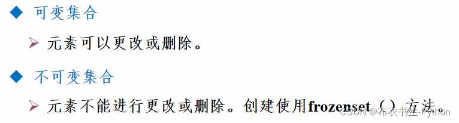
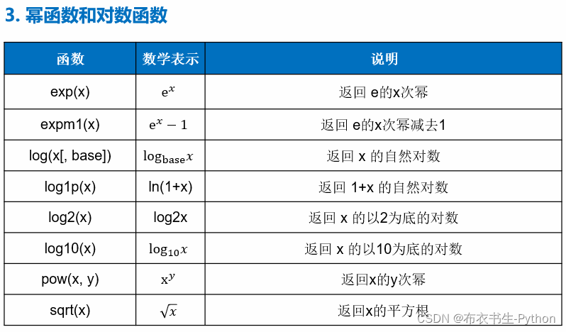
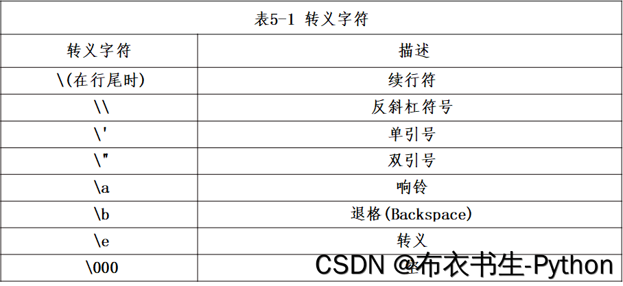
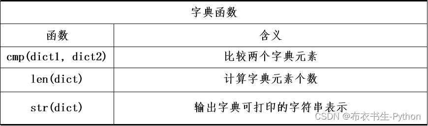
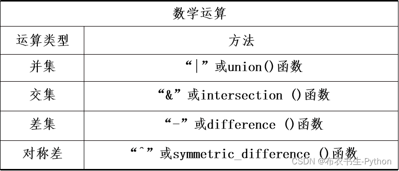
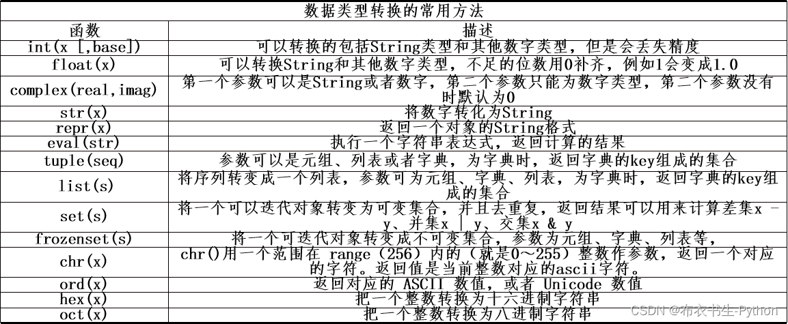

Python基础

# 1、简介

Python3.0 使用print()函数，比如：print("Hello")。

Python3.0 使用print()函数，比如：print("Hello")。

Python3.0 用format()函数，比如：”Hello,{}“.format("World")。

Python2.0 用%占位符进行标准化格式输出字符串，比如：“Hello,%s" % ("World")；

Python3.0 默认采用utf-8。

​		首先将Python源代码（.py文件）编译生成Python字节码（Python Byte Code，字节码文件的扩展名一般是.pyc），然后再由Python虚拟机（Python Virtual Machine，简称PVM）来执行Python字节码，最后在终端输出运行结果。

​		通过以上编译和运行过程可分析：Python是一种解释型语言，指的是解释**Python字节码**，而不是**Python源代码**。这种机制的基本思想与Java和.NET是一致的。


```py
$ python --version#检查版本
$ python#启动解释器
```

​		<p style = "clore : red" >假如有个test.py文件需要执行，那么它会先生成.pyc文件，一般可能的情况如下：</P>

​		执行 python test.py 会对test.py进行编译成字节码并解释执行，但不会生成test.pyc。
​		如果test.py中加载了其他模块，如import urllib2，那么python会对urllib2.py进行编译成字节码，生成urllib2.pyc，然后对字节码解释执行。
​		如果想生成test.pyc，可以使用python内置模块py_compile来编译，也可以执行命令 python -m py_compile test.py 这样，就生成了test.pyc
原文链接：https://blog.csdn.net/ywsydwsbn/article/details/124509707

## 1.1、编码规范

```python
# -- coding: utf-8 --
```

- 如果Python源码文件没有声明编码格式，Python解释器会默认使用ASCII编码。但出现非ASCII编码的字符，Python解释器就会报错，因此非 ASCII 字符的字符串，请需添加**u前缀**。
- 若出现 Python编码问题，可按照以下操作尝试解决：

```python
import sys
reload(sys)
sys.setdefaultencoding('utf-8')
```

圆括号、方括号或花括号以内的表达式允许分成多个物理行，无需使用反斜杠

隐式的行拼接可以带有注释。后续行的缩进不影响程序结构。后续行也允许为空白行。

```py
month_names = ['Januari', 'Februari', 'Maart', 		 # These are the  
               'April',   'Mei',      'Juni', ]      # Dutch names\\

x = ('这是一个非常长非常长非常长非常长 '	 #圆括号来实现隐式行连接
     '非常长非常长非常长非常长非常长非常长的字符串') #注意缩进
```

## 1.2、命名

**函数**

- 函数名应该小写，如有多个单词，用下划线隔开。
- 大小写混合仅在为了兼容原来主要以大小写混合风格的情况下使用，保持向后兼容。
- 私有函数在函数前加一个**下划线_**

**类**

- 类名使用驼峰(CamelCase)命名风格，首字母大写，私有类可用一个下划线开头。
- 在接口被文档化并且主要被用于调用的情况下，可以使用函数的命名风格代替。
- 对于内置的变量命名有一个单独的约定：大部分内置变量是单个单词（或者两个单词连接在一起），首字母大写的命名法只用于异常名或者内部的常量。

**类里面函数和方法参数**

- 始终要将self作为实例方法的第一个参数。
- 始终要将cls作为类方法的第一个参数。
- 如果函数的参数名和已有关键字冲突，在最后加大意下划线比缩写或者随意拼写更好。因此class_比clss更好

**以下用下画线作前导或结尾的特殊形式是被公认的：**

- _single_leading_underscore（以一个下画线作前导）：例如，“from M import *”不会导入以下画线开头的对象。
- single_trailing_underscore_（以一个下画线结尾）：用于避免与 Python 关键词的冲突，例如“Tkinter.Toplevel(master, class_='ClassName')”。
- __double_leading_underscore （双下画线）：从 Python 1.4 起为类私有名。
- __double_leading_and_trailing_underscore__：特殊的（magic） 对象或属性，存在于
  用户控制的（user-controlled）名字空间，例如：__init__、__import__ 或 __file__。

##  1.3、引号用法规则

- 自然语言使用双引号
- 机器标识使用单引号
- 正则表达式使用双引号
- 文档字符串 (docstring) 使用三个双引号
- 当且仅当代码中使用单引号'来引用字符串时，才可能会使用三重'''为非文档字符串的多行字符串来标识引用
- 文档字符串必须使用三重双引号"""

## 1.4、导入模块

-  模块名称要短，使用小写，并避免使用特殊符号， 比如点和问号。

**正确使用例子：**

```python
import os
import numpy
import sys

from types import StringType, ListType 
```

**错误使用例子：**

```python
import os, numpy, sys
```

- 从一个包含类的模块中导入类时，通常可以写成这样：

```py
from MyClass import MyClass 
from foo.bar.YourClass import YourClass 
```

​		在Python中，pydoc以及单元测试要求模块必须是可导入的。代码应该在执行主程序前总是检查 `if __name__ == '__main__'`， 这样当模块被导入时主程序就不会被执行

```python
def main():     
    ... 
    
if __name__ == '__main__':    
    main()
```


## 1.5、全局变量与局部变量

全局变量名与局部变量名相同时，里外赋值互不干扰。

global：全球的，整体的

**全局关键字**
		通常，当您在函数内部创建变量时，该变量是局部的，并且只能在该函数内部使用。要在函数内创建全局变量，可以使用 global关键字。（即里影响外）


# 2、数据类型


基本数据类型`包含：`数字`,`字符串

复合数据类型`包含：`列表`,`元组`,`字典`,`集合

**不可变**：
               Number(数字)、String(字符串)、Tuple(元组)、Sets(集合)
**可变得**：
               List(列表)         Dictionart(字典)  

原文链接：https://blog.csdn.net/weixin_43474701/article/details/119191862

##  2.1、六大数据类型：

1. 数字: 包含int(整型)、`long`(长整型，但`python3中已经没有了`，python3中只有int)、complex(复数)、float(浮点型)、bool(布尔型)
2. 字符串（String）: 比如：“hello world”，“python”
3. 列表（List）: 比如：[1,2,3,4]，[’a‘,‘b’,‘c’,‘d’]
4. 字典（Dictionary）:例如：{“name”:“poge”,“age”:30}
5. 元组（Tuple）: 例如：(1,‘hello’,3)
6. 集合（Set）:例如：{’a‘,’b‘,’c‘,’d‘}


**文本类型**：      str

**数字类型**：      int,	 	一个整数，正负，不带小数，长度不限

​					     float,     包含一位或多位小数的正数或负数，浮点数也可以是带有“e”的科学数字，表示 10 的幂

​						 complex复数

​						bool（）布尔

​						eval（）不确定是整数还是小数

```python
x = 35e3
x = complex(1j)#强调为复数

x = int(input("请输入一个整数："))

x = True
x = bool(5)#强调布尔类型
```

**序列类型**：      list[]列表,      tuple()元组,      range范围

```python
x4 = ["apple", "banana", "cherry"]   
x5 = ("apple", "banana", "cherry")  
x = range(6
          
x = list(("apple", "banana", "cherry"))#强调为列表
x = tuple(("apple", "banana", "cherry"))#强调为元祖
x = range(6)#强调          
```

**映射类型**：      dict字典

```python
x = {"name" : "John", "age" : 36} 
x = dict(name="John", age=36)#强调
```

**套装类型**：      set集合,      frozenset冷冻集

```python
x = {"apple", "banana", "cherry"}#set集合类型
x = set(("apple", "banana", "cherry"))#强调为集合

x = frozenset({"apple", "banana", "cherry"})
```

**二进制类型**：      bytes,      bytearray,      memoryview内存视图

```python
x = b"Hello"#字节类型
x = bytes(5)#强调字节类型
x = bytearray(5)
x = memoryview(bytes(5)
```

**随机数：**	random（）	

Python 有一个内置模块 random可以用来生成随机数。
导入 random 模块，并显示 1 到 10之间的一个随机数：

1. ```python
   import	random	#导入 random 模块
   
   print	(random.randrange(1,11))#并显示 1 到 10之间的一个随机数
   ```

### **指定变量类型**

python 中的转换是使用构造函数完成的：

int() - 从整数文字、浮点文字（通过删除所有小数）或字符串文字（提供字符串表示整数）构造整数

float() - 从整数文字、浮点文字或字符串文字构造浮点数（提供字符串表示浮点数或整数）

str() - 从多种数据类型构造一个字符串，包括字符串、整数文字和浮点文字

## 2.2、数字类型

### 整数

**整型不同形式的转换**

1. bin()：十进制转换为二进制，输出形式是字符串
2. oct()：十进制转换为八进制，输出形式是字符串
3. hex()：十进制转换为十六进制，输出形式是字符串
4. int() ：接收一个符合整型规范的字符串，并将字符串转换为整型

**tips1**:Python中当多个变量的值相同时，这个值在内存中并没有被保存多次，只是多个变量都指向了同一内存，举例如下：

​	**id()**可以取出变量的内存地址

```py
a = 6
b = 6
c = a
print(id(a), id(b), id(c))
a = 8
print(id(a), id(b), id(c))
```

### 浮点数

- Python中的浮点型是双精度的，每个浮点型数据占8个字节（即64位）

### 复数

- 实数部分和虚数部分都是浮点型；
- 虚数部分后面必须有j或J

```py
a = 2 + 6j
b = complex(2, 6)

print(type(a))
print(type(b))
print(id(a), id(b))

'''为什么ab地址不一样
<class 'complex'>
<class 'complex'>
2718471372752 2718437554352
'''

print(a.imag)  # .imag可以获取复数的虚部
print(a.real)  # .real可以获取复数的虚部
print(a.conjugate())  # .conjugate()方法可以获取复数的共轭复数
```

### 布尔类型

- 常用的布尔运算包括 and、or、not 三种
- and`和`or`运算有一条重要的法则：`短路法则

**等同于False的值：**

- None；
- False；
- 任何为0的数字类型，如0、0.0、0j；
- 任何空序列，如’‘’'、()、[]；
- 空字典，如{}；
- 用户定义的类实例，如类中定义了__bool__()或者__len__()方法，并且该方法返回0或者布尔值False。

**等同于True的值：**

- 非零数值
- 非空字符串

### 数值计算


### 数值计算函数库





## 2.3、字符串类型

字符串的表示有以下三种：

- 单引号 ’
- 双引号 "
- 三重引号 “”"

python 中的字符串被单引号或双引号包围。两种方式表示的字符串是`等价`的，且返回相同类型的对象，'hello’与"hello"相同

### 多行字符串

​		您可以使用三个引号将多行字符串分配给变量：

```python
 a = #或三个单引号
     """从前有座山，	#可以用\表示换行
     山里有座庙，
     庙里有个小和尚""" 
```

### \转义字符

​		转义字符是为了对其后紧接的字符进行转义，屏蔽其特殊含义，并将其作为普通字符来输出。




### raw字符串

raw字符串的格式是r’…’。

​		在raw字符串中，所有的字符都是直接按照字面意思来解释，没有转义字符或者不能打印的字符。


- 第一种方式的语句打开一个文件时，字符“\n”会被当作回车键的转义字符，从而使文件打开失败。
- 第二种方式对反斜杠“\”进行转义，虽然正确，但是代码看起来会令人感到费解。
- 第三种就是pthon语言中的raw字符串。


**切片字符串**

**是数组**

​		Python 没有字符数据类型，单个字符只是一个长度为 1 的字符串。方括号可用于访问字符串的元素。这里用到了切片。

​		您可以使用切片语法返回一系列字符。指定开始索引和结束索引，以冒号分隔以返回字符串的一部分。
示例：获取从位置 2 到位置 5 的字符（不包括在内）：

```python
 print(b[2:5])	#返回第234个字符
 print(b[ :5])
 print(b[2: ])
 print(b[-5:-2])#倒数第234个字符
```

### 遍历长度检查

循环遍历单词“chuanchuan”中的字母：

```python
for x in "chuanchuan":
    print(x)

print(len(x))

print("chuan" in x)		#检查返回true
print("chuan" not in x) #因为存在，返回false

if "chuan" in t: 	
	print("存在")#因为存在所以打印
if "川" not in txt:	
    print("No")#因为存在所以不打印
```

### 修改

​		**字符串属于不可变类型，`不能`修改或删除原字符串中的字符**

 **upper()向上**

 **lower()向下**

 **strip()去除空格**

 **replace()替换**

​		replace()函数的功能是字符替换，如果要替换的源字符或字符串存在，且和待替换的目标字符或字符串不同，则返回值为重新创建的一个字符串对象；

 **split()分裂**

**拼接 +、 %、 join（）**

```py
 a = "Hello, World!"
        
 print(a.upper())#小大
 print(a.lower())#大小

'''空白是实际文本之前和/或之后的空间'''
 print(a.strip())#删空格
 
 print(a.replace("H", "J"))#替换

'''split()方法返回一个列表，其中指定分隔符之间的文本成为列表项。split()如果找到分隔符的实例，该方法会将字符串拆分为子字符串'''
 print(a.split(","))
    
 c = a + b	# 拼接
 c = a + " " + b #加空格
'%s%s%s'%('py','th','on')
'%s %s %s'%('Python','is','easy')	#注意加空格
''.join(('py','th','on'))	#结果'Python'，注意有引号
' '.join(('Python','is','easy'))	#前面的引号有空格
```


**字符串函数库**

​	可以直接调用的字符串操作方法


### 字符串格式化

字符串格式化是对字符串的输出形式进行控制。

- 符号格式化
- 函数格式化
- 字典格式化

#### 符号格式化

符号格式化主要是使用“%+格式化符号”，及相应的格式化辅助符号的方式对字符串进行格式化。


```py
print("%c,%c" % (65, 97))	#A,a
s = 'podjsd'
print("%s" % (s))	#podjsd
print('%r'%42)		#42	#repr()函数
print('%e'%200.21)	#2.002100e+02
print('%g'%200.21)	#200.21
print('%%'%())		#%
```


**格式化辅助符号**


#### 函数格式化

**format()格式化**

format()方法接受传递的参数，格式化它们，并将它们放在占位符所在的字符串中 {}。

- 不带编号，即“{}”；
- 带数字编号，可调换顺序，如“{0}”、“{1}”等；
- 带关键字，如“{name}”、“{age}”等。

```py
 age = 20
 txt = "川川今年 {}"
 print(txt.format(age)) #组合字符串和数字
    
'''接受无限数量的参数，{}中的数字表示参数位置，并放置在各自的占位符中'''
print("a={},b={}".format(2, 4))
print("a={0},b={1}".format(2, 4))
print("a={1},b={0}".format(2, 4))
print("a={num2},b={num3}".format(num2=2, num3=4))
print("a={num3},b={num2}".format(num2=2, num3=4))
```

**常用**


#### 字典格式化

字典格式化是在左边的格式化字符串通过引用右边字典中的键来提取对应的值，实现格式化输出。

```py
a = "%(name)s,%(age)s"
b = {"name": "hupo", "age": 18}

print(a % b)	#hupo,18
```


### 其它方法总结

capitalize() 将第一个字符转换为大写

casefold() 将字符串转换为小写

center() 返回一个居中的字符串

count() 返回指定值在字符串中出现的次数

encode() 返回字符串的编码版本

endswith() 如果字符串以指定的值结尾，则返回 true

join() 将可迭代的元素连接到字符串的末尾

find() 在字符串中搜索指定值并返回找到它的位置

format() 初始化字符串中的指定值
10.index() 在字符串中搜索指定值并返回找到它的位置
当然还有很多，个人感觉不是很常用，就不继续总结别的了

## 2.4、list列表


### 基本操作

**1. 索引**
列表每一个元素都对应一个整数型的索引值，可以通过索引值来得到相应的元素值。同时支持列表元素的正向索引和反向索引。

正向索引即索引值为正，从0开始；

反向索引即索引值为负，从-1开始。若是反向索引，则-1为末尾元素对应的索引编号。

**2. 切片**
切片操作可以截取列表变量中的部分元素，并返回一个子列表变量。

切片操作中，生成子列表的元素包含起始索引对应的元素，但是不包含终止索引对应的元素。
**3. 加法和乘法**

- 加法操作使用加号（+）完成，表示把加号两端的列表变量连接形成一个新列表；
- 乘法操作使用星号（*）完成，表示对当前列表对象进行复制并连接，并形成一个新列表。

**4. 修改和删除**

- 通过索引值对相应元素进行修改或删除。
- 删除整个列表或列表中的部分元素，使用del命令。删除整个列表后，不可再次引用。

**5. 追加插入和扩展**

- append：在当前列表对象尾部追加元素；
- insert：在当前列表的指定索引位置插入元素；
- extend：对当前列表元素进行批量增加。

### 多维列表

```py
>>> a = ['a',1] 
>>> n = ['b',2]
>>> x = [a,n]
>>> x
[['a',1],['b',2]]
>>> x[0] # 显示第一个元素 
['a', 1] 
>>> x[0][1] # 显示第一个元素中的第二个元素 
1
```

直接输入列表的数据，系统会根据输入生成相应的列表维度。

```py
>>>l = [[1,2,3],[4,5,6]]
>>>print(l)
输出结果:
[
[1,2,3],
[4,5,6]
]
```

也可以使用列表解析方式生成了二维矩阵

```py
cols = 7
rows = 9
list_2d = [[col + 1 for col in range(cols)] for row in range(rows)]
print(list_2d)
```

### 迭代器

​		首先创建了一个列表类型变量lst，然后创建了该列表的迭代器对象lstiter，并且通过该迭代器对象的__next__()方法遍历列表中的元素。
​	`__next__()`方法，返回下一个值。iter方法访问列表。

### 列表解析

```py
>>>list=[1,2,3,4,5,6,7,8,9,10] #方法1：直接指定
>>>list=[]#方法2：先创建一个空列表，然后通过for循环实现
   for n in range(1,11):
      list.append(n);
>>>list(range(1,11)) #方法3：列表解析
[1,2,3,4,5,6,7,8,9,10] 
```

for循环在这里可以很好的生成list
首先针对数值运算，使用列表解析生成了1到10的平方值；
其次，针对字符运算，使用列表解析生成了指定范围的字母组合列表。

```python
>>> [x * x for x in range(1, 11)] 
[1, 4, 9, 16, 25, 36, 49, 64, 81, 100]
 
# 或者字母所进行的两层循环
>>> [m + n for m in 'ABC' for n in 'XYZ']
['AX', 'AY', 'AZ', 'BX', 'BY', 'BZ', 'CX', 'CY', 'CZ']
```

### 函数与方法（库）


## 2.5、tuple元组

### 创建元组：

`变量名 = (元素1,元素2,…,元素n)`

`注意：`
当元组中只包含`一个`元素时，需要在元素后面添加`逗号`，否则括号会被当作运算符使用。

### 基本操作

**1. 访问**
使用下标索引来访问相应的元素值。也可采用正向索引和反向索引两种方式，并支持切片操作。
**2. 修改**
元组中的元素值是不允许修改的，可以对元组进行连接生成新的元组。
**3. 删除**
元素值不允许删除的，但可使用del语句删除整个元组。
需要注意的是，删除后的元组对象不可再次引用。
**4. 统计**
通过内置的count方法统计某个元素出现的次数。
**5. 查找**
通过内置的index方法查找某个元素首次出现的索引位置。

###  函数和方法（库）


表中的count方法和index方法，实际是元组类型和列表类型所共有的方法，其使用方法和列表完全相同。

### 元组的优势

- 可以使函数返回多个值
- 可以使程序运行性能提升
- 一般来说，创建元组类型tuple的变量比列表类型list要快，而且占用更小的存储空间。
- 使用元组是线程安全的
- 元组类型变量的元素不可更改性，可保证多线程读写时的安全问题。

## 2.6、dict字典

### 字典的创建

1. **{}创建一个空字典；**
2. **创建空集合用set()；**

创建字典对象：
`变量名=(key1:value1, key2:value2,…, keyn:valuen)`

- 字典的元素是可变的，可以是列表、元组、字典等任意数据类型，但键(key)值必须使用不可变类型。
- 在同一个字典变量中，键(key) 值必须是唯一的

###  基本操作

**1. 访问**
字典是无序的，没有索引，不能通过下标索引。通过对key值的索引进行访问。
**2. 修改**
通过对key值的引用对value值的修改操作。
**3. 删除**
字典的删除操作中，可以删除某个元素或删除整个字典，也可以清空字典元素。

### 嵌套

```py
>>>Va1 = {a:{b:1,c:2},d:{e:3,f:4}} #字典的value值是字典
>>>Va2 = {a:[1,2,3],b:[4,5,6]}  #字典的value值是序列
>>>n1={'surname':'wang','name':'gang'}  
>>>n2={'surname':'zhang','name':'san'}  
>>>n3={'surname':'liu','name':'wen'}  
>>>n4=[n1,n2,n3]  #序列的元素是字典
```

### 遍历

```py
username={'full_name':'ZhangWei', 'surname':'Zhang', 'name':'Wei'  }  
#遍历所有的键-值对  
for k,v in username.items():
 	print('key:'+k)
    print('value:'+v+'\n')
```

```py
#遍历所有键  
for k in username.keys():
	print(k)
	print('key:'+k+'-value:'+username[k])
#遍历所有的值
for v in username.values():
	print(v)
```

### 字典（库）




## 2.7、set集合

### 创建

创建集合对象：
`变量名 = {元素1,元素2,…,元素n}`

集合特性：

- 无序性：元素之间没有确定的顺序。
- 互异性：不会出现重复的元素。
- 确定性：元素和集合只有属于或不属于的关系。

**注意：**
创建空集合用set()；
{}创建一个空字典。

### 集合数学运算



### 基本操作

**1. 更改**

- add（）：添加一个元素
- update（）：同时添加多个元素。

**2. 删除**

- discard() 和 remove() 方法删除集合中特定的元素。
- 若删除的对象不存在，remove（）方法会引起错误，discard（）方法不会。

### 集合（库）




## 布尔值

#### 评估值和变量

​	**布尔真**

​		True如果它具有某种内容，几乎任何值都会被评估。任何字符串都是True，空字符串除外。任何数字都是True，除了 0。任何列表、元组、集合和字典都是True，空的除外。

 **布尔假**

False除了空值（例如()、 []、{}、 “”、 数字 0和 值 ）之外，计算为 的值 None。当然，结果为 False。

```py
 bool(["apple", "cherry", "banana"])

 bool(False	)    
 bool(None	)
 bool({}	)

x = 1
print([2, 3][bool(x)])
x = 0
print([2, 3][bool(x)])
```

函数返回布尔值

```py
def myFunction() :
 	return True
print(myFunction())

if myFunction():
	print("YES!")
else:
	print("NO!")
```

#### isinstance（）是这个举例？

​		Python 也有许多返回布尔值的内置函数，如 isinstance() 函数，可用于确定对象是否属于某种数据类型

```py
 print(isinstance(x,int))#是否为整数
```

**type()不会认为子类是一种父类类型。**
**isinstance()会认为子类是一种父类类型**


# 3、运算符

##  幂运算

```py
  '''/返回为float,//返回整数，%返回余数'''
    
    
 '''幂运算  **'''
 a=4**2
    
 x >>= 3 等效x = x >> 3
 x ^= 3 等效 x = x ^ 3
 x |= 3 等效 x = x | 3
```

加等于（ +=）等效： x = x +

# 4、列表


max(list) 返回列表元素最大值
min(list) 返回列表元素最小值
list(seq) 元组转列表
list.append(obj) 在列表末尾添加新对象
list.count(obj) 统计某个元素在列表出现的次数
list.extend(seq) 在末尾添加新列表，扩展列表
list.index(obj) 在列表中找出某个值第一个匹配性的索引位置
list.insert(index,obj) 将对象插入列表，其中的index，为插入的位置，原来该位置后面的元素包含该位置元素，都统一后移
list.pop(obj=list[-1])
有默认参数,即最后一项 删除指定位置元素并返回，他和del的区别在于del是一个关键字。而pop是内建函数，我们无法用变量去接收del删除的项 （参数可以不写，默认删除最后一项）
list.remove(obj) 移出列表中某个值第一次匹配的项
list.reverse() 反向列表中的元素(收尾互换)，不代表倒序排列！
list.sort() 对列表进行排序
list.copy() 复制列表
list.clear() 清空列表
原文链接：https://blog.csdn.net/weixin_43474701/article/details/119191862

## 创建

```py
 mylist = ["川川一号","川川二号", "川川三号"]
 thislist = list(("apple","banana","cherry"))
```

## 总结： 集合（数组）

List列表是一个有序且可变的集合。允许重复成员。

turple元组是一个有序且不可更改的集合。允许重复成员。

Set集合是一个无序且无索引的集合。没有重复的成员。

dict字典是一个有序*且可变的集合。没有重复的成员。
！！！从 Python 3.7 版开始，字典才是有序的！！！

## 访问

​	负索引意味着从头开始，-1指最后一项， -2指倒数第二项等。

```py
 print(mylist * 2)#
 print(mylist[0])

 for i in mylist:
    print(i)
for i in range(len(mylist)):
	print(mylist[i])

 print(len(thislist))

 print(mylist[-1])	#-1指最后一项
 print(mylist[-3:-1])

 if "apple" in thislist:
	print("Yes")
```

## 更改

 **insert()插入**

 **insert()方法在指定的索引处插入一个项目。**

 **append() 在文后添加**

 **extend()合并**

​	extend()方法不一定要 列表，您也可以添加任何可迭代对象（元组、集合、字典等

**remove()删除指定的项目**

 **pop()删除指定的索引**

​	如果不指定索引，该pop()方法将删除最后一项

 **del删除指定的索引**

​	注意del不是方法，是一个函数，所以不能去接收他

**clear()清空列表**

```py
mylist[0] = "川川五号"
mylist[1:3]=["哈皮川川","憨批川川"]

mylist.insert(2,'帅哥呀')

mylist.append("憨批川川")

mylist = ["川川一号", "川川二号"]
mylist2= ("川川","菜鸟")
mylist.extend(mylist2)

mylist.remove('川川二号')

mylist.pop(2)
mylist.pop()

del mylist[0]
del mylist

mylist.clear()
```

## 循环列表

​		break、continue语句控制循环的执行过程


*

### for

- 目标可以是字符串、文件、range()函数或组合数据类型等；
- 循环变量用于保存本次循环中访问到的遍历结构中的元素；
- for循环的循环次数取决于遍历的目标元素个数。

```py
for i in mylist: #循环遍历列表项for 
    print(i)
    
for i in range(len(mylist)): #遍历索引号
	print(mylist[i])
```

### while

```py
i =0
while i < len(mylist):
	print(mylist[i])
i = i +1
```

**while—else**

```py
n = int(input("请输入一个整数："))
fact = 1
i = 1
print("n!计算中……")
while i<= n:
	fact = fact*i
	i = i + 1
else:
	print("n!计算完成 ，循环正常结束")
print("n!={}".format(fact))
```


### if三元表达式

```py
def fun(n):    
    return n if n < 2 else fun(n - 1) + fun(n - 2)
```

### pass语句

pass的意思是过，pass掉就是淘汰掉的意思。

在python中，pass的意思是空语句，pass语句不做任何事情，只是为了保持程序结构的完整性。

## 列表推导式

例子：根据fruits列表，您需要一个新列表，其中仅包含名称中带有字母“a”的fruits。
	如果没有列表理解，您将不得不编写一个for带有条件测试的语句：

```py
fruits = ["apple","banana","cherry","kiwi","mango"]
newlist = []

for x in fruits:#下一局可直接跟else
	if"a" in x:#elif
		newlist.append(x)#列表赋值
print(newlist)
```

​	使用列表推导式，你只需要一行代码即可！

```py
newlist = [x for x in fruits if "a" in x]#列表赋值
```

例子：只接受小于 5 的数字：

```py
newlist = [x for x in range(10) if x < 5]
```

例子：返回“orange”而不是“banana”

```py
'''x不为banana时保持原来的值，否者替换为orange'''
newlist = [x if x != "banana" else "orange" for x in fruits]#为什么for放在最后
```


## 排序

 **sort()大写排在小写之前**

 **str.lower 作为键函数**

​	不区分大小写

 **reverse()倒序**

 **copy()拷贝副本**

 **list()制作列表副本**

```py
thislist = ["banana","Orange","Kiwi","cherry"]
thislist.sort()

thislist.sort(key = str.lower)

mylist.reverse()

my = mylist.copy()

my = list(mylist)
```

1、

2、

## 加入列表

```py
list1 = ["a","b","c"]    
list2 = [1,2,3]

list3 = list1 + list2

for x in list2:    
	list1.append(x)

list1.extend(list2)
```


# 5、文件

## 路径

### os 模块与 os.path 模块

在 Python 中操作文件路径，使用 os 模块，os.path 模块是 os 模块内部的一个子模块，首先导入该模块。

```python
import os

print(os.getcwd()) #获取当前文件路径

help(os.path.abspath) #获取abspath的使用方法
ret = os.path.abspath("demo4.py") #获取路径的绝对路径

'''格式：os.path.relpath(path,start)，start没写就是相对于当前工作目录'''
ret = os.path.relpath("D:\\") #获取D:\\的相对地址（相对于start）

ret = os.path.relpath("d:\\gun\\2")
# 或者写成下面这个样子
# ret = os.path.relpath("d:/gun/2")
```

检查路径主要是为了检查文件或者文件夹是否存在，或者判断一个路径对应的是一个文件夹还是一个文件。以下四个方法都在 `os.path` 模块下。

- exists(path) 如果 path 文件或文件夹存在返回 True，否则返回 False；
- isabs(path) path 是绝对路径返回 True，否则返回 False；
- isdir(path) path 是文件夹返回 True，否则你懂；
- isfile(path) path 是文件返回 True。

以下几个方法在 os 模块中，执行如下操作建议先通过 `os.path.exists` 判断目录是否存在。

- mkdir(path) 创建目录；
- rmdir(path) 删除目录；
- chdir(path) 切换当前工作目录到 path；
- remove(path) 删除文件，注意如果 path 是一个目录，删除会报错，权限不足，删除目录请使用 `rmdir`。

## 文件读

open（file，mode，encoding）

```py
# 文件名
file = "test.txt"
f = open(file, encoding="utf-8")

# 读取文件全部内容
read_str = f.read()
# 循环逐行读取
for line in f:
	print(line,end="")
# 逐行读取（将数据一次性读取到一个列表中）
data = f.readlines()

f.close()
print(data)
```

**with上下文**

```py
file = "test.txt" # 打开文件
with open(file,encoding="utf-8") as f:   
    # 读取文件全部内容
    read_str = f.read()   
    print(read_str)
```

## 文件写

参数mode值默认值为r读，其余w写，a读写

```py
file = "test.txt"
# 打开文件
with open(file, mode="w", encoding="utf-8") as f:
    # 写入文件内容
    f.write("我是即将被写入的内容\n")
    f.write("我是即将被写入的内容")
```

## 目录操作

```py
import shutil

shutil.copy("test.txt","../aaa.txt") # 不同目录拷贝文件

# 第一个参数是旧目录，第二个参数是新目录 
shutil.copytree("../1","a4")	#不同目录拷贝目录

shutil.move(旧文件，新文件) #移动目录
rmtree(shtil)		#删除目录
```

## zipFile 模块

​	压缩与解压

# 6、 函数

- 函数式编程中的“函数”不是指计算机中的函数，而是指数学中的函数，即自变量的映射。
- 函数式编程的一个特点就是，允许把函数本身作为参数传入另一个函数，还允许返回一个函数

## 6.1、内置函数


##  6.2、函数参数

### **种类**

函数参数分为可变类型和不可变类型，其调用结果是不同的。
（1）可变类型：类似c++的引用传递，如列表、字典等。如果传递的参数是可变类型，则在函数内部对传入参数的修改会影响到外部变量。
（2）不可变类型：类似c++的值传递，如整数、字符串、元组等。如果传递的参数是不可变类型，则在函数内部对传入参数的修改不会影响到外部变量。

### **默认参数**

​	调用函数时缺少实参

```py
def describe_student(person_name, student_age='18'):
    
#开发者也可以用None这个不可变对象来解决报错问题，如下代码所示。
def test_add(H=None):
    if H is None:	#避免形参H的值改变
        H = []
    H.append('END')
    return H
```

​	**即不同的内存单元，存放不同的数据**

### **不定长度**

```py
def calc(numbers):	#只能传列表
    sum = 0
    for n in numbers:
        sum = sum + n
    return sum
print(calc([1, 2, 3])) # 结果是6
print(calc([1, 2, 3,4])) # 结果是10

def calc(*numbers):	#可以传列表和元组
    ····
print(calc(1, 2, 3, 4))	
print(calc())	# 结果是10
num = [1, 2, 3]
print(calc(*num))	# 结果是6

def enroll(name, gender, *, age='18', city):
    print(name, gender, age, city)
enroll('Jack', 'M', city='Beijing') # 结果是：Jack M 18 Beijing
```

### **关键字参数**

​		关键字实参是传递参数时使用“名称–值”对的方式，在实参中将名称和值关联起来。

​		如果要限制关键字参数的名字，可以用命名关键字参数。和关键字参数**kw不同，如果没有可变参数，命名关键字参数就必须加一个“*”号作为特殊分隔符。如果缺少“*”，Python语言解释器将无法识别位置参数和命名关键字参数。

```py
def enroll(name, gender, *, age, city):
    print(name, gender, age, city)
enroll('Jack', 'M', age='18', city='Beijing')	#注意单引号
```

**注意：**
*表示不定长参数
**表示不定长的关键字参数

定义的顺序`必须是：`必选参数、默认参数、可变参数、命名关键字参数和关键字参数

```py
def func(a, b, c=0, *args, **kw):
    print('a=', a, 'b=', b, 'c=', c, 'args=', args, 'kw=', kw)

print(func(1, 2, 3, 'a', 'b', x=4))  
# 输出结果：a= 1 b= 2 c= 3 args= ('a', 'b') kw= {'x': 4}

args = (1, 2, 3, 4)
kw = {'x': 5}
print(func(*args, **kw))  
# 输出结果：a= 1 b= 2 c= 3 args= (4,) kw= {'x': 5}
```

##  6.3、高阶函数

​		接受函数为参数，或者把函数作为结果返回的函数称为高阶函数。例如，若要根据单词的长度排序，只需把len函数传给key参数。

```python
fruits=['strawberry','fig','apple','cherry','raspberry','banana']
print(sorted(fruits,key=len))
# 输出结果如下：
# ['fig', 'apple', 'cherry', 'banana', 'raspberry', 'strawberry']
fruits = ['strawberry', 'fig', 'apple', 'cherry', 'raspberry', 'banana']


def reverse(word):
    return word[::-1]


print(reverse('testing'))  # 结果是：gnitset

print(sorted(fruits, key=reverse))
# 输出结果如下：
# ['banana', 'apple', 'fig', 'raspberry', 'strawberry', 'cherry']
```

##  6.4、匿名函数

​		所谓匿名函数，即`不再使用def语句`这样标准形式定义的函数。Python语言经常使用`lambda`来创建匿名函数。lambda 只是一个表达式，函数体比def定义的函数体要简捷。lambda函数的语法如下所示。

```python
lambda [arg1[,arg2],....argn]]:expression
```

举例：

```python
sum = lambda arg1, arg2: arg1 + arg2
print(sum(1, 2)) # 结果是：3
```

​		上述代码中，第一行定义了一个lambda函数，执行两个数的和运算，并且把该lambda函数命名为sum。会面的代码通过sum（）函数即实现了调用lambda函数的功能。

# 7、类

## 7.1、定义

```py
# 类定义
class People:  # 类名
    name = "张三"  # 属性名

    def undate_name(self, name):# 方法名
        self.name = name 

class A:
    pass
class A():
    pass
class A(object):	#默认继承object类
    pass
```

新式类添加了一些内置属性和方法，如下所示：

```python
__name__ ：属性的名字
__doc__ ：属性的文档字符串
__get__(object) ：获取对象属性值的方法
__set__(object, value) ：设置对象属性值的方法
__delete__(object, value) ：删除对象属性 的方法 
```

## 7.2类和对象

类创建完之后，就应该创建该类的**实例或对象**了，该过程称之为实例化。

1. 对象标识用于区分不同的对象
2. 属性与类中的成员变量相对应
3. 方法与类中的成员函数相对应

```py
'''对象标识符为people，属性为括号中内容，方法为类中方法'''
people = People("李四", 20, "50kg")  # 实例化一个对象
```

### 类的属性

- 属性的设置采用“`类.属性 = 值`”或“`实例.属性 = 值`”的形式

Python语言中的属性操作遵循三个规则：

（1）属性的获取是按照从下到上的顺序来查找属性；

（2）类和实例是两个完全独立的对象；

（3）属性设置是针对实例本身进行的。

```py
class A():
    age = 10

obj2 = A()	#实例

A.age+=3
obj2.age+=2
```

`属性`是对`数据`的封装，`方法`则是对`类行为`的封装


**内置属性**


### 类的方法


类方法和静态方法原理上有以下区别：
（1）静态方法不能使用self的方式调用。
（2）静态方法调用时会预先将类中用到的属性和方法进行加载，而类方法则是随调随用。因此，类方法相比静态方法具有不占资源的优势，但是速度不及静态方法。（静态方法，速度快，但占用资源多）
（3）静态方法调用类中的属性时需要使用“类名.属性”的格式。

### 内部类

内部类：类的内部定义的类，主要目的是为了更好抽象现实世界。


从例子可以看出，内部类调用有两种方式。
（1）直接使用外部类调用内部类；
（2）先对外部类进行实例化，然后再实例化内部类。

```py
class People():
    code = 0

    class Father():
        code = 1

    class Mother():
        code = 2


zhangsan = People()
lisi = zhangsan.Father()  # 第一种实例化方法
liming = People.Mother()  # 第二种实例化方法
```

### 魔术方法

双下划线“__”包起来的方法，都统称为“魔术方法”

这些方法在实例化时会自动调用

**比如“_str__()”、“__init__()”、“__del__()”等。**__getattr__(self,name)”, “__setattr__(self,name,value)

- 构造函数，用于初始化类的内部状态和参数。
- 析构函数，用于释放对象占用的资源


```py
class People():
    name = "人"

    def __init__(self, n="非洲人"):	#初始化类的内部状态和参数
        self.name = n
        print("我是构造函数", self.name)  # 重写构造函数

    def __del__(self):	#释放对象占用的资源
        print("我是析构函数", self.name)  # 重写析构函数

zhangsan = People()
lisi = People("欧美人")
zhangsan.__del__()  # 调用析构函数
print(zhangsan)
del zhangsan
# print(zhangsan) 出现错误，因为del后，对象就不存在了
```

## 7.3、类间关系

### 依赖关系

​		用实例方法执行某个功能时，如果需要使用另一个类的实例的方法来完成，则称这两个类之间存在关联关系。

解：类的实例作为其他类的参数

```py
class Person():
    def play(self, tools):
        tools.run()
        print("很开心，能玩游戏了")

class Computer():
    def run(self):
        print("电脑开机，可以运行")

class Phone():
    def run(self):
        print("手机开机，可以运行")

c = Computer()
phone = Phone()
p = Person()
p.play(phone)
#手机开机，可以运行
#很开心，能玩游戏了
```

### 关联关系

关联关系：一个类的属性类型是另外一个类的类型。根据属性是单值或多值，关联关系又分为一对一关联、一对多关联等。

例子：一对一

解：一个类的属性可以设置为另外一个类的对象

​	（一个类的对象为另外一个类的属性）


例子：一对多

解：School类中的属性teach_list是Teacher类的实例集合


### 继承关系

**特点**：通过继承机制，可以复用以前代码，大大提高开发效率。

​			为防止出现歧义，尽量在类定义时候避免多继承。

（6）如果父类定义了__init__()方法，子类也定义了自己的__init__()方法并且还要使用父类的__init__()方法， 子类需要显式调用父类的__init__()方法。如果子类需要扩展父类的初始化行为，可以添加__init__()方法参数。 

（7）当继承的多个父类中有相同的属性或方法时，会使用最后一个继承父类的属性或方法。


#### 多态性

**多态性优点：**
（1）以不变应万变，增加了程序的灵活性。不论对象千变万化，调用方式都相同。
（2）增加了程序的可扩展性。对于子类来说，使用者无需更改调用代码。

​		在程序语言中，多态实质就是定义了一个函数接口，在这个函数中定义了所有类中通用的功能。根据不同对象的相同调用接口，就得到不同的结果。

- 多态（是从定义角度出发）：同一类事物的多种形态

- 多态性（是从使用角度出发）：同一种调用方式，不同的执行效果。**用一个函数名调用不同内容的函数。**

**多态性依赖于继承机制，并且要定义统一的接口。**

```py
class Animal():
    def run(self):
        raise AttributeError("子类必须实现这个方法")

class Cat(Animal):
    def run(self):
        print("猫在跑")

class Pig(Animal):
    def run(self):
        print("猪在跑")

class Dog(Animal):
    def run(self):
        print("狗在跑")
```

**接口不同**

```py
a=Cat()
b=Pig()
c=Dog()
a.run()
b.run()
c.run()
```

**接口相同**

```py
def func(n):
    n.run()
    
a = Cat()
b = Pig()
c = Dog()
func(a)
func(b)
func(c)
```


