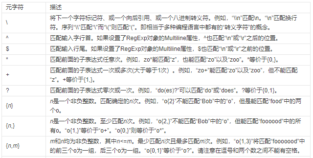
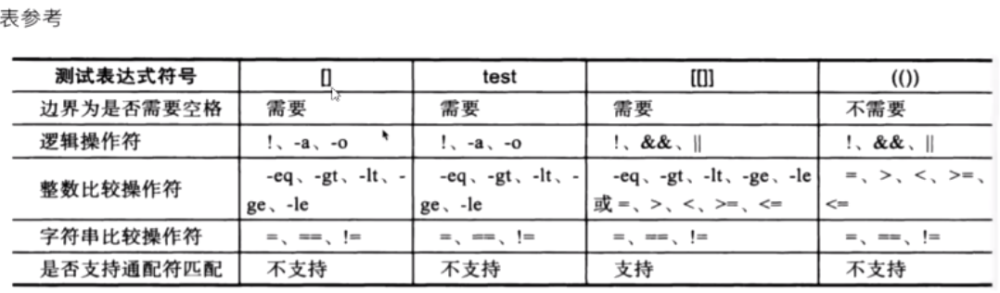
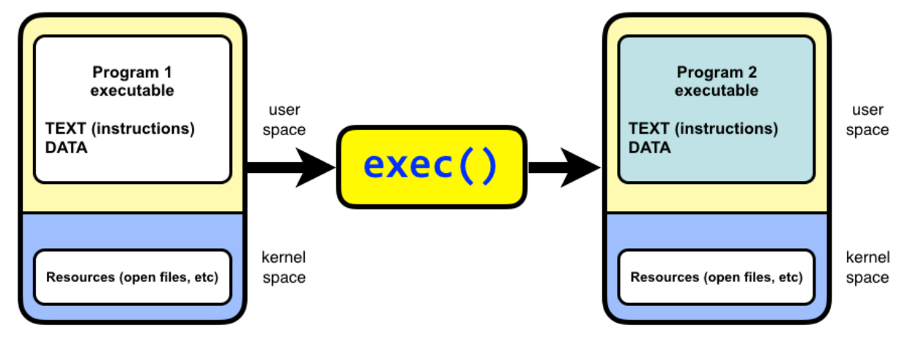

# 小命令操作

```shell
## -exec 选项允许您对找到的每个文件执行指定的命令（在这个例子中是 cp），
## {} 是一个特殊的字符串，代表当前找到的文件名
## 而 \; 表示 -exec 命令的结束
find ./ -name "*.pdf" -exec cp {} ./ \; 

## -print0 告诉 find 使用 \0（null 字符）而不是换行符来分隔文件名，这有助于 xargs -0 正确处理包含空格、换行符等特殊字符的文件名。
## -t 选项是 cp 命令的一个 GNU 扩展，用于指定目标目录，而不是传统的源文件后跟目标文件的语法。
## xargs 默认会将输入项作为 cp 命令的参数，但如果没有明确指定目标目录，这些文件将不会被复制到新位置。此外，如果文件名中包含空格或特殊字符，可能需要使用 -0（与 find ... -print0 一起使用）来正确处理这些文件名。
find ./ -name "*.pdf" -print0 | xargs -0 cp -t ./
```


# Shell

知乎：https://zhuanlan.zhihu.com/p/264346586


## 基础

### 命令

|          |                                  |                     |
| -------- | -------------------------------- | ------------------- |
| tr       | echo aaabb \| tr -d "b"  ==  aaa | 去除字符串中 的字符 |
| array[@] |                                  |                     |
| array[!] |                                  |                     |


|       |                      |                    |
| ----- | -------------------- | ------------------ |
|       | echo ${array [@]}    | 输出数组中所有元素 |
|       | echo ${ ! array [@]} | 输出数组中所有索引 |
| unset | array[2]             | 移除元素           |

### 数组

abcdef


## 变量

- 创建普通变量： name="test" （=两边不可有空格）
- 创建只可函数体中使用的局部变量： ==local== name="test" （使用local修饰的变量在函数体外无法访问，并且local只能在函数体内使用）
- 使用变量： echo $name 或者 echo ${name} （推荐使用大括号版）
- 变量重新赋值： name="new_test" （==将原值覆盖==）
- 只读变量： name="==only_read==" -> readonly name （使用readonly标识后的变量，不可被修改）
- 删除变量： ==unset== name; （删除之后不可访问，删除不掉只读变量）


### 字符串变量

1）单引号

- 单引号变量var='test' ，只能原样输出，变量无效
- 单引号中不能出现一个单独的单引号，转义也不可以

2）双引号

- 双引号变量var="my name is ${name}"，变量有效
- 可出现转义符

3）拼接字符串

- 中间无任何+，之类的字符
- name="this is"" my name"; name="this is my name"; name="this" is "my name" 等效
- name='this is'' my nam'; name='this is my name'; name='this' is 'my name' 等效

4）获取字符串长度

- 在${}中使用“#”获取长度
- name="test";
- echo ${#name}; # 输出为4
- echo ${#1}  第一个参数的长度

5）提取子字符串

- 1:4 从第2个开始 往后截取4个字符
- ::4 从第一个字符开始 往后截取4个字符
- name="this is my name";
- echo ${name:1:4} #输出 is i
- echo ${name::4} #输出 this


## **数组**

bash只支持一维数组，不支持多维数组

- 定义数组：array_name=(li wang xiang zhang) （==小括号做边界、使用空格分离==）

- 单独定义数组的元素： array_para[0]="w"; array_para[3]="s" （定义时下标不连续也可以）

- 赋值数组元素：array_name[0]="zhao";

- 获取数组元素：

- - array_name[0]="li"
  - array_name[3]="zhang"
  - echo ${array_name[0]} # 输出"li"
  - echo ${array_name[1]} # 输出" "
  - echo ${array_name[3]} # 输出"zhang"
  - echo ${array_name==[@]==} # 输出"li zhang" 输出数组所有元素，没有元素的下标省略


- ==取得元素个数==：${#array_name[@]} 或者 ${#array_name}
- ==取得单个元素长度==（二维数组一维的长度，strlen）：${#array_name[1]}

参数传递

- 获取参数值：

- - $0 ： 固定，代表执行的文件名
  - $1 ： 代表传入的第1个参数
  - $n ： 代表传入的第n个参数

## $

- `$0` ：当前正在执行命令的路径

- `$#`：参数个数

- `$*： 以一个单字符串显示所有向脚本传递的参数。如"$*"用「"」括起来的情况、以"$1 $2 … $n"的形式输出所有参数`

- \$@：与$*相同，但是使用时加引号，并在引号中返回每个参数。

- \$\$：脚本运行的当前进程号

- \$！：后台运行的最后一个进程的ID

- \$?： 显示最后命令的退出状态。0表示没有错误，其他任何值表明有错误。

- \$* 与 $@ 区别

- - 相同点：都是引用所有参数。
  - 不同点：只有在双引号中体现出来。假设在脚本运行时写了三个参数 1、2、3，，则 " * " 等价于 "1 2 3"（传递了一个参数），而 "@" 等价于 "1" "2" "3"（传递了三个参数）。

## 正则表达式

https://regex101.com/

 Regular Expression，所以我们通常采用这两个单词的首几个字母合在一起，把正则表达式相关的变量名定义为 regexp（单数） 或 regexps（复数） 。


**普通字符：**
大小写字母、数字、标点符号及一些其他符号

### **元字符：**

|      |                                                              |                                                              |
| ---- | ------------------------------------------------------------ | ------------------------------------------------------------ |
| \d   | \d 表示一个数字。                                            | aaa\d\d：aaa后面跟2个数字                                    |
| \D   | \D 表示一个非数字，它和上面 \d 的意思恰好相反。              | \D\D\D： 则表示一个长度为3，不包含数字的字符串               |
| \w   | \w 表示一个字母（大小写均可）、数字，或下划线。              | 12\w45：则表示12和45中间是一个非字母，非数字，或非下划线。   |
| \s   | \s 表示匹配一个看不见的符号，即空格或制表符（Tab键）         | 88\s99：则表示88和99中间须是一个空格或制表符。               |
| \S   | \S 与 \s 相反，表示一个可以看得见的符号。                    |                                                              |
|      |                                                              |                                                              |
| \\|  | \| (竖线) 则表示或的关系，表示检测的字符串须满足其中一个时，才符合条件。 | aa\|bb\|cc： 则表示输入的字符串须是aa，或bb，或cc其中的一个。<br />xx(aa\|bb\|cc)yy：则表示输入的字符串须是xx开头，yy结尾，且中间是aa，或bb，或cc其中的一个。 |
| \num | 这里的num指number，也就是数字，当\后面跟数字，表示匹配第几个括号中的结果。 | ab(c)d\1：等同于 abcdc <br />ab(c)(d)\1\2：等同于 abcdcd，也等同于 ab(cd)\1 |

在正则表达式中具有特殊意义的专用字符

| 元字符                                                       |      | [原文链接](https://blog.csdn.net/a_b_e_l_/article/details/126239303)： |
| ------------------------------------------------------------ | ---- | ------------------------------------------------------------ |
| \：转义字符，\!、\n等                                        |      |                                                              |
| ^：匹配字符串开始的位置(定位到行首)                          |      | 例： ^a、^the、^#                                            |
| $：匹配字符串结束的位置（定位到行尾）                        |      | 例： word$                                                   |
| [list]：匹配list列表中的一个字符                             |      | 例： go[ola]d，[abc]、[a-z]、[a-z0-9]                        |
| [^list]：匹配任意不在list列表中的一个字符                    |      | 例： [\^a-z]、[\^0-9]、[\^A-Z0-9]                            |
| **扩展元字符**                                               |      |                                                              |
| ()：将括号中的字符串作为一个整体                             |      | 例：(xyz)+，将匹配 xyz 整体1次以上，如xyzxyz                 |
| .：匹配除\n之外的任意的**一个**字符                          |      | 例： go.d、g..d                                              |
| ?：匹配前面==**子表达式**==0次或者1次                        |      | 例： go?d，将匹配gd或god                                     |
| *：匹配前面子表达式0次或者多次                               |      | 例：goo\*d、go.*d                                            |
| +：匹配前面子表达式1次以上                                   |      | 例： go+d，将匹配至少一个o                                   |
| \{n,m\}：匹配前面的==**子表达式n到m次**==，有\{n\}、\{n,\}、\{n,m\}三种格式 |      | 例：go\{2\}d、go\{2,3\}d、go\{2,\}d（2个或更多）             |
|                                                              |      |                                                              |
| ab(xx\|yy){3}de :表示 ab 和 de 之间有 xx 或 yy 的个数， 一起合计为3个。 |      |                                                              |
|                                                              |      |                                                              |
| \| ：以或的方式匹配字条串                                    |      | 例1： good\|food，将匹配good或者food<br />例2： g(oo\|la)d，将匹配good或者glad |



### 使用 grep 匹配正则

Grep 【选项】 查找条件 目标文件

|                                          |                                                              |      |
| ---------------------------------------- | ------------------------------------------------------------ | ---- |
| -w:表示精确匹配                          |                                                              |      |
| -E :开启扩展(Extend）的正则表达式        |                                                              |      |
| -c : 计算找到'搜寻字符串'的次数          |                                                              |      |
| -i :忽略大小写的不同，所以大小写视为相同 |                                                              |      |
| -o :只显示**被模式匹配到**的宁符串       | `grep -o "[0-9]\+\.[0-9]\+\.[0-9]\+\.[0-9]\+" /etc/sysconfig/network-scripts/ifcfg-ens33` |      |
| -v:反向选择                              | 亦即显示出没有'搜寻字符串′内容的那一行! (反向查找，输出与查找条件不相符的行)--color=auto : 可以将找到的关键词部分加上颜色的显示喔! |      |
| -n :输出行号                             |                                                              |      |

#### 基础正则表达式常见元字符

|            |                                                              |                                       |
| ---------- | ------------------------------------------------------------ | ------------------------------------- |
| \\:转义符  | 将特殊字符进行转义，忽略其特殊意义a\\.b匹配a.b，但不能匹配ajb，.被转义为特殊意义\\\\\ |                                       |
| ^:匹配行首 | ^则是匹配字符串的开始 ^tux 匹配以 tux 开头的行 ^^^^          |                                       |
| $:匹配行尾 | $则是匹配字符串的结尾tux$匹配以tux结尾的行                   |                                       |
| .:匹配字符 | 匹配除了换行符 \r\n之外的任意单个字符                        |                                       |
| [list]：   | 匹配list列表中的一个字符                                     | 例： go[ola]d，[abc]、[a-z]、[a-z0-9] |
| [^list]：  | 匹配任意不在list列表中的一个字符                             | 例： [\^a-z]、[\^0-9]、[\^A-Z0-9]     |
| \{n,m\}：  | 匹配前面的子表达式n到m次，有\{n\}、\{n,\}、\{n,m\}三种格式   | 例：go\{2\}d、go\{2,3\}d、go\{2,\}d   |


#### 举例

查找“oo”前面不是“w”的字符串

```shell
grep -n '[^w]oo' test.txt
grep -n '[^a-z]oo' test.txt
grep -n '[0-9]' test.txt
```

```shell
# 查询以“the”字符串为行首的行
grep -n '^the' test.txt
# 不想以英文开头则使用：
grep -n '^[^a-zA-Z]' test.txt
```

```shell
# 其中al可以出现0次1次和多次
grep -n "go[al]*d" test
# 表示al出现两次
grep -n "go[al]\{2\}d" test
# 在次数的后面加，表示至少不少于2次
grep -n "go[al]\{2,\}d" test
# 表示出现2-5次
grep -n "go[al]\{2,5\}d" test

# 匹配以t开头和结尾的单词
grep -n 't\{1,2\}t' test

# 查询以t开头以t结尾，且中间出现 e或s 次数不限
grep -n "^t[(es)]*t$" test
```

”符号在元字符集合“[]”符号内外的作用是不一样的，在“[]”符号内表示反向选择，在“[]” 符号外则代表定位行首。反之，若想查找以某一特定字符结尾的行则可以使用“$”定位符。

例如，执行以下命令即可实现查询以小数点（.）结尾的行。因为小数点（.）在正则表达式中也是一个元字符（后面会讲到），所以在这里需要用转义字符“\”将具有特殊意义的字符转化成普通字符。

```shell
# 以小数点结尾的行
grep -n '\.$' test.txt
# 查询空白行
grep -n '^$' test.txt
# 过滤空行和注释且注入到文件中
grep -v "^$\|^#" k.txt >2.txt

# 过滤出ip
grep -o "[0-9]\+\.[0-9]\+\.[0-9]\+\.[0-9]\+" /etc/sysconfig/network-scripts/ifcfg-ens33
# +表示钱买你的字符串出现一次或多次，而*表示前面的字符出现0次1次或多次。
```

Egrep -E -n ‘go[2]d’ test

Egrep 即为grep的增强版功能，在使用的时候需要注意，它不再是使用双引号而是单引号，且在使用时，不需要再加转义符即\

```shell
# 查询of，is，on字符串，其中的|意思并不是管道符而是（或）
grep -E -n 'of|is|on' test
grep -E -n 't(e|s)st' test
# 多次匹配 e或s (不能匹配其他字符)
grep -E -n ‘t(e|s)*st’ test
```


### 程序中的正则表达式

```java

public static boolean checkPasswordByRegex(String password) {
    return Pattern.matches("^(?=.*[0-9])(?=.*[a-z])(?=.*[A-Z])(?=.*[~@#S%*_\\-+=:.?])[A-Za-z0-9~@#S%*_\\-+=:.?]{8,20}$", password);
}
```

来源：[链接](https://blog.csdn.net/sunnyzyq/article/details/122840555?ops_request_misc=%257B%2522request%255Fid%2522%253A%2522171805420716800226580160%2522%252C%2522scm%2522%253A%252220140713.130102334.pc%255Fblog.%2522%257D&request_id=171805420716800226580160&biz_id=0&utm_medium=distribute.pc_search_result.none-task-blog-2~blog~first_rank_ecpm_v1~hot_rank-1-122840555-null-null.nonecase&utm_term=%E6%AD%A3%E5%88%99%E8%A1%A8%E8%BE%BE%E5%BC%8F&spm=1018.2226.3001.4450)

**用途场景**
学习了正则表达式，我们可以有哪些用途场景呢？

（1）做字符串的规则验证（比如前面的案例引入中，我们可以通过正则表达式来验证一个密码是否符合规则）。

（2）做字符串的替换（比如将一个字符串中所有的大小写字母去掉，或者替换为指定符号）。

（3）提取字符串中所需要的字符（比如一个字符串中所有的数字提取出来，组成一个新的字符串）。

#### 2

标准的C和C++都不支持正则表达式，但有正则表达式的函数库提供这功能.
C语言处理正则表达式常用的函数有regcomp()、regexec()、regfree()和regerror()。
使用正则表达式步骤：

1. 1)编译正则表达式 regcomp()
2. 2)匹配正则表达式 regexec()
3. 3)释放正则表达式 regfree()
4. 4)获取regcomp 或者regexec 产生错误，获取包含错误信息的字符串

函数声明如下：

```c
// 把指定的正则表达式pattern编译成一种特定的数据格式(参数regex_t *compiled)，这样可以使匹配更有效。
int regcomp (regex_t *compiled, const char *pattern, int cflags)
    函数regexec 会使用这个数据在目标文本串中进行模式匹配。执行成功返回０。 　
```

- ①regex_t 是一个结构体数据类型，用来存放编译后的正则表达式，
  - 它的成员re_nsub 用来存储正则表达式中的子正则表达式的个数，
  - 子正则表达式就是用**圆括号**包起来的部分表达式。
- ②pattern 是指向我们写好的正则表达式的指针。
- ③cflags 有如下4个值或者是它们或运算(|)后的值：
  - REG_EXTENDED 以功能更加强大的扩展正则表达式的方式进行匹配。
  - REG_ICASE 匹配字母时忽略大小写。
  - REG_NOSUB 不用存储匹配后的结果。
  - REG_NEWLINE 识别换行符，这样'$'就可以从行尾开始匹配，'^'就可以从行的开头开始匹配。

```c
int regexec (regex_t *compiled, char *string, size_t nmatch, regmatch_t matchptr [], int eflags)
```

  当我们编译好正则表达式后，就可以用regexec 匹配我们的目标文本串了，如果在编译正则表达式的时候没有指定cflags的参数为REG_NEWLINE，则默认情况下是忽略换行符的，也就是把整个文本串当作一个字符串处理。执行成功返回０。
  regmatch_t 是一个结构体数据类型，在regex.h中定义：             
  typedef struct
  {
  regoff_t rm_so;
  regoff_t rm_eo;
  } regmatch_t;
  成员rm_so 存放匹配文本串在目标串中的开始位置，rm_eo 存放结束位置。

通常我们以数组的形式定义一组这样的结构。因为往往我们的正则表达式中还包含子正则表达式。数组0单元存放主正则表达式位置，后边的单元依次存放子正则表达式位置。

参数说明：

①compiled 是已经用regcomp函数编译好的正则表达式。
②string 是目标文本串。
③nmatch 是regmatch_t结构体数组的长度。
④matchptr regmatch_t类型的结构体数组，存放匹配文本串的位置信息。
⑤eflags 有两个值

REG_NOTBOL不匹配行的开头，除非在 regcomp 编译时 cflag 设置 REG_NEWLINE。'^'匹配行的开头 , 不管 regexec 中是否设置 eflags 为 REG_NOTBOL 。

REG_NOTEOL不匹配行的结束，除非在 regcomp 编译时 cflag 设置 REG_NEWLINE 。'$' 匹配行的末尾 , 不管 regexec 中是否设置 eflags 为 REG_NOTEOL 。

3. void regfree (regex_t *compiled)
当我们使用完编译好的正则表达式后，或者要重新编译其他正则表达式的时候，我们可以用这个函数清空compiled指向的regex_t结构体的内容，请记住，如果是重新编译的话，一定要先清空regex_t结构体。


4. size_t regerror (int errcode, regex_t *compiled, char *buffer, size_t length)

当执行regcomp 或者regexec 产生错误的时候，就可以调用这个函数而返回一个包含错误信息的字符串。
参数说明：
①errcode 是由regcomp 和 regexec 函数返回的错误代号。
②compiled 是已经用regcomp函数编译好的正则表达式，这个值可以为NULL。
③buffer 指向用来存放错误信息的字符串的内存空间。
④length 指明buffer的长度，如果这个错误信息的长度大于这个值，则regerror 函数会自动截断超出的字符串，但他仍然会返回完整的字符串的长度。所以我们可以用如下的方法先得到错误字符串的长度。
size_t length = regerror (errcode, compiled, NULL, 0);

匹配Email的示例:

```c
#include <stdio.h>
#include <sys/types.h>
#include <regex.h>

int main(int argc,char** argv)
{
	int status ,i;
	int cflags = REG_EXTENDED;
	regmatch_t pmatch[1];
	const size_t nmatch = 1;
	regex_t reg;
	const char * pattern = "^\\w+([-+.]\\w+)*@\\w+([-.]\\w+)*.\\w+([-.]\\w+)*$";
	char * buf = "chenjiayi@126.com";
	regcomp(&reg,pattern,cflags);//编译正则模式
	status = regexec(&reg,buf,nmatch,0);//执行正则表达式和缓存的比较
	if(status == REG_NOMATCH)
		printf("No match\n");
	else if (0 == status)
	{
		printf("比较成功:");
		for(i = pmatch[0].rm_so;i<pmatch[0].rm_eo;++i)putchar(buf[i]);
		printf("\n");
	}
	regfree(&reg);
	return 0;
}
```

正则表达式 由一些普通字符和一些元字符（metacharacters）组成。普通字符包括大小写的字母和数字，而元字符则具有特殊的含义。
在最简单的情况下，一个正则表达式看上去就是一个普通的查找串。

例如，正则表达式"testing"中没有包含任何元字符，它可以匹配"testing"和"testing123"等字符串，但是不能匹配"Testing"。
元字符描述如下：
————————————————

                            版权声明：本文为博主原创文章，遵循 CC 4.0 BY-SA 版权协议，转载请附上原文出处链接和本声明。

原文链接：https://blog.csdn.net/chenjiayi_yun/article/details/43375201


## 运算符

Shell 和其他编程语言一样，支持多种运算符，包括：

- 算数运算符
- 关系运算符
- 布尔运算符
- 字符串运算符
- 文件测试运算符

原生bash不支持简单的数学运算，但是可以通过其他命令来实现，例如 awk 和 expr，expr 最常用。

==expr 是一款表达式计算工具，使用它能完成表达式的求值操作。==

例如，两个数相加(**注意使用的是反引号 \**`\** 而不是单引号 \**'\****)：

```shell
#!/bin/bash

val=`expr 2 + 2` # 表达式和运算符之间要有空格
echo "两数之和为 : $val"

### 下計算
a=10
b=20

val=`expr $a + $b`
echo "a + b : $val"

result=$[a+b] # 注意等号两边不能有空格
echo "result 为： $result"
```

> 4
> a + b : 30
>
> result 为：30


### 算数运算符 	expr

- ==乘号(*)前边必须加反斜杠(\\)==才能实现乘法运算； `()`:可以改变优先级，但需要用反斜杠转义
- ==条件表达式要放在方括号之间==，并且要有空格，例如: **[$a==$b]** 是错误的，必须写成 **[ $a == $b ]**。
- 在 MAC 中 shell 的 expr 语法是：**$((表达式))**，此处表达式中的 "*" 不需要转义符号 "\" 。

```shell
num1=100
num2=100
result=$[num1+num2]
var=`expr $num1 + $num2`
aa=$((aa + 1))  # 使用 $((...)) 语法进行算术运算
echo "result=\$[num1+num2] is $result"
echo "var=\`expr \$num1 + \$num2\` is $var"

a=3
b=4
echo `expr $a + $b`  # 输出7
echo `expr $a - $b`  # 输出-1
echo `expr $a \* $b` # 输出12，*需要转义
echo `expr $a '*' $b`
echo `expr $a / $b`  # 输出0，整除
echo `expr $a % $b`  # 输出3
echo `expr \( $a + 1 \) \* \( $b + 1 \)`  # 输出20，值为(a + 1) * (b + 1)
```


### 逻辑  运算符（字符表示）

假定变量 a 为 10，变量 b 为 20：

- `${PS1-}` 是 Bash 的参数扩展形式，表示如果 `$PS1` 没有设置（即它是空的或未定义的），那么该表达式将返回一个空字符串；但如果 `$PS1` 已经设置并且非空，它将返回 `$PS1` 的值。

| 运算符 | 说明                                                  | 举例                       |
| :----- | :---------------------------------------------------- | :------------------------- |
| -      |                                                       |                            |
| -eq    | 检测两个数是否相等，相等返回 true。                   | [ $a -eq $b ] 返回 false。 |
| -ne    | 检测两个数是否不相等，不相等返回 true。               | [ $a -ne $b ] 返回 true。  |
| -gt    | 检测右边的数是否小于左边的，如果是，则返回 true。     | [ $a -gt $b ] 返回 false。 |
| -ge    | 检测右边的数是否于左边的，如果是，则返回 true。       | [ $a -ge $b ] 返回 false。 |
| -lt    | 检测==左边的数是否小于右边==的，如果是，则返回 true。 | [ $a -lt $b ] 返回 true。  |
| -le    | 检测左边的数是否小于等于右边的，如果是，则返回 true。 | [ $a -le $b ] 返回 true。  |

### 使用(())

```shell
a=10
b=20
if (( $a == $b ))
then
   echo "a 等于 b"
elif (( $a > $b ))
then
   echo "a 大于 b"
elif (( $a < $b ))
then
   echo "a 小于 b"
else
   echo "没有符合的条件"
fi
```


### 布尔  运算符

| 运算符 | 说明                                                | 举例                                     |
| :----- | :-------------------------------------------------- | :--------------------------------------- |
| !      | 非运算，表达式为 true 则返回 false，否则返回 true。 | [ ! false ] 返回 true。                  |
| -o     | 或运算，有一个表达式为 true 则返回 true。           | [ $a -lt 20 -o $b -gt 100 ] 返回 true。  |
| -a     | 与运算，两个表达式都为 true 才返回 true。           | [ $a -lt 20 -a $b -gt 100 ] 返回 false。 |


### 逻辑  运算符

以下介绍 Shell 的逻辑运算符，假定变量 a 为 10，变量 b 为 20:

| 运算符 | 说明       | 举例                                       |
| :----- | :--------- | :----------------------------------------- |
| &&     | 逻辑的 AND | [[ $a -lt 100 && $b -gt 100 ]] 返回 false  |
| \|\|   | 逻辑的 OR  | [[ $a -lt 100 \|\| $b -gt 100 ]] 返回 true |

### 逻辑运算符之命令

分号 `;` 用于分隔多个命令，不考虑前一个命令的执行结果。无论前一个命令执行成功与否，后续的命令都会被执行。

```bash
command1 ; command2 ; command3
```

逻辑与 `&&` 用于分隔多个命令，只有当前一个命令执行成功（返回状态码为 0）时，后续的命令才会被执行。

```bash
command1 && command2 && command3
```

逻辑或 `||` 用于分隔多个命令，只有当前一个命令执行失败（返回状态码非 0）时，后续的命令才会被执行。

```bash
command1 || command2 || command3
```

通过这些符号，可以在 Linux 终端中便捷地组合和执行多个命令。


### 字符串  运算符

下表列出了常用的字符串运算符，假定变量 a 为 "abc"，变量 b 为 "efg"：

| 运算符 | 说明                                         | 举例                     |
| :----- | :------------------------------------------- | :----------------------- |
| =      | 检测两个字符串是否相等，相等返回 true。      | [ $a = $b ] 返回 false。 |
| !=     | 检测两个字符串是否不相等，不相等返回 true。  | [ $a != $b ] 返回 true。 |
| -z     | 检测字符串长度是否为0，为0返回 true。        | [ -z $a ] 返回 false。   |
| -n     | 检测字符串长度是否不为 0，不为 0 返回 true。 | [ -n "$a" ] 返回 true。  |
| $      | 检测字符串是否不为空，不为空返回 true。      | [ $a ] 返回 true。       |


### 文件测试运算符

| 操作符  | 说明                                                         | 举例                      |
| :------ | :----------------------------------------------------------- | :------------------------ |
| -f file | 检测文件是否是普通文件（既不是目录，也不是设备文件），如果是，则返回 true。 | [ -f $file ] 返回 true。  |
| -d file | 检测文件是否是目录，如果是，则返回 true。                    | [ -d $file ] 返回 false。 |
| -b file | 检测文件是否是块设备文件，如果是，则返回 true。              | [ -b $file ] 返回 false。 |
| -c file | 检测文件是否是字符设备文件，如果是，则返回 true。            | [ -c $file ] 返回 false。 |
| -e file | 检测文件（包括目录）是否存在，如果是，则返回 true。          | [ -e $file ] 返回 true。  |
| -p file | 检测文件是否是有名管道，如果是，则返回 true。                | [ -p $file ] 返回 false。 |
| -g file | 检测文件是否设置了 SGID 位，如果是，则返回 true。            | [ -g $file ] 返回 false。 |
| -k file | 检测文件是否设置了粘着位(Sticky Bit)，如果是，则返回 true。  | [ -k $file ] 返回 false。 |
| -u file | 检测文件是否设置了 SUID 位，如果是，则返回 true。            | [ -u $file ] 返回 false。 |
| -r file | 检测文件是否可读，如果是，则返回 true。                      | [ -r $file ] 返回 true。  |
| -w file | 检测文件是否可写，如果是，则返回 true。                      | [ -w $file ] 返回 true。  |
| -x file | 检测文件是否可执行，如果是，则返回 true。                    | [ -x $file ] 返回 true。  |
| -s file | 检测文件是否为空（文件大小是否大于0），不为空返回 true。     | [ -s $file ] 返回 true。  |
|         |                                                              |                           |
| **-S**: | 判断某文件是否 socket。                                      |                           |
| **-L**: | 检测文件是否存在并且是一个符号链接。                         |                           |


```shell
# 下 ~/.basjrc 文件部分内容
# enable color support of ls and also add handy aliases
if [ -x /usr/bin/dircolors ]; then
    test -r ~/.dircolors && eval "$(dircolors -b ~/.dircolors)" || eval "$(dircolors -b)"
    alias ls='ls --color=auto'
    #alias dir='dir --color=auto'
    #alias vdir='vdir --color=auto'

    alias grep='grep --color=auto'
    alias fgrep='fgrep --color=auto'
fi
```


## 输入输出

### read命令

`read`命令用于从标准输入中读取单行数据。当读到文件结束符时，`exit code`为1，否则为0。

- `-p`: 后面可以接提示信息
- `-t`：后面跟秒数，定义输入字符的等待时间，超过等待时间后会自动忽略此命令
- Tip:
  `-t `和 `-p` 的顺序不影响实际效果

```shell
read name# 读入name的值
bigdavid #标准输入
echo $name  # 输出name的值
bigdavid #标准输出
read -p "Please input your name: " -t 3 name # 读入name的值，等待时间3秒
Please input your name: bigdavid  # 标准输入
echo $name  # 输出name的值
bigdavid #标准输出
```


IFS（Internal Field Separator）是一个环境变量，用于定义行内字段分隔符。当你使用read命令从输入读取一行数据时，默认情况下，IFS通常设置为\n，即换行符，这使得read会将每一行分割成多个字段。

```shell
find . -type f -print0 | while IFS= read -d '' -r file
-print0: 这个选项意味着find将输出每个文件名后面跟着一个null字符（\0）。
IFS=表示忽略字段分隔符。
然而，在某些特殊场景下，如你提到的IFS= read -d '' -r file，这里的IFS=''实际上是在告诉read命令不使用任何默认的字段分隔符，而是直接从输入流中读取整个字符串到file变量中，直到遇到结束符(-d '')或达到EOF（End Of File）为止。
-d ''指定分隔符为null字符，
-r 即"raw"表示读取时不进行转义。

/home/even$ help read
read: read [-ers] [-a 数组] [-d 分隔符] [-i 文本] [-n 字符数] [-N 字符数] [-p 提示符] [-t 超时] [-u fd] [名称 ...]
    从标准输入读取一行并将其分为不同的域。
从标准输入读取单独的一行，或者如果使用了 -u 选项，从文件描述符 FD 中读取。
该行被分割成域，如同词语分割一样，并且第一个词被赋值给第一个 NAME 变量，第二个词被赋值给第二个 NAME 变量，如此继续，直到剩下所有的词被赋值给最后一个 NAME变量。
只有 $IFS 变量中的字符被认作是词语分隔符。
如果没有提供 NAME 变量，则读取的行被存放在 REPLY 变量中。

选项：
  -a array  将词语赋值给 ARRAY 数组变量的序列下标成员，从零开始
  -d delim  持续读取直到读入 DELIM 变量中的第一个字符，而不是换行符
  -e        使用 Readline 获取行
  -i text   使用 TEXT 文本作为 Readline 的初始文字
  -n nchars 读取 nchars 个字符之后返回，而不是等到读取换行符。
            但是分隔符仍然有效，如果遇到分隔符之前读取了不足 nchars 个字符。
  -N nchars 在准确读取了 nchars 个字符之后返回，除非遇到文件结束符或者读超时，
            任何的分隔符都被忽略
  -p prompt 在尝试读取之前输出 PROMPT 提示符并且不带
            换行符
  -r        不允许反斜杠转义任何字符
  -s        不回显终端的任何输入
  -t timeout        如果在 TIMEOUT 秒内没有读取一个完整的行则超时并且返回失败。
            TMOUT 变量的值是默认的超时时间。TIMEOUT 可以是小数。                如果 TIMEOUT 是 0，那么仅当在指定的文件描述符上输入有效的时候，
            read 才返回成功；否则它将立刻返回而不尝试读取任何数据。
            如果超过了超时时间，则返回状态码大于 128
  -u fd     从文件描述符 FD 中读取，而不是标准输入

退出状态：
返回码为零，除非遇到了文件结束符、读超时（且返回码不大于128）、
```


### echo

|      |                                      |      |
| ---- | ------------------------------------ | ---- |
| -e   | 开启转义，将转义后的内容输出到屏幕上 |      |
| -E： | 禁止对反斜杠进行转义。               |      |
| -n   | 用于取消输出末尾的换行符             |      |

|      |                                                              |                            |
| ---- | ------------------------------------------------------------ | -------------------------- |
| \n   | 换行，被输出的字符从"\n"处开始另起一行。                     |                            |
| \f   | 换行，但是换行后的新行的开头位置连接着上一行的行尾;          |                            |
| \v ' | 与\f相同;                                                    |                            |
| \c   | 不换行输出，在"\c"后面不存在字符的情况下，作用相当于echo -n;<br />但是当"\c"后面仍然存在字符时，=="\c"后面的字符将不会被输出==。 |                            |
| \t   | 表示插入tab，即横向制表符;                                   |                            |
| \r   | \r光标移至行首，但不换行，<br />相当于使用"\r"以后的字符覆盖"\r"之前同等长度的字符；<br />但是当"\r"后面不存在任何字符时，"\r"前面的字符不会被覆盖 |                            |
|      |                                                              |                            |
| \b   | 删除前面的字符，相当于按退格键(backspace)<br />前提是"\b"后面存在字符 | $ echo -e "abc\bd"<br/>abd |
|      |                                                              |                            |

```
echo -e "Hi \c" # -e 开启转义 \c 不换行

```


```shell
# 显示转义字符
echo "\"It is a test\""

# read 命令从标准输入中读取一行,并把输入行的每个字段的值指定给 shell 变量
read name 
echo "$name It is a test"
```

```shell
echo -e "OK! \n" # -e 开启转义
echo "It is a test"

#!/bin/sh
echo -e "OK! \c" # -e 开启转义 \c 不换行
echo "It is a test"

# 显示结果定向至文件
echo "It is a test" > myfile
```

==原样输出字符串，不进行转义或取变量(用单引号)==

```shell
## 原样输出字符串，不进行转义或取变量(用单引号)
echo '$name\"'
echo data

echo ls
echo `ls`
echo "ls"
```

> 输出：$name\"
> Mon 27 May 2024 03:19:38 AM UTC
>
> 字符：ls
> 命令：ls
> 字符：ls


### print

```shell
printf  format-string  [arguments...]

printf "%10d.\n" 123 # 占十位，右对齐
printf "%-10.2f.\n" 123.1234 # 占10位，保留2位小数，左对齐
printf "%s" "bigdavid" # 格式化输出字符串
printf "%d * %d = %d\n" 2 3 `expr 2 /* 3`
```

> printf 不会像 echo 自动添加换行符，我们可以==手动添加 \n==
> 无大括号，直接以空格分隔

- （format-string: 格式控制字符串、arguments: 参数列表）

- 案例：printf "%-10s %-8s %-4.2f\n" 郭靖 男 66.1234

- %s %c %d %f 都是格式替代符

- - d：Decimal 十进制整数 对应位置参数必须是十进制整数，否则报错!
  - s：String 字符串 对应位置参数必须是字符串或者字符型 否则报错
  - c：Char 字符 对应位置参数必须是字符串或者字符型 否则报错
  - f：Float 浮点 对应位置参数必须是数字型 否则报错

- ==%-10s== ： 指一个宽度为10个字符（-表示左对齐，没有则表示右对齐），任何字符都会被显示在10个字符宽的字符内，如果不足则自动以空格填充，超过也会将内容全部显示出来。

- ==%-4.2f== ：指格式化为小数，宽度为4个字符，其中.2指保留2位小数。


| 序列  | 说明                                                         |
| :---- | :----------------------------------------------------------- |
| \a    | 警告字符，通常为ASCII的BEL字符                               |
| \b    | 后退                                                         |
| \c    | 抑制（不显示）输出结果中任何结尾的换行字符（只在%b格式指示符控制下的参数字符串中有效），而且，任何留在参数里的字符、任何接下来的参数以及任何留在格式字符串中的字符，都被忽略 |
| \f    | 换页（formfeed）                                             |
| \n    | 换行                                                         |
| \r    | 回车（Carriage return）                                      |
| \t    | 水平制表符                                                   |
| \v    | 垂直制表符                                                   |
| \\    | 一个字面上的反斜杠字符                                       |
| \ddd  | 表示1到3位数八进制值的字符。仅在格式字符串中有效             |
| \0ddd | 表示1到3位的八进制值字符                                     |


## 单括号，双括号，中括号，双中括号，大括号

原文链接：https://blog.csdn.net/a_b_e_l_/article/details/126239303



### 单括号：

1.命令组。括号中的命令将会新开一个子shell顺序执行，所以括号中的变量不能够被脚本余下的部分使用。括号中多个命令之间用分号隔开，最后一个命令可以没有分号，各命令和括号之间不必有空格。

2.命令替换。等同于cmd，shell扫描一遍命令行，发现了( c m d ) 结 构 ， 便 将 (cmd)结构，便将(cmd)结构，便将(cmd)中的cmd执行一次，得到其标准输出，再将此输出放到原来命令。有些shell不支持，如tcsh。

3.用于初始化数组。如：array=(a b c d)

### 双小括号:

1.整数扩展。这种扩展计算是整数型的计算，不支持浮点型。((exp))结构扩展并计算一个算术表达式的值，如果表达式的结果为0，那么返回的退出状态码为1，或者 是"假"，而一个非零值的表达式所返回的退出状态码将为0，或者是"true"。若是逻辑判断，表达式exp为真则为1,假则为0。

2.只要括号中的运算符、表达式符合C语言运算规则，都可用在$((exp))中，甚至是三目运算符。作不同进位(如二进制、八进制、十六进制)运算时，输出结果全都自动转化成了十进制。如：echo $((16#5f)) 结果为95 (16进位转十进制)

3.单纯用 (( )) 也可重定义变量值，比如 a=5; ((a++)) 可将 $a 重定义为6

4.常用于算术运算比较，双括号中的变量可以不使用$符号前缀。括号内支持多个表达式用逗号分开。 只要括号中的表达式符合C语言运算规则,比如可以直接使用for((i=0;i<5;i++)), 如果不使用双括号, 则为for i inseq 0 4或者for i in {0..4}。再如可以直接使用if (($i<5)), 如果不使用双括号, 则为if [ $i -lt 5 ]。

（（expr  ））通常作为运算的

### 中括号：

1. bash 的**==<u>*内部命令*</u>==**，==[和test是等同的==。如果我们不用绝对路径指明，通常我们用的都是bash自带的命令。
   - if/test结构中的左中括号是调用test的命令标识，右中括号是关闭条件判断的。
   - 这个命令把它的参数作为比较表达式或者作为文件测试，并且根据比较的结果来==**返回一个退出状态码**==。
   - if/test结构中并不是必须右中括号，但是新版的Bash中要求必须这样。
2. Test和[]中可用的==比较运算符只有=和!===，两者都是用于**==字符串比较==**的，不可用于整数比较，整数比较只能使用-eq，-gt这种形式。
   - 无论是字符串比较还是整数比较都不支持大于号小于号。如果实在想用，对于字符串比较可以使用转义形式，如果比较"ab"和"bc"：[ ab \< bc ]，结果为真，也就是返回状态为0。
   - [ ]中的逻辑与和逻辑或使用-a 和-o 表示。
   - 且[]前后都有空格。
3. 字符范围。
   - 用作正则表达式的一部分，描述一个匹配的字符范围。
   - 作为test用途的中括号内不能使用正则。
4. 在一个array 结构的上下文中，中括号用来引用**数组**中每个元素的编号。

### 双中括号：

1. [[是 bash 程序语言的**==<u>*关键字*</u>==**。并不是一个命令，[[ ]] 结构比[ ]结构更加通用。
   - 在[[和]]之间所有的字符都**==不会发生文件名扩展或者单词分割==**，
   - 但是会==**发生参数扩展和命令替换**==。
2. 支持字符串的模式匹配，使用=~操作符时甚至支持shell的正则表达式。字符串比较时可以把右边的作为一个模式，而不仅仅是一个字符串，比如[[ hello == hell? ]]，结果为真。[[ ]] 中匹配字符串或通配符，不需要引号。
3. 使用[[ … ]]条件判断结构，而不是[ … ]，能够防止脚本中的许多逻辑错误。比如，&&、||、<和> 操作符能够正常存在于[[ ]]条件判断结构中，但是如果出现在[ ]结构中的话，会报错。比如可以直接使用if [[ $a != 1 && $a != 2 ]], 如果不适用双括号, 则为if [ $a -ne 1] && [ $a != 2 ]或者if [ $a -ne 1 -a $a != 2 ]。
4. bash把双中括号中的表达式看作一个单独的元素，并返回一个退出状态码。

### 大括号：

1.大括号拓展。(通配(globbing))将对大括号中的文件名做扩展。在大括号中，不允许有空白，除非这个空白被引用或转义。第一种：对大括号中的以逗号分割的文件列表进行拓展。如 touch {a,b}.txt 结果为a.txt b.txt。第二种：对大括号中以点点（…）分割的顺序文件列表起拓展作用，如：touch {a…d}.txt 结果为a.txt b.txt c.txt d.txt

2.代码块，又被称为内部组，这个结构事实上创建了一个匿名函数 。与小括号中的命令不同，大括号内的命令不会新开一个子shell运行，即脚本余下部分仍可使用括号内变量。括号内的命令间用分号隔开，最后一个也必须有分号。{}的第一个命令和左括号之间必须要有一个空格。{}也可以用于多行注释，作为函数包起来只是不调用即可。

[ a /< b ]实际上比的是ascll码的值，其中a，b表示的并不是变量，如果需要比较变量则需要在前面增加$符号。

原文链接：https://blog.csdn.net/a_b_e_l_/article/details/126239303

### test 替代了[ ]

Shell中的 test 命令用于检查某个条件是否成立，它可以进行数值、字符和文件三个方面的测试。

```shell
num1=100
num2=100
if test $[num1] -eq $[num2] #test后面相当于一个整体
then # then一定单起一行
    echo '两个数相等！'
else
    echo '两个数不相等！'
fi

if  [ $[num1] -eq $[num2] ]  #俩个[ [、] ] 一定要空格
then
    echo '两个数相等！'
else
    echo '两个数不相等！'
fi
```

Shell 还提供了与( -a )、或( -o )、非( ! )三个逻辑操作符用于将测试条件连接起来，其优先级为： **!** 最高， **-a** 次之， **-o** 最低

```shell
cd /bin
if test -e ./notFile -o -e ./bash
then
    echo '至少有一个文件存在!'
else
    echo '两个文件都不存在'
fi
```


## 流程控制

### if-fi	

注意和 c 语言判断不太一样

c语言：0为假、非0为真
shell : 0为真，非0为假

```shell
# 注意 then 后边不需要 ; 号
if [ $(ps -ef | grep -c "ssh") -gt 1 ]; then echo "true"; fi

if condition1
then
    command1
elif condition2 
then 
    command2
else
    commandN
fi

```


```shell
num1=100
num2=200
result=$[num1+num2]
var=`expr $num1 + $num2`
echo "result=\$[num1+num2] is $result"
echo "var=\`expr \$num1 + \$num2\` is $var"

if  [ "$[num1]" -eq "$[num2]" ] ;then
    echo '两个数相等！'
else
    echo '两个数不相等！'
fi

if  [ $[num1] -eq $[num2] ] ;then
    echo '两个数相等！'
else
    echo '两个数不相等！'
fi
```


### for

==也可使用break、continue==

```shell
for var in item1 item2 ... itemN; do command1; command2… done;

for var in item1 item2 ... itemN
do
    command1
    command2
    ...
    commandN
done

```

- 当变量值在列表里，for 循环即执行一次所有命令，使用变量名获取列表中的当前取值。命令可为任何有效的 shell 命令和语句。in 列表可以包含替换、字符串和文件名。
- in列表是可选的，如果不用它，for循环使用命令行的位置参数。

```shell
#!/bin/bash

for str in This is a string
do
    echo $str
done

myls=`ls`
n=0
for t in $myls
do
	n=(($n+1))
	echo "$n: $t"
done

#!/bin/bash  
  
for((i=0;i<5;i++))  
do  
    echo "This is iteration $i"  
done

```

> This
> is
> a
> string

- for((i=0;i<5;i++)) 是bash特有的C风格for循环，它使用算术表达式来设置初始值、条件和增量。
- for i in {0..4} 是一种更简单的序列生成循环，但它依赖于bash的序列扩展功能，并且可能不是所有shell都支持（尽管在bash和zsh中通常是支持的）。


### while

`按<Ctrl-D>结束循环。`

while 循环用于不断执行一系列命令，也用于从输入文件中读取数据。

```shell
while condition
do
    command
done

```

```shell
#!/bin/bash
int=1
while(( $int<=5 )) ;do
    echo $int
    let "int++"
done
```

### 无限循环

```shell
while :
do
    command
done
#
while true
do
    command
done
#
for (( ; ; ))
```

### until 循环

until 循环执行一系列命令直至条件为 true 时停止。

until 循环与 while 循环在处理方式上刚好相反。

一般 while 循环优于 until 循环，但在某些时候—也只是极少数情况下，until 循环更加有用。

```shell
until condition
do
    command
done

```

```shell
#!/bin/bash
a=0

until [ ! $a -lt 10 ]
do
   echo $a
   a=`expr $a + 1`
done
```


### case ... esac

为多选择语句，与其他语言中的 switch ... case 语句类似，是一种多分支选择结构，每个 case 分支用右圆括号开始，用两个分号 **;;** 表示 break，即执行结束，跳出整个 case ... esac 语句，esac（就是 case 反过来）作为结束标记。

可以用 case 语句匹配一个值与一个模式，如果匹配成功，执行相匹配的命令。

```shell
case 值 in
    模式1)
        command1
        ;;
    模式2)
        commandN
        ;;
esac

```

case 工作方式如上所示，取值后面必须为单词 **in**，每一模式必须以右括号结束。取值可以为变量或常数，匹配发现取值符合某一模式后，其间所有命令开始执行直至 **;;**。

取值将检测匹配的每一个模式。==一旦模式匹配，则执行完匹配模式相应命令后不再继续其他模式==。如果无一匹配模式，使用星号 * 捕获该值，再执行后面的命令。

```shell
# 数字匹配
echo '输入 1 到 4 之间的数字:'
echo '你输入的数字为:'
read aNum
case $aNum in
    1)  echo '你选择了 1'
    	;;
    2)  echo '你选择了 2'
    	;;
    3)  echo '你选择了 3'
    	;;
    4)  echo '你选择了 4'
    	;;
    *)  echo '你没有输入 1 到 4 之间的数字'
    	;;
esac
```


```shell
# !/bin/sh
# 字符串匹配
site="runoob"

case "$site" in
   "runoob") echo "菜鸟教程" 
   ;;
   "google") echo "Google 搜索" 
   ;;
   "taobao") echo "淘宝网" 
   ;;
esac
```

### 综合

**continue** 、 break

```shell
#!/bin/bash
while :
do
    echo -n "输入 1 到 5 之间的数字:"
    read aNum
    case $aNum in
        1|2|3|4|5) echo "你输入的数字为 $aNum!"
        ;;
        *) echo "你输入的数字不是 1 到 5 之间的! 游戏结束"
            break
        ;;
    esac
done
```


## 函数

- 所有函数在使用前必须定义。
- **return** 语句只能返回一个介于 0 到 255 之间的整数（您可以修改 return 语句，直接使用 echo 输出和而不是使用 return）
- 函数返回值在调用该函数后通过 **$?** 来获得。

### 返回值

```shell
#!/bin/bash
# author:菜鸟教程
# url:www.runoob.com

funWithReturn(){
    echo "这个函数会对输入的两个数字进行相加运算..."
    echo "输入第一个数字: "
    read aNum
    echo "输入第二个数字: "
    read anotherNum
    echo "两个数字分别为 $aNum 和 $anotherNum !"
    return $(($aNum+$anotherNum)) 
}
funWithReturn
# \$?： 显示最后命令的退出状态。0表示没有错误，其他任何值表明有错误。
echo "输入的两个数字之和为 $? !" 
```

### 函数参数

==当n>=10时，需要使用${n}来获取参数。==

```shell
#!/bin/bash
# author:菜鸟教程
# url:www.runoob.com

funWithParam(){
    echo "第一个参数为 $1 !"
    echo "第二个参数为 $2 !"
    echo "第十个参数为 $10 !"
    echo "第十个参数为 ${10} !"
    echo "第十一个参数为 ${11} !"
    echo "参数总数有 $# 个!"
    echo "作为一个字符串输出所有参数 $* !"
}
funWithParam 1 2 3 4 5 6 7 8 9 34 73
```


| 参数处理 | 说明                                                         |                    |
| :------- | :----------------------------------------------------------- | ------------------ |
| $#       | 传递到脚本或函数的参数个数                                   |                    |
| $*       | 以一个单字符串显示所有向脚本传递的参数                       |                    |
| $$       | 脚本运行的当前进程ID号                                       |                    |
| $!       | 后台运行的最后一个进程的ID号                                 |                    |
| $@       | 与$*相同，但是使用时加引号，并在引号中返回每个参数。         |                    |
| $-       | 显示Shell使用的当前选项，与set命令功能相同。                 |                    |
| $?       | 显示最后命令的退出状态。0表示没有错误，其他任何值表明有错误。 | 全局变量，会被覆盖 |


函数与命令的执行结果可以作为条件语句使用。要注意的是，和 C 语言不同，shell 语言中 0 代表 true，0 以外的值代表 false。

- grep 是从给定字符串中寻找匹配内容的命令。首先看出如果找到了匹配的内容，会打印匹配部分且得到的返回值 $? 为 0，如果找不到，则返回值 $? 为 1。

  接下来分别将这两次执行的 grep 命令当作条件语句交给 if 判断，得出返回值 $? 为 0，即执行成功时，条件语句为 true，当返回值 $? 为 1，即执行失败时，条件语句为 false。

  之后再用函数的 return 值作为测试，其中 demoFun1 返回值为 0，demoFun2 返回值选择了任意一个和 0 不同的整数，这里为 12。

  将函数作为条件语句交给 if 判断，得出返回值为 0 时，依然为 true，而返回值只要不是 0，条件语句都判断为 false。

```shell
#!/bin/bash

echo "Hello World !" | grep -e Hello
echo $?
echo "Hello World !" | grep -e Bye
echo $?
if echo "Hello World !" | grep -e Hello
then
    echo true
else
    echo false
fi

if echo "Hello World !" | grep -e Bye
then
    echo true
else
    echo false
fi

function demoFun1(){
    return 0
}

function demoFun2(){
    return 12
}

if demoFun1
then
    echo true
else
    echo false
fi

if demoFun2
then
    echo true
else
    echo false
fi
```

> Hello World !
> 0
> 1
> Hello World !
> true
> false
> true
> false


## 重定向

==一个命令==通常==从一个叫标准输入的地方读取输入==，默认情况下，这恰好是你的终端。同样，一个命令通常将其输出写入到标准输出，默认情况下，这也是你的终端。

*文件描述符 0 通常是标准输入（STDIN），1 是标准输出（STDOUT），2 是标准错误输出（STDERR）。*

| 命令            | 说明                                               |                              |
| :-------------- | :------------------------------------------------- | ---------------------------- |
| command > file  | 将输出重定向到 file。                              |                              |
| command < file  | 将输入重定向到 file。                              |                              |
| command >> file | 将输出以追加的方式重定向到 file。                  |                              |
| n > file        | 将文件描述符为 n 的文件重定向到 file。             |                              |
| n >> file       | 将文件描述符为 n 的文件以追加的方式重定向到 file。 | 2>&1 ;标准错误合并到标准输出 |
| n >& m          | 将输出文件 m 和 n 合并。                           |                              |
| n <& m          | 将输入文件 m 和 n 合并。                           |                              |
| << tag          | 将开始标记 tag 和结束标记 tag 之间的内容作为输入。 |                              |
| &>              | ls &> /dev/null                                    | 将所有输出重定向到/dev/null  |


Unix 命令也可以从文件获取输入，语法为：

```shell
cmd1 | cmd2
cmd1 |xargs cmd2
上述命令中看到，管道可以写成 | 或 |xargs 两种形式，其中，前者代表将 cmd1 的输出作为 cmd2 的输入；而后者代表将 cmd1 的输出作为 cmd2 的参数。
```


### 输入重定向

这样，==本来需要从键盘获取输入的命令会转移到文件读取内容。==

注意：输出重定向是大于号(>)，输入重定向是小于号(<)。

```shell
$ wc -l users
       2 users
```

也可以将输入重定向到 users 文件：

```shell
# 输出的没有文件名
$  wc -l < users
       2 
```

第一个例子，会输出文件名；
第二个不会，==因为它仅仅知道从标准输入读取内容。==

```
command1 < infile > outfile
```

同时替换输入和输出，执行command1，从文件infile读取内容，然后将输出写入到outfile中。

### 重定向深入讲解

一般情况下，每个 Unix/Linux 命令运行时都会打开三个文件：

- 标准输入文件(stdin)：stdin的文件描述符为0，Unix程序默认从stdin读取数据。
- 标准输出文件(stdout)：stdout 的文件描述符为1，Unix程序默认向stdout输出数据。
- 标准错误文件(stderr)：stderr的文件描述符为2，Unix程序会向stderr流中写入错误信息。

默认情况下，command > file 将 stdout 重定向到 file，command < file 将stdin 重定向到 file。

如果希望 stderr 重定向到 file，可以这样写：

```
$ command 2>file
```


```shell
$ command >> file 2>&1
```


### Here Document

Here Document 是 Shell 中的一种特殊的重定向方式，用来==将输入重定向到一个交互式 Shell 脚本或程序==。

它的基本的形式如下：

```shell
command << delimiter
    document
delimiter
```

它的作用是**将两个 delimiter 之间的内容(document) 作为输入传递给 command。**

- **结尾的delimiter 一定要顶格写，前面不能有任何字符，后面也不能有任何字符，包括空格和 tab 缩进。**
- 开始的delimiter前后的空格会被忽略掉。

#### 实例1

在命令行中通过 **wc -l** 命令计算 Here Document 的行数：

```shell
$ wc -l << EOF
    欢迎来到
    菜鸟教程
    www.runoob.com
EOF
3          # 输出结果为 3 行
```

#### 实例2

我们也可以将 Here Document ==用在脚本中==，例如：

```
cat << EOF
欢迎来到
菜鸟教程
www.runoob.com
EOF
```

执行以上脚本，输出结果：

> 欢迎来到
> 菜鸟教程
> www.runoob.com


### /dev/null 文件

如果希望执行某个命令，但又不希望在屏幕上显示输出结果，那么可以将输出重定向到 /dev/null：

```
$ command > /dev/null
```

/dev/null 是一个特殊的文件，写入到它的内容都会被丢弃；如果尝试从该文件读取内容，那么什么也读不到。但是 /dev/null 文件非常有用，将命令的输出重定向到它，会起到"禁止输出"的效果。

如果希望==屏蔽 stdout 和 stderr==，可以这样写：

```
$ command > /dev/null 2>&1
```

- **注意：**0 是标准输入（STDIN），1 是标准输出（STDOUT），2 是标准错误输出（STDERR）。
- 这里的 **2** 和 **>** 之间不可以有空格，==**2>** 是一体的时候才表示错误输出。==


## alias  别名

只要按下一个字符’c’， 就可以清屏了。 另外， 利用马上将要提到的 ln 命令可以给一个命令建立一个链接文件， 看似也可以达到简化命令的功能， 但是如果命令需要携带参数的话， ln 就无能为力了， 此时只能使用这个 alias 命令  

执行 alias 得到的绰号是暂时的， 也就是当你关闭掉当前的 Shell 之后就失效了， 要永久有效， 就必须将这条命令写入~/.**bashrc** 的末尾中去  

```shell
# 下 ~/.bashrc 文件部分内容
# enable color support of ls and also add handy aliases
if [ -x /usr/bin/dircolors ]; then
    test -r ~/.dircolors && eval "$(dircolors -b ~/.dircolors)" || eval "$(dircolors -b)"
    alias ls='ls --color=auto'
    #alias dir='dir --color=auto'
    #alias vdir='vdir --color=auto'

    alias grep='grep --color=auto'
    alias fgrep='fgrep --color=auto'
    alias egrep='egrep --color=auto'
fi

# some more ls aliases
alias ll='ls -alF'
alias la='ls -A'
alias l='ls -CF'
```


## exec

在 Shell 脚本中，`exec` 是一个非常有用的命令，用于执行命令或替换当前进程。它允许您在脚本中启动新的进程，并将控制权完全转移到新进程。



1. `exec` 命令将取代当前进程并执行新的命令，因此在 `exec` 命令之后的脚本代码将不再执行。
2. 如果 `exec` 命令失败，脚本将继续执行后续的命令。
3. 使用 `exec` 命令时，要确保正确处理输入和输出，以避免意外的结果或数据丢失。

```shell
#!/bin/bash

# 1.执行新的命令并替换当前进程
exec ls -l
```

```shell
# 定义一个函数
function print_message {
    echo "Hello, $1!"
}

# 2. 传递执行环境给新进程
exec bash -c 'print_message "John"'
```

- 脚本定义了一个名为 `print_message` 的函数，并使用 `exec` 命令将执行环境传递给一个新的 Bash 子进程。新的子进程执行了一个命令，调用了脚本中定义的函数，并传递了一个参数。

```shell
# 启动后台进程并转移控制权
exec bash -c 'sleep 5s &'
```

- 在上述示例中，脚本使用 `exec` 命令启动一个后台进程，即 `sleep 5s` 命令，并将控制权完全转移到后台进程。这意味着脚本不会等待后台进程完成，而是立即退出。


##  exit命令

return和exit的共同之处都是返回exit code，区别是return结束当前函数，exit结束整个shell脚本

- exit命令用来退出当前shell进程，并返回一个退出状态；使用$?可以接收这个退出状态。
- exit命令可以接受一个整数值作为参数，代表退出状态。如果不指定，默认状态值是 0。

- exit退出状态只能是一个介于 0~255 之间的整数，其中只有 0 表示成功，其它值都表示失败。


```shell
chmod +x test.sh
./test.sh bigdavid #正常退出
echo $? # 0
./test.sh #不正常退出
echo $? # 1
```


| 方法        | 执行环境  | 环境变量和函数 | 执行权限     | 使用场景                 |
| ----------- | --------- | -------------- | ------------ | ------------------------ |
| . file      | 当前Shell | 保留           | 无需执行权限 | 加载环境变量和函数       |
| source file | 当前Shell | 保留           | 无需执行权限 | 加载环境变量和函数       |
| ./file      | 子Shell   | 不保留         | 需要执行权限 | 独立运行脚本             |
| file        | 子Shell   | 不保留         | 需要执行权限 | 独立运行脚本（完整路径） |


## 文件包含

```shell
. filename   # 注意点号(.)和文件名中间有一空格
或
source filename
```

==**注：***被包含的文件 test1.sh 不需要可执行权限。*==

```shell
# test1.sh
url="http://www.runoob.com"
```

```shell
# test2.sh
# 引用test1.sh 文件
. ./test1.sh
# source ./test1.sh

echo "菜鸟教程官网地址：$url"
```

```shell
$ chmod +x test2.sh 
$ ./test2.sh 
```


# 实操


### SCP 命令自定义

- scp 传文件（暂只可发送文件，不可接收文件）
- 格式： scp [file] [path] (地址可选)
- 默认开发板地址：root@192.168.172.166（可修改环境变量"${root166}"来重新值开发板地址，无需修改此文件内容）
- 默认cp 位置  ：/root/test

步骤

#### 1. 添加环境变量

添加开发板ip地址，和复制ip的地址

```
echo "export root166=root/192.168.172.166" >> ~/.bashrc
echo "export root166Path=/root/test" >> ~/.bashrc
```

#### 2. 配置脚本信息

创建自己的可执行文件的文件夹，添加到PATH中，编写JK脚本（.bashrc.d 的调用可以优化，不添加到系统环境变量 PATH 中）
==.bashrc 遍历  .bashrc.d 会怎么样？==

```shell
cd ~
mkdir .bashrc.d
echo "expore PATH=$PATH:~/.bashrc.h"
echo "export PATH=`pwd`:$PATH" >> ~/.bashrc # 为什么'pwd'要用单括号

cd .bashrc.d
touch JK # 然后将下面内容写到JK中
source ../.bashrc

JK file
JK file path
```


```shell
#!/bin/bash
# 前提与开发板能建立SSH连接
# username="${root166}"
#username="$root166"
username=root@192.168.172.166
userpath=/root/test
echo "Current user is $username"

# 检查参数数量
if [ "$#" -eq 1 ]; then
    # 获取文件名
    file=$1
    # 检查文件是否存在
    if [ ! -e "$file" ]; then
        echo "File $file does not exist"
        exit 1
    fi
elif [ "$#" -gt 1 ]; then
    file=$1
    # 检查文件是否存在
    if [! -e "$file" ]; then
        echo "File $file does not exist"
        exit 1
    fi
    userpath=$2
fi

# 执行 scp 命令
scp -r "$file" $username:$userpath
 
# 检查 scp 命令是否成功
if [ "$?" -eq 0 ]; then
    echo "File $file successfully copied to ${username}:${userpath}"
else
    echo "Failed to copy $file to $username:$userpath"
fi

echo "Faild!!!"
```


### 在shell中执行另外一个shell

```shell
source /path/to/your/script.sh
. /path/to/your/script.sh # 简写
```


### 开发板rcS脚本

`cd /etc/init.d/rcS` # 只有在开机的时候执行一次

```shell
#!/bin/sh  
  
# 脚本开始注释  
# 启动 /etc/init.d 目录下所有的初始化脚本  
# 按照它们名字中的数字顺序执行  
  
# 遍历 /etc/init.d/ 目录下所有以 S 开头，后跟两个任意字符的文件  
for i in /etc/init.d/S??*; do  
  
    # 检查文件是否存在并且是一个普通文件，忽略悬挂的符号链接（如果有的话）  
    # [ ! -f "$i" ] 判断 $i 是否不是普通文件（比如是目录或符号链接）  
    # 如果是，则使用 continue 跳过当前循环，继续下一个循环  
    [ ! -f "$i" ] && continue  
  
    # 使用 case 语句判断文件的扩展名  
    case "$i" in  
        *.sh)  
            # 如果文件扩展名是 .sh，则直接在当前 shell 中执行它以提高速度  
            # 使用子 shell 来执行脚本，以避免陷阱（trap）和其他 shell 变量影响当前脚本  
            # trap - INT QUIT TSTP 禁用 SIGINT, SIGQUIT, SIGTSTP 信号，防止它们中断子 shell  
            (  
                trap - INT QUIT TSTP  
                set start  # 设置位置参数为 "start"，这样脚本就知道它应该启动服务  
                . $i       # 使用点号（.）在当前 shell 环境中执行脚本  
            )  
            ;;    # ;; 用于表示 case 语句中每个 pattern) 分支的结束
        *)  
            # 如果文件没有 .sh 扩展名，则创建一个子进程来执行它  
            # 假设这些脚本可以接受 "start" 作为参数来启动服务  
            $i start  
            ;;  
    esac  
done  
  
# 脚本结束
```


### 遍历 git rm --cached

```shell
#!/bin/bash

# 使用find命令查找当前目录及其子目录中的所有文件
find . -type f -print0 | while IFS= read -d '' -r file
do
    # 使用git的--cached选项将找到的文件标记为暂存区的删除
    git rm --cached "$file"
    # 你可以在这里添加日志或其他确认操作，例如：
    echo "File $file has been marked for removal from the staging area."
done

# 请确保在删除之前检查你的脚本，因为`git rm`是不可逆的操作
echo "Please review the changes before committing or running 'git commit'."
```

