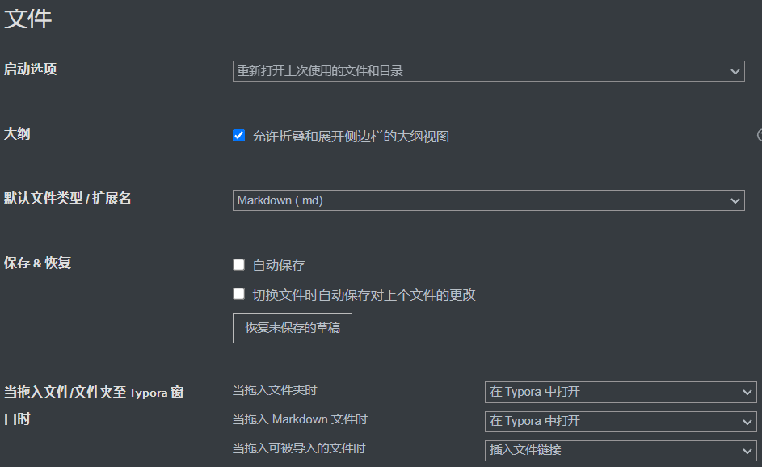
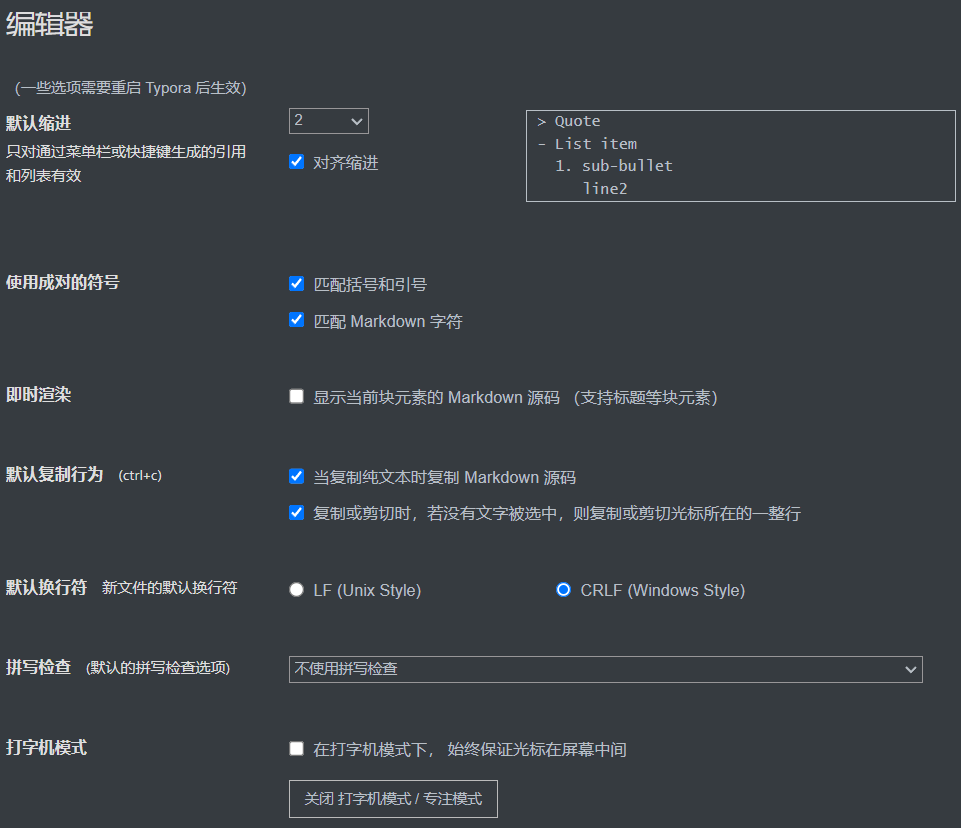
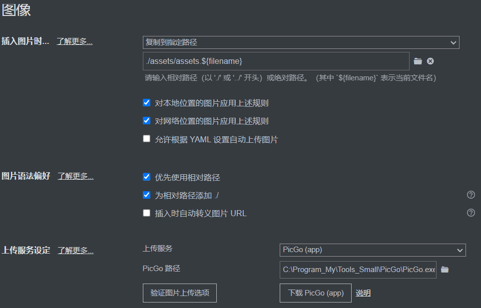
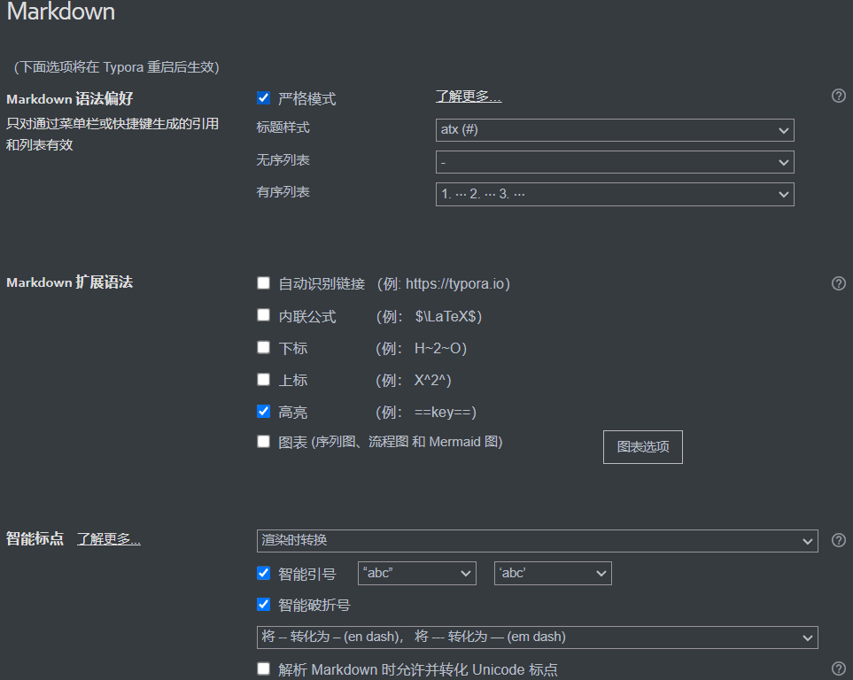
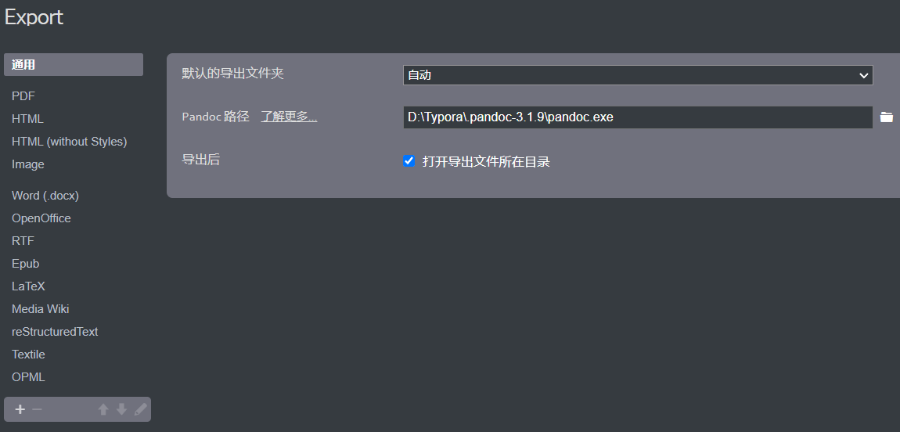

markdown语法

## 设置

### 文件




### 编辑器



### 图像



### MarkDown




### 导出




```c
// conf.user.json

/** For advanced users. */
{
  "defaultFontFamily": {
    "standard": null, //String - Defaults to "Times New Roman".
    "serif": null, // String - Defaults to "Times New Roman".
    "sansSerif": null, // String - Defaults to "Arial".
    "monospace": null // String - Defaults to "Courier New".
  },
  "autoHideMenuBar": false, //Boolean - Auto hide the menu bar unless the `Alt` key is pressed. Default is false.

  // Array - Search Service user can access from context menu after a range of text is selected. Each item is formatted as [caption, url]
  "searchService": [
    ["Search with Google", "https://google.com/search?q=%s"]
  ],

  // Custom key binding, which will override the default ones.
  // see https://support.typora.io/Shortcut-Keys/#windows--linux for detail
  "keyBinding": {
    // for example: 
    // "Always on Top": "Ctrl+Shift+P"
    // All other options are the menu items 'text label' displayed from each typora menu
	"Always on Top": "Ctrl+Shift+P"
	"Highlight": "Ctrl+Q"
	
  },

  "monocolorEmoji": false, //default false. Only work for Windows
  "maxFetchCountOnFileList": 500,
  "flags": [] // default [], append Chrome launch flags, e.g: [["disable-gpu"], ["host-rules", "MAP * 127.0.0.1"]]
}

```


```c
/** conf.default.json */
/** For advanced users. */
{
  "defaultFontFamily": {
    "standard": null, //String - Defaults to "Times New Roman".
    "serif": null, // String - Defaults to "Times New Roman".
    "sansSerif": null, // String - Defaults to "Arial".
    "monospace": null // String - Defaults to "Courier New".
  },
  "autoHideMenuBar": false, //Boolean - Auto hide the menu bar unless the `Alt` key is pressed. Default is false.

  // Array - Search Service user can access from context menu after a range of text is selected. Each item is formatted as [caption, url]
  "searchService": [
    ["Search with Google", "https://google.com/search?q=%s"]
  ],

  // Custom key binding, which will override the default ones.
  // see https://support.typora.io/Shortcut-Keys/#windows--linux for detail
  "keyBinding": {
    // for example: 
    // "Always on Top": "Ctrl+Shift+P"
    // All other options are the menu items 'text label' displayed from each typora menu
  },

  "monocolorEmoji": false, //default false. Only work for Windows
  "maxFetchCountOnFileList": 500,
  "flags": [] // default [], append Chrome launch flags, e.g: [["disable-gpu"], ["host-rules", "MAP * 127.0.0.1"]]
}

```


## 插件

https://github.com/obgnail/typora_plugin?tab=readme-ov-file

```c
blockquote {
    padding-left: 1.875rem;
    margin: 0 0 1.875rem 0.875rem;
    border-left: solid 4px #474d54;
    border-color: #777;
    padding-left: 10px;
    margin-top: 35px;
    color: #c31919;
    background: #4a3b6c;
```


****

## 目录TOC

[TOC]

## 链接\[]()

：[链接(baidu.com)](www.baidu.com)

## 图片\

**markdown**：

**HTML**格式：`onsidian好像不支持img？`

URL格式	：直接显示连接


## 视频

\<video id="video" controls="" src="D:\cache\Dvideo\WeChat_20210410204126.mp4" preload="none">


## 字体颜色

<font color="#dd0000">

：<font color="#dd0000">红色</font>

\$\color{#dd0000}{红色}$

$\color{#dd0000}{红色}$

## 字体大小size

<font size="1">

：<font size="1">size=1</font>

<font size=4>size=4</font>,

<font size=8>size=8</font>

## 背景色

：<table >
    <tr bgcolor="#54ff9f">
        <td bgcolor="#54ff9f">三段式</td>

<table >
    <tr bgcolor="#54ff9f">
        <td bgcolor="#54ff9f">三段式</td>
    </tr>
</table>


<table ><tr><td bgcolor="#54ff9f">三段式</td></tr></table>你好


## 风割线颜色

html标签--- <hr>horizontal rule

hr style="border-color: red，在obsidian中才有效

<hr style="border-color: red;">


\<hr style="background-color: red; height: 5px;">

<hr style="background-color: red; height: 5px;">hr style="background-color: red; height: 5px;


<hr style="background-color: red;height: 1px;">hr style="background-color: red;height: 1px;在obsidian中宽度至少为3px；


## 下划线u

HTML元素：<u>HTML元素：U</u>

内联公式  ：$\underline {a十多个}$	$\underline {underline }$


## 上划线overline

$\overline {overline }$

$\over {over}$

## 上标下标

A<sub>sub</sub>  、 A~~~

A<sup>sup</sup> 、A^^^

> 有些软件只能有sub、sup、或者$公式$、`行内式`

## ·公式
<sup>⍺
内联公式，上标只需要一个脚号：

$Q^n+1^ = J \overline {Q^n} + \overline K Q^n$

$$
Q^n+1 = J \overline {Q^n} + \overline K Q^n \tag{1}
$$

$$
最小电阻条宽：W_{R,min} = I_max \sqrt[2]{\frac{R_s}{R_{A,max}}} \tag{2}
$$


$$
\begin{align}
x &= y + z \tag{1}\\ 
&= a + b + c \\
&= m \cdot n
\end{align}
$$

- 
  上标：	A^a

- 下标：	A_a

- 分数：	\frac  {分母}{分子}

- 开根号：\sqrt  [n]{x}

- 上划线：\overline {}

- 序号	：\tag  {数字}


## 空格与空行

空格;注意后面一定要加**英文分号**

&nbsp;\&nbsp;空格

&ensp;\&ensp;一个字符

&emsp;\&emsp;俩个字符

空行br<br/><br><br>空俩行

<hr>


## 按钮kbd

<kbd>niah </kbd>

## emoji表情符号

https://www.webpagefx.com/tools/emoji-cheat-sheet/

## 特殊符号

https://unicode-table.com/cn/

🩰

🥰
🥰
<⍺